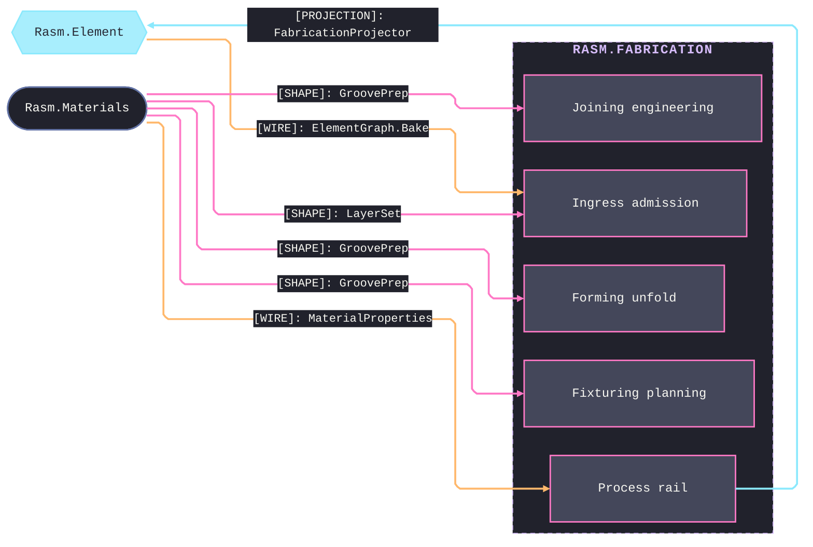
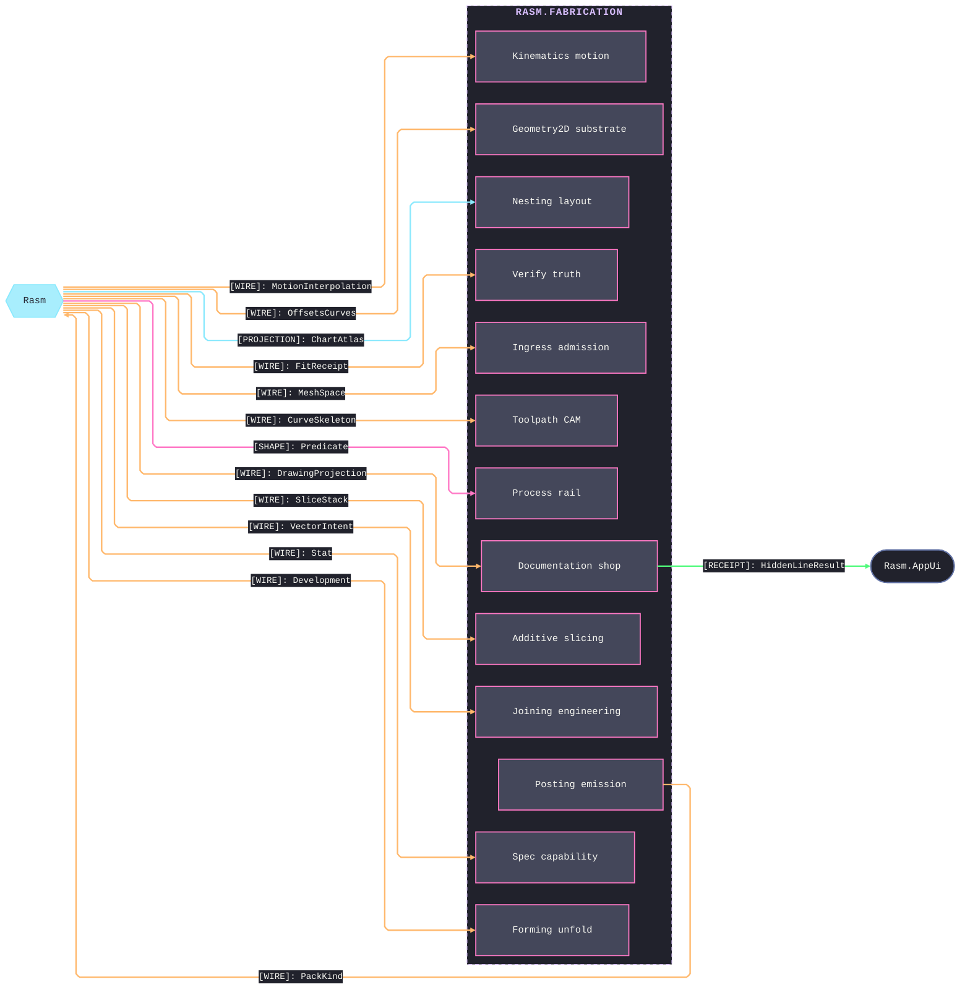

# [FABRICATION_ARCHITECTURE]

`Rasm.Fabrication` maps host-neutral production fabrication over `{Rasm, Rasm.Element}`: each sub-domain folder owns exactly one namespace, and one polymorphic owner closes the whole concern over the `FabricationPolicy`/`FabricationResult` pair. Every flagship terminates in a content-keyed machine-consumable artifact: egress collapses onto the entry vocabulary through the `EgressKind` discriminant, whose one content-key fold seeds the kernel `ContentHash.Of`. This package depends up on the element seam through the `FabricationProjector : IElementProjection` registration and references no AEC peer — alignment travels through seam contracts and the content-keyed wire.

## [01]-[DOMAIN_MAP]

```text codemap
Rasm.Fabrication/
├── Process/                 # Entry vocabulary, axes, physics, rail, and plan orchestrator
│   ├── Owner.cs             # Fabrication entry owner and atoms vocabulary
│   ├── Family.cs            # ProcessKind and Machine axis families
│   ├── Physics.cs           # Material identity carrying per-modality physics and the removal budget
│   ├── Faults.cs            # FabricationFault band-2700 registry entrypoint
│   └── Derivation.cs        # RunDerive plan orchestrator
├── Tooling/                 # ISO-13399 tool intelligence, machinability, and wear
│   ├── Magazine.cs          # Provider-detached ToolAssembly owner, kitting, and the ordered multi-basis life schedule
│   ├── CuttingData.cs       # Kienzle machinability seeds and cutter-form projection on typed evidence rails
│   └── Wear.cs              # Taylor flank-wear, per-edge budgets, and condition-based remaining-life estimation
├── Geometry2D/              # 2D substrate: line, arc, and parametric-curve lanes
│   ├── Algebra.cs           # Clipper2 line-space owner: offset, boolean clip, area, Minkowski
│   ├── Arcs.cs              # CavalierContours arc-space owner with kerf, lead, and adaptive offsets
│   └── Curves.cs            # Parametric-curve substrate owner
├── Ingress/                 # Everything entering as geometry
│   ├── Profile.cs           # DXF/DWG profile arm of the polymorphic Ingress.Admit fold
│   ├── Solid.cs             # STEP/IGES/STL B-rep ingress into kernel mesh admission
│   ├── Steel.cs             # DSTV NC1 read arm into the loop projection
│   └── Element.cs           # ElementGraph.Bake arm into the admitted-component representation
├── Toolpath/                # Subtractive CAM
│   ├── Motion.cs            # ProcessModality and CutStrategy generator arms
│   ├── Surface.cs           # OpenCAMLib cutter positioning over kernel on-mesh path layout
│   ├── Partition.cs         # SharpVoronoiLib Fortune/Lloyd region decomposition
│   ├── Guard.cs             # Swept tool-plus-holder gouge and collision guard per feed move
│   ├── Skeleton.cs          # Trochoidal constant-engagement walk over the kernel clearance family
│   ├── Turning.cs           # Lathe cycle union: face, rough, finish, groove, thread, part
│   ├── Wire.cs              # Wire-EDM cycle union: contour, taper, four-axis, no-core, collar
│   ├── Link.cs              # Rapid-travel minimization
│   └── Bevel.cs             # Per-edge bevel-type coupled condition rows
├── Kinematics/              # Motion topology and the fleet registry
│   ├── Cell.cs              # Robots serial-chain cell solve with per-manufacturer posts
│   ├── Machine.cs           # 5-axis rotary inverse and TCP/RTCP; owns the motion-dynamics law
│   └── Fleet.cs             # Machine-capability registry
├── Additive/                # Production 3DP
│   ├── Slicing.cs           # FFF/DED planar slicing over the kernel slice stack
│   ├── Implicit.cs          # PicoGK implicit voxel TPMS, lattice, and resin-powder lanes
│   ├── Production.cs        # Build orientation, machine profiles, and 3MF egress
│   ├── ScanPath.cs          # LPBF hatch union: meander, stripe, island, hexagon
│   └── Support.cs           # Overhang census, accumulation, and interface carve
├── Nesting/                 # Layout, yield, offcut lifecycle, and cut linking
│   ├── Nfp.cs               # NFP-feasibility true-shape nesting over stock inventory
│   ├── Stock.cs             # Rectangular cutting-stock yield engine
│   ├── Remnant.cs           # Offcut lifecycle partial
│   └── Linking.cs           # Cut-linking union: common-line, chain-cut, bridge, skeleton
├── Fixturing/               # Keep-out, setup, and assembly planning
│   ├── Workholding.cs       # Clamp and exclusion-zone keep-out family and the conditioning fold
│   ├── Setups.cs            # QuikGraph precedence scheduler owning setup-to-WCS assignment
│   └── Assembly.cs          # Join-precedence planning
├── Posting/                 # Machine-code emission
│   ├── Program.cs           # Dialect-neutral CutProgram AST and cut conditioning
│   ├── Dialect.cs           # Per-dialect emit over the PostDialect grammar family
│   └── Optimization.cs      # Feedrate, corner smoothing, and block-cap compaction over the AST
├── Verify/                  # Program-level truth
│   ├── Removal.cs           # PicoGK voxel material-removal verify into gouge/uncut/overcut receipts
│   ├── Probing.cs           # In-process metrology: probe rows, ICP datum best-fit, conformance verdicts
│   ├── Simulate.cs          # Modal-state execution walk over the parsed CutProgram
│   ├── Estimation.cs        # Cost estimation from the fabrication result
│   └── Audit.cs             # Additive layer-stack pre-flight
├── Spec/                    # Production specs
│   ├── Tolerance.cs         # Generated ISO 286 fits, admitted GD&T frames, datum targets, composites, and ISO 1302 texture
│   ├── Capability.cs        # Capability intervals, variables SPC, fitted dependence, correlated stackup, and history gates
│   └── Manufacturability.cs # Cross-modality DfM evidence and typed ranked process routing
├── Documentation/           # Shop documentation
│   ├── Projection.cs        # Kernel hidden-line/silhouette projection over an arrangement-fold watertight source
│   ├── Traveler.cs          # DAG-normalized content-keyed traveler over the typed receipt corpus
│   └── Report.cs            # Staged inspection, EN 10204, NDT, NCR, calibration, and declaration quality records
├── Forming/                 # Sheet forming
│   ├── Sheet.cs             # One unfold owner
│   ├── Brake.cs             # Best-first bend-sequence planning over the feasibility matrix
│   └── Tube.cs              # Tube centerline fold, elongation carry, and cope development
└── Joining/                 # Weld engineering
    ├── Weld.cs              # Joint-by-prep composition over boundary-resolved groove facts
    ├── Sequence.cs          # Distortion ordering: backstep, skip-weld, balanced, block
    └── Procedure.cs         # WPS/PQR essential-variable rows and the heat-input compliance gate
```

Sub-domain dependencies form an acyclic graph. `Process` is the one ratified exception, read as two ledger nodes — an upstream atoms vocabulary every plane reads and a terminal dispatch nothing composes — without splitting the physical page. Cycles break by construction rather than back-edges: a discriminant shared across planes mints on the atoms vocabulary, and residual or verdict state carries forward as policy-case input, never a return edge. Per-flagship wired pipelines — the guards, conditioning, and stage rails each `Run` case composes — lives on the owning implementation pages.

## [02]-[SEAMS]





## [03]-[FAULT_REGISTRY]

`FabricationFault` is one `[Union]` on the `FaultBand.Fabrication` band `Rasm.Element` owns. Each sub-domain folder owns its fault arms and lowers them onto the band; a folder producing no fault leaves its lane receipt-only, and projection routes the kernel geometry fault rather than minting its own. `Process/faults` owns the arm-to-code allocation and the band's free frontier; the arms preserving wire-code decode from before the folder partition retype in place, never reallocate.

## [04]-[CROSS_PACKAGE]

Seam edges carry which package exchanges which shape; the load-bearing cross-package invariants are:
- Every machine-consumable egress mints its content key through the kernel `ContentHash.Of` seed-zero entry, with no second mint.
- `EgressKind`, the local discriminant, federates to the Persistence `ArtifactKind` rows at the content-key boundary, never a type reference.
- `Fabrication` realizes the one `FabricationProjector` registration; every quantity lowered back to the seam rides that projector.
- A not-yet-landed peer capability binds as an injected delegate column that closes when the counterpart lands, so the contract is designed whole.
- Machine telemetry enters through the AppHost decode lane, never a direct transport reference; every telemetry read consumes the one decoded slice.
