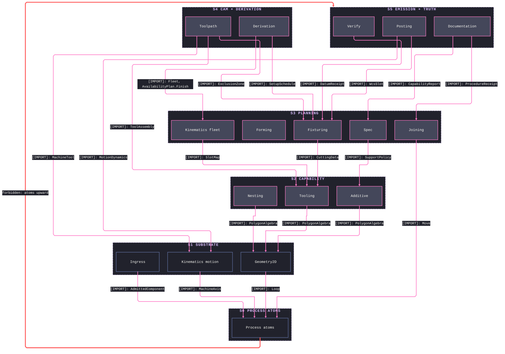
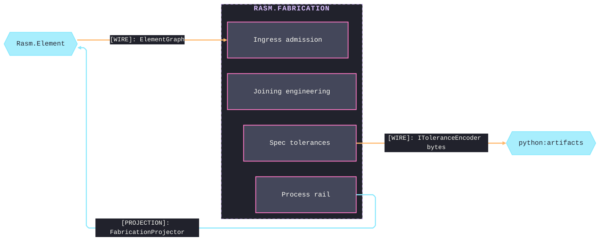
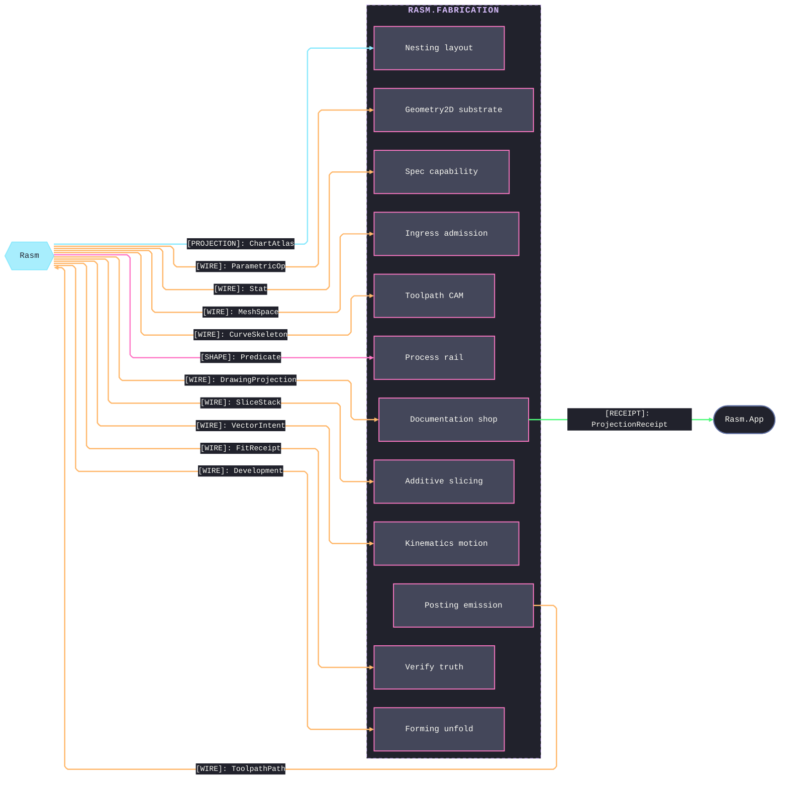

# [FABRICATION_ARCHITECTURE]

`Rasm.Fabrication` maps host-neutral production fabrication over `{Rasm, Rasm.Element}`. Each sub-domain owns one namespace and one polymorphic owner over `FabricationPolicy`/`FabricationResult`. Every flagship terminates in a content-keyed machine artifact; `EgressKind` collapses egress onto entry vocabulary, and its fold seeds `ContentHash.Of`. `FabricationProjector : IElementProjection` is the sole Element dependency; AEC alignment crosses seam contracts and the content-keyed wire.

## [01]-[DOMAIN_MAP]

```text codemap
Rasm.Fabrication/
├── Process/                 # Entry vocabulary, axes, physics, rail, and plan orchestrator
│   ├── Owner.cs             # Fabrication entry owner and atoms vocabulary
│   ├── Family.cs            # ProcessKind and Machine axis families
│   ├── Physics.cs           # Material identity carrying per-modality physics and the removal budget
│   ├── Faults.cs            # FabricationFault band-2700 registry entrypoint
│   └── Derivation.cs        # RunDerive plan orchestrator
├── Tooling/                 # ISO-13399 tool intelligence, machinability, and wear
│   ├── Magazine.cs          # Provider-detached ToolAssembly owner, correspondence tables, typed-shortfall kitting, and ordered life scheduling
│   ├── CuttingData.cs       # Kienzle seeds, evidence-domain guard, power-law fit, and cutter-form projection on typed evidence rails
│   └── Wear.cs              # Taylor flank-wear, per-edge budgets, and condition-based remaining-life estimation
├── Geometry2D/              # 2D substrate: line, arc, and parametric-curve lanes
│   ├── Algebra.cs           # Clipper2 line-space operation algebra: topology, open runs, morphology, inspection, and field planes
│   ├── Arcs.cs              # CavalierContours arc-space owner with kerf, lead, and adaptive offsets
│   └── Curves.cs            # Parametric-curve substrate owner
├── Ingress/                 # Everything entering as geometry
│   ├── Profile.cs           # DXF/DWG census, lane resolution, OCS-correct contour healing, region nesting, and projected receipt ingress
│   ├── Solid.cs             # STEP/IGES/STL/3DM/3MF unit-resolved mesh admission, conditioning, topology evidence, and kernel repair
│   ├── Steel.cs             # DSTV NC1 path, text, or byte admission into arc-aware steel, topology, and face placement
│   └── Element.cs           # ElementGraph single or batch bake into component, connection, relation, and fact receipts
├── Toolpath/                # Subtractive CAM
│   ├── Motion.cs            # ProcessModality and CutStrategy generator arms
│   ├── Surface.cs           # OpenCAMLib cutter positioning over kernel on-mesh path layout
│   ├── Partition.cs         # Seeded Voronoi cells with border, centroid, and Lloyd-residual evidence
│   ├── Guard.cs             # Scope-stamped planar, medial, voxel, and robot collision receipt
│   ├── Skeleton.cs          # Per-component constant-engagement walk over the kernel clearance family
│   ├── Turning.cs           # Controller-neutral lathe algebra: CutSide-owned sweep, plunge, axial, thread, knurl, transfer
│   ├── Wire.cs              # Wire-EDM demand: closed cycle, registered guides, wire bow, retention, recovery, simultaneous blocks
│   ├── Link.cs              # Precedence-aware closed tour, tool/setup-aware objective, volumetric keepouts, guarded segment routing
│   └── Bevel.cs             # Station-varying section law, thermal/abrasive head compensation, coupled THC pass evidence
├── Kinematics/              # Motion topology and the fleet registry
│   ├── Cell.cs              # Robot targets, placement optimization over one loaded cell, compilation, library, and controller boundaries
│   ├── Machine.cs           # Parameterized machine-chain inverse by bounded least squares, TCP/RTCP, continuity, and motion dynamics
│   └── Fleet.cs             # Typed shop-capability, availability, tooling-state, and measured-performance registry
├── Additive/                # Production 3DP
│   ├── Slicing.cs           # FFF/DED planar slicing and the deposition-seed modality roster
│   ├── Implicit.cs          # PicoGK implicit voxel TPMS, lattice, VDB round-trip, and resin-powder lanes
│   ├── Production.cs        # Build orientation, machine profiles, and 3MF egress
│   ├── ScanPath.cs          # LPBF hatch union: meander, stripe, island, hexagon
│   └── Support.cs           # Overhang census, accumulation, and interface carve
├── Nesting/                 # Layout, yield, offcut lifecycle, and cut linking
│   ├── Nfp.cs               # NFP-feasibility true-shape nesting over stock inventory
│   ├── Stock.cs             # Rectangular cutting-stock yield engine
│   ├── Remnant.cs           # Offcut lifecycle partial
│   └── Linking.cs           # Cut-linking union: common-line, chain-cut, bridge, skeleton
├── Fixturing/               # Keep-out, setup, and assembly planning
│   ├── Workholding.cs       # Clamp and exclusion-zone keep-out family and the conditioning fold
│   ├── Setups.cs            # QuikGraph precedence scheduler owning setup-to-WCS assignment
│   └── Assembly.cs          # Join-precedence planning
├── Posting/                 # Machine-code emission
│   ├── Program.cs           # Dialect-neutral CutProgram AST, program admission, modal interpretation, and cut conditioning
│   ├── Dialect.cs           # Per-dialect emit over the PostDialect grammar family
│   └── Optimization.cs      # Feedrate, corner smoothing, and block-cap compaction over the AST
├── Verify/                  # Program-level truth
│   ├── Removal.cs           # PicoGK voxel material-removal verify into gouge/uncut/overcut receipts
│   ├── Probing.cs           # In-process metrology: probe rows, ICP datum best-fit, conformance verdicts
│   ├── Simulate.cs          # Modal-state execution walk over the parsed CutProgram
│   ├── Estimation.cs        # Cost estimation from the fabrication result
│   └── Audit.cs             # Additive-owned layer-stack pre-flight
├── Spec/                    # Production specs
│   ├── Tolerance.cs         # ISO 286 limits, admitted GD&T frames, datum targets, composites, general classes, texture, and ranked stackup
│   ├── Capability.cs        # Capability intervals, variables SPC, fitted dependence, correlated stackup, and history gates
│   └── Manufacturability.cs # Provenance-graded DfM evidence, severity-gated verdicts, and objective-row ranked routing
├── Documentation/           # Shop documentation
│   ├── Projection.cs        # Kernel multi-view projection — hidden-line, silhouette, outline, and section runs over a watertight source
│   ├── Traveler.cs          # DAG-normalized content-keyed traveler over the typed receipt corpus
│   └── Report.cs            # Sampled inspection, EN 10204, NDT reconciliation, NCR lifecycle, calibration recall, and signed passport egress
├── Forming/                 # Sheet forming
│   ├── Sheet.cs             # One unfold owner
│   ├── Brake.cs             # Best-first bend-sequence planning over the feasibility matrix
│   └── Tube.cs              # Tube centerline fold, elongation carry, and cope development
└── Joining/                 # Weld engineering
    ├── Weld.cs              # Joint-by-prep composition over boundary-resolved groove facts
    ├── Sequence.cs          # Distortion ordering: backstep, skip-weld, balanced, block
    └── Procedure.cs         # WPS/PQR essential-variable rows and the heat-input compliance gate
```

Sub-domain dependencies are acyclic. Split packages declare ledger nodes without splitting pages: `Process` places atoms at S0 and terminal derivation at S4; `Kinematics` places motion at S1 and its consuming fleet at S3, and motion never reads fleet policy. Shared discriminants mint on atoms, while residual and verdict state flow forward as policy-case input. Per-flagship pipelines live on owning implementation pages.

## [02]-[STRATA]

Six strata order the sub-domains; split-package ledger nodes preserve one direction: `Process` places atoms at the floor and `Derivation` beside the CAM plane, while `Kinematics` places motion at S1 and its consuming fleet at S3. `Verify` parses the `CutProgram` AST `Posting` emits as a same-stratum fact; every cross-stratum consumption edge points down.

- S0 `Process` atoms — the one vocabulary floor: `FabricationPolicy`, `FabricationResult`, `EgressKind`, `ContentKey`, `Move`, `MotionDirective`, `SpecializedToolpathEnvelope`, `Loop`, `MaterialSpec`, `ProcessRange`, `EquipmentEnvelope`, and `FabricationFault`; every plane reads it, and it reads no sibling.
- S1 `Geometry2D` + `Ingress` + `Kinematics` motion — substrate lanes over the atoms alone: `PolygonAlgebra`, `ArcAlgebra`, and `CurveAlgebra`; the `Ingress.Admit` fold and `AdmittedGeometry`; `MachineTool`, `MachineKinematics`, and `RobotProgram`.
- S2 `Tooling` + `Nesting` + `Additive` — capability owners over the 2D algebra: `ToolAssembly`, `ToolSelection`, `CuttingData`, `PowerLawFit`, and `ToolWear`; `Nest`, `StockNest`, and `NoFitPolygon`; `Slice`, `SupportPolicy`, `ScanPolicy`, and `Audit`.
- S3 `Fixturing` + `Forming` + `Joining` + `Spec` + `Kinematics` fleet — planning owners: `Workholding`, `ExclusionZone`, and `SetupSchedule`; `FlatPattern` and `TubeProgram`; `Weld`, `JointPrep`, `Sequence`, and `Procedure`; `Tolerance`, `Capability`, and `Manufacturability`; `MachineInstance`, `ProcessEnvelope`, and `Fleet`.
- S4 `Toolpath` + `Process/Derivation` — the CAM plane composing tools, kinematics, and keep-outs (`Cam`, `MotionRun`, `Guard`, `BevelPass`) beside the `Derivation`/`FabricationProjector` terminal aggregator over the downstream plans.
- S5 `Posting` + `Verify` + `Documentation` — emission and truth: the `CutProgram` AST and `Dialect` emit, the `Removal`/`Probe`/`Simulate` verifiers, and the `Hlr`/`Traveler`/`QualityReport` shop documents.

Same-stratum policy exchange among `Fixturing`, `Joining`, `Spec`, and the kinematics fleet carries no dependency-order edge; only their downstream consumers enter the stratum graph.



## [03]-[SEAMS]

`Toolpath/guard` owns every PicoGK voxel lease, and `Kinematics/cell` owns every Rhino3dm robot adapter; downstream receipts carry evidence and no native handle.

[POSTING]:
- `Posting/program` sends `CutProgram` and `EmitPolicy` to `Posting/dialect`; `PostImage` owns rendered records, bytes, physical count, and emitted `ContentKey`.
- `Toolpath` preserves controller instructions and specialized evidence through `MotionDirective`; `Posting/program` retains each directive in `GNode`, while `Posting/dialect` owns executable lowering or annotation spelling.
- `Posting/program` projects analytic `ProgramEvent.Motion` rows into the kernel `ToolpathPath`; line and arc spans share one `PackOp.Toolpath` carrier, and arc centre and sense remain digest-bearing channels.
- `Posting/program`, `Process/physics`, and `Tooling/cuttingdata` feed `Posting/optimization`; `OptimizationIngress` and `OptimizationEgress` close on `Fin<OptimizationResult>`.
- `Posting/dialect` lowers `GNode.CoordinateFrame` through `WcsSlot` into offset write and selection words.
- `Posting/optimization` prices every span through `MotionDynamics` rapid, feed, acceleration, and junction law.





## [04]-[FAULT_REGISTRY]

`FabricationFault` is one `[Union]` on the `FaultBand.Fabrication` band `Rasm.Element` owns. Each sub-domain folder owns its fault arms and lowers them onto the band; a folder producing no fault leaves its lane receipt-only, and projection routes the kernel geometry fault rather than minting its own. `Process/faults` owns the arm-to-code allocation and the band's free frontier; the arms preserving wire-code decode from before the folder partition retype in place, never reallocate.

Every `FabricationFault` case declares its owning `FabConcern` and stratum, so receipts partition without a second table; degenerate fixture geometry routes through `GeometryFault.DegenerateInput`.

## [05]-[CROSS_PACKAGE]

Seam edges carry which package exchanges which shape; the load-bearing cross-package invariants are:
- Every machine-consumable egress mints its content key through the kernel `ContentHash.Of` seed-zero entry, with no second mint.
- `EgressKind`, the local discriminant, federates to the Persistence `ArtifactKind` rows at the content-key boundary, never a type reference.
- `Fabrication` realizes the one `FabricationProjector` registration; every quantity lowered back to the seam rides that projector.
- An absent peer capability binds as an injected delegate column, so the contract remains whole without an implementation-shape dependency.
- Machine telemetry enters through the AppHost decode lane, never a direct transport reference; every telemetry read consumes the one decoded slice.
