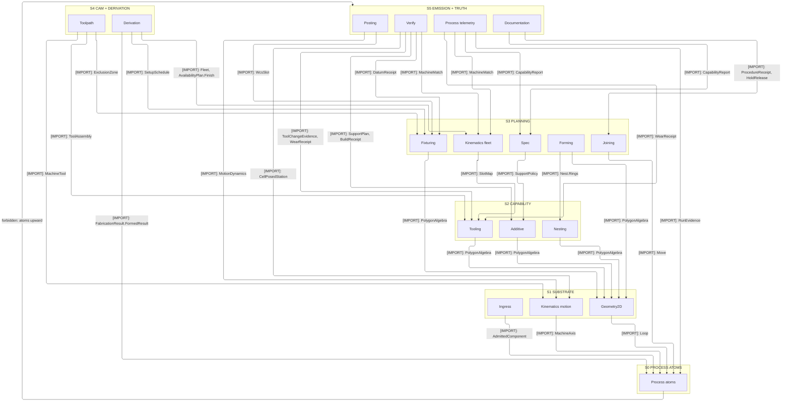
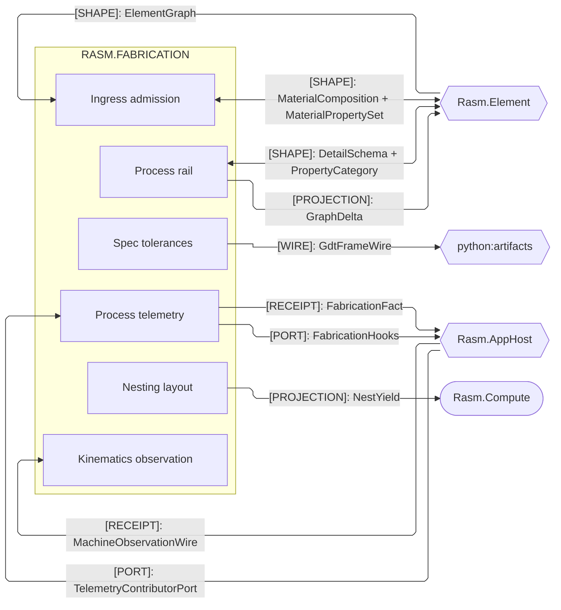
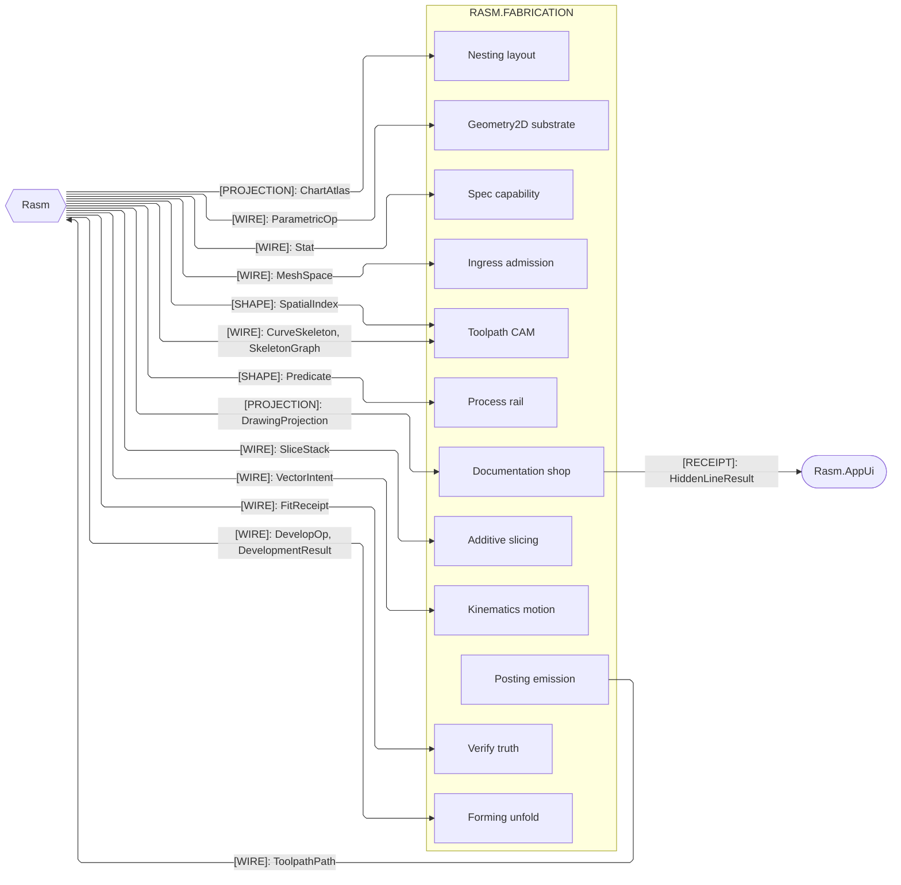

# [FABRICATION_ARCHITECTURE]

`Rasm.Fabrication` maps host-neutral production fabrication over `{Rasm, Rasm.Element}`. Each sub-domain owns one namespace and one polymorphic owner over `FabricationPolicy`/`FabricationResult`. Every flagship terminates in a content-keyed machine artifact; `EgressKind` collapses egress onto entry vocabulary, and its fold seeds `ContentHash.Of`. `FabricationProjector : IElementProjection` is the sole Element dependency; AEC alignment crosses seam contracts and the content-keyed wire.

## [01]-[DOMAIN_MAP]

```text codemap
Rasm.Fabrication/
├── Process/                 # Entry vocabulary, axes, physics, rail, and plan orchestrator
│   ├── Owner.cs             # Fabrication entry owner and atoms vocabulary
│   ├── Family.cs            # ProcessKind and Machine axis families
│   ├── Physics.cs           # Material identity carrying per-modality physics and the removal budget
│   ├── Faults.cs            # FabricationFault registry over the FaultBand.Fabrication band
│   ├── Derivation.cs        # Derivation.Apply plan orchestrator
│   └── Telemetry.cs         # FabricationFact union, rasm.fabrication.* instrument roster, projection fan, solver span scopes, descriptor pack
├── Tooling/                 # ISO-13399 tool intelligence, machinability, and wear
│   ├── Magazine.cs          # Provider-detached ToolAssembly owner, correspondence tables, typed-shortfall kitting, and ordered life scheduling
│   ├── CuttingData.cs       # Kienzle seeds, evidence-domain guard, power-law fit, stability recommendation, cutter-form projection
│   └── Wear.cs              # Taylor flank-wear, per-edge budgets, and condition-based remaining-life estimation
├── Geometry2D/              # 2D substrate: line, arc, and parametric-curve lanes
│   ├── Algebra.cs           # Clipper2 line-space operation algebra: topology, open runs, morphology, inspection, and field planes
│   ├── Arcs.cs              # CavalierContours arc-space owner with kerf, lead, and adaptive offsets
│   └── Curves.cs            # Parametric-curve substrate owner
├── Ingress/                 # Everything entering as geometry
│   ├── Profile.cs           # DXF/DWG census, lane resolution, OCS-correct contour healing, region nesting, and the Ingress.Admit fold
│   ├── Solid.cs             # STEP/IGES/STL/3DM/3MF unit-resolved mesh admission, conditioning, topology evidence, and kernel repair
│   ├── Steel.cs             # DSTV NC1 path, text, or byte admission into arc-aware steel, topology, and face placement
│   └── Element.cs           # ElementGraph single or batch bake into component, connection, relation, and fact receipts
├── Toolpath/                # Subtractive CAM
│   ├── Motion.cs            # ProcessModality and CutStrategy generator arms
│   ├── Surface.cs           # OpenCAMLib cutter positioning over kernel on-mesh path layout
│   ├── Partition.cs         # Generative site field to boundary-clipped cells, density closure, bound-gated 3D complex
│   ├── Guard.cs             # Scope-stamped planar, medial, voxel, and robot collision receipt
│   ├── Skeleton.cs          # Per-component constant-engagement walk over the kernel clearance family
│   ├── Turning.cs           # Controller-neutral lathe algebra: CutSide-owned sweep, plunge, axial, thread, knurl, transfer
│   ├── Wire.cs              # Wire-EDM demand: closed cycle, registered guides, wire bow, retention, recovery, simultaneous blocks
│   ├── Link.cs              # Precedence-safe refined closed tour, tool/setup objective, volumetric keepouts, guarded routing
│   └── Bevel.cs             # Station-varying section law, thermal/abrasive head compensation, coupled THC pass evidence
├── Kinematics/              # Motion topology, the decoded observation slice, and the fleet registry
│   ├── Cell.cs              # Robot targets, placement search, compilation, the planner timing census, library and controller boundaries
│   ├── Machine.cs           # Parameterized machine-chain inverse by bounded least squares, TCP/RTCP, continuity, and motion dynamics
│   ├── Observation.cs       # MachineObservation decoded-telemetry union, execution and condition vocabularies, and the machine-scoped window
│   └── Fleet.cs             # Typed shop-capability, generated availability, tooling state, measured performance, finite-capacity assignment
├── Additive/                # Production 3DP
│   ├── Slicing.cs           # FFF/DED planar slicing and the deposition-seed modality roster
│   ├── Implicit.cs          # PicoGK implicit voxel TPMS, lattice, VDB round-trip, and resin-powder lanes
│   ├── Production.cs        # Build orientation, machine profiles, and 3MF egress
│   ├── ScanPath.cs          # LPBF hatch union: meander, stripe, island, hexagon
│   └── Support.cs           # Overhang census, accumulation, and interface carve
├── Nesting/                 # Layout, yield, offcut lifecycle, and cut linking
│   ├── Nfp.cs               # NFP-feasibility true-shape nesting over stock inventory
│   ├── Stock.cs             # Rectangular cutting-stock yield engine
│   ├── Remnant.cs           # Offcut lifecycle: reconcile, lease, transition, retire, and yield
│   └── Linking.cs           # Cut-linking union: common-line, chain-cut, bridge, skeleton
├── Fixturing/               # Keep-out, setup, and assembly planning
│   ├── Workholding.cs       # Clamp and exclusion-zone keep-out family and the conditioning fold
│   ├── Setups.cs            # QuikGraph precedence scheduler owning setup-to-WCS assignment
│   └── Assembly.cs          # Join-precedence planning
├── Posting/                 # Machine-code emission
│   ├── Program.cs           # Dialect-neutral CutProgram AST, program admission, modal interpretation, and cut conditioning
│   ├── Dialect.cs           # Per-dialect emit over the PostDialect grammar family
│   └── Optimization.cs      # Feedrate, corner smoothing, and block-cap compaction over the AST
├── Verify/                  # Program-level truth
│   ├── Removal.cs           # PicoGK voxel material-removal verify into gouge/uncut/overcut receipts
│   ├── Probing.cs           # In-process metrology: probe rows, ICP datum best-fit, conformance verdicts
│   ├── Simulate.cs          # Modal-state execution walk over the parsed CutProgram
│   ├── Estimation.cs        # Cost and carbon estimation into parallel signed ledgers
│   └── Audit.cs             # Layer-stack pre-flight over the additive raster census
├── Spec/                    # Production specs
│   ├── Tolerance.cs         # ISO 286 limits, admitted GD&T frames, datum targets, composites, general classes, texture, and ranked stackup
│   ├── Capability.cs        # Capability intervals, variables SPC, fitted dependence, correlated stackup, and history gates
│   └── Manufacturability.cs # Provenance-graded DfM evidence, severity-gated verdicts, and objective-row ranked routing
├── Documentation/           # Shop documentation
│   ├── Projection.cs        # Kernel multi-view projection — hidden-line, silhouette, outline, and section runs over a watertight source
│   ├── Traveler.cs          # DAG-normalized content-keyed traveler over the typed receipt corpus
│   └── Report.cs            # Sampled inspection, EN 10204, NDT, NCR lifecycle, calibration recall, shop schedules, signed passport egress
├── Forming/                 # Sheet forming
│   ├── Sheet.cs             # One unfold owner
│   ├── Brake.cs             # Best-first bend-sequence planning over the feasibility matrix
│   └── Tube.cs              # Tube centerline fold, elongation carry, and cope development
└── Joining/                 # Weld engineering
    ├── Weld.cs              # Joint-by-prep bead-lattice composition over boundary-resolved groove facts and the arc-fit gate
    ├── Sequence.cs          # Distortion ordering and the inherent-strain displacement receipt its consumers share
    └── Procedure.cs         # WPS/PQR essential variables, heat-input compliance, inspection scope, and the hold-point plan
```

Sub-domain dependencies are acyclic. Split packages declare ledger nodes without splitting pages: `Process` places atoms at S0, terminal derivation at S4, and the telemetry fact fan at S5; `Kinematics` places motion at S1 and its consuming fleet at S3, and motion never reads fleet policy. Shared discriminants mint on atoms, while residual and verdict state flow forward as policy-case input. Atoms carrying a plane's payload name that plane's type and reach none of its behaviour — `FabricationPolicy` cases and `SpecializedToolpathRow` hold upper-plane rows this way, so the floor stays behaviourally acyclic without a parallel S0 vocabulary. Per-flagship pipelines live on owning implementation pages.

## [02]-[STRATA]

Six strata order the sub-domains; split-package ledger nodes preserve one direction: `Process` places atoms at the floor and `Derivation` beside the CAM plane, while `Kinematics` places motion at S1 and its consuming fleet at S3. `Verify` parses the `CutProgram` AST `Posting` emits as a same-stratum fact; every cross-stratum consumption edge points down.

- S0 `Process` atoms — the one vocabulary floor; every plane reads it, and it reads no sibling.
- S0 run rail — `FabricationPolicy`, `FabricationResult`, `EgressKind`, `ContentKey`, and the `FabricationFault` refusal band.
- S0 payload atoms — `Move` with `MoveOrientation`, `MotionDirective`, `SpecializedToolpathEnvelope` behind its admission factory, `Loop`.
- S0 equipment axes — `MaterialSpec`, `ProcessRange`, `EquipmentEnvelope`, `MachineAxis`, beside `FabricationCanon` and `QuantityArrow`.
- S1 `Geometry2D` — `PolygonAlgebra`, `ArcAlgebra`, and `CurveAlgebra`, substrate lanes over the atoms alone.
- S1 `Ingress` — the `Ingress.Admit` fold and `AdmittedGeometry`.
- S1 `Kinematics` — `MachineTool`, `MachineKinematics`, `RobotProgram`, `MachineObservation`; only `Kinematics/cell` reads `Robots`, provider-free.
- S2 `Tooling` — `ToolAssembly`, `ToolSelection`, `CuttingData`, `PowerLawFit`, and `ToolWear`, capability owners over the 2D algebra.
- S2 `Nesting` + `Additive` — `Nest`, `StockNest`, `NoFitPolygon`; `Slice`, `SupportPolicy`, `ScanPolicy`, `Audit`.
- S3 planning — `Fixturing`: `Workholding`, `ExclusionZone`, `SetupSchedule`; `Forming`: `FlatPattern`, `TubeProgram`.
- S3 planning — `Joining`: `Weld`, `JointPrep`, `Sequence`, `Procedure`; `Spec`: `Tolerance`, `Capability`, `Manufacturability`.
- S3 planning — `Kinematics` fleet: `MachineInstance`, `ProcessEnvelope`, `Fleet`.
- S4 `Toolpath` — the CAM plane composing tools, kinematics, and keep-outs: `Cam`, `MotionRun`, `Guard`, `BevelPass`, `CutSide`, `SamplingField`.
- S4 `Process/Derivation` — the `Derivation`/`FabricationProjector` terminal aggregator over the downstream plans.
- S5 `Posting` + `Verify` — the `CutProgram` AST and `Dialect` emit; the `Removal`/`Probe`/`Simulate` verifiers.
- S5 `Documentation` — the `Hlr`/`Traveler`/`QualityReport` shop documents.
- S5 `Process` telemetry — the `FabricationFact` fan projects settled receipts onto the `rasm.fabrication.*` instruments.

Same-stratum policy exchange among `Fixturing`, `Joining`, `Spec`, and the kinematics fleet carries no dependency-order edge; only their downstream consumers enter the stratum graph.


```mermaid
---
config:
  layout: elk
  flowchart:
    curve: linear
    padding: 25
---
flowchart TB
    accTitle: Rasm.Fabrication interior strata
    accDescr: Six stacked strata from the posting, verify, and documentation truth stratum through the CAM plane and derivation aggregator, the planning owners, the capability owners, and the substrate lanes onto the process atoms floor, every consumption edge downward and solid naming one sourced type, and one forbidden upward edge labeled as such.
    subgraph S5["S5 EMISSION + TRUTH"]
        Posting[Posting]
        Verify[Verify]
        Documentation[Documentation]
        Telemetry[Process telemetry]
    end
    subgraph S4["S4 CAM + DERIVATION"]
        Toolpath[Toolpath]
        Derivation[Derivation]
    end
    subgraph S3["S3 PLANNING"]
        Fixturing[Fixturing]
        Forming[Forming]
        Joining[Joining]
        Spec[Spec]
        Fleet[Kinematics fleet]
    end
    subgraph S2["S2 CAPABILITY"]
        Tooling[Tooling]
        Nesting[Nesting]
        Additive[Additive]
    end
    subgraph S1["S1 SUBSTRATE"]
        Geometry2D[Geometry2D]
        Ingress[Ingress]
        Motion[Kinematics motion]
    end
    subgraph S0["S0 PROCESS ATOMS"]
        Atoms[Process atoms]
    end
    Verify e2@-->|"[IMPORT]: DatumReceipt"| Fixturing
    Verify e29@-->|"[IMPORT]: CellPosedStation"| Motion
    Verify e32@-->|"[IMPORT]: SupportPlan, BuildReceipt"| Additive
    Verify e33@-->|"[IMPORT]: ToolChangeEvidence, WearReceipt"| Tooling
    Verify e34@-->|"[IMPORT]: MachineMatch"| Fleet
    Documentation e3@-->|"[IMPORT]: CapabilityReport"| Spec
    Toolpath e4@-->|"[IMPORT]: ToolAssembly"| Tooling
    Toolpath e5@-->|"[IMPORT]: MachineTool"| Motion
    Toolpath e6@-->|"[IMPORT]: ExclusionZone"| Fixturing
    Derivation e7@-->|"[IMPORT]: SetupSchedule"| Fixturing
    Derivation e8@-->|"[IMPORT]: Fleet, AvailabilityPlan.Finish"| Fleet
    Derivation e30@-->|"[IMPORT]: FabricationResult.FormedResult"| Atoms
    Fixturing e9@-->|"[IMPORT]: PolygonAlgebra"| Geometry2D
    Forming e31@-->|"[IMPORT]: PolygonAlgebra"| Geometry2D
    Forming e35@-->|"[IMPORT]: Nest.Rings"| Nesting
    Spec e10@-->|"[IMPORT]: SupportPolicy"| Additive
    Joining e11@-->|"[IMPORT]: Move"| Atoms
    Tooling e12@-->|"[IMPORT]: PolygonAlgebra"| Geometry2D
    Nesting e13@-->|"[IMPORT]: PolygonAlgebra"| Geometry2D
    Additive e14@-->|"[IMPORT]: PolygonAlgebra"| Geometry2D
    Geometry2D e15@-->|"[IMPORT]: Loop"| Atoms
    Ingress e16@-->|"[IMPORT]: AdmittedComponent"| Atoms
    Motion e17@-->|"[IMPORT]: MachineAxis"| Atoms
    Fleet e18@-->|"[IMPORT]: SlotMap"| Tooling
    Documentation e22@-->|"[IMPORT]: ProcedureReceipt, HoldRelease"| Joining
    Posting e23@-->|"[IMPORT]: WcsSlot"| Fixturing
    Posting e24@-->|"[IMPORT]: MotionDynamics"| Motion
    Telemetry e25@-->|"[IMPORT]: WearReceipt"| Tooling
    Telemetry e26@-->|"[IMPORT]: MachineMatch"| Fleet
    Telemetry e27@-->|"[IMPORT]: CapabilityReport"| Spec
    Telemetry e28@-->|"[IMPORT]: RunEvidence"| Atoms
    Atoms f1@-->|"forbidden: atoms upward"| S5
```

## [03]-[SEAMS]

`Toolpath/guard` owns every PicoGK voxel lease, and `Kinematics/cell` owns every Rhino3dm robot adapter; downstream receipts carry evidence and no native handle.

[KINEMATICS]:
- `Kinematics/cell` publishes `CellTiming` — station-ordinal elapsed and the planner cycle — as the one timing crossing.
- `Joining/sequence` keys that census onto its own `MotionKey` through `MotionTiming.Of`; neither end learns the other's key space.
- `Verify/simulate` proves its posed ledger against `CellAnimation.Cycle`, so both consumers read the planner's own clock.

[POSTING]:
- `Posting/program` sends `CutProgram` and `EmitPolicy` to `Posting/dialect`; `PostImage` owns rendered records, bytes, and the emitted `ContentKey`.
- `Toolpath` preserves controller instructions and evidence through `MotionDirective`; `Posting/program` retains each directive in `GNode`.
- `Posting/dialect` owns executable lowering or annotation spelling.
- `Posting/program` projects analytic `ProgramEvent.Motion` rows into the kernel `ToolpathPath`.
- Line and arc spans share one `PackOp.Toolpath` carrier; arc centre and sense stay digest-bearing channels.
- `Posting/program`, `Process/physics`, and `Tooling/cuttingdata` feed `Posting/optimization`.
- `OptimizationIngress` and `OptimizationEgress` close on `Fin<OptimizationResult>`.
- `Posting/dialect` lowers `GNode.CoordinateFrame` through `WcsSlot` into offset write and selection words.
- `Posting/optimization` prices every span through `MotionDynamics` rapid, feed, acceleration, and junction law.


```mermaid
---
config:
  layout: elk
  flowchart:
    curve: linear
    padding: 25
---
flowchart LR
    accTitle: Fabrication AEC-domain peer seams
    accDescr: Fabrication owners exchanging projector, graph, tolerance, yield, and telemetry contracts with the AEC peers and the artifacts plane.
    subgraph fabrication[RASM.FABRICATION]
        Process[Process rail]
        Telemetry[Process telemetry]
        Ingress[Ingress admission]
        Kinematics[Kinematics observation]
        Nesting[Nesting layout]
        Spec[Spec tolerances]
    end
    Element{{Rasm.Element}}
    Artifacts{{python:artifacts}}
    AppHost{{Rasm.AppHost}}
    Compute([Rasm.Compute])
    Process e1@-->|"[PROJECTION]: GraphDelta"| Element
    Element e2@-->|"[SHAPE]: ElementGraph"| Ingress
    Ingress e14@<-->|"[SHAPE]: MaterialComposition + MaterialPropertySet"| Element
    Process e15@<-->|"[SHAPE]: DetailSchema + PropertyCategory"| Element
    Spec e8@-->|"[WIRE]: GdtFrameWire"| Artifacts
    Telemetry e9@-->|"[RECEIPT]: FabricationFact"| AppHost
    AppHost e10@-->|"[PORT]: TelemetryContributorPort"| Telemetry
    Telemetry e11@-->|"[PORT]: FabricationHooks"| AppHost
    AppHost e12@-->|"[RECEIPT]: MachineObservationWire"| Kinematics
    Nesting e13@-->|"[PROJECTION]: NestYield"| Compute
```


```mermaid
---
config:
  layout: elk
  flowchart:
    curve: linear
    padding: 25
---
flowchart LR
    accTitle: Fabrication kernel and platform seams
    accDescr: Fabrication sub-domain owners consuming kernel geometry from Rasm, publishing the toolpath pack back into it, and delivering the hidden-line receipt to the app-platform UI package, one labeled edge per contract family.
    subgraph fabrication[RASM.FABRICATION]
        Process[Process rail]
        Ingress[Ingress admission]
        Geometry2D[Geometry2D substrate]
        Toolpath[Toolpath CAM]
        Additive[Additive slicing]
        Forming[Forming unfold]
        Kinematics[Kinematics motion]
        Nesting[Nesting layout]
        Spec[Spec capability]
        Verify[Verify truth]
        Documentation[Documentation shop]
        Posting[Posting emission]
    end
    Rasm{{Rasm}}
    AppUi([Rasm.AppUi])
    Rasm e1@-->|"[SHAPE]: Predicate"| Process
    Rasm e2@-->|"[WIRE]: MeshSpace"| Ingress
    Rasm e3@-->|"[WIRE]: ParametricOp"| Geometry2D
    Rasm e4@-->|"[WIRE]: CurveSkeleton, SkeletonGraph"| Toolpath
    Rasm e5@-->|"[WIRE]: SliceStack"| Additive
    Rasm e6@-->|"[WIRE]: DevelopOp, DevelopmentResult"| Forming
    Rasm e7@-->|"[WIRE]: VectorIntent"| Kinematics
    Rasm e9@-->|"[PROJECTION]: ChartAtlas"| Nesting
    Rasm e10@-->|"[WIRE]: Stat"| Spec
    Rasm e11@-->|"[WIRE]: FitReceipt"| Verify
    Rasm e12@-->|"[PROJECTION]: DrawingProjection"| Documentation
    Posting e13@-->|"[WIRE]: ToolpathPath"| Rasm
    Documentation e14@-->|"[RECEIPT]: HiddenLineResult"| AppUi
    Rasm e15@-->|"[SHAPE]: SpatialIndex"| Toolpath
```

## [04]-[FAULT_REGISTRY]

`FabricationFault` is one `[Union]` on the `FaultBand.Fabrication` band `Rasm.Element` owns, and every case is DECLARED at `Process/faults` — a same-named partial in a folder namespace is a distinct type the generated dispatch never reaches. Planes earn a case of their own only where the refusal carries evidence a caller acts on; every other refusal answers `PolicyInadmissible` threading the raising plane's concern. `Process/faults` owns the offset ledger and its free frontier, and a landed offset never reallocates.

Every case declares its owning `FabConcern`, whose row carries the plane's folder namespace and the stratum that plane occupies, so a split package states each of its planes truthfully and receipts partition without a second table. Degenerate geometry stays `GeometryFault.DegenerateInput` named by its real `Kind`; a policy, request, or parameter tuple failing its own admission gate is a contract failure and takes `PolicyInadmissible`, never a kernel-band borrow under a fabricated `Kind`.

## [05]-[BOUNDARIES]

Seam edges carry which package exchanges which shape; the load-bearing cross-package invariants are:
- `Analyze.Run` bindings freeze the kernel entry's two-type-parameter arity, query-first then subject; `Analyze.Query` and `Analyze.In` stay unbound.
- Every machine-consumable egress mints its content key through the kernel `ContentHash.Of` seed-zero entry, with no second mint.
- `EgressKind`, the local discriminant, federates to the Persistence `ArtifactKind` rows at the content-key boundary, never a type reference.
- `Fabrication` realizes the one `FabricationProjector` registration; every quantity lowered back to the seam rides that projector.
- Absent peer capability binds as an injected delegate column, so the contract remains whole without an implementation-shape dependency.
- Machine telemetry enters through the AppHost decode lane, never a direct transport reference.
- `Kinematics/observation` admits the decoded entities once; every measured consumer folds the one `MachineObservation` slice.
- Durable shop state rides the Persistence slot registry's contributed span as the `store.fabrication.<domain>.<verb>` family.
- Each owning page names its slot spellings as value federation, mounted as call-site data at the composition root.
- Solver memo truth content-keys through the same kernel mint the egress spine seeds.
- Runtime-carried `HybridCache` replays NFP pair polygons under `PairTable.Key` identities in process.
- Durable memo tier federates at the Persistence cache seam beside the benchmark index.
- Speed claims resolve against Persistence `BenchmarkRow` claims through the kernel `BenchClaim` keys `Toolpath/guard` mints.
- `AcceptedBenchmarkClaim` binds one result to the `HostEvidence` digest its pass stamped, taking judgment as an injected seam AppHost alone mints.
- `ProbeRoute.Measured` authorizes its parallel substrate only against an accepted claim, never against a roster row alone.
- Program delivery closes chain-of-custody by value: the cell drive receipt re-mints a content key from the exact controller-bound records.
- `Posting/dialect` `ProgramDelivery` proves transfer integrity by digest equality; the delivery fact rides the tap onto the receipt rail.
- Fabrication facts leave through the one `FabricationTap` port onto the AppHost receipt rail as `FabricationFact` envelopes.
- Settled verify receipts fire their own fact through that tap, which defaults silent so a headless caller emits nothing and branches nowhere.
- Money and carbon stay parallel dimensions on parallel instruments, and `ClockAttribution` names the clock's own source rather than a default.
- `TelemetryContributorPort` carries the `rasm.fabrication.*` instrument roster and board pack inward at composition; the mounting root proves both.
- `FabricationInstruments.Arms` kind-arm table merges onto the AppHost receipt fan beside its own arms.
- Classification federates by value to the suite `DataClassification` taxonomy — never a type reference in either direction.
- Fabrication hook points register on the AppHost hook registry at composition through the runtime-carried `FabricationHooks` roster.
- Hook modality and payload close at declaration; subscribers attach only at app roots.
- Solver spans ride `FabricationTrace.Scopes` — one `TraceScope` per `FabricationEngine` row — admitted into the composing root's kernel `SpanBand`.
- Meter scope stays `TelemetrySource.Fabrication`; neither grammar derives from the other.
- Every traced lane takes the band as a trailing nullable parameter beside its `FabricationTap`.
- Headless callers run untraced and silent — no ambient source, no branch of their own.
- Trace-based exemplars join the fabrication histograms to their solve traces.
- `FabricationDescriptors` binds one kernel `BoardPack` the contributor port carries to the AppHost alert rail and deploy-plane dashboard compile.
- Indicator, severity, panel, and burn vocabularies stay the kernel signal capsule's and cross as values, never re-decided here.
