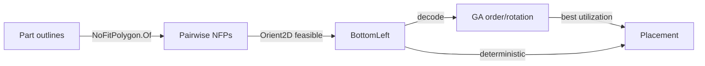

# [RASM_FABRICATION_NESTING]

Rasm.Fabrication nesting owner: the 2D true-shape nesting kernel — an author-kernel no-fit-polygon computation with a bottom-left + genetic placement fold packing part outlines onto a stock sheet. The kernel is authored from first principles — no admitted nesting library carries a robustness or license guarantee ([ADMISSIONS_RECORD]: UNesting immature rejected). It composes the kernel `Rasm/Geometry/geometry-kernel#ROBUST_PREDICATES` `Predicate.Orient2D` exact orientation as the NFP convex-merge and point-in-polygon floor, the `hidden-line#FABRICATION_OWNER` `Loop`/`FrontierPolicy.Nest`/`FrontierResult.Placement` shared frontier vocabulary, the sibling `toolpath#CAM_MOTION` `PartTransform` placement record, and `Rasm`/Vectors `Point3d`/`Vector3d`/`BoundingBox` primitives as native vocabulary — read public shapes, compose, NEVER re-mint. The nesting kernel is dispatched by the `hidden-line#FABRICATION_OWNER` `Run` fold's `Nest` policy case; it mints no second frontier surface, computes no hash, and operates on raw coordinate doubles at the kernel interior because a coordinate is the domain's native scalar ([R1]), never a unit-bearing quantity.

Wire posture: HOST-LOCAL, no TS_PROJECTION cluster. The `Placement` transforms cross only the in-process seam to a sheet emitter — never a browser or peer wire. The `SheetBounds`/`NestPolicy`/`NoFitPolygon` records are host-local types that never sit between wire and rail.

## [1]-[INDEX]

| [INDEX] | [CLUSTER] | [OWNS]                                                                                          |
| :-----: | :-------- | :--------------------------------------------------------------------------------------------- |
|   [1]   | NESTING   | Author-kernel no-fit-polygon (NFP) computation; bottom-left + genetic placement fold; one nesting owner over the NFP |

## [2]-[NESTING]

- Owner: `SheetBounds` the stock sheet extents the parts pack onto; `NestPolicy` the placement knobs (rotation step count, GA population, generations, mutation rate, the bottom-left-vs-genetic discriminant); `NoFitPolygon` the author-kernel sliding-locus polygon — the set of reference positions where part B touches but never overlaps part A, the canonical primitive every 2D true-shape nesting heuristic reads; `Nest` the static placement fold building each part-pair NFP and folding the parts onto the sheet by the bottom-left or genetic-ordered heuristic; the `Placement` result carrying the per-part transform and the sheet utilization.
- Cases: placement modes `bottom-left` (a deterministic greedy lowest-then-leftmost feasible position per part) and `genetic` (a GA over the part ordering + rotation, the bottom-left decode scoring each chromosome by utilization); the NFP kernel here is the convex Minkowski merge — the irregular/non-convex NFP (convex decomposition + per-piece union) is the one [REFINEMENT_HORIZON] widening on the SAME `NoFitPolygon.Of` owner, never a second polygon routine.
- Entry: `public static Fin<FrontierResult> Solve(FrontierPolicy.Nest policy, FrontierInput input)` — `Fin<T>` routes `GeometryFault.OpenLoop` on a non-closed part outline and `GeometryFault.NoFit` when a part cannot be placed within the sheet under every rotation; the body builds the pairwise NFPs, then runs the bottom-left or GA placement fold emitting the `Placement` transforms and the utilization scalar.
- Auto: `NoFitPolygon.Of` computes the convex-pair NFP by the orbiting-sliding construction — the Minkowski sum of part A with the reflected part B (the edge-merge of both edge sets sorted by angle, the exact `Predicate.Orient2D` turn-sign establishing the convex merge order); the irregular/non-convex NFP (convex decomposition into sub-pieces, per-piece NFP, locus union) is the one [REFINEMENT_HORIZON] arm on this same owner, NOT yet authored. `Nest.Solve` precomputes every ordered pairwise NFP into a frozen memo, then a candidate placement is feasible when the part reference point lies OUTSIDE every already-placed part's NFP (no overlap) and inside the sheet, the inside/outside test the exact `Orient2D` point-in-polygon; `bottom-left` mode folds the parts in descending-area order, sliding each to its lowest feasible NFP-boundary position; `genetic` mode evolves a population of (order, rotation) chromosomes, decoding each through the same bottom-left placement and scoring by packed-area utilization, the GA fold running selection/crossover/mutation for `Generations` and returning the best decode.
- Receipt: the `Placement` carries the per-part `PartTransform` (translation + rotation), the sheet utilization fraction, and the unplaced count — the typed nesting evidence a sheet emitter consumes; no generic nesting ledger.
- Packages: `Rasm`/Vectors (`Point3d`/`Vector3d`/`BoundingBox` — composed), Rasm.Geometry.Numerics (`Predicate.Orient2D` — settled, NFP merge + point-in-polygon), LanguageExt.Core, BCL inbox.
- Growth: a full irregular-shape NFP with rotation search (the [REFINEMENT_HORIZON] widening) is one decomposition arm on `NoFitPolygon.Of`; a new heuristic is one column on `NestPolicy`; zero new surface — an admitted nesting library is the rejected form (UNesting immature, [ADMISSIONS_RECORD]).
- Boundary: nesting is the ONE author-kernel owner and an admitted library is rejected; the NFP is the canonical placement primitive and a per-heuristic bespoke overlap test is the deleted form — every feasibility check reads the same NFP and the exact `Orient2D` inside/outside; the bottom-left and genetic modes are ONE fold over the placement discriminant, never two packer classes; the convex-merge and point-in-polygon side tests read `Predicate.Orient2D` exact sign and a naive `double` cross is the named robustness defect.

```csharp signature
// --- [RUNTIME_PRELUDE] --------------------------------------------------------------------
using System.Collections.Frozen;
using LanguageExt;
using LanguageExt.Common;
using Rasm.Fabrication.Cam;                                         // PartTransform — the shared placement record, composed
using Rasm.Fabrication.Projection;                                  // Loop, FrontierInput, FrontierPolicy, FrontierResult — shared frontier vocabulary, composed
using Rasm.Geometry.Numerics;                                       // Predicate, Sign — settled kernel geometry-kernel#ROBUST_PREDICATES
using Rhino.Geometry;                                               // Point3d/Vector3d/BoundingBox via Rasm/Vectors substrate — composed, never re-minted
using static LanguageExt.Prelude;

namespace Rasm.Fabrication.Nesting;

// --- [MODELS] -----------------------------------------------------------------------------
public readonly record struct SheetBounds(double Width, double Height) {
    public bool Contains(Loop part, double tx, double ty) =>
        part.Vertices.ForAll(v => v.X + tx >= 0.0 && v.X + tx <= Width && v.Y + ty >= 0.0 && v.Y + ty <= Height);
}

public sealed record NestPolicy(bool Genetic, int Rotations, int Population, int Generations, double MutationRate, int Seed) {
    public static readonly NestPolicy BottomLeft = new(Genetic: false, Rotations: 4, Population: 0, Generations: 0, MutationRate: 0.0, Seed: 1);
    public static readonly NestPolicy GeneticDefault = new(Genetic: true, Rotations: 4, Population: 40, Generations: 60, MutationRate: 0.15, Seed: 1);
}

// The no-fit-polygon of an ORDERED part pair (fixed, orbiting): the locus of orbiting-part reference positions where
// it touches but never overlaps the fixed part. A reference point OUTSIDE this loop is a non-overlapping placement.
public sealed record NoFitPolygon(Loop Boundary) {
    // Convex pair NFP = Minkowski sum of the fixed part with the reflected orbiting part. The boundary is the
    // angle-sorted merge of both edge sets; the exact Orient2D turn-sign establishes the convex merge order so a
    // near-collinear edge pair merges deterministically. The irregular/non-convex NFP (convex decomposition + per-piece
    // union) is the one [REFINEMENT_HORIZON] arm on THIS owner, not yet authored — a convex-input precondition holds.
    public static NoFitPolygon Of(Loop fixedPart, Loop orbiting) {
        Loop a = fixedPart.AsCcw();
        Loop b = new Loop(orbiting.Vertices.Map(v => Point3d.Origin - (v - Point3d.Origin)).ToArr(), Closed: true).AsCcw();
        var edges = Edges(a).Concat(Edges(b)).OrderBy(Angle).ToArray();   // merge both edge sets by polar angle
        var verts = new List<Point3d>();
        Point3d cursor = MinVertex(a) + (MinVertex(b) - Point3d.Origin);
        foreach (Vector3d e in edges) { verts.Add(cursor); cursor += e; }
        return new NoFitPolygon(new Loop(verts.ToArr(), Closed: true).AsCcw());
    }

    // A reference position is feasible against this NFP when it lies strictly outside the boundary (no overlap):
    // OUTSIDE iff the point is right-of at least one CCW boundary edge — the exact Orient2D sign decides.
    public bool Feasible(double tx, double ty) {
        var p = new Point3d(tx, ty, 0.0);
        for (int i = 0; i < Boundary.Count; i++)
            if (Predicate.Orient2D(Boundary.At(i), Boundary.At(i + 1), p) == Sign.Negative) return true;
        return false;
    }

    static Seq<Vector3d> Edges(Loop loop) =>
        toSeq(Enumerable.Range(0, loop.Count)).Map(i => loop.At(i + 1) - loop.At(i));
    static double Angle(Vector3d e) => Math.Atan2(e.Y, e.X);
    static Point3d MinVertex(Loop loop) => loop.Vertices.OrderBy(v => v.Y).ThenBy(v => v.X).Head();
}

// --- [OPERATIONS] -------------------------------------------------------------------------
public static class Nest {
    public static Fin<FrontierResult> Solve(FrontierPolicy.Nest policy, FrontierInput input) =>
        input.Profiles.IsEmpty
            ? Fin.Fail<FrontierResult>(GeometryFault.DegenerateInput("nest:no-parts"))
            : input.Profiles.Find(static l => !l.Closed).Match(
                Some: _ => Fin.Fail<FrontierResult>(GeometryFault.OpenLoop("nest:open-outline")),
                None: () => {
                    Arr<Loop> parts = input.Profiles.Map(static l => l.AsCcw());
                    // Build every ORDERED (fixed, orbiting) pairwise NFP ONCE — the bottom-left/GA folds recompute the
                    // same pair O(parts²·candidates·generations) times otherwise. The frozen map collapses the
                    // recomputation without adding a surface: the NFP stays the one author-kernel, this is its memo.
                    var nfp = Enumerable.Range(0, parts.Count)
                        .SelectMany(f => Enumerable.Range(0, parts.Count).Where(o => o != f).Select(o => (f, o)))
                        .ToFrozenDictionary(pair => pair, pair => NoFitPolygon.Of(parts[pair.f], parts[pair.o]));
                    var placed = policy.Nesting.Genetic
                        ? Genetic(parts, input.Sheet, policy.Nesting, nfp)
                        : BottomLeft(parts, input.Sheet, policy.Nesting, Enumerable.Range(0, parts.Count).ToArray(), nfp);
                    int unplaced = parts.Count - placed.Count;
                    return unplaced == parts.Count
                        ? Fin.Fail<FrontierResult>(GeometryFault.NoFit($"nest:none-placed:{parts.Count}"))
                        : Fin.Succ((FrontierResult)new FrontierResult.Placement(placed, Utilization(placed, parts, input.Sheet), unplaced));
                });

    // Bottom-left greedy: fold parts in the given order, sliding each to its lowest-then-leftmost feasible position
    // outside every placed part's NFP and inside the sheet. The candidate grid samples the placed-part NFP vertices
    // plus the sheet origin — the NFP-boundary sliding locus, where the optimal bottom-left contact occurs. Every NFP
    // read is the memoized ordered (placedId, id) pair from the frozen cache, never a recomputed Minkowski merge.
    static Seq<PartTransform> BottomLeft(Arr<Loop> parts, SheetBounds sheet, NestPolicy policy, int[] order, FrozenDictionary<(int, int), NoFitPolygon> nfp) =>
        toSeq(order).Fold(Seq<(int Id, Loop Part, double Tx, double Ty)>(), (placed, id) => {
            Loop part = parts[id];
            var candidates = placed.Bind(pl => nfp[(pl.Id, id)].Boundary.Vertices.AsEnumerable())
                .Append(new Point3d(0.0, 0.0, 0.0))
                .OrderBy(c => c.Y).ThenBy(c => c.X);
            return candidates.Filter(c =>
                    sheet.Contains(part, c.X, c.Y) &&
                    placed.ForAll(pl => nfp[(pl.Id, id)].Feasible(c.X - Anchor(pl.Part).X, c.Y - Anchor(pl.Part).Y)))
                .HeadOrNone()
                .Match(Some: c => placed.Add((id, part, c.X, c.Y)), None: () => placed);
        }).Map(pl => new PartTransform(pl.Id, pl.Tx, pl.Ty, 0.0));

    // Genetic: evolve (order, rotation) chromosomes; each decodes through the SAME bottom-left placement and scores
    // by packed utilization. One GA fold over Generations — selection (tournament), order crossover, swap mutation.
    static Seq<PartTransform> Genetic(Arr<Loop> parts, SheetBounds sheet, NestPolicy policy, FrozenDictionary<(int, int), NoFitPolygon> nfp) {
        var rng = new Random(policy.Seed);
        int[][] population = Enumerable.Range(0, policy.Population).Select(_ => Shuffle(Enumerable.Range(0, parts.Count).ToArray(), rng)).ToArray();
        int[] best = population[0]; double bestScore = -1.0; Seq<PartTransform> bestPlace = Seq<PartTransform>();
        for (int gen = 0; gen < policy.Generations; gen++) {
            var scored = population.Select(chrom => {
                Seq<PartTransform> place = BottomLeft(parts, sheet, policy, chrom, nfp);
                return (Chrom: chrom, Place: place, Score: Utilization(place, parts, sheet));
            }).OrderByDescending(s => s.Score).ToArray();
            if (scored[0].Score > bestScore) { bestScore = scored[0].Score; best = scored[0].Chrom; bestPlace = scored[0].Place; }
            population = Enumerable.Range(0, policy.Population)
                .Select(_ => Mutate(Crossover(Tournament(scored, rng), Tournament(scored, rng), rng), policy.MutationRate, rng))
                .ToArray();
        }
        return bestPlace;
    }

    static double Utilization(Seq<PartTransform> placed, Arr<Loop> parts, SheetBounds sheet) =>
        placed.Sum(pt => Math.Abs(SignedArea(parts[pt.PartId]))) / Math.Max(1e-9, sheet.Width * sheet.Height);

    static double SignedArea(Loop loop) =>
        0.5 * Enumerable.Range(0, loop.Count).Sum(i => loop.At(i).X * loop.At(i + 1).Y - loop.At(i + 1).X * loop.At(i).Y);

    static Point3d Anchor(Loop loop) => loop.Vertices.OrderBy(v => v.Y).ThenBy(v => v.X).Head();

    static int[] Shuffle(int[] a, Random rng) { for (int i = a.Length - 1; i > 0; i--) { int j = rng.Next(i + 1); (a[i], a[j]) = (a[j], a[i]); } return a; }

    static int[] Tournament((int[] Chrom, Seq<PartTransform> Place, double Score)[] scored, Random rng) =>
        scored[Math.Min(rng.Next(scored.Length), rng.Next(scored.Length))].Chrom;   // lower index = higher score (sorted desc)

    // Order crossover (OX): take a slice from parent A, fill the rest from B in order — preserves a valid permutation.
    static int[] Crossover(int[] a, int[] b, Random rng) {
        int n = a.Length, lo = rng.Next(n), hi = rng.Next(n);
        if (lo > hi) (lo, hi) = (hi, lo);
        var child = new int[n]; Array.Fill(child, -1);
        var taken = new HashSet<int>();
        for (int i = lo; i <= hi; i++) { child[i] = a[i]; taken.Add(a[i]); }
        int w = 0;
        foreach (int g in b) { if (taken.Contains(g)) continue; while (child[w] != -1) w++; child[w] = g; }
        return child;
    }

    static int[] Mutate(int[] chrom, double rate, Random rng) {
        if (rng.NextDouble() >= rate) return chrom;
        int i = rng.Next(chrom.Length), j = rng.Next(chrom.Length);
        (chrom[i], chrom[j]) = (chrom[j], chrom[i]);
        return chrom;
    }
}
```



## [3]-[DENSITY_BAR]

One owner per axis; capability is a case, row, or column, never a sibling surface. `[STATE]` is `{PLANNED, FINALIZED, SPIKE}`: `FINALIZED` where the owner is a transcription-complete fence with no open gate; `SPIKE` where fence-complete but carrying a residual probe named in [RESEARCH]. The nesting owner is `FINALIZED` (a pure-managed author-kernel).

The `[RAIL]` cell names the one return rail each owner exposes — `Fin<FrontierResult>` where a band-2400 `GeometryFault` can route (open loop, no-fit), the result union where the verdict is total.

| [INDEX] | [AXIS/CONCERN]          | [OWNER]               | [KIND]                                                                                   | [RAIL]                                          | [CASES] |   [STATE]   |
| :-----: | :---------------------- | :-------------------- | :--------------------------------------------------------------------------------------- | :--------------------------------------------- | :-----: | :---------: |
|   [1]   | 2D true-shape nesting   | `Nest`/`NoFitPolygon` | author-kernel NFP (Minkowski/orbiting) + bottom-left/GA placement fold over `Predicate.Orient2D` | `Nest.Solve → Fin<FrontierResult>`              |    2    | FINALIZED (pure-managed) |

## [4]-[RESEARCH]

- [NFP_PLACEMENT] FINALIZED (no SPIKE): the `NoFitPolygon.Of` convex Minkowski-merge construction, the exact `Predicate.Orient2D` point-in-polygon feasibility test, the bottom-left greedy placement, and the genetic order/rotation fold are pure-managed author-kernels — the irregular/non-convex NFP (convex decomposition + per-piece locus union) is the one [REFINEMENT_HORIZON] arm on the SAME `NoFitPolygon.Of` owner, not yet authored, and a convex-input precondition holds until it lands. The NFP merge order and the inside/outside classification ride the exact orientation sign so a near-collinear edge pair or a boundary-grazing reference point classifies deterministically; the law-matrix asserts the placement is non-overlapping and the GA decode is deterministic under a fixed seed, no host probe.
