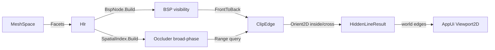

# [RASM_FABRICATION_HIDDEN_LINE]

Rasm.Fabrication projection frontier: the polymorphic `Fabrication` owner that closes the entire 3D-to-fabrication concern over a `FrontierKind` `[SmartEnum<string>]` (`project`/`toolpath`/`place`) folded by one `Run` entrypoint that dispatches a per-kind `FrontierPolicy` `[Union]` onto its kernel and returns a `FrontierResult` `[Union]` (`HiddenLineResult`/`Motion`/`Placement`), plus the exact hidden-line removal kernel — a BSP-tree visibility solver with Weiler-Atherton edge clipping producing the world-space visible/hidden edge sets the AppUi `drafting-sheets#PROJECTION` `Viewport2D` consumes BELOW its painter sort. The frontier owner and the HLR kernel are authored from first principles — no admitted geometry library carries a CAM/HLR/nesting robustness or license guarantee ([ADMISSIONS_RECORD]: GPL/native HLR rejected, ManifoldNET alpha rejected). It composes the kernel `Rasm/Geometry/geometry-kernel#ROBUST_PREDICATES` `Predicate.Orient2D` exact orientation as the segment-intersection and convex-test floor, the kernel `Rasm/Geometry/spatial-index#SPATIAL_INDEX` `SpatialIndex` broad-phase for occluder candidate pruning, and `Rasm`/Vectors `MeshSpace`/`Point3d`/`Vector3d`/`Matrix` primitives as native vocabulary — read public shapes, compose, NEVER re-mint. It mints NO second `Viewport2D`, no second hidden-line frame, no second acceleration structure, computes no hash, and operates on raw coordinate doubles at the kernel interior because a coordinate is the domain's native scalar ([R1]), never a unit-bearing quantity.

Wire posture: HOST-LOCAL, no TS_PROJECTION cluster. The fabrication outputs cross only the in-process seam — the world-space `HiddenLineResult` edge sets to the AppUi `Viewport2D` consumer, the `Motion` toolpath/joint stream to a downstream post-processor, the `Placement` transforms to a sheet emitter — never a browser or peer wire. The `FrontierKind` discriminant, the `FrontierPolicy`/`FrontierResult` unions, and the interior BSP records are host-local types that never sit between wire and rail.

## [1]-[INDEX]

| [INDEX] | [CLUSTER]              | [OWNS]                                                                                                                  |
| :-----: | :--------------------- | :--------------------------------------------------------------------------------------------------------------------- |
|   [1]   | FABRICATION_OWNER      | One polymorphic `Fabrication` owner — `FrontierKind`/`FrontierPolicy`/`FrontierResult` unions folded by one `Run` data-table dispatch |
|   [2]   | PROJECTION_HIDDEN_LINE | BSP-tree visibility solver + Weiler-Atherton edge clipping over `Predicate.Orient2D`; world-space visible/hidden edge sets for AppUi `Viewport2D` |

## [2]-[FABRICATION_OWNER]

- Owner: `FrontierKind` `[SmartEnum<string>]` the frontier discriminant (`project`/`toolpath`/`place`) carrying the per-kind native-probe column; `FrontierPolicy` `[Union]` the per-kind policy (`HiddenLine`/`Cam`/`Nest`) the `Run` fold dispatches on; `FrontierResult` `[Union]` the per-kind result (`HiddenLineResult`/`Motion`/`Placement`); `Fabrication` the static surface whose ONE `Run` entrypoint discriminates by `FrontierPolicy` case onto the cluster kernel; the three cluster kernels (`Hlr`, `Cam`, `Nest`) are internal `[OPERATIONS]` folds on the same owner, never sibling public surfaces.
- Cases: `FrontierKind` rows `project` · `toolpath` · `place` (3); `FrontierPolicy` cases `HiddenLine` · `Cam` · `Nest` (3); `FrontierResult` cases `HiddenLineResult` · `Motion` · `Placement` (3); `ToolpathKind` rows `contour` · `pocket` · `drill` (3, the CAM motion sub-axis owned at `toolpath#CAM_MOTION`).
- Entry: `public static Fin<FrontierResult> Run(FrontierPolicy policy, FrontierInput input)` — the ONE fabrication entrypoint, `Fin<T>` routing a band-2400 `GeometryFault` (`DegenerateInput` on an empty/non-finite input set, `OpenLoop` on a non-closed toolpath/nesting boundary, `NoFit` when a part cannot be placed on the sheet); the fold lowers `HiddenLine` to the BSP visibility + Weiler-Atherton clip, `Cam` to the `ToolpathKind`-dispatched offset/spiral plus the FK/IK chain, and `Nest` to the NFP-build + bottom-left/GA placement.
- Auto: `Run` reads a `FrozenDictionary<Type, Func<FrontierPolicy, FrontierInput, Fin<FrontierResult>>>` keyed by the policy case so the kernel selection is a data-table row, never a `policy switch` cascade in the body; each kernel composes the settled `Predicate.Orient2D` for the exact left-turn/segment-intersection floor and `SpatialIndex` for broad-phase candidate pruning, so the fabrication owner adds the fabrication ALGORITHM atop the settled exact-geometry and acceleration substance rather than re-deriving either.
- Receipt: `FrontierResult` IS the typed evidence — `HiddenLineResult` carries the visible/hidden edge partition and the silhouette set, `Motion` carries the ordered move list plus the joint-angle stream and the IK convergence residual, `Placement` carries the per-part transform and the sheet utilization scalar; no generic fabrication ledger, each kind carries its own typed result.
- Packages: `Rasm`/Vectors (`MeshSpace`/`Point3d`/`Vector3d`/`Matrix` — composed), Rasm.Geometry.Numerics (`Predicate.Orient2D`/`Sign` — settled kernel), Rasm.Geometry.Spatial (`SpatialIndex` — settled kernel), Thinktecture.Runtime.Extensions, LanguageExt.Core, BCL inbox.
- Growth: a new frontier is one `FrontierKind` row + one `FrontierPolicy` case + one `FrontierResult` case + one kernel fold arm + one `Builders` row; a new toolpath strategy is one `ToolpathKind` row + one `Cam` offset-fold arm; a new placement heuristic is one column on `NestPolicy`; zero new surface — a `HlrProjector`/`CamPost`/`NestPacker` sibling-class family is the rejected density defect collapsed onto the one `Fabrication.Run` fold discriminated by `FrontierPolicy` case.
- Boundary: the frontier is the ONE polymorphic `Fabrication` owner and a per-concern projector/post/packer class triple is the deleted form — the three concerns differ only in their kernel fold, never in their entrypoint, so `Run` dispatches by `FrontierPolicy` case over the `Builders` table; the hidden-line kernel emits world-space visible/hidden EDGE SETS and the AppUi `Viewport2D` projects them — Fabrication mints NO second `Viewport2D`, no second `ProjectionBasis`, no painter sort ([PROHIBITIONS]); the hidden-line occluder broad-phase reads the settled `SpatialIndex` and a Fabrication-local BVH beside it is the deleted form; segment intersection and convex orientation read the settled `Predicate.Orient2D` exact sign and a naive `double` cross-product sign at the call site is the named robustness defect ([R1] — a sign verdict is exact or it is a defect); the CAM motion is one owner over the `ToolpathKind` axis owned at `toolpath#CAM_MOTION` and a `ContourPath`/`PocketPath`/`DrillCycle` sibling triple is the rejected form; the NFP is the ONE author-kernel owned at `nesting#NESTING` and the bottom-left/GA placement is one fold over it, never an admitted nesting library (UNesting rejected, [ADMISSIONS_RECORD]); the interior coordinate doubles inside every kernel are the [R1] sanctioned native-scalar posture and a unit-bearing quantity in a kernel signature is the seam violation; a mesh-boolean/CSG dependency for a watertight projection silhouette is NOT taken — the visibility kernel operates on the existing facet/edge set ([RESEARCH] `[CSG_BOOLEAN]` names the deferred tier-3 native deploy-asset-gate SPIKE; the hidden-line kernel itself is author-kernel and FINALIZED).

```csharp signature
// --- [RUNTIME_PRELUDE] --------------------------------------------------------------------
using System.Collections.Frozen;
using LanguageExt;
using LanguageExt.Common;
using Rasm.Geometry.Numerics;                                       // Predicate, Sign — settled kernel geometry-kernel#ROBUST_PREDICATES
using Rasm.Geometry.Spatial;                                        // SpatialIndex, SpatialQuery, SpatialKind, BuildPolicy — settled kernel spatial-index#SPATIAL_INDEX
using Rasm.Vectors;                                                 // MeshSpace, Matrix, Dimension — settled Rasm/Vectors vocabulary, composed never re-minted
using Rhino.Geometry;                                               // Point3d/Vector3d/BoundingBox via Rasm/Vectors substrate — composed, never re-minted
using Thinktecture;
using static LanguageExt.Prelude;

namespace Rasm.Fabrication.Projection;

// --- [TYPES] ------------------------------------------------------------------------------
[SmartEnum<string>]
[KeyMemberEqualityComparer<FabricationKeyPolicy, string>]
[KeyMemberComparer<FabricationKeyPolicy, string>]
public sealed partial class FrontierKind {
    public static readonly FrontierKind Project = new("project");      // hidden-line removal → AppUi Viewport2D substance
    public static readonly FrontierKind Toolpath = new("toolpath");    // CAM offset/spiral + FK/IK motion
    public static readonly FrontierKind Place = new("place");          // 2D true-shape NFP nesting
}

[SmartEnum<string>]
[KeyMemberEqualityComparer<FabricationKeyPolicy, string>]
[KeyMemberComparer<FabricationKeyPolicy, string>]
public sealed partial class ToolpathKind {
    public static readonly ToolpathKind Contour = new("contour", spiral: false);   // boundary-following constant-offset passes
    public static readonly ToolpathKind Pocket = new("pocket", spiral: true);      // inward continuous spiral clearing
    public static readonly ToolpathKind Drill = new("drill", spiral: false);       // peck-cycle point set

    public bool Spiral { get; }
}

// --- [MODELS] -----------------------------------------------------------------------------
// One closed planar loop in world space, vertices in winding order; the fabrication geometry atom every
// kernel reads (a projected silhouette ring, a toolpath boundary, a nesting part outline). CCW-positive
// orientation is canonical — Predicate.Orient2D over the signed-area accumulation establishes it once.
public sealed record Loop(Arr<Point3d> Vertices, bool Closed) {
    public int Count => Vertices.Count;
    public Point3d At(int i) => Vertices[((i % Count) + Count) % Count];   // cyclic index, never an out-of-range throw

    // Signed orientation via exact Orient2D fan from vertex 0: the sum of triangle turn-signs is the winding.
    public Sign Winding() =>
        Sign.Of(Enumerable.Range(1, Count - 2).Sum(i => Predicate.Orient2D(At(0), At(i), At(i + 1)).Key));

    public Loop AsCcw() => Winding() == Sign.Negative ? this with { Vertices = Vertices.Rev().ToArr() } : this;
    public BoundingBox Bound() => new(Vertices);
}

public readonly record struct FrontierInput(
    Option<MeshSpace> Model,            // hidden-line: the occluding mesh in world space
    ProjectionDir View,                 // hidden-line: the view direction the silhouette/occlusion resolves against
    Arr<Loop> Profiles,                 // CAM: the toolpath boundary loops · nesting: the part outlines
    Arr<DhJoint> Chain,                 // CAM: the DH kinematic chain for FK/IK
    Point3d IkTarget,                   // CAM: the IK end-effector goal
    SheetBounds Sheet);                 // nesting: the stock sheet extents

[Union(ConversionFromValue = ConversionOperatorsGeneration.None)]
public abstract partial record FrontierPolicy {
    private FrontierPolicy() { }

    public sealed record HiddenLine(double FacetTolerance, int SpatialLeaf) : FrontierPolicy;
    public sealed record Cam(ToolpathKind Kind, double StepOver, double ToolRadius, int Passes, IkPolicy Ik) : FrontierPolicy;
    public sealed record Nest(NestPolicy Nesting) : FrontierPolicy;
}

[Union(ConversionFromValue = ConversionOperatorsGeneration.None)]
public abstract partial record FrontierResult {
    private FrontierResult() { }

    // World-space edge partition for AppUi Viewport2D: it projects Visible (and dashed Hidden) directly — no second sort.
    public sealed record HiddenLineResult(Seq<Edge3> Visible, Seq<Edge3> Hidden, Seq<Edge3> Silhouette) : FrontierResult;
    public sealed record Motion(Seq<Move> Moves, Seq<double[]> Joints, double IkResidual, bool Reached) : FrontierResult;
    public sealed record Placement(Seq<PartTransform> Parts, double Utilization, int Unplaced) : FrontierResult;
}

// A world-space directed edge: the hidden-line partition atom and the toolpath segment atom.
public readonly record struct Edge3(Point3d A, Point3d B);

// A CAM move: rapid (retract/reposition) or feed (cutting), with the feed/plunge rate column.
public readonly record struct Move(Point3d To, bool Rapid, double Feed);

// --- [ERRORS] -----------------------------------------------------------------------------
// The package GeometryFault union (band 2400) is owned at faults#FAULT_BAND; the fabrication-relevant cases:
// GeometryFault.DegenerateInput(string)  -> 2401  (empty/non-finite profile or model set)
// GeometryFault.OpenLoop(string)         -> 2403  (a toolpath/nesting boundary loop is not closed)
// GeometryFault.NoFit(string)            -> 2404  (a part cannot be placed within the sheet under the NFP)

// --- [OPERATIONS] -------------------------------------------------------------------------
public static class Fabrication {
    static readonly FrozenDictionary<Type, Func<FrontierPolicy, FrontierInput, Fin<FrontierResult>>> Builders =
        new (Type Case, Func<FrontierPolicy, FrontierInput, Fin<FrontierResult>> Run)[] {
            (typeof(FrontierPolicy.HiddenLine), static (p, i) => Hlr.Solve((FrontierPolicy.HiddenLine)p, i)),
            (typeof(FrontierPolicy.Cam), static (p, i) => Cam.Solve((FrontierPolicy.Cam)p, i)),
            (typeof(FrontierPolicy.Nest), static (p, i) => Nest.Solve((FrontierPolicy.Nest)p, i)),
        }.ToFrozenDictionary(static row => row.Case, static row => row.Run);

    // ONE fabrication entrypoint: discriminate by FrontierPolicy case over the data table, never a switch cascade.
    public static Fin<FrontierResult> Run(FrontierPolicy policy, FrontierInput input) =>
        Builders.TryGetValue(policy.GetType(), out var run)
            ? run(policy, input)
            : Fin.Fail<FrontierResult>(GeometryFault.DegenerateInput($"frontier-policy-miss:{policy.GetType().Name}"));
}
```

## [3]-[PROJECTION_HIDDEN_LINE]

- Owner: `ProjectionDir` the view direction the silhouette resolves against (eye-to-target, the basis the AppUi `Viewport2D` shares); `Facet` the projected triangle carrying its world vertices, its plane, and its screen-space 2D footprint; `BspNode` the binary space-partition node splitting the facet set by a chosen facet's supporting plane into in-front/behind half-spaces; `Hlr` the static visibility fold building the BSP, resolving silhouette edges, and clipping every candidate edge against the front-to-back occluder set by a Weiler-Atherton-style 2D polygon clip; the world-space `HiddenLineResult` edge partition the AppUi `drafting-sheets#PROJECTION` `Viewport2D` consumes.
- Cases: an edge is `Visible` (no occluder facet covers its screen footprint), `Hidden` (fully covered), or a `Silhouette` (a mesh edge whose two incident facets face opposite the view — the boundary the drafted outline traces); the partition is the three `HiddenLineResult` sets, never three parallel solver passes.
- Entry: `public static Fin<FrontierResult> Solve(FrontierPolicy.HiddenLine policy, FrontierInput input)` — `Fin<T>` routes `GeometryFault.DegenerateInput` on an absent model or a degenerate (zero-area) facet set; the body extracts facets, builds the BSP over their planes, extracts silhouette edges, broad-phase-prunes occluder candidates per edge through the settled `SpatialIndex`, and Weiler-Atherton-clips each edge into its visible and hidden runs.
- Auto: `Hlr.Solve` projects every mesh facet to screen space under `ProjectionDir`, builds the `BspNode` tree by picking a splitting facet and partitioning the rest into the plane's positive/negative half-spaces (the front-to-back traversal order a back-to-front painter sort cannot give, so a concave self-occluding solid resolves correctly); silhouette edges are the mesh edges whose two incident facet normals dot the view with opposite sign (`Predicate.Orient2D`-grounded sign on the projected incident triangles); each candidate edge queries the `SpatialIndex` `Overlap`/`Range` for the facets whose screen bound covers it, and `ClipEdge` walks those occluders front-to-back subtracting each occluder's screen polygon from the edge's remaining-visible parameter intervals via the exact `Orient2D` segment-side test (the Weiler-Atherton inside/outside classification), emitting the surviving intervals as `Visible` world-space sub-edges and the subtracted intervals as `Hidden`.
- Receipt: the `HiddenLineResult` carries the visible/hidden/silhouette edge sets directly — the partition IS the evidence the AppUi consumer projects; no separate visibility ledger.
- Packages: `Rasm`/Vectors (`MeshSpace`/`Point3d`/`Vector3d` — composed), Rasm.Geometry.Numerics (`Predicate.Orient2D` — settled), Rasm.Geometry.Spatial (`SpatialIndex` — settled), LanguageExt.Core, BCL inbox.
- Growth: a curved-surface analytic silhouette (the [REFINEMENT_HORIZON] widening past facets) is one `Facet`-builder arm over the surface tessellation; a clip refinement is one arm on `ClipEdge`; zero new surface.
- Boundary: the kernel produces world-space EDGE SETS and the AppUi `Viewport2D` owns the projection-to-sheet — Fabrication deepens the substance, never re-mints the frame ([PROHIBITIONS]); the BSP is the visibility owner and a painter back-to-front sort is the AppUi fallback this kernel SUPERSEDES (the AppUi `HiddenLine.Visible` depth sort is the painter approximation; this BSP is the exact occlusion the `Viewport2D` reads when it needs CAD-grade hidden-line); occluder candidate pruning reads the settled `SpatialIndex` and a local BVH is the deleted form; every side/inside test reads `Predicate.Orient2D` exact sign and a `double` cross-product at the call site is the named robustness defect.

```csharp signature
// --- [MODELS] -----------------------------------------------------------------------------
public readonly record struct ProjectionDir(Vector3d Forward, Vector3d ScreenU, Vector3d ScreenV) {
    // Orthonormal screen basis from a view forward: ScreenU ⟂ Forward, ScreenV = Forward × ScreenU.
    public static ProjectionDir Of(Vector3d forward) {
        Vector3d f = forward; f.Unitize();
        Vector3d up = Math.Abs(f.Z) < 0.9 ? Vector3d.ZAxis : Vector3d.XAxis;
        Vector3d u = Vector3d.CrossProduct(up, f); u.Unitize();
        Vector3d v = Vector3d.CrossProduct(f, u);
        return new ProjectionDir(f, u, v);
    }

    // Screen-space (x,y) of a world point; the third coordinate (depth along Forward) drives the BSP ordering.
    public Point3d Project(Point3d p) {
        Vector3d r = p - Point3d.Origin;
        return new Point3d(r * ScreenU, r * ScreenV, r * Forward);   // (x_screen, y_screen, depth)
    }
}

// A projected triangle: world vertices, the native-mesh topology vertex indices (Va/Vb/Vc — the canonical edge keys
// the same RhinoCommon topology the kernel topology#NAMING_HASH CanonicalTopology.OfMesh reads), the view-space depth
// at its centroid, and its screen-2D footprint as a Loop. Edges key by the ordered (int,int) topology-index pair —
// never a lossy Point3d hash — so a shared edge between two facets pairs exactly (Fabrication mints no hash, [R2]).
public readonly record struct Facet(Point3d A, Point3d B, Point3d C, int Va, int Vb, int Vc, Vector3d Normal, Loop Screen, double Depth) {
    public bool FacesViewer(Vector3d forward) => Normal * forward < 0.0;

    // The three directed topology edges as ordered (low,high) vertex-index keys plus the incident facet, for pairing.
    public Seq<((int Lo, int Hi) Key, Edge3 Edge)> EdgeKeys() =>
        Seq(((Math.Min(Va, Vb), Math.Max(Va, Vb)), new Edge3(A, B)),
            ((Math.Min(Vb, Vc), Math.Max(Vb, Vc)), new Edge3(B, C)),
            ((Math.Min(Vc, Va), Math.Max(Vc, Va)), new Edge3(C, A)));
}

// Binary space partition over facet supporting planes: Front holds facets on the +normal side of Plane, Back the −side.
// The front-to-back in-order walk (relative to the eye) gives an exact occlusion order a painter sort cannot.
public sealed record BspNode(Facet Splitter, Option<BspNode> Front, Option<BspNode> Back) {
    public static Option<BspNode> Build(Seq<Facet> facets) {
        if (facets.IsEmpty) return None;
        Facet pivot = facets.Head;
        var (front, back) = facets.Tail.Partition(f => SideOf(pivot, f) >= 0);
        return Some(new BspNode(pivot, Build(front.ToSeq()), Build(back.ToSeq())));
    }

    // Side of a facet centroid relative to the splitter plane: +1 in front (toward +normal), −1 behind.
    static int SideOf(Facet plane, Facet f) {
        Point3d c = new((f.A.X + f.B.X + f.C.X) / 3.0, (f.A.Y + f.B.Y + f.C.Y) / 3.0, (f.A.Z + f.B.Z + f.C.Z) / 3.0);
        return Math.Sign((c - plane.A) * plane.Normal);
    }

    // Front-to-back facet order relative to the eye: walk the half-space containing the eye LAST so nearer occluders
    // are visited first — the property the edge-clip front-to-back subtraction relies on for correct occlusion.
    public Seq<Facet> FrontToBack(Point3d eye) {
        bool eyeFront = (eye - Splitter.A) * Splitter.Normal >= 0.0;
        Seq<Facet> near = (eyeFront ? Front : Back).Match(n => n.FrontToBack(eye), () => Seq<Facet>());
        Seq<Facet> far = (eyeFront ? Back : Front).Match(n => n.FrontToBack(eye), () => Seq<Facet>());
        return near.Add(Splitter).Concat(far);
    }
}

// --- [OPERATIONS] -------------------------------------------------------------------------
public static class Hlr {
    public static Fin<FrontierResult> Solve(FrontierPolicy.HiddenLine policy, FrontierInput input) =>
        input.Model.Match(
            None: () => Fin.Fail<FrontierResult>(GeometryFault.DegenerateInput("hlr:no-model")),
            Some: model => {
                Seq<Facet> facets = Facets(model, input.View, policy.FacetTolerance);
                if (facets.IsEmpty) return Fin.Fail<FrontierResult>(GeometryFault.DegenerateInput("hlr:no-facets"));
                Option<BspNode> bsp = BspNode.Build(facets);
                Seq<Edge3> silhouette = Silhouette(facets, input.View.Forward);
                BoundingBox[] occluderBounds = facets.Map(static f => f.Screen.Bound()).ToArray();
                return SpatialIndex.Build(SpatialKind.Bvh, occluderBounds, BuildPolicy.Canonical with { LeafSize = policy.SpatialLeaf })
                    .Map(index => {
                        Point3d eye = input.View.Forward.IsZero ? Point3d.Origin : Point3d.Origin - 1e6 * input.View.Forward;
                        Seq<Facet> ordered = bsp.Match(n => n.FrontToBack(eye), () => facets);
                        var (visible, hidden) = silhouette.Concat(MeshEdges(facets))
                            .Fold((Visible: Seq<Edge3>(), Hidden: Seq<Edge3>()), (acc, edge) => {
                                var (vis, hid) = ClipEdge(edge, ordered, index, facets, input.View);
                                return (acc.Visible.Concat(vis), acc.Hidden.Concat(hid));
                            });
                        return (FrontierResult)new FrontierResult.HiddenLineResult(visible, hidden, silhouette);
                    });
            });

    // Tessellate the native mesh to facets, projecting each to its screen footprint and view-space depth.
    static Seq<Facet> Facets(MeshSpace model, ProjectionDir view, double tolerance) {
        Mesh mesh = model.DuplicateNative();
        mesh.Faces.ConvertQuadsToTriangles();
        mesh.FaceNormals.ComputeFaceNormals();
        return toSeq(Enumerable.Range(0, mesh.Faces.Count)).Map(fi => {
            MeshFace face = mesh.Faces[fi];
            Point3d a = mesh.Vertices[face.A], b = mesh.Vertices[face.B], c = mesh.Vertices[face.C];
            Vector3d n = mesh.FaceNormals[fi];
            Point3d pa = view.Project(a), pb = view.Project(b), pc = view.Project(c);
            var screen = new Loop(Arr(pa, pb, pc), Closed: true).AsCcw();
            return new Facet(a, b, c, face.A, face.B, face.C, n, screen, (pa.Z + pb.Z + pc.Z) / 3.0);
        }).Filter(f => f.Screen.Bound().Diagonal > tolerance);
    }

    // Silhouette edges: a topology edge whose two incident facets face the viewer with opposite sign is on the
    // outline. A boundary edge (one incident facet) is always silhouette. Edges pair by the ordered (int,int)
    // native topology vertex-index key — never a lossy Point3d hash ([R2]) — so a shared edge between two facets
    // whose coordinate reprs differ in their low bits still pairs exactly. The opposite-sign view-dot test is the
    // silhouette classifier; the exact orientation floor downstream (ClipEdge) reads Predicate.Orient2D.
    static Seq<Edge3> Silhouette(Seq<Facet> facets, Vector3d forward) =>
        toSeq(facets.Bind(f => f.EdgeKeys().Map(e => (e.Key, e.Edge, Facet: f)))
            .GroupBy(static t => t.Key)
            .Select(g => {
                var inc = g.ToSeq();
                bool silhouette = inc.Count == 1 ||
                    Math.Sign(inc[0].Facet.Normal * forward) != Math.Sign(inc[1].Facet.Normal * forward);
                return (Edge: inc[0].Edge, Silhouette: silhouette);
            }))
            .Filter(static r => r.Silhouette)
            .Map(static r => r.Edge);

    static Seq<Edge3> MeshEdges(Seq<Facet> facets) =>
        facets.Bind(f => f.EdgeKeys().Map(e => e.Edge));

    // Weiler-Atherton-style edge clip: subtract each front-to-back occluder facet's screen polygon from the edge's
    // remaining-visible parameter intervals. A point is INSIDE an occluder when it lies left of every CCW boundary
    // edge — the exact Predicate.Orient2D left-turn sign is the inside/outside classifier, so a vertex grazing a
    // boundary classifies deterministically. The surviving [0,1] sub-intervals are Visible world sub-edges; the
    // subtracted intervals (covered by a strictly-nearer occluder) are Hidden.
    static (Seq<Edge3> Visible, Seq<Edge3> Hidden) ClipEdge(Edge3 edge, Seq<Facet> ordered, SpatialIndex index, Seq<Facet> facets, ProjectionDir view) {
        Point3d sa = view.Project(edge.A), sb = view.Project(edge.B);
        double edgeDepth = (sa.Z + sb.Z) / 2.0;
        var bound = new BoundingBox(new[] { sa, sb });
        Seq<int> candidates = (index.Query(new SpatialQuery.Range(bound, None)) as QueryResult.Hits)?.Ids ?? Seq<int>();
        // Visible parameter intervals along [0,1], initially the whole edge; each NEARER occluder removes a sub-span.
        var visible = Seq((Lo: 0.0, Hi: 1.0));
        foreach (int fi in candidates) {
            Facet occ = facets[fi];
            if (occ.Depth >= edgeDepth) continue;                         // only strictly-nearer facets occlude
            var (enter, exit) = SpanInside(sa, sb, occ.Screen);           // [enter,exit] ⊂ [0,1] where the edge is inside occ
            if (exit <= enter) continue;
            visible = visible.Bind(span => Subtract(span, enter, exit));  // remove the covered sub-span from every interval
        }
        Seq<Edge3> vis = visible.Filter(s => s.Hi - s.Lo > 1e-9).Map(s => new Edge3(Lerp(edge.A, edge.B, s.Lo), Lerp(edge.A, edge.B, s.Hi)));
        Seq<Edge3> hid = Complement(visible).Map(s => new Edge3(Lerp(edge.A, edge.B, s.Lo), Lerp(edge.A, edge.B, s.Hi)));
        return (vis, hid);
    }

    // The [enter,exit] parameter sub-span of segment sa→sb that lies inside the CCW screen polygon, via the exact
    // Orient2D left-of-every-edge test sampled at the segment/boundary crossing parameters and the endpoints.
    static (double Enter, double Exit) SpanInside(Point3d sa, Point3d sb, Loop poly) {
        var ts = new SortedSet<double> { 0.0, 1.0 };
        for (int i = 0; i < poly.Count; i++) {
            Option<double> t = SegmentCross(sa, sb, poly.At(i), poly.At(i + 1));
            t.IfSome(v => ts.Add(Math.Clamp(v, 0.0, 1.0)));
        }
        double enter = 1.0, exit = 0.0;
        double[] sorted = ts.ToArray();
        for (int i = 0; i + 1 < sorted.Length; i++) {
            double mid = (sorted[i] + sorted[i + 1]) / 2.0;
            if (Inside(Lerp(sa, sb, mid), poly)) { enter = Math.Min(enter, sorted[i]); exit = Math.Max(exit, sorted[i + 1]); }
        }
        return (enter, exit);
    }

    // Inside a CCW polygon iff the point is left of (or on) every boundary edge — exact via Predicate.Orient2D.
    static bool Inside(Point3d p, Loop poly) {
        for (int i = 0; i < poly.Count; i++)
            if (Predicate.Orient2D(poly.At(i), poly.At(i + 1), p) == Sign.Negative) return false;
        return true;
    }

    // Segment a→b crosses segment c→d when the four Orient2D signs straddle: exact, no epsilon on the side test.
    static Option<double> SegmentCross(Point3d a, Point3d b, Point3d c, Point3d d) {
        Sign d1 = Predicate.Orient2D(c, d, a), d2 = Predicate.Orient2D(c, d, b);
        Sign d3 = Predicate.Orient2D(a, b, c), d4 = Predicate.Orient2D(a, b, d);
        if (d1 == d2 || d3 == d4) return None;
        double denom = (b.X - a.X) * (d.Y - c.Y) - (b.Y - a.Y) * (d.X - c.X);
        if (Math.Abs(denom) < 1e-15) return None;
        return Some(((c.X - a.X) * (d.Y - c.Y) - (c.Y - a.Y) * (d.X - c.X)) / denom);
    }

    static Seq<(double Lo, double Hi)> Subtract((double Lo, double Hi) span, double lo, double hi) {
        if (hi <= span.Lo || lo >= span.Hi) return Seq(span);                          // disjoint — span survives whole
        Seq<(double, double)> parts = Seq<(double, double)>();
        if (lo > span.Lo) parts = parts.Add((span.Lo, lo));                            // left remnant
        if (hi < span.Hi) parts = parts.Add((hi, span.Hi));                            // right remnant
        return parts;
    }

    static Seq<(double Lo, double Hi)> Complement(Seq<(double Lo, double Hi)> visible) {
        var sorted = visible.OrderBy(s => s.Lo).ToArray();
        Seq<(double, double)> hidden = Seq<(double, double)>();
        double cursor = 0.0;
        foreach (var s in sorted) { if (s.Lo > cursor) hidden = hidden.Add((cursor, s.Lo)); cursor = Math.Max(cursor, s.Hi); }
        if (cursor < 1.0) hidden = hidden.Add((cursor, 1.0));
        return hidden;
    }

    static Point3d Lerp(Point3d a, Point3d b, double t) => a + t * (b - a);
}
```



## [4]-[DENSITY_BAR]

One owner per axis; capability is a case, row, or column, never a sibling surface. `[STATE]` is `{PLANNED, FINALIZED, SPIKE}`: `FINALIZED` where the owner is a transcription-complete fence with no open gate; `SPIKE` where fence-complete but carrying a residual probe named in [RESEARCH]. The fabrication owner and the HLR kernel are `FINALIZED` (pure-managed author-kernels) EXCEPT the mesh-boolean/CSG dependency a watertight solid silhouette would require, which is the one tier-3 native deploy-asset-gate item named in [RESEARCH] `[CSG_BOOLEAN]` — and that does NOT hold a row at SPIKE because the hidden-line kernel here operates on the existing facet/edge set and needs no boolean; CSG is a SEPARATE deferred capability, not a gate on these kernels.

The `[RAIL]` cell names the one return rail each owner exposes — `Fin<FrontierResult>` where a band-2400 `GeometryFault` can route (degenerate input, open loop, no-fit), the result union where the verdict is total.

| [INDEX] | [AXIS/CONCERN]          | [OWNER]          | [KIND]                                                                                   | [RAIL]                                          | [CASES] |   [STATE]   |
| :-----: | :---------------------- | :--------------- | :--------------------------------------------------------------------------------------- | :--------------------------------------------- | :-----: | :---------: |
|   [1]   | Fabrication frontier    | `Fabrication`    | static surface + `FrontierKind` SmartEnum + `FrontierPolicy`/`FrontierResult` unions + `Run` table-fold | `Fabrication.Run → Fin<FrontierResult>`         |    3    | FINALIZED (pure-managed) |
|  [1a]   | Hidden-line removal     | `Hlr`            | BSP visibility solver + Weiler-Atherton `ClipEdge` over `Predicate.Orient2D` + `SpatialIndex` broad-phase | `Hlr.Solve → Fin<FrontierResult>`               |    3    | FINALIZED (pure-managed) |

## [5]-[RESEARCH]

- [HLR_HOST_PROBE] FINALIZED (no SPIKE): the `Hlr.Facets` body composes the native `Mesh` surface through `MeshSpace.DuplicateNative()` — `Faces.ConvertQuadsToTriangles`, `FaceNormals.ComputeFaceNormals`, `Vertices[int]`, `Faces[int]` (`MeshFace.A/B/C`), and `FaceNormals[int]` — the SAME RhinoCommon surface the kernel `topology#NAMING_HASH` `CanonicalTopology.OfMesh` composes (`TopologyVertices`/`TopologyEdges`/`Faces`), so the host spellings are already confirmed against the Vectors `Mesh.cs` usage and carry no residual; the BSP build, the silhouette extraction, the Weiler-Atherton interval-subtraction clip, and the `Predicate.Orient2D`-grounded inside/cross tests are pure-managed and transcription-complete. The visibility kernel emits world-space edge sets the AppUi `Viewport2D` projects BELOW its painter sort — the cross-page seam is a CONSUMPTION seam (AppUi reads, Fabrication produces), not a contract conflict, so it carries no SPIKE.
- [CSG_BOOLEAN] SPIKE — TIER-3 NATIVE DEPLOY-ASSET-GATE, the ONE deferred fabrication capability: a watertight-solid silhouette (the exact outline of a BOOLEAN-combined solid, rather than the per-facet silhouette this page's `Hlr` kernel extracts) would require a Manifold-class mesh-boolean/CSG kernel, and NO admissible managed library exists ([ADMISSIONS_RECORD]: ManifoldNET is alpha-only with no robustness guarantee; the GPL/native CSG kernels carry license + RID burden). This is therefore marked a tier-3 native deploy-asset-gate SPIKE: the boolean row, when admitted, is a native asset deployed per-RID behind a deploy gate, NOT a managed author-kernel — and it is explicitly OUT OF SCOPE for the FINALIZED kernels here, which operate on the existing facet/edge set and need no boolean. The hidden-line kernel is author-kernel and FINALIZED; CSG is a separate, deferred, native-gated capability that does not block it. Resolving it requires either a robust managed CSG admission (none today) or a per-RID native deploy asset under the deploy-asset gate — an admission decision OUTSIDE this page's write-scope, surfaced here so the frontier records the one boolean gap without compromising the pure-managed kernel FINALIZED state.
