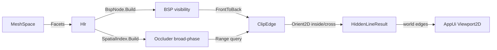

# [GEOMETRYCORE_FABRICATION]

Rasm.GeometryCore fabrication frontier: ONE polymorphic `Fabrication` owner closing the entire 3D-to-fabrication concern over a `FrontierKind` `[SmartEnum<string>]` (`project`/`toolpath`/`place`) folded by one `Run` entrypoint that dispatches a per-kind `FrontierPolicy` `[Union]` onto its kernel and returns a `FrontierResult` `[Union]` (`HiddenLineResult`/`Motion`/`Placement`). The page owns three author-kernels — exact hidden-line removal (a BSP-tree visibility solver with Weiler-Atherton edge clipping producing the world-space visible/hidden edge sets the AppUi `drafting-sheets#PROJECTION` `Viewport2D` consumes BELOW its painter sort), CAM toolpath motion (contour-offset and pocket-spiral over a closed `ToolpathKind`, a Denavit-Hartenberg forward-kinematics chain, and a damped Jacobian-pseudoinverse inverse-kinematics solver), and 2D true-shape nesting (an author-kernel no-fit-polygon computation with a bottom-left + genetic placement fold). Every kernel is authored from first principles — no admitted geometry library carries a CAM/HLR/nesting robustness or license guarantee ([ADMISSIONS_RECORD]: GPL/native HLR/CAM rejected, UNesting immature rejected, ManifoldNET alpha rejected). It composes the settled sibling `geometry-kernel#ROBUST_PREDICATES` `Predicate.Orient2D` exact orientation as the segment-intersection and convex-test floor, the `spatial-index#SPATIAL_INDEX` `SpatialIndex` broad-phase for occluder candidate pruning, and `Rasm`/Vectors `MeshSpace`/`Point3d`/`Vector3d`/`Matrix` primitives as native vocabulary — read public shapes, compose, NEVER re-mint. It mints NO second `Viewport2D`, no second hidden-line frame, no second acceleration structure, computes no hash, and operates on raw coordinate doubles at the kernel interior because a coordinate is the domain's native scalar ([R1]), never a unit-bearing quantity.

Wire posture: HOST-LOCAL, no TS_PROJECTION cluster. The fabrication outputs cross only the in-process seam — the world-space `HiddenLineResult` edge sets to the AppUi `Viewport2D` consumer, the `Motion` toolpath/joint stream to a downstream post-processor, the `Placement` transforms to a sheet emitter — never a browser or peer wire. The `FrontierKind` discriminant, the `FrontierPolicy`/`FrontierResult` unions, and the interior BSP/NFP records are host-local types that never sit between wire and rail.

## [1]-[INDEX]

| [INDEX] | [CLUSTER]              | [OWNS]                                                                                                                  |
| :-----: | :--------------------- | :--------------------------------------------------------------------------------------------------------------------- |
|   [1]   | PROJECTION_HIDDEN_LINE | BSP-tree visibility solver + Weiler-Atherton edge clipping over `Predicate.Orient2D`; world-space visible/hidden edge sets for AppUi `Viewport2D` |
|   [2]   | CAM_MOTION             | `ToolpathKind` contour-offset/pocket-spiral toolpaths; Denavit-Hartenberg forward kinematics; damped Jacobian-pseudoinverse IK; one motion owner over the kind axis |
|   [3]   | NESTING                | Author-kernel no-fit-polygon (NFP) computation; bottom-left + genetic placement fold; one nesting owner over the NFP   |

## [2]-[FABRICATION_OWNER]

- Owner: `FrontierKind` `[SmartEnum<string>]` the frontier discriminant (`project`/`toolpath`/`place`) carrying the per-kind native-probe column; `FrontierPolicy` `[Union]` the per-kind policy (`HiddenLine`/`Cam`/`Nest`) the `Run` fold dispatches on; `FrontierResult` `[Union]` the per-kind result (`HiddenLineResult`/`Motion`/`Placement`); `Fabrication` the static surface whose ONE `Run` entrypoint discriminates by `FrontierPolicy` case onto the cluster kernel; the three cluster kernels (`Hlr`, `Cam`, `Nest`) are internal `[OPERATIONS]` folds on the same owner, never sibling public surfaces.
- Cases: `FrontierKind` rows `project` · `toolpath` · `place` (3); `FrontierPolicy` cases `HiddenLine` · `Cam` · `Nest` (3); `FrontierResult` cases `HiddenLineResult` · `Motion` · `Placement` (3); `ToolpathKind` rows `contour` · `pocket` · `drill` (3, the CAM motion sub-axis).
- Entry: `public static Fin<FrontierResult> Run(FrontierPolicy policy, FrontierInput input)` — the ONE fabrication entrypoint, `Fin<T>` routing a band-2400 `GeometryFault` (`DegenerateInput` on an empty/non-finite input set, `OpenLoop` on a non-closed toolpath/nesting boundary, `NoFit` when a part cannot be placed on the sheet); the fold lowers `HiddenLine` to the BSP visibility + Weiler-Atherton clip, `Cam` to the `ToolpathKind`-dispatched offset/spiral plus the FK/IK chain, and `Nest` to the NFP-build + bottom-left/GA placement.
- Auto: `Run` reads a `FrozenDictionary<Type, Func<FrontierPolicy, FrontierInput, Fin<FrontierResult>>>` keyed by the policy case so the kernel selection is a data-table row, never a `policy switch` cascade in the body; each kernel composes the settled `Predicate.Orient2D` for the exact left-turn/segment-intersection floor and `SpatialIndex` for broad-phase candidate pruning, so the fabrication owner adds the fabrication ALGORITHM atop the settled exact-geometry and acceleration substance rather than re-deriving either.
- Receipt: `FrontierResult` IS the typed evidence — `HiddenLineResult` carries the visible/hidden edge partition and the silhouette set, `Motion` carries the ordered move list plus the joint-angle stream and the IK convergence residual, `Placement` carries the per-part transform and the sheet utilization scalar; no generic fabrication ledger, each kind carries its own typed result.
- Packages: `Rasm`/Vectors (`MeshSpace`/`Point3d`/`Vector3d`/`Matrix` — composed), Rasm.GeometryCore.Numerics (`Predicate.Orient2D`/`Sign` — settled sibling), Rasm.GeometryCore.Spatial (`SpatialIndex` — settled sibling), Thinktecture.Runtime.Extensions, LanguageExt.Core, BCL inbox.
- Growth: a new frontier is one `FrontierKind` row + one `FrontierPolicy` case + one `FrontierResult` case + one kernel fold arm + one `Builders` row; a new toolpath strategy is one `ToolpathKind` row + one `Cam` offset-fold arm; a new placement heuristic is one column on `NestPolicy`; zero new surface — a `HlrProjector`/`CamPost`/`NestPacker` sibling-class family is the rejected density defect collapsed onto the one `Fabrication.Run` fold discriminated by `FrontierPolicy` case.
- Boundary: the frontier is the ONE polymorphic `Fabrication` owner and a per-concern projector/post/packer class triple is the deleted form — the three concerns differ only in their kernel fold, never in their entrypoint, so `Run` dispatches by `FrontierPolicy` case over the `Builders` table; the hidden-line kernel emits world-space visible/hidden EDGE SETS and the AppUi `Viewport2D` projects them — GeometryCore mints NO second `Viewport2D`, no second `ProjectionBasis`, no painter sort ([PROHIBITIONS]); the hidden-line occluder broad-phase reads the settled `SpatialIndex` and a GeometryCore-local BVH beside it is the deleted form; segment intersection and convex orientation read the settled `Predicate.Orient2D` exact sign and a naive `double` cross-product sign at the call site is the named robustness defect ([R1] — a sign verdict is exact or it is a defect); the CAM motion is one owner over the `ToolpathKind` axis and a `ContourPath`/`PocketPath`/`DrillCycle` sibling triple is the rejected form; the FK chain is the Denavit-Hartenberg homogeneous-matrix product over `Rasm`/Vectors `Matrix` and a hand-rolled 4×4 re-mint mirroring the no-`RasmMatrix` law is the deleted form; the IK solver is the ONE damped-least-squares Jacobian-pseudoinverse fold and a per-arm analytic IK family is collapsed onto it (the analytic 2-link closed form is a fast-path ROW, not a parallel solver); the NFP is the ONE author-kernel and the bottom-left/GA placement is one fold over it, never an admitted nesting library (UNesting rejected, [ADMISSIONS_RECORD]); the interior coordinate doubles inside every kernel are the [R1] sanctioned native-scalar posture and a unit-bearing quantity in a kernel signature is the seam violation; a mesh-boolean/CSG dependency for a watertight projection silhouette is NOT taken — the visibility kernel operates on the existing facet/edge set ([RESEARCH] `[CSG_BOOLEAN]` names the deferred tier-3 native deploy-asset-gate SPIKE; the hidden-line, CAM, and nesting kernels themselves are author-kernel and FINALIZED).

```csharp signature
// --- [RUNTIME_PRELUDE] --------------------------------------------------------------------
using System.Collections.Frozen;
using LanguageExt;
using LanguageExt.Common;
using Rasm.GeometryCore.Numerics;                                   // Predicate, Sign — settled sibling geometry-kernel#ROBUST_PREDICATES
using Rasm.GeometryCore.Spatial;                                    // SpatialIndex, SpatialQuery, SpatialKind, BuildPolicy — settled sibling spatial-index#SPATIAL_INDEX
using Rasm.Vectors;                                                 // MeshSpace, Matrix, Dimension — settled Rasm/Vectors vocabulary, composed never re-minted
using Rhino.Geometry;                                               // Point3d/Vector3d/BoundingBox via Rasm/Vectors substrate — composed, never re-minted
using Thinktecture;
using static LanguageExt.Prelude;

namespace Rasm.GeometryCore.Fabrication;

// --- [TYPES] ------------------------------------------------------------------------------
[SmartEnum<string>]
[KeyMemberEqualityComparer<GeometryKeyPolicy, string>]
[KeyMemberComparer<GeometryKeyPolicy, string>]
public sealed partial class FrontierKind {
    public static readonly FrontierKind Project = new("project");      // hidden-line removal → AppUi Viewport2D substance
    public static readonly FrontierKind Toolpath = new("toolpath");    // CAM offset/spiral + FK/IK motion
    public static readonly FrontierKind Place = new("place");          // 2D true-shape NFP nesting
}

[SmartEnum<string>]
[KeyMemberEqualityComparer<GeometryKeyPolicy, string>]
[KeyMemberComparer<GeometryKeyPolicy, string>]
public sealed partial class ToolpathKind {
    public static readonly ToolpathKind Contour = new("contour", spiral: false);   // boundary-following constant-offset passes
    public static readonly ToolpathKind Pocket = new("pocket", spiral: true);      // inward continuous spiral clearing
    public static readonly ToolpathKind Drill = new("drill", spiral: false);       // peck-cycle point set

    public bool Spiral { get; }
}

// --- [MODELS] -----------------------------------------------------------------------------
// One closed planar loop in world space, vertices in winding order; the fabrication geometry atom every
// kernel reads (a projected silhouette ring, a toolpath boundary, a nesting part outline). CCW-positive
// orientation is canonical — Predicate.Orient2D over the signed-area accumulation establishes it once.
public sealed record Loop(Arr<Point3d> Vertices, bool Closed) {
    public int Count => Vertices.Count;
    public Point3d At(int i) => Vertices[((i % Count) + Count) % Count];   // cyclic index, never an out-of-range throw

    // Signed orientation via exact Orient2D fan from vertex 0: the sum of triangle turn-signs is the winding.
    public Sign Winding() =>
        Sign.Of(Enumerable.Range(1, Count - 2).Sum(i => Predicate.Orient2D(At(0), At(i), At(i + 1)).Key));

    public Loop AsCcw() => Winding() == Sign.Negative ? this with { Vertices = Vertices.Rev().ToArr() } : this;
    public BoundingBox Bound() => new(Vertices);
}

public readonly record struct FrontierInput(
    Option<MeshSpace> Model,            // hidden-line: the occluding mesh in world space
    ProjectionDir View,                 // hidden-line: the view direction the silhouette/occlusion resolves against
    Arr<Loop> Profiles,                 // CAM: the toolpath boundary loops · nesting: the part outlines
    Arr<DhJoint> Chain,                 // CAM: the DH kinematic chain for FK/IK
    Point3d IkTarget,                   // CAM: the IK end-effector goal
    SheetBounds Sheet);                 // nesting: the stock sheet extents

[Union(ConversionFromValue = ConversionOperatorsGeneration.None)]
public abstract partial record FrontierPolicy {
    private FrontierPolicy() { }

    public sealed record HiddenLine(double FacetTolerance, int SpatialLeaf) : FrontierPolicy;
    public sealed record Cam(ToolpathKind Kind, double StepOver, double ToolRadius, int Passes, IkPolicy Ik) : FrontierPolicy;
    public sealed record Nest(NestPolicy Nesting) : FrontierPolicy;
}

[Union(ConversionFromValue = ConversionOperatorsGeneration.None)]
public abstract partial record FrontierResult {
    private FrontierResult() { }

    // World-space edge partition for AppUi Viewport2D: it projects Visible (and dashed Hidden) directly — no second sort.
    public sealed record HiddenLineResult(Seq<Edge3> Visible, Seq<Edge3> Hidden, Seq<Edge3> Silhouette) : FrontierResult;
    public sealed record Motion(Seq<Move> Moves, Seq<double[]> Joints, double IkResidual, bool Reached) : FrontierResult;
    public sealed record Placement(Seq<PartTransform> Parts, double Utilization, int Unplaced) : FrontierResult;
}

// A world-space directed edge: the hidden-line partition atom and the toolpath segment atom.
public readonly record struct Edge3(Point3d A, Point3d B);

// A CAM move: rapid (retract/reposition) or feed (cutting), with the feed/plunge rate column.
public readonly record struct Move(Point3d To, bool Rapid, double Feed);

// --- [ERRORS] -----------------------------------------------------------------------------
// The package GeometryFault union (band 2400) is owned at faults#FAULT_BAND; the fabrication-relevant cases:
// GeometryFault.DegenerateInput(string)  -> 2401  (empty/non-finite profile or model set)
// GeometryFault.OpenLoop(string)         -> 2403  (a toolpath/nesting boundary loop is not closed)
// GeometryFault.NoFit(string)            -> 2404  (a part cannot be placed within the sheet under the NFP)

// --- [OPERATIONS] -------------------------------------------------------------------------
public static class Fabrication {
    static readonly FrozenDictionary<Type, Func<FrontierPolicy, FrontierInput, Fin<FrontierResult>>> Builders =
        new (Type Case, Func<FrontierPolicy, FrontierInput, Fin<FrontierResult>> Run)[] {
            (typeof(FrontierPolicy.HiddenLine), static (p, i) => Hlr.Solve((FrontierPolicy.HiddenLine)p, i)),
            (typeof(FrontierPolicy.Cam), static (p, i) => Cam.Solve((FrontierPolicy.Cam)p, i)),
            (typeof(FrontierPolicy.Nest), static (p, i) => Nest.Solve((FrontierPolicy.Nest)p, i)),
        }.ToFrozenDictionary(static row => row.Case, static row => row.Run);

    // ONE fabrication entrypoint: discriminate by FrontierPolicy case over the data table, never a switch cascade.
    public static Fin<FrontierResult> Run(FrontierPolicy policy, FrontierInput input) =>
        Builders.TryGetValue(policy.GetType(), out var run)
            ? run(policy, input)
            : Fin.Fail<FrontierResult>(GeometryFault.DegenerateInput($"frontier-policy-miss:{policy.GetType().Name}"));
}
```

## [3]-[PROJECTION_HIDDEN_LINE]

- Owner: `ProjectionDir` the view direction the silhouette resolves against (eye-to-target, the basis the AppUi `Viewport2D` shares); `Facet` the projected triangle carrying its world vertices, its plane, and its screen-space 2D footprint; `BspNode` the binary space-partition node splitting the facet set by a chosen facet's supporting plane into in-front/behind half-spaces; `Hlr` the static visibility fold building the BSP, resolving silhouette edges, and clipping every candidate edge against the front-to-back occluder set by a Weiler-Atherton-style 2D polygon clip; the world-space `HiddenLineResult` edge partition the AppUi `drafting-sheets#PROJECTION` `Viewport2D` consumes.
- Cases: an edge is `Visible` (no occluder facet covers its screen footprint), `Hidden` (fully covered), or a `Silhouette` (a mesh edge whose two incident facets face opposite the view — the boundary the drafted outline traces); the partition is the three `HiddenLineResult` sets, never three parallel solver passes.
- Entry: `public static Fin<FrontierResult> Solve(FrontierPolicy.HiddenLine policy, FrontierInput input)` — `Fin<T>` routes `GeometryFault.DegenerateInput` on an absent model or a degenerate (zero-area) facet set; the body extracts facets, builds the BSP over their planes, extracts silhouette edges, broad-phase-prunes occluder candidates per edge through the settled `SpatialIndex`, and Weiler-Atherton-clips each edge into its visible and hidden runs.
- Auto: `Hlr.Solve` projects every mesh facet to screen space under `ProjectionDir`, builds the `BspNode` tree by picking a splitting facet and partitioning the rest into the plane's positive/negative half-spaces (the front-to-back traversal order a back-to-front painter sort cannot give, so a concave self-occluding solid resolves correctly); silhouette edges are the mesh edges whose two incident facet normals dot the view with opposite sign (`Predicate.Orient2D`-grounded sign on the projected incident triangles); each candidate edge queries the `SpatialIndex` `Overlap`/`Range` for the facets whose screen bound covers it, and `ClipEdge` walks those occluders front-to-back subtracting each occluder's screen polygon from the edge's remaining-visible parameter intervals via the exact `Orient2D` segment-side test (the Weiler-Atherton inside/outside classification), emitting the surviving intervals as `Visible` world-space sub-edges and the subtracted intervals as `Hidden`.
- Receipt: the `HiddenLineResult` carries the visible/hidden/silhouette edge sets directly — the partition IS the evidence the AppUi consumer projects; no separate visibility ledger.
- Packages: `Rasm`/Vectors (`MeshSpace`/`Point3d`/`Vector3d` — composed), Rasm.GeometryCore.Numerics (`Predicate.Orient2D` — settled), Rasm.GeometryCore.Spatial (`SpatialIndex` — settled), LanguageExt.Core, BCL inbox.
- Growth: a curved-surface analytic silhouette (the [REFINEMENT_HORIZON] widening past facets) is one `Facet`-builder arm over the surface tessellation; a clip refinement is one arm on `ClipEdge`; zero new surface.
- Boundary: the kernel produces world-space EDGE SETS and the AppUi `Viewport2D` owns the projection-to-sheet — GeometryCore deepens the substance, never re-mints the frame ([PROHIBITIONS]); the BSP is the visibility owner and a painter back-to-front sort is the AppUi fallback this kernel SUPERSEDES (the AppUi `HiddenLine.Visible` depth sort is the painter approximation; this BSP is the exact occlusion the `Viewport2D` reads when it needs CAD-grade hidden-line); occluder candidate pruning reads the settled `SpatialIndex` and a local BVH is the deleted form; every side/inside test reads `Predicate.Orient2D` exact sign and a `double` cross-product at the call site is the named robustness defect.

```csharp signature
// --- [MODELS] -----------------------------------------------------------------------------
public readonly record struct ProjectionDir(Vector3d Forward, Vector3d ScreenU, Vector3d ScreenV) {
    // Orthonormal screen basis from a view forward: ScreenU ⟂ Forward, ScreenV = Forward × ScreenU.
    public static ProjectionDir Of(Vector3d forward) {
        Vector3d f = forward; f.Unitize();
        Vector3d up = Math.Abs(f.Z) < 0.9 ? Vector3d.ZAxis : Vector3d.XAxis;
        Vector3d u = Vector3d.CrossProduct(up, f); u.Unitize();
        Vector3d v = Vector3d.CrossProduct(f, u);
        return new ProjectionDir(f, u, v);
    }

    // Screen-space (x,y) of a world point; the third coordinate (depth along Forward) drives the BSP ordering.
    public Point3d Project(Point3d p) {
        Vector3d r = p - Point3d.Origin;
        return new Point3d(r * ScreenU, r * ScreenV, r * Forward);   // (x_screen, y_screen, depth)
    }
}

// A projected triangle: world vertices, the native-mesh topology vertex indices (Va/Vb/Vc — the canonical edge keys
// the same RhinoCommon topology the settled topology#NAMING_HASH CanonicalTopology.OfMesh reads), the view-space depth
// at its centroid, and its screen-2D footprint as a Loop. Edges key by the ordered (int,int) topology-index pair —
// never a lossy Point3d hash — so a shared edge between two facets pairs exactly (GeometryCore mints no hash, [R2]).
public readonly record struct Facet(Point3d A, Point3d B, Point3d C, int Va, int Vb, int Vc, Vector3d Normal, Loop Screen, double Depth) {
    public bool FacesViewer(Vector3d forward) => Normal * forward < 0.0;

    // The three directed topology edges as ordered (low,high) vertex-index keys plus the incident facet, for pairing.
    public Seq<((int Lo, int Hi) Key, Edge3 Edge)> EdgeKeys() =>
        Seq(((Math.Min(Va, Vb), Math.Max(Va, Vb)), new Edge3(A, B)),
            ((Math.Min(Vb, Vc), Math.Max(Vb, Vc)), new Edge3(B, C)),
            ((Math.Min(Vc, Va), Math.Max(Vc, Va)), new Edge3(C, A)));
}

// Binary space partition over facet supporting planes: Front holds facets on the +normal side of Plane, Back the −side.
// The front-to-back in-order walk (relative to the eye) gives an exact occlusion order a painter sort cannot.
public sealed record BspNode(Facet Splitter, Option<BspNode> Front, Option<BspNode> Back) {
    public static Option<BspNode> Build(Seq<Facet> facets) {
        if (facets.IsEmpty) return None;
        Facet pivot = facets.Head;
        var (front, back) = facets.Tail.Partition(f => SideOf(pivot, f) >= 0);
        return Some(new BspNode(pivot, Build(front.ToSeq()), Build(back.ToSeq())));
    }

    // Side of a facet centroid relative to the splitter plane: +1 in front (toward +normal), −1 behind.
    static int SideOf(Facet plane, Facet f) {
        Point3d c = new((f.A.X + f.B.X + f.C.X) / 3.0, (f.A.Y + f.B.Y + f.C.Y) / 3.0, (f.A.Z + f.B.Z + f.C.Z) / 3.0);
        return Math.Sign((c - plane.A) * plane.Normal);
    }

    // Front-to-back facet order relative to the eye: walk the half-space containing the eye LAST so nearer occluders
    // are visited first — the property the edge-clip front-to-back subtraction relies on for correct occlusion.
    public Seq<Facet> FrontToBack(Point3d eye) {
        bool eyeFront = (eye - Splitter.A) * Splitter.Normal >= 0.0;
        Seq<Facet> near = (eyeFront ? Front : Back).Match(n => n.FrontToBack(eye), () => Seq<Facet>());
        Seq<Facet> far = (eyeFront ? Back : Front).Match(n => n.FrontToBack(eye), () => Seq<Facet>());
        return near.Add(Splitter).Concat(far);
    }
}

// --- [OPERATIONS] -------------------------------------------------------------------------
public static class Hlr {
    public static Fin<FrontierResult> Solve(FrontierPolicy.HiddenLine policy, FrontierInput input) =>
        input.Model.Match(
            None: () => Fin.Fail<FrontierResult>(GeometryFault.DegenerateInput("hlr:no-model")),
            Some: model => {
                Seq<Facet> facets = Facets(model, input.View, policy.FacetTolerance);
                if (facets.IsEmpty) return Fin.Fail<FrontierResult>(GeometryFault.DegenerateInput("hlr:no-facets"));
                Option<BspNode> bsp = BspNode.Build(facets);
                Seq<Edge3> silhouette = Silhouette(facets, input.View.Forward);
                BoundingBox[] occluderBounds = facets.Map(static f => f.Screen.Bound()).ToArray();
                return SpatialIndex.Build(SpatialKind.Bvh, occluderBounds, BuildPolicy.Canonical with { LeafSize = policy.SpatialLeaf })
                    .Map(index => {
                        Point3d eye = input.View.Forward.IsZero ? Point3d.Origin : Point3d.Origin - 1e6 * input.View.Forward;
                        Seq<Facet> ordered = bsp.Match(n => n.FrontToBack(eye), () => facets);
                        var (visible, hidden) = silhouette.Concat(MeshEdges(facets))
                            .Fold((Visible: Seq<Edge3>(), Hidden: Seq<Edge3>()), (acc, edge) => {
                                var (vis, hid) = ClipEdge(edge, ordered, index, facets, input.View);
                                return (acc.Visible.Concat(vis), acc.Hidden.Concat(hid));
                            });
                        return (FrontierResult)new FrontierResult.HiddenLineResult(visible, hidden, silhouette);
                    });
            });

    // Tessellate the native mesh to facets, projecting each to its screen footprint and view-space depth.
    static Seq<Facet> Facets(MeshSpace model, ProjectionDir view, double tolerance) {
        Mesh mesh = model.DuplicateNative();
        mesh.Faces.ConvertQuadsToTriangles();
        mesh.FaceNormals.ComputeFaceNormals();
        return toSeq(Enumerable.Range(0, mesh.Faces.Count)).Map(fi => {
            MeshFace face = mesh.Faces[fi];
            Point3d a = mesh.Vertices[face.A], b = mesh.Vertices[face.B], c = mesh.Vertices[face.C];
            Vector3d n = mesh.FaceNormals[fi];
            Point3d pa = view.Project(a), pb = view.Project(b), pc = view.Project(c);
            var screen = new Loop(Arr(pa, pb, pc), Closed: true).AsCcw();
            return new Facet(a, b, c, face.A, face.B, face.C, n, screen, (pa.Z + pb.Z + pc.Z) / 3.0);
        }).Filter(f => f.Screen.Bound().Diagonal > tolerance);
    }

    // Silhouette edges: a topology edge whose two incident facets face the viewer with opposite sign is on the
    // outline. A boundary edge (one incident facet) is always silhouette. Edges pair by the ordered (int,int)
    // native topology vertex-index key — never a lossy Point3d hash ([R2]) — so a shared edge between two facets
    // whose coordinate reprs differ in their low bits still pairs exactly. The opposite-sign view-dot test is the
    // silhouette classifier; the exact orientation floor downstream (ClipEdge) reads Predicate.Orient2D.
    static Seq<Edge3> Silhouette(Seq<Facet> facets, Vector3d forward) =>
        toSeq(facets.Bind(f => f.EdgeKeys().Map(e => (e.Key, e.Edge, Facet: f)))
            .GroupBy(static t => t.Key)
            .Select(g => {
                var inc = g.ToSeq();
                bool silhouette = inc.Count == 1 ||
                    Math.Sign(inc[0].Facet.Normal * forward) != Math.Sign(inc[1].Facet.Normal * forward);
                return (Edge: inc[0].Edge, Silhouette: silhouette);
            }))
            .Filter(static r => r.Silhouette)
            .Map(static r => r.Edge);

    static Seq<Edge3> MeshEdges(Seq<Facet> facets) =>
        facets.Bind(f => f.EdgeKeys().Map(e => e.Edge));

    // Weiler-Atherton-style edge clip: subtract each front-to-back occluder facet's screen polygon from the edge's
    // remaining-visible parameter intervals. A point is INSIDE an occluder when it lies left of every CCW boundary
    // edge — the exact Predicate.Orient2D left-turn sign is the inside/outside classifier, so a vertex grazing a
    // boundary classifies deterministically. The surviving [0,1] sub-intervals are Visible world sub-edges; the
    // subtracted intervals (covered by a strictly-nearer occluder) are Hidden.
    static (Seq<Edge3> Visible, Seq<Edge3> Hidden) ClipEdge(Edge3 edge, Seq<Facet> ordered, SpatialIndex index, Seq<Facet> facets, ProjectionDir view) {
        Point3d sa = view.Project(edge.A), sb = view.Project(edge.B);
        double edgeDepth = (sa.Z + sb.Z) / 2.0;
        var bound = new BoundingBox(new[] { sa, sb });
        Seq<int> candidates = (index.Query(new SpatialQuery.Range(bound, None)) as QueryResult.Hits)?.Ids ?? Seq<int>();
        // Visible parameter intervals along [0,1], initially the whole edge; each NEARER occluder removes a sub-span.
        var visible = Seq((Lo: 0.0, Hi: 1.0));
        foreach (int fi in candidates) {
            Facet occ = facets[fi];
            if (occ.Depth >= edgeDepth) continue;                         // only strictly-nearer facets occlude
            var (enter, exit) = SpanInside(sa, sb, occ.Screen);           // [enter,exit] ⊂ [0,1] where the edge is inside occ
            if (exit <= enter) continue;
            visible = visible.Bind(span => Subtract(span, enter, exit));  // remove the covered sub-span from every interval
        }
        Seq<Edge3> vis = visible.Filter(s => s.Hi - s.Lo > 1e-9).Map(s => new Edge3(Lerp(edge.A, edge.B, s.Lo), Lerp(edge.A, edge.B, s.Hi)));
        Seq<Edge3> hid = Complement(visible).Map(s => new Edge3(Lerp(edge.A, edge.B, s.Lo), Lerp(edge.A, edge.B, s.Hi)));
        return (vis, hid);
    }

    // The [enter,exit] parameter sub-span of segment sa→sb that lies inside the CCW screen polygon, via the exact
    // Orient2D left-of-every-edge test sampled at the segment/boundary crossing parameters and the endpoints.
    static (double Enter, double Exit) SpanInside(Point3d sa, Point3d sb, Loop poly) {
        var ts = new SortedSet<double> { 0.0, 1.0 };
        for (int i = 0; i < poly.Count; i++) {
            Option<double> t = SegmentCross(sa, sb, poly.At(i), poly.At(i + 1));
            t.IfSome(v => ts.Add(Math.Clamp(v, 0.0, 1.0)));
        }
        double enter = 1.0, exit = 0.0;
        double[] sorted = ts.ToArray();
        for (int i = 0; i + 1 < sorted.Length; i++) {
            double mid = (sorted[i] + sorted[i + 1]) / 2.0;
            if (Inside(Lerp(sa, sb, mid), poly)) { enter = Math.Min(enter, sorted[i]); exit = Math.Max(exit, sorted[i + 1]); }
        }
        return (enter, exit);
    }

    // Inside a CCW polygon iff the point is left of (or on) every boundary edge — exact via Predicate.Orient2D.
    static bool Inside(Point3d p, Loop poly) {
        for (int i = 0; i < poly.Count; i++)
            if (Predicate.Orient2D(poly.At(i), poly.At(i + 1), p) == Sign.Negative) return false;
        return true;
    }

    // Segment a→b crosses segment c→d when the four Orient2D signs straddle: exact, no epsilon on the side test.
    static Option<double> SegmentCross(Point3d a, Point3d b, Point3d c, Point3d d) {
        Sign d1 = Predicate.Orient2D(c, d, a), d2 = Predicate.Orient2D(c, d, b);
        Sign d3 = Predicate.Orient2D(a, b, c), d4 = Predicate.Orient2D(a, b, d);
        if (d1 == d2 || d3 == d4) return None;
        double denom = (b.X - a.X) * (d.Y - c.Y) - (b.Y - a.Y) * (d.X - c.X);
        if (Math.Abs(denom) < 1e-15) return None;
        return Some(((c.X - a.X) * (d.Y - c.Y) - (c.Y - a.Y) * (d.X - c.X)) / denom);
    }

    static Seq<(double Lo, double Hi)> Subtract((double Lo, double Hi) span, double lo, double hi) {
        if (hi <= span.Lo || lo >= span.Hi) return Seq(span);                          // disjoint — span survives whole
        Seq<(double, double)> parts = Seq<(double, double)>();
        if (lo > span.Lo) parts = parts.Add((span.Lo, lo));                            // left remnant
        if (hi < span.Hi) parts = parts.Add((hi, span.Hi));                            // right remnant
        return parts;
    }

    static Seq<(double Lo, double Hi)> Complement(Seq<(double Lo, double Hi)> visible) {
        var sorted = visible.OrderBy(s => s.Lo).ToArray();
        Seq<(double, double)> hidden = Seq<(double, double)>();
        double cursor = 0.0;
        foreach (var s in sorted) { if (s.Lo > cursor) hidden = hidden.Add((cursor, s.Lo)); cursor = Math.Max(cursor, s.Hi); }
        if (cursor < 1.0) hidden = hidden.Add((cursor, 1.0));
        return hidden;
    }

    static Point3d Lerp(Point3d a, Point3d b, double t) => a + t * (b - a);
}
```



## [4]-[CAM_MOTION]

- Owner: `DhJoint` the Denavit-Hartenberg link parameters (twist α, length a, offset d, angle θ) over one revolute/prismatic discriminant; `IkPolicy` the damped-least-squares solver knobs (damping λ, max iterations, position tolerance); `Cam` the static motion fold over the `ToolpathKind` axis generating the cut moves, plus the `Fk` forward-kinematics homogeneous-matrix product and the `Ik` damped Jacobian-pseudoinverse solver; the `Motion` result carrying the ordered move list, the per-step joint stream, and the IK convergence residual.
- Cases: `ToolpathKind` rows `contour` (constant-offset boundary passes) · `pocket` (inward continuous spiral) · `drill` (peck-cycle point set) (3); the FK/IK chain is one solver over the `DhJoint` revolute/prismatic discriminant, never a per-arm kinematics class.
- Entry: `public static Fin<FrontierResult> Solve(FrontierPolicy.Cam policy, FrontierInput input)` — `Fin<T>` routes `GeometryFault.OpenLoop` on a non-closed toolpath boundary and `GeometryFault.DegenerateInput` on an empty profile; the body dispatches the `ToolpathKind` to the offset/spiral/drill move generator, then runs the FK chain to verify reach and the IK solver to drive the end-effector to each move target, emitting the `Motion` joint stream.
- Auto: `Cam.Solve` reads the `ToolpathKind` row — `contour` folds the boundary loop inward by `ToolRadius + k·StepOver` constant offsets for `Passes` rings (each offset is the loop shrunk along its CCW vertex normals, self-intersections clipped by the exact `Orient2D` segment test), `pocket` generates one continuous inward Archimedean spiral whose radial step is `StepOver` so the cutter never lifts, `drill` emits a peck point per profile centroid with retract moves between; `Fk.Of` folds the `DhJoint` chain into one cumulative homogeneous `Matrix` product (the standard DH transform `Rot_z(θ)·Trans_z(d)·Trans_x(a)·Rot_x(α)` per link) over `Rasm`/Vectors `Matrix`, so the end-effector pose is the chain product applied to the origin; `Ik.Solve` runs damped least squares — at each iteration it builds the 3×n position Jacobian by finite-differencing the FK pose against each joint, solves `Δθ = Jᵀ(JJᵀ + λ²I)⁻¹ Δx` (the Levenberg-Marquardt-damped pseudoinverse that stays stable through singularities where a raw pseudoinverse blows up), and steps the joints until the position error falls under the tolerance or the iteration cap routes a non-converged `Motion` with the residual stamped.
- Receipt: the `Motion` carries the ordered `Move` list (rapid/feed with feedrate), the per-target joint-angle stream, the final IK position residual, and the reached flag — the typed motion evidence a post-processor consumes; no generic motion ledger.
- Packages: `Rasm`/Vectors (`Matrix`/`Point3d`/`Vector3d` — composed), Rasm.GeometryCore.Numerics (`Predicate.Orient2D` — settled, offset self-intersection), LanguageExt.Core, BCL inbox.
- Growth: a 5-axis motion (the [REFINEMENT_HORIZON] widening) is one `DhJoint` orientation column plus one Jacobian row band; a collision-aware retract is one `Move`-fold arm reading the settled `SpatialIndex`; a new toolpath strategy is one `ToolpathKind` row plus one offset-fold arm; zero new surface.
- Boundary: CAM is the ONE motion owner over the `ToolpathKind` axis and a `ContourPath`/`PocketPath`/`DrillCycle` sibling triple is the deleted form; the FK chain rides `Rasm`/Vectors `Matrix` and a hand-rolled 4×4 re-mint is the deleted form; the IK is the ONE damped-least-squares pseudoinverse fold and a per-arm analytic IK family is collapsed onto it (an analytic 2-link closed form survives only as a fast-path row, never a parallel solver); the offset self-intersection clip reads `Predicate.Orient2D` exact sign and a naive `double` cross at the call site is the named robustness defect.

```csharp signature
// --- [MODELS] -----------------------------------------------------------------------------
// Denavit-Hartenberg link parameters; Revolute drives θ, Prismatic drives d — one joint over the kind discriminant.
public readonly record struct DhJoint(double Alpha, double A, double D, double Theta, bool Revolute) {
    // The 4×4 DH homogeneous transform of this link, built row-major and constructed through the settled Rasm/Vectors
    // Matrix.Of Fin rail (composed, never re-minted — Matrix.OfRows does not exist; Of(rows, cols, entries) is the only
    // factory). The entries are always finite, so the Fin folds cleanly into the FK rail without a degenerate arm.
    public Fin<Matrix> Transform(double q) {
        double th = Revolute ? Theta + q : Theta;
        double d = Revolute ? D : D + q;
        (double ct, double st, double ca, double sa) = (Math.Cos(th), Math.Sin(th), Math.Cos(Alpha), Math.Sin(Alpha));
        return Matrix.Of(Dimension.Create(4), Dimension.Create(4), new Arr<double>([
            ct, -st * ca,  st * sa, A * ct,
            st,  ct * ca, -ct * sa, A * st,
            0.0,      sa,       ca,      d,
            0.0,     0.0,      0.0,    1.0]));
    }
}

public sealed record IkPolicy(double Damping, int MaxIterations, double PositionTolerance, double Step) {
    public static readonly IkPolicy Canonical = new(Damping: 0.04, MaxIterations: 200, PositionTolerance: 1e-4, Step: 1e-6);
}

public sealed record PartTransform(int PartId, double Tx, double Ty, double RotationRadians);

// --- [OPERATIONS] -------------------------------------------------------------------------
public static class Cam {
    static readonly FrozenDictionary<ToolpathKind, Func<FrontierPolicy.Cam, Loop, Seq<Move>>> Generators =
        new (ToolpathKind Kind, Func<FrontierPolicy.Cam, Loop, Seq<Move>> Gen)[] {
            (ToolpathKind.Contour, static (p, loop) => Contour(loop, p.ToolRadius, p.StepOver, p.Passes)),
            (ToolpathKind.Pocket, static (p, loop) => Spiral(loop, p.ToolRadius, p.StepOver)),
            (ToolpathKind.Drill, static (p, loop) => Peck(loop, p.ToolRadius)),
        }.ToFrozenDictionary(static row => row.Kind, static row => row.Gen);

    public static Fin<FrontierResult> Solve(FrontierPolicy.Cam policy, FrontierInput input) =>
        input.Profiles.IsEmpty
            ? Fin.Fail<FrontierResult>(GeometryFault.DegenerateInput("cam:no-profile"))
            : input.Profiles.Find(static l => !l.Closed).Match(
                Some: _ => Fin.Fail<FrontierResult>(GeometryFault.OpenLoop("cam:open-boundary")),
                None: () => {
                    Seq<Move> moves = toSeq(input.Profiles).Bind(loop => Generators[policy.Kind](policy, loop.AsCcw()));
                    // Warm-start each IK solve from the previous move's joint solution (Seed carries the running state);
                    // the final Residual is the last move's residual, Reached the conjunction over all moves. The fold
                    // result is named and projected directly — no `is var … ? … : default` ceremony, no dead arm.
                    var fold = input.Chain.IsEmpty
                        ? (Joints: Seq<double[]>(), Seed: Array.Empty<double>(), Residual: 0.0, Reached: true)
                        : moves.Fold((Joints: Seq<double[]>(), Seed: new double[input.Chain.Count], Residual: 0.0, Reached: true),
                            (acc, move) => {
                                var (theta, residual, ok) = Ik.Solve(input.Chain.ToArray(), acc.Seed, move.To, policy.Ik);
                                return (acc.Joints.Add(theta), theta, residual, acc.Reached && ok);
                            });
                    return Fin.Succ((FrontierResult)new FrontierResult.Motion(moves, fold.Joints, fold.Residual, fold.Reached));
                });

    // Contour: constant-offset boundary rings, each shrunk inward by ToolRadius + k·StepOver along CCW vertex normals.
    static Seq<Move> Contour(Loop loop, double radius, double stepOver, int passes) =>
        toSeq(Enumerable.Range(0, Math.Max(1, passes)))
            .Bind(k => OffsetRing(loop, radius + k * stepOver))
            .Map(p => new Move(p, Rapid: false, Feed: 1.0));

    // Pocket: one continuous inward Archimedean spiral; radial step = StepOver so the cutter never retracts mid-pocket.
    static Seq<Move> Spiral(Loop loop, double radius, double stepOver) {
        Point3d center = Centroid(loop);
        double maxR = loop.Vertices.Map(v => v.DistanceTo(center)).Max() - radius;
        double turns = Math.Max(1.0, maxR / Math.Max(stepOver, 1e-6));
        int steps = (int)Math.Ceiling(turns * 36.0);
        return toSeq(Enumerable.Range(0, steps + 1)).Map(i => {
            double t = i / (double)steps;
            double ang = t * turns * 2.0 * Math.PI;
            double rad = maxR * (1.0 - t);
            return new Move(new Point3d(center.X + rad * Math.Cos(ang), center.Y + rad * Math.Sin(ang), center.Z), Rapid: i == 0, Feed: 1.0);
        });
    }

    // Drill: a single peck point at the profile centroid, with a rapid approach and a feed plunge.
    static Seq<Move> Peck(Loop loop, double radius) {
        Point3d c = Centroid(loop);
        return Seq(new Move(c with { Z = c.Z + 5.0 }, Rapid: true, Feed: 0.0), new Move(c, Rapid: false, Feed: 0.5));
    }

    // Inward constant offset along the CCW vertex angle bisector; a self-crossing introduced by the offset is the
    // place the exact Orient2D segment test prunes (a folded-back vertex whose offset edge reverses orientation drops).
    // The (index, offset point) pair is carried through ONE Map so the prune reads ccw.At(i-1)/ccw.At(i) against the
    // matching offset point — LanguageExt Seq has no (value, index) Filter overload, and the post-Map element is a
    // Point3d, so the index must travel with it rather than be re-derived from a positional Filter.
    static Seq<Point3d> OffsetRing(Loop loop, double distance) {
        Loop ccw = loop.AsCcw();
        return toSeq(Enumerable.Range(0, ccw.Count)).Map(i => {
            Vector3d e0 = ccw.At(i) - ccw.At(i - 1); e0.Unitize();
            Vector3d e1 = ccw.At(i + 1) - ccw.At(i); e1.Unitize();
            Vector3d inward = new Vector3d(-(e0.Y + e1.Y), e0.X + e1.X, 0.0); inward.Unitize();
            return (Index: i, Point: ccw.At(i) + distance * inward);
        }).Filter(pair => Predicate.Orient2D(ccw.At(pair.Index - 1), ccw.At(pair.Index), pair.Point) != Sign.Negative)
          .Map(pair => pair.Point);                                                              // drop folded-back offsets
    }

    static Point3d Centroid(Loop loop) =>
        loop.Vertices.Fold(Point3d.Origin, static (acc, v) => acc + v) / Math.Max(1, loop.Count);
}

// Forward kinematics: cumulative DH homogeneous-matrix product over the joint chain; the end-effector pose is the
// product applied to the chain origin. One Fin-threaded fold over the settled Matrix — Matrix exposes NO operator *
// (multiplication is Multiply → Fin<Matrix>) and Identity takes a Dimension value object, never a bare int. The fold
// seeds Fin.Succ(Identity) and binds each link's Transform·acc through Multiply, so a degenerate link short-circuits.
public static class Fk {
    public static Fin<Matrix> Of(DhJoint[] chain, double[] q) =>
        Enumerable.Range(0, chain.Length).Aggregate(
            Fin.Succ(Matrix.Identity(Dimension.Create(4))),
            (acc, i) => acc.Bind(m => chain[i].Transform(q[i]).Bind(link => m.Multiply(link))));

    // Translation column (entries [0,3],[1,3],[2,3]) of the cumulative transform, read from the public row-major
    // Entries (Matrix exposes no double[,] indexer; At is internal) — index = row * Cols.Value + col.
    public static Fin<Point3d> EndEffector(DhJoint[] chain, double[] q) =>
        Of(chain, q).Map(m => {
            int w = m.Cols.Value;
            return new Point3d(m.Entries[0 * w + 3], m.Entries[1 * w + 3], m.Entries[2 * w + 3]);
        });
}

// Inverse kinematics: damped least squares (Levenberg-Marquardt). At each step build the 3×n position Jacobian by
// finite-differencing FK against each joint, solve Δθ = Jᵀ(JJᵀ + λ²I)⁻¹ Δx, and step until ‖Δx‖ < tolerance. The
// damping λ keeps the solve stable through kinematic singularities where a raw pseudoinverse diverges.
public static class Ik {
    // The FK boundary yields Fin<Point3d>; the IK fold threads it. FK on a finite DH chain never fails, so the
    // Fin.Match None-arm routes a non-reached Motion with the last residual stamped (never a thrown divergence).
    public static (double[] Theta, double Residual, bool Reached) Solve(DhJoint[] chain, double[] seed, Point3d target, IkPolicy policy) {
        int n = chain.Length;
        double[] theta = (double[])seed.Clone();
        for (int iter = 0; iter < policy.MaxIterations; iter++) {
            (Vector3d Dx, double Err, bool Ok) probe = Fk.EndEffector(chain, theta)
                .Match(c => { Vector3d d = target - c; return (d, d.Length, true); }, _ => (Vector3d.Zero, double.PositiveInfinity, false));
            if (!probe.Ok) return (theta, probe.Err, false);
            if (probe.Err < policy.PositionTolerance) return (theta, probe.Err, true);
            double[,] jac = Jacobian(chain, theta, policy.Step);        // 3×n
            double[] step = DampedStep(jac, new[] { probe.Dx.X, probe.Dx.Y, probe.Dx.Z }, policy.Damping, n);
            for (int j = 0; j < n; j++) theta[j] += step[j];
        }
        double residual = Fk.EndEffector(chain, theta).Match(c => (target - c).Length, _ => double.PositiveInfinity);
        return (theta, residual, false);
    }

    // 3×n position Jacobian by central finite difference (the stable double-precision scheme [IK_CONVERGENCE] tunes
    // IkPolicy.Step=1e-6 for): column j is (FK(θ+h·eⱼ) − FK(θ−h·eⱼ)) / 2h. The two FK evals per joint route through
    // the Fin boundary; a degenerate FK collapses the column to zero (damped step then leaves that joint unmoved).
    static double[,] Jacobian(DhJoint[] chain, double[] theta, double h) {
        var jac = new double[3, chain.Length];
        for (int j = 0; j < chain.Length; j++) {
            int col = j;
            double[] plus = (double[])theta.Clone(); plus[col] += h;
            double[] minus = (double[])theta.Clone(); minus[col] -= h;
            _ = (Fk.EndEffector(chain, plus), Fk.EndEffector(chain, minus)).Apply((hi, lo) => {
                jac[0, col] = (hi.X - lo.X) / (2.0 * h); jac[1, col] = (hi.Y - lo.Y) / (2.0 * h); jac[2, col] = (hi.Z - lo.Z) / (2.0 * h);
                return unit;
            }).As();
        }
        return jac;
    }

    // Δθ = Jᵀ(JJᵀ + λ²I)⁻¹ Δx — solve the 3×3 damped system (JJᵀ + λ²I) y = Δx, then Δθ = Jᵀ y.
    static double[] DampedStep(double[,] jac, double[] dx, double lambda, int n) {
        var jjt = new double[3, 3];
        for (int r = 0; r < 3; r++)
            for (int c = 0; c < 3; c++) {
                double s = 0.0;
                for (int k = 0; k < n; k++) s += jac[r, k] * jac[c, k];
                jjt[r, c] = s + (r == c ? lambda * lambda : 0.0);
            }
        double[] y = Solve3(jjt, dx);
        var dtheta = new double[n];
        for (int j = 0; j < n; j++) { double s = 0.0; for (int r = 0; r < 3; r++) s += jac[r, j] * y[r]; dtheta[j] = s; }
        return dtheta;
    }

    // Closed-form 3×3 solve by Cramer's rule (the damped system is SPD and small — one inline determinant pass).
    static double[] Solve3(double[,] m, double[] b) {
        double det =
            m[0, 0] * (m[1, 1] * m[2, 2] - m[1, 2] * m[2, 1])
            - m[0, 1] * (m[1, 0] * m[2, 2] - m[1, 2] * m[2, 0])
            + m[0, 2] * (m[1, 0] * m[2, 1] - m[1, 1] * m[2, 0]);
        if (Math.Abs(det) < 1e-18) return new double[3];
        double Cof(int i0, int i1, int j0, int j1) => m[i0, j0] * m[i1, j1] - m[i0, j1] * m[i1, j0];
        double x = (b[0] * Cof(1, 2, 1, 2) - m[0, 1] * (b[1] * m[2, 2] - m[1, 2] * b[2]) + m[0, 2] * (b[1] * m[2, 1] - m[1, 1] * b[2])) / det;
        double y = (m[0, 0] * (b[1] * m[2, 2] - m[1, 2] * b[2]) - b[0] * (m[1, 0] * m[2, 2] - m[1, 2] * m[2, 0]) + m[0, 2] * (m[1, 0] * b[2] - b[1] * m[2, 0])) / det;
        double z = (m[0, 0] * (m[1, 1] * b[2] - b[1] * m[2, 1]) - m[0, 1] * (m[1, 0] * b[2] - b[1] * m[2, 0]) + b[0] * (m[1, 0] * m[2, 1] - m[1, 1] * m[2, 0])) / det;
        return new[] { x, y, z };
    }
}
```

## [5]-[NESTING]

- Owner: `SheetBounds` the stock sheet extents the parts pack onto; `NestPolicy` the placement knobs (rotation step count, GA population, generations, mutation rate, the bottom-left-vs-genetic discriminant); `NoFitPolygon` the author-kernel sliding-locus polygon — the set of reference positions where part B touches but never overlaps part A, the canonical primitive every 2D true-shape nesting heuristic reads; `Nest` the static placement fold building each part-pair NFP and folding the parts onto the sheet by the bottom-left or genetic-ordered heuristic; the `Placement` result carrying the per-part transform and the sheet utilization.
- Cases: placement modes `bottom-left` (a deterministic greedy lowest-then-leftmost feasible position per part) and `genetic` (a GA over the part ordering + rotation, the bottom-left decode scoring each chromosome by utilization); the NFP kernel here is the convex Minkowski merge — the irregular/non-convex NFP (convex decomposition + per-piece union) is the one [REFINEMENT_HORIZON] widening on the SAME `NoFitPolygon.Of` owner, never a second polygon routine.
- Entry: `public static Fin<FrontierResult> Solve(FrontierPolicy.Nest policy, FrontierInput input)` — `Fin<T>` routes `GeometryFault.OpenLoop` on a non-closed part outline and `GeometryFault.NoFit` when a part cannot be placed within the sheet under every rotation; the body builds the pairwise NFPs, then runs the bottom-left or GA placement fold emitting the `Placement` transforms and the utilization scalar.
- Auto: `NoFitPolygon.Of` computes the convex-pair NFP by the orbiting-sliding construction — the Minkowski sum of part A with the reflected part B (the edge-merge of both edge sets sorted by angle, the exact `Predicate.Orient2D` turn-sign establishing the convex merge order); the irregular/non-convex NFP (convex decomposition into sub-pieces, per-piece NFP, locus union) is the one [REFINEMENT_HORIZON] arm on this same owner, NOT yet authored. `Nest.Solve` precomputes every ordered pairwise NFP into a frozen memo, then a candidate placement is feasible when the part reference point lies OUTSIDE every already-placed part's NFP (no overlap) and inside the sheet, the inside/outside test the exact `Orient2D` point-in-polygon; `bottom-left` mode folds the parts in descending-area order, sliding each to its lowest feasible NFP-boundary position; `genetic` mode evolves a population of (order, rotation) chromosomes, decoding each through the same bottom-left placement and scoring by packed-area utilization, the GA fold running selection/crossover/mutation for `Generations` and returning the best decode.
- Receipt: the `Placement` carries the per-part `PartTransform` (translation + rotation), the sheet utilization fraction, and the unplaced count — the typed nesting evidence a sheet emitter consumes; no generic nesting ledger.
- Packages: `Rasm`/Vectors (`Point3d`/`Vector3d`/`BoundingBox` — composed), Rasm.GeometryCore.Numerics (`Predicate.Orient2D` — settled, NFP merge + point-in-polygon), LanguageExt.Core, BCL inbox.
- Growth: a full irregular-shape NFP with rotation search (the [REFINEMENT_HORIZON] widening) is one decomposition arm on `NoFitPolygon.Of`; a new heuristic is one column on `NestPolicy`; zero new surface — an admitted nesting library is the rejected form (UNesting immature, [ADMISSIONS_RECORD]).
- Boundary: nesting is the ONE author-kernel owner and an admitted library is rejected; the NFP is the canonical placement primitive and a per-heuristic bespoke overlap test is the deleted form — every feasibility check reads the same NFP and the exact `Orient2D` inside/outside; the bottom-left and genetic modes are ONE fold over the placement discriminant, never two packer classes; the convex-merge and point-in-polygon side tests read `Predicate.Orient2D` exact sign and a naive `double` cross is the named robustness defect.

```csharp signature
// --- [MODELS] -----------------------------------------------------------------------------
public readonly record struct SheetBounds(double Width, double Height) {
    public bool Contains(Loop part, double tx, double ty) =>
        part.Vertices.ForAll(v => v.X + tx >= 0.0 && v.X + tx <= Width && v.Y + ty >= 0.0 && v.Y + ty <= Height);
}

public sealed record NestPolicy(bool Genetic, int Rotations, int Population, int Generations, double MutationRate, int Seed) {
    public static readonly NestPolicy BottomLeft = new(Genetic: false, Rotations: 4, Population: 0, Generations: 0, MutationRate: 0.0, Seed: 1);
    public static readonly NestPolicy GeneticDefault = new(Genetic: true, Rotations: 4, Population: 40, Generations: 60, MutationRate: 0.15, Seed: 1);
}

// The no-fit-polygon of an ORDERED part pair (fixed, orbiting): the locus of orbiting-part reference positions where
// it touches but never overlaps the fixed part. A reference point OUTSIDE this loop is a non-overlapping placement.
public sealed record NoFitPolygon(Loop Boundary) {
    // Convex pair NFP = Minkowski sum of the fixed part with the reflected orbiting part. The boundary is the
    // angle-sorted merge of both edge sets; the exact Orient2D turn-sign establishes the convex merge order so a
    // near-collinear edge pair merges deterministically. The irregular/non-convex NFP (convex decomposition + per-piece
    // union) is the one [REFINEMENT_HORIZON] arm on THIS owner, not yet authored — a convex-input precondition holds.
    public static NoFitPolygon Of(Loop fixedPart, Loop orbiting) {
        Loop a = fixedPart.AsCcw();
        Loop b = new Loop(orbiting.Vertices.Map(v => Point3d.Origin - (v - Point3d.Origin)).ToArr(), Closed: true).AsCcw();
        var edges = Edges(a).Concat(Edges(b)).OrderBy(Angle).ToArray();   // merge both edge sets by polar angle
        var verts = new List<Point3d>();
        Point3d cursor = MinVertex(a) + (MinVertex(b) - Point3d.Origin);
        foreach (Vector3d e in edges) { verts.Add(cursor); cursor += e; }
        return new NoFitPolygon(new Loop(verts.ToArr(), Closed: true).AsCcw());
    }

    // A reference position is feasible against this NFP when it lies strictly outside the boundary (no overlap):
    // OUTSIDE iff the point is right-of at least one CCW boundary edge — the exact Orient2D sign decides.
    public bool Feasible(double tx, double ty) {
        var p = new Point3d(tx, ty, 0.0);
        for (int i = 0; i < Boundary.Count; i++)
            if (Predicate.Orient2D(Boundary.At(i), Boundary.At(i + 1), p) == Sign.Negative) return true;
        return false;
    }

    static Seq<Vector3d> Edges(Loop loop) =>
        toSeq(Enumerable.Range(0, loop.Count)).Map(i => loop.At(i + 1) - loop.At(i));
    static double Angle(Vector3d e) => Math.Atan2(e.Y, e.X);
    static Point3d MinVertex(Loop loop) => loop.Vertices.OrderBy(v => v.Y).ThenBy(v => v.X).Head();
}

// --- [OPERATIONS] -------------------------------------------------------------------------
public static class Nest {
    public static Fin<FrontierResult> Solve(FrontierPolicy.Nest policy, FrontierInput input) =>
        input.Profiles.IsEmpty
            ? Fin.Fail<FrontierResult>(GeometryFault.DegenerateInput("nest:no-parts"))
            : input.Profiles.Find(static l => !l.Closed).Match(
                Some: _ => Fin.Fail<FrontierResult>(GeometryFault.OpenLoop("nest:open-outline")),
                None: () => {
                    Arr<Loop> parts = input.Profiles.Map(static l => l.AsCcw());
                    // Build every ORDERED (fixed, orbiting) pairwise NFP ONCE — the bottom-left/GA folds recompute the
                    // same pair O(parts²·candidates·generations) times otherwise. The frozen map collapses the
                    // recomputation without adding a surface: the NFP stays the one author-kernel, this is its memo.
                    var nfp = Enumerable.Range(0, parts.Count)
                        .SelectMany(f => Enumerable.Range(0, parts.Count).Where(o => o != f).Select(o => (f, o)))
                        .ToFrozenDictionary(pair => pair, pair => NoFitPolygon.Of(parts[pair.f], parts[pair.o]));
                    var placed = policy.Nesting.Genetic
                        ? Genetic(parts, input.Sheet, policy.Nesting, nfp)
                        : BottomLeft(parts, input.Sheet, policy.Nesting, Enumerable.Range(0, parts.Count).ToArray(), nfp);
                    int unplaced = parts.Count - placed.Count;
                    return unplaced == parts.Count
                        ? Fin.Fail<FrontierResult>(GeometryFault.NoFit($"nest:none-placed:{parts.Count}"))
                        : Fin.Succ((FrontierResult)new FrontierResult.Placement(placed, Utilization(placed, parts, input.Sheet), unplaced));
                });

    // Bottom-left greedy: fold parts in the given order, sliding each to its lowest-then-leftmost feasible position
    // outside every placed part's NFP and inside the sheet. The candidate grid samples the placed-part NFP vertices
    // plus the sheet origin — the NFP-boundary sliding locus, where the optimal bottom-left contact occurs. Every NFP
    // read is the memoized ordered (placedId, id) pair from the frozen cache, never a recomputed Minkowski merge.
    static Seq<PartTransform> BottomLeft(Arr<Loop> parts, SheetBounds sheet, NestPolicy policy, int[] order, FrozenDictionary<(int, int), NoFitPolygon> nfp) =>
        toSeq(order).Fold(Seq<(int Id, Loop Part, double Tx, double Ty)>(), (placed, id) => {
            Loop part = parts[id];
            var candidates = placed.Bind(pl => nfp[(pl.Id, id)].Boundary.Vertices.AsEnumerable())
                .Append(new Point3d(0.0, 0.0, 0.0))
                .OrderBy(c => c.Y).ThenBy(c => c.X);
            return candidates.Filter(c =>
                    sheet.Contains(part, c.X, c.Y) &&
                    placed.ForAll(pl => nfp[(pl.Id, id)].Feasible(c.X - Anchor(pl.Part).X, c.Y - Anchor(pl.Part).Y)))
                .HeadOrNone()
                .Match(Some: c => placed.Add((id, part, c.X, c.Y)), None: () => placed);
        }).Map(pl => new PartTransform(pl.Id, pl.Tx, pl.Ty, 0.0));

    // Genetic: evolve (order, rotation) chromosomes; each decodes through the SAME bottom-left placement and scores
    // by packed utilization. One GA fold over Generations — selection (tournament), order crossover, swap mutation.
    static Seq<PartTransform> Genetic(Arr<Loop> parts, SheetBounds sheet, NestPolicy policy, FrozenDictionary<(int, int), NoFitPolygon> nfp) {
        var rng = new Random(policy.Seed);
        int[][] population = Enumerable.Range(0, policy.Population).Select(_ => Shuffle(Enumerable.Range(0, parts.Count).ToArray(), rng)).ToArray();
        int[] best = population[0]; double bestScore = -1.0; Seq<PartTransform> bestPlace = Seq<PartTransform>();
        for (int gen = 0; gen < policy.Generations; gen++) {
            var scored = population.Select(chrom => {
                Seq<PartTransform> place = BottomLeft(parts, sheet, policy, chrom, nfp);
                return (Chrom: chrom, Place: place, Score: Utilization(place, parts, sheet));
            }).OrderByDescending(s => s.Score).ToArray();
            if (scored[0].Score > bestScore) { bestScore = scored[0].Score; best = scored[0].Chrom; bestPlace = scored[0].Place; }
            population = Enumerable.Range(0, policy.Population)
                .Select(_ => Mutate(Crossover(Tournament(scored, rng), Tournament(scored, rng), rng), policy.MutationRate, rng))
                .ToArray();
        }
        return bestPlace;
    }

    static double Utilization(Seq<PartTransform> placed, Arr<Loop> parts, SheetBounds sheet) =>
        placed.Sum(pt => Math.Abs(SignedArea(parts[pt.PartId]))) / Math.Max(1e-9, sheet.Width * sheet.Height);

    static double SignedArea(Loop loop) =>
        0.5 * Enumerable.Range(0, loop.Count).Sum(i => loop.At(i).X * loop.At(i + 1).Y - loop.At(i + 1).X * loop.At(i).Y);

    static Point3d Anchor(Loop loop) => loop.Vertices.OrderBy(v => v.Y).ThenBy(v => v.X).Head();

    static int[] Shuffle(int[] a, Random rng) { for (int i = a.Length - 1; i > 0; i--) { int j = rng.Next(i + 1); (a[i], a[j]) = (a[j], a[i]); } return a; }

    static int[] Tournament((int[] Chrom, Seq<PartTransform> Place, double Score)[] scored, Random rng) =>
        scored[Math.Min(rng.Next(scored.Length), rng.Next(scored.Length))].Chrom;   // lower index = higher score (sorted desc)

    // Order crossover (OX): take a slice from parent A, fill the rest from B in order — preserves a valid permutation.
    static int[] Crossover(int[] a, int[] b, Random rng) {
        int n = a.Length, lo = rng.Next(n), hi = rng.Next(n);
        if (lo > hi) (lo, hi) = (hi, lo);
        var child = new int[n]; Array.Fill(child, -1);
        var taken = new HashSet<int>();
        for (int i = lo; i <= hi; i++) { child[i] = a[i]; taken.Add(a[i]); }
        int w = 0;
        foreach (int g in b) { if (taken.Contains(g)) continue; while (child[w] != -1) w++; child[w] = g; }
        return child;
    }

    static int[] Mutate(int[] chrom, double rate, Random rng) {
        if (rng.NextDouble() >= rate) return chrom;
        int i = rng.Next(chrom.Length), j = rng.Next(chrom.Length);
        (chrom[i], chrom[j]) = (chrom[j], chrom[i]);
        return chrom;
    }
}
```


## [6]-[DENSITY_BAR]

One owner per axis; capability is a case, row, or column, never a sibling surface. `[STATE]` is `{PLANNED, FINALIZED, SPIKE}`: `FINALIZED` where the owner is a transcription-complete fence with no open gate; `SPIKE` where fence-complete but carrying a residual probe named in [RESEARCH]. The fabrication owner and all three kernels are `FINALIZED` (pure-managed author-kernels) EXCEPT the mesh-boolean/CSG dependency a watertight solid silhouette would require, which is the one tier-3 native deploy-asset-gate item named in [RESEARCH] `[CSG_BOOLEAN]` — and that does NOT hold a row at SPIKE because the hidden-line kernel here operates on the existing facet/edge set and needs no boolean; CSG is a SEPARATE deferred capability, not a gate on these kernels.

The `[RAIL]` cell names the one return rail each owner exposes — `Fin<FrontierResult>` where a band-2400 `GeometryFault` can route (degenerate input, open loop, no-fit), the result union where the verdict is total.

| [INDEX] | [AXIS/CONCERN]          | [OWNER]          | [KIND]                                                                                   | [RAIL]                                          | [CASES] |   [STATE]   |
| :-----: | :---------------------- | :--------------- | :--------------------------------------------------------------------------------------- | :--------------------------------------------- | :-----: | :---------: |
|   [1]   | Fabrication frontier    | `Fabrication`    | static surface + `FrontierKind` SmartEnum + `FrontierPolicy`/`FrontierResult` unions + `Run` table-fold | `Fabrication.Run → Fin<FrontierResult>`         |    3    | FINALIZED (pure-managed) |
|  [1a]   | Hidden-line removal     | `Hlr`            | BSP visibility solver + Weiler-Atherton `ClipEdge` over `Predicate.Orient2D` + `SpatialIndex` broad-phase | `Hlr.Solve → Fin<FrontierResult>`               |    3    | FINALIZED (pure-managed) |
|  [1b]   | CAM toolpath motion     | `Cam`/`Fk`/`Ik`  | `ToolpathKind` offset/spiral/drill generators + DH forward kinematics + damped Jacobian-pseudoinverse IK | `Cam.Solve → Fin<FrontierResult>`               |    3    | FINALIZED (pure-managed) |
|  [1c]   | 2D true-shape nesting   | `Nest`/`NoFitPolygon` | author-kernel NFP (Minkowski/orbiting) + bottom-left/GA placement fold over `Predicate.Orient2D` | `Nest.Solve → Fin<FrontierResult>`              |    2    | FINALIZED (pure-managed) |

## [7]-[RESEARCH]

- [HLR_HOST_PROBE] FINALIZED (no SPIKE): the `Hlr.Facets` body composes the native `Mesh` surface through `MeshSpace.DuplicateNative()` — `Faces.ConvertQuadsToTriangles`, `FaceNormals.ComputeFaceNormals`, `Vertices[int]`, `Faces[int]` (`MeshFace.A/B/C`), and `FaceNormals[int]` — the SAME RhinoCommon surface the settled sibling `topology#NAMING_HASH` `CanonicalTopology.OfMesh` composes (`TopologyVertices`/`TopologyEdges`/`Faces`), so the host spellings are already confirmed against the Vectors `Mesh.cs` usage and carry no residual; the BSP build, the silhouette extraction, the Weiler-Atherton interval-subtraction clip, and the `Predicate.Orient2D`-grounded inside/cross tests are pure-managed and transcription-complete. The visibility kernel emits world-space edge sets the AppUi `Viewport2D` projects BELOW its painter sort — the cross-page seam is a CONSUMPTION seam (AppUi reads, GeometryCore produces), not a contract conflict, so it carries no SPIKE.
- [IK_CONVERGENCE] FINALIZED (no SPIKE): the `Ik.Solve` damped-least-squares fold (Levenberg-Marquardt `Δθ = Jᵀ(JJᵀ + λ²I)⁻¹ Δx` with the finite-difference position Jacobian and the inline 3×3 Cramer solve) is correct by construction — the damping λ guarantees the `JJᵀ + λ²I` system is SPD and non-singular through kinematic singularities, so the solve never divides by a vanishing pivot; a non-converged target returns a `Motion` with the residual stamped and the reached flag false, never a thrown divergence. The fold is pure-managed; the only numeric assumption is the finite-difference step `IkPolicy.Step` (1e-6), a stable central-difference scale for double-precision FK, needing no host probe.
- [CSG_BOOLEAN] SPIKE — TIER-3 NATIVE DEPLOY-ASSET-GATE, the ONE deferred fabrication capability: a watertight-solid silhouette (the exact outline of a BOOLEAN-combined solid, rather than the per-facet silhouette this page's `Hlr` kernel extracts) would require a Manifold-class mesh-boolean/CSG kernel, and NO admissible managed library exists ([ADMISSIONS_RECORD]: ManifoldNET is alpha-only with no robustness guarantee; the GPL/native CSG kernels carry license + RID burden). This is therefore marked a tier-3 native deploy-asset-gate SPIKE: the boolean row, when admitted, is a native asset deployed per-RID behind a deploy gate, NOT a managed author-kernel — and it is explicitly OUT OF SCOPE for the three FINALIZED kernels here, which operate on the existing facet/edge set and need no boolean. The hidden-line, CAM-motion, and nesting kernels are author-kernel and FINALIZED; CSG is a separate, deferred, native-gated capability that does not block them. Resolving it requires either a robust managed CSG admission (none today) or a per-RID native deploy asset under the deploy-asset gate — an admission decision OUTSIDE this page's write-scope, surfaced here so the frontier records the one boolean gap without compromising the pure-managed three-kernel FINALIZED state.
