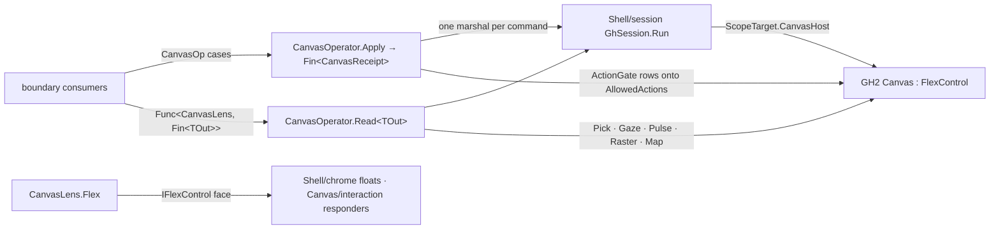

# [RASM_GRASSHOPPER_CANVAS_CANVAS]

The canvas operator of the Grasshopper boundary — ONE command gate (`CanvasOperator.Apply`) and ONE projection gate (`CanvasOperator.Read`) over the live GH2 `Canvas`, absorbing viewport navigation, projection writes, marquee lifecycle, sparkle overlays, action-policy mutation, window-select gating, and the inline text editor as cases of one `CanvasOp` union, and exposing pick resolution, coordinate mapping, viewport evidence, frame-cost telemetry, and canvas rasterization as typed reads on one `CanvasLens`. The census-era `CanvasOp` — nineteen provider-command cases with parallel request/result/snapshot families, boundary-owned finite-point validation, a local zoom-policy record, and a generic bounded cache — collapses here: numeric admission is the kernel's, repaint policy stays `Shell/session.md`'s `RepaintRow`, recency caching stays `SessionCache`, and every capability the census enumerated lands as a case, a row, or a lens read. The lens holds the canvas only inside one `GhSession.Run` marshal window; the `IFlexControl` face it exposes is the collection target `Shell/chrome.md` folds floats onto and the registration spine `Canvas/interaction.md` mounts responders through. Every fallible step rides an `Op`-keyed `Fin<T>` rail; every receipt proves itself through `ValidityClaim.All`. The census `ShowValueEditorPopup` entry is deleted — the member is `internal` on the decompiled host — and the parameter value editor is reachable only through the host's own edit-cursor flow.

## [01]-[INDEX]

- [02]-[LENS]: `PickGates` + `PickHit` + `PickReceipt` + `CanvasGaze` + `FramePulse` + `RasterPlan` + `CanvasLens` — the typed read surface: pick-map resolution, coordinate mapping, viewport and telemetry evidence, and bitmap projection inside one marshal window.
- [03]-[OPERATOR]: `NavTarget` + `SparkleSpec` + `ActionGate` + `SelectGates` + `InlinePrompt` + `CanvasOp` + `CanvasOperator` — the command union and the two gates.

## [02]-[LENS]

- Owner: `CanvasLens` `readonly record struct` — the marshal-window view of the live canvas. `Flex` exposes the host `IFlexControl` face (the float-collection target and responsive spine consumers compose), `Map` converts a `PointF` or `RectangleF` between the three host frames (`Screen`/`Control`/`Content` — the host `CoordinateSystem` stays the seam enum), `Pick` resolves the offscreen pick map at a point under `PickGates`, `Gaze` snapshots the viewport, `Pulse` snapshots the per-layer frame costs, `Raster` projects the canvas to a `Bitmap`, and `PickChart` projects the raw id buffer. A lens exists only inside the `Read` projection lambda that received it — the `GhScope` escape law verbatim; holding a lens across turns is the foreclosed defect because acquisition is per-`Read` against live statics.
- Owner: `PickGates` `readonly record struct` — the five pick-map admission axes (`Grips`, `Foreground`, `Background`, `Wires`, `Recursive`) with three canonical rows: `Everything`, `Surfaces` (objects fore and back, no grips, no wires), `WiresOnly`. `PickHit` `[Union]` is the typed pick verdict projected from the host `SelectionResult` by its `Pick` kind: `WireCase(WireEnds)`, `InletCase(Guid)`, `OutletCase(Guid)`, `SurfaceCase(Guid, bool Foreground)`, `VoidCase` — total over the host's six-member `Pick` enum with `BackgroundObject`/`ForegroundObject` folded onto one case whose flag is data. `PickReceipt` carries the hit plus the selection deltas (`SelectedObjects`/`SelectedWires`/`DeselectedObjects`/`DeselectedWires`) the host accumulated during resolution.
- Owner: `CanvasGaze` — the viewport evidence record: projection origin and zoom, `VisibleFrame`, `ContentBounds`, `InnerBounds`, the window-select gate triple, the two ZUI states (`VariableParameter`, `WireDetailing`), nested-navigation and viewport-drag flags. `FramePulse` — the paint-cost telemetry row: the host's seven per-layer durations (`Grid`/`Wire`/`Text`/`Icon`/`Shape`/`Layout`/`FullFrame`), the redraw-budget evidence a profiling consumer folds without touching paint.
- Owner: `RasterPlan` `readonly record struct` — bitmap projection intent: `Option<(int Width, int Height)>` size plus the three layer toggles (`Background`/`Wires`/`Messages`). A `None` size dispatches the parameterless `DrawToBitmap()`; a sized plan dispatches the five-argument overload — one plan, two host arities, discriminated by the value.
- Law: pick resolution is the two-surface host contract — `DrawPickMap()` renders the id buffer, `ResolvePick(point, includeGrips, includeForeground, includeBackground, includeWires, recursive)` reads it — and `PickGates` is the ONLY spelling of the five booleans: a raw five-`bool` call site is the deleted form, and the gate row IS the pick modality (`Canvas/wires.md` picks with `WiresOnly`, drag admission picks with `Surfaces`).
- Law: `Map` is the one coordinate authority — the census parallel content/control transform and its finite-point admission are killed; a point arrives as host `PointF` data and leaves as host `PointF` data, and a kernel consumer needing admitted numerics admits at its own seam.
- Boundary: repaint of THIS canvas is `Shell/session.md`'s `RepaintRow`; `CanvasOperator.FlexPulse` covers only non-canvas flex controls (chrome floats, hosted flex panes) where the session rows cannot reach. The eight paint fences are `Canvas/paint.md`'s; wire routes and wire picking policy are `Canvas/wires.md`'s; responder registration and focus are `Canvas/interaction.md`'s.
- Packages: Grasshopper2 (`Canvas`, `FlexControl.Map`/`Projection`/`VisibleFrame`/`ContentBounds`/`InnerBounds`, `Canvas.ResolvePick`/`DrawPickMap`/`DrawToBitmap`, `Canvas.WindowSelectObjects`/`WindowSelectWires`/`WindowSelectGroups`, `Canvas.ZuiVariableParameterState`/`ZuiWireDetailingState`, `Canvas.InNestedNavigationMode`/`ViewportDragging`, the seven layer-duration properties, `SelectionResult`, `Pick`, `WireEnds`), Eto.Drawing (`PointF`, `RectangleF`, `Bitmap`), LanguageExt.Core, `Rasm.Domain`.
- Growth: a new read is one method on the lens; a new pick modality is one `PickGates` row; a new telemetry axis is one field on the evidence record — the gates never widen.

```csharp signature
// --- [RUNTIME_PRELUDE] ----------------------------------------------------------------------
using Rasm.Csp;
using Rasm.Grasshopper.Shell;
using HostCanvas = Grasshopper2.UI.Canvas.Canvas;

namespace Rasm.Grasshopper.Canvas;

// --- [TYPES] --------------------------------------------------------------------------------
[Union]
public abstract partial record PickHit {
    private PickHit() { }
    public sealed record WireCase(WireEnds Wire) : PickHit;
    public sealed record InletCase(Guid Parameter) : PickHit;
    public sealed record OutletCase(Guid Parameter) : PickHit;
    public sealed record SurfaceCase(Guid Object, bool Foreground) : PickHit;
    public sealed record VoidCase : PickHit;

    internal static PickHit Of(SelectionResult result) => result.Kind switch {
        Pick.Wire => new WireCase(Wire: result.WireUnderPick),
        Pick.Inlet => new InletCase(Parameter: result.InletUnderPick),
        Pick.Outlet => new OutletCase(Parameter: result.OutletUnderPick),
        Pick.BackgroundObject => new SurfaceCase(Object: result.ObjectUnderPick, Foreground: false),
        Pick.ForegroundObject => new SurfaceCase(Object: result.ObjectUnderPick, Foreground: true),
        Pick.None => new VoidCase(),
        var kind => new VoidCase(),
    };
}

// --- [MODELS] -------------------------------------------------------------------------------
[BoundaryAdapter, StructLayout(LayoutKind.Auto)]
public readonly record struct PickGates(bool Grips, bool Foreground, bool Background, bool Wires, bool Recursive) {
    public static readonly PickGates Everything = new(Grips: true, Foreground: true, Background: true, Wires: true, Recursive: true);
    public static readonly PickGates Surfaces = new(Grips: false, Foreground: true, Background: true, Wires: false, Recursive: true);
    public static readonly PickGates WiresOnly = new(Grips: false, Foreground: false, Background: false, Wires: true, Recursive: false);
}

[BoundaryAdapter, StructLayout(LayoutKind.Auto)]
public readonly record struct PickReceipt(
    PointF At, PickHit Hit, int SelectedObjects, int SelectedWires, int DeselectedObjects, int DeselectedWires) : IValidityEvidence {
    public bool IsValid => ValidityClaim.All(
        ValidityClaim.Of(holds: SelectedObjects >= 0 && SelectedWires >= 0),
        ValidityClaim.Of(holds: DeselectedObjects >= 0 && DeselectedWires >= 0));
}

[BoundaryAdapter, StructLayout(LayoutKind.Auto)]
public readonly record struct SelectGates(bool Objects, bool Wires, bool Groups) {
    public static readonly SelectGates All = new(Objects: true, Wires: true, Groups: true);
}

[BoundaryAdapter, StructLayout(LayoutKind.Auto)]
public readonly record struct CanvasGaze(
    PointF Origin, float Zoom, RectangleF VisibleFrame, RectangleF ContentBounds, RectangleF InnerBounds,
    SelectGates Selectable, float VariableParameterState, float WireDetailingState, bool NestedNavigation, bool ViewportDragging) : IValidityEvidence {
    public bool IsValid => ValidityClaim.All(
        ValidityClaim.Of(holds: float.IsFinite(Zoom) && Zoom > 0f),
        ValidityClaim.UnitInterval(value: VariableParameterState),
        ValidityClaim.UnitInterval(value: WireDetailingState));
}

[BoundaryAdapter, StructLayout(LayoutKind.Auto)]
public readonly record struct FramePulse(
    TimeSpan Grid, TimeSpan Wire, TimeSpan Text, TimeSpan Icon, TimeSpan Shape, TimeSpan Layout, TimeSpan FullFrame) : IValidityEvidence {
    public bool IsValid => ValidityClaim.All(
        ValidityClaim.Nonnegative(value: FullFrame.TotalSeconds),
        ValidityClaim.Nonnegative(value: Grid.TotalSeconds + Wire.TotalSeconds + Text.TotalSeconds + Icon.TotalSeconds + Shape.TotalSeconds + Layout.TotalSeconds));
}

[BoundaryAdapter, StructLayout(LayoutKind.Auto)]
public readonly record struct RasterPlan(Option<(int Width, int Height)> Size, bool Background, bool Wires, bool Messages) {
    public static readonly RasterPlan Full = new(Size: Option<(int, int)>.None, Background: true, Wires: true, Messages: true);
}

[BoundaryAdapter, StructLayout(LayoutKind.Auto)]
public readonly record struct CanvasLens {
    private CanvasLens(HostCanvas surface) => Surface = surface;
    internal HostCanvas Surface { get; }
    public IFlexControl Flex => Surface;

    internal static Fin<CanvasLens> Of(GhScope scope, Op key) =>
        scope.Canvas.ToFin(key.MissingContext()).Map(static surface => new CanvasLens(surface: surface));

    public PointF Map(PointF point, CoordinateSystem from, CoordinateSystem to) => Surface.Map(point, from, to);
    public RectangleF Map(RectangleF frame, CoordinateSystem from, CoordinateSystem to) => Surface.Map(frame, from, to);

    public Fin<PickReceipt> Pick(PointF at, PickGates gates, Op key) {
        (HostCanvas surface, PickGates row) = (Surface, gates);
        return key.Catch(body: () => Fin.Succ(surface.ResolvePick(
                at, includeGrips: row.Grips, includeForeground: row.Foreground,
                includeBackground: row.Background, includeWires: row.Wires, recursive: row.Recursive)))
            .Map(result => new PickReceipt(
                At: at, Hit: PickHit.Of(result: result),
                SelectedObjects: result.SelectedObjectCount, SelectedWires: result.SelectedWireCount,
                DeselectedObjects: result.DeselectedObjectCount, DeselectedWires: result.DeselectedWireCount));
    }

    public Fin<CanvasGaze> Gaze(Op key) {
        HostCanvas surface = Surface;
        return key.Catch(body: () => Fin.Succ(new CanvasGaze(
            Origin: surface.Projection.Origin, Zoom: surface.Projection.Zoom,
            VisibleFrame: surface.VisibleFrame, ContentBounds: surface.ContentBounds, InnerBounds: surface.InnerBounds,
            Selectable: new SelectGates(Objects: surface.WindowSelectObjects, Wires: surface.WindowSelectWires, Groups: surface.WindowSelectGroups),
            VariableParameterState: surface.ZuiVariableParameterState, WireDetailingState: surface.ZuiWireDetailingState,
            NestedNavigation: surface.InNestedNavigationMode, ViewportDragging: surface.ViewportDragging)));
    }

    public Fin<FramePulse> Pulse(Op key) {
        HostCanvas surface = Surface;
        return key.Catch(body: () => Fin.Succ(new FramePulse(
            Grid: surface.GridDuration, Wire: surface.WireDuration, Text: surface.TextDuration,
            Icon: surface.IconDuration, Shape: surface.ShapeDuration, Layout: surface.LayoutDuration,
            FullFrame: surface.FullFrameDuration)));
    }

    public Fin<Bitmap> Raster(RasterPlan plan, Op key) {
        (HostCanvas surface, RasterPlan row) = (Surface, plan);
        return row.Size.Match(
            Some: size => key.Catch(body: () => Fin.Succ(surface.DrawToBitmap(
                size.Width, size.Height, drawBackground: row.Background, drawWires: row.Wires, drawMessages: row.Messages))),
            None: () => key.Catch(body: () => Fin.Succ(surface.DrawToBitmap())));
    }

    public Fin<Bitmap> PickChart(Op key) {
        HostCanvas surface = Surface;
        return key.Catch(body: () => Fin.Succ(surface.DrawPickMap()));
    }
}
```

## [03]-[OPERATOR]

- Owner: `CanvasOp` `[Union]` `[GenerateUnionOps]` — the closed command family: `NavigateCase(NavTarget)` steers the viewport, `ProjectionCase(Projection)` writes a computed projection outright (the host `Projection` value algebra — `SetOrigin`/`SetZoom`/`SetCentre`/`SetFrame`/`PerformPan`/`PerformZoom`/`PerformDollyZoom`/`Interpolate` — is the composition material a caller folds before the write; a second projection arithmetic beside it is the deleted form), `SparkleCase(SparkleSpec)` mounts an overlay, `MarqueeOpenCase`/`MarqueeCloseCase` bracket window selection through `BeginWindowSelect`/`EndWindowSelect`, `GatesCase(SelectGates)` writes the per-category marquee admission triple, `PolicyCase(Seq<(ActionGate, bool)>, Option<WireFilters>)` mutates the live action policy, and `EditCase(InlinePrompt)` opens the in-place text editor.
- Owner: `NavTarget` `[Union]` — the navigation family total over the three decompile-verified host `Navigate` overloads: `AnchorCase(ContentPosition, Duration)` (the eleven-member host anchor vocabulary — edges, corners, `Centre`, `Fit`, `HundredPercent` — stays the seam enum), `PointCase(PointF, float MinZoom, float MaxZoom, Duration)`, `FrameCase(RectangleF, float MinZoom, float MaxZoom, Duration)`. Zoom limits ride the case payload because the host tuple `(float min, float max)` is positional wire truth; a caller-exact span is not a host `Navigate` modality — exact timing composes a `Canvas/motion.md` tween against `ProjectionCase`.
- Owner: `SparkleSpec` `[Union]` — one case per PUBLIC host sparkle class, every case provider-shaped because the decompiled attached ctor forms take point providers: `BlastCase(BlastRadius, Func<PointF> At, Color, bool Attached)`, `EdgeCase(Func<PointF> A, Func<PointF> B, bool Attached)` (a static anchor lifts into a constant provider), `FaceCase(Func<GraphicsPath> Face, bool Attached)` (a static rectangle or built path lifts into a constant provider the same way), `NoticeCase(NoticeType Notice, Func<PointF> At, bool Attached)`, and `BespokeCase(ISparkle Sparkle)` — the consumer extension row over the public `ISparkle` contract, because `ScratchSparkle` and `PlussesSparkle` are `internal` on the decompiled host: unreachable kinds are not cases, and a consumer overlay (wipe, marching plusses, any custom stroke) implements `ISparkle` and mounts through the same gate. `Mint()` projects the case onto its host `ISparkle`; the host removes a finished sparkle itself (`ISparkle.Sparkling` is the host's own lifecycle), so no lease wraps the mount.
- Owner: `ActionGate` `[SmartEnum<int>]` — thirteen policy rows over TWO `[UseDelegateFromConstructor]` columns, `Write(CanvasActions, bool)` and `Read(CanvasActions)`: `Drag`, `WireSelect` (the host member is spelled `AlloWireSelect` — the decompiled truth, carried verbatim at the seam), `ObjectSelect`, `MakeWire`, `DeleteWire`, `ModifyWire`, `MakeObject`, `DeleteObject`, `ObjectResponse`, `DropFile`, `WireMenu`, `ObjectMenu`, `CanvasMenu`. `WireFilters` carries the two predicate slots (`MakeWireFilter`/`DeleteWireFilter`) as `Option<Func<(IParameter Source, IParameter Target), bool>>` values. The census nine-gate policy record was thin COVERAGE against the fifteen-member decompiled `CanvasActions`; the row table is total over it.
- Owner: `InlinePrompt` sealed record — the in-place editor intent: `Frame` (`RectangleF`), `Seed` (`string`), `Parse` (`Func<string, IResult>` — the host `Grasshopper2.Parsing` verdict contract carried at the seam), `Cancel` (`Option<Action>`). `CanvasReceipt` is the settlement evidence — raising `Op`, settled case name via `nameof`, marshal latency — implementing `IValidityEvidence`.
- Entry: `CanvasOperator.Apply(CanvasOp op, Op? key = null)` → `Fin<CanvasReceipt>`; `CanvasOperator.Read<TOut>(Func<CanvasLens, Fin<TOut>> project, Op? key = null)` → `Fin<TOut>`; `CanvasOperator.FlexPulse(IFlexControl surface, Option<TimeSpan> delay = default, Op? key = null)` → `Fin<Unit>` — deferred or immediate `ScheduleRedraw` on a NON-canvas flex control. Three entries, three demand shapes; everything else is internal.
- Law: `Apply` settles every case inside ONE `GhSession.Run(ScopeTarget.CanvasHost, ...)` marshal — acquisition, host verb, and receipt stamp share the window — and every case body runs under `Op.Catch`, so a throwing host call surfaces as its typed fault, never a half-stamped receipt.
- Law: policy mutation is row-driven — `PolicyCase` folds its `(ActionGate, bool)` rows through the `Write` column onto the live `AllowedActions`, and a `Some` filters payload writes BOTH predicate slots — a `None` slot clears its live filter, so clearing an installed predicate is expressible while an absent payload leaves both slots untouched; reading policy back is the same rows through `Read` (`CanvasOperator.Policy()` projects the full thirteen-row census in one read), so write and read vocabulary are one table and a new host gate is one row with both columns.
- Boundary: `Navigate`, `Projection`, `Map`, `AnimatedZoomFactor`, and `ScheduleRedraw` are `IFlexControl`-face members — the animation value they consume (`Animated<T>`, `Duration`) is `Canvas/motion.md`'s adapter vocabulary; this operator carries `Duration` only as opaque case payload. `SnapXAction`/`SnapYAction` and the snap solvers are `Canvas/layout.md`'s; drag interaction is `Canvas/interaction.md`'s.
- Packages: Grasshopper2 (`Canvas.BeginWindowSelect`/`EndWindowSelect`/`ShowInlineEditor`/`AllowedActions`, `FlexControl.Navigate`/`Projection`/`AddSparkle`/`ScheduleRedraw`, `CanvasActions`, `Projection`, `ContentPosition`, `Duration`, `BlastSparkle`/`EdgeSparkle`/`FaceSparkle`/`NoticeSparkle`, `ISparkle`, `NoticeType`, `IResult`), Eto.Drawing (`PointF`, `RectangleF`, `Color`, `GraphicsPath`), LanguageExt.Core, `Rasm.Domain`, `Shell/session.md` (`GhSession`, `ScopeTarget`).
- Growth: a new canvas verb is one `CanvasOp` case breaking every dispatch site loudly; a new public host sparkle is one `SparkleSpec` case and a consumer overlay is `BespokeCase` data; a new host gate is one `ActionGate` row; zero new entrypoints on any axis.

```csharp signature
// --- [RUNTIME_PRELUDE] ----------------------------------------------------------------------
using Rasm.Csp;
using Rasm.Grasshopper.Shell;
using HostCanvas = Grasshopper2.UI.Canvas.Canvas;

namespace Rasm.Grasshopper.Canvas;

// --- [TYPES] --------------------------------------------------------------------------------
[Union]
public abstract partial record NavTarget {
    private NavTarget() { }
    public sealed record AnchorCase(ContentPosition Anchor, Duration Span) : NavTarget;
    public sealed record PointCase(PointF At, float MinZoom, float MaxZoom, Duration Span) : NavTarget;
    public sealed record FrameCase(RectangleF Frame, float MinZoom, float MaxZoom, Duration Span) : NavTarget;

    internal Fin<Unit> Steer(HostCanvas surface, Op key) => Switch(
        state: (Surface: surface, Key: key),
        anchorCase: static (s, c) => s.Key.Catch(body: () => Fin.Succ(Op.Side(action: () => s.Surface.Navigate(c.Anchor, c.Span)))),
        pointCase: static (s, c) => s.Key.Catch(body: () => Fin.Succ(Op.Side(action: () => s.Surface.Navigate(c.At, (c.MinZoom, c.MaxZoom), c.Span)))),
        frameCase: static (s, c) => s.Key.Catch(body: () => Fin.Succ(Op.Side(action: () => s.Surface.Navigate(c.Frame, (c.MinZoom, c.MaxZoom), c.Span)))));
}

[Union]
public abstract partial record SparkleSpec {
    private SparkleSpec() { }
    public sealed record BlastCase(BlastRadius Radius, Func<PointF> At, Color Colour, bool Attached) : SparkleSpec;
    public sealed record EdgeCase(Func<PointF> A, Func<PointF> B, bool Attached) : SparkleSpec;
    public sealed record FaceCase(Func<GraphicsPath> Face, bool Attached) : SparkleSpec;
    public sealed record NoticeCase(NoticeType Notice, Func<PointF> At, bool Attached) : SparkleSpec;
    public sealed record BespokeCase(ISparkle Sparkle) : SparkleSpec;

    internal ISparkle Mint() => Switch(
        blastCase: static c => new BlastSparkle(c.Radius, c.At, c.Colour, c.Attached),
        edgeCase: static c => new EdgeSparkle(c.A, c.B, c.Attached),
        faceCase: static c => new FaceSparkle(c.Face, c.Attached),
        noticeCase: static c => new NoticeSparkle(c.Notice, c.At, c.Attached),
        bespokeCase: static c => c.Sparkle);
}

[SmartEnum<int>]
public sealed partial class ActionGate {
    public static readonly ActionGate Drag = new(key: 0, write: static (a, v) => a.AllowDrag = v, read: static a => a.AllowDrag);
    public static readonly ActionGate WireSelect = new(key: 1, write: static (a, v) => a.AlloWireSelect = v, read: static a => a.AlloWireSelect);
    public static readonly ActionGate ObjectSelect = new(key: 2, write: static (a, v) => a.AllowObjectSelect = v, read: static a => a.AllowObjectSelect);
    public static readonly ActionGate MakeWire = new(key: 3, write: static (a, v) => a.AllowMakeWire = v, read: static a => a.AllowMakeWire);
    public static readonly ActionGate DeleteWire = new(key: 4, write: static (a, v) => a.AllowDeleteWire = v, read: static a => a.AllowDeleteWire);
    public static readonly ActionGate ModifyWire = new(key: 5, write: static (a, v) => a.AllowModifyWire = v, read: static a => a.AllowModifyWire);
    public static readonly ActionGate MakeObject = new(key: 6, write: static (a, v) => a.AllowMakeObject = v, read: static a => a.AllowMakeObject);
    public static readonly ActionGate DeleteObject = new(key: 7, write: static (a, v) => a.AllowDeleteObject = v, read: static a => a.AllowDeleteObject);
    public static readonly ActionGate ObjectResponse = new(key: 8, write: static (a, v) => a.AllowObjectResponse = v, read: static a => a.AllowObjectResponse);
    public static readonly ActionGate DropFile = new(key: 9, write: static (a, v) => a.AllowDropFile = v, read: static a => a.AllowDropFile);
    public static readonly ActionGate WireMenu = new(key: 10, write: static (a, v) => a.AllowWireMenu = v, read: static a => a.AllowWireMenu);
    public static readonly ActionGate ObjectMenu = new(key: 11, write: static (a, v) => a.AllowObjectMenu = v, read: static a => a.AllowObjectMenu);
    public static readonly ActionGate CanvasMenu = new(key: 12, write: static (a, v) => a.AllowCanvasMenu = v, read: static a => a.AllowCanvasMenu);

    [UseDelegateFromConstructor] internal partial void Write(CanvasActions actions, bool allowed);
    [UseDelegateFromConstructor] internal partial bool Read(CanvasActions actions);
}

[Union]
[GenerateUnionOps]
public abstract partial record CanvasOp {
    private CanvasOp() { }
    public sealed record NavigateCase(NavTarget Target) : CanvasOp;
    public sealed record ProjectionCase(Projection Next) : CanvasOp;
    public sealed record SparkleCase(SparkleSpec Spec) : CanvasOp;
    public sealed record MarqueeOpenCase : CanvasOp;
    public sealed record MarqueeCloseCase : CanvasOp;
    public sealed record GatesCase(SelectGates Gates) : CanvasOp;
    public sealed record PolicyCase(Seq<(ActionGate Gate, bool Allowed)> Rows, Option<WireFilters> Filters) : CanvasOp;
    public sealed record EditCase(InlinePrompt Prompt) : CanvasOp;
}

// --- [MODELS] -------------------------------------------------------------------------------
public sealed record WireFilters(
    Option<Func<(IParameter Source, IParameter Target), bool>> Make,
    Option<Func<(IParameter Source, IParameter Target), bool>> Delete);

public sealed record InlinePrompt(RectangleF Frame, string Seed, Func<string, IResult> Parse, Option<Action> Cancel);

[BoundaryAdapter, StructLayout(LayoutKind.Auto)]
public readonly record struct CanvasReceipt(Op Operation, string Verb, TimeSpan Latency) : IValidityEvidence {
    public bool IsValid => ValidityClaim.All(
        ValidityClaim.Of(holds: !string.IsNullOrWhiteSpace(value: Verb)),
        ValidityClaim.Nonnegative(value: Latency.TotalSeconds));
}

// --- [OPERATIONS] ---------------------------------------------------------------------------
[BoundaryAdapter]
public static class CanvasOperator {
    public static Fin<TOut> Read<TOut>(Func<CanvasLens, Fin<TOut>> project, Op? key = null) {
        Op op = key.OrDefault();
        return from valid in op.Need(value: project)
               from output in GhSession.Run(ScopeTarget.CanvasHost, scope => CanvasLens.Of(scope: scope, key: op).Bind(valid), key: op)
               select output;
    }

    public static Fin<CanvasReceipt> Apply(CanvasOp op, Op? key = null) {
        Op active = key.OrDefault();
        long entered = Environment.TickCount64;
        return active.Need(value: op)
            .Bind(valid => GhSession.Run(ScopeTarget.CanvasHost, scope =>
                CanvasLens.Of(scope: scope, key: active).Bind(lens => valid.Switch(
                    state: (Surface: lens.Surface, Key: active),
                    navigateCase: static (s, c) => c.Target.Steer(surface: s.Surface, key: s.Key).Map(static _ => nameof(CanvasOp.NavigateCase)),
                    projectionCase: static (s, c) => s.Key.Catch(body: () => Fin.Succ(Op.Side(action: () => s.Surface.Projection = c.Next)))
                        .Map(static _ => nameof(CanvasOp.ProjectionCase)),
                    sparkleCase: static (s, c) => s.Key.Catch(body: () => Fin.Succ(Op.Side(action: () => s.Surface.AddSparkle(c.Spec.Mint()))))
                        .Map(static _ => nameof(CanvasOp.SparkleCase)),
                    marqueeOpenCase: static (s, _) => s.Key.Catch(body: () => Fin.Succ(Op.Side(action: s.Surface.BeginWindowSelect)))
                        .Map(static _ => nameof(CanvasOp.MarqueeOpenCase)),
                    marqueeCloseCase: static (s, _) => s.Key.Catch(body: () => Fin.Succ(Op.Side(action: s.Surface.EndWindowSelect)))
                        .Map(static _ => nameof(CanvasOp.MarqueeCloseCase)),
                    gatesCase: static (s, c) => s.Key.Catch(body: () => Fin.Succ(Op.Side(action: () => {
                            s.Surface.WindowSelectObjects = c.Gates.Objects;
                            s.Surface.WindowSelectWires = c.Gates.Wires;
                            s.Surface.WindowSelectGroups = c.Gates.Groups;
                        })))
                        .Map(static _ => nameof(CanvasOp.GatesCase)),
                    policyCase: static (s, c) => s.Key.Catch(body: () => Fin.Succ(Op.Side(action: () => {
                            c.Rows.Iter(row => row.Gate.Write(actions: s.Surface.AllowedActions, allowed: row.Allowed));
                            c.Filters.Iter(filters => {
                                s.Surface.AllowedActions.MakeWireFilter = filters.Make.MatchUnsafe(Some: static held => held, None: static () => null);
                                s.Surface.AllowedActions.DeleteWireFilter = filters.Delete.MatchUnsafe(Some: static held => held, None: static () => null);
                            });
                        })))
                        .Map(static _ => nameof(CanvasOp.PolicyCase)),
                    editCase: static (s, c) => s.Key.Catch(body: () => Fin.Succ(Op.Side(action: () =>
                            s.Surface.ShowInlineEditor(c.Prompt.Frame, c.Prompt.Seed, c.Prompt.Parse,
                                c.Prompt.Cancel.MatchUnsafe(Some: static held => held, None: static () => null)))))
                        .Map(static _ => nameof(CanvasOp.EditCase)))), key: active))
            .Map(verb => new CanvasReceipt(
                Operation: active, Verb: verb, Latency: TimeSpan.FromMilliseconds(value: Environment.TickCount64 - entered)));
    }

    public static Fin<Seq<(ActionGate Gate, bool Allowed)>> Policy(Op? key = null) {
        Op op = key.OrDefault();
        return Read(lens => op.Catch(body: () => Fin.Succ(
            toSeq(ActionGate.Items).Map(gate => (Gate: gate, Allowed: gate.Read(actions: lens.Surface.AllowedActions))).Strict())), key: op);
    }

    public static Fin<Unit> FlexPulse(IFlexControl surface, Option<TimeSpan> delay = default, Op? key = null) {
        Op op = key.OrDefault();
        return from live in op.Need(value: surface)
               from _ in EtoDispatch.Run(body: () => delay.Match(
                   Some: span => op.Catch(body: () => Fin.Succ(Op.Side(action: () => live.ScheduleRedraw(span)))),
                   None: () => op.Catch(body: () => Fin.Succ(Op.Side(action: live.ScheduleRedraw)))), key: op)
               select unit;
    }
}
```



## [04]-[DENSITY_BAR]

| [INDEX] | [CONCERN]           | [OWNER]                          | [KIND]                                            | [RAIL]                              | [CASES] |
| :-----: | :------------------ | :------------------------------- | :------------------------------------------------ | :---------------------------------- | :-----: |
|  [01]   | canvas commands     | `CanvasOp` + `CanvasReceipt`     | `[GenerateUnionOps]` `[Union]` + evidence receipt | `Apply → Fin<CanvasReceipt>`        |    8    |
|  [02]   | viewport navigation | `NavTarget`                      | closed `[Union]` over host `Navigate` overloads   | `Steer → Fin<Unit>` (internal)      |    3    |
|  [03]   | overlay sparkles    | `SparkleSpec`                    | closed `[Union]`, public host kinds + bespoke row | `Mint → ISparkle` (internal)        |    5    |
|  [04]   | action policy       | `ActionGate` + `WireFilters`     | `[SmartEnum<int>]` dual-column rows               | `Write`/`Read` (internal)           |   13    |
|  [05]   | typed reads         | `CanvasLens` + evidence records  | marshal-window lens + `IValidityEvidence` rows    | `Read<TOut> → Fin<TOut>`            |    1    |
|  [06]   | pick resolution     | `PickGates` + `PickHit`          | preset rows + closed verdict `[Union]`            | `Pick → Fin<PickReceipt>`           |   3+5   |

`GhSession`, `ScopeTarget`, `EtoDispatch`, `Op`, `Fault`, `ValidityClaim`, and the host `Projection` value algebra are composed upstream owners. The census `CanvasOp` request/result/snapshot families, `ZoomPolicy`, finite-point admission, and `BoundedCache` have no successor shape — their capabilities land as the cases, rows, and lens reads above; the census `ShowValueEditorPopup` and `CanvasPaintPhase` members are phantom kills.
