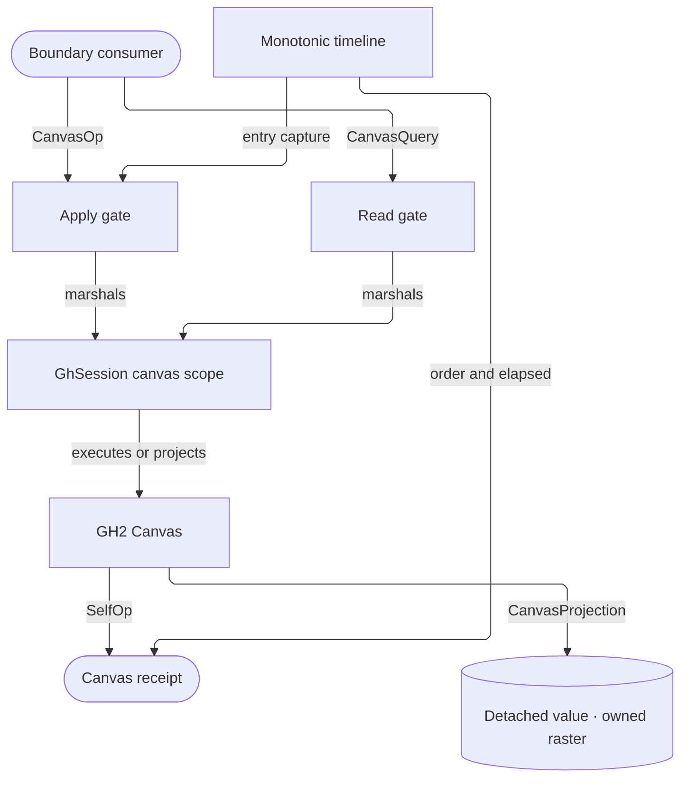

# [RASM_GRASSHOPPER_CANVAS_CANVAS]

Grasshopper's canvas boundary owns one command gate and one projection gate over the live GH2 `Canvas`. `CanvasOp` absorbs public mutable canvas behavior behind total generated dispatch, `CanvasQuery` closes read demand over detached `CanvasProjection` values, and `GhSession.Run` bounds every host interaction. Command receipts carry the case-generated `SelfOp` identity with ordered evidence from one injected `MonotonicTimeline`.

## [01]-[INDEX]

- [02]-[LENS]: `PickGates` + `PickHit` + `PickReceipt` + `CanvasState` + `FramePulse` + `RasterPlan` + `CanvasQuery` + `CanvasProjection` + `CanvasLens` — typed pick, coordinate, state, telemetry, and owned-raster reads.
- [03]-[OPERATOR]: `NavTarget` + `SparkleSpec` + `ActionGate` + `SelectGates` + `InlinePrompt` + `CanvasOp` + `CanvasReceipt` + `CanvasOperator` — the closed command family and boundary gates.
- [04]-[OWNER_MAP]: the growth axis for each canvas owner.

## [02]-[LENS]

- Owner: `CanvasQuery` `[Union]` — the closed coordinate, pick, state, telemetry, and raster demand vocabulary. `CanvasProjection` `[Union]` carries only detached values or an owned bitmap lease, while the internal `CanvasLens` readonly ref struct executes one admitted query inside the marshal and exposes no live host member.
- Owner: `PickGates` readonly record struct — the five `ResolvePick` admission axes with `Everything`, `Surfaces`, and `WiresOnly` policy rows. `PickHit` projects every admitted `SelectionResult.Kind` into a payload-valid case, and `PickReceipt` couples the finite origin with nonnegative selection deltas.
- Owner: `CanvasState` — the immutable canvas projection. Its validity fold proves finite projection and frame values, complete action-policy evidence, admitted snap evidence, immutable host skin values, logical `CursorMode`, and both ZUI unit intervals. `FramePulse` proves nonnegative layer costs bounded by the full-frame duration.
- Owner: `RasterPlan` `[Union]` — `FullCase`, `SizedCase`, and `PickMapCase` select the host raster modality. `Sized` admits both dimensions, and every raster leaves as `Lease<Bitmap>.Owned`.
- Law: `ResolvePick` queries the document and wire cache directly. `DrawPickMap` independently applies the same resolver across the pixel grid for diagnostics, so point picking and diagnostic rendering share policy without sharing lifetime.
- Law: `Map` is the coordinate authority for host `Screen`/`Control`/`Content` frames; `CanvasQuery` admits the source value and frames, and `CanvasProjection` admits the mapped result.
- Boundary: `RepaintRow` owns this canvas's repaint policy; `FlexPulse` serves non-canvas flex controls. Canvas paint, wire routing, and responder registration remain separate canvas owners. Rasters leave as Eto `Bitmap` leases — `BitmapData` pixel locking belongs to the consumer's measured kernel, and `IndexedBitmap` carries no GH2 payload.
- Packages: Grasshopper2 (`Canvas`, `FlexControl.Map`, `Projection`, canvas bounds, pick and raster surfaces, action and selection policy, snap axes, skins, cursors, ZUI and navigation state, layer durations, `SelectionResult`, `Pick`, `WireEnds`), Eto.Drawing (`PointF`, `RectangleF`, `Bitmap`), LanguageExt.Core, `Rasm.Domain`, `Rasm.Numerics`.
- Growth: a new read is one `CanvasQuery` case with its `CanvasProjection` case, a new pick modality is one `PickGates` row, and a new raster modality is one `RasterPlan` case.

```csharp signature
// --- [RUNTIME_PRELUDE] ----------------------------------------------------------------------
using Rasm.Csp;
using Rasm.Grasshopper.Shell;
using Rasm.Numerics;
using Grasshopper2.UI.Skinning;
using HostCanvas = Grasshopper2.UI.Canvas.Canvas;

namespace Rasm.Grasshopper.Canvas;

// --- [TYPES] --------------------------------------------------------------------------------
[Union]
public abstract partial record PickHit : IValidityEvidence {
    private PickHit() { }
    public sealed record WireCase(WireEnds Wire) : PickHit;
    public sealed record InletCase(Guid Parameter) : PickHit;
    public sealed record OutletCase(Guid Parameter) : PickHit;
    public sealed record SurfaceCase(Guid Object, bool Foreground) : PickHit;
    public sealed record VoidCase : PickHit;

    public bool IsValid => Switch(
        wireCase: static hit => hit.Wire.Source != Guid.Empty && hit.Wire.Target != Guid.Empty,
        inletCase: static hit => hit.Parameter != Guid.Empty,
        outletCase: static hit => hit.Parameter != Guid.Empty,
        surfaceCase: static hit => hit.Object != Guid.Empty,
        voidCase: static _ => true);

    internal static Fin<PickHit> Of(SelectionResult result, Op key) => result.Kind switch {
        Pick.Wire => Fin.Succ<PickHit>(new WireCase(Wire: result.WireUnderPick)),
        Pick.Inlet => Fin.Succ<PickHit>(new InletCase(Parameter: result.InletUnderPick)),
        Pick.Outlet => Fin.Succ<PickHit>(new OutletCase(Parameter: result.OutletUnderPick)),
        Pick.BackgroundObject => Fin.Succ<PickHit>(new SurfaceCase(Object: result.ObjectUnderPick, Foreground: false)),
        Pick.ForegroundObject => Fin.Succ<PickHit>(new SurfaceCase(Object: result.ObjectUnderPick, Foreground: true)),
        Pick.None => Fin.Succ<PickHit>(new VoidCase()),
        _ => Fin.Fail<PickHit>(key.InvalidResult(detail: $"Unsupported host pick kind: {result.Kind}.")),
    };
}

// --- [MODELS] -------------------------------------------------------------------------------
[BoundaryAdapter, StructLayout(LayoutKind.Auto)]
public readonly record struct PickGates(bool Grips, bool Foreground, bool Background, bool Wires, bool Recursive) {
    public static readonly PickGates Everything = new(Grips: true, Foreground: true, Background: true, Wires: true, Recursive: true);
    public static readonly PickGates Surfaces = new(Grips: false, Foreground: true, Background: true, Wires: false, Recursive: true);
    public static readonly PickGates WiresOnly = new(Grips: false, Foreground: false, Background: false, Wires: true, Recursive: false);
}

[BoundaryAdapter, StructLayout(LayoutKind.Auto)]
public readonly record struct PickReceipt(
    PointF At, PickHit Hit, int SelectedObjects, int SelectedWires, int DeselectedObjects, int DeselectedWires) : IValidityEvidence {
    public bool IsValid => ValidityClaim.All(
        ValidityClaim.Of(holds: float.IsFinite(At.X) && float.IsFinite(At.Y)),
        ValidityClaim.Evidence(evidence: Hit),
        ValidityClaim.Of(holds: SelectedObjects >= 0 && SelectedWires >= 0),
        ValidityClaim.Of(holds: DeselectedObjects >= 0 && DeselectedWires >= 0));
}

[BoundaryAdapter, StructLayout(LayoutKind.Auto)]
public readonly record struct SelectGates(bool Objects, bool Wires, bool Groups) {
    public static readonly SelectGates All = new(Objects: true, Wires: true, Groups: true);
}

[BoundaryAdapter, StructLayout(LayoutKind.Auto)]
public readonly record struct CanvasPolicy(
    Seq<(ActionGate Gate, bool Allowed)> Gates,
    WireFilters Filters) : IValidityEvidence {
    public bool IsValid => ValidityClaim.All(
        ValidityClaim.Of(holds: Gates.ForAll(static row => row.Gate is not null) &&
            Gates.Count == ActionGate.Items.Count &&
            Gates.Map(static row => row.Gate.Key).Distinct().Count == Gates.Count),
        ValidityClaim.Evidence(evidence: Filters));
}

[BoundaryAdapter, StructLayout(LayoutKind.Auto)]
public readonly record struct CanvasState(
    PointF Origin,
    float Zoom,
    RectangleF VisibleFrame,
    RectangleF ContentBounds,
    RectangleF InnerBounds,
    SelectGates Selectable,
    TimeSpan DwellDelay,
    Option<NudgeVector> SnapX,
    Option<NudgeVector> SnapY,
    Skin LitSkin,
    Skin DimSkin,
    Skin ActiveSkin,
    CursorMode Cursor,
    CanvasPolicy Policy,
    float VariableParameterState,
    float WireDetailingState,
    bool NestedNavigation,
    bool ViewportDragging) : IValidityEvidence {
    public bool IsValid => ValidityClaim.All(
        ValidityClaim.Of(holds: Finite(point: Origin)),
        ValidityClaim.Of(holds: float.IsFinite(Zoom) && Zoom > 0f),
        ValidityClaim.Of(holds: Finite(frame: VisibleFrame) && Finite(frame: ContentBounds) && Finite(frame: InnerBounds)),
        ValidityClaim.Of(holds: SnapX.ForAll(static snap => snap.IsValid) && SnapY.ForAll(static snap => snap.IsValid)),
        ValidityClaim.Of(holds: LitSkin is not null && DimSkin is not null && ActiveSkin is not null),
        ValidityClaim.Of(holds: Enum.IsDefined(Cursor)),
        ValidityClaim.Evidence(evidence: Policy),
        ValidityClaim.UnitInterval(value: VariableParameterState),
        ValidityClaim.UnitInterval(value: WireDetailingState));

    private static bool Finite(PointF point) => float.IsFinite(point.X) && float.IsFinite(point.Y);

    private static bool Finite(RectangleF frame) =>
        float.IsFinite(frame.X) && float.IsFinite(frame.Y) &&
        float.IsFinite(frame.Width) && frame.Width >= 0f &&
        float.IsFinite(frame.Height) && frame.Height >= 0f;
}

[BoundaryAdapter, StructLayout(LayoutKind.Auto)]
public readonly record struct FramePulse(
    TimeSpan Grid, TimeSpan Wire, TimeSpan Text, TimeSpan Icon, TimeSpan Shape, TimeSpan Layout, TimeSpan FullFrame) : IValidityEvidence {
    public bool IsValid => ValidityClaim.All(
        ValidityClaim.Nonnegative(value: Grid.TotalSeconds),
        ValidityClaim.Nonnegative(value: Wire.TotalSeconds),
        ValidityClaim.Nonnegative(value: Text.TotalSeconds),
        ValidityClaim.Nonnegative(value: Icon.TotalSeconds),
        ValidityClaim.Nonnegative(value: Shape.TotalSeconds),
        ValidityClaim.Nonnegative(value: Layout.TotalSeconds),
        ValidityClaim.Nonnegative(value: FullFrame.TotalSeconds),
        ValidityClaim.Of(holds: FullFrame >= Grid && FullFrame >= Wire && FullFrame >= Text &&
            FullFrame >= Icon && FullFrame >= Shape && FullFrame >= Layout));
}

[Union]
public abstract partial record RasterPlan : IValidityEvidence {
    private RasterPlan() { }
    public sealed record FullCase : RasterPlan;
    public sealed record SizedCase(Dimension Width, Dimension Height, bool Background, bool Wires, bool Messages) : RasterPlan;
    public sealed record PickMapCase : RasterPlan;

    public static RasterPlan Full { get; } = new FullCase();
    public static RasterPlan PickMap { get; } = new PickMapCase();

    public bool IsValid => Switch(
        fullCase: static _ => true,
        sizedCase: static plan => plan.Width.Value >= 1 && plan.Height.Value >= 1,
        pickMapCase: static _ => true);

    public static Fin<RasterPlan> Sized(
        int width,
        int height,
        bool background = true,
        bool wires = true,
        bool messages = true,
        Op? key = null) {
        Op op = key.OrDefault();
        return from admittedWidth in op.AcceptValidated<Dimension>(candidate: width)
               from admittedHeight in op.AcceptValidated<Dimension>(candidate: height)
               select (RasterPlan)new SizedCase(
                   Width: admittedWidth,
                   Height: admittedHeight,
                   Background: background,
                   Wires: wires,
                   Messages: messages);
    }
}

[Union]
public abstract partial record CanvasQuery : IValidityEvidence {
    private CanvasQuery() { }
    public sealed record MapPointCase(PointF Value, CoordinateSystem From, CoordinateSystem To) : CanvasQuery;
    public sealed record MapFrameCase(RectangleF Value, CoordinateSystem From, CoordinateSystem To) : CanvasQuery;
    public sealed record PickCase(PointF At, PickGates Gates) : CanvasQuery;
    public sealed record StateCase : CanvasQuery;
    public sealed record PulseCase : CanvasQuery;
    public sealed record RasterCase(RasterPlan Plan) : CanvasQuery;

    public bool IsValid => Switch(
        mapPointCase: static query => Finite(query.Value) && Frames(query.From, query.To),
        mapFrameCase: static query => Finite(query.Value) && Frames(query.From, query.To),
        pickCase: static query => Finite(query.At),
        stateCase: static _ => true,
        pulseCase: static _ => true,
        rasterCase: static query => ValidityClaim.Evidence(evidence: query.Plan));

    private static bool Finite(PointF point) => float.IsFinite(point.X) && float.IsFinite(point.Y);
    private static bool Finite(RectangleF frame) =>
        float.IsFinite(frame.X) && float.IsFinite(frame.Y) &&
        float.IsFinite(frame.Width) && frame.Width >= 0f &&
        float.IsFinite(frame.Height) && frame.Height >= 0f;
    private static bool Frames(CoordinateSystem from, CoordinateSystem to) => Enum.IsDefined(from) && Enum.IsDefined(to);
}

[Union]
public abstract partial record CanvasProjection : IValidityEvidence {
    private CanvasProjection() { }
    public sealed record PointCase(PointF Value) : CanvasProjection;
    public sealed record FrameCase(RectangleF Value) : CanvasProjection;
    public sealed record PickCase(PickReceipt Value) : CanvasProjection;
    public sealed record StateCase(CanvasState Value) : CanvasProjection;
    public sealed record PulseCase(FramePulse Value) : CanvasProjection;
    public sealed record RasterCase(Lease<Bitmap> Value) : CanvasProjection;

    public bool IsValid => Switch(
        pointCase: static result => float.IsFinite(result.Value.X) && float.IsFinite(result.Value.Y),
        frameCase: static result => float.IsFinite(result.Value.X) && float.IsFinite(result.Value.Y) &&
            float.IsFinite(result.Value.Width) && result.Value.Width >= 0f &&
            float.IsFinite(result.Value.Height) && result.Value.Height >= 0f,
        pickCase: static result => ValidityClaim.Evidence(evidence: result.Value),
        stateCase: static result => ValidityClaim.Evidence(evidence: result.Value),
        pulseCase: static result => ValidityClaim.Evidence(evidence: result.Value),
        rasterCase: static result => result.Value is not null && result.Value.Resource is not null);
}

[BoundaryAdapter]
internal readonly ref struct CanvasLens {
    internal CanvasLens(HostCanvas surface) => Surface = surface;
    private HostCanvas Surface { get; }

    internal Fin<CanvasProjection> Execute(CanvasQuery query, Op key) => query.Switch(
        state: (Surface: Surface, Key: key),
        mapPointCase: static (state, request) => Map(
                surface: state.Surface, point: request.Value, from: request.From, to: request.To, key: state.Key)
            .Map(static value => (CanvasProjection)new CanvasProjection.PointCase(Value: value)),
        mapFrameCase: static (state, request) => Map(
                surface: state.Surface, frame: request.Value, from: request.From, to: request.To, key: state.Key)
            .Map(static value => (CanvasProjection)new CanvasProjection.FrameCase(Value: value)),
        pickCase: static (state, request) => Pick(surface: state.Surface, at: request.At, gates: request.Gates, key: state.Key)
            .Map(static value => (CanvasProjection)new CanvasProjection.PickCase(Value: value)),
        stateCase: static (state, _) => State(surface: state.Surface, key: state.Key)
            .Map(static value => (CanvasProjection)new CanvasProjection.StateCase(Value: value)),
        pulseCase: static (state, _) => Pulse(surface: state.Surface, key: state.Key)
            .Map(static value => (CanvasProjection)new CanvasProjection.PulseCase(Value: value)),
        rasterCase: static (state, request) => Raster(surface: state.Surface, plan: request.Plan, key: state.Key)
            .Map(static value => (CanvasProjection)new CanvasProjection.RasterCase(Value: value)))
        .Bind(projected => key.AcceptValue(value: projected));

    private static Fin<PointF> Map(HostCanvas surface, PointF point, CoordinateSystem from, CoordinateSystem to, Op key) =>
        key.Catch(body: () => Fin.Succ(surface.Map(point, from, to)));

    private static Fin<RectangleF> Map(HostCanvas surface, RectangleF frame, CoordinateSystem from, CoordinateSystem to, Op key) =>
        key.Catch(body: () => Fin.Succ(surface.Map(frame, from, to)));

    private static Fin<PickReceipt> Pick(HostCanvas surface, PointF at, PickGates gates, Op key) {
        PickGates row = gates;
        return from result in key.Catch(body: () => Fin.Succ(surface.ResolvePick(
                       at, includeGrips: row.Grips, includeForeground: row.Foreground,
                       includeBackground: row.Background, includeWires: row.Wires, recursive: row.Recursive)))
                   .Bind(active => key.Need(value: active))
               from origin in Optional(result.Point).ToFin(Fail: key.InvalidResult())
               from _aligned in guard(origin.X == at.X && origin.Y == at.Y, key.InvalidResult()).ToFin()
               from hit in PickHit.Of(result: result, key: key)
               from receipt in key.AcceptValue(value: new PickReceipt(
                   At: origin,
                   Hit: hit,
                   SelectedObjects: result.SelectedObjectCount,
                   SelectedWires: result.SelectedWireCount,
                   DeselectedObjects: result.DeselectedObjectCount,
                   DeselectedWires: result.DeselectedWireCount))
               select receipt;
    }

    private static Fin<CanvasState> State(HostCanvas surface, Op key) {
        return key.Catch(body: () => {
            CanvasActions actions = surface.AllowedActions;
            return Fin.Succ(new CanvasState(
                Origin: surface.Projection.Origin, Zoom: surface.Projection.Zoom,
                VisibleFrame: surface.VisibleFrame, ContentBounds: surface.ContentBounds, InnerBounds: surface.InnerBounds,
                Selectable: new SelectGates(
                    Objects: surface.WindowSelectObjects,
                    Wires: surface.WindowSelectWires,
                    Groups: surface.WindowSelectGroups),
                DwellDelay: surface.MouseDwellDelay,
                SnapX: Optional(surface.SnapXAction).Map(static action => NudgeVector.Of(action: action)),
                SnapY: Optional(surface.SnapYAction).Map(static action => NudgeVector.Of(action: action)),
                LitSkin: surface.SkinLit, DimSkin: surface.SkinDim, ActiveSkin: surface.Skin,
                Cursor: surface.CursorMode,
                Policy: new CanvasPolicy(
                    Gates: toSeq(ActionGate.Items).Map(gate => (Gate: gate, Allowed: gate.Read(actions: actions))).Strict(),
                    Filters: new WireFilters(
                        Make: Optional(actions.MakeWireFilter),
                        Delete: Optional(actions.DeleteWireFilter))),
                VariableParameterState: surface.ZuiVariableParameterState,
                WireDetailingState: surface.ZuiWireDetailingState,
                NestedNavigation: surface.InNestedNavigationMode,
                ViewportDragging: surface.ViewportDragging));
        }).Bind(state => key.AcceptValue(value: state));
    }

    private static Fin<FramePulse> Pulse(HostCanvas surface, Op key) {
        return key.Catch(body: () => Fin.Succ(new FramePulse(
            Grid: surface.GridDuration, Wire: surface.WireDuration, Text: surface.TextDuration,
            Icon: surface.IconDuration, Shape: surface.ShapeDuration, Layout: surface.LayoutDuration,
            FullFrame: surface.FullFrameDuration)))
            .Bind(pulse => key.AcceptValue(value: pulse));
    }

    private static Fin<Lease<Bitmap>> Raster(HostCanvas surface, RasterPlan plan, Op key) =>
        key.AcceptValue(value: plan).Bind(row => row.Switch(
            state: (Surface: surface, Key: key),
            fullCase: static (state, _) => OwnedRaster(render: state.Surface.DrawToBitmap, key: state.Key),
            sizedCase: static (state, request) => OwnedRaster(
                render: () => state.Surface.DrawToBitmap(
                    request.Width.Value,
                    request.Height.Value,
                    drawBackground: request.Background,
                    drawWires: request.Wires,
                    drawMessages: request.Messages),
                key: state.Key),
            pickMapCase: static (state, _) => OwnedRaster(render: state.Surface.DrawPickMap, key: state.Key)));

    private static Fin<Lease<Bitmap>> OwnedRaster(Func<Bitmap?> render, Op key) =>
        from valid in key.Need(value: render)
        from bitmap in key.Catch(body: () => Optional(valid()).ToFin(Fail: key.InvalidResult()))
        select (Lease<Bitmap>)new Lease<Bitmap>.Owned(Value: bitmap);
}
```

## [03]-[OPERATOR]

- Owner: `CanvasOp` `[Union]` `[GenerateUnionOps]` — the closed command family over the host's public navigation, projection, dwell, sparkle, marquee, selection, policy, and inline-editing mutations. Each case validates its payload and returns its generated `SelfOp` from the same total dispatch that performs the mutation; logical `CursorMode` remains read-only because its setter is not public.
- Owner: `NavTarget` `[Union]` — the three `IFlexControl.Navigate` shapes. Its validity fold admits defined host enums, finite points and frames, positive ordered zoom bounds, and positive frame extents before the host call.
- Owner: `SparkleSpec` `[Union]` — the public host sparkle constructors and `BespokeCase(ISparkle)`. `BlastCase` carries the host's static `PointF`; edge, face, and notice cases carry the provider delegates their constructors consume. `Mint` projects one admitted case onto `ISparkle`, whose host lifecycle removes settled overlays.
- Owner: `ActionGate` `[SmartEnum<int>]` — the `CanvasActions` boolean vocabulary over paired `Write` and `Read` delegate columns. `WireFilters` carries both predicate slots, and policy admission rejects duplicate gates or invalid filter payloads.
- Owner: `InlinePrompt` — the content-frame editor intent with seed, parser, and optional cancellation callback. Its host adapters contain delayed callback exceptions after the opening marshal: parse faults become failed `IResult` values, and cancellation faults cannot escape the UI event. `CanvasReceipt` carries the generated command `Op`, ordered entry/settlement stamps, and elapsed evidence.
- Entry: `CanvasOperator.Apply(CanvasOp op, MonotonicTimeline timeline, Op? key = null)` → `Fin<CanvasReceipt>`; `CanvasOperator.Read(CanvasQuery query, Op? key = null)` → `Fin<CanvasProjection>`; `CanvasOperator.FlexPulse(IFlexControl surface, Option<TimeSpan> delay = default, Op? key = null)` → `Fin<Unit>`.
- Law: `Apply` admits the complete case, captures entry before the marshal, executes one case inside `GhSession.Run`, and captures settlement after the marshal. `CanvasReceipt.Of` derives order and elapsed time from the same timeline before acceptance.
- Law: policy mutation is row-driven — `PolicyCase` folds `(ActionGate, bool)` rows through `Write` onto `AllowedActions`, and a `Some` filters payload writes BOTH predicate slots. A `None` slot clears its live filter, while an absent payload leaves both slots untouched. `CanvasState.Policy` reads the same closed rows and both filter slots, so one immutable state projection carries the complete policy.
- Boundary: `IFlexControl` owns navigation, projection, coordinate mapping, and redraw scheduling; canvas motion, layout, and interaction owners compose those values without adding mutation gates here.
- Packages: Grasshopper2 (`Canvas`, `IFlexControl`, `CanvasActions`, `Projection`, `Duration`, `CursorMode`, the public sparkle family, `ISparkle`, `IResult`), Eto.Drawing, LanguageExt.Core, `Rasm.Domain`, and `Rasm.Parametric`.
- Growth: a command is one `CanvasOp` case, a public overlay is one `SparkleSpec` case, and an action gate is one dual-column `ActionGate` row.

```csharp signature
// --- [RUNTIME_PRELUDE] ----------------------------------------------------------------------
using Rasm.Csp;
using Rasm.Grasshopper.Shell;
using Rasm.Parametric;
using Grasshopper2.Parsing;
using Grasshopper2.UI.Sparkles;
using Duration = Grasshopper2.UI.Animation.Duration;
using HostCanvas = Grasshopper2.UI.Canvas.Canvas;

namespace Rasm.Grasshopper.Canvas;

// --- [TYPES] --------------------------------------------------------------------------------
[Union]
public abstract partial record NavTarget : IValidityEvidence {
    private NavTarget() { }
    public sealed record AnchorCase(ContentPosition Anchor, Duration Span) : NavTarget;
    public sealed record PointCase(PointF At, float MinZoom, float MaxZoom, Duration Span) : NavTarget;
    public sealed record FrameCase(RectangleF Frame, float MinZoom, float MaxZoom, Duration Span) : NavTarget;

    public bool IsValid => Switch(
        anchorCase: static target => Enum.IsDefined(target.Anchor) && Enum.IsDefined(target.Span),
        pointCase: static target => Finite(target.At) && Zoom(target.MinZoom, target.MaxZoom) && Enum.IsDefined(target.Span),
        frameCase: static target => Finite(target.Frame) && target.Frame.Width > 0f && target.Frame.Height > 0f &&
            Zoom(target.MinZoom, target.MaxZoom) && Enum.IsDefined(target.Span));

    internal Fin<Unit> Steer(HostCanvas surface, Op key) => Switch(
        state: (Surface: surface, Key: key),
        anchorCase: static (s, c) => s.Key.Catch(body: () => Fin.Succ(Op.Side(action: () => s.Surface.Navigate(c.Anchor, c.Span))))
            .Map(static _ => unit),
        pointCase: static (s, c) => s.Key.Catch(body: () => Fin.Succ(Op.Side(action: () => s.Surface.Navigate(c.At, (c.MinZoom, c.MaxZoom), c.Span))))
            .Map(static _ => unit),
        frameCase: static (s, c) => s.Key.Catch(body: () => Fin.Succ(Op.Side(action: () => s.Surface.Navigate(c.Frame, (c.MinZoom, c.MaxZoom), c.Span))))
            .Map(static _ => unit));

    private static bool Finite(PointF point) => float.IsFinite(point.X) && float.IsFinite(point.Y);
    private static bool Finite(RectangleF frame) =>
        float.IsFinite(frame.X) && float.IsFinite(frame.Y) && float.IsFinite(frame.Width) && float.IsFinite(frame.Height);
    private static bool Zoom(float minimum, float maximum) =>
        float.IsFinite(minimum) && minimum > 0f && float.IsFinite(maximum) && minimum <= maximum;
}

[Union]
public abstract partial record SparkleSpec : IValidityEvidence {
    private SparkleSpec() { }
    public sealed record BlastCase(BlastRadius Radius, PointF At, Color Colour, bool Attached) : SparkleSpec;
    public sealed record EdgeCase(Func<PointF> A, Func<PointF> B, bool Attached) : SparkleSpec;
    public sealed record FaceCase(Func<GraphicsPath> Face, bool Attached) : SparkleSpec;
    public sealed record NoticeCase(NoticeType Notice, Func<PointF> At, bool Attached) : SparkleSpec;
    public sealed record BespokeCase(ISparkle Sparkle) : SparkleSpec;

    public bool IsValid => Switch(
        blastCase: static spec => Enum.IsDefined(spec.Radius) && float.IsFinite(spec.At.X) && float.IsFinite(spec.At.Y),
        edgeCase: static spec => spec.A is not null && spec.B is not null,
        faceCase: static spec => spec.Face is not null,
        noticeCase: static spec => Enum.IsDefined(spec.Notice) && spec.At is not null,
        bespokeCase: static spec => spec.Sparkle is not null);

    internal ISparkle Mint() => Switch(
        blastCase: static c => new BlastSparkle(c.Radius, c.At, c.Colour, c.Attached),
        edgeCase: static c => new EdgeSparkle(c.A, c.B, c.Attached),
        faceCase: static c => new FaceSparkle(c.Face, c.Attached),
        noticeCase: static c => new NoticeSparkle(c.Notice, c.At, c.Attached),
        bespokeCase: static c => c.Sparkle);
}

[SmartEnum<int>]
public sealed partial class ActionGate {
    public static readonly ActionGate Drag = new(key: 0, write: static (a, v) => a.AllowDrag = v, read: static a => a.AllowDrag);
    public static readonly ActionGate WireSelect = new(key: 1, write: static (a, v) => a.AlloWireSelect = v, read: static a => a.AlloWireSelect);
    public static readonly ActionGate ObjectSelect = new(key: 2, write: static (a, v) => a.AllowObjectSelect = v, read: static a => a.AllowObjectSelect);
    public static readonly ActionGate MakeWire = new(key: 3, write: static (a, v) => a.AllowMakeWire = v, read: static a => a.AllowMakeWire);
    public static readonly ActionGate DeleteWire = new(key: 4, write: static (a, v) => a.AllowDeleteWire = v, read: static a => a.AllowDeleteWire);
    public static readonly ActionGate ModifyWire = new(key: 5, write: static (a, v) => a.AllowModifyWire = v, read: static a => a.AllowModifyWire);
    public static readonly ActionGate MakeObject = new(key: 6, write: static (a, v) => a.AllowMakeObject = v, read: static a => a.AllowMakeObject);
    public static readonly ActionGate DeleteObject = new(key: 7, write: static (a, v) => a.AllowDeleteObject = v, read: static a => a.AllowDeleteObject);
    public static readonly ActionGate ObjectResponse = new(key: 8, write: static (a, v) => a.AllowObjectResponse = v, read: static a => a.AllowObjectResponse);
    public static readonly ActionGate DropFile = new(key: 9, write: static (a, v) => a.AllowDropFile = v, read: static a => a.AllowDropFile);
    public static readonly ActionGate WireMenu = new(key: 10, write: static (a, v) => a.AllowWireMenu = v, read: static a => a.AllowWireMenu);
    public static readonly ActionGate ObjectMenu = new(key: 11, write: static (a, v) => a.AllowObjectMenu = v, read: static a => a.AllowObjectMenu);
    public static readonly ActionGate CanvasMenu = new(key: 12, write: static (a, v) => a.AllowCanvasMenu = v, read: static a => a.AllowCanvasMenu);

    [UseDelegateFromConstructor] internal partial void Write(CanvasActions actions, bool allowed);
    [UseDelegateFromConstructor] internal partial bool Read(CanvasActions actions);
}

[Union]
[GenerateUnionOps]
public abstract partial record CanvasOp : IValidityEvidence {
    private CanvasOp() { }
    public sealed partial record NavigateCase(NavTarget Target) : CanvasOp;
    public sealed partial record ProjectionCase(Projection Next) : CanvasOp;
    public sealed partial record DwellCase(TimeSpan Delay) : CanvasOp;
    public sealed partial record SparkleCase(SparkleSpec Spec) : CanvasOp;
    public sealed partial record MarqueeOpenCase : CanvasOp;
    public sealed partial record MarqueeCloseCase : CanvasOp;
    public sealed partial record GatesCase(SelectGates Gates) : CanvasOp;
    public sealed partial record PolicyCase(Seq<(ActionGate Gate, bool Allowed)> Rows, Option<WireFilters> Filters) : CanvasOp;
    public sealed partial record EditCase(InlinePrompt Prompt) : CanvasOp;

    public bool IsValid => Switch(
        navigateCase: static command => ValidityClaim.Evidence(evidence: command.Target),
        projectionCase: static command => command.Next is { } projection &&
            float.IsFinite(projection.Origin.X) && float.IsFinite(projection.Origin.Y) &&
            float.IsFinite(projection.Zoom) && projection.Zoom > 0f,
        dwellCase: static _ => true,
        sparkleCase: static command => ValidityClaim.Evidence(evidence: command.Spec),
        marqueeOpenCase: static _ => true,
        marqueeCloseCase: static _ => true,
        gatesCase: static _ => true,
        policyCase: static command => command.Rows.ForAll(static row => row.Gate is not null) &&
            command.Rows.Map(static row => row.Gate.Key).Distinct().Count == command.Rows.Count &&
            command.Filters.ForAll(static filters => filters.IsValid),
        editCase: static command => ValidityClaim.Evidence(evidence: command.Prompt));

    internal Fin<Op> Execute(HostCanvas surface, Op key) => Switch(
        state: (Surface: surface, Key: key),
        navigateCase: static (state, command) => command.Target.Steer(surface: state.Surface, key: state.Key)
            .Map(static _ => NavigateCase.SelfOp),
        projectionCase: static (state, command) => state.Key.Catch(body: () =>
            Fin.Succ(Op.Side(action: () => state.Surface.Projection = command.Next))).Map(static _ => ProjectionCase.SelfOp),
        dwellCase: static (state, command) => state.Key.Catch(body: () =>
            Fin.Succ(Op.Side(action: () => state.Surface.MouseDwellDelay = command.Delay))).Map(static _ => DwellCase.SelfOp),
        sparkleCase: static (state, command) => state.Key.Catch(body: () =>
            Fin.Succ(Op.Side(action: () => state.Surface.AddSparkle(command.Spec.Mint())))).Map(static _ => SparkleCase.SelfOp),
        marqueeOpenCase: static (state, _) => state.Key.Catch(body: () =>
            Fin.Succ(Op.Side(action: state.Surface.BeginWindowSelect))).Map(static _ => MarqueeOpenCase.SelfOp),
        marqueeCloseCase: static (state, _) => state.Key.Catch(body: () =>
            Fin.Succ(Op.Side(action: state.Surface.EndWindowSelect))).Map(static _ => MarqueeCloseCase.SelfOp),
        gatesCase: static (state, command) => state.Key.Catch(body: () => Fin.Succ(Op.Side(action: () => {
                state.Surface.WindowSelectObjects = command.Gates.Objects;
                state.Surface.WindowSelectWires = command.Gates.Wires;
                state.Surface.WindowSelectGroups = command.Gates.Groups;
            }))).Map(static _ => GatesCase.SelfOp),
        policyCase: static (state, command) => state.Key.Catch(body: () => Fin.Succ(Op.Side(action: () => {
                command.Rows.Iter(row => row.Gate.Write(actions: state.Surface.AllowedActions, allowed: row.Allowed));
                command.Filters.Iter(filters => {
                    state.Surface.AllowedActions.MakeWireFilter = filters.Make.Match(
                        Some: static held => (Func<(IParameter Source, IParameter Target), bool>?)held,
                        None: static () => null);
                    state.Surface.AllowedActions.DeleteWireFilter = filters.Delete.Match(
                        Some: static held => (Func<(IParameter Source, IParameter Target), bool>?)held,
                        None: static () => null);
                });
            }))).Map(static _ => PolicyCase.SelfOp),
        editCase: static (state, command) => state.Key.Catch(body: () => Fin.Succ(Op.Side(action: () => {
                InlinePrompt prompt = command.Prompt;
                Op key = state.Key;
                state.Surface.ShowInlineEditor(
                    prompt.Frame,
                    prompt.Seed,
                    text => prompt.Apply(text: text, key: key),
                    prompt.Cancellation(key: key));
            }))).Map(static _ => EditCase.SelfOp));
}

// --- [MODELS] -------------------------------------------------------------------------------
public sealed record WireFilters(
    Option<Func<(IParameter Source, IParameter Target), bool>> Make,
    Option<Func<(IParameter Source, IParameter Target), bool>> Delete) : IValidityEvidence {
    public bool IsValid => Make.ForAll(static filter => filter is not null) && Delete.ForAll(static filter => filter is not null);
}

public sealed record InlinePrompt(RectangleF Frame, string Seed, Func<string, IResult> Parse, Option<Action> Cancel) : IValidityEvidence {
    public bool IsValid => ValidityClaim.All(
        ValidityClaim.Of(holds: float.IsFinite(Frame.X) && float.IsFinite(Frame.Y) &&
            float.IsFinite(Frame.Width) && Frame.Width > 0f && float.IsFinite(Frame.Height) && Frame.Height > 0f),
        ValidityClaim.Of(holds: Seed is not null && Parse is not null),
        ValidityClaim.Of(holds: Cancel.ForAll(static callback => callback is not null)));

    internal IResult Apply(string text, Op key) => key.Catch(body: () =>
            key.Need(value: text).Bind(input => Optional(Parse(input)).ToFin(Fail: key.InvalidResult())))
        .Match(
            Succ: static result => result,
            Fail: error => Grasshopper2.Parsing.Result<Unit>.Fail(
                error: error.Message,
                underlying: text ?? string.Empty,
                start: 0,
                after: text?.Length ?? 0));

    internal Action? Cancellation(Op key) => Cancel.Match(
        Some: callback => (Action?)(() => ignore(key.Catch(body: () => Fin.Succ(Op.Side(action: callback))))),
        None: static () => (Action?)null);
}

[BoundaryAdapter]
public sealed record CanvasReceipt : IValidityEvidence {
    private CanvasReceipt(Op operation, MonotonicStamp entered, MonotonicStamp settled, int order, TimeSpan latency) =>
        (Operation, Entered, Settled, Order, Latency) = (operation, entered, settled, order, latency);

    public Op Operation { get; }
    public MonotonicStamp Entered { get; }
    public MonotonicStamp Settled { get; }
    public int Order { get; }
    public TimeSpan Latency { get; }

    public bool IsValid => ValidityClaim.All(
        ValidityClaim.Evidence(evidence: Entered),
        ValidityClaim.Evidence(evidence: Settled),
        ValidityClaim.Of(holds: Order < 0),
        ValidityClaim.Nonnegative(value: Latency.TotalSeconds));

    internal static Fin<CanvasReceipt> Of(
        Op operation,
        MonotonicTimeline timeline,
        MonotonicStamp entered,
        MonotonicStamp settled,
        Op key) =>
        from order in timeline.Order(left: entered, right: settled, key: key)
        from latency in timeline.Elapsed(start: entered, end: settled, key: key)
        from accepted in key.AcceptValue(value: new CanvasReceipt(
            operation: operation,
            entered: entered,
            settled: settled,
            order: order,
            latency: latency))
        select accepted;
}

// --- [OPERATIONS] ---------------------------------------------------------------------------
[BoundaryAdapter]
public static class CanvasOperator {
    public static Fin<CanvasProjection> Read(CanvasQuery query, Op? key = null) {
        Op op = key.OrDefault();
        return from valid in op.AcceptValue(value: query)
               from output in GhSession.Run(
                   ScopeTarget.CanvasHost,
                   scope => scope.Canvas.ToFin(op.MissingContext())
                       .Bind(surface => new CanvasLens(surface: surface).Execute(query: valid, key: op)),
                   key: op)
               select output;
    }

    public static Fin<CanvasReceipt> Apply(CanvasOp op, MonotonicTimeline timeline, Op? key = null) {
        Op active = key.OrDefault();
        return from clock in active.Need(value: timeline)
               from valid in active.AcceptValue(value: op)
               from entered in clock.Capture(key: active)
               from operation in GhSession.Run(ScopeTarget.CanvasHost, scope =>
                   scope.Canvas.ToFin(active.MissingContext())
                       .Bind(surface => valid.Execute(surface: surface, key: active)), key: active)
               from settled in clock.Capture(key: active)
               from receipt in CanvasReceipt.Of(
                   operation: operation,
                   timeline: clock,
                   entered: entered,
                   settled: settled,
                   key: active)
               select receipt;
    }

    public static Fin<Unit> FlexPulse(IFlexControl surface, Option<TimeSpan> delay = default, Op? key = null) {
        Op op = key.OrDefault();
        return from live in op.Need(value: surface)
               from admitted in delay.Match(
                   Some: span => guard(span >= TimeSpan.Zero, op.InvalidInput()).ToFin().Map(_ => Some(span)),
                   None: () => Fin.Succ(Option<TimeSpan>.None))
               from _ in EtoDispatch.Run(body: () => admitted.Match(
                   Some: span => op.Catch(body: () => Fin.Succ(Op.Side(action: () => live.ScheduleRedraw(span)))),
                   None: () => op.Catch(body: () => Fin.Succ(Op.Side(action: live.ScheduleRedraw)))), key: op)
               select unit;
    }
}
```



## [04]-[OWNER_MAP]

Canvas capability grows inside the owner that already carries its discriminant.

| [INDEX] | [CONCERN]       | [OWNER]                            | [GROWTH]                              |
| :-----: | :-------------- | :--------------------------------- | :------------------------------------ |
|  [01]   | commands        | `CanvasOp` + `CanvasReceipt`       | one case with generated identity      |
|  [02]   | navigation      | `NavTarget`                        | one host-shaped case                  |
|  [03]   | overlays        | `SparkleSpec`                      | one public host kind or bespoke value |
|  [04]   | policy          | `ActionGate` + `WireFilters`       | one dual-column row                   |
|  [05]   | state and reads | `CanvasQuery` + `CanvasProjection` | one paired request and result case    |
|  [06]   | picking         | `PickGates` + `PickHit`            | one preset or admitted host verdict   |

## [05]-[RESEARCH]

<!-- source-only: research row template:
[TOKEN]-[OPEN|BLOCKED]: <exact question>; <verification route>.
[SPLIT_MEMBER]-[OPEN]: does `shape-core` expose `split_all`; verify against the member rail.
-->

(none)
