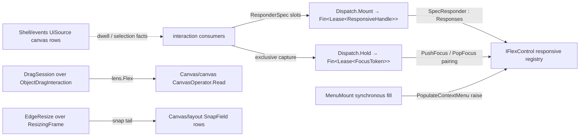

# [RASM_GRASSHOPPER_CANVAS_INTERACTION]

The canvas interaction spine of the Grasshopper boundary — the canvas rows of the census `CanvasChromeOp`: responsive dispatch, the focus stack, object dragging, dwell and context-menu policy, and interactive edge resizing. One `ResponderSpec` declares a hit-testable input target as data — Optioned handler slots over one `Verdict` vocabulary, a region, a filter, a coordinate frame — and one internal `Responses`-derived adapter projects it onto the host dispatch contract, so a consumer never subclasses host types or hand-wires hook events. Registration and focus are lease-owned pairings over the verified `Grasshopper2.UI.Flex` members — the census placed these on `Grasshopper2.UI.Canvas`, corrected here per the mining — and every mount marshals through the session gate. `ObjectDragInteraction` and `ResizingFrame` land at full catalog depth as admitted capsules with typed evidence; the census `Tooltip.Layout` reflection path is a phantom kill (`Frame` verifies, `Layout` does not — `Shell/chrome.md` owns the deletion and renders WHAT a tooltip shows), and this page owns WHEN: dwell delay policy and the dwell/context-menu population seams whose handlers must run synchronously inside the host raise. AppKit gesture and pressure seams are `Platform/native.md`'s gated owners; fact publication for pointer, key, and window-selection streams is `Shell/events.md`'s `UiSource` vocabulary — this page mounts behavior, that page observes facts.

## [01]-[INDEX]

- [02]-[VERDICT]: `Verdict` + `PointerFact` — the precedence-ordered response vocabulary and the dual-frame pointer evidence.
- [03]-[DISPATCH]: `ResponderSpec` + `SpecResponder` + `Dispatch` — the declarative responder, the host adapter, and the lease-owned mount/focus gates.
- [04]-[SESSIONS]: `DragSession` + `EdgeResize` + `EdgeGrip` — the object-drag capsule and the full-depth resize capsule.
- [05]-[MOMENTS]: `DwellPolicy` + `MenuMount` — dwell timing policy and the synchronous context-menu population seam.

## [02]-[VERDICT]

- Owner: `Verdict` `[SmartEnum<int>]` — the dispatch verdict rows keyed by host precedence: `Ignored` (0), `Release` (1), `Handled` (2), `Capture` (3), each carrying its host `Response` column. `Fold(Verdict other)` is the right-biased max-precedence merge — a multi-handler site folds verdicts and the strongest wins, which is the host's own propagation law made a value — and `OfHost(Response)` closes the seam on the way back. A handler slot returns `Verdict`; the adapter projects it to `Response` at the host edge, so the bare host enum never travels interior code.
- Owner: `PointerFact` `readonly record struct` — the dual-frame pointer evidence off `ResponseMouseArgs`: `Control` and `Content` locations, `Buttons`, `Modifiers`, `Delta`, `Pressure`. A handler snaps at content coordinates and paints at control coordinates — the host's own frame discipline — and pressure rides as data for pen-aware consumers; the macOS pressure CONFIGURATION seam stays `Platform/native.md`'s.
- Law: a handler requests repaint through its verdict-driven `RedrawRequired` signal (`Responses.OnRedrawRequired`), never by painting inline — the paint window is `Canvas/paint.md`'s and the schedule is the host's.
- Packages: Grasshopper2 (`Response`, `ResponseMouseArgs.ControlLocation`/`ContentLocation`/`Buttons`/`Modifiers`/`Delta`/`Pressure`/`Handled`), Eto.Forms (`MouseButtons`, `Keys`), LanguageExt.Core, `Rasm.Domain`.
- Growth: a new host precedence tier is one row with its ordinal; the fold and both seam projections never widen.

## [03]-[DISPATCH]

- Owner: `ResponderSpec` sealed record — one declarative input target: `Region` (`Option<RectangleF>` — the host `RegionBoundary`), `Filter` (`Option<Func<PointF, bool>>` — the host `RegionFilter` for non-rectangular hit zones), `Frame` (`CoordinateSystem` — the host responder's coordinate context, `Content` by default), and eleven Optioned handler slots mirroring the verified host virtuals: `Over`/`Leave` (notification-shaped, no verdict), `Down`/`Drag`/`Up`/`Wheel`/`SingleClick`/`DoubleClick` (`Func<PointerFact, Verdict>`), `KeyDown`/`KeyUp` (`Func<KeyEventArgs, Verdict>`), `Text` (`Func<TextInputEventArgs, Verdict>`). An absent slot inherits the host default (`Ignored`), so a drag-only responder declares one slot and nothing else.
- Owner: `SpecResponder` internal sealed class — the ONE host adapter: derives `Responses(spec.Frame)`, overrides exactly the virtuals whose slots are present, projects `ResponseMouseArgs` onto `PointerFact` and `Verdict` onto `Response`, and implements `IResponsive` by returning itself as `Responder`. The census parallel per-concern handler families and the hook-event wiring are absorbed — the host's `*Hook` event chain remains reachable for host-internal attribute composition but is never this page's contract.
- Entry: `Dispatch.Mount(IFlexControl surface, ResponderSpec spec, Op? key = null)` → `Fin<Lease<ResponsiveHandle>>` — `RegisterIResponsive` on mount, `UnregisterIResponsive` on lease disposal, marshalled through `EtoDispatch`; `Dispatch.Hold(IFlexControl surface, IResponsive target, Op? key = null)` → `Fin<Lease<FocusToken>>` — `PushFocus` on acquisition, `PopFocus` on disposal, so exclusive capture without its release is unconstructible; `Dispatch.Roster(IFlexControl surface, Op? key = null)` → `Fin<Seq<IResponsive>>` — the live forward-order responsive census. Every hook and token disposes exactly once — the release swaps a guard before running, so a double-disposed focus token never pops a foreign focus frame.
- Law: the flex control arrives resolved — the canvas via `Canvas/canvas.md`'s lens (`lens.Flex`), a chrome flex pane via its own owner — and the mount marshals but never acquires scope itself, so one spec mounts identically on any `IFlexControl`.
- Law: registration order is dispatch order (`ResponsivesForwards`) and focus preempts it — the focus stack head receives exclusive delivery until popped; a consumer sequencing hover policy against registration order reads `Roster`, never a shadow list.
- Boundary: window-selection lifecycle verbs are `Canvas/canvas.md`'s marquee cases; the `WindowSelection`/`MouseDwell`/`PopulateContextMenu` FACT streams are `Shell/events.md` rows; `ObjectDragInteraction` self-registers its own responder (`[04]`) and never mounts through this gate.
- Packages: Grasshopper2 (`IFlexControl.RegisterIResponsive`/`UnregisterIResponsive`/`PushFocus`/`PopFocus`/`ResponsivesForwards`/`FocusObject`, `IResponsive`, `Responses` and its virtual handler family, `CoordinateSystem`), Eto.Forms (`KeyEventArgs`, `TextInputEventArgs`), LanguageExt.Core, `Rasm.Domain` (`Op`, `Lease<T>`), `Eto/runtime.md` (`EtoDispatch`).
- Growth: a new host handler virtual is one spec slot plus one adapter override; the mount gates never widen.

```csharp signature
// --- [RUNTIME_PRELUDE] ----------------------------------------------------------------------
using Rasm.Csp;
using Rasm.Grasshopper.Eto;

namespace Rasm.Grasshopper.Canvas;

// --- [TYPES] --------------------------------------------------------------------------------
[SmartEnum<int>]
public sealed partial class Verdict {
    public static readonly Verdict Ignored = new(key: 0, host: Response.Ignored);
    public static readonly Verdict Release = new(key: 1, host: Response.Release);
    public static readonly Verdict Handled = new(key: 2, host: Response.Handled);
    public static readonly Verdict Capture = new(key: 3, host: Response.Capture);

    public Response Host { get; }

    public Verdict Fold(Verdict other) => Key >= other.Key ? this : other;

    public static Verdict OfHost(Response response) => response switch {
        Response.Release => Release,
        Response.Handled => Handled,
        Response.Capture => Capture,
        Response.Ignored => Ignored,
        var other => Ignored,
    };
}

// --- [MODELS] -------------------------------------------------------------------------------
[BoundaryAdapter, StructLayout(LayoutKind.Auto)]
public readonly record struct PointerFact(
    PointF Control, PointF Content, MouseButtons Buttons, Keys Modifiers, SizeF Delta, float Pressure) {
    internal static PointerFact Of(ResponseMouseArgs e) =>
        new(Control: e.ControlLocation, Content: e.ContentLocation, Buttons: e.Buttons,
            Modifiers: e.Modifiers, Delta: e.Delta, Pressure: e.Pressure);
}

public sealed record ResponderSpec(
    Option<RectangleF> Region, Option<Func<PointF, bool>> Filter, CoordinateSystem Frame,
    Option<Action<PointerFact>> Over, Option<Action> Leave,
    Option<Func<PointerFact, Verdict>> Down, Option<Func<PointerFact, Verdict>> Drag,
    Option<Func<PointerFact, Verdict>> Up, Option<Func<PointerFact, Verdict>> Wheel,
    Option<Func<PointerFact, Verdict>> SingleClick, Option<Func<PointerFact, Verdict>> DoubleClick,
    Option<Func<KeyEventArgs, Verdict>> KeyDown, Option<Func<KeyEventArgs, Verdict>> KeyUp,
    Option<Func<TextInputEventArgs, Verdict>> Text) {
    public static readonly ResponderSpec Empty = new(
        Region: Option<RectangleF>.None, Filter: Option<Func<PointF, bool>>.None, Frame: CoordinateSystem.Content,
        Over: Option<Action<PointerFact>>.None, Leave: Option<Action>.None,
        Down: Option<Func<PointerFact, Verdict>>.None, Drag: Option<Func<PointerFact, Verdict>>.None,
        Up: Option<Func<PointerFact, Verdict>>.None, Wheel: Option<Func<PointerFact, Verdict>>.None,
        SingleClick: Option<Func<PointerFact, Verdict>>.None, DoubleClick: Option<Func<PointerFact, Verdict>>.None,
        KeyDown: Option<Func<KeyEventArgs, Verdict>>.None, KeyUp: Option<Func<KeyEventArgs, Verdict>>.None,
        Text: Option<Func<TextInputEventArgs, Verdict>>.None);
}

public sealed record ResponsiveHandle(IResponsive Target, Action Detach) : IDisposable {
    private int released;
    public void Dispose() => Op.SideWhen(condition: Interlocked.Exchange(location1: ref released, value: 1) == 0, action: Detach);
}

public sealed record FocusToken(IFlexControl Surface, IResponsive Target, Action Release) : IDisposable {
    private int released;
    public void Dispose() => Op.SideWhen(condition: Interlocked.Exchange(location1: ref released, value: 1) == 0, action: Release);
}

// --- [SERVICES] -----------------------------------------------------------------------------
internal sealed class SpecResponder : Responses, IResponsive {
    private readonly ResponderSpec _spec;

    internal SpecResponder(ResponderSpec spec) : base(spec.Frame) {
        _spec = spec;
        spec.Region.Iter(region => RegionBoundary = region);
        spec.Filter.Iter(filter => RegionFilter = filter);
    }

    public Responses Responder => this;

    public override void MouseOver(ResponseMouseArgs e) => _spec.Over.Iter(over => over(PointerFact.Of(e: e)));
    public override void MouseLeave() => _spec.Leave.Iter(static leave => leave());
    public override Response MouseDown(ResponseMouseArgs e) => Answer(slot: _spec.Down, e: e, inherited: () => base.MouseDown(e));
    public override Response MouseDrag(ResponseMouseArgs e) => Answer(slot: _spec.Drag, e: e, inherited: () => base.MouseDrag(e));
    public override Response MouseUp(ResponseMouseArgs e) => Answer(slot: _spec.Up, e: e, inherited: () => base.MouseUp(e));
    public override Response MouseWheel(ResponseMouseArgs e) => Answer(slot: _spec.Wheel, e: e, inherited: () => base.MouseWheel(e));
    public override Response MouseSingleClick(ResponseMouseArgs e) => Answer(slot: _spec.SingleClick, e: e, inherited: () => base.MouseSingleClick(e));
    public override Response MouseDoubleClick(ResponseMouseArgs e) => Answer(slot: _spec.DoubleClick, e: e, inherited: () => base.MouseDoubleClick(e));
    public override Response KeyDown(KeyEventArgs e) => _spec.KeyDown.Map(handle => handle(e).Host).IfNone(() => base.KeyDown(e));
    public override Response KeyUp(KeyEventArgs e) => _spec.KeyUp.Map(handle => handle(e).Host).IfNone(() => base.KeyUp(e));
    public override Response TextInput(TextInputEventArgs e) => _spec.Text.Map(handle => handle(e).Host).IfNone(() => base.TextInput(e));

    private static Response Answer(Option<Func<PointerFact, Verdict>> slot, ResponseMouseArgs e, Func<Response> inherited) =>
        slot.Map(handle => handle(PointerFact.Of(e: e)).Host).IfNone(inherited);
}

// --- [OPERATIONS] ---------------------------------------------------------------------------
[BoundaryAdapter]
public static class Dispatch {
    public static Fin<Lease<ResponsiveHandle>> Mount(IFlexControl surface, ResponderSpec spec, Op? key = null) {
        Op op = key.OrDefault();
        return from live in op.Need(value: surface)
               from valid in op.Need(value: spec)
               from lease in EtoDispatch.Run(body: () => op.Catch(body: () => {
                   SpecResponder responder = new(spec: valid);
                   live.RegisterIResponsive(responder);
                   return Fin.Succ((Lease<ResponsiveHandle>)new Lease<ResponsiveHandle>.Owned(
                       Value: new ResponsiveHandle(Target: responder, Detach: () => live.UnregisterIResponsive(responder))));
               }), key: op)
               select lease;
    }

    public static Fin<Lease<FocusToken>> Hold(IFlexControl surface, IResponsive target, Op? key = null) {
        Op op = key.OrDefault();
        return from live in op.Need(value: surface)
               from focus in op.Need(value: target)
               from lease in EtoDispatch.Run(body: () => op.Catch(body: () => {
                   live.PushFocus(focus);
                   return Fin.Succ((Lease<FocusToken>)new Lease<FocusToken>.Owned(
                       Value: new FocusToken(Surface: live, Target: focus, Release: () => live.PopFocus(focus))));
               }), key: op)
               select lease;
    }

    public static Fin<Seq<IResponsive>> Roster(IFlexControl surface, Op? key = null) {
        Op op = key.OrDefault();
        return from live in op.Need(value: surface)
               from roster in EtoDispatch.Run(body: () => op.Catch(body: () => Fin.Succ(toSeq(live.ResponsivesForwards).Strict())), key: op)
               select roster;
    }
}
```

## [04]-[SESSIONS]

- Owner: `DragSession` sealed record `[BoundaryAdapter]` — the object-drag capsule over the verified `ObjectDragInteraction`: `Begin(Document graph, PointF anchor, Op? key = null)` → `Fin<DragSession>` constructs the host interaction against the canvas flex control inside one `CanvasOperator.Read` window — the host registers its own internal drag responder, drives snapping against a `SnappingConstraints` set that excludes the dragged ids, and owns orthogonal-constraint keyboard state for the drag's lifetime. The capsule projects the PUBLIC evidence: `Count` (dragged objects), `FirstPoint` (the content-frame anchor), and `Poll(Op)` re-reads both as a `DragEvidence` receipt; the census `LastPoint` claim is corrected — the member is `private` on the decompiled host, so live travel is not observable through this seam and a consumer needing per-move deltas mounts its own `Drag` slot through `[03]`.
- Owner: `EdgeResize` sealed class `[BoundaryAdapter]` — the interactive resize capsule at full catalog depth over `ResizingFrame`: `Of(RectangleF original, SizeF min, SizeF max, Option<SnappingConstraints> constraints, Option<SnappingSettings> settings, Op?)` admits the frame (the host ctor's null-tolerant snapping tail projected from the Options), `Begin(PointF mouse, Padding edges, Op)` opens an edge grab and reports whether any edge engaged, `Track(PointF mouse, Op)` continues the gesture and returns the live `Resized` frame, `CursorAt(PointF mouse, Padding edges, Op)` resolves the host resize cursor for hover feedback, and `Grip()` projects the four engaged-edge flags as one `EdgeGrip` evidence row (`Top`/`Left`/`Right`/`Bottom`). The integer-mask `Begin(PointF, int)` host overload is absorbed by the `Padding` arm — one spelling, the host's own conversion.
- Law: both capsules are gesture-scoped — a session lives from `Begin` to pointer release and is never cached across gestures; the drag capsule's undo record is the host's own (`ObjectDragInteraction` writes pivot undo itself), so no `ActionList` threads through this page — programmatic arrangement with owned undo is `Canvas/layout.md`'s.
- Boundary: the component-attribute resize policy capsule (`Components/attributes.md`'s `ResizeSession`) composes the same host `ResizingFrame` under its snap-restoration window; this owner is the canvas-general capsule — a chrome or plugin surface resizing any frame — and carries no component policy.
- Packages: Grasshopper2 (`ObjectDragInteraction` ctor/`Control`/`Document`/`Count`/`FirstPoint`/`Responder`, `ResizingFrame` ctor/`Begin`/`Continue`/`CursorAt`/`Original`/`Resized`/`MinimumSize`/`MaximumSize`/`ResizeTopEdge`/`ResizeLeftEdge`/`ResizeRightEdge`/`ResizeBottomEdge`, `SnappingConstraints`, `SnappingSettings`), Eto.Drawing (`PointF`, `RectangleF`, `SizeF`, `Padding`), Eto.Forms (`Cursor`), LanguageExt.Core, `Rasm.Domain`.
- Growth: a new gesture capsule is one sealed owner over its host interaction class; evidence rows widen by field, never by sibling record.

```csharp signature
// --- [RUNTIME_PRELUDE] ----------------------------------------------------------------------
using Rasm.Csp;

namespace Rasm.Grasshopper.Canvas;

// --- [MODELS] -------------------------------------------------------------------------------
[BoundaryAdapter, StructLayout(LayoutKind.Auto)]
public readonly record struct DragEvidence(int Count, PointF Anchor) : IValidityEvidence {
    public bool IsValid => ValidityClaim.Of(holds: Count >= 0);
}

[BoundaryAdapter, StructLayout(LayoutKind.Auto)]
public readonly record struct EdgeGrip(bool Top, bool Left, bool Right, bool Bottom) {
    public bool Any => Top || Left || Right || Bottom;
}

// --- [SERVICES] -----------------------------------------------------------------------------
[BoundaryAdapter]
public sealed record DragSession {
    private DragSession(ObjectDragInteraction interaction) => Interaction = interaction;
    internal ObjectDragInteraction Interaction { get; }

    public static Fin<DragSession> Begin(Document graph, PointF anchor, Op? key = null) {
        Op op = key.OrDefault();
        return from live in op.Need(value: graph)
               from session in CanvasOperator.Read(lens =>
                   op.Catch(body: () => Fin.Succ(new DragSession(interaction: new ObjectDragInteraction(lens.Flex, live, anchor)))), key: op)
               select session;
    }

    public Fin<DragEvidence> Poll(Op key) {
        ObjectDragInteraction interaction = Interaction;
        return key.Catch(body: () => Fin.Succ(new DragEvidence(Count: interaction.Count, Anchor: interaction.FirstPoint)));
    }
}

[BoundaryAdapter]
public sealed class EdgeResize {
    private readonly ResizingFrame _frame;

    private EdgeResize(ResizingFrame frame) => _frame = frame;

    public static Fin<EdgeResize> Of(
        RectangleF original, SizeF min, SizeF max,
        Option<SnappingConstraints> constraints = default, Option<SnappingSettings> settings = default, Op? key = null) {
        Op op = key.OrDefault();
        return op.Catch(body: () => Fin.Succ(new EdgeResize(frame: new ResizingFrame(
            original, min, max,
            constraints.MatchUnsafe(Some: static held => held, None: static () => null),
            settings.MatchUnsafe(Some: static held => held, None: static () => null)))));
    }

    public RectangleF Original => _frame.Original;
    public RectangleF Resized => _frame.Resized;

    public Fin<bool> Begin(PointF mouse, Padding edges, Op key) {
        ResizingFrame frame = _frame;
        return key.Catch(body: () => Fin.Succ(frame.Begin(mouse, edges)));
    }

    public Fin<RectangleF> Track(PointF mouse, Op key) {
        ResizingFrame frame = _frame;
        return key.Catch(body: () => {
            frame.Continue(mouse);
            return Fin.Succ(frame.Resized);
        });
    }

    public Fin<Cursor> CursorAt(PointF mouse, Padding edges, Op key) {
        ResizingFrame frame = _frame;
        return key.Catch(body: () => Fin.Succ(frame.CursorAt(mouse, edges)));
    }

    public EdgeGrip Grip() => new(
        Top: _frame.ResizeTopEdge, Left: _frame.ResizeLeftEdge,
        Right: _frame.ResizeRightEdge, Bottom: _frame.ResizeBottomEdge);
}
```

## [05]-[MOMENTS]

- Owner: `DwellPolicy` — the WHEN of hover chrome: `Attend(TimeSpan delay, Op? key = null)` writes `MouseDwellDelay` on the canvas (a zero or negative span disables the dwell raise entirely — the host's own off switch, so suppression is a policy value, never an unsubscribe), and `Current(Op?)` reads it back. The dwell FACT stream — where and when the pointer dwelt — is `Shell/events.md`'s canvas row; the tooltip CONTENT that answers a dwell is `Shell/chrome.md`'s `TooltipIntent`; this row is the timing policy both compose.
- Owner: `MenuMount` — the synchronous population seam over `PopulateContextMenu`: `Mount(Action<MenuMoment> fill, Op? key = null)` → `Fin<Lease<MomentHook>>` whose handler runs INSIDE the host raise, because the args' `Menu` must be filled before the raise returns — a deferred observation row structurally cannot populate it, which is why this seam lives here and not in the events vocabulary; population is mutation of the live `Menu`, so the filler is an action, never a verdict — the raise carries no response channel to settle one. `MenuMoment` projects the args: the raising `IFlexControl`, the triggering `MouseEventArgs`, the live `ContextMenu` to fill, and `IsMenu` (whether earlier handlers already contributed items — the ordering evidence a low-priority filler reads before appending separators).
- Law: a filler adds items and returns — presenting, styling, and command wiring for menu items are `Eto`-tier and chrome concerns; a filler that opens its own menu beside the host's is the double-menu defect.
- Law: whether ANY context menu opens is `Canvas/canvas.md`'s `ActionGate` rows (`WireMenu`/`ObjectMenu`/`CanvasMenu`) — the fill seam runs only when the gate admitted the raise.
- Packages: Grasshopper2 (`FlexControl.MouseDwellDelay`, `FlexControl.PopulateContextMenu`, `PopulateContextMenuEventArgs.Control`/`MouseEvent`/`Menu`/`IsMenu`), Eto.Forms (`ContextMenu`, `MouseEventArgs`), LanguageExt.Core, `Rasm.Domain`, `Shell/session.md` (`GhSession`, `ScopeTarget`).
- Growth: a new synchronous host moment (a populate-shaped event whose args demand in-raise mutation) is one moment record plus one mount; observation-shaped events stay `Shell/events.md` rows.

```csharp signature
// --- [RUNTIME_PRELUDE] ----------------------------------------------------------------------
using Rasm.Csp;
using Rasm.Grasshopper.Shell;

namespace Rasm.Grasshopper.Canvas;

// --- [MODELS] -------------------------------------------------------------------------------
[BoundaryAdapter, StructLayout(LayoutKind.Auto)]
public readonly record struct MenuMoment(IFlexControl Surface, MouseEventArgs Cause, ContextMenu Menu, bool IsMenu);

public sealed record MomentHook(Action Detach) : IDisposable {
    private int released;
    public void Dispose() => Op.SideWhen(condition: Interlocked.Exchange(location1: ref released, value: 1) == 0, action: Detach);
}

// --- [OPERATIONS] ---------------------------------------------------------------------------
[BoundaryAdapter]
public static class DwellPolicy {
    public static Fin<Unit> Attend(TimeSpan delay, Op? key = null) {
        Op op = key.OrDefault();
        return GhSession.Run(ScopeTarget.CanvasHost, scope => scope.Canvas
            .ToFin(op.MissingContext())
            .Bind(surface => op.Catch(body: () => Fin.Succ(Op.Side(action: () => surface.MouseDwellDelay = delay)))), key: op);
    }

    public static Fin<TimeSpan> Current(Op? key = null) {
        Op op = key.OrDefault();
        return GhSession.Run(ScopeTarget.CanvasHost, scope => scope.Canvas
            .ToFin(op.MissingContext())
            .Map(static surface => surface.MouseDwellDelay), key: op);
    }
}

[BoundaryAdapter]
public static class MenuMount {
    public static Fin<Lease<MomentHook>> Mount(Action<MenuMoment> fill, Op? key = null) {
        Op op = key.OrDefault();
        return from valid in op.Need(value: fill)
               from lease in GhSession.Run(ScopeTarget.CanvasHost, scope => scope.Canvas
                   .ToFin(op.MissingContext())
                   .Bind(surface => op.Catch(body: () => {
                       EventHandler<PopulateContextMenuEventArgs> handler = (_, e) =>
                           valid(new MenuMoment(Surface: e.Control, Cause: e.MouseEvent, Menu: e.Menu, IsMenu: e.IsMenu));
                       surface.PopulateContextMenu += handler;
                       return Fin.Succ((Lease<MomentHook>)new Lease<MomentHook>.Owned(
                           Value: new MomentHook(Detach: () => surface.PopulateContextMenu -= handler)));
                   })), key: op)
               select lease;
    }
}
```



## [06]-[DENSITY_BAR]

| [INDEX] | [CONCERN]            | [OWNER]                          | [KIND]                                              | [RAIL]                                     | [CASES] |
| :-----: | :------------------- | :------------------------------- | :--------------------------------------------------- | :------------------------------------------ | :-----: |
|  [01]   | dispatch verdict     | `Verdict` + `PointerFact`        | `[SmartEnum<int>]` precedence rows + dual-frame fact | `Fold` monoid, seam projections             |    4    |
|  [02]   | responder declaration| `ResponderSpec` + `SpecResponder`| Optioned-slot record + one host adapter              | `Mount → Fin<Lease<ResponsiveHandle>>`      |   14    |
|  [03]   | focus capture        | `FocusToken`                     | push/pop pairing lease                               | `Hold → Fin<Lease<FocusToken>>`             |    1    |
|  [04]   | object drag          | `DragSession` + `DragEvidence`   | host-interaction capsule + evidence receipt          | `Begin → Fin<DragSession>`                  |    1    |
|  [05]   | edge resize          | `EdgeResize` + `EdgeGrip`        | full-depth `ResizingFrame` capsule                   | `Of → Fin<EdgeResize>`                      |    1    |
|  [06]   | dwell and menu       | `DwellPolicy` + `MenuMount`      | timing policy + synchronous population seam          | `Mount → Fin<Lease<MomentHook>>`            |    2    |

`GhSession`, `EtoDispatch`, `CanvasOperator`, `Lease<T>`, `Op`, `ValidityClaim`, and the host `Responses` virtual family are composed upstream owners. The census `CanvasChromeOp` parallel chrome families, the `Grasshopper2.UI.Canvas`-namespace focus/registration spellings, the ungated AppKit gesture and pressure paths, and the `Tooltip.Layout` reflection have no successor shape here — chrome intent landed in `Shell/chrome.md`, native seams in `Platform/native.md`, and the canvas rows land as the spec, capsules, and moments above.
