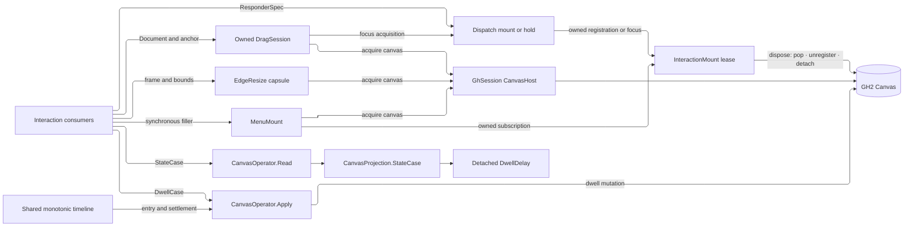

# [RASM_GRASSHOPPER_CANVAS_INTERACTION]

`InteractionMount` owns the canvas interaction spine — responsive dispatch, focus capture, object dragging, context-menu population, and interactive edge resizing — as the single lease resource for registration, focus, drag capture, and synchronous event attachment; it marshals teardown, records callback or release faults, and never leaves a released registration on the focus stack.

One `ResponderSpec` declares a hit-testable input target as data, and one contained `Responses` adapter projects it onto the host dispatch contract. Host-bound acquisition runs inside `GhSession.Run(ScopeTarget.CanvasHost, …)` and returns only an owned mount or gesture capsule. Dwell writes settle through the injected `MonotonicTimeline`, and reads cross the closed `CanvasQuery.StateCase` → `CanvasProjection.StateCase` projection.

## [01]-[INDEX]

- [02]-[VERDICT]: `Verdict` + `PointerFact` — the precedence-ordered response vocabulary and the dual-frame pointer evidence.
- [03]-[DISPATCH]: `ResponderSpec` + `SpecResponder` + `InteractionMount` + `Dispatch` — the declarative responder, contained host adapter, and unified lease-owned registration/focus gates.
- [04]-[SESSIONS]: `DragSession` + `EdgeResize` + `EdgeGrip` — the object-drag capsule and the full-depth resize capsule.
- [05]-[MOMENTS]: `MenuMount` — the contained synchronous context-menu population seam; dwell composes the Canvas command and state owners directly.

## [02]-[VERDICT]

- Owner: `Verdict` `[SmartEnum<int>]` — the dispatch verdict rows keyed by host precedence: `Ignored` (0), `Release` (1), `Handled` (2), `Capture` (3), each carrying its host `Response` column. `Fold(Verdict other)` is the right-biased max-precedence merge — a multi-handler site folds verdicts and the strongest wins, which is the host's own propagation law made a value — and `OfHost(Response)` closes the seam on the way back. A handler slot returns `Verdict`; the adapter projects it to `Response` at the host edge, so the bare host enum never travels interior code.
- Owner: `PointerFact` `readonly record struct` — admitted dual-frame pointer evidence off `ResponseMouseArgs`: finite `Control` and `Content` locations, finite wheel `Delta`, unit-interval `Pressure`, `Buttons`, and `Modifiers`. Invalid host payloads never reach a consumer callback.
- Law: a handler requests repaint through its verdict-driven `RedrawRequired` signal (`Responses.OnRedrawRequired`), never by painting inline — the paint window is `Canvas/paint.md`'s and the schedule is the host's.
- Packages: Grasshopper2 (`Response`, `ResponseMouseArgs.ControlLocation`/`ContentLocation`/`Buttons`/`Modifiers`/`Delta`/`Pressure`/`Handled`), Eto.Forms (`MouseButtons`, `Keys`), LanguageExt.Core, `Rasm.Domain`.
- Growth: a new host precedence tier is one row with its ordinal; the fold and both seam projections never widen.

## [03]-[DISPATCH]

- Owner: `ResponderSpec` sealed evidence record — one declarative input target: optional rectangular and predicate hit regions, coordinate frame, hover notifications, pointer verdicts, key verdicts, and text verdicts. Region admission is finite and nonnegative; an absent slot inherits the host response.
- Owner: `SpecResponder` internal sealed class — the ONE host adapter. Every region filter, hover notification, pointer handler, key handler, text handler, and inherited relay runs inside the raising `Op.Catch`; faults record on the owning mount and resolve to `Release` while focused or `Ignored` while unfocused, so an extension callback never escapes into the Eto pump or strands capture.
- Owner: `InteractionMount` sealed class — the single idempotent `IDisposable` resource for responder registration, focus capture, drag capture, and menu attachment. `Target` and `PriorFocus` preserve lifecycle evidence; `LastFault` exposes the latest contained callback or release failure; disposal marshals through the release closure and remains retryable after a failed teardown.
- Entry: `Dispatch.Mount(FlexControl surface, ResponderSpec spec, Op? key = null)` → `Fin<Lease<InteractionMount>>`; `Dispatch.Hold(FlexControl surface, IResponsive target, Op? key = null)` → `Fin<Lease<InteractionMount>>`; `Dispatch.Roster(IFlexControl surface, Op? key = null)` → `Fin<Seq<IResponsive>>`.
- Law: the flex control arrives resolved — canvas callers acquire it inside `GhSession.Run(ScopeTarget.CanvasHost, …)`, while a chrome flex pane arrives from its own owner. Registration/focus mounts require the concrete `FlexControl` owner because the focus stack is absent from `IFlexControl`; roster projection remains interface-shaped. No mount exposes a live canvas.
- Law: registration order is dispatch order (`ResponsivesForwards`) and focus preempts it. `Mount` pops its target before unregistering, `Hold` refuses to claim an already focused target, and failed register or push acquisition rolls back before returning its fault. Host focus stack stays unique by target and restores its previous head when the owned frame leaves.
- Boundary: window-selection lifecycle verbs are `Canvas/canvas.md` marquee cases; `WindowSelection` and `MouseDwell` facts are `Shell/events.md` rows. `ObjectDragInteraction` neither registers nor focuses itself, so `[04]` acquires `Dispatch.Hold` and owns that lease through gesture teardown.
- Packages: Grasshopper2 (`FlexControl.RegisterIResponsive`/`UnregisterIResponsive`/`PushFocus`/`PopFocus`/`FocusObject`, `IFlexControl.ResponsivesForwards`, `IResponsive`, `Responses` and its virtual handler family, `CoordinateSystem`), Eto.Forms (`KeyEventArgs`, `TextInputEventArgs`), LanguageExt.Core, `Rasm.Domain` (`Op`, `Lease<T>`), `Eto/runtime.md` (`EtoDispatch`).
- Growth: a new host handler virtual is one spec slot with one contained adapter override; every new attachment modality reuses `InteractionMount`.

```csharp signature
// --- [RUNTIME_PRELUDE] ----------------------------------------------------------------------
using Rasm.Csp;
using Rasm.Grasshopper.Shell;
using Rasm.Grasshopper.Eto;

namespace Rasm.Grasshopper.Canvas;

// --- [TYPES] --------------------------------------------------------------------------------
[SmartEnum<int>]
public sealed partial class Verdict {
    public static readonly Verdict Ignored = new(key: 0, host: Response.Ignored);
    public static readonly Verdict Release = new(key: 1, host: Response.Release);
    public static readonly Verdict Handled = new(key: 2, host: Response.Handled);
    public static readonly Verdict Capture = new(key: 3, host: Response.Capture);

    public Response Host { get; }

    public Verdict Fold(Verdict other) => Key >= other.Key ? this : other;

    public static Verdict OfHost(Response response) => response switch {
        Response.Release => Release,
        Response.Handled => Handled,
        Response.Capture => Capture,
        _ => Ignored,
    };
}

// --- [MODELS] -------------------------------------------------------------------------------
[BoundaryAdapter, StructLayout(LayoutKind.Auto)]
public readonly record struct PointerFact(
    PointF Control, PointF Content, MouseButtons Buttons, Keys Modifiers, SizeF Delta, float Pressure) : IValidityEvidence {
    public bool IsValid => ValidityClaim.All(
        ValidityClaim.Of(holds: Finite(point: Control) && Finite(point: Content)),
        ValidityClaim.Of(holds: float.IsFinite(Delta.Width) && float.IsFinite(Delta.Height)),
        ValidityClaim.UnitInterval(value: Pressure));

    internal static PointerFact Of(ResponseMouseArgs e) =>
        new(Control: e.ControlLocation, Content: e.ContentLocation, Buttons: e.Buttons,
            Modifiers: e.Modifiers, Delta: e.Delta, Pressure: e.Pressure);

    private static bool Finite(PointF point) => float.IsFinite(point.X) && float.IsFinite(point.Y);
}

public sealed record ResponderSpec(
    Option<RectangleF> Region, Option<Func<PointF, bool>> Filter, CoordinateSystem Frame,
    Option<Action<PointerFact>> Over, Option<Action> Leave,
    Option<Func<PointerFact, Verdict>> Down, Option<Func<PointerFact, Verdict>> Drag,
    Option<Func<PointerFact, Verdict>> Up, Option<Func<PointerFact, Verdict>> Wheel,
    Option<Func<PointerFact, Verdict>> SingleClick, Option<Func<PointerFact, Verdict>> DoubleClick,
    Option<Func<KeyEventArgs, Verdict>> KeyDown, Option<Func<KeyEventArgs, Verdict>> KeyUp,
    Option<Func<TextInputEventArgs, Verdict>> Text) : IValidityEvidence {
    public bool IsValid => ValidityClaim.Of(holds: Region.ForAll(static frame =>
        float.IsFinite(frame.X) && float.IsFinite(frame.Y) &&
        float.IsFinite(frame.Width) && frame.Width >= 0f &&
        float.IsFinite(frame.Height) && frame.Height >= 0f));

    public static readonly ResponderSpec Empty = new(
        Region: Option<RectangleF>.None, Filter: Option<Func<PointF, bool>>.None, Frame: CoordinateSystem.Content,
        Over: Option<Action<PointerFact>>.None, Leave: Option<Action>.None,
        Down: Option<Func<PointerFact, Verdict>>.None, Drag: Option<Func<PointerFact, Verdict>>.None,
        Up: Option<Func<PointerFact, Verdict>>.None, Wheel: Option<Func<PointerFact, Verdict>>.None,
        SingleClick: Option<Func<PointerFact, Verdict>>.None, DoubleClick: Option<Func<PointerFact, Verdict>>.None,
        KeyDown: Option<Func<KeyEventArgs, Verdict>>.None, KeyUp: Option<Func<KeyEventArgs, Verdict>>.None,
        Text: Option<Func<TextInputEventArgs, Verdict>>.None);
}

public sealed class InteractionMount : IDisposable {
    private readonly Atom<Option<Error>> faults;
    private readonly Op operation;
    private readonly Func<Fin<Unit>> release;
    private int releaseState;

    internal InteractionMount(
        Option<IResponsive> target,
        Option<IResponsive> priorFocus,
        Atom<Option<Error>> faults,
        Op operation,
        Func<Fin<Unit>> release) {
        Target = target;
        PriorFocus = priorFocus;
        this.faults = faults;
        this.operation = operation;
        this.release = release;
    }

    public Option<IResponsive> Target { get; }
    public Option<IResponsive> PriorFocus { get; }
    public Option<Error> LastFault => faults.Value;
    public bool IsReleased => Volatile.Read(location: ref releaseState) == 2;

    public void Dispose() {
        if (Interlocked.CompareExchange(location1: ref releaseState, value: 1, comparand: 0) != 0) return;
        operation.Catch(body: release).Match(
            Succ: _ => { Volatile.Write(location: ref releaseState, value: 2); return unit; },
            Fail: error => {
                Record(error: error);
                Volatile.Write(location: ref releaseState, value: 0);
                return unit;
            });
    }

    internal void Record(Error error) => ignore(faults.Swap(_ => Some(error)));
}

// --- [SERVICES] -----------------------------------------------------------------------------
internal sealed class SpecResponder : Responses, IResponsive {
    private readonly Atom<Option<Error>> _faults;
    private readonly Op _operation;
    private readonly ResponderSpec _spec;

    internal SpecResponder(ResponderSpec spec, Atom<Option<Error>> faults, Op operation) : base(spec.Frame) {
        _spec = spec;
        _faults = faults;
        _operation = operation;
        spec.Region.Iter(region => RegionBoundary = region);
        spec.Filter.Iter(filter => RegionFilter = point => Filter(filter: filter, point: point));
    }

    public Responses Responder => this;
    public override void MouseOver(ResponseMouseArgs e) => Observe(body: () => _spec.Over.Match(
        Some: over => _operation.AcceptInput(value: PointerFact.Of(e: e))
            .Map(fact => Op.Side(action: () => over(obj: fact))),
        None: () => Fin.Succ(Op.Side(action: () => base.MouseOver(e)))));
    public override void MouseLeave() => Observe(body: () => _spec.Leave.Match(
        Some: static leave => Fin.Succ(Op.Side(action: leave)),
        None: () => Fin.Succ(Op.Side(action: base.MouseLeave))));
    public override Response MouseDown(ResponseMouseArgs e) => Answer(slot: _spec.Down, e: e, inherited: () => base.MouseDown(e));
    public override Response MouseDrag(ResponseMouseArgs e) => Answer(slot: _spec.Drag, e: e, inherited: () => base.MouseDrag(e));
    public override Response MouseUp(ResponseMouseArgs e) => Answer(slot: _spec.Up, e: e, inherited: () => base.MouseUp(e));
    public override Response MouseWheel(ResponseMouseArgs e) => Answer(slot: _spec.Wheel, e: e, inherited: () => base.MouseWheel(e));
    public override Response MouseSingleClick(ResponseMouseArgs e) => Answer(slot: _spec.SingleClick, e: e, inherited: () => base.MouseSingleClick(e));
    public override Response MouseDoubleClick(ResponseMouseArgs e) => Answer(slot: _spec.DoubleClick, e: e, inherited: () => base.MouseDoubleClick(e));
    public override Response KeyDown(KeyEventArgs e) => Answer(slot: _spec.KeyDown, value: e, inherited: () => base.KeyDown(e));
    public override Response KeyUp(KeyEventArgs e) => Answer(slot: _spec.KeyUp, value: e, inherited: () => base.KeyUp(e));
    public override Response TextInput(TextInputEventArgs e) => Answer(slot: _spec.Text, value: e, inherited: () => base.TextInput(e));

    private Response Answer(Option<Func<PointerFact, Verdict>> slot, ResponseMouseArgs e, Func<Response> inherited) => Settle(
        outcome: _operation.Catch(body: () => slot.Match(
            Some: handle => _operation.AcceptInput(value: PointerFact.Of(e: e)).Map(handle).Bind(verdict => _operation.Need(value: verdict)),
            None: () => Fin.Succ(Verdict.OfHost(response: inherited())))));

    private Response Answer<TEvent>(Option<Func<TEvent, Verdict>> slot, TEvent value, Func<Response> inherited)
        where TEvent : class => Settle(outcome: _operation.Catch(body: () => slot.Match(
            Some: handle => _operation.Need(value: value).Map(handle).Bind(verdict => _operation.Need(value: verdict)),
            None: () => Fin.Succ(Verdict.OfHost(response: inherited())))));

    private bool Filter(Func<PointF, bool> filter, PointF point) {
        Fin<bool> outcome = _operation.Catch(body: () =>
            guard(float.IsFinite(point.X) && float.IsFinite(point.Y), _operation.InvalidInput()).ToFin()
                .Map(_ => filter(arg: point)));
        return outcome.Match(
            Succ: static accepted => accepted,
            Fail: error => { Record(error: error); return false; });
    }

    private void Observe(Func<Fin<Unit>> body) => _operation.Catch(body: body).IfFail(error => Record(error: error));

    private Response Settle(Fin<Verdict> outcome) => outcome.Match(
        Succ: static verdict => verdict.Host,
        Fail: error => {
            Record(error: error);
            return HasFocus ? Response.Release : Response.Ignored;
        });

    private void Record(Error error) => ignore(_faults.Swap(_ => Some(error)));
}

// --- [OPERATIONS] ---------------------------------------------------------------------------
[BoundaryAdapter]
public static class Dispatch {
    public static Fin<Lease<InteractionMount>> Mount(FlexControl surface, ResponderSpec spec, Op? key = null) {
        Op op = key.OrDefault();
        return from live in op.Need(value: surface)
               from valid in op.AcceptInput(value: spec)
               from lease in EtoDispatch.Run(body: () => op.Catch(body: () => {
                   Atom<Option<Error>> faults = Atom(Option<Error>.None);
                   SpecResponder responder = new(spec: valid, faults: faults, operation: op);
                   Fin<Unit> attached = op.Catch(body: () => {
                       live.RegisterIResponsive(responder);
                       return toSeq(live.ResponsivesForwards).Exists(candidate => ReferenceEquals(objA: candidate, objB: responder))
                           ? Fin.Succ(value: unit)
                           : Fin.Fail<Unit>(error: op.InvalidResult());
                   });
                   return attached.Match(
                       Succ: _ => {
                           Func<Fin<Unit>> release = () => EtoDispatch.Run(body: () => {
                               Fin<Unit> popped = op.Catch(body: () => Fin.Succ(Op.Side(action: () => live.PopFocus(responder))));
                               Fin<Unit> detached = op.Catch(body: () => Fin.Succ(Op.Side(action: () => live.UnregisterIResponsive(responder))));
                               Fin<Unit> verified = op.Catch(body: () =>
                                   !ReferenceEquals(objA: live.FocusObject, objB: responder)
                                   && !toSeq(live.ResponsivesForwards).Exists(candidate => ReferenceEquals(objA: candidate, objB: responder))
                                       ? Fin.Succ(value: unit)
                                       : Fin.Fail<Unit>(error: op.InvalidResult()));
                               return popped.Bind(_ => detached).Bind(_ => verified);
                           }, key: op);
                           InteractionMount mount = new(
                               target: Some<IResponsive>(responder),
                               priorFocus: Option<IResponsive>.None,
                               faults: faults,
                               operation: op,
                               release: release);
                           return Fin.Succ((Lease<InteractionMount>)new Lease<InteractionMount>.Owned(Value: mount));
                       },
                       Fail: error => {
                           ignore(op.Catch(body: () => Fin.Succ(Op.Side(action: () => live.UnregisterIResponsive(responder)))));
                           return Fin.Fail<Lease<InteractionMount>>(error: error);
                       });
               }), key: op)
               select lease;
    }

    public static Fin<Lease<InteractionMount>> Hold(FlexControl surface, IResponsive target, Op? key = null) {
        Op op = key.OrDefault();
        return from live in op.Need(value: surface)
               from focus in op.Need(value: target)
               from lease in EtoDispatch.Run(body: () => op.Catch(body: () => {
                   if (ReferenceEquals(objA: live.FocusObject, objB: focus))
                       return Fin.Fail<Lease<InteractionMount>>(error: op.InvalidInput());
                   Option<IResponsive> prior = Optional(live.FocusObject);
                   Atom<Option<Error>> faults = Atom(Option<Error>.None);
                   Fin<Unit> pushed = op.Catch(body: () => {
                       live.PushFocus(focus);
                       return ReferenceEquals(objA: live.FocusObject, objB: focus)
                           ? Fin.Succ(value: unit)
                           : Fin.Fail<Unit>(error: op.InvalidResult());
                   });
                   return pushed.Match(
                       Succ: _ => {
                           Func<Fin<Unit>> release = () => EtoDispatch.Run(
                               body: () => op.Catch(body: () => {
                                   live.PopFocus(focus);
                                   return !ReferenceEquals(objA: live.FocusObject, objB: focus)
                                       ? Fin.Succ(value: unit)
                                       : Fin.Fail<Unit>(error: op.InvalidResult());
                               }),
                               key: op);
                           InteractionMount mount = new(
                               target: Some(focus),
                               priorFocus: prior,
                               faults: faults,
                               operation: op,
                               release: release);
                           return Fin.Succ((Lease<InteractionMount>)new Lease<InteractionMount>.Owned(Value: mount));
                       },
                       Fail: error => {
                           ignore(op.Catch(body: () => Fin.Succ(Op.Side(action: () => live.PopFocus(focus)))));
                           return Fin.Fail<Lease<InteractionMount>>(error: error);
                       });
               }), key: op)
               select lease;
    }

    public static Fin<Seq<IResponsive>> Roster(IFlexControl surface, Op? key = null) {
        Op op = key.OrDefault();
        return from live in op.Need(value: surface)
               from roster in EtoDispatch.Run(body: () => op.Catch(body: () => Fin.Succ(toSeq(live.ResponsivesForwards).Strict())), key: op)
               select roster;
    }
}
```

## [04]-[SESSIONS]

- Owner: `DragSession` sealed class `[BoundaryAdapter]` — the owned object-drag capsule over `ObjectDragInteraction`. `Begin(Document graph, PointF anchor, Op? key = null)` → `Fin<Lease<DragSession>>` admits a finite anchor, constructs the host interaction inside `GhSession.Run(ScopeTarget.CanvasHost, …)`, rejects an empty dragged set, and acquires its responder through `Dispatch.Hold` before the marshal returns. This session owns the focus lease; pointer release may pop it through the host `Release` verdict, while disposal remains the cancellation path and idempotently pops any surviving frame. `Poll` returns accepted count and anchor evidence; the private host `LastPoint` remains unavailable.
- Owner: `EdgeResize` sealed class `[BoundaryAdapter]` — the interactive resize capsule over `ResizingFrame`. `Of` admits finite nonnegative frame and size bounds with `min ≤ max`, then mints the host frame inside `GhSession.Run(ScopeTarget.CanvasHost, …)` and returns only the capsule. `Begin` admits the pointer and opens an edge grab; `Track` requires an active grip; `End` closes the gesture and clears both host snap-guide axes through the same session seam; `CursorAt` resolves admitted hover feedback; `Grip` projects the engaged edges. Its `Padding` arm absorbs the integer-mask host overload.
- Law: both capsules are gesture-scoped and never cached across gestures. Every acquired drag lease is disposed after pointer release or cancellation; host `Release` and lease disposal are both safe because `PopFocus` removes only the named target. Drag-capsule undo records remain the host's own.
- Boundary: the component-attribute resize policy capsule (`Components/attributes.md`'s `ResizeSession`) composes the same host `ResizingFrame` under its snap-restoration window; this owner is the canvas-general capsule — a chrome or plugin surface resizing any frame — and carries no component policy.
- Packages: Grasshopper2 (`ObjectDragInteraction` ctor/`Control`/`Document`/`Count`/`FirstPoint`/`Responder`, `ResizingFrame` ctor/`Begin`/`Continue`/`CursorAt`/`Original`/`Resized`/`MinimumSize`/`MaximumSize`/`ResizeTopEdge`/`ResizeLeftEdge`/`ResizeRightEdge`/`ResizeBottomEdge`, `Canvas.SnapXAction`/`SnapYAction`, `SnappingConstraints`, `SnappingSettings`), Eto.Drawing (`PointF`, `RectangleF`, `SizeF`, `Padding`), Eto.Forms (`Cursor`), LanguageExt.Core, `Rasm.Domain`, `Shell/session.md` (`GhSession`, `ScopeTarget`).
- Growth: a new gesture capsule is one sealed owner over its host interaction class; evidence rows widen by field, never by sibling record.

```csharp signature
// --- [RUNTIME_PRELUDE] ----------------------------------------------------------------------
using Rasm.Csp;
using Rasm.Grasshopper.Shell;

namespace Rasm.Grasshopper.Canvas;

// --- [MODELS] -------------------------------------------------------------------------------
[BoundaryAdapter, StructLayout(LayoutKind.Auto)]
public readonly record struct DragEvidence(int Count, PointF Anchor) : IValidityEvidence {
    public bool IsValid => ValidityClaim.All(
        ValidityClaim.Of(holds: Count > 0),
        ValidityClaim.Of(holds: float.IsFinite(Anchor.X) && float.IsFinite(Anchor.Y)));
}

[BoundaryAdapter, StructLayout(LayoutKind.Auto)]
public readonly record struct EdgeGrip(bool Top, bool Left, bool Right, bool Bottom) {
    public bool Any => Top || Left || Right || Bottom;
}

// --- [SERVICES] -----------------------------------------------------------------------------
[BoundaryAdapter]
public sealed class DragSession : IDisposable {
    private readonly Lease<InteractionMount> focus;

    private DragSession(ObjectDragInteraction interaction, Lease<InteractionMount> focus) {
        Interaction = interaction;
        this.focus = focus;
    }

    internal ObjectDragInteraction Interaction { get; }
    public Option<Error> LastFault => focus.Resource.LastFault;

    public static Fin<Lease<DragSession>> Begin(Document graph, PointF anchor, Op? key = null) {
        Op op = key.OrDefault();
        return from live in op.Need(value: graph)
               from _ in guard(float.IsFinite(anchor.X) && float.IsFinite(anchor.Y), op.InvalidInput()).ToFin()
               from session in GhSession.Run(ScopeTarget.CanvasHost, scope =>
                   scope.Canvas.ToFin(op.MissingContext()).Bind(surface =>
                       op.Catch(body: () => Fin.Succ(new ObjectDragInteraction(surface, live, anchor)))
                           .Bind(interaction => guard(interaction.Count > 0, op.InvalidInput()).ToFin().Map(_ => interaction))
                           .Bind(interaction => Dispatch.Hold(surface: surface, target: interaction, key: op)
                               .Map(capture => (Lease<DragSession>)new Lease<DragSession>.Owned(
                                   Value: new DragSession(interaction: interaction, focus: capture))))), key: op)
               select session;
    }

    public Fin<DragEvidence> Poll(Op key) {
        ObjectDragInteraction interaction = Interaction;
        return from _ in guard(!focus.Resource.IsReleased, key.InvalidInput()).ToFin()
               from evidence in key.Catch(body: () => Fin.Succ(new DragEvidence(Count: interaction.Count, Anchor: interaction.FirstPoint)))
               from accepted in key.AcceptValue(value: evidence)
               select accepted;
    }

    public void Dispose() => ignore(focus.Dispose());
}

[BoundaryAdapter]
public sealed class EdgeResize {
    private readonly ResizingFrame _frame;
    private int _active;

    private EdgeResize(ResizingFrame frame) => _frame = frame;

    public static Fin<EdgeResize> Of(
        RectangleF original, SizeF min, SizeF max,
        Option<SnappingConstraints> constraints = default, Option<SnappingSettings> settings = default, Op? key = null) {
        Op op = key.OrDefault();
        bool admitted =
            Finite(frame: original) &&
            float.IsFinite(min.Width) && min.Width >= 0f &&
            float.IsFinite(min.Height) && min.Height >= 0f &&
            float.IsFinite(max.Width) && max.Width >= min.Width &&
            float.IsFinite(max.Height) && max.Height >= min.Height;
        return from _ in guard(admitted, op.InvalidInput()).ToFin()
               from frame in GhSession.Run(ScopeTarget.CanvasHost, scope =>
                   scope.Canvas.ToFin(op.MissingContext()).Bind(_ => op.Catch(body: () =>
                       Fin.Succ(new EdgeResize(frame: new ResizingFrame(
                           original, min, max,
                           constraints.MatchUnsafe(Some: static held => held, None: static () => null),
                           settings.MatchUnsafe(Some: static held => held, None: static () => null)))))), key: op)
               select frame;
    }

    public RectangleF Original => _frame.Original;
    public RectangleF Resized => _frame.Resized;

    public Fin<bool> Begin(PointF mouse, Padding edges, Op key) {
        ResizingFrame frame = _frame;
        return from _ in guard(Volatile.Read(location: ref _active) == 0 && Finite(point: mouse), key.InvalidInput()).ToFin()
               from engaged in key.Catch(body: () => Fin.Succ(frame.Begin(mouse, edges)))
               select SetActive(engaged: engaged);
    }

    public Fin<RectangleF> Track(PointF mouse, Op key) {
        ResizingFrame frame = _frame;
        return from _ in guard(Volatile.Read(location: ref _active) == 1 && Finite(point: mouse), key.InvalidInput()).ToFin()
               from resized in key.Catch(body: () => {
                   frame.Continue(mouse);
                   return Finite(frame: frame.Resized)
                       ? Fin.Succ(frame.Resized)
                       : Fin.Fail<RectangleF>(error: key.InvalidResult());
               })
               select resized;
    }

    public Fin<Cursor> CursorAt(PointF mouse, Padding edges, Op key) {
        ResizingFrame frame = _frame;
        return from _ in guard(Finite(point: mouse), key.InvalidInput()).ToFin()
               from cursor in key.Catch(body: () => Optional(frame.CursorAt(mouse, edges)).ToFin(key.InvalidResult()))
               select cursor;
    }

    public Fin<Unit> End(Op? key = null) {
        Op op = key.OrDefault();
        return GhSession.Run(ScopeTarget.CanvasHost, scope =>
            scope.Canvas.ToFin(op.MissingContext()).Bind(surface => op.Catch(body: () => {
                Volatile.Write(location: ref _active, value: 0);
                surface.SnapXAction = null;
                surface.SnapYAction = null;
                return Fin.Succ(value: unit);
            })), key: op);
    }

    public EdgeGrip Grip() => Volatile.Read(location: ref _active) == 1
        ? new EdgeGrip(
            Top: _frame.ResizeTopEdge, Left: _frame.ResizeLeftEdge,
            Right: _frame.ResizeRightEdge, Bottom: _frame.ResizeBottomEdge)
        : new EdgeGrip(Top: false, Left: false, Right: false, Bottom: false);

    private static bool Finite(PointF point) => float.IsFinite(point.X) && float.IsFinite(point.Y);

    private bool SetActive(bool engaged) {
        Volatile.Write(location: ref _active, value: engaged ? 1 : 0);
        return engaged;
    }

    private static bool Finite(RectangleF frame) =>
        float.IsFinite(frame.X) && float.IsFinite(frame.Y) &&
        float.IsFinite(frame.Width) && frame.Width >= 0f &&
        float.IsFinite(frame.Height) && frame.Height >= 0f;
}
```

## [05]-[MOMENTS]

- Composition: dwell timing writes call `CanvasOperator.Apply(op: new CanvasOp.DwellCase(Delay: delay), timeline: timeline, key: op)` and consume the resulting `CanvasReceipt`; `timeline` is the caller's shared `MonotonicTimeline`, never minted here. Reads call `CanvasOperator.Read(query: new CanvasQuery.StateCase(), key: op)` and accept only `CanvasProjection.StateCase { Value: var state }` before projecting `state.DwellDelay`. Zero or negative delay preserves the host disable convention. Dwell facts remain `Shell/events.md`; tooltip content remains `Shell/chrome.md`.
- Owner: `MenuMount` — the synchronous population seam over `PopulateContextMenu`: `Mount(Action<MenuMoment> fill, Op? key = null)` → `Fin<Lease<InteractionMount>>`. Its handler runs inside the host raise because the live menu must be filled before return; the filler runs through `Op.Catch`, and any fault records on `InteractionMount.LastFault` without escaping into the host event chain.
- Law: a filler adds items and returns — presenting, styling, and command wiring for menu items are `Eto`-tier and chrome concerns; a filler that opens its own menu beside the host's is the double-menu defect.
- Law: whether ANY context menu opens is `Canvas/canvas.md`'s `ActionGate` rows (`WireMenu`/`ObjectMenu`/`CanvasMenu`) — the fill seam runs only when the gate admitted the raise.
- Packages: Grasshopper2 (`FlexControl.PopulateContextMenu`, `PopulateContextMenuEventArgs.Control`/`MouseEvent`/`Menu`/`IsMenu`), Eto.Forms (`ContextMenu`, `MouseEventArgs`), LanguageExt.Core, `Rasm.Domain`, `Shell/session.md` (`GhSession`, `ScopeTarget`), `Canvas/canvas.md` (`CanvasOp.DwellCase`, `CanvasQuery.StateCase`, `CanvasProjection.StateCase`, `CanvasState.DwellDelay`, `CanvasReceipt`).
- Growth: a new synchronous host moment (a populate-shaped event whose args demand in-raise mutation) is one moment record with one mount; observation-shaped events stay `Shell/events.md` rows.

```csharp signature
// --- [RUNTIME_PRELUDE] ----------------------------------------------------------------------
using Rasm.Csp;
using Rasm.Grasshopper.Eto;
using Rasm.Grasshopper.Shell;

namespace Rasm.Grasshopper.Canvas;

// --- [MODELS] -------------------------------------------------------------------------------
[BoundaryAdapter, StructLayout(LayoutKind.Auto)]
public readonly record struct MenuMoment(IFlexControl Surface, MouseEventArgs Cause, ContextMenu Menu, bool IsMenu) : IValidityEvidence {
    public bool IsValid => ValidityClaim.Of(holds: Surface is not null && Cause is not null && Menu is not null);
}

// --- [OPERATIONS] ---------------------------------------------------------------------------
[BoundaryAdapter]
public static class MenuMount {
    public static Fin<Lease<InteractionMount>> Mount(Action<MenuMoment> fill, Op? key = null) {
        Op op = key.OrDefault();
        return from valid in op.Need(value: fill)
               from lease in GhSession.Run(ScopeTarget.CanvasHost, scope =>
                   scope.Canvas.ToFin(op.MissingContext()).Bind(surface => op.Catch(body: () => {
                       Atom<Option<Error>> faults = Atom(Option<Error>.None);
                       EventHandler<PopulateContextMenuEventArgs> handler = (_, e) =>
                           op.Catch(body: () => op.AcceptInput(value: new MenuMoment(
                                   Surface: e.Control,
                                   Cause: e.MouseEvent,
                                   Menu: e.Menu,
                                   IsMenu: e.IsMenu))
                               .Map(moment => Op.Side(action: () => valid(obj: moment))))
                           .IfFail(error => ignore(faults.Swap(_ => Some(error))));
                       Fin<Unit> attached = op.Catch(body: () => Fin.Succ(Op.Side(action: () => surface.PopulateContextMenu += handler)));
                       return attached.Map(_ => {
                           Func<Fin<Unit>> release = () => EtoDispatch.Run(
                               body: () => op.Catch(body: () => Fin.Succ(Op.Side(action: () => surface.PopulateContextMenu -= handler))),
                               key: op);
                           InteractionMount mount = new(
                               target: Option<IResponsive>.None,
                               priorFocus: Option<IResponsive>.None,
                               faults: faults,
                               operation: op,
                               release: release);
                           return (Lease<InteractionMount>)new Lease<InteractionMount>.Owned(Value: mount);
                       });
                   })), key: op)
               select lease;
    }
}
```



## [06]-[DENSITY_BAR]

| [INDEX] | [CONCERN]       | [OWNER]                           | [GROWTH]                                |
| :-----: | :-------------- | :-------------------------------- | :-------------------------------------- |
|  [01]   | verdicts        | `Verdict` + `PointerFact`         | one host-precedence row                 |
|  [02]   | responders      | `ResponderSpec` + `SpecResponder` | one contained slot and adapter override |
|  [03]   | lifecycle       | `InteractionMount`                | one release closure over a host pairing |
|  [04]   | object drag     | `DragSession` + `DragEvidence`    | one owned host interaction capsule      |
|  [05]   | edge resize     | `EdgeResize` + `EdgeGrip`         | one admitted host gesture capsule       |
|  [06]   | context moments | `MenuMount`                       | one synchronous contained attachment    |

`EtoDispatch`, `CanvasOperator`, `Lease<T>`, `Op`, `ValidityClaim`, and the host `Responses` virtual family are composed upstream owners.

## [07]-[RESEARCH]

<!-- source-only: research row template:
[TOKEN]-[OPEN|BLOCKED]: <exact question>; <verification route>.
[SPLIT_MEMBER]-[OPEN]: does `shape-core` expose `split_all`; verify against the member rail.
-->

(none)
