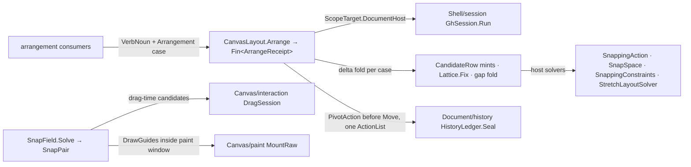

# [RASM_GRASSHOPPER_CANVAS_LAYOUT]

The canvas layout owner of the Grasshopper boundary — programmatic arrangement as document mutation with owned undo, and interactive snap solving as typed capsules over the host solver surfaces. The census `LayoutArrangement` — eleven separately-authored mechanisms interleaving pure geometry with document writes, plus the local `SnapAngle`/`ArcLines`/`RepelPair`/`EquidistanceGuides`/`GeometryActions` math — collapses here by host absorption: the `SnappingAction` factory family owns align, gap, ortho, and wire-straighten candidates, `SnappingConstraints` owns document-scoped rectangle and wire snapping, `SnapSpace` owns numeric lattices, and `StretchLayoutSolver` owns min/ideal/max distribution — all decompile-verified — while the residual delta arithmetic is three-line vector composition over `Eto.Drawing` values and every killed local solver's capability lands on a host row. Every arrangement is ONE `Arrangement` case folded to per-object pivot deltas and settled as ONE document mutation: `IAttributes.Move` under pre-captured `PivotAction` undo rows, sealed through `Document/history.md`'s `HistoryLedger.Seal` with the caller's `VerbNoun` — a move without its undo record is unconstructible from this gate. Snap-guide feedback draws inside `Canvas/paint.md`'s window; the live per-axis nudge state (`SnapXAction`/`SnapYAction`) reads through the canvas lens; drag-time snapping is the host's own (`Canvas/interaction.md`'s `DragSession` drives it), and this page owns the deliberate, receipted arrangement.

## [01]-[INDEX]

- [02]-[CANDIDATES]: `CandidateRow` + `NudgeVector` — the snap-candidate factory rows and the winning-nudge fold.
- [03]-[SOLVERS]: `SnapScope` + `SnapField` + `Lattice` + `SnapVerdict` + `StretchPlan` — the document snap capsule, the host-direct settings law, the numeric lattice, and the stretch distribution fold.
- [04]-[ARRANGE]: `Arrangement` + `CanvasLayout` + `ArrangeReceipt` — the arrangement union and the one sealed-mutation gate.

## [02]-[CANDIDATES]

- Owner: `CandidateRow` `[SmartEnum<int>]` — the snap-candidate vocabulary over the decompile-verified `SnappingAction` factory family, four payload shapes generated through four row folds: five ALIGN rows (`AlignLeft`/`AlignRight`/`AlignTop`/`AlignBottom`/`AlignCentre` — `(RectangleF source, RectangleF target, float delta)`), four GAP rows (`GapRightward`/`GapLeftward`/`GapAbove`/`GapBelow` — `(RectangleF, RectangleF, int gapSize, float delta)`, the census two-factory roster was thin COVERAGE against the four verified gap factories), two ORTHO rows (`OrthoVertical`/`OrthoHorizontal` — `(PointF origin, RectangleF frame)`), and the wire row `StraightenWire` (`(PointF, PointF)` — the visual-route census kill's surviving host capability). Every row answers through one `Mint` gate returning the host `SnappingAction`, and the align rows carry a second `Gauge(source, target)` column — the host factory consumes its `delta` verbatim (`ΔX`/`ΔY` restate it), so the row owns the misalignment arithmetic that fills its own payload and a caller never re-derives edge math.
- Owner: `NudgeVector` `readonly record struct` — the candidate evidence projected off a resolved `SnappingAction`: `Dx`/`Dy` (the host `ΔX`/`ΔY`), `Magnitude`, the guide `Lines`, and the label triple (`LabelText`/`LabelPoint`/`LabelAnchor`) a feedback painter renders. `Winner(params ReadOnlySpan<SnappingAction>)` folds a candidate set to the shortest nudge through the host's own `SmallerMagnitude`, total over the empty span as `None`.
- Law: candidate arithmetic is host arithmetic — a local edge-comparison or equidistance derivation beside these rows is the census `GeometryActions`/`EquidistanceGuides` defect, killed by absorption; a candidate the host family cannot mint (a radial ring, a flow-aligned rail) is a NEW row composing kernel `Rasm.Numerics` atoms for its vector math and minting through the public `SnappingAction` constructor `(dx, dy, text, point, anchor, lines)` — the host ctor is the extension seam, so growth is a row, never a solver.
- Law: guide feedback is paint transport — `SnappingAction.Draw(Context, Color)` and `SnappingConstraints.DrawSnappingBoxes(Graphics)` run inside a `Canvas/paint.md` `MountRaw` window with the colour from `SnappingSettings.Colour`; a feedback stroke outside the paint window is the inline-paint defect.
- Packages: Grasshopper2 (`SnappingAction.CreateLeftAlignAction`/`CreateRightAlignAction`/`CreateTopAlignAction`/`CreateBottomAlignAction`/`CreateCentreAlignAction`/`CreateVerticalGapActionOnRight`/`CreateVerticalGapActionOnLeft`/`CreateHorizontalGapActionAbove`/`CreateHorizontalGapActionBelow`/`VerticalOrthoAction`/`HorizontalOrthoAction`/`CreateStraightenWireAction`/`SmallerMagnitude`/`ΔX`/`ΔY`/`Magnitude`/`Lines`/`LabelText`/`LabelPoint`/`LabelAnchor`/`Draw`, `TextAnchor`), Eto.Drawing, LanguageExt.Core, `Rasm.Domain`.
- Growth: a new candidate is one row through an existing fold or one kernel-composed mint through the public ctor; the fold and the evidence never fork.

## [03]-[SOLVERS]

- Owner: `SnapField` sealed class `[BoundaryAdapter]` — the document snap capsule over `SnappingConstraints`, admitted through ONE polymorphic `Of` over `SnapScope` `[Union]`: `ExcludingCase(Seq<Guid>)` (the params-filter host overload — a drag excludes its own ids), `SelectionCase(bool IncludeSelected, bool IncludeUnselected, Option<HashSet<Guid>> Filter)` (the four-argument overload), `BoxesCase(RectangleF[] Frames)` (the raw-rectangle constructor for synthetic targets). `Solve(RectangleF target, RectangleF visibleLimit, SnappingSettings, Op)` lifts the `SnapRectangle` out-pair onto `SnapPair` (`Option<SnappingAction>` per axis — a null out is typed absence, never a null nudge), `SolveObject(IDocumentObject, ...)` rides `SnapObject`, and the static `SolveWires(IDocumentObject, Option<RectangleF> boundsOverride, SnappingSettings, Op)` collapses the two verified static `SnapWires` overloads on the presence of the override.
- Law: settings policy is host-direct — `SnappingSettings.Default` and the user-live `Current` are the two reads, `WithRules`/`WithoutRules`/`WithFeedback` derive variants over the `SnappingRule` flags, and the fourteen decompile-verified axis getters (`AlignLeftEdges`/`AlignRightEdges`/`AlignTopEdges`/`AlignBottomEdges`/`AlignMiddles`/`AlignWires`/`SpaceVerticalGaps`/`SpaceHorizontalGaps`/`VerticalGapSize`/`HorizontalGapSize`/`EdgeRadius`/`WireRadius`/`Feedback`/`Colour`) ARE the evidence row — a local mirror record or read wrapper beside them is the deleted form, and the census policy record was thin COVERAGE against this set. The host settings dialog factory (`SettingsForm`) is chrome territory and stays unwrapped.
- Owner: `Lattice` `readonly record struct` — the numeric snap lattice over `SnapSpace`: `Orthogonal(double originX, double originY, double sizeX, Option<double> sizeY, Op?)` collapses the two `CreateOrthogonal` arities on the presence of the second cell size, `Of` discriminates element lattices (`ISnapElement[]`) from per-axis numeric lattices (`Seq<SnapNumeric>` x/y pair) over the host `Create` overloads, `Merge(Lattice)` rides the host merge, `Empty` is the host identity, and `Fix(double x, double y, Option<double> cutoff, Op)` lifts the three-out-parameter `Snap` onto `SnapVerdict(X, Y, Option<string> Rule)` — the rule description is typed evidence, so a consumer never parses feedback text.
- Owner: `StretchPlan` — the distribution fold over `StretchLayoutSolver`: `Solve(Seq<StretchRow> rows, float target, bool round, Op)` → `Fin<StretchVerdict>` — `Add(min, max, ideal)` per row, one `Solve(target)` (the returned float is the unplaced residual), an optional `Round()` pixel-alignment pass, and the per-segment lengths read back through the indexer; `StretchRow(Min, Max, Ideal)` admits `Min ≤ Ideal ≤ Max` claims.
- Law: capsule state is gesture-scoped — a `SnapField` is built per drag or per arrangement against the CURRENT graph and never cached across mutations, because constraint boxes are position snapshots.
- Packages: Grasshopper2 (`SnappingConstraints.CreateFromDocument`×2/ctor/`SnapObject`/`SnapRectangle`/`SnapWires`×2/`DrawSnappingBoxes`/`Count`, `SnappingSettings` full axis set, `SnappingRule`, `SnapSpace.Create`/`CreateOrthogonal`×2/`Merge`/`Empty`/`Snap`×2, `ISnapElement`, `SnapNumeric`, `StretchLayoutSolver.Add`/`Solve`/`Round`/`Count` + indexer, `ResizingFrame` composes these in `Canvas/interaction.md`), LanguageExt.Core, `Rasm.Domain`.
- Growth: a new snap source is one `SnapScope` case; a new lattice family is one `Of` arm over a host `Create` overload; the verdict shapes never fork.

```csharp signature
// --- [RUNTIME_PRELUDE] ----------------------------------------------------------------------
using Rasm.Csp;

namespace Rasm.Grasshopper.Canvas;

// --- [TYPES] --------------------------------------------------------------------------------
[SmartEnum<int>]
public sealed partial class CandidateRow {
    public static readonly CandidateRow AlignLeft = Align(key: 0, mint: SnappingAction.CreateLeftAlignAction, gauge: static (s, t) => t.Left - s.Left);
    public static readonly CandidateRow AlignRight = Align(key: 1, mint: SnappingAction.CreateRightAlignAction, gauge: static (s, t) => t.Right - s.Right);
    public static readonly CandidateRow AlignTop = Align(key: 2, mint: SnappingAction.CreateTopAlignAction, gauge: static (s, t) => t.Top - s.Top);
    public static readonly CandidateRow AlignBottom = Align(key: 3, mint: SnappingAction.CreateBottomAlignAction, gauge: static (s, t) => t.Bottom - s.Bottom);
    public static readonly CandidateRow AlignCentre = Align(key: 4, mint: SnappingAction.CreateCentreAlignAction, gauge: static (s, t) => t.Center.X - s.Center.X);
    public static readonly CandidateRow GapRightward = Gap(key: 5, mint: SnappingAction.CreateVerticalGapActionOnRight);
    public static readonly CandidateRow GapLeftward = Gap(key: 6, mint: SnappingAction.CreateVerticalGapActionOnLeft);
    public static readonly CandidateRow GapAbove = Gap(key: 7, mint: SnappingAction.CreateHorizontalGapActionAbove);
    public static readonly CandidateRow GapBelow = Gap(key: 8, mint: SnappingAction.CreateHorizontalGapActionBelow);
    public static readonly CandidateRow OrthoVertical = Ortho(key: 9, mint: SnappingAction.VerticalOrthoAction);
    public static readonly CandidateRow OrthoHorizontal = Ortho(key: 10, mint: SnappingAction.HorizontalOrthoAction);
    public static readonly CandidateRow StraightenWire = Wire(key: 11, mint: SnappingAction.CreateStraightenWireAction);

    [UseDelegateFromConstructor] private partial SnappingAction? MintRaw(CandidatePayload payload);
    [UseDelegateFromConstructor] internal partial float Gauge(RectangleF source, RectangleF target);

    public Fin<SnappingAction> Mint(CandidatePayload payload, Op key) =>
        key.Catch(body: () => Optional(MintRaw(payload: payload)).ToFin(key.InvalidInput()));

    private static CandidateRow Align(int key, Func<RectangleF, RectangleF, float, SnappingAction> mint, Func<RectangleF, RectangleF, float> gauge) =>
        new(key: key, mintRaw: payload => payload switch {
            CandidatePayload.AlignCase c => mint(c.Source, c.Target, c.Delta),
            var other => null,
        }, gauge: gauge);
    private static CandidateRow Gap(int key, Func<RectangleF, RectangleF, int, float, SnappingAction> mint) =>
        new(key: key, mintRaw: payload => payload switch {
            CandidatePayload.GapCase c => mint(c.Source, c.Target, c.GapSize, c.Delta),
            var other => null,
        }, gauge: static (_, _) => 0f);
    private static CandidateRow Ortho(int key, Func<PointF, RectangleF, SnappingAction> mint) =>
        new(key: key, mintRaw: payload => payload switch {
            CandidatePayload.OrthoCase c => mint(c.Origin, c.Frame),
            var other => null,
        }, gauge: static (_, _) => 0f);
    private static CandidateRow Wire(int key, Func<PointF, PointF, SnappingAction> mint) =>
        new(key: key, mintRaw: payload => payload switch {
            CandidatePayload.WireCase c => mint(c.Source, c.Target),
            var other => null,
        }, gauge: static (_, _) => 0f);
}

[Union]
public abstract partial record CandidatePayload {
    private CandidatePayload() { }
    public sealed record AlignCase(RectangleF Source, RectangleF Target, float Delta) : CandidatePayload;
    public sealed record GapCase(RectangleF Source, RectangleF Target, int GapSize, float Delta) : CandidatePayload;
    public sealed record OrthoCase(PointF Origin, RectangleF Frame) : CandidatePayload;
    public sealed record WireCase(PointF Source, PointF Target) : CandidatePayload;
}

[Union]
public abstract partial record SnapScope {
    private SnapScope() { }
    public sealed record ExcludingCase(Seq<Guid> Dragged) : SnapScope;
    public sealed record SelectionCase(bool IncludeSelected, bool IncludeUnselected, Option<HashSet<Guid>> Filter) : SnapScope;
    public sealed record BoxesCase(RectangleF[] Frames) : SnapScope;
}

// --- [MODELS] -------------------------------------------------------------------------------
[BoundaryAdapter, StructLayout(LayoutKind.Auto)]
public readonly record struct NudgeVector(
    float Dx, float Dy, float Magnitude, LineF[] Lines, string LabelText, PointF LabelPoint, TextAnchor LabelAnchor) : IValidityEvidence {
    public bool IsValid => ValidityClaim.All(
        ValidityClaim.Of(holds: float.IsFinite(Dx) && float.IsFinite(Dy)),
        ValidityClaim.Nonnegative(value: Magnitude));

    public static NudgeVector Of(SnappingAction action) =>
        new(Dx: action.ΔX, Dy: action.ΔY, Magnitude: action.Magnitude,
            Lines: action.Lines, LabelText: action.LabelText, LabelPoint: action.LabelPoint, LabelAnchor: action.LabelAnchor);

    public static Option<SnappingAction> Winner(params ReadOnlySpan<SnappingAction> candidates) {
        Option<SnappingAction> held = Option<SnappingAction>.None;
        foreach (SnappingAction next in candidates) {
            held = held.Match(Some: best => Some(SnappingAction.SmallerMagnitude(best, next)), None: () => Some(next));
        }
        return held;
    }
}

[BoundaryAdapter, StructLayout(LayoutKind.Auto)]
public readonly record struct SnapPair(Option<SnappingAction> X, Option<SnappingAction> Y);

[BoundaryAdapter, StructLayout(LayoutKind.Auto)]
public readonly record struct SnapVerdict(double X, double Y, Option<string> Rule);

[BoundaryAdapter, StructLayout(LayoutKind.Auto)]
public readonly record struct StretchRow(float Min, float Max, float Ideal) : IValidityEvidence {
    public bool IsValid => ValidityClaim.All(
        ValidityClaim.Ordered(lower: Min, upper: Ideal),
        ValidityClaim.Ordered(lower: Ideal, upper: Max));
}

[BoundaryAdapter, StructLayout(LayoutKind.Auto)]
public readonly record struct StretchVerdict(Seq<float> Lengths, float Residual);

// --- [SERVICES] -----------------------------------------------------------------------------
[BoundaryAdapter]
public sealed class SnapField {
    private readonly SnappingConstraints _constraints;

    private SnapField(SnappingConstraints constraints) => _constraints = constraints;

    public static Fin<SnapField> Of(Document graph, SnapScope scope, Op? key = null) {
        Op op = key.OrDefault();
        return op.Need(value: scope).Bind(valid => valid.Switch(
            state: (Graph: graph, Key: op),
            excludingCase: static (s, c) => s.Key.Catch(body: () => Fin.Succ(
                new SnapField(constraints: SnappingConstraints.CreateFromDocument(s.Graph, c.Dragged.ToArray())))),
            selectionCase: static (s, c) => s.Key.Catch(body: () => Fin.Succ(
                new SnapField(constraints: SnappingConstraints.CreateFromDocument(
                    s.Graph, c.IncludeSelected, c.IncludeUnselected,
                    c.Filter.MatchUnsafe(Some: static held => held, None: static () => null))))),
            boxesCase: static (s, c) => s.Key.Catch(body: () => Fin.Succ(
                new SnapField(constraints: new SnappingConstraints(c.Frames))))));
    }

    public Fin<SnapPair> Solve(RectangleF target, RectangleF visibleLimit, SnappingSettings settings, Op key) {
        SnappingConstraints constraints = _constraints;
        return key.Catch(body: () => {
            constraints.SnapRectangle(target, settings, visibleLimit, out SnappingAction snapX, out SnappingAction snapY);
            return Fin.Succ(new SnapPair(X: Optional(snapX), Y: Optional(snapY)));
        });
    }

    public Fin<SnapPair> SolveObject(IDocumentObject target, RectangleF visibleLimit, SnappingSettings settings, Op key) {
        SnappingConstraints constraints = _constraints;
        return key.Catch(body: () => {
            constraints.SnapObject(target, settings, visibleLimit, out SnappingAction snapX, out SnappingAction snapY);
            return Fin.Succ(new SnapPair(X: Optional(snapX), Y: Optional(snapY)));
        });
    }

    public static Fin<Option<SnappingAction>> SolveWires(
        IDocumentObject target, Option<RectangleF> boundsOverride, SnappingSettings settings, Op key) =>
        key.Catch(body: () => Fin.Succ(boundsOverride.Match(
            Some: bounds => Optional(SnappingConstraints.SnapWires(target, bounds, settings)),
            None: () => Optional(SnappingConstraints.SnapWires(target, settings)))));

    public Unit DrawGuides(Graphics graphics) => Op.Side(action: () => _constraints.DrawSnappingBoxes(graphics));
}

[BoundaryAdapter, StructLayout(LayoutKind.Auto)]
public readonly record struct Lattice {
    private Lattice(SnapSpace space) => Space = space;
    internal SnapSpace Space { get; }

    public static readonly Lattice Empty = new(space: SnapSpace.Empty);

    public static Fin<Lattice> Orthogonal(double originX, double originY, double sizeX, Option<double> sizeY = default, Op? key = null) {
        Op op = key.OrDefault();
        return from cellX in op.Positive(value: sizeX)
               from lattice in sizeY.Match(
                   Some: cellY => op.Positive(value: cellY).Bind(valid =>
                       op.Catch(body: () => Fin.Succ(new Lattice(space: SnapSpace.CreateOrthogonal(originX, originY, cellX, valid))))),
                   None: () => op.Catch(body: () => Fin.Succ(new Lattice(space: SnapSpace.CreateOrthogonal(originX, originY, cellX)))))
               select lattice;
    }

    public static Fin<Lattice> Of(ISnapElement[] elements, Op? key = null) {
        Op op = key.OrDefault();
        return op.Catch(body: () => Fin.Succ(new Lattice(space: SnapSpace.Create(elements))));
    }

    public static Fin<Lattice> Of(Seq<SnapNumeric> x, Seq<SnapNumeric> y, Op? key = null) {
        Op op = key.OrDefault();
        return op.Catch(body: () => Fin.Succ(new Lattice(space: SnapSpace.Create(x, y))));
    }

    public Lattice Merge(Lattice other) => new(space: Space.Merge(other.Space));

    public Fin<SnapVerdict> Fix(double x, double y, Option<double> cutoff, Op key) {
        SnapSpace space = Space;
        return key.Catch(body: () => {
            double fixedX;
            double fixedY;
            string description;
            if (cutoff.Case is double limit) { space.Snap(x, y, limit, out fixedX, out fixedY, out description); }
            else { space.Snap(x, y, out fixedX, out fixedY, out description); }
            return Fin.Succ(new SnapVerdict(
                X: fixedX, Y: fixedY,
                Rule: Optional(description).Filter(static text => !string.IsNullOrWhiteSpace(value: text))));
        });
    }
}

// --- [OPERATIONS] ---------------------------------------------------------------------------
[BoundaryAdapter]
public static class StretchPlan {
    public static Fin<StretchVerdict> Solve(Seq<StretchRow> rows, float target, bool round, Op key) =>
        from valid in guard(rows.ForAll(static row => row.IsValid), key.InvalidInput()).ToFin()
        from verdict in key.Catch(body: () => {
            StretchLayoutSolver solver = new();
            rows.Iter(row => solver.Add(row.Min, row.Max, row.Ideal));
            float residual = solver.Solve(target);
            if (round) { solver.Round(); }
            return Fin.Succ(new StretchVerdict(
                Lengths: toSeq(Enumerable.Range(0, solver.Count).Select(index => solver[index])).Strict(),
                Residual: residual));
        })
        select verdict;
}
```

## [04]-[ARRANGE]

- Owner: `Arrangement` `[Union]` — the closed arrangement family, every case resolving to per-object pivot deltas: `AlignCase(CandidateRow Edge, Seq<Guid> Objects)` aligns the set to the anchor's edge or centre line (the anchor is the first object's bounds — the host convention — and each follower's delta is the row's own `Gauge` misalignment, minted through the same factory the interactive solver consumes), `DistributeCase(bool Vertical, int Gap, Seq<Guid> Objects)` orders the set along the axis by pivot and re-spaces to the equal gap, `GridCase(double CellWidth, double CellHeight, PointF Origin, Seq<Guid> Objects)` quantizes every pivot onto a `Lattice.Orthogonal` verdict, `NudgeCase(SizeF Delta, Seq<Guid> Objects)` translates the set by one vector (arrow-key stepping is a policy value at the caller), and `StraightenCase(WireEnds Wire)` resolves the wire's endpoint pair through the `StraightenWire` candidate and moves the SOURCE object by the nudge.
- Owner: `ArrangeReceipt` — the settlement evidence: raising `Op`, case name, moved-object count, total displacement magnitude, and latency, implementing `IValidityEvidence`.
- Entry: `CanvasLayout.Arrange(VerbNoun label, Arrangement plan, Op? key = null)` → `Fin<ArrangeReceipt>` — the ONE gate: acquire the document scope, resolve each id to its `IAttributes` (a missing object is a typed fault, never a silent skip), compute the case's deltas, then per object ADD a `PivotAction(obj)` undo row BEFORE `IAttributes.Move(dx, dy)` — the host action captures the pre-move pivot, and `Extends` dedups consecutive nudges of one object into one record — and seal the filled `ActionList` through `HistoryLedger.Seal(document.Undo, actions, label, op)`. One marshal window covers resolve, move, and seal, so no half-arranged graph is observable.
- Law: mutation and undo are one act — the census interleave of moves, feedback, and pure solving is dead; a zero-delta object contributes no undo row, and an arrangement whose every delta is zero seals nothing and reports a zero-count receipt.
- Law: `VerbNoun` arrives minted — the label mint spelling is the standing `Document/history.md` RESEARCH item, and this gate never constructs one.
- Boundary: snapped interactive movement during a drag is the host's own (`ObjectDragInteraction` composes `SnappingConstraints` internally); whole-graph selection sweeps and structural verbs are `Document/document.md`'s transaction; the live `SnapXAction`/`SnapYAction` nudge state is a `Canvas/canvas.md` lens read surfaced as `NudgeVector` evidence.
- Packages: Grasshopper2 (`IAttributes.Pivot`/`Bounds`/`AggregateBounds`/`Snappable`/`Move`, `IDocumentObject.Attributes`, `Document.Undo`, `ActionList.Add`, `PivotAction`, `VerbNoun`, `WireEnds`), `Document/history.md` (`HistoryLedger.Seal`), `Shell/session.md` (`GhSession`, `ScopeTarget`), Eto.Drawing, LanguageExt.Core, `Rasm.Domain`.
- Growth: a new arrangement is one case whose delta fold breaks the gate loudly; a new undo posture is `Document/history.md`'s row, never a fork here.

```csharp signature
// --- [RUNTIME_PRELUDE] ----------------------------------------------------------------------
using Rasm.Csp;
using Rasm.Grasshopper.Document;
using Rasm.Grasshopper.Shell;

namespace Rasm.Grasshopper.Canvas;

// --- [TYPES] --------------------------------------------------------------------------------
[Union]
[GenerateUnionOps]
public abstract partial record Arrangement {
    private Arrangement() { }
    public sealed record AlignCase(CandidateRow Edge, Seq<Guid> Objects) : Arrangement;
    public sealed record DistributeCase(bool Vertical, int Gap, Seq<Guid> Objects) : Arrangement;
    public sealed record GridCase(double CellWidth, double CellHeight, PointF Origin, Seq<Guid> Objects) : Arrangement;
    public sealed record NudgeCase(SizeF Delta, Seq<Guid> Objects) : Arrangement;
    public sealed record StraightenCase(WireEnds Wire) : Arrangement;
}

// --- [MODELS] -------------------------------------------------------------------------------
[BoundaryAdapter, StructLayout(LayoutKind.Auto)]
public readonly record struct ArrangeReceipt(Op Operation, string Verb, int Moved, double Displacement, TimeSpan Latency) : IValidityEvidence {
    public bool IsValid => ValidityClaim.All(
        ValidityClaim.Of(holds: Moved >= 0),
        ValidityClaim.Nonnegative(value: Displacement),
        ValidityClaim.Nonnegative(value: Latency.TotalSeconds));
}

// --- [OPERATIONS] ---------------------------------------------------------------------------
[BoundaryAdapter]
public static class CanvasLayout {
    public static Fin<ArrangeReceipt> Arrange(VerbNoun label, Arrangement plan, Op? key = null) {
        Op op = key.OrDefault();
        long entered = Environment.TickCount64;
        return op.Need(value: plan)
            .Bind(valid => GhSession.Run(ScopeTarget.DocumentHost, scope =>
                scope.Document.ToFin(op.MissingContext()).Bind(graph =>
                    Deltas(graph: graph, plan: valid, key: op).Bind(moves => Commit(graph: graph, label: label, moves: moves, key: op)
                        .Map(sealedCount => (Verb: valid.Switch(
                                alignCase: static _ => nameof(Arrangement.AlignCase),
                                distributeCase: static _ => nameof(Arrangement.DistributeCase),
                                gridCase: static _ => nameof(Arrangement.GridCase),
                                nudgeCase: static _ => nameof(Arrangement.NudgeCase),
                                straightenCase: static _ => nameof(Arrangement.StraightenCase)),
                            Moved: sealedCount,
                            Displacement: moves.Fold(0d, static (sum, move) => sum + Math.Abs(move.Dx) + Math.Abs(move.Dy)))))), key: op))
            .Map(outcome => new ArrangeReceipt(
                Operation: op, Verb: outcome.Verb, Moved: outcome.Moved, Displacement: outcome.Displacement,
                Latency: TimeSpan.FromMilliseconds(value: Environment.TickCount64 - entered)));
    }

    private static Fin<Seq<(IAttributes Target, float Dx, float Dy)>> Deltas(Document graph, Arrangement plan, Op key) =>
        plan.Switch(
            state: (Graph: graph, Key: key),
            alignCase: static (s, c) =>
                from rows in Resolve(graph: s.Graph, objects: c.Objects, key: s.Key)
                from anchor in rows.HeadOrNone().ToFin(s.Key.InvalidInput())
                from moves in rows.Tail.Map(row => c.Edge.Mint(
                        payload: new CandidatePayload.AlignCase(
                            Source: row.Bounds, Target: anchor.Bounds,
                            Delta: c.Edge.Gauge(source: row.Bounds, target: anchor.Bounds)), key: s.Key)
                        .Map(action => (Target: row, Dx: action.ΔX, Dy: action.ΔY)))
                    .TraverseM(identity).As()
                select moves.Strict(),
            distributeCase: static (s, c) =>
                Resolve(graph: s.Graph, objects: c.Objects, key: s.Key).Map(rows => {
                    Seq<IAttributes> ordered = rows.OrderBy(row => c.Vertical ? row.Pivot.Y : row.Pivot.X).ToSeq().Strict();
                    return ordered.HeadOrNone().Match(
                        Some: head => ordered.Tail.Fold(
                            (Cursor: c.Vertical ? head.Bounds.Bottom : head.Bounds.Right, Moves: Seq<(IAttributes, float, float)>()),
                            (held, row) => {
                                float dx = c.Vertical ? 0f : held.Cursor + c.Gap - row.Bounds.Left;
                                float dy = c.Vertical ? held.Cursor + c.Gap - row.Bounds.Top : 0f;
                                float advance = (c.Vertical ? row.Bounds.Height : row.Bounds.Width) + c.Gap;
                                return (held.Cursor + advance, held.Moves.Add((row, dx, dy)));
                            }).Moves.Strict(),
                        None: static () => Seq<(IAttributes, float, float)>());
                }),
            gridCase: static (s, c) =>
                from rows in Resolve(graph: s.Graph, objects: c.Objects, key: s.Key)
                from lattice in Lattice.Orthogonal(originX: c.Origin.X, originY: c.Origin.Y, sizeX: c.CellWidth, sizeY: Some(c.CellHeight), key: s.Key)
                from moves in rows.Map(row => lattice.Fix(x: row.Pivot.X, y: row.Pivot.Y, cutoff: Option<double>.None, key: s.Key)
                        .Map(verdict => (Target: row, Dx: (float)(verdict.X - row.Pivot.X), Dy: (float)(verdict.Y - row.Pivot.Y))))
                    .TraverseM(identity).As()
                select moves.Strict(),
            nudgeCase: static (s, c) =>
                Resolve(graph: s.Graph, objects: c.Objects, key: s.Key)
                    .Map(rows => rows.Map(row => (Target: row, Dx: c.Delta.Width, Dy: c.Delta.Height)).Strict()),
            straightenCase: static (s, c) =>
                from source in Optional(s.Graph.Objects.FindParameter(c.Wire.Source)).ToFin(s.Key.InvalidInput())
                from target in Optional(s.Graph.Objects.FindParameter(c.Wire.Target)).ToFin(s.Key.InvalidInput())
                from owner in Optional(source.Attributes as IParameterAttributes).ToFin(s.Key.InvalidResult())
                from into in Optional(target.Attributes as IParameterAttributes).ToFin(s.Key.InvalidResult())
                from action in CandidateRow.StraightenWire.Mint(
                    payload: new CandidatePayload.WireCase(Source: owner.Outlet, Target: into.Inlet), key: s.Key)
                select Seq1((Target: (IAttributes)owner, Dx: action.ΔX, Dy: action.ΔY)));

    private static Fin<Seq<IAttributes>> Resolve(Document graph, Seq<Guid> objects, Op key) =>
        objects.Map(id => Optional(graph.Objects.Find(id)).Bind(static obj => Optional(obj.Attributes)).ToFin(key.InvalidInput()))
            .TraverseM(identity).As().Map(static rows => rows.Strict());

    private static Fin<int> Commit(Document graph, VerbNoun label, Seq<(IAttributes Target, float Dx, float Dy)> moves, Op key) {
        Seq<(IAttributes Target, float Dx, float Dy)> real = moves.Filter(static move => move.Dx != 0f || move.Dy != 0f).Strict();
        if (real.IsEmpty) { return Fin.Succ(0); }
        return key.Catch(body: () => {
            ActionList actions = new();
            real.Iter(move => {
                actions.Add(new PivotAction(move.Target.Owner));
                move.Target.Move(move.Dx, move.Dy);
            });
            return Fin.Succ(actions);
        }).Bind(actions => HistoryLedger.Seal(graph.Undo, actions, label, key).Map(_ => real.Count));
    }
}
```



## [05]-[DENSITY_BAR]

| [INDEX] | [CONCERN]             | [OWNER]                          | [KIND]                                                | [RAIL]                                  | [CASES] |
| :-----: | :-------------------- | :------------------------------- | :----------------------------------------------------- | :--------------------------------------- | :-----: |
|  [01]   | snap candidates       | `CandidateRow` + `NudgeVector`   | `[SmartEnum<int>]` factory rows, three payload folds  | `Mint → Fin<SnappingAction>`            |   12    |
|  [02]   | document snapping     | `SnapField` + `SnapScope`        | capsule over `SnappingConstraints`, one `Of`          | `Solve → Fin<SnapPair>`                 |    3    |
|  [03]   | numeric lattice       | `Lattice` + `SnapVerdict`        | capsule over `SnapSpace`, out-params lifted           | `Fix → Fin<SnapVerdict>`                |    2    |
|  [04]   | stretch distribution  | `StretchPlan` + `StretchRow`     | claim-gated fold over `StretchLayoutSolver`           | `Solve → Fin<StretchVerdict>`           |    1    |
|  [05]   | sealed arrangement    | `Arrangement` + `CanvasLayout`   | `[GenerateUnionOps]` `[Union]` + one mutation gate    | `Arrange → Fin<ArrangeReceipt>`         |    5    |

`GhSession`, `HistoryLedger`, `Lattice`-composed kernel numerics, `Op`, `ValidityClaim`, and the host solver surfaces are composed upstream owners. The census `LayoutArrangement` mechanism roster, `SnapSetting`, `SnapAngle`, `ArcLines`, `RepelPair`, `EquidistanceGuides`, and `GeometryActions` have no successor shape — their solving lands on the host rows above, their arithmetic on the delta folds, and their mutations on the one sealed gate.
