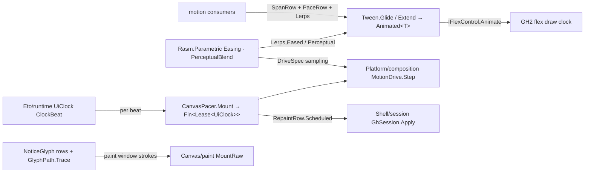

# [RASM_GRASSHOPPER_CANVAS_MOTION]

The GH2 motion adapter of the Grasshopper boundary — the host pacing tier the census `Motion` blocker resolves into: `Animated<T>` composition, the typed `Animators` factories, the named-span and easing-kind vocabularies, the `IFlexControl` animation drive (`Animate`, `AnimatedZoomFactor`, the frame-timing window), and the `AnimatedPath` feedback-glyph family — a HOST gap absent from every census-era stub, landed here at full catalog depth. Every host-agnostic curve, spring regime, cycle, and perceptual mix is a kernel row (`Easing`, `SpringShape`, `CyclePlan`, `PerceptualBlend` on the kernel motion surface): the census file's 46-row Penner catalogue, analytic spring solver, phase arithmetic, and OKLab conversion have NO successor on this page, and the kernel crosses into host pacing at exactly two seams — a kernel-reshaped `Interpolate<T>` inside a host tween, and the beat-paced drive fold `Platform/composition.md` mints, re-paced here off `Eto/runtime.md`'s `UiClock` for the non-CoreAnimation branch, so the two pacers stay one law met at the consumer. The census `Grasshopper2.UI.Flex.Pacer`/`PacerOption`/`Subscription`/`RepaintRequest` members are phantoms with no assembly presence; repaint is `ScheduleRedraw` and canvas repaint policy is `Shell/session.md`'s `RepaintRow`. macOS CoreAnimation cosmetics stay `Platform/composition.md`'s gated owners.

## [01]-[INDEX]

- [02]-[VOCAB]: `SpanRow` + `PaceRow` — the named-span rows over the host `Duration` ordinals and the easing-kind rows pairing every host `Motion` member with its declared kernel counterpart.
- [03]-[TWEENS]: `Lerps` + `Tween` + `FrameWindow` — the interpolator catalog (the kernel-unification seam), the `Animated<T>` composition gate, and the flex drive.
- [04]-[GLYPHS]: `NoticeGlyph` + `StrokeStep` + `GlyphPath` — the animated feedback-path family and the unified time-parameterized draw.
- [05]-[PACER]: `CanvasPacer` — kernel drives paced off the UI clock with scheduled redraws; the GH2 branch of the one drive law.

## [02]-[VOCAB]

- Owner: `SpanRow` `[SmartEnum<int>]` — eight rows keyed by the host `Duration` ordinal (the ordinal IS the millisecond value on the decompiled enum): `Abrupt` (0), `Brief` (50), `Fast` (150), `Normal` (300), `Slow` (500), `Tedious` (1000), `Torpid` (1500), `Glacial` (5000 — the host member is spelled `Ĝlāçïāľ`; the row carries the canonical name and the host column carries the exact member). Each row carries its `Duration Host` column and derives `Span` through the verified `Animators.DurationToTimeSpan`. The census five-step roster was thin COVERAGE against the eight decompiled members.
- Owner: `PaceRow` `[SmartEnum<int>]` — sixteen rows keyed by the host `Motion` ordinal, generated as eight kind kernels folded through the prompt/delayed polarity (the decompiled enum is `Linear`/`LinearDelayed` (0/1), `EaseIn`/`EaseInDelayed` (10/11), `EaseOut` (20/21), `EaseInOut` (30/31), `SnapIn` (40/41), `SnapOut` (50/51), `Bounce` (60/61), `Twang` (70/71) — the census nine-kind flat roster misread the kind-times-delay lattice). Two columns per row: `Motion Host` (what a host tween or `Navigate` consumes) and `Easing Kernel` — the DECLARED kernel counterpart a beat-paced drive substitutes when motion must be kernel-owned (`Linear → Easing.Linear`, `EaseIn → Easing.CubicIn`, `EaseOut → Easing.CubicOut`, `EaseInOut → Easing.CubicInOut`, `SnapIn → Easing.QuintIn`, `SnapOut → Easing.QuintOut`, `Bounce → Easing.BounceOut`, `Twang → Easing.ElasticOut`; delayed rows share their kind's kernel row because delay is host phase, not curve shape). The column is a substitution policy, never an equivalence claim — the host evaluates its own `MotionEquations.Blend`.
- Law: a duration is a row or a `TimeSpan`, an easing kind is a row — a bare host `Duration`/`Motion` literal at a consumer is the bypassed-vocabulary defect, and the row seam is where dispatch over kinds becomes exhaustive.
- Packages: Grasshopper2 (`Motion`, `Duration`, `Animators.DurationToTimeSpan`, `MotionEquations.Blend`), `Rasm.Parametric` (`Easing`), LanguageExt.Core, `Rasm.Domain`.
- Growth: a new host span or kind is one row with its ordinal; the kernel column absorbs the pairing.

## [03]-[TWEENS]

- Owner: `Lerps` — the `Interpolate<T>` catalog, the kernel-unification seam made a value: `Eased<T>(Easing curve, Interpolate<T> core)` wraps a linear-carrier interpolator so the KERNEL row reshapes the factor (the tween mounts with `Motion.Linear`, the host hands the raw progress, and `Easing.Evaluate` bends it — kernel truth inside host pacing, the factor clamped into `UnitInterval` because host progress is unit-bounded while kernel curves legitimately overshoot on output); `Perceptual(PerceptualBlend row)` mints `Interpolate<Color>` through `Pigment` and the kernel mix, so a colour tween interpolates in Oklab/Oklch and the census componentwise-HSL lerp is dead; `Linear` rows for `float`/`double`/`PointF`/`SizeF`/`RectangleF` state the arithmetic once for custom carriers the typed `Animators` factories do not bless.
- Owner: `Tween` — the `Animated<T>` composition gate: `Hold<T>(T value, Interpolate<T> lerp)` (`CreateFinished` — the settled carrier), `Glide<T>(T from, T to, SpanRow span, PaceRow pace, Interpolate<T> lerp)` (`CreateUnfinished` over the row vocabulary; a caller-exact `TimeSpan` rides the second arm), `Extend<T>(Animated<T>, T target, SpanRow, PaceRow)` (`Chain(T, Duration, Motion)` — appends the next leg from the CURRENT value, the host's own retarget law; the remaining host `Chain` overloads stay first-class carrier material a consumer composes directly), and `Sample<T>(Animated<T>, DateTime)` (`Evaluate`). The host carrier's own algebra stays first-class material: `State` (`Pending`/`Busy`/`Finished`), `ValueNow`, the implicit `T ⇄ Animated<T>` conversions, and the `+` retarget operators are the host's, composed, never wrapped.
- Owner: `FlexDrive` — the per-frame drive: `Run<T>(IFlexControl surface, Animated<T> tween, Op?)` → `Fin<T>` rides `IFlexControl.Animate<T>` (the host samples on its draw clock and keeps redrawing while `Busy`); `Window(IFlexControl, Op?)` → `Fin<FrameWindow>` projects `DrawStartTime`/`DrawEndTime` — the per-frame timing evidence a cost-aware animator folds with `Canvas/canvas.md`'s `FramePulse`; `ZoomGate(IFlexControl, ZoomThreshold, Op?)` → `Fin<float>` resolves the motion-gated ZUI factor (`Detailed`/`Standard` — the host's own appearance thresholds).
- Law: one tween owns one visual — chaining retargets the existing carrier; minting a fresh `Animated<T>` per input event resets `Time0` and snaps the motion, which is the census retarget defect the `Extend` law forecloses.
- Boundary: viewport navigation animation is the host's own (`Navigate` consumes `Duration` directly — `Canvas/canvas.md`'s `NavTarget` carries it); skin blending is `Skin.Interpolate` under `Canvas/paint.md`'s lens; sparkle lifecycles are host-owned on `Canvas/canvas.md`'s `SparkleSpec`.
- Packages: Grasshopper2 (`Animated<T>.CreateFinished`/`CreateUnfinished`/`Chain`/`Evaluate`/`ValueNow`/`State`/`Motion`, `Animators.Finished`/`Unfinished` typed families, `Interpolate<T>`, `IFlexControl.Animate`/`AnimatedZoomFactor`/`DrawStartTime`/`DrawEndTime`, `ZoomThreshold`), `Rasm.Parametric` (`Easing`, `PerceptualBlend`, `UnitInterval` via admission), `Canvas/paint.md` (`Pigment`), Eto.Drawing, LanguageExt.Core, `Rasm.Domain`.
- Growth: a new carrier type is one `Lerps` row; a new tween policy is a `PaceRow`/`SpanRow` pairing — the gate never widens.

```csharp signature
// --- [RUNTIME_PRELUDE] ----------------------------------------------------------------------
using Rasm.Csp;
using Rasm.Parametric;

namespace Rasm.Grasshopper.Canvas;

// --- [TYPES] --------------------------------------------------------------------------------
[SmartEnum<int>]
public sealed partial class SpanRow {
    public static readonly SpanRow Abrupt = new(key: 0, host: Duration.Abrupt);
    public static readonly SpanRow Brief = new(key: 50, host: Duration.Brief);
    public static readonly SpanRow Fast = new(key: 150, host: Duration.Fast);
    public static readonly SpanRow Normal = new(key: 300, host: Duration.Normal);
    public static readonly SpanRow Slow = new(key: 500, host: Duration.Slow);
    public static readonly SpanRow Tedious = new(key: 1000, host: Duration.Tedious);
    public static readonly SpanRow Torpid = new(key: 1500, host: Duration.Torpid);
    public static readonly SpanRow Glacial = new(key: 5000, host: Duration.Ĝlāçïāľ);

    public Duration Host { get; }
    public TimeSpan Span => Animators.DurationToTimeSpan(Host);
}

[SmartEnum<int>]
public sealed partial class PaceRow {
    public static readonly PaceRow Linear = new(key: 0, host: Motion.Linear, kernel: Easing.Linear);
    public static readonly PaceRow LinearDelayed = new(key: 1, host: Motion.LinearDelayed, kernel: Easing.Linear);
    public static readonly PaceRow EaseIn = new(key: 10, host: Motion.EaseIn, kernel: Easing.CubicIn);
    public static readonly PaceRow EaseInDelayed = new(key: 11, host: Motion.EaseInDelayed, kernel: Easing.CubicIn);
    public static readonly PaceRow EaseOut = new(key: 20, host: Motion.EaseOut, kernel: Easing.CubicOut);
    public static readonly PaceRow EaseOutDelayed = new(key: 21, host: Motion.EaseOutDelayed, kernel: Easing.CubicOut);
    public static readonly PaceRow EaseInOut = new(key: 30, host: Motion.EaseInOut, kernel: Easing.CubicInOut);
    public static readonly PaceRow EaseInOutDelayed = new(key: 31, host: Motion.EaseInOutDelayed, kernel: Easing.CubicInOut);
    public static readonly PaceRow SnapIn = new(key: 40, host: Motion.SnapIn, kernel: Easing.QuintIn);
    public static readonly PaceRow SnapInDelayed = new(key: 41, host: Motion.SnapInDelayed, kernel: Easing.QuintIn);
    public static readonly PaceRow SnapOut = new(key: 50, host: Motion.SnapOut, kernel: Easing.QuintOut);
    public static readonly PaceRow SnapOutDelayed = new(key: 51, host: Motion.SnapOutDelayed, kernel: Easing.QuintOut);
    public static readonly PaceRow Bounce = new(key: 60, host: Motion.Bounce, kernel: Easing.BounceOut);
    public static readonly PaceRow BounceDelayed = new(key: 61, host: Motion.BounceDelayed, kernel: Easing.BounceOut);
    public static readonly PaceRow Twang = new(key: 70, host: Motion.Twang, kernel: Easing.ElasticOut);
    public static readonly PaceRow TwangDelayed = new(key: 71, host: Motion.TwangDelayed, kernel: Easing.ElasticOut);

    public Motion Host { get; }
    public Easing Kernel { get; }
}

// --- [MODELS] -------------------------------------------------------------------------------
[BoundaryAdapter, StructLayout(LayoutKind.Auto)]
public readonly record struct FrameWindow(DateTime Start, DateTime End) : IValidityEvidence {
    public bool IsValid => ValidityClaim.Of(holds: End >= Start);
    public TimeSpan Cost => End - Start;
}

// --- [OPERATIONS] ---------------------------------------------------------------------------
[BoundaryAdapter]
public static class Lerps {
    public static readonly Interpolate<float> Scalar = static (a, b, t) => a + ((b - a) * (float)t);
    public static readonly Interpolate<double> Wide = static (a, b, t) => a + ((b - a) * t);
    public static readonly Interpolate<PointF> Point = static (a, b, t) => new PointF(a.X + ((b.X - a.X) * (float)t), a.Y + ((b.Y - a.Y) * (float)t));
    public static readonly Interpolate<SizeF> Extent = static (a, b, t) => new SizeF(a.Width + ((b.Width - a.Width) * (float)t), a.Height + ((b.Height - a.Height) * (float)t));
    public static readonly Interpolate<RectangleF> Frame = static (a, b, t) => new RectangleF(
        Point(a.Location, b.Location, t), Extent(a.Size, b.Size, t));

    public static Interpolate<T> Eased<T>(Easing curve, Interpolate<T> core) =>
        (a, b, t) => core(a, b, curve.Evaluate(t: UnitInterval.Create(value: Math.Clamp(t, 0d, 1d))));

    public static Interpolate<Color> Perceptual(PerceptualBlend row, Op key) =>
        (a, b, t) => row.Mix(
                from: Pigment.OfHost(colour: a), to: Pigment.OfHost(colour: b),
                t: UnitInterval.Create(value: Math.Clamp(t, 0d, 1d)), key: key)
            .Map(Pigment.ToHost)
            .IfFail(_ => Fallback(a: a, b: b, t: t));

    private static Color Fallback(Color a, Color b, double t) =>
        new(a.R + ((b.R - a.R) * (float)t), a.G + ((b.G - a.G) * (float)t), a.B + ((b.B - a.B) * (float)t), a.A + ((b.A - a.A) * (float)t));
}

[BoundaryAdapter]
public static class Tween {
    public static Animated<T> Hold<T>(T value, Interpolate<T> lerp) => Animated<T>.CreateFinished(value, lerp);

    public static Animated<T> Glide<T>(T from, T to, SpanRow span, PaceRow pace, Interpolate<T> lerp) =>
        Animated<T>.CreateUnfinished(from, to, span.Span, pace.Host, lerp);

    public static Animated<T> Glide<T>(T from, T to, TimeSpan span, PaceRow pace, Interpolate<T> lerp) =>
        Animated<T>.CreateUnfinished(from, to, span, pace.Host, lerp);

    public static Animated<T> Extend<T>(Animated<T> tween, T target, SpanRow span, PaceRow pace) =>
        tween.Chain(target, span.Host, pace.Host);

    public static T Sample<T>(Animated<T> tween, DateTime at) => tween.Evaluate(at);
}

[BoundaryAdapter]
public static class FlexDrive {
    public static Fin<T> Run<T>(IFlexControl surface, Animated<T> tween, Op? key = null) {
        Op op = key.OrDefault();
        return from live in op.Need(value: surface)
               from carrier in op.Need(value: tween)
               from sampled in op.Catch(body: () => Fin.Succ(live.Animate(carrier)))
               select sampled;
    }

    public static Fin<FrameWindow> Window(IFlexControl surface, Op? key = null) {
        Op op = key.OrDefault();
        return from live in op.Need(value: surface)
               from window in op.Catch(body: () => Fin.Succ(new FrameWindow(Start: live.DrawStartTime, End: live.DrawEndTime)))
               select window;
    }

    public static Fin<float> ZoomGate(IFlexControl surface, ZoomThreshold threshold, Op? key = null) {
        Op op = key.OrDefault();
        return from live in op.Need(value: surface)
               from factor in op.Catch(body: () => Fin.Succ(live.AnimatedZoomFactor(threshold)))
               select factor;
    }
}
```

## [04]-[GLYPHS]

- Owner: `NoticeGlyph` `[SmartEnum<int>]` — the semantic feedback-glyph rows over the verified `AnimatedPath` factory family: `Error`, `Warning`, `Success`, `Message`, each with a `[UseDelegateFromConstructor]` `Mint(float size)` column onto its host factory; the directional arrow is `NoticeGlyph.Arrow(float size, float angle, Op?)` — a separate mint because its payload carries the angle. A custom glyph is `GlyphPath.Custom(Seq<StrokeStep>)`: `StrokeStep` `[Union]` — `GapCase` (the pen-up separator feeding the host `Gaps` stagger), `LineCase(PointF, PointF)`, `LinesCase(Seq<PointF>)`, `CircleCase(CircleF)`, `ArcCase(ArcF)` — folded onto one `AnimatedPath` through the verified builder members.
- Owner: `GlyphPath` — the unified time-parameterized draw: `Trace(AnimatedPath path, Graphics graphics, Pen pen, double head, Option<double> tail, PointF at, Option<(float Scale, float Angle)> pose, Op)` dispatches the four host `Draw` overloads on the presence of the tail parameter and the pose pair — one spelling, four host arities — where `head` is the stroke-completion parameter a tween or beat drive advances, and `tail` opens the trailing-erase window for marching-ant and wipe effects.
- Law: glyph strokes draw inside a `Canvas/paint.md` window (`MountRaw`) or a host-owned paint pass, with the time parameter advanced by a `[03]` tween or a `[05]` beat — a glyph owning its own timer is the census pacer defect, dead with the phantom `Pacer` family.
- Packages: Grasshopper2 (`AnimatedPath` ctor/`CreateErrorPath`/`CreateWarningPath`/`CreateSuccessPath`/`CreateMessagePath`/`CreateArrowPath`/`AddGap`/`AddLine`/`AddLines`/`AddCircle`/`AddArc`/`Draw`×4/`Count`/`Gaps`, `IAnimatedStroke`), Eto.Drawing (`Graphics`, `Pen`, `PointF`, `CircleF`, `ArcF`), LanguageExt.Core, `Rasm.Domain`.
- Growth: a new semantic glyph is one row; a new stroke primitive is one `StrokeStep` case breaking the fold loudly.

```csharp signature
// --- [RUNTIME_PRELUDE] ----------------------------------------------------------------------
using Rasm.Csp;

namespace Rasm.Grasshopper.Canvas;

// --- [TYPES] --------------------------------------------------------------------------------
[SmartEnum<int>]
public sealed partial class NoticeGlyph {
    public static readonly NoticeGlyph Error = new(key: 0, mint: AnimatedPath.CreateErrorPath);
    public static readonly NoticeGlyph Warning = new(key: 1, mint: AnimatedPath.CreateWarningPath);
    public static readonly NoticeGlyph Success = new(key: 2, mint: AnimatedPath.CreateSuccessPath);
    public static readonly NoticeGlyph Message = new(key: 3, mint: AnimatedPath.CreateMessagePath);

    [UseDelegateFromConstructor] public partial AnimatedPath Mint(float size);

    public static Fin<AnimatedPath> Arrow(float size, float angle, Op? key = null) {
        Op op = key.OrDefault();
        return op.Catch(body: () => Fin.Succ(AnimatedPath.CreateArrowPath(size, angle)));
    }
}

[Union]
public abstract partial record StrokeStep {
    private StrokeStep() { }
    public sealed record GapCase : StrokeStep;
    public sealed record LineCase(PointF A, PointF B) : StrokeStep;
    public sealed record LinesCase(Seq<PointF> Points) : StrokeStep;
    public sealed record CircleCase(CircleF Circle) : StrokeStep;
    public sealed record ArcCase(ArcF Arc) : StrokeStep;
}

// --- [OPERATIONS] ---------------------------------------------------------------------------
[BoundaryAdapter]
public static class GlyphPath {
    public static AnimatedPath Custom(Seq<StrokeStep> steps) {
        AnimatedPath path = new();
        steps.Iter(step => step.Switch(
            state: path,
            gapCase: static (p, _) => Op.Side(action: p.AddGap),
            lineCase: static (p, c) => Op.Side(action: () => p.AddLine(c.A, c.B)),
            linesCase: static (p, c) => Op.Side(action: () => p.AddLines(c.Points.ToArray())),
            circleCase: static (p, c) => Op.Side(action: () => p.AddCircle(c.Circle)),
            arcCase: static (p, c) => Op.Side(action: () => p.AddArc(c.Arc))));
        return path;
    }

    public static Fin<Unit> Trace(
        AnimatedPath path, Graphics graphics, Pen pen, double head, Option<double> tail,
        PointF at, Option<(float Scale, float Angle)> pose, Op key) =>
        from live in key.Need(value: path)
        from _ in key.Catch(body: () => Fin.Succ((tail.IsSome, pose.IsSome) switch {
            (false, false) => Op.Side(action: () => live.Draw(graphics, pen, head, at)),
            (false, true) => Op.Side(action: () => pose.Iter(p => live.Draw(graphics, pen, head, at, p.Scale, p.Angle))),
            (true, false) => Op.Side(action: () => tail.Iter(t1 => live.Draw(graphics, pen, head, t1, at))),
            (true, true) => Op.Side(action: () => tail.Iter(t1 => pose.Iter(p => live.Draw(graphics, pen, head, t1, at, p.Scale, p.Angle)))),
        }))
        select unit;
}
```

## [05]-[PACER]

- Owner: `CanvasPacer` — the GH2 branch of the ONE kernel-drive law: `Mount(UiCadence cadence, Seq<DriveSpec> drives, AccessibilityPosture posture, Op?)` → `Fin<Lease<UiClock>>` composes `Eto/runtime.md`'s `UiClock` as the beat source, folds every drive through `Platform/composition.md`'s `MotionDrive.Step` per `ClockBeat` — the SAME `DriveSpec` cases, the same kernel sampling, the same reduce-motion degradation, so the census dual CPU/GPU motion vocabulary has exactly one successor fold — and requests one canvas repaint per beat through `Shell/session.md`'s `RepaintCase(RepaintRow.Scheduled)` while any drive continues. A settled beat set stops the clock through the lease's own disposal at the consumer.
- Law: pacer selection is the consumer's — this clock-paced mount on every branch, `Platform/composition.md`'s `FramePacer` where the macOS gate admits vsync; the drive fold is identical under both, which IS the two-pacers-one-law contract, and a drive spelled twice for the two pacers is the dual-paradigm defect.
- Law: drive writes land in consumer state (an `Atom<T>`, a tween retarget, a layout field) and the repaint renders it in the next paint window — a drive writing host visuals directly bypasses the paint law.
- Packages: `Eto/runtime.md` (`UiClock`, `UiCadence`, `ClockBeat`), `Platform/composition.md` (`DriveSpec`, `MotionDrive`), `Platform/native.md` (`AccessibilityPosture`), `Shell/session.md` (`GhSession`, `SessionOp`, `RepaintRow`), LanguageExt.Core, `Rasm.Domain` (`Op`, `Lease<T>`).
- Growth: a new drive shape is one `DriveSpec` case on its owning page; this mount never widens.

```csharp signature
// --- [RUNTIME_PRELUDE] ----------------------------------------------------------------------
using Rasm.Csp;
using Rasm.Grasshopper.Eto;
using Rasm.Grasshopper.Platform;
using Rasm.Grasshopper.Shell;

namespace Rasm.Grasshopper.Canvas;

// --- [OPERATIONS] ---------------------------------------------------------------------------
[BoundaryAdapter]
public static class CanvasPacer {
    public static Fin<Lease<UiClock>> Mount(UiCadence cadence, Seq<DriveSpec> drives, AccessibilityPosture posture, Op? key = null) {
        Op op = key.OrDefault();
        Atom<Seq<DriveSpec>> live = Atom(drives);
        return UiClock.Of(
            cadence: cadence,
            beat: clockBeat => live.Value.IsEmpty
                ? Fin.Succ(unit)
                : live.Value
                    .Map(drive => MotionDrive.Step(spec: drive, beat: clockBeat, posture: posture, key: op).Map(going => (Drive: drive, Going: going)))
                    .TraverseM(identity).As()
                    .Map(stepped => ignore(live.Swap(_ => stepped.Filter(static row => row.Going).Map(static row => row.Drive).Strict())))
                    .Bind(_ => GhSession.Apply(new SessionOp.RepaintCase(Row: RepaintRow.Scheduled, Delay: Option<TimeSpan>.None), key: op).Map(static _ => unit)),
            key: op);
    }
}
```



## [06]-[DENSITY_BAR]

| [INDEX] | [CONCERN]           | [OWNER]                        | [KIND]                                                  | [RAIL]                             | [CASES] |
| :-----: | :------------------ | :----------------------------- | :------------------------------------------------------- | :---------------------------------- | :-----: |
|  [01]   | named spans         | `SpanRow`                      | `[SmartEnum<int>]` host-ordinal rows                    | pure column reads                   |    8    |
|  [02]   | easing kinds        | `PaceRow`                      | `[SmartEnum<int>]` kind×delay lattice, kernel column    | pure column reads                   |   16    |
|  [03]   | interpolators       | `Lerps`                        | `Interpolate<T>` catalog, kernel-reshaped and perceptual| pure delegates                      |    7    |
|  [04]   | tween composition   | `Tween` + `FlexDrive`          | `Animated<T>` gate + flex drive evidence                | `Run → Fin<T>`                      |    5    |
|  [05]   | feedback glyphs     | `NoticeGlyph` + `StrokeStep`   | factory rows + builder `[Union]` + one draw dispatch    | `Trace → Fin<Unit>`                 |   4+5   |
|  [06]   | beat pacing         | `CanvasPacer`                  | `UiClock` × `MotionDrive.Step` × `RepaintRow` fold      | `Mount → Fin<Lease<UiClock>>`       |    1    |

`Easing`, `CyclePlan`, `SpringShape`, `PerceptualBlend`, `UiClock`, `MotionDrive`, `DriveSpec`, `GhSession`, `Pigment`, `Op`, and `Lease<T>` are composed upstream owners. The census `Easing` 46-row catalogue, `SpringRunnerState<T>`, `MotionVector`, `SpringConfig`, the fixed animatable-type dictionary, and the `Flex.Pacer`/`PacerOption`/`Subscription`/`RepaintRequest` members have no successor shape — kernel rows own the math, the phantom members die, and GH2 pacing lands as the rows, gates, and the one beat fold above.
