# [RASM_GRASSHOPPER_CANVAS_MOTION]

GH2's motion boundary composes host `Animated<T>` tweens, flex-frame sampling, animated glyphs, and lease-owned canvas pacing. Kernel `Easing`, `CyclePlan`, `SpringShape`, `PerceptualColor`, and `BlendPath` remain the sole motion and colour math; `MotionDrive.Step` is the shared sampling fold consumed by both the display-link attachment and the `UiClock` pacer. `CanvasPacer` owns one clock, stops it on terminal settlement, schedules one repaint only after a sampled write set, and releases every timer edge through its returned lease.

## [01]-[INDEX]

- [02]-[VOCAB]: named host spans and host-motion-to-kernel substitution rows
- [03]-[TWEENS]: kernel-aware interpolators, exact `Animated<T>` composition, and flex-frame evidence
- [04]-[GLYPHS]: animated feedback paths and one time-parameterized draw
- [05]-[PACER]: one lease-owned `UiClock`, shared drive sampling, conditional repaint, and terminal stop
- [06]-[BUDGET]: budget rows per phase, layer, and drive, one polymorphic judgment gate, and typed breach evidence

## [02]-[VOCAB]

- Owner: `SpanRow` maps every live `Duration` member to `Animators.DurationToTimeSpan`; `PaceRow` maps every prompt or delayed `Motion` member to its host value and the declared kernel substitution used by sampled drives.
- Law: delayed rows retain the same kernel curve as their prompt counterpart because delay belongs to host phase policy. Host tweens evaluate `MotionEquations.Blend`; the kernel column is a substitution policy, not a claim that both equations coincide.
- Law: a consumer names a span row or an exact `TimeSpan` and a pace row; raw host literals do not cross the composition gate.
- Packages: Grasshopper2 (`Motion`, `Duration`, `Animators.DurationToTimeSpan`, `MotionEquations.Blend`), `Rasm.Parametric` (`Easing`), LanguageExt.Core, `Rasm.Domain`.
- Growth: a new host span or kind is one row with its ordinal; the kernel column absorbs the pairing.

## [03]-[TWEENS]

- Owner: `Lerps` carries linear Eto interpolators, kernel-shaped easing, and perceptual colour mixing. `Perceptual` holds the source before a rejected intermediate sample and returns the exact target at the terminal sample.
- Owner: `Tween` binds the host signatures: `CreateFinished(T, Interpolate<T>)`, `CreateUnfinished(T, T, TimeSpan, Motion, Interpolate<T>)`, `Chain(T, Duration, Motion)`, and `Evaluate(DateTime)`. `Chain` returns the existing carrier when the target already equals `Value1`; otherwise it samples the current value before retargeting.
- Owner: `FlexDrive` — the per-frame drive: `Run<T>(IFlexControl surface, Animated<T> tween, Op?)` → `Fin<T>` rides `IFlexControl.Animate<T>` (the host samples on its draw clock and keeps redrawing while `Busy`); `Window(IFlexControl, Op?)` → `Fin<FrameWindow>` projects `DrawStartTime`/`DrawEndTime` — the per-frame timing evidence a cost-aware animator folds with `Canvas/canvas.md`'s `FramePulse`; `ZoomGate(IFlexControl, ZoomThreshold, Op?)` → `Fin<float>` resolves the motion-gated ZUI factor (`Detailed`/`Standard` — the host's own appearance thresholds).
- Law: one tween owns one visual; chaining retargets the existing carrier without resetting motion from a stale endpoint.
- Boundary: viewport navigation animation is the host's own (`Navigate` consumes `Duration` directly — `Canvas/canvas.md`'s `NavTarget` carries it); skin blending is `Skin.Interpolate` under `Canvas/paint.md`'s lens; sparkle lifecycles are host-owned on `Canvas/canvas.md`'s `SparkleSpec`.
- Packages: Grasshopper2 (`Animated<T>.CreateFinished`/`CreateUnfinished`/`Chain`/`Evaluate`/`ValueNow`/`State`/`Motion`, `Animators.Finished`/`Unfinished` typed families, `Interpolate<T>`, `IFlexControl.Animate`/`AnimatedZoomFactor`/`DrawStartTime`/`DrawEndTime`, `ZoomThreshold`), `Rasm.Parametric` (`Easing`), `Rasm.Numerics` (`BlendPath`, `UnitInterval` via admission), `Canvas/paint.md` (`Pigment`), Eto.Drawing, LanguageExt.Core, `Rasm.Domain`.
- Growth: a new carrier type is one `Lerps` row; a new tween policy is a `PaceRow`/`SpanRow` pairing — the gate never widens.

```csharp signature
// --- [RUNTIME_PRELUDE] ----------------------------------------------------------------------
using Rasm.Csp;
using System.Runtime.InteropServices;
using Eto.Drawing;
using Grasshopper2.UI.Animation;
using Grasshopper2.UI.Flex;
using Rasm.Numerics;
using Rasm.Parametric;

namespace Rasm.Grasshopper.Canvas;

// --- [TYPES] --------------------------------------------------------------------------------
[SmartEnum<int>]
public sealed partial class SpanRow {
    public static readonly SpanRow Abrupt = new(key: 0, host: Duration.Abrupt);
    public static readonly SpanRow Brief = new(key: 50, host: Duration.Brief);
    public static readonly SpanRow Fast = new(key: 150, host: Duration.Fast);
    public static readonly SpanRow Normal = new(key: 300, host: Duration.Normal);
    public static readonly SpanRow Slow = new(key: 500, host: Duration.Slow);
    public static readonly SpanRow Tedious = new(key: 1000, host: Duration.Tedious);
    public static readonly SpanRow Torpid = new(key: 1500, host: Duration.Torpid);
    public static readonly SpanRow Glacial = new(key: 5000, host: Duration.Ĝlāçïāľ);

    public Duration Host { get; }
    public TimeSpan Span => Animators.DurationToTimeSpan(Host);
}

[SmartEnum<int>]
public sealed partial class PaceRow {
    public static readonly PaceRow Linear = new(key: 0, host: Motion.Linear, kernel: Easing.Linear);
    public static readonly PaceRow LinearDelayed = new(key: 1, host: Motion.LinearDelayed, kernel: Easing.Linear);
    public static readonly PaceRow EaseIn = new(key: 10, host: Motion.EaseIn, kernel: Easing.CubicIn);
    public static readonly PaceRow EaseInDelayed = new(key: 11, host: Motion.EaseInDelayed, kernel: Easing.CubicIn);
    public static readonly PaceRow EaseOut = new(key: 20, host: Motion.EaseOut, kernel: Easing.CubicOut);
    public static readonly PaceRow EaseOutDelayed = new(key: 21, host: Motion.EaseOutDelayed, kernel: Easing.CubicOut);
    public static readonly PaceRow EaseInOut = new(key: 30, host: Motion.EaseInOut, kernel: Easing.CubicInOut);
    public static readonly PaceRow EaseInOutDelayed = new(key: 31, host: Motion.EaseInOutDelayed, kernel: Easing.CubicInOut);
    public static readonly PaceRow SnapIn = new(key: 40, host: Motion.SnapIn, kernel: Easing.QuintIn);
    public static readonly PaceRow SnapInDelayed = new(key: 41, host: Motion.SnapInDelayed, kernel: Easing.QuintIn);
    public static readonly PaceRow SnapOut = new(key: 50, host: Motion.SnapOut, kernel: Easing.QuintOut);
    public static readonly PaceRow SnapOutDelayed = new(key: 51, host: Motion.SnapOutDelayed, kernel: Easing.QuintOut);
    public static readonly PaceRow Bounce = new(key: 60, host: Motion.Bounce, kernel: Easing.BounceOut);
    public static readonly PaceRow BounceDelayed = new(key: 61, host: Motion.BounceDelayed, kernel: Easing.BounceOut);
    public static readonly PaceRow Twang = new(key: 70, host: Motion.Twang, kernel: Easing.ElasticOut);
    public static readonly PaceRow TwangDelayed = new(key: 71, host: Motion.TwangDelayed, kernel: Easing.ElasticOut);

    public Motion Host { get; }
    public Easing Kernel { get; }
}

// --- [MODELS] -------------------------------------------------------------------------------
[BoundaryAdapter, StructLayout(LayoutKind.Auto)]
public readonly record struct FrameWindow(DateTime Start, DateTime End) : IValidityEvidence {
    public bool IsValid => ValidityClaim.Of(holds: End >= Start);
    public TimeSpan Cost => End - Start;
}

// --- [OPERATIONS] ---------------------------------------------------------------------------
[BoundaryAdapter]
public static class Lerps {
    public static readonly Interpolate<float> Scalar = static (a, b, t) => a + ((b - a) * (float)t);
    public static readonly Interpolate<double> Wide = static (a, b, t) => a + ((b - a) * t);
    public static readonly Interpolate<PointF> Point = static (a, b, t) => new PointF(a.X + ((b.X - a.X) * (float)t), a.Y + ((b.Y - a.Y) * (float)t));
    public static readonly Interpolate<SizeF> Extent = static (a, b, t) => new SizeF(a.Width + ((b.Width - a.Width) * (float)t), a.Height + ((b.Height - a.Height) * (float)t));
    public static readonly Interpolate<RectangleF> Frame = static (a, b, t) => new RectangleF(
        Point(a.Location, b.Location, t), Extent(a.Size, b.Size, t));

    public static Interpolate<T> Eased<T>(Easing curve, Interpolate<T> core) =>
        (a, b, t) => core(a, b, curve.Evaluate(t: Factor(value: t)));

    public static Interpolate<Color> Perceptual(BlendPath path, Op key) =>
        (a, b, t) => {
            UnitInterval factor = Factor(value: t);
            return Pigment.Blend(path: path, start: a, end: b, t: factor, key: key)
                .IfFail(_ => factor.Value >= 1d ? b : a);
        };

    private static UnitInterval Factor(double value) => UnitInterval.Create(
        value: double.IsFinite(value) ? Math.Clamp(value, 0d, 1d) : 0d);
}

[BoundaryAdapter]
public static class Tween {
    public static Animated<T> Hold<T>(T value, Interpolate<T> lerp) => Animated<T>.CreateFinished(value, lerp);

    public static Animated<T> Glide<T>(T from, T to, SpanRow span, PaceRow pace, Interpolate<T> lerp) =>
        Animated<T>.CreateUnfinished(from, to, span.Span, pace.Host, lerp);

    public static Animated<T> Glide<T>(T from, T to, TimeSpan span, PaceRow pace, Interpolate<T> lerp) =>
        Animated<T>.CreateUnfinished(from, to, span, pace.Host, lerp);

    public static Animated<T> Extend<T>(Animated<T> tween, T target, SpanRow span, PaceRow pace) =>
        EqualityComparer<T>.Default.Equals(tween.Value1, target)
            ? tween
            : tween.Chain(target, span.Host, pace.Host);

    public static T Sample<T>(Animated<T> tween, DateTime at) => tween.Evaluate(at);
}

[BoundaryAdapter]
public static class FlexDrive {
    public static Fin<T> Run<T>(IFlexControl surface, Animated<T> tween, Op? key = null) {
        Op op = key.OrDefault();
        return from live in op.Need(value: surface)
               from carrier in op.Need(value: tween)
               from sampled in op.Catch(body: () => Fin.Succ(live.Animate(carrier)))
               select sampled;
    }

    public static Fin<FrameWindow> Window(IFlexControl surface, Op? key = null) {
        Op op = key.OrDefault();
        return from live in op.Need(value: surface)
               from window in op.Catch(body: () => Fin.Succ(new FrameWindow(Start: live.DrawStartTime, End: live.DrawEndTime)))
               from accepted in op.AcceptValue(value: window)
               select accepted;
    }

    public static Fin<float> ZoomGate(IFlexControl surface, ZoomThreshold threshold, Op? key = null) {
        Op op = key.OrDefault();
        return from live in op.Need(value: surface)
               from factor in op.Catch(body: () => Fin.Succ(live.AnimatedZoomFactor(threshold)))
               from _ in guard(float.IsFinite(factor) && factor >= 0f, op.InvalidResult()).ToFin()
               select factor;
    }
}
```

## [04]-[GLYPHS]

- Owner: `NoticeGlyph` maps semantic feedback rows onto the verified `AnimatedPath` factories; `StrokeStep` closes railed `Custom(Seq<StrokeStep>, Op?)` construction over gaps, lines, polylines, circles, and arcs.
- Owner: `GlyphPath` — the unified time-parameterized draw: `Trace(AnimatedPath path, Graphics graphics, Pen pen, double phase, Option<double> end, PointF at, Option<(float Scale, float Angle)> pose, Op?)` dispatches the four host `Draw` overloads on end and pose presence. Without `end`, `phase` admits the host's `[0,2]` grow-then-erase key; with `end`, `phase` and `end` admit an ordered normalized segment.
- Law: glyph strokes draw inside a paint window, and their time parameter comes from an existing tween or drive; a glyph never owns a clock.
- Packages: Grasshopper2 (`AnimatedPath` ctor/`CreateErrorPath`/`CreateWarningPath`/`CreateSuccessPath`/`CreateMessagePath`/`CreateArrowPath`/`AddGap`/`AddLine`/`AddLines`/`AddCircle`/`AddArc`/`Draw`×4/`Count`/`Gaps`, `IAnimatedStroke`), Eto.Drawing (`Graphics`, `Pen`, `PointF`, `CircleF`, `ArcF`), LanguageExt.Core, `Rasm.Domain`.
- Growth: a new semantic glyph is one row; a new stroke primitive is one `StrokeStep` case breaking the fold loudly.

```csharp signature
// --- [RUNTIME_PRELUDE] ----------------------------------------------------------------------
using Rasm.Csp;
using Eto.Drawing;
using Grasshopper2.UI.Animation;
using Rasm.Numerics;

namespace Rasm.Grasshopper.Canvas;

// --- [TYPES] --------------------------------------------------------------------------------
[SmartEnum<int>]
public sealed partial class NoticeGlyph {
    public static readonly NoticeGlyph Error = new(key: 0, mint: AnimatedPath.CreateErrorPath);
    public static readonly NoticeGlyph Warning = new(key: 1, mint: AnimatedPath.CreateWarningPath);
    public static readonly NoticeGlyph Success = new(key: 2, mint: AnimatedPath.CreateSuccessPath);
    public static readonly NoticeGlyph Message = new(key: 3, mint: AnimatedPath.CreateMessagePath);

    [UseDelegateFromConstructor] public partial AnimatedPath Mint(float size);

    public static Fin<AnimatedPath> Arrow(float size, float angle, Op? key = null) {
        Op op = key.OrDefault();
        return from span in op.Finite(value: size)
               from _ in guard(span > 0d, op.InvalidInput()).ToFin()
               from turn in op.Finite(value: angle)
               from path in op.Catch(body: () => Fin.Succ(AnimatedPath.CreateArrowPath((float)span, (float)turn)))
               select path;
    }
}

[Union]
public abstract partial record StrokeStep {
    private StrokeStep() { }
    public sealed record GapCase : StrokeStep;
    public sealed record LineCase(PointF A, PointF B) : StrokeStep;
    public sealed record LinesCase(Seq<PointF> Points) : StrokeStep;
    public sealed record CircleCase(CircleF Circle) : StrokeStep;
    public sealed record ArcCase(ArcF Arc) : StrokeStep;
}

// --- [OPERATIONS] ---------------------------------------------------------------------------
[BoundaryAdapter]
public static class GlyphPath {
    public static Fin<AnimatedPath> Custom(Seq<StrokeStep> steps, Op? key = null) {
        Op op = key.OrDefault();
        return op.Catch(body: () => {
            AnimatedPath path = new();
            steps.Iter(step => step.Switch(
                state: path,
                gapCase: static (p, _) => Op.Side(action: p.AddGap),
                lineCase: static (p, c) => Op.Side(action: () => p.AddLine(c.A, c.B)),
                linesCase: static (p, c) => Op.Side(action: () => p.AddLines(c.Points.ToArray())),
                circleCase: static (p, c) => Op.Side(action: () => p.AddCircle(c.Circle)),
                arcCase: static (p, c) => Op.Side(action: () => p.AddArc(c.Arc))));
            return Fin.Succ(path);
        });
    }

    public static Fin<Unit> Trace(
        AnimatedPath path, Graphics graphics, Pen pen, double phase, Option<double> end,
        PointF at, Option<(float Scale, float Angle)> pose, Op? key = null) {
        Op op = key.OrDefault();
        Fin<double> admittedPhase = from finite in op.Finite(value: phase)
                                    from _ in guard(finite >= 0d && finite <= (end.IsSome ? 1d : 2d), op.InvalidInput()).ToFin()
                                    select finite;
        Fin<Option<UnitInterval>> admittedEnd = end.Match(
            Some: value => op.Catch(body: () => Fin.Succ(UnitInterval.Create(value: value))).Map(Some),
            None: static () => Fin.Succ(Option<UnitInterval>.None));
        Fin<Unit> admittedPose = pose.Match(
            Some: value => from _scale in op.Finite(value: value.Scale)
                           from _angle in op.Finite(value: value.Angle)
                           select unit,
            None: static () => Fin.Succ(unit));
        return from live in op.Need(value: path)
               from canvas in op.Need(value: graphics)
               from ink in op.Need(value: pen)
               from _at in guard(float.IsFinite(at.X) && float.IsFinite(at.Y), op.InvalidInput()).ToFin()
               from activePhase in admittedPhase
               from activeEnd in admittedEnd
               from _pose in admittedPose
               from _order in activeEnd.Match(
                   Some: value => guard(activePhase <= value.Value, op.InvalidInput()).ToFin(),
                   None: static () => Fin.Succ(unit))
               from _ in op.Catch(body: () => Fin.Succ((activeEnd.IsSome, pose.IsSome) switch {
                   (false, false) => Op.Side(action: () => live.Draw(canvas, ink, activePhase, at)),
                   (false, true) => Op.Side(action: () => pose.Iter(p => live.Draw(canvas, ink, activePhase, at, p.Scale, p.Angle))),
                   (true, false) => Op.Side(action: () => activeEnd.Iter(t1 => live.Draw(canvas, ink, activePhase, t1.Value, at))),
                   (true, true) => Op.Side(action: () => activeEnd.Iter(t1 => pose.Iter(p => live.Draw(canvas, ink, activePhase, t1.Value, at, p.Scale, p.Angle)))),
               }))
               select unit;
    }
}
```

## [05]-[PACER]

- Owner: `CanvasPacer` is the lease-owned GH2 clock pacer. `Mount` admits a non-empty drive set, creates one inert owned `UiClock`, attaches it exactly once, and starts it only after ownership is installed. Its clock callback holds weak references to both pacer and clock, so the clock never roots its owner; an abandoned pacer disposes the orphaned clock on the next tick.
- Entry: `Mount(UiCadence, Seq<DriveSpec>, AccessibilityPosture, Op?)` returns `Fin<Lease<CanvasPacer>>`. Disposal stops and releases the owned clock idempotently; terminal settlement stops but retains the clock resource until the lease ends.
- Law: `MotionDrive.Step` is the shared sampling rail for this `UiClock` pacer and the platform display-link pacer. Each successful beat applies every sampled `DriveFrame`, retains only continuing drives, schedules one repaint for that write set, and stops the clock after the terminal repaint request.
- Law: an empty live set produces no repaint and stops defensively. A sampling or write fault returns on the beat rail, and `FaultPosture.Halt` stops the clock while preserving the fault on both owners.
- Boundary: drive writes update consumer state; `GhSession.Apply(RepaintCase(Scheduled))` renders that state in the next paint window. This pacer never writes host visuals directly.
- Packages: `UiClock`, `UiCadence`, `ClockBeat`, `DriveSpec`, `DriveFrame`, `MotionDrive`, `AccessibilityPosture`, `GhSession`, `SessionOp`, `RepaintRow`, `Lease<T>`, and `Op`.
- Growth: a new drive shape extends `MotionDrive.Step`; neither pacer gains a parallel sampling arm.

```csharp signature
// --- [RUNTIME_PRELUDE] ----------------------------------------------------------------------
using Rasm.Csp;
using Rasm.Grasshopper.Eto;
using Rasm.Grasshopper.Platform;
using Rasm.Grasshopper.Shell;

namespace Rasm.Grasshopper.Canvas;

// --- [SERVICES] -----------------------------------------------------------------------------
[BoundaryAdapter]
public sealed class CanvasPacer : IDisposable {
    private readonly Atom<Seq<DriveSpec>> live;
    private readonly AccessibilityPosture posture;
    private readonly Op operation;
    private readonly Atom<Option<Error>> lastFault = Atom(Option<Error>.None);
    private Lease<UiClock>.Owned? clock;
    private int releaseState;

    private CanvasPacer(Seq<DriveSpec> drives, AccessibilityPosture posture, Op operation) {
        live = Atom(drives);
        this.posture = posture;
        this.operation = operation;
    }

    public Option<Error> LastFault => lastFault.Value;

    public static Fin<Lease<CanvasPacer>> Mount(
        UiCadence cadence,
        Seq<DriveSpec> drives,
        AccessibilityPosture posture,
        Op? key = null) {
        Op op = key.OrDefault();
        return from admitted in guard(!drives.IsEmpty, op.InvalidInput()).ToFin()
               let pacer = new CanvasPacer(drives: drives, posture: posture, operation: op)
               let weakPacer = new WeakReference<CanvasPacer>(pacer)
               let weakClock = Atom(Option<WeakReference<UiClock>>.None)
               from owned in UiClock.Of(
                   cadence: cadence,
                   beat: beat => Tick(owner: weakPacer, clock: weakClock, beat: beat, key: op),
                   posture: FaultPosture.Halt,
                   key: op)
               from exclusive in owned switch {
                   Lease<UiClock>.Owned lease => Fin.Succ(lease),
                   Lease<UiClock>.Borrowed _ => Fin.Fail<Lease<UiClock>.Owned>(error: op.InvalidResult()),
               }
               from mounted in pacer.Start(owned: exclusive, weakClock: weakClock)
               select mounted;
    }

    public void Dispose() => ignore(Release(key: Op.Of(name: nameof(Dispose))));

    private Fin<Lease<CanvasPacer>> Start(
        Lease<UiClock>.Owned owned,
        Atom<Option<WeakReference<UiClock>>> weakClock) {
        if (Interlocked.CompareExchange(location1: ref clock, value: owned, comparand: null) is not null) {
            Fin<Unit> rejected = operation.Catch(body: () => Fin.Succ(owned.Dispose()));
            Fin<Lease<CanvasPacer>> outcome = Join<Lease<CanvasPacer>>(
                primary: operation.InvalidResult(),
                cleanup: rejected);
            outcome.IfFail(Record);
            return outcome;
        }
        ignore(weakClock.Swap(_ => Some(new WeakReference<UiClock>(owned.Value))));
        return owned.Value.Start(key: operation).Match(
            Succ: _ => Fin.Succ((Lease<CanvasPacer>)new Lease<CanvasPacer>.Owned(Value: this)),
            Fail: Failed<Lease<CanvasPacer>>);
    }

    private Fin<Unit> Advance(ClockBeat beat) {
        Seq<DriveSpec> active = live.Value;
        Fin<Unit> outcome = active.IsEmpty
            ? Stop()
            : active
                .Traverse(drive => MotionDrive.Step(
                        spec: drive,
                        beat: beat.Evidence,
                        posture: posture,
                        key: operation)
                    .Map(frame => (Drive: drive, Frame: frame))
                    .ToValidation())
                .As()
                .ToFin()
                .Bind(Settle);
        outcome.IfFail(Record);
        return outcome;
    }

    private Fin<Unit> Settle(Seq<(DriveSpec Drive, DriveFrame Frame)> stepped) {
        Seq<(DriveSpec Drive, DriveFrame Frame)> continuing =
            stepped.Filter(static row => row.Frame.Continues).Strict();

        Fin<Unit> applied = stepped
            .Traverse(row => operation.Catch(body: () => Fin.Succ(Op.Side(action: row.Frame.Apply))).ToValidation())
            .As()
            .ToFin()
            .Map(static _ => unit);
        return applied
            .Bind(_ => {
                ignore(live.Swap(_ => continuing.Map(static row => row.Drive).Strict()));
                return stepped.IsEmpty
                    ? Fin.Succ(unit)
                    : GhSession.Apply(
                            op: new SessionOp.RepaintCase(Row: RepaintRow.Scheduled, Delay: Option<TimeSpan>.None),
                            key: operation)
                        .Map(static _ => unit);
            })
            .Bind(_ => continuing.IsEmpty ? Stop() : Fin.Succ(unit));
    }

    private Fin<Unit> Stop() => Optional(Volatile.Read(location: ref clock))
        .ToFin(operation.InvalidResult())
        .Bind(owned => owned.Value.Stop(key: operation));

    private static Fin<Unit> Tick(
        WeakReference<CanvasPacer> owner,
        Atom<Option<WeakReference<UiClock>>> clock,
        ClockBeat beat,
        Op key) =>
        owner.TryGetTarget(out CanvasPacer? active)
            ? active.Advance(beat: beat)
            : clock.Value.Match(
                Some: weak => weak.TryGetTarget(out UiClock? orphan)
                    ? key.Catch(body: () => Fin.Succ(Op.Side(action: orphan.Dispose)))
                    : Fin.Succ(unit),
                None: static () => Fin.Succ(unit));

    private Fin<T> Failed<T>(Error error) {
        Fin<T> outcome = Join<T>(primary: error, cleanup: Release(key: operation));
        outcome.IfFail(Record);
        return outcome;
    }

    private void Record(Error error) => ignore(lastFault.Swap(_ => Some(error)));

    private Fin<Unit> Release(Op key) {
        if (Interlocked.CompareExchange(location1: ref releaseState, value: 1, comparand: 0) != 0)
            return Fin.Succ(unit);

        ignore(live.Swap(_ => []));
        Lease<UiClock>.Owned? owned = Interlocked.Exchange(location1: ref clock, value: null);
        Fin<Unit> outcome = owned is null
            ? Fin.Succ(unit)
            : key.Catch(body: () => Fin.Succ(owned.Dispose()));

        outcome.IfFail(Record);
        Volatile.Write(location: ref releaseState, value: 2);
        return outcome;
    }

    private static Fin<T> Join<T>(Error primary, Fin<Unit> cleanup) =>
        (Fin.Fail<T>(error: primary).ToValidation(), cleanup.ToValidation())
        .Apply(static (value, _) => value)
        .As()
        .ToFin();
}
```



```mermaid
---
config:
  theme: base
  look: classic
  layout: elk
  flowchart:
    curve: linear
    padding: 25
  themeVariables:
    darkMode: true
    fontFamily: "SF Mono, Menlo, Cascadia Mono, Segoe UI Mono, Consolas, monospace"
    useGradient: false
    dropShadow: "none"
    background: "#282A36"
    primaryColor: "#44475A"
    primaryTextColor: "#F8F8F2"
    primaryBorderColor: "#BD93F9"
    lineColor: "#FF79C6"
    textColor: "#F8F8F2"
    edgeLabelBackground: "#21222C"
    labelBackgroundColor: "#21222C"
  themeCSS: ".nodeLabel{font-size:13px;font-weight:500}.edgeLabel{font-size:12px;font-weight:500}.cluster-label .nodeLabel{font-size:13.5px;font-weight:700;letter-spacing:.08em}.edge-thickness-normal{stroke-width:2px}.edge-thickness-thick{stroke-width:3px}.edge-pattern-dashed,.edge-pattern-dotted{stroke-width:1.5px;stroke-dasharray:4 6}.node rect,.node circle,.node polygon,.node path,.node .outer-path{stroke-width:1.5px;filter:none!important}.cluster rect{stroke-width:1px!important;stroke-dasharray:5 4!important;filter:none!important}.marker path{transform:scale(.8);transform-origin:5px 5px}.marker circle{transform:scale(.48);transform-origin:5px 5px}.edgeLabel rect{transform-box:fill-box;transform-origin:center;transform:scale(1.1,1.2)}"
---
flowchart LR
    accTitle: Share motion sampling across canvas pacers
    accDescr: Host tweens and kernel motion policies feed one MotionDrive sampling rail shared by the platform display link and a lease-owned UI clock pacer; each sampled write set schedules one repaint, then continuing drives loop while a settled set stops the clock.
    Consumer["motion consumer"] --> Tween["SpanRow + PaceRow + Tween"]
    Kernel["Easing + colour + cycle + spring owners"] --> Drive["MotionDrive.Step"]
    Display["platform display-link pacer"] --> Drive
    Clock["UiClock"] --> Pacer["CanvasPacer owned lease"]
    Pacer --> Drive
    Drive --> Write["apply sampled DriveFrame set"]
    Write --> Repaint["one scheduled repaint"]
    Write --> Settle{"continuing drives?"}
    Settle -->|"yes"| Clock
    Settle -->|"no"| Stop["stop clock; lease retains disposal"]
    linkStyle 6,9 stroke:#50FA7B,color:#F8F8F2
    linkStyle 8 stroke:#6272A4,color:#F8F8F2
    classDef primary fill:#44475A,stroke:#FF79C6,color:#F8F8F2
    classDef success fill:#50FA7BBF,stroke:#50FA7B,color:#282A36
    classDef data fill:#FFB86CBF,stroke:#FFB86C,color:#282A36
    classDef boundary fill:#282A36,stroke:#BD93F9,color:#F8F8F2
    class Tween,Drive,Settle primary
    class Repaint,Stop success
    class Kernel data
    class Consumer,Display,Clock,Pacer,Write boundary
```

## [06]-[BUDGET]

- Owner: `BudgetRow` `[SmartEnum<string>]` — the closed budget vocabulary: one row per judged cost axis (the paint pass, the flex draw window, the full frame, each `FramePulse` layer, and the sampled drive step) with its `Bound` policy column, so every threshold is a declared row a dashboard, gate, and receipt share, never a literal re-derived at a call site.
- Owner: `BudgetSubject` `[Union]` — the judgment ingress: one polymorphic gate discriminates on the receipt shape (`FrameWindow`, `FramePulse`, `PaintReceipt`, or a row-addressed raw cost), so singular and multi-axis judgments are one call. `BudgetBreach` — the violation evidence: the breached row, the measured cost, the bound, and the derived `Overrun`, valid only when the cost genuinely exceeds a positive bound.
- Entry: `BudgetGate.Judge(BudgetSubject subject, Op? key = null)` → `Fin<Seq<BudgetBreach>>` — an empty sequence IS the pass verdict; violations project through `Shell/telemetry.md` `GhEvidence.BreachCase` and land in the `Shell/journal.md` record, so a regression is typed evidence before it is user-visible jank.
- Law: judgment happens at read time over receipts already minted — the gate never samples, never owns a clock, and never mutates the receipt; a breach is shaped for the estate benchmark-claim fold, so the app-root benchmark rail consumes `BudgetBreach` rows as regression claims without re-measuring.
- Law: the host-free kernel families this boundary exercises — the `Components` tree algebra, `Canvas/wires.md` route geometry, and `Canvas/paint.md` mark culling — carry corpus benchmark rows in the tests estate; this gate owns the live-session judgment, the corpus owns the regression floor, and both read the same row bounds.
- Packages: LanguageExt.Core (`Fin`, `Seq`, `Choose`), Thinktecture.Runtime.Extensions, `Rasm.Domain` (`Op`, `ValidityClaim`), `Canvas/paint.md` (`PaintReceipt`), `Canvas/canvas.md` (`FramePulse`).
- Growth: a new judged axis is one `BudgetRow` with one `BudgetSubject` arm edit; a tuned bound is a row value change with every consumer untouched.

```csharp signature
// --- [RUNTIME_PRELUDE] ----------------------------------------------------------------------
using Rasm.Csp;
using System.Runtime.InteropServices;

namespace Rasm.Grasshopper.Canvas;

// --- [TYPES] --------------------------------------------------------------------------------
[SmartEnum<string>]
public sealed partial class BudgetRow {
    public static readonly BudgetRow PaintPass = new(key: "paint.pass", bound: TimeSpan.FromMilliseconds(6.0));
    public static readonly BudgetRow FrameDraw = new(key: "frame.draw", bound: TimeSpan.FromMilliseconds(8.0));
    public static readonly BudgetRow FrameFull = new(key: "frame.full", bound: TimeSpan.FromMilliseconds(17.0));
    public static readonly BudgetRow LayerGrid = new(key: "layer.grid", bound: TimeSpan.FromMilliseconds(2.0));
    public static readonly BudgetRow LayerWire = new(key: "layer.wire", bound: TimeSpan.FromMilliseconds(4.0));
    public static readonly BudgetRow LayerText = new(key: "layer.text", bound: TimeSpan.FromMilliseconds(3.0));
    public static readonly BudgetRow LayerIcon = new(key: "layer.icon", bound: TimeSpan.FromMilliseconds(2.0));
    public static readonly BudgetRow LayerShape = new(key: "layer.shape", bound: TimeSpan.FromMilliseconds(5.0));
    public static readonly BudgetRow LayerLayout = new(key: "layer.layout", bound: TimeSpan.FromMilliseconds(3.0));
    public static readonly BudgetRow DriveStep = new(key: "drive.step", bound: TimeSpan.FromMilliseconds(2.0));

    public TimeSpan Bound { get; }
}

[Union]
public abstract partial record BudgetSubject {
    private BudgetSubject() { }
    public sealed record WindowCase(FrameWindow Window) : BudgetSubject;
    public sealed record PulseCase(FramePulse Pulse) : BudgetSubject;
    public sealed record PaintCase(PaintReceipt Receipt) : BudgetSubject;
    public sealed record StepCase(BudgetRow Row, TimeSpan Cost) : BudgetSubject;
}

// --- [MODELS] -------------------------------------------------------------------------------
[BoundaryAdapter, StructLayout(LayoutKind.Auto)]
public readonly record struct BudgetBreach(BudgetRow Row, TimeSpan Cost, TimeSpan Bound) : IValidityEvidence {
    public TimeSpan Overrun => Cost - Bound;
    public bool IsValid => ValidityClaim.Of(holds: Row is not null && Bound > TimeSpan.Zero && Cost > Bound);
}

// --- [OPERATIONS] ---------------------------------------------------------------------------
[BoundaryAdapter]
public static class BudgetGate {
    public static Fin<Seq<BudgetBreach>> Judge(BudgetSubject subject, Op? key = null) {
        Op op = key.OrDefault();
        return op.Need(subject).Bind(valid => op.Catch(body: () => Fin.Succ(valid.Switch(
            windowCase: static c => Judged(rows: Seq1((BudgetRow.FrameDraw, c.Window.Cost))),
            pulseCase: static c => Judged(rows: Seq(
                (BudgetRow.LayerGrid, c.Pulse.Grid), (BudgetRow.LayerWire, c.Pulse.Wire),
                (BudgetRow.LayerText, c.Pulse.Text), (BudgetRow.LayerIcon, c.Pulse.Icon),
                (BudgetRow.LayerShape, c.Pulse.Shape), (BudgetRow.LayerLayout, c.Pulse.Layout),
                (BudgetRow.FrameFull, c.Pulse.FullFrame))),
            paintCase: static c => Judged(rows: Seq1((BudgetRow.PaintPass, c.Receipt.Latency))),
            stepCase: static c => Judged(rows: Seq1((c.Row, c.Cost)))))));
    }

    private static Seq<BudgetBreach> Judged(Seq<(BudgetRow Row, TimeSpan Cost)> rows) =>
        rows.Choose(static row => row.Cost > row.Row.Bound
            ? Some(new BudgetBreach(Row: row.Row, Cost: row.Cost, Bound: row.Row.Bound))
            : Option<BudgetBreach>.None).Strict();
}
```
