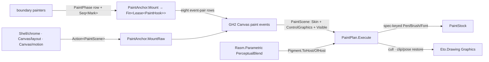

# [RASM_GRASSHOPPER_CANVAS_PAINT]

The declarative paint owner of the Grasshopper boundary — one `Mark` union carrying every paint intent (geometry stroke and fill, single-run and measured-block text, image, icon, capsule, wire preview, clip scope, transform scope), one `PaintStock` executor owning every Eto resource lifetime (pens, brushes, fonts minted once per plan against spec-record identity and disposed with the plan), and one `PaintPhase` row vocabulary over the eight ordered host paint events. The census-era shape — a 20-case `DrawMark` union mixing declarative geometry with live `Brush`/`Font`/`IGraphicsPath`/`IMatrix` handles, consumer-owned resource lifecycles, and a `CanvasPaintPhase` enum re-deriving the event pairs — collapses here: the phase IS the event pair (the decompiled host carries no `CanvasPaintPhase` type; the census `Grasshopper2.UI.Flex.Paint.Hook`/`Subscription` members are phantoms with no assembly presence), intent carries values and specs, and the executor alone touches host graphics state, restoring transform and clip stacks around every scope and culling by declared extent against the visible frame. Skins arrive on the paint args; skin-row projection and interpolation stay value-parametric, and perceptual colour work crosses through one `Pigment` conversion pair onto the kernel `PerceptualBlend` rows — a second colour model on this boundary is the deleted form.

## [01]-[INDEX]

- [02]-[PHASES]: `PaintScene` + `PaintPhase` + `PaintAnchor` — the eight event-pair rows, the per-event scene capsule, and the lease-owned mount gates.
- [03]-[INTENT]: `PathSpec` + `FillSource` + `StrokeSpec` + `TypeFace` + `TransformSpec` + `Mark` — the declarative paint vocabulary.
- [04]-[EXECUTOR]: `PaintStock` + `PaintPlan` + `PaintReceipt` — resource lifetime, graphics-state restoration, culling, and the one execution fold.
- [05]-[SKIN]: `Pigment` — the one perceptual-colour crossing, and the host-direct skin projection law.

## [02]-[PHASES]

- Owner: `PaintPhase` `[SmartEnum<int>]` — eight rows over one `[UseDelegateFromConstructor]` `Hook(HostCanvas, Action<PaintScene>) → Action` column, each row subscribing its own host event and returning the exact detach closure: `BeforeBackground` (key 0, `CanvasBackgroundPaintEventArgs` — the only row whose scene carries a `Some` `SuppressDefault`, wrapping the args' `OverrideDefaultPainting`), `AfterBackground` (1), `BeforeGroups` (2), `AfterGroups` (3), `BeforeWires` (4), `AfterWires` (5), `BeforeObjects` (6), `AfterObjects` (7). The four layers paint in fixed host order — background, groups, wires, objects — each fenced by its `Before`/`After` pair; a hook attaches to the pair and the row ordinal is the paint order, so z-policy is row selection, never a sort.
- Owner: `PaintScene` `readonly record struct` — the per-event capsule: `Surface` (the raising `Canvas`), `Skin` (the interpolated palette on the args), `Graphics` (the host `ControlGraphics` — dual-frame contexts, zoom, screen scale), `Visible` (the content-frame cull window), `SuppressDefault` (`Option<Action>` — present only on `BeforeBackground`). `CanvasPaintEventArgs.Graphics` is a `ControlGraphics`, not a bare `Eto.Drawing.Graphics` — the census claim naming the Eto surface directly was imprecise; `Graphics.Content` and `Graphics.Control` are the two framed Eto contexts and `Graphics.Adjust` is the zoom-compensated metric.
- Entry: `PaintAnchor.Mount(PaintPhase phase, Func<PaintScene, Seq<Mark>> plan, Op? key = null)` → `Fin<Lease<PaintHook>>` — the declarative mount: each event executes the plan through `PaintPlan.Execute`; `PaintAnchor.MountRaw(PaintPhase phase, Action<PaintScene> painter, Op? key = null)` → `Fin<Lease<PaintHook>>` — the transport mount for painters that must drive host graphics directly (`Shell/chrome.md` bar rendering, `Canvas/layout.md` snap-guide overlays, `Canvas/motion.md` glyph strokes run inside this window). Two mounts, one detach law: the lease's `Owned` disposal runs the row-returned unhook, so a paint hook without its detach is unconstructible.
- Law: subscription is UI-affine — both mounts acquire the canvas through `GhSession.Run(ScopeTarget.CanvasHost, ...)` and attach inside the marshal; the handler itself then runs on the host paint thread with no second marshal, because the paint window is already the UI thread.
- Law: a handler never paints outside its scene — retaining `Graphics` past the event, painting from a timer, or calling host draw members between events is the census inline-paint defect; motion lands by scheduling a redraw and repainting in the next window.
- Boundary: WHEN a repaint happens is `Shell/session.md`'s `RepaintRow` and the flex redraw on `Canvas/canvas.md`; WHAT a tooltip shows is `Shell/chrome.md`'s; this page owns the pixels inside the eight fences.
- Packages: Grasshopper2 (`Canvas.BeforePaintBackground`/`AfterPaintBackground`/`BeforePaintGroups`/`AfterPaintGroups`/`BeforePaintWires`/`AfterPaintWires`/`BeforePaintObjects`/`AfterPaintObjects`, `CanvasPaintEventArgs`, `CanvasBackgroundPaintEventArgs.OverrideDefaultPainting`, `ControlGraphics`), LanguageExt.Core, `Rasm.Domain` (`Op`, `Lease<T>`), `Shell/session.md` (`GhSession`, `ScopeTarget`).
- Growth: a host layer addition is one row with its ordinal; the mount gates never widen.

```csharp signature
// --- [RUNTIME_PRELUDE] ----------------------------------------------------------------------
using Rasm.Csp;
using Rasm.Grasshopper.Shell;
using HostCanvas = Grasshopper2.UI.Canvas.Canvas;

namespace Rasm.Grasshopper.Canvas;

// --- [TYPES] --------------------------------------------------------------------------------
[SmartEnum<int>]
public sealed partial class PaintPhase {
    public static readonly PaintPhase BeforeBackground = new(key: 0, hook: static (surface, body) => {
        EventHandler<CanvasBackgroundPaintEventArgs> handler = (_, e) =>
            body(new PaintScene(Surface: e.Canvas, Skin: e.Skin, Graphics: e.Graphics, Visible: e.Canvas.VisibleFrame, SuppressDefault: Some<Action>(e.OverrideDefaultPainting)));
        surface.BeforePaintBackground += handler;
        return () => surface.BeforePaintBackground -= handler;
    });
    public static readonly PaintPhase AfterBackground = Fence(key: 1, attach: static (s, h) => s.AfterPaintBackground += h, detach: static (s, h) => s.AfterPaintBackground -= h);
    public static readonly PaintPhase BeforeGroups = Fence(key: 2, attach: static (s, h) => s.BeforePaintGroups += h, detach: static (s, h) => s.BeforePaintGroups -= h);
    public static readonly PaintPhase AfterGroups = Fence(key: 3, attach: static (s, h) => s.AfterPaintGroups += h, detach: static (s, h) => s.AfterPaintGroups -= h);
    public static readonly PaintPhase BeforeWires = Fence(key: 4, attach: static (s, h) => s.BeforePaintWires += h, detach: static (s, h) => s.BeforePaintWires -= h);
    public static readonly PaintPhase AfterWires = Fence(key: 5, attach: static (s, h) => s.AfterPaintWires += h, detach: static (s, h) => s.AfterPaintWires -= h);
    public static readonly PaintPhase BeforeObjects = Fence(key: 6, attach: static (s, h) => s.BeforePaintObjects += h, detach: static (s, h) => s.BeforePaintObjects -= h);
    public static readonly PaintPhase AfterObjects = Fence(key: 7, attach: static (s, h) => s.AfterPaintObjects += h, detach: static (s, h) => s.AfterPaintObjects -= h);

    [UseDelegateFromConstructor] internal partial Action Hook(HostCanvas surface, Action<PaintScene> body);

    private static PaintPhase Fence(
        int key,
        Action<HostCanvas, EventHandler<CanvasPaintEventArgs>> attach,
        Action<HostCanvas, EventHandler<CanvasPaintEventArgs>> detach) =>
        new(key: key, hook: (surface, body) => {
            EventHandler<CanvasPaintEventArgs> handler = (_, e) =>
                body(new PaintScene(Surface: e.Canvas, Skin: e.Skin, Graphics: e.Graphics, Visible: e.Canvas.VisibleFrame, SuppressDefault: Option<Action>.None));
            attach(surface, handler);
            return () => detach(surface, handler);
        });
}

// --- [MODELS] -------------------------------------------------------------------------------
[BoundaryAdapter, StructLayout(LayoutKind.Auto)]
public readonly record struct PaintScene(
    HostCanvas Surface, Skin Skin, ControlGraphics Graphics, RectangleF Visible, Option<Action> SuppressDefault);

public sealed record PaintHook(PaintPhase Phase, Action Detach) : IDisposable {
    private int released;
    public void Dispose() => Op.SideWhen(condition: Interlocked.Exchange(location1: ref released, value: 1) == 0, action: Detach);
}

// --- [OPERATIONS] ---------------------------------------------------------------------------
[BoundaryAdapter]
public static class PaintAnchor {
    public static Fin<Lease<PaintHook>> Mount(PaintPhase phase, Func<PaintScene, Seq<Mark>> plan, Op? key = null) {
        Op op = key.OrDefault();
        return from valid in op.Need(value: plan)
               from lease in MountRaw(phase, scene => ignore(PaintPlan.Execute(scene: scene, marks: valid(arg: scene), key: op)), key: op)
               select lease;
    }

    public static Fin<Lease<PaintHook>> MountRaw(PaintPhase phase, Action<PaintScene> painter, Op? key = null) {
        Op op = key.OrDefault();
        return from row in op.Need(value: phase)
               from body in op.Need(value: painter)
               from lease in GhSession.Run(ScopeTarget.CanvasHost, scope =>
                   scope.Canvas.ToFin(op.MissingContext()).Bind(surface =>
                       op.Catch(body: () => Fin.Succ((Lease<PaintHook>)new Lease<PaintHook>.Owned(
                           Value: new PaintHook(Phase: row, Detach: row.Hook(surface: surface, body: body)))))), key: op)
               select lease;
    }
}
```

## [03]-[INTENT]

- Owner: `PathSpec` `[Union]` — the recursive geometry vocabulary, one case per `GraphicsPath` figure family: `LineCase(PointF, PointF)`, `PolylineCase(Seq<PointF>)`, `PolygonCase(Seq<PointF>)`, `RectCase(RectangleF)`, `RoundRectCase(RectangleF, float Radius, Option<(float NE, float SE, float SW)> Corners)` (the host `GetRoundRect` capsule outline; a `Some` corners tail dispatches the four-radius host overload with `Radius` as the NW corner — one case, both host arities on the payload), `EllipseCase(RectangleF)`, `ArcCase(RectangleF, float Start, float Sweep)`, `BezierCase(PointF, PointF, PointF, PointF)`, `CurveCase(Seq<PointF>, float Tension)`, `CompositeCase(Seq<PathSpec>, bool Connect)`. `Build()` folds the spec onto ONE `GraphicsPath.Create()` accumulator — `MoveTo`/`LineTo`/`AddLines`/`AddArc`/`AddBezier`/`AddCurve`/`AddEllipse`/`AddRectangle`/`AddPath`/`StartFigure`/`CloseFigure` — so a hand-rolled tessellator beside the path builder is the deleted form; `Extent` derives the cull bounds without building.
- Owner: `FillSource` `[Union]` — brush intent by source, never by primitive: `SolidCase(Color)`, `LinearCase(Color, Color, PointF, PointF)`, `SheetCase(RectangleF, Color, Color, float Angle)`, `RadialCase(Color, Color, PointF Centre, PointF Origin, SizeF Radius)`, `TextureCase(Image, float Opacity)` — five cases matching the five decompile-verified brush constructors. `StrokeSpec` sealed record — `Colour`, `Width`, `Option<EdgeDescription> Edge`: the pen mints as `new Pen(colour, width)` and an edge row styles it through the host's own `EdgeDescription.AssignToPen` (width, cap, dash in one verified seam), so cap and dash vocabulary is the skinning system's, never a parallel local pen model.
- Owner: `TypeFace` sealed record — `Family` (`string`), `Size` (`float`), `Style` (`FontStyle`), `Decoration` (`FontDecoration`) minting `new Font(family, size, style, decoration)`; the record IS the font cache key. `BlockSpec` sealed record carries the measured-layout axes — `Wrap` (`FormattedTextWrapMode`), `Trim` (`FormattedTextTrimming`), `Align` (`FormattedTextAlignment`), `Option<SizeF> Max` — onto one `FormattedText`.
- Owner: `Mark` `[Union]` — the paint intent, ten cases over eight modalities: `StrokeCase(PathSpec, StrokeSpec)`, `FillCase(PathSpec, FillSource)`, `TextCase(TypeFace, Option<BlockSpec>, Color, PointF, string)` (a `None` block dispatches single-run `DrawText(Font, Brush, x, y, text)`, a `Some` lays out through measured `FormattedText` — one case, both host text arities on the payload), `ImageCase(Image, PointF)`, `ImagePaneCase(Image, RectangleF Source, RectangleF Destination)`, `IconCase(IIcon, Rectangle Frame, int Pad, Color Backdrop)` (the icon rasters through the verified `IIcon.DrawToBitmap(Size, padding, background)` with the pad riding the payload, and lands as an image draw disposed with the commit — `IconContext`-driven vector drawing stays `Shell/icons.md`'s owner), `CapsuleCase(Capsule, Shade, Option<Parts>)` (the host capsule draws itself against the scene skin — a `None` parts payload dispatches `Capsule.Draw(Graphics, Shade, Skin)`, a `Some` dispatches the part-selective `Draw(Graphics, Parts, Shade, Skin)`; the `DrawGrips`/`DrawFaces`/`DrawMessaging`/`DrawOverlay`/`DrawEdges` splits are the same host owner a raw painter reaches directly), `WireGhostCase(WireShape, StrokeSpec)` (a preview route stroked through `WireShape.Draw` — the live-wire pass is `Canvas/wires.md`'s), `ClipCase(PathSpec, Seq<Mark>)`, `PoseCase(TransformSpec, Seq<Mark>)`. `TransformSpec` `[Union]` — `ShiftCase(float, float)`, `SpinCase(float)`, `StretchCase(float, float)`, `MatrixCase(IMatrix)` — folding onto the host transform verbs.
- Law: intent is value-shaped — a `Mark` carries colours, specs, and geometry values; the only live host objects a case admits are the retained-asset classes the host itself owns (`Image`, `IIcon`, `Capsule`, `WireShape`, `IMatrix`), and no case carries a `Brush`, `Pen`, `Font`, or `IGraphicsPath` — those are executor-minted from the specs, which is what makes a plan diffable, cacheable, and replayable.
- Law: `Extent` is the cull contract — every non-scope case answers `Option<RectangleF>` from its own payload (`None` opts out of culling), and scope cases fold their children; a mark whose extent misses the scene's visible frame never touches host graphics.
- Boundary: `AnimatedPath` glyph strokes are `Canvas/motion.md`'s draw family run inside a `MountRaw` window; snap-guide overlays (`SnappingConstraints.DrawSnappingBoxes`, `SnappingAction.Draw`) are `Canvas/layout.md`'s, transported through the same window.
- Packages: Eto.Drawing (`GraphicsPath`, `Pen`, `SolidBrush`, `LinearGradientBrush`, `RadialGradientBrush`, `TextureBrush`, `Font`, `FormattedText`, `Image`, `IMatrix`, `Color`, `DashStyle`), Grasshopper2 (`Capsule`, `Parts`, `Shade`, `Skin`, `WireShape`, `IIcon`, `EdgeDescription`), LanguageExt.Core, `Rasm.Domain`.
- Growth: a new geometry family is one `PathSpec` case; a new fill is one `FillSource` case; a new modality is one `Mark` case breaking the executor fold loudly.

## [04]-[EXECUTOR]

- Owner: `PaintStock` sealed class `IDisposable` — the one resource authority: three caches keyed by spec-record structural identity (`FillSource → Brush`, `StrokeSpec → Pen`, `TypeFace → Font`), minted on first demand inside one plan execution and disposed together when the stock closes. A consumer never constructs, holds, or disposes an Eto paint resource; per-mark `new Pen` construction and consumer-owned brush lifetime are the census defects this owner deletes.
- Owner: `PaintPlan` — the one execution fold: `Execute(PaintScene scene, Seq<Mark> marks, Op key, Option<PaintStock> stock = default)` → `Fin<PaintReceipt>` walks the marks against the content-frame `Graphics.Content`, culling each by `Extent` versus `scene.Visible`, dispatching each case to its host draw member, and bracketing every `ClipCase` in `SetClip`/`ResetClip` and every `PoseCase` in `SaveTransform`/`RestoreTransform` so a throwing child never leaks graphics state — the restoration ride is the platform-forced statement seam. The stock arm is the resource-lifetime discriminant: `None` mints a plan-scoped stock disposed with the fold, `Some` rides a painter-hoisted stock the painter disposes with its hook — one fold, both lifetimes, no second executor. `PaintReceipt` carries drawn and culled counts plus latency as `IValidityEvidence`.
- Law: state restoration is structural — scope cases are the ONLY sites that mutate transform or clip, each restore lives in a `finally`, and nesting depth is the recursion depth of the mark tree, so unbalanced host state is unconstructible from any plan.
- Law: culling is declarative — the fold reads `Extent` before any resource mint, so an off-screen mark costs one rectangle test and zero allocations; the receipt's culled count is the evidence a profiling consumer folds against `Canvas/canvas.md`'s `FramePulse`.
- Packages: Eto.Drawing (`Graphics.DrawPath`/`FillPath`/`DrawText`/`DrawImage`/`SetClip`/`ResetClip`/`SaveTransform`/`RestoreTransform`/`TranslateTransform`/`RotateTransform`/`ScaleTransform`/`MultiplyTransform`), Grasshopper2 (`ControlGraphics.Content`), LanguageExt.Core, `Rasm.Domain`.
- Growth: a new `Mark` case is one dispatch arm here — the compile break IS the growth contract; the stock's cache axes never widen past the three spec kinds.

```csharp signature
// --- [RUNTIME_PRELUDE] ----------------------------------------------------------------------
using Rasm.Csp;

namespace Rasm.Grasshopper.Canvas;

// --- [TYPES] --------------------------------------------------------------------------------
[Union]
public abstract partial record PathSpec {
    private PathSpec() { }
    public sealed record LineCase(PointF A, PointF B) : PathSpec;
    public sealed record PolylineCase(Seq<PointF> Points) : PathSpec;
    public sealed record PolygonCase(Seq<PointF> Points) : PathSpec;
    public sealed record RectCase(RectangleF Frame) : PathSpec;
    public sealed record RoundRectCase(RectangleF Frame, float Radius, Option<(float NE, float SE, float SW)> Corners) : PathSpec;
    public sealed record EllipseCase(RectangleF Frame) : PathSpec;
    public sealed record ArcCase(RectangleF Frame, float Start, float Sweep) : PathSpec;
    public sealed record BezierCase(PointF A, PointF ControlA, PointF ControlB, PointF B) : PathSpec;
    public sealed record CurveCase(Seq<PointF> Points, float Tension) : PathSpec;
    public sealed record CompositeCase(Seq<PathSpec> Figures, bool Connect) : PathSpec;

    internal IGraphicsPath Build() {
        IGraphicsPath path = GraphicsPath.Create();
        Accumulate(path: path, connect: false);
        return path;
    }

    internal void Accumulate(IGraphicsPath path, bool connect) => Switch(
        state: (Path: path, Connect: connect),
        lineCase: static (s, c) => Op.Side(action: () => s.Path.AddLine(c.A.X, c.A.Y, c.B.X, c.B.Y)),
        polylineCase: static (s, c) => Op.Side(action: () => s.Path.AddLines(c.Points)),
        polygonCase: static (s, c) => Op.Side(action: () => { s.Path.AddLines(c.Points); s.Path.CloseFigure(); }),
        rectCase: static (s, c) => Op.Side(action: () => s.Path.AddRectangle(c.Frame.X, c.Frame.Y, c.Frame.Width, c.Frame.Height)),
        roundRectCase: static (s, c) => Op.Side(action: () => s.Path.AddPath(c.Corners.Match(
            Some: tail => GraphicsPath.GetRoundRect(c.Frame, c.Radius, tail.NE, tail.SE, tail.SW),
            None: () => GraphicsPath.GetRoundRect(c.Frame, c.Radius)), s.Connect)),
        ellipseCase: static (s, c) => Op.Side(action: () => s.Path.AddEllipse(c.Frame.X, c.Frame.Y, c.Frame.Width, c.Frame.Height)),
        arcCase: static (s, c) => Op.Side(action: () => s.Path.AddArc(c.Frame.X, c.Frame.Y, c.Frame.Width, c.Frame.Height, c.Start, c.Sweep)),
        bezierCase: static (s, c) => Op.Side(action: () => s.Path.AddBezier(c.A, c.ControlA, c.ControlB, c.B)),
        curveCase: static (s, c) => Op.Side(action: () => s.Path.AddCurve(c.Points, c.Tension)),
        compositeCase: static (s, c) => Op.Side(action: () => c.Figures.Iter(figure => {
            if (!s.Connect) { s.Path.StartFigure(); }
            figure.Accumulate(path: s.Path, connect: s.Connect);
        })));

    public Option<RectangleF> Extent => Switch(
        lineCase: static c => Hull(points: [c.A, c.B]),
        polylineCase: static c => Hull(points: c.Points),
        polygonCase: static c => Hull(points: c.Points),
        rectCase: static c => Some(c.Frame),
        roundRectCase: static c => Some(c.Frame),
        ellipseCase: static c => Some(c.Frame),
        arcCase: static c => Some(c.Frame),
        bezierCase: static c => Hull(points: [c.A, c.ControlA, c.ControlB, c.B]),
        curveCase: static c => Hull(points: c.Points),
        compositeCase: static c => c.Figures.Fold(Option<RectangleF>.None, static (held, figure) =>
            held.Match(Some: sum => figure.Extent.Map(next => Joined(a: sum, b: next)).IfNone(sum).Apply(Some), None: () => figure.Extent)));

    private static Option<RectangleF> Hull(Seq<PointF> points) =>
        points.IsEmpty ? Option<RectangleF>.None : Some(points.Tail.Fold(
            new RectangleF(points.Head, SizeF.Empty),
            static (frame, point) => Joined(a: frame, b: new RectangleF(point, SizeF.Empty))));

    private static RectangleF Joined(RectangleF a, RectangleF b) {
        a.Union(b);
        return a;
    }
}

[Union]
public abstract partial record FillSource {
    private FillSource() { }
    public sealed record SolidCase(Color Colour) : FillSource;
    public sealed record LinearCase(Color From, Color To, PointF Start, PointF End) : FillSource;
    public sealed record SheetCase(RectangleF Frame, Color From, Color To, float Angle) : FillSource;
    public sealed record RadialCase(Color From, Color To, PointF Centre, PointF Origin, SizeF Radius) : FillSource;
    public sealed record TextureCase(Image Source, float Opacity) : FillSource;

    internal Brush Mint() => Switch(
        solidCase: static c => new SolidBrush(c.Colour),
        linearCase: static c => new LinearGradientBrush(c.From, c.To, c.Start, c.End),
        sheetCase: static c => new LinearGradientBrush(c.Frame, c.From, c.To, c.Angle),
        radialCase: static c => new RadialGradientBrush(c.From, c.To, c.Centre, c.Origin, c.Radius),
        textureCase: static c => new TextureBrush(c.Source, c.Opacity));
}

[Union]
public abstract partial record TransformSpec {
    private TransformSpec() { }
    public sealed record ShiftCase(float Dx, float Dy) : TransformSpec;
    public sealed record SpinCase(float Angle) : TransformSpec;
    public sealed record StretchCase(float Sx, float Sy) : TransformSpec;
    public sealed record MatrixCase(IMatrix Matrix) : TransformSpec;
}

[Union]
public abstract partial record Mark {
    private Mark() { }
    public sealed record StrokeCase(PathSpec Path, StrokeSpec Stroke) : Mark;
    public sealed record FillCase(PathSpec Path, FillSource Fill) : Mark;
    public sealed record TextCase(TypeFace Face, Option<BlockSpec> Block, Color Colour, PointF At, string Text) : Mark;
    public sealed record ImageCase(Image Source, PointF At) : Mark;
    public sealed record ImagePaneCase(Image Source, RectangleF SourcePane, RectangleF Destination) : Mark;
    public sealed record IconCase(IIcon Icon, Rectangle Frame, int Pad, Color Backdrop) : Mark;
    public sealed record CapsuleCase(Capsule Body, Shade Shade, Option<Parts> Elements) : Mark;
    public sealed record WireGhostCase(WireShape Route, StrokeSpec Stroke) : Mark;
    public sealed record ClipCase(PathSpec Region, Seq<Mark> Children) : Mark;
    public sealed record PoseCase(TransformSpec Pose, Seq<Mark> Children) : Mark;

    public Option<RectangleF> Extent => Switch(
        strokeCase: static c => c.Path.Extent,
        fillCase: static c => c.Path.Extent,
        textCase: static c => c.Block.Bind(static spec => spec.Max).Map(max => new RectangleF(c.At, max)),
        imageCase: static _ => Option<RectangleF>.None,
        imagePaneCase: static c => Some(c.Destination),
        iconCase: static c => Some((RectangleF)c.Frame),
        capsuleCase: static c => Some(c.Body.Bounds),
        wireGhostCase: static c => Some(c.Route.Bounds),
        clipCase: static c => c.Region.Extent,
        poseCase: static _ => Option<RectangleF>.None);
}

// --- [MODELS] -------------------------------------------------------------------------------
public sealed record StrokeSpec(Color Colour, float Width, Option<EdgeDescription> Edge) {
    internal Pen Mint() {
        Pen pen = new(Colour, Width);
        Edge.Iter(edge => edge.AssignToPen(pen));
        return pen;
    }
}

public sealed record TypeFace(string Family, float Size, FontStyle Style, FontDecoration Decoration) {
    internal Font Mint() => new(Family, Size, Style, Decoration);
}

public sealed record BlockSpec(
    FormattedTextWrapMode Wrap, FormattedTextTrimming Trim, FormattedTextAlignment Align, Option<SizeF> Max);

[BoundaryAdapter, StructLayout(LayoutKind.Auto)]
public readonly record struct PaintReceipt(Op Operation, int Drawn, int Culled, TimeSpan Latency) : IValidityEvidence {
    public bool IsValid => ValidityClaim.All(
        ValidityClaim.Of(holds: Drawn >= 0 && Culled >= 0),
        ValidityClaim.Nonnegative(value: Latency.TotalSeconds));
}

// --- [SERVICES] -----------------------------------------------------------------------------
public sealed class PaintStock : IDisposable {
    private readonly Atom<HashMap<FillSource, Brush>> _brushes = Atom(HashMap<FillSource, Brush>());
    private readonly Atom<HashMap<StrokeSpec, Pen>> _pens = Atom(HashMap<StrokeSpec, Pen>());
    private readonly Atom<HashMap<TypeFace, Font>> _fonts = Atom(HashMap<TypeFace, Font>());

    internal Brush Brush(FillSource source) =>
        _brushes.Swap(held => held.Find(source).IsSome ? held : held.Add(source, source.Mint()))[source];

    internal Pen Pen(StrokeSpec stroke) =>
        _pens.Swap(held => held.Find(stroke).IsSome ? held : held.Add(stroke, stroke.Mint()))[stroke];

    internal Font Font(TypeFace face) =>
        _fonts.Swap(held => held.Find(face).IsSome ? held : held.Add(face, face.Mint()))[face];

    public void Dispose() {
        _brushes.Swap(held => (held.Values.Iter(static brush => brush.Dispose()), HashMap<FillSource, Brush>()).Item2);
        _pens.Swap(held => (held.Values.Iter(static pen => pen.Dispose()), HashMap<StrokeSpec, Pen>()).Item2);
        _fonts.Swap(held => (held.Values.Iter(static font => font.Dispose()), HashMap<TypeFace, Font>()).Item2);
    }
}

// --- [OPERATIONS] ---------------------------------------------------------------------------
[BoundaryAdapter]
public static class PaintPlan {
    public static Fin<PaintReceipt> Execute(PaintScene scene, Seq<Mark> marks, Op key, Option<PaintStock> stock = default) {
        long entered = Environment.TickCount64;
        return key.Catch(body: () => {
            (PaintStock held, bool owned) = stock.Match(Some: static hoisted => (hoisted, false), None: static () => (new PaintStock(), true));
            try {
                (int drawn, int culled) = Walk(graphics: scene.Graphics.Content, skin: scene.Skin, visible: scene.Visible, stock: held, marks: marks);
                return Fin.Succ((Drawn: drawn, Culled: culled));
            }
            finally { if (owned) { held.Dispose(); } }
        }).Map(counts => new PaintReceipt(
            Operation: key, Drawn: counts.Drawn, Culled: counts.Culled,
            Latency: TimeSpan.FromMilliseconds(value: Environment.TickCount64 - entered)));
    }

    private static (int Drawn, int Culled) Walk(Graphics graphics, Skin skin, RectangleF visible, PaintStock stock, Seq<Mark> marks) =>
        marks.Fold((Drawn: 0, Culled: 0), (counts, mark) =>
            mark.Extent.Map(extent => !visible.Intersects(extent)).IfNone(false)
                ? (counts.Drawn, counts.Culled + 1)
                : (counts.Drawn + Commit(graphics: graphics, skin: skin, visible: visible, stock: stock, mark: mark), counts.Culled));

    private static int Commit(Graphics graphics, Skin skin, RectangleF visible, PaintStock stock, Mark mark) => mark.Switch(
        state: (Graphics: graphics, Skin: skin, Visible: visible, Stock: stock),
        strokeCase: static (s, c) => Side(() => s.Graphics.DrawPath(s.Stock.Pen(c.Stroke), c.Path.Build())),
        fillCase: static (s, c) => Side(() => s.Graphics.FillPath(s.Stock.Brush(c.Fill), c.Path.Build())),
        textCase: static (s, c) => Side(() => c.Block.Match(
            Some: spec => {
                FormattedText block = new() {
                    Font = s.Stock.Font(c.Face), Text = c.Text, ForegroundBrush = s.Stock.Brush(new FillSource.SolidCase(Colour: c.Colour)),
                    Wrap = spec.Wrap, Trimming = spec.Trim, Alignment = spec.Align,
                };
                spec.Max.Iter(max => block.MaximumSize = max);
                s.Graphics.DrawText(block, c.At);
            },
            None: () => s.Graphics.DrawText(
                s.Stock.Font(c.Face), s.Stock.Brush(new FillSource.SolidCase(Colour: c.Colour)), c.At.X, c.At.Y, c.Text))),
        imageCase: static (s, c) => Side(() => s.Graphics.DrawImage(c.Source, c.At.X, c.At.Y)),
        imagePaneCase: static (s, c) => Side(() => s.Graphics.DrawImage(c.Source, c.SourcePane, c.Destination)),
        iconCase: static (s, c) => Side(() => {
            using Bitmap raster = c.Icon.DrawToBitmap(c.Frame.Size, c.Pad, c.Backdrop);
            s.Graphics.DrawImage(raster, c.Frame.X, c.Frame.Y);
        }),
        capsuleCase: static (s, c) => Side(() => c.Elements.Match(
            Some: parts => c.Body.Draw(s.Graphics, parts, c.Shade, s.Skin),
            None: () => c.Body.Draw(s.Graphics, c.Shade, s.Skin))),
        wireGhostCase: static (s, c) => Side(() => c.Route.Draw(s.Graphics, s.Stock.Pen(c.Stroke))),
        clipCase: static (s, c) => Scoped(
            open: () => s.Graphics.SetClip(c.Region.Build()), close: s.Graphics.ResetClip,
            body: () => Walk(graphics: s.Graphics, skin: s.Skin, visible: s.Visible, stock: s.Stock, marks: c.Children).Drawn),
        poseCase: static (s, c) => Scoped(
            open: () => c.Pose.Switch(
                shiftCase: shift => Op.Side(action: () => s.Graphics.TranslateTransform(shift.Dx, shift.Dy)),
                spinCase: spin => Op.Side(action: () => s.Graphics.RotateTransform(spin.Angle)),
                stretchCase: stretch => Op.Side(action: () => s.Graphics.ScaleTransform(stretch.Sx, stretch.Sy)),
                matrixCase: matrix => Op.Side(action: () => s.Graphics.MultiplyTransform(matrix.Matrix))).Apply(_ => unit),
            close: s.Graphics.RestoreTransform,
            body: () => Walk(graphics: s.Graphics, skin: s.Skin, visible: s.Visible, stock: s.Stock, marks: c.Children).Drawn,
            before: s.Graphics.SaveTransform));

    private static int Side(Action draw) { draw(); return 1; }

    private static int Scoped(Func<Unit> open, Action close, Func<int> body, Action? before = null) {
        before?.Invoke();
        _ = open();
        try { return body(); }
        finally { close(); }
    }
}
```

## [05]-[SKIN]

- Law: skin projection is host-direct — the six sub-skin rows (`Shape`, `Shades`, `Wires`, `Grips`, `Messaging`, `Canvasses`) plus `Fades` read directly off the scene's `Skin`, a themed variant derives through the host `With` folds (`WithShape`/`WithShades`/`WithWires`/`WithGrips`/`WithMessages`/`WithCanvasses`/`WithFades`), and blending is `Skin.Interpolate(other, factor)` — the host's own float-parametric blend, exactly what the canvas runs between its `SkinLit`/`SkinDim` rows. Skin persistence rides the host (`Skin.LoadFromFile`/`SaveToFile`, `IStorable`). A lens, wrapper, or local palette serialization beside these members is the deleted form — the host surface IS the projection vocabulary, and the census `WithShades`/`WithWires`/`WithCanvasses` three-fold roster was thin COVERAGE against the seven decompile-verified folds.
- Owner: `Pigment` — the ONE colour crossing: `ToHost(Unicolour)` projects the clipped byte triplet (`Rgb.Byte255.Clipped`, `Alpha.A255`) onto `Color.FromArgb`, `OfHost(Color)` lifts the unit-float components (`R`/`G`/`B`/`A`) into `new Unicolour(ColourSpace.Rgb, ...)`. Every perceptual blend, ramp, or tween on this boundary composes the kernel `PerceptualBlend` rows through this pair; `Skin.Interpolate` remains the host's own palette blend for host palettes, and a second opponent-space conversion beside `Pigment` is the census `MotionVector` defect, killed.
- Law: skin state is scene-scoped — the interpolated `Skin` arrives on every paint args and `Canvas.SkinLit`/`SkinDim`/`Skin` are canvas reads through `Canvas/canvas.md`'s lens; a painter caches no skin across frames because the host interpolates per frame.
- Packages: Grasshopper2 (`Skin`, `Shape`, `Shades`, `Shade`, `WiresSkin`, `GripsSkin`, `MessagingSkin`, `CanvassesSkin`, `Fades`, `EdgeDescription`), Wacton.Unicolour, `Rasm.Parametric` (`PerceptualBlend`), Eto.Drawing (`Color`).
- Growth: a new palette treatment is a `With` fold composition; a new colour policy is one kernel `PerceptualBlend` row — this page never mints a blend.

```csharp signature
// --- [RUNTIME_PRELUDE] ----------------------------------------------------------------------
using Rasm.Csp;
using Rasm.Parametric;
using Wacton.Unicolour;

namespace Rasm.Grasshopper.Canvas;

// --- [OPERATIONS] ---------------------------------------------------------------------------
[BoundaryAdapter]
public static class Pigment {
    public static Color ToHost(Unicolour colour) => colour.Rgb.Byte255.Clipped switch {
        { } clipped => Color.FromArgb(
            red: (int)clipped.R, green: (int)clipped.G, blue: (int)clipped.B, alpha: (int)colour.Alpha.A255),
    };

    public static Unicolour OfHost(Color colour) =>
        new(ColourSpace.Rgb, colour.R, colour.G, colour.B, colour.A);

    public static Fin<Color> Blend(PerceptualBlend row, Color from, Color to, UnitInterval t, Op? key = null) {
        Op op = key.OrDefault();
        return from mixed in row.Mix(from: OfHost(colour: from), to: OfHost(colour: to), t: t, key: op)
               select ToHost(colour: mixed);
    }
}
```



## [06]-[DENSITY_BAR]

| [INDEX] | [CONCERN]            | [OWNER]                          | [KIND]                                              | [RAIL]                                | [CASES] |
| :-----: | :------------------- | :------------------------------- | :--------------------------------------------------- | :------------------------------------ | :-----: |
|  [01]   | paint seam           | `PaintPhase` + `PaintScene`      | `[SmartEnum<int>]` event-pair rows + scene capsule  | `Hook → Action` (internal)            |    8    |
|  [02]   | hook lifetime        | `PaintAnchor` + `PaintHook`      | two mounts, one detach law                          | `Mount → Fin<Lease<PaintHook>>`       |    2    |
|  [03]   | geometry intent      | `PathSpec`                       | recursive `[Union]` onto one `GraphicsPath` fold    | `Build → IGraphicsPath` (internal)    |   10    |
|  [04]   | paint intent         | `Mark` + `FillSource` + specs    | closed `[Union]`, value payloads, no live resources | `Execute → Fin<PaintReceipt>`         |  10+5   |
|  [05]   | resource lifetime    | `PaintStock`                     | spec-record-keyed caches, one disposal              | internal mint                         |    3    |
|  [06]   | colour crossing      | `Pigment`                        | one conversion pair over kernel `PerceptualBlend`   | `Blend → Fin<Color>`                  |    1    |

`GhSession`, `Lease<T>`, `Op`, `ValidityClaim`, the host skin `With`/`Interpolate` algebra, and the kernel `PerceptualBlend` rows are composed upstream owners. The census `DrawMark` twenty-case roster, `CanvasPaintPhase`, `ClipGeometry`, `UiFont`, `FillSource`-with-native-brush, and the `Flex.Paint.Hook`/`Subscription` members have no successor shape — their capabilities land as the rows, cases, and folds above, and the phantom members die.
