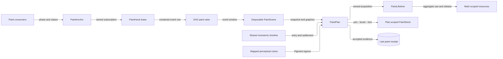

# [RASM_GRASSHOPPER_CANVAS_PAINT]

Declarative painting for the Grasshopper boundary folds through one owner set — one `Mark` algebra for geometry, text, borrowed images, icons, capsules, wire previews, clips, and transforms; one plan-scoped `PaintStock` lifetime for cached Eto resources; one `PaintPhase` event vocabulary; and one monotonic execution receipt. `PaintAnchor` owns attachment, callback containment, last fault, last receipt, and UI-affine release; `PaintPlan` owns stock creation and release inside the measured execution.

`PaintScene` is an event-scoped disposable capability whose live host references clear when the raise returns, while declarative planners receive only `PaintFrame` snapshot data. Every minted path, temporary round-rectangle path, formatted-text layout, icon bitmap, pen, brush, and font has one disposal owner. Culling uses stroke inflation, measured text, image dimensions, clip bounds, and conservative transform fallback before drawing. Perceptual colour reaches Eto only through the kernel's chroma-reduction gamut-mapped sRGB egress.

## [01]-[INDEX]

- [02]-[PHASES]: `PaintFrame` + `PaintScene` + `PaintPhase` + `PaintAnchor` — snapshot planning, event capability, contained host rows, and lease-owned mounts.
- [03]-[INTENT]: `PathSpec` + `FillSource` + `StrokeSpec` + `TypeFace` + `TransformSpec` + `Mark` — the declarative paint vocabulary.
- [04]-[EXECUTOR]: `PaintLifetime` + `PaintStock` + `PaintPlan` + `PaintReceipt` — resource lifetime, graphics-state restoration, culling, and the one execution fold.
- [05]-[SKIN]: `Pigment` — the one perceptual-colour crossing, and the host-direct skin projection law.

## [02]-[PHASES]

- Owner: `PaintPhase` `[SmartEnum<int>]` — the ordered before/after rows for background, groups, wires, and objects. Its delegate column attaches a contained `Func<PaintScene, Fin<Unit>>`, creates and disposes one scene per raise, records every callback failure, and returns the exact inverse subscription. Both background rows mirror the host `event CanvasBackgroundPaintEventArgs` delegate family with the `OverrideDefaultPainting` suppression action; the six layer rows mirror `event CanvasPaintEventArgs` — each fence spells its exact installed delegate family, which is what makes a wrong wire a compile failure.
- Owner: `PaintFrame` `readonly record struct` — declarative snapshot data: interpolated `Skin` and admitted content-frame `Visible` bounds. `PaintScene` sealed `IDisposable` — the raw event capability over the raising canvas, `ControlGraphics`, frame, and optional background suppression action. Every getter rejects a closed scene, and disposal clears every live reference and action.
- Entry: `PaintAnchor.Mount(PaintPhase phase, Func<PaintFrame, Seq<Mark>> plan, MonotonicTimeline timeline, Op? key = null)` → `Fin<Lease<PaintHook>>`; `PaintAnchor.MountRaw(PaintPhase phase, Func<PaintScene, Fin<Unit>> painter, Op? key = null)` → `Fin<Lease<PaintHook>>`. `PaintHook.LastReceipt` and `LastFault` preserve outcomes that event delegates cannot return.
- Law: attachment and hook release are UI-affine. A subscription established before mount construction completes rolls back through the same inverse and aggregates rollback refusal with the construction fault. Plan-scoped stock releases inside each callback before its monotonic settlement stamp; hook release owns only the exact inverse subscription and records a typed detachment failure.
- Law: a raw painter uses the scene only inside the callback. A declarative planner never receives the scene or graphics; it receives `PaintFrame`, returns values, and execution remains inside the raise.
- Boundary: WHEN a repaint happens is `Shell/session.md`'s `RepaintRow` and the flex redraw on `Canvas/canvas.md`; WHAT a tooltip shows is `Shell/chrome.md`'s; this page owns the pixels inside the host paint fences.
- Packages: Grasshopper2 (`Canvas.BeforePaintBackground`/`AfterPaintBackground`/`BeforePaintGroups`/`AfterPaintGroups`/`BeforePaintWires`/`AfterPaintWires`/`BeforePaintObjects`/`AfterPaintObjects`, `CanvasPaintEventArgs`, `CanvasBackgroundPaintEventArgs.OverrideDefaultPainting`, `ControlGraphics`), LanguageExt.Core, `Rasm.Domain` (`Op`, `Lease<T>`), `Shell/session.md` (`GhSession`, `ScopeTarget`).
- Growth: a host layer addition is one row; attachment, containment, snapshotting, and release remain one gate.

```csharp signature
// --- [RUNTIME_PRELUDE] ----------------------------------------------------------------------
using Microsoft.Extensions.Logging;
using Rasm.Csp;
using Rasm.Grasshopper.Eto;
using Rasm.Grasshopper.Shell;
using Rasm.Parametric;
using HostCanvas = Grasshopper2.UI.Canvas.Canvas;

namespace Rasm.Grasshopper.Canvas;

// --- [TYPES] --------------------------------------------------------------------------------
[SmartEnum<int>]
public sealed partial class PaintPhase {
    public static readonly PaintPhase BeforeBackground = BackgroundFence(key: 0, attach: static (s, h) => s.BeforePaintBackground += h, detach: static (s, h) => s.BeforePaintBackground -= h);
    public static readonly PaintPhase AfterBackground = BackgroundFence(key: 1, attach: static (s, h) => s.AfterPaintBackground += h, detach: static (s, h) => s.AfterPaintBackground -= h);
    public static readonly PaintPhase BeforeGroups = Fence(key: 2, attach: static (s, h) => s.BeforePaintGroups += h, detach: static (s, h) => s.BeforePaintGroups -= h);
    public static readonly PaintPhase AfterGroups = Fence(key: 3, attach: static (s, h) => s.AfterPaintGroups += h, detach: static (s, h) => s.AfterPaintGroups -= h);
    public static readonly PaintPhase BeforeWires = Fence(key: 4, attach: static (s, h) => s.BeforePaintWires += h, detach: static (s, h) => s.BeforePaintWires -= h);
    public static readonly PaintPhase AfterWires = Fence(key: 5, attach: static (s, h) => s.AfterPaintWires += h, detach: static (s, h) => s.AfterPaintWires -= h);
    public static readonly PaintPhase BeforeObjects = Fence(key: 6, attach: static (s, h) => s.BeforePaintObjects += h, detach: static (s, h) => s.BeforePaintObjects -= h);
    public static readonly PaintPhase AfterObjects = Fence(key: 7, attach: static (s, h) => s.AfterPaintObjects += h, detach: static (s, h) => s.AfterPaintObjects -= h);

    [UseDelegateFromConstructor]
    internal partial Action Hook(
        HostCanvas surface,
        Func<PaintScene, Fin<Unit>> body,
        Op operation,
        Atom<Option<Error>> faults);

    private static PaintPhase BackgroundFence(
        int key,
        Action<HostCanvas, EventHandler<CanvasBackgroundPaintEventArgs>> attach,
        Action<HostCanvas, EventHandler<CanvasBackgroundPaintEventArgs>> detach) =>
        new(key: key, hook: (surface, body, operation, faults) => {
            EventHandler<CanvasBackgroundPaintEventArgs> handler = (_, e) => operation.Catch(body: () => {
                using PaintScene scene = new(
                    surface: e.Canvas,
                    skin: e.Skin,
                    graphics: e.Graphics,
                    visible: e.Canvas.VisibleFrame,
                    suppressDefault: Some<Action>(e.OverrideDefaultPainting));
                return body(arg: scene);
            }).IfFail(error => {
                ignore(faults.Swap(_ => Some(error)));
                PaintLog.PaintFault(logger: GhLog.For(category: nameof(PaintAnchor)), detail: error.Message);
            });
            attach(surface, handler);
            return () => detach(surface, handler);
        });

    private static PaintPhase Fence(
        int key,
        Action<HostCanvas, EventHandler<CanvasPaintEventArgs>> attach,
        Action<HostCanvas, EventHandler<CanvasPaintEventArgs>> detach) =>
        new(key: key, hook: (surface, body, operation, faults) => {
            EventHandler<CanvasPaintEventArgs> handler = (_, e) => operation.Catch(body: () => {
                using PaintScene scene = new(
                    surface: e.Canvas,
                    skin: e.Skin,
                    graphics: e.Graphics,
                    visible: e.Canvas.VisibleFrame,
                    suppressDefault: Option<Action>.None);
                return body(arg: scene);
            }).IfFail(error => {
            ignore(faults.Swap(_ => Some(error)));
            PaintLog.PaintFault(logger: GhLog.For(category: nameof(PaintAnchor)), detail: error.Message);
        });
            attach(surface, handler);
            return () => detach(surface, handler);
        });
}

// --- [MODELS] -------------------------------------------------------------------------------
[BoundaryAdapter, StructLayout(LayoutKind.Auto)]
public readonly record struct PaintFrame(Skin Skin, RectangleF Visible) : IValidityEvidence {
    public bool IsValid => ValidityClaim.Of(holds:
        Skin is not null &&
        float.IsFinite(Visible.X) && float.IsFinite(Visible.Y) &&
        float.IsFinite(Visible.Width) && Visible.Width >= 0f &&
        float.IsFinite(Visible.Height) && Visible.Height >= 0f &&
        float.IsFinite(Visible.Right) && float.IsFinite(Visible.Bottom));
}

public sealed class PaintScene : IDisposable {
    private ControlGraphics? graphics;
    private Skin? skin;
    private HostCanvas? surface;
    private Option<Action> suppressDefault;
    private RectangleF visible;
    private int live = 1;

    internal PaintScene(
        HostCanvas surface,
        Skin skin,
        ControlGraphics graphics,
        RectangleF visible,
        Option<Action> suppressDefault) {
        this.surface = surface;
        this.skin = skin;
        this.graphics = graphics;
        this.visible = visible;
        this.suppressDefault = suppressDefault;
    }

    public HostCanvas Surface => Require(value: surface);
    public Skin Skin => Require(value: skin);
    public ControlGraphics Graphics => Require(value: graphics);
    public RectangleF Visible => IsLive ? visible : throw new ObjectDisposedException(objectName: nameof(PaintScene));
    public PaintFrame Frame => new(Skin: Skin, Visible: Visible);

    public Fin<Unit> SuppressDefault(Op? key = null) {
        Op op = key.OrDefault();
        return from _ in guard(IsLive, op.InvalidInput()).ToFin()
               from suppress in suppressDefault.ToFin(op.MissingContext())
               from applied in op.Catch(body: () => Fin.Succ(Op.Side(action: suppress)))
               select applied;
    }

    public void Dispose() {
        if (Interlocked.Exchange(location1: ref live, value: 0) == 0) return;
        surface = null;
        skin = null;
        graphics = null;
        suppressDefault = Option<Action>.None;
        visible = RectangleF.Empty;
    }

    private bool IsLive => Volatile.Read(location: ref live) == 1;

    private T Require<T>(T? value) where T : class =>
        IsLive && value is not null ? value : throw new ObjectDisposedException(objectName: nameof(PaintScene));
}

public sealed class PaintHook : IDisposable {
    private readonly Atom<Option<Error>> faults;
    private readonly Atom<Option<PaintReceipt>> receipts;
    private readonly Op operation;
    private readonly Func<Fin<Unit>> release;
    private int releaseState;

    internal PaintHook(
        PaintPhase phase,
        Atom<Option<Error>> faults,
        Atom<Option<PaintReceipt>> receipts,
        Op operation,
        Func<Fin<Unit>> release) {
        Phase = phase;
        this.faults = faults;
        this.receipts = receipts;
        this.operation = operation;
        this.release = release;
    }

    public PaintPhase Phase { get; }
    public Option<Error> LastFault => faults.Value;
    public Option<PaintReceipt> LastReceipt => receipts.Value;
    public bool IsReleased => Volatile.Read(location: ref releaseState) == 2;

    public void Dispose() {
        if (Interlocked.CompareExchange(location1: ref releaseState, value: 1, comparand: 0) != 0) return;
        operation.Catch(body: release).Match(
            Succ: _ => { Volatile.Write(location: ref releaseState, value: 2); return unit; },
            Fail: error => {
                ignore(faults.Swap(_ => Some(error)));
                PaintLog.ReleaseFault(logger: GhLog.For(category: nameof(PaintAnchor)), detail: error.Message);
                Volatile.Write(location: ref releaseState, value: 0);
                return unit;
            });
    }
}

internal static partial class PaintLog {
    [LoggerMessage(EventId = 4701, Level = LogLevel.Error, Message = "Paint callback faulted: {Detail}")]
    internal static partial void PaintFault(ILogger logger, string detail);

    [LoggerMessage(EventId = 4711, Level = LogLevel.Error, Message = "Paint hook release faulted: {Detail}")]
    internal static partial void ReleaseFault(ILogger logger, string detail);
}

// --- [OPERATIONS] ---------------------------------------------------------------------------
[BoundaryAdapter]
public static class PaintAnchor {
    public static Fin<Lease<PaintHook>> Mount(
        PaintPhase phase,
        Func<PaintFrame, Seq<Mark>> plan,
        MonotonicTimeline timeline,
        Op? key = null) {
        Op op = key.OrDefault();
        return from row in op.Need(value: phase)
               from valid in op.Need(value: plan)
               from clock in op.Need(value: timeline)
               let faults = Atom(Option<Error>.None)
               let receipts = Atom(Option<PaintReceipt>.None)
               let body = (Func<PaintScene, Fin<Unit>>)(scene =>
                   from frame in op.AcceptInput(value: scene.Frame)
                   from marks in op.Catch(body: () => Fin.Succ(valid(arg: frame)))
                   from receipt in PaintPlan.Execute(scene: scene, marks: marks, timeline: clock, key: op)
                   select Record(receipts: receipts, receipt: receipt))
               from lease in Attach(row: row, body: body, faults: faults, receipts: receipts, key: op)
               select lease;
    }

    public static Fin<Lease<PaintHook>> MountRaw(PaintPhase phase, Func<PaintScene, Fin<Unit>> painter, Op? key = null) {
        Op op = key.OrDefault();
        return from row in op.Need(value: phase)
               from body in op.Need(value: painter)
               let faults = Atom(Option<Error>.None)
               let receipts = Atom(Option<PaintReceipt>.None)
               from lease in Attach(
                   row: row,
                   body: body,
                   faults: faults,
                   receipts: receipts,
                   key: op)
               select lease;
    }

    private static Fin<Lease<PaintHook>> Attach(
        PaintPhase row,
        Func<PaintScene, Fin<Unit>> body,
        Atom<Option<Error>> faults,
        Atom<Option<PaintReceipt>> receipts,
        Op key) {
        Action? orphaned = null;
        Fin<Lease<PaintHook>> mounted = GhSession.Run(ScopeTarget.CanvasHost, scope =>
            scope.Canvas.ToFin(key.MissingContext()).Bind(surface => key.Catch(body: () => {
                Action detach = row.Hook(
                    surface: surface,
                    body: body,
                    operation: key,
                    faults: faults);
                orphaned = detach;
                Func<Fin<Unit>> release = () => EtoDispatch.Run(
                    body: () => key.Catch(body: () => Fin.Succ(Op.Side(action: detach))),
                    key: key);
                PaintHook hook = new(
                    phase: row,
                    faults: faults,
                    receipts: receipts,
                    operation: key,
                    release: release);
                Lease<PaintHook> lease = new Lease<PaintHook>.Owned(Value: hook);
                orphaned = null;
                return Fin.Succ(lease);
            })), key: key);
        return mounted.Match(
            Succ: static lease => Fin.Succ(lease),
            Fail: primary => Optional(orphaned).Match(
                Some: inverse => EtoDispatch.Run(
                    body: () => key.Catch(body: () => Fin.Succ(Op.Side(action: inverse))),
                    key: key).Match(
                        Succ: _ => Fin.Fail<Lease<PaintHook>>(error: primary),
                        Fail: cleanup => Fin.Fail<Lease<PaintHook>>(error: primary + cleanup)),
                None: () => Fin.Fail<Lease<PaintHook>>(error: primary)));
    }

    private static Unit Record(Atom<Option<PaintReceipt>> receipts, PaintReceipt receipt) {
        ignore(receipts.Swap(_ => Some(receipt)));
        return unit;
    }
}
```

## [03]-[INTENT]

- Owner: `PathSpec` `[Union]` — the recursive geometry vocabulary over the host path families. `Build()` returns `Lease<IGraphicsPath>.Owned`; every draw or clip consumes that lease, and the temporary path minted by `GetRoundRect` is disposed immediately after `AddPath`. `Extent` derives conservative finite bounds without building.
- Owner: `FillSource` `[Union]` — brush intent by source: solid, linear, sheet, radial, and borrowed texture inputs map directly onto the host constructors. `StrokeSpec` carries colour, width, and optional `EdgeDescription`; the host row assigns width, cap, and dash onto the minted pen.
- Owner: `TypeFace` sealed record — `Family` (`string`), `Size` (`float`), `Style` (`FontStyle`), `Decoration` (`FontDecoration`) minting `new Font(family, size, style, decoration)`; the record IS the font cache key. `BlockSpec` sealed record carries the measured-layout axes — `Wrap` (`FormattedTextWrapMode`), `Trim` (`FormattedTextTrimming`), `Align` (`FormattedTextAlignment`), `Option<SizeF> Max` — onto one `FormattedText`.
- Owner: `Mark` `[Union]` — stroke, fill, text, borrowed image, borrowed image pane, owned icon raster, capsule, wire preview, clip scope, and transform scope. Text measurement and measured drawing each dispose their own `FormattedText`; icon drawing admits the host bitmap and consumes one owned lease. Caller-supplied images remain explicitly borrowed retained assets and are never disposed by the paint plan.
- Law: intent is value-shaped — a `Mark` carries colours, specs, and geometry values; the only live host objects a case admits are the retained-asset classes the host itself owns (`Image`, `IIcon`, `Capsule`, `WireShape`, `IMatrix`), and no case carries a `Brush`, `Pen`, `Font`, or `IGraphicsPath` — those are executor-minted from the specs, which is what makes a plan diffable, cacheable, and replayable.
- Law: extent is a fallible stock-aware projection. Stroke bounds inflate by the effective pen width, text uses admitted block bounds or `FormattedText.Measure`, image points use the borrowed image size, and clip bounds constrain their children. Non-finite arc angles, invalid round-rectangle radii, cardinal curves, and unprojected transforms return `None` because their rendered bounds are not proven; an unknown extent draws, and a false cull is forbidden.
- Boundary: `AnimatedPath` glyph strokes are `Canvas/motion.md`'s draw family run inside a `MountRaw` window; snap-guide overlays (`SnappingConstraints.DrawSnappingBoxes`, `SnappingAction.Draw`) are `Canvas/layout.md`'s, transported through the same window.
- Packages: Eto.Drawing (`GraphicsPath`, `Pen`, `SolidBrush`, `LinearGradientBrush`, `RadialGradientBrush`, `TextureBrush`, `Font`, `FormattedText`, `Image`, `IMatrix`, `Color`, `DashStyle`), Grasshopper2 (`Capsule`, `Parts`, `Shade`, `Skin`, `WireShape`, `IIcon`, `EdgeDescription`), LanguageExt.Core, `Rasm.Domain`.
- Growth: a new geometry family is one `PathSpec` case; a new fill is one `FillSource` case; a new modality is one `Mark` case breaking the executor fold loudly.

## [04]-[EXECUTOR]

- Owner: `PaintLifetime` internal service — one fallible `Acquire` gate transfers a minted disposable into `Lease<T>.Owned`, while one `Use` gate contains projection and release independently and aggregates both failures. Paths, text layouts, icon rasters, and saved graphics states compose this rail instead of language `using` masking a primary failure with disposal refusal.
- Owner: `PaintStock` sealed `IDisposable` — one locked spec-to-resource registry and reverse-creation release ledger for brush, pen, and font resources. Minting is fallible, a failed insertion disposes the just-created resource, release attempts every resource even after an earlier failure, and `LastFault` preserves disposal refusal. Construction is internal to `PaintPlan`; callers never hoist an unowned stock.
- Owner: `PaintPlan` — the one fallible execution fold. `Execute(PaintScene, Seq<Mark>, MonotonicTimeline, Op)` captures entry and settlement from the injected timeline, admits scene/frame evidence, resolves stock-aware extents, culls only proven misses, draws through owned temporary leases, restores clip and transform state, and returns an accepted `PaintReceipt` carrying monotonic stamps, elapsed time, and operational drawn/culled evidence.
- Law: state restoration is structural. Scope cases are the ONLY sites that mutate transform or clip; a pose scope brackets `Graphics.SaveTransform()` before mutation and `RestoreTransform()` after the child fold, a clip scope brackets `SetClip` and `ResetClip`, and the close arrow runs even when opening or drawing fails. `ResetClip` restores the surface default, so nested clip regions compose at plan level through one intersected `PathSpec`, never through nested clip scopes. A clip path remains owned across the complete child fold and closes only after the graphics state restores.
- Law: settlement is raster truth — `Execute` calls `Graphics.Flush()` after the mark fold and before the settlement capture, so `PaintReceipt.Latency` covers real raster completion, never command buffering.
- Law: paint cost judges at read time — a consumer folds `PaintReceipt` through `Canvas/motion.md` `BudgetGate.Judge` under the `paint.pass` row, and a violation lands as `BudgetBreach` evidence projected through `Shell/telemetry.md`, never a threshold re-derived at a call site.
- Law: a fault landing on `PaintHook.LastFault` emits once through the generated `PaintLog.PaintFault` partial under the `GhLog.For` category logger at the record site, so retained paint faults are observable without polling the cell.
- Law: resource release is structural. Paths, measured text, icon rasters, and saved graphics states close through `PaintLifetime`; cached resources close before the execution settlement stamp; borrowed input images are never closed here.
- Packages: Eto.Drawing (`Graphics.DrawPath`/`FillPath`/`DrawText`/`DrawImage`/`SetClip`/`ResetClip`/`SaveTransform`/`RestoreTransform`/`TranslateTransform`/`RotateTransform`/`ScaleTransform`/`MultiplyTransform`/`Flush`), Grasshopper2 (`ControlGraphics.Content`), Microsoft.Extensions.Logging.Abstractions (`[LoggerMessage]`), LanguageExt.Core, `Rasm.Domain`, `Shell/telemetry.md` (`GhLog`).
- Growth: a new `Mark` case is one dispatch arm here — the compile break IS the growth contract; the stock's cache axes never widen past the three spec kinds.

```csharp signature
// --- [RUNTIME_PRELUDE] ----------------------------------------------------------------------
using Rasm.Csp;
using Rasm.Parametric;

namespace Rasm.Grasshopper.Canvas;

// --- [TYPES] --------------------------------------------------------------------------------
[Union]
public abstract partial record PathSpec {
    private PathSpec() { }
    public sealed record LineCase(PointF A, PointF B) : PathSpec;
    public sealed record PolylineCase(Seq<PointF> Points) : PathSpec;
    public sealed record PolygonCase(Seq<PointF> Points) : PathSpec;
    public sealed record RectCase(RectangleF Frame) : PathSpec;
    public sealed record RoundRectCase(RectangleF Frame, float Radius, Option<(float NE, float SE, float SW)> Corners) : PathSpec;
    public sealed record EllipseCase(RectangleF Frame) : PathSpec;
    public sealed record ArcCase(RectangleF Frame, float Start, float Sweep) : PathSpec;
    public sealed record BezierCase(PointF A, PointF ControlA, PointF ControlB, PointF B) : PathSpec;
    public sealed record CurveCase(Seq<PointF> Points, float Tension) : PathSpec;
    public sealed record CompositeCase(Seq<PathSpec> Figures, bool Connect) : PathSpec;

    internal Fin<Lease<IGraphicsPath>> Build(Op key) {
        IGraphicsPath? created = null;
        Fin<Lease<IGraphicsPath>> built = key.Catch(body: () => {
            created = GraphicsPath.Create();
            return Optional(created).ToFin(key.InvalidResult()).Bind(path =>
                Accumulate(path: path, connect: false, key: key).Map(_ => {
                    Lease<IGraphicsPath> lease = new Lease<IGraphicsPath>.Owned(Value: path);
                    created = null;
                    return lease;
                }));
        });
        return built.Match(
            Succ: static lease => Fin.Succ(lease),
            Fail: primary => Optional(created).Match(
                Some: stranded => key.Catch(body: () => Fin.Succ(Op.Side(action: stranded.Dispose))).Match(
                    Succ: _ => Fin.Fail<Lease<IGraphicsPath>>(error: primary),
                    Fail: cleanup => Fin.Fail<Lease<IGraphicsPath>>(error: primary + cleanup)),
                None: () => Fin.Fail<Lease<IGraphicsPath>>(error: primary)));
    }

    internal Fin<Unit> Accumulate(IGraphicsPath path, bool connect, Op key) => Switch(
        state: (Path: path, Connect: connect, Key: key),
        lineCase: static (s, c) => s.Key.Catch(body: () => Fin.Succ(Op.Side(action: () => s.Path.AddLine(c.A.X, c.A.Y, c.B.X, c.B.Y)))),
        polylineCase: static (s, c) => s.Key.Catch(body: () => Fin.Succ(Op.Side(action: () => s.Path.AddLines(c.Points)))),
        polygonCase: static (s, c) => s.Key.Catch(body: () => Fin.Succ(Op.Side(action: () => { s.Path.AddLines(c.Points); s.Path.CloseFigure(); }))),
        rectCase: static (s, c) => s.Key.Catch(body: () => Fin.Succ(Op.Side(action: () => s.Path.AddRectangle(c.Frame.X, c.Frame.Y, c.Frame.Width, c.Frame.Height)))),
        roundRectCase: static (s, c) => AppendRoundRect(path: s.Path, spec: c, connect: s.Connect, key: s.Key),
        ellipseCase: static (s, c) => s.Key.Catch(body: () => Fin.Succ(Op.Side(action: () => s.Path.AddEllipse(c.Frame.X, c.Frame.Y, c.Frame.Width, c.Frame.Height)))),
        arcCase: static (s, c) => s.Key.Catch(body: () => Fin.Succ(Op.Side(action: () => s.Path.AddArc(c.Frame.X, c.Frame.Y, c.Frame.Width, c.Frame.Height, c.Start, c.Sweep)))),
        bezierCase: static (s, c) => s.Key.Catch(body: () => Fin.Succ(Op.Side(action: () => s.Path.AddBezier(c.A, c.ControlA, c.ControlB, c.B)))),
        curveCase: static (s, c) => s.Key.Catch(body: () => Fin.Succ(Op.Side(action: () => s.Path.AddCurve(c.Points, c.Tension)))),
        compositeCase: static (s, c) => AppendComposite(path: s.Path, spec: c, connect: s.Connect, key: s.Key));

    public Option<RectangleF> Extent => Switch(
        lineCase: static c => Hull(points: [c.A, c.B]),
        polylineCase: static c => Hull(points: c.Points),
        polygonCase: static c => Hull(points: c.Points),
        rectCase: static c => Admitted(frame: c.Frame),
        roundRectCase: static c => RoundedExtent(spec: c),
        ellipseCase: static c => Admitted(frame: c.Frame),
        arcCase: static c => float.IsFinite(c.Start) && float.IsFinite(c.Sweep)
            ? Admitted(frame: c.Frame)
            : Option<RectangleF>.None,
        bezierCase: static c => Hull(points: [c.A, c.ControlA, c.ControlB, c.B]),
        curveCase: static _ => Option<RectangleF>.None,
        compositeCase: static c => c.Figures.IsEmpty
            ? Option<RectangleF>.None
            : c.Figures.Tail.Fold(c.Figures.Head.Extent, static (held, figure) =>
                from sum in held
                from next in figure.Extent
                from joined in Admitted(frame: Joined(a: sum, b: next))
                select joined));

    private static Option<RectangleF> Hull(Seq<PointF> points) =>
        points.IsEmpty || points.Exists(static point => !float.IsFinite(point.X) || !float.IsFinite(point.Y))
            ? Option<RectangleF>.None
            : Admitted(frame: points.Tail.Fold(
                new RectangleF(points.Head, SizeF.Empty),
                static (frame, point) => Joined(a: frame, b: new RectangleF(point, SizeF.Empty))));

    private static Fin<Unit> AppendComposite(IGraphicsPath path, CompositeCase spec, bool connect, Op key) =>
        spec.Figures.Fold(
            (Rail: Fin.Succ(unit), First: true),
            (state, figure) => (
                Rail: state.Rail.Bind(_ => AppendFigure(
                    path: path,
                    figure: figure,
                    connect: state.First ? connect : spec.Connect,
                    key: key)),
                First: false)).Rail;

    private static Fin<Unit> AppendFigure(IGraphicsPath path, PathSpec figure, bool connect, Op key) =>
        key.Catch(body: () => {
            if (!connect) path.StartFigure();
            return figure.Accumulate(path: path, connect: connect, key: key);
        });

    private static Fin<Unit> AppendRoundRect(IGraphicsPath path, RoundRectCase spec, bool connect, Op key) =>
        from rounded in PaintLifetime.Acquire(
            mint: () => spec.Corners.Match(
                Some: tail => GraphicsPath.GetRoundRect(spec.Frame, spec.Radius, tail.NE, tail.SE, tail.SW),
                None: () => GraphicsPath.GetRoundRect(spec.Frame, spec.Radius)),
            key: key)
        from appended in PaintLifetime.Use(
            lease: rounded,
            body: value => Fin.Succ(Op.Side(action: () => path.AddPath(value, connect))),
            key: key)
        select appended;

    private static Option<RectangleF> Admitted(RectangleF frame) =>
        float.IsFinite(frame.X) && float.IsFinite(frame.Y) &&
        float.IsFinite(frame.Width) && frame.Width >= 0f &&
        float.IsFinite(frame.Height) && frame.Height >= 0f &&
        float.IsFinite(frame.Right) && float.IsFinite(frame.Bottom)
            ? Some(frame)
            : Option<RectangleF>.None;

    private static Option<RectangleF> RoundedExtent(RoundRectCase spec) =>
        float.IsFinite(spec.Radius) && spec.Radius >= 0f &&
        spec.Corners.Map(static radii =>
            float.IsFinite(radii.NE) && radii.NE >= 0f &&
            float.IsFinite(radii.SE) && radii.SE >= 0f &&
            float.IsFinite(radii.SW) && radii.SW >= 0f).IfNone(true)
            ? Admitted(frame: spec.Frame)
            : Option<RectangleF>.None;

    private static RectangleF Joined(RectangleF a, RectangleF b) {
        a.Union(b);
        return a;
    }
}

[Union]
public abstract partial record FillSource {
    private FillSource() { }
    public sealed record SolidCase(Color Colour) : FillSource;
    public sealed record LinearCase(Color From, Color To, PointF Start, PointF End) : FillSource;
    public sealed record SheetCase(RectangleF Frame, Color From, Color To, float Angle) : FillSource;
    public sealed record RadialCase(Color From, Color To, PointF Centre, PointF Origin, SizeF Radius) : FillSource;
    public sealed record TextureCase(Image Source, float Opacity) : FillSource;

    internal Brush Mint() => Switch(
        solidCase: static c => new SolidBrush(c.Colour),
        linearCase: static c => new LinearGradientBrush(c.From, c.To, c.Start, c.End),
        sheetCase: static c => new LinearGradientBrush(c.Frame, c.From, c.To, c.Angle),
        radialCase: static c => new RadialGradientBrush(c.From, c.To, c.Centre, c.Origin, c.Radius),
        textureCase: static c => new TextureBrush(c.Source, c.Opacity));
}

[Union]
public abstract partial record TransformSpec {
    private TransformSpec() { }
    public sealed record ShiftCase(float Dx, float Dy) : TransformSpec;
    public sealed record SpinCase(float Angle) : TransformSpec;
    public sealed record StretchCase(float Sx, float Sy) : TransformSpec;
    public sealed record MatrixCase(IMatrix Matrix) : TransformSpec;
}

[Union]
public abstract partial record Mark {
    private Mark() { }
    public sealed record StrokeCase(PathSpec Path, StrokeSpec Stroke) : Mark;
    public sealed record FillCase(PathSpec Path, FillSource Fill) : Mark;
    public sealed record TextCase(TypeFace Face, Option<BlockSpec> Block, Color Colour, PointF At, string Text) : Mark;
    public sealed record ImageCase(Image Source, PointF At) : Mark;
    public sealed record ImagePaneCase(Image Source, RectangleF SourcePane, RectangleF Destination) : Mark;
    public sealed record IconCase(IIcon Icon, Rectangle Frame, int Pad, Color Backdrop) : Mark;
    public sealed record CapsuleCase(Capsule Body, Shade Shade, Option<Parts> Elements) : Mark;
    public sealed record WireGhostCase(WireShape Route, StrokeSpec Stroke) : Mark;
    public sealed record ClipCase(PathSpec Region, Seq<Mark> Children) : Mark;
    public sealed record PoseCase(TransformSpec Pose, Seq<Mark> Children) : Mark;

    internal Fin<Option<RectangleF>> Extent(PaintStock stock, Op key) => Switch(
        state: (Stock: stock, Key: key),
        strokeCase: static (_, c) => Fin.Succ(c.Path.Extent.Bind(frame => Inflated(
            frame: frame,
            width: c.Stroke.Edge.Map(static edge => edge.Width).IfNone(c.Stroke.Width)))),
        fillCase: static (_, c) => Fin.Succ(c.Path.Extent),
        textCase: static (s, c) => TextExtent(spec: c, stock: s.Stock, key: s.Key),
        imageCase: static (s, c) => s.Key.Catch(body: () => Optional(c.Source).ToFin(s.Key.InvalidInput()).Map(image =>
            Admitted(frame: new RectangleF(c.At, new SizeF(image.Width, image.Height))))),
        imagePaneCase: static (_, c) => Fin.Succ(Admitted(frame: c.Destination)),
        iconCase: static (_, c) => Fin.Succ(Admitted(frame: (RectangleF)c.Frame)),
        capsuleCase: static (s, c) => s.Key.Catch(body: () => Optional(c.Body).ToFin(s.Key.InvalidInput()).Map(body => Admitted(frame: body.Bounds))),
        wireGhostCase: static (s, c) => s.Key.Catch(body: () => Optional(c.Route).ToFin(s.Key.InvalidInput()).Map(route =>
            Admitted(frame: route.Bounds).Bind(frame => Inflated(
                frame: frame,
                width: c.Stroke.Edge.Map(static edge => edge.Width).IfNone(c.Stroke.Width))))),
        clipCase: static (_, c) => Fin.Succ(c.Region.Extent),
        poseCase: static (_, _) => Fin.Succ(Option<RectangleF>.None));

    private static Fin<Option<RectangleF>> TextExtent(TextCase spec, PaintStock stock, Op key) =>
        from font in stock.Font(face: spec.Face)
        from layout in PaintLifetime.Acquire(mint: static () => new FormattedText(), key: key)
        from extent in PaintLifetime.Use(
            lease: layout,
            body: measured => {
                measured.Font = font;
                measured.Text = spec.Text;
                spec.Block.Iter(block => {
                    measured.Wrap = block.Wrap;
                    measured.Trimming = block.Trim;
                    measured.Alignment = block.Align;
                    block.Max.Iter(max => measured.MaximumSize = max);
                });
                return Fin.Succ(Admitted(frame: new RectangleF(spec.At, measured.Measure())));
            },
            key: key)
        select extent;

    private static Option<RectangleF> Inflated(RectangleF frame, float width) =>
        float.IsFinite(width) && width > 0f
            ? Admitted(frame: new RectangleF(
                x: frame.X - (width * 0.5f),
                y: frame.Y - (width * 0.5f),
                width: frame.Width + width,
                height: frame.Height + width))
            : Option<RectangleF>.None;

    private static Option<RectangleF> Admitted(RectangleF frame) =>
        float.IsFinite(frame.X) && float.IsFinite(frame.Y) &&
        float.IsFinite(frame.Width) && frame.Width >= 0f &&
        float.IsFinite(frame.Height) && frame.Height >= 0f &&
        float.IsFinite(frame.Right) && float.IsFinite(frame.Bottom)
            ? Some(frame)
            : Option<RectangleF>.None;
}

// --- [MODELS] -------------------------------------------------------------------------------
public sealed record StrokeSpec(Color Colour, float Width, Option<EdgeDescription> Edge) {
    internal Fin<Pen> Mint(Op key) {
        Pen? created = null;
        Fin<Pen> configured = key.Catch(body: () => {
            Pen pen = new(Colour, Width);
            created = pen;
            Edge.Iter(edge => edge.AssignToPen(pen));
            return Fin.Succ(pen);
        });
        return configured.Match(
            Succ: static pen => Fin.Succ(pen),
            Fail: primary => Optional(created).Match(
                Some: stranded => key.Catch(body: () => Fin.Succ(Op.Side(action: stranded.Dispose))).Match(
                    Succ: _ => Fin.Fail<Pen>(error: primary),
                    Fail: cleanup => Fin.Fail<Pen>(error: primary + cleanup)),
                None: () => Fin.Fail<Pen>(error: primary)));
    }
}

public sealed record TypeFace(string Family, float Size, FontStyle Style, FontDecoration Decoration) {
    internal Font Mint() => new(Family, Size, Style, Decoration);
}

public sealed record BlockSpec(
    FormattedTextWrapMode Wrap, FormattedTextTrimming Trim, FormattedTextAlignment Align, Option<SizeF> Max);

[BoundaryAdapter, StructLayout(LayoutKind.Auto)]
public readonly record struct PaintReceipt(
    Op Operation,
    int Drawn,
    int Culled,
    MonotonicStamp Entered,
    MonotonicStamp Settled,
    TimeSpan Latency) : IValidityEvidence {
    public bool IsValid => ValidityClaim.All(
        ValidityClaim.Of(holds: Drawn >= 0 && Culled >= 0),
        ValidityClaim.Evidence(evidence: Entered),
        ValidityClaim.Evidence(evidence: Settled),
        ValidityClaim.Nonnegative(value: Latency.TotalSeconds));
}

// --- [SERVICES] -----------------------------------------------------------------------------
internal static class PaintLifetime {
    internal static Fin<Lease<TResource>> Acquire<TResource>(Func<TResource> mint, Op key)
        where TResource : class, IDisposable {
        TResource? created = null;
        Fin<Lease<TResource>> acquired = key.Catch(body: () => {
            created = mint();
            return Optional(created).ToFin(key.InvalidResult()).Map(resource => {
                Lease<TResource> lease = new Lease<TResource>.Owned(Value: resource);
                created = null;
                return lease;
            });
        });
        return acquired.Match(
            Succ: static lease => Fin.Succ(lease),
            Fail: primary => Optional(created).Match(
                Some: stranded => key.Catch(body: () => Fin.Succ(Op.Side(action: stranded.Dispose))).Match(
                    Succ: _ => Fin.Fail<Lease<TResource>>(error: primary),
                    Fail: cleanup => Fin.Fail<Lease<TResource>>(error: primary + cleanup)),
                None: () => Fin.Fail<Lease<TResource>>(error: primary)));
    }

    internal static Fin<TResult> Use<TResource, TResult>(
        Lease<TResource> lease,
        Func<TResource, Fin<TResult>> body,
        Op key)
        where TResource : class, IDisposable {
        Fin<TResult> projected = key.Catch(body: () => body(arg: lease.Resource));
        Fin<Unit> released = key.Catch(body: () => Fin.Succ(lease.Dispose()));
        return projected.Match(
            Succ: value => released.Map(_ => value),
            Fail: primary => released.Match(
                Succ: _ => Fin.Fail<TResult>(error: primary),
                Fail: cleanup => Fin.Fail<TResult>(error: primary + cleanup)));
    }
}

public sealed class PaintStock : IDisposable {
    private readonly Atom<Option<Error>> faults = Atom(Option<Error>.None);
    private readonly object gate = new();
    private readonly List<IDisposable> ledger = [];
    private readonly Op operation;
    private readonly Dictionary<object, IDisposable> resources = [];
    private int releaseState;

    internal PaintStock(Op operation) => this.operation = operation;

    public Option<Error> LastFault => faults.Value;
    public bool IsReleased => Volatile.Read(location: ref releaseState) == 2;

    internal Fin<Brush> Brush(FillSource source) => Resolve(key: source, mint: static spec => Fin.Succ(spec.Mint()));
    internal Fin<Pen> Pen(StrokeSpec stroke) => Resolve(key: stroke, mint: spec => spec.Mint(key: operation));
    internal Fin<Font> Font(TypeFace face) => Resolve(key: face, mint: static spec => Fin.Succ(spec.Mint()));

    internal Fin<Unit> Release() {
        if (Interlocked.CompareExchange(location1: ref releaseState, value: 1, comparand: 0) != 0) return Fin.Succ(unit);
        Fin<IDisposable[]> captured = operation.Catch(body: () => {
            lock (gate) {
                IDisposable[] snapshot = [.. ledger.AsEnumerable().Reverse()];
                ledger.Clear();
                resources.Clear();
                return Fin.Succ(snapshot);
            }
        });
        return captured.Match(
            Succ: DisposeAll,
            Fail: error => {
                ignore(faults.Swap(_ => Some(error)));
                Volatile.Write(location: ref releaseState, value: 0);
                return Fin.Fail<Unit>(error: error);
            });
    }

    private Fin<Unit> DisposeAll(IDisposable[] snapshot) {
        Option<Error> failure = Option<Error>.None;
        snapshot.Iter(resource => operation.Catch(body: () => Fin.Succ(Op.Side(action: resource.Dispose)))
            .IfFail(error => {
                failure = failure.Match(
                    Some: held => Some(held + error),
                    None: () => Some(error));
                ignore(faults.Swap(_ => Some(error)));
            }));
        Volatile.Write(location: ref releaseState, value: 2);
        return failure.Match(
            Some: static error => Fin.Fail<Unit>(error: error),
            None: static () => Fin.Succ(unit));
    }

    public void Dispose() => ignore(Release());

    private Fin<TResource> Resolve<TSpec, TResource>(TSpec key, Func<TSpec, Fin<TResource>> mint)
        where TSpec : notnull
        where TResource : class, IDisposable {
        TResource? created = null;
        Fin<TResource> resolved = operation.Catch(body: () => {
            lock (gate) {
                if (Volatile.Read(location: ref releaseState) != 0)
                    return Fin.Fail<TResource>(error: operation.InvalidInput());
                if (resources.TryGetValue(key, out IDisposable? found))
                    return found is TResource resource
                        ? Fin.Succ(resource)
                        : Fin.Fail<TResource>(error: operation.InvalidResult());
                return mint(arg: key).Bind(resource => {
                    created = resource;
                    ledger.Add(resource);
                    created = null;
                    resources.Add(key, resource);
                    return Fin.Succ(resource);
                });
            }
        });
        return resolved.Match(
            Succ: static resource => Fin.Succ(resource),
            Fail: primary => Optional(created).Match(
                Some: stranded => operation.Catch(body: () => Fin.Succ(Op.Side(action: stranded.Dispose))).Match(
                    Succ: _ => Fin.Fail<TResource>(error: primary),
                    Fail: cleanup => Fin.Fail<TResource>(error: primary + cleanup)),
                None: () => Fin.Fail<TResource>(error: primary)));
    }
}

// --- [OPERATIONS] ---------------------------------------------------------------------------
[BoundaryAdapter]
public static class PaintPlan {
    internal static Fin<PaintReceipt> Execute(
        PaintScene scene,
        Seq<Mark> marks,
        MonotonicTimeline timeline,
        Op key) =>
        from activeScene in key.Need(value: scene)
        from clock in key.Need(value: timeline)
        from frame in key.AcceptInput(value: activeScene.Frame)
        from entered in clock.Capture(key: key)
        from tally in ExecuteOwned(
            scene: activeScene,
            frame: frame,
            marks: marks,
            key: key)
        from flushed in key.Catch(body: () => Fin.Succ(Op.Side(action: activeScene.Graphics.Content.Flush)))
        from settled in clock.Capture(key: key)
        from latency in clock.Elapsed(start: entered, end: settled, key: key)
        let receipt = new PaintReceipt(
            Operation: key,
            Drawn: tally.Drawn,
            Culled: tally.Culled,
            Entered: entered,
            Settled: settled,
            Latency: latency)
        from accepted in key.AcceptValue(value: receipt)
        select accepted;

    private static Fin<PaintTally> ExecuteOwned(PaintScene scene, PaintFrame frame, Seq<Mark> marks, Op key) {
        PaintStock stock = new(operation: key);
        Fin<PaintTally> painted = key.Catch(body: () => Walk(
            graphics: scene.Graphics.Content,
            skin: frame.Skin,
            visible: frame.Visible,
            stock: stock,
            marks: marks,
            key: key));
        Fin<Unit> released = stock.Release();
        return painted.Match(
            Succ: tally => released.Map(_ => tally),
            Fail: primary => released.Match(
                Succ: _ => Fin.Fail<PaintTally>(error: primary),
                Fail: cleanup => Fin.Fail<PaintTally>(error: primary + cleanup)));
    }

    private static Fin<PaintTally> Walk(
        Graphics graphics,
        Skin skin,
        RectangleF visible,
        PaintStock stock,
        Seq<Mark> marks,
        Op key) => marks.Fold(
            Fin.Succ(PaintTally.Empty),
            (rail, mark) => rail.Bind(tally => mark.Extent(stock: stock, key: key).Bind(extent =>
                extent.Map(frame => !visible.Intersects(frame)).IfNone(false)
                    ? Fin.Succ(tally.Add(other: PaintTally.CulledOne))
                    : Commit(
                        graphics: graphics,
                        skin: skin,
                        visible: visible,
                        stock: stock,
                        mark: mark,
                        key: key).Map(tally.Add))));

    private static Fin<PaintTally> Commit(
        Graphics graphics,
        Skin skin,
        RectangleF visible,
        PaintStock stock,
        Mark mark,
        Op key) => mark.Switch(
        state: (Graphics: graphics, Skin: skin, Visible: visible, Stock: stock, Key: key),
        strokeCase: static (s, c) =>
            from pen in s.Stock.Pen(stroke: c.Stroke)
            from path in c.Path.Build(key: s.Key)
            from drawn in PaintLifetime.Use(lease: path, body: value => Draw(
                action: () => s.Graphics.DrawPath(pen, value),
                key: s.Key), key: s.Key)
            select drawn,
        fillCase: static (s, c) =>
            from brush in s.Stock.Brush(source: c.Fill)
            from path in c.Path.Build(key: s.Key)
            from drawn in PaintLifetime.Use(lease: path, body: value => Draw(
                action: () => s.Graphics.FillPath(brush, value),
                key: s.Key), key: s.Key)
            select drawn,
        textCase: static (s, c) =>
            from font in s.Stock.Font(face: c.Face)
            from brush in s.Stock.Brush(source: new FillSource.SolidCase(Colour: c.Colour))
            from drawn in c.Block.Match(
                Some: spec =>
                    from layout in PaintLifetime.Acquire(mint: static () => new FormattedText(), key: s.Key)
                    from committed in PaintLifetime.Use(
                        lease: layout,
                        body: block => {
                            block.Font = font;
                            block.Text = c.Text;
                            block.ForegroundBrush = brush;
                            block.Wrap = spec.Wrap;
                            block.Trimming = spec.Trim;
                            block.Alignment = spec.Align;
                            spec.Max.Iter(max => block.MaximumSize = max);
                            return Draw(action: () => s.Graphics.DrawText(block, c.At), key: s.Key);
                        },
                        key: s.Key)
                    select committed,
                None: () => Draw(
                    action: () => s.Graphics.DrawText(font, brush, c.At.X, c.At.Y, c.Text),
                    key: s.Key))
            select drawn,
        imageCase: static (s, c) => s.Key.Need(value: c.Source).Bind(image => Draw(
            action: () => s.Graphics.DrawImage(image, c.At.X, c.At.Y),
            key: s.Key)),
        imagePaneCase: static (s, c) => s.Key.Need(value: c.Source).Bind(image => Draw(
            action: () => s.Graphics.DrawImage(image, c.SourcePane, c.Destination),
            key: s.Key)),
        iconCase: static (s, c) =>
            from icon in s.Key.Need(value: c.Icon)
            from raster in PaintLifetime.Acquire(
                mint: () => icon.DrawToBitmap(c.Frame.Size, c.Pad, c.Backdrop),
                key: s.Key)
            from drawn in PaintLifetime.Use(
                lease: raster,
                body: value => Draw(
                    action: () => s.Graphics.DrawImage(value, c.Frame.X, c.Frame.Y),
                    key: s.Key),
                key: s.Key)
            select drawn,
        capsuleCase: static (s, c) => s.Key.Need(value: c.Body).Bind(body => Draw(
            action: () => c.Elements.Match(
                Some: parts => body.Draw(s.Graphics, parts, c.Shade, s.Skin),
                None: () => body.Draw(s.Graphics, c.Shade, s.Skin)),
            key: s.Key)),
        wireGhostCase: static (s, c) =>
            from route in s.Key.Need(value: c.Route)
            from pen in s.Stock.Pen(stroke: c.Stroke)
            from drawn in Draw(action: () => route.Draw(s.Graphics, pen), key: s.Key)
            select drawn,
        clipCase: static (s, c) =>
            from path in c.Region.Build(key: s.Key)
            from tally in PaintLifetime.Use(lease: path, body: value => Scoped(
                open: () => s.Graphics.SetClip(value),
                close: s.Graphics.ResetClip,
                body: () => Walk(
                    graphics: s.Graphics,
                    skin: s.Skin,
                    visible: s.Visible,
                    stock: s.Stock,
                    marks: c.Children,
                    key: s.Key),
                key: s.Key), key: s.Key)
            select tally,
        poseCase: static (s, c) => Scoped(
            open: s.Graphics.SaveTransform,
            close: s.Graphics.RestoreTransform,
            body: () => {
                c.Pose.Switch(
                    shiftCase: shift => Op.Side(action: () => s.Graphics.TranslateTransform(shift.Dx, shift.Dy)),
                    spinCase: spin => Op.Side(action: () => s.Graphics.RotateTransform(spin.Angle)),
                    stretchCase: stretch => Op.Side(action: () => s.Graphics.ScaleTransform(stretch.Sx, stretch.Sy)),
                    matrixCase: matrix => Op.Side(action: () => s.Graphics.MultiplyTransform(matrix.Matrix)));
                return Walk(
                    graphics: s.Graphics,
                    skin: s.Skin,
                    visible: s.Visible,
                    stock: s.Stock,
                    marks: c.Children,
                    key: s.Key);
            },
            key: s.Key));

    private static Fin<PaintTally> Draw(Action action, Op key) =>
        key.Catch(body: () => Fin.Succ(Op.Side(action: action))).Map(static _ => PaintTally.DrawnOne);

    private static Fin<T> Scoped<T>(Action open, Action close, Func<Fin<T>> body, Op key) =>
        key.Catch(body: () => Fin.Succ(Op.Side(action: open))).Bind(_ => {
            Fin<T> projected = key.Catch(body: body);
            Fin<Unit> closed = key.Catch(body: () => Fin.Succ(Op.Side(action: close)));
            return projected.Match(
                Succ: value => closed.Map(_ => value),
                Fail: primary => closed.Match(
                    Succ: _ => Fin.Fail<T>(error: primary),
                    Fail: cleanup => Fin.Fail<T>(error: primary + cleanup)));
        });

    [BoundaryAdapter, StructLayout(LayoutKind.Auto)]
    private readonly record struct PaintTally(int Drawn, int Culled) {
        internal static readonly PaintTally Empty = new(Drawn: 0, Culled: 0);
        internal static readonly PaintTally DrawnOne = new(Drawn: 1, Culled: 0);
        internal static readonly PaintTally CulledOne = new(Drawn: 0, Culled: 1);
        internal PaintTally Add(PaintTally other) => new(Drawn: Drawn + other.Drawn, Culled: Culled + other.Culled);
    }
}
```

## [05]-[SKIN]

- Law: skin projection is host-direct — `Shape`, `Shades`, `Wires`, `Grips`, `Messaging`, `Canvasses`, and `Fades` read from the scene skin; themed variants derive through the corresponding host `With` folds; blending uses `Skin.Interpolate`; persistence uses the host storable surface. No local palette wrapper, serialization, or partial fold roster exists.
- Owner: `Pigment` — the ONE colour crossing. `ToHost` consumes the kernel's `PerceptualColor.ToRgb()` result after its `OklchChromaReduction` gamut map and quantizes only alpha for Eto; `OfHost` admits host sRGB bytes through `PerceptualColor.OfRgb`; `Blend` mixes through `BlendPath` and then reuses the same mapped egress. No boundary clipping, componentwise lerp, or opponent-space conversion exists here.
- Law: skin state is scene-scoped — the interpolated `Skin` arrives on every paint args and `Canvas.SkinLit`/`SkinDim`/`Skin` are canvas reads through `Canvas/canvas.md`'s lens; a painter caches no skin across frames because the host interpolates per frame.
- Packages: Grasshopper2 (`Skin`, `Shape`, `Shades`, `Shade`, `WiresSkin`, `GripsSkin`, `MessagingSkin`, `CanvassesSkin`, `Fades`, `EdgeDescription`), `Rasm.Numerics` (`PerceptualColor`, `BlendPath`, `UnitInterval`), Eto.Drawing (`Color`).
- Growth: a new palette treatment is a `With` fold composition; a new colour policy is one kernel `BlendPath` row — this page never mints a blend.

```csharp signature
// --- [RUNTIME_PRELUDE] ----------------------------------------------------------------------
using Rasm.Csp;
using Rasm.Numerics;

namespace Rasm.Grasshopper.Canvas;

// --- [OPERATIONS] ---------------------------------------------------------------------------
[BoundaryAdapter]
public static class Pigment {
    public static Fin<Color> ToHost(PerceptualColor colour, Op? key = null) {
        Op op = key.OrDefault();
        return from admitted in op.Need(value: colour)
               from host in op.Catch(body: () => admitted.ToRgb() switch {
                   { } mapped => Fin.Succ(Color.FromArgb(
                       red: mapped.Red,
                       green: mapped.Green,
                       blue: mapped.Blue,
                       alpha: int.Clamp((int)Math.Round(a: mapped.Alpha * 255.0), min: 0, max: 255))),
               })
               select host;
    }

    public static Fin<PerceptualColor> OfHost(Color colour, Op? key = null) =>
        PerceptualColor.OfRgb(red: (byte)colour.Rb, green: (byte)colour.Gb, blue: (byte)colour.Bb, alpha: colour.A, key: key);

    public static Fin<Color> Blend(BlendPath path, Color start, Color end, UnitInterval t, Op? key = null) =>
        from left in OfHost(colour: start, key: key)
        from right in OfHost(colour: end, key: key)
        from host in ToHost(colour: left.Mix(other: right, amount: t, path: path), key: key)
        select host;
}
```



## [06]-[DENSITY_BAR]

| [INDEX] | [CONCERN]         | [OWNER]                        | [GROWTH]                                       |
| :-----: | :---------------- | :----------------------------- | :--------------------------------------------- |
|  [01]   | event window      | `PaintPhase` + `PaintScene`    | one contained host row                         |
|  [02]   | hook lifecycle    | `PaintAnchor` + `PaintHook`    | one owned attachment modality                  |
|  [03]   | geometry intent   | `PathSpec`                     | one recursive host-path case                   |
|  [04]   | paint intent      | `Mark` + specs                 | one exhaustive dispatch case                   |
|  [05]   | resource lifetime | `PaintLifetime` + `PaintStock` | one acquired lease or spec-to-resource mint    |
|  [06]   | colour crossing   | `Pigment`                      | one mapped kernel egress or blend-policy value |
|  [07]   | fault emission    | `PaintLog`                     | one generated `[LoggerMessage]` partial        |

`GhSession`, `EtoDispatch`, `Lease<T>`, `Op`, `ValidityClaim`, `MonotonicTimeline`, the host skin algebra, and the kernel colour owner are composed upstream.

## [07]-[RESEARCH]

<!-- source-only: research row template:
[TOKEN]-[OPEN|BLOCKED]: <exact question>; <verification route>.
[SPLIT_MEMBER]-[OPEN]: does `shape-core` expose `split_all`; verify against the member rail.
-->

(none)
