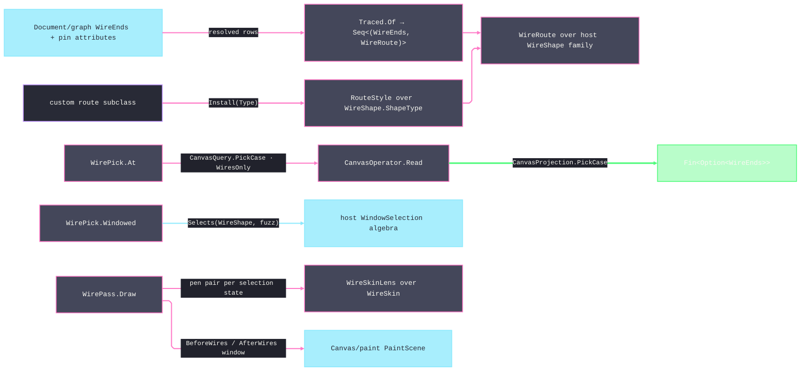

# [RASM_GRASSHOPPER_CANVAS_WIRES]

The wire-visual owner of the Grasshopper boundary — route geometry over the public `WireShape` family, custom-route installation through `ShapeType`, point picking through the closed canvas query/projection rail, marquee selection through `WindowSelection`, and the wire-pen pass over `WireSkin`. `Canvas.WireDrawCache` and its `WireRepository` type are internal, so the repository's nominally public `WireAt` member is unreachable; point picking therefore composes the public `Canvas.ResolvePick` boundary already owned by `Canvas/canvas.md`. `WireShapeLinear` and `WireShapeBiArc` are likewise internal implementation types, and `WireShapeElbow` is absent. The document-side traversal, mutation, split, and undo capabilities remain `Document/graph.md`'s `GraphScope`; this page consumes resolved `WireEnds` and pin attributes without touching the graph.

## [01]-[INDEX]

- [02]-[ROUTES]: `WireRoute` + `RouteStyle` — the admitted route capsule over the `WireShape` family and the one custom-shape installation seam.
- [03]-[PICKING]: `WirePick` — point picking through the gated pick map and marquee picking through the `WindowSelection` fuzz algebra.
- [04]-[PENS]: `WirePens` + `WireSkinLens` + `WirePass` — wire-pen resolution by selection state, skin derivation folds, and the detail-gated draw pass.

## [02]-[ROUTES]

- Owner: `WireRoute` `readonly record struct` `[BoundaryAdapter]` — the admitted route capsule holding one host `WireShape`. Admission is ONE polymorphic `Of` discriminating on input shape: an endpoint pair (`PointF`, `PointF`) routes raw points, and a pin-attribute pair (`IParameterAttributes`, `IParameterAttributes`) routes outlet-to-inlet — the host `Create` throws on a source without an outlet or a target without an inlet, so both arms run under `Op.Catch` and a refused pin surfaces as the typed fault. The capsule's queries are the full verified geometry contract renamed to canonical verbs: `Nearest(PointF)` (`Project` — closest point on the route), `Gap(PointF)` (`DistanceTo`), `Crosses(RectangleF)` (`Intersects`), `Touches(PointF, float)` (`IsCoincident`), `Extent` (`Bounds`), and `Endpoints` (`Source`/`Target`).
- Owner: `RouteStyle` — the custom-route seam over `WireShape.ShapeType`. `Install(Type, Op?)` admits one closed, concrete `WireShape` subtype with a public two-`PointF` constructor before assignment; this precludes abstract, open-generic, and constructor-late failures before the host reaches `Activator.CreateInstance`. `Reset` clears the slot and restores `WireShapeDefault`; `Current` reads the installed type as `Option<Type>`. `WireShapeDefault` is the public cubic-spline fallback and `CreateSpline(PointF, PointF)` mints its `BezierF`; the internal linear and biarc implementations are not extension surfaces. An elbow, orthogonal, or bundled route is a public plugin-owned `WireShape` subclass installed through this seam.
- Owner: `Traced` — the route-set producer: `Traced.Of(Seq<(WireEnds Ends, IParameterAttributes Source, IParameterAttributes Target)> pins, Op key)` folds pin rows into `TracedRoutes` through the attribute admission arm — every routed pin lands in `Routes`, every refused pin lands in `Refused` as typed evidence beside its `WireEnds`, so a single detached pin never voids the pass: the draw fold strokes what routed and a diagnostics consumer folds what refused. Pin resolution — `Guid` to `IParameterAttributes` — is graph territory; the rows arrive resolved.
- Law: a route is rebuilt when its endpoints move, never cached across layout — construction is two points and a spline mint, and the host repaints wires per frame anyway; the killed draw-cache observation has no successor because the observed cache was never a public contract.
- Boundary: wire creation, deletion, endpoint rewiring, and the split into `Shout`/`Listen` are `Document/graph.md`'s `GraphScope.Mutate`; the straighten NUDGE candidate (`SnappingAction.CreateStraightenWireAction`) is `Canvas/layout.md`'s row; this page owns route geometry and its rendering only.
- Packages: Grasshopper2 (`WireShape.Create`/`Project`/`DistanceTo`/`Intersects`/`IsCoincident`/`Draw`/`Bounds`/`Source`/`Target`/`ShapeType`, `WireShapeDefault.CreateSpline`, `IParameterAttributes.HasInlet`/`HasOutlet`/`Inlet`/`Outlet`, `WireEnds`), Eto.Drawing (`PointF`, `RectangleF`, `BezierF`, `Graphics`, `Pen`), LanguageExt.Core, `Rasm.Domain`.
- Growth: a new route geometry is one installed `WireShape` subclass — zero edits here; a new route query is one capsule member over the host contract.

```csharp signature
// --- [RUNTIME_PRELUDE] ----------------------------------------------------------------------
using Rasm.Csp;

namespace Rasm.Grasshopper.Canvas;

// --- [MODELS] -------------------------------------------------------------------------------
[BoundaryAdapter, StructLayout(LayoutKind.Auto)]
public readonly record struct WireRoute {
    private WireRoute(WireShape shape) => Shape = shape;
    internal WireShape Shape { get; }

    public static Fin<WireRoute> Of(PointF source, PointF target, Op? key = null) {
        Op op = key.OrDefault();
        return op.Catch(body: () => Fin.Succ(new WireRoute(shape: WireShape.Create(source, target))));
    }

    public static Fin<WireRoute> Of(IParameterAttributes source, IParameterAttributes target, Op? key = null) {
        Op op = key.OrDefault();
        return from origin in op.Need(value: source)
               from goal in op.Need(value: target)
               from route in op.Catch(body: () => Fin.Succ(new WireRoute(shape: WireShape.Create(origin, goal))))
               select route;
    }

    public PointF Nearest(PointF point) => Shape.Project(point);
    public float Gap(PointF point) => Shape.DistanceTo(point);
    public bool Crosses(RectangleF box) => Shape.Intersects(box);
    public bool Touches(PointF point, float tolerance) => Shape.IsCoincident(point, tolerance);
    public RectangleF Extent => Shape.Bounds;
    public (PointF Source, PointF Target) Endpoints => (Shape.Source, Shape.Target);
    internal Unit Render(Graphics graphics, Pen edge) => Op.Side(action: () => Shape.Draw(graphics, edge));
}

// --- [OPERATIONS] ---------------------------------------------------------------------------
[BoundaryAdapter]
public static class RouteStyle {
    public static Option<Type> Current => Optional(WireShape.ShapeType);

    public static Fin<Unit> Install(Type routeType, Op? key = null) {
        Op op = key.OrDefault();
        return from candidate in op.Need(value: routeType)
               from derived in guard(typeof(WireShape).IsAssignableFrom(candidate), op.InvalidInput()).ToFin()
               from closed in guard(!candidate.IsAbstract && !candidate.ContainsGenericParameters, op.InvalidInput()).ToFin()
               from constructible in guard(
                   candidate.GetConstructor([typeof(PointF), typeof(PointF)]) is not null, op.InvalidInput()).ToFin()
               from _ in op.Catch(body: () => Fin.Succ(Op.Side(action: () => WireShape.ShapeType = candidate)))
               select unit;
    }

    public static Unit Reset() => Op.Side(action: static () => WireShape.ShapeType = null!);
}

[BoundaryAdapter, StructLayout(LayoutKind.Auto)]
public readonly record struct TracedRoutes(Seq<(WireEnds Ends, WireRoute Route)> Routes, Seq<(WireEnds Ends, Error Refusal)> Refused);

[BoundaryAdapter]
public static class Traced {
    public static TracedRoutes Of(Seq<(WireEnds Ends, IParameterAttributes Source, IParameterAttributes Target)> pins, Op key) =>
        pins.Fold(
            new TracedRoutes(Routes: Seq<(WireEnds, WireRoute)>(), Refused: Seq<(WireEnds, Error)>()),
            (held, row) => WireRoute.Of(source: row.Source, target: row.Target, key: key).Match(
                Succ: route => held with { Routes = held.Routes.Add((row.Ends, route)) },
                Fail: fault => held with { Refused = held.Refused.Add((row.Ends, fault)) }));
}
```

## [03]-[PICKING]

- Owner: `WirePick` — the two pick modalities over public host contracts. `At(PointF, Op?)` submits `CanvasQuery.PickCase(at, PickGates.WiresOnly)` to `CanvasOperator.Read`, admits only `CanvasProjection.PickCase`, and totally projects its `PickHit`: wire becomes `Some(WireEnds)`, every known non-wire case becomes `None`, and any non-pick projection is a typed invalid-result fault. An unknown future host `Pick` never degrades to `None`: `Canvas/canvas.md`'s `PickHit.Of` fails before a projection exists. `Windowed(WindowSelection, Seq<(WireEnds, WireRoute)>, float)` folds the verified `WindowSelection.Selects(WireShape, float)` overload, retaining the host's crossing-versus-containing law.
- Law: pick admission is gate policy — whether wires participate in a marquee at all is `Canvas/canvas.md`'s `SelectGates`, and whether a pick verb is allowed at all is its `ActionGate` rows (`WireSelect`, `MakeWire`, `DeleteWire`, `ModifyWire`); this owner resolves geometry and never consults policy.
- Law: hover proximity is route geometry — `route.Touches(point, tolerance)` with the caller's tolerance value; the census `PickTolerance` constant carrier is killed, the tolerance is the consumer's policy datum.
- Packages: Grasshopper2 (`WindowSelection.Selects(WireShape, float)`/`IsCrossing`/`Box`, `SelectionResult`, `Pick`, `WireEnds`), `Canvas/canvas.md` (`CanvasOperator.Read(CanvasQuery)`, `CanvasQuery.PickCase`, `CanvasProjection.PickCase`, `PickGates`, `PickHit`), LanguageExt.Core, `Rasm.Domain`.
- Growth: a new pick modality is one method over an existing host read; the gates and the fuzz algebra never fork.

```csharp signature
// --- [RUNTIME_PRELUDE] ----------------------------------------------------------------------
using Rasm.Csp;

namespace Rasm.Grasshopper.Canvas;

// --- [OPERATIONS] ---------------------------------------------------------------------------
[BoundaryAdapter]
public static class WirePick {
    public static Fin<Option<WireEnds>> At(PointF at, Op? key = null) {
        Op op = key.OrDefault();
        return CanvasOperator.Read(
            query: new CanvasQuery.PickCase(At: at, Gates: PickGates.WiresOnly),
            key: op).Bind(projection => projection.Switch(
                state: op,
                pointCase: static (active, _) => Unexpected(key: active),
                frameCase: static (active, _) => Unexpected(key: active),
                pickCase: static (_, result) => Fin.Succ(value: result.Value.Hit.Switch(
                    wireCase: static wire => Some(wire.Wire),
                    inletCase: static _ => Option<WireEnds>.None,
                    outletCase: static _ => Option<WireEnds>.None,
                    surfaceCase: static _ => Option<WireEnds>.None,
                    voidCase: static _ => Option<WireEnds>.None)),
                stateCase: static (active, _) => Unexpected(key: active),
                pulseCase: static (active, _) => Unexpected(key: active),
                rasterCase: static (active, _) => Unexpected(key: active)));
    }

    public static Seq<WireEnds> Windowed(WindowSelection window, Seq<(WireEnds Ends, WireRoute Route)> routes, float fuzz) =>
        routes.Filter(row => window.Selects(row.Route.Shape, fuzz)).Map(static row => row.Ends).Strict();

    private static Fin<Option<WireEnds>> Unexpected(Op key) =>
        Fin.Fail<Option<WireEnds>>(error: key.InvalidResult(detail: "Wire pick received a non-pick canvas projection."));
}
```

## [04]-[PENS]

- Owner: `WirePens` `readonly record struct` — the resolved wire-ink evidence: `Source` and `Target` end colours from `WireSkin.ResolveColours`, the required `Outer` edge, and the runtime-nullable `Inner` edge as `Option<EdgeDescription>`. Ends and layers are orthogonal axes: each present layer mints one pen whose ink is solid when the end colours agree and a source-to-target `LinearGradientBrush` when they differ, applies `EdgeDescription.AssignToPen`, and disposes the brush and pen with the stroke.
- Owner: `WireSkinLens` — the two folds that add shape over the verified `WireSkin` surface: `Pens(WireSkin, bool sourceSelected, bool targetSelected)` lifts the `out`-pair onto `WirePens`, and `Styled(WireSkin, ...)` projects the corpus `Option` vocabulary onto the host `Modify` nullable-slot fold (`normal`/`selected`/`selectedOpposite`/`selectedGlow`/`outerEdge`/`innerEdge`) so a themed wire palette is one derivation expression, never a rebuilt skin. `WireSkin.Interpolate` and `Fade` are host-direct — a rename fold beside them is the deleted form, the same law that keeps the `Skin` `With` algebra unwrapped on `Canvas/paint.md`. The full palette row set — `Normal`, `Selected`, `Unselected`, `SelectedGlow` — is the decompiled truth; a perceptual blend between local palettes crosses through `Pigment` onto the kernel `PerceptualColor`/`BlendPath` owner, while `Interpolate` remains the host's own palette blend.
- Owner: `WirePass` — the detail-gated draw fold: `Draw(PaintScene, WireSkin, Seq<(WireRoute, bool, bool)>, Op)` culls each route against the visible frame, resolves end colours, always strokes the required outer edge, and strokes the optional inner edge only when `ZuiWireDetailingState > 0`. Both layers call the verified `WireShape.Draw(Graphics, Pen)` surface. The pass runs inside a `Canvas/paint.md` `BeforeWires` or `AfterWires` window.
- Law: selection state arrives as data on the wire rows — the pass never reads document selection; the caller projects selection truth (a `Document/graph.md` read) into the row flags, keeping the draw fold pure over its inputs.
- Packages: Grasshopper2 (`WireSkin.ResolveColours`/`Interpolate`/`Fade`/`Modify`/`Normal`/`Selected`/`Unselected`/`SelectedGlow`/`Outer`/`Inner`, `EdgeDescription.AssignToPen`/`Width`/`Cap`/`Dash`, `Canvas.ZuiWireDetailingState`), Eto.Drawing (`Pen`, `Brush`, `SolidBrush`, `LinearGradientBrush`, `Color`, `Graphics`), `Canvas/paint.md` (`PaintScene`), kernel `PerceptualColor`/`BlendPath` via `Pigment`, LanguageExt.Core, `Rasm.Domain`.
- Growth: a new wire treatment is a `Styled` derivation or one skin row through the host `Modify` slots; a new pass policy (glow, bundle dimming) is one fold parameter — the draw seam never forks.

```csharp signature
// --- [RUNTIME_PRELUDE] ----------------------------------------------------------------------
using Rasm.Csp;

namespace Rasm.Grasshopper.Canvas;

// --- [MODELS] -------------------------------------------------------------------------------
[BoundaryAdapter, StructLayout(LayoutKind.Auto)]
public readonly record struct WirePens(Color Source, Color Target, EdgeDescription Outer, Option<EdgeDescription> Inner);

// --- [OPERATIONS] ---------------------------------------------------------------------------
[BoundaryAdapter]
public static class WireSkinLens {
    public static WirePens Pens(WireSkin skin, bool sourceSelected, bool targetSelected) {
        skin.ResolveColours(sourceSelected, targetSelected, out Color source, out Color target);
        return new WirePens(Source: source, Target: target, Outer: skin.Outer, Inner: Optional(skin.Inner));
    }

    public static WireSkin Styled(
        WireSkin skin, Option<Color> normal = default, Option<Color> selected = default,
        Option<Color> selectedOpposite = default, Option<Color> selectedGlow = default,
        Option<EdgeDescription> outerEdge = default, Option<EdgeDescription> innerEdge = default) =>
        skin.Modify(
            normal: normal.MatchUnsafe(Some: static c => c, None: static () => (Color?)null),
            selected: selected.MatchUnsafe(Some: static c => c, None: static () => (Color?)null),
            selectedOpposite: selectedOpposite.MatchUnsafe(Some: static c => c, None: static () => (Color?)null),
            selectedGlow: selectedGlow.MatchUnsafe(Some: static c => c, None: static () => (Color?)null),
            outerEdge: outerEdge.MatchUnsafe(Some: static e => e, None: static () => null),
            innerEdge: innerEdge.MatchUnsafe(Some: static e => e, None: static () => null));
}

[BoundaryAdapter]
public static class WirePass {
    public static Fin<int> Draw(
        PaintScene scene, WireSkin skin,
        Seq<(WireRoute Route, bool SourceSelected, bool TargetSelected)> wires, Op key) =>
        key.Catch(body: () => {
            float detailing = scene.Surface.ZuiWireDetailingState;
            Graphics graphics = scene.Graphics.Content;
            int drawn = wires.Fold(0, (count, row) => {
                if (!scene.Visible.Intersects(row.Route.Extent)) { return count; }
                WirePens pens = WireSkinLens.Pens(skin: skin, sourceSelected: row.SourceSelected, targetSelected: row.TargetSelected);
                _ = Stroke(graphics: graphics, route: row.Route, pens: pens, edge: pens.Outer);
                if (detailing > 0f) { _ = pens.Inner.Iter(edge => Stroke(graphics: graphics, route: row.Route, pens: pens, edge: edge)); }
                return count + 1;
            });
            return Fin.Succ(drawn);
        });

    private static Unit Stroke(Graphics graphics, WireRoute route, WirePens pens, EdgeDescription edge) {
        (PointF source, PointF target) = route.Endpoints;
        using Brush ink = pens.Source == pens.Target
            ? new SolidBrush(pens.Source)
            : new LinearGradientBrush(pens.Source, pens.Target, source, target);
        using Pen pen = new(ink, edge.Width);
        edge.AssignToPen(pen);
        return route.Render(graphics: graphics, edge: pen);
    }
}
```



## [05]-[DENSITY_BAR]

| [INDEX] | [CONCERN]        | [OWNER]                     | [KIND]                                     | [RAIL]                       | [CASES] |
| :-----: | :--------------- | :-------------------------- | :----------------------------------------- | :--------------------------- | :-----: |
|  [01]   | route geometry   | `WireRoute`                 | admitted capsule, one polymorphic `Of`     | `Of → Fin<WireRoute>`        |    2    |
|  [02]   | custom routes    | `RouteStyle`                | gated host `ShapeType` seam                | `Install → Fin<Unit>`        |    1    |
|  [03]   | route production | `Traced` + `TracedRoutes`   | partial-success fold over pin rows         | `Of → TracedRoutes`          |    1    |
|  [04]   | wire picking     | `WirePick`                  | pick-map point read + marquee fuzz fold    | `At → Fin<Option<WireEnds>>` |    2    |
|  [05]   | pen resolution   | `WirePens` + `WireSkinLens` | out-pair lift + optional-detail projection | pure                         |    2    |
|  [06]   | wire draw pass   | `WirePass`                  | detail-gated cull-and-stroke fold          | `Draw → Fin<int>`            |    1    |

`CanvasOperator`, `CanvasQuery`, `CanvasProjection`, `PickGates`, `PaintScene`, `Pigment`, `Op`, and the host `WindowSelection`/`WireSkin` algebras are composed upstream owners. The census `WireOp` operation roster, `WireTraversal`, `WireEdit`, `WireRouteSolver`, `WireStyle` reflection, `WireRepositoryRail`, `WireRoutingProfile`, and `PickTolerance` have no successor here. `Canvas.WireDrawCache` and its `WireRepository` return type are internal, making `WireRepository.WireAt` inaccessible despite that member's public modifier; `WireShapeLinear` and `WireShapeBiArc` are internal, and `WireShapeElbow` is absent.
