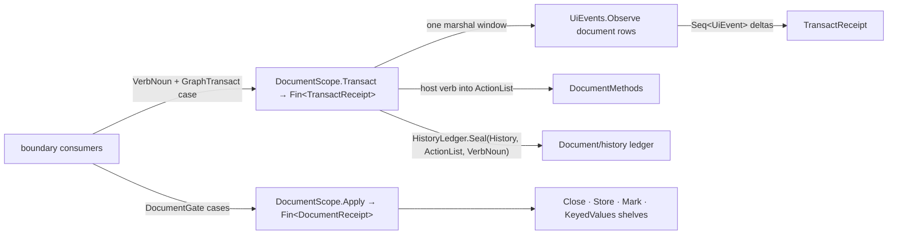

# [RASM_GRASSHOPPER_DOCUMENT_DOCUMENT]

`DocumentScope` is the document spine of the GH2 graph boundary — ONE scope operator owning document minting across the inert/inactive/active tiers, lifecycle and persistence settlement, typed keyed-value shelves, marshalled facet reads, and THE one graph transaction gate absorbing the whole `DocumentMethods` verb surface.

Every mutation verb is a case of one `GraphTransact` union settled by one `Transact` gate pairing the host verb with its `Document/history.md` undo seal; the transaction window observes the document's own `Shell/events.md` rows, so every receipt carries the causal `UiEvent` deltas the mutation raised. Whole-graph selection state is a `SelectionSweep` row family, clipboard and compose intent are case payloads, and the delete family is one case discriminating selection-versus-explicit on the shape of its payload. Graph query and wire mutation are `Document/graph.md`'s operator, undo branching is `Document/history.md`'s ledger, and solution execution is `Document/solution.md`'s controller.

## [01]-[INDEX]

- [02]-[LIFECYCLE]: `DocumentTier` + `ValueShelf` + `DocumentGate` + `DocumentScope` lifecycle gates — mint rows, the lifecycle/persistence/keyed-state command union, the generic facet read, and the open-document roster.
- [03]-[TRANSACT]: `SelectionSweep` + `GraphTransact` + `TransactReceipt` — the one graph transaction union over the `DocumentMethods` verb surface, the seal law, and the causal-delta receipt.

## [02]-[LIFECYCLE]

- Owner: `DocumentTier` `[SmartEnum<int>]` — 3 mint rows over one `[UseDelegateFromConstructor]` `Mint()` column: `Inert` (key 0, `Document.NewInertDocument`), `Inactive` (key 1, `Document.NewInactiveDocument`), `Active` (key 2, `Document.NewActiveDocument`). Tier is data, so headless pipelines, background parsing, and canvas-bound editing mint through one gate. `ValueShelf` `[SmartEnum<int>]` — the keyed-value facet vocabulary over one `Select(HostDocument)` column onto `KeyedValues`: `Custom` (key 0, `Document.CustomValues`). `DocumentGate` `[Union]` `[GenerateUnionOps]` closes the lifecycle command family: `CloseCase` (`Document.Close`), `StoreCase(IWriter, FileContents)` (`Document.Store` through the `GrasshopperIO` writer), `MarkCase(bool)` (`Modify`/`Unmodify` as one polarity case), `StashCase(ValueShelf, string, IStorable)` (`KeyedValues.Set`), `ForgetCase(ValueShelf, string)` (`KeyedValues.Delete`).
- Entry: `DocumentScope.Mint(DocumentTier tier, Op? key = null)` → `Fin<HostDocument>` — the value gate for new documents; `DocumentScope.Apply(DocumentGate op, Option<HostDocument> graph = default, Op? key = null)` → `Fin<DocumentReceipt>` — the command gate; `DocumentScope.Read<TOut>(Func<HostDocument, TOut> facet, Option<HostDocument> graph = default, Op? key = null)` → `Fin<TOut>` — the marshalled facet projection over `File`, `Display`, `Dependencies`, `Notes`, `Hash`, `NamedViews`, `Parent`, `Modified`, and `Objects`; `DocumentScope.Recall<T>(ValueShelf shelf, string name, T fallback, ...)` → `Fin<T>` — the typed keyed read over `KeyedValues.Get<T>`; `DocumentScope.Roster(Op? key = null)` → `Fin<Seq<HostDocument>>` — the live `Document.AllDocuments` sweep.
- Law: absence of a target document is a modality, never an overload — `Option<HostDocument>` discriminates the supplied graph (a nested `Parent` child, an inactive mint) from the session-active document, and the absent branch resolves through `GhSession.Run(ScopeTarget.DocumentHost, ...)` so scope acquisition, marshalling, and null-gating stay the session page's one law.
- Law: every gate settles inside one UI marshal — a supplied document rides `EtoDispatch.Run`, an acquired one rides the session gate; a `HostDocument` reference never crosses back out of `Apply`, and `Read` hands the caller the projected value only, so a facet whose host type the catalog leaves unstated stays typed by the consumer's own projection instead of an asserted spelling.
- Law: keyed state is shelf-addressed — a consumer names a `ValueShelf` row with a string key, and the same three verbs (`Recall`/`StashCase`/`ForgetCase`) serve every shelf; a second keyed-storage entry family per facet is the deleted form.
- RESEARCH: the `Document.Globals` facet is catalog-verified as a property but its member shape is unstated — the `Global` shelf row lands as one `ValueShelf` row when the decompile confirms `KeyedValues`; `Document.State`'s type vocabulary and `Document.AllDocuments`' element carrier re-verify at the same pass; the document-load spelling (a `GrasshopperIO` reader seam versus a `Document` static) is catalog-unstated — the load posture lands as one `DocumentGate` case or `Mint` axis when the decompile fixes it, closing the store/load asymmetry.
- Boundary: autosave requests are per-object (`IDocumentObject.RequestAutoSave`) and ride `Document/history.md`'s ledger commands; document file-compare and editor reveal are `Shell/editor.md`'s shell surface; document-scoped caching keys off `Shell/session.md`'s `SessionCache` and evicts on the `Shell/events.md` close row.
- Packages: Grasshopper2 (`Document.New*Document`, `Close`, `Store`, `Modify`, `Unmodify`, `CustomValues`, `AllDocuments`, `KeyedValues.Get<T>`/`Set`/`Delete`), GrasshopperIO (`IWriter`, `IStorable`), LanguageExt.Core, `Rasm.Domain`, `Rasm.Parametric` (`MonotonicTimeline`, `MonotonicStamp`).
- Growth: a new mint posture is one `DocumentTier` row; a new keyed facet is one `ValueShelf` row; a new lifecycle verb is one `DocumentGate` case breaking the gate's total `Switch` loudly — zero new entrypoints on any axis.

```csharp signature
// --- [RUNTIME_PRELUDE] ----------------------------------------------------------------------
using Grasshopper2.Doc;
using GrasshopperIO;
using Rasm.Csp;
using Rasm.Grasshopper.Eto;
using Rasm.Grasshopper.Shell;
using Rasm.Parametric;
using HostDocument = Grasshopper2.Doc.Document;

namespace Rasm.Grasshopper.Document;

// --- [TYPES] --------------------------------------------------------------------------------
[SmartEnum<int>]
public sealed partial class DocumentTier {
    public static readonly DocumentTier Inert = new(key: 0, mint: static () => HostDocument.NewInertDocument());
    public static readonly DocumentTier Inactive = new(key: 1, mint: static () => HostDocument.NewInactiveDocument());
    public static readonly DocumentTier Active = new(key: 2, mint: static () => HostDocument.NewActiveDocument());
    [UseDelegateFromConstructor] internal partial HostDocument Mint();
}

[SmartEnum<int>]
public sealed partial class ValueShelf {
    public static readonly ValueShelf Custom = new(key: 0, select: static document => document.CustomValues);
    [UseDelegateFromConstructor] internal partial KeyedValues Select(HostDocument document);
}

[Union]
[GenerateUnionOps]
public abstract partial record DocumentGate {
    private DocumentGate() { }
    public sealed record CloseCase : DocumentGate;
    public sealed record StoreCase(IWriter Writer, FileContents Contents) : DocumentGate;
    public sealed record MarkCase(bool Modified) : DocumentGate;
    public sealed record StashCase(ValueShelf Shelf, string Name, IStorable Value) : DocumentGate;
    public sealed record ForgetCase(ValueShelf Shelf, string Name) : DocumentGate;
}

// --- [MODELS] -------------------------------------------------------------------------------
[BoundaryAdapter, StructLayout(LayoutKind.Auto)]
public readonly record struct DocumentReceipt(
    Op Operation, string Verb, MonotonicStamp Entered, MonotonicStamp Settled, TimeSpan Latency) : IValidityEvidence {
    public bool IsValid => ValidityClaim.All(
        ValidityClaim.Of(holds: !string.IsNullOrWhiteSpace(value: Verb)),
        ValidityClaim.Evidence(evidence: Entered),
        ValidityClaim.Evidence(evidence: Settled),
        ValidityClaim.Nonnegative(value: Latency.TotalSeconds));
}

// --- [OPERATIONS] ---------------------------------------------------------------------------
[BoundaryAdapter]
public static partial class DocumentScope {
    public static Fin<HostDocument> Mint(DocumentTier tier, Op? key = null) {
        Op active = key.OrDefault();
        return Optional(tier).ToFin(active.InvalidInput())
            .Bind(row => EtoDispatch.Run(body: () => active.Catch(body: () => Fin.Succ(row.Mint())), key: active));
    }

    public static Fin<TOut> Read<TOut>(Func<HostDocument, TOut> facet, Option<HostDocument> graph = default, Op? key = null) {
        Op active = key.OrDefault();
        return Optional(facet).ToFin(active.InvalidInput())
            .Bind(valid => Resolve(graph: graph, key: active, body: document => active.Catch(body: () => Fin.Succ(valid(arg: document)))));
    }

    public static Fin<T> Recall<T>(ValueShelf shelf, string name, T fallback, Option<HostDocument> graph = default, Op? key = null) {
        Op active = key.OrDefault();
        return from row in Optional(shelf).ToFin(active.InvalidInput())
               from label in active.AcceptText(value: name)
               from value in Resolve(graph: graph, key: active, body: document =>
                   active.Catch(body: () => Fin.Succ(row.Select(document: document).Get(label, fallback))))
               select value;
    }

    public static Fin<Seq<HostDocument>> Roster(Op? key = null) {
        Op active = key.OrDefault();
        return EtoDispatch.Run(body: () => active.Catch(body: () => Fin.Succ(toSeq(HostDocument.AllDocuments))), key: active);
    }

    public static Fin<DocumentReceipt> Apply(DocumentGate op, Option<HostDocument> graph = default, Op? key = null) {
        Op active = key.OrDefault();
        return from valid in Optional(op).ToFin(active.InvalidInput())
               from timeline in MonotonicTimeline.Of(provider: TimeProvider.System, key: active)
               from entered in timeline.Capture(key: active)
               from verb in Resolve(graph: graph, key: active, body: document => valid.Switch(
                state: (Key: active, Graph: document),
                closeCase: static (frame, _) => frame.Key.Catch(body: () =>
                    Fin.Succ((Op.Side(action: frame.Graph.Close), nameof(DocumentGate.CloseCase)).Item2)),
                storeCase: static (frame, c) => frame.Key.Catch(body: () =>
                    Fin.Succ((Op.Side(action: () => frame.Graph.Store(c.Writer, c.Contents)), nameof(DocumentGate.StoreCase)).Item2)),
                markCase: static (frame, c) => frame.Key.Catch(body: () =>
                    Fin.Succ((Op.SideWhen(condition: c.Modified, action: frame.Graph.Modify),
                              Op.SideWhen(condition: !c.Modified, action: frame.Graph.Unmodify),
                              nameof(DocumentGate.MarkCase)).Item3)),
                stashCase: static (frame, c) => frame.Key.Catch(body: () =>
                    Fin.Succ((Op.Side(action: () => c.Shelf.Select(document: frame.Graph).Set(c.Name, c.Value)),
                              nameof(DocumentGate.StashCase)).Item2)),
                forgetCase: static (frame, c) => frame.Key.Catch(body: () =>
                    Fin.Succ((Op.Side(action: () => c.Shelf.Select(document: frame.Graph).Delete(c.Name)),
                              nameof(DocumentGate.ForgetCase)).Item2))))
               from settled in timeline.Capture(key: active)
               from latency in timeline.Elapsed(start: entered, end: settled, key: active)
               select new DocumentReceipt(
                   Operation: active, Verb: verb, Entered: entered, Settled: settled, Latency: latency);
    }

    internal static Fin<TOut> Resolve<TOut>(Option<HostDocument> graph, Op key, Func<HostDocument, Fin<TOut>> body) =>
        graph.Match(
            Some: chosen => EtoDispatch.Run(body: () => body(arg: chosen), key: key),
            None: () => GhSession.Run(
                target: ScopeTarget.DocumentHost,
                project: scope => scope.Document.ToFin(key.MissingContext()).Bind(body),
                key: key));
}
```

## [03]-[TRANSACT]

- Owner: `GraphTransact` `[Union]` `[GenerateUnionOps]` — THE one graph mutation vocabulary over the `DocumentMethods` verb surface. `SweepCase(SelectionSweep)` carries whole-graph selection state through a 3-row `[SmartEnum<int>]` (`All` → `SelectAll`, `None` → `DeselectAll`, `Invert` → `InvertSelection`); `CopyCase(ClipboardKind)`/`CutCase(ClipboardKind)`/`PasteCase(ClipboardKind, PasteBehaviour)`/`PasteLegacyCase` own the clipboard round-trip including the GH1 XML ingest; `GroupCase(string, Option<OpenColor.Family>)`/`ChainCase`/`ClusterCase` compose the selection into its three wrapper species; `DeleteCase(Seq<IDocumentObject>, Seq<WireEnds>)` discriminates on payload shape — both spans empty is `DeleteSelection`, anything explicit is `DeleteObjects` — so parallel delete verbs collapse to one case; `DropCase(IDocumentObject, PointF)`/`SnippetCase(Snippet, PointF)` place new material; `ActivityCase(bool)`/`DisplayCase(bool)`/`DressCase(Colour)` flip enablement, visibility, and the colour override on the selection as polarity payloads; `IsolateCase(IDocumentObject, bool, bool, bool)` isolates one object's reach; `MigrateCase(Seq<IDocumentObject>, PointF)` relocates a transferred set; `DependencyCase(PointF)`/`RevealDependenciesCase` add and reveal document dependencies. Host discriminants — `ClipboardKind`, `PasteBehaviour`, `Colour`, `OpenColor.Family` — ride case payloads unchanged because this package IS the seam; a wrapper vocabulary per host enum is the parallel-owner defect re-minted.
- Entry: `DocumentScope.Transact(VerbNoun label, GraphTransact op, Option<HostDocument> graph = default, Op? key = null)` → `Fin<TransactReceipt>` — the one mutation gate. One verb and eighteen are the same call shape; the case is the discriminant, never a mode flag or a sibling method.
- Law: mutation and undo are one act — every mutating arm mints one `ActionList`, runs its host verb into it, and seals through `Document/history.md`'s `HistoryLedger.Seal(History, ActionList, VerbNoun, Op)` under the caller's `VerbNoun`; the non-mutating arms (`SweepCase`, `CopyCase`, `RevealDependenciesCase`) settle without a seal and stamp `Sealed: false`. A `DocumentMethods` call outside this gate is the deleted form.
- Law: the receipt is causal — the transaction window attaches the document's own event rows (`UiSource.GraphObjectAdded`, `GraphObjectRemoved`, `GraphSelection`, `DocumentModified`) through `UiEvents.Observe` before the verb runs and folds every published `UiEvent` into `TransactReceipt.Deltas`, so a consumer reads what the mutation actually did — objects added, removed, reselected, the modified flip — as typed evidence, never by re-diffing the graph. Its subscription lease dies inside the window; deltas are `UiEvent` values, and a second delta vocabulary re-projecting `UiFact` is the deleted form.
- Law: the window is atomic on the UI thread — observation attach, verb, seal, and delta fold share one marshal, so no delta from a concurrent mutation can interleave into this receipt.
- RESEARCH: `ActionList`'s mint spelling (parameterless construction assumed), `IsolateObject`'s three flag semantics, and `CopySelection`'s trailing shape (bare `ClipboardKind` versus a trailing `ActionList` — the copy arm stays unsealed either way because copying mutates nothing) re-verify at decompile; `VerbNoun` minting is unowned here — the gate accepts an already-minted label, and the factory question rides `Document/history.md`'s card.
- Boundary: wire mutation (`Connections`), object transfer, id remapping, pins, and window selection are `Document/graph.md`'s operator — `SplitWire` rides there with the wire family it belongs to; repaint intent after a transaction is `Shell/session.md`'s `RepaintCase`, composed by the consumer, never auto-fired here.
- Packages: Grasshopper2 (`DocumentMethods` verb surface, `ClipboardKind`, `PasteBehaviour`, `Snippet`, `WireEnds`, `Colour`, `OpenColor.Family`), Eto (`PointF`), LanguageExt.Core, `Rasm.Domain`, `Shell/events.md` (`UiEvents`, `UiSource`, `EventAnchor`, `UiEvent`), `Document/history.md` (`HistoryLedger.Seal`), `Rasm.Parametric` (`MonotonicTimeline`, `MonotonicStamp`).
- Growth: a new document verb is one `GraphTransact` case whose `Switch` arm breaks the gate loudly; a new sweep posture is one `SelectionSweep` row; a new causal stream on the receipt is one `UiSource` row added to the observation set.

```csharp signature
// --- [RUNTIME_PRELUDE] ----------------------------------------------------------------------
using Eto.Drawing;
using Grasshopper2.Doc;
using Grasshopper2.Framework;
using Grasshopper2.Types.Colour;
using Grasshopper2.Undo;
using Rasm.Csp;
using Rasm.Grasshopper.Eto;
using Rasm.Grasshopper.Shell;
using Rasm.Parametric;
using HostDocument = Grasshopper2.Doc.Document;

namespace Rasm.Grasshopper.Document;

// --- [TYPES] --------------------------------------------------------------------------------
[SmartEnum<int>]
public sealed partial class SelectionSweep {
    public static readonly SelectionSweep All = new(key: 0, sweep: static verbs => Op.Side(action: verbs.SelectAll));
    public static readonly SelectionSweep None = new(key: 1, sweep: static verbs => Op.Side(action: verbs.DeselectAll));
    public static readonly SelectionSweep Invert = new(key: 2, sweep: static verbs => Op.Side(action: verbs.InvertSelection));
    [UseDelegateFromConstructor] internal partial Unit Sweep(DocumentMethods verbs);
}

[Union]
[GenerateUnionOps]
public abstract partial record GraphTransact {
    private GraphTransact() { }
    public sealed record SweepCase(SelectionSweep Sweep) : GraphTransact;
    public sealed record CopyCase(ClipboardKind Kind) : GraphTransact;
    public sealed record CutCase(ClipboardKind Kind) : GraphTransact;
    public sealed record PasteCase(ClipboardKind Kind, PasteBehaviour Behaviour) : GraphTransact;
    public sealed record PasteLegacyCase : GraphTransact;
    public sealed record GroupCase(string Name, Option<OpenColor.Family> Colour) : GraphTransact;
    public sealed record ChainCase : GraphTransact;
    public sealed record ClusterCase : GraphTransact;
    public sealed record DeleteCase(Seq<IDocumentObject> Objects, Seq<WireEnds> Wires) : GraphTransact;
    public sealed record DropCase(IDocumentObject Subject, PointF At) : GraphTransact;
    public sealed record SnippetCase(Snippet Payload, PointF At) : GraphTransact;
    public sealed record ActivityCase(bool Enabled) : GraphTransact;
    public sealed record DisplayCase(bool Shown) : GraphTransact;
    public sealed record DressCase(Colour Override) : GraphTransact;
    public sealed record IsolateCase(IDocumentObject Subject, bool Upstream, bool Downstream, bool Remainder) : GraphTransact;
    public sealed record MigrateCase(Seq<IDocumentObject> Objects, PointF At) : GraphTransact;
    public sealed record DependencyCase(PointF At) : GraphTransact;
    public sealed record RevealDependenciesCase : GraphTransact;
}

// --- [MODELS] -------------------------------------------------------------------------------
[BoundaryAdapter, StructLayout(LayoutKind.Auto)]
public readonly record struct TransactReceipt(
    Op Operation, string Verb, bool Sealed, Seq<UiEvent> Deltas,
    MonotonicStamp Entered, MonotonicStamp Settled, TimeSpan Latency) : IValidityEvidence {
    public bool IsValid => ValidityClaim.All(
        ValidityClaim.Of(holds: !string.IsNullOrWhiteSpace(value: Verb)),
        ValidityClaim.Evidence(evidence: Entered),
        ValidityClaim.Evidence(evidence: Settled),
        ValidityClaim.Nonnegative(value: Latency.TotalSeconds));
}

// --- [OPERATIONS] ---------------------------------------------------------------------------
public static partial class DocumentScope {
    public static Fin<TransactReceipt> Transact(VerbNoun label, GraphTransact op, Option<HostDocument> graph = default, Op? key = null) {
        Op active = key.OrDefault();
        return from valid in Optional(op).ToFin(active.InvalidInput())
               from timeline in MonotonicTimeline.Of(provider: TimeProvider.System, key: active)
               from entered in timeline.Capture(key: active)
               from outcome in Resolve(graph: graph, key: active, body: document => Settle(document: document, op: valid, label: label, key: active))
               from settled in timeline.Capture(key: active)
               from latency in timeline.Elapsed(start: entered, end: settled, key: active)
               select new TransactReceipt(
                   Operation: active, Verb: outcome.Verb, Sealed: outcome.Sealed, Deltas: outcome.Deltas,
                   Entered: entered, Settled: settled, Latency: latency);
    }

    private static Fin<(string Verb, bool Sealed, Seq<UiEvent> Deltas)> Settle(HostDocument document, GraphTransact op, VerbNoun label, Op key) {
        Atom<Seq<UiEvent>> observed = Atom(Seq<UiEvent>());
        return UiEvents.Observe(
                anchor: new EventAnchor.DocumentCase(Graph: document),
                publish: fact => ignore(observed.Swap(trail => trail.Add(fact))),
                key: key,
                rows: [UiSource.GraphObjectAdded, UiSource.GraphObjectRemoved, UiSource.GraphSelection, UiSource.DocumentModified])
            .Bind(watch => watch.Use(project: _ => Dispatch(document: document, op: op, label: label, key: key)))
            .Map(settled => (settled.Verb, settled.Sealed, observed.Value));
    }

    private static Fin<(string Verb, bool Sealed)> Dispatch(HostDocument document, GraphTransact op, VerbNoun label, Op key) =>
        op.Switch(
            state: (Key: key, Verbs: document.Methods, Ledger: document.Undo, Label: label),
            sweepCase: static (frame, c) => Free(frame.Key, nameof(GraphTransact.SweepCase), () => ignore(c.Sweep.Sweep(verbs: frame.Verbs))),
            copyCase: static (frame, c) => Free(frame.Key, nameof(GraphTransact.CopyCase), () => frame.Verbs.CopySelection(c.Kind)),
            cutCase: static (frame, c) => Bind(frame, nameof(GraphTransact.CutCase), (verbs, actions) => verbs.CutSelection(c.Kind, actions)),
            pasteCase: static (frame, c) => Bind(frame, nameof(GraphTransact.PasteCase), (verbs, actions) => verbs.PasteFromClipboard(c.Kind, c.Behaviour, actions)),
            pasteLegacyCase: static (frame, _) => Bind(frame, nameof(GraphTransact.PasteLegacyCase), static (verbs, actions) => verbs.PasteGrasshopper1XmlFromClipboard(actions)),
            groupCase: static (frame, c) => Bind(frame, nameof(GraphTransact.GroupCase), (verbs, actions) => verbs.GroupSelection(c.Name, c.Colour.ToNullable(), actions)),
            chainCase: static (frame, _) => Bind(frame, nameof(GraphTransact.ChainCase), static (verbs, actions) => verbs.ChainSelection(actions)),
            clusterCase: static (frame, _) => Bind(frame, nameof(GraphTransact.ClusterCase), static (verbs, actions) => verbs.ClusterSelection(actions)),
            deleteCase: static (frame, c) => Bind(frame, nameof(GraphTransact.DeleteCase), (verbs, actions) => {
                if (c.Objects.IsEmpty && c.Wires.IsEmpty) { verbs.DeleteSelection(actions); }
                else { verbs.DeleteObjects(c.Objects.ToArray(), c.Wires.ToArray(), actions); }
            }),
            dropCase: static (frame, c) => Bind(frame, nameof(GraphTransact.DropCase), (verbs, actions) => verbs.DropObject(c.Subject, c.At, actions)),
            snippetCase: static (frame, c) => Bind(frame, nameof(GraphTransact.SnippetCase), (verbs, actions) => verbs.DropSnippet(c.Payload, c.At, actions)),
            activityCase: static (frame, c) => Bind(frame, nameof(GraphTransact.ActivityCase), (verbs, actions) => ignore((
                Op.SideWhen(condition: c.Enabled, action: () => verbs.EnableSelected(actions)),
                Op.SideWhen(condition: !c.Enabled, action: () => verbs.DisableSelected(actions))))),
            displayCase: static (frame, c) => Bind(frame, nameof(GraphTransact.DisplayCase), (verbs, actions) => ignore((
                Op.SideWhen(condition: c.Shown, action: () => verbs.ShowSelected(actions)),
                Op.SideWhen(condition: !c.Shown, action: () => verbs.HideSelected(actions))))),
            dressCase: static (frame, c) => Bind(frame, nameof(GraphTransact.DressCase), (verbs, actions) => verbs.SetColourOverrideSelected(c.Override, actions)),
            isolateCase: static (frame, c) => Bind(frame, nameof(GraphTransact.IsolateCase), (verbs, actions) => verbs.IsolateObject(c.Subject, c.Upstream, c.Downstream, c.Remainder, actions)),
            migrateCase: static (frame, c) => Bind(frame, nameof(GraphTransact.MigrateCase), (verbs, actions) => verbs.MigrateObjects(c.Objects, c.At, actions)),
            dependencyCase: static (frame, c) => Bind(frame, nameof(GraphTransact.DependencyCase), (verbs, actions) => verbs.AddDependency(c.At, actions)),
            revealDependenciesCase: static (frame, _) => Free(frame.Key, nameof(GraphTransact.RevealDependenciesCase), () => frame.Verbs.ShowDependencyGraph()));

    private static Fin<(string Verb, bool Sealed)> Free(Op key, string verb, Action act) =>
        key.Catch(body: () => Fin.Succ((Op.Side(action: act), (Verb: verb, Sealed: false)).Item2));

    private static Fin<(string Verb, bool Sealed)> Bind(
        (Op Key, DocumentMethods Verbs, History Ledger, VerbNoun Label) frame, string verb, Action<DocumentMethods, ActionList> act) =>
        frame.Key.Catch(body: () => {
            ActionList actions = new();
            act(arg1: frame.Verbs, arg2: actions);
            return HistoryLedger.Seal(ledger: frame.Ledger, actions: actions, label: frame.Label, key: frame.Key)
                .Map(_ => (Verb: verb, Sealed: true));
        });
}
```



## [04]-[DENSITY_BAR]

| [INDEX] | [CONCERN]          | [OWNER]                             | [RAIL]                            | [CASES] |
| :-----: | :----------------- | :---------------------------------- | :-------------------------------- | :-----: |
|  [01]   | document minting   | `DocumentTier`                      | `Mint → Fin<HostDocument>`        |    3    |
|  [02]   | keyed state        | `ValueShelf`                        | `Recall<T> → Fin<T>`              |    1    |
|  [03]   | lifecycle commands | `DocumentGate` + `DocumentReceipt`  | `Apply → Fin<DocumentReceipt>`    |    5    |
|  [04]   | facet projection   | `DocumentScope.Read<TOut>`          | `Read<TOut> → Fin<TOut>`          |    1    |
|  [05]   | selection sweep    | `SelectionSweep`                    | `Sweep → Unit` (internal)         |    3    |
|  [06]   | graph transaction  | `GraphTransact` + `TransactReceipt` | `Transact → Fin<TransactReceipt>` |   18    |

- [01]-[DOCUMENT_MINTING]: `[SmartEnum<int>]` mint rows.
- [02]-[KEYED_STATE]: `[SmartEnum<int>]` facet rows over `KeyedValues`.
- [03]-[LIFECYCLE_COMMANDS]: `[GenerateUnionOps]` `[Union]` + evidence receipt.
- [04]-[FACET_PROJECTION]: one generic marshalled gate.
- [05]-[SELECTION_SWEEP]: `[SmartEnum<int>]` delegate rows.
- [06]-[GRAPH_TRANSACTION]: `[GenerateUnionOps]` `[Union]` + causal-delta receipt.

`GhSession`, `EtoDispatch`, `UiEvents`, `HistoryLedger.Seal`, `Op`, `Fault`, `Lease<T>`, and `ValidityClaim` are composed upstream owners; every retired verb-roster capability lands as the cases and rows above.
