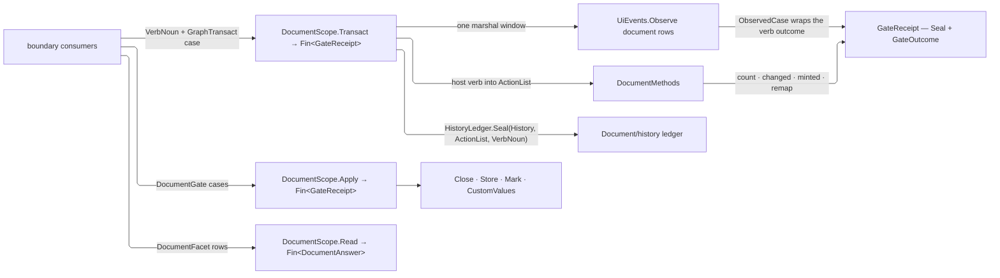

# [RASM_GRASSHOPPER_DOCUMENT_DOCUMENT]

`DocumentScope` is the document spine of the GH2 graph boundary — ONE scope operator owning document minting across the inert/inactive/active tiers, lifecycle and persistence settlement, the document's one typed keyed-value shelf, the closed inert-facet read, and THE one graph transaction gate absorbing the whole `DocumentMethods` verb surface. It also declares `GateReceipt` — the settlement evidence every gate in this folder mints.

Every mutation verb is a case of one `GraphTransact` union settled by one `Transact` gate pairing the host verb with its `Document/history.md` undo seal; the transaction window observes the document's own `Shell/events.md` rows, so every receipt wraps the host verb's own answer in the causal `UiEvent` deltas the mutation raised. Whole-graph selection state and per-selection posture are row families, clipboard and compose intent are case payloads, and every selection-scoped verb discriminates selection-versus-explicit on the shape of its object payload — the delete family adding depth (remove versus data-clear) as a second row axis on one case. Graph query and wire mutation are `Document/graph.md`'s operator, undo branching is `Document/history.md`'s ledger, and solution execution is `Document/solution.md`'s controller.

## [01]-[INDEX]

- [02]-[LIFECYCLE]: `DocumentTier` + `MarkPosture` + `DocumentFacet` + `DocumentAnswer` + `DocumentGate` + `GateOutcome` + `GateReceipt` + `DocumentScope` lifecycle gates — mint and archive-load rows, the lifecycle/persistence/keyed-state command union, the probe-gated archive read, the closed facet read, the folder's ONE settlement receipt, and the open-document roster.
- [03]-[TRANSACT]: `SelectionSweep` + `SelectionPosture` + `DeleteDepth` + `IsolationReach` + `GraphTransact` — the one graph transaction union over the `DocumentMethods` verb surface with its `*Selected`/`*Objects` twin grid, the wrap preflight, the seal law, and the causal-delta outcome.

## [02]-[LIFECYCLE]

- Owner: `DocumentTier` `[SmartEnum<int>]` — 3 mint rows over one `[UseDelegateFromConstructor]` `Mint()` column: `Inert` (key 0, `Document.NewInertDocument`), `Inactive` (key 1, `Document.NewInactiveDocument`), `Active` (key 2, `Document.NewActiveDocument`). Tier is data, so headless pipelines, background parsing, and canvas-bound editing mint through one gate. `MarkPosture` `[SmartEnum<int>]` carries the dirty flag as two rows over one `Stamp(HostDocument)` column — `Dirty` (`Modify`), `Clean` (`Unmodify`) — so the polarity is a named row, never a boolean payload the gate re-branches on. `DocumentGate` `[Union]` `[GenerateUnionOps]` closes the lifecycle command family: `CloseCase` (`Document.Close`), `StoreCase(IWriter, FileContents)` (`Document.Store` through the `GrasshopperIO` writer), `MarkCase(MarkPosture)`, `StashCase(string, IStorable)` (`KeyedValues.Set`), `ForgetCase(string)` (`KeyedValues.Delete`).
- Owner: `DocumentFacet` `[SmartEnum<int>]` — the closed inert-read vocabulary over one `Project(HostDocument) -> DocumentAnswer` column: `Identity`/`Hash` (both `Guid`), `Notes`, `Condition` (`DocumentState` + `Modifications` + `IsEmpty`, with `Modified` deriving from the count the host itself derives it from), `File` (`FileUtility`), `Display` (`DocumentDisplay`), `Dependencies` (`DocumentDependencies`), `NamedViews`, `Parent` (`Option<IDocumentParent>`), `Globals` (`GlobalServer`), `Projection` (the host's `(PointF centre, float zoom)` pair). `DocumentAnswer` `[Union]` is the closed result, one case per evidence shape.
- Owner: `GateReceipt` — the folder's ONE settlement evidence: the raising `Op`, the settled case name, the `Option<VerbNoun>` seal (present exactly when the act minted an undo record), the `GateOutcome` the host verb answered, and ordered entry/settlement stamps with elapsed latency from one `MonotonicTimeline`. `GateOutcome` `[Union]` closes what a host verb hands back — `SettledCase` (the verb answers nothing past the spine), `CountCase` (every `int`-returning selection and display verb and the graph-depth delete), `ClearedCase` (the data-depth delete's cleared count, typed apart so cleared never reads as removed), `ChangedCase` (the `bool`-returning drop and clipboard verbs), `MintedCase` (the instance id of a group, chain, cluster, or dependency the verb created), `RefusedCase` (the host's own why-not verdict from a preflighted wrap, settled with no seal), `RemapCase` (an id correspondence), `WirelessCase`, `RepairCase`, `RunCase`, and `ObservedCase` wrapping any of them with the causal window that watched it. `DocumentScope.Apply`/`Transact`, `GraphScope.Mutate`, `HistoryLedger.Commit`/`Seal`, and `SolutionControl.Drive` all settle into this one shape, so a claim fix lands once.
- Entry: `DocumentScope.Mint(DocumentTier tier, Op? key = null)` → `Fin<HostDocument>` — the value gate for new documents; `DocumentScope.Load(IReader reader, Op? key = null)` → `Fin<HostDocument>` — the archive mint over `Document(IReader)`, and `DocumentScope.ReadProbe<T>(IReader reader, string name, Op? key = null)` → `Fin<Option<T>>` — the probe-gated typed archive read; `DocumentScope.Apply(DocumentGate op, Option<HostDocument> graph = default, MonotonicTimeline? clock = null, Op? key = null)` → `Fin<GateReceipt>` — the command gate; `DocumentScope.Read(DocumentFacet facet, Option<HostDocument> graph = default, Op? key = null)` → `Fin<DocumentAnswer>` — the marshalled facet read; `DocumentScope.Recall<T>(string name, T fallback, ...)` → `Fin<T>` — the typed keyed read over `KeyedValues.Get<T>`; `DocumentScope.Roster(Op? key = null)` → `Fin<Seq<HostDocument>>` — the live `Document.AllDocuments` sweep.
- Law: absence of a target document is a modality, never an overload — `Option<HostDocument>` discriminates the supplied graph (a nested `Parent` child, an inactive mint) from the session-active document, and the absent branch resolves through `GhSession.Run(ScopeTarget.DocumentHost, ...)` so scope acquisition, marshalling, and null-gating stay the session page's one law.
- Law: every gate settles inside one UI marshal — a supplied document rides `EtoDispatch.Run`, an acquired one rides the session gate; the live `HostDocument` never crosses back out of a gate, because `Read` takes a `DocumentFacet` ROW and returns the row's own `DocumentAnswer` case. A caller lambda over the live document hands the graph itself to arbitrary code and voids that law from the signature down, so the facet space is a closed vocabulary rather than an open projection.
- Law: `Read` owns the INERT facets alone — the live sub-object properties are their own scopes (`Objects` is `Document/graph.md`'s `GraphScope`, `Undo` is `Document/history.md`'s ledger, `Solution` is `Document/solution.md`'s controller, `Methods` is `[03]`'s transaction gate), so a facet row handing one out forks four owners into a read.
- Law: keyed state is one shelf — `Document.CustomValues` is the host's only `KeyedValues` facet, so `Recall`/`StashCase`/`ForgetCase` name a string key and nothing else; a shelf selector over a one-inhabitant vocabulary carries no information the value cannot reconstruct.
- Law: `Apply` seals nothing and observes nothing by host design — lifecycle and shelf verbs (`Close`, `Store`, `Modify`/`Unmodify`, `KeyedValues.Set`/`Delete`) take no `ActionList` and mint no undo record on the host, so `Seal: None` states the host's own posture rather than a dropped obligation; the causal window belongs to `Transact`, whose graph verbs are what the document's event rows report.
- Law: the archive is symmetric on ONE axis — `Document.Store(IWriter[, FileContents])` writes and the deserialization constructor `Document(IReader)` reads, so the load posture is a MINT axis beside `DocumentTier`, never a `DocumentGate` case: a gate command mutates an existing document while a load MAKES one, and `DocumentScope.Load(IReader, Op?)` therefore sits beside `Mint` under the same value gate. `ReadProbe<T>` folds the catalog's own probe-gates-accessor law — `IReader.HasItemOrNode(name)` before `Storable<T>(name)` — so a missing archive entry is `None` and a malformed one is a typed fault, and every catalogued special object's `(IReader)` constructor becomes reachable through the same seam.
- Boundary: the shelf selector re-enters as a `[SmartEnum]` row family the moment the host publishes a second `KeyedValues` facet beside `CustomValues`; until then `Document.Globals` is a `GlobalServer` read through the `Globals` facet, not a second shelf.
- Boundary: autosave requests are per-object (`IDocumentObject.RequestAutoSave`) and ride `Document/history.md`'s ledger commands; document file-compare and editor reveal are `Shell/editor.md`'s shell surface; document-scoped caching keys off `Shell/session.md`'s `SessionCache` and evicts on the `Shell/events.md` close row.
- Packages: Grasshopper2 (`Document.New*Document`, `Close`, `Store`, `Modify`, `Unmodify`, `Identity`, `Hash`, `Notes`, `State`, `Modifications`, `IsEmpty`, `Projection`, `File`, `Display`, `Dependencies`, `NamedViews`, `Parent`, `Globals`, `CustomValues`, `AllDocuments`, `KeyedValues.Get<T>`/`Set`/`Delete`), GrasshopperIO (`IWriter`, `IReader.HasItemOrNode`/`Storable<T>`, `IStorable`), Eto (`PointF`), LanguageExt.Core, `Rasm.Domain`, `Rasm.Parametric` (`MonotonicTimeline`, `MonotonicStamp`).
- Growth: a new mint posture is one `DocumentTier` row and the archive mint stays the one `Load` entry; a new inert read is one `DocumentFacet` row with its `DocumentAnswer` case; a new host answer shape is one `GateOutcome` case; a new lifecycle verb is one `DocumentGate` case breaking the gate's total `Switch` loudly — zero new entrypoints on any axis.

```csharp signature
// --- [RUNTIME_PRELUDE] ----------------------------------------------------------------------
using Eto.Drawing;
using Grasshopper2.Doc;
using Grasshopper2.Undo;
using GrasshopperIO;
using Rasm.Domain;
using Rasm.Grasshopper.Eto;
using Rasm.Grasshopper.Shell;
using Rasm.Parametric;
using HostDocument = Grasshopper2.Doc.Document;

namespace Rasm.Grasshopper.Document;

// --- [TYPES] --------------------------------------------------------------------------------
[SmartEnum<int>]
public sealed partial class DocumentTier {
    public static readonly DocumentTier Inert = new(key: 0, mint: static () => HostDocument.NewInertDocument());
    public static readonly DocumentTier Inactive = new(key: 1, mint: static () => HostDocument.NewInactiveDocument());
    public static readonly DocumentTier Active = new(key: 2, mint: static () => HostDocument.NewActiveDocument());
    [UseDelegateFromConstructor] internal partial HostDocument Mint();
}

[SmartEnum<int>]
public sealed partial class MarkPosture {
    public static readonly MarkPosture Dirty = new(key: 0, stamp: static document => Op.Side(action: document.Modify));
    public static readonly MarkPosture Clean = new(key: 1, stamp: static document => Op.Side(action: document.Unmodify));
    [UseDelegateFromConstructor] internal partial Unit Stamp(HostDocument document);
}

[SmartEnum<int>]
public sealed partial class DocumentFacet {
    public static readonly DocumentFacet Identity = new(key: 0,
        project: static document => new DocumentAnswer.IdentityCase(Value: document.Identity));
    public static readonly DocumentFacet Hash = new(key: 1,
        project: static document => new DocumentAnswer.HashCase(Value: document.Hash));
    public static readonly DocumentFacet Notes = new(key: 2,
        project: static document => new DocumentAnswer.NotesCase(Value: document.Notes));
    public static readonly DocumentFacet Condition = new(key: 3,
        project: static document => new DocumentAnswer.ConditionCase(
            State: document.State, Modifications: document.Modifications, Empty: document.IsEmpty));
    public static readonly DocumentFacet File = new(key: 4,
        project: static document => new DocumentAnswer.FileCase(Accessor: document.File));
    public static readonly DocumentFacet Display = new(key: 5,
        project: static document => new DocumentAnswer.DisplayCase(Chrome: document.Display));
    public static readonly DocumentFacet Dependencies = new(key: 6,
        project: static document => new DocumentAnswer.DependenciesCase(Graph: document.Dependencies));
    public static readonly DocumentFacet NamedViews = new(key: 7,
        project: static document => new DocumentAnswer.ViewsCase(Views: document.NamedViews));
    public static readonly DocumentFacet Parent = new(key: 8,
        project: static document => new DocumentAnswer.ParentCase(Host: Optional(document.Parent)));
    public static readonly DocumentFacet Globals = new(key: 9,
        project: static document => new DocumentAnswer.GlobalsCase(Server: document.Globals));
    public static readonly DocumentFacet Projection = new(key: 10,
        project: static document => new DocumentAnswer.ProjectionCase(
            Centre: document.Projection.centre, Zoom: document.Projection.zoom));
    [UseDelegateFromConstructor] internal partial DocumentAnswer Project(HostDocument document);
}

[Union]
public abstract partial record DocumentAnswer {
    private DocumentAnswer() { }
    public sealed record IdentityCase(Guid Value) : DocumentAnswer;
    public sealed record HashCase(Guid Value) : DocumentAnswer;
    public sealed record NotesCase(string Value) : DocumentAnswer;
    public sealed record ConditionCase(DocumentState State, int Modifications, bool Empty) : DocumentAnswer {
        public bool Modified => Modifications > 0;
    }
    public sealed record FileCase(FileUtility Accessor) : DocumentAnswer;
    public sealed record DisplayCase(DocumentDisplay Chrome) : DocumentAnswer;
    public sealed record DependenciesCase(DocumentDependencies Graph) : DocumentAnswer;
    public sealed record ViewsCase(NamedViews Views) : DocumentAnswer;
    public sealed record ParentCase(Option<IDocumentParent> Host) : DocumentAnswer;
    public sealed record GlobalsCase(GlobalServer Server) : DocumentAnswer;
    public sealed record ProjectionCase(PointF Centre, float Zoom) : DocumentAnswer;
}

[Union]
[GenerateUnionOps]
public abstract partial record DocumentGate {
    private DocumentGate() { }
    public sealed record CloseCase : DocumentGate;
    public sealed record StoreCase(IWriter Writer, FileContents Contents) : DocumentGate;
    public sealed record MarkCase(MarkPosture Posture) : DocumentGate;
    public sealed record StashCase(string Name, IStorable Value) : DocumentGate;
    public sealed record ForgetCase(string Name) : DocumentGate;
}

[Union]
public abstract partial record GateOutcome {
    private GateOutcome() { }
    public sealed record SettledCase : GateOutcome;
    public sealed record CountCase(int Touched) : GateOutcome;
    public sealed record ClearedCase(int Cleared) : GateOutcome;
    public sealed record ChangedCase(bool Changed) : GateOutcome;
    public sealed record MintedCase(Guid Instance) : GateOutcome;
    public sealed record RefusedCase(string WhyNot) : GateOutcome;
    public sealed record RemapCase(HashMap<Guid, Guid> Correspondence) : GateOutcome;
    public sealed record WirelessCase(WirelessPair Pair) : GateOutcome;
    public sealed record RepairCase(Seq<PinRepairRow> Rows) : GateOutcome;
    public sealed record RunCase(RunPulse Pulse) : GateOutcome;
    public sealed record ObservedCase(Seq<UiEvent> Deltas, GateOutcome Verb) : GateOutcome;
}

// --- [MODELS] -------------------------------------------------------------------------------
[BoundaryAdapter, StructLayout(LayoutKind.Auto)]
public readonly record struct GateReceipt(
    Op Operation, string Verb, Option<VerbNoun> Seal, GateOutcome Outcome,
    MonotonicStamp Entered, MonotonicStamp Settled, TimeSpan Latency) : IValidityEvidence {
    public bool IsValid => ValidityClaim.All(
        ValidityClaim.Of(holds: !string.IsNullOrWhiteSpace(value: Verb)),
        ValidityClaim.Evidence(evidence: Entered),
        ValidityClaim.Evidence(evidence: Settled),
        ValidityClaim.Nonnegative(value: Latency.TotalSeconds));
}

// --- [OPERATIONS] ---------------------------------------------------------------------------
[BoundaryAdapter]
public static partial class DocumentScope {
    public static Fin<HostDocument> Mint(DocumentTier tier, Op? key = null) {
        Op active = key.OrDefault();
        return Optional(tier).ToFin(active.InvalidInput())
            .Bind(row => EtoDispatch.Run(body: () => active.Catch(body: () => Fin.Succ(row.Mint())), key: active));
    }

    public static Fin<HostDocument> Load(IReader reader, Op? key = null) {
        Op active = key.OrDefault();
        return Optional(reader).ToFin(active.InvalidInput())
            .Bind(archive => EtoDispatch.Run(body: () => active.Catch(body: () => Fin.Succ(new HostDocument(archive))), key: active));
    }

    public static Fin<Option<T>> ReadProbe<T>(IReader reader, string name, Op? key = null) where T : IStorable {
        Op active = key.OrDefault();
        return from archive in Optional(reader).ToFin(active.InvalidInput())
               from entry in Optional(name).Filter(static row => !string.IsNullOrWhiteSpace(row)).ToFin(active.InvalidInput())
               from held in active.Catch(body: () => Fin.Succ(archive.HasItemOrNode(entry)))
               from value in held
                   ? active.Catch(body: () => Fin.Succ(Optional(archive.Storable<T>(entry))))
                   : Fin.Succ(Option<T>.None)
               select value;
    }

    public static Fin<DocumentAnswer> Read(DocumentFacet facet, Option<HostDocument> graph = default, Op? key = null) {
        Op active = key.OrDefault();
        return Optional(facet).ToFin(active.InvalidInput())
            .Bind(row => Resolve(graph: graph, key: active, body: document =>
                active.Catch(body: () => Fin.Succ(row.Project(document: document)))));
    }

    public static Fin<T> Recall<T>(string name, T fallback, Option<HostDocument> graph = default, Op? key = null) {
        Op active = key.OrDefault();
        return from label in active.AcceptText(value: name)
               from value in Resolve(graph: graph, key: active, body: document =>
                   active.Catch(body: () => Fin.Succ(document.CustomValues.Get(label, fallback))))
               select value;
    }

    public static Fin<Seq<HostDocument>> Roster(Op? key = null) {
        Op active = key.OrDefault();
        return EtoDispatch.Run(body: () => active.Catch(body: () => Fin.Succ(toSeq(HostDocument.AllDocuments))), key: active);
    }

    public static Fin<GateReceipt> Apply(DocumentGate op, Option<HostDocument> graph = default, MonotonicTimeline? clock = null, Op? key = null) {
        Op active = key.OrDefault();
        return from valid in Optional(op).ToFin(active.InvalidInput())
               from timeline in clock is { } shared ? Fin.Succ(shared) : MonotonicTimeline.Of(provider: TimeProvider.System, key: active)
               from entered in timeline.Capture(key: active)
               from answer in Resolve(graph: graph, key: active, body: document => valid.Switch(
                state: (Key: active, Graph: document),
                closeCase: static (frame, _) => Answered(frame.Key, nameof(DocumentGate.CloseCase), () =>
                    (Op.Side(action: frame.Graph.Close), (GateOutcome)new GateOutcome.SettledCase()).Item2),
                storeCase: static (frame, c) => Answered(frame.Key, nameof(DocumentGate.StoreCase), () =>
                    (Op.Side(action: () => frame.Graph.Store(c.Writer, c.Contents)), (GateOutcome)new GateOutcome.SettledCase()).Item2),
                markCase: static (frame, c) => Answered(frame.Key, nameof(DocumentGate.MarkCase), () =>
                    (c.Posture.Stamp(document: frame.Graph), (GateOutcome)new GateOutcome.SettledCase()).Item2),
                stashCase: static (frame, c) => Answered(frame.Key, nameof(DocumentGate.StashCase), () =>
                    (Op.Side(action: () => frame.Graph.CustomValues.Set(c.Name, c.Value)), (GateOutcome)new GateOutcome.SettledCase()).Item2),
                forgetCase: static (frame, c) => Answered(frame.Key, nameof(DocumentGate.ForgetCase), () =>
                    (Op.Side(action: () => frame.Graph.CustomValues.Delete(c.Name)), (GateOutcome)new GateOutcome.SettledCase()).Item2)))
               from settled in timeline.Capture(key: active)
               from latency in timeline.Elapsed(start: entered, end: settled, key: active)
               select new GateReceipt(
                   Operation: active, Verb: answer.Verb, Seal: Option<VerbNoun>.None, Outcome: answer.Outcome,
                   Entered: entered, Settled: settled, Latency: latency);
    }

    internal static Fin<(string Verb, GateOutcome Outcome)> Answered(Op key, string verb, Func<GateOutcome> settle) =>
        key.Catch(body: () => Fin.Succ((Verb: verb, Outcome: settle())));

    internal static Fin<TOut> Resolve<TOut>(Option<HostDocument> graph, Op key, Func<HostDocument, Fin<TOut>> body) =>
        graph.Match(
            Some: chosen => EtoDispatch.Run(body: () => body(arg: chosen), key: key),
            None: () => GhSession.Run(
                target: ScopeTarget.DocumentHost,
                project: scope => scope.Document.ToFin(key.MissingContext()).Bind(body),
                key: key));
}
```

## [03]-[TRANSACT]

- Owner: `GraphTransact` `[Union]` `[GenerateUnionOps]` — THE one graph mutation vocabulary over the `DocumentMethods` verb surface. `SweepCase(SelectionSweep)` carries whole-graph selection state through an 8-row `[SmartEnum<int>]` — `All`/`None`/`Invert` over `SelectAll`/`DeselectAll`/`InvertSelection`, `ShiftUp`/`ShiftDown` over `ShiftSelection(upstream)`, and `GrowUp`/`GrowDown`/`GrowBoth` over `GrowSelection(upstream, downstream)` — each row returning the host's own touched count; `CopyCase(ClipboardKind)`/`CutCase(ClipboardKind)`/`PasteCase(ClipboardKind, PasteBehaviour)`/`PasteLegacyCase` own the clipboard round-trip including the GH1 XML ingest; `GroupCase(Option<string>, Option<OpenColor.Family>, Seq<IDocumentObject>)`/`ChainCase(Seq<IDocumentObject>)`/`ClusterCase(Seq<IDocumentObject>)` compose a roster into its three wrapper species — an empty payload wraps the live selection, an explicit set rides the host's `*Objects` twin, and an absent name lets the host auto-name the group — each surfacing the minted wrapper's instance id; `DeleteCase(DeleteDepth, Seq<IDocumentObject>, Seq<WireEnds>)` is the 2x2 delete family — scope (empty payload is the selection verb, explicit is its `*Objects` twin) by depth (`Graph` removes, `Data` clears persisted data) — each depth row projecting its own outcome case so cleared-versus-removed stays typed; `DropCase(IDocumentObject, PointF)`/`SnippetCase(Snippet, PointF)` place new material; `NudgeCase(int, int)` rides `MoveSelection`'s offset pair; `PostureCase(SelectionPosture, Seq<IDocumentObject>)` folds NINE host posture verbs — enablement, display, display toggle, and the four pin-side reveals — onto one 9-row column whose six twinned rows also serve an explicit set; `DressCase(Colour, Seq<IDocumentObject>)` applies the colour override to the selection or an explicit set; `IsolateCase(IDocumentObject, IsolationReach)` isolates one object over a named flag set; `MigrateCase(Seq<IDocumentObject>, PointF)` relocates a transferred set and returns the host's id correspondence; `DependencyCase(PointF)`/`RevealDependenciesCase` add and reveal document dependencies. Host discriminants — `ClipboardKind`, `PasteBehaviour`, `Colour`, `OpenColor.Family` — ride case payloads unchanged because this package IS the seam; a wrapper vocabulary per host enum is the parallel-owner defect re-minted.
- Entry: `DocumentScope.Transact(VerbNoun label, GraphTransact op, Option<HostDocument> graph = default, MonotonicTimeline? clock = null, Op? key = null)` → `Fin<GateReceipt>` — the one mutation gate. One verb and eighteen are the same call shape; the case is the discriminant, never a mode flag or a sibling method.
- Law: selection scope is payload shape — every selection-scoped case carries a `Seq<IDocumentObject>` whose emptiness selects the selection verb and whose contents ride the host's explicit-set `*Objects` twin, so a caller holding a computed set never round-trips it through host selection state. Rows with no host twin (the four pin-side reveals) refuse an explicit payload at admission with a typed refusal; a verb-twin sibling case is the deleted form.
- Law: chain and cluster wraps preflight through the host's own feasibility verdict — `CanCreateChain`/`CanCreateCluster(IEnumerable<IDocumentObject>, out string whyNot)` run on the same roster the mint consumes, inside the same marshal window, and a refusal settles `GateOutcome.RefusedCase(whyNot)` with no seal, so the null-product settle class over `ChainSelection`/`ClusterSelection` is unrepresentable. An empty payload preflights `ObjectList.SelectedObjects`.
- Law: a `Data`-depth delete carrying a wire span refuses at admission — `DeleteObjectData` takes no wire span by host design, so the payload shape is a caller defect the rail names, never a silently dropped span.
- Law: mutation and undo are one act — every mutating arm mints one `ActionList`, runs its host verb into it, and seals through `Document/history.md`'s `HistoryLedger.Seal(History, ActionList, VerbNoun, Op)` under the caller's `VerbNoun`, which the receipt then carries as `Seal: Some(label)`; the non-mutating arms (`SweepCase`, `CopyCase`, `RevealDependenciesCase`) settle with `Seal: None`. A `DocumentMethods` call outside this gate is the deleted form.
- Law: the receipt reports what the HOST answered — every `DocumentMethods` verb hands back a touched count, a changed flag, a minted wrapper, or an id map, and discarding it into a void side effect publishes a settled receipt over an unmeasured act. Each arm folds the host's own return into its `GateOutcome` case, so `Sealed: true` beside a zero-touch sweep is unrepresentable.
- Law: the outcome is causal — the transaction window attaches the document's own event rows (`UiSource.GraphObjectAdded`, `GraphObjectRemoved`, `GraphSelection`, `DocumentModified`) through `UiEvents.Observe` before the verb runs and wraps the verb's own outcome in `GateOutcome.ObservedCase` with every published `UiEvent`, so a consumer reads what the mutation did — objects added, removed, reselected, the modified flip — as typed evidence, never by re-diffing the graph. Its subscription lease dies inside the window; deltas are `UiEvent` values, and a second delta vocabulary re-projecting `UiFact` is the deleted form.
- Law: the window is atomic on the UI thread — observation attach, verb, seal, and delta fold share one marshal, so no delta from a concurrent mutation can interleave into this receipt.
- Law: receipt stamps order only within one timeline — a consumer correlating receipts across gates supplies the shared `clock`, and the per-call mint is the single-gate default, never a cross-gate ordering claim.
- Boundary: `MigrateCase` keeps its own explicit-set shape (`MigrateObjects` has no selection sibling), and `CopySelection`/`CutSelection` carry no `*Objects` twin on the host, so the clipboard cases stay selection-only until the host mints one.
- Boundary: wire mutation (`Connections`), id remapping, pins, and window selection are `Document/graph.md`'s operator — `SplitWire` rides there with the wire family it belongs to; canvas room-making (`MakeRoom`) is `Canvas/layout.md`'s arrangement solver; repaint intent after a transaction is `Shell/session.md`'s `RepaintCase`, composed by the consumer, never auto-fired here.
- Packages: Grasshopper2 (`DocumentMethods` verb surface with the `*Selected`/`*Objects` twin grid, `CanCreateChain`/`CanCreateCluster`, `ObjectList.SelectedObjects`, `ClipboardKind`, `PasteBehaviour`, `Snippet`, `WireEnds`, `Colour`, `OpenColor.Family`, `ActionList`), Eto (`PointF`), LanguageExt.Core, `Rasm.Domain`, `Shell/events.md` (`UiEvents`, `UiSource`, `EventAnchor`, `UiEvent`), `Document/history.md` (`HistoryLedger.Seal`), `Rasm.Parametric` (`MonotonicTimeline`, `MonotonicStamp`).
- Growth: a new document verb is one `GraphTransact` case whose `Switch` arm breaks the gate loudly; a new sweep, posture, or delete-depth verb is one row on its owning family; a new causal stream on the receipt is one `UiSource` row added to the observation set.

```csharp signature
// --- [RUNTIME_PRELUDE] ----------------------------------------------------------------------
using Eto.Drawing;
using Grasshopper2.Doc;
using Grasshopper2.Framework;
using Grasshopper2.Types.Colour;
using Grasshopper2.Undo;
using Rasm.Domain;
using Rasm.Grasshopper.Eto;
using Rasm.Grasshopper.Shell;
using Rasm.Parametric;
using HostDocument = Grasshopper2.Doc.Document;

namespace Rasm.Grasshopper.Document;

// --- [TYPES] --------------------------------------------------------------------------------
[SmartEnum<int>]
public sealed partial class SelectionSweep {
    public static readonly SelectionSweep All = new(key: 0, sweep: static verbs => verbs.SelectAll());
    public static readonly SelectionSweep None = new(key: 1, sweep: static verbs => verbs.DeselectAll());
    public static readonly SelectionSweep Invert = new(key: 2, sweep: static verbs => verbs.InvertSelection());
    public static readonly SelectionSweep ShiftUp = new(key: 3, sweep: static verbs => verbs.ShiftSelection(upstream: true));
    public static readonly SelectionSweep ShiftDown = new(key: 4, sweep: static verbs => verbs.ShiftSelection(upstream: false));
    public static readonly SelectionSweep GrowUp = new(key: 5, sweep: static verbs => verbs.GrowSelection(upstream: true, downstream: false));
    public static readonly SelectionSweep GrowDown = new(key: 6, sweep: static verbs => verbs.GrowSelection(upstream: false, downstream: true));
    public static readonly SelectionSweep GrowBoth = new(key: 7, sweep: static verbs => verbs.GrowSelection(upstream: true, downstream: true));
    [UseDelegateFromConstructor] internal partial int Sweep(DocumentMethods verbs);
}

// Six posture verbs publish explicit-set twins; the four pin-side reveals do not, so their `Explicit` column is
// null and the gate refuses an explicit payload on those rows with a typed refusal naming the axis.
[SmartEnum<int>]
public sealed partial class SelectionPosture {
    public static readonly SelectionPosture Enabled = new(key: 0,
        apply: static (verbs, actions) => verbs.EnableSelected(actions),
        explicitArm: static (verbs, objects, actions) => verbs.EnableObjects(objects, actions));
    public static readonly SelectionPosture Disabled = new(key: 1,
        apply: static (verbs, actions) => verbs.DisableSelected(actions),
        explicitArm: static (verbs, objects, actions) => verbs.DisableObjects(objects, actions));
    public static readonly SelectionPosture Shown = new(key: 2,
        apply: static (verbs, actions) => verbs.ShowSelected(actions),
        explicitArm: static (verbs, objects, actions) => verbs.ShowObjects(objects, actions));
    public static readonly SelectionPosture Hidden = new(key: 3,
        apply: static (verbs, actions) => verbs.HideSelected(actions),
        explicitArm: static (verbs, objects, actions) => verbs.HideObjects(objects, actions));
    public static readonly SelectionPosture Toggled = new(key: 4,
        apply: static (verbs, actions) => verbs.ToggleDisplaySelected(actions),
        explicitArm: static (verbs, objects, actions) => verbs.ToggleDisplayObjects(objects, actions));
    public static readonly SelectionPosture InputsShown = new(key: 5,
        apply: static (verbs, actions) => verbs.ShowSelectedInputs(actions), explicitArm: null);
    public static readonly SelectionPosture InputsHidden = new(key: 6,
        apply: static (verbs, actions) => verbs.HideSelectedInputs(actions), explicitArm: null);
    public static readonly SelectionPosture OutputsShown = new(key: 7,
        apply: static (verbs, actions) => verbs.ShowSelectedOutputs(actions), explicitArm: null);
    public static readonly SelectionPosture OutputsHidden = new(key: 8,
        apply: static (verbs, actions) => verbs.HideSelectedOutputs(actions), explicitArm: null);
    internal Func<DocumentMethods, IDocumentObject[], ActionList, int>? ExplicitArm { get; }
    [UseDelegateFromConstructor] internal partial int Apply(DocumentMethods verbs, ActionList actions);
}

// Depth is the second delete axis: `Graph` removes objects and wires, `Data` clears persisted data and leaves the
// object standing. Each row pairs its selection verb with its explicit-set twin and projects its own outcome case,
// so cleared-versus-removed stays typed at the receipt. `DeleteObjectData` takes no wire span by host design.
[SmartEnum<int>]
public sealed partial class DeleteDepth {
    public static readonly DeleteDepth Graph = new(key: 0,
        selected: static (verbs, actions) => verbs.DeleteSelection(actions),
        explicitArm: static (verbs, objects, wires, actions) => verbs.DeleteObjects(objects, wires, actions),
        outcome: static touched => new GateOutcome.CountCase(Touched: touched));
    public static readonly DeleteDepth Data = new(key: 1,
        selected: static (verbs, actions) => verbs.DeleteSelectionData(actions),
        explicitArm: static (verbs, objects, _, actions) => verbs.DeleteObjectData(objects, actions),
        outcome: static cleared => new GateOutcome.ClearedCase(Cleared: cleared));
    [UseDelegateFromConstructor] internal partial int Selected(DocumentMethods verbs, ActionList actions);
    [UseDelegateFromConstructor] internal partial int ExplicitArm(DocumentMethods verbs, IDocumentObject[] objects, WireEnds[] wires, ActionList actions);
    [UseDelegateFromConstructor] internal partial GateOutcome Outcome(int touched);
}

// The host names the three isolation axes by what each KEEPS reachable — `pins`, `inputs`, `outputs` — and forwards
// them positionally. Three bare bools at the call site carry neither the axis nor its order, and a drift between the
// spelling and the host's parameter list reads as correct at every review, so the flag set names both once.
[Flags]
public enum IsolationReach {
    None = 0,
    Pins = 1,
    Inputs = 2,
    Outputs = 4,
    All = Pins | Inputs | Outputs,
}

[Union]
[GenerateUnionOps]
public abstract partial record GraphTransact {
    private GraphTransact() { }
    public sealed record SweepCase(SelectionSweep Sweep) : GraphTransact;
    public sealed record CopyCase(ClipboardKind Kind) : GraphTransact;
    public sealed record CutCase(ClipboardKind Kind) : GraphTransact;
    public sealed record PasteCase(ClipboardKind Kind, PasteBehaviour Behaviour) : GraphTransact;
    public sealed record PasteLegacyCase : GraphTransact;
    public sealed record GroupCase(Option<string> Name, Option<OpenColor.Family> Colour, Seq<IDocumentObject> Objects) : GraphTransact;
    public sealed record ChainCase(Seq<IDocumentObject> Objects) : GraphTransact;
    public sealed record ClusterCase(Seq<IDocumentObject> Objects) : GraphTransact;
    public sealed record DeleteCase(DeleteDepth Depth, Seq<IDocumentObject> Objects, Seq<WireEnds> Wires) : GraphTransact;
    public sealed record DropCase(IDocumentObject Subject, PointF At) : GraphTransact;
    public sealed record SnippetCase(Snippet Payload, PointF At) : GraphTransact;
    public sealed record NudgeCase(int X, int Y) : GraphTransact;
    public sealed record PostureCase(SelectionPosture Posture, Seq<IDocumentObject> Objects) : GraphTransact;
    public sealed record DressCase(Colour Override, Seq<IDocumentObject> Objects) : GraphTransact;
    public sealed record IsolateCase(IDocumentObject Subject, IsolationReach Reach) : GraphTransact;
    public sealed record MigrateCase(Seq<IDocumentObject> Objects, PointF At) : GraphTransact;
    public sealed record DependencyCase(PointF At) : GraphTransact;
    public sealed record RevealDependenciesCase : GraphTransact;
}

// --- [OPERATIONS] ---------------------------------------------------------------------------
public static partial class DocumentScope {
    public static Fin<GateReceipt> Transact(VerbNoun label, GraphTransact op, Option<HostDocument> graph = default, MonotonicTimeline? clock = null, Op? key = null) {
        Op active = key.OrDefault();
        return from valid in Optional(op).ToFin(active.InvalidInput())
               from timeline in clock is { } shared ? Fin.Succ(shared) : MonotonicTimeline.Of(provider: TimeProvider.System, key: active)
               from entered in timeline.Capture(key: active)
               from answer in Resolve(graph: graph, key: active, body: document => Settle(document: document, op: valid, label: label, key: active))
               from settled in timeline.Capture(key: active)
               from latency in timeline.Elapsed(start: entered, end: settled, key: active)
               select new GateReceipt(
                   Operation: active, Verb: answer.Verb, Seal: answer.Seal, Outcome: answer.Outcome,
                   Entered: entered, Settled: settled, Latency: latency);
    }

    private static Fin<(string Verb, Option<VerbNoun> Seal, GateOutcome Outcome)> Settle(
        HostDocument document, GraphTransact op, VerbNoun label, Op key) {
        Atom<Seq<UiEvent>> observed = Atom(Seq<UiEvent>());
        return UiEvents.Observe(
                anchor: new EventAnchor.DocumentCase(Graph: document),
                publish: fact => ignore(observed.Swap(trail => trail.Add(fact))),
                key: key,
                rows: [UiSource.GraphObjectAdded, UiSource.GraphObjectRemoved, UiSource.GraphSelection, UiSource.DocumentModified])
            .Bind(watch => watch.Use(project: _ => Dispatch(document: document, op: op, label: label, key: key)))
            .Map(settled => (settled.Verb, settled.Seal,
                (GateOutcome)new GateOutcome.ObservedCase(Deltas: observed.Value, Verb: settled.Outcome)));
    }

    private static Fin<(string Verb, Option<VerbNoun> Seal, GateOutcome Outcome)> Dispatch(
        HostDocument document, GraphTransact op, VerbNoun label, Op key) =>
        op.Switch(
            state: (Key: key, Graph: document, Verbs: document.Methods, Ledger: document.Undo, Label: label),
            sweepCase: static (frame, c) => Free(frame.Key, nameof(GraphTransact.SweepCase),
                () => new GateOutcome.CountCase(Touched: c.Sweep.Sweep(verbs: frame.Verbs))),
            copyCase: static (frame, c) => Free(frame.Key, nameof(GraphTransact.CopyCase),
                () => new GateOutcome.ChangedCase(Changed: frame.Verbs.CopySelection(c.Kind))),
            cutCase: static (frame, c) => Bind(frame, nameof(GraphTransact.CutCase),
                (verbs, actions) => new GateOutcome.ChangedCase(Changed: verbs.CutSelection(c.Kind, actions))),
            pasteCase: static (frame, c) => Bind(frame, nameof(GraphTransact.PasteCase),
                (verbs, actions) => new GateOutcome.ChangedCase(Changed: verbs.PasteFromClipboard(c.Kind, c.Behaviour, actions))),
            pasteLegacyCase: static (frame, _) => Bind(frame, nameof(GraphTransact.PasteLegacyCase),
                static (verbs, actions) => new GateOutcome.ChangedCase(Changed: verbs.PasteGrasshopper1XmlFromClipboard(actions))),
            groupCase: static (frame, c) => Bind(frame, nameof(GraphTransact.GroupCase),
                (verbs, actions) => new GateOutcome.MintedCase(Instance: c.Objects.IsEmpty
                    ? verbs.GroupSelection(c.Name.ToNullable(), c.Colour.ToNullable(), actions).InstanceId
                    : verbs.GroupObjects(c.Objects.ToArray(), c.Name.ToNullable(), c.Colour.ToNullable(), actions).InstanceId)),
            chainCase: static (frame, c) => Wrap(frame, nameof(GraphTransact.ChainCase), c.Objects,
                preflight: static (verbs, roster) => (verbs.CanCreateChain(roster, out string whyNot), whyNot),
                mint: static (verbs, roster, actions) => roster.Length == 0
                    ? verbs.ChainSelection(actions).InstanceId
                    : verbs.ChainObjects(roster, actions).InstanceId),
            clusterCase: static (frame, c) => Wrap(frame, nameof(GraphTransact.ClusterCase), c.Objects,
                preflight: static (verbs, roster) => (verbs.CanCreateCluster(roster, out string whyNot), whyNot),
                mint: static (verbs, roster, actions) => roster.Length == 0
                    ? verbs.ClusterSelection(actions).InstanceId
                    : verbs.ClusterObjects(roster, actions).InstanceId),
            deleteCase: static (frame, c) => c.Depth == DeleteDepth.Data && !c.Wires.IsEmpty
                ? Fin.Fail<(string, Option<VerbNoun>, GateOutcome)>(frame.Key.InvalidInput())
                : Bind(frame, nameof(GraphTransact.DeleteCase),
                    (verbs, actions) => c.Depth.Outcome(touched: c.Objects.IsEmpty && c.Wires.IsEmpty
                        ? c.Depth.Selected(verbs: verbs, actions: actions)
                        : c.Depth.ExplicitArm(verbs: verbs, objects: c.Objects.ToArray(), wires: c.Wires.ToArray(), actions: actions))),
            dropCase: static (frame, c) => Bind(frame, nameof(GraphTransact.DropCase),
                (verbs, actions) => new GateOutcome.ChangedCase(Changed: verbs.DropObject(c.Subject, c.At, actions))),
            snippetCase: static (frame, c) => Bind(frame, nameof(GraphTransact.SnippetCase),
                (verbs, actions) => new GateOutcome.ChangedCase(Changed: verbs.DropSnippet(c.Payload, c.At, actions))),
            nudgeCase: static (frame, c) => Free(frame.Key, nameof(GraphTransact.NudgeCase),
                () => new GateOutcome.CountCase(Touched: frame.Verbs.MoveSelection(c.X, c.Y))),
            postureCase: static (frame, c) => c.Objects.IsEmpty
                ? Bind(frame, nameof(GraphTransact.PostureCase),
                    (verbs, actions) => new GateOutcome.CountCase(Touched: c.Posture.Apply(verbs: verbs, actions: actions)))
                : c.Posture.ExplicitArm is { } arm
                    ? Bind(frame, nameof(GraphTransact.PostureCase),
                        (verbs, actions) => new GateOutcome.CountCase(Touched: arm(verbs, c.Objects.ToArray(), actions)))
                    : Fin.Fail<(string, Option<VerbNoun>, GateOutcome)>(frame.Key.InvalidInput()),
            dressCase: static (frame, c) => Bind(frame, nameof(GraphTransact.DressCase),
                (verbs, actions) => new GateOutcome.CountCase(Touched: c.Objects.IsEmpty
                    ? verbs.SetColourOverrideSelected(c.Override, actions)
                    : verbs.SetColourOverrideObjects(c.Objects.ToArray(), c.Override, actions))),
            isolateCase: static (frame, c) => Bind(frame, nameof(GraphTransact.IsolateCase),
                (verbs, actions) => (Op.Side(action: () => verbs.IsolateObject(
                    c.Subject,
                    c.Reach.HasFlag(IsolationReach.Pins),
                    c.Reach.HasFlag(IsolationReach.Inputs),
                    c.Reach.HasFlag(IsolationReach.Outputs),
                    actions)), (GateOutcome)new GateOutcome.SettledCase()).Item2),
            migrateCase: static (frame, c) => Bind(frame, nameof(GraphTransact.MigrateCase),
                (verbs, actions) => new GateOutcome.RemapCase(Correspondence: toHashMap(
                    verbs.MigrateObjects(c.Objects, c.At, actions).Select(static row => (row.Key, row.Value))))),
            dependencyCase: static (frame, c) => Bind(frame, nameof(GraphTransact.DependencyCase),
                (verbs, actions) => new GateOutcome.MintedCase(Instance: verbs.AddDependency(c.At, actions).InstanceId)),
            revealDependenciesCase: static (frame, _) => Free(frame.Key, nameof(GraphTransact.RevealDependenciesCase),
                () => (Op.Side(action: frame.Verbs.ShowDependencyGraph), (GateOutcome)new GateOutcome.SettledCase()).Item2));

    private static Fin<(string Verb, Option<VerbNoun> Seal, GateOutcome Outcome)> Free(Op key, string verb, Func<GateOutcome> settle) =>
        key.Catch(body: () => Fin.Succ((Verb: verb, Seal: Option<VerbNoun>.None, Outcome: settle())));

    private static Fin<(string Verb, Option<VerbNoun> Seal, GateOutcome Outcome)> Bind(
        (Op Key, HostDocument Graph, DocumentMethods Verbs, History Ledger, VerbNoun Label) frame, string verb,
        Func<DocumentMethods, ActionList, GateOutcome> act) =>
        frame.Key.Catch(body: () => {
            ActionList actions = new();
            GateOutcome outcome = act(arg1: frame.Verbs, arg2: actions);
            return HistoryLedger.Seal(ledger: frame.Ledger, actions: actions, label: frame.Label, key: frame.Key)
                .Map(_ => (Verb: verb, Seal: Some(frame.Label), Outcome: outcome));
        });

    // Preflight-gated wrap: the host's own feasibility verdict runs on the same roster the mint consumes, inside the
    // same marshal window, so a refused wrap settles `RefusedCase(whyNot)` with NO seal — nothing mutated — and the
    // null-product settle class is unrepresentable. An empty payload preflights the live selection roster.
    private static Fin<(string Verb, Option<VerbNoun> Seal, GateOutcome Outcome)> Wrap(
        (Op Key, HostDocument Graph, DocumentMethods Verbs, History Ledger, VerbNoun Label) frame, string verb,
        Seq<IDocumentObject> objects,
        Func<DocumentMethods, IDocumentObject[], (bool Can, string WhyNot)> preflight,
        Func<DocumentMethods, IDocumentObject[], ActionList, Guid> mint) =>
        frame.Key.Catch(body: () => {
            IDocumentObject[] roster = objects.IsEmpty ? [.. frame.Graph.Objects.SelectedObjects] : objects.ToArray();
            return preflight(arg1: frame.Verbs, arg2: roster) switch {
                (false, var whyNot) => Fin.Succ((Verb: verb, Seal: Option<VerbNoun>.None,
                    Outcome: (GateOutcome)new GateOutcome.RefusedCase(WhyNot: whyNot))),
                _ => Fold(),
            };
            Fin<(string Verb, Option<VerbNoun> Seal, GateOutcome Outcome)> Fold() {
                ActionList actions = new();
                GateOutcome outcome = new GateOutcome.MintedCase(Instance: mint(arg1: frame.Verbs, arg2: objects.IsEmpty ? [] : roster, arg3: actions));
                return HistoryLedger.Seal(ledger: frame.Ledger, actions: actions, label: frame.Label, key: frame.Key)
                    .Map(_ => (Verb: verb, Seal: Some(frame.Label), Outcome: outcome));
            }
        });
}
```


```mermaid
---
config:
  layout: elk
  flowchart:
    curve: linear
    padding: 25
---
flowchart LR
    accTitle: One transaction gate pairs verb, seal, and causal deltas
    accDescr: Boundary consumers enter DocumentScope through the Transact, Apply, and Read gates; Transact attaches document event observation, runs the host verb into an ActionList, seals through the history ledger, and wraps the host's own answer with the published UiEvent deltas in one GateReceipt.
    Consumer["boundary consumers"] -->|"VerbNoun + GraphTransact case"| Gate["DocumentScope.Transact → Fin&lt;GateReceipt&gt;"]
    Consumer -->|DocumentGate cases| Apply["DocumentScope.Apply → Fin&lt;GateReceipt&gt;"]
    Consumer -->|DocumentFacet rows| Read["DocumentScope.Read → Fin&lt;DocumentAnswer&gt;"]
    Gate -->|one marshal window| Observe["UiEvents.Observe document rows"]
    Gate -->|"host verb into ActionList"| Verbs["DocumentMethods"]
    Gate -->|"HistoryLedger.Seal(History, ActionList, VerbNoun)"| Ledger["Document/history ledger"]
    Verbs -->|"count · changed · minted · remap"| Receipt["GateReceipt — Seal + GateOutcome"]
    Observe -->|"ObservedCase wraps the verb outcome"| Receipt
    Apply --> Facets["Close · Store · Mark · CustomValues"]
```

## [04]-[DENSITY_BAR]

| [INDEX] | [CONCERN]           | [OWNER]                            | [RAIL]                          | [CASES] |
| :-----: | :------------------ | :--------------------------------- | :------------------------------ | :-----: |
|  [01]   | document minting    | `DocumentTier`                     | `Mint → Fin<HostDocument>`      |    3    |
|  [02]   | dirty polarity      | `MarkPosture`                      | `Stamp → Unit` (internal)       |    2    |
|  [03]   | lifecycle commands  | `DocumentGate`                     | `Apply → Fin<GateReceipt>`      |    5    |
|  [04]   | inert facet read    | `DocumentFacet` + `DocumentAnswer` | `Read → Fin<DocumentAnswer>`    | 11 + 11 |
|  [05]   | settlement evidence | `GateReceipt` + `GateOutcome`      | folder-wide receipt             |   11    |
|  [06]   | selection sweep     | `SelectionSweep`                   | `Sweep → int` (internal)        |    8    |
|  [07]   | selection posture   | `SelectionPosture`                 | `Apply → int` + explicit column |    9    |
|  [08]   | delete depth        | `DeleteDepth`                      | selected/explicit/outcome rows  |    2    |
|  [09]   | graph transaction   | `GraphTransact`                    | `Transact → Fin<GateReceipt>`   |   18    |

- [01]-[DOCUMENT_MINTING]: `[SmartEnum<int>]` mint rows.
- [02]-[DIRTY_POLARITY]: `[SmartEnum<int>]` rows over the host's flag pair.
- [03]-[LIFECYCLE_COMMANDS]: `[GenerateUnionOps]` `[Union]` over one keyed shelf.
- [04]-[INERT_FACET_READ]: closed row family → closed answer union, no caller lambda.
- [05]-[SETTLEMENT_EVIDENCE]: one spine, one seal option, one outcome union — every gate in the folder.
- [06]-[SELECTION_SWEEP]: `[SmartEnum<int>]` delegate rows returning the host count.
- [07]-[SELECTION_POSTURE]: `[SmartEnum<int>]` rows over nine host posture verbs, six carrying the explicit-set twin.
- [08]-[DELETE_DEPTH]: `[SmartEnum<int>]` rows pairing selection verb, explicit twin, and typed outcome per depth.
- [09]-[GRAPH_TRANSACTION]: `[GenerateUnionOps]` `[Union]` + causal-delta outcome.

`GhSession`, `EtoDispatch`, `UiEvents`, `HistoryLedger.Seal`, `Op`, `Fault`, `Lease<T>`, and `ValidityClaim` are composed upstream owners; every retired verb-roster capability lands as the cases and rows above.

## [05]-[RESEARCH]

<!-- source-only: research row template:
[TOKEN]-[OPEN|BLOCKED]: <exact question>; <verification route>.
[SPLIT_MEMBER]-[OPEN]: does `shape-core` expose `split_all`; verify against the member rail.
-->

(none)
