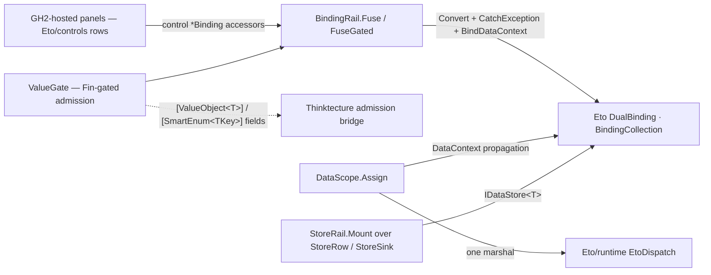

# [RASM_GRASSHOPPER_ETO_BINDING]

The two-way data rail of the Grasshopper boundary — one binding operator (`BindingRail`) fusing an Eto control property to a model value through the host `IndirectBinding<T>`/`BindableBinding<T,TValue>`/`DualBinding<T>` machinery, one model-lens family (`ModelLens<TValue>`) minting the model-side binding, one admission gate (`ValueGate<TRaw,TModel>`) running every control-to-model write through a `Fin`-gated conversion so a `[ValueObject<T>]` or `[SmartEnum<TKey>]` field binds without a stringly round-trip, one data-context owner (`DataScope`) marshalling ambient model assignment onto the UI thread, and one collection-store family (`StoreRow`) filling grid/list/tree views through `IDataStore<T>` carriers. No census source touches this territory — the page is pure host-capability buildout: every future GH2 panel, options dialog, and property editor composes these rows instead of hand-wiring `PropertyChanged` observers, per-control sync handlers, or manual per-row view rebuilds, all three of which are the deleted forms the host binding surface already obsoletes.

`BindMode` carries direction as a policy row over the host `DualBindingMode`; `Convert`/`Child`/`CatchException` reshape and guard the projection on the control side; `DataContext` propagation walks the control tree so one `DataScope.Assign` feeds every `BindDataContext`-bound descendant. Faults land on the kernel rail: a refused admission renders through the gate's fallback policy, a conversion exception traps through `CatchException` and re-lands as a typed `Fault`, and every rail entry is `Op`-keyed.

## [01]-[INDEX]

- [02]-[LENS]: `BindMode` + `ModelLens<TValue>` — the direction policy rows and the model-side binding family (named property, child drill).
- [03]-[GATE]: `ValueGate<TRaw,TModel>` + `GatePolicy<TRaw>` — the admission-through-`Convert` seam turning a control primitive into an admitted domain value and back.
- [04]-[RAIL]: `BindingReceipt` + `BindingRail` + `DataScope` — the fuse gates onto `DualBinding<T>`, the settlement receipt, and the marshalled `DataContext` owner.
- [05]-[STORE]: `StoreRow<T>` + `StoreSink` + `StoreRail` — the `IDataStore<T>` collection carriers and the one mount gate over grid, list, and tree sinks.

## [02]-[LENS]

- Owner: `BindMode` `[SmartEnum<int>]` — 4 rows carrying the host `DualBindingMode` as a `Native` column: `Mirror` (key 0, `TwoWay`), `Project` (key 1, `OneWay`, model-to-control), `Collect` (key 2, `OneWayToSource`, control-to-model), `Manual` (key 3, deferred to an explicit update). Direction is a policy row a plan carries as data — a boolean pair or a per-direction method family is the deleted form.
- Owner: `ModelLens<TValue>` `[Union]` — the model-side binding family: `NamedCase(string Property)` mints the reflected `PropertyBinding<TValue>`; `DelegateCase(Func<object, TValue> Get, Option<Action<object, TValue>> Put, Option<string> Notify)` mints a `DelegateBinding<object, TValue>` — the notify member selects the change-notifying constructor so a `INotifyPropertyChanged` model updates the control without a reflected name; `ChildCase(ModelLens<object> Parent, ModelLens<TValue> Member)` drills a nested model value through the host `IndirectBinding<T>.Child` composition, so no flattening view-model copy exists. `ToBinding()` projects the case onto the host `IndirectBinding<TValue>` in one dispatch.
- Law: the lens names the model member through `nameof` at every call site — a string literal restating a property the program already knows is the deleted form the `SYMBOLIC_REFERENCE` law kills.
- Packages: Eto (`PropertyBinding<T>`, `DelegateBinding<T,TValue>`, `IndirectBinding<T>.Child`, `DualBindingMode`), `Rasm.Domain`.
- Growth: a new model-side access shape is one `ModelLens` case plus one `ToBinding` arm.

## [03]-[GATE]

- Owner: `ValueGate<TRaw,TModel>` readonly record struct — the one admission seam between a control primitive and a domain value: `Render` (total, model-to-control) and `Admit` (`Fin`-gated, control-to-model). `GatePolicy<TRaw>` `[Union]` decides the refused-write posture: `HoldCase` re-renders the last admitted model value (the control snaps back), `FallbackCase(TModel)` substitutes a named value. The gate compiles onto the host `Convert(toValue, fromValue)` pair — the `toValue` direction folds `Admit` and the policy into one total function because `Convert` demands totality, and the fault evidence lands on the gate's `LastFault` atom for the owning screen to project.
- Law: the gate is where Thinktecture meets Eto — a `[ValueObject<T>]` binds as `ValueGate.Of(render: static owner => (T)owner, admit: static raw => Owner.Validate(...) …)` through the folder's admission bridge, and a `[SmartEnum<TKey>]` binds its key with the row's `Get`/`TryGet` as the admit arm; hand-rolled parse-on-commit handlers beside the gate are the deleted form.
- Law: `CatchException<TException>(Func<TException, bool>)` guards the projection for host-thrown conversion faults — the handler records the `Error` on the same atom and answers `true` for handled — so an uncaught cast escaping a binding into the Eto event pump is the defect this trap forecloses.
- Packages: Eto (`BindableBinding<T,TValue>.Convert`/`CatchException`), LanguageExt.Core (`Fin`, `Atom`), `Rasm.Domain` (`Op`, `Fault`).
- Growth: a new refusal posture is one `GatePolicy` case; the gate record never widens.

## [04]-[RAIL]

- Owner: `BindingRail` — the fuse operator. `Fuse<TOwner,TValue>` joins a control's `BindableBinding` to a `ModelLens` under a `BindMode` through `BindDataContext`, returning the live `DualBinding<TValue>` inside a `BindingReceipt`; `FuseGated<TOwner,TRaw,TModel>` composes a `ValueGate` in front — `Convert` reshapes, `CatchException` traps, then the same `BindDataContext` fuse — so the admitted-model overload and the primitive overload are one rail with the gate as the only difference. `BindingReceipt<TValue>` carries the raising `Op`, the live `DualBinding<TValue>`, and the mode row; the owning `IBindable`'s `BindingCollection` holds the link's lifetime, and the receipt is evidence, never a second lifetime owner.
- Owner: `DataScope` — the ambient-model owner: `Assign(IBindable root, object model, Op?)` sets `DataContext` inside one `EtoDispatch` marshal so propagation and binding updates run on the UI thread per the host law; assignment on a container feeds every bound descendant, which is what makes per-control source wiring the deleted form.
- Entry: `BindingRail.Fuse(...)` → `Fin<BindingReceipt<TValue>>`; `BindingRail.FuseGated(...)` → `Fin<BindingReceipt<TModel>>` — the receipt carries the admitted-model `DualBinding` the `Convert` chain produced; `DataScope.Assign(...)` → `Fin<Unit>`. Three gates, one owner.
- Law: every fuse marshals through `EtoDispatch.Run` — binding construction touches live control state; every default value a `BindDataContext` overload demands enters as an explicit plan value, never a `default(T)` ghost.
- Boundary: control `*Binding` accessors (`TextBox.TextBinding`, `CheckBox.CheckedBinding`, `NumericStepper.ValueBinding`, `Slider.ValueBinding`, `Grid.SelectedItemBinding`) are the `BindableBinding` ingresses this rail consumes; the controls themselves are `Eto/controls.md`'s generator rows, composed from disk.
- Packages: Eto (`BindableExtensions.BindDataContext`, `BindableBinding<T,TValue>.BindDataContext`/`Convert`/`Child`/`CatchException`, `DualBinding<T>`, `IBindable.DataContext`), `Rasm.Domain`, `Eto/runtime.md` (`EtoDispatch`).
- Growth: a new projection shape (cast, child-of-child) is one private compose step inside the fuse; the gates never multiply.

```csharp signature
// --- [RUNTIME_PRELUDE] ----------------------------------------------------------------------
using Rasm.Csp;

namespace Rasm.Grasshopper.Eto;

// --- [TYPES] --------------------------------------------------------------------------------
[SmartEnum<int>]
public sealed partial class BindMode {
    public static readonly BindMode Mirror = new(key: 0, native: DualBindingMode.TwoWay);
    public static readonly BindMode Project = new(key: 1, native: DualBindingMode.OneWay);
    public static readonly BindMode Collect = new(key: 2, native: DualBindingMode.OneWayToSource);
    public static readonly BindMode Manual = new(key: 3, native: DualBindingMode.Manual);
    public DualBindingMode Native { get; }
}

[Union]
public abstract partial record ModelLens<TValue> {
    private ModelLens() { }
    public sealed record NamedCase(string Property) : ModelLens<TValue>;
    public sealed record DelegateCase(Func<object, TValue> Get, Option<Action<object, TValue>> Put, Option<string> Notify) : ModelLens<TValue>;
    public sealed record ChildCase(ModelLens<object> Parent, ModelLens<TValue> Member) : ModelLens<TValue>;
    public IndirectBinding<TValue> ToBinding() => Switch(
        namedCase: static c => (IndirectBinding<TValue>)new PropertyBinding<TValue>(c.Property),
        delegateCase: static c => c.Notify.MatchUnsafe(
            Some: notify => new DelegateBinding<object, TValue>(
                getValue: c.Get, setValue: c.Put.MatchUnsafe(Some: static put => put, None: static () => null), notifyProperty: notify),
            None: () => new DelegateBinding<object, TValue>(
                getValue: c.Get, setValue: c.Put.MatchUnsafe(Some: static put => put, None: static () => null))),
        childCase: static c => c.Parent.ToBinding().Child(binding: c.Member.ToBinding()));
    public static ModelLens<TValue> Named(string property) => new NamedCase(Property: property);
}

[Union]
public abstract partial record GatePolicy<TRaw> {
    private GatePolicy() { }
    public sealed record HoldCase : GatePolicy<TRaw>;
    public sealed record FallbackCase(TRaw Value) : GatePolicy<TRaw>;
}

// --- [MODELS] -------------------------------------------------------------------------------
[BoundaryAdapter, StructLayout(LayoutKind.Auto)]
public readonly record struct ValueGate<TRaw, TModel>(Func<TModel, TRaw> Render, Func<TRaw, Fin<TModel>> Admit) {
    public static Fin<ValueGate<TRaw, TModel>> Of(Func<TModel, TRaw> render, Func<TRaw, Fin<TModel>> admit, Op? key = null) {
        Op op = key.OrDefault();
        return from renderArm in op.Need(render)
               from admitArm in op.Need(admit)
               select new ValueGate<TRaw, TModel>(Render: renderArm, Admit: admitArm);
    }
}

public sealed record BindingReceipt<TValue>(Op Operation, BindMode Mode, DualBinding<TValue> Live, Atom<Option<Error>> LastFault);

// --- [OPERATIONS] ---------------------------------------------------------------------------
[BoundaryAdapter]
public static class BindingRail {
    public static Fin<BindingReceipt<TValue>> Fuse<TOwner, TValue>(
        BindableBinding<TOwner, TValue> control, ModelLens<TValue> model, BindMode mode,
        TValue controlDefault, TValue modelDefault, Op? key = null)
        where TOwner : IBindable {
        Op op = key.OrDefault();
        return from lens in op.Need(model)
               from row in op.Need(mode)
               from live in EtoDispatch.Run(body: () => op.Catch(body: () => Fin.Succ(
                   control.BindDataContext(lens.ToBinding(), row.Native, controlDefault, modelDefault))), key: op)
               select new BindingReceipt<TValue>(Operation: op, Mode: row, Live: live, LastFault: Atom(Option<Error>.None));
    }

    public static Fin<BindingReceipt<TModel>> FuseGated<TOwner, TRaw, TModel>(
        BindableBinding<TOwner, TRaw> control, ValueGate<TRaw, TModel> gate, GatePolicy<TRaw> policy,
        ModelLens<TModel> model, BindMode mode, TModel modelDefault, Op? key = null)
        where TOwner : IBindable {
        Op op = key.OrDefault();
        Atom<Option<Error>> faults = Atom(Option<Error>.None);
        Atom<Option<TModel>> held = Atom(Option<TModel>.None);
        return from lens in op.Need(model)
               from row in op.Need(mode)
               from live in EtoDispatch.Run(body: () => op.Catch(body: () => Fin.Succ(
                   control
                       .Convert(
                           toValue: raw => gate.Admit(arg: raw).Match(
                               Succ: admitted => { ignore(held.Swap(_ => Some(admitted))); return admitted; },
                               Fail: error => {
                                   ignore(faults.Swap(_ => Some(error)));
                                   return policy.Switch(
                                       state: (Held: held, Fallback: modelDefault, Gate: gate),
                                       holdCase: static (s, _) => s.Held.Value.IfNone(s.Fallback),
                                       fallbackCase: (s, c) => s.Gate.Admit(arg: c.Value).IfFail(s.Fallback));
                               }),
                           fromValue: admitted => gate.Render(arg: admitted))
                       .CatchException<Exception>(exceptionHandler: exception => {
                           ignore(faults.Swap(_ => Some(Error.New(exception))));
                           return true;
                       })
                       .BindDataContext(lens.ToBinding(), row.Native))), key: op)
               select new BindingReceipt<TModel>(Operation: op, Mode: row, Live: live, LastFault: faults);
    }
}

[BoundaryAdapter]
public static class DataScope {
    public static Fin<Unit> Assign(IBindable root, object model, Op? key = null) {
        Op op = key.OrDefault();
        return from target in op.Need(root)
               from value in op.Need(model)
               from assigned in EtoDispatch.Run(body: () => op.Catch(body: () => Fin.Succ(Op.Side(action: () => target.DataContext = value))), key: op)
               select assigned;
    }
}
```

## [05]-[STORE]

- Owner: `StoreRow<T>` `[Union]` (`T : class`) — the collection-carrier family: `EagerCase(DataStoreCollection<T>)` for fully-materialized observable sources whose mutations refresh the bound view, and `VirtualCase(IDataStore<T>)` for large or lazily-materialized window contracts (`Count` + indexer), adapted at mount through `DataStoreVirtualCollection<T>`. Both project through one `ToStore()` dispatch onto the `IEnumerable<object>` carrier the host `DataStore` properties demand — `IDataStore<T>` never reaches a view directly. The tree carrier is the non-generic `TreeCase` on `StoreSink` because `TreeGridView.DataStore` demands `ITreeGridStore<ITreeGridItem>` — the item contract, not the element type, discriminates it.
- Owner: `StoreSink` `[Union]` — where a store mounts: `GridCase(GridView)`, `ListCase(ListControl, Option<StoreItemLens>)`, `TreeCase(TreeGridView, ITreeGridStore<ITreeGridItem>)`. `StoreItemLens` carries the list projections — `ItemTextBinding`/`ItemKeyBinding` as `IIndirectBinding<string>` values minted through `ModelLens` — so display text and key travel as data on the mount, never as per-view subclassing.
- Entry: `StoreRail.Mount<T>(StoreSink sink, Option<StoreRow<T>> rows, Op? key = null)` → `Fin<Unit>` — one gate; the tree case carries its own store so `rows` is `None` there and the arity stays honest.
- Law: mutation flows through the mounted `DataStoreCollection<T>` — the view refreshes from collection change, and rebuilding controls per row is the deleted form; a snapshot source that never mutates still mounts as `EagerCase` because the carrier, not the mutation rate, is the contract.
- Law: mounting marshals through `EtoDispatch.Run`; a background producer feeds the collection only through the same marshal, because the mounted carriers bind UI-affine state.
- Packages: Eto (`DataStoreCollection<T>`, `DataStoreVirtualCollection<T>`, `IDataStore<T>`, `ITreeGridStore<T>`, `ITreeGridItem`, `GridView.DataStore`, `ListControl.DataStore`/`ItemTextBinding`/`ItemKeyBinding`, `TreeGridView.DataStore`), `Rasm.Domain`, `Eto/runtime.md` (`EtoDispatch`).
- Growth: a new sink kind is one `StoreSink` case plus one mount arm; a new carrier is one `StoreRow` case.

```csharp signature
// --- [RUNTIME_PRELUDE] ----------------------------------------------------------------------
using Rasm.Csp;

namespace Rasm.Grasshopper.Eto;

// --- [TYPES] --------------------------------------------------------------------------------
[Union]
public abstract partial record StoreRow<T> where T : class {
    private StoreRow() { }
    public sealed record EagerCase(DataStoreCollection<T> Rows) : StoreRow<T>;
    public sealed record VirtualCase(IDataStore<T> Store) : StoreRow<T>;
    public IEnumerable<object> ToStore() => Switch(
        eagerCase: static c => (IEnumerable<object>)c.Rows,
        virtualCase: static c => new DataStoreVirtualCollection<T>(store: c.Store));
}

// --- [MODELS] -------------------------------------------------------------------------------
public sealed record StoreItemLens(Option<IIndirectBinding<string>> Text, Option<IIndirectBinding<string>> Key);

[Union]
public abstract partial record StoreSink {
    private StoreSink() { }
    public sealed record GridCase(GridView View) : StoreSink;
    public sealed record ListCase(ListControl View, Option<StoreItemLens> Lens) : StoreSink;
    public sealed record TreeCase(TreeGridView View, ITreeGridStore<ITreeGridItem> Store) : StoreSink;
}

// --- [OPERATIONS] ---------------------------------------------------------------------------
[BoundaryAdapter]
public static class StoreRail {
    public static Fin<Unit> Mount<T>(StoreSink sink, Option<StoreRow<T>> rows, Op? key = null) where T : class {
        Op op = key.OrDefault();
        return op.Need(sink).Bind(valid => EtoDispatch.Run(body: () => valid.Switch(
            state: (Rows: rows, Key: op),
            gridCase: static (s, c) => s.Key.Need(s.Rows).Bind(store => s.Key.Catch(body: () =>
                Fin.Succ(Op.Side(action: () => c.View.DataStore = store.ToStore())))),
            listCase: static (s, c) => s.Key.Need(s.Rows).Bind(store => s.Key.Catch(body: () =>
                Fin.Succ(Op.Side(action: () => {
                    c.View.DataStore = store.ToStore();
                    c.Lens.Iter(lens => {
                        lens.Text.Iter(text => c.View.ItemTextBinding = text);
                        lens.Key.Iter(itemKey => c.View.ItemKeyBinding = itemKey);
                    });
                })))),
            treeCase: static (s, c) => s.Key.Catch(body: () =>
                Fin.Succ(Op.Side(action: () => c.View.DataStore = c.Store)))), key: op));
    }
}
```



## [06]-[DENSITY_BAR]

| [INDEX] | [CONCERN]           | [OWNER]                                  | [KIND]                                              | [RAIL]                                     | [CASES] |
| :-----: | :------------------ | :---------------------------------------- | :---------------------------------------------------- | :------------------------------------------- | :-----: |
|  [01]   | direction policy    | `BindMode`                               | `[SmartEnum<int>]` over `DualBindingMode`           | row data                                   |    4    |
|  [02]   | model lens          | `ModelLens<TValue>`                      | generic `[Union]` → `IndirectBinding<TValue>`       | `ToBinding()`                              |    3    |
|  [03]   | admission gate      | `ValueGate<TRaw,TModel>` + `GatePolicy`  | gated conversion pair + refusal-posture union       | `Of → Fin<ValueGate>`                      |    2    |
|  [04]   | fuse + context      | `BindingRail` + `DataScope`              | two fuse gates + one marshalled context owner       | `Fuse`/`FuseGated`/`Assign` → `Fin<T>`     |    3    |
|  [05]   | collection stores   | `StoreRow<T>` + `StoreSink` + `StoreRail` | carrier + sink unions, one mount gate               | `Mount → Fin<Unit>`                        |    5    |

`Op`, `Fault`, `Atom`, `EtoDispatch`, and the Thinktecture admission bridge are composed upstream owners. Every host binding member on this page — the `DelegateBinding` constructor triple, `Convert(toValue, fromValue)`, `CatchException(Func<TException, bool>)`, `IndirectBinding<T>.Child`, and the `IEnumerable<object>` `DataStore` carriers — is decompile-fixed.
