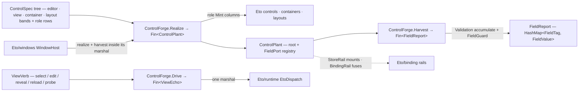

# [RASM_GRASSHOPPER_ETO_CONTROLS]

The native-control generator of the Grasshopper boundary — one recursive `ControlSpec` `[Union]` covering the full installed `Eto.Forms` construction surface (text, masked, numeric, flag, choice, slider, colour, stamp, calendar, path, font, rich-text, label, button, image, progress, browser, property-sheet, native-host, grid, tree, list, group, expander, tabs, document, split, scroll, and the four layout owners), one typed capture vocabulary (`FieldTag` + `FieldValue` + `FieldGuard`) replacing the census `FormField` nine-shape roster and its object-valued capture, and one generator fold (`ControlForge.Realize`) that renders any spec tree into a live control plant with a tagged harvest registry. Modality variation lives in role rows — `TextRole`, `ChoiceRole`, `ButtonRole`, `ProgressRole`, `CellKind` — so a masked entry, a segmented picker, or a radio group is a row value on one case, never a sibling case or a hand-written control roster. Construction rows are dispatch-free: `Realize` and `Harvest` are pure construction and read folds the presenting owner (`Eto/windows.md`) runs inside its one `EtoDispatch` marshal window; the interactive grid/tree verb family (`ViewVerb`) is the one surface on this page that marshals itself. Every fallible step rides an `Op`-keyed `Fin<T>` rail; independent field harvests accumulate through `Validation` before the report seals. Live data mounts through `Eto/binding.md`'s `StoreRail` and model state fuses through `BindingRail` against the plant's tagged editors; this page owns construction and capture only.

## [01]-[INDEX]

- [02]-[VALUE]: `FieldTag` + `FieldValue` + `FieldGuard` + `FieldReport` — the semantic-field identity, the one typed capture union, the `Fin`-gated admission policy, and the sealed harvest evidence.
- [03]-[ROWS]: `TextRole` + `ChoiceRole` + `ButtonRole` + `ProgressRole` + `CellKind` and the policy records (`TextPolicy`, `NumberPolicy`, `SliderPolicy`, `ColumnPlan`, `GridPlan`, `TabPlan`, `StackChild`) — the row vocabularies one generator dispatches on.
- [04]-[SPEC]: `ControlSpec` — the one recursive construction union: editor cases with intrinsic capture, display and trigger cases, data-view cases, container cases, layout cases, and the `FieldCase` tag wrapper.
- [05]-[FORGE]: `FieldPort` + `ControlPlant` + `ControlForge` + `ViewVerb`/`ViewEcho` — the realize fold, the accumulating harvest, and the marshalled grid/tree verb gate.

## [02]-[VALUE]

- Owner: `FieldTag` `[ValueObject<string>]` — the semantic field identity: ordinal, trimmed, non-blank. Every capturable editor is addressed by tag; a raw string key beside the owner is the deleted form. `FieldValue` `[Union]` is the one typed capture vocabulary — `TextCase`, `MarkupCase` (RTF), `NumberCase`, `FlagCase` (tri-state), `PickCase` (single choice: index plus text), `PickSetCase` (multi choice: selected keys), `ColourCase`, `StampCase`, `SpanCase` (date range: start plus end), `PathCase`, `FontCase` — killing the census object-valued `FormField.Capture` and its per-consumer casts. `FieldGuard` carries the admission policy as one `Fin`-gated arm over the captured value, so validation is a policy value on the field row, never a parse-on-commit handler beside the control.
- Owner: `FieldReport` — the sealed harvest evidence: the raising `Op` plus the tag-keyed value map, with `Value(FieldTag)` the one read. A report exists only when every guarded field admitted; the accumulated refusal is the report's `Fault` evidence, never a half-filled map. Validity is structural — the seal is the proof, so a confirm-only plant harvests an empty map as first-class evidence and the claim fold carries no row.
- Law: guards run inside the harvest, after the typed pick and before the report seals — a guard sees a `FieldValue`, never a control — so the same guard row serves a dialog commit, a live binding gate, and a scripted capture identically.
- Packages: LanguageExt.Core (`Fin`, `HashMap`, `Option`), `Rasm.Domain` (`Op`, `ValidityClaim`, `IValidityEvidence`).
- Growth: a new capture shape is one `FieldValue` case plus the pick arm on the owning editor case; the guard and report shapes never widen.

```csharp signature
// --- [RUNTIME_PRELUDE] ----------------------------------------------------------------------
using Rasm.Csp;

namespace Rasm.Grasshopper.Eto;

// --- [TYPES] --------------------------------------------------------------------------------
[ValueObject<string>]
public readonly partial struct FieldTag {
    static partial void ValidateFactoryArguments(ref ValidationError? validationError, ref string value) {
        value = value?.Trim() ?? string.Empty;
        validationError = value.Length > 0 ? null : new ValidationError(message: "FieldTag requires a non-blank identity.");
    }
}

[Union]
public abstract partial record FieldValue {
    private FieldValue() { }
    public sealed record TextCase(string Value) : FieldValue;
    public sealed record MarkupCase(string Rtf) : FieldValue;
    public sealed record NumberCase(double Value) : FieldValue;
    public sealed record FlagCase(Option<bool> Value) : FieldValue;
    public sealed record PickCase(int Index, string Text) : FieldValue;
    public sealed record PickSetCase(Seq<string> Keys) : FieldValue;
    public sealed record ColourCase(Color Value) : FieldValue;
    public sealed record StampCase(Option<DateTime> Value) : FieldValue;
    public sealed record SpanCase(DateTime Start, DateTime End) : FieldValue;
    public sealed record PathCase(Option<string> Value) : FieldValue;
    public sealed record FontCase(Font Value) : FieldValue;
}

// --- [MODELS] -------------------------------------------------------------------------------
public sealed record FieldGuard(Func<FieldValue, Fin<FieldValue>> Admit);

public sealed record FieldReport(Op Operation, HashMap<FieldTag, FieldValue> Values) : IValidityEvidence {
    public bool IsValid => ValidityClaim.All();
    public Option<FieldValue> Value(FieldTag tag) => Values.Find(tag);
}
```

## [03]-[ROWS]

- Owner: `TextRole` `[SmartEnum<int>]` — 5 rows over one `[UseDelegateFromConstructor]` `Mint(string, TextPolicy)` column returning the host `TextControl` base: `Plain` (`TextBox`), `Secret` (`PasswordBox`), `Search` (`SearchBox`), `Area` (`TextArea`), `Stepped` (`TextStepper`, the step-arrow text field; its `Step` raise is a `Shell/events.md` source row). Every row reads back through the one `TextControl.Text` member, so capture is role-invariant and a per-role pick family never exists. `TextPolicy` carries the knob set as data — placeholder, max length, read-only on the box rows; wrap, spell-check, return/tab acceptance on the area row — each row applying only the knobs its control owns.
- Owner: `ChoiceRole` `[SmartEnum<int>]` — 6 rows over two columns, `Mint(Seq<string>, int, Orientation)` and `Read(Control, Seq<string>)`: `Drop` (`DropDown`), `Combo` (`ComboBox` with `AutoComplete`, free text riding `ComboBox.Text`), `RadioSet` (`RadioButtonList` on its `Orientation`), `Segments` (`SegmentedButton` under `SegmentedSelectionMode.Single` over `ButtonSegmentedItem` rows), `CheckSet` (`CheckBoxList`, multi-select reading `SelectedKeys` into `PickSetCase`), `SegmentSet` (`SegmentedButton` under `SegmentedSelectionMode.Multiple`, reading `SelectedIndexes` into `PickSetCase`). One case, six presentations, two capture shapes — the census single-`DropDown` choice arm and the missing multi-selects are absorbed as rows.
- Owner: `ButtonRole` `[SmartEnum<int>]` — `Push` (`Button`), `Toggle` (`ToggleButton`, intrinsic `FlagCase` pick over `Checked`), `Link` (`LinkButton`); `ProgressRole` — `Track` (`ProgressBar`, absent fraction folds to `Indeterminate`), `Pulse` (`Spinner`); `CellKind` — 6 property-bound cell rows (`Script`→`TextBoxCell`, `Mark`→`CheckBoxCell`, `Pick`→`ComboBoxCell`, `Figure`→`ImageViewCell`, `Gauge`→`ProgressCell`, `Duo`→`ImageTextCell` over its image and text properties) over one `Mint(string, Option<string>)` column feeding `GridColumn.DataCell`.
- Owner: the plan records — `NumberPolicy` (bounds, increment, decimal places, format, wrap over `NumericStepper`), `SliderPolicy` (tick frequency, snap, orientation), `ColumnPlan` (header, cell row, bound property, the `Duo` image property, edit/sort/resize/visible/expand bits, width, header tip), `GridPlan` (columns plus the `ShowHeader`/`AllowMultipleSelection`/`AllowColumnReordering`/`RowHeight`/`GridLines` posture), `TabPlan` (title, badge image, body spec), `DocumentPlan` (title, closable bit, badge image, body spec), `StackChild` (spec plus stretch bit).
- Law: a row's `Mint` composes only members the row's control owns — the generator never probes control type at dispatch, because the row IS the dispatch. A new presentation of an existing semantic (a sixth text chrome, a seventh choice surface) is one row; a new semantic is one `ControlSpec` case. `Stepper` (the bare arrow pair, value-free) and the `[Obsolete]` `NumericUpDown` alias earn no row — the first carries no capture semantic, the second is a legacy spelling of `NumericStepper`.
- Law: owner-drawn and templated cells (`DrawableCell`, `CustomCell`) enter `CellKind` as two rows when their paint/create hook spellings land — RESEARCH; the six property-bound rows carry every declarative column today, and a `Duo` column without an image property folds its image binding onto the text property.
- Packages: Eto (`TextBox`, `PasswordBox`, `SearchBox`, `TextArea`, `TextStepper`, `TextControl.Text`, `DropDown`, `ComboBox.Text`/`AutoComplete`, `RadioButtonList`, `SegmentedButton.Items`/`SelectionMode`/`SelectedIndex`/`SelectedIndexes`, `ButtonSegmentedItem`, `SegmentedItem.Text`, `CheckBoxList.SelectedKeys`, `ListControl.Items`/`SelectedIndex`, `Button`, `ToggleButton.Checked`, `LinkButton`, `ProgressBar`, `Spinner`, the `Cell` family with `ImageTextCell`, `GridColumn`, `GridLines`, `Orientation`, `DockPosition`, `BorderType`), `Rasm.Domain`.
- Growth: a role row per new chrome, a plan field per new knob; the column signatures never widen.

```csharp signature
// --- [RUNTIME_PRELUDE] ----------------------------------------------------------------------
using Rasm.Csp;

namespace Rasm.Grasshopper.Eto;

// --- [TYPES] --------------------------------------------------------------------------------
[SmartEnum<int>]
public sealed partial class TextRole {
    public static readonly TextRole Plain = new(key: 0, mint: static (seed, policy) => {
        TextBox box = new() { Text = seed, ReadOnly = policy.ReadOnly };
        policy.Placeholder.Iter(hint => box.PlaceholderText = hint);
        policy.MaxLength.Iter(cap => box.MaxLength = cap);
        return box;
    });
    public static readonly TextRole Secret = new(key: 1, mint: static (seed, policy) => {
        PasswordBox box = new() { Text = seed };
        policy.MaxLength.Iter(cap => box.MaxLength = cap);
        return box;
    });
    public static readonly TextRole Search = new(key: 2, mint: static (seed, policy) => {
        SearchBox box = new() { Text = seed, ReadOnly = policy.ReadOnly };
        policy.Placeholder.Iter(hint => box.PlaceholderText = hint);
        return box;
    });
    public static readonly TextRole Area = new(key: 3, mint: static (seed, policy) => new TextArea {
        Text = seed, Wrap = policy.Wrap, SpellCheck = policy.SpellCheck,
        AcceptsReturn = policy.AcceptsReturn, AcceptsTab = policy.AcceptsTab,
    });
    public static readonly TextRole Stepped = new(key: 4, mint: static (seed, policy) => {
        TextStepper box = new() { Text = seed, ReadOnly = policy.ReadOnly };
        policy.Placeholder.Iter(hint => box.PlaceholderText = hint);
        policy.MaxLength.Iter(cap => box.MaxLength = cap);
        return box;
    });
    [UseDelegateFromConstructor] internal partial TextControl Mint(string seed, TextPolicy policy);
}

[SmartEnum<int>]
public sealed partial class ChoiceRole {
    public static readonly ChoiceRole Drop = new(key: 0,
        mint: static (options, selected, _) => Seeded(control: new DropDown(), options: options, selected: selected),
        read: static (control, options) => Picked(index: ((ListControl)control).SelectedIndex, options: options));
    public static readonly ChoiceRole Combo = new(key: 1,
        mint: static (options, selected, _) => Seeded(control: new ComboBox { AutoComplete = true }, options: options, selected: selected),
        read: static (control, _) => new FieldValue.PickCase(Index: ((ComboBox)control).SelectedIndex, Text: ((ComboBox)control).Text));
    public static readonly ChoiceRole RadioSet = new(key: 2,
        mint: static (options, selected, axis) => {
            RadioButtonList list = new() { Orientation = axis };
            options.Iter(option => list.Items.Add(option));
            list.SelectedIndex = options.IsEmpty ? -1 : int.Clamp(value: selected, min: 0, max: options.Count - 1);
            return list;
        },
        read: static (control, options) => Picked(index: ((RadioButtonList)control).SelectedIndex, options: options));
    public static readonly ChoiceRole Segments = new(key: 3,
        mint: static (options, selected, _) => {
            SegmentedButton bar = new() { SelectionMode = SegmentedSelectionMode.Single };
            options.Iter(option => bar.Items.Add(new ButtonSegmentedItem { Text = option }));
            bar.SelectedIndex = options.IsEmpty ? -1 : int.Clamp(value: selected, min: 0, max: options.Count - 1);
            return bar;
        },
        read: static (control, options) => Picked(index: ((SegmentedButton)control).SelectedIndex, options: options));
    public static readonly ChoiceRole CheckSet = new(key: 4,
        mint: static (options, _, axis) => {
            CheckBoxList list = new() { Orientation = axis };
            options.Iter(option => list.Items.Add(option));
            return list;
        },
        read: static (control, _) => new FieldValue.PickSetCase(Keys: toSeq(((CheckBoxList)control).SelectedKeys)));
    public static readonly ChoiceRole SegmentSet = new(key: 5,
        mint: static (options, selected, _) => {
            SegmentedButton bar = new() { SelectionMode = SegmentedSelectionMode.Multiple };
            options.Iter(option => bar.Items.Add(new ButtonSegmentedItem { Text = option }));
            bar.SelectedIndexes = selected >= 0 && selected < options.Count ? [selected] : [];
            return bar;
        },
        read: static (control, options) => new FieldValue.PickSetCase(
            Keys: toSeq(((SegmentedButton)control).SelectedIndexes).Map(index => options[index])));
    [UseDelegateFromConstructor] internal partial Control Mint(Seq<string> options, int selected, Orientation axis);
    [UseDelegateFromConstructor] internal partial FieldValue Read(Control control, Seq<string> options);
    private static ListControl Seeded(ListControl control, Seq<string> options, int selected) {
        options.Iter(option => control.Items.Add(option));
        control.SelectedIndex = options.IsEmpty ? -1 : int.Clamp(value: selected, min: 0, max: options.Count - 1);
        return control;
    }
    private static FieldValue Picked(int index, Seq<string> options) =>
        new FieldValue.PickCase(Index: index, Text: index >= 0 && index < options.Count ? options[index] : string.Empty);
}

[SmartEnum<int>]
public sealed partial class ButtonRole {
    public static readonly ButtonRole Push = new(key: 0, mint: static text => new Button { Text = text }, captures: false);
    public static readonly ButtonRole Toggle = new(key: 1, mint: static text => new ToggleButton { Text = text }, captures: true);
    public static readonly ButtonRole Link = new(key: 2, mint: static text => new LinkButton { Text = text }, captures: false);
    public bool Captures { get; }
    [UseDelegateFromConstructor] internal partial Control Mint(string text);
}

[SmartEnum<int>]
public sealed partial class ProgressRole {
    public static readonly ProgressRole Track = new(key: 0, mint: static (fraction, floor, ceiling) => {
        ProgressBar bar = new() { MinValue = floor, MaxValue = ceiling, Indeterminate = fraction.IsNone };
        fraction.Iter(value => bar.Value = int.Clamp(value: value, min: floor, max: ceiling));
        return bar;
    });
    public static readonly ProgressRole Pulse = new(key: 1, mint: static (_, _, _) => new Spinner { Enabled = true });
    [UseDelegateFromConstructor] internal partial Control Mint(Option<int> fraction, int floor, int ceiling);
}

[SmartEnum<int>]
public sealed partial class CellKind {
    public static readonly CellKind Script = new(key: 0, mint: static (property, _) => new TextBoxCell(property));
    public static readonly CellKind Mark = new(key: 1, mint: static (property, _) => new CheckBoxCell(property));
    public static readonly CellKind Pick = new(key: 2, mint: static (property, _) => new ComboBoxCell(property));
    public static readonly CellKind Figure = new(key: 3, mint: static (property, _) => new ImageViewCell(property));
    public static readonly CellKind Gauge = new(key: 4, mint: static (property, _) => new ProgressCell(property));
    public static readonly CellKind Duo = new(key: 5, mint: static (property, icon) =>
        new ImageTextCell(imageProperty: icon.IfNone(property), textProperty: property));
    [UseDelegateFromConstructor] internal partial Cell Mint(string property, Option<string> icon);
}

// --- [MODELS] -------------------------------------------------------------------------------
public sealed record TextPolicy(
    Option<string> Placeholder, Option<int> MaxLength, bool ReadOnly,
    bool Wrap, bool SpellCheck, bool AcceptsReturn, bool AcceptsTab) {
    public static readonly TextPolicy Default = new(
        Placeholder: None, MaxLength: None, ReadOnly: false,
        Wrap: true, SpellCheck: false, AcceptsReturn: true, AcceptsTab: false);
}

public sealed record NumberPolicy(
    Option<double> Floor, Option<double> Ceiling, double Increment, int DecimalPlaces, Option<string> Format, bool Wrap) {
    public static readonly NumberPolicy Default = new(
        Floor: None, Ceiling: None, Increment: 1.0, DecimalPlaces: 2, Format: None, Wrap: false);
}

public sealed record SliderPolicy(int TickFrequency, bool Snap, Orientation Axis) {
    public static readonly SliderPolicy Default = new(TickFrequency: 0, Snap: false, Axis: Orientation.Horizontal);
}

public sealed record ColumnPlan(
    string Header, CellKind Kind, string Property, Option<string> Icon, bool Editable, Option<int> Width,
    bool Sortable, bool Resizable, bool Visible, bool Expand, Option<string> Tip);

public sealed record GridPlan(
    Seq<ColumnPlan> Columns, bool ShowHeader, bool AllowMultipleSelection,
    bool AllowColumnReordering, Option<int> RowHeight, GridLines Lines);

public sealed record TabPlan(string Title, Option<Image> Badge, ControlSpec Body);

public sealed record DocumentPlan(string Title, bool Closable, Option<Image> Badge, ControlSpec Body);

public sealed record StackChild(ControlSpec Item, bool Stretch);
```

## [04]-[SPEC]

- Owner: `ControlSpec` — the one recursive construction `[Union]`: the editor band with intrinsic typed capture (`TextCase`, `MaskedCase` over `FixedMaskedTextProvider`, `NumberCase`, `FlagCase`, `ChoiceCase`, `SliderCase`, `ColourCase`, `StampCase`, `CalendarCase` — single or range mode, picking `StampCase` or `SpanCase` by its `Span` bit — `PathCase`, `FontCase`, `RichTextCase`), the display and trigger band (`LabelCase`, `ButtonCase`, `ImageCase`, `ProgressCase`, `BrowserCase`, `SheetCase`, `NativeHostCase`), the data-view band (`GridCase`, `TreeCase`, `ListCase`), the container band (`GroupCase`, `ExpanderCase`, `TabsCase`, `DocumentCase` — closable, reorderable document pages — `SplitCase`, `ScrollCase`), the layout band (`StackCase`, `TableCase`, `PixelCase`, `RowsCase`), and the `FieldCase` wrapper that tags any capturing editor with a `FieldTag`, an optional inline label, and an optional `FieldGuard`. The census `FormField` roster is this union's editor band; every family the installed surface carries beyond the census roster is admitted as a case.
- Law: recursion is case-owned — container and layout cases nest `ControlSpec` payloads, so the generated `Switch` stays total over arbitrary depth and a new structural case breaks the forge fold at compile time.
- Law: `FieldCase` is the only tag site — an editor case outside a `FieldCase` renders but never harvests, and a `FieldCase` over a non-capturing case is a typed forge refusal, so "which values come back" is recoverable from the spec value alone.
- Law: a `RowsCase` row slot is `Option<ControlSpec>` — `None` renders the host's flexible-space `null` slot in `DynamicLayout.AddRow`, so button rows right-align by data, never by a spacer control.
- Law: `TreeView` and `Panel` earn no case — a single-column tree is a one-column `TreeCase` and a padded single-child wrapper is a one-child `StackCase`; masked stepping (`MaskedTextStepper<T>`) enters as a stepper bit on `MaskedCase` when its constructor spelling lands — RESEARCH.
- Boundary: live data (`DataStore`), model fusion (`*Binding`), and selection state ride `Eto/binding.md`'s `StoreRail` and `BindingRail` against the realized plant; `WebView` navigation verbs (`Url`, `GoBack`, `ExecuteScript`, `LoadHtml`, `DocumentTitle`) ride the realized control directly; owner-drawn `Drawable` surfaces are the canvas paint executor's territory, never a spec case.
- Packages: Eto (`MaskedTextBox`, `FixedMaskedTextProvider`, `NumericStepper`, `CheckBox`, `Slider`, `ColorPicker`, `DateTimePicker`, `Calendar.Mode`/`SelectedDate`/`SelectedRange`/`MinDate`/`MaxDate`, `CalendarMode`, `Range<DateTime>.Start`/`End`, `FilePicker`, `FontPicker`, `RichTextArea.Rtf`, `Label`, `ImageView.Image`, `WebView.Url`, `PropertyGrid.SelectedObject`, `NativeControlHost`, `GridView`, `TreeGridView`, `ListBox`, `GroupBox`, `Expander.Header`/`Expanded`, `TabControl`, `TabPage`, `DocumentControl.Pages`/`AllowReordering`/`SelectedIndex`, `DocumentPage.Text`/`Closable`/`Image`, `Splitter`, `Scrollable`, `StackLayout.Padding`/`HorizontalContentAlignment`/`VerticalContentAlignment`, `StackLayoutItem`, `TableLayout`, `PixelLayout`, `DynamicLayout`, `Padding`, `Size`, `Point`), `Rasm.Domain`.
- Growth: a new native family is one case plus one forge arm; a new modality of an existing family is a role row; zero growth lands as a consumer-visible operation.

```csharp signature
// --- [RUNTIME_PRELUDE] ----------------------------------------------------------------------
using Rasm.Csp;

namespace Rasm.Grasshopper.Eto;

// --- [TYPES] --------------------------------------------------------------------------------
[Union]
public abstract partial record ControlSpec {
    private ControlSpec() { }

    public sealed record TextCase(TextRole Role, string Seed, TextPolicy Policy) : ControlSpec;
    public sealed record MaskedCase(string Mask, string Seed) : ControlSpec;
    public sealed record NumberCase(double Seed, NumberPolicy Policy) : ControlSpec;
    public sealed record FlagCase(Option<bool> Seed, bool ThreeState, string Caption) : ControlSpec;
    public sealed record ChoiceCase(ChoiceRole Role, Seq<string> Options, int Selected, Orientation Axis) : ControlSpec;
    public sealed record SliderCase(int Seed, int Floor, int Ceiling, SliderPolicy Policy) : ControlSpec;
    public sealed record ColourCase(Color Seed, bool AllowAlpha) : ControlSpec;
    public sealed record StampCase(Option<DateTime> Seed, Option<DateTime> Floor, Option<DateTime> Ceiling) : ControlSpec;
    public sealed record CalendarCase(Option<DateTime> Seed, Option<DateTime> Floor, Option<DateTime> Ceiling, bool Span) : ControlSpec;
    public sealed record PathCase(Option<string> Seed) : ControlSpec;
    public sealed record FontCase(Font Seed) : ControlSpec;
    public sealed record RichTextCase(string Rtf) : ControlSpec;

    public sealed record LabelCase(string Text) : ControlSpec;
    public sealed record ButtonCase(ButtonRole Role, string Text) : ControlSpec;
    public sealed record ImageCase(Image Source) : ControlSpec;
    public sealed record ProgressCase(ProgressRole Role, Option<int> Fraction, int Floor, int Ceiling) : ControlSpec;
    public sealed record BrowserCase(Option<Uri> Home) : ControlSpec;
    public sealed record SheetCase(object Subject) : ControlSpec;
    public sealed record NativeHostCase(object NativeView) : ControlSpec;

    public sealed record GridCase(GridPlan Plan) : ControlSpec;
    public sealed record TreeCase(GridPlan Plan) : ControlSpec;
    public sealed record ListCase(Seq<string> Seed, BorderType Border) : ControlSpec;

    public sealed record GroupCase(string Title, ControlSpec Content) : ControlSpec;
    public sealed record ExpanderCase(bool Expanded, Option<ControlSpec> Header, ControlSpec Content) : ControlSpec;
    public sealed record TabsCase(Seq<TabPlan> Pages, DockPosition Edge, int Selected) : ControlSpec;
    public sealed record DocumentCase(Seq<DocumentPlan> Pages, bool Reorder, int Selected) : ControlSpec;
    public sealed record SplitCase(ControlSpec First, ControlSpec Second, Orientation Axis, Option<int> Position, Option<int> Gutter) : ControlSpec;
    public sealed record ScrollCase(ControlSpec Content, BorderType Border, bool ExpandWidth, bool ExpandHeight) : ControlSpec;

    public sealed record StackCase(Orientation Axis, int Gap, Padding Pad, Option<HorizontalAlignment> AlignX, Option<VerticalAlignment> AlignY, Seq<StackChild> Items) : ControlSpec;
    public sealed record TableCase(int Columns, int Rows, Seq<(ControlSpec Item, int X, int Y)> Cells, Seq<int> StretchColumns, Seq<int> StretchRows, Padding Pad, Size Gap) : ControlSpec;
    public sealed record PixelCase(Seq<(ControlSpec Item, Point At)> Placements) : ControlSpec;
    public sealed record RowsCase(Padding Pad, Size Gap, Seq<Seq<Option<ControlSpec>>> Rows) : ControlSpec;

    public sealed record FieldCase(FieldTag Tag, Option<string> Label, ControlSpec Editor, Option<FieldGuard> Guard) : ControlSpec;
}
```

## [05]-[FORGE]

- Owner: `ControlForge` — the one generator fold. `Realize(ControlSpec, Op?)` grows the spec tree bottom-up into a `ControlPlant`: the live root control plus the `FieldPort` registry (tag, realized editor, guarded pick closure). Each editor arm mints through its role row and closes a typed pick over the concrete control; `FieldCase` lifts the child's intrinsic pick into a tagged port — composing the guard, wrapping the editor beside its inline label through the host's string-to-`StackLayoutItem` conversion — and refuses a pickless child typed. Duplicate tags refuse at the seal, so a plant's registry is injective by construction.
- Owner: `ControlForge.Harvest` — the accumulating capture: every port picks, every guard admits, and independent refusals fold through the `Validation` applicative so a six-field dialog reports all six faults in one pass; the sealed `FieldReport` is the only success shape. `ViewVerb` `[Union]` + `Drive` is the marshalled grid/tree verb gate — selection mutation, inline-edit lifecycle (`BeginEdit`/`CommitEdit`/`CancelEdit`), scroll-reveal, tree reload, and point hit-testing as cases over one `Fin<ViewEcho>` rail — the one surface on this page that marshals itself, because verbs run against live view state.
- Entry: `ControlForge.Realize(ControlSpec spec, Op? key = null)` → `Fin<ControlPlant>`; `ControlForge.Harvest(ControlPlant plant, Op? key = null)` → `Fin<FieldReport>`; `ControlForge.Drive(Grid view, ViewVerb verb, Op? key = null)` → `Fin<ViewEcho>`.
- Law: `Realize` and `Harvest` are dispatch-free — the presenting owner runs both inside its one `EtoDispatch` marshal window, so construction, show, and capture share one UI-thread window and a spec row never marshals itself; `Drive` marshals through `EtoDispatch.Run` because its verbs mutate live view state outside any presentation window.
- Law: picks never throw — every pick closure runs under `Op.Catch` inside the harvest, a disposed or host-rejected control read lands as a typed `Fault`, and the `RefreshCase`/`ProbeCase` verbs refuse a non-tree view with `Fault.Unsupported` instead of a downcast throw.
- Boundary: `GridView`/`TreeGridView`/`ListBox` data mounts through `StoreRail`, selection fusion through `Grid.SelectedItemBinding` under `BindingRail`; the drop-target and cell-edit event streams (`CellEditing`/`CellEdited`/`CellClick`, drag lifecycle), the calendar raises (`SelectedDateChanged`/`SelectedRangeChanged`), and the document-page lifecycle (`PageClosing`/`PageClosed`/`PageReordered`) are `Shell/events.md` source rows observed on the realized control, never forge state.
- Packages: Eto (the [03]/[04] rosters plus `Grid.SelectRow`/`UnselectRow`/`SelectAll`/`UnselectAll`/`BeginEdit`/`CommitEdit`/`CancelEdit`/`ScrollToRow`/`IsEditing`, `TreeGridView.ReloadData`/`ReloadItem`/`GetCellAt`, `TreeGridCell`, `ITreeGridItem`), LanguageExt.Core (`Fin`, `Validation`, `Seq`, `HashMap`), `Rasm.Domain` (`Op`, `Fault`), `Eto/runtime.md` (`EtoDispatch`).
- Growth: a new spec case is one `Grow` arm breaking loudly; a new view verb is one `ViewVerb` case plus one `Drive` arm; the three gates never widen.

```csharp signature
// --- [RUNTIME_PRELUDE] ----------------------------------------------------------------------
using Rasm.Csp;

namespace Rasm.Grasshopper.Eto;

// --- [TYPES] --------------------------------------------------------------------------------
[Union]
public abstract partial record ViewVerb {
    private ViewVerb() { }
    public sealed record SelectCase(int Row) : ViewVerb;
    public sealed record UnselectCase(int Row) : ViewVerb;
    public sealed record SelectAllCase : ViewVerb;
    public sealed record UnselectAllCase : ViewVerb;
    public sealed record EditCase(int Row, int Column) : ViewVerb;
    public sealed record CommitCase : ViewVerb;
    public sealed record CancelCase : ViewVerb;
    public sealed record RevealCase(int Row) : ViewVerb;
    public sealed record RefreshCase(Option<ITreeGridItem> Scope, bool Children) : ViewVerb;
    public sealed record ProbeCase(PointF At) : ViewVerb;
}

[Union]
public abstract partial record ViewEcho {
    private ViewEcho() { }
    public sealed record SettledCase(bool Editing) : ViewEcho;
    public sealed record CommittedCase(bool Accepted) : ViewEcho;
    public sealed record HitCase(Option<ITreeGridItem> Item, int Column) : ViewEcho;
}

// --- [MODELS] -------------------------------------------------------------------------------
public sealed record FieldPort(FieldTag Tag, Control Editor, Func<Fin<FieldValue>> Pick);

public sealed record ControlPlant(Control Root, Seq<FieldPort> Ports) {
    public Option<FieldPort> Port(FieldTag tag) => Ports.Find(port => port.Tag == tag);
}

internal sealed record Sprout(Control Control, Option<Func<Fin<FieldValue>>> Pick, Seq<FieldPort> Ports) {
    internal static Sprout Leaf(Control control) => new(Control: control, Pick: None, Ports: Seq<FieldPort>());
    internal static Sprout Editor(Control control, Func<Fin<FieldValue>> pick) => new(Control: control, Pick: Some(pick), Ports: Seq<FieldPort>());
}

// --- [OPERATIONS] ---------------------------------------------------------------------------
[BoundaryAdapter]
public static class ControlForge {
    private const int LabelGap = 6;

    public static Fin<ControlPlant> Realize(ControlSpec spec, Op? key = null) {
        Op op = key.OrDefault();
        return from valid in Optional(spec).ToFin(op.InvalidInput())
               from sprout in op.Catch(body: () => Grow(spec: valid, op: op))
               from plant in sprout.Ports.Map(static port => port.Tag).Distinct().Count() == sprout.Ports.Count
                   ? Fin.Succ(new ControlPlant(Root: sprout.Control, Ports: sprout.Ports))
                   : Fin.Fail<ControlPlant>(op.InvalidInput())
               select plant;
    }

    public static Fin<FieldReport> Harvest(ControlPlant plant, Op? key = null) {
        Op op = key.OrDefault();
        return Optional(plant).ToFin(op.InvalidInput()).Bind(valid => valid.Ports
            .Traverse(port => port.Pick().ToValidation().Map(value => (port.Tag, Value: value)))
            .As()
            .ToFin()
            .Map(pairs => new FieldReport(Operation: op, Values: toHashMap(pairs.Map(static pair => (pair.Tag, pair.Value))))));
    }

    public static Fin<ViewEcho> Drive(Grid view, ViewVerb verb, Op? key = null) {
        Op op = key.OrDefault();
        return from target in Optional(view).ToFin(op.InvalidInput())
               from valid in Optional(verb).ToFin(op.InvalidInput())
               from echo in EtoDispatch.Run(body: () => valid.Switch(
                   state: (View: target, Key: op),
                   selectCase: static (s, c) => s.Key.Catch(body: () => Fin.Succ(Settled(side: () => s.View.SelectRow(c.Row), view: s.View))),
                   unselectCase: static (s, c) => s.Key.Catch(body: () => Fin.Succ(Settled(side: () => s.View.UnselectRow(c.Row), view: s.View))),
                   selectAllCase: static (s, _) => s.Key.Catch(body: () => Fin.Succ(Settled(side: s.View.SelectAll, view: s.View))),
                   unselectAllCase: static (s, _) => s.Key.Catch(body: () => Fin.Succ(Settled(side: s.View.UnselectAll, view: s.View))),
                   editCase: static (s, c) => s.Key.Catch(body: () => Fin.Succ(Settled(side: () => s.View.BeginEdit(c.Row, c.Column), view: s.View))),
                   commitCase: static (s, _) => s.Key.Catch(body: () => Fin.Succ((ViewEcho)new ViewEcho.CommittedCase(Accepted: s.View.CommitEdit()))),
                   cancelCase: static (s, _) => s.Key.Catch(body: () => Fin.Succ((ViewEcho)new ViewEcho.CommittedCase(Accepted: s.View.CancelEdit()))),
                   revealCase: static (s, c) => s.Key.Catch(body: () => Fin.Succ(Settled(side: () => s.View.ScrollToRow(c.Row), view: s.View))),
                   refreshCase: static (s, c) => s.View is TreeGridView tree
                       ? s.Key.Catch(body: () => Fin.Succ(Settled(side: () => c.Scope.Match(
                             Some: item => tree.ReloadItem(item, c.Children),
                             None: tree.ReloadData), view: s.View)))
                       : Fin.Fail<ViewEcho>(s.Key.Unsupported(geometryType: typeof(Grid), outputType: typeof(ViewEcho))),
                   probeCase: static (s, c) => s.View is TreeGridView tree
                       ? s.Key.Catch(body: () => {
                             TreeGridCell cell = tree.GetCellAt(c.At);
                             return Fin.Succ((ViewEcho)new ViewEcho.HitCase(Item: Optional(cell.Item as ITreeGridItem), Column: cell.ColumnIndex));
                         })
                       : Fin.Fail<ViewEcho>(s.Key.Unsupported(geometryType: typeof(Grid), outputType: typeof(ViewEcho)))), key: op)
               select echo;
    }

    private static ViewEcho Settled(Action side, Grid view) {
        Op.Side(action: side);
        return new ViewEcho.SettledCase(Editing: view.IsEditing);
    }

    private static Fin<Sprout> Grow(ControlSpec spec, Op op) => spec.Switch(
        state: op,
        textCase: static (k, c) => {
            TextControl box = c.Role.Mint(seed: c.Seed, policy: c.Policy);
            return Fin.Succ(Sprout.Editor(control: box, pick: () => k.Catch(body: () => Fin.Succ((FieldValue)new FieldValue.TextCase(Value: box.Text)))));
        },
        maskedCase: static (k, c) => {
            MaskedTextBox box = new(new FixedMaskedTextProvider(c.Mask)) { Text = c.Seed };
            return Fin.Succ(Sprout.Editor(control: box, pick: () => k.Catch(body: () => Fin.Succ((FieldValue)new FieldValue.TextCase(Value: box.Text)))));
        },
        numberCase: static (k, c) => {
            NumericStepper stepper = new() { Value = c.Seed, Increment = c.Policy.Increment, DecimalPlaces = c.Policy.DecimalPlaces, Wrap = c.Policy.Wrap };
            c.Policy.Floor.Iter(floor => stepper.MinValue = floor);
            c.Policy.Ceiling.Iter(ceiling => stepper.MaxValue = ceiling);
            c.Policy.Format.Iter(format => stepper.FormatString = format);
            return Fin.Succ(Sprout.Editor(control: stepper, pick: () => k.Catch(body: () => Fin.Succ((FieldValue)new FieldValue.NumberCase(Value: stepper.Value)))));
        },
        flagCase: static (k, c) => {
            CheckBox box = new() { Text = c.Caption, ThreeState = c.ThreeState, Checked = c.Seed.MatchUnsafe(Some: static value => (bool?)value, None: static () => null) };
            return Fin.Succ(Sprout.Editor(control: box, pick: () => k.Catch(body: () => Fin.Succ((FieldValue)new FieldValue.FlagCase(Value: Optional(box.Checked))))));
        },
        choiceCase: static (k, c) => {
            Control control = c.Role.Mint(options: c.Options, selected: c.Selected, axis: c.Axis);
            return Fin.Succ(Sprout.Editor(control: control, pick: () => k.Catch(body: () => Fin.Succ(c.Role.Read(control: control, options: c.Options)))));
        },
        sliderCase: static (k, c) => {
            Slider slider = new() {
                MinValue = c.Floor, MaxValue = c.Ceiling, Value = int.Clamp(value: c.Seed, min: c.Floor, max: c.Ceiling),
                TickFrequency = c.Policy.TickFrequency, SnapToTick = c.Policy.Snap, Orientation = c.Policy.Axis,
            };
            return Fin.Succ(Sprout.Editor(control: slider, pick: () => k.Catch(body: () => Fin.Succ((FieldValue)new FieldValue.NumberCase(Value: slider.Value)))));
        },
        colourCase: static (k, c) => {
            ColorPicker picker = new() { Value = c.Seed, AllowAlpha = c.AllowAlpha };
            return Fin.Succ(Sprout.Editor(control: picker, pick: () => k.Catch(body: () => Fin.Succ((FieldValue)new FieldValue.ColourCase(Value: picker.Value)))));
        },
        stampCase: static (k, c) => {
            DateTimePicker picker = new() { Value = c.Seed.MatchUnsafe(Some: static value => (DateTime?)value, None: static () => null) };
            c.Floor.Iter(floor => picker.MinDate = floor);
            c.Ceiling.Iter(ceiling => picker.MaxDate = ceiling);
            return Fin.Succ(Sprout.Editor(control: picker, pick: () => k.Catch(body: () => Fin.Succ((FieldValue)new FieldValue.StampCase(Value: Optional(picker.Value))))));
        },
        calendarCase: static (k, c) => {
            Calendar calendar = new() { Mode = c.Span ? CalendarMode.Range : CalendarMode.Single };
            c.Floor.Iter(floor => calendar.MinDate = floor);
            c.Ceiling.Iter(ceiling => calendar.MaxDate = ceiling);
            c.Seed.Iter(seed => calendar.SelectedDate = seed);
            return Fin.Succ(Sprout.Editor(control: calendar, pick: () => k.Catch(body: () => Fin.Succ(c.Span
                ? (FieldValue)new FieldValue.SpanCase(Start: calendar.SelectedRange.Start, End: calendar.SelectedRange.End)
                : new FieldValue.StampCase(Value: Some(calendar.SelectedDate))))));
        },
        pathCase: static (k, c) => {
            FilePicker picker = new();
            c.Seed.Iter(path => picker.FilePath = path);
            return Fin.Succ(Sprout.Editor(control: picker, pick: () => k.Catch(body: () => Fin.Succ((FieldValue)new FieldValue.PathCase(Value: Optional(picker.FilePath))))));
        },
        fontCase: static (k, c) => {
            FontPicker picker = new() { Value = c.Seed };
            return Fin.Succ(Sprout.Editor(control: picker, pick: () => k.Catch(body: () => Fin.Succ((FieldValue)new FieldValue.FontCase(Value: picker.Value)))));
        },
        richTextCase: static (k, c) => {
            RichTextArea area = new() { Rtf = c.Rtf };
            return Fin.Succ(Sprout.Editor(control: area, pick: () => k.Catch(body: () => Fin.Succ((FieldValue)new FieldValue.MarkupCase(Rtf: area.Rtf)))));
        },
        labelCase: static (_, c) => Fin.Succ(Sprout.Leaf(control: new Label { Text = c.Text })),
        buttonCase: static (k, c) => {
            Control control = c.Role.Mint(text: c.Text);
            return Fin.Succ(c.Role.Captures
                ? Sprout.Editor(control: control, pick: () => k.Catch(body: () => Fin.Succ((FieldValue)new FieldValue.FlagCase(Value: Some(((ToggleButton)control).Checked)))))
                : Sprout.Leaf(control: control));
        },
        imageCase: static (_, c) => Fin.Succ(Sprout.Leaf(control: new ImageView { Image = c.Source })),
        progressCase: static (_, c) => Fin.Succ(Sprout.Leaf(control: c.Role.Mint(fraction: c.Fraction, floor: c.Floor, ceiling: c.Ceiling))),
        browserCase: static (_, c) => {
            WebView view = new();
            c.Home.Iter(home => view.Url = home);
            return Fin.Succ(Sprout.Leaf(control: view));
        },
        sheetCase: static (_, c) => Fin.Succ(Sprout.Leaf(control: new PropertyGrid { SelectedObject = c.Subject })),
        nativeHostCase: static (_, c) => Fin.Succ(Sprout.Leaf(control: new NativeControlHost(c.NativeView))),
        gridCase: static (_, c) => Fin.Succ(Sprout.Leaf(control: Columned(view: new GridView(), plan: c.Plan))),
        treeCase: static (_, c) => Fin.Succ(Sprout.Leaf(control: Columned(view: new TreeGridView(), plan: c.Plan))),
        listCase: static (_, c) => {
            ListBox list = new() { Border = c.Border };
            c.Seed.Iter(item => list.Items.Add(item));
            return Fin.Succ(Sprout.Leaf(control: list));
        },
        groupCase: static (k, c) => Grow(spec: c.Content, op: k).Map(child =>
            new Sprout(Control: new GroupBox { Text = c.Title, Content = child.Control }, Pick: None, Ports: child.Ports)),
        expanderCase: static (k, c) =>
            from body in Grow(spec: c.Content, op: k)
            from head in c.Header.Match(Some: header => Grow(spec: header, op: k).Map(Some), None: () => Fin.Succ(Option<Sprout>.None))
            select new Sprout(
                Control: head.Match(
                    Some: sprout => new Expander { Expanded = c.Expanded, Header = sprout.Control, Content = body.Control },
                    None: () => new Expander { Expanded = c.Expanded, Content = body.Control }),
                Pick: None,
                Ports: body.Ports + head.Map(static sprout => sprout.Ports).IfNone(Seq<FieldPort>())),
        tabsCase: static (k, c) => c.Pages
            .TraverseM(page => Grow(spec: page.Body, op: k).Map(body => (Page: page, Body: body)))
            .As()
            .Map(grown => {
                TabControl tabs = new() { TabPosition = c.Edge };
                grown.Iter(row => {
                    TabPage page = new() { Text = row.Page.Title, Content = row.Body.Control };
                    row.Page.Badge.Iter(badge => page.Image = badge);
                    tabs.Pages.Add(page);
                });
                Op.SideWhen(condition: !c.Pages.IsEmpty, action: () => tabs.SelectedIndex = int.Clamp(value: c.Selected, min: 0, max: c.Pages.Count - 1));
                return new Sprout(Control: tabs, Pick: None, Ports: grown.Bind(static row => row.Body.Ports));
            }),
        documentCase: static (k, c) => c.Pages
            .TraverseM(page => Grow(spec: page.Body, op: k).Map(body => (Page: page, Body: body)))
            .As()
            .Map(grown => {
                DocumentControl document = new() { AllowReordering = c.Reorder };
                grown.Iter(row => {
                    DocumentPage page = new() { Text = row.Page.Title, Closable = row.Page.Closable, Content = row.Body.Control };
                    row.Page.Badge.Iter(badge => page.Image = badge);
                    document.Pages.Add(page);
                });
                Op.SideWhen(condition: !c.Pages.IsEmpty, action: () => document.SelectedIndex = int.Clamp(value: c.Selected, min: 0, max: c.Pages.Count - 1));
                return new Sprout(Control: document, Pick: None, Ports: grown.Bind(static row => row.Body.Ports));
            }),
        splitCase: static (k, c) =>
            from first in Grow(spec: c.First, op: k)
            from second in Grow(spec: c.Second, op: k)
            select new Sprout(
                Control: Split(first: first.Control, second: second.Control, axis: c.Axis, position: c.Position, gutter: c.Gutter),
                Pick: None,
                Ports: first.Ports + second.Ports),
        scrollCase: static (k, c) => Grow(spec: c.Content, op: k).Map(child => new Sprout(
            Control: new Scrollable { Border = c.Border, ExpandContentWidth = c.ExpandWidth, ExpandContentHeight = c.ExpandHeight, Content = child.Control },
            Pick: None, Ports: child.Ports)),
        stackCase: static (k, c) => c.Items
            .TraverseM(item => Grow(spec: item.Item, op: k).Map(child => (child.Ports, Slot: new StackLayoutItem(child.Control, expand: item.Stretch))))
            .As()
            .Map(grown => {
                StackLayout stack = new() { Orientation = c.Axis, Spacing = c.Gap, Padding = c.Pad };
                c.AlignX.Iter(align => stack.HorizontalContentAlignment = align);
                c.AlignY.Iter(align => stack.VerticalContentAlignment = align);
                grown.Iter(row => stack.Items.Add(row.Slot));
                return new Sprout(Control: stack, Pick: None, Ports: grown.Bind(static row => row.Ports));
            }),
        tableCase: static (k, c) => c.Cells
            .TraverseM(cell => Grow(spec: cell.Item, op: k).Map(child => (child.Ports, child.Control, cell.X, cell.Y)))
            .As()
            .Map(grown => {
                TableLayout table = new(c.Columns, c.Rows) { Padding = c.Pad, Spacing = c.Gap };
                grown.Iter(cell => table.Add(cell.Control, cell.X, cell.Y));
                c.StretchColumns.Iter(column => table.SetColumnScale(column, true));
                c.StretchRows.Iter(row => table.SetRowScale(row, true));
                return new Sprout(Control: table, Pick: None, Ports: grown.Bind(static cell => cell.Ports));
            }),
        pixelCase: static (k, c) => c.Placements
            .TraverseM(placement => Grow(spec: placement.Item, op: k).Map(child => (child.Ports, child.Control, placement.At)))
            .As()
            .Map(grown => {
                PixelLayout pixels = new();
                grown.Iter(cell => pixels.Add(cell.Control, cell.At.X, cell.At.Y));
                return new Sprout(Control: pixels, Pick: None, Ports: grown.Bind(static cell => cell.Ports));
            }),
        rowsCase: static (k, c) => c.Rows
            .TraverseM(row => row.TraverseM(slot => slot.Match(
                Some: item => Grow(spec: item, op: k).Map(Some),
                None: () => Fin.Succ(Option<Sprout>.None))).As())
            .As()
            .Map(grown => {
                DynamicLayout layout = new() { Padding = c.Pad, Spacing = c.Gap };
                grown.Iter(row => layout.AddRow([.. row.Map(static slot => slot.Map(static child => child.Control).MatchUnsafe(Some: static control => control, None: static () => null))]));
                return new Sprout(Control: layout, Pick: None, Ports: grown.Bind(static row => row.Bind(static slot => slot.Map(static child => child.Ports).IfNone(Seq<FieldPort>()))));
            }),
        fieldCase: static (k, c) => Grow(spec: c.Editor, op: k).Bind(child => child.Pick
            .ToFin(k.Unsupported(geometryType: typeof(ControlSpec), outputType: typeof(FieldPort)))
            .Map(pick => {
                Func<Fin<FieldValue>> guarded = c.Guard.Match(
                    Some: guard => (Func<Fin<FieldValue>>)(() => pick().Bind(guard.Admit)),
                    None: () => pick);
                Control shell = c.Label.Match(
                    Some: label => (Control)new StackLayout { Orientation = Orientation.Horizontal, Spacing = LabelGap, Items = { label, child.Control } },
                    None: () => child.Control);
                return new Sprout(Control: shell, Pick: Some(guarded), Ports: child.Ports.Add(new FieldPort(Tag: c.Tag, Editor: child.Control, Pick: guarded)));
            })));

    private static TView Columned<TView>(TView view, GridPlan plan) where TView : Grid {
        view.ShowHeader = plan.ShowHeader;
        view.AllowMultipleSelection = plan.AllowMultipleSelection;
        view.AllowColumnReordering = plan.AllowColumnReordering;
        view.GridLines = plan.Lines;
        plan.RowHeight.Iter(height => view.RowHeight = height);
        plan.Columns.Iter(column => {
            GridColumn grown = new() {
                HeaderText = column.Header, DataCell = column.Kind.Mint(property: column.Property, icon: column.Icon),
                Editable = column.Editable, Sortable = column.Sortable, Resizable = column.Resizable,
                Visible = column.Visible, Expand = column.Expand,
            };
            column.Width.Iter(width => grown.Width = width);
            column.Tip.Iter(tip => grown.HeaderToolTip = tip);
            view.Columns.Add(grown);
        });
        return view;
    }

    private static Splitter Split(Control first, Control second, Orientation axis, Option<int> position, Option<int> gutter) {
        Splitter splitter = new() { Panel1 = first, Panel2 = second, Orientation = axis };
        position.Iter(at => splitter.Position = at);
        gutter.Iter(width => splitter.SplitterWidth = width);
        return splitter;
    }
}
```



## [06]-[DENSITY_BAR]

One owner per axis; capability lands as a case, a row, or a field — never a sibling surface.

| [INDEX] | [CONCERN]           | [OWNER]                                             | [RAIL]                         | [CASES] |
| :-----: | :------------------ | :-------------------------------------------------- | :----------------------------- | :-----: |
|  [01]   | field identity      | `FieldTag` + `FieldValue` + `FieldGuard`            | `Admit → Fin<FieldValue>`      |   11    |
|  [02]   | chrome roles        | `TextRole`/`ChoiceRole`/`ButtonRole`/`ProgressRole` | row data                       |   16    |
|  [03]   | column cells        | `CellKind` + `ColumnPlan` + `GridPlan`              | `Mint(property, icon) → Cell`  |    6    |
|  [04]   | construction        | `ControlSpec`                                       | spec data                      |   33    |
|  [05]   | generator + capture | `ControlForge` + `ControlPlant` + `FieldReport`     | `Realize`/`Harvest` → `Fin<T>` |    2    |
|  [06]   | view verbs          | `ViewVerb` + `ViewEcho`                             | `Drive → Fin<ViewEcho>`        |  10+3   |

`Op`, `Fault`, `ValidityClaim`, `EtoDispatch`, `StoreRail`, and `BindingRail` are composed upstream owners; every named host member is source-verified against the installed Eto surface. RESEARCH: the `DrawableCell`/`CustomCell` hook spellings (two `CellKind` rows, zero forge impact) and the `MaskedTextStepper<T>` constructor (a stepper bit on `MaskedCase`).
