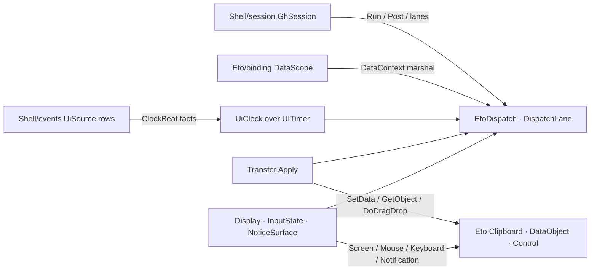

# [RASM_GRASSHOPPER_ETO_RUNTIME]

The Eto runtime floor of the Grasshopper boundary — one UI-thread marshal owner (`EtoDispatch`) over `Application.Instance`, one repeating-tick owner (`UiClock`) over `UITimer` riding the kernel `Lease<T>` disposal rail, one typed data-transfer algebra (`Transfer`) collapsing `Clipboard` and `DataObject` into a single surface union with one payload family, and the ambient host-fact projections (`Display`, `InputState`, `NoticeSurface`) for screen density, live pointer/modifier state, and OS notifications. Every fallible operation rides an `Op`-keyed `Fin<T>` rail through the `Op.Catch` boundary funnel; every owned native resource crosses as `Lease<T>`; every receipt proves itself through `ValidityClaim.All`. `Eto.Forms`, `Eto.Drawing`, and `Rasm.Domain` arrive as project-level global usings, so fences name host members bare. `Shell/session.md` composes `EtoDispatch` as its execution rail, `Shell/events.md` publishes `ClockBeat` facts from `UiClock` and reads `Transfer` payload rows inside drag evidence, and `Eto/binding.md` marshals `DataContext` assignment through `EtoDispatch`.

## [01]-[INDEX]

- [02]-[DISPATCH]: `EtoDispatch` — the one UI-thread seam over `Application.Instance` (`Invoke`/`AsyncInvoke`/`InvokeAsync`) with on-thread short-circuit, plus `DispatchLane`, the two-row marshal-policy vocabulary command-shaped consumers carry as data.
- [03]-[CLOCK]: `UiCadence` + `ClockBeat` + `UiClock` — the `UITimer` lifecycle owner: validated cadence admission, typed beat evidence, `Lease<UiClock>` ownership, and fault-posture policy for beat bodies.
- [04]-[TRANSFER]: `TransferSurface` + `TransferPayload` + `PayloadShape` + `Transfer` — one algebra over the clipboard/drag accessor family: typed write, shaped read, probe, clear, and `DoDragDrop` behind one `Apply` gate.
- [05]-[HOST_FACTS]: `DisplayMetrics` + `Display`, `PointerSnapshot` + `InputState`, `Notice` + `NoticeSurface` — per-display density projection, ambient input reads, and the OS alert/tray surface.

## [02]-[DISPATCH]

- Owner: `EtoDispatch` — THE one UI-thread seam in the package. `Run<T>` marshals a `Fin<T>` body synchronously (`Application.Instance.Invoke<T>`), `RunAsync<T>` marshals awaitably (`InvokeAsync<T>`), `Post` queues fire-and-forget (`AsyncInvoke`); all three short-circuit when `Application.Instance.IsUIThread` already holds, so re-entrant composition never double-hops. `Pump` wraps `RunIteration` as the named platform-forced run-loop boundary. `DispatchLane` `[SmartEnum<int>]` carries the marshal choice as a policy row — `Blocking` (key 0) and `Queued` (key 1) over one `[UseDelegateFromConstructor]` `Marshal(Func<Fin<Unit>>, Op)` column — so a command-shaped consumer (`Shell/session.md` `SessionOp.ExecuteCase`) stores the lane as data instead of forking call sites.
- Entry: `EtoDispatch.Run<T>(Func<Fin<T>> body, Op? key = null)` → `Fin<T>`; `RunAsync<T>(Func<Fin<T>> body, Op? key = null)` → `Task<Fin<T>>`; `Post(Action body, Op? key = null)` → `Fin<Unit>`. The three carriers are one owner: the carrier IS the modality (value now, value later, no value), never a name-suffixed sibling family.
- Law: every body crosses the seam inside `Op.Catch` — a host callback that throws lands as `Fault.InvalidResult` with the raising key, a cancellation surfaces as `Fault.Cancelled`, and no bare `try`/`catch` exists on the marshal path. The `Post` body is caught INSIDE its deferred window too: a throwing fire-and-forget lands as a contained fault, never an unhandled pump exception, and a consumer demanding the fault takes `Run`/`RunAsync`. A `SynchronizationContext` capture, a raw `Thread` hop, or a second scheduler beside `Application.Instance` is the deleted form.
- Law: absence of a live application is a typed refusal — `Optional(Application.Instance).ToFin(key.MissingContext())` gates every marshal, so a headless or pre-boot call fails as `Fault.MissingContext`, never as a null dereference inside Eto.
- Boundary: `Application.EnsureUIThread`, `UIThreadCheckMode`, `Quit`, `Open`, and `Localize` stay host verbs consumed at the seam by the shell owner; this floor owns only the marshal and the pump. `Application` lifecycle events (`Initialized`/`Terminating`/`UnhandledException`/`NotificationActivated`/`IsActiveChanged`) are `Shell/events.md` source rows, never subscribed here.
- Packages: Eto (`Application.Instance`, `IsUIThread`, `Invoke`, `AsyncInvoke`, `InvokeAsync`, `RunIteration`), LanguageExt.Core (`Fin`, `Optional`), `Rasm.Domain` (`Op`, `Fault`).
- Growth: a new marshal posture (throttled, coalesced) is one `DispatchLane` row; the `Run`/`RunAsync`/`Post` trio never widens.

```csharp signature
// --- [RUNTIME_PRELUDE] ----------------------------------------------------------------------
using Rasm.Csp;

namespace Rasm.Grasshopper.Eto;

// --- [TYPES] --------------------------------------------------------------------------------
[SmartEnum<int>]
public sealed partial class DispatchLane {
    public static readonly DispatchLane Blocking = new(key: 0, marshal: static (body, key) => EtoDispatch.Run(body: body, key: key));
    public static readonly DispatchLane Queued = new(key: 1, marshal: static (body, key) => EtoDispatch.Post(body: () => ignore(body()), key: key));
    [UseDelegateFromConstructor] private partial Fin<Unit> Marshal(Func<Fin<Unit>> body, Op key);
    internal Fin<Unit> Dispatch(Func<Fin<Unit>> body, Op key) => Marshal(body: body, key: key);
}

// --- [OPERATIONS] ---------------------------------------------------------------------------
[BoundaryAdapter]
public static class EtoDispatch {
    public static Fin<T> Run<T>(Func<Fin<T>> body, Op? key = null) {
        Op op = key.OrDefault();
        return from app in Optional(Application.Instance).ToFin(op.MissingContext())
               from valid in op.Need(body)
               from output in app.IsUIThread
                   ? op.Catch(body: valid)
                   : op.Catch(body: () => app.Invoke(func: () => op.Catch(body: valid)))
               select output;
    }
    public static Task<Fin<T>> RunAsync<T>(Func<Fin<T>> body, Op? key = null) {
        Op op = key.OrDefault();
        return Optional(Application.Instance).ToFin(op.MissingContext())
            .Bind(app => op.Need(body).Map(valid => (App: app, Body: valid)))
            .Match(
                Succ: seam => seam.App.IsUIThread
                    ? Task.FromResult(op.Catch(body: seam.Body))
                    : seam.App.InvokeAsync(func: () => op.Catch(body: seam.Body)),
                Fail: error => Task.FromResult(Fin.Fail<T>(error: error)));
    }
    public static Fin<Unit> Post(Action body, Op? key = null) {
        Op op = key.OrDefault();
        return from app in Optional(Application.Instance).ToFin(op.MissingContext())
               from valid in op.Need(body)
               from queued in op.Catch(body: () => Fin.Succ(Op.Side(action: () =>
                   app.AsyncInvoke(action: () => ignore(op.Catch(body: () => Fin.Succ(Op.Side(action: valid))))))))
               select queued;
    }
    public static Fin<Unit> Pump(Op? key = null) {
        Op op = key.OrDefault();
        return from app in Optional(Application.Instance).ToFin(op.MissingContext())
               from pumped in op.Catch(body: () => Fin.Succ(Op.Side(action: app.RunIteration)))
               select pumped;
    }
}
```

## [03]-[CLOCK]

- Owner: `UiClock` sealed class — the one `UITimer` lifecycle owner: a validated `UiCadence` interval, a beat body returning `Fin<Unit>`, monotonic beat indexing with elapsed/delta evidence, and a `FaultPosture` policy row deciding whether a failed beat halts the tick or continues. Construction returns `Lease<UiClock>.Owned` — the consumer's disposal window IS the timer lifetime, and `Dispose` stops and releases the `UITimer` exactly once. `UiCadence` `[ValueObject<double>]` admits the tick interval in seconds (finite, positive) so no raw `double` reaches `UITimer.Interval`. `ClockBeat` is the typed beat evidence — `Index`, `Elapsed`, `Delta` — implementing `IValidityEvidence` through the claim fold.
- Entry: `UiClock.Of(UiCadence cadence, Func<ClockBeat, Fin<Unit>> beat, FaultPosture? posture = null, Op? key = null)` → `Fin<Lease<UiClock>>`; instance `Start()`/`Stop()` → `Fin<Unit>` toggle `UITimer.Started` on the UI thread through `EtoDispatch`; internal `Tap(Action<ClockBeat>, Op)` → `Fin<IDisposable>` — the observer seam `Shell/events.md`'s clock row attaches through, receiving every beat's evidence without ever driving `Start`/`Stop`.
- Law: the beat handler runs inside `Op.Catch` per tick — a throwing beat body is a `Fault`, and `FaultPosture.Halt` (the default) stops the timer on the first failed beat while `FaultPosture.Continue` records the failure on the clock's last-fault cell and keeps ticking; a beat that silently swallows its own failures is the deleted form. Observers run before the beat body, each inside its own `Op.Catch`, so a throwing observer never halts the tick or shadows the posture policy. Beat timing derives from `Environment.TickCount64` deltas captured at tick entry, never from wall-clock reads inside the body.
- Law: `UiClock` is the package's ONE repeating-tick surface — `Shell/events.md` publishes `ClockBeat` facts through its `UiSource` clock row, `Canvas/motion.md` paces kernel motion rows off it, and a second `System.Threading.Timer`, `Task.Delay` loop, or per-consumer `UITimer` beside it is the deleted form. High-cadence display-link pacing is the macOS platform owner's replacement seam, selected by the consumer, never a fork inside this owner.
- Boundary: `UITimer` is UI-affine — `Of`, `Start`, `Stop`, and disposal all marshal through `EtoDispatch.Run`; the `Elapsed` subscription and its detach on dispose are the named platform-forced statement seam inside the constructor.
- Packages: Eto (`UITimer.Interval`/`Started`/`Start`/`Stop`/`Elapsed`), `Rasm.Domain` (`Op`, `Lease<T>`, `ValidityClaim`, `IValidityEvidence`).
- Growth: a new pacing policy (skip-on-backlog, catch-up) is one `FaultPosture`-adjacent row plus a `ClockBeat` column, never a sibling clock.

```csharp signature
// --- [RUNTIME_PRELUDE] ----------------------------------------------------------------------
using Rasm.Csp;

namespace Rasm.Grasshopper.Eto;

// --- [TYPES] --------------------------------------------------------------------------------
[ValueObject<double>]
public readonly partial struct UiCadence {
    static partial void ValidateFactoryArguments(ref ValidationError? validationError, ref double value) =>
        validationError = double.IsFinite(value) && value > 0.0 ? null : new ValidationError(message: "UiCadence requires a finite positive interval in seconds.");
}

[SmartEnum<int>]
public sealed partial class FaultPosture {
    public static readonly FaultPosture Halt = new(key: 0, haltsOnFault: true);
    public static readonly FaultPosture Continue = new(key: 1, haltsOnFault: false);
    public bool HaltsOnFault { get; }
}

// --- [MODELS] -------------------------------------------------------------------------------
[BoundaryAdapter, StructLayout(LayoutKind.Auto)]
public readonly record struct ClockBeat(long Index, TimeSpan Elapsed, TimeSpan Delta) : IValidityEvidence {
    public bool IsValid => ValidityClaim.All(
        ValidityClaim.Of(holds: Index >= 0),
        ValidityClaim.Nonnegative(value: Elapsed.TotalSeconds),
        ValidityClaim.Nonnegative(value: Delta.TotalSeconds));
}

// --- [SERVICES] -----------------------------------------------------------------------------
public sealed class UiClock : IDisposable {
    private readonly UITimer timer;
    private readonly EventHandler<EventArgs> tick;
    private readonly Atom<Seq<Action<ClockBeat>>> taps = Atom(Seq<Action<ClockBeat>>());
    private long index;
    private long startStamp;
    private long lastStamp;
    private Option<Error> lastFault = Option<Error>.None;

    private UiClock(UITimer timer, EventHandler<EventArgs> tick) { this.timer = timer; this.tick = tick; }

    public Option<Error> LastFault => lastFault;

    public static Fin<Lease<UiClock>> Of(UiCadence cadence, Func<ClockBeat, Fin<Unit>> beat, FaultPosture? posture = null, Op? key = null) {
        Op op = key.OrDefault();
        FaultPosture active = posture ?? FaultPosture.Halt;
        return from valid in op.Need(beat)
               from lease in EtoDispatch.Run(body: () => {
                   UITimer native = new() { Interval = (double)cadence };
                   UiClock clock = null!;
                   EventHandler<EventArgs> handler = (_, _) => clock.OnTick(beat: valid, posture: active, key: op);
                   clock = new UiClock(timer: native, tick: handler);
                   native.Elapsed += handler;
                   return Fin.Succ((Lease<UiClock>)new Lease<UiClock>.Owned(Value: clock));
               }, key: op)
               select lease;
    }

    public Fin<Unit> Start(Op? key = null) {
        Op op = key.OrDefault();
        UiClock self = this;
        return EtoDispatch.Run(body: () => Fin.Succ(Op.Side(action: () => {
            self.startStamp = Environment.TickCount64;
            self.lastStamp = self.startStamp;
            self.index = 0;
            self.timer.Start();
        })), key: op);
    }

    public Fin<Unit> Stop(Op? key = null) {
        UiClock self = this;
        return EtoDispatch.Run(body: () => Fin.Succ(Op.Side(action: self.timer.Stop)), key: key.OrDefault());
    }

    public void Dispose() => ignore(EtoDispatch.Run(body: () => {
        timer.Elapsed -= tick;
        timer.Stop();
        timer.Dispose();
        return Fin.Succ(unit);
    }));

    internal Fin<IDisposable> Tap(Action<ClockBeat> observer, Op key) =>
        key.Need(observer).Map(valid => {
            ignore(taps.Swap(rows => rows.Add(valid)));
            return (IDisposable)new TapHandle(taps: taps, observer: valid);
        });

    private void OnTick(Func<ClockBeat, Fin<Unit>> beat, FaultPosture posture, Op key) {
        long now = Environment.TickCount64;
        ClockBeat evidence = new(
            Index: index++,
            Elapsed: TimeSpan.FromMilliseconds(value: now - startStamp),
            Delta: TimeSpan.FromMilliseconds(value: now - lastStamp));
        lastStamp = now;
        taps.Value.Iter(observer => ignore(key.Catch(body: () => Fin.Succ(Op.Side(action: () => observer(obj: evidence))))));
        key.Catch(body: () => beat(arg: evidence)).IfFail(error => {
            lastFault = Some(error);
            Op.SideWhen(condition: posture.HaltsOnFault, action: timer.Stop);
        });
    }

    private sealed class TapHandle(Atom<Seq<Action<ClockBeat>>> taps, Action<ClockBeat> observer) : IDisposable {
        private int released;
        public void Dispose() => Op.SideWhen(
            condition: Interlocked.Exchange(location1: ref released, value: 1) == 0,
            action: () => ignore(taps.Swap(rows => rows.Filter(row => !ReferenceEquals(objA: row, objB: observer)))));
    }
}
```

## [04]-[TRANSFER]

- Owner: `Transfer` — one algebra over the host transfer accessor family. `TransferSurface` `[Union]` collapses the two hosts of that family into cases — `ClipboardCase(Clipboard)` and `PayloadCase(DataObject)` — because `Clipboard` and `DataObject` mirror the identical typed member set (`Types`/`ContainsText`/`ContainsHtml`/`ContainsImage`/`ContainsUris`, `Text`/`Html`/`Image`/`Uris`, `SetData`/`GetData`, `SetDataStream`/`GetDataStream`, `SetString`/`GetString`, `SetObject`/`GetObject<T>`, `Contains`, `Clear`); a per-host sibling API is the deleted form. `TransferPayload` `[Union]` is the one payload family — intrinsic cases (`TextCase`, `HtmlCase`, `PictureCase`, `UriSetCase`) plus format-keyed cases (`BytesCase`, `StreamCase`, `StringCase`, `ObjectCase`) whose `Format` is the `DataFormats`-vocabulary type string carried as data. `PayloadShape` `[Union]` mirrors the family as the read-side selector. `TransferOp` `[GenerateUnionOps]` closes the verb set: `WriteCase`, `ReadCase`, `ProbeCase`, `ClearCase`, `DragCase`.
- Entry: `Transfer.Apply(TransferOp op, Op? key = null)` → `Fin<TransferResult>` — the single gate. Write folds a payload `Seq` onto the surface in one marshal; read discriminates by `PayloadShape`; probe returns the live `Types` inventory with the four intrinsic presence flags; drag builds a `DataObject` from the same payload family and runs `Control.DoDragDrop(data, allowedEffects)` — initiation is void on the host, so `DraggedCase` is the initiation receipt and the settled effect arrives as the `Shell/events.md` `control.drag-end` fact.
- Law: every accessor call marshals through `EtoDispatch.Run` — the clipboard and drag surfaces are UI-affine — and every host read null-gates through `Optional(...).ToFin(key.InvalidResult())`, so an absent payload is a typed refusal, never a null crossing the interior. The system clipboard resolves through `TransferSurface.System` (`Clipboard.Instance`); a second `new Clipboard()` beside it is the deleted form.
- Law: payload identity is the format string carried on the case, sourced from the `DataFormats` vocabulary or a consumer-registered custom type — a stringly parse of an untyped blob beside the typed accessors is the deleted form. `ObjectCase` round-trips through `SetObject`/`GetObject<T>` and its read shape carries the target `Type` as evidence, so a mis-typed read faults with `Fault.Unsupported` rather than casting.
- Boundary: drag EVIDENCE (drop location, effect masks arriving on `DragEventArgs`, the settled effect on `DragEnd`) is `Shell/events.md`'s fact algebra; this owner initiates drags and owns payload construction only. The concrete `DataObject` is built here and never leaks past the gate.
- Packages: Eto (`Clipboard`, `DataObject`, `IDataObject`, `DataFormats`, `DragEffects`, `Control.DoDragDrop`, `Image`), LanguageExt.Core (`Fin`, `Seq`, `Optional`), `Rasm.Domain` (`Op`, `Fault`).
- Growth: a new payload dialect is one `TransferPayload` case plus its `PayloadShape` mirror row; a new verb is one `TransferOp` case — the `Apply` gate never widens.

```csharp signature
// --- [RUNTIME_PRELUDE] ----------------------------------------------------------------------
using Rasm.Csp;

namespace Rasm.Grasshopper.Eto;

// --- [TYPES] --------------------------------------------------------------------------------
[Union]
public abstract partial record TransferSurface {
    private TransferSurface() { }
    public sealed record ClipboardCase(Clipboard Board) : TransferSurface;
    public sealed record PayloadCase(DataObject Payload) : TransferSurface;
    public static Fin<TransferSurface> System(Op? key = null) =>
        Optional(Clipboard.Instance).Map(static board => (TransferSurface)new ClipboardCase(Board: board)).ToFin(key.OrDefault().MissingContext());
}

[Union]
public abstract partial record TransferPayload {
    private TransferPayload() { }
    public sealed record TextCase(string Value) : TransferPayload;
    public sealed record HtmlCase(string Value) : TransferPayload;
    public sealed record PictureCase(Image Value) : TransferPayload;
    public sealed record UriSetCase(Seq<Uri> Values) : TransferPayload;
    public sealed record BytesCase(string Format, byte[] Value) : TransferPayload;
    public sealed record StreamCase(string Format, Stream Value) : TransferPayload;
    public sealed record StringCase(string Format, string Value) : TransferPayload;
    public sealed record ObjectCase(string Format, object Value) : TransferPayload;
}

[Union]
public abstract partial record PayloadShape {
    private PayloadShape() { }
    public sealed record TextShape : PayloadShape;
    public sealed record HtmlShape : PayloadShape;
    public sealed record PictureShape : PayloadShape;
    public sealed record UriShape : PayloadShape;
    public sealed record BytesShape(string Format) : PayloadShape;
    public sealed record StreamShape(string Format) : PayloadShape;
    public sealed record StringShape(string Format) : PayloadShape;
    public sealed record ObjectShape(string Format, Type Target) : PayloadShape;
}

[Union]
[GenerateUnionOps]
public abstract partial record TransferOp {
    private TransferOp() { }
    public sealed record WriteCase(TransferSurface Surface, Seq<TransferPayload> Payloads) : TransferOp;
    public sealed record ReadCase(TransferSurface Surface, PayloadShape Shape) : TransferOp;
    public sealed record ProbeCase(TransferSurface Surface) : TransferOp;
    public sealed record ClearCase(TransferSurface Surface) : TransferOp;
    public sealed record DragCase(Control Source, Seq<TransferPayload> Payloads, DragEffects Allowed) : TransferOp;
}

// --- [MODELS] -------------------------------------------------------------------------------
[Union]
public abstract partial record TransferResult {
    private TransferResult() { }
    public sealed record WrittenCase(int Count) : TransferResult;
    public sealed record ValueCase(TransferPayload Payload) : TransferResult;
    public sealed record InventoryCase(Seq<string> Types, bool HasText, bool HasHtml, bool HasImage, bool HasUris) : TransferResult;
    public sealed record ClearedCase : TransferResult;
    public sealed record DraggedCase : TransferResult;
}

// --- [OPERATIONS] ---------------------------------------------------------------------------
[BoundaryAdapter]
public static class Transfer {
    public static Fin<TransferResult> Apply(TransferOp op, Op? key = null) {
        Op active = key.OrDefault();
        return active.Need(op).Bind(valid => valid.Switch(
            state: active,
            writeCase: static (k, c) => EtoDispatch.Run(body: () => Write(surface: c.Surface, payloads: c.Payloads, key: k), key: k),
            readCase: static (k, c) => EtoDispatch.Run(body: () => Read(surface: c.Surface, shape: c.Shape, key: k), key: k),
            probeCase: static (k, c) => EtoDispatch.Run(body: () => Probe(surface: c.Surface, key: k), key: k),
            clearCase: static (k, c) => EtoDispatch.Run(body: () => c.Surface.Fold(
                board: board => { board.Clear(); return Fin.Succ((TransferResult)new TransferResult.ClearedCase()); },
                payload: data => { data.Clear(); return Fin.Succ((TransferResult)new TransferResult.ClearedCase()); }), key: k),
            dragCase: static (k, c) => EtoDispatch.Run(body: () =>
                from source in k.Need(c.Source)
                from dragged in k.Catch(body: () => Fin.Succ(Op.Side(action: () => source.DoDragDrop(data: Packed(payloads: c.Payloads), allowedEffects: c.Allowed))))
                select (TransferResult)new TransferResult.DraggedCase(), key: k)));
    }

    private static Fin<TransferResult> Write(TransferSurface surface, Seq<TransferPayload> payloads, Op key) =>
        payloads.Fold(
            initialState: Fin.Succ(0),
            f: (acc, payload) => acc.Bind(count => key.Catch(body: () => Fin.Succ(Op.Side(action: () => surface.Fold(
                board: board => Stamp(set: board.SetData, setStream: board.SetDataStream, setString: board.SetString, setObject: board.SetObject,
                    text: value => board.Text = value, html: value => board.Html = value, image: value => board.Image = value, uris: value => board.Uris = value, payload: payload),
                payload: data => Stamp(set: data.SetData, setStream: data.SetDataStream, setString: data.SetString, setObject: data.SetObject,
                    text: value => data.Text = value, html: value => data.Html = value, image: value => data.Image = value, uris: value => data.Uris = value, payload: payload)))))
                .Map(_ => count + 1)))
            .Map(static count => (TransferResult)new TransferResult.WrittenCase(Count: count));

    private static Fin<TransferResult> Read(TransferSurface surface, PayloadShape shape, Op key) => shape.Switch(
        state: (Surface: surface, Key: key),
        textShape: static (s, _) => s.Surface.Fold(board: b => Optional(b.Text), payload: d => Optional(d.Text))
            .Map(static value => (TransferResult)new TransferResult.ValueCase(Payload: new TransferPayload.TextCase(Value: value))).ToFin(s.Key.InvalidResult()),
        htmlShape: static (s, _) => s.Surface.Fold(board: b => Optional(b.Html), payload: d => Optional(d.Html))
            .Map(static value => (TransferResult)new TransferResult.ValueCase(Payload: new TransferPayload.HtmlCase(Value: value))).ToFin(s.Key.InvalidResult()),
        pictureShape: static (s, _) => s.Surface.Fold(board: b => Optional(b.Image), payload: d => Optional(d.Image))
            .Map(static value => (TransferResult)new TransferResult.ValueCase(Payload: new TransferPayload.PictureCase(Value: value))).ToFin(s.Key.InvalidResult()),
        uriShape: static (s, _) => s.Surface.Fold(board: b => Optional(b.Uris), payload: d => Optional(d.Uris))
            .Map(static values => (TransferResult)new TransferResult.ValueCase(Payload: new TransferPayload.UriSetCase(Values: toSeq(values)))).ToFin(s.Key.InvalidResult()),
        bytesShape: static (s, c) => s.Surface.Fold(board: b => Optional(b.GetData(type: c.Format)), payload: d => Optional(d.GetData(type: c.Format)))
            .Map(value => (TransferResult)new TransferResult.ValueCase(Payload: new TransferPayload.BytesCase(Format: c.Format, Value: value))).ToFin(s.Key.InvalidResult()),
        streamShape: static (s, c) => s.Surface.Fold(board: b => Optional(b.GetDataStream(type: c.Format)), payload: d => Optional(d.GetDataStream(type: c.Format)))
            .Map(value => (TransferResult)new TransferResult.ValueCase(Payload: new TransferPayload.StreamCase(Format: c.Format, Value: value))).ToFin(s.Key.InvalidResult()),
        stringShape: static (s, c) => s.Surface.Fold(board: b => Optional(b.GetString(type: c.Format)), payload: d => Optional(d.GetString(type: c.Format)))
            .Map(value => (TransferResult)new TransferResult.ValueCase(Payload: new TransferPayload.StringCase(Format: c.Format, Value: value))).ToFin(s.Key.InvalidResult()),
        objectShape: static (s, c) => s.Surface.Fold(board: b => Optional(b.GetObject(type: c.Format)), payload: d => Optional(d.GetObject(type: c.Format)))
            .Filter(value => c.Target.IsInstanceOfType(o: value))
            .Map(value => (TransferResult)new TransferResult.ValueCase(Payload: new TransferPayload.ObjectCase(Format: c.Format, Value: value)))
            .ToFin(s.Key.Unsupported(geometryType: c.Target, outputType: typeof(TransferPayload.ObjectCase))));

    private static Fin<TransferResult> Probe(TransferSurface surface, Op key) =>
        key.Catch(body: () => Fin.Succ(surface.Fold(
            board: static b => (TransferResult)new TransferResult.InventoryCase(Types: toSeq(b.Types), HasText: b.ContainsText, HasHtml: b.ContainsHtml, HasImage: b.ContainsImage, HasUris: b.ContainsUris),
            payload: static d => (TransferResult)new TransferResult.InventoryCase(Types: toSeq(d.Types), HasText: d.ContainsText, HasHtml: d.ContainsHtml, HasImage: d.ContainsImage, HasUris: d.ContainsUris))));

    private static DataObject Packed(Seq<TransferPayload> payloads) {
        DataObject data = new();
        payloads.Iter(payload => Stamp(set: data.SetData, setStream: data.SetDataStream, setString: data.SetString, setObject: data.SetObject,
            text: value => data.Text = value, html: value => data.Html = value, image: value => data.Image = value, uris: value => data.Uris = value, payload: payload));
        return data;
    }

    private static Unit Stamp(
        Action<byte[], string> set, Action<Stream, string> setStream, Action<string, string> setString, Action<object, string> setObject,
        Action<string> text, Action<string> html, Action<Image> image, Action<Uri[]> uris, TransferPayload payload) => payload.Switch(
        textCase: c => Op.Side(action: () => text(obj: c.Value)),
        htmlCase: c => Op.Side(action: () => html(obj: c.Value)),
        pictureCase: c => Op.Side(action: () => image(obj: c.Value)),
        uriSetCase: c => Op.Side(action: () => uris(obj: [.. c.Values])),
        bytesCase: c => Op.Side(action: () => set(arg1: c.Value, arg2: c.Format)),
        streamCase: c => Op.Side(action: () => setStream(arg1: c.Value, arg2: c.Format)),
        stringCase: c => Op.Side(action: () => setString(arg1: c.Value, arg2: c.Format)),
        objectCase: c => Op.Side(action: () => setObject(arg1: c.Value, arg2: c.Format)));

    private static T Fold<T>(this TransferSurface surface, Func<Clipboard, T> board, Func<DataObject, T> payload) =>
        surface.Switch(clipboardCase: c => board(arg: c.Board), payloadCase: c => payload(arg: c.Payload));
}
```

## [05]-[HOST_FACTS]

- Owner: `Display` — the screen-metrics projection: `DisplayMetrics` readonly record struct carries `Bounds`, `WorkingArea`, `LogicalPixelSize`, `Dpi`, `Scale`, `BitsPerPixel`, `IsPrimary` per display with `IValidityEvidence` over the claim fold, and `DisplayQuery` `[Union]` discriminates the resolution modality — `PrimaryCase`, `AllCase`, `AtCase(PointF)` — behind one `Display.Resolve` gate returning `Fin<Seq<DisplayMetrics>>`. A panel reads density once per paint from these facts; a hardcoded scale constant is the deleted form.
- Owner: `InputState` — the ambient input reader: `PointerSnapshot` (`Position`, `Buttons`, `Modifiers`) captured in one marshal from `Mouse.Position`/`Mouse.Buttons`/`Keyboard.Modifiers`, and `LockProbe(Keys)` gating `Keyboard.IsKeyLocked` on `Keyboard.SupportedLockKeys` membership so an unsupported lock key faults typed instead of answering garbage. Ambient reads are distinct from per-event snapshots — `Shell/events.md` owns the event-borne facts; this owner answers "now".
- Owner: `NoticeSurface` — the OS alert seam: `Notice` record (`Title`, `Message`, plus `Icon`, `ContentImage`, and the host's string `UserData` as `Option`) projects onto `Notification` in one marshal, posted through `Notification.Show(TrayIndicator?)`; a platform whose `Notification.RequiresTrayIndicator` holds refuses a tray-less post as `Fault.MissingContext` instead of silently dropping the alert. The tray item mints through `Tray(title, image, menu)` and toggles through its `Visible` property. `Notification.Activated` and `TrayIndicator.Activated` are `Shell/events.md` source rows.
- Law: cursor selection composes the host `Cursors` roster (`Default`/`Arrow`/`Crosshair`/`Pointer`/`IBeam`/`Move`/`NotAllowed` plus the eight directional size cursors, `GetCursor(CursorType)`) directly at the consuming control — a wrapper renaming the roster is the deleted form.
- Packages: Eto (`Screen.PrimaryScreen`/`Screens`/`Bounds`/`WorkingArea`/`LogicalPixelSize`/`DPI`/`Scale`/`BitsPerPixel`/`IsPrimary`, `Mouse`, `Keyboard`, `Cursors`, `Notification`, `TrayIndicator`), `Rasm.Domain` (`Op`, `ValidityClaim`).
- Growth: a new display fact is one `DisplayMetrics` field; a new resolution modality is one `DisplayQuery` case.

```csharp signature
// --- [RUNTIME_PRELUDE] ----------------------------------------------------------------------
using Rasm.Csp;

namespace Rasm.Grasshopper.Eto;

// --- [TYPES] --------------------------------------------------------------------------------
[Union]
public abstract partial record DisplayQuery {
    private DisplayQuery() { }
    public sealed record PrimaryCase : DisplayQuery;
    public sealed record AllCase : DisplayQuery;
    public sealed record AtCase(PointF Location) : DisplayQuery;
}

// --- [MODELS] -------------------------------------------------------------------------------
[BoundaryAdapter, StructLayout(LayoutKind.Auto)]
public readonly record struct DisplayMetrics(
    RectangleF Bounds, RectangleF WorkingArea, float LogicalPixelSize, float Dpi, float Scale, int BitsPerPixel, bool IsPrimary) : IValidityEvidence {
    public bool IsValid => ValidityClaim.All(
        ValidityClaim.Positive(value: LogicalPixelSize),
        ValidityClaim.Positive(value: Dpi),
        ValidityClaim.Positive(value: Scale),
        ValidityClaim.Of(holds: BitsPerPixel > 0));
    internal static DisplayMetrics Of(Screen screen) => new(
        Bounds: screen.Bounds, WorkingArea: screen.WorkingArea, LogicalPixelSize: screen.LogicalPixelSize,
        Dpi: screen.DPI, Scale: screen.Scale, BitsPerPixel: screen.BitsPerPixel, IsPrimary: screen.IsPrimary);
}

[BoundaryAdapter, StructLayout(LayoutKind.Auto)]
public readonly record struct PointerSnapshot(PointF Position, MouseButtons Buttons, Keys Modifiers);

public sealed record Notice(
    string Title, string Message, Option<Icon> Icon, Option<Image> ContentImage, Option<string> UserData);

// --- [OPERATIONS] ---------------------------------------------------------------------------
[BoundaryAdapter]
public static class Display {
    public static Fin<Seq<DisplayMetrics>> Resolve(DisplayQuery query, Op? key = null) {
        Op op = key.OrDefault();
        return op.Need(query).Bind(valid => EtoDispatch.Run(body: () => valid.Switch(
            state: op,
            primaryCase: static (k, _) => Optional(Screen.PrimaryScreen).Map(static screen => Seq1(DisplayMetrics.Of(screen: screen))).ToFin(k.MissingContext()),
            allCase: static (k, _) => Optional(Screen.Screens).Map(static screens => toSeq(screens).Map(static screen => DisplayMetrics.Of(screen: screen))).ToFin(k.MissingContext()),
            atCase: static (k, c) => Optional(Screen.Screens)
                .Map(screens => toSeq(screens).Filter(screen => screen.Bounds.Contains(point: c.Location)).Map(static screen => DisplayMetrics.Of(screen: screen)))
                .Filter(static hits => !hits.IsEmpty)
                .ToFin(k.InvalidResult())), key: op));
    }
}

[BoundaryAdapter]
public static class InputState {
    public static Fin<PointerSnapshot> Snapshot(Op? key = null) {
        Op op = key.OrDefault();
        return EtoDispatch.Run(body: () => op.Catch(body: () =>
            Fin.Succ(new PointerSnapshot(Position: Mouse.Position, Buttons: Mouse.Buttons, Modifiers: Keyboard.Modifiers))), key: op);
    }
    public static Fin<bool> LockProbe(Keys lockKey, Op? key = null) {
        Op op = key.OrDefault();
        return EtoDispatch.Run(body: () =>
            from supported in op.Confirm(success: Keyboard.SupportedLockKeys.Contains(value: lockKey)).MapFail(_ => op.Unsupported(geometryType: typeof(Keys), outputType: typeof(bool)))
            from state in op.Catch(body: () => Fin.Succ(Keyboard.IsKeyLocked(key: lockKey)))
            select state, key: op);
    }
}

[BoundaryAdapter]
public static class NoticeSurface {
    public static Fin<Unit> Post(Notice notice, Option<TrayIndicator> tray, Op? key = null) {
        Op op = key.OrDefault();
        return op.Need(notice).Bind(valid => EtoDispatch.Run(body: () => op.Catch(body: () => {
            Notification native = new() { Title = valid.Title, Message = valid.Message };
            valid.Icon.Iter(icon => native.Icon = icon);
            valid.ContentImage.Iter(image => native.ContentImage = image);
            valid.UserData.Iter(data => native.UserData = data);
            return native.RequiresTrayIndicator && tray.IsNone
                ? Fin.Fail<Unit>(error: op.MissingContext())
                : Fin.Succ(Op.Side(action: () => native.Show(indicator: tray.MatchUnsafe(Some: static item => item, None: static () => null))));
        }), key: op));
    }
    public static Fin<TrayIndicator> Tray(string title, Image image, Option<ContextMenu> menu, Op? key = null) {
        Op op = key.OrDefault();
        return EtoDispatch.Run(body: () => op.Catch(body: () => {
            TrayIndicator tray = new() { Title = title, Image = image, Visible = true };
            menu.Iter(rows => tray.Menu = rows);
            return Fin.Succ(tray);
        }), key: op);
    }
}
```



## [06]-[DENSITY_BAR]

One owner per axis; capability lands as a case, a row, or a field — never a sibling surface.

| [INDEX] | [CONCERN]           | [OWNER]                              | [KIND]                                                    | [RAIL]                                    | [CASES] |
| :-----: | :------------------ | :----------------------------------- | :--------------------------------------------------------- | :----------------------------------------- | :-----: |
|  [01]   | UI-thread marshal   | `EtoDispatch` + `DispatchLane`       | static seam + `[SmartEnum<int>]` lane rows                | `Run<T> → Fin<T>` / `RunAsync<T>` / `Post` |    2    |
|  [02]   | repeating tick      | `UiCadence` + `ClockBeat` + `UiClock` | `[ValueObject<double>]` + evidence + `Lease<UiClock>`     | `Of → Fin<Lease<UiClock>>`                 |    2    |
|  [03]   | typed transfer      | `TransferSurface`/`TransferPayload`/`PayloadShape`/`TransferOp` | four closed `[Union]` families, one gate  | `Transfer.Apply → Fin<TransferResult>`     |   28    |
|  [04]   | host facts          | `Display` + `InputState` + `NoticeSurface` | query `[Union]` + evidence records + alert seam       | `Resolve`/`Snapshot`/`Post` → `Fin<T>`     |    3    |

`Op`, `Fault`, `Lease<T>`, `ValidityClaim`, and `IValidityEvidence` are composed kernel owners; `Application`, `UITimer`, `Clipboard`, `DataObject`, `Screen`, `Mouse`, `Keyboard`, `Notification`, and `TrayIndicator` are catalog-verified host members — nothing on this page re-derives either side.
