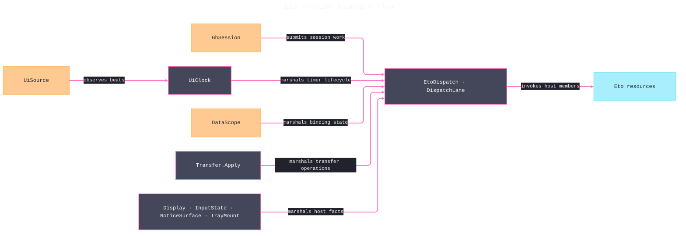

# [RASM_GRASSHOPPER_ETO_RUNTIME]

`EtoDispatch` is the Eto runtime floor of the Grasshopper boundary — one UI-thread marshal owner over `Application.Instance`, one repeating-tick owner (`UiClock`) over `UITimer` riding the kernel `Lease<T>` disposal rail, one typed data-transfer algebra (`Transfer`) collapsing `Clipboard` and `DataObject` into a single surface union with one payload family, and the ambient host-fact projections (`Display`, `InputState`, `NoticeSurface`) for screen density, live pointer/modifier state, and OS notifications.

Every fallible operation rides an `Op`-keyed `Fin<T>` rail through the `Op.Catch` boundary funnel; every owned native resource crosses as `Lease<T>`; every validity-bearing receipt composes `ValidityClaim`. `Shell/session.md` composes `EtoDispatch` as its execution rail, `Shell/events.md` publishes `ClockBeat` facts from `UiClock` and reads `Transfer` payload rows inside drag evidence, and `Eto/binding.md` marshals `DataContext` assignment through `EtoDispatch`.

## [01]-[INDEX]

- [02]-[DISPATCH]: `EtoDispatch` — the one UI-thread seam over `Application.Instance` (`Invoke`/`AsyncInvoke`/`InvokeAsync`) with on-thread short-circuit, `DispatchLane`, the two-row marshal-policy vocabulary command-shaped consumers carry as data, and the stall watchdog: `PulseLane` budgets, `DispatchPulse` receipts, and the token-addressed pulse tap.
- [03]-[CLOCK]: `UiCadence` + `ClockBeat` + `UiClock` — the `UITimer` lifecycle owner: validated cadence admission, typed beat evidence, `Lease<UiClock>` ownership, and fault-posture policy for beat bodies.
- [04]-[TRANSFER]: `TransferSurface` + `TransferPayload` + `PayloadShape` + `Transfer` — one algebra over the clipboard/drag accessor family: typed write, shaped read, probe, clear, and `DoDragDrop` behind one `Apply` gate.
- [05]-[HOST_FACTS]: `DisplayMetrics` + `Display`, `PointerSnapshot` + `InputState`, `Notice` + `NoticeMount` + `TrayMount` + `NoticeSurface` — per-display density projection, ambient input reads, and lease-owned OS alerts and tray surfaces.

## [02]-[DISPATCH]

- Owner: `EtoDispatch` — THE one UI-thread seam in the package. `Run<T>` marshals a `Fin<T>` body synchronously (`Application.Instance.Invoke<T>`), `RunAsync<T>` marshals awaitably (`InvokeAsync<T>`), and `Post` always queues a `Fin<Unit>` body through `AsyncInvoke`; the value-bearing carriers short-circuit when `Application.Instance.IsUIThread` already holds, while the queued lane preserves its deferred ordering on every caller thread. `Post` publishes the deferred result as `DispatchEcho` through one latest-value cell and token-addressed observers, while its return value proves queue admission only. `Pump` wraps `RunIteration` as the named platform-forced run-loop boundary. `DispatchLane` `[SmartEnum<int>]` carries the marshal choice as a policy row — `Blocking` (key 0) and `Queued` (key 1) over one `[UseDelegateFromConstructor]` `Marshal(Func<Fin<Unit>>, Op)` column — so a command-shaped consumer (`Shell/session.md` `SessionOp.ExecuteCase`) stores the lane as data instead of forking call sites.
- Entry: `EtoDispatch.Run<T>(Func<Fin<T>> body, Op? key = null)` → `Fin<T>`; `RunAsync<T>(Func<Fin<T>> body, Op? key = null)` → `Task<Fin<T>>`; `Post(Func<Fin<Unit>> body, Op? key = null)` → `Fin<Unit>`; `Tap(Action<DispatchEcho> observer, Op? key = null)` → `Fin<IDisposable>`. Three carriers are one owner: the carrier IS the modality (value now, value later, deferred receipt), never a name-suffixed sibling family.
- Entry: `EtoDispatch.Watch(Action<DispatchPulse> observer, Op? key = null)` → `Fin<IDisposable>` — the watchdog tap; `Tune(StallPolicy policy, Op? key = null)` → `Fin<Unit>` — per-lane budget overrides and the injected clock; `LastPulse`/`LastStall` — the latest-value receipt cells.
- Law: every marshaled body is gauged — `PulseLane` closes the four capture points (`Blocking`, `Awaitable`, `Queued`, `Pump`) with a per-row `Budget` column, the active `StallPolicy` supplies overrides and the `TimeProvider` timestamp pair, and each body exit mints one `DispatchPulse` carrying its `Op`, lane, elapsed wall time, and breach verdict. A breached pulse retains on `LastStall` — the hang evidence correlating the stalled body with the operation that submitted it — and every pulse publishes to individually contained watch observers; span-profile correlation composes at the app root, never here.
- Law: every body crosses the seam inside `Op.Catch` — a host callback that throws lands as `Fault.InvalidResult` with the raising key, a cancellation surfaces as `Fault.Cancelled`, and no bare `try`/`catch` exists on the marshal path. `Post` catches the body inside its deferred window, stores the exact `Fin<Unit>` outcome, and publishes it to individually contained observers; no queued failure disappears and no observer can escape into the pump. A `SynchronizationContext` capture, a raw `Thread` hop, or a second scheduler beside `Application.Instance` is the deleted form.
- Law: absence of a live application is a typed refusal — `Optional(Application.Instance).ToFin(key.MissingContext())` gates every marshal, so a headless or pre-boot call fails as `Fault.MissingContext`, never as a null dereference inside Eto.
- Boundary: `Application.EnsureUIThread`, `UIThreadCheckMode`, `Quit`, `Open`, and `Localize` stay host verbs consumed at the seam by the shell owner; this floor owns only the marshal and the pump. `Application` lifecycle events (`Initialized`/`Terminating`/`UnhandledException`/`NotificationActivated`/`IsActiveChanged`) are `Shell/events.md` source rows, never subscribed here.
- Packages: Eto (`Application.Instance`, `IsUIThread`, `Invoke`, `AsyncInvoke`, `InvokeAsync`, `RunIteration`), .NET (`TimeProvider.GetTimestamp`/`GetElapsedTime`), Microsoft.Extensions.Logging.Abstractions (`[LoggerMessage]`), LanguageExt.Core (`Fin`, `Optional`), `Rasm.Domain` (`Op`, `Fault`), `Shell/telemetry.md` (`GhLog` — same-stratum floor reach).
- Growth: a new marshal posture (throttled, coalesced) is one `DispatchLane` row; a new capture point is one `PulseLane` row; the `Run`/`RunAsync`/`Post` trio never widens.

```csharp signature
// --- [RUNTIME_PRELUDE] ----------------------------------------------------------------------
using Microsoft.Extensions.Logging;
using Rasm.Csp;
using Rasm.Grasshopper.Shell;

namespace Rasm.Grasshopper.Eto;

// --- [TYPES] --------------------------------------------------------------------------------
[SmartEnum<int>]
public sealed partial class DispatchLane {
    public static readonly DispatchLane Blocking = new(key: 0, marshal: static (body, key) => EtoDispatch.Run(body: body, key: key));
    public static readonly DispatchLane Queued = new(key: 1, marshal: static (body, key) => EtoDispatch.Post(body: body, key: key));
    [UseDelegateFromConstructor] private partial Fin<Unit> Marshal(Func<Fin<Unit>> body, Op key);
    internal Fin<Unit> Dispatch(Func<Fin<Unit>> body, Op key) => Marshal(body: body, key: key);
}

[SmartEnum<int>]
public sealed partial class PulseLane {
    public static readonly PulseLane Blocking = new(key: 0, budget: TimeSpan.FromMilliseconds(50.0));
    public static readonly PulseLane Awaitable = new(key: 1, budget: TimeSpan.FromMilliseconds(50.0));
    public static readonly PulseLane Queued = new(key: 2, budget: TimeSpan.FromMilliseconds(100.0));
    public static readonly PulseLane Pump = new(key: 3, budget: TimeSpan.FromMilliseconds(17.0));
    public TimeSpan Budget { get; }
}

public sealed record StallPolicy(TimeProvider Clock, HashMap<int, TimeSpan> Bounds) {
    public static readonly StallPolicy Default = new(Clock: TimeProvider.System, Bounds: HashMap<int, TimeSpan>());
    public TimeSpan Bound(PulseLane lane) => Bounds.Find(lane.Key).IfNone(lane.Budget);
}

public sealed record DispatchEcho(Op Operation, Fin<Unit> Outcome);

// --- [MODELS] -------------------------------------------------------------------------------
[BoundaryAdapter, StructLayout(LayoutKind.Auto)]
public readonly record struct DispatchPulse(Op Operation, PulseLane Lane, TimeSpan Elapsed, bool Breached) : IValidityEvidence {
    public bool IsValid => ValidityClaim.Of(holds: Lane is not null && Elapsed >= TimeSpan.Zero);
}

// --- [SERVICES] -----------------------------------------------------------------------------
internal static partial class RuntimeLog {
    [LoggerMessage(EventId = 4703, Level = LogLevel.Error, Message = "UiClock beat faulted: {Detail}")]
    internal static partial void ClockFault(ILogger logger, string detail);

    [LoggerMessage(EventId = 4704, Level = LogLevel.Warning, Message = "Dispatch lane {Lane} breached its budget after {ElapsedMs}ms on {Operation}")]
    internal static partial void DispatchStall(ILogger logger, int lane, double elapsedMs, string operation);
}

internal sealed class TapHandle<T>(Guid token, Atom<HashMap<Guid, Action<T>>> taps) : IDisposable {
    private int released;
    public void Dispose() => Op.SideWhen(
        condition: Interlocked.Exchange(location1: ref released, value: 1) == 0,
        action: () => ignore(taps.Swap(rows => rows.Remove(token))));
}

// --- [OPERATIONS] ---------------------------------------------------------------------------
[BoundaryAdapter]
public static class EtoDispatch {
    private static readonly Atom<Option<DispatchEcho>> LatestCell = Atom(Option<DispatchEcho>.None);
    private static readonly Atom<HashMap<Guid, Action<DispatchEcho>>> Taps = Atom(HashMap<Guid, Action<DispatchEcho>>());
    private static readonly Atom<StallPolicy> Pacing = Atom(StallPolicy.Default);
    private static readonly Atom<Option<DispatchPulse>> LastPulseCell = Atom(Option<DispatchPulse>.None);
    private static readonly Atom<Option<DispatchPulse>> LastStallCell = Atom(Option<DispatchPulse>.None);
    private static readonly Atom<HashMap<Guid, Action<DispatchPulse>>> PulseTaps = Atom(HashMap<Guid, Action<DispatchPulse>>());

    public static Option<DispatchEcho> Latest => LatestCell.Value;
    public static Option<DispatchPulse> LastPulse => LastPulseCell.Value;
    public static Option<DispatchPulse> LastStall => LastStallCell.Value;

    public static Fin<T> Run<T>(Func<Fin<T>> body, Op? key = null) {
        Op op = key.OrDefault();
        return from app in Optional(Application.Instance).ToFin(op.MissingContext())
               from valid in op.Need(body)
               let gauged = Gauged(lane: PulseLane.Blocking, op: op, body: valid)
               from output in app.IsUIThread
                   ? op.Catch(body: gauged)
                   : op.Catch(body: () => app.Invoke(func: () => op.Catch(body: gauged)))
               select output;
    }
    public static Task<Fin<T>> RunAsync<T>(Func<Fin<T>> body, Op? key = null) {
        Op op = key.OrDefault();
        return Optional(Application.Instance).ToFin(op.MissingContext())
            .Bind(app => op.Need(body).Map(valid => (App: app, Body: Gauged(lane: PulseLane.Awaitable, op: op, body: valid))))
            .Match(
                Succ: seam => seam.App.IsUIThread
                    ? Task.FromResult(op.Catch(body: seam.Body))
                    : seam.App.InvokeAsync(func: () => op.Catch(body: seam.Body)),
                Fail: error => Task.FromResult(Fin.Fail<T>(error: error)));
    }
    public static Fin<Unit> Post(Func<Fin<Unit>> body, Op? key = null) {
        Op op = key.OrDefault();
        return from app in Optional(Application.Instance).ToFin(op.MissingContext())
               from valid in op.Need(body)
               let gauged = Gauged(lane: PulseLane.Queued, op: op, body: valid)
               from queued in op.Catch(body: () => Fin.Succ(Op.Side(action: () => app.AsyncInvoke(action: () => {
                   ignore(op.Catch(body: () => {
                       Fin<Unit> outcome = op.Catch(body: gauged);
                       DispatchEcho echo = new(Operation: op, Outcome: outcome);
                       ignore(LatestCell.Swap(_ => Some(echo)));
                       Taps.Value.Values.Iter(observer => ignore(op.Catch(body: () => Fin.Succ(Op.Side(action: () => observer(obj: echo))))));
                       return Fin.Succ(unit);
                   }));
               }))))
               select queued;
    }
    public static Fin<IDisposable> Tap(Action<DispatchEcho> observer, Op? key = null) {
        Op op = key.OrDefault();
        return op.Need(observer).Map(valid => {
            Guid token = Guid.NewGuid();
            ignore(Taps.Swap(rows => rows.Add(token, valid)));
            return (IDisposable)new TapHandle<DispatchEcho>(token: token, taps: Taps);
        });
    }
    public static Fin<IDisposable> Watch(Action<DispatchPulse> observer, Op? key = null) {
        Op op = key.OrDefault();
        return op.Need(observer).Map(valid => {
            Guid token = Guid.NewGuid();
            ignore(PulseTaps.Swap(rows => rows.Add(token, valid)));
            return (IDisposable)new TapHandle<DispatchPulse>(token: token, taps: PulseTaps);
        });
    }
    public static Fin<Unit> Tune(StallPolicy policy, Op? key = null) =>
        key.OrDefault().Need(policy).Map(valid => ignore(Pacing.Swap(_ => valid)));
    public static Fin<Unit> Pump(Op? key = null) {
        Op op = key.OrDefault();
        return from app in Optional(Application.Instance).ToFin(op.MissingContext())
               from pumped in op.Catch(body: Gauged(
                   lane: PulseLane.Pump, op: op, body: () => Fin.Succ(Op.Side(action: app.RunIteration))))
               select pumped;
    }

    private static Func<Fin<T>> Gauged<T>(PulseLane lane, Op op, Func<Fin<T>> body) => () => {
        StallPolicy pacing = Pacing.Value;
        long start = pacing.Clock.GetTimestamp();
        Fin<T> outcome = body();
        TimeSpan elapsed = pacing.Clock.GetElapsedTime(startingTimestamp: start);
        DispatchPulse pulse = new(Operation: op, Lane: lane, Elapsed: elapsed, Breached: elapsed > pacing.Bound(lane: lane));
        ignore(LastPulseCell.Swap(_ => Some(pulse)));
        Op.SideWhen(condition: pulse.Breached, action: () => {
            ignore(LastStallCell.Swap(_ => Some(pulse)));
            RuntimeLog.DispatchStall(
                logger: GhLog.For(category: nameof(EtoDispatch)),
                lane: lane.Key, elapsedMs: elapsed.TotalMilliseconds, operation: op.ToString());
        });
        PulseTaps.Value.Values.Iter(observer => ignore(op.Catch(body: () => Fin.Succ(Op.Side(action: () => observer(obj: pulse))))));
        return outcome;
    };
}
```

## [03]-[CLOCK]

- Owner: `UiClock` sealed class — the one `UITimer` lifecycle owner: a validated `UiCadence` interval, a beat body returning `Fin<Unit>`, a core `MonotonicTimeline` sequence, and a `FaultPosture` policy row deciding whether a failed beat halts the tick or continues. Construction returns `Lease<UiClock>.Owned` — the consumer's disposal window IS the timer lifetime, and one idempotent UI-affine release arrow detaches, stops, and disposes the `UITimer`. `UiCadence` `[ValueObject<double>]` admits the tick interval in seconds (finite, positive) so no raw `double` reaches `UITimer.Interval`. `ClockBeat` composes `MonotonicBeat` and projects its `Ordinal`, `Elapsed`, and `Delta`; the host cadence selects when evidence advances but never mints a parallel temporal identity.
- Entry: `UiClock.Of(UiCadence cadence, Func<ClockBeat, Fin<Unit>> beat, FaultPosture? posture = null, TimeProvider? provider = null, Op? key = null)` → `Fin<Lease<UiClock>>`; the optional provider admits deterministic timeline tests while production defaults to `TimeProvider.System`. `Start`/`Stop` toggle the timer through the captured application, and `Tap(Action<ClockBeat>, Op)` attaches a token-addressed observer.
- Law: the entire deferred `Elapsed` callback and each observer/body projection enter `Op.Catch`. A tick advances exactly one `MonotonicTimeline` predecessor before publication; provider failures, stale predecessor substitution, observer faults, and body faults persist in the atomic last-fault cell. `FaultPosture` governs timeline/body failure only, while one observer cannot halt the clock or suppress later observers/body execution.
- Law: `UiClock` is the package's ONE repeating-tick surface — `Shell/events.md` publishes `ClockBeat` facts through its `UiSource` clock row, `Canvas/motion.md` paces kernel motion rows off it, and a second `System.Threading.Timer`, `Task.Delay` loop, or per-consumer `UITimer` beside it is the deleted form. High-cadence display-link pacing is the macOS platform owner's replacement seam, selected by the consumer, never a fork inside this owner.
- Boundary: `UITimer` is UI-affine — `Of`, `Start`, `Stop`, and disposal all marshal through `EtoDispatch.Run`; the `Elapsed` subscription and its detach on dispose are the named platform-forced statement seam inside the constructor.
- Packages: Eto (`UITimer.Interval`/`Started`/`Start`/`Stop`/`Elapsed`), .NET (`TimeProvider`), `Rasm.Domain` (`Op`, `Lease<T>`, `ValidityClaim`, `IValidityEvidence`), `Rasm.Parametric` (`MonotonicTimeline`, `MonotonicBeat`, `BeatSeed`).
- Growth: a new pacing policy (skip-on-backlog, catch-up) is one `FaultPosture`-adjacent row with a `ClockBeat` column, never a sibling clock.

```csharp signature
// --- [RUNTIME_PRELUDE] ----------------------------------------------------------------------
using Rasm.Csp;
using Rasm.Grasshopper.Shell;
using Rasm.Parametric;

namespace Rasm.Grasshopper.Eto;

// --- [TYPES] --------------------------------------------------------------------------------
[ValueObject<double>]
public readonly partial struct UiCadence {
    static partial void ValidateFactoryArguments(ref ValidationError? validationError, ref double value) =>
        validationError = double.IsFinite(value) && value > 0.0 ? null : new ValidationError(message: "UiCadence requires a finite positive interval in seconds.");
}

[SmartEnum<int>]
public sealed partial class FaultPosture {
    public static readonly FaultPosture Halt = new(key: 0, haltsOnFault: true);
    public static readonly FaultPosture Continue = new(key: 1, haltsOnFault: false);
    public bool HaltsOnFault { get; }
}

// --- [MODELS] -------------------------------------------------------------------------------
[BoundaryAdapter, StructLayout(LayoutKind.Auto)]
public readonly record struct ClockBeat(MonotonicBeat Evidence) : IValidityEvidence {
    public long Index => Evidence is { } active ? active.Ordinal : -1L;
    public TimeSpan Elapsed => Evidence is { } active ? active.Elapsed : TimeSpan.Zero;
    public TimeSpan Delta => Evidence is { } active ? active.Delta : TimeSpan.Zero;
    public bool IsValid => ValidityClaim.Evidence(evidence: Evidence);
}

internal sealed record ClockCursor(Option<MonotonicStamp> Origin, Option<MonotonicBeat> Previous);

// --- [SERVICES] -----------------------------------------------------------------------------
public sealed class UiClock : IDisposable {
    private readonly Application application;
    private readonly MonotonicTimeline timeline;
    private readonly UITimer timer;
    private readonly EventHandler<EventArgs> tick;
    private readonly Atom<HashMap<Guid, Action<ClockBeat>>> taps = Atom(HashMap<Guid, Action<ClockBeat>>());
    private readonly Atom<ClockCursor> cursor = Atom(new ClockCursor(Option<MonotonicStamp>.None, Option<MonotonicBeat>.None));
    private readonly Atom<Option<Error>> lastFault = Atom(Option<Error>.None);
    private int releaseState;

    private UiClock(Application application, MonotonicTimeline timeline, UITimer timer, EventHandler<EventArgs> tick) {
        this.application = application;
        this.timeline = timeline;
        this.timer = timer;
        this.tick = tick;
    }

    public Option<Error> LastFault => lastFault.Value;

    public static Fin<Lease<UiClock>> Of(
        UiCadence cadence, Func<ClockBeat, Fin<Unit>> beat, FaultPosture? posture = null,
        TimeProvider? provider = null, Op? key = null) {
        Op op = key.OrDefault();
        FaultPosture active = posture ?? FaultPosture.Halt;
        return from valid in op.Need(beat)
               from application in Optional(Application.Instance).ToFin(op.MissingContext())
               from timeline in MonotonicTimeline.Of(provider: provider ?? TimeProvider.System, key: op)
               from lease in EtoDispatch.Run(body: () => {
                   UITimer native = new();
                   UiClock? clock = null;
                   EventHandler<EventArgs>? handler = null;
                   Fin<Lease<UiClock>> attached = op.Catch(body: () => {
                       native.Interval = (double)cadence;
                       handler = (_, _) => op.Catch(body: () => {
                           clock!.OnTick(beat: valid, posture: active, key: op);
                           return Fin.Succ(unit);
                       }).IfFail(error => ignore(clock!.lastFault.Swap(_ => Some(error))));
                       clock = new UiClock(application: application, timeline: timeline, timer: native, tick: handler!);
                       native.Elapsed += handler!;
                       return Fin.Succ((Lease<UiClock>)new Lease<UiClock>.Owned(Value: clock!));
                   });
                   attached.IfFail(_ => {
                       if (handler is not null) ignore(op.Catch(body: () => Fin.Succ(Op.Side(action: () => native.Elapsed -= handler))));
                       ignore(op.Catch(body: () => Fin.Succ(Op.Side(action: native.Stop))));
                       ignore(op.Catch(body: () => Fin.Succ(Op.Side(action: native.Dispose))));
                   });
                   return attached;
               }, key: op)
               select lease;
    }

    public Fin<Unit> Start(Op? key = null) {
        Op op = key.OrDefault();
        if (Volatile.Read(location: ref releaseState) != 0) return Fin.Fail<Unit>(error: op.InvalidResult());
        return OnUi(body: () => timeline.Capture(key: op).Map(origin => Op.Side(action: () => {
            ignore(cursor.Swap(_ => new ClockCursor(Origin: Some(origin), Previous: Option<MonotonicBeat>.None)));
            ignore(lastFault.Swap(_ => Option<Error>.None));
            timer.Start();
        })), key: op);
    }

    public Fin<Unit> Stop(Op? key = null) {
        Op op = key.OrDefault();
        return Volatile.Read(location: ref releaseState) == 0
            ? OnUi(body: () => Fin.Succ(Op.Side(action: timer.Stop)), key: op)
            : Fin.Fail<Unit>(error: op.InvalidResult());
    }

    public void Dispose() => ignore(Release(key: Op.Of(name: nameof(Dispose))));

    internal Fin<IDisposable> Tap(Action<ClockBeat> observer, Op key) =>
        Volatile.Read(location: ref releaseState) == 0
            ? key.Need(observer).Map(valid => {
                Guid token = Guid.NewGuid();
                ignore(taps.Swap(rows => rows.Add(token, valid)));
                return (IDisposable)new TapHandle<ClockBeat>(token: token, taps: taps);
            })
            : Fin.Fail<IDisposable>(error: key.InvalidResult());

    private void OnTick(Func<ClockBeat, Fin<Unit>> beat, FaultPosture posture, Op key) {
        ClockCursor current = cursor.Value;
        Fin<ClockBeat> advanced = from origin in current.Origin.ToFin(key.MissingContext())
                                  let seed = current.Previous.Match(
                                      Some: static previous => (BeatSeed)previous,
                                      None: () => (BeatSeed)origin)
                                  from evidence in timeline.Beat(seed: seed, key: key)
                                  select new ClockBeat(Evidence: evidence);
        advanced.Match(
            Succ: evidence => {
                ignore(cursor.Swap(active => active with { Previous = Some(evidence.Evidence) }));
                taps.Value.Values.Iter(observer => key.Catch(body: () => Fin.Succ(Op.Side(action: () => observer(obj: evidence))))
                    .IfFail(error => ignore(lastFault.Swap(_ => Some(error)))));
                Settle(outcome: key.Catch(body: () => beat(arg: evidence)), posture: posture);
                return unit;
            },
            Fail: error => { Settle(outcome: Fin.Fail<Unit>(error: error), posture: posture); return unit; });
    }

    private Fin<T> OnUi<T>(Func<Fin<T>> body, Op key) => application.IsUIThread
        ? key.Catch(body: body)
        : key.Catch(body: () => application.Invoke(func: () => key.Catch(body: body)));

    private void Settle(Fin<Unit> outcome, FaultPosture posture) => outcome.IfFail(error => {
        ignore(lastFault.Swap(_ => Some(error)));
        RuntimeLog.ClockFault(logger: GhLog.For(category: nameof(UiClock)), detail: error.Message);
        Op.SideWhen(condition: posture.HaltsOnFault, action: timer.Stop);
    });

    private Fin<Unit> Release(Op key) {
        int prior = Interlocked.CompareExchange(location1: ref releaseState, value: 1, comparand: 0);
        if (prior != 0) return Fin.Succ(unit);
        bool entered = false;
        Fin<Unit> outcome = OnUi(body: () => {
            entered = true;
            Fin<Unit> detached = key.Catch(body: () => Fin.Succ(Op.Side(action: () => timer.Elapsed -= tick)));
            Fin<Unit> stopped = key.Catch(body: () => Fin.Succ(Op.Side(action: timer.Stop)));
            Fin<Unit> disposed = key.Catch(body: () => Fin.Succ(Op.Side(action: timer.Dispose)));
            Fin<Unit> cleared = key.Catch(body: () => Fin.Succ(Op.Side(action: () => ignore(
                taps.Swap(_ => HashMap<Guid, Action<ClockBeat>>())))));
            return Preserve(first: Preserve(first: Preserve(first: detached, next: stopped), next: disposed), next: cleared);
        }, key: key);
        return outcome.Match(
            Succ: _ => { Volatile.Write(location: ref releaseState, value: 2); return Fin.Succ(unit); },
            Fail: error => {
                ignore(lastFault.Swap(_ => Some(error)));
                Volatile.Write(location: ref releaseState, value: entered ? 2 : 0);
                return Fin.Fail<Unit>(error: error);
            });
    }

    private static Fin<Unit> Preserve(Fin<Unit> first, Fin<Unit> next) => first.IsFail ? first : next;
}
```

## [04]-[TRANSFER]

- Owner: `Transfer` — one algebra over the host transfer accessor family. `TransferSurface` `[Union]` carries ownership evidence in both cases — the host clipboard as `Lease<Clipboard>.Borrowed`, an explicit data object as caller-supplied `Lease<DataObject>` — while folding the identical accessor family. `TransferPayload` `[Union]` carries ordinary values directly and every disposable picture, stream, or format-keyed resource through `Lease<T>`; image and stream materialization returns owned leases, while an opaque provider object remains borrowed from its surface. `PayloadShape` mirrors the read selectors, and `TransferOp` `[GenerateUnionOps]` closes write, read, probe, clear, and drag behind one gate.
- Entry: `Transfer.Apply(TransferOp op, Op? key = null)` → `Fin<TransferResult>` — the single gate. Write folds a payload `Seq` onto the surface in one marshal; read discriminates by `PayloadShape`; probe returns the live `Types` inventory with the four intrinsic presence flags; drag builds a `DataObject` from the same payload family and runs `Control.DoDragDrop(data, allowedEffects)` — initiation is void on the host, so `DraggedCase` is the initiation receipt and the settled effect arrives as the `Shell/events.md` `control.drag-end` fact.
- Law: every accessor call marshals through `EtoDispatch.Run` — the clipboard and drag surfaces are UI-affine — and every host read null-gates through `Optional(...).ToFin(key.InvalidResult())`. `TransferSurface.System` wraps `Clipboard.Instance` as borrowed host ownership. Drag acquires one owned `DataObject`, packs and uses it inside one `Lease<DataObject>.Use` window, and releases it only after synchronous `DoDragDrop` returns or faults.
- Law: payload identity is the format string carried on the case, sourced from the `DataFormats` vocabulary or a consumer-registered custom type. `ObjectCase` carries non-disposable values; `ResourceCase` carries disposable objects under `Lease<IDisposable>`. `ObjectShape` checks the target type and projects a disposable host result into a borrowed `ResourceCase`, so the read never steals or duplicates ownership of an opaque provider value; a mis-typed read faults with `Fault.Unsupported`, and no disposable result crosses raw.
- Boundary: drag EVIDENCE (drop location, effect masks arriving on `DragEventArgs`, the settled effect on `DragEnd`) is `Shell/events.md`'s fact algebra; this owner initiates drags and owns payload construction only, building the concrete `DataObject` and never leaking it past the gate.
- Packages: Eto (`Clipboard`, `DataObject`, `IDataObject`, `DataFormats`, `DragEffects`, `Control.DoDragDrop`, `Image`), LanguageExt.Core (`Fin`, `Seq`, `Optional`), `Rasm.Domain` (`Op`, `Fault`, `Lease<T>`).
- Growth: a new payload dialect is one `TransferPayload` case with its `PayloadShape` mirror row; a new verb is one `TransferOp` case — the `Apply` gate never widens.

```csharp signature
// --- [RUNTIME_PRELUDE] ----------------------------------------------------------------------
using Rasm.Csp;

namespace Rasm.Grasshopper.Eto;

// --- [TYPES] --------------------------------------------------------------------------------
[Union]
public abstract partial record TransferSurface {
    private TransferSurface() { }
    public sealed record ClipboardCase(Lease<Clipboard> Board) : TransferSurface;
    public sealed record PayloadCase(Lease<DataObject> Payload) : TransferSurface;
    public static Fin<TransferSurface> System(Op? key = null) =>
        Optional(Clipboard.Instance)
            .Map(static board => (TransferSurface)new ClipboardCase(Board: new Lease<Clipboard>.Borrowed(Value: board)))
            .ToFin(key.OrDefault().MissingContext());
}

[Union]
public abstract partial record TransferPayload {
    private TransferPayload() { }
    public sealed record TextCase(string Value) : TransferPayload;
    public sealed record HtmlCase(string Value) : TransferPayload;
    public sealed record PictureCase(Lease<Image> Value) : TransferPayload;
    public sealed record UriSetCase(Seq<Uri> Values) : TransferPayload;
    public sealed record BytesCase(string Format, byte[] Value) : TransferPayload;
    public sealed record StreamCase(string Format, Lease<Stream> Value) : TransferPayload;
    public sealed record StringCase(string Format, string Value) : TransferPayload;
    public sealed record ObjectCase(string Format, object Value) : TransferPayload;
    public sealed record ResourceCase(string Format, Lease<IDisposable> Value) : TransferPayload;
}

[Union]
public abstract partial record PayloadShape {
    private PayloadShape() { }
    public sealed record TextShape : PayloadShape;
    public sealed record HtmlShape : PayloadShape;
    public sealed record PictureShape : PayloadShape;
    public sealed record UriShape : PayloadShape;
    public sealed record BytesShape(string Format) : PayloadShape;
    public sealed record StreamShape(string Format) : PayloadShape;
    public sealed record StringShape(string Format) : PayloadShape;
    public sealed record ObjectShape(string Format, Type Target) : PayloadShape;
}

[Union]
[GenerateUnionOps]
public abstract partial record TransferOp {
    private TransferOp() { }
    public sealed record WriteCase(TransferSurface Surface, Seq<TransferPayload> Payloads) : TransferOp;
    public sealed record ReadCase(TransferSurface Surface, PayloadShape Shape) : TransferOp;
    public sealed record ProbeCase(TransferSurface Surface) : TransferOp;
    public sealed record ClearCase(TransferSurface Surface) : TransferOp;
    public sealed record DragCase(Control Source, Seq<TransferPayload> Payloads, DragEffects Allowed) : TransferOp;
}

// --- [MODELS] -------------------------------------------------------------------------------
[Union]
public abstract partial record TransferResult {
    private TransferResult() { }
    public sealed record WrittenCase(int Count) : TransferResult;
    public sealed record ValueCase(TransferPayload Payload) : TransferResult;
    public sealed record InventoryCase(Seq<string> Types, bool HasText, bool HasHtml, bool HasImage, bool HasUris) : TransferResult;
    public sealed record ClearedCase : TransferResult;
    public sealed record DraggedCase : TransferResult;
}

// --- [OPERATIONS] ---------------------------------------------------------------------------
[BoundaryAdapter]
public static class Transfer {
    public static Fin<TransferResult> Apply(TransferOp op, Op? key = null) {
        Op active = key.OrDefault();
        return active.Need(op).Bind(valid => valid.Switch(
            state: active,
            writeCase: static (k, c) => EtoDispatch.Run(body: () => Write(surface: c.Surface, payloads: c.Payloads, key: k), key: k),
            readCase: static (k, c) => EtoDispatch.Run(body: () => Read(surface: c.Surface, shape: c.Shape, key: k), key: k),
            probeCase: static (k, c) => EtoDispatch.Run(body: () => Probe(surface: c.Surface, key: k), key: k),
            clearCase: static (k, c) => EtoDispatch.Run(body: () => c.Surface.Fold(
                board: board => { board.Clear(); return Fin.Succ((TransferResult)new TransferResult.ClearedCase()); },
                payload: data => { data.Clear(); return Fin.Succ((TransferResult)new TransferResult.ClearedCase()); }), key: k),
            dragCase: static (k, c) => EtoDispatch.Run(
                body: () => Drag(source: c.Source, payloads: c.Payloads, allowed: c.Allowed, key: k), key: k)));
    }

    private static Fin<TransferResult> Write(TransferSurface surface, Seq<TransferPayload> payloads, Op key) =>
        payloads.Fold(
            initialState: Fin.Succ(0),
            f: (acc, payload) => acc.Bind(count =>
                from admitted in AdmitPayload(payload: payload, key: key)
                from stamped in key.Catch(body: () => Fin.Succ(Op.Side(action: () => surface.Fold(
                    board: board => Stamp(set: board.SetData, setStream: board.SetDataStream, setString: board.SetString, setObject: board.SetObject,
                        text: value => board.Text = value, html: value => board.Html = value, image: value => board.Image = value,
                        uris: value => board.Uris = value, payload: admitted),
                    payload: data => Stamp(set: data.SetData, setStream: data.SetDataStream, setString: data.SetString, setObject: data.SetObject,
                        text: value => data.Text = value, html: value => data.Html = value, image: value => data.Image = value,
                        uris: value => data.Uris = value, payload: admitted)))))
                select count + 1))
            .Map(static count => (TransferResult)new TransferResult.WrittenCase(Count: count));

    private static Fin<TransferResult> Read(TransferSurface surface, PayloadShape shape, Op key) => shape.Switch(
        state: (Surface: surface, Key: key),
        textShape: static (s, _) => s.Surface.Fold(board: b => Optional(b.Text), payload: d => Optional(d.Text))
            .Map(static value => (TransferResult)new TransferResult.ValueCase(Payload: new TransferPayload.TextCase(Value: value))).ToFin(s.Key.InvalidResult()),
        htmlShape: static (s, _) => s.Surface.Fold(board: b => Optional(b.Html), payload: d => Optional(d.Html))
            .Map(static value => (TransferResult)new TransferResult.ValueCase(Payload: new TransferPayload.HtmlCase(Value: value))).ToFin(s.Key.InvalidResult()),
        pictureShape: static (s, _) => s.Surface.Fold(board: b => Optional(b.Image), payload: d => Optional(d.Image))
            .Map(static value => (TransferResult)new TransferResult.ValueCase(Payload: new TransferPayload.PictureCase(
                Value: new Lease<Image>.Owned(Value: value)))).ToFin(s.Key.InvalidResult()),
        uriShape: static (s, _) => s.Surface.Fold(board: b => Optional(b.Uris), payload: d => Optional(d.Uris))
            .Map(static values => (TransferResult)new TransferResult.ValueCase(Payload: new TransferPayload.UriSetCase(Values: toSeq(values)))).ToFin(s.Key.InvalidResult()),
        bytesShape: static (s, c) => s.Surface.Fold(board: b => Optional(b.GetData(type: c.Format)), payload: d => Optional(d.GetData(type: c.Format)))
            .Map(value => (TransferResult)new TransferResult.ValueCase(Payload: new TransferPayload.BytesCase(Format: c.Format, Value: value))).ToFin(s.Key.InvalidResult()),
        streamShape: static (s, c) => s.Surface.Fold(board: b => Optional(b.GetDataStream(type: c.Format)), payload: d => Optional(d.GetDataStream(type: c.Format)))
            .Map(value => (TransferResult)new TransferResult.ValueCase(Payload: new TransferPayload.StreamCase(
                Format: c.Format, Value: new Lease<Stream>.Owned(Value: value)))).ToFin(s.Key.InvalidResult()),
        stringShape: static (s, c) => s.Surface.Fold(board: b => Optional(b.GetString(type: c.Format)), payload: d => Optional(d.GetString(type: c.Format)))
            .Map(value => (TransferResult)new TransferResult.ValueCase(Payload: new TransferPayload.StringCase(Format: c.Format, Value: value))).ToFin(s.Key.InvalidResult()),
        objectShape: static (s, c) => s.Surface.Fold(board: b => Optional(b.GetObject(type: c.Format)), payload: d => Optional(d.GetObject(type: c.Format)))
            .Filter(value => c.Target.IsInstanceOfType(o: value))
            .Map(value => (TransferResult)new TransferResult.ValueCase(Payload: value is IDisposable resource
                ? new TransferPayload.ResourceCase(Format: c.Format, Value: new Lease<IDisposable>.Borrowed(Value: resource))
                : new TransferPayload.ObjectCase(Format: c.Format, Value: value)))
            .ToFin(s.Key.Unsupported(geometryType: c.Target, outputType: typeof(TransferPayload))));

    private static Fin<TransferResult> Probe(TransferSurface surface, Op key) =>
        key.Catch(body: () => Fin.Succ(surface.Fold(
            board: static b => (TransferResult)new TransferResult.InventoryCase(Types: toSeq(b.Types), HasText: b.ContainsText, HasHtml: b.ContainsHtml, HasImage: b.ContainsImage, HasUris: b.ContainsUris),
            payload: static d => (TransferResult)new TransferResult.InventoryCase(Types: toSeq(d.Types), HasText: d.ContainsText, HasHtml: d.ContainsHtml, HasImage: d.ContainsImage, HasUris: d.ContainsUris))));

    private static Fin<TransferResult> Drag(Control source, Seq<TransferPayload> payloads, DragEffects allowed, Op key) =>
        from host in key.Need(source)
        from result in key.Catch(body: () => {
            Lease<DataObject> owned = new Lease<DataObject>.Owned(Value: new DataObject());
            return owned.Use(data =>
                from packed in payloads.Fold(
                    Fin.Succ(unit),
                    (acc, payload) => acc.Bind(_ =>
                        from admitted in AdmitPayload(payload: payload, key: key)
                        from stamped in key.Catch(body: () => Fin.Succ(Stamp(
                            set: data.SetData, setStream: data.SetDataStream, setString: data.SetString, setObject: data.SetObject,
                            text: value => data.Text = value, html: value => data.Html = value, image: value => data.Image = value,
                            uris: value => data.Uris = value, payload: admitted)))
                        select stamped))
                from started in key.Catch(body: () => Fin.Succ(Op.Side(action: () => host.DoDragDrop(data: data, allowedEffects: allowed))))
                select (TransferResult)new TransferResult.DraggedCase());
        })
        select result;

    private static Unit Stamp(
        Action<byte[], string> set, Action<Stream, string> setStream, Action<string, string> setString, Action<object, string> setObject,
        Action<string> text, Action<string> html, Action<Image> image, Action<Uri[]> uris, TransferPayload payload) => payload.Switch(
        textCase: c => Op.Side(action: () => text(obj: c.Value)),
        htmlCase: c => Op.Side(action: () => html(obj: c.Value)),
        pictureCase: c => Op.Side(action: () => image(obj: c.Value.Resource)),
        uriSetCase: c => Op.Side(action: () => uris(obj: [.. c.Values])),
        bytesCase: c => Op.Side(action: () => set(arg1: c.Value, arg2: c.Format)),
        streamCase: c => Op.Side(action: () => setStream(arg1: c.Value.Resource, arg2: c.Format)),
        stringCase: c => Op.Side(action: () => setString(arg1: c.Value, arg2: c.Format)),
        objectCase: c => Op.Side(action: () => setObject(arg1: c.Value, arg2: c.Format)),
        resourceCase: c => Op.Side(action: () => setObject(arg1: c.Value.Resource, arg2: c.Format)));

    private static Fin<TransferPayload> AdmitPayload(TransferPayload payload, Op key) =>
        payload is TransferPayload.ObjectCase { Value: IDisposable }
            ? Fin.Fail<TransferPayload>(error: key.InvalidInput())
            : key.Need(payload);

    private static T Fold<T>(this TransferSurface surface, Func<Clipboard, T> board, Func<DataObject, T> payload) =>
        surface.Switch(clipboardCase: c => board(arg: c.Board.Resource), payloadCase: c => payload(arg: c.Payload.Resource));
}
```

## [05]-[HOST_FACTS]

- Owner: `Display` — the screen-metrics projection: `DisplayMetrics` readonly record struct carries `Bounds`, `WorkingArea`, `LogicalPixelSize`, `Dpi`, `Scale`, `BitsPerPixel`, `IsPrimary` per display with `IValidityEvidence` over the claim fold, and `DisplayQuery` `[Union]` discriminates the resolution modality — `PrimaryCase`, `AllCase`, `AtCase(PointF)` — behind one `Display.Resolve` gate returning `Fin<Seq<DisplayMetrics>>`. A panel reads density once per paint from these facts; a hardcoded scale constant is the deleted form.
- Owner: `InputState` — the ambient input reader: `PointerSnapshot` (`Position`, `Buttons`, `Modifiers`) captured in one marshal from `Mouse.Position`/`Mouse.Buttons`/`Keyboard.Modifiers`, and `LockProbe(Keys)` gating `Keyboard.IsKeyLocked` on `Keyboard.SupportedLockKeys` membership so an unsupported lock key faults typed instead of answering garbage. Ambient reads are distinct from per-event snapshots — `Shell/events.md` owns the event-borne facts; this owner answers "now".
- Owner: `NoticeSurface` — the OS alert seam: `Notice` carries optional content-image ownership, `NoticeMount` retains the notification and that image, and `TrayMount` aggregates the tray indicator with its icon and optional menu lease from `Eto/windows.md`. `Tray` transfers icon/menu ownership only after every tray property settles; its inverse hides the tray, detaches the exact menu, releases the tray, then releases menu and icon. `Post` borrows the live tray mount, transfers content-image ownership only after `Show` settles, and returns `Lease<NoticeMount>.Owned`.
- Law: failed notification or tray acquisition independently detaches and disposes each newly minted host widget without consuming input image, tray, or menu leases. `NoticeMount.LastFault` and `TrayMount.LastFault` retain release failures; a dependent image/menu cannot release before its host detaches. Host-obsolete `Notification.Icon` earns no seam, and notification/tray activation facts remain inside the owning lease windows.
- Law: cursor selection composes the host `Cursors` roster (`Default`/`Arrow`/`Crosshair`/`Pointer`/`IBeam`/`Move`/`NotAllowed` and the eight directional size cursors, `GetCursor(CursorType)`) directly at the consuming control — a wrapper renaming the roster is the deleted form.
- Packages: Eto (`Screen.PrimaryScreen`/`Screens`/`Bounds`/`WorkingArea`/`LogicalPixelSize`/`DPI`/`Scale`/`BitsPerPixel`/`IsPrimary`, `Mouse`, `Keyboard`, `Cursors`, `Notification`, `TrayIndicator`, `ContextMenu`, `Image`), `Rasm.Domain` (`Op`, `Lease<T>`, `ValidityClaim`).
- Growth: a new display fact is one `DisplayMetrics` field; a new resolution modality is one `DisplayQuery` case.

```csharp signature
// --- [RUNTIME_PRELUDE] ----------------------------------------------------------------------
using Rasm.Csp;

namespace Rasm.Grasshopper.Eto;

// --- [TYPES] --------------------------------------------------------------------------------
[Union]
public abstract partial record DisplayQuery {
    private DisplayQuery() { }
    public sealed record PrimaryCase : DisplayQuery;
    public sealed record AllCase : DisplayQuery;
    public sealed record AtCase(PointF Location) : DisplayQuery;
}

// --- [MODELS] -------------------------------------------------------------------------------
[BoundaryAdapter, StructLayout(LayoutKind.Auto)]
public readonly record struct DisplayMetrics(
    RectangleF Bounds, RectangleF WorkingArea, float LogicalPixelSize, float Dpi, float Scale, int BitsPerPixel, bool IsPrimary) : IValidityEvidence {
    public bool IsValid => ValidityClaim.All(
        ValidityClaim.Positive(value: LogicalPixelSize),
        ValidityClaim.Positive(value: Dpi),
        ValidityClaim.Positive(value: Scale),
        ValidityClaim.Of(holds: BitsPerPixel > 0));
    internal static DisplayMetrics Of(Screen screen) => new(
        Bounds: screen.Bounds, WorkingArea: screen.WorkingArea, LogicalPixelSize: screen.LogicalPixelSize,
        Dpi: screen.DPI, Scale: screen.Scale, BitsPerPixel: screen.BitsPerPixel, IsPrimary: screen.IsPrimary);
}

[BoundaryAdapter, StructLayout(LayoutKind.Auto)]
public readonly record struct PointerSnapshot(PointF Position, MouseButtons Buttons, Keys Modifiers);

public sealed record Notice(
    string Title, string Message, Option<Lease<Image>> ContentImage, Option<string> UserData);

// --- [SERVICES] -----------------------------------------------------------------------------
public sealed class NoticeMount : IDisposable {
    private readonly Lease<Notification> notification;
    private readonly Option<Lease<Image>> image;
    private readonly Option<Lease<TrayMount>> tray;
    private readonly Atom<Option<Error>> lastFault = Atom(Option<Error>.None);
    private int releaseState;

    internal NoticeMount(Notification notification, Option<Lease<Image>> image, Option<Lease<TrayMount>> tray) {
        this.notification = new Lease<Notification>.Owned(Value: notification);
        this.image = image;
        this.tray = tray.Map(static owned => (Lease<TrayMount>)new Lease<TrayMount>.Borrowed(Value: owned.Resource));
    }

    public Notification Surface => notification.Resource;
    public Option<TrayMount> Tray => tray.Map(static borrowed => borrowed.Resource);
    public Option<Error> LastFault => lastFault.Value;

    public void Dispose() => ignore(Release(key: Op.Of(name: nameof(NoticeMount))));

    private Fin<Unit> Release(Op key) {
        if (Interlocked.Exchange(location1: ref releaseState, value: 1) != 0) return Fin.Succ(unit);
        bool detached = false;
        Fin<Unit> released = EtoDispatch.Run(body: () =>
            from severed in key.Catch(body: () => Fin.Succ(Op.Side(action: () => {
                image.Iter(owned => Op.SideWhen(
                    condition: ReferenceEquals(objA: Surface.ContentImage, objB: owned.Resource),
                    action: () => Surface.ContentImage = null));
                detached = true;
            })))
            let noticeReleased = key.Catch(body: () => Fin.Succ(notification.Dispose()))
            let imageReleased = image.Match(
                Some: owned => key.Catch(body: () => Fin.Succ(owned.Dispose())),
                None: static () => Fin.Succ(unit))
            select noticeReleased.IsFail ? noticeReleased : imageReleased, key: key);
        return released.Match(
            Succ: _ => { Volatile.Write(location: ref releaseState, value: 2); return Fin.Succ(unit); },
            Fail: error => {
                ignore(lastFault.Swap(_ => Some(error)));
                Volatile.Write(location: ref releaseState, value: detached ? 2 : 0);
                return Fin.Fail<Unit>(error: error);
            });
    }
}

public sealed class TrayMount : IDisposable {
    private readonly Lease<TrayIndicator> tray;
    private readonly Lease<Image> image;
    private readonly Option<Lease<ContextMenu>> menu;
    private readonly Atom<Option<Error>> lastFault = Atom(Option<Error>.None);
    private int releaseState;

    internal TrayMount(TrayIndicator tray, Lease<Image> image, Option<Lease<ContextMenu>> menu) {
        this.tray = new Lease<TrayIndicator>.Owned(Value: tray);
        this.image = image;
        this.menu = menu;
    }

    public TrayIndicator Surface => tray.Resource;
    public Image Image => image.Resource;
    public Option<ContextMenu> Menu => menu.Map(static owned => owned.Resource);
    public Option<Error> LastFault => lastFault.Value;

    public void Dispose() => ignore(Release(key: Op.Of(name: nameof(TrayMount))));

    private Fin<Unit> Release(Op key) {
        if (Interlocked.Exchange(location1: ref releaseState, value: 1) != 0) return Fin.Succ(unit);
        bool detached = false;
        Fin<Unit> released = EtoDispatch.Run(body: () =>
            from severed in key.Catch(body: () => Fin.Succ(Op.Side(action: () => {
                menu.Iter(owned => Op.SideWhen(
                    condition: ReferenceEquals(objA: Surface.Menu, objB: owned.Resource),
                    action: () => Surface.Menu = null));
                Surface.Visible = false;
                detached = true;
            })))
            let trayReleased = key.Catch(body: () => Fin.Succ(tray.Dispose()))
            let menuReleased = menu.Match(
                Some: owned => key.Catch(body: () => Fin.Succ(owned.Dispose())),
                None: static () => Fin.Succ(unit))
            let imageReleased = key.Catch(body: () => Fin.Succ(image.Dispose()))
            select trayReleased.IsFail ? trayReleased : menuReleased.IsFail ? menuReleased : imageReleased, key: key);
        return released.Match(
            Succ: _ => { Volatile.Write(location: ref releaseState, value: 2); return Fin.Succ(unit); },
            Fail: error => {
                ignore(lastFault.Swap(_ => Some(error)));
                Volatile.Write(location: ref releaseState, value: detached ? 2 : 0);
                return Fin.Fail<Unit>(error: error);
            });
    }
}

// --- [OPERATIONS] ---------------------------------------------------------------------------
[BoundaryAdapter]
public static class Display {
    public static Fin<Seq<DisplayMetrics>> Resolve(DisplayQuery query, Op? key = null) {
        Op op = key.OrDefault();
        return op.Need(query).Bind(valid => EtoDispatch.Run(body: () => valid.Switch(
            state: op,
            primaryCase: static (k, _) => Optional(Screen.PrimaryScreen).Map(static screen => Seq(DisplayMetrics.Of(screen: screen))).ToFin(k.MissingContext()),
            allCase: static (k, _) => Optional(Screen.Screens).Map(static screens => toSeq(screens).Map(static screen => DisplayMetrics.Of(screen: screen))).ToFin(k.MissingContext()),
            atCase: static (k, c) => Optional(Screen.Screens)
                .Map(screens => toSeq(screens).Filter(screen => screen.Bounds.Contains(point: c.Location)).Map(static screen => DisplayMetrics.Of(screen: screen)))
                .Filter(static hits => !hits.IsEmpty)
                .ToFin(k.InvalidResult())), key: op));
    }
}

[BoundaryAdapter]
public static class InputState {
    public static Fin<PointerSnapshot> Snapshot(Op? key = null) {
        Op op = key.OrDefault();
        return EtoDispatch.Run(body: () => op.Catch(body: () =>
            Fin.Succ(new PointerSnapshot(Position: Mouse.Position, Buttons: Mouse.Buttons, Modifiers: Keyboard.Modifiers))), key: op);
    }
    public static Fin<bool> LockProbe(Keys lockKey, Op? key = null) {
        Op op = key.OrDefault();
        return EtoDispatch.Run(body: () =>
            from supported in op.Confirm(success: Keyboard.SupportedLockKeys.Contains(value: lockKey)).MapFail(_ => op.Unsupported(geometryType: typeof(Keys), outputType: typeof(bool)))
            from state in op.Catch(body: () => Fin.Succ(Keyboard.IsKeyLocked(key: lockKey)))
            select state, key: op);
    }
}

[BoundaryAdapter]
public static class NoticeSurface {
    public static Fin<Lease<NoticeMount>> Post(Notice notice, Option<Lease<TrayMount>> tray, Op? key = null) {
        Op op = key.OrDefault();
        return op.Need(notice).Bind(valid => EtoDispatch.Run(body: () => {
            Notification native = new();
            Fin<Lease<NoticeMount>> posted = op.Catch(body: () => {
                native.Title = valid.Title;
                native.Message = valid.Message;
                valid.ContentImage.Iter(image => native.ContentImage = image.Resource);
                valid.UserData.Iter(data => native.UserData = data);
                Option<TrayIndicator> indicator = tray.Map(static lease => lease.Resource.Surface);
                if (native.RequiresTrayIndicator && indicator.IsNone)
                    return Fin.Fail<Lease<NoticeMount>>(error: op.MissingContext());
                native.Show(indicator: indicator.MatchUnsafe(Some: static item => item, None: static () => null));
                NoticeMount mount = new(notification: native, image: valid.ContentImage, tray: tray);
                return Fin.Succ((Lease<NoticeMount>)new Lease<NoticeMount>.Owned(Value: mount));
            });
            posted.IfFail(_ => {
                ignore(op.Catch(body: () => Fin.Succ(Op.Side(action: () => valid.ContentImage.Iter(image => Op.SideWhen(
                    condition: ReferenceEquals(objA: native.ContentImage, objB: image.Resource),
                    action: () => native.ContentImage = null))))));
                ignore(op.Catch(body: () => Fin.Succ(native.Dispose())));
            });
            return posted;
        }, key: op));
    }
    public static Fin<Lease<TrayMount>> Tray(string title, Lease<Image> image, Option<Lease<ContextMenu>> menu, Op? key = null) {
        Op op = key.OrDefault();
        return EtoDispatch.Run(body: () => {
            TrayIndicator tray = new();
            Fin<Lease<TrayMount>> minted = op.Catch(body: () => {
                tray.Title = title;
                tray.Image = image.Resource;
                menu.Iter(owned => tray.Menu = owned.Resource);
                tray.Visible = true;
                TrayMount mount = new(tray: tray, image: image, menu: menu);
                return Fin.Succ((Lease<TrayMount>)new Lease<TrayMount>.Owned(Value: mount));
            });
            minted.IfFail(_ => {
                ignore(op.Catch(body: () => Fin.Succ(Op.Side(action: () => menu.Iter(owned => Op.SideWhen(
                    condition: ReferenceEquals(objA: tray.Menu, objB: owned.Resource),
                    action: () => tray.Menu = null))))));
                ignore(op.Catch(body: () => Fin.Succ(Op.Side(action: () => tray.Visible = false))));
                ignore(op.Catch(body: () => Fin.Succ(tray.Dispose())));
            });
            return minted;
        }, key: op);
    }
}
```



## [06]-[DENSITY_BAR]

One owner per axis; capability lands as a case, a row, or a field — never a sibling surface.

| [INDEX] | [CONCERN]         | [OWNER]                                    | [RAIL]                                                     | [CASES] |
| :-----: | :---------------- | :----------------------------------------- | :--------------------------------------------------------- | :-----: |
|  [01]   | UI-thread marshal | `EtoDispatch` / `DispatchLane`             | `Run<T>` / `RunAsync<T>` / `Post`                          |    2    |
|  [02]   | stall watchdog    | `PulseLane` / `DispatchPulse`              | gauged bodies → `Watch` tap + `LastStall` evidence         |    4    |
|  [03]   | repeating tick    | `UiClock` / `ClockBeat`                    | `Of → Fin<Lease<UiClock>>`                                 |    2    |
|  [04]   | typed transfer    | `Transfer` / transfer unions               | `Apply → Fin<TransferResult>`                              |   29    |
|  [05]   | host facts        | `Display` / `InputState` / `NoticeSurface` | `Resolve` / `Snapshot → Fin`; `Post` / `Tray → Fin<Lease>` |    3    |

`Op`, `Fault`, `Lease<T>`, `ValidityClaim`, and `IValidityEvidence` are composed kernel owners; `Application`, `UITimer`, `Clipboard`, `DataObject`, `Screen`, `Mouse`, `Keyboard`, `Notification`, and `TrayIndicator` are host surfaces composed direct — nothing on this page re-derives either side.
