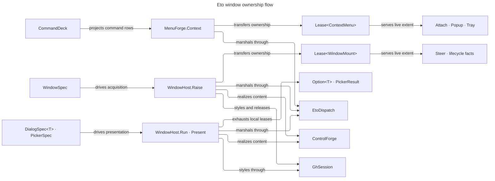

# [RASM_GRASSHOPPER_ETO_WINDOWS]

`CommandDeck` heads the window, dialog, menu, and command spine of the Grasshopper boundary — one command row family (`CommandSpec` over `CommandRole` push/toggle/radio rows) minted into a receipted deck, one recursive menu union (`MenuNode`) folding onto lease-owned native `ContextMenu` graphs through the minted deck, one window family (`WindowSpec` over `WindowRole` shell/float rows with the full `WindowChrome` posture and the marshalled `WindowVerb` live-mutation gate), and one dialog family — the typed-result `DialogSpec<TResult>` with the `PickerSpec` union collapsing file, folder, colour, font, message, and Rhino edit/number prompts into cases of one `Present` gate.

Rhino-styled presentation is a policy row: `ChromeRow.Rhino` routes through the session operator's one styling seam (`SessionOp.StyleCase`) and its `SessionReceipt` rides the window receipt, so every raise and present projection composes `GhSession` dispatch receipts — content trees are `Eto/controls.md` `ControlSpec` values realized and harvested inside this page's one marshal window. Every context menu and raised window crosses as a `Lease<T>` whose aggregate owner releases recursively minted resources through `EtoDispatch`; modal dialogs and native pickers settle entirely inside `Lease<T>.Use` windows.

## [01]-[INDEX]

- [02]-[COMMANDS]: `CommandTag` + `CommandRole` + `CommandSpec` + `CommandEcho` + `CommandDeck` + `CommandForge` — the reusable action rows, the mint fold with radio-group wiring, and the receipted execution journal.
- [03]-[MENUS]: `MenuNode` + `MenuForge` — the recursive menu union over the deck, context-menu construction, control attachment, and the marshalled popup.
- [04]-[WINDOWS]: `WindowRole` + `WindowChrome` + `ChromeRow` + `WindowSpec` + `WindowVerb` + `WindowReceipt` + `WindowHost.Raise`/`Steer` — modeless windows as spec rows, the one raise marshal, the live-window verb gate, and lease-owned teardown.
- [05]-[DIALOGS]: `DialogSpec<TResult>` + `FilterPlan` + `PickerSpec` + `PickerResult` + `WindowHost.Run`/`Present` — the typed-result modal fold over harvested content and the one native-picker gate.

## [02]-[COMMANDS]

- Owner: `CommandSpec` — one row per reusable action: `CommandTag` `[ValueObject<string>]` intent identity, menu text, optional bar text and tooltip, optional `Keys` chord, the enablement seed, the `CommandRole` row, the radio group tag, the toggle seed, and the `Fin`-railed effect. `CommandRole` `[SmartEnum<int>]` — `Push` (`Command`), `Toggle` (`CheckCommand` with seeded `Checked`), `Radio` (`RadioCommand` wired to its group head's `Controller`) — carries construction as one `[UseDelegateFromConstructor]` column, so a stateful or grouped verb is a row value, never a sibling spec family.
- Owner: `CommandForge.Mint` — the one deck fold: every spec mints its native command, radio rows resolve their group head through the fold's accumulating head map (the first row of a group becomes the controller), and every `Executed` raise runs the effect under `Op.Catch`, stamping a `CommandEcho` (tag, settlement, latency) from one kernel `MonotonicTimeline` into the deck's journal atom. `CommandDeck` is the sealed result — the tag-keyed command map with the journal — and duplicate tags refuse at the seal.
- Entry: `CommandForge.Mint(Seq<CommandSpec> specs, Op? key = null)` → `Fin<CommandDeck>`; `CommandDeck.Verb(CommandTag)` → `Option<Command>`.
- Law: an effect never throws into the host event pump — the `Executed` handler is the one exception funnel, a faulted effect stamps an unsettled echo and the fault rides the journal, so palette ranking, usage attribution, and failure surfacing are folds over one echo stream.
- Law: the tag is triple-duty — menu identity, journal identity, and the key every menu node and toolbar row resolves against — so a literal command name at a consuming surface is a bypassed row field.
- Boundary: chord conflict folding, availability streams, and per-placement policy are the shell chrome owner's concerns over this deck; `Command.Execute()` remains the programmatic raise and enters the same journal.
- Packages: Eto (`Command`, `CheckCommand.Checked`, `RadioCommand.Controller`, `Command.MenuText`/`ToolBarText`/`ToolTip`/`Shortcut`/`Enabled`/`Execute`/`Executed`, `Keys`), LanguageExt.Core (`Fin`, `HashMap`, `Atom`), `Rasm.Domain` (`Op`, `ValidityClaim`, `IValidityEvidence`), `Rasm.Parametric` (`MonotonicTimeline`).
- Growth: a new verb posture is one `CommandRole` row; a new journal fact is one `CommandEcho` field; the mint gate never widens.

```csharp signature
// --- [RUNTIME_PRELUDE] ----------------------------------------------------------------------
using Rasm.Csp;
using Rasm.Parametric;

namespace Rasm.Grasshopper.Eto;

// --- [TYPES] --------------------------------------------------------------------------------
[ValueObject<string>]
public readonly partial struct CommandTag {
    static partial void ValidateFactoryArguments(ref ValidationError? validationError, ref string value) {
        value = value?.Trim() ?? string.Empty;
        validationError = value.Length > 0 ? null : new ValidationError(message: "CommandTag requires a non-blank identity.");
    }
}

[SmartEnum<int>]
public sealed partial class CommandRole {
    public static readonly CommandRole Push = new(key: 0, mint: static (_, _) => new Command());
    public static readonly CommandRole Toggle = new(key: 1, mint: static (seed, _) => new CheckCommand { Checked = seed.IfNone(false) });
    public static readonly CommandRole Radio = new(key: 2, mint: static (_, head) => head.Match(
        Some: static controller => new RadioCommand { Controller = controller },
        None: static () => new RadioCommand()));
    [UseDelegateFromConstructor] internal partial Command Mint(Option<bool> seed, Option<RadioCommand> head);
}

// --- [MODELS] -------------------------------------------------------------------------------
public sealed record CommandSpec(
    CommandTag Tag, string MenuText, Option<string> BarText, Option<string> Hint, Option<Keys> Chord,
    bool Enabled, CommandRole Role, Option<CommandTag> Group, Option<bool> Checked, Func<Fin<Unit>> Effect);

[BoundaryAdapter, StructLayout(LayoutKind.Auto)]
public readonly record struct CommandEcho(CommandTag Tag, bool Settled, TimeSpan Latency) : IValidityEvidence {
    public bool IsValid => ValidityClaim.All(ValidityClaim.Nonnegative(value: Latency.TotalSeconds));
}

public sealed record CommandDeck(HashMap<CommandTag, Command> Verbs, Atom<Seq<CommandEcho>> Journal) {
    public Option<Command> Verb(CommandTag tag) => Verbs.Find(tag);
}

// --- [OPERATIONS] ---------------------------------------------------------------------------
[BoundaryAdapter]
public static class CommandForge {
    public static Fin<CommandDeck> Mint(Seq<CommandSpec> specs, Op? key = null) {
        Op op = key.OrDefault();
        Atom<Seq<CommandEcho>> journal = Atom(Seq<CommandEcho>());
        return from timeline in MonotonicTimeline.Of(provider: TimeProvider.System, key: op)
               from rows in Optional(specs).ToFin(op.InvalidInput())
               from state in rows.Fold(
                Fin.Succ((Verbs: HashMap<CommandTag, Command>(), Heads: HashMap<CommandTag, RadioCommand>())),
                (acc, spec) => acc.Bind(state => state.Verbs.ContainsKey(spec.Tag)
                    ? Fin.Fail<(HashMap<CommandTag, Command>, HashMap<CommandTag, RadioCommand>)>(op.InvalidInput())
                    : op.Catch(body: () => {
                        CommandTag anchor = spec.Group.IfNone(spec.Tag);
                        Command verb = spec.Role.Mint(seed: spec.Checked, head: state.Heads.Find(anchor));
                        verb.MenuText = spec.MenuText;
                        verb.Enabled = spec.Enabled;
                        spec.BarText.Iter(text => verb.ToolBarText = text);
                        spec.Hint.Iter(hint => verb.ToolTip = hint);
                        spec.Chord.Iter(chord => verb.Shortcut = chord);
                        verb.Executed += (_, _) => {
                            Fin<MonotonicStamp> entered = timeline.Capture(key: op);
                            bool settled = op.Catch(body: spec.Effect).IsSucc;
                            TimeSpan latency = (
                                from start in entered
                                from end in timeline.Capture(key: op)
                                from elapsed in timeline.Elapsed(start: start, end: end, key: op)
                                select elapsed).IfFail(TimeSpan.Zero);
                            ignore(journal.Swap(held => held.Add(new CommandEcho(
                                Tag: spec.Tag, Settled: settled,
                                Latency: latency))));
                        };
                        return Fin.Succ((
                            state.Verbs.Add(spec.Tag, verb),
                            verb is RadioCommand radio && state.Heads.Find(anchor).IsNone
                                ? state.Heads.Add(anchor, radio)
                                : state.Heads));
                    })))
               select new CommandDeck(Verbs: state.Verbs, Journal: journal);
    }
}
```

## [03]-[MENUS]

- Owner: `MenuNode` `[Union]` — the recursive menu vocabulary: `VerbCase(CommandTag)` resolves through the deck onto `Command.CreateMenuItem()`, `StubCase(string, Seq<MenuNode>)` folds children into a `SubMenuItem`, `RuleCase` mints the `SeparatorMenuItem`. One tree value describes any context or nested menu; parallel toolbar/menu/panel projection families collapse onto this node algebra with the deck.
- Owner: `MenuForge` — three gates: `Context` recursively acquires the full menu forest inside one marshal and returns `Lease<ContextMenu>.Owned`; the concrete `OwnedContextMenu` retains a lease for every minted `MenuItem`, recursively detaches every submenu, and releases all widgets on the UI thread. `Attach` mounts the live leased menu as a control's `ContextMenu`, and `Popup` shows it at a canvas point. An unresolvable verb tag or later branch fault unwinds every earlier branch before returning the typed failure.
- Entry: `MenuForge.Context(Seq<MenuNode> nodes, CommandDeck deck, Op? key = null)` → `Fin<Lease<ContextMenu>>`; `Attach(Control host, Lease<ContextMenu> menu, Op? key = null)` → `Fin<Unit>`; `Popup(Lease<ContextMenu> menu, Control anchor, PointF at, Op? key = null)` → `Fin<Unit>`.
- Law: menu items are projections of deck rows — checked state, enablement, and shortcut display all ride the native command the item was created from, so a menu never carries state beside its command and a toggle flip needs zero menu code.
- Boundary: menu lifecycle observation (`Opening`/`Closing`/`Closed`) is `Shell/events.md`'s fact algebra inside the menu lease window; `NoticeSurface.Tray` consumes the same lease evidence when a tray retains the menu. GH2 toolbar and input-panel chrome project the deck through the shell chrome owner, never a second command registry.
- Packages: Eto (`ContextMenu.Items`/`Show`, `Command.CreateMenuItem`, `SubMenuItem`, `SeparatorMenuItem`, `MenuItem.Text`, `Control.ContextMenu`), `Rasm.Domain`, `Eto/runtime.md` (`EtoDispatch`).
- Growth: a new entry kind is one `MenuNode` case with one build arm; the three gates never widen.

```csharp signature
// --- [RUNTIME_PRELUDE] ----------------------------------------------------------------------
using Rasm.Csp;

namespace Rasm.Grasshopper.Eto;

// --- [TYPES] --------------------------------------------------------------------------------
[Union]
public abstract partial record MenuNode {
    private MenuNode() { }
    public sealed record VerbCase(CommandTag Tag) : MenuNode;
    public sealed record StubCase(string Text, Seq<MenuNode> Items) : MenuNode;
    public sealed record RuleCase : MenuNode;
}

internal sealed record MenuBranch(MenuItem Root, Seq<Lease<MenuItem>> Owned);

internal static class EtoLifetime {
    internal static Fin<Unit> Preserve(Fin<Unit> first, Fin<Unit> next) => first.IsFail ? first : next;

    internal static Fin<Unit> Release<T>(Seq<Lease<T>> resources, Op key) where T : class, IDisposable =>
        resources.Reverse().Aggregate(
            seed: Fin.Succ(unit),
            func: (first, resource) => Preserve(
                first: first,
                next: key.Catch(body: () => Fin.Succ(resource.Dispose()))));
}

internal sealed class OwnedContextMenu(Seq<MenuBranch> branches) : ContextMenu {
    private readonly Seq<MenuBranch> branches = branches;
    private readonly Atom<Option<Error>> lastFault = Atom(Option<Error>.None);
    private int releaseState;

    internal Option<Error> LastFault => lastFault.Value;

    protected override void Dispose(bool disposing) {
        if (!disposing) { base.Dispose(disposing: false); return; }
        if (Interlocked.Exchange(location1: ref releaseState, value: 1) != 0) return;
        Op op = Op.Of(name: nameof(OwnedContextMenu));
        Fin<Unit> released = EtoDispatch.Run(body: () => {
            Fin<Unit> detached = op.Catch(body: () => Fin.Succ(Op.Side(action: () => {
                Items.Clear();
                branches.Iter(branch => Detach(item: branch.Root));
            })));
            Fin<Unit> items = EtoLifetime.Release(resources: branches.Bind(static branch => branch.Owned), key: op);
            Fin<Unit> context = op.Catch(body: () => Fin.Succ(DisposeNative()));
            return EtoLifetime.Preserve(first: EtoLifetime.Preserve(first: detached, next: items), next: context);
        }, key: op);
        released.Match(
            Succ: _ => { Volatile.Write(location: ref releaseState, value: 2); return unit; },
            Fail: error => {
                ignore(lastFault.Swap(_ => Some(error)));
                Volatile.Write(location: ref releaseState, value: 0);
                return unit;
            });
    }

    private Unit DisposeNative() { base.Dispose(disposing: true); return unit; }

    internal static void Detach(MenuItem item) {
        if (item is not SubMenuItem branch) return;
        Seq<MenuItem> children = toSeq(branch.Items);
        branch.Items.Clear();
        children.Iter(Detach);
    }
}

// --- [OPERATIONS] ---------------------------------------------------------------------------
[BoundaryAdapter]
public static class MenuForge {
    public static Fin<Lease<ContextMenu>> Context(Seq<MenuNode> nodes, CommandDeck deck, Op? key = null) {
        Op op = key.OrDefault();
        return from valid in Optional(deck).ToFin(op.InvalidInput())
               from menu in EtoDispatch.Run(body: () => Build(nodes: nodes, deck: valid, op: op).Bind(branches => Acquire(branches: branches, op: op)), key: op)
               select menu;
    }

    public static Fin<Unit> Attach(Control host, Lease<ContextMenu> menu, Op? key = null) {
        Op op = key.OrDefault();
        return from target in Optional(host).ToFin(op.InvalidInput())
               from built in Optional(menu).ToFin(op.InvalidInput())
               from mounted in EtoDispatch.Run(body: () => op.Catch(body: () => Fin.Succ(Op.Side(action: () => target.ContextMenu = built.Resource))), key: op)
               select mounted;
    }

    public static Fin<Unit> Popup(Lease<ContextMenu> menu, Control anchor, PointF at, Op? key = null) {
        Op op = key.OrDefault();
        return from built in Optional(menu).ToFin(op.InvalidInput())
               from host in Optional(anchor).ToFin(op.InvalidInput())
               from shown in EtoDispatch.Run(body: () => op.Catch(body: () => Fin.Succ(Op.Side(action: () => built.Resource.Show(host, at)))), key: op)
               select shown;
    }

    private static Fin<Seq<MenuBranch>> Build(Seq<MenuNode> nodes, CommandDeck deck, Op op) => nodes.Fold(
        Fin.Succ(Seq<MenuBranch>()),
        (acc, node) => acc.Bind(held => Built(node: node, deck: deck, op: op).Match(
            Succ: branch => Fin.Succ(held.Add(branch)),
            Fail: error => {
                ignore(Release(branches: held, op: op));
                return Fin.Fail<Seq<MenuBranch>>(error: error);
            })));

    private static Fin<MenuBranch> Built(MenuNode node, CommandDeck deck, Op op) => node.Switch(
        state: (Deck: deck, Key: op),
        verbCase: static (s, c) => s.Deck.Verb(c.Tag).ToFin(s.Key.MissingContext())
            .Bind(verb => s.Key.Catch(body: () => {
                MenuItem item = verb.CreateMenuItem();
                return Fin.Succ(new MenuBranch(Root: item, Owned: Seq((Lease<MenuItem>)new Lease<MenuItem>.Owned(Value: item))));
            })),
        stubCase: static (s, c) => Build(nodes: c.Items, deck: s.Deck, op: s.Key).Bind(children => Stub(text: c.Text, children: children, op: s.Key)),
        ruleCase: static (s, _) => s.Key.Catch(body: () => {
            MenuItem item = new SeparatorMenuItem();
            return Fin.Succ(new MenuBranch(Root: item, Owned: Seq((Lease<MenuItem>)new Lease<MenuItem>.Owned(Value: item))));
        }));

    private static Fin<MenuBranch> Stub(string text, Seq<MenuBranch> children, Op op) {
        SubMenuItem? stub = null;
        Fin<MenuBranch> built = op.Catch(body: () => {
            stub = new SubMenuItem();
            stub.Text = text;
            children.Iter(child => stub.Items.Add(child.Root));
            Seq<Lease<MenuItem>> owned = children.Bind(static child => child.Owned)
                .Add((Lease<MenuItem>)new Lease<MenuItem>.Owned(Value: stub));
            return Fin.Succ(new MenuBranch(Root: stub, Owned: owned));
        });
        built.IfFail(_ => {
            Seq<Lease<MenuItem>> owned = children.Bind(static child => child.Owned);
            if (stub is null) ignore(Release(branches: children, op: op));
            else ignore(Release(
                branches: Seq(new MenuBranch(
                    Root: stub,
                    Owned: owned.Add((Lease<MenuItem>)new Lease<MenuItem>.Owned(Value: stub)))),
                op: op));
        });
        return built;
    }

    private static Fin<Lease<ContextMenu>> Acquire(Seq<MenuBranch> branches, Op op) {
        OwnedContextMenu? menu = null;
        Fin<Lease<ContextMenu>> acquired = op.Catch(body: () => {
            menu = new OwnedContextMenu(branches: branches);
            branches.Iter(branch => menu.Items.Add(branch.Root));
            return Fin.Succ((Lease<ContextMenu>)new Lease<ContextMenu>.Owned(Value: menu));
        });
        acquired.IfFail(_ => {
            if (menu is not null) menu.Dispose();
            else ignore(Release(branches: branches, op: op));
        });
        return acquired;
    }

    private static Fin<Unit> Release(Seq<MenuBranch> branches, Op op) {
        Fin<Unit> detached = op.Catch(body: () => Fin.Succ(Op.Side(action: () => branches.Iter(branch => OwnedContextMenu.Detach(item: branch.Root)))));
        Fin<Unit> released = EtoLifetime.Release(resources: branches.Bind(static branch => branch.Owned), key: op);
        return EtoLifetime.Preserve(first: detached, next: released);
    }
}
```

## [04]-[WINDOWS]

- Owner: `WindowSpec` — one row per modeless surface: title, `ControlSpec` content, `WindowRole` row, `WindowChrome` posture, `ChromeRow` skin, activation bit. `WindowRole` `[SmartEnum<int>]` — `Shell` (`Form`) and `Float` (`FloatingForm`, the always-on-top palette) — is the modality axis; `WindowChrome` carries the full window posture the host admits as one record: origin, extent, resizable/minimizable/maximizable/closeable posture via `WindowStyle` and the three bits, topmost, taskbar presence, opacity, `WindowState`, badge icon, and owner. `ChromeRow` `[SmartEnum<int>]` internalizes presentation styling — `Rhino` (key 0) routes the surface through `GhSession.Apply(SessionOp.StyleCase(...))`, the boundary's one styling seam, and carries the `SessionReceipt` back; `Bare` (key 1) skips it — so Rhino-native appearance is a data row on the spec, never a call-site verb.
- Owner: `WindowHost.Raise` — the one raise marshal: realize content, mint the role's form, acquire `WindowMount`, dress the chrome, skin through the session seam, assign content, and show. `WindowMount` owns both `Lease<Form>` and the realized root's `Lease<Control>`, retains the `ControlPlant`, and tears down through one idempotent UI-affine arrow that detaches content, enters `SessionOp.ReleaseCase`, and disposes the realized root. `WindowReceipt` carries `Lease<WindowMount>.Owned`, the composed `Option<SessionReceipt>`, and marshal latency; `Surface` and `Plant` project through the live mount. `WindowVerb` `[Union]` is the live-window mutation vocabulary over the leased mount — `FrontCase`, `RetitleCase`, and `RedressCase` — behind one marshalled `Steer` gate.
- Entry: `WindowHost.Raise(WindowSpec spec, Op? key = null)` → `Fin<WindowReceipt>`; `WindowHost.Steer(Lease<WindowMount> window, WindowVerb verb, Op? key = null)` → `Fin<Unit>`.
- Law: the whole raise settles inside ONE `EtoDispatch` marshal — realize, dress, skin, and show share the window; the nested session marshal short-circuits on-thread, so composing `GhSession` inside the raise costs no second hop.
- Law: ownership transfers only after the complete raise settles. A failure during realization, role minting, dressing, styling, assignment, or showing releases every acquired form/root before the fault returns; a successful receipt transfers the mount lease, whose inverse feeds the form lease through `SessionOp.ReleaseCase`. `Form.Close`/`Dispose` and content disposal never appear at a consumer.
- Boundary: window lifecycle facts (`Closing`/`Closed`/`WindowStateChanged`/`LogicalPixelSizeChanged`) are `Shell/events.md` source rows on the raised form; per-display placement math reads `Eto/runtime.md`'s `Display.Resolve` facts; `Window.SetOwner` on the chrome pins z-order to a host window.
- Packages: Eto (`Form.Show`/`ShowActivated`, `FloatingForm`, `Window.Title`/`Location`/`Opacity`/`Resizable`/`Minimizable`/`Maximizable`/`Topmost`/`ShowInTaskbar`/`WindowState`/`WindowStyle`/`Icon`/`SetOwner`/`BringToFront`, `Control.Size`, `Panel.Content`), `Rasm.Domain` (`Op`, `Lease<T>`, `ValidityClaim`), `Rasm.Parametric` (`MonotonicTimeline`, `MonotonicStamp`), `Shell/session.md` (`GhSession`, `SessionOp`, `SessionReceipt`), `Eto/controls.md` (`ControlForge`, `ControlSpec`, `ControlPlant`), `Eto/runtime.md` (`EtoDispatch`).
- Growth: a new window modality is one `WindowRole` row; a new posture fact is one `WindowChrome` field; a new live verb is one `WindowVerb` case with one `Steer` arm; the two gates never widen.

```csharp signature
// --- [RUNTIME_PRELUDE] ----------------------------------------------------------------------
using Rasm.Csp;
using Rasm.Grasshopper.Shell;
using Rasm.Parametric;

namespace Rasm.Grasshopper.Eto;

// --- [TYPES] --------------------------------------------------------------------------------
[SmartEnum<int>]
public sealed partial class WindowRole {
    public static readonly WindowRole Shell = new(key: 0, mint: static () => new Form());
    public static readonly WindowRole Float = new(key: 1, mint: static () => new FloatingForm());
    [UseDelegateFromConstructor] internal partial Form Mint();
}

[SmartEnum<int>]
public sealed partial class ChromeRow {
    public static readonly ChromeRow Rhino = new(key: 0, dress: static (surface, key) =>
        GhSession.Apply(op: new SessionOp.StyleCase(Surface: surface), key: key).Map(Some));
    public static readonly ChromeRow Bare = new(key: 1, dress: static (_, _) => Fin.Succ(Option<SessionReceipt>.None));
    [UseDelegateFromConstructor] internal partial Fin<Option<SessionReceipt>> Dress(Control surface, Op key);
}

[Union]
public abstract partial record WindowVerb {
    private WindowVerb() { }
    public sealed record FrontCase : WindowVerb;
    public sealed record RetitleCase(string Title) : WindowVerb;
    public sealed record RedressCase(WindowChrome Chrome) : WindowVerb;
}

// --- [MODELS] -------------------------------------------------------------------------------
public sealed record WindowChrome(
    Option<Point> Origin, Option<Size> Extent, bool Resizable, bool Minimizable, bool Maximizable,
    bool Topmost, bool ShowInTaskbar, Option<double> Opacity, WindowState State, WindowStyle Style,
    Option<Icon> Badge, Option<Window> Owner) {
    public static readonly WindowChrome Default = new(
        Origin: None, Extent: None, Resizable: true, Minimizable: true, Maximizable: true,
        Topmost: false, ShowInTaskbar: true, Opacity: None, State: WindowState.Normal, Style: WindowStyle.Default,
        Badge: None, Owner: None);
}

public sealed record WindowSpec(
    string Title, ControlSpec Content, WindowRole Role, WindowChrome Chrome, ChromeRow Skin, bool Activated);

public sealed record WindowReceipt(
    Op Operation, Lease<WindowMount> Mount, Option<SessionReceipt> Styled, TimeSpan Latency) : IValidityEvidence {
    public Form Surface => Mount.Resource.Surface;
    public ControlPlant Plant => Mount.Resource.Plant;
    public bool IsValid => ValidityClaim.All(ValidityClaim.Nonnegative(value: Latency.TotalSeconds));
}

// --- [SERVICES] -----------------------------------------------------------------------------
public sealed class WindowMount : IDisposable {
    private readonly Lease<Form> surface;
    private readonly Lease<Control> content;
    private readonly Atom<Option<Error>> lastFault = Atom(Option<Error>.None);
    private int releaseState;

    internal WindowMount(Form surface, ControlPlant plant) {
        this.surface = new Lease<Form>.Owned(Value: surface);
        content = new Lease<Control>.Owned(Value: plant.Root);
        Plant = plant;
    }

    public Form Surface => surface.Resource;
    public ControlPlant Plant { get; }
    public Option<Error> LastFault => lastFault.Value;

    public void Dispose() => ignore(Release(key: Op.Of(name: nameof(WindowMount))));

    private Fin<Unit> Release(Op key) {
        if (Interlocked.Exchange(location1: ref releaseState, value: 1) != 0) return Fin.Succ(unit);
        Fin<Unit> released = EtoDispatch.Run(body: () => {
            Fin<Unit> detached = key.Catch(body: () => Fin.Succ(Op.Side(action: () => {
                if (ReferenceEquals(objA: Surface.Content, objB: Plant.Root)) Surface.Content = null;
            })));
            Fin<Unit> closed = GhSession.Apply(op: new SessionOp.ReleaseCase(Surface: surface), key: key).Map(_ => unit);
            Fin<Unit> disposed = key.Catch(body: () => Fin.Succ(content.Dispose()));
            return EtoLifetime.Preserve(
                first: EtoLifetime.Preserve(first: detached, next: closed),
                next: disposed);
        }, key: key);
        released.Match(
            Succ: _ => { Volatile.Write(location: ref releaseState, value: 2); return unit; },
            Fail: error => {
                ignore(lastFault.Swap(_ => Some(error)));
                Volatile.Write(location: ref releaseState, value: 0);
                return unit;
            });
        return released;
    }
}

// --- [OPERATIONS] ---------------------------------------------------------------------------
[BoundaryAdapter]
public static partial class WindowHost {
    public static Fin<WindowReceipt> Raise(WindowSpec spec, Op? key = null) {
        Op op = key.OrDefault();
        return from timeline in MonotonicTimeline.Of(provider: TimeProvider.System, key: op)
               from entered in timeline.Capture(key: op)
               from valid in Optional(spec).ToFin(op.InvalidInput())
               from receipt in EtoDispatch.Run(
                   body: () => Acquired(spec: valid, timeline: timeline, entered: entered, op: op), key: op)
               select receipt;
    }

    public static Fin<Unit> Steer(Lease<WindowMount> window, WindowVerb verb, Op? key = null) {
        Op op = key.OrDefault();
        return from live in Optional(window).ToFin(op.InvalidInput())
               let target = live.Resource.Surface
               from valid in Optional(verb).ToFin(op.InvalidInput())
               from settled in EtoDispatch.Run(body: () => valid.Switch(
                   state: (Shell: target, Key: op),
                   frontCase: static (s, _) => s.Key.Catch(body: () => Fin.Succ(Op.Side(action: s.Shell.BringToFront))),
                   retitleCase: static (s, c) => s.Key.Catch(body: () => Fin.Succ(Op.Side(action: () => s.Shell.Title = c.Title))),
                   redressCase: static (s, c) => s.Key.Catch(body: () => Fin.Succ(Op.Side(action: () => ignore(Dressed(shell: s.Shell, chrome: c.Chrome)))))), key: op)
               select settled;
    }

    private static Fin<WindowReceipt> Acquired(WindowSpec spec, MonotonicTimeline timeline, MonotonicStamp entered, Op op) {
        ControlPlant? plant = null;
        Form? shell = null;
        WindowMount? mount = null;
        Fin<WindowReceipt> acquired =
            from realized in ControlForge.Realize(spec: spec.Content, key: op).Map(value => { plant = value; return value; })
            from minted in op.Catch(body: () => Fin.Succ(spec.Role.Mint())).Map(value => { shell = value; return value; })
            from titled in op.Catch(body: () => Fin.Succ(Op.Side(action: () => minted.Title = spec.Title)))
            from owned in op.Catch(body: () => {
                WindowMount active = new(surface: minted, plant: realized);
                mount = active;
                return Fin.Succ(active);
            })
            from dressed in op.Catch(body: () => Fin.Succ(Dressed(shell: minted, chrome: spec.Chrome)))
            from filled in op.Catch(body: () => Fin.Succ(Op.Side(action: () => {
                dressed.ShowActivated = spec.Activated;
                dressed.Content = realized.Root;
            })))
            from styled in spec.Skin.Dress(surface: dressed, key: op)
            from shown in op.Catch(body: () => Fin.Succ(Op.Side(action: dressed.Show)))
            from ended in timeline.Capture(key: op)
            from latency in timeline.Elapsed(start: entered, end: ended, key: op)
            select new WindowReceipt(
                Operation: op,
                Mount: (Lease<WindowMount>)new Lease<WindowMount>.Owned(Value: owned),
                Styled: styled,
                Latency: latency);
        acquired.IfFail(_ => {
            if (mount is not null) mount.Dispose();
            else {
                if (shell is not null) ignore(GhSession.Apply(
                    op: new SessionOp.ReleaseCase(Surface: new Lease<Form>.Owned(Value: shell)), key: op));
                if (plant is not null) ignore(op.Catch(body: () => Fin.Succ(new Lease<Control>.Owned(Value: plant.Root).Dispose())));
            }
        });
        return acquired;
    }

    private static Form Dressed(Form shell, WindowChrome chrome) {
        shell.Resizable = chrome.Resizable;
        shell.Minimizable = chrome.Minimizable;
        shell.Maximizable = chrome.Maximizable;
        shell.Topmost = chrome.Topmost;
        shell.ShowInTaskbar = chrome.ShowInTaskbar;
        shell.WindowState = chrome.State;
        shell.WindowStyle = chrome.Style;
        chrome.Origin.Iter(origin => shell.Location = origin);
        chrome.Extent.Iter(extent => shell.Size = extent);
        chrome.Opacity.Iter(opacity => shell.Opacity = opacity);
        chrome.Badge.Iter(badge => shell.Icon = badge);
        chrome.Owner.Iter(shell.SetOwner);
        return shell;
    }
}
```

## [05]-[DIALOGS]

- Owner: `DialogSpec<TResult>` — the typed-result modal row: title, `ControlSpec` content, accept/cancel captions, `ChromeRow` skin, and the `Settle` fold from the harvested `FieldReport` to the typed result. Its modal fold realizes the content, then nests the realized root, accept/cancel buttons, layout, and `Dialog<Option<TResult>>` inside owned `Lease<T>.Use` windows. Harvest-then-settle runs inside the callback's `Op.Catch`; an admission refusal renders as a host warning and keeps the dialog open. Dismissal and settlement are one `Option`, never a sentinel.
- Owner: `PickerSpec` `[Union]` — the native prompt family as cases of one gate: `OpenCase`/`SaveCase` (file dialogs with `FilterPlan` rows onto `FileFilter`), `FolderCase`, `ShadeCase` (`ColorDialog` honoring `SupportsAllowAlpha`), `GlyphCase` (`FontDialog`), `AskCase` (`MessageBox` verdict prompts), and the Rhino-styled fast lane `EditCase`/`NumberCase` over `Rhino.UI.Dialogs.ShowEditBox`/`ShowNumberBox`. `PickerResult` `[Union]` mirrors the family — paths, path, colour, font, verdict, text, number, dismissed — so every prompt settles typed through one `Present` gate — a per-picker method family never exists.
- Entry: `WindowHost.Run<TResult>(DialogSpec<TResult> spec, Option<Control> anchor, Op? key = null)` → `Fin<Option<TResult>>`; `WindowHost.Present(PickerSpec spec, Option<Control> anchor, Op? key = null)` → `Fin<PickerResult>`.
- Law: each gate is ONE marshal — construction, styling, the modal loop, result capture, and reverse-order lease release share the window. Every `CommonDialog`, modal widget, and page-owned control disposes before the marshal returns on success, dismissal, or failure; a dialog handle never escapes, so the typed result is the only egress.
- Law: dismissal is data — `DialogResult.Ok` discriminates settlement, every non-`Ok` path folds to `DismissedCase`/`None`, and a thrown host dialog lands as a typed `Fault` through `Op.Catch`, never an exception into the modal pump.
- Boundary: `Dialog.DisplayMode` and the positive/negative button collections stay host knobs a spec growth field claims when a consumer demands attached-sheet presentation; the presentation gate that queues or suppresses prompts by application phase is a shell concern composed over these gates.
- Packages: Eto (`Dialog<T>.ShowModal`/`Result`/`DefaultButton`/`AbortButton`, `MessageBox.Show`, `MessageBoxButtons`, `MessageBoxType`, `OpenFileDialog.MultiSelect`/`Filenames`, `SaveFileDialog`, `FileDialog.FileName`/`Directory`/`Filters`/`CheckFileExists`, `FileFilter`, `SelectFolderDialog.Directory`/`Title`, `ColorDialog.Color`/`AllowAlpha`/`SupportsAllowAlpha`, `FontDialog.Font`, `DialogResult`, `Button.Click`, `DynamicLayout`), RhinoCommon (`Rhino.UI.Dialogs.ShowEditBox`/`ShowNumberBox`), `Rasm.Domain`, `Eto/controls.md` (`ControlForge`, `FieldReport`), `Eto/runtime.md` (`EtoDispatch`).
- Growth: a new native prompt is one `PickerSpec` case with one `Present` arm and its `PickerResult` mirror; the two gates never widen.

```csharp signature
// --- [RUNTIME_PRELUDE] ----------------------------------------------------------------------
using Rasm.Csp;

namespace Rasm.Grasshopper.Eto;

// --- [TYPES] --------------------------------------------------------------------------------
[Union]
public abstract partial record PickerSpec {
    private PickerSpec() { }
    public sealed record OpenCase(string Title, Option<Uri> Home, bool Multi, Seq<FilterPlan> Filters) : PickerSpec;
    public sealed record SaveCase(string Title, Option<Uri> Home, Option<string> Seed, Seq<FilterPlan> Filters) : PickerSpec;
    public sealed record FolderCase(string Title, Option<string> Home) : PickerSpec;
    public sealed record ShadeCase(Color Seed, bool Alpha) : PickerSpec;
    public sealed record GlyphCase(Option<Font> Seed) : PickerSpec;
    public sealed record AskCase(string Text, string Caption, MessageBoxButtons Buttons, MessageBoxType Kind) : PickerSpec;
    public sealed record EditCase(string Title, string Message, string Seed, bool Multiline) : PickerSpec;
    public sealed record NumberCase(string Title, string Message, double Seed, Option<(double Floor, double Ceiling)> Bounds) : PickerSpec;
}

[Union]
public abstract partial record PickerResult {
    private PickerResult() { }
    public sealed record PathsCase(Seq<string> Values) : PickerResult;
    public sealed record PathCase(string Value) : PickerResult;
    public sealed record ShadeCase(Color Value) : PickerResult;
    public sealed record GlyphCase(Font Value) : PickerResult;
    public sealed record VerdictCase(DialogResult Value) : PickerResult;
    public sealed record TextCase(string Value) : PickerResult;
    public sealed record NumberCase(double Value) : PickerResult;
    public sealed record DismissedCase : PickerResult;
}

// --- [MODELS] -------------------------------------------------------------------------------
public sealed record FilterPlan(string Label, Seq<string> Extensions);

public sealed record DialogSpec<TResult>(
    string Title, ControlSpec Content, string AcceptText, string CancelText, ChromeRow Skin,
    Func<FieldReport, Fin<TResult>> Settle);

// --- [OPERATIONS] ---------------------------------------------------------------------------
[BoundaryAdapter]
public static partial class WindowHost {
    private static readonly Padding DialogPad = new(all: 12);
    private static readonly Size DialogGap = new(width: 8, height: 8);

    public static Fin<Option<TResult>> Run<TResult>(DialogSpec<TResult> spec, Option<Control> anchor, Op? key = null) {
        Op op = key.OrDefault();
        return from valid in Optional(spec).ToFin(op.InvalidInput())
               from settle in Optional(valid.Settle).ToFin(op.InvalidInput())
               from outcome in EtoDispatch.Run(body: () =>
                   ControlForge.Realize(spec: valid.Content, key: op).Bind(plant => Modal(
                       spec: valid, settle: settle, plant: plant, anchor: anchor, op: op)), key: op)
               select outcome;
    }

    public static Fin<PickerResult> Present(PickerSpec spec, Option<Control> anchor, Op? key = null) {
        Op op = key.OrDefault();
        return Optional(spec).ToFin(op.InvalidInput()).Bind(valid => EtoDispatch.Run(body: () => valid.Switch(
            state: (Anchor: anchor, Key: op),
            openCase: static (s, c) => s.Key.Catch(body: () => {
                Lease<OpenFileDialog> owned = new Lease<OpenFileDialog>.Owned(Value: new OpenFileDialog());
                return owned.Use(picker => {
                    picker.Title = c.Title;
                    picker.MultiSelect = c.Multi;
                    picker.CheckFileExists = true;
                    c.Home.Iter(home => picker.Directory = home);
                    c.Filters.Iter(filter => picker.Filters.Add(new FileFilter(filter.Label, [.. filter.Extensions])));
                    return Fin.Succ(picker.ShowDialog(Anchored(anchor: s.Anchor)) == DialogResult.Ok
                        ? (PickerResult)new PickerResult.PathsCase(Values: toSeq(picker.Filenames))
                        : new PickerResult.DismissedCase());
                });
            }),
            saveCase: static (s, c) => s.Key.Catch(body: () => {
                Lease<SaveFileDialog> owned = new Lease<SaveFileDialog>.Owned(Value: new SaveFileDialog());
                return owned.Use(picker => {
                    picker.Title = c.Title;
                    c.Home.Iter(home => picker.Directory = home);
                    c.Seed.Iter(name => picker.FileName = name);
                    c.Filters.Iter(filter => picker.Filters.Add(new FileFilter(filter.Label, [.. filter.Extensions])));
                    return Fin.Succ(picker.ShowDialog(Anchored(anchor: s.Anchor)) == DialogResult.Ok
                        ? (PickerResult)new PickerResult.PathCase(Value: picker.FileName)
                        : new PickerResult.DismissedCase());
                });
            }),
            folderCase: static (s, c) => s.Key.Catch(body: () => {
                Lease<SelectFolderDialog> owned = new Lease<SelectFolderDialog>.Owned(Value: new SelectFolderDialog());
                return owned.Use(picker => {
                    picker.Title = c.Title;
                    c.Home.Iter(home => picker.Directory = home);
                    return Fin.Succ(picker.ShowDialog(Anchored(anchor: s.Anchor)) == DialogResult.Ok
                        ? (PickerResult)new PickerResult.PathCase(Value: picker.Directory)
                        : new PickerResult.DismissedCase());
                });
            }),
            shadeCase: static (s, c) => s.Key.Catch(body: () => {
                Lease<ColorDialog> owned = new Lease<ColorDialog>.Owned(Value: new ColorDialog());
                return owned.Use(picker => {
                    picker.Color = c.Seed;
                    picker.AllowAlpha = c.Alpha && picker.SupportsAllowAlpha;
                    return Fin.Succ(picker.ShowDialog(Anchored(anchor: s.Anchor)) == DialogResult.Ok
                        ? (PickerResult)new PickerResult.ShadeCase(Value: picker.Color)
                        : new PickerResult.DismissedCase());
                });
            }),
            glyphCase: static (s, c) => s.Key.Catch(body: () => {
                Lease<FontDialog> owned = new Lease<FontDialog>.Owned(Value: new FontDialog());
                return owned.Use(picker => {
                    c.Seed.Iter(font => picker.Font = font);
                    return Fin.Succ(picker.ShowDialog(Anchored(anchor: s.Anchor)) == DialogResult.Ok
                        ? (PickerResult)new PickerResult.GlyphCase(Value: picker.Font)
                        : new PickerResult.DismissedCase());
                });
            }),
            askCase: static (s, c) => s.Key.Catch(body: () => Fin.Succ((PickerResult)new PickerResult.VerdictCase(
                Value: MessageBox.Show(Anchored(anchor: s.Anchor), c.Text, c.Caption, c.Buttons, c.Kind)))),
            editCase: static (s, c) => s.Key.Catch(body: () => Fin.Succ(
                Rhino.UI.Dialogs.ShowEditBox(title: c.Title, message: c.Message, defaultText: c.Seed, multiline: c.Multiline, text: out string text)
                    ? (PickerResult)new PickerResult.TextCase(Value: text)
                    : new PickerResult.DismissedCase())),
            numberCase: static (s, c) => s.Key.Catch(body: () => {
                double number = c.Seed;
                bool accepted = c.Bounds.Match(
                    Some: bounds => Rhino.UI.Dialogs.ShowNumberBox(title: c.Title, message: c.Message, number: ref number, minimum: bounds.Floor, maximum: bounds.Ceiling),
                    None: () => Rhino.UI.Dialogs.ShowNumberBox(title: c.Title, message: c.Message, number: ref number));
                return Fin.Succ(accepted
                    ? (PickerResult)new PickerResult.NumberCase(Value: number)
                    : new PickerResult.DismissedCase());
            })), key: op));
    }

    private static Fin<Option<TResult>> Modal<TResult>(
        DialogSpec<TResult> spec, Func<FieldReport, Fin<TResult>> settle, ControlPlant plant, Option<Control> anchor, Op op) => op.Catch(body: () => {
        Lease<Control> root = new Lease<Control>.Owned(Value: plant.Root);
        return root.Use(content => {
            Lease<Button> accepted = new Lease<Button>.Owned(Value: new Button());
            return accepted.Use(accept => {
                accept.Text = spec.AcceptText;
                Lease<Button> cancelled = new Lease<Button>.Owned(Value: new Button());
                return cancelled.Use(cancel => {
                    cancel.Text = spec.CancelText;
                    Lease<DynamicLayout> arranged = new Lease<DynamicLayout>.Owned(Value: new DynamicLayout());
                    return arranged.Use(layout => {
                        layout.Padding = DialogPad;
                        layout.Spacing = DialogGap;
                        Lease<Dialog<Option<TResult>>> presented = new Lease<Dialog<Option<TResult>>>.Owned(
                            Value: new Dialog<Option<TResult>>());
                        return presented.Use(dialog => {
                            dialog.Title = spec.Title;
                            accept.Click += (_, _) => ignore(op.Catch(body: () => {
                                ControlForge.Harvest(plant: plant, key: op).Bind(settle).Match(
                                    Succ: value => Op.Side(action: () => dialog.Close(Some(value))),
                                    Fail: error => Op.Side(action: () => ignore(MessageBox.Show(
                                        dialog, error.Message, spec.Title, MessageBoxButtons.OK, MessageBoxType.Warning))));
                                return Fin.Succ(unit);
                            }));
                            cancel.Click += (_, _) => ignore(op.Catch(body: () => Fin.Succ(Op.Side(
                                action: () => dialog.Close(Option<TResult>.None)))));
                            layout.AddRow(content);
                            layout.AddRow(null, cancel, accept);
                            dialog.Content = layout;
                            dialog.DefaultButton = accept;
                            dialog.AbortButton = cancel;
                            return spec.Skin.Dress(surface: dialog, key: op).Bind(_ => op.Catch(body: () => Fin.Succ(anchor.Match(
                                Some: owner => dialog.ShowModal(owner),
                                None: dialog.ShowModal))));
                        });
                    });
                });
            });
        });
    });

    private static Control Anchored(Option<Control> anchor) =>
        anchor.MatchUnsafe(Some: static owner => owner, None: static () => null!);
}
```



## [06]-[DENSITY_BAR]

One owner per axis; capability lands as a case, a row, or a field — never a sibling surface.

| [INDEX] | [CONCERN]          | [OWNER]                                      | [RAIL]                              | [CASES] |
| :-----: | :----------------- | :------------------------------------------- | :---------------------------------- | :-----: |
|  [01]   | reusable actions   | `CommandTag` + `CommandRole` + `CommandSpec` | `Mint → Fin<CommandDeck>`           |    3    |
|  [02]   | execution evidence | `CommandEcho` + `CommandDeck`                | journal fold                        |    1    |
|  [03]   | menus              | `MenuNode` + `MenuForge`                     | `Context → Fin<Lease<ContextMenu>>` |    3    |
|  [04]   | windows            | `WindowRole` + `WindowChrome` + `WindowSpec` | `Raise → Fin<WindowReceipt>`        |   2+2   |
|  [05]   | live window verbs  | `WindowVerb`                                 | `Steer → Fin<Unit>`                 |    3    |
|  [06]   | typed modals       | `DialogSpec<TResult>`                        | `Run → Fin<Option<TResult>>`        |    1    |
|  [07]   | native prompts     | `PickerSpec` + `PickerResult`                | `Present → Fin<PickerResult>`       |   8+8   |

`Op`, `Fault`, `Lease<T>`, `EtoDispatch`, `ControlForge`, `GhSession`, and `SessionOp.StyleCase` are composed upstream owners; `Dialog.DisplayMode` and the positive/negative button collections are the page's declared growth fields.

## [07]-[RESEARCH]

<!-- source-only: research row template:
[TOKEN]-[OPEN|BLOCKED]: <exact question>; <verification route>.
[SPLIT_MEMBER]-[OPEN]: does `shape-core` expose `split_all`; verify against the member rail.
-->

(none)
