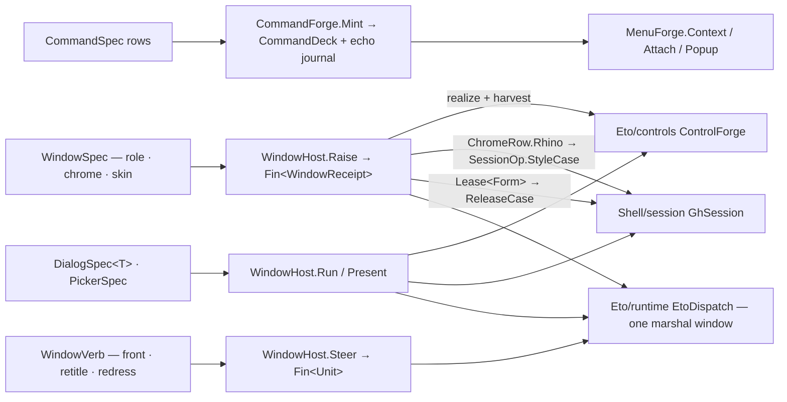

# [RASM_GRASSHOPPER_ETO_WINDOWS]

The window, dialog, menu, and command spine of the Grasshopper boundary — one command row family (`CommandSpec` over `CommandRole` push/toggle/radio rows) minted into a receipted `CommandDeck`, one recursive menu union (`MenuNode`) folding onto native `ContextMenu` graphs through the minted deck, one window family (`WindowSpec` over `WindowRole` shell/float rows with the full `WindowChrome` posture and the marshalled `WindowVerb` live-mutation gate), and one dialog family — the typed-result `DialogSpec<TResult>` absorbing the census `FormPlan`, plus the `PickerSpec` union collapsing file, folder, colour, font, message, and Rhino edit/number prompts into cases of one `Present` gate. Rhino-styled presentation is a policy row: `ChromeRow.Rhino` routes through the session operator's one styling seam (`SessionOp.StyleCase`) and its `SessionReceipt` rides the window receipt, so every raise and present projection composes `GhSession` dispatch receipts while construction rows stay dispatch-free — content trees are `Eto/controls.md` `ControlSpec` values realized and harvested inside this page's one marshal window. Every raised form crosses as `Lease<Form>` and tears down through the session's release case; every fallible step rides an `Op`-keyed `Fin<T>` rail.

## [01]-[INDEX]

- [02]-[COMMANDS]: `CommandTag` + `CommandRole` + `CommandSpec` + `CommandEcho` + `CommandDeck` + `CommandForge` — the reusable action rows, the mint fold with radio-group wiring, and the receipted execution journal.
- [03]-[MENUS]: `MenuNode` + `MenuForge` — the recursive menu union over the deck, context-menu construction, control attachment, and the marshalled popup.
- [04]-[WINDOWS]: `WindowRole` + `WindowChrome` + `ChromeRow` + `WindowSpec` + `WindowVerb` + `WindowReceipt` + `WindowHost.Raise`/`Steer` — modeless windows as spec rows, the one raise marshal, the live-window verb gate, and lease-owned teardown.
- [05]-[DIALOGS]: `DialogSpec<TResult>` + `FilterPlan` + `PickerSpec` + `PickerResult` + `WindowHost.Run`/`Present` — the typed-result modal fold over harvested content and the one native-picker gate.

## [02]-[COMMANDS]

- Owner: `CommandSpec` — one row per reusable action: `CommandTag` `[ValueObject<string>]` intent identity, menu text, optional bar text and tooltip, optional `Keys` chord, the enablement seed, the `CommandRole` row, the radio group tag, the toggle seed, and the `Fin`-railed effect. `CommandRole` `[SmartEnum<int>]` — `Push` (`Command`), `Toggle` (`CheckCommand` with seeded `Checked`), `Radio` (`RadioCommand` wired to its group head's `Controller`) — carries construction as one `[UseDelegateFromConstructor]` column, so a stateful or grouped verb is a row value, never a sibling spec family.
- Owner: `CommandForge.Mint` — the one deck fold: every spec mints its native command, radio rows resolve their group head through the fold's accumulating head map (the first row of a group becomes the controller), and every `Executed` raise runs the effect under `Op.Catch`, stamping a `CommandEcho` (tag, settlement, latency) into the deck's journal atom. `CommandDeck` is the sealed result — the tag-keyed command map plus the journal — and duplicate tags refuse at the seal.
- Entry: `CommandForge.Mint(Seq<CommandSpec> specs, Op? key = null)` → `Fin<CommandDeck>`; `CommandDeck.Verb(CommandTag)` → `Option<Command>`.
- Law: an effect never throws into the host event pump — the `Executed` handler is the one exception funnel, a faulted effect stamps an unsettled echo and the fault rides the journal, so palette ranking, usage attribution, and failure surfacing are folds over one echo stream.
- Law: the tag is triple-duty — menu identity, journal identity, and the key every menu node and toolbar row resolves against — so a literal command name at a consuming surface is a bypassed row field.
- Boundary: chord conflict folding, availability streams, and per-placement policy are the shell chrome owner's concerns over this deck; `Command.Execute()` remains the programmatic raise and enters the same journal.
- Packages: Eto (`Command`, `CheckCommand.Checked`, `RadioCommand.Controller`, `Command.MenuText`/`ToolBarText`/`ToolTip`/`Shortcut`/`Enabled`/`Execute`/`Executed`, `Keys`), LanguageExt.Core (`Fin`, `HashMap`, `Atom`), `Rasm.Domain` (`Op`, `ValidityClaim`, `IValidityEvidence`).
- Growth: a new verb posture is one `CommandRole` row; a new journal fact is one `CommandEcho` field; the mint gate never widens.

```csharp signature
// --- [RUNTIME_PRELUDE] ----------------------------------------------------------------------
using Rasm.Csp;

namespace Rasm.Grasshopper.Eto;

// --- [TYPES] --------------------------------------------------------------------------------
[ValueObject<string>]
public readonly partial struct CommandTag {
    static partial void ValidateFactoryArguments(ref ValidationError? validationError, ref string value) {
        value = value?.Trim() ?? string.Empty;
        validationError = value.Length > 0 ? null : new ValidationError(message: "CommandTag requires a non-blank identity.");
    }
}

[SmartEnum<int>]
public sealed partial class CommandRole {
    public static readonly CommandRole Push = new(key: 0, mint: static (_, _) => new Command());
    public static readonly CommandRole Toggle = new(key: 1, mint: static (seed, _) => new CheckCommand { Checked = seed.IfNone(false) });
    public static readonly CommandRole Radio = new(key: 2, mint: static (_, head) => head.Match(
        Some: static controller => new RadioCommand { Controller = controller },
        None: static () => new RadioCommand()));
    [UseDelegateFromConstructor] internal partial Command Mint(Option<bool> seed, Option<RadioCommand> head);
}

// --- [MODELS] -------------------------------------------------------------------------------
public sealed record CommandSpec(
    CommandTag Tag, string MenuText, Option<string> BarText, Option<string> Hint, Option<Keys> Chord,
    bool Enabled, CommandRole Role, Option<CommandTag> Group, Option<bool> Checked, Func<Fin<Unit>> Effect);

[BoundaryAdapter, StructLayout(LayoutKind.Auto)]
public readonly record struct CommandEcho(CommandTag Tag, bool Settled, TimeSpan Latency) : IValidityEvidence {
    public bool IsValid => ValidityClaim.All(ValidityClaim.Nonnegative(value: Latency.TotalSeconds));
}

public sealed record CommandDeck(HashMap<CommandTag, Command> Verbs, Atom<Seq<CommandEcho>> Journal) {
    public Option<Command> Verb(CommandTag tag) => Verbs.Find(tag);
}

// --- [OPERATIONS] ---------------------------------------------------------------------------
[BoundaryAdapter]
public static class CommandForge {
    public static Fin<CommandDeck> Mint(Seq<CommandSpec> specs, Op? key = null) {
        Op op = key.OrDefault();
        Atom<Seq<CommandEcho>> journal = Atom(Seq<CommandEcho>());
        return Optional(specs).ToFin(op.InvalidInput())
            .Bind(rows => rows.Fold(
                Fin.Succ((Verbs: HashMap<CommandTag, Command>(), Heads: HashMap<CommandTag, RadioCommand>())),
                (acc, spec) => acc.Bind(state => state.Verbs.ContainsKey(spec.Tag)
                    ? Fin.Fail<(HashMap<CommandTag, Command>, HashMap<CommandTag, RadioCommand>)>(op.InvalidInput())
                    : op.Catch(body: () => {
                        CommandTag anchor = spec.Group.IfNone(spec.Tag);
                        Command verb = spec.Role.Mint(seed: spec.Checked, head: state.Heads.Find(anchor));
                        verb.MenuText = spec.MenuText;
                        verb.Enabled = spec.Enabled;
                        spec.BarText.Iter(text => verb.ToolBarText = text);
                        spec.Hint.Iter(hint => verb.ToolTip = hint);
                        spec.Chord.Iter(chord => verb.Shortcut = chord);
                        verb.Executed += (_, _) => {
                            long entered = Environment.TickCount64;
                            bool settled = op.Catch(body: spec.Effect).IsSucc;
                            ignore(journal.Swap(held => held.Add(new CommandEcho(
                                Tag: spec.Tag, Settled: settled,
                                Latency: TimeSpan.FromMilliseconds(value: Environment.TickCount64 - entered)))));
                        };
                        return Fin.Succ((
                            state.Verbs.Add(spec.Tag, verb),
                            verb is RadioCommand radio && state.Heads.Find(anchor).IsNone
                                ? state.Heads.Add(anchor, radio)
                                : state.Heads));
                    }))))
            .Map(state => new CommandDeck(Verbs: state.Verbs, Journal: journal));
    }
}
```

## [03]-[MENUS]

- Owner: `MenuNode` `[Union]` — the recursive menu vocabulary: `VerbCase(CommandTag)` resolves through the deck onto `Command.CreateMenuItem()`, `StubCase(string, Seq<MenuNode>)` folds children into a `SubMenuItem`, `RuleCase` mints the `SeparatorMenuItem`. One tree value describes any context or nested menu; the census parallel toolbar/menu/panel projection families collapse onto this node algebra plus the deck.
- Owner: `MenuForge` — three gates: `Context` builds a `ContextMenu` from a node forest (dispatch-free construction inside the caller's window), `Attach` mounts a built menu as a control's `ContextMenu` in one marshal, `Popup` shows it at a canvas point in one marshal. An unresolvable verb tag is a typed `Fault.MissingContext` at build, never a blank menu entry at show.
- Entry: `MenuForge.Context(Seq<MenuNode> nodes, CommandDeck deck, Op? key = null)` → `Fin<ContextMenu>`; `Attach(Control host, ContextMenu menu, Op? key = null)` → `Fin<Unit>`; `Popup(ContextMenu menu, Control anchor, PointF at, Op? key = null)` → `Fin<Unit>`.
- Law: menu items are projections of deck rows — checked state, enablement, and shortcut display all ride the native command the item was created from, so a menu never carries state beside its command and a toggle flip needs zero menu code.
- Boundary: menu lifecycle observation (`Opening`/`Closing`/`Closed`) is `Shell/events.md`'s fact algebra over the built menu; the GH2 toolbar and input-panel chrome project the same deck through the shell chrome owner, never a second command registry.
- Packages: Eto (`ContextMenu.Items`/`Show`, `Command.CreateMenuItem`, `SubMenuItem`, `SeparatorMenuItem`, `MenuItem.Text`, `Control.ContextMenu`), `Rasm.Domain`, `Eto/runtime.md` (`EtoDispatch`).
- Growth: a new entry kind is one `MenuNode` case plus one build arm; the three gates never widen.

```csharp signature
// --- [RUNTIME_PRELUDE] ----------------------------------------------------------------------
using Rasm.Csp;

namespace Rasm.Grasshopper.Eto;

// --- [TYPES] --------------------------------------------------------------------------------
[Union]
public abstract partial record MenuNode {
    private MenuNode() { }
    public sealed record VerbCase(CommandTag Tag) : MenuNode;
    public sealed record StubCase(string Text, Seq<MenuNode> Items) : MenuNode;
    public sealed record RuleCase : MenuNode;
}

// --- [OPERATIONS] ---------------------------------------------------------------------------
[BoundaryAdapter]
public static class MenuForge {
    public static Fin<ContextMenu> Context(Seq<MenuNode> nodes, CommandDeck deck, Op? key = null) {
        Op op = key.OrDefault();
        return from valid in Optional(deck).ToFin(op.InvalidInput())
               from items in nodes.TraverseM(node => Built(node: node, deck: valid, op: op)).As()
               from menu in op.Catch(body: () => {
                   ContextMenu built = new();
                   items.Iter(item => built.Items.Add(item));
                   return Fin.Succ(built);
               })
               select menu;
    }

    public static Fin<Unit> Attach(Control host, ContextMenu menu, Op? key = null) {
        Op op = key.OrDefault();
        return from target in Optional(host).ToFin(op.InvalidInput())
               from built in Optional(menu).ToFin(op.InvalidInput())
               from mounted in EtoDispatch.Run(body: () => op.Catch(body: () => Fin.Succ(Op.Side(action: () => target.ContextMenu = built))), key: op)
               select mounted;
    }

    public static Fin<Unit> Popup(ContextMenu menu, Control anchor, PointF at, Op? key = null) {
        Op op = key.OrDefault();
        return from built in Optional(menu).ToFin(op.InvalidInput())
               from host in Optional(anchor).ToFin(op.InvalidInput())
               from shown in EtoDispatch.Run(body: () => op.Catch(body: () => Fin.Succ(Op.Side(action: () => built.Show(host, at)))), key: op)
               select shown;
    }

    private static Fin<MenuItem> Built(MenuNode node, CommandDeck deck, Op op) => node.Switch(
        state: (Deck: deck, Key: op),
        verbCase: static (s, c) => s.Deck.Verb(c.Tag).ToFin(s.Key.MissingContext())
            .Bind(verb => s.Key.Catch(body: () => Fin.Succ(verb.CreateMenuItem()))),
        stubCase: static (s, c) => c.Items.TraverseM(child => Built(node: child, deck: s.Deck, op: s.Key)).As()
            .Map(children => {
                SubMenuItem stub = new() { Text = c.Text };
                children.Iter(child => stub.Items.Add(child));
                return (MenuItem)stub;
            }),
        ruleCase: static (s, _) => Fin.Succ((MenuItem)new SeparatorMenuItem()));
}
```

## [04]-[WINDOWS]

- Owner: `WindowSpec` — one row per modeless surface: title, `ControlSpec` content, `WindowRole` row, `WindowChrome` posture, `ChromeRow` skin, activation bit. `WindowRole` `[SmartEnum<int>]` — `Shell` (`Form`) and `Float` (`FloatingForm`, the always-on-top palette) — is the modality axis; `WindowChrome` carries the full window posture the host admits as one record: origin, extent, resizable/minimizable/maximizable/closeable posture via `WindowStyle` and the three bits, topmost, taskbar presence, opacity, `WindowState`, badge icon, and owner. `ChromeRow` `[SmartEnum<int>]` internalizes presentation styling — `Rhino` (key 0) routes the surface through `GhSession.Apply(SessionOp.StyleCase(...))`, the boundary's one styling seam, and carries the `SessionReceipt` back; `Bare` (key 1) skips it — so Rhino-native appearance is a data row on the spec, never a call-site verb.
- Owner: `WindowHost.Raise` — the one raise marshal: realize content, mint the role's form, dress the chrome, skin through the session seam, assign content, show. `WindowReceipt` is the settlement evidence — the raising `Op`, the `Lease<Form>.Owned` surface, the realized `ControlPlant` (so the caller harvests fields and fuses bindings without re-walking the tree), the composed `Option<SessionReceipt>`, and the marshal latency. `WindowVerb` `[Union]` is the live-window mutation vocabulary over the raised surface — `FrontCase` (`Window.BringToFront`), `RetitleCase` (`Window.Title`), `RedressCase` (the full `WindowChrome` re-dress) — behind one marshalled `Steer` gate, so a raised palette re-fronts, retitles, or re-postures as data and a host member never appears at a consumer.
- Entry: `WindowHost.Raise(WindowSpec spec, Op? key = null)` → `Fin<WindowReceipt>`; `WindowHost.Steer(Form shell, WindowVerb verb, Op? key = null)` → `Fin<Unit>`.
- Law: the whole raise settles inside ONE `EtoDispatch` marshal — realize, dress, skin, and show share the window; the nested session marshal short-circuits on-thread, so composing `GhSession` inside the raise costs no second hop.
- Law: teardown is the session's — the receipt's lease feeds `SessionOp.ReleaseCase`, so `Form.Close`/`Dispose` never appear at a consumer and a raised window dies through the same receipted gate every session command settles through.
- Boundary: window lifecycle facts (`Closing`/`Closed`/`WindowStateChanged`/`LogicalPixelSizeChanged`) are `Shell/events.md` source rows on the raised form; per-display placement math reads `Eto/runtime.md`'s `Display.Resolve` facts; `Window.SetOwner` on the chrome pins z-order to a host window.
- Packages: Eto (`Form.Show`/`ShowActivated`, `FloatingForm`, `Window.Title`/`Location`/`Opacity`/`Resizable`/`Minimizable`/`Maximizable`/`Topmost`/`ShowInTaskbar`/`WindowState`/`WindowStyle`/`Icon`/`SetOwner`/`BringToFront`, `Control.Size`, `Panel.Content`), `Rasm.Domain` (`Op`, `Lease<T>`, `ValidityClaim`), `Shell/session.md` (`GhSession`, `SessionOp`, `SessionReceipt`), `Eto/controls.md` (`ControlForge`, `ControlSpec`, `ControlPlant`), `Eto/runtime.md` (`EtoDispatch`).
- Growth: a new window modality is one `WindowRole` row; a new posture fact is one `WindowChrome` field; a new live verb is one `WindowVerb` case plus one `Steer` arm; the two gates never widen.

```csharp signature
// --- [RUNTIME_PRELUDE] ----------------------------------------------------------------------
using Rasm.Csp;
using Rasm.Grasshopper.Shell;

namespace Rasm.Grasshopper.Eto;

// --- [TYPES] --------------------------------------------------------------------------------
[SmartEnum<int>]
public sealed partial class WindowRole {
    public static readonly WindowRole Shell = new(key: 0, mint: static title => new Form { Title = title });
    public static readonly WindowRole Float = new(key: 1, mint: static title => new FloatingForm { Title = title });
    [UseDelegateFromConstructor] internal partial Form Mint(string title);
}

[SmartEnum<int>]
public sealed partial class ChromeRow {
    public static readonly ChromeRow Rhino = new(key: 0, dress: static (surface, key) =>
        GhSession.Apply(op: new SessionOp.StyleCase(Surface: surface), key: key).Map(Some));
    public static readonly ChromeRow Bare = new(key: 1, dress: static (_, _) => Fin.Succ(Option<SessionReceipt>.None));
    [UseDelegateFromConstructor] internal partial Fin<Option<SessionReceipt>> Dress(Control surface, Op key);
}

[Union]
public abstract partial record WindowVerb {
    private WindowVerb() { }
    public sealed record FrontCase : WindowVerb;
    public sealed record RetitleCase(string Title) : WindowVerb;
    public sealed record RedressCase(WindowChrome Chrome) : WindowVerb;
}

// --- [MODELS] -------------------------------------------------------------------------------
public sealed record WindowChrome(
    Option<Point> Origin, Option<Size> Extent, bool Resizable, bool Minimizable, bool Maximizable,
    bool Topmost, bool ShowInTaskbar, Option<double> Opacity, WindowState State, WindowStyle Style,
    Option<Icon> Badge, Option<Window> Owner) {
    public static readonly WindowChrome Default = new(
        Origin: None, Extent: None, Resizable: true, Minimizable: true, Maximizable: true,
        Topmost: false, ShowInTaskbar: true, Opacity: None, State: WindowState.Normal, Style: WindowStyle.Default,
        Badge: None, Owner: None);
}

public sealed record WindowSpec(
    string Title, ControlSpec Content, WindowRole Role, WindowChrome Chrome, ChromeRow Skin, bool Activated);

public sealed record WindowReceipt(
    Op Operation, Lease<Form> Surface, ControlPlant Plant, Option<SessionReceipt> Styled, TimeSpan Latency) : IValidityEvidence {
    public bool IsValid => ValidityClaim.All(ValidityClaim.Nonnegative(value: Latency.TotalSeconds));
}

// --- [OPERATIONS] ---------------------------------------------------------------------------
[BoundaryAdapter]
public static partial class WindowHost {
    public static Fin<WindowReceipt> Raise(WindowSpec spec, Op? key = null) {
        Op op = key.OrDefault();
        long entered = Environment.TickCount64;
        return Optional(spec).ToFin(op.InvalidInput()).Bind(valid => EtoDispatch.Run(body: () =>
            from plant in ControlForge.Realize(spec: valid.Content, key: op)
            from shell in op.Catch(body: () => Fin.Succ(Dressed(shell: valid.Role.Mint(title: valid.Title), chrome: valid.Chrome)))
            from filled in op.Catch(body: () => Fin.Succ(Op.Side(action: () => {
                shell.ShowActivated = valid.Activated;
                shell.Content = plant.Root;
            })))
            from styled in valid.Skin.Dress(surface: shell, key: op)
            from shown in op.Catch(body: () => Fin.Succ(Op.Side(action: shell.Show)))
            select new WindowReceipt(
                Operation: op,
                Surface: (Lease<Form>)new Lease<Form>.Owned(Value: shell),
                Plant: plant,
                Styled: styled,
                Latency: TimeSpan.FromMilliseconds(value: Environment.TickCount64 - entered)), key: op));
    }

    public static Fin<Unit> Steer(Form shell, WindowVerb verb, Op? key = null) {
        Op op = key.OrDefault();
        return from target in Optional(shell).ToFin(op.InvalidInput())
               from valid in Optional(verb).ToFin(op.InvalidInput())
               from settled in EtoDispatch.Run(body: () => valid.Switch(
                   state: (Shell: target, Key: op),
                   frontCase: static (s, _) => s.Key.Catch(body: () => Fin.Succ(Op.Side(action: s.Shell.BringToFront))),
                   retitleCase: static (s, c) => s.Key.Catch(body: () => Fin.Succ(Op.Side(action: () => s.Shell.Title = c.Title))),
                   redressCase: static (s, c) => s.Key.Catch(body: () => Fin.Succ(Op.Side(action: () => ignore(Dressed(shell: s.Shell, chrome: c.Chrome)))))), key: op)
               select settled;
    }

    private static Form Dressed(Form shell, WindowChrome chrome) {
        shell.Resizable = chrome.Resizable;
        shell.Minimizable = chrome.Minimizable;
        shell.Maximizable = chrome.Maximizable;
        shell.Topmost = chrome.Topmost;
        shell.ShowInTaskbar = chrome.ShowInTaskbar;
        shell.WindowState = chrome.State;
        shell.WindowStyle = chrome.Style;
        chrome.Origin.Iter(origin => shell.Location = origin);
        chrome.Extent.Iter(extent => shell.Size = extent);
        chrome.Opacity.Iter(opacity => shell.Opacity = opacity);
        chrome.Badge.Iter(badge => shell.Icon = badge);
        chrome.Owner.Iter(shell.SetOwner);
        return shell;
    }
}
```

## [05]-[DIALOGS]

- Owner: `DialogSpec<TResult>` — the typed-result modal row absorbing the census `FormPlan`: title, `ControlSpec` content, accept/cancel captions, `ChromeRow` skin, and the `Settle` fold from the harvested `FieldReport` to the typed result. The modal fold realizes the content, wires the accept button through harvest-then-settle — an admission refusal renders as a host warning box and the dialog stays open, exactly the census contract — wires cancel to a `None` close, styles through the session seam, and runs `ShowModal` against the optional anchor. `Dialog<Option<TResult>>` carries the outcome, so dismissal and settlement are one `Option`, never a sentinel.
- Owner: `PickerSpec` `[Union]` — the native prompt family as cases of one gate: `OpenCase`/`SaveCase` (file dialogs with `FilterPlan` rows onto `FileFilter`), `FolderCase`, `ShadeCase` (`ColorDialog` honoring `SupportsAllowAlpha`), `GlyphCase` (`FontDialog`), `AskCase` (`MessageBox` verdict prompts), and the Rhino-styled fast lane `EditCase`/`NumberCase` over `Rhino.UI.Dialogs.ShowEditBox`/`ShowNumberBox`. `PickerResult` `[Union]` mirrors the family — paths, path, colour, font, verdict, text, number, dismissed — so every prompt settles typed through one `Present` gate and the census per-picker method family is deleted.
- Entry: `WindowHost.Run<TResult>(DialogSpec<TResult> spec, Option<Control> anchor, Op? key = null)` → `Fin<Option<TResult>>`; `WindowHost.Present(PickerSpec spec, Option<Control> anchor, Op? key = null)` → `Fin<PickerResult>`.
- Law: each gate is ONE marshal — construction, styling, the modal loop, and result capture share the window, and the dialog disposes inside it; a dialog handle never escapes, which is why the typed result is the only egress.
- Law: dismissal is data — `DialogResult.Ok` discriminates settlement, every non-`Ok` path folds to `DismissedCase`/`None`, and a thrown host dialog lands as a typed `Fault` through `Op.Catch`, never an exception into the modal pump.
- Boundary: `Dialog.DisplayMode` and the positive/negative button collections stay host knobs a spec growth field claims when a consumer demands attached-sheet presentation; the presentation gate that queues or suppresses prompts by application phase is a shell concern composed over these gates.
- Packages: Eto (`Dialog<T>.ShowModal`/`Result`/`DefaultButton`/`AbortButton`, `MessageBox.Show`, `MessageBoxButtons`, `MessageBoxType`, `OpenFileDialog.MultiSelect`/`Filenames`, `SaveFileDialog`, `FileDialog.FileName`/`Directory`/`Filters`/`CheckFileExists`, `FileFilter`, `SelectFolderDialog.Directory`/`Title`, `ColorDialog.Color`/`AllowAlpha`/`SupportsAllowAlpha`, `FontDialog.Font`, `DialogResult`, `Button.Click`, `DynamicLayout`), RhinoCommon (`Rhino.UI.Dialogs.ShowEditBox`/`ShowNumberBox`), `Rasm.Domain`, `Eto/controls.md` (`ControlForge`, `FieldReport`), `Eto/runtime.md` (`EtoDispatch`).
- Growth: a new native prompt is one `PickerSpec` case plus one `Present` arm plus its `PickerResult` mirror; the two gates never widen.

```csharp signature
// --- [RUNTIME_PRELUDE] ----------------------------------------------------------------------
using Rasm.Csp;

namespace Rasm.Grasshopper.Eto;

// --- [TYPES] --------------------------------------------------------------------------------
[Union]
public abstract partial record PickerSpec {
    private PickerSpec() { }
    public sealed record OpenCase(string Title, Option<Uri> Home, bool Multi, Seq<FilterPlan> Filters) : PickerSpec;
    public sealed record SaveCase(string Title, Option<Uri> Home, Option<string> Seed, Seq<FilterPlan> Filters) : PickerSpec;
    public sealed record FolderCase(string Title, Option<string> Home) : PickerSpec;
    public sealed record ShadeCase(Color Seed, bool Alpha) : PickerSpec;
    public sealed record GlyphCase(Option<Font> Seed) : PickerSpec;
    public sealed record AskCase(string Text, string Caption, MessageBoxButtons Buttons, MessageBoxType Kind) : PickerSpec;
    public sealed record EditCase(string Title, string Message, string Seed, bool Multiline) : PickerSpec;
    public sealed record NumberCase(string Title, string Message, double Seed, Option<(double Floor, double Ceiling)> Bounds) : PickerSpec;
}

[Union]
public abstract partial record PickerResult {
    private PickerResult() { }
    public sealed record PathsCase(Seq<string> Values) : PickerResult;
    public sealed record PathCase(string Value) : PickerResult;
    public sealed record ShadeCase(Color Value) : PickerResult;
    public sealed record GlyphCase(Font Value) : PickerResult;
    public sealed record VerdictCase(DialogResult Value) : PickerResult;
    public sealed record TextCase(string Value) : PickerResult;
    public sealed record NumberCase(double Value) : PickerResult;
    public sealed record DismissedCase : PickerResult;
}

// --- [MODELS] -------------------------------------------------------------------------------
public sealed record FilterPlan(string Label, Seq<string> Extensions);

public sealed record DialogSpec<TResult>(
    string Title, ControlSpec Content, string AcceptText, string CancelText, ChromeRow Skin,
    Func<FieldReport, Fin<TResult>> Settle);

// --- [OPERATIONS] ---------------------------------------------------------------------------
[BoundaryAdapter]
public static partial class WindowHost {
    private static readonly Padding DialogPad = new(all: 12);
    private static readonly Size DialogGap = new(width: 8, height: 8);

    public static Fin<Option<TResult>> Run<TResult>(DialogSpec<TResult> spec, Option<Control> anchor, Op? key = null) {
        Op op = key.OrDefault();
        return from valid in Optional(spec).ToFin(op.InvalidInput())
               from settle in Optional(valid.Settle).ToFin(op.InvalidInput())
               from outcome in EtoDispatch.Run(body: () =>
                   ControlForge.Realize(spec: valid.Content, key: op).Bind(plant => Modal(spec: valid, plant: plant, anchor: anchor, op: op)), key: op)
               select outcome;
    }

    public static Fin<PickerResult> Present(PickerSpec spec, Option<Control> anchor, Op? key = null) {
        Op op = key.OrDefault();
        return Optional(spec).ToFin(op.InvalidInput()).Bind(valid => EtoDispatch.Run(body: () => valid.Switch(
            state: (Anchor: anchor, Key: op),
            openCase: static (s, c) => s.Key.Catch(body: () => {
                OpenFileDialog picker = new() { Title = c.Title, MultiSelect = c.Multi, CheckFileExists = true };
                c.Home.Iter(home => picker.Directory = home);
                c.Filters.Iter(filter => picker.Filters.Add(new FileFilter(filter.Label, [.. filter.Extensions])));
                return Fin.Succ(picker.ShowDialog(Anchored(anchor: s.Anchor)) == DialogResult.Ok
                    ? (PickerResult)new PickerResult.PathsCase(Values: toSeq(picker.Filenames))
                    : new PickerResult.DismissedCase());
            }),
            saveCase: static (s, c) => s.Key.Catch(body: () => {
                SaveFileDialog picker = new() { Title = c.Title };
                c.Home.Iter(home => picker.Directory = home);
                c.Seed.Iter(name => picker.FileName = name);
                c.Filters.Iter(filter => picker.Filters.Add(new FileFilter(filter.Label, [.. filter.Extensions])));
                return Fin.Succ(picker.ShowDialog(Anchored(anchor: s.Anchor)) == DialogResult.Ok
                    ? (PickerResult)new PickerResult.PathCase(Value: picker.FileName)
                    : new PickerResult.DismissedCase());
            }),
            folderCase: static (s, c) => s.Key.Catch(body: () => {
                SelectFolderDialog picker = new() { Title = c.Title };
                c.Home.Iter(home => picker.Directory = home);
                return Fin.Succ(picker.ShowDialog(Anchored(anchor: s.Anchor)) == DialogResult.Ok
                    ? (PickerResult)new PickerResult.PathCase(Value: picker.Directory)
                    : new PickerResult.DismissedCase());
            }),
            shadeCase: static (s, c) => s.Key.Catch(body: () => {
                using ColorDialog picker = new() { Color = c.Seed };
                picker.AllowAlpha = c.Alpha && picker.SupportsAllowAlpha;
                return Fin.Succ(picker.ShowDialog(Anchored(anchor: s.Anchor)) == DialogResult.Ok
                    ? (PickerResult)new PickerResult.ShadeCase(Value: picker.Color)
                    : new PickerResult.DismissedCase());
            }),
            glyphCase: static (s, c) => s.Key.Catch(body: () => {
                using FontDialog picker = new();
                c.Seed.Iter(font => picker.Font = font);
                return Fin.Succ(picker.ShowDialog(Anchored(anchor: s.Anchor)) == DialogResult.Ok
                    ? (PickerResult)new PickerResult.GlyphCase(Value: picker.Font)
                    : new PickerResult.DismissedCase());
            }),
            askCase: static (s, c) => s.Key.Catch(body: () => Fin.Succ((PickerResult)new PickerResult.VerdictCase(
                Value: MessageBox.Show(Anchored(anchor: s.Anchor), c.Text, c.Caption, c.Buttons, c.Kind)))),
            editCase: static (s, c) => s.Key.Catch(body: () => Fin.Succ(
                Rhino.UI.Dialogs.ShowEditBox(title: c.Title, message: c.Message, defaultText: c.Seed, multiline: c.Multiline, text: out string text)
                    ? (PickerResult)new PickerResult.TextCase(Value: text)
                    : new PickerResult.DismissedCase())),
            numberCase: static (s, c) => s.Key.Catch(body: () => {
                double number = c.Seed;
                bool accepted = c.Bounds.Match(
                    Some: bounds => Rhino.UI.Dialogs.ShowNumberBox(title: c.Title, message: c.Message, number: ref number, minimum: bounds.Floor, maximum: bounds.Ceiling),
                    None: () => Rhino.UI.Dialogs.ShowNumberBox(title: c.Title, message: c.Message, number: ref number));
                return Fin.Succ(accepted
                    ? (PickerResult)new PickerResult.NumberCase(Value: number)
                    : new PickerResult.DismissedCase());
            })), key: op));
    }

    private static Fin<Option<TResult>> Modal<TResult>(DialogSpec<TResult> spec, ControlPlant plant, Option<Control> anchor, Op op) =>
        op.Catch(body: () => {
            using Dialog<Option<TResult>> dialog = new() { Title = spec.Title };
            Button accept = new() { Text = spec.AcceptText };
            Button cancel = new() { Text = spec.CancelText };
            accept.Click += (_, _) => ControlForge.Harvest(plant: plant, key: op).Bind(spec.Settle).Match(
                Succ: value => Op.Side(action: () => dialog.Close(Some(value))),
                Fail: error => Op.Side(action: () => ignore(MessageBox.Show(dialog, error.Message, spec.Title, MessageBoxButtons.OK, MessageBoxType.Warning))));
            cancel.Click += (_, _) => dialog.Close(Option<TResult>.None);
            DynamicLayout layout = new() { Padding = DialogPad, Spacing = DialogGap };
            layout.AddRow(plant.Root);
            layout.AddRow(null, cancel, accept);
            dialog.Content = layout;
            dialog.DefaultButton = accept;
            dialog.AbortButton = cancel;
            return spec.Skin.Dress(surface: dialog, key: op).Bind(_ => op.Catch(body: () => Fin.Succ(anchor.Match(
                Some: owner => dialog.ShowModal(owner),
                None: dialog.ShowModal))));
        });

    private static Control Anchored(Option<Control> anchor) =>
        anchor.MatchUnsafe(Some: static owner => owner, None: static () => null!);
}
```



## [06]-[DENSITY_BAR]

One owner per axis; capability lands as a case, a row, or a field — never a sibling surface.

| [INDEX] | [CONCERN]          | [OWNER]                                      | [RAIL]                                | [CASES] |
| :-----: | :----------------- | :------------------------------------------- | :------------------------------------ | :-----: |
|  [01]   | reusable actions   | `CommandTag` + `CommandRole` + `CommandSpec` | `Mint → Fin<CommandDeck>`             |    3    |
|  [02]   | execution evidence | `CommandEcho` + `CommandDeck`                | journal fold                          |    1    |
|  [03]   | menus              | `MenuNode` + `MenuForge`                     | `Context`/`Attach`/`Popup` → `Fin<T>` |    3    |
|  [04]   | windows            | `WindowRole` + `WindowChrome` + `WindowSpec` | `Raise → Fin<WindowReceipt>`          |   2+2   |
|  [05]   | live window verbs  | `WindowVerb`                                 | `Steer → Fin<Unit>`                   |    3    |
|  [06]   | typed modals       | `DialogSpec<TResult>`                        | `Run → Fin<Option<TResult>>`          |    1    |
|  [07]   | native prompts     | `PickerSpec` + `PickerResult`                | `Present → Fin<PickerResult>`         |   8+8   |

`Op`, `Fault`, `Lease<T>`, `EtoDispatch`, `ControlForge`, `GhSession`, and `SessionOp.StyleCase` are composed upstream owners; every named host member is source-verified against the installed Eto surface or the census-era compiled source. `Dialog.DisplayMode` and the positive/negative button collections are the page's declared growth fields.
