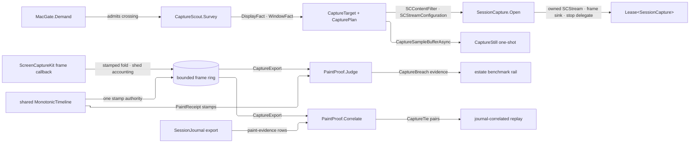

# [RASM_GRASSHOPPER_PLATFORM_CAPTURE]

`SessionCapture` is the leased native canvas-recording owner — one ScreenCaptureKit crossing minting display or window capture sessions over the RhinoWIP-bundled `Microsoft.macOS.dll` bindings, folding every delivered frame into a capacity-bounded ring of monotone-stamped evidence, and exporting a detached record for visual paint regression and journal-correlated replay. `MacGate.Demand` admits the crossing, `Lease<T>` carries the session with its exact native inverse chain, and every deferred capture callback records faults instead of throwing through the AppKit pump.

Pixel truth closes the paint loop: a capture session and the paint hooks it audits share one injected `MonotonicTimeline`, so `CaptureFrame.Stamp` and `PaintReceipt.Entered`/`Settled` order on one authority. `PaintProof.Judge` turns a drawn-claiming receipt with no bearing frame into typed breach evidence, and `PaintProof.Correlate` ties exported frames to `Shell/journal.md` rows so a support bundle carries the visual track beside the fact record.

## [01]-[INDEX]

- [02]-[SURVEY]: `DisplayFact` + `WindowFact` + `CaptureInventory` + `CaptureScout` — shareable-content enumeration as detached typed facts.
- [03]-[PLAN]: `CaptureTarget` + `CapturePace` + `CaptureRetention` + `CapturePlan` — target selection, cadence admission, and retention policy as one value.
- [04]-[SESSION]: `CaptureFrame` + `CaptureStill` + `CaptureExport` + `SessionCapture` — the leased stream, the frame fold, the one-shot still, and the export projection.
- [05]-[PROOF]: `CaptureBreach` + `CaptureTie` + `PaintProof` — the paint-regression judgment and the journal correlation projection.

## [02]-[SURVEY]

- Owner: `CaptureScout` — the shareable-content survey: `Survey(Op?)` → `Task<Fin<CaptureInventory>>` gates through `MacGate.Demand`, awaits `SCShareableContent.GetShareableContentAsync(excludeDesktopWindows: true, onScreenWindowsOnly: true)`, and projects detached `DisplayFact` and `WindowFact` rows — display id, frame, pixel extent; window id, frame, title, owning application name, bundle identifier, process id, on-screen and active state — so a consumer selects the GH canvas window by typed evidence, never by holding a live `SCWindow`.
- Law: survey results are evidence values — `SCDisplay`, `SCWindow`, and `SCRunningApplication` never escape the survey; the id a fact carries re-resolves against fresh shareable content inside the open gate, so a stale fact can only produce a typed refusal, never a dangling native reference.
- Law: capture consent is host state — a process without screen-recording permission receives an empty or truncated inventory from the OS, so an expected-but-absent window is the consent diagnostic and the page never probes a permission API the binding does not carry.
- Packages: Microsoft.macOS (`SCShareableContent.GetShareableContentAsync`, `SCDisplay.DisplayId`/`Frame`/`Width`/`Height`, `SCWindow.WindowId`/`Frame`/`Title`/`OnScreen`/`Active`/`OwningApplication`, `SCRunningApplication.ApplicationName`/`BundleIdentifier`/`ProcessId`), LanguageExt.Core, `Rasm.Domain` (`Op`).
- Growth: a new selection axis is one fact field read from the same survey; the gate never widens.

## [03]-[PLAN]

- Owner: `CaptureTarget` `[Union]` — `DisplayCase(uint DisplayId)` selects full-display capture, `WindowCase(uint WindowId)` selects one window; the id is the survey fact's own coordinate, so target minting composes `CaptureScout` output directly. `CapturePace` `[ValueObject<double>]` admits frames-per-second finite and positive, projecting `SCStreamConfiguration.MinimumFrameInterval` through `CMTime.FromSeconds(1.0 / pace, preferredTimeScale: 600)`.
- Owner: `CaptureRetention` `[SmartEnum<int>]` — `Evidence` keeps stamps, bearing, and geometry per frame at near-zero cost; `Raster` detaches the locked pixel rows into an owned byte array per frame. `CapturePlan` sealed record — pace, optional pixel extent, queue depth, cursor visibility, ring capacity, and retention as one policy value with `Default` at thirty frames per second, evidence-only retention, and a bounded ring.
- Law: retention is the cost dial, never a second session shape — a regression run flips one policy row to `Raster` for pixel comparison while a long journal-correlated recording stays `Evidence`; both ride the same session, ring, and export.
- Packages: Microsoft.macOS (`SCStreamConfiguration.Width`/`Height`/`MinimumFrameInterval`/`QueueDepth`/`ShowsCursor`, `CMTime.FromSeconds(double seconds, int preferredTimeScale)`), Thinktecture.Runtime.Extensions, LanguageExt.Core.
- Growth: a new stream knob is one `CapturePlan` field assigned at the one configuration mint; a new retention posture is one `CaptureRetention` row.

## [04]-[SESSION]

- Owner: `SessionCapture` sealed `IDisposable, IAsyncDisposable` — the leased recording session. `Open(CaptureTarget target, CapturePlan plan, MonotonicTimeline timeline, Op? key = null)` → `Task<Fin<Lease<SessionCapture>>>` gates, re-surveys, resolves the target into an `SCContentFilter` (`new SCContentFilter(display, [], SCContentFilterOption.Exclude)` for a display, `new SCContentFilter(window)` for a window), mints one `SCStreamConfiguration` from the plan, constructs `new SCStream(contentFilter, streamConfig, aDelegate)` with the owned stop delegate, adds the owned frame sink through `AddStreamOutput(sink, SCStreamOutputType.Screen, sampleHandlerQueue: null, out error)`, and starts capture through a `RunContinuationsAsynchronously` completion gate so the AppKit callback never runs the continuation inline. One `CaptureState` cell owns frames and counters, the delivery fold and export projection share one snapshot gate so an export stamp cannot straddle a frame commit, and one idempotent release task serves both disposal modalities.
- Owner: `CaptureFrame` readonly record struct — sequence, journal-grade `MonotonicStamp`, `Bearing` (a pixel buffer arrived with the sample), pixel geometry, and retention-gated detached raster; validity claims a nonnegative sequence, live stamp evidence, and raster-geometry agreement. `CaptureStill` — the one-shot raster from `SCScreenshotManager.CaptureSampleBufferAsync`, always pixel-bearing. `CaptureExport` — sequence-ordered frames with published and shed counts and the capture stamp, detached from every live cell.
- Entry: `Snapshot(CaptureTarget target, CapturePlan plan, MonotonicTimeline timeline, Op? key = null)` → `Task<Fin<CaptureStill>>` — the single-frame modality over the same gate, filter, and raster kernel; `Export(Op? key = null)` → `Fin<CaptureExport>`; `Published`/`Shed`/`LastFault` — the evidence cells.
- Law: the frame callback is contained — delivery projects the sample inside `Op.Catch`, stamps from the injected timeline, folds one frame into the ring with head-shedding accounted on `Shed`, and a projection fault records on `LastFault` and emits once through `CaptureLog.FrameFault`; the callback never touches the UI thread, never re-enters the host, and never retains the `CMSampleBuffer` past the projection.
- Law: the raster kernel is the page's named statement seam — `GetImageBuffer()` pattern-matched to `CVPixelBuffer`, `Lock(CVPixelBufferLock.ReadOnly)` checked against `CVReturn.Success`, one `Marshal.Copy` from `BaseAddress` over `BytesPerRow * Height`, and `Unlock` in `finally`; the detached bytes are the only pixels that outlive the callback.
- Law: release is one inverse chain on the session's own custody — close callback admission, await stop completion, drain every delivery admitted before closure, remove the stream output, then attempt every native disposal in reverse-acquisition order, preserving the first fault on `LastFault` and emitting once through `CaptureLog.ReleaseFault`; synchronous `Dispose` starts that task without blocking, `DisposeAsync` awaits the same task, and a mid-`Open` refusal runs the same release before the primary fault returns.
- Law: a stream the OS stops lands as evidence — the owned `ISCStreamDelegate` records `DidStop`/`UserDidStop` on `LastFault` through `CaptureLog.StreamFault`, so a user ending screen sharing is an observable session terminal, never a silent frame drought.
- Boundary: recording-to-disk (`SCRecordingOutput`, `SCRecordingOutputConfiguration`) and the system content-sharing picker are app-root modalities over this same surface; the session owns in-process frame evidence only, and serialization of an export is the app root's over the detached record.
- Packages: Microsoft.macOS (`SCStream` ctor/`AddStreamOutput`/`RemoveStreamOutput`/`StartCapture`/`StopCapture`, `ISCStreamOutput.DidOutputSampleBuffer`, `ISCStreamDelegate.DidStop`, `SCScreenshotManager.CaptureSampleBufferAsync`, `CMSampleBuffer.IsValid`/`GetImageBuffer`, `CVPixelBuffer.Width`/`Height`/`BytesPerRow`/`BaseAddress`/`Lock`/`Unlock`, `CVPixelBufferLock.ReadOnly`, `CVReturn.Success`), Microsoft.Extensions.Logging.Abstractions (`[LoggerMessage]`), LanguageExt.Core, `Rasm.Domain` (`Op`, `Lease<T>`, `ValidityClaim`), `Rasm.Parametric` (`MonotonicTimeline`, `MonotonicStamp`), `Shell/telemetry.md` (`GhLog`).
- Growth: a new frame-evidence axis is one `CaptureFrame` field read in the one projection; a capture metric family is one `Shell/telemetry.md` `GhEvidence` case and its roster row, never a meter call here.

## [05]-[PROOF]

- Owner: `PaintProof` — the regression and correlation projections over already-minted evidence. `Judge(CaptureFrame frame, PaintReceipt receipt, MonotonicTimeline timeline, CapturePace pace, Op? key = null)` → `Fin<Option<CaptureBreach>>` — a receipt claiming `Drawn > 0` whose settlement precedes the frame within two pace periods expects a bearing frame; a non-bearing frame there is the breach, carrying the frame sequence, the receipt operation, the drawn claim, and the measured lag.
- Owner: `CaptureTie` — one journal-to-frame pairing: the journal row sequence, the frame sequence, and the settlement-to-frame lag. `Correlate(CaptureExport capture, JournalExport journal, MonotonicTimeline timeline, CapturePace pace, Op? key = null)` → `Fin<Seq<CaptureTie>>` pairs every journal row carrying a `JournalFact.EvidenceCase` with a `GhEvidence.PaintCase` receipt to the first exported frame at or after that receipt's settlement inside the window.
- Law: one timeline is the correlation precondition — `Judge` and `Correlate` compare stamps through `timeline.Elapsed`, so the capture session, the paint mounts it audits, and the judgment share the injected timeline; journal row stamps stay journal-local per `Shell/journal.md` law, and correlation reads the receipt-borne stamps inside the fact, never the row stamp.
- Law: judgment reads, never samples — the proof owns no clock, no host reach, and no mutation; a breach is shaped beside the `Canvas/motion.md` `BudgetBreach` precedent so the estate benchmark rail consumes capture regressions as typed claims without re-measuring.
- Packages: LanguageExt.Core, `Rasm.Domain` (`Op`, `ValidityClaim`), `Rasm.Parametric` (`MonotonicTimeline`), `Canvas/paint.md` (`PaintReceipt` — inert evidence under the strata model-only exemption), `Shell/journal.md` (`JournalExport`), `Shell/telemetry.md` (`GhEvidence`).
- Growth: a new visual claim is one judgment arm over existing evidence; a new correlation family is one fact-pattern filter over the same export pair.

```csharp signature
// --- [RUNTIME_PRELUDE] ----------------------------------------------------------------------
using System.Collections.Immutable;
using System.Runtime.InteropServices;
using CoreMedia;
using CoreVideo;
using Foundation;
using Microsoft.Extensions.Logging;
using Rasm.Csp;
using Rasm.Grasshopper.Canvas;
using Rasm.Grasshopper.Shell;
using Rasm.Parametric;
using ScreenCaptureKit;

namespace Rasm.Grasshopper.Platform;

// --- [TYPES] --------------------------------------------------------------------------------
[ValueObject<double>]
public readonly partial struct CapturePace {
    static partial void ValidateFactoryArguments(ref ValidationError? validationError, ref double value) =>
        validationError = double.IsFinite(value) && value > 0.0 ? null : new ValidationError(message: "CapturePace requires finite positive frames per second.");
}

[SmartEnum<int>]
public sealed partial class CaptureRetention {
    public static readonly CaptureRetention Evidence = new(key: 0);
    public static readonly CaptureRetention Raster = new(key: 1);
}

[Union]
public abstract partial record CaptureTarget {
    private CaptureTarget() { }
    public sealed record DisplayCase(uint DisplayId) : CaptureTarget;
    public sealed record WindowCase(uint WindowId) : CaptureTarget;
}

// --- [CONSTANTS] ----------------------------------------------------------------------------
public sealed record CapturePlan(
    CapturePace Pace, Option<(int Width, int Height)> Extent, int Queue, bool Cursor, int Capacity, CaptureRetention Retention) {
    public static readonly CapturePlan Default = new(
        Pace: CapturePace.Create(value: 30.0), Extent: Option<(int, int)>.None,
        Queue: 5, Cursor: false, Capacity: 512, Retention: CaptureRetention.Evidence);
}

// --- [MODELS] -------------------------------------------------------------------------------
[BoundaryAdapter, StructLayout(LayoutKind.Auto)]
public readonly record struct DisplayFact(uint DisplayId, RectangleF Frame, int Width, int Height) : IValidityEvidence {
    public bool IsValid => ValidityClaim.Of(holds: Width > 0 && Height > 0);
}

[BoundaryAdapter, StructLayout(LayoutKind.Auto)]
public readonly record struct WindowFact(
    uint WindowId, RectangleF Frame, Option<string> Title, Option<string> Application,
    Option<string> BundleIdentifier, Option<int> ProcessId, bool OnScreen, bool Active);

public sealed record CaptureInventory(Seq<DisplayFact> Displays, Seq<WindowFact> Windows);

internal readonly record struct RasterPane(int Width, int Height, int RowBytes, Option<ImmutableArray<byte>> Raster);

internal readonly record struct CaptureState(Seq<CaptureFrame> Frames, long Published, long Shed);

[BoundaryAdapter, StructLayout(LayoutKind.Auto)]
public readonly record struct CaptureFrame(
    long Sequence, MonotonicStamp Stamp, bool Bearing, int Width, int Height, int RowBytes,
    Option<ImmutableArray<byte>> Raster) : IValidityEvidence {
    public bool IsValid => ValidityClaim.All(
        ValidityClaim.Of(holds: Sequence >= 0L),
        ValidityClaim.Evidence(evidence: Stamp),
        ValidityClaim.Of(holds: Bearing
            ? Width > 0 && Height > 0 && RowBytes > 0 &&
              Raster.Map(bytes => bytes.Length == (long)RowBytes * Height).IfNone(true)
            : Width == 0 && Height == 0 && RowBytes == 0 && Raster.IsNone));
}

public sealed record CaptureStill(int Width, int Height, int RowBytes, ImmutableArray<byte> Raster, MonotonicStamp Captured);

public sealed record CaptureExport(Seq<CaptureFrame> Frames, long Published, long Shed, MonotonicStamp Captured);

[BoundaryAdapter, StructLayout(LayoutKind.Auto)]
public readonly record struct CaptureBreach(long FrameSequence, Op Operation, int Drawn, TimeSpan Lag) : IValidityEvidence {
    public bool IsValid => ValidityClaim.All(
        ValidityClaim.Of(holds: FrameSequence >= 0L && Drawn > 0),
        ValidityClaim.Nonnegative(value: Lag.TotalSeconds));
}

[BoundaryAdapter, StructLayout(LayoutKind.Auto)]
public readonly record struct CaptureTie(long Row, long Frame, TimeSpan Lag);

// --- [SERVICES] -----------------------------------------------------------------------------
internal static partial class CaptureLog {
    [LoggerMessage(EventId = 4706, Level = LogLevel.Error, Message = "Capture stream stopped by host: {Detail}")]
    internal static partial void StreamFault(ILogger logger, string detail);

    [LoggerMessage(EventId = 4707, Level = LogLevel.Error, Message = "Capture frame projection faulted: {Detail}")]
    internal static partial void FrameFault(ILogger logger, string detail);

    [LoggerMessage(EventId = 4713, Level = LogLevel.Error, Message = "Capture session release faulted: {Detail}")]
    internal static partial void ReleaseFault(ILogger logger, string detail);
}

internal sealed class FrameSink(Action<CMSampleBuffer> deliver) : NSObject, ISCStreamOutput {
    [Export("stream:didOutputSampleBuffer:ofType:")]
    public void DidOutputSampleBuffer(SCStream stream, CMSampleBuffer sampleBuffer, SCStreamOutputType type) =>
        Op.SideWhen(condition: type == SCStreamOutputType.Screen, action: () => deliver(obj: sampleBuffer));
}

internal sealed class StreamStop(Action<Error> record) : NSObject, ISCStreamDelegate {
    [Export("stream:didStopWithError:")]
    public void DidStop(SCStream stream, NSError error) => record(obj: Error.New(error.ToString()));

    [Export("userDidStopStream:")]
    public void UserDidStop(SCStream stream) => record(obj: Error.New(message: "user stopped the capture stream"));
}

public sealed class SessionCapture : IDisposable, IAsyncDisposable {
    private readonly CapturePlan plan;
    private readonly MonotonicTimeline timeline;
    private readonly Op operation;
    private readonly SCStream stream;
    private readonly SCContentFilter filter;
    private readonly SCStreamConfiguration configuration;
    private readonly FrameSink sink;
    private readonly StreamStop stop;
    private readonly Atom<CaptureState> state = Atom(new CaptureState(Frames: Seq<CaptureFrame>(), Published: 0L, Shed: 0L));
    private readonly Atom<Option<Error>> lastFault = Atom(Option<Error>.None);
    private readonly object snapshotGate = new();
    private readonly object releaseGate = new();
    private readonly TaskCompletionSource<Unit> deliveriesDrained = new(TaskCreationOptions.RunContinuationsAsynchronously);
    private Task<Fin<Unit>>? releaseTask;
    private long nextSequence;
    private long deliveries;
    private int accepting = 1;

    private SessionCapture(
        CapturePlan plan, MonotonicTimeline timeline, Op operation,
        SCStream stream, SCContentFilter filter, SCStreamConfiguration configuration, FrameSink sink, StreamStop stop) {
        this.plan = plan;
        this.timeline = timeline;
        this.operation = operation;
        this.stream = stream;
        this.filter = filter;
        this.configuration = configuration;
        this.sink = sink;
        this.stop = stop;
    }

    public long Published => state.Value.Published;
    public long Shed => state.Value.Shed;
    public Option<Error> LastFault => lastFault.Value;

    public static async Task<Fin<Lease<SessionCapture>>> Open(
        CaptureTarget target, CapturePlan plan, MonotonicTimeline timeline, Op? key = null) {
        Op op = key.OrDefault();
        Fin<(CaptureTarget Target, CapturePlan Plan, MonotonicTimeline Clock)> admitted =
            from _ in MacGate.Demand(key: op)
            from row in op.Need(target)
            from bound in op.Need(plan)
            from clock in op.Need(timeline)
            from capacity in guard(bound.Capacity > 0 && bound.Queue > 0, op.InvalidInput()).ToFin()
            select (row, bound, clock);
        if (admitted.IsFail) return admitted.Map(static _ => default(Lease<SessionCapture>)!);
        (CaptureTarget row, CapturePlan bound, MonotonicTimeline clock) = ((CaptureTarget, CapturePlan, MonotonicTimeline))admitted;

        Fin<SCShareableContent> content = await Guarded(
            key: op, body: static () => SCShareableContent.GetShareableContentAsync(excludeDesktopWindows: true, onScreenWindowsOnly: true));
        return await content.Bind(shareable => Filter(shareable: shareable, target: row, key: op)).Match(
            Succ: async minted => {
                Fin<SCStreamConfiguration> configured = Configure(plan: bound, key: op);
                if (configured.IsFail) {
                    Fin<Unit> released = ReleaseAll(key: op, minted.Dispose);
                    return Preserve(
                        first: configured.Map(static _ => default(Lease<SessionCapture>)!),
                        next: released);
                }
                SCStreamConfiguration streamConfig = (SCStreamConfiguration)configured;
                SessionCapture? session = null;
                StreamStop stop = new(record: error => {
                    SessionCapture? live = session;
                    Op.SideWhen(condition: live is not null, action: () => {
                        ignore(live!.lastFault.Swap(_ => Some(error)));
                        CaptureLog.StreamFault(logger: GhLog.For(category: nameof(SessionCapture)), detail: error.Message);
                    });
                });
                FrameSink sink = new(deliver: buffer => session?.Deliver(buffer: buffer));
                SCStream? candidate = null;
                Fin<SCStream> wired = op.Catch(body: () => {
                    candidate = new SCStream(contentFilter: minted, streamConfig: streamConfig, aDelegate: stop);
                    return candidate.AddStreamOutput(output: sink, type: SCStreamOutputType.Screen, sampleHandlerQueue: null, error: out NSError? refused)
                        ? Fin.Succ(candidate)
                        : Fin.Fail<SCStream>(error: Error.New(refused?.ToString() ?? nameof(SCStream)));
                });
                return await wired.Match(
                    Succ: async native => {
                        session = new SessionCapture(
                            plan: bound, timeline: clock, operation: op,
                            stream: native, filter: minted, configuration: streamConfig, sink: sink, stop: stop);
                        Fin<Unit> live = await Complete(begin: native.StartCapture, key: op);
                        return await live.Match(
                            Succ: _ => Task.FromResult(Fin.Succ(
                                (Lease<SessionCapture>)new Lease<SessionCapture>.Owned(Value: session!))),
                            Fail: async primary => Preserve(
                                first: Fin.Fail<Lease<SessionCapture>>(error: primary),
                                next: await session!.Release()));
                    },
                    Fail: primary => {
                        Fin<Unit> detached = candidate is null
                            ? Fin.Succ(unit)
                            : RemoveOutput(stream: candidate, sink: sink, key: op);
                        Fin<Unit> disposed = ReleaseAll(
                            key: op,
                            () => candidate?.Dispose(),
                            sink.Dispose,
                            stop.Dispose,
                            streamConfig.Dispose,
                            minted.Dispose);
                        Fin<Unit> cleanup = Preserve(first: detached, next: disposed);
                        return Task.FromResult(cleanup.Match(
                            Succ: _ => Fin.Fail<Lease<SessionCapture>>(error: primary),
                            Fail: failure => Fin.Fail<Lease<SessionCapture>>(error: primary + failure)));
                    });
            },
            Fail: static error => Task.FromResult(Fin.Fail<Lease<SessionCapture>>(error: error)));
    }

    public static async Task<Fin<CaptureStill>> Snapshot(
        CaptureTarget target, CapturePlan plan, MonotonicTimeline timeline, Op? key = null) {
        Op op = key.OrDefault();
        Fin<(CaptureTarget Target, CapturePlan Plan, MonotonicTimeline Clock)> admitted =
            from _ in MacGate.Demand(key: op)
            from row in op.Need(target)
            from bound in op.Need(plan)
            from clock in op.Need(timeline)
            select (row, bound, clock);
        if (admitted.IsFail) return admitted.Map(static _ => default(CaptureStill)!);
        (CaptureTarget row, CapturePlan bound, MonotonicTimeline clock) =
            ((CaptureTarget, CapturePlan, MonotonicTimeline))admitted;
        Fin<SCShareableContent> content = await Guarded(
            key: op, body: static () => SCShareableContent.GetShareableContentAsync(excludeDesktopWindows: true, onScreenWindowsOnly: true));
        return await content.Bind(shareable => Filter(shareable: shareable, target: row, key: op)).Match(
            Succ: async minted => {
                Fin<SCStreamConfiguration> configured = Configure(plan: bound, key: op);
                if (configured.IsFail) {
                    Fin<Unit> released = ReleaseAll(key: op, minted.Dispose);
                    return Preserve(first: configured.Map(static _ => default(CaptureStill)!), next: released);
                }
                SCStreamConfiguration streamConfig = (SCStreamConfiguration)configured;
                Fin<CMSampleBuffer> sampled = await Guarded(
                    key: op, body: () => SCScreenshotManager.CaptureSampleBufferAsync(contentFilter: minted, config: streamConfig));
                Fin<CaptureStill> still = sampled.Bind(buffer => {
                    Fin<CaptureStill> projected =
                        from stamp in clock.Capture(key: op)
                        from pane in Geometry(buffer: buffer, retention: CaptureRetention.Raster, key: op)
                        from bearing in pane.ToFin(op.InvalidResult())
                        from raster in bearing.Raster.ToFin(op.InvalidResult())
                        select new CaptureStill(
                            Width: bearing.Width, Height: bearing.Height, RowBytes: bearing.RowBytes,
                            Raster: raster, Captured: stamp);
                    Fin<Unit> released = op.Catch(body: () => Fin.Succ(Op.Side(action: buffer.Dispose)));
                    return Preserve(first: projected, next: released);
                });
                Fin<Unit> released = ReleaseAll(key: op, streamConfig.Dispose, minted.Dispose);
                return Preserve(first: still, next: released);
            },
            Fail: static error => Task.FromResult(Fin.Fail<CaptureStill>(error: error)));
    }

    public Fin<CaptureExport> Export(Op? key = null) {
        Op op = key.OrDefault();
        lock (snapshotGate) {
            CaptureState snapshot = state.Value;
            return from stamp in timeline.Capture(key: op)
                   select new CaptureExport(
                       Frames: snapshot.Frames.Strict(), Published: snapshot.Published, Shed: snapshot.Shed, Captured: stamp);
        }
    }

    public void Dispose() => ignore(Release());

    public async ValueTask DisposeAsync() => ignore(await Release());

    private void Deliver(CMSampleBuffer buffer) {
        if (!EnterDelivery()) return;
        try {
            Fin<Unit> outcome = operation.Catch(body: () =>
                from valid in guard(buffer.IsValid, operation.InvalidInput()).ToFin()
                from stamp in timeline.Capture(key: operation)
                from pane in Geometry(buffer: buffer, retention: plan.Retention, key: operation)
                let frame = pane.Match(
                    Some: bearing => new CaptureFrame(
                        Sequence: Interlocked.Increment(location: ref nextSequence) - 1L, Stamp: stamp, Bearing: true,
                        Width: bearing.Width, Height: bearing.Height, RowBytes: bearing.RowBytes, Raster: bearing.Raster),
                    None: () => new CaptureFrame(
                        Sequence: Interlocked.Increment(location: ref nextSequence) - 1L, Stamp: stamp, Bearing: false,
                        Width: 0, Height: 0, RowBytes: 0, Raster: Option<ImmutableArray<byte>>.None))
                from folded in operation.Catch(body: () => Fin.Succ(Op.Side(action: () => {
                    lock (snapshotGate) {
                        ignore(state.Swap(current => {
                            Seq<CaptureFrame> rows = current.Frames.Add(frame);
                            bool over = rows.Count > plan.Capacity;
                            return new CaptureState(
                                Frames: over ? rows.Tail.Strict() : rows,
                                Published: current.Published + 1L,
                                Shed: current.Shed + (over ? 1L : 0L));
                        }));
                    }
                })))
                select unit);
            outcome.IfFail(error => {
                ignore(lastFault.Swap(_ => Some(error)));
                CaptureLog.FrameFault(logger: GhLog.For(category: nameof(SessionCapture)), detail: error.Message);
            });
        }
        finally { ExitDelivery(); }
    }

    private bool EnterDelivery() {
        if (Volatile.Read(location: ref accepting) == 0) return false;
        Interlocked.Increment(location: ref deliveries);
        if (Volatile.Read(location: ref accepting) != 0) return true;
        ExitDelivery();
        return false;
    }

    private void ExitDelivery() {
        if (Interlocked.Decrement(location: ref deliveries) == 0L && Volatile.Read(location: ref accepting) == 0)
            ignore(deliveriesDrained.TrySetResult(result: unit));
    }

    private Task<Fin<Unit>> Release() {
        lock (releaseGate) return releaseTask ??= ReleaseCore();
    }

    private async Task<Fin<Unit>> ReleaseCore() {
        Interlocked.Exchange(location1: ref accepting, value: 0);
        if (Interlocked.Read(location: ref deliveries) == 0L)
            ignore(deliveriesDrained.TrySetResult(result: unit));
        Fin<Unit> stopped = await Complete(begin: stream.StopCapture, key: operation);
        await deliveriesDrained.Task;
        Fin<Unit> removed = RemoveOutput(stream: stream, sink: sink, key: operation);
        Fin<Unit> disposed = ReleaseAll(
            key: operation,
            stream.Dispose,
            sink.Dispose,
            stop.Dispose,
            configuration.Dispose,
            filter.Dispose);
        Fin<Unit> released = Preserve(first: Preserve(first: stopped, next: removed), next: disposed);
        released.IfFail(error => {
            ignore(lastFault.Swap(_ => Some(error)));
            CaptureLog.ReleaseFault(logger: GhLog.For(category: nameof(SessionCapture)), detail: error.Message);
        });
        return released;
    }

    // Statement seam: the one async provider-exception funnel and the locked pixel-copy kernel of this page.
    internal static async Task<Fin<T>> Guarded<T>(Op key, Func<Task<T>> body) {
        try { return Fin.Succ(await body()); }
        catch (Exception raised) { return Fin.Fail<T>(error: Error.New(raised)); }
    }

    private static async Task<Fin<Unit>> Complete(Action<Action<NSError>?> begin, Op key) {
        TaskCompletionSource<Fin<Unit>> completion = new(TaskCreationOptions.RunContinuationsAsynchronously);
        Fin<Unit> started = key.Catch(body: () => Fin.Succ(Op.Side(action: () => begin(
            refusal => completion.TrySetResult(result: Optional(refusal).Match(
                Some: fault => Fin.Fail<Unit>(error: Error.New(fault.ToString())),
                None: static () => Fin.Succ(unit)))))));
        return started.IsFail ? started : await completion.Task;
    }

    private static Fin<Unit> ReleaseAll(Op key, params Action[] inverses) {
        Option<Error> first = Option<Error>.None;
        inverses.Iter(inverse => key.Catch(body: () => Fin.Succ(Op.Side(action: inverse))).IfFail(error =>
            first = first.Match(Some: static current => Some(current), None: () => Some(error))));
        return first.Match(Some: static error => Fin.Fail<Unit>(error: error), None: static () => Fin.Succ(unit));
    }

    private static Fin<Unit> Preserve(Fin<Unit> first, Fin<Unit> next) => first.IsFail ? first : next;

    private static Fin<T> Preserve<T>(Fin<T> first, Fin<Unit> next) => first.Match(
        Succ: value => next.Map(_ => value),
        Fail: primary => next.Match(
            Succ: _ => Fin.Fail<T>(error: primary),
            Fail: cleanup => Fin.Fail<T>(error: primary + cleanup)));

    private static Fin<Unit> RemoveOutput(SCStream stream, FrameSink sink, Op key) => key.Catch(body: () =>
        stream.RemoveStreamOutput(
            output: sink,
            type: SCStreamOutputType.Screen,
            error: out NSError? refusal)
            ? Fin.Succ(unit)
            : Fin.Fail<Unit>(error: Error.New(refusal?.ToString() ?? nameof(SCStream))));

    private static Fin<SCContentFilter> Filter(SCShareableContent shareable, CaptureTarget target, Op key) {
        Fin<SCContentFilter> minted = target.Switch(
            state: (Content: shareable, Key: key),
            displayCase: static (s, c) => toSeq(s.Content.Displays)
                .Find(display => display.DisplayId == c.DisplayId)
                .ToFin(s.Key.MissingContext())
                .Bind(display => s.Key.Catch(body: () => Fin.Succ(new SCContentFilter(display, [], SCContentFilterOption.Exclude)))),
            windowCase: static (s, c) => toSeq(s.Content.Windows)
                .Find(window => window.WindowId == c.WindowId)
                .ToFin(s.Key.MissingContext())
                .Bind(window => s.Key.Catch(body: () => Fin.Succ(new SCContentFilter(window)))));
        Fin<Unit> released = ReleaseAll(key: key, shareable.Dispose);
        return minted.Match(
            Succ: filter => released.Match(
                Succ: _ => Fin.Succ(filter),
                Fail: primary => ReleaseAll(key: key, filter.Dispose).Match(
                    Succ: _ => Fin.Fail<SCContentFilter>(error: primary),
                    Fail: cleanup => Fin.Fail<SCContentFilter>(error: primary + cleanup))),
            Fail: primary => released.Match(
                Succ: _ => Fin.Fail<SCContentFilter>(error: primary),
                Fail: cleanup => Fin.Fail<SCContentFilter>(error: primary + cleanup)));
    }

    private static Fin<SCStreamConfiguration> Configure(CapturePlan plan, Op key) =>
        from rate in key.Finite(value: (double)plan.Pace)
        from admitted in guard(
            rate > 0.0 &&
            plan.Queue > 0 &&
            plan.Capacity > 0 &&
            plan.Extent.Map(static extent => extent.Width > 0 && extent.Height > 0).IfNone(true),
            key.InvalidInput()).ToFin()
        from configured in key.Catch(body: () => {
            SCStreamConfiguration streamConfig = new() {
                MinimumFrameInterval = CMTime.FromSeconds(seconds: 1.0 / rate, preferredTimeScale: 600),
                QueueDepth = plan.Queue,
                ShowsCursor = plan.Cursor,
                // declared wire layout: single-plane BGRA is the one format the raster copy kernel reads, so the
                // stream requests it here and Geometry's layout gate re-proves it per frame — one contract, two ends.
                PixelFormat = CVPixelFormatType.CV32BGRA,
            };
            plan.Extent.Iter(extent => {
                streamConfig.Width = (nuint)extent.Width;
                streamConfig.Height = (nuint)extent.Height;
            });
            return Fin.Succ(streamConfig);
        })
        select configured;

    private static Fin<Option<RasterPane>> Geometry(CMSampleBuffer buffer, CaptureRetention retention, Op key) =>
        key.Catch(body: () => {
            using CVImageBuffer? image = buffer.GetImageBuffer();
            if (image is not CVPixelBuffer pixels) return Fin.Succ(Option<RasterPane>.None);
            (nuint nativeWidth, nuint nativeHeight, nuint nativeRowBytes) = (pixels.Width, pixels.Height, pixels.BytesPerRow);
            if (nativeWidth == 0 || nativeHeight == 0 || nativeRowBytes == 0 ||
                nativeWidth > int.MaxValue || nativeHeight > int.MaxValue || nativeRowBytes > int.MaxValue)
                return Fin.Fail<Option<RasterPane>>(error: key.InvalidResult());
            (int width, int height, int rowBytes) =
                (checked((int)nativeWidth), checked((int)nativeHeight), checked((int)nativeRowBytes));
            if (retention != CaptureRetention.Raster)
                return Fin.Succ(Some(new RasterPane(Width: width, Height: height, RowBytes: rowBytes, Raster: Option<ImmutableArray<byte>>.None)));
            // layout gate before any byte reaches RasterPane: the copy kernel reads one contiguous rowBytes*height
            // window, valid only for the single-plane BGRA layout the configuration declared — a planar or foreign
            // format's BaseAddress fronts a plane table, so it refuses here and never mints a corrupt pane.
            if (pixels.IsPlanar || pixels.PixelFormatType != CVPixelFormatType.CV32BGRA)
                return Fin.Fail<Option<RasterPane>>(error: key.InvalidResult());
            long byteCount = checked((long)rowBytes * height);
            if (byteCount > Array.MaxLength)
                return Fin.Fail<Option<RasterPane>>(error: key.InvalidResult());
            if (pixels.Lock(lockFlags: CVPixelBufferLock.ReadOnly) != CVReturn.Success)
                return Fin.Fail<Option<RasterPane>>(error: key.InvalidResult());
            try {
                int length = checked((int)byteCount);
                byte[] copied = new byte[length];
                Marshal.Copy(source: pixels.BaseAddress, destination: copied, startIndex: 0, length: length);
                return Fin.Succ(Some(new RasterPane(
                    Width: width, Height: height, RowBytes: rowBytes,
                    Raster: Some(ImmutableCollectionsMarshal.AsImmutableArray(array: copied)))));
            }
            finally { ignore(pixels.Unlock(unlockFlags: CVPixelBufferLock.ReadOnly)); }
        });
}

// --- [OPERATIONS] ---------------------------------------------------------------------------
[BoundaryAdapter]
public static class CaptureScout {
    public static async Task<Fin<CaptureInventory>> Survey(Op? key = null) {
        Op op = key.OrDefault();
        Fin<Unit> gate = MacGate.Demand(key: op);
        if (gate.IsFail) return gate.Map(static _ => default(CaptureInventory)!);
        Fin<SCShareableContent> content = await SessionCapture.Guarded(
            key: op,
            body: static () => SCShareableContent.GetShareableContentAsync(
                excludeDesktopWindows: true,
                onScreenWindowsOnly: true));
        return content.Bind(shareable => {
            Fin<CaptureInventory> projected = op.Catch(body: () => Fin.Succ(new CaptureInventory(
                Displays: toSeq(shareable.Displays).Map(static display => new DisplayFact(
                    DisplayId: display.DisplayId,
                    Frame: new RectangleF((float)display.Frame.X, (float)display.Frame.Y, (float)display.Frame.Width, (float)display.Frame.Height),
                    Width: (int)display.Width,
                    Height: (int)display.Height)).Strict(),
                Windows: toSeq(shareable.Windows).Map(static window => new WindowFact(
                    WindowId: window.WindowId,
                    Frame: new RectangleF((float)window.Frame.X, (float)window.Frame.Y, (float)window.Frame.Width, (float)window.Frame.Height),
                    Title: Optional(window.Title),
                    Application: Optional(window.OwningApplication).Map(static owner => owner.ApplicationName),
                    BundleIdentifier: Optional(window.OwningApplication).Map(static owner => owner.BundleIdentifier),
                    ProcessId: Optional(window.OwningApplication).Map(static owner => owner.ProcessId),
                    OnScreen: window.OnScreen,
                    Active: window.Active)).Strict())));
            Fin<Unit> released = op.Catch(body: () => Fin.Succ(Op.Side(action: shareable.Dispose)));
            return Preserve(first: projected, next: released);
        });
    }

    private static Fin<T> Preserve<T>(Fin<T> first, Fin<Unit> next) => first.Match(
        Succ: value => next.Map(_ => value),
        Fail: primary => next.Match(
            Succ: _ => Fin.Fail<T>(error: primary),
            Fail: cleanup => Fin.Fail<T>(error: primary + cleanup)));
}

[BoundaryAdapter]
public static class PaintProof {
    public static Fin<Option<CaptureBreach>> Judge(
        CaptureFrame frame, PaintReceipt receipt, MonotonicTimeline timeline, CapturePace pace, Op? key = null) {
        Op op = key.OrDefault();
        return from sample in op.AcceptInput(value: frame)
               from claim in op.AcceptInput(value: receipt)
               from clock in op.Need(timeline)
               from rate in op.Finite(value: (double)pace)
               from positive in guard(rate > 0.0, op.InvalidInput()).ToFin()
               from lag in clock.Elapsed(start: claim.Settled, end: sample.Stamp, key: op)
               let window = TimeSpan.FromSeconds(value: 2.0 / rate)
               select lag >= TimeSpan.Zero && lag <= window && claim.Drawn > 0 && !sample.Bearing
                   ? Some(new CaptureBreach(FrameSequence: sample.Sequence, Operation: claim.Operation, Drawn: claim.Drawn, Lag: lag))
                   : Option<CaptureBreach>.None;
    }

    public static Fin<Seq<CaptureTie>> Correlate(
        CaptureExport capture, JournalExport journal, MonotonicTimeline timeline, CapturePace pace, Op? key = null) {
        Op op = key.OrDefault();
        return from frames in op.Need(capture).Map(static export => export.Frames)
               from rows in op.Need(journal).Map(static export => export.Rows)
               from clock in op.Need(timeline)
               from rate in op.Finite(value: (double)pace)
               from positive in guard(rate > 0.0, op.InvalidInput()).ToFin()
               let window = TimeSpan.FromSeconds(value: 2.0 / rate)
               select rows.Choose(row => row.Fact switch {
                   JournalFact.EvidenceCase { Evidence: GhEvidence.PaintCase paint } =>
                       frames.Choose(frame => clock.Elapsed(start: paint.Receipt.Settled, end: frame.Stamp, key: op)
                               .ToOption()
                               .Filter(lag => lag >= TimeSpan.Zero && lag <= window)
                               .Map(lag => new CaptureTie(Row: row.Sequence, Frame: frame.Sequence, Lag: lag)))
                           .HeadOrNone(),
                   _ => Option<CaptureTie>.None,
               }).Strict();
    }
}
```



## [06]-[DENSITY_BAR]

| [INDEX] | [CONCERN]           | [OWNER]                         | [RAIL]                                     | [CASES] |
| :-----: | :------------------ | :------------------------------ | :----------------------------------------- | :-----: |
|  [01]   | shareable survey    | `CaptureScout`                  | `Survey → Task<Fin<CaptureInventory>>`     |    1    |
|  [02]   | target and policy   | `CaptureTarget` + `CapturePlan` | closed union + one policy value            |    2    |
|  [03]   | leased recording    | `SessionCapture`                | `Open → Task<Fin<Lease<SessionCapture>>>`  |    1    |
|  [04]   | one-shot raster     | `SessionCapture.Snapshot`       | `Snapshot → Task<Fin<CaptureStill>>`       |    1    |
|  [05]   | export projection   | `CaptureExport`                 | `Export → Fin<CaptureExport>`              |    1    |
|  [06]   | regression seam     | `PaintProof` + `CaptureBreach`  | `Judge → Fin<Option<CaptureBreach>>`       |    1    |
|  [07]   | journal correlation | `PaintProof.Correlate`          | `Correlate → Fin<Seq<CaptureTie>>`         |    1    |
|  [08]   | fault emission      | `CaptureLog`                    | three generated `[LoggerMessage]` partials |    3    |

`MacGate`, `Op`, `Lease<T>`, `ValidityClaim`, `MonotonicTimeline`, `GhLog`, `PaintReceipt`, `JournalExport`, and `GhEvidence` are composed upstream owners; recording-to-disk, the sharing picker, and export serialization compose at the app root over the detached record.

## [07]-[RESEARCH]

<!-- source-only: research row template:
[TOKEN]-[OPEN|BLOCKED]: <exact question>; <verification route>.
[SPLIT_MEMBER]-[OPEN]: does `shape-core` expose `split_all`; verify against the member rail.
-->

(none)
