```mermaid
---
config:
  theme: base
  look: classic
  layout: elk
  flowchart:
    curve: linear
    padding: 25
  themeVariables:
    darkMode: true
    fontFamily: "SF Mono, Menlo, Cascadia Mono, Segoe UI Mono, Consolas, monospace"
    useGradient: false
    dropShadow: "none"
    background: "#282A36"
    primaryColor: "#44475A"
    primaryTextColor: "#F8F8F2"
    primaryBorderColor: "#BD93F9"
    lineColor: "#FF79C6"
    textColor: "#F8F8F2"
    edgeLabelBackground: "#21222C"
    labelBackgroundColor: "#21222C"
    titleColor: "#D6BCFA"
  themeCSS: ".nodeLabel{font-size:13px;font-weight:500}.edgeLabel{font-size:12px;font-weight:500}.edge-thickness-normal{stroke-width:2px}.edge-thickness-thick{stroke-width:3px}.edge-pattern-dashed,.edge-pattern-dotted{stroke-width:1.5px;stroke-dasharray:4 6}.node rect,.node circle,.node polygon,.node path,.node .outer-path{stroke-width:1.5px;filter:none!important}.marker path{transform:scale(.8);transform-origin:5px 5px}.marker circle{transform:scale(.48);transform-origin:5px 5px}.edgeLabel rect{transform-box:fill-box;transform-origin:center;transform:scale(1.1,1.2)}"
---
flowchart LR
    accTitle: Native composition ownership and motion flow
    accDescr: A leased layer mount owns the indexed native tree and teardown while a workspace-observed motion attachment runs kernel-timed frames from the main run loop through a transaction fence; profile-aware colour projection reaches AppKit only as NSColor.
    Anchor["MacAnchor view"] --> Mount["Compose.Mount"]
    Graph["LayerNode with native leases"] --> Mount
    Mount --> Lease["Lease of LayerMount"]
    Lease --> Tree["indexed CALayer tree"]
    Lease -->|"dispose on UI thread"| Inverse["detach and release owned natives"]
    Timeline["MonotonicTimeline"] --> Motion["leased MotionAttachment"]
    Watch["WorkspaceWatch"] -->|"WorkspaceFact"| Motion
    Kernel["Easing · CyclePlan · SpringShape · PerceptualColor"] --> Drive["MotionDrive.Step"]
    Drive -->|"DriveFrame"| Motion
    Drive -->|"DriveFrame"| Canvas["CanvasPacer"]
    Motion -->|"Common mode"| Loop["NSRunLoop.Main"]
    Motion -->|"DriveFrame"| Fence["CATransaction fence"]
    Fence --> Tree
    Profile["RgbProfile.DisplayP3"] --> Wide["PerceptualColor.ToRgb"]
    Wide --> Native["owned NSColor"]
    classDef primary fill:#44475A,stroke:#FF79C6,color:#F8F8F2
    classDef boundary fill:#282A36,stroke:#BD93F9,color:#F8F8F2
    classDef data fill:#FFB86CBF,stroke:#FFB86C,color:#282A36
    class Mount,Lease,Drive,Motion,Fence,Wide primary
    class Anchor,Inverse,Canvas,Loop,Native boundary
    class Graph,Tree,Timeline,Watch,Kernel,Profile data
```

# [RASM_GRASSHOPPER_PLATFORM_COMPOSITION]

`Compose` owns the macOS composition boundary — CoreAnimation graph custody, transaction-fenced mutation, display-link motion, host animation attachment, and AppKit/CoreImage effects. Kernel owners supply monotonic beat evidence, easing, cycle, spring, perceptual mixing, and profile-aware colour projection; this boundary only binds those values to native resources. `MacGate` admits the platform, `EtoDispatch` owns UI affinity, and every retained native object crosses through `Lease<T>` with one exact inverse.

## [01]-[INDEX]

- [02]-[GRAPH]: `LayerNode` + `LayerMount` + `Compose` — explicit native custody, indexed graph materialization, transaction mutation, and leased teardown.
- [03]-[MOTION]: `PaceWindow` + `DriveSpec` + `MotionDrive` + `MotionAttachment` — shared kernel drive sampling, display-link pacing over `MonotonicTimeline`, transaction application, and completion.
- [04]-[GLIDES]: `GlidePlan` + `TimingCurve` + `Glides` + `Curves` — host-owned animation attachment and the standard timing-function vocabulary.
- [05]-[EFFECTS]: `FilterKind` + `HapticCue` + `VibrancyPane` + `Effects` — CoreImage filter minting, haptic feedback, and visual-effect views.
- [06]-[WIDE_COLOR]: `WideColor` — profile-aware kernel projection crossing into AppKit as an owned `NSColor` only.
- [07]-[TELEMETRY_ROOT]: `PlatformTelemetry` — the per-ALC telemetry capsule opened at the GH2 plugin app root with the plugin resource discriminator.

## [02]-[GRAPH]

- Owner: `LayerNode` `[Union]` is the recursive layer graph. `PlainCase` and `ShapeCase` mint boundary-owned layers; `HostedCase(Lease<CALayer>.Owned, ...)` consumes a detached caller-configured layer under sole custody. `LayerStyle` and `StrokeStyle` carry every disposable native payload as `Lease<T>`; an `Owned` row transfers its sole disposal obligation into the resulting mount, a `Borrowed` row remains caller-held for the mount lifetime, and reference-identity deduplication closes repeated occurrences exactly once.
- Owner: `LayerMount` retains the active `Root`, prior `NSView` backing state, mounted `Top`, preorder `Lookup`, derived `Count`, every graph attachment edge, and every transferred native resource. `Find(int ordinal, Op?)` resolves a mounted node without leaking a second index. `Dispose` marshals one inverse through `EtoDispatch`, removes every edge in reverse order inside one disabled-action transaction, restores `Layer` and `WantsLayer`, and then releases owned resources in reverse acquisition order; an existing borrowed root remains untouched while a root minted by this mount dies after restoration.
- Entry: `Compose.Mount(MacAnchor anchor, LayerNode node, Op? key = null)` → `Fin<Lease<LayerMount>>`. A recursive admission fold rejects malformed styles, dead lease payloads, and duplicate hosted or mask identities; the mount scope rejects any graph payload identical to the anchor root before custody can double. Its anchor view sets layer backing, reuses its live `Layer`, or installs `MakeBackingLayer()` as an owned root. Materialization remains detached until the complete preorder graph and lookup exist; attachment is the final mutation. Native custody transfers only as each graph value materializes. Any failure reverses edges and view backing, releases every acquired native, and accumulates inverse faults with the originating refusal.
- Entry: `Compose.Mutate(Action body, bool animated, Op? key = null)` → `Fin<Unit>` is the public mutation fence. `CATransaction.Commit` always closes the begun transaction, and disabling actions is the default posture for sampled motion and teardown.
- Boundary: graph ordinals are stable only for one mount lease. A layer obtained from `Lookup` or `Find` is borrowed and remains live only while that lease remains live. `CGPath` construction and managed-to-CoreGraphics projection stay at their owning geometry boundary; this owner retains only the resulting lease.
- Packages: Microsoft.macOS (`NSView`, `CALayer`, `CAShapeLayer`, `CATransaction`, `CGPath`, `CGColor`, `CGRect`), `Rasm.Domain` (`Op`, `Lease<T>`), `Platform/native.md` (`MacGate`, `MacAnchor`), `Eto/runtime.md` (`EtoDispatch`).
- Growth: a new layer family is one `LayerNode` case whose native payload enters through the same scope; graph lookup, transaction fencing, failure cleanup, and teardown do not widen.

## [03]-[MOTION]

- Owner: `DriveSpec` `[Union]` carries the three kernel-sampled drive algebras: eased cycles, fixed-target springs, and perceptual colour blends. `MotionDrive.Step(DriveSpec, MonotonicBeat, AccessibilityPosture, Op?)` is the shared sampling fold consumed unchanged by this display-link attachment and `Canvas/motion.md`'s `UiClock` pacer; it returns a read-only `DriveFrame` whose non-null `Apply` action and `Continues` verdict are minted only inside the fold. `MotionAttachment` owns the display link, callback target, `MonotonicTimeline` sequence, drive, workspace observation, fault cell, transaction application, and terminal completion as one disposable resource.
- Entry: `MotionAttachment.Attach(MacAnchor anchor, PaceWindow window, DriveSpec drive, Option<Action> completed, Op? key = null)` → `Fin<Lease<MotionAttachment>>`. This mint admits every nested drive value, acquires one `WorkspaceWatch`, captures a kernel timeline origin, creates an inert callback target, pauses and tunes the view display link, binds the completed attachment, attaches it to `NSRunLoop.Main` under `NSRunLoopMode.Common`, and only then resumes callbacks. A mint or dispatch fault removes the run-loop attachment, invalidates and disposes every native, releases the watch, and accumulates cleanup faults.
- Law: each callback advances `MonotonicTimeline.Beat` from the origin or prior `MonotonicBeat`; the attachment stores that successful receipt before posture, sampling, or native application can fail because the kernel sequence has already advanced. No host timestamp arithmetic, parallel beat identity, or wall-clock read survives. `MotionDrive.Step` returns the sampled write and continuation decision, and the attachment applies that frame inside `Compose.Fence(animated: false)`; the canvas pacer applies the same frame before its repaint edge.
- Law: completion belongs to the terminal frame. `SpringSettlement` carries dimensionally distinct positive position and velocity bands; a spring inside both snaps to target at zero velocity. A bounded cycle preserves its yoyo terminal side, and reduce motion selects that same bounded terminal or the far stop of an unbounded cycle. That frame installs an atomic once-gated caller continuation on `CATransaction.CompletionBlock`, pauses the link, and suppresses that continuation after lease teardown begins. A beat, sampling, write, or deferred-completion fault records in `LastFault` and pauses the link.
- Law: `PerceptualColor.Mix(other, amount, path)` is the sole colour interpolation call. It returns `PerceptualColor` directly; `BlendPath` supplies policy but owns no `Mix` member and no fallible rail.
- Law: one `WorkspaceFact` cell supplies accessibility and pace as a coherent snapshot. Each callback retunes the frame-rate range only when that snapshot's `PaceBounds` changes, then samples against its paired posture; a display migration never combines a stale ceiling with a new accessibility state.
- Law: disposal marshals through `EtoDispatch`, unbinds the callback before removing the link from its run loop, attempts pause, removal, invalidation, and both native disposals independently, then releases the workspace watch even when UI dispatch refuses. Every inverse fault accumulates, and the link never outlives its anchor view, run-loop attachment, callback object, or workspace observation.
- Packages: Microsoft.macOS (`CADisplayLink`, `CAFrameRateRange`, `NSRunLoop`, `NSRunLoopMode`, `NSObject`, `Selector`, `ExportAttribute`), `Rasm.Parametric` (`MonotonicTimeline`, `MonotonicStamp`, `MonotonicBeat`, `BeatSeed`, `Easing`, `CyclePlan`, `SpringShape`, `SpringState`), `Rasm.Numerics` (`PerceptualColor`, `BlendPath`, `UnitInterval`), `Rasm.Domain` (`Op`, `Lease<T>`), `Platform/native.md` (`AccessibilityPosture`, `PaceBounds`, `WorkspaceFact`, `WorkspaceWatch`, `NativeSeam.Watch`).
- Growth: a new sampled drive is one `DriveSpec` case in `MotionDrive.Step`; both pacers inherit the same beat, posture, terminal, and write semantics without gaining a parallel sampling arm.

## [04]-[GLIDES]

- Owner: `GlidePlan` pairs an explicitly owned or borrowed `CAAnimation` with the managed `string` key required by `CALayer.AddAnimation`. `Glides.Animate` consumes the animation lease inside one transaction; CoreAnimation copies the attached animation, so an owned plan releases immediately after the call while a borrowed plan remains caller-held. `Glides.Halt` admits the same managed key for `CALayer.RemoveAnimation`; `NSString` remains confined to `CAMediaTimingFunction.FromName`, whose catalog member requires it.
- Owner: `TimingCurve` `[SmartEnum<int>]` closes the standard CoreAnimation names: `Default`, `EaseIn`, `EaseOut`, `EaseInEaseOut`, and `Linear`. `Curves.Named(TimingCurve, Op?)` mints an owned `CAMediaTimingFunction`; no raw timing-name string crosses the public surface.
- Entry: `Glides.Animate(CALayer layer, GlidePlan plan, Op? key = null)` and `Glides.Halt(CALayer layer, string glideKey, Op? key = null)` → `Fin<Unit>`; `Curves.Named` → `Fin<Lease<CAMediaTimingFunction>>`.
- Law: sampled drives and host glides remain distinct by state ownership. A sampled drive exposes kernel state and retained completion through `MotionAttachment`; a glide delegates interpolation to CoreAnimation and owns only attachment and removal. Deferred completion requires a retained callback owner and therefore stays on `MotionAttachment`.
- Packages: Microsoft.macOS (`CAAnimation`, `CAMediaTimingFunction`, `CALayer`, `NSString`), `Rasm.Domain` (`Op`, `Lease<T>`), `Platform/native.md` (`MacGate`).
- Growth: a new standard timing name is one `TimingCurve` row; a new host animation remains data inside `GlidePlan` and does not create a second attachment lifecycle.

## [05]-[EFFECTS]

- Owner: `FilterKind` `[SmartEnum<string>]` carries the admitted CoreImage registry keys. `Effects.Filter` disposes the registry template after copying and returns the copy as `Lease<CIFilter>.Owned`; the caller holds that lease across any `CALayer.Filters` or `BackgroundFilters` attachment window.
- Owner: `HapticCue` pairs `NSHapticFeedbackPattern` with `NSHapticFeedbackPerformanceTime`. `Effects.Pulse` performs the selected cue through `NSHapticFeedbackManager.DefaultPerformer` on the UI thread and retains no native object.
- Owner: `VibrancyPane` carries material and blending policy. `Effects.Vibrancy` returns `Lease<NSVisualEffectView>.Owned`; embedding code retains the lease for the hosted-view lifetime and disposes it after detachment.
- Entry: `Effects.Filter(FilterKind, Op?)` → `Fin<Lease<CIFilter>>`; `Effects.Pulse(HapticCue, Op?)` → `Fin<Unit>`; `Effects.Vibrancy(VibrancyPane, Op?)` → `Fin<Lease<NSVisualEffectView>>`.
- Packages: Microsoft.macOS (`CIFilter`, `NSHapticFeedbackManager`, `NSHapticFeedbackPattern`, `NSHapticFeedbackPerformanceTime`, `NSVisualEffectView`, `NSVisualEffectMaterial`, `NSVisualEffectBlendingMode`), `Rasm.Domain` (`Op`, `Lease<T>`), `Platform/native.md` (`MacGate`).
- Growth: a new filter is one `FilterKind` row, a new haptic is one `HapticCue` value, and a new vibrancy posture is data on `VibrancyPane`.

## [06]-[WIDE_COLOR]

- Owner: `WideColor.Project(PerceptualColor colour, Op? key = null)` → `Fin<Lease<NSColor>>` composes `PerceptualColor.ToRgb(RgbProfile.DisplayP3)` and passes the returned unit channels directly to `NSColor.FromDisplayP3`. This host boundary neither constructs `Unicolour` nor reads its default `.Rgb` accessor, because that accessor is sRGB and cannot be relabelled as Display-P3.
- Kernel contract: `RgbProfile` `[SmartEnum<int>]` owns `Srgb` and `DisplayP3` configuration rows. `PerceptualColor.ToRgb(RgbProfile profile)` performs configured conversion with perceptual gamut mapping and returns the normalized `(double Red, double Green, double Blue, double Alpha)` tuple. Parameterless `ToRgb()` remains the mapped sRGB byte egress; profile conversion remains one `PerceptualColor` owner rather than a host-local colour pipeline.
- Boundary: `NSColor` is the only native colour object minted here, returned as owned custody. All profile selection, chromatic adaptation, transfer encoding, and gamut mapping remain kernel operations.
- Packages: Microsoft.macOS (`NSColor`), `Rasm.Numerics` (`PerceptualColor`, `RgbProfile`), `Rasm.Domain` (`Op`, `Lease<T>`), `Platform/native.md` (`MacGate`).
- Growth: a new display profile is one kernel `RgbProfile` row; the AppKit projection remains unchanged while the selected row varies.

## [07]-[TELEMETRY_ROOT]

- Owner: `PlatformTelemetry` — the GH2 plugin app-root composition seam over the AppHost `PluginTelemetryHost`; one capsule per plugin `AssemblyLoadContext`, opened once at plugin load, never per canvas or component.
- Entry: `PlatformTelemetry.Open(Assembly pluginRoot, string plugin, Op? key = null)` → `Fin<PluginTelemetryHost>` — resolves the plugin ALC (the RhinoCode collectible context under isolated loading) from the root assembly and opens the capsule under `HostProfile.Gh2Plugin`.
- Law: the app root alone references `Rasm.AppHost` beside `Rasm.Grasshopper` — no `Rasm.Grasshopper` package source names an AppHost or OpenTelemetry type, so the strata law holds while the composition realizes at the root.
- Law: resource identity is the estate triple plus the plugin discriminator — `service.namespace` `rasm`, `service.name` `rasm.grasshopper`, the plugin assembly version, a boot-minted `service.instance.id`, and the `rasm.plugin` attribute — so a GH2 plugin and a Rhino plugin co-resident in one process separate downstream by resource, never by meter name.
- Boundary: lifetime is the capsule's own `AssemblyLoadContext.Unloading` hook — `ForceFlush` then `Dispose` per the AppHost provider-lifetime law — the load-bearing bound for a collectible context, because an unflushed batch tail dies with the ALC; the capsule needs no `MacGate` admission because telemetry composition touches no AppKit surface.
- Packages: app root only — Rasm.AppHost (`PluginTelemetryHost`, `HostProfile`), OpenTelemetry (`ResourceBuilder`), BCL inbox (`AssemblyLoadContext`).
- Growth: a new resource dimension is one attribute row in the identity delegate; zero new surface.

```csharp signature
// App-root composition: the GH2 plugin root assembly references Rasm.AppHost beside Rasm.Grasshopper
// and owns this seam; no Rasm.Grasshopper package source composes AppHost or OpenTelemetry types.
public static class PlatformTelemetry {
    public static Fin<PluginTelemetryHost> Open(Assembly pluginRoot, string plugin, Op? key = null) {
        ArgumentNullException.ThrowIfNull(pluginRoot);
        Op op = key.OrDefault();
        return from name in op.AcceptText(value: plugin)
               from alc in Optional(AssemblyLoadContext.GetLoadContext(pluginRoot)).ToFin(op.MissingContext())
               from version in Optional(pluginRoot.GetName().Version).ToFin(op.MissingContext())
               from capsule in op.Catch(body: () => Fin.Succ(value: PluginTelemetryHost.Open(
                   alc: alc,
                   profile: HostProfile.Gh2Plugin,
                   identity: resource => resource
                       .AddService(
                           serviceName: "rasm.grasshopper",
                           serviceNamespace: "rasm",
                           serviceVersion: version.ToString(),
                           autoGenerateServiceInstanceId: false,
                           serviceInstanceId: Guid.CreateVersion7().ToString())
                       .AddAttributes([
                           new KeyValuePair<string, object>("rasm.plugin", name),
                       ]))))
               select capsule;
    }
}
```

```csharp signature
// --- [RUNTIME_PRELUDE] ----------------------------------------------------------------------
using System.Collections.ObjectModel;
using System.Runtime.InteropServices;
using AppKit;
using CoreAnimation;
using CoreGraphics;
using CoreImage;
using Foundation;
using ObjCRuntime;
using Rasm.Csp;
using Rasm.Grasshopper.Eto;
using Rasm.Numerics;
using Rasm.Parametric;

namespace Rasm.Grasshopper.Platform;

// --- [TYPES] --------------------------------------------------------------------------------
[Union]
public abstract partial record LayerNode {
    private LayerNode() { }
    public sealed record PlainCase(LayerStyle Style, Seq<LayerNode> Children) : LayerNode;
    public sealed record ShapeCase(LayerStyle Style, StrokeStyle Stroke, Seq<LayerNode> Children) : LayerNode;
    public sealed record HostedCase(Lease<CALayer>.Owned Layer, Seq<LayerNode> Children) : LayerNode;
}

[Union]
public abstract partial record DriveSpec {
    private DriveSpec() { }
    public sealed record EasedCase(Easing Curve, TimeSpan Period, CyclePlan Cycle, Action<double> Write) : DriveSpec;
    public sealed record SprungCase(
        SpringShape Shape, SpringState From, double Target, SpringSettlement Settlement, Action<SpringState> Write) : DriveSpec;
    public sealed record BlendCase(
        BlendPath Path, PerceptualColor From, PerceptualColor To, Easing Curve, TimeSpan Period, CyclePlan Cycle,
        Action<PerceptualColor> Write) : DriveSpec;
}

[SmartEnum<string>]
public sealed partial class FilterKind {
    public static readonly FilterKind ColorControls = new(key: "CIColorControls");
    public static readonly FilterKind ColorMatrix = new(key: "CIColorMatrix");
    public static readonly FilterKind ExposureAdjust = new(key: "CIExposureAdjust");
    public static readonly FilterKind GaussianBlur = new(key: "CIGaussianBlur");
    public static readonly FilterKind Bloom = new(key: "CIBloom");
}

[SmartEnum<int>]
public sealed partial class TimingCurve {
    public static readonly TimingCurve Default = new(key: 0, name: CAMediaTimingFunction.Default);
    public static readonly TimingCurve EaseIn = new(key: 1, name: CAMediaTimingFunction.EaseIn);
    public static readonly TimingCurve EaseOut = new(key: 2, name: CAMediaTimingFunction.EaseOut);
    public static readonly TimingCurve EaseInEaseOut = new(key: 3, name: CAMediaTimingFunction.EaseInEaseOut);
    public static readonly TimingCurve Linear = new(key: 4, name: CAMediaTimingFunction.Linear);
    internal NSString Name { get; }
}

[BoundaryAdapter, StructLayout(LayoutKind.Auto)]
public readonly record struct HapticCue(
    NSHapticFeedbackPattern Pattern, NSHapticFeedbackPerformanceTime Timing) : IValidityEvidence {
    public bool IsValid => ValidityClaim.All(
        ValidityClaim.Of(holds: Enum.IsDefined(value: Pattern)),
        ValidityClaim.Of(holds: Enum.IsDefined(value: Timing)));
}

// --- [MODELS] -------------------------------------------------------------------------------
public sealed record LayerStyle(
    CGRect Frame, Option<Lease<CGColor>> Fill, Option<Lease<CGColor>> Border, NFloat BorderWidth, NFloat CornerRadius,
    bool Clip, Option<Lease<CALayer>> Mask);

public sealed record StrokeStyle(
    Lease<CGPath> Path, Option<Lease<CGColor>> Fill, Option<Lease<CGColor>> Stroke, NFloat Width, bool Rounded);

[BoundaryAdapter, StructLayout(LayoutKind.Auto)]
public readonly record struct PaceWindow(float Minimum, float Maximum, float Preferred) : IValidityEvidence {
    public bool IsValid => ValidityClaim.All(
        ValidityClaim.Positive(value: Minimum),
        ValidityClaim.Ordered(lower: Minimum, upper: Maximum),
        ValidityClaim.Ordered(lower: Minimum, upper: Preferred),
        ValidityClaim.Ordered(lower: Preferred, upper: Maximum));
}

[BoundaryAdapter, StructLayout(LayoutKind.Auto)]
public readonly record struct SpringSettlement(double Position, double Velocity) : IValidityEvidence {
    public bool IsValid => ValidityClaim.All(
        ValidityClaim.Positive(value: Position),
        ValidityClaim.Positive(value: Velocity));
}

public sealed record GlidePlan(Lease<CAAnimation> Animation, string Key);

public sealed record VibrancyPane(
    NSVisualEffectMaterial Material, NSVisualEffectBlendingMode Blending) : IValidityEvidence {
    public bool IsValid => ValidityClaim.All(
        ValidityClaim.Of(holds: Enum.IsDefined(value: Material)),
        ValidityClaim.Of(holds: Enum.IsDefined(value: Blending)));
}

public sealed record DriveFrame {
    internal DriveFrame(bool Continues, Action Apply) { this.Continues = Continues; this.Apply = Apply; }
    public bool Continues { get; }
    public Action Apply { get; }
}

internal sealed record WorkspaceObservation(
    Atom<Option<WorkspaceFact>> Latest, Lease<WorkspaceWatch> Watch, WorkspaceFact Initial);

internal readonly record struct LayerEdge(CALayer Parent, CALayer Child);

internal readonly record struct ViewBacking(NSView View, bool WantsLayer, CALayer? Layer);

// --- [SERVICES] -----------------------------------------------------------------------------
public sealed class LayerMount : IDisposable {
    private readonly ViewBacking backing;
    private readonly LayerEdge[] edges;
    private readonly IDisposable[] owned;
    private readonly Atom<Option<Error>> lastFault = Atom(Option<Error>.None);
    private int releaseState;

    internal LayerMount(
        CALayer root, CALayer top, IReadOnlyDictionary<int, CALayer> lookup,
        ViewBacking backing, LayerEdge[] edges, IDisposable[] owned) {
        Root = root;
        Top = top;
        Lookup = lookup;
        this.backing = backing;
        this.edges = edges;
        this.owned = owned;
    }

    public CALayer Root { get; }
    public CALayer Top { get; }
    public IReadOnlyDictionary<int, CALayer> Lookup { get; }
    public int Count => Lookup.Count;
    public Option<Error> LastFault => lastFault.Value;

    public Fin<CALayer> Find(int ordinal, Op? key = null) {
        Op op = key.OrDefault();
        return Lookup.TryGetValue(key: ordinal, value: out CALayer? layer) && layer is not null
            ? Fin.Succ(layer)
            : Fin.Fail<CALayer>(op.InvalidInput());
    }

    public void Dispose() => ignore(Release(key: Op.Of(name: nameof(Dispose))));

    private Fin<Unit> Release(Op key) {
        if (Interlocked.CompareExchange(location1: ref releaseState, value: 1, comparand: 0) != 0) return Fin.Succ(unit);
        Fin<Unit> outcome = EtoDispatch.Run(body: () => {
            Fin<Unit> detached = NativeScope.Detach(edges: edges, key: key);
            Fin<Unit> restored = NativeScope.Restore(backing: backing, key: key);
            Fin<Unit> released = NativeScope.Release(resources: owned, key: key);
            return NativeScope.Join(
                left: detached,
                right: NativeScope.Join(left: restored, right: released));
        }, key: key);
        outcome.IfFail(error => ignore(lastFault.Swap(_ => Some(error))));
        Volatile.Write(location: ref releaseState, value: 2);
        return outcome;
    }
}

public sealed class MotionAttachment : IDisposable {
    private readonly CADisplayLink link;
    private readonly LinkTarget target;
    private readonly NSRunLoop runLoop;
    private readonly NSRunLoopMode runLoopMode;
    private readonly MonotonicTimeline timeline;
    private readonly MonotonicStamp origin;
    private readonly DriveSpec drive;
    private readonly PaceWindow window;
    private readonly Atom<Option<WorkspaceFact>> workspace;
    private readonly Lease<WorkspaceWatch> workspaceWatch;
    private readonly Option<Action> completed;
    private readonly Atom<Option<Error>> lastFault = Atom(Option<Error>.None);
    private PaceBounds appliedPace;
    private Option<MonotonicBeat> previous = Option<MonotonicBeat>.None;
    private int completionState;
    private int releaseState;

    private MotionAttachment(
        CADisplayLink link, LinkTarget target, NSRunLoop runLoop, NSRunLoopMode runLoopMode,
        MonotonicTimeline timeline, MonotonicStamp origin, DriveSpec drive, PaceWindow window,
        Atom<Option<WorkspaceFact>> workspace, Lease<WorkspaceWatch> workspaceWatch,
        WorkspaceFact initial, Option<Action> completed) {
        this.link = link;
        this.target = target;
        this.runLoop = runLoop;
        this.runLoopMode = runLoopMode;
        this.timeline = timeline;
        this.origin = origin;
        this.drive = drive;
        this.window = window;
        this.workspace = workspace;
        this.workspaceWatch = workspaceWatch;
        appliedPace = initial.Pace;
        this.completed = completed;
    }

    public Option<Error> LastFault => lastFault.Value;

    public static Fin<Lease<MotionAttachment>> Attach(
        MacAnchor anchor, PaceWindow window, DriveSpec drive, Option<Action> completed, Op? key = null) {
        Op op = key.OrDefault();
        return from _ in MacGate.Demand(key: op)
               from activeAnchor in op.Need(anchor)
               let view = activeAnchor.View
               from validDrive in MotionDrive.Admit(spec: drive, key: op)
               from admitted in guard(window.IsValid, op.InvalidInput()).ToFin().Map(_ => window)
               from timeline in MonotonicTimeline.Of(provider: TimeProvider.System, key: op)
               from origin in timeline.Capture(key: op)
               from observation in Observe(anchor: activeAnchor, key: op)
               let mounted = EtoDispatch.Run(body: () => {
                   CADisplayLink? native = null;
                   LinkTarget? bridge = null;
                   NSRunLoop? loop = null;
                   NSRunLoopMode mode = NSRunLoopMode.Common;
                   Fin<Lease<MotionAttachment>> outcome = op.Catch(body: () => {
                       bridge = new LinkTarget();
                       native = view.GetDisplayLink(target: bridge, selector: LinkTarget.TickSelector);
                       if (native is null) return Fin.Fail<Lease<MotionAttachment>>(op.InvalidResult());
                       native.Paused = true;
                       WorkspaceFact snapshot = observation.Latest.Value.IfNone(observation.Initial);
                       Tune(link: native, window: admitted, pace: snapshot.Pace);
                       loop = NSRunLoop.Main;
                       if (loop is null) return Fin.Fail<Lease<MotionAttachment>>(op.MissingContext());
                       MotionAttachment attachment = new(
                           link: native, target: bridge, runLoop: loop, runLoopMode: mode,
                           timeline: timeline, origin: origin, drive: validDrive, window: admitted,
                           workspace: observation.Latest, workspaceWatch: observation.Watch,
                           initial: snapshot, completed: completed);
                       bridge.Bind(tick: () => attachment.OnTick(key: op));
                       native.AddToRunLoop(runloop: loop, mode: mode);
                       native.Paused = false;
                       return Fin.Succ((Lease<MotionAttachment>)new Lease<MotionAttachment>.Owned(Value: attachment));
                   });
                   return outcome.Match(
                       Succ: static value => Fin.Succ(value),
                       Fail: error => NativeScope.Join<Lease<MotionAttachment>>(
                           primary: error,
                           cleanup: Cleanup(link: native, target: bridge, runLoop: loop, runLoopMode: mode, key: op)));
               }, key: op)
               from lease in mounted.Match(
                   Succ: static value => Fin.Succ(value),
                   Fail: error => NativeScope.Join<Lease<MotionAttachment>>(
                       primary: error,
                       cleanup: Dispose(lease: observation.Watch, key: op)))
               select lease;
    }

    public void Dispose() => ignore(Release(key: Op.Of(name: nameof(Dispose))));

    private void OnTick(Op key) => key.Catch(body: () => Tick(key: key)).IfFail(error => Record(error: error));

    private Fin<Unit> Tick(Op key) {
        BeatSeed seed = previous.Match(Some: static prior => (BeatSeed)prior, None: () => (BeatSeed)origin);
        Fin<(MonotonicBeat Beat, bool Continues)> outcome =
            from beat in timeline.Beat(seed: seed, key: key).Map(Advance)
            from fact in workspace.Value.ToFin(key.InvalidResult())
            from _tuned in Retune(pace: fact.Pace, key: key)
            from frame in MotionDrive.Step(spec: drive, beat: beat, posture: fact.Posture, key: key)
            let terminal = frame.Continues
                ? Option<Action>.None
                : completed.Map<Action>(finish => Completion(finish: finish, key: key))
            from applied in Compose.Fence(body: frame.Apply, animated: false, completed: terminal, key: key)
            select (Beat: beat, Continues: frame.Continues);
        return outcome.Match(
            Succ: advanced => advanced.Continues ? Fin.Succ(unit) : Pause(key: key),
            Fail: error => NativeScope.Join<Unit>(primary: error, cleanup: Pause(key: key)));
    }

    private MonotonicBeat Advance(MonotonicBeat beat) { previous = Some(beat); return beat; }
    private void Record(Error error) => ignore(lastFault.Swap(_ => Some(error)));
    private Fin<Unit> Pause(Op key) => key.Catch(body: () => Fin.Succ(Op.Side(action: () => link.Paused = true)));
    private Action Completion(Action finish, Op key) => () => Op.SideWhen(
        condition: Volatile.Read(location: ref releaseState) == 0 &&
            Interlocked.CompareExchange(location1: ref completionState, value: 1, comparand: 0) == 0,
        action: () => key.Catch(body: () => Fin.Succ(Op.Side(action: finish))).IfFail(error => Record(error: error)));

    private Fin<Unit> Retune(PaceBounds pace, Op key) => pace == appliedPace
        ? Fin.Succ(unit)
        : key.Catch(body: () => {
            Tune(link: link, window: window, pace: pace);
            appliedPace = pace;
            return Fin.Succ(unit);
        });

    private Fin<Unit> Release(Op key) {
        if (Interlocked.CompareExchange(location1: ref releaseState, value: 1, comparand: 0) != 0) return Fin.Succ(unit);
        Fin<Unit> native = EtoDispatch.Run(
            body: () => Cleanup(link: link, target: target, runLoop: runLoop, runLoopMode: runLoopMode, key: key),
            key: key);
        Fin<Unit> observed = Dispose(lease: workspaceWatch, key: key);
        Fin<Unit> outcome = NativeScope.Join(left: native, right: observed);
        outcome.IfFail(error => Record(error: error));
        Volatile.Write(location: ref releaseState, value: 2);
        return outcome;
    }

    private static Fin<WorkspaceObservation> Observe(MacAnchor anchor, Op key) {
        Atom<Option<WorkspaceFact>> latest = Atom(Option<WorkspaceFact>.None);
        return NativeSeam.Watch(
                anchor: anchor,
                publish: fact => ignore(latest.Swap(_ => Some(fact))),
                key: key)
            .Bind(watch => latest.Value.ToFin(key.InvalidResult()).Match(
                Succ: initial => Fin.Succ(new WorkspaceObservation(Latest: latest, Watch: watch, Initial: initial)),
                Fail: error => NativeScope.Join<WorkspaceObservation>(primary: error, cleanup: Dispose(lease: watch, key: key))));
    }

    private static Fin<Unit> Cleanup(
        CADisplayLink? link, LinkTarget? target, NSRunLoop? runLoop, NSRunLoopMode runLoopMode, Op key) {
        Fin<Unit> unbound = key.Catch(body: () => Fin.Succ(Op.Side(action: () => target?.Unbind())));
        Fin<Unit> paused = key.Catch(body: () => Fin.Succ(Op.Side(action: () => { if (link is not null) link.Paused = true; })));
        Fin<Unit> removed = key.Catch(body: () => Fin.Succ(Op.Side(action: () => {
            if (link is not null && runLoop is not null) link.RemoveFromRunLoop(runloop: runLoop, mode: runLoopMode);
        })));
        Fin<Unit> invalidated = key.Catch(body: () => Fin.Succ(Op.Side(action: () => link?.Invalidate())));
        IDisposable[] resources = (link, target) switch {
            ({ } native, { } bridge) => [native, bridge],
            ({ } native, null) => [native],
            (null, { } bridge) => [bridge],
            _ => [],
        };
        return NativeScope.Join(
            left: unbound,
            right: NativeScope.Join(
                left: paused,
                right: NativeScope.Join(
                    left: removed,
                    right: NativeScope.Join(
                        left: invalidated,
                        right: NativeScope.Release(resources: resources, key: key)))));
    }

    private static Fin<Unit> Dispose(Lease<WorkspaceWatch> lease, Op key) => key.Catch(body: () => Fin.Succ(lease.Dispose()));

    private static Unit Tune(CADisplayLink link, PaceWindow window, PaceBounds pace) {
        float ceiling = float.CreateChecked(pace.MaximumFramesPerSecond);
        link.PreferredFrameRateRange = CAFrameRateRange.Create(
            minimum: float.Min(window.Minimum, ceiling),
            maximum: float.Min(window.Maximum, ceiling),
            preferred: float.Min(window.Preferred, ceiling));
        return unit;
    }

    private sealed class LinkTarget : NSObject {
        private Action? tick;
        internal static readonly Selector TickSelector = new("pacerTick:");
        internal void Bind(Action callback) {
            if (Interlocked.CompareExchange(location1: ref tick, value: callback, comparand: null) is not null) throw new InvalidOperationException();
        }
        internal void Unbind() => Volatile.Write(location: ref tick, value: null);
        [Export("pacerTick:")]
        public void Tick(CADisplayLink _) => Volatile.Read(location: ref tick)?.Invoke();
    }
}

internal sealed class NativeScope {
    private readonly Dictionary<int, CALayer> lookup = [];
    private readonly List<LayerEdge> edges = [];
    private readonly List<IDisposable> owned = [];
    private readonly HashSet<IDisposable> identities = new(ReferenceEqualityComparer.Instance);
    private Option<ViewBacking> backing = Option<ViewBacking>.None;
    private CALayer? root;
    private bool transferred;

    internal T Own<T>(T resource) where T : class, IDisposable {
        RejectRoot(resource: resource);
        if (identities.Add(item: resource)) owned.Add(item: resource);
        return resource;
    }

    internal T Hold<T>(Lease<T> lease) where T : class, IDisposable => lease.Switch(
        state: this,
        owned: static (scope, row) => scope.Own(resource: row.Value),
        borrowed: static (scope, row) => scope.Borrow(resource: row.Value));

    internal CALayer Index(CALayer layer) {
        lookup.Add(key: lookup.Count, value: layer);
        return layer;
    }

    internal Unit Attach(CALayer parent, CALayer child) {
        parent.AddSublayer(layer: child);
        edges.Add(item: new LayerEdge(Parent: parent, Child: child));
        return unit;
    }

    internal CALayer Bind(NSView view) {
        backing = Some(new ViewBacking(View: view, WantsLayer: view.WantsLayer, Layer: view.Layer));
        view.WantsLayer = true;
        if (view.Layer is { } active) { root = active; return active; }
        CALayer minted = Own(resource: view.MakeBackingLayer() ?? throw new InvalidOperationException());
        view.Layer = minted;
        root = minted;
        return minted;
    }

    private T Borrow<T>(T resource) where T : class, IDisposable { RejectRoot(resource: resource); return resource; }

    private void RejectRoot<T>(T resource) where T : class, IDisposable {
        if (resource is CALayer layer && ReferenceEquals(objA: root, objB: layer)) throw new InvalidOperationException();
    }

    internal LayerMount Transfer(CALayer root, CALayer top) {
        LayerMount mount = new(
            root: root,
            top: top,
            lookup: new ReadOnlyDictionary<int, CALayer>(dictionary: new Dictionary<int, CALayer>(lookup)),
            backing: backing.Match(Some: static value => value, None: static () => throw new InvalidOperationException()),
            edges: [.. edges],
            owned: [.. owned]);
        transferred = true;
        return mount;
    }

    internal Fin<Unit> Release(Op key) => transferred ? Fin.Succ(unit) : Release(resources: [.. owned], key: key);

    internal Fin<Unit> Detach(Op key) => transferred ? Fin.Succ(unit) : Detach(edges: [.. edges], key: key);

    internal Fin<Unit> Restore(Op key) => transferred
        ? Fin.Succ(unit)
        : backing.Match(Some: value => Restore(backing: value, key: key), None: static () => Fin.Succ(unit));

    internal static Fin<Unit> Detach(IEnumerable<LayerEdge> edges, Op key) => key.Catch(body: () => {
        Validation<Error, Unit> outcome = Fin.Succ(unit).ToValidation();
        CATransaction.Begin();
        try {
            outcome = (outcome, key.Catch(body: () => Fin.Succ(Op.Side(action: () => CATransaction.DisableActions = true))).ToValidation())
                .Apply(static (_, _) => unit)
                .As();
            foreach (LayerEdge edge in edges.Reverse()) {
                outcome = (outcome, key.Catch(body: () => Fin.Succ(Op.Side(action: edge.Child.RemoveFromSuperLayer))).ToValidation())
                    .Apply(static (_, _) => unit)
                    .As();
            }
        }
        finally {
            outcome = (outcome, key.Catch(body: () => Fin.Succ(Op.Side(action: CATransaction.Commit))).ToValidation())
                .Apply(static (_, _) => unit)
                .As();
        }
        return outcome.ToFin();
    });

    internal static Fin<Unit> Restore(ViewBacking backing, Op key) => key.Catch(body: () => {
        Validation<Error, Unit> outcome = Fin.Succ(unit).ToValidation();
        CATransaction.Begin();
        try {
            Fin<Unit>[] inverses = [
                key.Catch(body: () => Fin.Succ(Op.Side(action: () => CATransaction.DisableActions = true))),
                key.Catch(body: () => Fin.Succ(Op.Side(action: () => backing.View.Layer = backing.Layer))),
                key.Catch(body: () => Fin.Succ(Op.Side(action: () => backing.View.WantsLayer = backing.WantsLayer))),
            ];
            foreach (Fin<Unit> inverse in inverses) {
                outcome = (outcome, inverse.ToValidation()).Apply(static (_, _) => unit).As();
            }
        }
        finally {
            outcome = (outcome, key.Catch(body: () => Fin.Succ(Op.Side(action: CATransaction.Commit))).ToValidation())
                .Apply(static (_, _) => unit)
                .As();
        }
        return outcome.ToFin();
    });

    internal static Fin<Unit> Release(IEnumerable<IDisposable> resources, Op key) {
        Validation<Error, Unit> outcome = Fin.Succ(unit).ToValidation();
        foreach (IDisposable resource in resources.Distinct(ReferenceEqualityComparer.Instance).Reverse()) {
            outcome = (outcome, key.Catch(body: () => Fin.Succ(Op.Side(action: resource.Dispose))).ToValidation())
                .Apply(static (_, _) => unit)
                .As();
        }
        return outcome.ToFin();
    }

    internal static Fin<Unit> Join(Fin<Unit> left, Fin<Unit> right) =>
        (left.ToValidation(), right.ToValidation()).Apply(static (_, _) => unit).As().ToFin();

    internal static Fin<T> Join<T>(Error primary, Fin<Unit> cleanup) =>
        (Fin.Fail<T>(error: primary).ToValidation(), cleanup.ToValidation()).Apply(static (value, _) => value).As().ToFin();
}

// --- [OPERATIONS] ---------------------------------------------------------------------------
[BoundaryAdapter]
public static class MotionDrive {
    public static Fin<DriveFrame> Step(
        DriveSpec spec, MonotonicBeat beat, AccessibilityPosture posture, Op? key = null) {
        Op op = key.OrDefault();
        return from admitted in Admit(spec: spec, key: op)
               from evidence in op.Need(beat)
               from _valid in guard(evidence.IsValid, op.InvalidInput()).ToFin()
               from frame in admitted.Switch(
                   state: (Beat: evidence, Posture: posture, Key: op),
                   easedCase: static (state, row) => state.Posture.ReduceMotion
                       ? Fin.Succ(new DriveFrame(
                           Continues: false,
                           Apply: () => row.Write(obj: row.Curve.Evaluate(t: Terminal(plan: row.Cycle)))))
                       : row.Cycle.Phase(
                               elapsed: state.Beat.Elapsed.TotalSeconds,
                               period: row.Period.TotalSeconds,
                               key: state.Key)
                           .Map(phase => new DriveFrame(
                               Continues: !phase.Completed,
                               Apply: () => row.Write(obj: row.Curve.Evaluate(t: phase.Local)))),
                   sprungCase: static (state, row) => state.Posture.ReduceMotion
                       ? Fin.Succ(new DriveFrame(
                           Continues: false,
                           Apply: () => row.Write(obj: new SpringState(Position: row.Target, Velocity: 0.0))))
                       : row.Shape.Evaluate(
                               @from: row.From,
                               target: row.Target,
                               elapsed: state.Beat.Elapsed.TotalSeconds,
                               key: state.Key)
                           .Map(value => {
                               bool continues = Math.Abs(value.Position - row.Target) > row.Settlement.Position ||
                                   Math.Abs(value.Velocity) > row.Settlement.Velocity;
                               SpringState terminal = continues
                                   ? value
                                   : new SpringState(Position: row.Target, Velocity: 0.0);
                               return new DriveFrame(
                                   Continues: continues,
                                   Apply: () => row.Write(obj: terminal));
                           }),
                   blendCase: static (state, row) => state.Posture.ReduceMotion
                       ? Fin.Succ(new DriveFrame(
                           Continues: false,
                           Apply: () => row.Write(obj: row.From.Mix(
                               other: row.To,
                               amount: Terminal(plan: row.Cycle),
                               path: row.Path))))
                       : row.Cycle.Phase(
                               elapsed: state.Beat.Elapsed.TotalSeconds,
                               period: row.Period.TotalSeconds,
                               key: state.Key)
                           .Bind(phase => state.Key.AcceptValidated<UnitInterval>(
                                   candidate: double.Clamp(row.Curve.Evaluate(t: phase.Local), 0.0, 1.0))
                               .Map(amount => new DriveFrame(
                                   Continues: !phase.Completed,
                                   Apply: () => row.Write(obj: row.From.Mix(
                                       other: row.To,
                                       amount: amount,
                                       path: row.Path))))))
               select frame;
    }

    internal static Fin<DriveSpec> Admit(DriveSpec spec, Op key) => key.Need(spec).Bind(valid => valid.Switch(
        state: key,
        easedCase: static (op, row) =>
            from _curve in op.Need(row.Curve)
            from _write in op.Need(row.Write)
            from _period in op.Positive(value: row.Period.TotalSeconds)
            from _cycle in guard(Valid(plan: row.Cycle), op.InvalidInput()).ToFin()
            select (DriveSpec)row,
        sprungCase: static (op, row) =>
            from _shape in guard(row.Shape.IsValid, op.InvalidInput()).ToFin()
            from _from in guard(row.From.IsValid, op.InvalidInput()).ToFin()
            from _target in op.Finite(value: row.Target)
            from _settle in guard(row.Settlement.IsValid, op.InvalidInput()).ToFin()
            from _write in op.Need(row.Write)
            select (DriveSpec)row,
        blendCase: static (op, row) =>
            from _path in op.Need(row.Path)
            from _from in op.Need(row.From)
            from _to in op.Need(row.To)
            from _curve in op.Need(row.Curve)
            from _write in op.Need(row.Write)
            from _period in op.Positive(value: row.Period.TotalSeconds)
            from _cycle in guard(Valid(plan: row.Cycle), op.InvalidInput()).ToFin()
            select (DriveSpec)row));

    private static bool Valid(CyclePlan plan) => plan.Count.Match(
        Some: static count => count >= 1,
        None: static () => true);

    private static UnitInterval Terminal(CyclePlan plan) => UnitInterval.Create(
        value: plan.Count.Match(
            Some: count => plan.Yoyo && count % 2 == 0 ? 0.0 : 1.0,
            None: static () => 1.0));
}

[BoundaryAdapter]
public static class Compose {
    public static Fin<Lease<LayerMount>> Mount(MacAnchor anchor, LayerNode node, Op? key = null) {
        Op op = key.OrDefault();
        return from _ in MacGate.Demand(key: op)
               from activeAnchor in op.Need(anchor)
               from validNode in AdmitGraph(node: node, key: op)
               from lease in EtoDispatch.Run(body: () => {
                   NativeScope scope = new();
                   CALayer? top = null;
                   Fin<Lease<LayerMount>> outcome = op.Catch(body: () => {
                       CALayer root = null!;
                       CATransaction.Begin();
                       try {
                           CATransaction.DisableActions = true;
                           root = scope.Bind(view: activeAnchor.View);
                           top = Materialize(node: validNode, scope: scope);
                           scope.Attach(parent: root, child: top);
                       }
                       finally { CATransaction.Commit(); }
                       LayerMount mount = scope.Transfer(root: root, top: top!);
                       return Fin.Succ((Lease<LayerMount>)new Lease<LayerMount>.Owned(Value: mount));
                   });
                   return outcome.Match(
                       Succ: static value => Fin.Succ(value),
                       Fail: error => NativeScope.Join<Lease<LayerMount>>(
                           primary: error,
                           cleanup: NativeScope.Join(
                               left: scope.Detach(key: op),
                               right: NativeScope.Join(
                                   left: scope.Restore(key: op),
                                   right: scope.Release(key: op)))));
               }, key: op)
               select lease;
    }

    public static Fin<Unit> Mutate(Action body, bool animated = false, Op? key = null) {
        Op op = key.OrDefault();
        return from _ in MacGate.Demand(key: op)
               from valid in op.Need(body)
               from settled in EtoDispatch.Run(
                   body: () => Fence(body: valid, animated: animated, completed: Option<Action>.None, key: op), key: op)
               select settled;
    }

    internal static Fin<Unit> Fence(Action body, bool animated, Option<Action> completed, Op key) => key.Catch(body: () => {
        bool applied = false;
        CATransaction.Begin();
        try {
            CATransaction.DisableActions = !animated;
            completed.Iter(continuation => CATransaction.CompletionBlock = () => Op.SideWhen(condition: applied, action: continuation));
            body();
            applied = true;
        }
        finally { CATransaction.Commit(); }
        return Fin.Succ(unit);
    });

    private static Fin<LayerNode> AdmitGraph(LayerNode node, Op key) =>
        AdmitGraph(node: node, layers: new HashSet<CALayer>(ReferenceEqualityComparer.Instance), key: key);

    private static Fin<LayerNode> AdmitGraph(LayerNode node, HashSet<CALayer> layers, Op key) => key.Need(node).Bind(valid => valid.Switch(
        state: (Layers: layers, Key: key),
        plainCase: static (state, row) =>
            from style in state.Key.Need(row.Style)
            from _frame in guard(Valid(frame: style.Frame), state.Key.InvalidInput()).ToFin()
            from _widths in guard(Nonnegative(value: style.BorderWidth) && Nonnegative(value: style.CornerRadius), state.Key.InvalidInput()).ToFin()
            from _fill in AdmitLease(lease: style.Fill, key: state.Key)
            from _border in AdmitLease(lease: style.Border, key: state.Key)
            from _mask in AdmitLayer(lease: style.Mask, layers: state.Layers, key: state.Key)
            from _children in row.Children.TraverseM(child => AdmitGraph(node: child, layers: state.Layers, key: state.Key)).As()
            select (LayerNode)row,
        shapeCase: static (state, row) =>
            from style in state.Key.Need(row.Style)
            from stroke in state.Key.Need(row.Stroke)
            from _frame in guard(Valid(frame: style.Frame), state.Key.InvalidInput()).ToFin()
            from _widths in guard(
                Nonnegative(value: style.BorderWidth) && Nonnegative(value: style.CornerRadius) && Nonnegative(value: stroke.Width),
                state.Key.InvalidInput()).ToFin()
            from _fill in AdmitLease(lease: style.Fill, key: state.Key)
            from _border in AdmitLease(lease: style.Border, key: state.Key)
            from _mask in AdmitLayer(lease: style.Mask, layers: state.Layers, key: state.Key)
            from _path in AdmitLease(lease: stroke.Path, key: state.Key)
            from _strokeFill in AdmitLease(lease: stroke.Fill, key: state.Key)
            from _stroke in AdmitLease(lease: stroke.Stroke, key: state.Key)
            from _children in row.Children.TraverseM(child => AdmitGraph(node: child, layers: state.Layers, key: state.Key)).As()
            select (LayerNode)row,
        hostedCase: static (state, row) =>
            from lease in state.Key.Need(row.Layer)
            from layer in state.Key.Need(lease.Value)
            from _unique in guard(state.Layers.Add(item: layer), state.Key.InvalidInput()).ToFin()
            from _children in row.Children.TraverseM(child => AdmitGraph(node: child, layers: state.Layers, key: state.Key)).As()
            select (LayerNode)row));

    private static Fin<Unit> AdmitLease<T>(Lease<T> lease, Op key) where T : class, IDisposable =>
        from active in key.Need(lease)
        from _ in key.Need(active.Resource)
        select unit;

    private static Fin<Unit> AdmitLease<T>(Option<Lease<T>> lease, Op key) where T : class, IDisposable => lease.Match(
        Some: active => AdmitLease(lease: active, key: key),
        None: static () => Fin.Succ(unit));

    private static Fin<Unit> AdmitLayer(Option<Lease<CALayer>> lease, HashSet<CALayer> layers, Op key) => lease.Match(
        Some: active =>
            from _lease in AdmitLease(lease: active, key: key)
            from layer in key.Need(active.Resource)
            from _unique in guard(layers.Add(item: layer), key.InvalidInput()).ToFin()
            select unit,
        None: static () => Fin.Succ(unit));

    private static bool Valid(CGRect frame) =>
        Finite(value: frame.X) && Finite(value: frame.Y) && Nonnegative(value: frame.Width) && Nonnegative(value: frame.Height);

    private static bool Nonnegative(NFloat value) => Finite(value: value) && value >= NFloat.CreateChecked(0.0);

    private static bool Finite(NFloat value) => NFloat.IsFinite(value);

    private static CALayer Materialize(LayerNode node, NativeScope scope) => node.Switch(
        plainCase: row => Settle(
            layer: scope.Index(layer: Styled(layer: scope.Own(resource: new CALayer()), style: row.Style, scope: scope)),
            children: row.Children, scope: scope),
        shapeCase: row => Settle(
            layer: scope.Index(layer: Stroked(
                layer: (CAShapeLayer)Styled(layer: scope.Own(resource: new CAShapeLayer()), style: row.Style, scope: scope),
                stroke: row.Stroke, scope: scope)),
            children: row.Children, scope: scope),
        hostedCase: row => Settle(
            layer: scope.Index(layer: scope.Hold(lease: row.Layer)), children: row.Children, scope: scope));

    private static CALayer Settle(CALayer layer, Seq<LayerNode> children, NativeScope scope) {
        children.Iter(child => scope.Attach(parent: layer, child: Materialize(node: child, scope: scope)));
        return layer;
    }

    private static CALayer Styled(CALayer layer, LayerStyle style, NativeScope scope) {
        layer.Frame = style.Frame;
        style.Fill.Iter(colour => layer.BackgroundColor = scope.Hold(lease: colour));
        style.Border.Iter(colour => layer.BorderColor = scope.Hold(lease: colour));
        layer.BorderWidth = style.BorderWidth;
        layer.CornerRadius = style.CornerRadius;
        layer.MasksToBounds = style.Clip;
        style.Mask.Iter(mask => layer.Mask = scope.Hold(lease: mask));
        return layer;
    }

    private static CAShapeLayer Stroked(CAShapeLayer layer, StrokeStyle stroke, NativeScope scope) {
        layer.Path = scope.Hold(lease: stroke.Path);
        stroke.Fill.Iter(colour => layer.FillColor = scope.Hold(lease: colour));
        stroke.Stroke.Iter(colour => layer.StrokeColor = scope.Hold(lease: colour));
        layer.LineWidth = stroke.Width;
        Op.SideWhen(condition: stroke.Rounded, action: () => {
            layer.LineCap = CAShapeLayer.CapRound;
            layer.LineJoin = CAShapeLayer.JoinRound;
        });
        return layer;
    }
}

[BoundaryAdapter]
public static class Glides {
    public static Fin<Unit> Animate(CALayer layer, GlidePlan plan, Op? key = null) {
        Op op = key.OrDefault();
        return from _ in MacGate.Demand(key: op)
               from target in op.Need(layer)
               from valid in op.Need(plan)
               from animation in op.Need(valid.Animation)
               from name in op.Need(valid.Key)
               from admitted in guard(!string.IsNullOrWhiteSpace(value: name), op.InvalidInput()).ToFin().Map(_ => name)
               from settled in EtoDispatch.Run(body: () => animation.Use(native => Compose.Fence(
                   body: () => target.AddAnimation(animation: native, key: admitted),
                   animated: true,
                   completed: Option<Action>.None,
                   key: op)), key: op)
               select settled;
    }

    public static Fin<Unit> Halt(CALayer layer, string glideKey, Op? key = null) {
        Op op = key.OrDefault();
        return from _ in MacGate.Demand(key: op)
               from target in op.Need(layer)
               from name in op.Need(glideKey)
               from admitted in guard(!string.IsNullOrWhiteSpace(value: name), op.InvalidInput()).ToFin().Map(_ => name)
               from settled in EtoDispatch.Run(body: () => Compose.Fence(
                   body: () => target.RemoveAnimation(key: admitted),
                   animated: false,
                   completed: Option<Action>.None,
                   key: op), key: op)
               select settled;
    }
}

[BoundaryAdapter]
public static class Curves {
    public static Fin<Lease<CAMediaTimingFunction>> Named(TimingCurve curve, Op? key = null) {
        Op op = key.OrDefault();
        return from _ in MacGate.Demand(key: op)
               from row in op.Need(curve)
               from native in op.Catch(body: () => Optional(CAMediaTimingFunction.FromName(name: row.Name)).ToFin(op.InvalidResult()))
               select (Lease<CAMediaTimingFunction>)new Lease<CAMediaTimingFunction>.Owned(Value: native);
    }
}

[BoundaryAdapter]
public static class Effects {
    public static Fin<Lease<CIFilter>> Filter(FilterKind kind, Op? key = null) {
        Op op = key.OrDefault();
        return from _ in MacGate.Demand(key: op)
               from row in op.Need(kind)
               from template in op.Catch(body: () => Optional(CIFilter.FromName(name: row.Key)).ToFin(op.InvalidResult()))
               from owned in op.Catch(body: () => {
                   using (template) {
                       NSObject? copied = template.Copy(zone: null);
                       if (copied is CIFilter filter && !ReferenceEquals(objA: template, objB: filter))
                           return Fin.Succ((Lease<CIFilter>)new Lease<CIFilter>.Owned(Value: filter));
                       if (copied is not null && !ReferenceEquals(objA: template, objB: copied)) copied.Dispose();
                       return Fin.Fail<Lease<CIFilter>>(op.InvalidResult());
                   }
               })
               select owned;
    }

    public static Fin<Unit> Pulse(HapticCue cue, Op? key = null) {
        Op op = key.OrDefault();
        return from _ in MacGate.Demand(key: op)
               from valid in guard(cue.IsValid, op.InvalidInput()).ToFin().Map(_ => cue)
               from settled in EtoDispatch.Run(body: () => op.Catch(body: () => Fin.Succ(Op.Side(action: () =>
                   NSHapticFeedbackManager.DefaultPerformer.PerformFeedback(
                       pattern: valid.Pattern, performanceTime: valid.Timing)))), key: op)
               select settled;
    }

    public static Fin<Lease<NSVisualEffectView>> Vibrancy(VibrancyPane pane, Op? key = null) {
        Op op = key.OrDefault();
        return from _ in MacGate.Demand(key: op)
               from valid in op.Need(pane)
               from admitted in guard(valid.IsValid, op.InvalidInput()).ToFin().Map(_ => valid)
               from lease in EtoDispatch.Run(body: () => {
                   NSVisualEffectView? view = null;
                   Fin<Lease<NSVisualEffectView>> outcome = op.Catch(body: () => {
                       view = new NSVisualEffectView();
                       view.Material = admitted.Material;
                       view.BlendingMode = admitted.Blending;
                       return Fin.Succ((Lease<NSVisualEffectView>)new Lease<NSVisualEffectView>.Owned(Value: view));
                   });
                   return outcome.Match(
                       Succ: static value => Fin.Succ(value),
                       Fail: error => NativeScope.Join<Lease<NSVisualEffectView>>(
                           primary: error,
                           cleanup: NativeScope.Release(
                               resources: view is null ? Array.Empty<IDisposable>() : new IDisposable[] { view },
                               key: op)));
               }, key: op)
               select lease;
    }
}

[BoundaryAdapter]
public static class WideColor {
    public static Fin<Lease<NSColor>> Project(PerceptualColor colour, Op? key = null) {
        Op op = key.OrDefault();
        return from _ in MacGate.Demand(key: op)
               from admitted in op.Need(colour)
               from channels in op.Catch(body: () => Fin.Succ(admitted.ToRgb(profile: RgbProfile.DisplayP3)))
               from _channels in guard(
                   Channel(value: channels.Red) && Channel(value: channels.Green) &&
                   Channel(value: channels.Blue) && Channel(value: channels.Alpha),
                   op.InvalidResult()).ToFin()
               from lease in op.Catch(body: () => Fin.Succ((Lease<NSColor>)new Lease<NSColor>.Owned(Value: NSColor.FromDisplayP3(
                   red: NFloat.CreateChecked(channels.Red),
                   green: NFloat.CreateChecked(channels.Green),
                   blue: NFloat.CreateChecked(channels.Blue),
                   alpha: NFloat.CreateChecked(channels.Alpha)))))
               select lease;
    }

    private static bool Channel(double value) => double.IsFinite(value) && value is >= 0.0 and <= 1.0;
}
```


