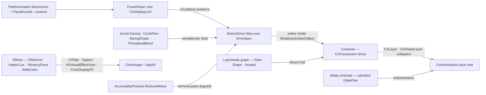

# [RASM_GRASSHOPPER_PLATFORM_COMPOSITION]

The CoreAnimation composition owner of the Grasshopper boundary — the `CALayer` graph as one recursive node family built and mutated inside `CATransaction` batches, vsync pacing as one `CADisplayLink` owner tuned against the live screen ceiling, motion as kernel-sampled drives (`Easing`/`CyclePlan`/`SpringShape`/`PerceptualBlend` rows evaluated per beat and written to layer state), host animation objects as admitted attachment rows, and the CoreImage filter, haptic, vibrancy, and wide-gamut seams. This is the macOS half of the census `Motion` blocker resolved: the census file owned 46 Penner easing rows, an analytic spring solver, and OKLab conversion BESIDE its CoreAnimation lifecycle — here the kernel owns every curve, cycle, spring regime, and perceptual mix, and this page owns only what is irreducibly host: the layer graph, the transaction fence, the display link, and the native applicator objects. Every gate opens with `Platform/native.md`'s `MacGate.Demand`; anchors, pacing ceilings, and the reduce-motion posture arrive as that page's evidence; every drive degrades under `AccessibilityPosture.ReduceMotion` to its terminal pose by policy, never by a per-animation conditional. Lifetimes ride `Lease<T>`, marshalling rides `EtoDispatch`, and the GH2 `Animated<T>`/`IFlexControl` pacing tier is `Canvas/motion.md`'s adapter — the two pacers meet only at the consumer that picks one.

## [01]-[INDEX]

- [02]-[GRAPH]: `LayerStyle` + `StrokeStyle` + `LayerNode` + `Compose` — the recursive layer-graph family and the transaction-fenced build/mutate gates.
- [03]-[PACING]: `PaceWindow` + `FramePacer` — the `CADisplayLink` vsync owner clamped against `PaceBounds`, publishing `ClockBeat` evidence.
- [04]-[DRIVES]: `DriveSpec` + `MotionDrive` — the kernel-sampled motion fold: eased cycles, driven springs, and perceptual colour tweens written to layer state per beat.
- [05]-[GLIDES]: `GlidePlan` + `Curves` — admitted host `CAAnimation` attachment and the named timing-curve mint.
- [06]-[EFFECTS]: `FilterKind` + `HapticCue` + `VibrancyPane` + `WideColor` — CoreImage filter rows, trackpad haptics, blur/vibrancy chrome, and the Display-P3 colour projection.

## [02]-[GRAPH]

- Owner: `LayerNode` `[Union]` — the recursive layer-graph family: `PlainCase(LayerStyle Style, Seq<LayerNode> Children)` materializes a `CALayer` styled by the verified member set (`Frame`, `BackgroundColor`, `BorderColor`, `BorderWidth`, `CornerRadius`, `MasksToBounds`, `Mask`), `ShapeCase(LayerStyle Style, StrokeStyle Stroke, Seq<LayerNode> Children)` materializes a `CAShapeLayer` (`Path`, `FillColor`, `StrokeColor`, `LineWidth`, round caps and joins through `CapRound`/`JoinRound`), and `HostedCase(CALayer Layer, Seq<LayerNode> Children)` admits a caller-configured `CAGradientLayer`/`CATextLayer`/`CAReplicatorLayer`/`CAEmitterLayer` — their class identities are catalog-verified while their configuration members are RESEARCH, so the hosted case owns placement in the graph and the caller owns the mint until each member set resolves into its own case. `LayerStyle` and `StrokeStyle` are the two style records; `Option`-typed slots write only when present so a node states exactly what it styles.
- Entry: `Compose.Mount(CALayer root, LayerNode node, Op? key = null)` → `Fin<int>` — one transaction, the whole graph: the node family materializes DETACHED (each child onto its own parent), the assembled top layer attaches to the root as the LAST act inside the fence, and `Commit` rides the `finally` path — a mid-fold fault therefore leaves the root untouched, the orphan subtree unreferenced, and no transaction open on the UI thread; the returned count is the materialized layer total. `Compose.Mutate(Action body, bool animated, Option<Action> done, Op? key = null)` → `Fin<Unit>` — the one mutation fence: every post-mount layer write batches through it, `animated: false` sets `DisableActions`, a `Some` continuation lands on `CATransaction.CompletionBlock`, and the `finally`-committed fence closes even when the caller's body throws.
- Law: the transaction is the ONLY layer-write fence — a bare property write outside `Mount`/`Mutate` triggers implicit host animation the caller never declared, which is the census ghost-motion defect; `RemoveFromSuperLayer` unmounts through the same fence.
- Law: the root layer arrives caller-held — the `NSView` layer-backing members (`WantsLayer`, `Layer`) are RESEARCH, so the anchor-to-root seam is one admitted parameter until the decompile fixes the backing spelling, at which point `Mount` gains a `MacAnchor` overload with the node family untouched.
- Boundary: `CGPath` construction (`MoveToPoint`/`AddLineToPoint`/`AddRoundedRect`) is CoreGraphics material composed inside `StrokeStyle` values by the consumer; `Eto.Mac.CGConversions` projects managed geometry into it at the `Platform/handlers.md` seam.
- Packages: Microsoft.macOS (`CALayer`, `CAShapeLayer`, `CATransaction`, `CGPath`, `CGColor`, `CGRect`), `Rasm.Domain`, `Platform/native.md` (`MacGate`), `Eto/runtime.md` (`EtoDispatch`).
- Growth: a resolved hosted-layer member set is one new `LayerNode` case; a new style axis is one `Option` field on its style record.

## [03]-[PACING]

- Owner: `FramePacer` sealed class `IDisposable` — the ONE vsync pacer on the macOS branch: minted off the anchor's view through `NSView.GetDisplayLink(NSObject, Selector)` against an `[Export]`-bridged target, tuned by `CAFrameRateRange.Create(min, max, preferred)` onto `PreferredFrameRateRange`, paused and resumed through `Paused`, and invalidated exactly once on dispose. `PaceWindow` readonly record struct carries the requested `(Minimum, Maximum, Preferred)` triple; `FramePacer.Of` clamps it against the live `PaceBounds` ceiling so a request past `MaximumFramesPerSecond` settles to the screen's truth instead of asking CoreAnimation for fiction.
- Entry: `FramePacer.Of(MacAnchor anchor, PaceWindow window, Func<ClockBeat, Fin<Unit>> beat, Op? key = null)` → `Fin<Lease<FramePacer>>`; instance `Pause()`/`Resume()` → `Fin<Unit>`. The beat body receives `ClockBeat` — the `Eto/runtime.md` evidence record reused verbatim, so a consumer swaps the `UiClock` message-loop pacer for this vsync pacer by swapping the mint and touching zero beat logic; that substitution IS the non-macOS branch story, and `UiClock` is the selected pacer wherever `MacGate` refuses.
- Law: a failed beat records on the pacer's last-fault cell and pauses the link — the `FaultPosture.Halt` semantics `UiClock` legislates, mirrored so the two pacers are behaviorally one; beat timing derives from `Environment.TickCount64` deltas at tick entry.
- Law: the display link binds to the anchor's view and dies inside the consumer's lease window — a link outliving its view is the retained-callback leak class; `Invalidate` on dispose is the exact inverse of the mint.
- Packages: Microsoft.macOS (`CADisplayLink`, `CAFrameRateRange`, `NSObject`, `Selector`, `ExportAttribute`), `Platform/native.md` (`MacGate`, `MacAnchor`, `PaceBounds`, `NativeSeam.Pace`), `Eto/runtime.md` (`ClockBeat`), `Rasm.Domain` (`Op`, `Lease<T>`).
- Growth: a new pacing policy (backlog skip, half-rate) is one field on `PaceWindow` read inside the tick; the mint never widens.

## [04]-[DRIVES]

- Owner: `DriveSpec` `[Union]` — the kernel-sampled motion fold, one case per timing algebra: `EasedCase(Easing Curve, TimeSpan Period, CyclePlan Cycle, Action<double> Write)` folds `CyclePlan.Phase(elapsed, period, key)` onto its mirrored `CyclePhase.Local` position, reshapes it through `Easing.Evaluate`, and writes the scalar; `SprungCase(SpringShape Shape, SpringState From, double Target, double SettleTolerance, Action<SpringState> Write)` evaluates the closed-form `SpringShape.Evaluate(from, target, elapsed, key)` per beat — exact for the fixed target, per the kernel's own fixed-versus-driven law — and settles when position error and velocity both fall inside the tolerance; `BlendCase(PerceptualBlend Row, Unicolour From, Unicolour To, Easing Curve, TimeSpan Period, CyclePlan Cycle, Action<Unicolour> Write)` reshapes the cycle position through the easing row and mixes through `PerceptualBlend.Mix`, writing the `Unicolour` for the consumer to project at its own colour boundary.
- Entry: `MotionDrive.Step(DriveSpec spec, ClockBeat beat, AccessibilityPosture posture, Op? key = null)` → `Fin<bool>` — one beat, one fold, `true` to continue and `false` when the drive settled or its bounded cycle completed; a pacer's beat body composes `Step` and pauses on `false`. Writes land inside `Compose.Mutate(animated: false, ...)` at the consumer so the drive's own frame is the only motion on screen.
- Law: this fold is the kernel-unification law made structural — the census file's 46-row `Easing` catalogue, `SpringRunnerState<T>.Advance`, and `MotionVector` OKLab conversion have NO successor on this page: every curve is a kernel `Easing` row, every spring regime is `SpringShape`'s, every colour path is a `PerceptualBlend` row, and a scalar reshaping spelled beside them is the second-derivation defect the kernel names as killed.
- Law: `ReduceMotion` degrades by policy — a reduced posture writes the terminal pose once (`Easing` at `Local = 1`, the spring at rest on its target, the blend at its far stop) and returns `false`, so accessibility honoring is one arm of the fold and no drive carries its own conditional; the posture arrives from `NativeSeam.Accessibility`/`Watch`, republished on change.
- Law: `UnitInterval` admission rides `key.AcceptValidated<UnitInterval>` over the eased blend position, clamped onto the unit band first — `Back` and `Elastic` rows legitimately overshoot the band and a colour mix has no meaning past its stops, so the clamp is the blend's decided range semantics, never a masked admission failure; the scalar `EasedCase` writes its eased value unclamped because the consumer's carrier owns its own range.
- Packages: `Rasm.Parametric` (`Easing`, `CyclePlan`, `CyclePhase`, `SpringShape`, `SpringState`, `PerceptualBlend`), Wacton.Unicolour (`Unicolour`), `Rasm.Domain` (`Op`, `UnitInterval`), `Platform/native.md` (`AccessibilityPosture`).
- Growth: a new drive shape (a driven-spring `Step` case over a moving target, a multi-stop ramp) is one `DriveSpec` case composing the kernel row it needs; zero new pacers, zero new curves.

## [05]-[GLIDES]

- Owner: `GlidePlan` record — the admitted host-animation attachment: a caller-configured `CAAnimation` (`CABasicAnimation.FromKeyPath`, `CASpringAnimation`, `CAKeyFrameAnimation.GetFromKeyPath`, `CAAnimationGroup` — the factory spellings are catalog-verified, the property configuration members are RESEARCH, so plans arrive built) plus its `NSString Key`. `Curves.Named(NSString name, Op? key = null)` → `Fin<CAMediaTimingFunction>` mints the named timing curve through `CAMediaTimingFunction.FromName`, null-lowered; the standard-name constant roster is RESEARCH and rides as caller data until it verifies.
- Entry: `Glides.Animate(CALayer layer, GlidePlan plan, Op? key = null)` → `Fin<Unit>` (`AddAnimation(CAAnimation, NSString)`); `Glides.Halt(CALayer layer, NSString glideKey, Op? key = null)` → `Fin<Unit>` (`RemoveAnimation`). Completion observation rides `Compose.Mutate`'s `CompletionBlock` continuation around the attach.
- Law: the two motion tiers split by ownership of the curve — a `[04]` drive is Rasm-owned motion (kernel curve, kernel spring, per-beat truth, receipt-able state) and a glide is host-owned motion (CoreAnimation interpolates off-thread, the layer's model value jumps); a consumer that must read motion state mid-flight takes the drive, a fire-and-forget cosmetic takes the glide, and the same visual spelled both ways is the dual-paradigm defect.
- Packages: Microsoft.macOS (`CAAnimation`, `CABasicAnimation`, `CASpringAnimation`, `CAKeyFrameAnimation`, `CAAnimationGroup`, `CAMediaTimingFunction`, `NSString`), `Rasm.Domain`, `Platform/native.md` (`MacGate`).
- Growth: a resolved animation-property set graduates a plan into a typed `DriveSpec`-style case here; until then every new host animation is data on the one plan.

## [06]-[EFFECTS]

- Owner: `FilterKind` `[SmartEnum<string>]` — the CoreImage filter rows, string-keyed by the registry name the mint passes to `CIFilter.FromName`: `ColorControls`/`ColorMatrix`/`ExposureAdjust` (the colour-adjust family) and `GaussianBlur`/`Bloom` (the blur/glow family) — the registry admits by name at mint, so an absent filter is a typed refusal carrying its key and a new filter is one row. `Effects.Filter(FilterKind kind, Op? key = null)` → `Fin<CIFilter>` mints and `Copy()`s so a shared template never mutates; layer attachment (`CALayer` filter slots) is RESEARCH and lands as one `Effects` member when it verifies, with the mint unchanged.
- Owner: `HapticCue` readonly record struct — the trackpad feedback value pairing `NSHapticFeedbackPattern` with `NSHapticFeedbackPerformanceTime`; the pattern and timing ITEM rosters are RESEARCH, so cues carry caller-selected enum values and graduate into named rows when the roster verifies. `Effects.Pulse(HapticCue cue, Op? key = null)` → `Fin<Unit>` performs through `NSHapticFeedbackManager.DefaultPerformer` — feedback fires only from a user-initiated interaction arm, which is why the cue is data a gesture or drag consumer selects, never an ambient effect.
- Owner: `VibrancyPane` record — the blur/vibrancy chrome declaration: `NSVisualEffectMaterial Material`, `NSVisualEffectBlendingMode Blending`. `Effects.Vibrancy(VibrancyPane pane, Op? key = null)` → `Fin<NSVisualEffectView>` mints the backing view for `Platform/handlers.md`'s `NativeControlHost` embedding; a reduced-transparency posture substitutes the opaque material by policy at the consumer.
- Owner: `WideColor` — the Display-P3 projection row: `Project(Unicolour colour, Op? key = null)` → `Fin<NSColor>` through `NSColor.FromDisplayP3`, gamut-mapping first through the catalog-verified `IsInRgbGamut`/`MapToRgbGamut` pair and reading the mapped unit triplet (`Rgb` components, `Alpha.A`) — gamut mapping stays Unicolour's, so an RGB clamp beside it is the deleted form; the unit-component spellings and the true P3-primary read are RESEARCH against the Unicolour catalog. `PerceptualBlend` outputs cross into AppKit through this one row, so no second colour conversion exists on the native branch.
- Packages: Microsoft.macOS (`CIFilter`, `NSHapticFeedbackManager`, `NSHapticFeedbackPattern`, `NSHapticFeedbackPerformanceTime`, `NSVisualEffectView`, `NSVisualEffectMaterial`, `NSVisualEffectBlendingMode`, `NSColor`), Wacton.Unicolour, `Rasm.Domain`, `Platform/native.md` (`MacGate`).
- Growth: a new filter is one `FilterKind` row; a new cue is one `HapticCue` row; a new material posture is data on the pane.

```csharp signature
// --- [RUNTIME_PRELUDE] ----------------------------------------------------------------------
using AppKit;
using CoreAnimation;
using CoreGraphics;
using CoreImage;
using Foundation;
using ObjCRuntime;
using Rasm.Csp;
using Rasm.Grasshopper.Eto;
using Rasm.Parametric;
using Wacton.Unicolour;

namespace Rasm.Grasshopper.Platform;

// --- [TYPES] --------------------------------------------------------------------------------
[Union]
public abstract partial record LayerNode {
    private LayerNode() { }
    public sealed record PlainCase(LayerStyle Style, Seq<LayerNode> Children) : LayerNode;
    public sealed record ShapeCase(LayerStyle Style, StrokeStyle Stroke, Seq<LayerNode> Children) : LayerNode;
    public sealed record HostedCase(CALayer Layer, Seq<LayerNode> Children) : LayerNode;
}

[Union]
public abstract partial record DriveSpec {
    private DriveSpec() { }
    public sealed record EasedCase(Easing Curve, TimeSpan Period, CyclePlan Cycle, Action<double> Write) : DriveSpec;
    public sealed record SprungCase(SpringShape Shape, SpringState From, double Target, double SettleTolerance, Action<SpringState> Write) : DriveSpec;
    public sealed record BlendCase(PerceptualBlend Row, Unicolour From, Unicolour To, Easing Curve, TimeSpan Period, CyclePlan Cycle, Action<Unicolour> Write) : DriveSpec;
}

[SmartEnum<string>]
public sealed partial class FilterKind {
    public static readonly FilterKind ColorControls = new(key: "CIColorControls");
    public static readonly FilterKind ColorMatrix = new(key: "CIColorMatrix");
    public static readonly FilterKind ExposureAdjust = new(key: "CIExposureAdjust");
    public static readonly FilterKind GaussianBlur = new(key: "CIGaussianBlur");
    public static readonly FilterKind Bloom = new(key: "CIBloom");
}

[BoundaryAdapter, StructLayout(LayoutKind.Auto)]
public readonly record struct HapticCue(NSHapticFeedbackPattern Pattern, NSHapticFeedbackPerformanceTime Timing);

// --- [MODELS] -------------------------------------------------------------------------------
public sealed record LayerStyle(
    CGRect Frame, Option<CGColor> Fill, Option<CGColor> Border, float BorderWidth, float CornerRadius,
    bool Clip, Option<CALayer> Mask);

public sealed record StrokeStyle(CGPath Path, Option<CGColor> Fill, Option<CGColor> Stroke, float Width, bool Rounded);

[BoundaryAdapter, StructLayout(LayoutKind.Auto)]
public readonly record struct PaceWindow(float Minimum, float Maximum, float Preferred) : IValidityEvidence {
    public bool IsValid => ValidityClaim.All(
        ValidityClaim.Positive(value: Minimum),
        ValidityClaim.Ordered(lower: Minimum, upper: Maximum),
        ValidityClaim.Ordered(lower: Minimum, upper: Preferred),
        ValidityClaim.Ordered(lower: Preferred, upper: Maximum));
}

public sealed record GlidePlan(CAAnimation Animation, NSString Key);

public sealed record VibrancyPane(NSVisualEffectMaterial Material, NSVisualEffectBlendingMode Blending);

// --- [SERVICES] -----------------------------------------------------------------------------
public sealed class FramePacer : IDisposable {
    private readonly CADisplayLink link;
    private readonly LinkTarget target;
    private Option<Error> lastFault = Option<Error>.None;
    private long index;
    private long startStamp;
    private long lastStamp;
    private int released;

    private FramePacer(CADisplayLink link, LinkTarget target) { this.link = link; this.target = target; }

    public Option<Error> LastFault => lastFault;

    public static Fin<Lease<FramePacer>> Of(MacAnchor anchor, PaceWindow window, Func<ClockBeat, Fin<Unit>> beat, Op? key = null) {
        Op op = key.OrDefault();
        return from _ in MacGate.Demand(key: op)
               from view in op.Need(anchor).Map(static a => a.View)
               from valid in op.Need(beat)
               from admitted in guard(window.IsValid, op.InvalidInput()).ToFin().Map(_ => window)
               from bounds in NativeSeam.Pace(key: op)
               from lease in EtoDispatch.Run(body: () => op.Catch(body: () => {
                   FramePacer pacer = null!;
                   LinkTarget bridge = new(tick: () => pacer.OnTick(beat: valid, key: op));
                   CADisplayLink native = view.GetDisplayLink(target: bridge, selector: LinkTarget.TickSelector);
                   float ceiling = bounds.MaximumFramesPerSecond;
                   native.PreferredFrameRateRange = CAFrameRateRange.Create(
                       minimum: float.Min(admitted.Minimum, ceiling),
                       maximum: float.Min(admitted.Maximum, ceiling),
                       preferred: float.Min(admitted.Preferred, ceiling));
                   pacer = new FramePacer(link: native, target: bridge);
                   pacer.startStamp = Environment.TickCount64;
                   pacer.lastStamp = pacer.startStamp;
                   return Fin.Succ((Lease<FramePacer>)new Lease<FramePacer>.Owned(Value: pacer));
               }), key: op)
               select lease;
    }

    public Fin<Unit> Pause(Op? key = null) {
        FramePacer self = this;
        return EtoDispatch.Run(body: () => Fin.Succ(Op.Side(action: () => self.link.Paused = true)), key: key.OrDefault());
    }

    public Fin<Unit> Resume(Op? key = null) {
        FramePacer self = this;
        return EtoDispatch.Run(body: () => Fin.Succ(Op.Side(action: () => {
            self.lastStamp = Environment.TickCount64;
            self.link.Paused = false;
        })), key: key.OrDefault());
    }

    public void Dispose() => Op.SideWhen(
        condition: Interlocked.Exchange(location1: ref released, value: 1) == 0,
        action: () => {
            link.Invalidate();
            target.Dispose();
        });

    private void OnTick(Func<ClockBeat, Fin<Unit>> beat, Op key) {
        long now = Environment.TickCount64;
        ClockBeat evidence = new(
            Index: index++,
            Elapsed: TimeSpan.FromMilliseconds(value: now - startStamp),
            Delta: TimeSpan.FromMilliseconds(value: now - lastStamp));
        lastStamp = now;
        key.Catch(body: () => beat(arg: evidence)).IfFail(error => {
            lastFault = Some(error);
            link.Paused = true;
        });
    }

    private sealed class LinkTarget(Action tick) : NSObject {
        internal static readonly Selector TickSelector = new("pacerTick:");
        [Export("pacerTick:")]
        public void Tick(CADisplayLink _) => tick();
    }
}

// --- [OPERATIONS] ---------------------------------------------------------------------------
[BoundaryAdapter]
public static class Compose {
    public static Fin<int> Mount(CALayer root, LayerNode node, Op? key = null) {
        Op op = key.OrDefault();
        return from _ in MacGate.Demand(key: op)
               from anchor in op.Need(root)
               from valid in op.Need(node)
               from count in EtoDispatch.Run(body: () => op.Catch(body: () => {
                   CATransaction.Begin();
                   CATransaction.DisableActions = true;
                   try {
                       (CALayer top, int total) = Materialize(node: valid);
                       anchor.AddSublayer(layer: top);
                       return Fin.Succ(total);
                   }
                   finally { CATransaction.Commit(); }
               }), key: op)
               select count;
    }

    public static Fin<Unit> Mutate(Action body, bool animated, Option<Action> done, Op? key = null) {
        Op op = key.OrDefault();
        return from _ in MacGate.Demand(key: op)
               from valid in op.Need(body)
               from settled in EtoDispatch.Run(body: () => op.Catch(body: () => {
                   CATransaction.Begin();
                   CATransaction.DisableActions = !animated;
                   done.Iter(continuation => CATransaction.CompletionBlock = continuation);
                   try { valid(); }
                   finally { CATransaction.Commit(); }
                   return Fin.Succ(unit);
               }), key: op)
               select settled;
    }

    public static Fin<Unit> Unmount(CALayer layer, Op? key = null) {
        Op op = key.OrDefault();
        return Mutate(body: () => layer.RemoveFromSuperLayer(), animated: false, done: Option<Action>.None, key: op);
    }

    private static (CALayer Layer, int Total) Materialize(LayerNode node) => node.Switch(
        plainCase: c => Settle(layer: Styled(layer: new CALayer(), style: c.Style), children: c.Children),
        shapeCase: c => Settle(layer: Stroked(layer: (CAShapeLayer)Styled(layer: new CAShapeLayer(), style: c.Style), stroke: c.Stroke), children: c.Children),
        hostedCase: c => Settle(layer: c.Layer, children: c.Children));

    private static (CALayer Layer, int Total) Settle(CALayer layer, Seq<LayerNode> children) =>
        (layer, 1 + children.Fold(0, (sum, child) => {
            (CALayer grown, int total) = Materialize(node: child);
            layer.AddSublayer(layer: grown);
            return sum + total;
        }));

    private static CALayer Styled(CALayer layer, LayerStyle style) {
        layer.Frame = style.Frame;
        style.Fill.Iter(colour => layer.BackgroundColor = colour);
        style.Border.Iter(colour => layer.BorderColor = colour);
        layer.BorderWidth = style.BorderWidth;
        layer.CornerRadius = style.CornerRadius;
        layer.MasksToBounds = style.Clip;
        style.Mask.Iter(mask => layer.Mask = mask);
        return layer;
    }

    private static CAShapeLayer Stroked(CAShapeLayer layer, StrokeStyle stroke) {
        layer.Path = stroke.Path;
        stroke.Fill.Iter(colour => layer.FillColor = colour);
        stroke.Stroke.Iter(colour => layer.StrokeColor = colour);
        layer.LineWidth = stroke.Width;
        Op.SideWhen(condition: stroke.Rounded, action: () => {
            layer.LineCap = CAShapeLayer.CapRound;
            layer.LineJoin = CAShapeLayer.JoinRound;
        });
        return layer;
    }
}

[BoundaryAdapter]
public static class MotionDrive {
    public static Fin<bool> Step(DriveSpec spec, ClockBeat beat, AccessibilityPosture posture, Op? key = null) {
        Op op = key.OrDefault();
        return op.Need(spec).Bind(valid => valid.Switch(
            state: (Beat: beat, Posture: posture, Key: op),
            easedCase: static (s, c) => s.Posture.ReduceMotion
                ? s.Key.Catch(body: () => { c.Write(obj: c.Curve.Evaluate(t: UnitInterval.Create(value: 1.0))); return Fin.Succ(false); })
                : c.Cycle.Phase(elapsed: s.Beat.Elapsed.TotalSeconds, period: c.Period.TotalSeconds, key: s.Key)
                    .Bind(phase => s.Key.Catch(body: () => { c.Write(obj: c.Curve.Evaluate(t: phase.Local)); return Fin.Succ(!phase.Completed); })),
            sprungCase: static (s, c) => s.Posture.ReduceMotion
                ? s.Key.Catch(body: () => { c.Write(obj: new SpringState(Position: c.Target, Velocity: 0.0)); return Fin.Succ(false); })
                : c.Shape.Evaluate(from: c.From, target: c.Target, elapsed: s.Beat.Elapsed.TotalSeconds, key: s.Key)
                    .Bind(state => s.Key.Catch(body: () => {
                        c.Write(obj: state);
                        return Fin.Succ(Math.Abs(state.Position - c.Target) > c.SettleTolerance || Math.Abs(state.Velocity) > c.SettleTolerance);
                    })),
            blendCase: static (s, c) => s.Posture.ReduceMotion
                ? c.Row.Mix(from: c.From, to: c.To, t: UnitInterval.Create(value: 1.0), key: s.Key)
                    .Bind(settled => s.Key.Catch(body: () => { c.Write(obj: settled); return Fin.Succ(false); }))
                : c.Cycle.Phase(elapsed: s.Beat.Elapsed.TotalSeconds, period: c.Period.TotalSeconds, key: s.Key)
                    .Bind(phase => s.Key.AcceptValidated<UnitInterval>(candidate: double.Clamp(c.Curve.Evaluate(t: phase.Local), 0.0, 1.0))
                        .Bind(shaped => c.Row.Mix(from: c.From, to: c.To, t: shaped, key: s.Key)
                            .Bind(mixed => s.Key.Catch(body: () => { c.Write(obj: mixed); return Fin.Succ(!phase.Completed); }))))));
    }
}

[BoundaryAdapter]
public static class Glides {
    public static Fin<Unit> Animate(CALayer layer, GlidePlan plan, Op? key = null) {
        Op op = key.OrDefault();
        return from _ in MacGate.Demand(key: op)
               from target in op.Need(layer)
               from valid in op.Need(plan)
               from settled in EtoDispatch.Run(body: () => op.Catch(body: () =>
                   Fin.Succ(Op.Side(action: () => target.AddAnimation(animation: valid.Animation, key: valid.Key)))), key: op)
               select settled;
    }

    public static Fin<Unit> Halt(CALayer layer, NSString glideKey, Op? key = null) {
        Op op = key.OrDefault();
        return from _ in MacGate.Demand(key: op)
               from target in op.Need(layer)
               from settled in EtoDispatch.Run(body: () => op.Catch(body: () =>
                   Fin.Succ(Op.Side(action: () => target.RemoveAnimation(key: glideKey)))), key: op)
               select settled;
    }
}

[BoundaryAdapter]
public static class Curves {
    public static Fin<CAMediaTimingFunction> Named(NSString name, Op? key = null) {
        Op op = key.OrDefault();
        return from _ in MacGate.Demand(key: op)
               from curve in op.Catch(body: () => Optional(CAMediaTimingFunction.FromName(name: name)).ToFin(op.InvalidResult()))
               select curve;
    }
}

[BoundaryAdapter]
public static class Effects {
    public static Fin<CIFilter> Filter(FilterKind kind, Op? key = null) {
        Op op = key.OrDefault();
        return from _ in MacGate.Demand(key: op)
               from row in op.Need(kind)
               from minted in op.Catch(body: () => Optional(CIFilter.FromName(name: row.Key)).ToFin(op.InvalidResult(detail: row.Key)))
               from owned in op.Catch(body: () => Optional(minted.Copy() as CIFilter).ToFin(op.InvalidResult()))
               select owned;
    }

    public static Fin<Unit> Pulse(HapticCue cue, Op? key = null) {
        Op op = key.OrDefault();
        return from _ in MacGate.Demand(key: op)
               from settled in EtoDispatch.Run(body: () => op.Catch(body: () => Fin.Succ(Op.Side(action: () =>
                   NSHapticFeedbackManager.DefaultPerformer.PerformFeedback(pattern: cue.Pattern, performanceTime: cue.Timing)))), key: op)
               select settled;
    }

    public static Fin<NSVisualEffectView> Vibrancy(VibrancyPane pane, Op? key = null) {
        Op op = key.OrDefault();
        return from _ in MacGate.Demand(key: op)
               from valid in op.Need(pane)
               from view in EtoDispatch.Run(body: () => op.Catch(body: () => Fin.Succ(new NSVisualEffectView {
                   Material = valid.Material,
                   BlendingMode = valid.Blending,
               })), key: op)
               select view;
    }
}

[BoundaryAdapter]
public static class WideColor {
    public static Fin<NSColor> Project(Unicolour colour, Op? key = null) {
        Op op = key.OrDefault();
        return from _ in MacGate.Demand(key: op)
               from valid in op.Need(colour)
               from mapped in op.Catch(body: () => Fin.Succ(valid.IsInRgbGamut ? valid : valid.MapToRgbGamut()))
               from projected in op.Catch(body: () => Fin.Succ(NSColor.FromDisplayP3(
                   red: (float)mapped.Rgb.R,
                   green: (float)mapped.Rgb.G,
                   blue: (float)mapped.Rgb.B,
                   alpha: (float)mapped.Alpha.A)))
               select projected;
    }
}
```



## [07]-[DENSITY_BAR]

| [INDEX] | [CONCERN]          | [OWNER]                                | [KIND]                                                  | [RAIL]                                    | [CASES] |
| :-----: | :----------------- | :-------------------------------------- | :------------------------------------------------------------ | :-------------------------------------------- | :-----: |
|  [01]   | layer graph        | `LayerStyle` + `StrokeStyle` + `LayerNode` + `Compose` | recursive `[Union]` + transaction-fenced fold     | `Mount → Fin<int>`; `Mutate → Fin<Unit>`  |    3    |
|  [02]   | vsync pacing       | `PaceWindow` + `FramePacer`            | ceiling-clamped `CADisplayLink` owner, `ClockBeat` reuse | `Of → Fin<Lease<FramePacer>>`             |    1    |
|  [03]   | kernel drives      | `DriveSpec` + `MotionDrive`            | kernel-sampled fold, posture-degraded                   | `Step → Fin<bool>`                        |    3    |
|  [04]   | host glides        | `GlidePlan` + `Glides` + `Curves`      | admitted `CAAnimation` attachment + curve mint          | `Animate`/`Halt`/`Named` → `Fin<T>`       |    1    |
|  [05]   | effects            | `FilterKind` + `HapticCue` + `VibrancyPane` + `WideColor` | filter rows + haptic value + vibrancy + P3 projection | `Filter`/`Pulse`/`Vibrancy`/`Project` → `Fin<T>` |    4    |

`MacGate`, `MacAnchor`, `PaceBounds`, `AccessibilityPosture`, `EtoDispatch`, `ClockBeat`, `Op`, `Fault`, `Lease<T>`, and the kernel motion rows are composed upstream owners. RESEARCH: the `NSView` layer-backing members, the hosted-layer (`CAGradientLayer`/`CATextLayer`/`CAReplicatorLayer`/`CAEmitterLayer`) and `CAAnimation` property member sets, the timing-curve name constants, the `CALayer` filter slot, the `NSHapticFeedbackPattern`/`NSHapticFeedbackPerformanceTime` item rosters, and the Unicolour `Rgb`/`Alpha` unit-component spellings behind the gamut-mapped projection.
