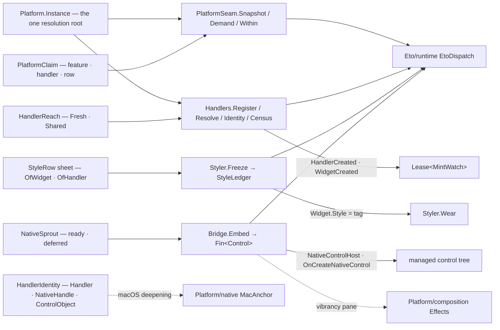

# [RASM_GRASSHOPPER_PLATFORM_HANDLERS]

`PlatformSeam`, `Handlers`, `Styler`, and `Bridge` own the Eto platform seam of the Grasshopper boundary. `PlatformSeam` covers the active `Platform` root: the typed platform snapshot, one polymorphic capability demand (`PlatformClaim` — feature flags, handler-type support, platform-row identity — behind one gate), and the platform-context window foreign-platform work runs inside. `Handlers` covers the widget-to-handler substrate: instantiator registration through `Platform.Add<T>`, reach-row resolution over `Create`/`CreateShared`, the per-widget identity capsule (`Widget.Handler`/`NativeHandle`/`ControlObject`/`ID`/`Style`/`IsDisposed` read as one evidence record), and the leased mint census over `HandlerCreated`/`WidgetCreated`.

`Styler` turns `Eto.Style` registration into frozen data rows — a `StyleRow` closes its widget or handler generic at mint, a `StyleLedger` seals the registry injectively, and wearing a style is a marshalled `Widget.Style` assignment — so a canvas or panel restyles by row, never by subclass. `Bridge` holds `NativeControlHost` embedding for ready and deferred native views and registers the managed-to-AppKit contract (`IMacViewHandler`/`IMacWindow`, `MacConversions`/`CGConversions`) the macOS pages compose. Every GH2 panel, plugin chrome, and native-integration surface composes these rows; probing `Platform.Instance`, comparing stringly platform ids, subclassing controls for cosmetics, and hand-rolled `Handler` casts are the deleted forms.

## [01]-[INDEX]

- [02]-[PLATFORM]: `PlatformRow` + `PlatformClaim` + `PlatformFact` + `PlatformSeam` — the platform-identity rows, the one polymorphic capability demand, the typed snapshot, and the foreign-platform context window.
- [03]-[HANDLERS]: `HandlerReach` + `HandlerIdentity` + `MintFact` + `MintWatch` + `Handlers` — instantiator registration, reach-row resolution, the widget identity capsule, and the leased mint census.
- [04]-[STYLE]: `StyleTag` + `StyleRow` + `StyleLedger` + `Styler` — scoped styling as frozen generator rows, the injective registry seal, marshalled wear, and the cascading provider swap.
- [05]-[BRIDGE]: `NativeSprout` + `Bridge` — ready and deferred `NativeControlHost` embedding, and the registered AppKit bridge contract.

## [02]-[PLATFORM]

- Owner: `PlatformRow` `[SmartEnum<string>]` — the platform-identity vocabulary keyed by the host's own `Platforms` id anchors: `Mac` (`Platforms.macOS`), `WinForms`, `Wpf`, `Gtk`, `Ios`, `Android`, each carrying one `[UseDelegateFromConstructor]` `Probe(Platform)` column over the platform's own discriminant (`IsMac`, `IsWinForms`, `IsWpf`, `IsGtk`, `IsIos`, `IsAndroid`) — so a platform decision is exhaustive row dispatch and a stringly `ID` comparison beside the roster is the deleted form. `PlatformFact` is the typed snapshot evidence: the raw `ID`, the resolved `Option<PlatformRow>`, the desktop/mobile/validity posture, and the `PlatformFeatures` flag set, read in one gate so a consumer holds platform truth as data instead of re-probing per decision.
- Owner: `PlatformClaim` `[Union]` — the one capability-demand vocabulary: `FeatureCase(PlatformFeatures)` demands a flag subset of `SupportedFeatures`, `HandlerCase(Type)` demands `Platform.Supports(Type)` for a handler contract, `RowCase(PlatformRow)` demands the row's probe — three demand modalities, one `Demand` gate, one typed `Fault.Unsupported` refusal; a scattered `if (Platform.Instance.IsMac)` at a consumer is the defect this union forecloses.
- Entry: `PlatformSeam.Snapshot(Op? key = null)` → `Fin<PlatformFact>`; `Demand(PlatformClaim claim, Op? key = null)` → `Fin<Unit>`; `Within<T>(Func<Fin<T>> body, Op? key = null)` → `Fin<T>`.
- Law: `Platform.Instance` absence is a typed refusal — `Optional(Platform.Instance).ToFin(op.MissingContext())` gates every entry, so a pre-boot or headless call fails as `Fault.MissingContext`, never as a null dereference; inside the Rhino process the instance is `Eto.Mac.Platform` and `Platforms.macOS` is the id the `Mac` row anchors.
- Law: `Within` runs its body inside a `using` over `Platform.Context` — the host's own push/pop window for work against a platform that is not ambient — so multi-platform handler work never leaks a context frame; `PlatformSeam.Demand(new PlatformClaim.RowCase(PlatformRow.Mac))` and `Platform/native.md`'s `MacGate.Demand` are two gates of one posture: this one asks the Eto platform, that one asks the operating system, and macOS-native work demands both.
- Boundary: `Platform.Initialize`/`Get`/`Detect`/`AllowReinitialize`/`LoadAssembly` and the `PlatformExtensionAttribute` extension-assembly registration are application-boot surfaces the shell owner spends once at startup, never per-operation surfaces here; `Platform.Invoke`/`ThreadStart` are superseded by `Eto/runtime.md`'s `EtoDispatch` and never called beside it.
- Packages: Eto (`Platform.Instance`, `Platform.ID`, `IsMac`/`IsWinForms`/`IsWpf`/`IsGtk`/`IsIos`/`IsAndroid`/`IsDesktop`/`IsMobile`/`IsValid`, `SupportedFeatures`, `Supports(Type)`, `Context`, `Platforms`, `PlatformFeatures`), `Rasm.Domain` (`Op`, `Fault`, `ValidityClaim`).
- Growth: a new platform id is one `PlatformRow` row; a new demand modality is one `PlatformClaim` case with one `Demand` arm; a new platform fact is one `PlatformFact` field.

```csharp signature
// --- [RUNTIME_PRELUDE] ----------------------------------------------------------------------
using Rasm.Csp;

namespace Rasm.Grasshopper.Platform;

// --- [TYPES] --------------------------------------------------------------------------------
[SmartEnum<string>]
public sealed partial class PlatformRow {
    public static readonly PlatformRow Mac = new(key: Platforms.macOS, probe: static platform => platform.IsMac);
    public static readonly PlatformRow WinForms = new(key: Platforms.WinForms, probe: static platform => platform.IsWinForms);
    public static readonly PlatformRow Wpf = new(key: Platforms.Wpf, probe: static platform => platform.IsWpf);
    public static readonly PlatformRow Gtk = new(key: Platforms.Gtk, probe: static platform => platform.IsGtk);
    public static readonly PlatformRow Ios = new(key: Platforms.Ios, probe: static platform => platform.IsIos);
    public static readonly PlatformRow Android = new(key: Platforms.Android, probe: static platform => platform.IsAndroid);
    [UseDelegateFromConstructor] internal partial bool Probe(Platform platform);
}

[Union]
public abstract partial record PlatformClaim {
    private PlatformClaim() { }
    public sealed record FeatureCase(PlatformFeatures Features) : PlatformClaim;
    public sealed record HandlerCase(Type Contract) : PlatformClaim;
    public sealed record RowCase(PlatformRow Row) : PlatformClaim;
}

// --- [MODELS] -------------------------------------------------------------------------------
[BoundaryAdapter, StructLayout(LayoutKind.Auto)]
public readonly record struct PlatformFact(
    string Id, Option<PlatformRow> Row, bool IsDesktop, bool IsMobile, bool Valid, PlatformFeatures Features) : IValidityEvidence {
    public bool IsValid => ValidityClaim.All(ValidityClaim.Of(holds: Id.Length > 0), ValidityClaim.Of(holds: Valid));
}

// --- [OPERATIONS] ---------------------------------------------------------------------------
[BoundaryAdapter]
public static class PlatformSeam {
    public static Fin<PlatformFact> Snapshot(Op? key = null) {
        Op op = key.OrDefault();
        return Optional(Platform.Instance).ToFin(op.MissingContext()).Bind(platform => op.Catch(body: () => Fin.Succ(new PlatformFact(
            Id: platform.ID,
            Row: toSeq(PlatformRow.Items).Find(row => row.Probe(platform: platform)),
            IsDesktop: platform.IsDesktop,
            IsMobile: platform.IsMobile,
            Valid: platform.IsValid,
            Features: platform.SupportedFeatures))));
    }

    public static Fin<Unit> Demand(PlatformClaim claim, Op? key = null) {
        Op op = key.OrDefault();
        return from platform in Optional(Platform.Instance).ToFin(op.MissingContext())
               from valid in Optional(claim).ToFin(op.InvalidInput())
               from settled in valid.Switch(
                   state: (Host: platform, Key: op),
                   featureCase: static (s, c) => (s.Host.SupportedFeatures & c.Features) == c.Features
                       ? Fin.Succ(unit)
                       : Fin.Fail<Unit>(s.Key.Unsupported(geometryType: typeof(Platform), outputType: typeof(Unit))),
                   handlerCase: static (s, c) => s.Key.Catch(body: () => s.Host.Supports(c.Contract)
                       ? Fin.Succ(unit)
                       : Fin.Fail<Unit>(s.Key.Unsupported(geometryType: c.Contract, outputType: typeof(Unit)))),
                   rowCase: static (s, c) => c.Row.Probe(platform: s.Host)
                       ? Fin.Succ(unit)
                       : Fin.Fail<Unit>(s.Key.Unsupported(geometryType: typeof(Platform), outputType: typeof(Unit))))
               select settled;
    }

    public static Fin<T> Within<T>(Func<Fin<T>> body, Op? key = null) {
        Op op = key.OrDefault();
        return from platform in Optional(Platform.Instance).ToFin(op.MissingContext())
               from valid in Optional(body).ToFin(op.InvalidInput())
               from settled in op.Catch(body: () => {
                   using IDisposable frame = platform.Context;
                   return valid();
               })
               select settled;
    }
}
```

## [03]-[HANDLERS]

- Owner: `HandlerReach` `[SmartEnum<int>]` — the resolution-modality rows over one `[UseDelegateFromConstructor]` `Mint(Platform, Type)` column: `Fresh` (key 0, `Platform.Create(Type)` — a new handler per call) and `Shared` (key 1, `Platform.CreateShared(Type)` — the platform's singleton for the contract). `Handlers.Resolve<THandler>` closes the generic over the row: mint through the reach, cast with `Option`-lowering, refuse a miss as `Fault.MissingContext` — the unguarded `(THandler)Platform.Instance.Create<THandler>()` throw path is the deleted form. `Handlers.Register<THandler>` feeds `Platform.Add<T>(Func<T>)`, so a folder-supplied handler (a themed replacement, a test double, a `NativeControlHost.IHandler` override) enters the same resolution root every stock widget mints through.
- Owner: `HandlerIdentity` — the per-widget identity capsule read in one marshal: the widget's concrete `Type`, the `Option<string>` `ID`, the `Option<string>` worn `Style`, the `Option<object>` `Handler`, the raw `nint` `NativeHandle`, the `Option<object>` `ControlObject`, and the `IsDisposed` bit — the one evidence record every diagnostic, seam probe, and native extraction reads instead of touching `Widget` members ad hoc. `Platform/native.md`'s `MacAnchor.Of` is the macOS deepening of this capsule: identity answers "what backs this widget" platform-agnostically; the anchor extracts the live `NSView` under `MacGate`.
- Owner: `MintFact` `[Union]` + `MintWatch` — the creation census: `HandlerCase(object Instance)` and `WidgetCase(Widget Instance)` project the platform's `HandlerCreated`/`WidgetCreated` raises as facts; `MintWatch` holds both subscriptions and detaches each exactly once on dispose. `Handlers.Census(Action<MintFact>, Op?)` → `Fin<Lease<MintWatch>>` — the leased observation a leak audit or a startup profiler composes; the callback projects and returns, and downstream work re-enters through its own gate.
- Entry: `Handlers.Register<THandler>(Func<THandler> instantiator, Op? key = null) where THandler : class` → `Fin<Unit>`; `Resolve<THandler>(HandlerReach reach, Op? key = null) where THandler : class` → `Fin<THandler>`; `Identity(Widget widget, Op? key = null)` → `Fin<HandlerIdentity>`; `Census(Action<MintFact> publish, Op? key = null)` → `Fin<Lease<MintWatch>>`.
- Law: `NativeHandle` reads through the widget's own handler chain and a disposed widget throws inside the host — the identity read runs under `Op.Catch` so a dead widget lands as a typed `Fault`, never an `ObjectDisposedException` into a diagnostic path; `IsDisposed` rides the capsule so the consumer distinguishes dead from handleless.
- Boundary: `Widget.Properties` (the host's per-widget `PropertyStore`) stays a host slot consumers touch only through owning pages; `Widget.StyleChanged` is a `Shell/events.md` source row, never subscribed here; handler-INTERFACE contracts (`Control.IHandler` and siblings) are the host's own vocabulary carried as `Type` values, never re-declared. Themed tiers — `ThemedControlHandler<TControl,TWidget,TCallback>`/`ThemedContainerHandler<TControl,TWidget,TCallback>` under `IThemedControlHandler` — are the host's managed-widget handler base a folder-supplied control derives; a themed concrete enters through `Register<THandler>` and resolves through the same root, never a parallel resolution path, and `HandlerAttribute` is the widget-side declaration binding a widget type to the handler contract the platform resolves against.
- Packages: Eto (`Platform.Add<T>`, `Platform.Create(Type)`, `Platform.CreateShared(Type)`, `Platform.HandlerCreated`, `Platform.WidgetCreated`, `HandlerCreatedEventArgs.Instance`, `WidgetCreatedEventArgs.Instance`, `Widget.ID`/`Style`/`Handler`/`NativeHandle`/`ControlObject`/`IsDisposed`, `ThemedControlHandler<TControl,TWidget,TCallback>`, `ThemedContainerHandler<TControl,TWidget,TCallback>`, `HandlerAttribute`), LanguageExt.Core (`Fin`, `Option`), `Rasm.Domain` (`Op`, `Lease<T>`), `Eto/runtime.md` (`EtoDispatch`).
- Growth: a new resolution modality is one `HandlerReach` row; a new identity fact is one `HandlerIdentity` field; a new census fact is one `MintFact` case — the four gates never widen.

```csharp signature
// --- [RUNTIME_PRELUDE] ----------------------------------------------------------------------
using Rasm.Csp;

namespace Rasm.Grasshopper.Platform;

// --- [TYPES] --------------------------------------------------------------------------------
[SmartEnum<int>]
public sealed partial class HandlerReach {
    public static readonly HandlerReach Fresh = new(key: 0, mint: static (platform, contract) => platform.Create(contract));
    public static readonly HandlerReach Shared = new(key: 1, mint: static (platform, contract) => platform.CreateShared(contract));
    [UseDelegateFromConstructor] internal partial object Mint(Platform platform, Type contract);
}

[Union]
public abstract partial record MintFact {
    private MintFact() { }
    public sealed record HandlerCase(object Instance) : MintFact;
    public sealed record WidgetCase(Widget Instance) : MintFact;
}

// --- [MODELS] -------------------------------------------------------------------------------
public sealed record HandlerIdentity(
    Type WidgetType, Option<string> Id, Option<string> Worn, Option<object> Handler,
    nint NativeHandle, Option<object> ControlObject, bool Disposed);

// --- [SERVICES] -----------------------------------------------------------------------------
public sealed class MintWatch : IDisposable {
    private readonly Platform platform;
    private readonly EventHandler<HandlerCreatedEventArgs> onHandler;
    private readonly EventHandler<WidgetCreatedEventArgs> onWidget;
    private int released;
    internal MintWatch(Platform platform, EventHandler<HandlerCreatedEventArgs> onHandler, EventHandler<WidgetCreatedEventArgs> onWidget) {
        this.platform = platform;
        this.onHandler = onHandler;
        this.onWidget = onWidget;
    }
    public void Dispose() => Op.SideWhen(
        condition: Interlocked.Exchange(location1: ref released, value: 1) == 0,
        action: () => {
            platform.HandlerCreated -= onHandler;
            platform.WidgetCreated -= onWidget;
        });
}

// --- [OPERATIONS] ---------------------------------------------------------------------------
[BoundaryAdapter]
public static class Handlers {
    public static Fin<Unit> Register<THandler>(Func<THandler> instantiator, Op? key = null) where THandler : class {
        Op op = key.OrDefault();
        return from platform in Optional(Platform.Instance).ToFin(op.MissingContext())
               from valid in Optional(instantiator).ToFin(op.InvalidInput())
               from settled in EtoDispatch.Run(body: () => op.Catch(body: () => Fin.Succ(Op.Side(action: () => platform.Add(instantiator: valid)))), key: op)
               select settled;
    }

    public static Fin<THandler> Resolve<THandler>(HandlerReach reach, Op? key = null) where THandler : class {
        Op op = key.OrDefault();
        return from platform in Optional(Platform.Instance).ToFin(op.MissingContext())
               from valid in Optional(reach).ToFin(op.InvalidInput())
               from resolved in EtoDispatch.Run(body: () => op.Catch(body: () =>
                   Optional(valid.Mint(platform: platform, contract: typeof(THandler)) as THandler).ToFin(op.MissingContext())), key: op)
               select resolved;
    }

    public static Fin<HandlerIdentity> Identity(Widget widget, Op? key = null) {
        Op op = key.OrDefault();
        return from valid in Optional(widget).ToFin(op.InvalidInput())
               from capsule in EtoDispatch.Run(body: () => op.Catch(body: () => Fin.Succ(new HandlerIdentity(
                   WidgetType: valid.GetType(),
                   Id: Optional(valid.ID).Filter(static id => id.Length > 0),
                   Worn: Optional(valid.Style).Filter(static style => style.Length > 0),
                   Handler: Optional(valid.Handler),
                   NativeHandle: valid.NativeHandle,
                   ControlObject: Optional(valid.ControlObject),
                   Disposed: valid.IsDisposed))), key: op)
               select capsule;
    }

    public static Fin<Lease<MintWatch>> Census(Action<MintFact> publish, Op? key = null) {
        Op op = key.OrDefault();
        return from platform in Optional(Platform.Instance).ToFin(op.MissingContext())
               from valid in Optional(publish).ToFin(op.InvalidInput())
               from lease in EtoDispatch.Run(body: () => op.Catch(body: () => {
                   EventHandler<HandlerCreatedEventArgs> onHandler = (_, args) => valid(new MintFact.HandlerCase(Instance: args.Instance));
                   EventHandler<WidgetCreatedEventArgs> onWidget = (_, args) => valid(new MintFact.WidgetCase(Instance: args.Instance));
                   platform.HandlerCreated += onHandler;
                   platform.WidgetCreated += onWidget;
                   return Fin.Succ((Lease<MintWatch>)new Lease<MintWatch>.Owned(
                       Value: new MintWatch(platform: platform, onHandler: onHandler, onWidget: onWidget)));
               }), key: op)
               select lease;
    }
}
```

## [04]-[STYLE]

- Owner: `StyleTag` `[ValueObject<string>]` — the style identity: ordinal, trimmed, non-blank; the name `Style.Add` registers under and `Widget.Style` wears — a raw style string beside the owner is the deleted form. `StyleRow` — one registration row closing its generic at mint: `OfWidget<TWidget>(StyleTag, Action<TWidget>)` registers a `StyleWidgetHandler<TWidget>` against the widget facade, `OfHandler<THandler>(StyleTag, Action<THandler>)` registers a `StyleHandler<THandler>` against the concrete handler — so widget-level cosmetics and handler-level native surgery are two mints of one row shape, and a sheet of rows is plain data a plugin declares once.
- Owner: `StyleLedger` — the sealed registry evidence: the tag-keyed row map; duplicate tags refuse at the seal so the ledger is injective by construction. `Styler.Freeze` registers every row through `Eto.Style.Add` in one marshal and seals; `Styler.Wear` assigns `Widget.Style` in one marshal, so a widget joins a style scope as data; `Styler.Provide` swaps the process `Style.Provider` for a cascading `IStyleProvider` (container-inherited styles via `Inherit`/`ApplyCascadingStyle`) — the one advanced escape hatch, spent by the shell owner at most once.
- Entry: `Styler.Freeze(Seq<StyleRow> rows, Op? key = null)` → `Fin<StyleLedger>`; `Wear(Widget widget, StyleTag tag, Op? key = null)` → `Fin<Unit>`; `Provide(IStyleProvider provider, Op? key = null)` → `Fin<Unit>`.
- Law: registration is process-global host state — a frozen row applies to every widget subsequently wearing the tag, so `Freeze` runs once per plugin scope at composition time and re-freezing an already-registered tag set is the caller's duplicate-tag refusal; a style body runs inside the host's attach path, so a row's dress delegate stays a pure property assignment and never raises, marshals, or resolves.
- Law: Rhino-native chrome and Eto styling are two seams — `Eto/windows.md`'s `ChromeRow.Rhino` routes a surface through `SessionOp.StyleCase` (`UseRhinoStyle`), while a `StyleRow` scopes folder-owned cosmetics by tag; a window wears both when a Rhino-styled surface also joins a folder style scope, and neither seam ever re-implements the other.
- Boundary: `Style.StyleWidget` (the global any-widget-styled raise) is a `Shell/events.md` source row when observation is demanded; the default `DefaultStyleProvider` stays the host's unless `Provide` swaps it.
- Packages: Eto (`Style.Add<TWidget>`, `Style.Add<THandler>`, `Style.Provider`, `StyleWidgetHandler<TWidget>`, `StyleHandler<THandler>`, `IStyleProvider.Inherit`/`ApplyStyle`/`ApplyCascadingStyle`/`ApplyDefault`, `Widget.Style`, `Widget.IHandler`), LanguageExt.Core (`Fin`, `HashMap`, `Seq`), `Rasm.Domain` (`Op`), `Eto/runtime.md` (`EtoDispatch`).
- Growth: a new styled surface is one row in a sheet; a new scope discipline is a policy at the consumer — the three gates never widen.

```csharp signature
// --- [RUNTIME_PRELUDE] ----------------------------------------------------------------------
using Rasm.Csp;

namespace Rasm.Grasshopper.Platform;

// --- [TYPES] --------------------------------------------------------------------------------
[ValueObject<string>]
public readonly partial struct StyleTag {
    static partial void ValidateFactoryArguments(ref ValidationError? validationError, ref string value) {
        value = value?.Trim() ?? string.Empty;
        validationError = value.Length > 0 ? null : new ValidationError(message: "StyleTag requires a non-blank identity.");
    }
}

// --- [MODELS] -------------------------------------------------------------------------------
public sealed record StyleRow(StyleTag Tag, Action Register) {
    public static StyleRow OfWidget<TWidget>(StyleTag tag, Action<TWidget> dress) where TWidget : Widget =>
        new(Tag: tag, Register: () => Style.Add<TWidget>(style: tag.Value, handler: widget => dress(widget)));
    public static StyleRow OfHandler<THandler>(StyleTag tag, Action<THandler> dress) where THandler : class, Widget.IHandler =>
        new(Tag: tag, Register: () => Style.Add<THandler>(style: tag.Value, styleHandler: handler => dress(handler)));
}

public sealed record StyleLedger(HashMap<StyleTag, StyleRow> Rows) {
    public Option<StyleRow> Row(StyleTag tag) => Rows.Find(tag);
}

// --- [OPERATIONS] ---------------------------------------------------------------------------
[BoundaryAdapter]
public static class Styler {
    public static Fin<StyleLedger> Freeze(Seq<StyleRow> rows, Op? key = null) {
        Op op = key.OrDefault();
        return Optional(rows).ToFin(op.InvalidInput()).Bind(valid =>
            valid.Map(static row => row.Tag).Distinct().Count() == valid.Count
                ? EtoDispatch.Run(body: () => op.Catch(body: () => {
                      valid.Iter(row => row.Register());
                      return Fin.Succ(new StyleLedger(Rows: toHashMap(valid.Map(static row => (row.Tag, row)))));
                  }), key: op)
                : Fin.Fail<StyleLedger>(op.InvalidInput()));
    }

    public static Fin<Unit> Wear(Widget widget, StyleTag tag, Op? key = null) {
        Op op = key.OrDefault();
        return from target in Optional(widget).ToFin(op.InvalidInput())
               from worn in EtoDispatch.Run(body: () => op.Catch(body: () => Fin.Succ(Op.Side(action: () => target.Style = tag.Value))), key: op)
               select worn;
    }

    public static Fin<Unit> Provide(IStyleProvider provider, Op? key = null) {
        Op op = key.OrDefault();
        return from valid in Optional(provider).ToFin(op.InvalidInput())
               from swapped in EtoDispatch.Run(body: () => op.Catch(body: () => Fin.Succ(Op.Side(action: () => Style.Provider = valid))), key: op)
               select swapped;
    }
}
```

## [05]-[BRIDGE]

- Owner: `NativeSprout` `[Union]` — where a hosted native view comes from: `ReadyCase(object NativeView)` carries a live platform view (an `NSView`, a `Platform/composition.md` `Effects.Vibrancy` pane, a third-party native widget) into the `NativeControlHost(object)` constructor; `DeferredCase(Func<object> Mint)` defers creation to the host's own attach path — a private `DeferredHost : NativeControlHost` subclass overrides `OnCreateNativeControl` and fills `CreateNativeControlArgs.NativeControl` from the mint thunk, so an expensive native view materializes only when the managed tree demands it. `Bridge.Embed` is the one marshalled gate over both; `Eto/controls.md`'s `NativeHostCase` is the dispatch-free spec-tree row of the same seam, minting inside its presenter's marshal window.
- Owner: the registered bridge contract — this page owns the folder's managed-to-AppKit vocabulary as law: `IMacViewHandler` (`Control`/`Widget`/`SystemActions`/`TextInputCancelled`) and `IMacWindow` (`Control`/`RestoreBounds`/`Widget`) are THE extraction contracts `Platform/native.md`'s `MacAnchor` composes, and `Eto.Mac.MacConversions`/`CGConversions` are THE managed-value-to-native-value projection owners (`Eto.Drawing.Color` → `CGColor`, `RectangleF` → `CGRect`) composed at `Platform/composition.md` call sites — a hand-rolled `NSView` lookup or a local colour/geometry conversion beside these owners is the deleted form.
- Entry: `Bridge.Embed(NativeSprout sprout, Op? key = null)` → `Fin<Control>`.
- Law: hosting and extraction are two directions of one bridge — `Embed` carries native INTO the managed tree, `HandlerIdentity.ControlObject`/`NativeHandle` and the macOS anchor carry managed OUT to native — and both directions cross typed: an embed of a null view refuses `Fault.InvalidInput`, an extraction miss lowers to `None`, and no direction throws through the seam.
- Law: the concrete `MacConversions`/`CGConversions` member spellings are RESEARCH — the class identities are catalog-verified, so the ownership law binds now and each conversion member lands as a verified call-site spelling on the composing page when the `Eto.macOS` decompile resolves it; the bridge gate is unaffected.
- Boundary: what happens ON an extracted `NSView` — monitors, gestures, layers, pacing — is `Platform/native.md` and `Platform/composition.md` territory behind `MacGate`; this page ends at the managed rim.
- Packages: Eto (`NativeControlHost(object)`, `NativeControlHost()`, `OnCreateNativeControl`, `CreateNativeControlArgs.NativeControl`), Eto.macOS (`IMacViewHandler`, `IMacWindow`, `MacConversions`, `CGConversions`), `Rasm.Domain` (`Op`, `Fault`), `Eto/runtime.md` (`EtoDispatch`).
- Growth: a new sprout origin is one `NativeSprout` case with one `Embed` arm; a resolved conversion member is a call-site spelling on the composing page — the gate never widens.

```csharp signature
// --- [RUNTIME_PRELUDE] ----------------------------------------------------------------------
using Rasm.Csp;

namespace Rasm.Grasshopper.Platform;

// --- [TYPES] --------------------------------------------------------------------------------
[Union]
public abstract partial record NativeSprout {
    private NativeSprout() { }
    public sealed record ReadyCase(object NativeView) : NativeSprout;
    public sealed record DeferredCase(Func<object> Mint) : NativeSprout;
}

// --- [OPERATIONS] ---------------------------------------------------------------------------
[BoundaryAdapter]
public static class Bridge {
    public static Fin<Control> Embed(NativeSprout sprout, Op? key = null) {
        Op op = key.OrDefault();
        return Optional(sprout).ToFin(op.InvalidInput()).Bind(valid => EtoDispatch.Run(body: () => valid.Switch(
            state: op,
            readyCase: static (k, c) => Optional(c.NativeView).ToFin(k.InvalidInput())
                .Bind(view => k.Catch(body: () => Fin.Succ((Control)new NativeControlHost(view)))),
            deferredCase: static (k, c) => Optional(c.Mint).ToFin(k.InvalidInput())
                .Bind(mint => k.Catch(body: () => Fin.Succ((Control)new DeferredHost(mint: mint))))), key: op));
    }

    private sealed class DeferredHost : NativeControlHost {
        private readonly Func<object> mint;
        internal DeferredHost(Func<object> mint) => this.mint = mint;
        protected override void OnCreateNativeControl(CreateNativeControlArgs e) => e.NativeControl = mint();
    }
}
```



## [06]-[DENSITY_BAR]

One owner per axis; capability lands as a case, a row, or a field — never a sibling surface.

| [INDEX] | [CONCERN]          | [OWNER]                                      | [RAIL]                               | [CASES] |
| :-----: | :----------------- | :------------------------------------------- | :----------------------------------- | :-----: |
|  [01]   | platform identity  | `PlatformRow` + `PlatformFact`               | `Snapshot → Fin<PlatformFact>`       |    6    |
|  [02]   | capability demand  | `PlatformClaim`                              | `Demand → Fin<Unit>`                 |    3    |
|  [03]   | handler resolution | `HandlerReach` + `Handlers`                  | `Register`/`Resolve` → `Fin<T>`      |    2    |
|  [04]   | identity + census  | `HandlerIdentity` + `MintFact` + `MintWatch` | `Identity`/`Census` → `Fin<T>`       |   2+2   |
|  [05]   | scoped styling     | `StyleTag` + `StyleRow` + `StyleLedger`      | `Freeze`/`Wear`/`Provide` → `Fin<T>` |    2    |
|  [06]   | native hosting     | `NativeSprout` + `Bridge`                    | `Embed → Fin<Control>`               |    2    |

`Op`, `Fault`, `Lease<T>`, `ValidityClaim`, and `EtoDispatch` are composed upstream owners. RESEARCH: the `MacConversions`/`CGConversions` member spellings, landing as call-site spellings on the composing macOS pages.
