# [RASM_GRASSHOPPER_PLATFORM_NATIVE]

The macOS-native boundary owns platform admission, managed-to-AppKit view extraction, rich input monitors, gesture and pressure attachment, workspace accessibility facts, screen-bound pacing evidence, and every inverse native lifecycle. `MacGate` requires both a macOS process and the active valid `Eto.Mac.Platform`; `EtoDispatch` owns UI affinity; `Lease<T>` bounds every retained observer or attachment; and deferred native callbacks record faults instead of throwing through the AppKit pump.

## [01]-[INDEX]

- [02]-[GATE_AND_ANCHOR]: `MacGate` + `MacViewRole` + `AnchorSource` + `MacAnchor` — dual platform admission and explicit `IMacControlHandler` view-role extraction.
- [03]-[INPUT]: `NativeInput` + `MonitorPlan` + `NativeMonitor` — ABI-faithful `NSEvent` evidence, absorption policy, callback containment, and leased monitor teardown.
- [04]-[GESTURE_AND_PRESSURE]: `GestureKind` + `GesturePlan` + `GestureBinding` + `PressureBinding` — typed recognizer minting, callback evidence, configuration, and exact UI-affine inverses.
- [05]-[WORKSPACE]: `AccessibilityPosture` + `PaceBounds` + `WorkspaceFact` + `WorkspaceWatch` — initial and changing accessibility facts plus anchor-screen retuning evidence.

## [02]-[GATE_AND_ANCHOR]

- Owner: `MacGate.Demand(Op?)` → `Fin<Unit>` admits only when `OperatingSystem.IsMacOS()` holds and `Eto.Platform.Instance` is a valid `Eto.Mac.Platform` whose `IsMac` row is true. Process identity alone cannot prove that Eto loaded the AppKit backend, and an Eto platform claim alone cannot legalize AppKit on another operating system.
- Owner: `MacViewRole` `[SmartEnum<int>]` closes the five `NSView` roles inherited by `IMacViewHandler` from `IMacControlHandler`: `Container`, `Content`, `Event`, `Focus`, and `TextInput`. Each row carries its exact selector delegate. No `IMacViewHandler.Control` member exists, so extraction always states which native role the consumer needs.
- Owner: `AnchorSource` `[Union]` distinguishes `CanvasCase(Canvas)` from `ControlCase(Control, MacViewRole)`. `MacAnchor.Of` gates first, marshals once, reads `Canvas.ControlObject as NSView` or the selected `IMacControlHandler` role, and captures the live view, optional window, and bounds. A missing handler, view, or platform becomes a typed refusal.
- Law: an anchor is UI-affine evidence scoped to the operation or lease that consumes its view. A long-lived native attachment may retain the view for its own exact inverse, but consumers do not cache anchors as ambient host state.
- Entry: `NativeSeam.Convert(MacAnchor, CGPoint, Option<NSView>, Op?)` → `Fin<CGPoint>` owns `NSView.ConvertPointFromView`; `None` denotes window coordinates.
- Packages: Grasshopper2 (`Canvas.ControlObject`), Eto (`Platform.Instance`, `Control.Handler`), Eto.macOS (`Eto.Mac.Platform`, `IMacControlHandler`, `IMacViewHandler`), Microsoft.macOS (`NSView`, `NSWindow`, `CGPoint`, `CGRect`), `Rasm.Domain`, `Eto/runtime.md` (`EtoDispatch`).
- Growth: a new managed origin is one `AnchorSource` case, and a newly admitted native role is one `MacViewRole` row; the gate and extraction rail remain unchanged.

## [03]-[INPUT]

- Owner: `NativeInput` preserves the installed `NSEvent` ABI: `NFloat` scroll, magnification, and stage-transition values; `float` rotation, pressure, and tangential pressure; native-width `nint Stage`; `NSEventModifierMask Modifiers`; and `ushort KeyCode`. The native event never escapes its callback.
- Owner: `MonitorPlan` carries mask, publication, and absorption policy. `NativeMonitor.Receive` projects the event and executes both delegates inside `Op.Catch`; a callback fault records in `LastFault` and returns the original event, preserving the responder chain rather than swallowing on uncertainty.
- Entry: `NativeSeam.Observe(MonitorPlan, Op?)` → `Fin<Lease<NativeMonitor>>` attaches one local monitor. The owned lease marshals its idempotent inverse, calls `NSEvent.RemoveMonitor`, and disposes the returned token even when one inverse step faults.
- Law: monitor publication projects and returns. Downstream host mutation enters through its own owning session or dispatch gate, so the native callback never becomes an unbounded application-work window.
- Packages: Microsoft.macOS (`NSEvent`, `NSEventMask`, `NSEventType`, `NSEventPhase`, `NSEventModifierMask`, `NFloat`, `NSObject`), `Rasm.Domain` (`Op`, `Lease<T>`, `ValidityClaim`), `Eto/runtime.md` (`EtoDispatch`).
- Growth: a new event axis is one ABI-faithful field on `NativeInput`; a new monitor scope is data in `NSEventMask`.

## [04]-[GESTURE_AND_PRESSURE]

- Owner: `GestureKind` `[SmartEnum<int>]` closes the installed recognizer constructors: click, pan, magnification, rotation, and press. Each row mints its concrete recognizer through the verified `Action` constructor. `GesturePlan` carries one pre-attachment configuration delegate and one `GestureInput` publisher; the evidence contains kind, native state, and location in the bound view without exposing the recognizer.
- Entry: `NativeSeam.Gesture(MacAnchor, GesturePlan, Op?)` → `Fin<Lease<GestureBinding>>` mints, configures, attaches, and owns the recognizer. Deferred action callbacks run inside `Op.Catch` and record in the binding's fault cell. Disposal marshals, removes the recognizer from its original view, and disposes it exactly once.
- Owner: `PressureBinding` owns a verified `NSPressureConfiguration(NSPressureBehavior)` instance and remembers the view's prior optional configuration. `NativeSeam.Pressure(MacAnchor, NSPressureBehavior, Op?)` → `Fin<Lease<PressureBinding>>` assigns the new configuration; disposal restores the prior value and releases the owned configuration on the UI thread.
- Law: gesture configuration and observation remain one lifecycle. A raw recognizer, target-selector bridge, or pressure configuration cannot outlive the lease that attached it.
- Packages: Microsoft.macOS (`NSClickGestureRecognizer`, `NSPanGestureRecognizer`, `NSMagnificationGestureRecognizer`, `NSRotationGestureRecognizer`, `NSPressGestureRecognizer`, `NSGestureRecognizerState`, `NSPressureConfiguration`, `NSPressureBehavior`), `Rasm.Domain` (`Op`, `Lease<T>`), `Eto/runtime.md` (`EtoDispatch`).
- Growth: a new concrete recognizer is one `GestureKind` row; a new pressure posture is an `NSPressureBehavior` value on the existing entry.

## [05]-[WORKSPACE]

- Owner: `AccessibilityPosture` carries the five installed workspace display options: reduce motion, reduce transparency, differentiate without colour, increase contrast, and invert colours. `NativeSeam.Accessibility(Op?)` reads one coherent posture on the UI thread.
- Owner: `PaceBounds` retains the screen handle, native-width `nint MaximumFramesPerSecond`, and refresh-interval bounds. `NativeSeam.Pace(MacAnchor, Op?)` resolves the anchor view's current window and screen on every read, validates the nonzero screen identity, positive native ceiling, finite positive intervals, and their order, and never substitutes `NSScreen.MainScreen` for the display actually hosting the view.
- Owner: `WorkspaceFact` carries one coherent accessibility-and-pace snapshot. `NativeSeam.Watch(MacAnchor, Action<WorkspaceFact>, Op?)` → `Fin<Lease<WorkspaceWatch>>` subscribes both `NSApplication.Notifications.ObserveDidChangeScreenParameters` and `NSWorkspace.Notifications.ObserveDisplayOptionsDidChange`, then publishes the initial snapshot. Either notification republishes the pair atomically, so a composition owner can retune against a changed screen and update accessibility policy from the same lease.
- Law: notification callbacks execute projection and publication inside `Op.Catch`; later failures remain in `WorkspaceWatch.LastFault`. Disposal marshals and releases both notification tokens exactly once, attempting both inverses even when either faults.
- Packages: Microsoft.macOS (`NSWorkspace`, `NSApplication`, `NSScreen`, `NSWindow`, `NSNotificationEventArgs`), `Rasm.Domain` (`Op`, `Lease<T>`, `ValidityClaim`), `Eto/runtime.md` (`EtoDispatch`).
- Growth: a new workspace policy axis is one posture field, and a new retuning value is one `WorkspaceFact` field; observation and teardown remain one leased owner.

```csharp signature
// --- [RUNTIME_PRELUDE] ----------------------------------------------------------------------
using System.Runtime.InteropServices;
using AppKit;
using CoreGraphics;
using Eto.Mac.Forms;
using Foundation;
using Rasm.Csp;
using Rasm.Grasshopper.Eto;

namespace Rasm.Grasshopper.Platform;

// --- [TYPES] --------------------------------------------------------------------------------
[SmartEnum<int>]
public sealed partial class MacViewRole {
    public static readonly MacViewRole Container = new(key: 0, select: static handler => handler.ContainerControl);
    public static readonly MacViewRole Content = new(key: 1, select: static handler => handler.ContentControl);
    public static readonly MacViewRole Event = new(key: 2, select: static handler => handler.EventControl);
    public static readonly MacViewRole Focus = new(key: 3, select: static handler => handler.FocusControl);
    public static readonly MacViewRole TextInput = new(key: 4, select: static handler => handler.TextInputControl);
    [UseDelegateFromConstructor] internal partial NSView Select(IMacControlHandler handler);
}

[SmartEnum<int>]
public sealed partial class GestureKind {
    public static readonly GestureKind Click = new(key: 0, mint: static action => new NSClickGestureRecognizer(action: action));
    public static readonly GestureKind Pan = new(key: 1, mint: static action => new NSPanGestureRecognizer(action: action));
    public static readonly GestureKind Magnification = new(key: 2, mint: static action => new NSMagnificationGestureRecognizer(action: action));
    public static readonly GestureKind Rotation = new(key: 3, mint: static action => new NSRotationGestureRecognizer(action: action));
    public static readonly GestureKind Press = new(key: 4, mint: static action => new NSPressGestureRecognizer(action: action));
    [UseDelegateFromConstructor] internal partial NSGestureRecognizer Mint(Action action);
}

[Union]
public abstract partial record AnchorSource {
    private AnchorSource() { }
    public sealed record CanvasCase(Canvas Surface) : AnchorSource;
    public sealed record ControlCase(Control Surface, MacViewRole Role) : AnchorSource;
}

// --- [MODELS] -------------------------------------------------------------------------------
public sealed record MacAnchor(NSView View, Option<NSWindow> Window, CGRect Bounds) {
    public static Fin<MacAnchor> Of(AnchorSource source, Op? key = null) {
        Op op = key.OrDefault();
        return from _ in MacGate.Demand(key: op)
               from valid in op.Need(source)
               from anchor in EtoDispatch.Run(body: () => valid.Switch(
                   state: op,
                   canvasCase: static (active, row) => Optional(row.Surface.ControlObject as NSView)
                       .ToFin(active.MissingContext()),
                   controlCase: static (active, row) =>
                       from role in active.Need(row.Role)
                       from handler in Optional(row.Surface.Handler as IMacControlHandler).ToFin(active.MissingContext())
                       from view in active.Catch(body: () => Optional(role.Select(handler: handler)).ToFin(active.MissingContext()))
                       select view)
                   .Map(view => new MacAnchor(View: view, Window: Optional(view.Window), Bounds: view.Bounds)), key: op)
               select anchor;
    }
}

[BoundaryAdapter, StructLayout(LayoutKind.Auto)]
public readonly record struct NativeInput(
    NSEventType Kind, NSEventPhase Phase, NSEventPhase Momentum,
    NFloat ScrollDeltaX, NFloat ScrollDeltaY, NFloat Magnification, float Rotation,
    float Pressure, float TangentialPressure, nint Stage, NFloat StageTransition,
    NSEventModifierMask Modifiers, ushort KeyCode) : IValidityEvidence {
    public bool IsValid => ValidityClaim.All(
        ValidityClaim.Of(holds: double.IsFinite((double)ScrollDeltaX)),
        ValidityClaim.Of(holds: double.IsFinite((double)ScrollDeltaY)),
        ValidityClaim.Of(holds: double.IsFinite((double)Magnification)),
        ValidityClaim.Of(holds: float.IsFinite(Rotation)),
        ValidityClaim.Of(holds: float.IsFinite(Pressure)),
        ValidityClaim.Of(holds: float.IsFinite(TangentialPressure)),
        ValidityClaim.Of(holds: double.IsFinite((double)StageTransition)));

    internal static NativeInput Of(NSEvent raw) => new(
        Kind: raw.Type,
        Phase: raw.Phase,
        Momentum: raw.MomentumPhase,
        ScrollDeltaX: raw.ScrollingDeltaX,
        ScrollDeltaY: raw.ScrollingDeltaY,
        Magnification: raw.Magnification,
        Rotation: raw.Rotation,
        Pressure: raw.Pressure,
        TangentialPressure: raw.TangentialPressure,
        Stage: raw.Stage,
        StageTransition: raw.StageTransition,
        Modifiers: raw.ModifierFlags,
        KeyCode: raw.KeyCode);
}

public sealed record MonitorPlan(NSEventMask Mask, Action<NativeInput> Publish, Func<NativeInput, bool> Absorb);

public sealed record GesturePlan(GestureKind Kind, Action<NSGestureRecognizer> Configure, Action<GestureInput> Publish);

[BoundaryAdapter, StructLayout(LayoutKind.Auto)]
public readonly record struct GestureInput(GestureKind Kind, NSGestureRecognizerState State, CGPoint Location);

[BoundaryAdapter, StructLayout(LayoutKind.Auto)]
public readonly record struct AccessibilityPosture(
    bool ReduceMotion,
    bool ReduceTransparency,
    bool DifferentiateWithoutColor,
    bool IncreaseContrast,
    bool InvertColors);

[BoundaryAdapter, StructLayout(LayoutKind.Auto)]
public readonly record struct PaceBounds(
    nint ScreenHandle,
    nint MaximumFramesPerSecond,
    double MinimumRefreshInterval,
    double MaximumRefreshInterval) : IValidityEvidence {
    public bool IsValid => ValidityClaim.All(
        ValidityClaim.Of(holds: ScreenHandle != 0),
        ValidityClaim.Of(holds: MaximumFramesPerSecond > 0),
        ValidityClaim.Positive(value: MinimumRefreshInterval),
        ValidityClaim.Positive(value: MaximumRefreshInterval),
        ValidityClaim.Ordered(lower: MinimumRefreshInterval, upper: MaximumRefreshInterval));
}

public sealed record WorkspaceFact(AccessibilityPosture Posture, PaceBounds Pace);

// --- [SERVICES] -----------------------------------------------------------------------------
public abstract class UiNativeLease : IDisposable {
    private readonly Atom<Option<Error>> lastFault = Atom(Option<Error>.None);
    private int releaseState;

    public Option<Error> LastFault => lastFault.Value;

    public void Dispose() => ignore(Release(key: Op.Of(name: nameof(Dispose))));

    protected void Record(Error error) => ignore(lastFault.Swap(_ => Some(error)));

    protected abstract Fin<Unit> ReleaseOnUi(Op key);

    private Fin<Unit> Release(Op key) {
        if (Interlocked.CompareExchange(location1: ref releaseState, value: 1, comparand: 0) != 0) return Fin.Succ(unit);
        Fin<Unit> outcome = EtoDispatch.Run(body: () => ReleaseOnUi(key: key), key: key);
        outcome.IfFail(error => Record(error: error));
        Volatile.Write(location: ref releaseState, value: 2);
        return outcome;
    }

    internal static Fin<Unit> ReleaseAll(Op key, params Action[] inverses) {
        Option<Error> first = Option<Error>.None;
        inverses.Iter(inverse => key.Catch(body: () => Fin.Succ(Op.Side(action: inverse))).IfFail(error =>
            first = first.Match(Some: static current => Some(current), None: () => Some(error))));
        return first.Match(Some: static error => Fin.Fail<Unit>(error: error), None: static () => Fin.Succ(unit));
    }
}

public sealed class NativeMonitor : UiNativeLease {
    private readonly NSObject token;

    internal NativeMonitor(NSObject token) => this.token = token;

    internal NSEvent Receive(NSEvent raw, MonitorPlan plan, Op key) => key.Catch(body: () => {
        NativeInput evidence = NativeInput.Of(raw: raw);
        plan.Publish(obj: evidence);
        return Fin.Succ(plan.Absorb(arg: evidence));
    }).Match(
        Succ: absorbed => absorbed ? null! : raw,
        Fail: error => { Record(error: error); return raw; });

    protected override Fin<Unit> ReleaseOnUi(Op key) => ReleaseAll(
        key: key,
        () => NSEvent.RemoveMonitor(eventMonitor: token),
        token.Dispose);
}

public sealed class GestureBinding : UiNativeLease {
    private readonly NSView view;
    private readonly GestureKind kind;
    private readonly NSGestureRecognizer recognizer;
    private readonly Action<GestureInput> publish;

    internal GestureBinding(NSView view, GestureKind kind, NSGestureRecognizer recognizer, Action<GestureInput> publish) {
        this.view = view;
        this.kind = kind;
        this.recognizer = recognizer;
        this.publish = publish;
    }

    internal void Receive(Op key) => key.Catch(body: () => Fin.Succ(Op.Side(action: () => publish(obj: new GestureInput(
        Kind: kind,
        State: recognizer.State,
        Location: recognizer.LocationInView(view: view)))))).IfFail(error => Record(error: error));

    protected override Fin<Unit> ReleaseOnUi(Op key) => ReleaseAll(
        key: key,
        () => view.RemoveGestureRecognizer(recognizer: recognizer),
        recognizer.Dispose);
}

public sealed class PressureBinding : UiNativeLease {
    private readonly NSView view;
    private readonly Option<NSPressureConfiguration> prior;
    private readonly NSPressureConfiguration configuration;

    internal PressureBinding(NSView view, Option<NSPressureConfiguration> prior, NSPressureConfiguration configuration) {
        this.view = view;
        this.prior = prior;
        this.configuration = configuration;
    }

    protected override Fin<Unit> ReleaseOnUi(Op key) => ReleaseAll(
        key: key,
        () => view.PressureConfiguration = prior.MatchUnsafe(Some: static active => active, None: static () => null!),
        configuration.Dispose);
}

public sealed class WorkspaceWatch : UiNativeLease {
    private readonly MacAnchor anchor;
    private readonly Action<WorkspaceFact> publish;
    private readonly Op operation;
    private NSObject screenObserver = null!;
    private NSObject displayObserver = null!;

    internal WorkspaceWatch(MacAnchor anchor, Action<WorkspaceFact> publish, Op operation) {
        this.anchor = anchor;
        this.publish = publish;
        this.operation = operation;
    }

    internal void Bind(NSObject screen, NSObject display) {
        screenObserver = screen;
        displayObserver = display;
    }

    internal Fin<Unit> Refresh() =>
        from posture in NativeSeam.ReadAccessibility(key: operation)
        from bounds in NativeSeam.ReadPace(anchor: anchor, key: operation)
        from emitted in operation.Catch(body: () => Fin.Succ(Op.Side(action: () =>
            publish(obj: new WorkspaceFact(Posture: posture, Pace: bounds)))))
        select emitted;

    internal void RefreshDeferred() => operation.Catch(body: Refresh).IfFail(error => Record(error: error));

    protected override Fin<Unit> ReleaseOnUi(Op key) => ReleaseAll(
        key: key,
        screenObserver.Dispose,
        displayObserver.Dispose);
}

// --- [OPERATIONS] ---------------------------------------------------------------------------
[BoundaryAdapter]
public static class MacGate {
    public static Fin<Unit> Demand(Op? key = null) {
        Op op = key.OrDefault();
        if (!OperatingSystem.IsMacOS())
            return Fin.Fail<Unit>(op.Unsupported(geometryType: typeof(NSView), outputType: typeof(Unit)));
        return from platform in op.Catch(body: () => Optional(global::Eto.Platform.Instance).ToFin(op.MissingContext()))
               from admitted in guard(
                   platform is global::Eto.Mac.Platform && platform.IsMac && platform.IsValid,
                   op.Unsupported(geometryType: typeof(NSView), outputType: typeof(Unit))).ToFin()
               select admitted;
    }
}

[BoundaryAdapter]
public static class NativeSeam {
    public static Fin<Lease<NativeMonitor>> Observe(MonitorPlan plan, Op? key = null) {
        Op op = key.OrDefault();
        return from _ in MacGate.Demand(key: op)
               from valid in op.Need(plan)
               from publish in op.Need(valid.Publish)
               from absorb in op.Need(valid.Absorb)
               let admitted = valid with { Publish = publish, Absorb = absorb }
               from lease in EtoDispatch.Run(body: () => {
                   NSObject? token = null;
                   NativeMonitor? monitor = null;
                   Fin<Lease<NativeMonitor>> outcome = op.Catch(body: () => {
                       token = NSEvent.AddLocalMonitorForEventsMatchingMask(
                           mask: admitted.Mask,
                           handler: raw => monitor?.Receive(raw: raw, plan: admitted, key: op) ?? raw);
                       monitor = new NativeMonitor(token: token);
                       return Fin.Succ((Lease<NativeMonitor>)new Lease<NativeMonitor>.Owned(Value: monitor));
                   });
                   outcome.IfFail(_ => Optional(token).Iter(active => ignore(UiNativeLease.ReleaseAll(
                       key: op,
                       () => NSEvent.RemoveMonitor(eventMonitor: active),
                       active.Dispose))));
                   return outcome;
               }, key: op)
               select lease;
    }

    public static Fin<Lease<GestureBinding>> Gesture(MacAnchor anchor, GesturePlan plan, Op? key = null) {
        Op op = key.OrDefault();
        return from _ in MacGate.Demand(key: op)
               from view in op.Need(anchor).Map(static active => active.View)
               from valid in op.Need(plan)
               from kind in op.Need(valid.Kind)
               from configure in op.Need(valid.Configure)
               from publish in op.Need(valid.Publish)
               from lease in EtoDispatch.Run(body: () => {
                   NSGestureRecognizer? recognizer = null;
                   bool attached = false;
                   GestureBinding? binding = null;
                   Fin<Lease<GestureBinding>> outcome = op.Catch(body: () => {
                       recognizer = kind.Mint(action: () => binding?.Receive(key: op));
                       configure(obj: recognizer);
                       view.AddGestureRecognizer(gestureRecognizer: recognizer);
                       attached = true;
                       binding = new GestureBinding(view: view, kind: kind, recognizer: recognizer, publish: publish);
                       return Fin.Succ((Lease<GestureBinding>)new Lease<GestureBinding>.Owned(Value: binding));
                   });
                   outcome.IfFail(_ => Optional(recognizer).Iter(active => ignore(UiNativeLease.ReleaseAll(
                       key: op,
                       () => Op.SideWhen(condition: attached, action: () => view.RemoveGestureRecognizer(gestureRecognizer: active)),
                       active.Dispose))));
                   return outcome;
               }, key: op)
               select lease;
    }

    public static Fin<Lease<PressureBinding>> Pressure(MacAnchor anchor, NSPressureBehavior behavior, Op? key = null) {
        Op op = key.OrDefault();
        return from _ in MacGate.Demand(key: op)
               from view in op.Need(anchor).Map(static active => active.View)
               from lease in EtoDispatch.Run(body: () => {
                   NSPressureConfiguration? configuration = null;
                   Fin<Lease<PressureBinding>> outcome = op.Catch(body: () => {
                       Option<NSPressureConfiguration> prior = Optional(view.PressureConfiguration);
                       configuration = new NSPressureConfiguration(pressureBehavior: behavior);
                       view.PressureConfiguration = configuration;
                       PressureBinding binding = new(view: view, prior: prior, configuration: configuration);
                       return Fin.Succ((Lease<PressureBinding>)new Lease<PressureBinding>.Owned(Value: binding));
                   });
                   outcome.IfFail(_ => configuration?.Dispose());
                   return outcome;
               }, key: op)
               select lease;
    }

    public static Fin<CGPoint> Convert(MacAnchor anchor, CGPoint point, Option<NSView> from, Op? key = null) {
        Op op = key.OrDefault();
        return from _ in MacGate.Demand(key: op)
               from view in op.Need(anchor).Map(static active => active.View)
               from projected in EtoDispatch.Run(body: () => op.Catch(body: () => Fin.Succ(view.ConvertPointFromView(
                   point: point,
                   view: from.MatchUnsafe(Some: static source => source, None: static () => null!)))), key: op)
               select projected;
    }

    public static Fin<AccessibilityPosture> Accessibility(Op? key = null) {
        Op op = key.OrDefault();
        return from _ in MacGate.Demand(key: op)
               from posture in EtoDispatch.Run(body: () => ReadAccessibility(key: op), key: op)
               select posture;
    }

    public static Fin<PaceBounds> Pace(MacAnchor anchor, Op? key = null) {
        Op op = key.OrDefault();
        return from _ in MacGate.Demand(key: op)
               from active in op.Need(anchor)
               from bounds in EtoDispatch.Run(body: () => ReadPace(anchor: active, key: op), key: op)
               select bounds;
    }

    public static Fin<Lease<WorkspaceWatch>> Watch(MacAnchor anchor, Action<WorkspaceFact> publish, Op? key = null) {
        Op op = key.OrDefault();
        return from _ in MacGate.Demand(key: op)
               from active in op.Need(anchor)
               from valid in op.Need(publish)
               from lease in EtoDispatch.Run(body: () => {
                   WorkspaceWatch watch = new(anchor: active, publish: valid, operation: op);
                   NSObject? screen = null;
                   NSObject? display = null;
                   Fin<Lease<WorkspaceWatch>> outcome = op.Catch(body: () => {
                       screen = NSApplication.Notifications.ObserveDidChangeScreenParameters(
                           handler: (_, _) => watch.RefreshDeferred());
                       display = NSWorkspace.Notifications.ObserveDisplayOptionsDidChange(
                           handler: (_, _) => watch.RefreshDeferred());
                       watch.Bind(screen: screen, display: display);
                       return watch.Refresh().Map(_ =>
                           (Lease<WorkspaceWatch>)new Lease<WorkspaceWatch>.Owned(Value: watch));
                   });
                   outcome.IfFail(_ => {
                       Action[] inverses = (screen, display) switch {
                           ({ } screenToken, { } displayToken) => [screenToken.Dispose, displayToken.Dispose],
                           ({ } screenToken, null) => [screenToken.Dispose],
                           (null, { } displayToken) => [displayToken.Dispose],
                           _ => [],
                       };
                       ignore(UiNativeLease.ReleaseAll(key: op, inverses: inverses));
                   });
                   return outcome;
               }, key: op)
               select lease;
    }

    internal static Fin<AccessibilityPosture> ReadAccessibility(Op key) => key.Catch(body: () =>
        from workspace in Optional(NSWorkspace.SharedWorkspace).ToFin(key.MissingContext())
        select new AccessibilityPosture(
            ReduceMotion: workspace.AccessibilityDisplayShouldReduceMotion,
            ReduceTransparency: workspace.AccessibilityDisplayShouldReduceTransparency,
            DifferentiateWithoutColor: workspace.AccessibilityDisplayShouldDifferentiateWithoutColor,
            IncreaseContrast: workspace.AccessibilityDisplayShouldIncreaseContrast,
            InvertColors: workspace.AccessibilityDisplayShouldInvertColors));

    internal static Fin<PaceBounds> ReadPace(MacAnchor anchor, Op key) => key.Catch(body: () =>
        from window in Optional(anchor.View.Window).ToFin(key.MissingContext())
        from screen in Optional(window.Screen).ToFin(key.MissingContext())
        let screenHandle = (nint)screen.Handle
        let maximumFrames = screen.MaximumFramesPerSecond
        let minimumInterval = screen.MinimumRefreshInterval
        let maximumInterval = screen.MaximumRefreshInterval
        from admitted in guard(
            screenHandle != 0 &&
            maximumFrames > 0 &&
            double.IsFinite(minimumInterval) && minimumInterval > 0.0 &&
            double.IsFinite(maximumInterval) && maximumInterval >= minimumInterval,
            key.InvalidResult()).ToFin()
        select new PaceBounds(
            ScreenHandle: screenHandle,
            MaximumFramesPerSecond: maximumFrames,
            MinimumRefreshInterval: minimumInterval,
            MaximumRefreshInterval: maximumInterval));
}
```

```mermaid
---
config:
  theme: base
  look: classic
  layout: elk
  elk:
    nodePlacementStrategy: NETWORK_SIMPLEX
    considerModelOrder: NODES_AND_EDGES
  flowchart:
    curve: linear
    padding: 25
  themeVariables:
    darkMode: true
    fontFamily: "SF Mono, Menlo, Cascadia Mono, Segoe UI Mono, Consolas, monospace"
    useGradient: false
    dropShadow: "none"
    background: "#282A36"
    mainBkg: "#44475A"
    primaryColor: "#44475A"
    primaryTextColor: "#F8F8F2"
    primaryBorderColor: "#BD93F9"
    nodeBorder: "#BD93F9"
    lineColor: "#FF79C6"
    arrowheadColor: "#FF79C6"
    textColor: "#F8F8F2"
    titleColor: "#D6BCFA"
    edgeLabelBackground: "#21222C"
    labelBackgroundColor: "#21222C"
  themeCSS: ".nodeLabel{font-size:13px;font-weight:500}.edgeLabel{font-size:12px;font-weight:500}.cluster-label .nodeLabel{font-size:13.5px;font-weight:700;letter-spacing:.08em}.edge-thickness-normal{stroke-width:2px}.edge-thickness-thick{stroke-width:3px}.edge-pattern-dashed,.edge-pattern-dotted{stroke-width:1.5px;stroke-dasharray:4 6}.node rect,.node circle,.node polygon,.node path,.node .outer-path{stroke-width:1.5px;filter:none!important}.cluster rect{stroke-width:1px!important;stroke-dasharray:5 4!important;filter:none!important}.marker path{transform:scale(.8);transform-origin:5px 5px}.marker circle{transform:scale(.48);transform-origin:5px 5px}.edgeLabel rect{transform-box:fill-box;transform-origin:center;transform:scale(1.1,1.2)}"
---
flowchart LR
    accTitle: macOS platform gate, native attachments, and changing workspace facts
    accDescr: The operating system and active Eto macOS platform admit explicit native view roles; leased monitors, gestures, pressure, and workspace observers contain callbacks and marshal their inverses; anchor-screen changes publish pacing evidence for composition retuning.
    Process["macOS process"] -->|"admits process"| Gate["MacGate.Demand"]
    Eto["active valid Eto.Mac.Platform"] -->|"admits backend"| Gate
    Gate -->|"opens extraction"| Anchor["MacAnchor.Of"]
    Roles["IMacControlHandler view roles"] -->|"select native view"| Anchor
    Anchor -->|"bind native capability"| Attach["monitor · gesture · pressure"]
    Attach -->|"return custody"| Lease["UI-affine native leases"]
    Lease -->|"marshal disposal"| Inverse["remove and release natives"]
    Anchor -->|"bind screen context"| Watch["WorkspaceWatch"]
    Screen["screen-parameter notification"] -->|"request refresh"| Watch
    Display["display-options notification"] -->|"request refresh"| Watch
    Watch -->|"publish coherent pair"| Facts["accessibility + pace facts"]
    Facts -->|"drive policy and range"| Retune["composition retuning"]
    classDef primary fill:#44475A,stroke:#FF79C6,color:#F8F8F2
    classDef boundary fill:#282A36,stroke:#BD93F9,color:#F8F8F2
    classDef external fill:#8BE9FDBF,stroke:#8BE9FD,color:#282A36
    classDef data fill:#FFB86CBF,stroke:#FFB86C,color:#282A36
    classDef success fill:#50FA7BBF,stroke:#50FA7B,color:#282A36
    class Process,Eto,Roles,Screen,Display external
    class Gate,Inverse boundary
    class Anchor,Attach,Watch primary
    class Lease,Facts data
    class Retune success
```


