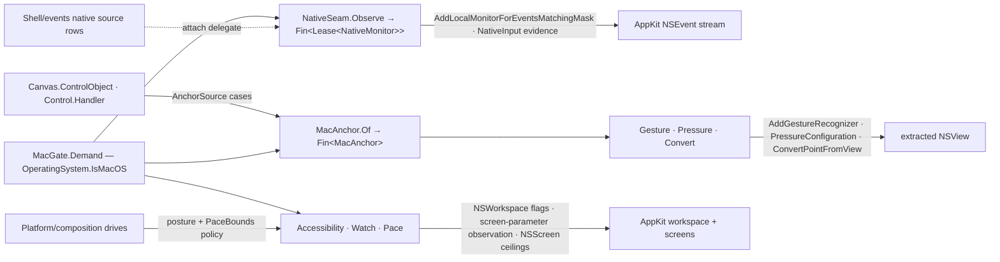

# [RASM_GRASSHOPPER_PLATFORM_NATIVE]

The macOS-native seam of the Grasshopper boundary — one gated operator (`NativeSeam`) owning every AppKit touch beneath the managed surface: the `NSView` extraction from a GH2 canvas or Eto control, `NSEvent` local monitors carrying the rich input evidence the managed snapshot omits (scroll phase, momentum, magnification, rotation, pressure, stage), gesture-recognizer and pressure-configuration attachment, `NSWorkspace` accessibility observation, screen pacing bounds, and native point conversion. The census `CanvasChromeOp`/`UiEvent`/`Motion` AppKit paths ran ungated — the platform-admission defect this page deletes: every entry demands `OperatingSystem.IsMacOS()` through one `MacGate` and the non-macOS branch is a typed `Fault.Unsupported` outcome, never an `#if`, a silent no-op, or a crash three frames into ObjC interop. Every extraction lowers onto `Option`/`Fin`, every monitor, gesture, and observation lifetime rides the kernel `Lease<T>` rail, and every attachment marshals through `EtoDispatch`. The `CALayer` graph, animations, display-link pacing, filters, haptics, and vibrancy this seam's anchors feed are `Platform/composition.md`'s; `Shell/events.md`'s native-monitor source rows register through this page's `Observe` gate as their attach delegate, so the event algebra carries no AppKit spelling.

## [01]-[INDEX]

- [02]-[GATE_AND_ANCHOR]: `MacGate` + `AnchorSource` + `MacAnchor` — the one platform-admission policy and the managed-to-`NSView` extraction capsule.
- [03]-[MONITORS]: `NativeInput` + `MonitorPlan` + `NativeMonitor` — the local-monitor stream with typed rich-input evidence and leased lifetime.
- [04]-[GESTURE_AND_PRESSURE]: `GestureBinding` + the pressure row — recognizer attachment and force-click configuration, both view-bound and leased.
- [05]-[WORKSPACE]: `AccessibilityPosture` + `WorkspaceWatch` + `PaceBounds` — the reduce-motion/transparency/colour gates, the screen-parameter observation, and the display pacing ceiling.

## [02]-[GATE_AND_ANCHOR]

- Owner: `MacGate` — the ONE platform-admission policy: `Demand(Op)` → `Fin<Unit>` succeeds only under `OperatingSystem.IsMacOS()` and refuses every other branch with `Fault.Unsupported(typeof(NSView), typeof(Unit))` — the typed non-native outcome every consumer composes instead of testing the OS itself. Every gate on this page and on `Platform/composition.md` opens with this demand; a second platform probe, an `#if MACOS` region, or an ungated AppKit member is the deleted form.
- Owner: `AnchorSource` `[Union]` — where a native view comes from: `CanvasCase(Canvas Surface)` extracts `Canvas.ControlObject as NSView`, `ControlCase(Control Surface)` extracts `Control.Handler as IMacViewHandler` then reads `IMacViewHandler.Control as NSView`. `MacAnchor` sealed record — the extracted capsule: the live `NSView`, its `Option<NSWindow>` (`NSView.Window` null-lowered), and its `CGRect` bounds evidence. `MacAnchor.Of(AnchorSource, Op?)` → `Fin<MacAnchor>` is the one extraction gate: gate first, marshal, extract, null-lower — a missed cast is `Fault.MissingContext`, never an unguarded `as` feeding a null into ObjC.
- Law: the anchor is UI-affine working material with the same non-escape law `GhScope` carries — an anchor is acquired per operation inside the marshal window that consumes it, and holding one across turns races window teardown; acquisition is cheap against live handler state.
- Law: point conversion is the anchor's one geometry verb — `Convert(MacAnchor, CGPoint, Option<NSView> from, Op?)` rides `NSView.ConvertPointFromView(CGPoint, NSView)` with a `None` source meaning window coordinates; a hand-rolled frame transform beside it is the deleted form.
- Boundary: `Eto.Mac.MacConversions`/`CGConversions` own managed-value-to-native-value projection (`Eto.Drawing.Color` → `CGColor`, `RectangleF` → `CGRect`) and are `Platform/handlers.md`'s registered owners composed at call sites; this page never re-derives a value conversion.
- Packages: Grasshopper2 (`Canvas.ControlObject`), Eto (`Control.Handler`), Eto.macOS (`IMacViewHandler`), Microsoft.macOS (`NSView`, `NSWindow`, `CGPoint`, `CGRect`), `Rasm.Domain`, `Eto/runtime.md` (`EtoDispatch`).
- Growth: a new extraction origin (a hosted panel, a floating window through `IMacWindow`) is one `AnchorSource` case; the gate and capsule never change.

## [03]-[MONITORS]

- Owner: `NativeInput` `[BoundaryAdapter]` readonly record struct — the rich input evidence one monitor callback projects off `NSEvent`: `Kind` (`NSEventType`), `Phase` and `Momentum` (`NSEventPhase`), `ScrollDeltaX`/`ScrollDeltaY`, `Magnification`, `Rotation`, `Pressure`, `TangentialPressure`, `Stage`, `StageTransition`, `Modifiers` (`ModifierFlags`), and `KeyCode` — the axes the managed Eto snapshot omits, carried as values so no `NSEvent` reference outlives its callback; implements `IValidityEvidence` through the claim fold.
- Owner: `MonitorPlan` record — `NSEventMask Mask` scoping the subscription, `Action<NativeInput> Publish` receiving the projected evidence, and `Func<NativeInput, bool> Absorb` deciding per event whether the handler returns `null` (the event dies at the monitor) or the original `NSEvent` (the event continues to the responder chain) — swallow policy is data on the plan, never a second monitor variant. `NativeMonitor` sealed class `IDisposable` — wraps the `NSObject` token `NSEvent.AddLocalMonitorForEventsMatchingMask` returns and calls `NSEvent.RemoveMonitor` exactly once on dispose.
- Entry: `NativeSeam.Observe(MonitorPlan plan, Op? key = null)` → `Fin<Lease<NativeMonitor>>` — gate, marshal, attach; the returned lease is `Owned`, so the consumer's disposal window bounds the monitor and an unremoved monitor that outlives its view is unconstructible. `Shell/events.md`'s native source rows call this gate as their attach column — the event algebra's transactional rollback and `Lease<UiSubscription>` law then apply to native rows for free.
- Law: the monitor callback projects and returns — publication fans outward through the plan's `Publish`, and consumer work that mutates host state re-enters through `GhSession`; a callback body running downstream logic inline is the recursion defect the events page forecloses for every source family.
- Packages: Microsoft.macOS (`NSEvent`, `NSEventMask`, `NSEventType`, `NSEventPhase`, `NSObject`), `Rasm.Domain` (`Op`, `Lease<T>`, `ValidityClaim`), `Eto/runtime.md` (`EtoDispatch`).
- Growth: a new evidence axis is one `NativeInput` field read off the same event; a new subscription scope is one `NSEventMask` value on a plan — zero new surfaces.

## [04]-[GESTURE_AND_PRESSURE]

- Owner: `GestureBinding` sealed class `IDisposable` — the recognizer lifetime: `NativeSeam.Gesture(MacAnchor anchor, NSGestureRecognizer recognizer, Op? key = null)` → `Fin<Lease<GestureBinding>>` attaches through `NSView.AddGestureRecognizer` and the dispose path is the exact `RemoveGestureRecognizer` inverse on the same view — attachment without its inverse is unconstructible. `GesturePose(MacAnchor anchor, NSGestureRecognizer recognizer, Op?)` → `Fin<CGPoint>` projects the recognizer's live location through `NSGestureRecognizer.LocationInView` against the anchor's view.
- Law: the concrete recognizer roster (click, pan, magnification, rotation, press) and the target-action wiring by which a recognizer reports are RESEARCH — the base attachment, removal, state enum, and location projection are catalog-verified, so recognizers arrive caller-configured and the binding owns lifetime and location; the moment the decompile fixes the concrete classes and the action seam, the recognizer mint becomes a row family on this owner with the gate unchanged.
- Owner: the pressure row — `NativeSeam.Pressure(MacAnchor anchor, NSPressureConfiguration configuration, Op? key = null)` → `Fin<Unit>` assigns `NSView.PressureConfiguration`; the configuration arrives caller-built because its constructor spelling over `NSPressureBehavior` is RESEARCH, and the deep-click pressure evidence itself (`Pressure`, `Stage`, `StageTransition`) already rides `[03]`'s `NativeInput`, so pressure CONFIGURATION and pressure OBSERVATION are two rows of one seam, never a second stream.
- Packages: Microsoft.macOS (`NSGestureRecognizer`, `NSGestureRecognizerState`, `NSPressureConfiguration`, `NSPressureBehavior`), `Rasm.Domain`, `Eto/runtime.md`.
- Growth: a resolved recognizer class is one mint row; a new pressure behavior is a `NSPressureBehavior` value on the caller's configuration.

## [05]-[WORKSPACE]

- Owner: `AccessibilityPosture` `[BoundaryAdapter]` readonly record struct — `ReduceMotion`, `ReduceTransparency`, `DifferentiateWithoutColor`, read in one marshal from `NSWorkspace.SharedWorkspace`'s three accessibility flags. `NativeSeam.Accessibility(Op?)` → `Fin<AccessibilityPosture>` is the read gate; `Platform/composition.md`'s motion drives and vibrancy rows consume the posture as their degrade policy, so reduce-motion honoring is a policy read, never a per-animation conditional.
- Owner: `WorkspaceWatch` sealed class `IDisposable` — the screen/display observation lifetime: `NativeSeam.Watch(Action<AccessibilityPosture> publish, Op?)` → `Fin<Lease<WorkspaceWatch>>` subscribes `NSApplication.Notifications.ObserveDidChangeScreenParameters` and re-projects the posture on every change so consumers hold current policy without polling; the `NSWorkspace.DisplayOptionsDidChangeNotification` companion subscription spelling is RESEARCH and lands as a second wire inside the same watch when it resolves.
- Owner: `PaceBounds` `[BoundaryAdapter]` readonly record struct — `MaximumFramesPerSecond`, `MinimumRefreshInterval`, `MaximumRefreshInterval` off `NSScreen.MainScreen`, the ceiling evidence `Platform/composition.md`'s `CAFrameRateRange` pacing clamps against; `NativeSeam.Pace(Op?)` → `Fin<PaceBounds>` reads it, refusing a missing main screen typed.
- Law: accessibility and pacing are EVIDENCE reads on this seam and POLICY on the composition page — this page answers what the platform says, the composition page decides what motion does about it; wide-gamut colour construction (`NSColor.FromDisplayP3`) is the composition page's projection row for the same reason.
- Packages: Microsoft.macOS (`NSWorkspace`, `NSApplication`, `NSScreen`), `Rasm.Domain`, `Eto/runtime.md`.
- Growth: a new platform fact is one field on its evidence record; a new observation is one wire inside `WorkspaceWatch`.

```csharp signature
// --- [RUNTIME_PRELUDE] ----------------------------------------------------------------------
using AppKit;
using CoreGraphics;
using Eto.Mac.Forms;
using Foundation;
using Rasm.Csp;
using Rasm.Grasshopper.Eto;

namespace Rasm.Grasshopper.Platform;

// --- [TYPES] --------------------------------------------------------------------------------
[Union]
public abstract partial record AnchorSource {
    private AnchorSource() { }
    public sealed record CanvasCase(Canvas Surface) : AnchorSource;
    public sealed record ControlCase(Control Surface) : AnchorSource;
}

// --- [MODELS] -------------------------------------------------------------------------------
public sealed record MacAnchor(NSView View, Option<NSWindow> Window, CGRect Bounds) {
    public static Fin<MacAnchor> Of(AnchorSource source, Op? key = null) {
        Op op = key.OrDefault();
        return from _ in MacGate.Demand(key: op)
               from valid in op.Need(source)
               from anchor in EtoDispatch.Run(body: () => valid.Switch(
                   state: op,
                   canvasCase: static (k, c) => Optional(c.Surface.ControlObject as NSView).ToFin(k.MissingContext()),
                   controlCase: static (k, c) => Optional(c.Surface.Handler as IMacViewHandler).ToFin(k.MissingContext())
                       .Bind(handler => Optional(handler.Control as NSView).ToFin(k.MissingContext())))
                   .Map(view => new MacAnchor(View: view, Window: Optional(view.Window), Bounds: view.Bounds)), key: op)
               select anchor;
    }
}

[BoundaryAdapter, StructLayout(LayoutKind.Auto)]
public readonly record struct NativeInput(
    NSEventType Kind, NSEventPhase Phase, NSEventPhase Momentum,
    double ScrollDeltaX, double ScrollDeltaY, double Magnification, double Rotation,
    double Pressure, double TangentialPressure, long Stage, double StageTransition,
    ulong Modifiers, ulong KeyCode) : IValidityEvidence {
    public bool IsValid => ValidityClaim.All(
        ValidityClaim.Finite(value: ScrollDeltaX),
        ValidityClaim.Finite(value: ScrollDeltaY),
        ValidityClaim.Finite(value: Magnification),
        ValidityClaim.Finite(value: Rotation),
        ValidityClaim.Finite(value: Pressure));
    internal static NativeInput Of(NSEvent raw) => new(
        Kind: raw.Type, Phase: raw.Phase, Momentum: raw.MomentumPhase,
        ScrollDeltaX: raw.ScrollingDeltaX, ScrollDeltaY: raw.ScrollingDeltaY,
        Magnification: raw.Magnification, Rotation: raw.Rotation,
        Pressure: raw.Pressure, TangentialPressure: raw.TangentialPressure,
        Stage: raw.Stage, StageTransition: raw.StageTransition,
        Modifiers: raw.ModifierFlags, KeyCode: raw.KeyCode);
}

public sealed record MonitorPlan(NSEventMask Mask, Action<NativeInput> Publish, Func<NativeInput, bool> Absorb);

[BoundaryAdapter, StructLayout(LayoutKind.Auto)]
public readonly record struct AccessibilityPosture(bool ReduceMotion, bool ReduceTransparency, bool DifferentiateWithoutColor);

[BoundaryAdapter, StructLayout(LayoutKind.Auto)]
public readonly record struct PaceBounds(int MaximumFramesPerSecond, double MinimumRefreshInterval, double MaximumRefreshInterval) : IValidityEvidence {
    public bool IsValid => ValidityClaim.All(
        ValidityClaim.Of(holds: MaximumFramesPerSecond > 0),
        ValidityClaim.Positive(value: MinimumRefreshInterval),
        ValidityClaim.Positive(value: MaximumRefreshInterval),
        ValidityClaim.Ordered(lower: MinimumRefreshInterval, upper: MaximumRefreshInterval));
}

// --- [SERVICES] -----------------------------------------------------------------------------
public sealed class NativeMonitor : IDisposable {
    private readonly NSObject token;
    private int released;
    internal NativeMonitor(NSObject token) => this.token = token;
    public void Dispose() => Op.SideWhen(
        condition: Interlocked.Exchange(location1: ref released, value: 1) == 0,
        action: () => NSEvent.RemoveMonitor(monitor: token));
}

public sealed class GestureBinding : IDisposable {
    private readonly NSView view;
    private readonly NSGestureRecognizer recognizer;
    private int released;
    internal GestureBinding(NSView view, NSGestureRecognizer recognizer) { this.view = view; this.recognizer = recognizer; }
    public void Dispose() => Op.SideWhen(
        condition: Interlocked.Exchange(location1: ref released, value: 1) == 0,
        action: () => view.RemoveGestureRecognizer(recognizer: recognizer));
}

public sealed class WorkspaceWatch : IDisposable {
    private readonly IDisposable screenObserver;
    internal WorkspaceWatch(IDisposable screenObserver) => this.screenObserver = screenObserver;
    public void Dispose() => screenObserver.Dispose();
}

// --- [OPERATIONS] ---------------------------------------------------------------------------
[BoundaryAdapter]
public static class MacGate {
    public static Fin<Unit> Demand(Op? key = null) {
        Op op = key.OrDefault();
        return OperatingSystem.IsMacOS()
            ? Fin.Succ(unit)
            : Fin.Fail<Unit>(op.Unsupported(geometryType: typeof(NSView), outputType: typeof(Unit)));
    }
}

[BoundaryAdapter]
public static class NativeSeam {
    public static Fin<Lease<NativeMonitor>> Observe(MonitorPlan plan, Op? key = null) {
        Op op = key.OrDefault();
        return from _ in MacGate.Demand(key: op)
               from valid in op.Need(plan)
               from lease in EtoDispatch.Run(body: () => op.Catch(body: () => {
                   NSObject token = NSEvent.AddLocalMonitorForEventsMatchingMask(mask: valid.Mask, handler: raw => {
                       NativeInput evidence = NativeInput.Of(raw: raw);
                       valid.Publish(obj: evidence);
                       return valid.Absorb(arg: evidence) ? null! : raw;
                   });
                   return Fin.Succ((Lease<NativeMonitor>)new Lease<NativeMonitor>.Owned(Value: new NativeMonitor(token: token)));
               }), key: op)
               select lease;
    }

    public static Fin<Lease<GestureBinding>> Gesture(MacAnchor anchor, NSGestureRecognizer recognizer, Op? key = null) {
        Op op = key.OrDefault();
        return from _ in MacGate.Demand(key: op)
               from view in op.Need(anchor).Map(static a => a.View)
               from target in op.Need(recognizer)
               from lease in EtoDispatch.Run(body: () => op.Catch(body: () => {
                   view.AddGestureRecognizer(recognizer: target);
                   return Fin.Succ((Lease<GestureBinding>)new Lease<GestureBinding>.Owned(Value: new GestureBinding(view: view, recognizer: target)));
               }), key: op)
               select lease;
    }

    public static Fin<CGPoint> GesturePose(MacAnchor anchor, NSGestureRecognizer recognizer, Op? key = null) {
        Op op = key.OrDefault();
        return from _ in MacGate.Demand(key: op)
               from view in op.Need(anchor).Map(static a => a.View)
               from target in op.Need(recognizer)
               from pose in EtoDispatch.Run(body: () => op.Catch(body: () => Fin.Succ(target.LocationInView(view: view))), key: op)
               select pose;
    }

    public static Fin<Unit> Pressure(MacAnchor anchor, NSPressureConfiguration configuration, Op? key = null) {
        Op op = key.OrDefault();
        return from _ in MacGate.Demand(key: op)
               from view in op.Need(anchor).Map(static a => a.View)
               from valid in op.Need(configuration)
               from settled in EtoDispatch.Run(body: () => op.Catch(body: () => Fin.Succ(Op.Side(action: () => view.PressureConfiguration = valid))), key: op)
               select settled;
    }

    public static Fin<CGPoint> Convert(MacAnchor anchor, CGPoint point, Option<NSView> from, Op? key = null) {
        Op op = key.OrDefault();
        return from _ in MacGate.Demand(key: op)
               from view in op.Need(anchor).Map(static a => a.View)
               from projected in EtoDispatch.Run(body: () => op.Catch(body: () => Fin.Succ(view.ConvertPointFromView(
                   point: point,
                   view: from.MatchUnsafe(Some: static source => source, None: static () => null!)))), key: op)
               select projected;
    }

    public static Fin<AccessibilityPosture> Accessibility(Op? key = null) {
        Op op = key.OrDefault();
        return from _ in MacGate.Demand(key: op)
               from posture in EtoDispatch.Run(body: () => Optional(NSWorkspace.SharedWorkspace).ToFin(op.MissingContext())
                   .Bind(workspace => op.Catch(body: () => Fin.Succ(new AccessibilityPosture(
                       ReduceMotion: workspace.AccessibilityDisplayShouldReduceMotion,
                       ReduceTransparency: workspace.AccessibilityDisplayShouldReduceTransparency,
                       DifferentiateWithoutColor: workspace.AccessibilityDisplayShouldDifferentiateWithoutColor)))), key: op)
               select posture;
    }

    public static Fin<Lease<WorkspaceWatch>> Watch(Action<AccessibilityPosture> publish, Op? key = null) {
        Op op = key.OrDefault();
        return from _ in MacGate.Demand(key: op)
               from valid in op.Need(publish)
               from lease in EtoDispatch.Run(body: () => op.Catch(body: () => {
                   IDisposable observer = NSApplication.Notifications.ObserveDidChangeScreenParameters(handler: (_, _) =>
                       Accessibility(key: op).IfSucc(posture => valid(obj: posture)));
                   return Fin.Succ((Lease<WorkspaceWatch>)new Lease<WorkspaceWatch>.Owned(Value: new WorkspaceWatch(screenObserver: observer)));
               }), key: op)
               select lease;
    }

    public static Fin<PaceBounds> Pace(Op? key = null) {
        Op op = key.OrDefault();
        return from _ in MacGate.Demand(key: op)
               from bounds in EtoDispatch.Run(body: () => Optional(NSScreen.MainScreen).ToFin(op.MissingContext())
                   .Bind(screen => op.Catch(body: () => Fin.Succ(new PaceBounds(
                       MaximumFramesPerSecond: screen.MaximumFramesPerSecond,
                       MinimumRefreshInterval: screen.MinimumRefreshInterval,
                       MaximumRefreshInterval: screen.MaximumRefreshInterval)))), key: op)
               select bounds;
    }
}
```



## [06]-[DENSITY_BAR]

| [INDEX] | [CONCERN]             | [OWNER]                                  | [KIND]                                           | [RAIL]                                       | [CASES] |
| :-----: | :-------------------- | :---------------------------------------- | :---------------------------------------------------- | :---------------------------------------------- | :-----: |
|  [01]   | platform admission    | `MacGate`                                | one demand policy, typed non-native outcome      | `Demand → Fin<Unit>`                          |    1    |
|  [02]   | view extraction       | `AnchorSource` + `MacAnchor`             | origin `[Union]` + extracted capsule             | `Of → Fin<MacAnchor>`                         |    2    |
|  [03]   | local monitors        | `NativeInput` + `MonitorPlan` + `NativeMonitor` | rich-input evidence + plan + leased token    | `Observe → Fin<Lease<NativeMonitor>>`         |    1    |
|  [04]   | gesture and pressure  | `GestureBinding` + the pressure row      | leased attachment + configuration assignment     | `Gesture`/`Pressure` → `Fin<T>`               |    3    |
|  [05]   | workspace facts       | `AccessibilityPosture` + `WorkspaceWatch` + `PaceBounds` | evidence records + leased observation | `Accessibility`/`Watch`/`Pace` → `Fin<T>`     |    3    |

`EtoDispatch`, `Op`, `Fault`, `Lease<T>`, and `ValidityClaim` are composed upstream owners; `IMacViewHandler` is `Platform/handlers.md`'s registered bridge contract. RESEARCH: the concrete gesture-recognizer roster and target-action seam, the recognizer `State` read, the `NSPressureConfiguration` constructor, and the `DisplayOptionsDidChangeNotification` subscription spelling.
