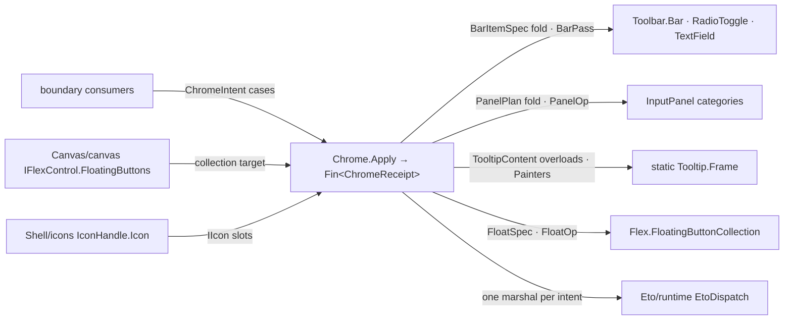

# [RASM_GRASSHOPPER_SHELL_CHROME]

`Chrome.Apply(ChromeIntent, Op?)` is the one chrome intent surface of the Grasshopper boundary, settling every toolbar, input-panel, tooltip, and floating-button demand against the GH2 chrome hosts (`Toolbar.Bar` and `InputPanel.InputPanel`, both directly constructible; the static `Tooltip.Frame`; the canvas-owned `Flex.FloatingButtonCollection`).

A bar is a fold of `BarItemSpec` rows onto one host `Bar`, a panel is a fold of category-grouped `PanelControl` rows onto one `InputPanel`, a tooltip is one `TooltipContent` case over the static `Frame` overload family, a floating button is one `FloatSpec` value whose mutations, visibility, probes, tallies, and numeric binding are cases of one `FloatOp` union, and every family drains through ONE gate. Every settlement marshals through `EtoDispatch`, runs under `Op.Catch`, and returns a typed receipt. Focus-stack and responsive registration are `Canvas/interaction.md`'s dispatch spine; a reflection path into `Tooltip.Layout` is a phantom, and the internal host surfaces (`FloatingButtonLayout`, the `FloatingButton` constructor, the `Position*`/`*Ux` members) form no contract.

## [01]-[INDEX]

- [02]-[BAR]: `ColourRange` + `BarItemSpec` + `BarMutation` + `BarPass` + `ColourBars` — the toolbar item-row family, the live-item mutation cases, the layout/render/tooltip/tune/probe pass family, and the standard colour-bar triplet.
- [03]-[PANEL]: `PanelControl` + `PanelPlan` + `PanelOp` — the category-structured control rows, the build plan, and the category-mutation/embed/float verb family.
- [04]-[TOOLTIP]: `TooltipContent` + `TooltipIntent` + `Painters` — the plain/item/painter content family over the static `Frame` overload set and the painter factory rows.
- [05]-[FLOATS]: `FloatAnchor` + `FloatSpec` + `FloatMutation` + `FloatOp` — the anchored floating-button family with visibility, mutation, probe, tally, and numeric-channel cases.
- [06]-[GATE]: `ChromeIntent` + `ChromeReceipt` + `Chrome` — the one settlement gate over every family.

## [02]-[BAR]

- Owner: `BarItemSpec` `[Union]` — the toolbar item-row family, data a fold appends onto a live `Bar`: `PushCase(IIcon Icon, Nomen Label, Action Verb, BarShortcut Chord)` (`Bar.AddPushButton(IIcon, Nomen, Action = null, BarShortcut = null)`), `RadioCase(IIcon Icon, Nomen Label, bool Initial, Action<bool> Verb, BarShortcut Chord)` (`AddRadioToggle`), `FieldCase(IIcon Icon, Nomen Label, string Text, string Placeholder)` (`AddTextField(IIcon, Nomen, string initial, string placeholder)`), `SpacerCase(Nomen Label, int MinimumWidth, int MaximumWidth)` (`AddSpacer(Nomen, int, int)`), `SectionToggleCase(Nomen Label, bool Initial, Seq<string> Sections)` (`AddToggle(Nomen, bool, params string[])` — the section-visibility toggle), `ItemCase(BarItem Element)` (`Add(BarItem)` — the raw append absorbing any caller-minted item), `ColoursCase(ColourRange Range, Nomen Label, OpenColor.Family Seed, Action<OpenColor.Family> Changed)` — the in-bar colour rows. `ColourRange` `[Union]` discriminates the host's colour-row family: `LifeCase` (`AddLifeColours`), `CoolCase` (`AddCoolColours`), `WarmCase` (`AddWarmColours`), `SpectrumCase(Seq<OpenColor.Family> Spectrum)` (`AddColours(Nomen, Family[], Family, Action<Family>)`) — three named rows and the parameterized spectrum on one union, so the host's enumerated sibling methods demote to dispatch arms. A bar's whole item surface is one `Seq<BarItemSpec>`, and the icon slot composes `Shell/icons.md`'s `IconHandle.Icon` so every bar item is catalog-addressable.
- Owner: `BarMutation` `[Union]` — post-build mutation of live items the host returned to the consumer: `RadioSwing(RadioToggle Item, Option<bool> Target)` (`SetState(bool)` on `Some`, `Toggle()` on `None`), `FieldWrite(TextField Item, string Text)` (`SetText(string)`). `BarPass` `[Union]` — the bar-level verb family: `LayoutCase` (`Bar.Layout`), `RenderCase(Context Surface)` (`Bar.Render(Context)`), `TooltipCase(PointF At)` (`Bar.ShowTooltipAt(PointF)` → `bool` — a `false` settles `Fault.InvalidResult`, never a silently ignored bool), `InvalidateCase` (`Bar.Invalidate`), `TuneCase(Option<bool> Enabled, Option<int> RowHeight, Option<BarStyle> Style)` — one bar-state write over the settable `Enabled`/`ElementHeight`/`Style` members, present slots only — and `FindCase(string Name)` (`Bar[string]` — the named-item probe whose hit returns on the receipt).
- Owner: `ColourBars` readonly record struct — the `CreateStandardColourBars(Nomen, OpenColor.Family, Action<OpenColor.Family>, out Bar life, out Bar cool, out Bar warm)` triplet carried as one value (`Life`, `Cool`, `Warm` — the out-parameter roles); the callback receives the settled family and the three bars enter the same `BarPass`/fold vocabulary as any other bar.
- Law: a `Bar` mints anywhere — the public `Bar()`/`Bar(params BarItem[])` constructors, a panel's `AddBar` return, or the colour-bar factory — and the `Add*` family returns its typed item (`PushButton`/`RadioToggle`/`TextField`/`Spacer`/`Bar`), so a consumer holding an item for later mutation captures the return at build or re-resolves through `FindCase`; the `RadioToggle(IIcon, Nomen, bool, Action<bool>)` and `TextField(IIcon, Nomen, string)` constructors mint the caller-held items an `ItemCase` or `AddBar` transports.
- Boundary: `Bar.Invalidated`, `TooltipDetails`, `CloseRequested`, `TextField.TextChanged`/`ActiveChanged`, and `RadioToggle.StateChanged` are public event streams belonging in `Shell/events.md`'s `UiSource` vocabulary as chrome rows through its factory-fold contract, never subscribed here; `Bar.Render` draws over `Eto.Drawing.Context` inside the paint window `Canvas/paint.md` owns — this page transports the context, never opens one.
- Packages: Grasshopper2 (`Bar`, `BarItem`, `BarStyle`, `RadioToggle`, `TextField`, `Nomen`, `BarShortcut`, `OpenColor.Family`), Eto (`Context`, `PointF`), `Rasm.Domain`.
- Growth: a new toolbar item kind is one `BarItemSpec` case with one fold arm breaking loudly; a new bar verb is one `BarPass` case; a new colour row is one `ColourRange` case.

## [03]-[PANEL]

- Owner: `PanelControl` `[Union]` — the category-scoped control rows a panel build folds through the `InputPanel.Add*` family, each returning its typed control: `LabelCase(string Text, bool Italic, string Tip)` (`AddLabel(string, bool italic, string tooltip)` → `Label`), `CheckCase(string Label, bool Initial, Action<bool> Changed, string Tip)` (`AddCheck` → `CheckBox`), `TextCase(string Label, Action<string> Changed, string Tip)` (`AddText` → `TextBox`), `BarCase(bool CategoryLabels, Option<int> RowHeight, Seq<BarItem> Items)` (`AddBar(bool, params BarItem[])`, the `Some` height selecting the `AddBar(bool, int, params BarItem[])` overload → `Bar`), `HostCase(Control Surface)` (`Add(Control)` — the seam where `Eto/controls.md`'s generated control family lands inside a panel). `PanelPlan` record — `Seq<PanelCategory>` where each `PanelCategory(string Name, Seq<PanelControl> Rows)` opens through `BeginCategory` — whose returned `IDisposable` closes the category scope and is disposed by the fold after its rows land — then folds its rows in order.
- Owner: `PanelOp` `[Union]` `[GenerateUnionOps]` — the panel verb family: `BuildCase(PanelPlan Plan)`, `MoveCase(string Category, string Above)` (`MoveCategoryBelow(string category, string above)`), `RenameCase(string Category, string Next)` (`RenameCategory`), `RemoveCase(string Category)` (`RemoveCategory`), `EmbedCase` (`ToEtoControl()` — the panel projected as an embeddable `Control`, returned on the receipt), `FloatCase(Control Owner, PointF At, RectangleF Screen)` (`ShowAsForm(Control, PointF, RectangleF)` → `Form` — the floated panel returns as `Lease<Form>.Owned` on the receipt, so teardown rides `Shell/session.md`'s `ReleaseCase` and a dangling chrome form is unconstructible).
- Law: the panel is the one category-structured control surface — a bespoke Eto form assembling label/check/text rows beside it re-derives what `InputPanel` owns and is the deleted form; a control family richer than the `Add*` set enters as `HostCase`, so the host roster bounds nothing. Category verbs return `bool` — a `false` settles as `Fault.InvalidResult` carrying the missing category name, never a silent no-op.
- Boundary: value admission for check/text callbacks is the consumer's — a callback that admits raw text into a domain owner composes `Eto/binding.md`'s gate; this page wires the callback and adjudicates nothing.
- Packages: Grasshopper2 (`InputPanel`, `BarItem`), Eto (`Control`, `Form`, `PointF`, `RectangleF`), `Rasm.Domain` (`Op`, `Fault`, `Lease<T>`).
- Growth: a new panel control kind is one `PanelControl` case; a new category verb is one `PanelOp` case.

## [04]-[TOOLTIP]

- Owner: `TooltipContent` `[Union]` — the content family over the static `Frame.Show` overload set, whose two trailing booleans are the `warnings`/`errors` emphasis flags: `PlainCase(IIcon Icon, string Title, string Body, bool Warnings, bool Errors)`, `ItemsCase(IIcon Icon, string Title, string Body, Seq<LazyStrings> Rows, bool Warnings, bool Errors)` (the single-item host overload is the one-row sequence), `PainterCase(IIcon Icon, string Title, string Body, Action<Context, Rectangle> Paint, Size Extent, bool Warnings, bool Errors)`. `TooltipIntent` `[Union]` — `ShowCase(TooltipContent Content)`, `HideCase` (`Frame.Hide`), `InvalidateCase` (`Frame.Invalidate`), `CaptureCase(Option<string> Folder)` (`Frame.ScreencapFolder` — `Some` aims tooltip screen capture at a folder, `None` clears it). Painter factories are rows on the owner, each returning the host's `(Action<Context, Rectangle> painter, Size size)` pair that fills a `PainterCase` verbatim: `Painters.Shortcut(string Lead, Either<Keys, char> Chord, string Tail)` (the `Keys` and `char` `CreateShortcutPainter` overloads on one probe shape) and `Painters.Composite(object[] Parts)` (`CreateTextAndIconPainter`) — a hand-drawn shortcut hint beside the factory is the deleted form.
- Law: `Frame` is a static host — there is no frame instance to acquire, so `TipCase` carries only the intent and every settlement is a static call inside the marshal; an assembly-name and public-field walk into `Grasshopper2.UI.Tooltip.Layout` is the phantom-class defect, and tooltip geometry beyond this overload family does not exist on this surface.
- Boundary: dwell timing and the decision of WHEN a tooltip shows are `Canvas/interaction.md`'s (`MouseDwell` rides `Shell/events.md`'s canvas rows); this owner renders WHAT shows.
- Packages: Grasshopper2 (`Frame`, `LazyStrings`), Eto (`Context`, `Rectangle`, `Size`, `Keys`), LanguageExt.Core (`Either`), `Rasm.Domain`.
- Growth: a new content shape is one `TooltipContent` case; a new painter is one factory row.

## [05]-[FLOATS]

- Owner: `FloatSpec` — the one floating-button declaration mirroring the collection's `Add` shape: `FloatAnchor` `[Union]` discriminates placement (`CornerCase(FloatingPosition Corner)` → `FloatingButtonCollection.Add`, `PointCase(PointF At)` → `AddAnchored`), and the spec carries `Name` with the optional `Info`/`Tint`/`Icon` slots and the three named handler slots (`Click`/`MouseDown`/`MouseUp` — the `FloatingButtonHandler` parameter roles), every optional lowering to the host's `null` default. `FloatMutation` `[Union]` — the named-button mutation family over the collection's `Modify*` set: `RetitleCase(string Info)`, `ReiconCase(IIcon Icon)`, `RecolourCase(Color Tint)`, `ReanchorCase(PointF At, bool Immediate)` (`ModifyAnchor(string, PointF, bool immediate)` — `false` glides on the host's own animation, `true` jumps).
- Owner: `FloatOp` `[Union]` `[GenerateUnionOps]` — the verb family over one collection: `AddCase(FloatSpec Spec)`, `ShowCase(Seq<string> Names)`, `HideCase(Seq<string> Names)` (`Show`/`Hide(string[])`), `CloseCase(Seq<string> Names)` (`Close(string[])`, the empty sequence settling through `CloseAll()`), `MutateCase(string Name, FloatMutation Change)`, `ProbeCase(Either<string, PointF> Key)` (`FindByName`/`FindByPoint` — one probe case, the key's shape discriminates, a miss refusing typed), `DefinedCase(string Name)` (`IsDefined` — existence as data where a `ProbeCase` refusal conflates absence with failure), `RosterCase(bool VisibleOnly)` (`Buttons`/`VisibleButtons` — the collection census as live handles; reads are UI-affine, so enumeration rides the gate's marshal like every probe), `TallyCase(FloatingState State)` (`StateCount` — the lifecycle census returning its count on the receipt), `BindCase(string Name, UiNumber Channel, string ValueKey)` (`FindByName` then `FloatingButton.MakeNumeric(UiNumber, string valueKey)` — the numeric-value channel with `NumericValue` and `ValueChanged` living on the found button).
- Law: the collection is the one float authority AND the one mint — `IFlexControl.FloatingButtons` (or the canvas's collection, the same object through the flex seam) is where every case lands; the `FloatingButton` constructor, the `Position*` relative-placement family, the `*Ux` animation channels, and the `AnchorChanged`/`ColourChanged`/`StateChanged` events are all `internal` on the host — none forms a contract, and a design leaning on them is leaning on phantoms.
- Boundary: `FloatingButton.ValueChanged` is the button family's one public event stream and belongs in `Shell/events.md`'s `UiSource` vocabulary as a float row; occlusion and placement resolve inside the host's internal layout — this owner declares and mutates, `Canvas/paint.md` owns the pixels.
- Packages: Grasshopper2 (`FloatingButton`, `FloatingButtonCollection`, `FloatingPosition`, `FloatingState`, `FloatingButtonHandler`, `UiNumber`), Eto (`Color`, `PointF`), `Rasm.Domain`.
- Growth: a new float verb is one `FloatOp` case; a new mutation axis is one `FloatMutation` case.

## [06]-[GATE]

- Owner: `Chrome` — the one settlement gate. `ChromeIntent` `[Union]` closes the family-by-host pairing: `BarCase(Bar Target, Seq<BarItemSpec> Items)`, `BarPassCase(Bar Target, BarPass Pass)`, `BarMutateCase(BarMutation Change)`, `ColourBarsCase(Nomen Label, OpenColor.Family Seed, Action<OpenColor.Family> Changed)`, `PanelCase(InputPanel Target, PanelOp Verb)`, `TipCase(TooltipIntent Tip)`, `FloatCase(FloatingButtonCollection Target, FloatOp Verb)`. `ChromeReceipt` `[Union]` mirrors settlement evidence: `BuiltCase(int Count)`, `PassedCase(string Verb)`, `FoundItemCase(BarItem Value)`, `FoundFloatCase(FloatingButton Value)`, `DefinedCase(bool Holds)`, `RosterCase(Seq<FloatingButton> Buttons)`, `CountCase(int Value)`, `ColourCase(ColourBars Bars)`, `EmbeddedCase(Control Surface)`, `FloatedCase(Lease<Form> Window)` — a probe returns its live host handle because chrome handles are UI-affine working values, not evidence to persist, and the floated panel returns leased so its teardown is owned.
- Entry: `Chrome.Apply(ChromeIntent intent, Op? key = null)` → `Fin<ChromeReceipt>` — one gate, every family; each settlement runs inside ONE `EtoDispatch` marshal under `Op.Catch`, and a null target, an unresolvable name, or a refused category verb is a typed `Fault`, never a host exception or a silent no-op.
- Law: the outer union discriminates the host family and the inner union its verb — the pairing is dependent payload, not joint dispatch, because a `FloatOp` is meaningless without its collection; a consumer never sequences host internals, and a new chrome family is one outer case carrying its inner verb union, every dispatch site breaking loudly.
- Packages: Grasshopper2, Eto, `Rasm.Domain` (`Op`, `Fault`, `Lease<T>`), `Eto/runtime.md` (`EtoDispatch`), LanguageExt.Core.
- Growth: one case per new family; zero new gates.

```csharp signature
// --- [RUNTIME_PRELUDE] ----------------------------------------------------------------------
using Rasm.Csp;
using Rasm.Grasshopper.Eto;

namespace Rasm.Grasshopper.Shell;

// --- [TYPES] --------------------------------------------------------------------------------
[Union]
public abstract partial record ColourRange {
    private ColourRange() { }
    public sealed record LifeCase : ColourRange;
    public sealed record CoolCase : ColourRange;
    public sealed record WarmCase : ColourRange;
    public sealed record SpectrumCase(Seq<OpenColor.Family> Spectrum) : ColourRange;
}

[Union]
public abstract partial record BarItemSpec {
    private BarItemSpec() { }
    public sealed record PushCase(IIcon Icon, Nomen Label, Action Verb, BarShortcut Chord) : BarItemSpec;
    public sealed record RadioCase(IIcon Icon, Nomen Label, bool Initial, Action<bool> Verb, BarShortcut Chord) : BarItemSpec;
    public sealed record FieldCase(IIcon Icon, Nomen Label, string Text, string Placeholder) : BarItemSpec;
    public sealed record SpacerCase(Nomen Label, int MinimumWidth, int MaximumWidth) : BarItemSpec;
    public sealed record SectionToggleCase(Nomen Label, bool Initial, Seq<string> Sections) : BarItemSpec;
    public sealed record ItemCase(BarItem Element) : BarItemSpec;
    public sealed record ColoursCase(ColourRange Range, Nomen Label, OpenColor.Family Seed, Action<OpenColor.Family> Changed) : BarItemSpec;
}

[Union]
public abstract partial record BarMutation {
    private BarMutation() { }
    public sealed record RadioSwing(RadioToggle Item, Option<bool> Target) : BarMutation;
    public sealed record FieldWrite(TextField Item, string Text) : BarMutation;
}

[Union]
public abstract partial record BarPass {
    private BarPass() { }
    public sealed record LayoutCase : BarPass;
    public sealed record RenderCase(Context Surface) : BarPass;
    public sealed record TooltipCase(PointF At) : BarPass;
    public sealed record InvalidateCase : BarPass;
    public sealed record TuneCase(Option<bool> Enabled, Option<int> RowHeight, Option<BarStyle> Style) : BarPass;
    public sealed record FindCase(string Name) : BarPass;
}

[Union]
public abstract partial record PanelControl {
    private PanelControl() { }
    public sealed record LabelCase(string Text, bool Italic, string Tip) : PanelControl;
    public sealed record CheckCase(string Label, bool Initial, Action<bool> Changed, string Tip) : PanelControl;
    public sealed record TextCase(string Label, Action<string> Changed, string Tip) : PanelControl;
    public sealed record BarCase(bool CategoryLabels, Option<int> RowHeight, Seq<BarItem> Items) : PanelControl;
    public sealed record HostCase(Control Surface) : PanelControl;
}

[Union]
[GenerateUnionOps]
public abstract partial record PanelOp {
    private PanelOp() { }
    public sealed record BuildCase(PanelPlan Plan) : PanelOp;
    public sealed record MoveCase(string Category, string Above) : PanelOp;
    public sealed record RenameCase(string Category, string Next) : PanelOp;
    public sealed record RemoveCase(string Category) : PanelOp;
    public sealed record EmbedCase : PanelOp;
    public sealed record FloatCase(Control Owner, PointF At, RectangleF Screen) : PanelOp;
}

[Union]
public abstract partial record TooltipContent {
    private TooltipContent() { }
    public sealed record PlainCase(IIcon Icon, string Title, string Body, bool Warnings, bool Errors) : TooltipContent;
    public sealed record ItemsCase(IIcon Icon, string Title, string Body, Seq<LazyStrings> Rows, bool Warnings, bool Errors) : TooltipContent;
    public sealed record PainterCase(IIcon Icon, string Title, string Body, Action<Context, Rectangle> Paint, Size Extent, bool Warnings, bool Errors) : TooltipContent;
}

[Union]
public abstract partial record TooltipIntent {
    private TooltipIntent() { }
    public sealed record ShowCase(TooltipContent Content) : TooltipIntent;
    public sealed record HideCase : TooltipIntent;
    public sealed record InvalidateCase : TooltipIntent;
    public sealed record CaptureCase(Option<string> Folder) : TooltipIntent;
}

[Union]
public abstract partial record FloatAnchor {
    private FloatAnchor() { }
    public sealed record CornerCase(FloatingPosition Corner) : FloatAnchor;
    public sealed record PointCase(PointF At) : FloatAnchor;
}

[Union]
public abstract partial record FloatMutation {
    private FloatMutation() { }
    public sealed record RetitleCase(string Info) : FloatMutation;
    public sealed record ReiconCase(IIcon Icon) : FloatMutation;
    public sealed record RecolourCase(Color Tint) : FloatMutation;
    public sealed record ReanchorCase(PointF At, bool Immediate) : FloatMutation;
}

[Union]
[GenerateUnionOps]
public abstract partial record FloatOp {
    private FloatOp() { }
    public sealed record AddCase(FloatSpec Spec) : FloatOp;
    public sealed record ShowCase(Seq<string> Names) : FloatOp;
    public sealed record HideCase(Seq<string> Names) : FloatOp;
    public sealed record CloseCase(Seq<string> Names) : FloatOp;
    public sealed record MutateCase(string Name, FloatMutation Change) : FloatOp;
    public sealed record ProbeCase(Either<string, PointF> Key) : FloatOp;
    public sealed record DefinedCase(string Name) : FloatOp;
    public sealed record RosterCase(bool VisibleOnly) : FloatOp;
    public sealed record TallyCase(FloatingState State) : FloatOp;
    public sealed record BindCase(string Name, UiNumber Channel, string ValueKey) : FloatOp;
}

[Union]
public abstract partial record ChromeIntent {
    private ChromeIntent() { }
    public sealed record BarCase(Bar Target, Seq<BarItemSpec> Items) : ChromeIntent;
    public sealed record BarPassCase(Bar Target, BarPass Pass) : ChromeIntent;
    public sealed record BarMutateCase(BarMutation Change) : ChromeIntent;
    public sealed record ColourBarsCase(Nomen Label, OpenColor.Family Seed, Action<OpenColor.Family> Changed) : ChromeIntent;
    public sealed record PanelCase(InputPanel Target, PanelOp Verb) : ChromeIntent;
    public sealed record TipCase(TooltipIntent Tip) : ChromeIntent;
    public sealed record FloatCase(FloatingButtonCollection Target, FloatOp Verb) : ChromeIntent;
}

// --- [MODELS] -------------------------------------------------------------------------------
public sealed record PanelCategory(string Name, Seq<PanelControl> Rows);

public sealed record PanelPlan(Seq<PanelCategory> Categories);

public sealed record FloatSpec(
    string Name, Option<string> Info, Option<Color> Tint, Option<IIcon> Icon, FloatAnchor Anchor,
    Option<FloatingButtonHandler> Click, Option<FloatingButtonHandler> MouseDown, Option<FloatingButtonHandler> MouseUp);

[BoundaryAdapter, StructLayout(LayoutKind.Auto)]
public readonly record struct ColourBars(Bar Life, Bar Cool, Bar Warm);

[Union]
public abstract partial record ChromeReceipt {
    private ChromeReceipt() { }
    public sealed record BuiltCase(int Count) : ChromeReceipt;
    public sealed record PassedCase(string Verb) : ChromeReceipt;
    public sealed record FoundItemCase(BarItem Value) : ChromeReceipt;
    public sealed record FoundFloatCase(FloatingButton Value) : ChromeReceipt;
    public sealed record DefinedCase(bool Holds) : ChromeReceipt;
    public sealed record RosterCase(Seq<FloatingButton> Buttons) : ChromeReceipt;
    public sealed record CountCase(int Value) : ChromeReceipt;
    public sealed record ColourCase(ColourBars Bars) : ChromeReceipt;
    public sealed record EmbeddedCase(Control Surface) : ChromeReceipt;
    public sealed record FloatedCase(Lease<Form> Window) : ChromeReceipt;
}

// --- [OPERATIONS] ---------------------------------------------------------------------------
public static class Painters {
    public static Fin<(Action<Context, Rectangle> Paint, Size Extent)> Shortcut(string lead, Either<Keys, char> chord, string tail, Op? key = null) =>
        key.OrDefault().Catch(body: () => Fin.Succ(chord.Match(
            Left: keys => Frame.CreateShortcutPainter(lead, keys, tail),
            Right: glyph => Frame.CreateShortcutPainter(lead, glyph, tail))));

    public static Fin<(Action<Context, Rectangle> Paint, Size Extent)> Composite(object[] parts, Op? key = null) =>
        key.OrDefault().Catch(body: () => Fin.Succ(Frame.CreateTextAndIconPainter(parts)));
}

[BoundaryAdapter]
public static class Chrome {
    public static Fin<ChromeReceipt> Apply(ChromeIntent intent, Op? key = null) {
        Op active = key.OrDefault();
        return active.Need(intent).Bind(valid => EtoDispatch.Run(body: () => valid.Switch(
            state: active,
            barCase: static (k, c) => k.Need(c.Target)
                .Bind(bar => c.Items.Fold(
                    initialState: Fin.Succ(0),
                    f: (acc, item) => acc.Bind(count => k.Catch(body: () => Fin.Succ(Op.Side(action: () => Append(bar: bar, item: item)))).Map(_ => count + 1))))
                .Map(static count => (ChromeReceipt)new ChromeReceipt.BuiltCase(Count: count)),
            barPassCase: static (k, c) => k.Need(c.Target)
                .Bind(bar => c.Pass.Switch(
                    state: (Bar: bar, Key: k),
                    layoutCase: static (s, _) => Passed(key: s.Key, verb: nameof(BarPass.LayoutCase), action: s.Bar.Layout),
                    renderCase: static (s, p) => Passed(key: s.Key, verb: nameof(BarPass.RenderCase), action: () => s.Bar.Render(context: p.Surface)),
                    tooltipCase: static (s, p) => Ruled(key: s.Key, verb: nameof(BarPass.TooltipCase), name: p.At.ToString(),
                        rule: () => s.Bar.ShowTooltipAt(location: p.At)),
                    invalidateCase: static (s, _) => Passed(key: s.Key, verb: nameof(BarPass.InvalidateCase), action: s.Bar.Invalidate),
                    tuneCase: static (s, p) => Passed(key: s.Key, verb: nameof(BarPass.TuneCase), action: () => {
                        p.Enabled.Iter(value => s.Bar.Enabled = value);
                        p.RowHeight.Iter(value => s.Bar.ElementHeight = value);
                        p.Style.Iter(value => s.Bar.Style = value);
                    }),
                    findCase: static (s, p) => s.Key.Catch(body: () => Optional(s.Bar[p.Name]).ToFin(s.Key.InvalidResult(detail: p.Name)))
                        .Map(static item => (ChromeReceipt)new ChromeReceipt.FoundItemCase(Value: item)))),
            barMutateCase: static (k, c) => c.Change.Switch(
                state: k,
                radioSwing: static (op, m) => op.Catch(body: () => Fin.Succ(Op.Side(action: () => m.Target.Match(
                    Some: value => m.Item.SetState(state: value),
                    None: () => m.Item.Toggle())))),
                fieldWrite: static (op, m) => op.Catch(body: () => Fin.Succ(Op.Side(action: () => m.Item.SetText(text: m.Text)))))
                .Map(static _ => (ChromeReceipt)new ChromeReceipt.PassedCase(Verb: nameof(ChromeIntent.BarMutateCase))),
            colourBarsCase: static (k, c) => k.Catch(body: () => {
                Bar.CreateStandardColourBars(c.Label, c.Seed, c.Changed, out Bar life, out Bar cool, out Bar warm);
                return Fin.Succ((ChromeReceipt)new ChromeReceipt.ColourCase(Bars: new ColourBars(Life: life, Cool: cool, Warm: warm)));
            }),
            panelCase: static (k, c) => k.Need(c.Target).Bind(panel => Settle(panel: panel, verb: c.Verb, key: k)),
            tipCase: static (k, c) => c.Tip.Switch(
                state: k,
                showCase: static (op, t) => Passed(key: op, verb: nameof(TooltipIntent.ShowCase), action: () => Present(content: t.Content)),
                hideCase: static (op, _) => Passed(key: op, verb: nameof(TooltipIntent.HideCase), action: Frame.Hide),
                invalidateCase: static (op, _) => Passed(key: op, verb: nameof(TooltipIntent.InvalidateCase), action: Frame.Invalidate),
                captureCase: static (op, t) => Passed(key: op, verb: nameof(TooltipIntent.CaptureCase), action: () =>
                    Frame.ScreencapFolder = t.Folder.MatchUnsafe(Some: static folder => folder, None: static () => null))),
            floatCase: static (k, c) => k.Need(c.Target).Bind(floats => Settle(floats: floats, verb: c.Verb, key: k))), key: active));
    }

    private static Fin<ChromeReceipt> Passed(Op key, string verb, Action action) =>
        key.Catch(body: () => Fin.Succ(Op.Side(action: action)))
            .Map(_ => (ChromeReceipt)new ChromeReceipt.PassedCase(Verb: verb));

    private static Unit Append(Bar bar, BarItemSpec item) => item.Switch(
        pushCase: c => Op.Side(action: () => bar.AddPushButton(c.Icon, c.Label, c.Verb, c.Chord)),
        radioCase: c => Op.Side(action: () => bar.AddRadioToggle(c.Icon, c.Label, c.Initial, c.Verb, c.Chord)),
        fieldCase: c => Op.Side(action: () => bar.AddTextField(c.Icon, c.Label, c.Text, c.Placeholder)),
        spacerCase: c => Op.Side(action: () => bar.AddSpacer(c.Label, c.MinimumWidth, c.MaximumWidth)),
        sectionToggleCase: c => Op.Side(action: () => bar.AddToggle(c.Label, c.Initial, [.. c.Sections])),
        itemCase: c => Op.Side(action: () => bar.Add(c.Element)),
        coloursCase: c => c.Range.Switch(
            state: (Bar: bar, Row: c),
            lifeCase: static (s, _) => Op.Side(action: () => s.Bar.AddLifeColours(s.Row.Label, s.Row.Seed, s.Row.Changed)),
            coolCase: static (s, _) => Op.Side(action: () => s.Bar.AddCoolColours(s.Row.Label, s.Row.Seed, s.Row.Changed)),
            warmCase: static (s, _) => Op.Side(action: () => s.Bar.AddWarmColours(s.Row.Label, s.Row.Seed, s.Row.Changed)),
            spectrumCase: static (s, r) => Op.Side(action: () => s.Bar.AddColours(s.Row.Label, [.. r.Spectrum], s.Row.Seed, s.Row.Changed))));

    private static Unit Present(TooltipContent content) => content.Switch(
        plainCase: c => Op.Side(action: () => Frame.Show(c.Icon, c.Title, c.Body, c.Warnings, c.Errors)),
        itemsCase: c => Op.Side(action: () => Frame.Show(c.Icon, c.Title, c.Body, [.. c.Rows], c.Warnings, c.Errors)),
        painterCase: c => Op.Side(action: () => Frame.Show(c.Icon, c.Title, c.Body, c.Paint, c.Extent, c.Warnings, c.Errors)));

    private static Fin<ChromeReceipt> Settle(InputPanel panel, PanelOp verb, Op key) => verb.Switch(
        state: (Panel: panel, Key: key),
        buildCase: static (s, c) => c.Plan.Categories.Fold(
                initialState: Fin.Succ(0),
                f: (acc, category) => acc.Bind(count => s.Key.Catch(body: () => {
                    using IDisposable scope = s.Panel.BeginCategory(category.Name);
                    category.Rows.Iter(row => Fill(panel: s.Panel, row: row));
                    return Fin.Succ(count + category.Rows.Count);
                })))
            .Map(static count => (ChromeReceipt)new ChromeReceipt.BuiltCase(Count: count)),
        moveCase: static (s, c) => Ruled(key: s.Key, verb: nameof(PanelOp.MoveCase), name: c.Category,
            rule: () => s.Panel.MoveCategoryBelow(c.Category, c.Above)),
        renameCase: static (s, c) => Ruled(key: s.Key, verb: nameof(PanelOp.RenameCase), name: c.Category,
            rule: () => s.Panel.RenameCategory(c.Category, c.Next)),
        removeCase: static (s, c) => Ruled(key: s.Key, verb: nameof(PanelOp.RemoveCase), name: c.Category,
            rule: () => s.Panel.RemoveCategory(c.Category)),
        embedCase: static (s, _) => s.Key.Catch(body: () => Optional(s.Panel.ToEtoControl()).ToFin(s.Key.InvalidResult()))
            .Map(static surface => (ChromeReceipt)new ChromeReceipt.EmbeddedCase(Surface: surface)),
        floatCase: static (s, c) => s.Key.Catch(body: () => Optional(s.Panel.ShowAsForm(c.Owner, c.At, c.Screen)).ToFin(s.Key.InvalidResult()))
            .Map(static window => (ChromeReceipt)new ChromeReceipt.FloatedCase(Window: new Lease<Form>.Owned(Value: window))));

    private static Fin<ChromeReceipt> Ruled(Op key, string verb, string name, Func<bool> rule) =>
        key.Catch(body: () => rule()
            ? Fin.Succ((ChromeReceipt)new ChromeReceipt.PassedCase(Verb: verb))
            : Fin.Fail<ChromeReceipt>(key.InvalidResult(detail: name)));

    private static Unit Fill(InputPanel panel, PanelControl row) => row.Switch(
        labelCase: c => Op.Side(action: () => panel.AddLabel(c.Text, c.Italic, c.Tip)),
        checkCase: c => Op.Side(action: () => panel.AddCheck(c.Label, c.Initial, c.Changed, c.Tip)),
        textCase: c => Op.Side(action: () => panel.AddText(c.Label, c.Changed, c.Tip)),
        barCase: c => Op.Side(action: () => c.RowHeight.Match(
            Some: height => panel.AddBar(c.CategoryLabels, height, [.. c.Items]),
            None: () => panel.AddBar(c.CategoryLabels, [.. c.Items]))),
        hostCase: c => Op.Side(action: () => panel.Add(c.Surface)));

    private static Fin<ChromeReceipt> Settle(FloatingButtonCollection floats, FloatOp verb, Op key) => verb.Switch(
        state: (Floats: floats, Key: key),
        addCase: static (s, c) => s.Key.Catch(body: () => Fin.Succ(Op.Side(action: () => c.Spec.Anchor.Switch(
                state: (s.Floats, c.Spec),
                cornerCase: static (held, a) => Op.Side(action: () => held.Floats.Add(
                    a.Corner, held.Spec.Name, Flat(held.Spec.Info), Tinted(held.Spec.Tint), Flat(held.Spec.Icon),
                    Flat(held.Spec.Click), Flat(held.Spec.MouseDown), Flat(held.Spec.MouseUp))),
                pointCase: static (held, a) => Op.Side(action: () => held.Floats.AddAnchored(
                    a.At, held.Spec.Name, Flat(held.Spec.Info), Tinted(held.Spec.Tint), Flat(held.Spec.Icon),
                    Flat(held.Spec.Click), Flat(held.Spec.MouseDown), Flat(held.Spec.MouseUp))))))
            .Map(static _ => (ChromeReceipt)new ChromeReceipt.BuiltCase(Count: 1))),
        showCase: static (s, c) => s.Key.Catch(body: () => Fin.Succ(Op.Side(action: () => s.Floats.Show([.. c.Names]))))
            .Map(static _ => (ChromeReceipt)new ChromeReceipt.PassedCase(Verb: nameof(FloatOp.ShowCase))),
        hideCase: static (s, c) => s.Key.Catch(body: () => Fin.Succ(Op.Side(action: () => s.Floats.Hide([.. c.Names]))))
            .Map(static _ => (ChromeReceipt)new ChromeReceipt.PassedCase(Verb: nameof(FloatOp.HideCase))),
        closeCase: static (s, c) => s.Key.Catch(body: () => Fin.Succ(Op.Side(action: () => {
                if (c.Names.IsEmpty) { s.Floats.CloseAll(); } else { s.Floats.Close([.. c.Names]); }
            })))
            .Map(static _ => (ChromeReceipt)new ChromeReceipt.PassedCase(Verb: nameof(FloatOp.CloseCase))),
        mutateCase: static (s, c) => c.Change.Switch(
                state: (s.Floats, c.Name, s.Key),
                retitleCase: static (held, m) => held.Key.Catch(body: () => Fin.Succ(Op.Side(action: () => held.Floats.ModifyInfo(held.Name, m.Info)))),
                reiconCase: static (held, m) => held.Key.Catch(body: () => Fin.Succ(Op.Side(action: () => held.Floats.ModifyIcon(held.Name, m.Icon)))),
                recolourCase: static (held, m) => held.Key.Catch(body: () => Fin.Succ(Op.Side(action: () => held.Floats.ModifyColour(held.Name, m.Tint)))),
                reanchorCase: static (held, m) => held.Key.Catch(body: () => Fin.Succ(Op.Side(action: () => held.Floats.ModifyAnchor(held.Name, m.At, m.Immediate)))))
            .Map(static _ => (ChromeReceipt)new ChromeReceipt.PassedCase(Verb: nameof(FloatOp.MutateCase))),
        probeCase: static (s, c) => c.Key.Match(
                Left: name => s.Key.Catch(body: () => Optional(s.Floats.FindByName(name)).ToFin(s.Key.InvalidResult())),
                Right: at => s.Key.Catch(body: () => Optional(s.Floats.FindByPoint(at)).ToFin(s.Key.InvalidResult())))
            .Map(static found => (ChromeReceipt)new ChromeReceipt.FoundFloatCase(Value: found)),
        definedCase: static (s, c) => s.Key.Catch(body: () => Fin.Succ(s.Floats.IsDefined(c.Name)))
            .Map(static holds => (ChromeReceipt)new ChromeReceipt.DefinedCase(Holds: holds)),
        rosterCase: static (s, c) => s.Key.Catch(body: () => Fin.Succ(toSeq(c.VisibleOnly ? s.Floats.VisibleButtons : s.Floats.Buttons)))
            .Map(static held => (ChromeReceipt)new ChromeReceipt.RosterCase(Buttons: held)),
        tallyCase: static (s, c) => s.Key.Catch(body: () => Fin.Succ(s.Floats.StateCount(c.State)))
            .Map(static count => (ChromeReceipt)new ChromeReceipt.CountCase(Value: count)),
        bindCase: static (s, c) => s.Key.Catch(body: () => Optional(s.Floats.FindByName(c.Name)).ToFin(s.Key.InvalidResult()))
            .Bind(found => s.Key.Catch(body: () => Fin.Succ(Op.Side(action: () => found.MakeNumeric(c.Channel, c.ValueKey)))))
            .Map(static _ => (ChromeReceipt)new ChromeReceipt.PassedCase(Verb: nameof(FloatOp.BindCase))));

    private static T? Flat<T>(Option<T> slot) where T : class =>
        slot.MatchUnsafe(Some: static value => value, None: static () => null);

    private static Color? Tinted(Option<Color> slot) =>
        slot.MatchUnsafe(Some: static value => (Color?)value, None: static () => null);
}
```



## [07]-[DENSITY_BAR]

| [INDEX] | [CONCERN]        | [OWNER]                                                   | [RAIL]                            | [CASES] |
| :-----: | :--------------- | :-------------------------------------------------------- | :-------------------------------- | :-----: |
|  [01]   | toolbar items    | `ColourRange` + `BarItemSpec` + `BarMutation` + `BarPass` | fold arms inside the gate         |   19    |
|  [02]   | input panel      | `PanelControl` + `PanelPlan` + `PanelOp`                  | `Settle → Fin<ChromeReceipt>`     |   11    |
|  [03]   | tooltips         | `TooltipContent` + `TooltipIntent` + `Painters`           | overload dispatch inside the gate |    7    |
|  [04]   | floating buttons | `FloatSpec` + `FloatMutation` + `FloatOp`                 | `Settle → Fin<ChromeReceipt>`     |   16    |
|  [05]   | settlement       | `ChromeIntent` + `ChromeReceipt` + `Chrome`               | `Apply → Fin<ChromeReceipt>`      |  7+10   |

- [01]-[TOOLBAR_ITEMS]: four closed `[Union]` families.
- [02]-[INPUT_PANEL]: control rows + plan + `[GenerateUnionOps]` verbs.
- [03]-[TOOLTIPS]: content family + intent + factory rows.
- [04]-[FLOATING_BUTTONS]: spec + mutation + `[GenerateUnionOps]` verbs.
- [05]-[SETTLEMENT]: one intent union, one receipt union, one gate.

`EtoDispatch`, `Op`, `Fault`, `Lease<T>`, and `IIcon` are composed upstream owners; `InputPanel.FindBar`, the instance `Frame`, `FloatingButtonLayout`, the `FloatingButton` constructor, and the `Position*`/`*Ux`/`AnchorChanged`/`ColourChanged`/`StateChanged` members are internal or absent host surfaces no fence composes.

RESEARCH: the `Nomen`/`BarShortcut` mint shapes and the `BarStyle` value roster — both transport as caller-held values with zero gate impact; the set-ability of `RadioToggle.OnText`/`OffText`/`Optional` and `TextField.Placeholder` — each confirmed-settable member lands as one present-slot `BarMutation` case with the gate unchanged.
