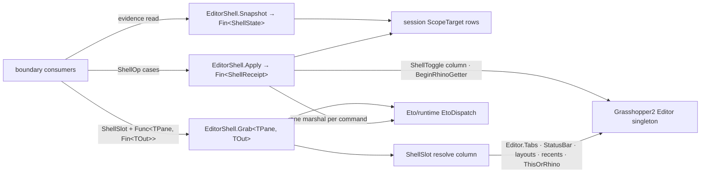

# [RASM_GRASSHOPPER_SHELL_EDITOR]

`EditorShell` is the editor-shell operator of the Grasshopper boundary — ONE owner over the GH2 `Editor` singleton's whole shell surface: the chrome pane slots (tabs, status bar, layouts, recent-document rows, the `ThisOrRhino` host anchor), the boolean shell toggles (collapsed shell, notes visibility, undo-history visibility), the projected `ShellState` receipt, and the single Rhino handoff through `BeginRhinoGetter`.

Every shell pane is a `ShellSlot` row drained by one generic typed-projection gate, every boolean shell axis is a `ShellToggle` row drained by one command case, shell state projects as one evidence receipt with zero singleton interrogation at any consumer, and the getter handoff is one command case beside the toggles. Scope acquisition, editor reveal, and marshal law are `Shell/session.md`'s floor composed as found; chrome construction against its own mintable hosts is `Shell/chrome.md`'s intent surface.

## [01]-[INDEX]

- [02]-[SLOTS]: `ShellSlot` + `EditorShell.Grab<TPane, TOut>` — the pane-slot vocabulary over every chrome anchor the editor exposes, and the one typed-projection gate that replaces direct singleton property reads.
- [03]-[STATE]: `ShellToggle` + `ShellState` — the boolean shell-axis rows and the one projected shell receipt.
- [04]-[OPERATOR]: `ShellOp` + `ShellReceipt` + `EditorShell` — the command union (toggle, getter handoff), the settlement evidence, and the `Apply`/`Snapshot`/`Grab` gate trio.

## [02]-[SLOTS]

- Owner: `ShellSlot` `[SmartEnum<int>]` — 7 pane-anchor rows over ONE `[UseDelegateFromConstructor]` `Resolve(Op) -> Fin<object>` column, split across two row constructors by member residency: instance rows `Tabs` (key 0, `Editor.Tabs` → `TabbedPanel.TabControl`), `StatusBar` (key 1, `Editor.StatusBar` → `Grasshopper2.UI.StatusBar`), `RecentActive` (key 4, `Editor.MostRecentActiveDocument` → the recent-path `string`), `RecentLoaded` (key 5, `Editor.MostRecentLoadedDocuments` → `string[]`); static rows `DefinedLayouts` (key 2, `Editor.DefinedLayouts` → `IEnumerable<string>`), `InitialLayout` (key 3, `Editor.InitialLayout` → `string`), `HostAnchor` (key 6, `Editor.ThisOrRhino` → `Eto.Forms.Window`). Every instance row null-gates the singleton chain through `Optional(Editor.Instance).ToFin(key.MissingContext())`; the static rows read settings-backed statics and therefore resolve on a headless Rhino where every instance row refuses typed. `Editor.BreadCrumbs` is private on the host and is no row — a private pane is unreachable capability, not RESEARCH.
- Entry: `EditorShell.Grab<TPane, TOut>(ShellSlot slot, Func<TPane, Fin<TOut>> project, Op? key = null)` → `Fin<TOut>` — the one typed egress. Each slot resolves inside one `EtoDispatch.Run` marshal, the resolved pane admits through an `is TPane` gate refusing a mis-typed bind with `Fault.Unsupported(typeof(TPane), typeof(TOut))`, and the caller's projection runs inside the same marshal window, so a pane reference never escapes the window that resolved it — the same non-escape law `GhScope` carries on the session floor.
- Law: the slot column is the ONLY singleton read site for chrome panes — a consumer holding `Editor.Instance.Tabs` at a call site is the deleted form. Pane types are heterogeneous, so the column resolves `object` and the generic gate carries each row's typed bind; `Shell/chrome.md`'s hosts mint on their own surfaces (`Bar` construction, `InputPanel` construction, the static `Frame`, the canvas flex collection) and only the editor-resident panes route through this gate.
- Boundary: `Editor.Canvas` and `Editor.Documents` resolve through `ScopeTarget`/`GhScope` on the session floor, never as slot rows — a slot is a chrome pane, a scope is a live work surface, and the two vocabularies never alias. Host editor carries no file-comparison surface.
- Packages: Grasshopper2 (`Editor.Instance`, `Editor.ThisOrRhino`, the seven pane members), LanguageExt.Core, `Rasm.Domain` (`Op`, `Fault`), `Eto/runtime.md` (`EtoDispatch`).
- Growth: a new shell pane is one `ShellSlot` row; the column, the gate, and every consumer signature never widen.

## [03]-[STATE]

- Owner: `ShellToggle` `[SmartEnum<int>]` — 3 boolean shell-axis rows over ONE `[UseDelegateFromConstructor]` `Swing(GhScope scope, Option<bool> target, Op) -> Fin<bool>` column: `Collapsed` (key 0, `Editor.Collapsed`), `Notes` (key 1, `Editor.ShowNotes`), `UndoHistory` (key 2, `Canvas.ShowUndoHistory`). A `Some` target writes then reads back the settled value; a `None` target reads only — one column carries both directions, so a get/set sibling pair per axis is unconstructible. Two editor rows demand the scope's `Editor` projection and the canvas row demands its `Canvas` projection, each refusing an anchor-mismatched scope with `Fault.MissingContext`.
- Owner: `ShellState` `[BoundaryAdapter]` readonly record struct — the one shell-evidence receipt: `Collapsed`, `NotesShown`, `UndoHistoryShown`, `HasDocument` (whether `Editor.Documents.Current` is live), and `RecentCount` (`Editor.MostRecentCount`, the host's on-disk recency tally), implementing `IValidityEvidence` through the claim fold. This receipt makes shell state structural: a consumer reads it as one projected value and never interrogates the singleton, so shell-state diffing is value equality on two receipts — the host-agnostic diff algebra arrives free from the record's structural equality.
- Law: a new shell fact widens the receipt by one field, and every consumer's `with`-diff absorbs the addition silently.
- Boundary: document identity, open-document mutation, and document IO are `Document/document.md`'s scope; this receipt answers only whether a current document exists, never which.
- Packages: Grasshopper2 (`Editor.Collapsed`, `Editor.ShowNotes`, `Editor.Documents.Current`, `Editor.MostRecentCount`, `Canvas.ShowUndoHistory`), `Rasm.Domain` (`ValidityClaim`, `IValidityEvidence`).
- Growth: a new boolean shell axis is one `ShellToggle` row with one `ShellState` field; the column and the snapshot gate never change.

## [04]-[OPERATOR]

- Owner: `EditorShell` — the one editor-shell operator. `ShellOp` `[Union]` `[GenerateUnionOps]` closes the command family: `ToggleCase(ShellToggle Row, bool Target)` swings one shell axis, `GetterCase(Option<RhinoDoc> Target)` arbitrates the single Rhino handoff through the static `Editor.BeginRhinoGetter(RhinoDoc doc = null)` — `None` defers to the host's `RhinoDoc.ActiveDoc` default, and the member's `false` return (no target document, or a getter already active) settles as `Fault.InvalidResult`, never a silently ignored bool. This handoff is the one seam by which the editor yields input focus to a Rhino getter, so a direct `RhinoDoc` getter beside it bypasses the editor's arbitration and is the deleted form. `ShellReceipt` is the settlement evidence — the raising `Op`, the settled case name via `nameof`, and the post-command `ShellState` — implementing `IValidityEvidence`, so every shell command returns the state it produced and no consumer issues a follow-up snapshot to learn what its own command did.
- Entry: `EditorShell.Apply(ShellOp op, Op? key = null)` → `Fin<ShellReceipt>` — the command gate; `EditorShell.Snapshot(Op? key = null)` → `Fin<ShellState>` — the state gate; `EditorShell.Grab<TPane, TOut>` — the `[02]` pane gate. Three gates, three demand shapes (settlement, evidence, typed projection); everything else on the page is internal.
- Law: every case settles inside ONE `EtoDispatch` marshal — scope acquisition through `ScopeTarget`, the host verb, and the receipt's state projection share the window, so no command observes a shell another thread mutated mid-settlement, and every case body runs under `Op.Catch` so a throwing host member lands as a typed `Fault` with the raising key.
- Law: reveal is not a case — `SessionOp.RevealCase` on the session floor owns the public static `Editor.ShowEditor` (`EnsureVisible` is host-internal), and a second reveal spelling here forks the one session-command vocabulary; a consumer sequencing reveal-then-shell-work composes the two gates.
- Boundary: `GetterCase` transports the optional `RhinoDoc` and adjudicates nothing about it — Rhino document semantics are `Rasm.Rhino`'s concern entirely, and the case exists because the handoff member lives on the GH2 editor.
- Packages: Grasshopper2 (the static `Editor.BeginRhinoGetter`), RhinoCommon (`RhinoDoc` as the handoff payload), `Rasm.Domain` (`Op`, `Fault`, `ValidityClaim`), `Shell/session.md` (`ScopeTarget`, `GhScope`), `Eto/runtime.md` (`EtoDispatch`).
- Growth: a new shell command is one `ShellOp` case with its `Switch` arm breaking loudly at the gate; zero new entrypoints on any axis.

```csharp signature
// --- [RUNTIME_PRELUDE] ----------------------------------------------------------------------
using Rasm.Csp;
using Rasm.Grasshopper.Eto;
using Rhino;

namespace Rasm.Grasshopper.Shell;

// --- [TYPES] --------------------------------------------------------------------------------
[SmartEnum<int>]
public sealed partial class ShellSlot {
    public static readonly ShellSlot Tabs = EditorRow(key: 0, read: static shell => shell.Tabs);
    public static readonly ShellSlot StatusBar = EditorRow(key: 1, read: static shell => shell.StatusBar);
    public static readonly ShellSlot DefinedLayouts = StaticRow(key: 2, read: static () => Editor.DefinedLayouts);
    public static readonly ShellSlot InitialLayout = StaticRow(key: 3, read: static () => Editor.InitialLayout);
    public static readonly ShellSlot RecentActive = EditorRow(key: 4, read: static shell => shell.MostRecentActiveDocument);
    public static readonly ShellSlot RecentLoaded = EditorRow(key: 5, read: static shell => shell.MostRecentLoadedDocuments);
    public static readonly ShellSlot HostAnchor = StaticRow(key: 6, read: static () => Editor.ThisOrRhino);
    [UseDelegateFromConstructor] internal partial Fin<object> Resolve(Op key);

    private static ShellSlot EditorRow(int key, Func<Editor, object?> read) =>
        new(key: key, resolve: op =>
            Optional(Editor.Instance).ToFin(op.MissingContext())
                .Bind(shell => Optional(read(arg: shell)).ToFin(op.MissingContext())));

    private static ShellSlot StaticRow(int key, Func<object?> read) =>
        new(key: key, resolve: op => Optional(read()).ToFin(op.MissingContext()));
}

[SmartEnum<int>]
public sealed partial class ShellToggle {
    public static readonly ShellToggle Collapsed = EditorRow(key: 0,
        read: static shell => shell.Collapsed, write: static (shell, value) => shell.Collapsed = value);
    public static readonly ShellToggle Notes = EditorRow(key: 1,
        read: static shell => shell.ShowNotes, write: static (shell, value) => shell.ShowNotes = value);
    public static readonly ShellToggle UndoHistory = new(key: 2, swing: static (scope, target, key) =>
        scope.Canvas.ToFin(key.MissingContext()).Bind(surface => key.Catch(body: () => {
            target.Iter(value => surface.ShowUndoHistory = value);
            return Fin.Succ(surface.ShowUndoHistory);
        })));
    [UseDelegateFromConstructor] internal partial Fin<bool> Swing(GhScope scope, Option<bool> target, Op key);

    private static ShellToggle EditorRow(int key, Func<Editor, bool> read, Action<Editor, bool> write) =>
        new(key: key, swing: (scope, target, op) =>
            scope.Editor.ToFin(op.MissingContext()).Bind(shell => op.Catch(body: () => {
                target.Iter(value => write(arg1: shell, arg2: value));
                return Fin.Succ(read(arg: shell));
            })));
}

[Union]
[GenerateUnionOps]
public abstract partial record ShellOp {
    private ShellOp() { }
    public sealed record ToggleCase(ShellToggle Row, bool Target) : ShellOp;
    public sealed record GetterCase(Option<RhinoDoc> Target) : ShellOp;
}

// --- [MODELS] -------------------------------------------------------------------------------
[BoundaryAdapter, StructLayout(LayoutKind.Auto)]
public readonly record struct ShellState(
    bool Collapsed, bool NotesShown, bool UndoHistoryShown, bool HasDocument, int RecentCount) : IValidityEvidence {
    public bool IsValid => ValidityClaim.All(
        ValidityClaim.Of(holds: RecentCount >= 0));
}

[BoundaryAdapter, StructLayout(LayoutKind.Auto)]
public readonly record struct ShellReceipt(Op Operation, string Verb, ShellState Settled) : IValidityEvidence {
    public bool IsValid => ValidityClaim.All(
        ValidityClaim.Of(holds: !string.IsNullOrWhiteSpace(value: Verb)),
        ValidityClaim.Evidence(evidence: Settled));
}

// --- [OPERATIONS] ---------------------------------------------------------------------------
[BoundaryAdapter]
public static class EditorShell {
    public static Fin<TOut> Grab<TPane, TOut>(ShellSlot slot, Func<TPane, Fin<TOut>> project, Op? key = null) {
        Op op = key.OrDefault();
        return from row in op.Need(slot)
               from valid in op.Need(project)
               from output in EtoDispatch.Run(body: () => row.Resolve(key: op).Bind(pane => pane is TPane typed
                   ? op.Catch(body: () => valid(arg: typed))
                   : Fin.Fail<TOut>(op.Unsupported(geometryType: typeof(TPane), outputType: typeof(TOut)))), key: op)
               select output;
    }

    public static Fin<ShellState> Snapshot(Op? key = null) {
        Op op = key.OrDefault();
        return EtoDispatch.Run(body: () => ScopeTarget.EditorHost.Acquire(key: op).Bind(scope => Project(scope: scope, key: op)), key: op);
    }

    public static Fin<ShellReceipt> Apply(ShellOp op, Op? key = null) {
        Op active = key.OrDefault();
        return active.Need(op)
            .Bind(valid => EtoDispatch.Run(body: () => ScopeTarget.EditorHost.Acquire(key: active).Bind(scope => valid.Switch(
                state: (Scope: scope, Key: active),
                toggleCase: static (s, c) => c.Row.Swing(scope: s.Scope, target: Some(c.Target), key: s.Key)
                    .Map(_ => nameof(ShellOp.ToggleCase)),
                getterCase: static (s, c) => s.Key.Catch(body: () =>
                        Editor.BeginRhinoGetter(doc: c.Target.MatchUnsafe(Some: static live => live, None: static () => null))
                            ? Fin.Succ(unit)
                            : Fin.Fail<Unit>(s.Key.InvalidResult(detail: nameof(Editor.BeginRhinoGetter))))
                    .Map(_ => nameof(ShellOp.GetterCase)))
                .Bind(verb => Project(scope: scope, key: active)
                    .Map(settled => new ShellReceipt(Operation: active, Verb: verb, Settled: settled)))), key: active));
    }

    private static Fin<ShellState> Project(GhScope scope, Op key) =>
        from shell in scope.Editor.ToFin(key.MissingContext())
        from collapsed in ShellToggle.Collapsed.Swing(scope: scope, target: Option<bool>.None, key: key)
        from notes in ShellToggle.Notes.Swing(scope: scope, target: Option<bool>.None, key: key)
        from history in scope.Canvas.IsSome
            ? ShellToggle.UndoHistory.Swing(scope: scope, target: Option<bool>.None, key: key)
            : Fin.Succ(false)
        from state in key.Catch(body: () => Fin.Succ(new ShellState(
            Collapsed: collapsed,
            NotesShown: notes,
            UndoHistoryShown: history,
            HasDocument: Optional(shell.Documents.Current).IsSome,
            RecentCount: shell.MostRecentCount)))
        select state;
}
```



## [05]-[DENSITY_BAR]

`Resolve` and `Swing` are internal columns behind the three public gates `Apply`, `Snapshot`, and `Grab`.

| [INDEX] | [CONCERN]         | [OWNER]                         | [KIND]                                    | [RAIL]                       | [CASES] |
| :-----: | :---------------- | :------------------------------ | :---------------------------------------- | :--------------------------- | :-----: |
|  [01]   | pane slots        | `ShellSlot`                     | `[SmartEnum<int>]`, resolve column        | `Resolve → Fin<object>`      |    7    |
|  [02]   | shell toggles     | `ShellToggle`                   | `[SmartEnum<int>]`, dual-direction column | `Swing → Fin<bool>`          |    3    |
|  [03]   | shell commands    | `ShellOp` + `ShellReceipt`      | `[Union]` `[GenerateUnionOps]` + receipt  | `Apply → Fin<ShellReceipt>`  |    2    |
|  [04]   | shell evidence    | `ShellState`                    | evidence receipt over verified scalars    | `Snapshot → Fin<ShellState>` |    1    |
|  [05]   | typed pane egress | `EditorShell.Grab<TPane, TOut>` | generic gate, one marshal window          | `Grab → Fin<TOut>`           |    1    |

`ScopeTarget`, `GhScope`, `EtoDispatch`, `Op`, `Fault`, and `ValidityClaim` are composed upstream owners; every shell capability lands as the rows, cases, and gates above. `Editor.BreadCrumbs` (private) is a phantom row no fence composes, and the host ships no file-comparison member.
