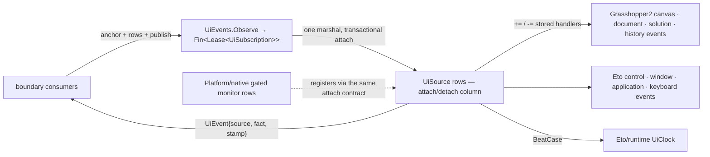

# [RASM_GRASSHOPPER_SHELL_EVENTS]

The one UI event algebra of the Grasshopper boundary — a single source-row vocabulary (`UiSource`) over every catalog-verified GH2 and Eto event stream, one typed fact family (`UiFact`) carrying every payload as evidence, one anchor union (`EventAnchor`) discriminating what a row attaches to, and one subscription owner (`UiSubscription`) whose lifetime rides the kernel `Lease<T>` rail. The census-era shape — thirteen provider-oriented `UiEvent` cases, per-family handler record products (`DocumentEventHandlers` and siblings), fixed sparse snapshots, and a local subscription lifecycle — collapses here: a host event family is a set of ROWS in one vocabulary, its payload is a CASE of one fact union, attachment and inverse detachment are one delegate column, and ownership is the kernel lease with no second in-folder lifecycle algebra. Every attachment rides an `Op`-keyed `Fin` rail and marshals through the `Eto/runtime.md` dispatch seam; a batch of rows attaches transactionally — any refused row rolls back every already-attached sibling before the fault surfaces.

Source coverage spans the GH2 canvas signal family (`DocumentChanged`/`DocumentModified` on `Canvas`, `ProjectionChanged`/`WindowSelection`/`MouseDwell`/`Draw` inherited from the `FlexControl` seam), the document family (`ModifiedChanged`/`StateChanged`/`ParentChanged`), the full ten-event object-list family (`ObjectAdded`/`ObjectRemoved`/`ObjectSelectionChanged`/`ObjectExpired`/`ObjectNameChanged`/`ObjectEnabledChanged`/`ObjectRelevanceChanged`/`ObjectLayoutChanged`/`ObjectDisplayChanged`/`ObjectInstanceIdChanged`), the six-event solution lifecycle, the full seven-event undo family (`Undone`/`Redone`/`Modified`/`NodeAdded`/`NodeRemoved`/`NodeMerged`/`NodeMoved`), the Eto control input/lifecycle families, the window family, ambient application/keyboard state, and the `UiClock` beat. The eight canvas paint fences are `Canvas/paint.md`'s executor and never appear as rows here; `FlexControl.PopulateContextMenu` is `Canvas/interaction.md`'s policy callback, not an observation stream; window-closing veto policy is `Eto/windows.md`'s spec; AppKit local-monitor streams enter this algebra as rows whose attachment is the `Platform/native.md` gated adapter — the platform owner carries the `NSEventMask` vocabulary, the monitor lifetime, and the macOS gate, and this page carries only the row seam.

## [01]-[INDEX]

- [02]-[FACTS]: `CanvasSignal`/`DocumentSignal`/`GraphSignal`/`SolutionSignal`/`UndoSignal`/`LifecycleStage` + `UiFact` + `UiEvent` — the signal vocabularies, the one payload union, and the published envelope.
- [03]-[SOURCES]: `EventAnchor` + `UiSource` — the anchor union and the source-row vocabulary with its attach/detach column and per-anchor row-factory folds.
- [04]-[SUBSCRIPTION]: `UiSubscription` + `UiEvents` — transactional multi-row attachment behind one `Observe` gate returning `Fin<Lease<UiSubscription>>`.

## [02]-[FACTS]

- Owner: `UiFact` `[Union]` — the one payload family every source row publishes into. Cases carry typed evidence, never provider argument objects: `PointerCase` (location, buttons, modifiers, wheel delta, pressure — the full `MouseEventArgs` evidence set), `KeyCase` (key, modifiers, pressed, composed character), `TextCase` (composed text), `DragCase` (location, effect mask), `FocusCase` (gained), `EnabledCase` (live enabled state), `BoundsCase` (bounds), `DensityCase` (logical pixel size), `StateCase` (window state), `LifeCase` (a `LifecycleStage` row), `ModifierCase` (live modifier mask), `CanvasCase` (signal row plus the dwell content point where the raising event carries one), `DocumentCase` (signal row plus the owning document's `DocumentToken` id), `GraphCase` (signal row plus the subject's `InstanceId`), `SolutionCase` (signal row, the host `SolutionId` run identity, and the `Faulted` row's `Error`), `UndoCase` (signal row), `BeatCase` (a `ClockBeat`), `NoticeCase` (activation id and user data, both host strings), `FaultCase` (an `Error` from the unhandled-exception stream, lowered through the kernel fault vocabulary). Signal vocabularies are keyless behavior-free `[SmartEnum<int>]` rows — `CanvasSignal` (6), `DocumentSignal` (3), `GraphSignal` (10, the full `ObjectList` event set), `SolutionSignal` (6, in lifecycle order `AboutToStart`→`Started`→`Stopped`→`Cancelled`→`Completed`→`Faulted`), `UndoSignal` (7, the full `History` event set), `LifecycleStage` (Eto `PreLoad`/`Load`/`LoadComplete`/`Shown`/`UnLoad`/`Closing`/`Closed` plus app `Initialized`/`Terminating`/`ActiveChanged`).
- Owner: `UiEvent` readonly record struct — the published envelope: the raising `UiSource`, the `UiFact`, and a monotonic stamp (`Environment.TickCount64` at publication); implements `IValidityEvidence` through the claim fold. Consumers receive `UiEvent` values only — a host `EventArgs` object never crosses the algebra.
- Law: facts are evidence, never live resources — a `DocumentCase` carries the `DocumentToken` `Guid` (`Shell/session.md`'s per-instance identity mint, because GH2 `Document` carries no cheap host id), never the `Document`; a `GraphCase` carries `IDocumentObject.InstanceId`; a `SolutionCase` carries the host `SolutionId` value identity; a consumer needing the live object re-enters through `GhSession.Run`, so a stale fact can never hand out a disposed host reference.
- Law: sparse projection is the contract by decision — a fact carries what its source row verifiably reads, and a consumer needing more evidence extends the CASE with a field, never mints a sibling snapshot record.
- Boundary: `Fault.Cancelled` and the twelve-case kernel fault band own failure semantics; `FaultCase` transports the `Error` as evidence and adjudicates nothing.
- Packages: Eto (`Keys`, `MouseButtons`, `DragEffects`, `WindowState`, `PointF`, `RectangleF`), `Rasm.Domain` (`ValidityClaim`, `IValidityEvidence`), `Eto/runtime.md` (`ClockBeat`).
- Growth: a new host signal is one row on its signal vocabulary plus, where the payload is new, one `UiFact` case; consumers' total `Switch` breaks loudly.

```csharp signature
// --- [RUNTIME_PRELUDE] ----------------------------------------------------------------------
using Rasm.Csp;
using Rasm.Grasshopper.Eto;

namespace Rasm.Grasshopper.Shell;

// --- [TYPES] --------------------------------------------------------------------------------
[SmartEnum<int>]
public sealed partial class CanvasSignal {
    public static readonly CanvasSignal DocumentChanged = new(key: 0);
    public static readonly CanvasSignal ProjectionChanged = new(key: 1);
    public static readonly CanvasSignal WindowSelection = new(key: 2);
    public static readonly CanvasSignal DocumentModified = new(key: 3);
    public static readonly CanvasSignal MouseDwell = new(key: 4);
    public static readonly CanvasSignal Draw = new(key: 5);
}

[SmartEnum<int>]
public sealed partial class DocumentSignal {
    public static readonly DocumentSignal Modified = new(key: 0);
    public static readonly DocumentSignal State = new(key: 1);
    public static readonly DocumentSignal Parent = new(key: 2);
}

[SmartEnum<int>]
public sealed partial class GraphSignal {
    public static readonly GraphSignal ObjectAdded = new(key: 0);
    public static readonly GraphSignal ObjectRemoved = new(key: 1);
    public static readonly GraphSignal SelectionChanged = new(key: 2);
    public static readonly GraphSignal Expired = new(key: 3);
    public static readonly GraphSignal NameChanged = new(key: 4);
    public static readonly GraphSignal EnabledChanged = new(key: 5);
    public static readonly GraphSignal RelevanceChanged = new(key: 6);
    public static readonly GraphSignal LayoutChanged = new(key: 7);
    public static readonly GraphSignal DisplayChanged = new(key: 8);
    public static readonly GraphSignal InstanceIdChanged = new(key: 9);
}

[SmartEnum<int>]
public sealed partial class SolutionSignal {
    public static readonly SolutionSignal AboutToStart = new(key: 0);
    public static readonly SolutionSignal Started = new(key: 1);
    public static readonly SolutionSignal Stopped = new(key: 2);
    public static readonly SolutionSignal Cancelled = new(key: 3);
    public static readonly SolutionSignal Completed = new(key: 4);
    public static readonly SolutionSignal Faulted = new(key: 5);
}

[SmartEnum<int>]
public sealed partial class UndoSignal {
    public static readonly UndoSignal Undone = new(key: 0);
    public static readonly UndoSignal Redone = new(key: 1);
    public static readonly UndoSignal Modified = new(key: 2);
    public static readonly UndoSignal NodeAdded = new(key: 3);
    public static readonly UndoSignal NodeRemoved = new(key: 4);
    public static readonly UndoSignal NodeMerged = new(key: 5);
    public static readonly UndoSignal NodeMoved = new(key: 6);
}

[SmartEnum<int>]
public sealed partial class LifecycleStage {
    public static readonly LifecycleStage PreLoad = new(key: 0);
    public static readonly LifecycleStage Load = new(key: 1);
    public static readonly LifecycleStage LoadComplete = new(key: 2);
    public static readonly LifecycleStage Shown = new(key: 3);
    public static readonly LifecycleStage UnLoad = new(key: 4);
    public static readonly LifecycleStage Closing = new(key: 5);
    public static readonly LifecycleStage Closed = new(key: 6);
    public static readonly LifecycleStage Initialized = new(key: 7);
    public static readonly LifecycleStage Terminating = new(key: 8);
    public static readonly LifecycleStage ActiveChanged = new(key: 9);
}

[Union]
public abstract partial record UiFact {
    private UiFact() { }
    public sealed record PointerCase(PointF Location, MouseButtons Buttons, Keys Modifiers, SizeF Delta, float Pressure) : UiFact;
    public sealed record KeyCase(Keys Key, Keys Modifiers, bool Pressed, Option<char> Character) : UiFact;
    public sealed record TextCase(string Text) : UiFact;
    public sealed record DragCase(PointF Location, DragEffects Effects) : UiFact;
    public sealed record FocusCase(bool Gained) : UiFact;
    public sealed record EnabledCase(bool Enabled) : UiFact;
    public sealed record BoundsCase(RectangleF Bounds) : UiFact;
    public sealed record DensityCase(float LogicalPixelSize) : UiFact;
    public sealed record StateCase(WindowState State) : UiFact;
    public sealed record LifeCase(LifecycleStage Stage) : UiFact;
    public sealed record ModifierCase(Keys Modifiers) : UiFact;
    public sealed record CanvasCase(CanvasSignal Signal, Option<PointF> Location) : UiFact;
    public sealed record DocumentCase(DocumentSignal Signal, Option<Guid> DocumentId) : UiFact;
    public sealed record GraphCase(GraphSignal Signal, Option<Guid> SubjectId) : UiFact;
    public sealed record SolutionCase(SolutionSignal Signal, Option<SolutionId> Id, Option<Error> Failure) : UiFact;
    public sealed record UndoCase(UndoSignal Signal) : UiFact;
    public sealed record BeatCase(ClockBeat Beat) : UiFact;
    public sealed record NoticeCase(Option<string> Id, Option<string> UserData) : UiFact;
    public sealed record FaultCase(Error Failure) : UiFact;
}

// --- [MODELS] -------------------------------------------------------------------------------
[BoundaryAdapter, StructLayout(LayoutKind.Auto)]
public readonly record struct UiEvent(UiSource Source, UiFact Fact, long Stamp) : IValidityEvidence {
    public bool IsValid => ValidityClaim.All(
        ValidityClaim.Of(holds: Source is not null),
        ValidityClaim.Of(holds: Fact is not null),
        ValidityClaim.Of(holds: Stamp >= 0));
    internal static UiEvent Of(UiSource source, UiFact fact) => new(Source: source, Fact: fact, Stamp: Environment.TickCount64);
}
```

## [03]-[SOURCES]

- Owner: `EventAnchor` `[Union]` — what a row attaches to: `CanvasCase(Canvas)`, `DocumentCase(Document)`, `SolutionCase(SolutionServer)`, `HistoryCase(History)`, `ControlCase(Control)`, `WindowCase(Window)`, `AmbientCase` (the `Application`/`Keyboard` statics), `ClockCase(UiClock)`. A row demanding one anchor kind refuses every other with `Fault.InvalidInput` — anchor agreement is admission, not documentation.
- Owner: `UiSource` `[SmartEnum<string>]` — the source-row vocabulary, string-keyed for wire/diagnostic identity, over ONE `[UseDelegateFromConstructor]` `Attach(EventAnchor, Action<UiEvent>, Op)` column returning `Fin<IDisposable>` whose disposable IS the inverse detachment. Rows are constructed by per-anchor factory folds so no row hand-rolls its subscription mechanics: `CanvasRow`/`DocumentRow`/`SolutionRow`/`HistoryRow` wire the GH2 families, `ControlRow`/`WindowRow` wire the Eto families, `AmbientRow` wires application and keyboard statics, and the clock row bridges the `UiClock` beat. Rows whose family differs only in which host event the wire touches collapse through shared-args sub-folds — `Pointer`/`Keystroke`/`DragRow`/`Stage` on the Eto side, `Subject` (the six `ObjectEventArgs` object-list rows), `Pulse` (the four `SolutionEventArgs` lifecycle rows), and `Ledger`/`LedgerNode` (the `UndoEventArgs`/`UndoNodeEventArgs` triplets) on the GH2 side — the event choice is row data, never a sibling body.
- Entry: rows are data — the only executable surface is the internal `Attach` column the `[04]` gate drains; no per-row public subscribe method exists.
- Law: every attach body registers a stored handler and returns a `Detachment` capturing the exact `-=` inverse — a subscription without its inverse is unconstructible, which is the property the census `Subscription` owner existed to approximate.
- Law: publication never re-enters the host — a handler projects its fact and calls `publish`; consumer work that mutates host state re-enters through `GhSession`, so event storms cannot recurse into the surface that raised them.
- Law: every wire spells its host delegate exactly — `Canvas.DocumentChanged`/`DocumentModified` are bare `EventHandler`; the flex-seam four carry typed args (`ProjectionChangedEventArgs`, `WindowSelectionEventArgs`, `MouseDwellEventArgs` with `ControlPoint`/`ContentPoint`, `ControlDrawEventArgs`); the document three carry `DocumentModifiedEventArgs`/`DocumentStateEventArgs`/`BeforeAfterEventArgs<Document, IDocumentParent>`; the object-list ten carry `AfterAddObjectEventArgs`/`AfterRemoveObjectEventArgs`/`ObjectEventArgs`/`ObjectNameEventArgs`/`ObjectGuidEventArgs`; the solution six carry `SolutionIdEventArgs`/`SolutionEventArgs`/`SolutionExceptionEventArgs`; the undo seven carry `UndoEventArgs`/`UndoNodeEventArgs`/`UndoNodeMovedEventArgs`. A wire assuming a wrong delegate family fails at compile, which is the property the exact spellings buy.
- Boundary: the native-monitor row family (`AppKit` local event monitors, `NSWorkspace` accessibility observation) is declared by `Platform/native.md` and registers into this vocabulary through the same attach-column contract — the platform owner supplies the gated attach delegate; this page owns no `#if` and no AppKit spelling.
- Packages: Grasshopper2 (the canvas/document/object-list/solution/history event families and their args types), Eto (the control/window/application/keyboard event families), `Rasm.Domain` (`Op`, `Fault`), `Eto/runtime.md` (`UiClock`, `ClockBeat`, `EtoDispatch`), `Shell/session.md` (`DocumentToken`).
- Growth: a new host stream is one row through an existing fold; a new anchor kind is one `EventAnchor` case plus one fold — the column and the gate never change.

```csharp signature
// --- [RUNTIME_PRELUDE] ----------------------------------------------------------------------
using Rasm.Csp;
using Rasm.Grasshopper.Eto;

namespace Rasm.Grasshopper.Shell;

// --- [TYPES] --------------------------------------------------------------------------------
[Union]
public abstract partial record EventAnchor {
    private EventAnchor() { }
    public sealed record CanvasCase(Canvas Surface) : EventAnchor;
    public sealed record DocumentCase(Document Graph) : EventAnchor;
    public sealed record SolutionCase(SolutionServer Server) : EventAnchor;
    public sealed record HistoryCase(History Ledger) : EventAnchor;
    public sealed record ControlCase(Control Surface) : EventAnchor;
    public sealed record WindowCase(Window Surface) : EventAnchor;
    public sealed record AmbientCase : EventAnchor;
    public sealed record ClockCase(UiClock Clock) : EventAnchor;
}

// --- [SERVICES] -----------------------------------------------------------------------------
internal sealed class Detachment(Action release) : IDisposable {
    private int released;
    public void Dispose() => Op.SideWhen(condition: Interlocked.Exchange(location1: ref released, value: 1) == 0, action: release);
}

[SmartEnum<string>]
public sealed partial class UiSource {
    // GH2 canvas family — DocumentChanged/DocumentModified are Canvas-declared; the flex four are inherited FlexControl events.
    public static readonly UiSource CanvasDocumentChanged = CanvasRow(key: "canvas.document-changed",
        wire: static (surface, emit) => { EventHandler h = (_, _) => emit(new UiFact.CanvasCase(Signal: CanvasSignal.DocumentChanged, Location: Option<PointF>.None)); surface.DocumentChanged += h; return new Detachment(release: () => surface.DocumentChanged -= h); });
    public static readonly UiSource CanvasDocumentModified = CanvasRow(key: "canvas.document-modified",
        wire: static (surface, emit) => { EventHandler h = (_, _) => emit(new UiFact.CanvasCase(Signal: CanvasSignal.DocumentModified, Location: Option<PointF>.None)); surface.DocumentModified += h; return new Detachment(release: () => surface.DocumentModified -= h); });
    public static readonly UiSource CanvasProjectionChanged = CanvasRow(key: "canvas.projection-changed",
        wire: static (surface, emit) => { EventHandler<ProjectionChangedEventArgs> h = (_, _) => emit(new UiFact.CanvasCase(Signal: CanvasSignal.ProjectionChanged, Location: Option<PointF>.None)); surface.ProjectionChanged += h; return new Detachment(release: () => surface.ProjectionChanged -= h); });
    public static readonly UiSource CanvasWindowSelection = CanvasRow(key: "canvas.window-selection",
        wire: static (surface, emit) => { EventHandler<WindowSelectionEventArgs> h = (_, _) => emit(new UiFact.CanvasCase(Signal: CanvasSignal.WindowSelection, Location: Option<PointF>.None)); surface.WindowSelection += h; return new Detachment(release: () => surface.WindowSelection -= h); });
    public static readonly UiSource CanvasMouseDwell = CanvasRow(key: "canvas.mouse-dwell",
        wire: static (surface, emit) => { EventHandler<MouseDwellEventArgs> h = (_, args) => emit(new UiFact.CanvasCase(Signal: CanvasSignal.MouseDwell, Location: Some(args.ContentPoint))); surface.MouseDwell += h; return new Detachment(release: () => surface.MouseDwell -= h); });
    public static readonly UiSource CanvasDraw = CanvasRow(key: "canvas.draw",
        wire: static (surface, emit) => { EventHandler<ControlDrawEventArgs> h = (_, _) => emit(new UiFact.CanvasCase(Signal: CanvasSignal.Draw, Location: Option<PointF>.None)); surface.Draw += h; return new Detachment(release: () => surface.Draw -= h); });

    // GH2 document family — typed args; document identity is the session DocumentToken mint.
    public static readonly UiSource DocumentModified = DocumentRow(key: "document.modified",
        wire: static (graph, emit) => { EventHandler<DocumentModifiedEventArgs> h = (_, args) => emit(new UiFact.DocumentCase(Signal: DocumentSignal.Modified, DocumentId: Some(DocumentToken.Of(graph: args.Document)))); graph.ModifiedChanged += h; return new Detachment(release: () => graph.ModifiedChanged -= h); });
    public static readonly UiSource DocumentState = DocumentRow(key: "document.state",
        wire: static (graph, emit) => { EventHandler<DocumentStateEventArgs> h = (_, args) => emit(new UiFact.DocumentCase(Signal: DocumentSignal.State, DocumentId: Some(DocumentToken.Of(graph: args.Document)))); graph.StateChanged += h; return new Detachment(release: () => graph.StateChanged -= h); });
    public static readonly UiSource DocumentParent = DocumentRow(key: "document.parent",
        wire: static (graph, emit) => { EventHandler<BeforeAfterEventArgs<Document, IDocumentParent>> h = (_, args) => emit(new UiFact.DocumentCase(Signal: DocumentSignal.Parent, DocumentId: Some(DocumentToken.Of(graph: args.Owner)))); graph.ParentChanged += h; return new Detachment(release: () => graph.ParentChanged -= h); });

    // GH2 object-list family — the full ObjectList event set; shared-args rows ride the Subject fold.
    public static readonly UiSource GraphObjectAdded = DocumentRow(key: "graph.object-added",
        wire: static (graph, emit) => { EventHandler<AfterAddObjectEventArgs> h = (_, args) => emit(new UiFact.GraphCase(Signal: GraphSignal.ObjectAdded, SubjectId: Some(args.Object.InstanceId))); graph.Objects.ObjectAdded += h; return new Detachment(release: () => graph.Objects.ObjectAdded -= h); });
    public static readonly UiSource GraphObjectRemoved = DocumentRow(key: "graph.object-removed",
        wire: static (graph, emit) => { EventHandler<AfterRemoveObjectEventArgs> h = (_, args) => emit(new UiFact.GraphCase(Signal: GraphSignal.ObjectRemoved, SubjectId: Some(args.Object.InstanceId))); graph.Objects.ObjectRemoved += h; return new Detachment(release: () => graph.Objects.ObjectRemoved -= h); });
    public static readonly UiSource GraphSelection = Subject(key: "graph.selection", signal: GraphSignal.SelectionChanged, pick: static g => (add: h => g.Objects.ObjectSelectionChanged += h, remove: h => g.Objects.ObjectSelectionChanged -= h));
    public static readonly UiSource GraphExpired = Subject(key: "graph.expired", signal: GraphSignal.Expired, pick: static g => (add: h => g.Objects.ObjectExpired += h, remove: h => g.Objects.ObjectExpired -= h));
    public static readonly UiSource GraphEnabled = Subject(key: "graph.enabled", signal: GraphSignal.EnabledChanged, pick: static g => (add: h => g.Objects.ObjectEnabledChanged += h, remove: h => g.Objects.ObjectEnabledChanged -= h));
    public static readonly UiSource GraphRelevance = Subject(key: "graph.relevance", signal: GraphSignal.RelevanceChanged, pick: static g => (add: h => g.Objects.ObjectRelevanceChanged += h, remove: h => g.Objects.ObjectRelevanceChanged -= h));
    public static readonly UiSource GraphLayout = Subject(key: "graph.layout", signal: GraphSignal.LayoutChanged, pick: static g => (add: h => g.Objects.ObjectLayoutChanged += h, remove: h => g.Objects.ObjectLayoutChanged -= h));
    public static readonly UiSource GraphDisplay = Subject(key: "graph.display", signal: GraphSignal.DisplayChanged, pick: static g => (add: h => g.Objects.ObjectDisplayChanged += h, remove: h => g.Objects.ObjectDisplayChanged -= h));
    public static readonly UiSource GraphNameChanged = DocumentRow(key: "graph.name-changed",
        wire: static (graph, emit) => { EventHandler<ObjectNameEventArgs> h = (_, args) => emit(new UiFact.GraphCase(Signal: GraphSignal.NameChanged, SubjectId: Some(args.Owner.InstanceId))); graph.Objects.ObjectNameChanged += h; return new Detachment(release: () => graph.Objects.ObjectNameChanged -= h); });
    public static readonly UiSource GraphInstanceId = DocumentRow(key: "graph.instance-id",
        wire: static (graph, emit) => { EventHandler<ObjectGuidEventArgs> h = (_, args) => emit(new UiFact.GraphCase(Signal: GraphSignal.InstanceIdChanged, SubjectId: Some(args.NewId))); graph.Objects.ObjectInstanceIdChanged += h; return new Detachment(release: () => graph.Objects.ObjectInstanceIdChanged -= h); });

    // GH2 solution lifecycle family — the SolutionEventArgs four ride the Pulse fold; the id-only opener and the faulted closer wire individually.
    public static readonly UiSource SolutionAboutToStart = SolutionRow(key: "solution.about-to-start",
        wire: static (server, emit) => { EventHandler<SolutionIdEventArgs> h = (_, args) => emit(new UiFact.SolutionCase(Signal: SolutionSignal.AboutToStart, Id: Some(args.Id), Failure: Option<Error>.None)); server.SolutionAboutToStart += h; return new Detachment(release: () => server.SolutionAboutToStart -= h); });
    public static readonly UiSource SolutionStarted = Pulse(key: "solution.started", signal: SolutionSignal.Started, pick: static s => (add: h => s.SolutionStarted += h, remove: h => s.SolutionStarted -= h));
    public static readonly UiSource SolutionStopped = Pulse(key: "solution.stopped", signal: SolutionSignal.Stopped, pick: static s => (add: h => s.SolutionStopped += h, remove: h => s.SolutionStopped -= h));
    public static readonly UiSource SolutionCancelled = Pulse(key: "solution.cancelled", signal: SolutionSignal.Cancelled, pick: static s => (add: h => s.SolutionCancelled += h, remove: h => s.SolutionCancelled -= h));
    public static readonly UiSource SolutionCompleted = Pulse(key: "solution.completed", signal: SolutionSignal.Completed, pick: static s => (add: h => s.SolutionCompleted += h, remove: h => s.SolutionCompleted -= h));
    public static readonly UiSource SolutionFaulted = SolutionRow(key: "solution.faulted",
        wire: static (server, emit) => { EventHandler<SolutionExceptionEventArgs> h = (_, args) => emit(new UiFact.SolutionCase(Signal: SolutionSignal.Faulted, Id: Some(args.SolutionId), Failure: Some(Error.New(args.Exception)))); server.SolutionFaulted += h; return new Detachment(release: () => server.SolutionFaulted -= h); });

    // GH2 undo family — the full History event set; shared-args triplets ride the Ledger/LedgerNode folds.
    public static readonly UiSource HistoryUndone = Ledger(key: "history.undone", signal: UndoSignal.Undone, pick: static l => (add: h => l.Undone += h, remove: h => l.Undone -= h));
    public static readonly UiSource HistoryRedone = Ledger(key: "history.redone", signal: UndoSignal.Redone, pick: static l => (add: h => l.Redone += h, remove: h => l.Redone -= h));
    public static readonly UiSource HistoryModified = Ledger(key: "history.modified", signal: UndoSignal.Modified, pick: static l => (add: h => l.Modified += h, remove: h => l.Modified -= h));
    public static readonly UiSource HistoryNodeAdded = LedgerNode(key: "history.node-added", signal: UndoSignal.NodeAdded, pick: static l => (add: h => l.NodeAdded += h, remove: h => l.NodeAdded -= h));
    public static readonly UiSource HistoryNodeRemoved = LedgerNode(key: "history.node-removed", signal: UndoSignal.NodeRemoved, pick: static l => (add: h => l.NodeRemoved += h, remove: h => l.NodeRemoved -= h));
    public static readonly UiSource HistoryNodeMerged = LedgerNode(key: "history.node-merged", signal: UndoSignal.NodeMerged, pick: static l => (add: h => l.NodeMerged += h, remove: h => l.NodeMerged -= h));
    public static readonly UiSource HistoryNodeMoved = HistoryRow(key: "history.node-moved",
        wire: static (ledger, emit) => { EventHandler<UndoNodeMovedEventArgs> h = (_, _) => emit(new UiFact.UndoCase(Signal: UndoSignal.NodeMoved)); ledger.NodeMoved += h; return new Detachment(release: () => ledger.NodeMoved -= h); });

    // Eto control input family — pointer/key/text sub-folds; the event choice is row data.
    public static readonly UiSource ControlMouseDown = Pointer(key: "control.mouse-down", pick: static c => (add: h => c.MouseDown += h, remove: h => c.MouseDown -= h));
    public static readonly UiSource ControlMouseUp = Pointer(key: "control.mouse-up", pick: static c => (add: h => c.MouseUp += h, remove: h => c.MouseUp -= h));
    public static readonly UiSource ControlMouseMove = Pointer(key: "control.mouse-move", pick: static c => (add: h => c.MouseMove += h, remove: h => c.MouseMove -= h));
    public static readonly UiSource ControlMouseEnter = Pointer(key: "control.mouse-enter", pick: static c => (add: h => c.MouseEnter += h, remove: h => c.MouseEnter -= h));
    public static readonly UiSource ControlMouseLeave = Pointer(key: "control.mouse-leave", pick: static c => (add: h => c.MouseLeave += h, remove: h => c.MouseLeave -= h));
    public static readonly UiSource ControlMouseDoubleClick = Pointer(key: "control.mouse-double-click", pick: static c => (add: h => c.MouseDoubleClick += h, remove: h => c.MouseDoubleClick -= h));
    public static readonly UiSource ControlMouseWheel = Pointer(key: "control.mouse-wheel", pick: static c => (add: h => c.MouseWheel += h, remove: h => c.MouseWheel -= h));
    public static readonly UiSource ControlKeyDown = Keystroke(key: "control.key-down", pressed: true, pick: static c => (add: h => c.KeyDown += h, remove: h => c.KeyDown -= h));
    public static readonly UiSource ControlKeyUp = Keystroke(key: "control.key-up", pressed: false, pick: static c => (add: h => c.KeyUp += h, remove: h => c.KeyUp -= h));
    public static readonly UiSource ControlTextInput = ControlRow(key: "control.text-input",
        wire: static (surface, emit) => { EventHandler<TextInputEventArgs> h = (_, args) => emit(new UiFact.TextCase(Text: args.Text)); surface.TextInput += h; return new Detachment(release: () => surface.TextInput -= h); });
    public static readonly UiSource ControlDragEnter = DragRow(key: "control.drag-enter", pick: static c => (add: h => c.DragEnter += h, remove: h => c.DragEnter -= h));
    public static readonly UiSource ControlDragOver = DragRow(key: "control.drag-over", pick: static c => (add: h => c.DragOver += h, remove: h => c.DragOver -= h));
    public static readonly UiSource ControlDragLeave = DragRow(key: "control.drag-leave", pick: static c => (add: h => c.DragLeave += h, remove: h => c.DragLeave -= h));
    public static readonly UiSource ControlDragDrop = DragRow(key: "control.drag-drop", pick: static c => (add: h => c.DragDrop += h, remove: h => c.DragDrop -= h));
    public static readonly UiSource ControlDragEnd = DragRow(key: "control.drag-end", pick: static c => (add: h => c.DragEnd += h, remove: h => c.DragEnd -= h));
    public static readonly UiSource ControlEnabledChanged = ControlRow(key: "control.enabled-changed",
        wire: static (surface, emit) => { EventHandler<EventArgs> h = (_, _) => emit(new UiFact.EnabledCase(Enabled: surface.Enabled)); surface.EnabledChanged += h; return new Detachment(release: () => surface.EnabledChanged -= h); });
    public static readonly UiSource ControlGotFocus = ControlRow(key: "control.got-focus",
        wire: static (surface, emit) => { EventHandler<EventArgs> h = (_, _) => emit(new UiFact.FocusCase(Gained: true)); surface.GotFocus += h; return new Detachment(release: () => surface.GotFocus -= h); });
    public static readonly UiSource ControlLostFocus = ControlRow(key: "control.lost-focus",
        wire: static (surface, emit) => { EventHandler<EventArgs> h = (_, _) => emit(new UiFact.FocusCase(Gained: false)); surface.LostFocus += h; return new Detachment(release: () => surface.LostFocus -= h); });
    public static readonly UiSource ControlSizeChanged = ControlRow(key: "control.size-changed",
        wire: static (surface, emit) => { EventHandler<EventArgs> h = (_, _) => emit(new UiFact.BoundsCase(Bounds: surface.Bounds)); surface.SizeChanged += h; return new Detachment(release: () => surface.SizeChanged -= h); });
    public static readonly UiSource ControlShown = Stage(key: "control.shown", stage: LifecycleStage.Shown, pick: static c => (add: h => c.Shown += h, remove: h => c.Shown -= h));
    public static readonly UiSource ControlLoad = Stage(key: "control.load", stage: LifecycleStage.Load, pick: static c => (add: h => c.Load += h, remove: h => c.Load -= h));
    public static readonly UiSource ControlPreLoad = Stage(key: "control.pre-load", stage: LifecycleStage.PreLoad, pick: static c => (add: h => c.PreLoad += h, remove: h => c.PreLoad -= h));
    public static readonly UiSource ControlLoadComplete = Stage(key: "control.load-complete", stage: LifecycleStage.LoadComplete, pick: static c => (add: h => c.LoadComplete += h, remove: h => c.LoadComplete -= h));
    public static readonly UiSource ControlUnLoad = Stage(key: "control.unload", stage: LifecycleStage.UnLoad, pick: static c => (add: h => c.UnLoad += h, remove: h => c.UnLoad -= h));

    // Eto window family.
    public static readonly UiSource WindowClosing = WindowRow(key: "window.closing",
        wire: static (surface, emit) => { EventHandler<CancelEventArgs> h = (_, _) => emit(new UiFact.LifeCase(Stage: LifecycleStage.Closing)); surface.Closing += h; return new Detachment(release: () => surface.Closing -= h); });
    public static readonly UiSource WindowClosed = WindowRow(key: "window.closed",
        wire: static (surface, emit) => { EventHandler<EventArgs> h = (_, _) => emit(new UiFact.LifeCase(Stage: LifecycleStage.Closed)); surface.Closed += h; return new Detachment(release: () => surface.Closed -= h); });
    public static readonly UiSource WindowMoved = WindowRow(key: "window.moved",
        wire: static (surface, emit) => { EventHandler<EventArgs> h = (_, _) => emit(new UiFact.BoundsCase(Bounds: surface.Bounds)); surface.LocationChanged += h; return new Detachment(release: () => surface.LocationChanged -= h); });
    public static readonly UiSource WindowStateChanged = WindowRow(key: "window.state-changed",
        wire: static (surface, emit) => { EventHandler<EventArgs> h = (_, _) => emit(new UiFact.StateCase(State: surface.WindowState)); surface.WindowStateChanged += h; return new Detachment(release: () => surface.WindowStateChanged -= h); });
    public static readonly UiSource WindowDensityChanged = WindowRow(key: "window.density-changed",
        wire: static (surface, emit) => { EventHandler<EventArgs> h = (_, _) => emit(new UiFact.DensityCase(LogicalPixelSize: surface.LogicalPixelSize)); surface.LogicalPixelSizeChanged += h; return new Detachment(release: () => surface.LogicalPixelSizeChanged -= h); });

    // Ambient application / keyboard family.
    public static readonly UiSource AppInitialized = AmbientRow(key: "app.initialized",
        wire: static emit => { EventHandler<EventArgs> h = (_, _) => emit(new UiFact.LifeCase(Stage: LifecycleStage.Initialized)); Application.Instance.Initialized += h; return new Detachment(release: () => Application.Instance.Initialized -= h); });
    public static readonly UiSource AppTerminating = AmbientRow(key: "app.terminating",
        wire: static emit => { EventHandler<CancelEventArgs> h = (_, _) => emit(new UiFact.LifeCase(Stage: LifecycleStage.Terminating)); Application.Instance.Terminating += h; return new Detachment(release: () => Application.Instance.Terminating -= h); });
    public static readonly UiSource AppActiveChanged = AmbientRow(key: "app.active-changed",
        wire: static emit => { EventHandler<EventArgs> h = (_, _) => emit(new UiFact.LifeCase(Stage: LifecycleStage.ActiveChanged)); Application.Instance.IsActiveChanged += h; return new Detachment(release: () => Application.Instance.IsActiveChanged -= h); });
    public static readonly UiSource AppUnhandledFault = AmbientRow(key: "app.unhandled-fault",
        wire: static emit => { EventHandler<UnhandledExceptionEventArgs> h = (_, args) => emit(new UiFact.FaultCase(Failure: Error.New(args.ExceptionObject as Exception ?? new InvalidOperationException()))); Application.Instance.UnhandledException += h; return new Detachment(release: () => Application.Instance.UnhandledException -= h); });
    public static readonly UiSource AppNotificationActivated = AmbientRow(key: "app.notification-activated",
        wire: static emit => { EventHandler<NotificationEventArgs> h = (_, args) => emit(new UiFact.NoticeCase(Id: Optional(args.ID), UserData: Optional(args.UserData))); Application.Instance.NotificationActivated += h; return new Detachment(release: () => Application.Instance.NotificationActivated -= h); });
    public static readonly UiSource KeyboardModifiers = AmbientRow(key: "keyboard.modifiers",
        wire: static emit => { EventHandler<EventArgs> h = (_, _) => emit(new UiFact.ModifierCase(Modifiers: Keyboard.Modifiers)); Keyboard.ModifiersChanged += h; return new Detachment(release: () => Keyboard.ModifiersChanged -= h); });

    // UiClock beat bridge.
    public static readonly UiSource ClockBeats = new(key: "clock.beats", attach: static (anchor, publish, key) => anchor switch {
        EventAnchor.ClockCase clock => clock.Clock.Start(key: key).Map(_ => (IDisposable)new Detachment(release: () => ignore(clock.Clock.Stop(key: key)))),
        _ => Fin.Fail<IDisposable>(key.InvalidInput()),
    });

    [UseDelegateFromConstructor] internal partial Fin<IDisposable> Attach(EventAnchor anchor, Action<UiEvent> publish, Op key);

    private static UiSource CanvasRow(string key, Func<Canvas, Action<UiFact>, IDisposable> wire) =>
        new(key: key, attach: (anchor, publish, op) => anchor switch {
            EventAnchor.CanvasCase c => op.Catch(body: () => Fin.Succ(wire(arg1: c.Surface, arg2: Emit(publish: publish, key: key)))),
            _ => Fin.Fail<IDisposable>(op.InvalidInput()),
        });
    private static UiSource DocumentRow(string key, Func<Document, Action<UiFact>, IDisposable> wire) =>
        new(key: key, attach: (anchor, publish, op) => anchor switch {
            EventAnchor.DocumentCase c => op.Catch(body: () => Fin.Succ(wire(arg1: c.Graph, arg2: Emit(publish: publish, key: key)))),
            _ => Fin.Fail<IDisposable>(op.InvalidInput()),
        });
    private static UiSource SolutionRow(string key, Func<SolutionServer, Action<UiFact>, IDisposable> wire) =>
        new(key: key, attach: (anchor, publish, op) => anchor switch {
            EventAnchor.SolutionCase c => op.Catch(body: () => Fin.Succ(wire(arg1: c.Server, arg2: Emit(publish: publish, key: key)))),
            _ => Fin.Fail<IDisposable>(op.InvalidInput()),
        });
    private static UiSource HistoryRow(string key, Func<History, Action<UiFact>, IDisposable> wire) =>
        new(key: key, attach: (anchor, publish, op) => anchor switch {
            EventAnchor.HistoryCase c => op.Catch(body: () => Fin.Succ(wire(arg1: c.Ledger, arg2: Emit(publish: publish, key: key)))),
            _ => Fin.Fail<IDisposable>(op.InvalidInput()),
        });
    private static UiSource Subject(string key, GraphSignal signal, Func<Document, (Action<EventHandler<ObjectEventArgs>> add, Action<EventHandler<ObjectEventArgs>> remove)> pick) =>
        DocumentRow(key: key, wire: (graph, emit) => {
            (Action<EventHandler<ObjectEventArgs>> add, Action<EventHandler<ObjectEventArgs>> remove) = pick(arg: graph);
            EventHandler<ObjectEventArgs> h = (_, args) => emit(new UiFact.GraphCase(Signal: signal, SubjectId: Some(args.Object.InstanceId)));
            add(obj: h);
            return new Detachment(release: () => remove(obj: h));
        });
    private static UiSource Pulse(string key, SolutionSignal signal, Func<SolutionServer, (Action<EventHandler<SolutionEventArgs>> add, Action<EventHandler<SolutionEventArgs>> remove)> pick) =>
        SolutionRow(key: key, wire: (server, emit) => {
            (Action<EventHandler<SolutionEventArgs>> add, Action<EventHandler<SolutionEventArgs>> remove) = pick(arg: server);
            EventHandler<SolutionEventArgs> h = (_, args) => emit(new UiFact.SolutionCase(Signal: signal, Id: Some(args.SolutionId), Failure: Option<Error>.None));
            add(obj: h);
            return new Detachment(release: () => remove(obj: h));
        });
    private static UiSource Ledger(string key, UndoSignal signal, Func<History, (Action<EventHandler<UndoEventArgs>> add, Action<EventHandler<UndoEventArgs>> remove)> pick) =>
        HistoryRow(key: key, wire: (ledger, emit) => {
            (Action<EventHandler<UndoEventArgs>> add, Action<EventHandler<UndoEventArgs>> remove) = pick(arg: ledger);
            EventHandler<UndoEventArgs> h = (_, _) => emit(new UiFact.UndoCase(Signal: signal));
            add(obj: h);
            return new Detachment(release: () => remove(obj: h));
        });
    private static UiSource LedgerNode(string key, UndoSignal signal, Func<History, (Action<EventHandler<UndoNodeEventArgs>> add, Action<EventHandler<UndoNodeEventArgs>> remove)> pick) =>
        HistoryRow(key: key, wire: (ledger, emit) => {
            (Action<EventHandler<UndoNodeEventArgs>> add, Action<EventHandler<UndoNodeEventArgs>> remove) = pick(arg: ledger);
            EventHandler<UndoNodeEventArgs> h = (_, _) => emit(new UiFact.UndoCase(Signal: signal));
            add(obj: h);
            return new Detachment(release: () => remove(obj: h));
        });
    private static UiSource ControlRow(string key, Func<Control, Action<UiFact>, IDisposable> wire) =>
        new(key: key, attach: (anchor, publish, op) => anchor switch {
            EventAnchor.ControlCase c => op.Catch(body: () => Fin.Succ(wire(arg1: c.Surface, arg2: Emit(publish: publish, key: key)))),
            EventAnchor.WindowCase w => op.Catch(body: () => Fin.Succ(wire(arg1: w.Surface, arg2: Emit(publish: publish, key: key)))),
            _ => Fin.Fail<IDisposable>(op.InvalidInput()),
        });
    private static UiSource WindowRow(string key, Func<Window, Action<UiFact>, IDisposable> wire) =>
        new(key: key, attach: (anchor, publish, op) => anchor switch {
            EventAnchor.WindowCase c => op.Catch(body: () => Fin.Succ(wire(arg1: c.Surface, arg2: Emit(publish: publish, key: key)))),
            _ => Fin.Fail<IDisposable>(op.InvalidInput()),
        });
    private static UiSource AmbientRow(string key, Func<Action<UiFact>, IDisposable> wire) =>
        new(key: key, attach: (anchor, publish, op) => anchor switch {
            EventAnchor.AmbientCase => op.Catch(body: () => Fin.Succ(wire(arg: Emit(publish: publish, key: key)))),
            _ => Fin.Fail<IDisposable>(op.InvalidInput()),
        });
    private static UiSource Pointer(string key, Func<Control, (Action<EventHandler<MouseEventArgs>> add, Action<EventHandler<MouseEventArgs>> remove)> pick) =>
        ControlRow(key: key, wire: (surface, emit) => {
            (Action<EventHandler<MouseEventArgs>> add, Action<EventHandler<MouseEventArgs>> remove) = pick(arg: surface);
            EventHandler<MouseEventArgs> h = (_, args) => emit(new UiFact.PointerCase(Location: args.Location, Buttons: args.Buttons, Modifiers: args.Modifiers, Delta: args.Delta, Pressure: args.Pressure));
            add(obj: h);
            return new Detachment(release: () => remove(obj: h));
        });
    private static UiSource Keystroke(string key, bool pressed, Func<Control, (Action<EventHandler<KeyEventArgs>> add, Action<EventHandler<KeyEventArgs>> remove)> pick) =>
        ControlRow(key: key, wire: (surface, emit) => {
            (Action<EventHandler<KeyEventArgs>> add, Action<EventHandler<KeyEventArgs>> remove) = pick(arg: surface);
            EventHandler<KeyEventArgs> h = (_, args) => emit(new UiFact.KeyCase(Key: args.Key, Modifiers: args.Modifiers, Pressed: pressed, Character: args.IsChar ? Some(args.KeyChar) : Option<char>.None));
            add(obj: h);
            return new Detachment(release: () => remove(obj: h));
        });
    private static UiSource DragRow(string key, Func<Control, (Action<EventHandler<DragEventArgs>> add, Action<EventHandler<DragEventArgs>> remove)> pick) =>
        ControlRow(key: key, wire: (surface, emit) => {
            (Action<EventHandler<DragEventArgs>> add, Action<EventHandler<DragEventArgs>> remove) = pick(arg: surface);
            EventHandler<DragEventArgs> h = (_, args) => emit(new UiFact.DragCase(Location: args.Location, Effects: args.Effects));
            add(obj: h);
            return new Detachment(release: () => remove(obj: h));
        });
    private static UiSource Stage(string key, LifecycleStage stage, Func<Control, (Action<EventHandler<EventArgs>> add, Action<EventHandler<EventArgs>> remove)> pick) =>
        ControlRow(key: key, wire: (surface, emit) => {
            (Action<EventHandler<EventArgs>> add, Action<EventHandler<EventArgs>> remove) = pick(arg: surface);
            EventHandler<EventArgs> h = (_, _) => emit(new UiFact.LifeCase(Stage: stage));
            add(obj: h);
            return new Detachment(release: () => remove(obj: h));
        });
    private static Action<UiFact> Emit(Action<UiEvent> publish, string key) =>
        fact => publish(obj: UiEvent.Of(source: Get(key: key), fact: fact));
}
```

## [04]-[SUBSCRIPTION]

- Owner: `UiSubscription` sealed class — the one lifecycle carrier: an immutable set of per-row detachments plus the anchor evidence, disposed as one act. It is `IDisposable` so ownership rides `Lease<UiSubscription>` — the kernel resource rail IS the subscription lifecycle, and no local `Subscription` algebra, refcount, or per-family teardown owner exists beside it. Disposal is idempotent through each `Detachment`'s interlocked release.
- Entry: `UiEvents.Observe(EventAnchor anchor, Action<UiEvent> publish, Op? key = null, params ReadOnlySpan<UiSource> rows)` → `Fin<Lease<UiSubscription>>` — the single gate; one row and forty rows are the same call, arity absorbed by the span.
- Law: attachment is transactional and marshalled — the whole row set attaches inside ONE `EtoDispatch.Run` window, and a refused row disposes every already-attached sibling before the fault returns, so a consumer never holds a half-attached set. An empty row set is `Fault.InvalidInput`, not an empty subscription.
- Law: the returned lease is `Owned` — the consumer's disposal window bounds every handler's lifetime; a consumer wanting host-outlived observation has no spelling here, which is the design: unbounded subscriptions are the leak class the census code managed by convention.
- Boundary: consumers fan facts outward (channels, `Atom` cells, command streams) beyond this page; the algebra ends at the `publish` callback.
- Packages: `Rasm.Domain` (`Op`, `Lease<T>`), `Eto/runtime.md` (`EtoDispatch`), LanguageExt.Core (`Seq`, `Fin`).
- Growth: zero — new capability lands as rows and facts; this gate is closed.

```csharp signature
// --- [RUNTIME_PRELUDE] ----------------------------------------------------------------------
using Rasm.Csp;
using Rasm.Grasshopper.Eto;

namespace Rasm.Grasshopper.Shell;

// --- [SERVICES] -----------------------------------------------------------------------------
public sealed class UiSubscription : IDisposable {
    private readonly Seq<IDisposable> detachments;
    internal UiSubscription(Seq<IDisposable> detachments) => this.detachments = detachments;
    public int Count => detachments.Count;
    public void Dispose() => detachments.Iter(static detachment => detachment.Dispose());
}

// --- [OPERATIONS] ---------------------------------------------------------------------------
[BoundaryAdapter]
public static class UiEvents {
    public static Fin<Lease<UiSubscription>> Observe(EventAnchor anchor, Action<UiEvent> publish, Op? key = null, params ReadOnlySpan<UiSource> rows) {
        Op op = key.OrDefault();
        Seq<UiSource> requested = toSeq(rows.ToArray());
        return from valid in op.Need(publish)
               from target in op.Need(anchor)
               from nonEmpty in guard(!requested.IsEmpty, op.InvalidInput()).ToFin()
               from lease in EtoDispatch.Run(body: () => requested.Fold(
                       initialState: Fin.Succ(Seq<IDisposable>()),
                       f: (acc, row) => acc.Bind(attached => row.Attach(anchor: target, publish: valid, key: op).BindFail(error => {
                           attached.Iter(static live => live.Dispose());
                           return Fin.Fail<IDisposable>(error: error);
                       }).Map(live => attached.Add(live))))
                   .Map(static attached => (Lease<UiSubscription>)new Lease<UiSubscription>.Owned(Value: new UiSubscription(detachments: attached))), key: op)
               select lease;
    }
}
```



## [05]-[DENSITY_BAR]

| [INDEX] | [CONCERN]            | [OWNER]                              | [KIND]                                                      | [RAIL]                                        | [CASES] |
| :-----: | :------------------- | :------------------------------------ | :------------------------------------------------------------ | :---------------------------------------------- | :-----: |
|  [01]   | signal vocabularies  | `CanvasSignal`…`LifecycleStage`      | six keyed `[SmartEnum<int>]` row sets                       | row data                                      |   42    |
|  [02]   | payload evidence     | `UiFact` + `UiEvent`                 | one closed `[Union]` + evidence envelope                    | `UiEvent` value                               |   19    |
|  [03]   | attachment anchors   | `EventAnchor`                        | closed `[Union]`                                            | admission at the attach column                |    8    |
|  [04]   | source rows          | `UiSource`                           | `[SmartEnum<string>]` + one attach column, anchor + shared-args folds | `Attach → Fin<IDisposable>` (internal) |   68    |
|  [05]   | subscription         | `UiSubscription` + `UiEvents`        | disposable carrier on the kernel lease rail                 | `Observe → Fin<Lease<UiSubscription>>`        |    1    |

`Op`, `Fault`, `Lease<T>`, `ValidityClaim`, `EtoDispatch`, `UiClock`, and `DocumentToken` are composed upstream owners. Every host event and delegate spelling on this page is decompile-fixed; a new host stream lands as one row through an existing fold with zero consumer impact.
