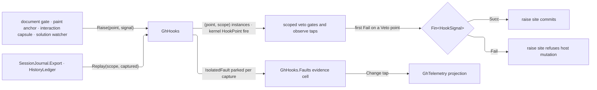

# [RASM_GRASSHOPPER_SHELL_HOOKS]

`GhHooks` composes the kernel signal capsule into the Grasshopper boundary's hook rail: `HookPoint` spans document mutation, solution lifecycle, interaction verdicts, and paint phases under host-ruled `Veto`, `Observe`, or `Replay` rows, `HookSignal` carries payloads, and one per-load-context registry mints a capsule instance per `(point, scope)` composite. Verdicts ride the rail itself — a raise returns `Fin<HookSignal>`, a veto refusal is its `Fail` leg, and every contained subscriber fault parks as `IsolatedFault` on the one evidence cell the telemetry fold drains. `Shell/events.md` `UiEvents` remains the raw host-event gate, never a second hook wire.

Composed settled: the kernel capsule — `HookPoint<TFact>` with its synchronous fire, `HookModality` rows, `HookId` grammar, `IsolatedFault` — arrives from the kernel signal owner; `Op`, `UiEvent`, `GhEvidence`, `HistoryLedger`, and `SessionJournal` are composed upstream owners. Fire is synchronous from any stratum; an effect-rail caller lifts `Raise` at its own composition seam. Per-plugin `HookScope` namespaces keep two apps on one Rhino from colliding, and plugin ALC statics isolate the registry before scoping discriminates.

## [01]-[INDEX]

- [02]-[POINTS]: `HookPoint` — the host-truthful point census with its kernel-modality column.
- [03]-[RAIL]: `HookScope` + `HookSignal` + `GhHooks` — scoped capsule instances, the raise fold, replay, and scope release.

## [02]-[POINTS]

- Owner: `HookPoint` `[SmartEnum<string>]` — the closed `rasm.grasshopper.<domain>.<point>` roster whose `Modality` column carries the kernel `HookModality` row. Veto capability is ruled per row from the host's actual cancellation surface, never wished into existence: the document transaction gate admits refusal pre-commit, the background paint raise carries `CanvasBackgroundPaintEventArgs.OverrideDefaultPainting`, `Window.Closing` and `Application.Terminating` carry `CancelEventArgs`, and interaction verdicts refuse at this boundary's own capsule gate — every other host stream is post-facto and its point is `Observe`.

| [INDEX] | [POINT]                                | [MODALITY] | [HOST_TRUTH]                                                           |
| :-----: | :------------------------------------- | :--------- | :--------------------------------------------------------------------- |
|  [01]   | `rasm.grasshopper.document.mutate`     | `Veto`     | `Document/document.md` undo-sealed transaction gate refuses pre-commit |
|  [02]   | `rasm.grasshopper.document.state`      | `Observe`  | `DocumentStateEventArgs` carries no cancellation surface               |
|  [03]   | `rasm.grasshopper.graph.membership`    | `Observe`  | `ObjectList` events raise after the mutation settled                   |
|  [04]   | `rasm.grasshopper.solution.lifecycle`  | `Observe`  | `SolutionIdEventArgs`/`SolutionEventArgs` carry no cancellation        |
|  [05]   | `rasm.grasshopper.interaction.verdict` | `Veto`     | `Canvas/interaction.md` capsule verdicts refuse at this boundary gate  |
|  [06]   | `rasm.grasshopper.paint.background`    | `Veto`     | `OverrideDefaultPainting` is the host suppression surface              |
|  [07]   | `rasm.grasshopper.paint.layer`         | `Observe`  | `CanvasPaintEventArgs` carries no cancellation                        |
|  [08]   | `rasm.grasshopper.history.replay`      | `Replay`   | `Document/history.md` `HistoryLedger` replays sealed actions           |
|  [09]   | `rasm.grasshopper.window.close`        | `Veto`     | `Window.Closing` carries `CancelEventArgs`; policy is `Eto/windows.md` |
|  [10]   | `rasm.grasshopper.shell.terminate`     | `Veto`     | `Application.Terminating` carries `CancelEventArgs`                    |

- Law: a point's modality is admission — a raise on an `Observe` point folds no vetoes because the capsule holds none, and a veto-capable raise site consults the settled `Fin` verdict before committing its host mutation.
- Packages: Thinktecture.Runtime.Extensions, `Rasm` (kernel signal capsule), `Rasm.Csp` (`Op`), `Shell/events.md` (`UiEvent`), `Shell/telemetry.md` (`GhEvidence`), `Document/document.md`/`Document/history.md`/`Canvas/interaction.md`/`Canvas/paint.md` raise-site owners.
- Growth: a new hook point is one row with its ruled modality; a mis-ruled modality is a defect against the host surface, never a configuration choice.

## [03]-[RAIL]

- Owner: `HookScope` `[ValueObject<string>]` — the per-plugin namespace admitted trimmed and nonblank; subscriber identity is the `(point, scope)` composite instance, so two composing plugins subscribe the same point without collision and a scope's subscribers release together. `HookSignal` `[Union]` — `EventCase` carries a typed `UiEvent` fact, `EvidenceCase` carries a `GhEvidence` receipt, `IntentCase` carries the pre-commit `Op` and owning document identity a veto point judges. `GhHooks` — the per-load-context composition folding kernel `HookPoint<HookSignal>` instances.
- Entry: `Subscribe` discriminates by subscriber shape — a veto gate `Func<HookSignal, Fin<HookSignal>>` reaches the instance's `Veto` (a gate on a non-veto point refuses typed from the capsule), an observe tap `Func<HookSignal, IO<Unit>>` reaches `Observe` — each returning the capsule's detacher; `GhHooks.Raise(HookPoint, HookSignal, Option<HookScope> = default, Op? = null)` → `Fin<HookSignal>` — the one raise fold; `GhHooks.Replay(HookScope, HookPoint, Seq<HookSignal> captured, Op? = null)` → `Fin<Unit>` — re-fires captured signals at one scope's instance on a `Replay` point, aborting on the first veto or firing failure so `Ok` certifies the whole window re-fired; `GhHooks.ReleaseScope(HookScope, Op? = null)` → `Fin<Unit>` — drains every instance of one plugin namespace in a single swap; `GhHooks.Faults` — the shared `Atom<Seq<IsolatedFault>>` evidence cell the telemetry fold subscribes.
- Law: the registry key IS the `(point, scope)` composite — a boundary raise leaves `scope` as `None` and every scope's instance witnesses the host truth, a `Some` raise bounds delivery to one plugin namespace, and `ReleaseScope` realizes the release-together contract at plugin unload; each instance mints on first touch with the roster row's modality and the shared evidence cell, so delivery never crosses into a scope the subscriber did not admit.
- Law: the raise fold fires every resolved instance in first-registration order — each successful instance hands its transformed signal to the next, while the first `Fail` settles the returned verdict and later instances witness the original signal only on that explicit failure-observation path. Subscriber isolation is the capsule's — a throwing or refused tap parks as `IsolatedFault` on the shared cell and delivery continues, so no subscriber sinks the raise site or starves a sibling.
- Law: replay is deterministic capture re-entry — captured signals come from `Shell/journal.md` `SessionJournal.Export` or the `HistoryLedger` action stream, re-fired in captured order at exactly one scope, so a late-mounted panel reads the recent path without a second recording surface; the capsule's own bounded buffer hands a fresh subscriber the recent window on attach.
- Law: subscription state is per-load-context — the registry and evidence cells live in plugin ALC statics, so co-resident plugins hold disjoint rails even before scoping discriminates.
- Boundary: raise sites are the owning pages — the document gate raises `document.mutate` around its transaction, `PaintAnchor` raises the paint points inside its contained callbacks, and the interaction capsules raise `interaction.verdict`; this page owns the rail, never a raise; fire is synchronous, so an effect-rail raise site lifts at its own composition seam (`IO.lift(() => GhHooks.Raise(...))`).
- Packages: LanguageExt.Core (`Fin`, `Seq`, `HashMap`), Thinktecture.Runtime.Extensions, `Rasm` (kernel signal capsule), `Rasm.Csp` (`Op`).
- Growth: zero on the gates — new capability lands as `HookPoint` rows and `HookSignal` cases.

```csharp signature
// --- [RUNTIME_PRELUDE] ----------------------------------------------------------------------
using Rasm.Csp;
using Rasm.Domain;

namespace Rasm.Grasshopper.Shell;

// --- [TYPES] --------------------------------------------------------------------------------
// Modality rows are the kernel HookModality vocabulary; this roster owns only the host-truth ruling.
[SmartEnum<string>]
public sealed partial class HookPoint {
    public static readonly HookPoint DocumentMutate = new(key: "rasm.grasshopper.document.mutate", modality: HookModality.Veto);
    public static readonly HookPoint DocumentState = new(key: "rasm.grasshopper.document.state", modality: HookModality.Observe);
    public static readonly HookPoint GraphMembership = new(key: "rasm.grasshopper.graph.membership", modality: HookModality.Observe);
    public static readonly HookPoint SolutionLifecycle = new(key: "rasm.grasshopper.solution.lifecycle", modality: HookModality.Observe);
    public static readonly HookPoint InteractionVerdict = new(key: "rasm.grasshopper.interaction.verdict", modality: HookModality.Veto);
    public static readonly HookPoint PaintBackground = new(key: "rasm.grasshopper.paint.background", modality: HookModality.Veto);
    public static readonly HookPoint PaintLayer = new(key: "rasm.grasshopper.paint.layer", modality: HookModality.Observe);
    public static readonly HookPoint HistoryReplay = new(key: "rasm.grasshopper.history.replay", modality: HookModality.Replay);
    public static readonly HookPoint WindowClose = new(key: "rasm.grasshopper.window.close", modality: HookModality.Veto);
    public static readonly HookPoint ShellTerminate = new(key: "rasm.grasshopper.shell.terminate", modality: HookModality.Veto);

    public HookModality Modality { get; }
}

[ValueObject<string>]
public readonly partial struct HookScope {
    static partial void ValidateFactoryArguments(ref ValidationError? validationError, ref string value) {
        value = value?.Trim() ?? string.Empty;
        validationError = value.Length > 0 ? null : new ValidationError(message: "HookScope requires a nonblank plugin namespace.");
    }
}

[Union]
public abstract partial record HookSignal {
    private HookSignal() { }
    public sealed record EventCase(UiEvent Fact) : HookSignal;
    public sealed record EvidenceCase(GhEvidence Evidence) : HookSignal;
    public sealed record IntentCase(Op Operation, Option<Guid> DocumentId) : HookSignal;
}

internal readonly record struct HookRegistration(long Rank, HookPoint<HookSignal> Instance);

// --- [OPERATIONS] ---------------------------------------------------------------------------
// Per-load-context composition of the kernel capsule: one HookPoint<HookSignal> instance per
// (point, scope) composite, minted on first touch with the roster row's modality, every instance
// sharing one evidence cell; collectible plugin ALCs isolate both statics per plugin.
[BoundaryAdapter]
public static class GhHooks {
    private static readonly Atom<HashMap<(string Point, HookScope Scope), HookRegistration>> Points =
        Atom(HashMap<(string Point, HookScope Scope), HookRegistration>());
    private static long nextRank;

    public static Atom<Seq<IsolatedFault>> Faults { get; } = Atom(Seq<IsolatedFault>());

    public static Fin<IDisposable> Subscribe(HookScope scope, HookPoint point, Func<HookSignal, Fin<HookSignal>> gate, Op? key = null) =>
        key.OrDefault().Need(gate).Bind(valid => Resolve(point: point, scope: scope).Veto(gate: valid));

    public static Fin<IDisposable> Subscribe(HookScope scope, HookPoint point, Func<HookSignal, IO<Unit>> tap, Op? key = null) =>
        key.OrDefault().Need(tap).Map(valid => Resolve(point: point, scope: scope).Observe(tap: valid));

    public static Fin<HookSignal> Raise(HookPoint point, HookSignal signal, Option<HookScope> scope = default, Op? key = null) {
        Op op = key.OrDefault();
        return from row in op.Need(point)
               from fact in op.Need(signal)
               select Instances(point: row, scope: scope)
                   .Fold(Fin.Succ(fact), (verdict, instance) =>
                       Witness(verdict: verdict, instance: instance, original: fact));
    }

    public static Fin<Unit> Replay(HookScope scope, HookPoint point, Seq<HookSignal> captured, Op? key = null) {
        Op op = key.OrDefault();
        // every Fire verdict rides the returned rail: TraverseM aborts on the first veto or firing failure, so success
        // means the whole captured window re-fired; contained subscriber raises stay parked on the Faults cell inside
        // Fire, and op.Catch keeps the host-raise funnel — isolation preserved, verdicts no longer discarded.
        return from row in op.Need(point)
               from replayable in guard(row.Modality == HookModality.Replay, op.InvalidInput()).ToFin()
               from replayed in op.Catch(body: () => {
                   HookPoint<HookSignal> instance = Resolve(point: row, scope: scope);
                   return captured.TraverseM(fact => instance.Fire(fact: fact)).As().Map(static _ => unit);
               })
               select replayed;
    }

    public static Fin<Unit> ReleaseScope(HookScope scope, Op? key = null) =>
        key.OrDefault().Catch(body: () => Fin.Succ(ignore(Points.Swap(current =>
            current.Filter((pair, _) => pair.Scope != scope)))));

    private static HookPoint<HookSignal> Resolve(HookPoint point, HookScope scope) =>
        Points.Swap(held => held.ContainsKey((point.Key, scope))
                ? held
                : held.Add((point.Key, scope), new HookRegistration(
                    Rank: Interlocked.Increment(location: ref nextRank) - 1L,
                    Instance: new HookPoint<HookSignal>(id: HookId.Create(value: point.Key), modality: point.Modality, faults: Faults))))
            .Find((point.Key, scope))
            .Map(static registration => registration.Instance)
            .IfNone(() => new HookPoint<HookSignal>(id: HookId.Create(value: point.Key), modality: point.Modality, faults: Faults));

    private static Seq<HookPoint<HookSignal>> Instances(HookPoint point, Option<HookScope> scope) =>
        toSeq(Points.Value)
            .Filter(pair => pair.Key.Point == point.Key && scope.Match(Some: only => pair.Key.Scope == only, None: static () => true))
            .OrderBy(static pair => pair.Value.Rank)
            .Map(static pair => pair.Value.Instance)
            .AsIterable()
            .ToSeq();

    private static Fin<HookSignal> Witness(
        Fin<HookSignal> verdict, HookPoint<HookSignal> instance, HookSignal original) => verdict.Match(
        Succ: current => instance.Fire(fact: current),
        Fail: error => {
            ignore(instance.Fire(fact: original));
            return Fin.Fail<HookSignal>(error: error);
        });
}
```



## [04]-[DENSITY_BAR]

| [INDEX] | [CONCERN]           | [OWNER]                     | [RAIL]                                        | [CASES] |
| :-----: | :------------------ | :-------------------------- | :-------------------------------------------- | :-----: |
|  [01]   | point census        | `HookPoint`                 | keyed rows with a ruled kernel-modality column |   10    |
|  [02]   | payload             | `HookSignal`                | closed union → one raise fold                 |    3    |
|  [03]   | scoped registry     | `GhHooks`                   | `Subscribe`/`Raise`/`Replay`/`ReleaseScope`   |    1    |

`Op`, `UiEvent`, `GhEvidence`, `HistoryLedger`, `SessionJournal`, and the kernel signal capsule are composed upstream owners; a new governance capability lands as a point row or a signal case — the rail's four gates never widen.

## [05]-[RESEARCH]

<!-- source-only: research row template:
[TOKEN]-[OPEN|BLOCKED]: <exact question>; <verification route>.
-->

(none)
