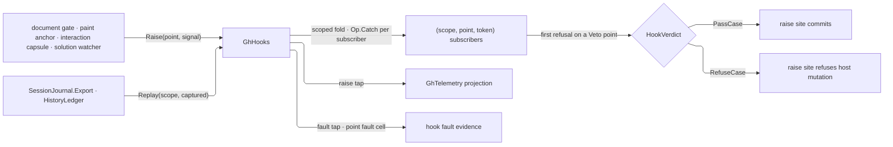

# [RASM_GRASSHOPPER_SHELL_HOOKS]

`GhHooks` is the typed hook rail of the Grasshopper boundary — one `HookPoint` vocabulary spanning document mutation, solution lifecycle, interaction verdicts, and paint phases, each row ruled `Veto`, `Observe`, or `Replay` from the host surface's actual cancellation capability; one `HookSignal` payload union; one `HookVerdict` outcome; and one registry whose subscribers are token-addressed, per-plugin scoped, and fault-isolated. `Shell/events.md` `UiEvents` stays the raw host-event gate underneath — a hook point is a boundary-semantic seam layered over typed facts and receipts, never a second event wire.

Telemetry rides the rail as a tap: the composition root subscribes the raise tap and the fault tap once, projecting hook traffic through `GhTelemetry` with zero emit calls in any raising page. A faulting subscriber records on its point's fault cell, publishes through the fault tap, and never poisons a sibling subscriber; per-plugin `HookScope` namespaces keep two apps on one Rhino from colliding.

## [01]-[INDEX]

- [02]-[POINTS]: `HookModality` + `HookPoint` — the veto/observe/replay vocabulary and the host-truthful point census.
- [03]-[RAIL]: `HookScope` + `HookSignal` + `HookVerdict` + `GhHooks` — scoped subscription, the raise fold, fault isolation, and replay.

## [02]-[POINTS]

- Owner: `HookModality` `[SmartEnum<int>]` — `Veto` (subscribers may refuse), `Observe` (subscribers witness, verdicts ignored), `Replay` (subscribers additionally receive re-raised captured signals).
- Owner: `HookPoint` `[SmartEnum<string>]` — the closed `rasm.grasshopper.<domain>.<point>` roster with its `Modality` column. Veto capability is ruled per row from the host's actual cancellation surface, never wished into existence: the document transaction gate admits refusal pre-commit, the background paint raise carries `CanvasBackgroundPaintEventArgs.OverrideDefaultPainting`, `Window.Closing` and `Application.Terminating` carry `CancelEventArgs`, and interaction verdicts refuse at this boundary's own capsule gate — every other host stream is post-facto and its point is `Observe`.

| [INDEX] | [POINT]                                | [MODALITY] | [HOST_TRUTH]                                                           |
| :-----: | :------------------------------------- | :--------- | :--------------------------------------------------------------------- |
|  [01]   | `rasm.grasshopper.document.mutate`     | `Veto`     | `Document/document.md` undo-sealed transaction gate refuses pre-commit |
|  [02]   | `rasm.grasshopper.document.state`      | `Observe`  | `DocumentStateEventArgs` carries no cancellation surface               |
|  [03]   | `rasm.grasshopper.graph.membership`    | `Observe`  | `ObjectList` events raise after the mutation settled                   |
|  [04]   | `rasm.grasshopper.solution.lifecycle`  | `Observe`  | `SolutionIdEventArgs`/`SolutionEventArgs` carry no cancellation        |
|  [05]   | `rasm.grasshopper.interaction.verdict` | `Veto`     | `Canvas/interaction.md` capsule verdicts refuse at this boundary gate  |
|  [06]   | `rasm.grasshopper.paint.background`    | `Veto`     | `OverrideDefaultPainting` is the host suppression surface              |
|  [07]   | `rasm.grasshopper.paint.layer`         | `Observe`  | `CanvasPaintEventArgs` carries no cancellation                         |
|  [08]   | `rasm.grasshopper.history.replay`      | `Replay`   | `Document/history.md` `HistoryLedger` replays sealed actions           |
|  [09]   | `rasm.grasshopper.window.close`        | `Veto`     | `Window.Closing` carries `CancelEventArgs`; policy is `Eto/windows.md` |
|  [10]   | `rasm.grasshopper.shell.terminate`     | `Veto`     | `Application.Terminating` carries `CancelEventArgs`                    |

- Law: a point's modality is admission — `Raise` on an `Observe` point ignores every subscriber verdict, and a refusal returned there is contained evidence, never control flow; a veto-capable raise site consults the settled verdict before committing its host mutation.
- Packages: Thinktecture.Runtime.Extensions, `Rasm.Csp` (`Op`), `Shell/events.md` (`UiEvent`), `Shell/telemetry.md` (`GhEvidence`), `Document/document.md`/`Document/history.md`/`Canvas/interaction.md`/`Canvas/paint.md` raise-site owners.
- Growth: a new hook point is one row with its ruled modality; a mis-ruled modality is a defect against the host surface, never a configuration choice.

## [03]-[RAIL]

- Owner: `HookScope` `[ValueObject<string>]` — the per-plugin namespace admitted trimmed and nonblank; subscriber identity is the `(scope, point, token)` composite, so two composing plugins subscribe the same point without collision and a scope's subscribers release together.
- Owner: `HookSignal` `[Union]` — `EventCase` carries a typed `UiEvent` fact, `EvidenceCase` carries a `GhEvidence` receipt, `IntentCase` carries the pre-commit `Op` and owning document identity a veto point judges. `HookVerdict` `[Union]` — `PassCase` or `RefuseCase(Error)`.
- Entry: `GhHooks.Subscribe(HookScope scope, HookPoint point, Func<HookSignal, Fin<HookVerdict>> subscriber, Op? key = null)` → `Fin<IDisposable>` — token-addressed detachment; `GhHooks.Raise(HookPoint point, HookSignal signal, Op? key = null)` → `Fin<HookVerdict>` — the one raise fold; `GhHooks.Replay(HookScope scope, HookPoint point, Seq<HookSignal> captured, Op? key = null)` → `Fin<Unit>` — re-raises captured signals to one scope's subscribers on a `Replay` point; `GhHooks.Tap(Action<(HookPoint Point, HookSignal Signal)> observer, Op? key = null)` and `GhHooks.Faults(Action<(HookPoint Point, Error Failure)> observer, Op? key = null)` → `Fin<IDisposable>` — the telemetry-as-tap seams.
- Law: the raise fold runs every subscriber inside `Op.Catch` — a fault records on the point's fault cell, publishes through the fault tap, and the fold continues to the next subscriber; on a `Veto` point the first `RefuseCase` settles the returned verdict while later subscribers still witness the signal, and on `Observe`/`Replay` points the verdict is always `PassCase`.
- Law: replay is deterministic capture re-entry — captured signals come from `Shell/journal.md` `SessionJournal.Export` or the `HistoryLedger` action stream, re-raised in captured order to exactly one scope, so a late-mounted panel reads the recent path without a second recording surface.
- Law: subscription state is per-load-context — the registry cell lives in plugin ALC statics, so co-resident plugins hold disjoint registries even before scoping discriminates.
- Boundary: raise sites are the owning pages — the document gate raises `document.mutate` around its transaction, `PaintAnchor` raises the paint points inside its contained callbacks, and the interaction capsules raise `interaction.verdict`; this page owns the rail, never a raise.
- Packages: LanguageExt.Core (`Fin`, `Seq`, `HashMap`), Thinktecture.Runtime.Extensions, `Rasm.Csp` (`Op`).
- Growth: zero on the gates — new capability lands as `HookPoint` rows and `HookSignal` cases.

```csharp signature
// --- [RUNTIME_PRELUDE] ----------------------------------------------------------------------
using Rasm.Csp;

namespace Rasm.Grasshopper.Shell;

// --- [TYPES] --------------------------------------------------------------------------------
[SmartEnum<int>]
public sealed partial class HookModality {
    public static readonly HookModality Veto = new(key: 0);
    public static readonly HookModality Observe = new(key: 1);
    public static readonly HookModality Replay = new(key: 2);
}

[SmartEnum<string>]
public sealed partial class HookPoint {
    public static readonly HookPoint DocumentMutate = new(key: "rasm.grasshopper.document.mutate", modality: HookModality.Veto);
    public static readonly HookPoint DocumentState = new(key: "rasm.grasshopper.document.state", modality: HookModality.Observe);
    public static readonly HookPoint GraphMembership = new(key: "rasm.grasshopper.graph.membership", modality: HookModality.Observe);
    public static readonly HookPoint SolutionLifecycle = new(key: "rasm.grasshopper.solution.lifecycle", modality: HookModality.Observe);
    public static readonly HookPoint InteractionVerdict = new(key: "rasm.grasshopper.interaction.verdict", modality: HookModality.Veto);
    public static readonly HookPoint PaintBackground = new(key: "rasm.grasshopper.paint.background", modality: HookModality.Veto);
    public static readonly HookPoint PaintLayer = new(key: "rasm.grasshopper.paint.layer", modality: HookModality.Observe);
    public static readonly HookPoint HistoryReplay = new(key: "rasm.grasshopper.history.replay", modality: HookModality.Replay);
    public static readonly HookPoint WindowClose = new(key: "rasm.grasshopper.window.close", modality: HookModality.Veto);
    public static readonly HookPoint ShellTerminate = new(key: "rasm.grasshopper.shell.terminate", modality: HookModality.Veto);

    public HookModality Modality { get; }
}

[ValueObject<string>]
public readonly partial struct HookScope {
    static partial void ValidateFactoryArguments(ref ValidationError? validationError, ref string value) {
        value = value?.Trim() ?? string.Empty;
        validationError = value.Length > 0 ? null : new ValidationError(message: "HookScope requires a nonblank plugin namespace.");
    }
}

[Union]
public abstract partial record HookSignal {
    private HookSignal() { }
    public sealed record EventCase(UiEvent Fact) : HookSignal;
    public sealed record EvidenceCase(GhEvidence Evidence) : HookSignal;
    public sealed record IntentCase(Op Operation, Option<Guid> DocumentId) : HookSignal;
}

[Union]
public abstract partial record HookVerdict {
    private HookVerdict() { }
    public sealed record PassCase : HookVerdict;
    public sealed record RefuseCase(Error Reason) : HookVerdict;
}

// --- [MODELS] -------------------------------------------------------------------------------
internal sealed record HookRow(HookScope Scope, Func<HookSignal, Fin<HookVerdict>> Subscriber);

// --- [OPERATIONS] ---------------------------------------------------------------------------
[BoundaryAdapter]
public static class GhHooks {
    private static readonly Atom<HashMap<(string Point, Guid Token), HookRow>> Rows =
        Atom(HashMap<(string Point, Guid Token), HookRow>());
    private static readonly Atom<HashMap<string, Error>> PointFaults = Atom(HashMap<string, Error>());
    private static readonly Atom<HashMap<Guid, Action<(HookPoint Point, HookSignal Signal)>>> RaiseTaps =
        Atom(HashMap<Guid, Action<(HookPoint Point, HookSignal Signal)>>());
    private static readonly Atom<HashMap<Guid, Action<(HookPoint Point, Error Failure)>>> FaultTaps =
        Atom(HashMap<Guid, Action<(HookPoint Point, Error Failure)>>());

    public static Option<Error> LastFault(HookPoint point) => PointFaults.Value.Find(point.Key);

    public static Fin<IDisposable> Subscribe(
        HookScope scope, HookPoint point, Func<HookSignal, Fin<HookVerdict>> subscriber, Op? key = null) {
        Op op = key.OrDefault();
        return from row in op.Need(point)
               from valid in op.Need(subscriber)
               select Attach(point: row, row: new HookRow(Scope: scope, Subscriber: valid));
    }

    public static Fin<HookVerdict> Raise(HookPoint point, HookSignal signal, Op? key = null) {
        Op op = key.OrDefault();
        return from row in op.Need(point)
               from fact in op.Need(signal)
               from published in op.Catch(body: () => Fin.Succ(Op.Side(action: () =>
                   RaiseTaps.Value.Values.Iter(observer => ignore(op.Catch(body: () =>
                       Fin.Succ(Op.Side(action: () => observer(obj: (row, fact))))))))))
               select Fold(point: row, signal: fact, scope: Option<HookScope>.None, key: op);
    }

    public static Fin<Unit> Replay(HookScope scope, HookPoint point, Seq<HookSignal> captured, Op? key = null) {
        Op op = key.OrDefault();
        return from row in op.Need(point)
               from replayable in guard(row.Modality == HookModality.Replay, op.InvalidInput()).ToFin()
               from replayed in op.Catch(body: () => Fin.Succ(captured.Fold(unit, (state, fact) =>
                   (state, Fold(point: row, signal: fact, scope: Some(scope), key: op)).Item1)))
               select replayed;
    }

    public static Fin<IDisposable> Tap(Action<(HookPoint Point, HookSignal Signal)> observer, Op? key = null) =>
        key.OrDefault().Need(observer).Map(valid => Tapped(taps: RaiseTaps, observer: valid));

    public static Fin<IDisposable> Faults(Action<(HookPoint Point, Error Failure)> observer, Op? key = null) =>
        key.OrDefault().Need(observer).Map(valid => Tapped(taps: FaultTaps, observer: valid));

    private static HookVerdict Fold(HookPoint point, HookSignal signal, Option<HookScope> scope, Op key) =>
        Rows.Value
            .Filter((pair, row) => pair.Point == point.Key && scope.Match(Some: only => row.Scope == only, None: static () => true))
            .Values.Fold((HookVerdict)new HookVerdict.PassCase(), (verdict, row) =>
                key.Catch(body: () => row.Subscriber(arg: signal)).Match(
                    Succ: answered => point.Modality == HookModality.Veto && verdict is HookVerdict.PassCase
                        ? answered
                        : verdict,
                    Fail: error => {
                        ignore(PointFaults.Swap(cells => cells.AddOrUpdate(point.Key, error)));
                        FaultTaps.Value.Values.Iter(observer => ignore(key.Catch(body: () =>
                            Fin.Succ(Op.Side(action: () => observer(obj: (point, error)))))));
                        return verdict;
                    }));

    private static IDisposable Attach(HookPoint point, HookRow row) {
        Guid token = Guid.NewGuid();
        ignore(Rows.Swap(current => current.Add((point.Key, token), row)));
        return new HookHandle(point: point.Key, token: token);
    }

    private static IDisposable Tapped<T>(Atom<HashMap<Guid, Action<T>>> taps, Action<T> observer) {
        Guid token = Guid.NewGuid();
        ignore(taps.Swap(rows => rows.Add(token, observer)));
        return new TapRelease<T>(token: token, taps: taps);
    }

    private sealed class HookHandle(string point, Guid token) : IDisposable {
        private int released;
        public void Dispose() => Op.SideWhen(
            condition: Interlocked.Exchange(location1: ref released, value: 1) == 0,
            action: () => ignore(Rows.Swap(current => current.Remove((point, token)))));
    }

    private sealed class TapRelease<T>(Guid token, Atom<HashMap<Guid, Action<T>>> taps) : IDisposable {
        private int released;
        public void Dispose() => Op.SideWhen(
            condition: Interlocked.Exchange(location1: ref released, value: 1) == 0,
            action: () => ignore(taps.Swap(rows => rows.Remove(token))));
    }
}
```



## [04]-[DENSITY_BAR]

| [INDEX] | [CONCERN]           | [OWNER]                      | [RAIL]                                      | [CASES] |
| :-----: | :------------------ | :--------------------------- | :------------------------------------------ | :-----: |
|  [01]   | point census        | `HookPoint` + `HookModality` | keyed rows with a ruled modality column     |   13    |
|  [02]   | payload and verdict | `HookSignal` + `HookVerdict` | closed unions → one raise fold              |    5    |
|  [03]   | scoped registry     | `GhHooks`                    | `Subscribe`/`Raise`/`Replay`/`Tap`/`Faults` |    1    |

`Op`, `UiEvent`, `GhEvidence`, `HistoryLedger`, and `SessionJournal` are composed upstream owners; a new governance capability lands as a point row or a signal case — the rail's five gates never widen.
