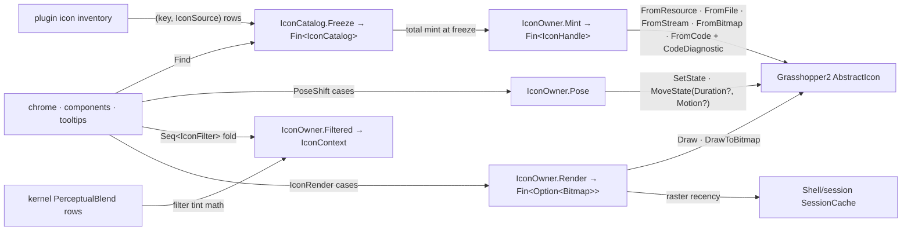

# [RASM_GRASSHOPPER_SHELL_ICONS]

The stateful vector-icon owner of the Grasshopper boundary — one admission gate over the five GH2 icon origins (`AbstractIcon.FromResource`/`FromFile`/`FromStream`/`FromBitmap`, and `AbstractIcon.FromCode` with `CodeDiagnostic` capture), one pose machine over the keyed-state surface (`States`/`FindState`/`SetState`/`MoveState`), one filter-chain fold over `IconContext`, one render gate over `Draw`/`DrawToBitmap`, and one frozen `IconCatalog` so every future plugin declares its icon inventory as rows and never re-derives icon plumbing. The census carried no icon owner at all — icons appeared only as opaque `IIcon` arguments threaded through chrome calls — so this page closes the consumer gap at catalog depth: minting is admission with typed diagnostics, a compile failure is a `Fault` carrying every `CodeDiagnostic`, pose animation carries the host `Duration`/`Motion` vocabulary as boundary data, and rasterization returns owned bitmaps whose recency rides `Shell/session.md`'s `SessionCache`. Perceptual tint math for filter and state colour composes the kernel `PerceptualBlend` rows — an in-folder colour lerp beside them is the second-derivation defect the kernel-unification law forecloses; the host `MoveState` easing stays the host's applicator and is never re-implemented.

## [01]-[INDEX]

- [02]-[ADMISSION]: `IconSource` + `IconDiagnostics` + `IconHandle` + `IconOwner.Mint` — the two-origin admission family with compile-diagnostic evidence.
- [03]-[CATALOG]: `IconCatalog` — the frozen per-plugin icon registry with total mint at freeze.
- [04]-[POSE_AND_FILTER]: `PoseShift` + `IconFilter` — the keyed-pose machine and the draw-context filter chain.
- [05]-[RENDER]: `IconRender` + `IconOwner` — the surface/raster render family and the operator's gate set.

## [02]-[ADMISSION]

- Owner: `IconSource` `[Union]` — the closed origin family over the five decompile-verified factories: `ResourceCase(Type Anchor, Option<string> Name)` — `AbstractIcon.FromResource(Type)` when the name is `None`, `FromResource(string, Type)` when named; `FileCase(string Path)` — `FromFile(string)`; `StreamCase(Stream Source)` — `FromStream(Stream)`; `BitmapCase(Seq<Bitmap> Frames)` — `FromBitmap(params Bitmap[])`, the multi-resolution raster admission; `CodeCase(string Source)` — `FromCode(string, out CodeDiagnostic[] warnings, out CodeDiagnostic[] errors)`, the vector-code compiler whose out-channels arrive warnings-first. `IconDiagnostics` readonly record struct carries both streams as `Seq<CodeDiagnostic>` evidence; `IconHandle` sealed record binds the live `IIcon`, its `IconSource` origin, and its `IconDiagnostics` — the admitted icon travels WITH the evidence that admitted it, so a diagnostic is never re-derived by recompiling.
- Entry: `IconOwner.Mint(IconSource source, Op? key = null)` → `Fin<IconHandle>` — one gate, every origin. A null factory result is `Fault.InvalidResult`; a `FromCode` compile whose error stream is non-empty is `Fault.InvalidResult` carrying each error's `Description` and line/column as detail while the handle path preserves warnings as evidence — errors refuse, warnings ride.
- Law: minting marshals through `EtoDispatch.Run` — icon compilation and resource loading touch host drawing state — and every admission runs under `Op.Catch`, so a throwing host factory is a typed fault with the raising key.
- Law: `CodeDiagnostic` is decompile-verified as `Description`/`Location`/`Length`/`Line`/`Column` with `IsWarning`/`IsError` discriminants — the evidence renders its own detail from these members, and the out-channel ORDER is load-bearing: warnings first, errors second; a consumer binding them reversed inverts the refusal policy.
- Boundary: icon AUTHORING (the vector-code grammar `FromCode` compiles) is host language, not this owner's — the page transports source text and diagnostics; a Rasm-side icon DSL is a different concern on no current page.
- Packages: Grasshopper2 (`AbstractIcon`, `IIcon`, `CodeDiagnostic`), Eto (`Bitmap`), `Rasm.Domain` (`Op`, `Fault`, `ValidityClaim`), `Eto/runtime.md` (`EtoDispatch`).
- Growth: a new host factory is one `IconSource` case with its mint arm breaking loudly.

## [03]-[CATALOG]

- Owner: `IconCatalog` sealed class — the frozen per-plugin icon registry: `Freeze(Seq<(string Key, IconSource Source)> rows, Op? key = null)` mints EVERY row through the `[02]` gate before the catalog exists, so a misspelled resource, a broken vector-code icon, or a duplicate key is a freeze-time `Fault`, never a draw-time blank; `Find(string key)` → `Option<IconHandle>` resolves a row, and `Handles` enumerates the frozen set for chrome that advertises its inventory.
- Law: the catalog is the consumer contract — a plugin declares its icon inventory as rows once and every `Shell/chrome.md` `IIcon` slot, every component `Nomen` pairing, and every tooltip icon resolves through `Find`; a loose `Mint` call at a chrome call site survives only for genuinely dynamic icons (user-authored vector code), because a static icon minted per use re-runs admission the catalog already proved.
- Law: raster products derived from catalog icons key their `SessionCache` entries on the catalog key plus the render plan, so icon-raster recency is one cache law with document-scoped eviction — a per-icon bitmap dictionary beside the cache is the deleted form.
- Packages: LanguageExt.Core (`HashMap`, `Seq`, `Option`), `Rasm.Domain`.
- Growth: a new plugin icon is one row in its catalog's freeze call; the catalog type never changes.

## [04]-[POSE_AND_FILTER]

- Owner: `PoseShift` `[Union]` — the keyed-pose machine's verb family: `JumpCase(double Value, Option<string> State)` (`IIcon.SetState(double, string = null)` — the immediate pose write, `None` addressing the host's default state), `GlideCase(double Value, Option<string> State, Option<Duration> Span, Option<Motion> Curve)` (`IIcon.MoveState(double, string = null, Duration? = null, Motion? = null)` — the host-animated transition, each `None` deferring to the host default). The pose double is the state VALUE per the host contract; the host `Duration`/`Motion` enums cross as case data — they are the host applicator's vocabulary, and the kernel `Easing` rows own any Rasm-side sampling of the same transition (a pre-rendered pose sequence, a synchronized chrome tween), so the two vocabularies meet only where a consumer maps a kernel-planned motion onto the nearest host row.
- Owner: `IconFilter` `[Union]` — the draw-context filter chain over the full derivation surface: `DisabledCase` (`IconContext.WithDisabledFilter`), `GreyscaleCase` (`WithGreyscaleFilter`), `FadingCase(Color Tint, float Strength)` (`WithFadingFilter(Color, float)`), `PaletteCase(IconPalette Palette)` (`WithPalette`), `CustomCase(Func<Color, Color> Map)` (`WithFilter` — the open per-colour projection every bespoke tint composes). A chain is a `Seq<IconFilter>` folded left onto a seed context — filter order is sequence order, stated by the data.
- Law: `IIcon.States` enumerates `IconState` rows and `FindState(string)` resolves one or null — a named pose verb gates through `FindState` so an unknown state key is `Fault.InvalidResult` before the host sees it, and a `None` state skips the gate because the default state always exists.
- Law: a `FadingCase` tint that blends two theme colours computes through `PerceptualBlend.Mix` on `Unicolour` values with the `Eto.Drawing.Color` projection at this boundary — the kernel row owns the interpolation space and an HSL/RGB lerp beside it is the deleted form.
- Packages: Grasshopper2 (`IIcon`, `IconState`, `IconContext`, `IconPalette`, `Duration`, `Motion`), Eto (`Color`), `Rasm.Parametric` (`PerceptualBlend`), `Rasm.Domain`.
- Growth: a new pose verb is one `PoseShift` case; a new host filter is one `IconFilter` case with the fold arm breaking loudly.

## [05]-[RENDER]

- Owner: `IconRender` `[Union]` — the render family: `SurfaceCase(IconContext Target)` (`IIcon.Draw(IconContext)` — the in-window draw through a filtered context) and `RasterCase(Size Extent, int Padding, Color Backdrop)` (`IIcon.DrawToBitmap(Size size, int padding, Color background)` → `Bitmap` — the owned-bitmap projection; the backdrop informs contrast decisions while the bitmap itself renders on transparency, per the host contract). `IconOwner` is the operator: `Mint` (`[02]`), `Pose(IIcon icon, PoseShift shift, Op?)` → `Fin<Unit>`, `Poses(IIcon icon, Op?)` → `Fin<Seq<IconState>>` (the keyed-state inventory), `Filtered(IconContext seed, Seq<IconFilter> chain)` → `IconContext`, and `Render(IIcon icon, IconRender plan, Op?)` → `Fin<Option<Bitmap>>` — `Some` for the raster case, `None` for the surface case, one gate for both modalities.
- Law: every render marshals through `EtoDispatch.Run` and runs under `Op.Catch`; the raster bitmap is OWNED by the caller — the gate returns the value and the caller's disposal window bounds it, with cached rasters living inside `SessionCache` payloads keyed per `[03]`.
- Law: an `IconContext` for an off-window surface mints through the verified `IconContext(Context, RectangleF, Color)` constructor at the consumer; this gate renders through whatever context arrives and never opens a draw window of its own — the paint window is `Canvas/paint.md`'s.
- Packages: Grasshopper2 (`IIcon`, `IconContext`), Eto (`Size`, `Color`, `Bitmap`), `Rasm.Domain`, `Eto/runtime.md` (`EtoDispatch`).
- Growth: a new render modality is one `IconRender` case; the gate never widens.

```csharp signature
// --- [RUNTIME_PRELUDE] ----------------------------------------------------------------------
using Rasm.Csp;
using Rasm.Grasshopper.Eto;

namespace Rasm.Grasshopper.Shell;

// --- [TYPES] --------------------------------------------------------------------------------
[Union]
public abstract partial record IconSource {
    private IconSource() { }
    public sealed record ResourceCase(Type Anchor, Option<string> Name) : IconSource;
    public sealed record FileCase(string Path) : IconSource;
    public sealed record StreamCase(Stream Source) : IconSource;
    public sealed record BitmapCase(Seq<Bitmap> Frames) : IconSource;
    public sealed record CodeCase(string Source) : IconSource;
}

[Union]
public abstract partial record PoseShift {
    private PoseShift() { }
    public sealed record JumpCase(double Value, Option<string> State) : PoseShift;
    public sealed record GlideCase(double Value, Option<string> State, Option<Duration> Span, Option<Motion> Curve) : PoseShift;
}

[Union]
public abstract partial record IconFilter {
    private IconFilter() { }
    public sealed record DisabledCase : IconFilter;
    public sealed record GreyscaleCase : IconFilter;
    public sealed record FadingCase(Color Tint, float Strength) : IconFilter;
    public sealed record PaletteCase(IconPalette Palette) : IconFilter;
    public sealed record CustomCase(Func<Color, Color> Map) : IconFilter;
}

[Union]
public abstract partial record IconRender {
    private IconRender() { }
    public sealed record SurfaceCase(IconContext Target) : IconRender;
    public sealed record RasterCase(Size Extent, int Padding, Color Backdrop) : IconRender;
}

// --- [MODELS] -------------------------------------------------------------------------------
[BoundaryAdapter, StructLayout(LayoutKind.Auto)]
public readonly record struct IconDiagnostics(Seq<CodeDiagnostic> Errors, Seq<CodeDiagnostic> Warnings) : IValidityEvidence {
    public bool IsValid => ValidityClaim.All(
        ValidityClaim.Of(holds: Errors.IsEmpty));
    public static readonly IconDiagnostics Clean = new(Errors: Seq<CodeDiagnostic>(), Warnings: Seq<CodeDiagnostic>());
}

public sealed record IconHandle(IIcon Icon, IconSource Origin, IconDiagnostics Notes);

// --- [SERVICES] -----------------------------------------------------------------------------
public sealed class IconCatalog {
    private readonly HashMap<string, IconHandle> rows;
    private IconCatalog(HashMap<string, IconHandle> rows) => this.rows = rows;

    public Seq<(string Key, IconHandle Handle)> Handles => toSeq(rows.AsIterable().Map(static pair => (pair.Key, pair.Value)));

    public static Fin<IconCatalog> Freeze(Seq<(string Key, IconSource Source)> rows, Op? key = null) {
        Op op = key.OrDefault();
        return from nonEmpty in guard(!rows.IsEmpty, op.InvalidInput()).ToFin()
               from unique in guard(rows.Map(static row => row.Key).Distinct().Count == rows.Count, op.InvalidInput()).ToFin()
               from minted in rows.TraverseM(row => IconOwner.Mint(source: row.Source, key: op).Map(handle => (row.Key, Handle: handle))).As()
               select new IconCatalog(rows: toHashMap(minted.Map(static row => (row.Key, row.Handle))));
    }

    public Option<IconHandle> Find(string key) => rows.Find(key);
}

// --- [OPERATIONS] ---------------------------------------------------------------------------
[BoundaryAdapter]
public static class IconOwner {
    public static Fin<IconHandle> Mint(IconSource source, Op? key = null) {
        Op op = key.OrDefault();
        return op.Need(source).Bind(valid => EtoDispatch.Run(body: () => valid.Switch(
            state: (Origin: valid, Key: op),
            resourceCase: static (s, c) => Clean(key: s.Key, origin: s.Origin, mint: () => c.Name.MatchUnsafe(
                Some: name => AbstractIcon.FromResource(name, c.Anchor),
                None: () => AbstractIcon.FromResource(c.Anchor))),
            fileCase: static (s, c) => Clean(key: s.Key, origin: s.Origin, mint: () => AbstractIcon.FromFile(c.Path)),
            streamCase: static (s, c) => Clean(key: s.Key, origin: s.Origin, mint: () => AbstractIcon.FromStream(c.Source)),
            bitmapCase: static (s, c) => Clean(key: s.Key, origin: s.Origin, mint: () => AbstractIcon.FromBitmap([.. c.Frames])),
            codeCase: static (s, c) => s.Key.Catch(body: () => {
                IIcon? compiled = AbstractIcon.FromCode(c.Source, out CodeDiagnostic[] warnings, out CodeDiagnostic[] errors);
                IconDiagnostics notes = new(Errors: toSeq(errors), Warnings: toSeq(warnings));
                return notes.IsValid && compiled is not null
                    ? Fin.Succ(new IconHandle(Icon: compiled, Origin: s.Origin, Notes: notes))
                    : Fin.Fail<IconHandle>(s.Key.InvalidResult(detail: string.Join(separator: "; ", values: notes.Errors.Map(static row => $"{row.Description} ({row.Line},{row.Column})"))));
            })), key: op));
    }

    public static Fin<Unit> Pose(IIcon icon, PoseShift shift, Op? key = null) {
        Op op = key.OrDefault();
        return from target in op.Need(icon)
               from valid in op.Need(shift)
               from settled in EtoDispatch.Run(body: () => valid.Switch(
                   state: (Icon: target, Key: op),
                   jumpCase: static (s, c) => Gate(icon: s.Icon, state: c.State, key: s.Key)
                       .Bind(_ => s.Key.Catch(body: () => Fin.Succ(Op.Side(action: () => s.Icon.SetState(c.Value, Named(state: c.State)))))),
                   glideCase: static (s, c) => Gate(icon: s.Icon, state: c.State, key: s.Key)
                       .Bind(_ => s.Key.Catch(body: () => Fin.Succ(Op.Side(action: () => s.Icon.MoveState(
                           c.Value, Named(state: c.State),
                           c.Span.MatchUnsafe(Some: static span => (Duration?)span, None: static () => null),
                           c.Curve.MatchUnsafe(Some: static curve => (Motion?)curve, None: static () => null))))))), key: op)
               select settled;
    }

    public static Fin<Seq<IconState>> Poses(IIcon icon, Op? key = null) {
        Op op = key.OrDefault();
        return op.Need(icon).Bind(target =>
            EtoDispatch.Run(body: () => op.Catch(body: () => Fin.Succ(toSeq(target.States))), key: op));
    }

    public static IconContext Filtered(IconContext seed, Seq<IconFilter> chain) =>
        chain.Fold(seed, static (context, filter) => filter.Switch(
            disabledCase: _ => context.WithDisabledFilter(),
            greyscaleCase: _ => context.WithGreyscaleFilter(),
            fadingCase: c => context.WithFadingFilter(c.Tint, c.Strength),
            paletteCase: c => context.WithPalette(c.Palette),
            customCase: c => context.WithFilter(c.Map)));

    public static Fin<Option<Bitmap>> Render(IIcon icon, IconRender plan, Op? key = null) {
        Op op = key.OrDefault();
        return from target in op.Need(icon)
               from valid in op.Need(plan)
               from output in EtoDispatch.Run(body: () => valid.Switch(
                   state: (Icon: target, Key: op),
                   surfaceCase: static (s, c) => s.Key.Catch(body: () => Fin.Succ(Op.Side(action: () => s.Icon.Draw(c.Target))))
                       .Map(static _ => Option<Bitmap>.None),
                   rasterCase: static (s, c) => s.Key.Catch(body: () =>
                       Optional(s.Icon.DrawToBitmap(c.Extent, c.Padding, c.Backdrop)).ToFin(s.Key.InvalidResult()))
                       .Map(Some)), key: op)
               select output;
    }

    private static Fin<IconHandle> Clean(Op key, IconSource origin, Func<IIcon?> mint) =>
        key.Catch(body: () => Optional(mint()).ToFin(key.InvalidResult()))
            .Map(icon => new IconHandle(Icon: icon, Origin: origin, Notes: IconDiagnostics.Clean));

    private static string? Named(Option<string> state) =>
        state.MatchUnsafe(Some: static name => name, None: static () => null);

    private static Fin<Unit> Gate(IIcon icon, Option<string> state, Op key) =>
        state.Match(
            Some: name => key.Catch(body: () => Optional(icon.FindState(name)).ToFin(key.InvalidResult(detail: name)).Map(static _ => unit)),
            None: () => Fin.Succ(unit));
}
```



## [06]-[DENSITY_BAR]

| [INDEX] | [CONCERN]         | [OWNER]                                | [KIND]                                          | [RAIL]                              | [CASES] |
| :-----: | :---------------- | :-------------------------------------- | :--------------------------------------------------- | :------------------------------------ | :-----: |
|  [01]   | icon admission    | `IconSource` + `IconDiagnostics` + `IconHandle` | origin `[Union]` + compile evidence + bound handle | `Mint → Fin<IconHandle>`            |    5    |
|  [02]   | plugin inventory  | `IconCatalog`                          | frozen registry, total mint, unique keys        | `Freeze → Fin<IconCatalog>`         |    1    |
|  [03]   | pose machine      | `PoseShift`                            | verb `[Union]` over the keyed-state surface     | `Pose → Fin<Unit>`                  |    2    |
|  [04]   | filter chain      | `IconFilter`                           | closed `[Union]` folded onto `IconContext`      | `Filtered → IconContext`            |    5    |
|  [05]   | render            | `IconRender`                           | modality `[Union]`, one gate                    | `Render → Fin<Option<Bitmap>>`      |    2    |

`EtoDispatch`, `Op`, `Fault`, `ValidityClaim`, `SessionCache`, and the kernel `PerceptualBlend` rows are composed upstream owners; `Duration` and `Motion` cross as host boundary data. Every composed host member — the five `AbstractIcon` factories, the `CodeDiagnostic` surface, `IconState`, the pose verbs with their optional defaults, the `IconContext` derivation set, and `DrawToBitmap`'s `(Size, int padding, Color)` → `Bitmap` shape — is decompile-verified.
