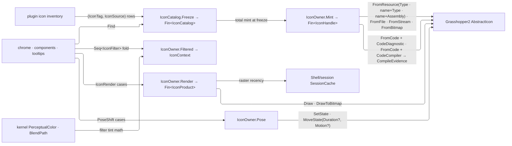

# [RASM_GRASSHOPPER_SHELL_ICONS]

`IconOwner` is the stateful vector-icon owner of the Grasshopper boundary — one admission gate over every GH2 icon origin (the three `AbstractIcon.FromResource` anchors, `FromFile`/`FromStream`/`FromBitmap`, and both diagnostic-bearing `FromCode` channels), one pose machine over the keyed-state surface (`States`/`FindState`/`SetState`/`MoveState`), one filter-chain fold over `IconContext`, one render gate over `Draw`/`DrawToBitmap`, and one frozen `IconCatalog` so every plugin declares its icon inventory as rows and never re-derives icon plumbing.

Minting is admission with typed diagnostics: a compile failure is a `Fault` carrying every `CodeDiagnostic`, a compiler-channel mint detaches the host `CodeCompiler` census as `CompileEvidence`, pose animation carries the host `Duration`/`Motion` vocabulary, and rasterization returns owned bitmaps whose recency rides `Shell/session.md`'s `SessionCache`.

Perceptual tint math for filter and state colour composes the kernel `PerceptualColor`/`BlendPath` owner — an in-folder colour lerp beside it is the second-derivation defect the kernel-unification law forecloses; the host `MoveState` easing stays the host's applicator and is never re-implemented.

## [01]-[INDEX]

- [02]-[ADMISSION]: `IconSource` + `ResourceAnchor` + `IconDiagnostics` + `CompileEvidence` + `IconHandle` + `IconOwner.Mint` — the origin family with compile-diagnostic and compiler-census evidence.
- [03]-[CATALOG]: `IconTag` + `IconCatalog` — the icon identity and the frozen per-plugin registry with total mint at freeze.
- [04]-[POSE_AND_FILTER]: `PoseShift` + `IconFilter` — the keyed-pose machine and the draw-context filter chain.
- [05]-[RENDER]: `IconRender` + `IconProduct` + `IconOwner` — the render-plan family, the leased product family, and the operator's gate set.

## [02]-[ADMISSION]

- Owner: `IconSource` `[Union]` — the closed origin family over every host factory: `ResourceCase(ResourceAnchor Anchor)`; `FileCase(string Path)` — `FromFile(string)`; `StreamCase(Stream Source)` — `FromStream(Stream)`; `BitmapCase(Seq<Bitmap> Frames)` — `FromBitmap(params Bitmap[])`, the multi-resolution raster admission; `CodeCase(string Source)` — `FromCode(string, out CodeDiagnostic[] warnings, out CodeDiagnostic[] errors)`, the vector-code compiler whose out-channels arrive warnings-first; `CompilerCase(string Source)` — `FromCode(string, out CodeCompiler)`, the same compile through the channel that hands back the compiler itself.
- Owner: `ResourceAnchor` `[Union]` — three cases for three resource lookups, so the (anchor × name) product carries no inadmissible cell: `TypeCase(Type Anchor)` — `FromResource(Type)`, the anchor type's own assembly under the conventional name; `NamedTypeCase(string Name, Type Anchor)` — `FromResource(string, Type)`; `AssemblyCase(string Name, Assembly Source)` — `FromResource(string, Assembly)`, the ONLY path for a plugin whose icons ship in a `Plugin.SatelliteAssemblies` member, because the type-anchored overloads key off the anchor's own assembly. One anchor case carrying `Option<string> Name` is the deleted form: it spells an assembly-without-name cell the host has no overload for.
- Owner: `IconDiagnostics` readonly record struct carries both `CodeDiagnostic` streams as `Seq` evidence; `CompileEvidence` readonly record struct detaches the `CodeCompiler` census — `References` (`ReferenceCount`), the four compile-policy flags (`GenerateInMemory`/`AllowUnsafe`/`AllowOverflow`/`AllowConcurrent`), `IncludeDebugData`, the `GetCachedSemanticModels` count, and the `GetCachedAssembly` full name; `IconHandle` sealed record binds the live `IIcon`, its host `IconType` kind, its `IconSource` origin, its `IconDiagnostics`, and its `Option<CompileEvidence>` — the admitted icon travels WITH the evidence that admitted it, so a diagnostic is never re-derived by recompiling and a consumer discriminating pixel from vector from compiled reads the host's own `Type` off the handle.
- Law: an `IIcon` carries no disposal contract — the host interface declares `Type`, `States`, `FindState`, `SetState`, `MoveState`, `Draw`, and `DrawToBitmap` and nothing else — so the handle holds it as a plain reference and neither the handle nor the catalog is `IDisposable`; the leased resources on this page are the RENDERED products, never the icons. Wrapping a non-disposable host value in `Lease<T>` is unconstructible, and an `IDisposable` catalog with nothing to release advertises custody it does not hold.
- Entry: `IconOwner.Mint(IconSource source, Op? key = null)` → `Fin<IconHandle>` — one gate, every origin. `Fault.InvalidResult` answers a null factory result; a `FromCode` compile whose error stream is non-empty is `Fault.InvalidResult` carrying each error's `Description` and line/column as detail while the handle path preserves warnings as evidence — errors refuse, warnings ride.
- Law: minting marshals through `EtoDispatch.Run` — icon compilation and resource loading touch host drawing state — and every admission runs under `Op.Catch`, so a throwing host factory is a typed fault with the raising key.
- Law: `CodeDiagnostic` carries `Description`/`Location`/`Length`/`Line`/`Column` with `IsWarning`/`IsError` discriminants — the evidence renders its own detail from these members, and the out-channel ORDER is load-bearing: warnings first, errors second; a consumer binding them reversed inverts the refusal policy.
- Law: the `CodeCompiler` never leaves the gate — `CompilerCase` reads `GetCachedWarnings`/`GetCachedErrors` for the same `IconDiagnostics` the two-out-channel arm builds and projects the rest as `CompileEvidence` inside the dispatch window, so a caller diagnosing a missing reference reads a value while the host compiler, its `SemanticModel` set, and its cached assembly die with the mint. `AddReferenceAssembly` and the `CompileCSharpCode` family stay unreachable: this owner admits icons, never arbitrary assemblies.
- Boundary: icon AUTHORING (the vector-code grammar `FromCode` compiles) is host language, not this owner's — the page transports source text and diagnostics; a Rasm-side icon DSL is a different concern on no current page.
- Packages: Grasshopper2 (`AbstractIcon`, `IIcon`, `IconType`, `CodeDiagnostic`, `CodeCompiler`), Eto (`Bitmap`), `System.Reflection` (`Assembly`), Thinktecture.Runtime.Extensions, `Rasm.Domain` (`Op`, `Fault`, `ValidityClaim`), `Eto/runtime.md` (`EtoDispatch`).
- Growth: a new host factory is one `IconSource` case, a new resource lookup one `ResourceAnchor` case, each with its mint arm breaking loudly.

## [03]-[CATALOG]

- Owner: `IconTag` `[ValueObject<string>]` — the icon identity: trimmed, non-blank, admitted once. Every sibling identity in this folder is an owner (`FieldTag`, `CommandTag`, `StyleTag`, `CacheSlot`, `HookScope`) and a raw `string` key beside them is the deleted form, because an unadmitted key reaches the catalog map, the `SessionCache` slot text, and chrome call sites blank or padded.
- Owner: `IconCatalog` sealed class — the frozen per-plugin icon registry: `Freeze(Seq<(IconTag Key, IconSource Source)> rows, Op? key = null)` mints EVERY row through the `[02]` gate before the catalog exists, so a misspelled resource, a broken vector-code icon, or a duplicate key is a freeze-time `Fault`, never a draw-time blank; `Find(IconTag key)` → `Option<IconHandle>` resolves a row, and `Handles` enumerates the frozen set for chrome that advertises its inventory.
- Law: the catalog is the consumer contract — a plugin declares its icon inventory as rows once and every `Shell/chrome.md` `IIcon` slot, every component `Nomen` pairing, and every tooltip icon resolves through `Find`; a loose `Mint` call at a chrome call site survives only for genuinely dynamic icons (user-authored vector code), because a static icon minted per use re-runs admission the catalog already proved.
- Law: raster products derived from catalog icons key their `SessionCache` entries on the catalog `IconTag` with the render plan, so icon-raster recency is one cache law with document-scoped eviction — a per-icon bitmap dictionary beside the cache is the deleted form.
- Packages: LanguageExt.Core (`HashMap`, `Seq`, `Option`), Thinktecture.Runtime.Extensions, `Rasm.Domain`.
- Growth: a new plugin icon is one row in its catalog's freeze call; the catalog type never changes.

## [04]-[POSE_AND_FILTER]

- Owner: `PoseShift` `[Union]` — the keyed-pose machine's verb family: `JumpCase(double Value, Option<string> State)` (`IIcon.SetState(double, string = null)` — the immediate pose write, `None` addressing the host's default state), `GlideCase(double Value, Option<string> State, Option<Duration> Span, Option<Motion> Curve)` (`IIcon.MoveState(double, string = null, Duration? = null, Motion? = null)` — the host-animated transition, each `None` deferring to the host default). Its pose double is the state VALUE per the host contract; the host `Duration`/`Motion` enums cross as case data — they are the host applicator's vocabulary, and the kernel `Easing` rows own any Rasm-side sampling of the same transition (a pre-rendered pose sequence, a synchronized chrome tween), so the two vocabularies meet only where a consumer maps a kernel-planned motion onto the nearest host row.
- Owner: `IconFilter` `[Union]` — the draw-context filter chain over the full derivation surface: `DisabledCase` (`IconContext.WithDisabledFilter`), `GreyscaleCase` (`WithGreyscaleFilter`), `FadingCase(Color Tint, float Strength)` (`WithFadingFilter(Color, float)`), `PaletteCase(IconPalette Palette)` (`WithPalette`), `CustomCase(Func<Color, Color> Map)` (`WithFilter` — the open per-colour projection every bespoke tint composes). One `Seq<IconFilter>` chain folds left onto a seed context — filter order is sequence order, stated by the data.
- Law: `IIcon.States` enumerates `IconState` rows and `FindState(string)` resolves one or null — a named pose verb gates through `FindState` so an unknown state key is `Fault.InvalidResult` before the host sees it, and a `None` state skips the gate because the default state always exists.
- Law: a `FadingCase` tint that blends two theme colours computes through the kernel `PerceptualColor.Mix` over a `BlendPath` row with the `Eto.Drawing.Color` projection at this boundary — the kernel row owns the interpolation space and an HSL/RGB lerp beside it is the deleted form.
- Packages: Grasshopper2 (`IIcon`, `IconState`, `IconContext`, `IconPalette`, `Duration`, `Motion`), Eto (`Color`), `Rasm.Numerics` (`PerceptualColor`, `BlendPath`), `Rasm.Domain`.
- Growth: a new pose verb is one `PoseShift` case; a new host filter is one `IconFilter` case with the fold arm breaking loudly.

## [05]-[RENDER]

- Owner: `IconRender` `[Union]` — the render-plan family: `SurfaceCase(IconContext Target)` (`IIcon.Draw(IconContext)` — the in-window draw through a filtered context) and `RasterCase(Size Extent, int Padding, Color Backdrop)` (`IIcon.DrawToBitmap(Size size, int padding, Color background)` → `Bitmap` — the owned-bitmap projection; the backdrop informs contrast decisions while the bitmap itself renders on transparency, per the host contract). `IconProduct` `[Union]` is the render RESULT: `DrawnCase` for the surface modality, which produces no owned value, and `RasterCase(Lease<Bitmap> Frame)` carrying the host bitmap on the kernel resource rail, matching `Eto/runtime.md` `TransferPayload.PictureCase(Lease<Image>)`. `IconOwner` is the operator: `Mint` (`[02]`), `Pose(IIcon icon, PoseShift shift, Op?)` → `Fin<Unit>`, `Poses(IIcon icon, Op?)` → `Fin<Seq<IconState>>` (the keyed-state inventory), `Filtered(IconContext seed, Seq<IconFilter> chain)` → `IconContext`, and `Render(IIcon icon, IconRender plan, Op?)` → `Fin<IconProduct>` — one gate for both modalities.
- Law: every render marshals through `EtoDispatch.Run` and runs under `Op.Catch`; the raster bitmap crosses as `Lease<Bitmap>.Owned`, so the caller's disposal window bounds the host resource and the surface modality carries no product to release — a bare `Option<Bitmap>` return spells the absent modality as an absent value and hands out a live host bitmap with no release contract. Cached rasters live inside `SessionCache` payloads keyed per `[03]`.
- Law: an `IconContext` for an off-window surface mints through the host `IconContext(Context, RectangleF, Color)` constructor at the consumer; this gate renders through whatever context arrives and never opens a draw window of its own — the paint window is `Canvas/paint.md`'s.
- Packages: Grasshopper2 (`IIcon`, `IconContext`), Eto (`Size`, `Color`, `Bitmap`), `Rasm.Domain` (`Op`, `Fault`, `Lease<T>`), `Eto/runtime.md` (`EtoDispatch`).
- Growth: a new render modality is one `IconRender` plan case with its `IconProduct` result case; the gate never widens.

```csharp signature
// --- [RUNTIME_PRELUDE] ----------------------------------------------------------------------
using System.Reflection;
using Rasm.Csp;
using Rasm.Grasshopper.Eto;

namespace Rasm.Grasshopper.Shell;

// --- [TYPES] --------------------------------------------------------------------------------
[ValueObject<string>]
public readonly partial struct IconTag {
    static partial void ValidateFactoryArguments(ref ValidationError? validationError, ref string value) {
        value = value?.Trim() ?? string.Empty;
        validationError = value.Length > 0 ? null : new ValidationError(message: "IconTag requires a non-blank identity.");
    }
}

[Union]
public abstract partial record ResourceAnchor {
    private ResourceAnchor() { }
    public sealed record TypeCase(Type Anchor) : ResourceAnchor;
    public sealed record NamedTypeCase(string Name, Type Anchor) : ResourceAnchor;
    public sealed record AssemblyCase(string Name, Assembly Source) : ResourceAnchor;

    internal IIcon? Resolve() => Switch(
        typeCase: static c => AbstractIcon.FromResource(c.Anchor),
        namedTypeCase: static c => AbstractIcon.FromResource(c.Name, c.Anchor),
        assemblyCase: static c => AbstractIcon.FromResource(c.Name, c.Source));
}

[Union]
public abstract partial record IconSource {
    private IconSource() { }
    public sealed record ResourceCase(ResourceAnchor Anchor) : IconSource;
    public sealed record FileCase(string Path) : IconSource;
    public sealed record StreamCase(Stream Source) : IconSource;
    public sealed record BitmapCase(Seq<Bitmap> Frames) : IconSource;
    public sealed record CodeCase(string Source) : IconSource;
    public sealed record CompilerCase(string Source) : IconSource;
}

[Union]
public abstract partial record PoseShift {
    private PoseShift() { }
    public sealed record JumpCase(double Value, Option<string> State) : PoseShift;
    public sealed record GlideCase(double Value, Option<string> State, Option<Duration> Span, Option<Motion> Curve) : PoseShift;
}

[Union]
public abstract partial record IconFilter {
    private IconFilter() { }
    public sealed record DisabledCase : IconFilter;
    public sealed record GreyscaleCase : IconFilter;
    public sealed record FadingCase(Color Tint, float Strength) : IconFilter;
    public sealed record PaletteCase(IconPalette Palette) : IconFilter;
    public sealed record CustomCase(Func<Color, Color> Map) : IconFilter;
}

[Union]
public abstract partial record IconRender {
    private IconRender() { }
    public sealed record SurfaceCase(IconContext Target) : IconRender;
    public sealed record RasterCase(Size Extent, int Padding, Color Backdrop) : IconRender;
}

// The render RESULT is a family, not an Option: `None` for the surface case reads as an absent bitmap where it
// actually means "this modality produces no owned product", and the raster arm's `Bitmap` is a live host resource
// that must cross on the kernel lease rail like every other disposable this boundary hands out.
[Union]
public abstract partial record IconProduct {
    private IconProduct() { }
    public sealed record DrawnCase : IconProduct;
    public sealed record RasterCase(Lease<Bitmap> Frame) : IconProduct;
}

// --- [MODELS] -------------------------------------------------------------------------------
[BoundaryAdapter, StructLayout(LayoutKind.Auto)]
public readonly record struct IconDiagnostics(Seq<CodeDiagnostic> Errors, Seq<CodeDiagnostic> Warnings) : IValidityEvidence {
    public bool IsValid => ValidityClaim.All(
        ValidityClaim.Of(holds: Errors.IsEmpty));
    public static readonly IconDiagnostics Clean = new(Errors: Seq<CodeDiagnostic>(), Warnings: Seq<CodeDiagnostic>());
}

[BoundaryAdapter, StructLayout(LayoutKind.Auto)]
public readonly record struct CompileEvidence(
    int References,
    bool InMemory,
    bool Unsafe,
    bool Overflow,
    bool Concurrent,
    bool DebugData,
    int SemanticModels,
    Option<string> Assembly) {
    internal static CompileEvidence Of(CodeCompiler compiler) => new(
        References: compiler.ReferenceCount,
        InMemory: compiler.GenerateInMemory,
        Unsafe: compiler.AllowUnsafe,
        Overflow: compiler.AllowOverflow,
        Concurrent: compiler.AllowConcurrent,
        DebugData: compiler.IncludeDebugData,
        SemanticModels: compiler.GetCachedSemanticModels.Length,
        Assembly: Optional(compiler.GetCachedAssembly).Bind(static loaded => Optional(loaded.FullName)));
}

// `IIcon.Type` is the host's own kind discriminant and rides the handle beside the evidence that admitted it, so a
// consumer choosing a raster path for a pixel icon or refusing a compiled one reads a value instead of re-probing.
public sealed record IconHandle(
    IIcon Icon,
    IconType Kind,
    IconSource Origin,
    IconDiagnostics Notes,
    Option<CompileEvidence> Compile);

// --- [SERVICES] -----------------------------------------------------------------------------
public sealed class IconCatalog {
    private readonly HashMap<IconTag, IconHandle> rows;
    private IconCatalog(HashMap<IconTag, IconHandle> rows) => this.rows = rows;

    public Seq<(IconTag Key, IconHandle Handle)> Handles => toSeq(rows.AsIterable().Map(static pair => (pair.Key, pair.Value)));

    public static Fin<IconCatalog> Freeze(Seq<(IconTag Key, IconSource Source)> rows, Op? key = null) {
        Op op = key.OrDefault();
        return from nonEmpty in guard(!rows.IsEmpty, op.InvalidInput()).ToFin()
               from unique in guard(rows.Map(static row => row.Key).Distinct().Count == rows.Count, op.InvalidInput()).ToFin()
               from minted in rows.TraverseM(row => IconOwner.Mint(source: row.Source, key: op).Map(handle => (row.Key, Handle: handle))).As()
               select new IconCatalog(rows: toHashMap(minted.Map(static row => (row.Key, row.Handle))));
    }

    public Option<IconHandle> Find(IconTag key) => rows.Find(key);
}

// --- [OPERATIONS] ---------------------------------------------------------------------------
[BoundaryAdapter]
public static class IconOwner {
    public static Fin<IconHandle> Mint(IconSource source, Op? key = null) {
        Op op = key.OrDefault();
        return op.Need(source).Bind(valid => EtoDispatch.Run(body: () => valid.Switch(
            state: (Origin: valid, Key: op),
            resourceCase: static (s, c) => Clean(key: s.Key, origin: s.Origin, mint: c.Anchor.Resolve),
            fileCase: static (s, c) => Clean(key: s.Key, origin: s.Origin, mint: () => AbstractIcon.FromFile(c.Path)),
            streamCase: static (s, c) => Clean(key: s.Key, origin: s.Origin, mint: () => AbstractIcon.FromStream(c.Source)),
            bitmapCase: static (s, c) => Clean(key: s.Key, origin: s.Origin, mint: () => AbstractIcon.FromBitmap([.. c.Frames])),
            codeCase: static (s, c) => s.Key.Catch(body: () => {
                IIcon? compiled = AbstractIcon.FromCode(c.Source, out CodeDiagnostic[] warnings, out CodeDiagnostic[] errors);
                return Compiled(s.Key, s.Origin, compiled, new(Errors: toSeq(errors), Warnings: toSeq(warnings)), None);
            }),
            compilerCase: static (s, c) => s.Key.Catch(body: () => {
                IIcon? compiled = AbstractIcon.FromCode(c.Source, out CodeCompiler compiler);
                IconDiagnostics notes = new(
                    Errors: toSeq(compiler.GetCachedErrors),
                    Warnings: toSeq(compiler.GetCachedWarnings));
                return Compiled(s.Key, s.Origin, compiled, notes, Some(CompileEvidence.Of(compiler)));
            })), key: op));
    }

    public static Fin<Unit> Pose(IIcon icon, PoseShift shift, Op? key = null) {
        Op op = key.OrDefault();
        return from target in op.Need(icon)
               from valid in op.Need(shift)
               from settled in EtoDispatch.Run(body: () => valid.Switch(
                   state: (Icon: target, Key: op),
                   jumpCase: static (s, c) => Gate(icon: s.Icon, state: c.State, key: s.Key)
                       .Bind(_ => s.Key.Catch(body: () => Fin.Succ(Op.Side(action: () => s.Icon.SetState(c.Value, Named(state: c.State)))))),
                   glideCase: static (s, c) => Gate(icon: s.Icon, state: c.State, key: s.Key)
                       .Bind(_ => s.Key.Catch(body: () => Fin.Succ(Op.Side(action: () => s.Icon.MoveState(
                           c.Value, Named(state: c.State),
                           c.Span.Match<Duration?>(Some: static span => span, None: static () => null),
                           c.Curve.Match<Motion?>(Some: static curve => curve, None: static () => null))))))), key: op)
               select settled;
    }

    public static Fin<Seq<IconState>> Poses(IIcon icon, Op? key = null) {
        Op op = key.OrDefault();
        return op.Need(icon).Bind(target =>
            EtoDispatch.Run(body: () => op.Catch(body: () => Fin.Succ(toSeq(target.States))), key: op));
    }

    public static IconContext Filtered(IconContext seed, Seq<IconFilter> chain) =>
        chain.Fold(seed, static (context, filter) => filter.Switch(
            disabledCase: _ => context.WithDisabledFilter(),
            greyscaleCase: _ => context.WithGreyscaleFilter(),
            fadingCase: c => context.WithFadingFilter(c.Tint, c.Strength),
            paletteCase: c => context.WithPalette(c.Palette),
            customCase: c => context.WithFilter(c.Map)));

    public static Fin<IconProduct> Render(IIcon icon, IconRender plan, Op? key = null) {
        Op op = key.OrDefault();
        return from target in op.Need(icon)
               from valid in op.Need(plan)
               from output in EtoDispatch.Run(body: () => valid.Switch(
                   state: (Icon: target, Key: op),
                   surfaceCase: static (s, c) => s.Key.Catch(body: () => Fin.Succ(Op.Side(action: () => s.Icon.Draw(c.Target))))
                       .Map(static _ => (IconProduct)new IconProduct.DrawnCase()),
                   rasterCase: static (s, c) => s.Key.Catch(body: () =>
                       Optional(s.Icon.DrawToBitmap(c.Extent, c.Padding, c.Backdrop)).ToFin(s.Key.InvalidResult()))
                       .Map(static frame => (IconProduct)new IconProduct.RasterCase(
                           Frame: new Lease<Bitmap>.Owned(Value: frame)))), key: op)
               select output;
    }

    private static Fin<IconHandle> Clean(Op key, IconSource origin, Func<IIcon?> mint) =>
        key.Catch(body: () => Optional(mint()).ToFin(key.InvalidResult()))
            .Map(icon => new IconHandle(
                Icon: icon, Kind: icon.Type, Origin: origin, Notes: IconDiagnostics.Clean, Compile: None));

    private static Fin<IconHandle> Compiled(
        Op key,
        IconSource origin,
        IIcon? compiled,
        IconDiagnostics notes,
        Option<CompileEvidence> evidence) =>
        notes.IsValid && compiled is not null
            ? Fin.Succ(new IconHandle(
                Icon: compiled, Kind: compiled.Type, Origin: origin, Notes: notes, Compile: evidence))
            : Fin.Fail<IconHandle>(key.InvalidResult(detail: string.Join(
                separator: "; ",
                values: notes.Errors.Map(static row => $"{row.Description} ({row.Line},{row.Column})"))));

    private static string? Named(Option<string> state) =>
        state.Match<string?>(Some: static name => name, None: static () => null);

    private static Fin<Unit> Gate(IIcon icon, Option<string> state, Op key) =>
        state.Match(
            Some: name => key.Catch(body: () => Optional(icon.FindState(name)).ToFin(key.InvalidResult(detail: name)).Map(static _ => unit)),
            None: () => Fin.Succ(unit));
}
```


```mermaid
---
config:
  layout: elk
  flowchart:
    curve: linear
    padding: 25
---
flowchart LR
    accTitle: Admit, own, and render Grasshopper icons
    accDescr: Plugin icon rows freeze through one mint gate into a catalog; consumers resolve, pose, filter, and render admitted handles while raster products enter the session cache and perceptual colour policy feeds the filter rail.
    Plugin["plugin icon inventory"] -->|"(IconTag, IconSource) rows"| Freeze["IconCatalog.Freeze → Fin&lt;IconCatalog&gt;"]
    Freeze -->|total mint at freeze| MintGate["IconOwner.Mint → Fin&lt;IconHandle&gt;"]
    MintGate -->|"FromResource(Type · name+Type · name+Assembly) · FromFile · FromStream · FromBitmap"| Host["Grasshopper2 AbstractIcon"]
    MintGate -->|"FromCode + CodeDiagnostic · FromCode + CodeCompiler → CompileEvidence"| Host
    Consumer["chrome · components · tooltips"] -->|Find| Freeze
    Consumer -->|PoseShift cases| PoseGate["IconOwner.Pose"]
    PoseGate -->|"SetState · MoveState(Duration?, Motion?)"| Host
    Consumer -->|"Seq&lt;IconFilter&gt; fold"| Filter["IconOwner.Filtered → IconContext"]
    Consumer -->|IconRender cases| RenderGate["IconOwner.Render → Fin&lt;IconProduct&gt;"]
    RenderGate -->|"Draw · DrawToBitmap"| Host
    RenderGate -->|raster recency| Cache["Shell/session SessionCache"]
    Kernel["kernel PerceptualColor · BlendPath"] -->|filter tint math| Filter
```

## [06]-[DENSITY_BAR]

| [INDEX] | [CONCERN]        | [OWNER]                         | [RAIL]                      |
| :-----: | :--------------- | :------------------------------ | :-------------------------- |
|  [01]   | icon admission   | `IconSource` + `ResourceAnchor` | `Mint → Fin<IconHandle>`    |
|  [02]   | icon identity    | `IconTag` `[ValueObject]`       | admitted trimmed, non-blank |
|  [03]   | plugin inventory | `IconCatalog` frozen registry   | `Freeze → Fin<IconCatalog>` |
|  [04]   | pose machine     | `PoseShift` keyed-state union   | `Pose → Fin<Unit>`          |
|  [05]   | filter chain     | `IconFilter` context fold       | `Filtered → IconContext`    |
|  [06]   | render           | `IconRender` + `IconProduct`    | `Render → Fin<IconProduct>` |

`EtoDispatch`, `Op`, `Fault`, `ValidityClaim`, `Lease<T>`, `SessionCache`, and the kernel `PerceptualColor`/`BlendPath` owner are composed upstream owners; `Duration`, `Motion`, and `IconType` cross as host boundary data.

## [07]-[RESEARCH]

<!-- source-only: research row template:
[TOKEN]-[OPEN|BLOCKED]: <exact question>; <verification route>.
[SPLIT_MEMBER]-[OPEN]: does `shape-core` expose `split_all`; verify against the member rail.
-->

(none)
