# [RASM_GRASSHOPPER_SHELL_JOURNAL]

`SessionJournal` is the boundary's analytics egress — one monotone-stamped, per-document journal folding `UiEvent` facts and `GhEvidence` receipts into bounded partitions, and one export projection turning a session into a detached record for post-mortems, support bundles, and analytics. Rows are evidence values only; a live host object, lease, or delegate never enters a partition, so an export is serializable by construction at whichever wire the app root chooses.

Journal consumption stays off the UI thread: one single-reader loop drains `EvidenceDrain.Reader`, appends each fact under its owning `DocumentToken` identity, and accounts every shed element, so publication on the paint path stays a non-blocking `TryWrite` while the fold pays its cost on the consumer's own pace. `Shell/hooks.md` `Replay` re-enters captured rows for deterministic replay.

## [01]-[INDEX]

- [02]-[ROWS]: `JournalPolicy` + `JournalFact` + `JournalRow` — the bounded partition policy, the fact union, and the stamped row evidence.
- [03]-[FOLD]: `JournalExport` + `SessionJournal` — the append fold, the drain mount, and the export projection.

## [02]-[ROWS]

- Owner: `JournalPolicy` sealed record — the per-partition ring bound; `Default` keeps the newest rows per document and sheds the head with accounting, so a runaway document cannot grow the journal without bound. `JournalFact` `[Union]` — `EventCase` carries one `UiEvent`, `EvidenceCase` carries one `GhEvidence` receipt; every payload the boundary can witness is already one of these two families, so the journal adds no third truth.
- Owner: `JournalRow` readonly record struct — one appended fact under its `Sequence` ordinal, optional owning document, and the `MonotonicStamp` the journal's own timeline captured at append; validity claims a nonnegative sequence and live stamp evidence, and a partition's rows are monotone by construction because one timeline stamps every append.
- Law: stamps are journal-local — `UiEvent.Stamp` stays the sink-publication ordinal it was minted as, `SolutionTrace` keeps its own monotone claim, and the journal's `MonotonicStamp` is the one cross-family ordering authority inside a partition; no wall-clock read enters a row.
- Law: document attribution derives from the fact — a `DocumentCase` fact keys its own partition through its `DocumentToken` id, a `GhEvidence` receipt keys the document its projector named, and an unattributable fact lands in the session partition rather than being dropped; a `GraphCase` subject id is object-instance identity and never keys a partition.
- Packages: LanguageExt.Core, `Rasm.Csp` (`Op`), `Rasm.Parametric` (`MonotonicTimeline`, `MonotonicStamp`), `Shell/events.md` (`UiEvent`), `Shell/telemetry.md` (`GhEvidence`).
- Growth: a new journalable family is one `JournalFact` case; the row shape never widens per family.

## [03]-[FOLD]

- Owner: `SessionJournal` sealed `IDisposable` — partitions in one `Atom<HashMap<Guid, Seq<JournalRow>>>` cell keyed by document identity (the session partition rides `Guid.Empty`), appended and shed counters, and one owned `MonotonicTimeline`. `Append` stamps, sequences, and folds one fact into its partition, shedding the head past the policy bound; the fold is one CAS per append, and shed rows count as evidence, never silence.
- Owner: `JournalExport` sealed record — the export projection: the selected rows in sequence order, total appended and shed counts, and the capture stamp, detached from every live cell so a support bundle serializes without holding the journal.
- Entry: `SessionJournal.Of(Option<JournalPolicy> policy = default, TimeProvider? provider = null, Op? key = null)` → `Fin<SessionJournal>`; `Append(JournalFact fact, Option<Guid> document = default, Op? key = null)` → `Fin<JournalRow>`; `Export(Option<Guid> document = default, Op? key = null)` → `Fin<JournalExport>` — `Some` exports one partition, `None` merges every partition ordered by sequence; `Mount(EvidenceDrain drain, Option<JournalPolicy> policy = default, Op? key = null)` → `Fin<Lease<SessionJournal>>` — the off-thread drain consumer.
- Law: `Mount` owns the single-reader contract — one retained consumer task drains `ReadAllAsync` under the journal's cancellation source and appends each event through the same `Append` gate. Disposal marks release before cancellation, and the consumer suppresses only the resulting append rejection while recording every live append fault; cancellation then joins the task before the journal releases, so no unowned consumer survives its lease.
- Law: replay grounding is the export — `Shell/hooks.md` `Replay` consumes `JournalExport.Rows` projected back to signals, so replay capture and analytics export are one record, never two recordings.
- Boundary: serialization, upload, and bundle formats are app-root concerns over the detached export; the journal never names a serializer or a wire.
- Packages: LanguageExt.Core (`Fin`, `Seq`, `HashMap`, `Atom`), .NET (`TimeProvider`, `CancellationTokenSource`, `Task`), `Rasm.Csp` (`Op`, `Lease<T>`), `Rasm.Parametric` (`MonotonicTimeline`), `Shell/events.md` (`EvidenceDrain`).
- Growth: a new export slice is one filter over the one fold; a new retention posture is one `JournalPolicy` field.

```csharp signature
// --- [RUNTIME_PRELUDE] ----------------------------------------------------------------------
using Rasm.Csp;
using Rasm.Parametric;

namespace Rasm.Grasshopper.Shell;

// --- [TYPES] --------------------------------------------------------------------------------
[Union]
public abstract partial record JournalFact {
    private JournalFact() { }
    public sealed record EventCase(UiEvent Fact) : JournalFact;
    public sealed record EvidenceCase(GhEvidence Evidence) : JournalFact;
}

// --- [CONSTANTS] ----------------------------------------------------------------------------
public sealed record JournalPolicy(int Capacity) {
    public static readonly JournalPolicy Default = new(Capacity: 2048);
}

// --- [MODELS] -------------------------------------------------------------------------------
[BoundaryAdapter, StructLayout(LayoutKind.Auto)]
public readonly record struct JournalRow(long Sequence, Option<Guid> Document, MonotonicStamp Stamp, JournalFact Fact) : IValidityEvidence {
    public bool IsValid => ValidityClaim.All(
        ValidityClaim.Of(holds: Sequence >= 0L),
        ValidityClaim.Evidence(evidence: Stamp),
        ValidityClaim.Of(holds: Fact is not null));
}

public sealed record JournalExport(Seq<JournalRow> Rows, long Appended, long Shed, MonotonicStamp Captured);

// --- [SERVICES] -----------------------------------------------------------------------------
public sealed class SessionJournal : IDisposable {
    private readonly JournalPolicy policy;
    private readonly MonotonicTimeline timeline;
    private readonly Atom<HashMap<Guid, Seq<JournalRow>>> partitions = Atom(HashMap<Guid, Seq<JournalRow>>());
    private readonly Atom<long> appended = Atom(0L);
    private readonly Atom<long> shed = Atom(0L);
    private readonly Atom<Option<Error>> lastFault = Atom(Option<Error>.None);
    private readonly CancellationTokenSource drain = new();
    private Task consuming = Task.CompletedTask;
    private long nextSequence;
    private int releaseState;

    private SessionJournal(JournalPolicy policy, MonotonicTimeline timeline) {
        this.policy = policy;
        this.timeline = timeline;
    }

    public long Appended => appended.Value;
    public long Shed => shed.Value;
    public Option<Error> LastFault => lastFault.Value;

    public static Fin<SessionJournal> Of(Option<JournalPolicy> policy = default, TimeProvider? provider = null, Op? key = null) {
        Op op = key.OrDefault();
        JournalPolicy bound = policy.IfNone(JournalPolicy.Default);
        return from admitted in guard(bound.Capacity > 0, op.InvalidInput()).ToFin()
               from timeline in MonotonicTimeline.Of(provider: provider ?? TimeProvider.System, key: op)
               select new SessionJournal(policy: bound, timeline: timeline);
    }

    public static Fin<Lease<SessionJournal>> Mount(
        EvidenceDrain drain, Option<JournalPolicy> policy = default, Op? key = null) {
        Op op = key.OrDefault();
        return from source in op.Need(drain)
               from journal in Of(policy: policy, key: op)
               from consuming in op.Catch(body: () => Fin.Succ(Op.Side(action: () => journal.consuming = Task.Run(async () => {
                   try {
                       await foreach (UiEvent fact in source.Reader.ReadAllAsync(cancellationToken: journal.drain.Token))
                           journal.Append(
                               fact: new JournalFact.EventCase(Fact: fact),
                               document: DocumentOf(fact: fact),
                               key: op).IfFail(journal.RecordAppend);
                   }
                   catch (OperationCanceledException) when (journal.drain.IsCancellationRequested) { }
                   catch (Exception raised) { journal.Record(error: Error.New(raised)); }
               }))))
               select (Lease<SessionJournal>)new Lease<SessionJournal>.Owned(Value: journal);
    }

    public Fin<JournalRow> Append(JournalFact fact, Option<Guid> document = default, Op? key = null) {
        Op op = key.OrDefault();
        return from valid in op.Need(fact)
               from live in guard(Volatile.Read(location: ref releaseState) == 0, op.InvalidResult()).ToFin()
               from stamp in timeline.Capture(key: op)
               let row = new JournalRow(
                   Sequence: Interlocked.Increment(location: ref nextSequence) - 1L,
                   Document: document,
                   Stamp: stamp,
                   Fact: valid)
               from folded in op.Catch(body: () => Fin.Succ(Op.Side(action: () => {
                   Guid partition = document.IfNone(Guid.Empty);
                   ignore(appended.Swap(static count => count + 1L));
                   ignore(partitions.Swap(current => {
                       Seq<JournalRow> rows = current.Find(partition).IfNone(Seq<JournalRow>()).Add(row);
                       if (rows.Count > policy.Capacity) {
                           ignore(shed.Swap(static count => count + 1L));
                           rows = rows.Tail.Strict();
                       }
                       return current.AddOrUpdate(partition, rows);
                   }));
               })))
               from accepted in op.AcceptValue(value: row)
               select accepted;
    }

    public Fin<JournalExport> Export(Option<Guid> document = default, Op? key = null) {
        Op op = key.OrDefault();
        return from stamp in timeline.Capture(key: op)
               from rows in op.Catch(body: () => Fin.Succ(document.Match(
                   Some: partition => partitions.Value.Find(partition).IfNone(Seq<JournalRow>()),
                   None: () => toSeq(partitions.Value.Values).Bind(static rows => rows)
                       .OrderBy(static row => row.Sequence).AsIterable().ToSeq())))
               select new JournalExport(Rows: rows.Strict(), Appended: appended.Value, Shed: shed.Value, Captured: stamp);
    }

    public void Dispose() => Op.SideWhen(
        condition: Interlocked.Exchange(location1: ref releaseState, value: 1) == 0,
        action: () => {
            Op op = Op.Of(name: nameof(SessionJournal));
            op.Catch(body: () => Fin.Succ(Op.Side(action: drain.Cancel))).IfFail(Record);
            op.Catch(body: () => Fin.Succ(Op.Side(action: () => consuming.GetAwaiter().GetResult()))).IfFail(Record);
            op.Catch(body: () => Fin.Succ(Op.Side(action: drain.Dispose))).IfFail(Record);
        });

    private void Record(Error error) => ignore(lastFault.Swap(_ => Some(error)));

    private void RecordAppend(Error error) => Op.SideWhen(
        condition: Volatile.Read(location: ref releaseState) == 0,
        action: () => Record(error: error));

    // GraphCase.SubjectId is object-instance identity, never a partition key; graph facts ride the session partition.
    private static Option<Guid> DocumentOf(UiEvent fact) => fact.Fact switch {
        UiFact.DocumentCase document => document.DocumentId,
        _ => Option<Guid>.None,
    };
}
```

```mermaid
---
config:
  layout: elk
  flowchart:
    curve: linear
    padding: 25
---
flowchart LR
    accTitle: Fold drained evidence into a per-document session journal
    accDescr: The bounded drain hands facts to one off-thread reader; the journal stamps each row from its own monotonic timeline, folds it into a capacity-bounded document partition with shed accounting, and one export projection serves support bundles, analytics, and hook replay.
    Publish["UiEvents.Observe publish"] -->|"TryWrite, never waits"| Drain["EvidenceDrain bounded channel"]
    Drain -->|"ReadAllAsync single reader"| Loop["journal consumer loop"]
    Receipts["GhEvidence receipts"] -->|"Append(EvidenceCase)"| Journal["SessionJournal"]
    Loop -->|"Append(EventCase)"| Journal
    Journal -->|"MonotonicStamp per row"| Partitions[("per-document ring partitions")]
    Partitions -->|"sequence-ordered projection"| Export["JournalExport"]
    Export -->|"support bundle · analytics"| Root["app root"]
    Export -->|"captured signals"| Replay["GhHooks.Replay"]
```



## [04]-[DENSITY_BAR]

| [INDEX] | [CONCERN]         | [OWNER]                      | [RAIL]                                      | [CASES] |
| :-----: | :---------------- | :--------------------------- | :------------------------------------------ | :-----: |
|  [01]   | fact admission    | `JournalFact` + `JournalRow` | closed union → stamped row evidence         |    2    |
|  [02]   | bounded fold      | `SessionJournal`             | `Append → Fin<JournalRow>`; ring per policy |    1    |
|  [03]   | drain consumption | `SessionJournal.Mount`       | `Fin<Lease<SessionJournal>>`                |    1    |
|  [04]   | export projection | `JournalExport`              | `Export → Fin<JournalExport>`               |    1    |

`Op`, `Lease<T>`, `MonotonicTimeline`, `EvidenceDrain`, `UiEvent`, and `GhEvidence` are composed upstream owners; retention, serialization, and upload policy compose at the app root over the detached export.

## [05]-[RESEARCH]

<!-- source-only: research row template:
[TOKEN]-[OPEN|BLOCKED]: <exact question>; <verification route>.
[SPLIT_MEMBER]-[OPEN]: does `shape-core` expose `split_all`; verify against the member rail.
-->

(none)
