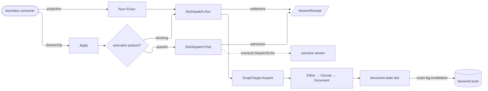

# [RASM_GRASSHOPPER_SHELL_SESSION]

`GhSession` owns the Grasshopper session boundary — live editor, canvas, and document acquisition; UI-thread command execution; monotonic command acknowledgements; form release; and document-tagged `HybridCache` access. `GhSession.Apply` closes command-shaped host work over one `SessionOp` union, while `Run<TOut>` bounds value projections to one UI marshal. Generated case operations identify commands, queued receipts prove admission only, blocking receipts prove settlement, and every live scope is reacquired inside the marshal that consumes it.

## [01]-[INDEX]

- [02]-[SCOPE]: acquisition rows over the live editor, canvas, and document chain
- [03]-[OPERATOR]: generated session commands, repaint policy, monotonic acknowledgements, and bounded projections
- [04]-[CACHE]: weak document identity, typed document-tagged cache slots, and entry-policy rows

## [02]-[SCOPE]

- Owner: `ScopeTarget` carries three acquisition rows over one `Acquire(Op)` column: `EditorHost` reads `Editor.Instance`, `CanvasHost` continues through `Editor.Canvas`, and `DocumentHost` continues through `Canvas.Document`. Every hop null-gates to `Fault.MissingContext`. `GhScope` closes the corresponding editor, canvas, and document cases and derives optional projections by total case dispatch.
- Entry: acquisition is internal to `GhSession` — a consumer names a `ScopeTarget` row and receives the projected value or receipt; no public `Acquire` exists, so scope choreography never leaks past the gate.
- Law: acquisition and consumption share one UI marshal. `Run<TOut>` admits only detached values or explicitly owned leases as outputs; returning a borrowed `GhScope`, `Editor`, `Canvas`, or `Document` reference violates the boundary even though the generic carrier cannot encode that prohibition.
- Law: `DocumentToken.Of(document)` mints identity from the exact acquired instance. GH2 `Document.Hash` is a content digest recomputed after modification, so it never substitutes for instance identity or cache lifetime.
- Boundary: shell chrome remains `Shell/editor.md`; reveal uses the public `Editor.ShowEditor(bool, string)` surface, which creates the editor when absent and makes an existing hidden editor visible.
- Packages: Grasshopper2 (`Editor.Instance`, `Editor.Canvas`, `Editor.ShowEditor`, `Canvas.Document`), LanguageExt.Core, `Rasm.Domain`.
- Growth: a new host anchor (a hosted panel root, a floating canvas) is one `ScopeTarget` row with one `GhScope` case; the acquisition column and gates never widen.

## [03]-[OPERATOR]

- Owner: `SessionOp` `[Union]` `[GenerateUnionOps]` closes reveal, execute, repaint, style, focus, and release. Each successful arm returns its generated `SelfOp`; no string verb or caller key substitutes for command identity. `RepaintRow` carries exact host policy: `Invalidate` admits no delay and calls `Control.Invalidate`, `Scheduled` admits no delay and calls `ScheduleRedraw()`, and `Deferred` requires a nonnegative delay before calling `ScheduleRedraw(TimeSpan)`.
- Owner: `SessionReceipt` carries the generated operation, entry and acknowledgement stamps, their strict order, elapsed acknowledgement latency, and the `Deferred` discriminator. For blocking commands, acknowledgement follows host settlement. For queued execution, acknowledgement follows queue admission and never claims that the deferred body succeeded.
- Entry: `GhSession.Apply(SessionOp op, Op? key = null)` → `Fin<SessionReceipt>` — the command gate; `GhSession.Run<TOut>(ScopeTarget target, Func<GhScope, Fin<TOut>> project, Op? key = null)` → `Fin<TOut>` — the value gate. Two gates, two shapes of demand (settlement versus projection); everything else on the page is internal.
- Law: every blocking case acquires and mutates inside one `EtoDispatch.Run` window. A queued `ExecuteCase` validates its target, lane, and work before admission, then reacquires scope inside the eventual `EtoDispatch.Post` callback. `Run` performs acquisition and projection inside one blocking marshal.
- Law: every case body runs under `Op.Catch`. A failed blocking command or refused queue admission returns its fault without a receipt. A queued receipt exposes `Deferred = true`; deferred failures remain on the runtime `DispatchEcho` stream and are not rewritten as successful settlement.
- Law: `ReleaseCase` is the one teardown spelling — `Form.Close` executes inside the lease window, the `Owned` fold disposes after projection even when close faults, and `Borrowed` closes without disposing the host-owned form.
- Boundary: repaint rows target the GH2 canvas; the flex-seam redraw (`IFlexControl.ScheduleRedraw`) on non-canvas flex controls is `Canvas/canvas.md`'s operator, and the eight paint fences are `Canvas/paint.md`'s executor. Undo grouping (`History.Do` + `ActionList`) rides `Document/history.md`; a session command never opens an undo record. `SessionReceipt` projection into `rasm.grasshopper.session.*` instruments is `Shell/telemetry.md`'s fold — this page emits receipts, never meter calls.
- Packages: Grasshopper2 (`Canvas.ScheduleRedraw`, `Editor.ShowEditor`), Eto (`Control.Invalidate`, `Control.Focus`, `Form.Close`), Rhino.UI (`EtoExtensions.UseRhinoStyle`), `Rasm.Domain` (`Op`, `Fault`, `Lease<T>`, `ValidityClaim`), `Rasm.Parametric` (`MonotonicTimeline`, `MonotonicStamp`), `Eto/runtime.md` (`EtoDispatch`, `DispatchLane`).
- Growth: a new session verb is one `SessionOp` case and one total `Switch` arm; a new repaint posture is one `RepaintRow` row.

```csharp signature
// --- [RUNTIME_PRELUDE] ----------------------------------------------------------------------
using Rasm.Csp;
using Rasm.Grasshopper.Eto;
using Rasm.Parametric;
using Rhino.UI;

namespace Rasm.Grasshopper.Shell;

// --- [TYPES] --------------------------------------------------------------------------------
[Union]
public abstract partial record GhScope {
    private GhScope() { }
    public sealed record EditorCase(Editor Shell) : GhScope;
    public sealed record CanvasCase(Canvas Surface) : GhScope;
    public sealed record DocumentCase(Document Graph, Canvas Surface) : GhScope;
    public Option<Editor> Editor => Switch(
        editorCase: static c => Some(c.Shell),
        canvasCase: static _ => Option<Editor>.None,
        documentCase: static _ => Option<Editor>.None);
    public Option<Canvas> Canvas => Switch(
        editorCase: static c => Optional(c.Shell.Canvas),
        canvasCase: static c => Some(c.Surface),
        documentCase: static c => Some(c.Surface));
    public Option<Document> Document => Switch(
        editorCase: static c => Optional(c.Shell.Canvas).Bind(static surface => Optional(surface.Document)),
        canvasCase: static c => Optional(c.Surface.Document),
        documentCase: static c => Some(c.Graph));
}

[SmartEnum<int>]
public sealed partial class ScopeTarget {
    public static readonly ScopeTarget EditorHost = new(key: 0, acquire: static key =>
        Optional(Editor.Instance).ToFin(key.MissingContext()).Map(static shell => (GhScope)new GhScope.EditorCase(Shell: shell)));
    public static readonly ScopeTarget CanvasHost = new(key: 1, acquire: static key =>
        from shell in Optional(Editor.Instance).ToFin(key.MissingContext())
        from surface in Optional(shell.Canvas).ToFin(key.MissingContext())
        select (GhScope)new GhScope.CanvasCase(Surface: surface));
    public static readonly ScopeTarget DocumentHost = new(key: 2, acquire: static key =>
        from shell in Optional(Editor.Instance).ToFin(key.MissingContext())
        from surface in Optional(shell.Canvas).ToFin(key.MissingContext())
        from graph in Optional(surface.Document).ToFin(key.MissingContext())
        select (GhScope)new GhScope.DocumentCase(Graph: graph, Surface: surface));
    [UseDelegateFromConstructor] internal partial Fin<GhScope> Acquire(Op key);
}

[SmartEnum<int>]
public sealed partial class RepaintRow {
    public static readonly RepaintRow Invalidate = new(key: 0, paint: static (surface, delay, key) =>
        WithoutDelay(surface: surface, delay: delay, key: key, paint: static target => target.Invalidate()));
    public static readonly RepaintRow Scheduled = new(key: 1, paint: static (surface, delay, key) =>
        WithoutDelay(surface: surface, delay: delay, key: key, paint: static target => target.ScheduleRedraw()));
    public static readonly RepaintRow Deferred = new(key: 2, paint: static (surface, delay, key) =>
        from span in delay.ToFin(key.InvalidInput())
        from admitted in guard(span >= TimeSpan.Zero, key.InvalidInput()).ToFin()
        from painted in key.Catch(body: () => Fin.Succ(Op.Side(action: () => surface.ScheduleRedraw(span))))
        select painted);
    [UseDelegateFromConstructor] internal partial Fin<Unit> Paint(Canvas surface, Option<TimeSpan> delay, Op key);

    private static Fin<Unit> WithoutDelay(Canvas surface, Option<TimeSpan> delay, Op key, Action<Canvas> paint) =>
        from admitted in guard(delay.IsNone, key.InvalidInput()).ToFin()
        from painted in key.Catch(body: () => Fin.Succ(Op.Side(action: () => paint(obj: surface))))
        select painted;
}

[Union]
[GenerateUnionOps]
public abstract partial record SessionOp {
    private SessionOp() { }
    public sealed partial record RevealCase(Option<string> Layout) : SessionOp;
    public sealed partial record ExecuteCase(ScopeTarget Target, DispatchLane Lane, Action<GhScope> Work) : SessionOp;
    public sealed partial record RepaintCase(RepaintRow Row, Option<TimeSpan> Delay) : SessionOp;
    public sealed partial record StyleCase(Control Surface) : SessionOp;
    public sealed partial record FocusCase(Control Surface) : SessionOp;
    public sealed partial record ReleaseCase(Lease<Form> Surface) : SessionOp;
}

// --- [MODELS] -------------------------------------------------------------------------------
[BoundaryAdapter]
public sealed record SessionReceipt : IValidityEvidence {
    private SessionReceipt(
        Op operation, bool deferred, MonotonicStamp entered, MonotonicStamp acknowledged,
        int order, TimeSpan latency) =>
        (Operation, Deferred, Entered, Acknowledged, Order, Latency) =
        (operation, deferred, entered, acknowledged, order, latency);

    public Op Operation { get; }
    public bool Deferred { get; }
    public MonotonicStamp Entered { get; }
    public MonotonicStamp Acknowledged { get; }
    public int Order { get; }
    public TimeSpan Latency { get; }

    public bool IsValid => ValidityClaim.All(
        ValidityClaim.Evidence(evidence: Entered),
        ValidityClaim.Evidence(evidence: Acknowledged),
        ValidityClaim.Of(holds: Order < 0),
        ValidityClaim.Nonnegative(value: Latency.TotalSeconds));

    internal static Fin<SessionReceipt> Of(
        Op operation, bool deferred, MonotonicTimeline timeline,
        MonotonicStamp entered, MonotonicStamp acknowledged, Op key) =>
        from order in timeline.Order(left: entered, right: acknowledged, key: key)
        from latency in timeline.Elapsed(start: entered, end: acknowledged, key: key)
        from accepted in key.AcceptValue(value: new SessionReceipt(
            operation: operation,
            deferred: deferred,
            entered: entered,
            acknowledged: acknowledged,
            order: order,
            latency: latency))
        select accepted;
}

// --- [OPERATIONS] ---------------------------------------------------------------------------
[BoundaryAdapter]
public static class GhSession {
    public static Fin<TOut> Run<TOut>(ScopeTarget target, Func<GhScope, Fin<TOut>> project, Op? key = null) {
        Op op = key.OrDefault();
        return from row in op.Need(target)
               from valid in op.Need(project)
               from output in EtoDispatch.Run(body: () => row.Acquire(key: op).Bind(scope => op.Catch(body: () => valid(arg: scope))), key: op)
               select output;
    }

    public static Fin<SessionReceipt> Apply(SessionOp op, Op? key = null) {
        Op active = key.OrDefault();
        return from valid in active.Need(op)
               from timeline in MonotonicTimeline.Of(provider: TimeProvider.System, key: active)
               from entered in timeline.Capture(key: active)
               from outcome in valid.Switch(
                state: active,
                revealCase: static (k, c) => EtoDispatch.Run(body: () =>
                    k.Catch(body: () => Fin.Succ(Editor.ShowEditor(
                        createVisible: true,
                        layoutRules: c.Layout.MatchUnsafe(Some: static rules => rules, None: static () => null))))
                    .Map(_ => (Operation: SessionOp.RevealCase.SelfOp, Deferred: false)), key: k),
                executeCase: static (k, c) =>
                    from target in k.Need(c.Target)
                    from lane in k.Need(c.Lane)
                    from work in k.Need(c.Work)
                    from admitted in lane.Dispatch(body: () => target.Acquire(key: k)
                        .Map(scope => Op.Side(action: () => work(obj: scope))), key: k)
                    select (Operation: SessionOp.ExecuteCase.SelfOp, Deferred: lane == DispatchLane.Queued),
                repaintCase: static (k, c) =>
                    from row in k.Need(c.Row)
                    from painted in EtoDispatch.Run(body: () => ScopeTarget.CanvasHost.Acquire(key: k)
                        .Bind(scope => scope.Canvas.ToFin(k.MissingContext()))
                        .Bind(surface => row.Paint(surface: surface, delay: c.Delay, key: k)), key: k)
                    select (Operation: SessionOp.RepaintCase.SelfOp, Deferred: false),
                styleCase: static (k, c) =>
                    from surface in k.Need(c.Surface)
                    from styled in EtoDispatch.Run(body: () =>
                        k.Catch(body: () => Fin.Succ(Op.Side(action: surface.UseRhinoStyle))), key: k)
                    select (Operation: SessionOp.StyleCase.SelfOp, Deferred: false),
                focusCase: static (k, c) =>
                    from surface in k.Need(c.Surface)
                    from focused in EtoDispatch.Run(body: () =>
                        k.Catch(body: () => Fin.Succ(Op.Side(action: surface.Focus))), key: k)
                    select (Operation: SessionOp.FocusCase.SelfOp, Deferred: false),
                releaseCase: static (k, c) =>
                    from surface in k.Need(c.Surface)
                    from released in EtoDispatch.Run(body: () => k.Catch(body: () =>
                        Fin.Succ(surface.Use(project: static form => Op.Side(action: form.Close)))), key: k)
                    select (Operation: SessionOp.ReleaseCase.SelfOp, Deferred: false))
               from acknowledged in timeline.Capture(key: active)
               from receipt in SessionReceipt.Of(
                   operation: outcome.Operation,
                   deferred: outcome.Deferred,
                   timeline: timeline,
                   entered: entered,
                   acknowledged: acknowledged,
                   key: active)
               select receipt;
    }
}
```

## [04]-[CACHE]

- Owner: `DocumentToken` assigns one stable `Guid` to each live `Document` instance through `ConditionalWeakTable`. That association disappears with the document; `Document.Hash` remains content identity and never enters cache addressing.
- Owner: `CacheSlot` admits one trimmed, nonblank concern identity. `SessionCache` keys entries as `gh:{documentId:N}:{slot}` and applies the exact `gh-doc:{documentId:N}` tag to every value minted for that document.
- Owner: `SlotPolicy` carries the entry policy as data — `Shared` defers to the substrate `DefaultEntryOptions`, `Resident` pins process-local Eto-affine payloads L1-only through `HybridCacheEntryFlags.DisableDistributedCache`, and `Recency` splits the short `LocalCacheExpiration` horizon from absolute `Expiration` so a hot key re-reads L2 without re-minting. A raw `HybridCacheEntryOptions` argument at a call site is the deleted knob this row family replaces.
- Entry: `Remember<TState, T>(Guid, CacheSlot, TState, Func<TState, CancellationToken, ValueTask<T>>, Option<SlotPolicy>, CancellationToken)` composes the stateful `HybridCache.GetOrCreateAsync` overload without factory capture; `Evict(Guid, CancellationToken)` calls the singular `RemoveByTagAsync` overload.
- Law: tag invalidation makes every matching entry stale for subsequent reads; it never promises physical deletion from L1 or L2. Substrate behavior — stampede control, configured default entry policy, serializer selection, maximum-key and maximum-payload bypass, and storage topology — stays in force under the read-through.
- Law: cache payloads are detached serializable values such as encoded raster bytes, layout measurements, or parse receipts. A `GhScope`, live host object, Eto bitmap, lease, or delegate never becomes a cache value; a raster past the substrate payload bound returns uncached silently, so oversized canvas captures select `Resident` and never rely on L2.
- Law: `gh-doc:{documentId:N}` is the cache-observability dimension — `HybridCacheOptions.ReportTagMetrics` surfaces per-tag hit/miss on the `HybridCache` EventSource keyed by exactly this tag, wired at the composition root; this boundary mints the tag and emits nothing itself, and `Shell/telemetry.md` records the custody rows and the app-root obligation set.
- Law: every `document.state` fact invalidates its document tag. Its fact shape carries document identity but no before/after state, so this boundary invents no closing-only distinction.
- Boundary: the composition root supplies `HybridCache` and owns the serializer, payload-bound, and tag-metric registrations the overlay records; `ValueTask` remains the package carrier, and a kernel consumer bridges at its own seam.
- Growth: a new cached concern is one `CacheSlot` value at the call site; a new invalidation axis is one exact tag value; a new residency posture is one `SlotPolicy` row.

```csharp signature
// --- [RUNTIME_PRELUDE] ----------------------------------------------------------------------
using System.Runtime.CompilerServices;
using Microsoft.Extensions.Caching.Hybrid;
using Rasm.Csp;

namespace Rasm.Grasshopper.Shell;

// --- [TYPES] --------------------------------------------------------------------------------
[ValueObject<string>]
public readonly partial struct CacheSlot {
    static partial void ValidateFactoryArguments(ref ValidationError? validationError, ref string value) {
        value = value?.Trim() ?? string.Empty;
        validationError = value.Length > 0 ? null : new ValidationError(message: "CacheSlot requires a non-blank identity.");
    }
}

[SmartEnum<int>]
public sealed partial class SlotPolicy {
    public static readonly SlotPolicy Shared = new(key: 0, options: null);
    public static readonly SlotPolicy Resident = new(key: 1, options: new() {
        Flags = HybridCacheEntryFlags.DisableDistributedCache,               // Eto-affine payloads (raster bytes, layout measures) never reach L2
    });
    public static readonly SlotPolicy Recency = new(key: 2, options: new() {
        Expiration = TimeSpan.FromMinutes(5),
        LocalCacheExpiration = TimeSpan.FromSeconds(1),                      // per-render L1 horizon; a hot key re-reads L2 without re-minting
    });

    public HybridCacheEntryOptions? Options { get; }
}

// --- [SERVICES] -----------------------------------------------------------------------------
[BoundaryAdapter]
public static class DocumentToken {
    private static readonly ConditionalWeakTable<Document, StrongBox<Guid>> tokens = new();
    public static Guid Of(Document graph) => tokens.GetValue(key: graph, createValueCallback: static _ => new StrongBox<Guid>(Guid.NewGuid())).Value;
}

[BoundaryAdapter]
public sealed class SessionCache(HybridCache cache) {
    public ValueTask<T> Remember<TState, T>(
        Guid documentId, CacheSlot slot, TState state, Func<TState, CancellationToken, ValueTask<T>> mint,
        Option<SlotPolicy> policy = default, CancellationToken cancel = default) =>
        cache.GetOrCreateAsync(
            key: $"gh:{documentId:N}:{slot}",
            state: (State: state, Mint: mint),
            factory: static (seam, token) => seam.Mint(arg1: seam.State, arg2: token),
            options: policy.IfNone(SlotPolicy.Shared).Options,
            tags: [Tag(documentId: documentId)],
            cancellationToken: cancel);

    public ValueTask Evict(Guid documentId, CancellationToken cancel = default) =>
        cache.RemoveByTagAsync(tag: Tag(documentId: documentId), cancellationToken: cancel);

    private static string Tag(Guid documentId) => string.Create(provider: null, $"gh-doc:{documentId:N}");
}
```



## [05]-[RESEARCH]

<!-- source-only: research row template:
[TOKEN]-[OPEN|BLOCKED]: <exact question>; <verification route>.
[SPLIT_MEMBER]-[OPEN]: does `shape-core` expose `split_all`; verify against the member rail.
-->

(none)
