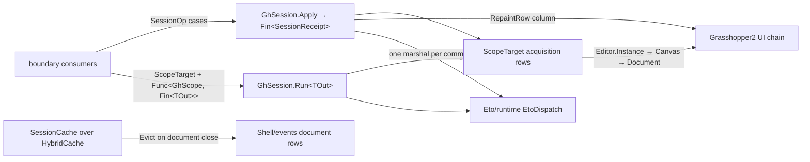

# [RASM_GRASSHOPPER_SHELL_SESSION]

The host-session spine of the Grasshopper boundary — ONE session operator (`GhSession`) owning typed scope acquisition over the live GH2 editor/canvas/document chain, UI-thread execution through the `Eto/runtime.md` dispatch rail, lifecycle/teardown/repaint settlement as typed receipts, and document-scoped recency caching over the admitted `HybridCache` substrate. The census-era roster — `RepaintRequest`, `Teardown`, `Subscription`, `GrasshopperUiPolicy`, `GrasshopperUiIntent`, static helper families, and the local `BoundedCache` — collapses here: scope is a `[SmartEnum<int>]` acquisition row draining into one `GhScope` union, commands are cases of one `SessionOp` union settled by one `Apply` gate, value-shaped work runs through one generic `Run<TOut>` gate, and caching composes `HybridCache` with document-tag invalidation instead of a hand-rolled recency structure. Every fallible step rides an `Op`-keyed `Fin<T>` rail; every owned Eto form crosses as `Lease<Form>`; every receipt proves itself through `ValidityClaim.All`. Event observation is `Shell/events.md`'s algebra, undo/history grouping is `Document/history.md`'s ledger, and window/dialog construction is `Eto/windows.md`'s spec family — this page owns the session floor they all stand on.

## [01]-[INDEX]

- [02]-[SCOPE]: `ScopeTarget` + `GhScope` — the acquisition-row vocabulary over `Editor.Instance` → `Editor.Canvas` → `Canvas.Document`, one typed scope union, and the UI-affinity law every acquisition obeys.
- [03]-[OPERATOR]: `RepaintRow` + `SessionOp` + `SessionReceipt` + `GhSession` — the command union (reveal, execute, repaint, style, focus, release), the one `Apply` settlement gate, and the one generic `Run<TOut>` projection gate.
- [04]-[CACHE]: `DocumentToken` + `SessionCache` — the weak-table document-identity mint and document-tagged recency caching over the `HybridCache` contract; the local generic cache is the killed form.

## [02]-[SCOPE]

- Owner: `ScopeTarget` `[SmartEnum<int>]` — 3 acquisition rows over one `[UseDelegateFromConstructor]` `Acquire(Op)` column: `EditorHost` (key 0, `Editor.Instance`), `CanvasHost` (key 1, `Editor.Instance` → `Editor.Canvas`), `DocumentHost` (key 2, the full chain onto `Canvas.Document`). Each row null-gates every hop through `Optional(...).ToFin(key.MissingContext())`, so a headless Rhino, an unopened editor, or a canvas without a document is a typed `Fault.MissingContext`, never a null dereference three frames into host code. `GhScope` `[Union]` is the typed result — `EditorCase(Editor)`, `CanvasCase(Canvas)`, `DocumentCase(Document)` — the one scope vocabulary every session consumer pattern-matches; projection accessors (`Editor`, `Canvas`, `Document` as `Option`) derive from case dispatch so a consumer holding a `DocumentCase` still reaches the owning canvas chain without re-acquiring.
- Entry: acquisition is internal to `GhSession` — a consumer names a `ScopeTarget` row and receives the projected value or receipt; no public `Acquire` exists, so scope choreography never leaks past the gate.
- Law: host scope objects are UI-affine — every acquisition runs inside the `EtoDispatch` marshal, and a `GhScope` never escapes the projection lambda that received it; holding a `Canvas` reference across turns is the defect the session shape forecloses, because the scope is re-acquired per `Run`/`Apply` at negligible cost against live statics.
- Law: document identity for caching and event correlation is `DocumentToken.Of(document)` minted inside the same marshal that acquired the scope — GH2 `Document` carries no cheap host id (`Hash` is a content hash, recomputed and wiped per modification), so the token's weak-table `Guid` per live instance IS the identity; identity stitched across two windows races document swaps.
- Boundary: `Editor.ThisOrRhino`, `Editor.BeginRhinoGetter(RhinoDoc)`, tabs, breadcrumbs, status bar, and layout state are `Shell/editor.md`'s shell surface; `Editor.EnsureVisible` is host-internal, so reveal routes exclusively through the public static `Editor.ShowEditor(bool createVisible = true, string layoutRules = null)` — it mints the editor when absent and fronts it when hidden.
- Packages: Grasshopper2 (`Editor.Instance`, `Editor.Canvas`, `Editor.ShowEditor`, `Canvas.Document`), LanguageExt.Core, `Rasm.Domain`.
- Growth: a new host anchor (a hosted panel root, a floating canvas) is one `ScopeTarget` row plus one `GhScope` case; the acquisition column and gates never widen.

## [03]-[OPERATOR]

- Owner: `GhSession` — the one host-session operator. `SessionOp` `[Union]` `[GenerateUnionOps]` closes the command family: `RevealCase(Option<string> Layout)` (mint-or-front the editor through `Editor.ShowEditor`, optional layout rules), `ExecuteCase(ScopeTarget, DispatchLane, Action<GhScope>)` (command-shaped work on a scope under a lane row), `RepaintCase(RepaintRow, Option<TimeSpan>)` (repaint policy over the canvas), `StyleCase(Control)` (`Rhino.UI.EtoExtensions.UseRhinoStyle` at the one styling seam), `FocusCase(Control)` (`Control.Focus`), `ReleaseCase(Lease<Form>)` (close-then-dispose teardown of an owned form). `RepaintRow` `[SmartEnum<int>]` carries repaint policy as rows over one `[UseDelegateFromConstructor]` `Paint(Canvas, Option<TimeSpan>, Op)` column: `Immediate` (key 0, `Canvas.Invalidate`), `Scheduled` (key 1, `Canvas.ScheduleRedraw()`), `Deferred` (key 2, `Canvas.ScheduleRedraw(TimeSpan)` demanding a delay and refusing its absence typed). `SessionReceipt` is the settlement evidence — the raising `Op`, the settled case name via `nameof`, and the marshal latency — implementing `IValidityEvidence`.
- Entry: `GhSession.Apply(SessionOp op, Op? key = null)` → `Fin<SessionReceipt>` — the command gate; `GhSession.Run<TOut>(ScopeTarget target, Func<GhScope, Fin<TOut>> project, Op? key = null)` → `Fin<TOut>` — the value gate. Two gates, two shapes of demand (settlement versus projection); everything else on the page is internal.
- Law: `Apply` settles every case inside ONE `EtoDispatch` marshal — acquisition, host verb, and receipt stamp share the window, so no case observes a scope another thread invalidated mid-command. `Run` does the same for projections: acquisition and the caller's projection execute in one blocking marshal, and the projected `TOut` is the only thing that crosses back.
- Law: fault settlement is total — every case body runs under `Op.Catch`, a cancelled host call keeps `Fault.Cancelled`, and the receipt exists only for a settled command; a failed command's evidence is its `Fault`, never a half-stamped receipt.
- Law: `ReleaseCase` is the one teardown spelling — `Form.Close` inside the lease window, disposal by the lease's `Owned` fold — so `Form.Dispose` never appears at a consumer and a borrowed host form (`Lease<Form>.Borrowed`) closes without being disposed. The census `Teardown` union and its per-kind helpers are absorbed by this single case.
- Boundary: repaint rows target the GH2 canvas; the flex-seam redraw (`IFlexControl.ScheduleRedraw`) on non-canvas flex controls is `Canvas/canvas.md`'s operator, and the eight paint fences are `Canvas/paint.md`'s executor. Undo grouping (`History.Do` + `ActionList`) rides `Document/history.md`; a session command never opens an undo record.
- Packages: Grasshopper2 (`Canvas.Invalidate`, `Canvas.ScheduleRedraw`, `Editor.ShowEditor`), Eto (`Control.Focus`, `Form.Close`), Rhino.UI (`EtoExtensions.UseRhinoStyle`), `Rasm.Domain` (`Op`, `Fault`, `Lease<T>`, `ValidityClaim`), `Eto/runtime.md` (`EtoDispatch`, `DispatchLane`).
- Growth: a new session verb is one `SessionOp` case with its `Switch` arm breaking loudly at the gate; a new repaint posture is one `RepaintRow` row; zero new entrypoints on any axis.

```csharp signature
// --- [RUNTIME_PRELUDE] ----------------------------------------------------------------------
using Rasm.Csp;
using Rasm.Grasshopper.Eto;
using Rhino.UI;

namespace Rasm.Grasshopper.Shell;

// --- [TYPES] --------------------------------------------------------------------------------
[Union]
public abstract partial record GhScope {
    private GhScope() { }
    public sealed record EditorCase(Editor Shell) : GhScope;
    public sealed record CanvasCase(Canvas Surface) : GhScope;
    public sealed record DocumentCase(Document Graph, Canvas Surface) : GhScope;
    public Option<Editor> Editor => Switch(
        editorCase: static c => Some(c.Shell),
        canvasCase: static _ => Option<Editor>.None,
        documentCase: static _ => Option<Editor>.None);
    public Option<Canvas> Canvas => Switch(
        editorCase: static c => Optional(c.Shell.Canvas),
        canvasCase: static c => Some(c.Surface),
        documentCase: static c => Some(c.Surface));
    public Option<Document> Document => Switch(
        editorCase: static c => Optional(c.Shell.Canvas).Bind(static surface => Optional(surface.Document)),
        canvasCase: static c => Optional(c.Surface.Document),
        documentCase: static c => Some(c.Graph));
}

[SmartEnum<int>]
public sealed partial class ScopeTarget {
    public static readonly ScopeTarget EditorHost = new(key: 0, acquire: static key =>
        Optional(Editor.Instance).ToFin(key.MissingContext()).Map(static shell => (GhScope)new GhScope.EditorCase(Shell: shell)));
    public static readonly ScopeTarget CanvasHost = new(key: 1, acquire: static key =>
        from shell in Optional(Editor.Instance).ToFin(key.MissingContext())
        from surface in Optional(shell.Canvas).ToFin(key.MissingContext())
        select (GhScope)new GhScope.CanvasCase(Surface: surface));
    public static readonly ScopeTarget DocumentHost = new(key: 2, acquire: static key =>
        from shell in Optional(Editor.Instance).ToFin(key.MissingContext())
        from surface in Optional(shell.Canvas).ToFin(key.MissingContext())
        from graph in Optional(surface.Document).ToFin(key.MissingContext())
        select (GhScope)new GhScope.DocumentCase(Graph: graph, Surface: surface));
    [UseDelegateFromConstructor] internal partial Fin<GhScope> Acquire(Op key);
}

[SmartEnum<int>]
public sealed partial class RepaintRow {
    public static readonly RepaintRow Immediate = new(key: 0, paint: static (surface, _, key) =>
        key.Catch(body: () => Fin.Succ(Op.Side(action: surface.Invalidate))));
    public static readonly RepaintRow Scheduled = new(key: 1, paint: static (surface, _, key) =>
        key.Catch(body: () => Fin.Succ(Op.Side(action: () => surface.ScheduleRedraw()))));
    public static readonly RepaintRow Deferred = new(key: 2, paint: static (surface, delay, key) =>
        delay.ToFin(key.InvalidInput()).Bind(span => key.Catch(body: () => Fin.Succ(Op.Side(action: () => surface.ScheduleRedraw(span))))));
    [UseDelegateFromConstructor] internal partial Fin<Unit> Paint(Canvas surface, Option<TimeSpan> delay, Op key);
}

[Union]
[GenerateUnionOps]
public abstract partial record SessionOp {
    private SessionOp() { }
    public sealed record RevealCase(Option<string> Layout) : SessionOp;
    public sealed record ExecuteCase(ScopeTarget Target, DispatchLane Lane, Action<GhScope> Work) : SessionOp;
    public sealed record RepaintCase(RepaintRow Row, Option<TimeSpan> Delay) : SessionOp;
    public sealed record StyleCase(Control Surface) : SessionOp;
    public sealed record FocusCase(Control Surface) : SessionOp;
    public sealed record ReleaseCase(Lease<Form> Surface) : SessionOp;
}

// --- [MODELS] -------------------------------------------------------------------------------
[BoundaryAdapter, StructLayout(LayoutKind.Auto)]
public readonly record struct SessionReceipt(Op Operation, string Verb, TimeSpan Latency) : IValidityEvidence {
    public bool IsValid => ValidityClaim.All(
        ValidityClaim.Of(holds: !string.IsNullOrWhiteSpace(value: Verb)),
        ValidityClaim.Nonnegative(value: Latency.TotalSeconds));
}

// --- [OPERATIONS] ---------------------------------------------------------------------------
[BoundaryAdapter]
public static class GhSession {
    public static Fin<TOut> Run<TOut>(ScopeTarget target, Func<GhScope, Fin<TOut>> project, Op? key = null) {
        Op op = key.OrDefault();
        return from row in op.Need(target)
               from valid in op.Need(project)
               from output in EtoDispatch.Run(body: () => row.Acquire(key: op).Bind(scope => op.Catch(body: () => valid(arg: scope))), key: op)
               select output;
    }

    public static Fin<SessionReceipt> Apply(SessionOp op, Op? key = null) {
        Op active = key.OrDefault();
        long entered = Environment.TickCount64;
        return active.Need(op)
            .Bind(valid => valid.Switch(
                state: active,
                revealCase: static (k, c) => EtoDispatch.Run(body: () =>
                    k.Catch(body: () => Fin.Succ(Editor.ShowEditor(
                        createVisible: true,
                        layoutRules: c.Layout.MatchUnsafe(Some: static rules => rules, None: static () => null))))
                    .Map(_ => nameof(SessionOp.RevealCase)), key: k),
                executeCase: static (k, c) => c.Lane.Dispatch(body: () =>
                        c.Target.Acquire(key: k).Map(scope => Op.Side(action: () => c.Work(obj: scope))), key: k)
                    .Map(_ => nameof(SessionOp.ExecuteCase)),
                repaintCase: static (k, c) => EtoDispatch.Run(body: () =>
                    ScopeTarget.CanvasHost.Acquire(key: k).Bind(scope => scope.Canvas
                        .ToFin(k.MissingContext())
                        .Bind(surface => c.Row.Paint(surface: surface, delay: c.Delay, key: k))), key: k)
                    .Map(_ => nameof(SessionOp.RepaintCase)),
                styleCase: static (k, c) => EtoDispatch.Run(body: () =>
                    k.Need(c.Surface)
                        .Bind(surface => k.Catch(body: () => Fin.Succ(Op.Side(action: surface.UseRhinoStyle)))), key: k)
                    .Map(_ => nameof(SessionOp.StyleCase)),
                focusCase: static (k, c) => EtoDispatch.Run(body: () =>
                    k.Need(c.Surface)
                        .Bind(surface => k.Catch(body: () => Fin.Succ(Op.Side(action: surface.Focus)))), key: k)
                    .Map(_ => nameof(SessionOp.FocusCase)),
                releaseCase: static (k, c) => EtoDispatch.Run(body: () =>
                    k.Catch(body: () => Fin.Succ(c.Surface.Use(project: static surface => Op.Side(action: surface.Close)))), key: k)
                    .Map(_ => nameof(SessionOp.ReleaseCase))))
            .Map(verb => new SessionReceipt(
                Operation: active,
                Verb: verb,
                Latency: TimeSpan.FromMilliseconds(value: Environment.TickCount64 - entered)));
    }
}
```

## [04]-[CACHE]

- Owner: `DocumentToken` — the one document-identity mint: GH2 `Document` exposes no cheap host id (`Hash` is a whole-content hash, wiped per modification), so a `ConditionalWeakTable` assigns one stable `Guid` per live `Document` instance; the token keys cache entries, event correlation (`Shell/events.md` `DocumentCase` facts), and eviction, and dies with the instance it identifies.
- Owner: `SessionCache` — the document-scoped recency seam over the admitted `HybridCache` contract. One keyed profile serves the whole boundary: entries key as `gh:{documentId:N}:{name}` through the interpolated-handler `GetOrCreateAsync` overload (zero intermediate key strings), every entry tags with the owning document's token, and `Evict(documentId)` drains a closed document's whole entry set through `RemoveByTagAsync` in one call. The census `BoundedCache` — a hand-rolled generic recency structure inside the host package — is killed; stampede protection, L1/L2 policy, payload guards, and serializer admission are the substrate's, never re-derived here.
- Entry: `Remember<TState, T>(Guid documentId, string name, TState state, Func<TState, CancellationToken, ValueTask<T>> mint, HybridCacheEntryOptions? options = null, CancellationToken cancel = default)` → `ValueTask<T>`; `Evict(Guid documentId, CancellationToken cancel = default)` → `ValueTask`. The `state` thread keeps mint factories closure-free per the substrate's own law.
- Law: the cache is a policy surface, not a scope store — a `GhScope`, a live `Canvas`, or any host object is never a cache payload; cached material is derived, serializable evidence (icon rasters, layout measurements, parse results) keyed to the document that produced it. `Shell/events.md`'s `document.state` row is the invalidation trigger: its consumer calls `Evict` with the closing fact's `DocumentId` token, so recency and lifetime are one law.
- Law: entry policy is a passed `HybridCacheEntryOptions` value — a per-call flag set, a second cache profile, or a local expiry constant beside the substrate's `DefaultEntryOptions` is the deleted form.
- Boundary: `SessionCache` resolves its `HybridCache` from the composition root; the `ValueTask` carriers stay boundary carriers — a kernel `Fin` consumer bridges at its own seam.
- Packages: Microsoft.Extensions.Caching.Hybrid (`HybridCache.GetOrCreateAsync`/`RemoveByTagAsync`, `HybridCacheEntryOptions`), `Rasm.Domain`.
- Growth: a new cached concern is one `Remember` call site with its own name segment; a new invalidation axis is one tag value — the seam never widens.

```csharp signature
// --- [RUNTIME_PRELUDE] ----------------------------------------------------------------------
using System.Runtime.CompilerServices;
using Microsoft.Extensions.Caching.Hybrid;
using Rasm.Csp;

namespace Rasm.Grasshopper.Shell;

// --- [SERVICES] -----------------------------------------------------------------------------
[BoundaryAdapter]
public static class DocumentToken {
    private static readonly ConditionalWeakTable<Document, StrongBox<Guid>> tokens = new();
    public static Guid Of(Document graph) => tokens.GetValue(key: graph, createValueCallback: static _ => new StrongBox<Guid>(Guid.NewGuid())).Value;
}

[BoundaryAdapter]
public sealed class SessionCache(HybridCache cache) {
    public ValueTask<T> Remember<TState, T>(
        Guid documentId, string name, TState state, Func<TState, CancellationToken, ValueTask<T>> mint,
        HybridCacheEntryOptions? options = null, CancellationToken cancel = default) =>
        cache.GetOrCreateAsync(
            key: $"gh:{documentId:N}:{name}",
            state: (State: state, Mint: mint),
            factory: static (seam, token) => seam.Mint(arg1: seam.State, arg2: token),
            options: options,
            tags: [Tag(documentId: documentId)],
            cancellationToken: cancel);

    public ValueTask Evict(Guid documentId, CancellationToken cancel = default) =>
        cache.RemoveByTagAsync(tag: Tag(documentId: documentId), cancellationToken: cancel);

    private static string Tag(Guid documentId) => string.Create(provider: null, $"gh-doc:{documentId:N}");
}
```



## [05]-[DENSITY_BAR]

| [INDEX] | [CONCERN]          | [OWNER]                        | [KIND]                                                   | [RAIL]                              | [CASES] |
| :-----: | :----------------- | :------------------------------ | :--------------------------------------------------------- | :----------------------------------- | :-----: |
|  [01]   | scope acquisition  | `ScopeTarget` + `GhScope`      | `[SmartEnum<int>]` rows → closed `[Union]`               | `Acquire → Fin<GhScope>` (internal) |   3+3   |
|  [02]   | session commands   | `SessionOp` + `SessionReceipt` | `[GenerateUnionOps]` `[Union]` + evidence receipt        | `Apply → Fin<SessionReceipt>`       |    6    |
|  [03]   | repaint policy     | `RepaintRow`                   | `[SmartEnum<int>]` delegate rows                         | `Paint → Fin<Unit>` (internal)      |    3    |
|  [04]   | value projection   | `GhSession.Run<TOut>`          | one generic gate, one marshal window                     | `Run<TOut> → Fin<TOut>`             |    1    |
|  [05]   | recency caching    | `SessionCache` + `DocumentToken` | `HybridCache` profile, weak-table identity, document tags | `Remember → ValueTask<T>`           |    2    |

`EtoDispatch`, `DispatchLane`, `Op`, `Fault`, `Lease<T>`, `ValidityClaim`, and `HybridCache` are composed upstream owners. The census `RepaintRequest`/`Teardown`/`Subscription`/`GrasshopperUiIntent`/`BoundedCache` roster has no successor shape — its capabilities land as the cases and rows above.
