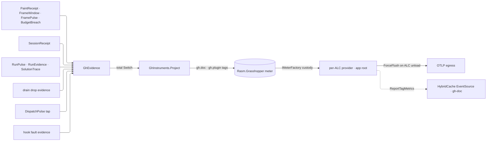

# [RASM_GRASSHOPPER_SHELL_TELEMETRY]

`GhTelemetry` owns the boundary's telemetry admission and receipt projection: one injected `IMeterFactory` mints the `Rasm.Grasshopper` meter, one `GhEvidence` union closes the folder's receipt families, and one total fold turns each receipt into UCUM-named `rasm.grasshopper.*` instrument writes carrying document and plugin attribution. Emitting pages pass receipts and never spell a meter call; providers, exporters, views, and unload custody stay at the app root, so the folder holds zero OpenTelemetry reference.

## [01]-[INDEX]

- [02]-[CUSTODY]: injected factory admission, per-ALC unload custody, and the app-root obligation set
- [03]-[ROSTER]: instrument rows, bucket advice, and the receipt-field-to-instrument kind table
- [04]-[PROJECTION]: the evidence union, the projection fold, and the attribution tag law

## [02]-[CUSTODY]

- Owner: `GhTelemetry` — the composition capsule pairing the minted instrument spine with logger admission under one inverse. `GhInstruments` mints the `Rasm.Grasshopper` meter through `IMeterFactory.Create(MeterOptions)` exactly once, stamping the composing plugin's identity as a meter-scope tag.
- Entry: `GhTelemetry.Of(IMeterFactory factory, string plugin, Option<ILoggerFactory> logs = default, Option<string> version = default)` — the one admission gate; `Instruments` and `Logs` are the two capability slots consumers reach.
- Law: the injected factory is the per-ALC lifetime owner — a composing plugin passes its `PluginTelemetryHost.Meters`, and `AssemblyLoadContext.Unloading` drives the host's `ForceFlush`-then-`Dispose` on both providers, so no instrument outlives its plugin and an unload never drops the tail of an export batch. `GhTelemetry.Dispose` releases the minted meter as the composition-local inverse; factory disposal is the authoritative release.
- Law: a composition that runs logger-less takes `NullLoggerFactory.Instance` through the `Option` default, never a nullable factory; fault-family `[LoggerMessage]` partials live beside their retaining owners (`Canvas/paint.md` `PaintLog`, `Shell/events.md` `UiEventsLog`, `Eto/runtime.md` `RuntimeLog`, `Platform/native.md` `NativeLog`) and resolve their `ILogger` through `GhLog.For` at the fault-record site, so a retained fault emits once when it lands and no consumer polls a `LastFault` cell.
- Law: `GhLog` is the per-load-context ambient logger cell — `Of` binds the admitted factory and `Dispose` restores `NullLoggerFactory.Instance`; collectible plugin ALCs isolate the static per plugin, so two co-resident plugins never share a binding, and an unbound context emits into the null logger at zero cost. A `GhFault`-raising Components page takes `ILogger` by injection alone because the island imports no UI-thread sibling.
- Law: two co-resident plugins each `Of` over their own per-ALC factory, so identical `rasm.grasshopper.*` instrument names stay isolated by provider scope and the `gh.plugin` meter tag attributes each series to its composing plugin.
- Boundary: app-root obligations — the provider admits the `Rasm.Grasshopper` meter by name; sampler, exemplar filter, views, cardinality caps, and OTLP egress bind at the provider; `HybridCacheOptions.ReportTagMetrics` with the `gh-doc:{documentId:N}` dimension, the raster serializer, and the `MaximumPayloadBytes` sizing ride `.api/api-hybrid-cache.md` `[APP_ROOT_OBLIGATIONS]` — this folder emits receipts and cache tags, never provider registrations.
- Packages: BCL inbox (`System.Diagnostics.Metrics` — `IMeterFactory`, `MeterOptions`, `Meter`, `InstrumentAdvice<T>`), Microsoft.Extensions.Logging.Abstractions (`ILoggerFactory`, `NullLoggerFactory`), LanguageExt.Core.
- Growth: a new capability slot on the capsule is one property with its admission default; a new attribution axis is one meter-scope tag at the mint.

## [03]-[ROSTER]

- Owner: `GhInstruments` — the instrument roster minted once at construction; `GhBuckets` — the explicit-bucket advice rows the frame and acknowledgement histograms ship as the fallback a backend without base2-exponential histograms reads.
- Law: instrument identity de-duplicates by name inside the meter, so name, unit, and description are declaration facts spelled once at the create site; units are UCUM (`s`, `{mark}`, `{command}`) and never pre-baked into the name.
- Law: every row is a projection of a typed receipt already on disk — a metric minted beside this roster is a second truth, and a receipt field no row projects stays receipt-only by declaration.
- Law: the kind table is the closed field-to-instrument correspondence; a new projected field is one table row, one instrument declaration, and one arm edit, never a call-site meter write.

| [INDEX] | [FACT_FIELD]                      | [INSTRUMENT]                        | [UNIT]        | [KIND]              | [TAGS]                          |
| :-----: | :-------------------------------- | :---------------------------------- | :------------ | :------------------ | :------------------------------ |
|  [01]   | `PaintReceipt.Latency`            | `rasm.grasshopper.paint.duration`   | `s`           | `Histogram<double>` | `gh.doc`, `rasm.op`             |
|  [02]   | `PaintReceipt.Drawn`/`Culled`     | `rasm.grasshopper.paint.marks`      | `{mark}`      | `Counter<long>`     | `gh.doc`, `disposition`         |
|  [03]   | `FrameWindow.Cost`                | `rasm.grasshopper.frame.window`     | `s`           | `Histogram<double>` | `gh.doc`                        |
|  [04]   | `FramePulse` seven phase spans    | `rasm.grasshopper.frame.phase`      | `s`           | `Histogram<double>` | `gh.doc`, `phase`               |
|  [05]   | `SessionReceipt.Latency`          | `rasm.grasshopper.session.ack`      | `s`           | `Histogram<double>` | `gh.doc`, `rasm.op`, `deferred` |
|  [06]   | `SessionReceipt` per command      | `rasm.grasshopper.session.commands` | `{command}`   | `Counter<long>`     | `gh.doc`, `rasm.op`, `deferred` |
|  [07]   | `RunPulse.InvalidCount`           | `rasm.grasshopper.solution.invalid` | `{parameter}` | `Histogram<long>`   | `gh.doc`                        |
|  [08]   | `RunEvidence` per completed run   | `rasm.grasshopper.solution.runs`    | `{run}`       | `Counter<long>`     | `gh.doc`, `culmination`         |
|  [09]   | `RunEvidence.Solved`/`Expired`    | `rasm.grasshopper.solution.objects` | `{object}`    | `Counter<long>`     | `gh.doc`, `disposition`         |
|  [10]   | `SolutionTrace.Pulses` per row    | `rasm.grasshopper.solution.pulses`  | `{pulse}`     | `Counter<long>`     | `gh.doc`, `signal`              |
|  [11]   | drain drop evidence per shed fact | `rasm.grasshopper.drain.dropped`    | `{fact}`      | `Counter<long>`     | `source`                        |
|  [12]   | `DispatchPulse.Elapsed`           | `rasm.grasshopper.dispatch.body`    | `s`           | `Histogram<double>` | `lane`, `rasm.op`               |
|  [13]   | `DispatchPulse.Breached` per lane | `rasm.grasshopper.dispatch.stalls`  | `{stall}`     | `Counter<long>`     | `lane`, `rasm.op`               |
|  [14]   | `BudgetBreach` per judged subject | `rasm.grasshopper.frame.breach`     | `{breach}`    | `Counter<long>`     | `gh.doc`, `gate`                |
|  [15]   | hook subscriber fault per point   | `rasm.grasshopper.hook.faults`      | `{fault}`     | `Counter<long>`     | `point`                         |

- Boundary: feeders are the receipt owners — `Canvas/paint.md` (`PaintReceipt`), `Canvas/motion.md` (`FrameWindow`, `BudgetBreach`), `Canvas/canvas.md` (`FramePulse`), `Shell/session.md` (`SessionReceipt`), `Document/solution.md` (`RunPulse`, `RunEvidence`, `SolutionTrace`), `Eto/runtime.md` (`DispatchPulse` through `EtoDispatch.Watch`), `Shell/hooks.md` (fault evidence through `GhHooks.Faults`), and the `Shell/events.md` bounded drain's drop accounting; session-cache hit/miss stays off this roster because `ReportTagMetrics` surfaces it per `gh-doc` tag on the `HybridCache` EventSource.
- Growth: a new bucket policy is one `GhBuckets` row; a per-phase or per-disposition family is one instrument with a tag axis, never sibling instruments per value.

## [04]-[PROJECTION]

- Owner: `GhEvidence` `[Union]` — the one fact family closing the folder's receipt corpus; `GhInstruments.Project` — the one total fold from evidence into tagged writes.
- Entry: `Project(Guid document, GhEvidence fact)` → `Unit` — document identity arrives as the `DocumentToken` guid and every document-scoped write carries `gh.doc = {documentId:N}`, the same identity axis the session cache spells as its `gh-doc:{documentId:N}` tag, so metric series and cache tag metrics join on one dimension.
- Law: the fold is the generated total `Switch` — a new receipt family is one union case, and the build breaks every projection site until its arm decides instrument writes or returns `unit` explicitly.
- Law: drop evidence is process-scoped — the `DropCase` write carries its `source` lane and no document tag, because a shed fact's document identity died with the fact.
- Law: per-document tag fan-out is bounded by open documents, and the app-root views own cardinality caps; the fold never re-validates a receipt — the typed owner already admitted it, and `IsValid` stays the acceptance oracle at the emitting seam.
- Boundary: span brackets, hook rails, and log emission are sibling surfaces — the kernel `TelemetrySink` owns `rasm.kernel.*`, `Shell/hooks.md` owns the veto/observe/replay points, and this fold owns only metric projection; `EtoDispatch` lane latency arrives as `DispatchCase` through the `EtoDispatch.Watch` tap and hook faults as `HookFaultCase` through `GhHooks.Faults`, both subscribed at the composition root so neither emitting owner names an instrument.
- Packages: BCL inbox, LanguageExt.Core, Thinktecture.Runtime.Extensions, `Rasm.Csp` (`Op`), `Canvas/paint.md`/`Canvas/motion.md`/`Canvas/canvas.md`/`Document/solution.md`/`Shell/session.md` receipt owners.
- Growth: a new evidence case is one union case plus one arm and its roster row; a new tag axis on an existing write is one `Tag` pair at the arm.

```csharp signature
// --- [RUNTIME_PRELUDE] ----------------------------------------------------------------------
using System.Collections.Immutable;
using System.Diagnostics.Metrics;
using Microsoft.Extensions.Logging;
using Microsoft.Extensions.Logging.Abstractions;
using Rasm.Csp;
using Rasm.Grasshopper.Canvas;
using Rasm.Grasshopper.Document;
using Rasm.Grasshopper.Eto;

namespace Rasm.Grasshopper.Shell;

// --- [TYPES] --------------------------------------------------------------------------------
[Union]
public abstract partial record GhEvidence {
    private GhEvidence() { }
    public sealed record PaintCase(PaintReceipt Receipt) : GhEvidence;
    public sealed record WindowCase(FrameWindow Window) : GhEvidence;
    public sealed record PulseCase(FramePulse Pulse) : GhEvidence;
    public sealed record SessionCase(SessionReceipt Receipt) : GhEvidence;
    public sealed record ProbeCase(RunPulse Pulse) : GhEvidence;
    public sealed record RunCase(RunEvidence Evidence) : GhEvidence;
    public sealed record TraceCase(SolutionTrace Trace) : GhEvidence;
    public sealed record DropCase(string Source, long Dropped) : GhEvidence;
    public sealed record DispatchCase(DispatchPulse Pulse) : GhEvidence;
    public sealed record BreachCase(BudgetBreach Breach) : GhEvidence;
    public sealed record HookFaultCase(string Point) : GhEvidence;
}

// --- [CONSTANTS] ----------------------------------------------------------------------------
internal static class GhBuckets {
    public static readonly ImmutableArray<double> FrameSeconds = [0.0005, 0.001, 0.0025, 0.005, 0.008, 0.017, 0.033, 0.066, 0.1, 0.25];
    public static readonly ImmutableArray<double> AckSeconds = [0.001, 0.0025, 0.005, 0.01, 0.025, 0.05, 0.1, 0.25, 0.5, 1, 2.5];

    public static Histogram<double> Advised(Meter meter, string name, string unit, string description, ImmutableArray<double> bounds) =>
        meter.CreateHistogram<double>(name: name, unit: unit, description: description, tags: null,
            advice: new InstrumentAdvice<double> { HistogramBucketBoundaries = bounds });
}

// --- [SERVICES] -----------------------------------------------------------------------------
[BoundaryAdapter]
public sealed class GhInstruments : IDisposable {
    private const string MeterName = "Rasm.Grasshopper";

    private readonly Meter meter;
    private readonly Histogram<double> paintSeconds;
    private readonly Counter<long> paintMarks;
    private readonly Histogram<double> frameWindow;
    private readonly Histogram<double> framePhase;
    private readonly Histogram<double> sessionAck;
    private readonly Counter<long> sessionCommands;
    private readonly Histogram<long> solutionInvalid;
    private readonly Counter<long> solutionRuns;
    private readonly Counter<long> solutionObjects;
    private readonly Counter<long> solutionPulses;
    private readonly Counter<long> drainDropped;
    private readonly Histogram<double> dispatchBody;
    private readonly Counter<long> dispatchStalls;
    private readonly Counter<long> frameBreach;
    private readonly Counter<long> hookFaults;

    private GhInstruments(Meter meter) {
        this.meter = meter;
        paintSeconds = GhBuckets.Advised(meter: meter, name: "rasm.grasshopper.paint.duration", unit: "s",
            description: "Paint plan execution wall time per receipt.", bounds: GhBuckets.FrameSeconds);
        paintMarks = meter.CreateCounter<long>(name: "rasm.grasshopper.paint.marks", unit: "{mark}",
            description: "Paint marks by disposition, drawn against culled.");
        frameWindow = GhBuckets.Advised(meter: meter, name: "rasm.grasshopper.frame.window", unit: "s",
            description: "Motion draw-window cost per sampled frame.", bounds: GhBuckets.FrameSeconds);
        framePhase = GhBuckets.Advised(meter: meter, name: "rasm.grasshopper.frame.phase", unit: "s",
            description: "Canvas frame cost per paint phase.", bounds: GhBuckets.FrameSeconds);
        sessionAck = GhBuckets.Advised(meter: meter, name: "rasm.grasshopper.session.ack", unit: "s",
            description: "Session command acknowledgement latency.", bounds: GhBuckets.AckSeconds);
        sessionCommands = meter.CreateCounter<long>(name: "rasm.grasshopper.session.commands", unit: "{command}",
            description: "Session commands by operation and posture.");
        solutionInvalid = meter.CreateHistogram<long>(name: "rasm.grasshopper.solution.invalid", unit: "{parameter}",
            description: "Invalid parameter count per solution probe.");
        solutionRuns = meter.CreateCounter<long>(name: "rasm.grasshopper.solution.runs", unit: "{run}",
            description: "Completed solution runs by culmination.");
        solutionObjects = meter.CreateCounter<long>(name: "rasm.grasshopper.solution.objects", unit: "{object}",
            description: "Solution objects by disposition, solved against expired.");
        solutionPulses = meter.CreateCounter<long>(name: "rasm.grasshopper.solution.pulses", unit: "{pulse}",
            description: "Solution lifecycle pulses by signal ordinal.");
        drainDropped = meter.CreateCounter<long>(name: "rasm.grasshopper.drain.dropped", unit: "{fact}",
            description: "Evidence facts shed by the bounded drain per source lane.");
        dispatchBody = GhBuckets.Advised(meter: meter, name: "rasm.grasshopper.dispatch.body", unit: "s",
            description: "UI-thread marshal body wall time per lane.", bounds: GhBuckets.AckSeconds);
        dispatchStalls = meter.CreateCounter<long>(name: "rasm.grasshopper.dispatch.stalls", unit: "{stall}",
            description: "Dispatch bodies breaching their lane budget.");
        frameBreach = meter.CreateCounter<long>(name: "rasm.grasshopper.frame.breach", unit: "{breach}",
            description: "Frame-budget violations judged by the budget gate.");
        hookFaults = meter.CreateCounter<long>(name: "rasm.grasshopper.hook.faults", unit: "{fault}",
            description: "Contained hook-subscriber faults per point.");
    }

    internal static GhInstruments Of(IMeterFactory factory, string plugin, Option<string> version) =>
        new(meter: factory.Create(new MeterOptions(MeterName) {
            Version = version.MatchUnsafe(Some: static held => held, None: static () => null),
            Tags = [new KeyValuePair<string, object?>("gh.plugin", plugin)],
        }));

    public Unit Project(Guid document, GhEvidence fact) =>
        fact.Switch<(GhInstruments Spine, string Doc), Unit>(
            state: (Spine: this, Doc: document.ToString("N")),
            paintCase: static (s, c) => s.Spine.Painted(doc: s.Doc, receipt: c.Receipt),
            windowCase: static (s, c) => s.Spine.Windowed(doc: s.Doc, window: c.Window),
            pulseCase: static (s, c) => s.Spine.Pulsed(doc: s.Doc, pulse: c.Pulse),
            sessionCase: static (s, c) => s.Spine.Settled(doc: s.Doc, receipt: c.Receipt),
            probeCase: static (s, c) => s.Spine.Probed(doc: s.Doc, pulse: c.Pulse),
            runCase: static (s, c) => s.Spine.Ran(doc: s.Doc, evidence: c.Evidence),
            traceCase: static (s, c) => s.Spine.Chronicled(doc: s.Doc, trace: c.Trace),
            dropCase: static (s, c) => s.Spine.Dropped(source: c.Source, dropped: c.Dropped),
            dispatchCase: static (s, c) => s.Spine.Marshalled(pulse: c.Pulse),
            breachCase: static (s, c) => s.Spine.Breached(doc: s.Doc, breach: c.Breach),
            hookFaultCase: static (s, c) => s.Spine.Hooked(point: c.Point));

    public void Dispose() => meter.Dispose();

    private static KeyValuePair<string, object?> Doc(string doc) => new("gh.doc", doc);

    private static KeyValuePair<string, object?> Tag(string key, object? value) => new(key, value);

    // Statement seam: tagged instrument writes are void host calls; each helper sequences its writes and returns unit.
    private Unit Painted(string doc, PaintReceipt receipt) {
        paintSeconds.Record(receipt.Latency.TotalSeconds, Doc(doc), Tag("rasm.op", receipt.Operation.ToString()));
        paintMarks.Add(receipt.Drawn, Doc(doc), Tag("disposition", "drawn"));
        paintMarks.Add(receipt.Culled, Doc(doc), Tag("disposition", "culled"));
        return unit;
    }

    private Unit Windowed(string doc, FrameWindow window) {
        frameWindow.Record(window.Cost.TotalSeconds, Doc(doc));
        return unit;
    }

    private Unit Pulsed(string doc, FramePulse pulse) {
        Seq<(string Phase, TimeSpan Cost)> rows = [
            ("grid", pulse.Grid), ("wire", pulse.Wire), ("text", pulse.Text), ("icon", pulse.Icon),
            ("shape", pulse.Shape), ("layout", pulse.Layout), ("full", pulse.FullFrame)];
        return ignore(rows.Fold((Spine: this, Doc: doc), static (state, row) => {
            state.Spine.framePhase.Record(row.Cost.TotalSeconds, Doc(state.Doc), Tag("phase", row.Phase));
            return state;
        }));
    }

    private Unit Settled(string doc, SessionReceipt receipt) {
        sessionAck.Record(receipt.Latency.TotalSeconds, Doc(doc), Tag("rasm.op", receipt.Operation.ToString()), Tag("deferred", receipt.Deferred));
        sessionCommands.Add(1L, Doc(doc), Tag("rasm.op", receipt.Operation.ToString()), Tag("deferred", receipt.Deferred));
        return unit;
    }

    private Unit Probed(string doc, RunPulse pulse) {
        solutionInvalid.Record(pulse.InvalidCount, Doc(doc));
        return unit;
    }

    private Unit Ran(string doc, RunEvidence evidence) {
        solutionRuns.Add(1L, Doc(doc), Tag("culmination", evidence.Culmination));
        solutionObjects.Add(evidence.Solved, Doc(doc), Tag("disposition", "solved"));
        solutionObjects.Add(evidence.Expired, Doc(doc), Tag("disposition", "expired"));
        return unit;
    }

    private Unit Chronicled(string doc, SolutionTrace trace) =>
        ignore(trace.Pulses.Fold((Spine: this, Doc: doc), static (state, row) => {
            state.Spine.solutionPulses.Add(1L, Doc(state.Doc), Tag("signal", row.Signal.Key));
            return state;
        }));

    private Unit Dropped(string source, long dropped) {
        drainDropped.Add(dropped, Tag("source", source));
        return unit;
    }

    private Unit Marshalled(DispatchPulse pulse) {
        dispatchBody.Record(pulse.Elapsed.TotalSeconds, Tag("lane", pulse.Lane.Key), Tag("rasm.op", pulse.Operation.ToString()));
        Op.SideWhen(condition: pulse.Breached, action: () =>
            dispatchStalls.Add(1L, Tag("lane", pulse.Lane.Key), Tag("rasm.op", pulse.Operation.ToString())));
        return unit;
    }

    private Unit Breached(string doc, BudgetBreach breach) {
        frameBreach.Add(1L, Doc(doc), Tag("gate", breach.Row.Key));
        return unit;
    }

    private Unit Hooked(string point) {
        hookFaults.Add(1L, Tag("point", point));
        return unit;
    }
}

[BoundaryAdapter]
public static class GhLog {
    private static readonly Atom<ILoggerFactory> Cell = Atom<ILoggerFactory>(NullLoggerFactory.Instance);

    public static ILogger For(string category) => Cell.Value.CreateLogger(categoryName: category);

    internal static Unit Bind(ILoggerFactory factory) => ignore(Cell.Swap(_ => factory));

    internal static Unit Unbind() => ignore(Cell.Swap(_ => NullLoggerFactory.Instance));
}

[BoundaryAdapter]
public sealed class GhTelemetry : IDisposable {
    private GhTelemetry(GhInstruments instruments, ILoggerFactory logs) =>
        (Instruments, Logs) = (instruments, logs);

    public GhInstruments Instruments { get; }

    public ILoggerFactory Logs { get; }

    public static GhTelemetry Of(
        IMeterFactory factory, string plugin,
        Option<ILoggerFactory> logs = default, Option<string> version = default) {
        GhTelemetry telemetry = new(
            instruments: GhInstruments.Of(factory: factory, plugin: plugin, version: version),
            logs: logs.IfNone(NullLoggerFactory.Instance));
        ignore(GhLog.Bind(factory: telemetry.Logs));
        return telemetry;
    }

    public void Dispose() {
        ignore(GhLog.Unbind());
        Instruments.Dispose();
    }
}
```



## [05]-[DENSITY_BAR]

| [INDEX] | [CONCERN]           | [OWNER]         | [RAIL]                                   | [CASES] |
| :-----: | :------------------ | :-------------- | :--------------------------------------- | :-----: |
|  [01]   | receipt ingress     | `GhEvidence`    | closed union → one total projection fold |   11    |
|  [02]   | instrument roster   | `GhInstruments` | `Project(Guid, GhEvidence) → Unit`       |   15    |
|  [03]   | telemetry admission | `GhTelemetry`   | `Of → GhTelemetry`; `Dispose` inverse    |    1    |
|  [04]   | ambient log seam    | `GhLog`         | `For(category) → ILogger`                |    1    |

`Op`, `Lease<T>`, `DocumentToken`, and every receipt owner are composed upstream; the app root owns `IMeterFactory` custody, provider binding, views, and OTLP egress — nothing on this page names an exporter.
