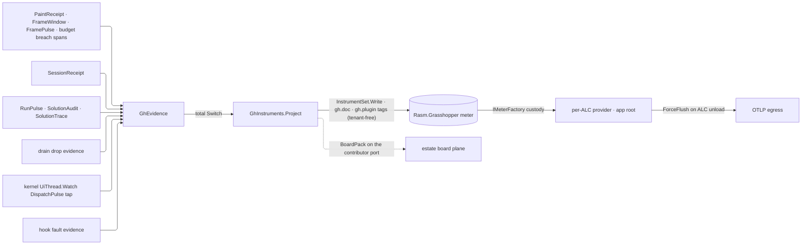

# [RASM_GRASSHOPPER_SHELL_TELEMETRY]

`GhTelemetry` owns the boundary's telemetry admission and receipt projection: one injected `IMeterFactory` mints the `Rasm.Grasshopper` meter, one `GhEvidence` union closes the folder's receipt families, and one total fold turns each receipt into UCUM-named `rasm.grasshopper.*` instrument writes carrying document and plugin attribution. Emitting pages pass receipts and never spell a meter call; providers, exporters, views, and unload custody stay at the app root, so the folder holds zero OpenTelemetry reference.

Every declaration composes the KERNEL telemetry estate as found: instrument rows are `InstrumentSpec.Create` values, handle custody is `InstrumentSet`, bucket advice is the kernel `Buckets` ladder roster, sensitivity is the kernel `Sensitivity` taxonomy (S1-41 — the folder's byte-identical four-row twin deleted), tags mint through the TENANT-FREE `InstrumentSet.Tags` arity (S1-44), the ambient logger seat is the kernel `Cell.Seat` token custody (S1-42), and every latency objective pins its ceiling ON its instrument's declared bucket ladder (S1-43 — a ceiling off the ladder grades a flat zero forever).

## [01]-[INDEX]

- [02]-[CUSTODY]: injected factory admission, per-ALC unload custody, classification law, and the app-root obligation set
- [03]-[ROSTER]: instrument rows, bucket advice, the board pack over them, and the receipt-field-to-instrument kind table
- [04]-[PROJECTION]: evidence union, projection fold, and the attribution tag law

## [02]-[CUSTODY]

- Owner: `GhTelemetry` — the composition capsule pairing the factory-owned instrument spine with logger admission. `GhInstruments` mints the `Rasm.Grasshopper` meter through `IMeterFactory.Create(MeterOptions)` exactly once, stamping the composing plugin's identity as a meter-scope tag, and hands it to the kernel `InstrumentSet` that owns every handle and the write rail.
- Entry: `GhTelemetry.Of(IMeterFactory factory, HookScope plugin, Option<ILoggerFactory> logs = default, Option<string> version = default, Op? key = null)` → `Fin<GhTelemetry>` — the one admission gate; `Instruments` and `Logs` are the two capability slots consumers reach.
- Law: plugin identity is the typed `Shell/hooks.md` `HookScope` — the one process-global plugin key the `(point, scope)` hook registry and the `gh.plugin` meter tag share by construction, so the two per-plugin surfaces cannot fork their key space.
- Law: the injected factory is the sole per-ALC meter lifetime owner — a composing plugin passes its `PluginTelemetryHost.Meters`, and `AssemblyLoadContext.Unloading` drives the host's `ForceFlush`-then-`Dispose` on both providers, so no instrument outlives its plugin and an unload never drops the tail of an export batch.
- Law: `GhTelemetry.Dispose` releases the logger seat only — disposing the minted meter here competes with provider custody.
- Law: meter-scope tags are TENANT-FREE (S1-44) — this boundary mints every tag through the kernel's tenant-free `Tags` arity, `gh.plugin` is plugin identity, and no account or tenant identity enters a meter tag; the tenant-bearing arity is the fabrication estate's and composing it here stamps a tenant this host never has.
- Law: a composition that runs logger-less takes `NullLoggerFactory.Instance` through the `Option` default, never a nullable factory.
- Law: fault-family `[LoggerMessage]` partials live beside their retaining owners — `Canvas/paint.md` `PaintLog`, `Canvas/interaction.md` `InteractionLog`, `Shell/journal.md` `JournalLog`, `Platform/native.md` `NativeLog`, `Platform/capture.md` `CaptureLog` — and resolve their `ILogger` through `GhLog.For` at the fault-record site, so a retained fault emits once when it lands and no consumer polls a `LastFault` cell; a new log class lands its classification sweep in the same pass or it does not land.
- Law: every boundary log payload parameter carries its classification — the kernel `Sensitivity` rows (S1-41) attach as `[UserContent]`/`[HostPath]`/`[MachineIdentity]`/`[AccountIdentity]` parameter attributes on the log partials, so the fail-closed app-root redactor sees every sensitive value and an unclassified boundary line never crosses the export seam invisible; the attach seats at this producer because only the boundary knows a payload embeds user content or a host path.
- Law: two classification rules cover the roster — every `detail` parameter is an `Error.Message` off arbitrary consumer callbacks, preserved host throws, or capture faults (window titles, file paths, user-typed text) and classifies `[UserContent]`; a stall's `operation` parameter is a caller-minted `Op` name spelling member identity and classifies `[MachineIdentity]`. Bounded vocabulary keys (`source` row keys, `lane`, measurements) stay unclassified operational values.
- Law: `Sensitivity.Values` rides the contributor port's `Classifications` column, so every classification value this boundary attaches is rostered at composition and a value present here and absent at the root refuses at admission instead of erasing at egress.
- Law: `GhLog` is the per-load-context ambient logger cell under the kernel `Cell.Seat` token custody (S1-42) — `Of` seats a SUPPLIED factory only while the seat is free and holds the token, a later capsule keeps its own `Logs` without overwriting the live binding, and `Dispose` restores `NullLoggerFactory.Instance` only through its own token, so disposing one capsule never disables another still-live one; collectible plugin ALCs isolate the static per plugin, and an unbound context emits into the null logger at zero cost.
- Law: `GhFault`-raising Components pages take `ILogger` by injection alone because the island imports no UI-thread sibling.
- Law: two co-resident plugins each `Of` over their own per-ALC factory, so identical `rasm.grasshopper.*` instrument names stay isolated by provider scope and the `gh.plugin` meter tag attributes each series to its composing plugin.
- Boundary: app roots mint the string-scoped `TelemetryContributorPort` with `Scope` `Rasm.Grasshopper`, an empty `Instruments` seq, `GhInstruments.Rows` on `Published`, `Sensitivity.Values` on `Classifications`, and `GhInstruments.Board` on the pack column — the two roster columns split by WHO MOUNTS, so a root binds no handle for a per-ALC row and a roster on neither column exports streams the branch naming gate never proves, while pack admission resolves against the port's own declaration so a self-minting contributor proves its board exactly as a mounted one does.
- Boundary: this roster CREATES instruments on the injected per-ALC meter, so `SignalGovernance.Views` reads these streams on its foreign arm and derives each stream's tag keys from the published row's own `Dimensions`.
- Boundary: `GhInstruments` projects the typed `GhEvidence` union ahead of the message envelope, the typed-fold family beside Compute `ComputeInstrumentFan`; message envelope kind-arm tables are a second truth beside the typed fold and never land here.
- Boundary: app-root obligations — the provider admits the `Rasm.Grasshopper` meter by name; sampler, exemplar filter, views, cardinality caps, and OTLP egress bind at the provider; this folder emits receipts, never provider registrations.
- Packages: BCL inbox (`System.Diagnostics.Metrics` — `IMeterFactory`, `MeterOptions`, `Meter`), Microsoft.Extensions.Logging.Abstractions (`ILoggerFactory`, `NullLoggerFactory`), Microsoft.Extensions.Compliance.Abstractions (`DataClassification`, `DataClassificationAttribute` — the classification grammar; the redactor executes at the app root alone, and the csproj row names THIS abstractions package, not the root-only Redaction package), LanguageExt.Core, `Rasm.Domain` (`InstrumentSpec`, `InstrumentKind`, `MeasureForm`, `InstrumentSet`, `Buckets`, `LevelCells`, `BoardPack`, `PanelSpec`, `Objective`, `Sli`, `Sensitivity`, `ClassifiedValue`, `Cell`), `Shell/hooks.md` (`HookScope`).
- Growth: a new capability slot on the capsule is one property with its admission default; a new attribution axis is one meter-scope tag at the mint.

## [03]-[ROSTER]

- Owner: `GhInstruments.Rows` — the kernel `InstrumentSpec.Create` declarations this capsule mounts through `InstrumentSet.Of` and publishes on its port; each row names its own kind and `MeasureForm`, so the kernel (kind × form) bind derivation spells every create and this page spells none, and the duration histograms carry the kernel `Buckets.CanvasFrameSeconds` and `Buckets.AckSeconds` advice rows as the explicit-bucket fallback a backend without base2-exponential histograms reads.
- Owner: `GhInstruments.Board` — the folder's one kernel `BoardPack`, binding a panel per published row beside the three reliability objectives that grade canvas interactivity, marshal latency, and command acknowledgement — solution-object survival stays receipt-only because `SolutionRecord`'s per-object counters are host structural zeros no objective can grade.
- Law: instrument identity de-duplicates by name inside the meter, so name, unit, description, bound policy, and tag vocabulary are declaration facts spelled once ON THE ROW and every mint and every governance read projects from it; units are UCUM (`s`, `{mark}`, `{command}`) and never pre-baked into the name.
- Law: `Head` is the folder's one estate segment — every instrument name and the `OpSlot` tag key concatenate it at compile time, so a segment rename moves one const; `gh.doc` and `gh.plugin` are the folder's compact attribution pair spelled whole by declaration, outside the estate prefix. A FAULT axis takes NO segment: allocating owner and recovery posture are estate-wide facts, so `hook.faults` mounts the kernel `KernelInstrument.OwnerSlot`/`PostureSlot` and writes the kernel `Retriability.Key` value — a `<segment>.fault.*` twin forks one dimension into a per-package pair, and no board then groups a contained canvas fault beside the kernel fault it descends from.
- Law: every row is a projection of a typed receipt already on disk — a metric minted beside this roster is a second truth, and a receipt field no row projects stays receipt-only by declaration.
- Law: the kind table is the closed field-to-instrument correspondence; a new projected field is one table row, one instrument declaration, and one arm edit, never a call-site meter write.
- Law: instrument names, tag keys, and the dimension VALUES an objective partitions on are consts the roster, every arm, and every pack row read, so a rename moves one line and a partition indicator can never grade a value no write produces.
- Law: every tag axis carries a BOUNDED value space or it is not an axis — `op` admits only a generated `SelfOp` case identity, so `session.ack` and `session.commands` partition on the six `SessionOp` cases and nothing else. Caller-minted `Op` is per-entry-point identity, not a dimension: stamping `PaintReceipt.Op` or a dispatch pulse's operation mints one series per calling member and the app root's cardinality caps then decide which paint runs a board can see. Those receipts keep their free-form `Op` as evidence, reaching the log line and the journal row where an unbounded key costs nothing, while their streams partition on the bounded axes they already carry — `gh.doc` for paint and `lane` for the marshal.
- Law: a latency objective's ceiling IS a declared bucket bound of its instrument's own advice ladder (S1-43) — the kernel pack admission proves it, so the frame objectives pin at the `CanvasFrameSeconds` ladder's `0.017` bound (the 60 Hz bucket) and the acknowledgement objective at the `AckSeconds` ladder's `0.1` bound; a free-literal ceiling off the ladder grades a flat zero forever because every sample lands under or over the phantom bound, and `dispatch.body` therefore carries the FRAME ladder, because its budget is frame-relative and its objective must pin on the same ladder it advises.
- Law: one board tile is one `PanelSpec` row and one reliability target one `Objective` row on the same pack; a hand-built dashboard or an alert rule authored beside the pack is the drift the carriage deletes.

Instrument cells and folder-owned tag cells extend the `rasm.grasshopper.` prefix; a key outside the estate namespace spells whole, and the owner and posture cells name the kernel `rasm.fault.*` slots this roster composes rather than mints.

| [INDEX] | [FACT_FIELD]                        | [INSTRUMENT]       | [UNIT]        | [KIND]         | [TAGS]                     |
| :-----: | :---------------------------------- | :----------------- | :------------ | :------------- | :------------------------- |
|  [01]   | `PassReceipt.Tally` gauged span     | `paint.duration`   | `s`           | `Distribution` | `gh.doc`                   |
|  [02]   | `PassReceipt` marks per disposition | `paint.marks`      | `{mark}`      | `Count`        | `gh.doc`, `disposition`    |
|  [03]   | `FrameWindow.Cost`                  | `frame.window`     | `s`           | `Distribution` | `gh.doc`                   |
|  [04]   | `FramePulse` seven phase spans      | `frame.phase`      | `s`           | `Distribution` | `gh.doc`, `phase`          |
|  [05]   | `SessionReceipt` gauged span        | `session.ack`      | `s`           | `Distribution` | `gh.doc`, `op`, `deferred` |
|  [06]   | `SessionReceipt` per command        | `session.commands` | `{command}`   | `Count`        | `gh.doc`, `op`, `deferred` |
|  [07]   | `RunPulse.Invalid`                  | `solution.invalid` | `{parameter}` | `Distribution` | `gh.doc`                   |
|  [08]   | `SolutionAudit` per completed run   | `solution.runs`    | `{run}`       | `Count`        | `gh.doc`, `culmination`    |
|  [09]   | `SolutionTrace.Pulses` per row      | `solution.pulses`  | `{pulse}`     | `Count`        | `gh.doc`, `signal`         |
|  [10]   | drain drop evidence per shed fact   | `drain.dropped`    | `{fact}`      | `Count`        | `source`                   |
|  [11]   | kernel `DispatchPulse` span         | `dispatch.body`    | `s`           | `Distribution` | `lane`                     |
|  [12]   | kernel `DispatchPulse` breach       | `dispatch.stalls`  | `{stall}`     | `Count`        | `lane`                     |
|  [13]   | `GaugedSpan<BudgetRow>` per breach  | `frame.breach`     | `{breach}`    | `Count`        | `gh.doc`, `gate`           |
|  [14]   | hook subscriber fault               | `hook.faults`      | `{fault}`     | `Count`        | `point`, owner, posture    |
|  [15]   | `CaptureBreach` non-bearing frame   | `capture.breach`   | `{breach}`    | `Count`        | `gh.doc`, `lane`           |

- Boundary: feeders are the receipt owners — `Canvas/paint.md` (`PaintReceipt`), `Canvas/motion.md` (`FrameWindow`, the `BudgetGate` breach spans), `Canvas/canvas.md` (`FramePulse`), `Shell/session.md` (`SessionReceipt`), `Document/solution.md` (`RunPulse`, `SolutionAudit`, `SolutionTrace`), the kernel `UiThread.Watch` pulse tap (`DispatchPulse`), `Shell/hooks.md` (parked `IsolatedFault` evidence through the rail's fault-cell tap), and the `Shell/events.md` bounded drain's shed accounting.
- Growth: a new instrument is one `Rows` declaration and one arm write, the handle deriving; a new bucket policy is one kernel `Buckets` row; a per-phase or per-disposition family is one instrument with a tag axis, never sibling instruments per value; a new board tile is one `PanelSpec` and a new reliability target one `Objective` on the same pack.

## [04]-[PROJECTION]

- Owner: `GhEvidence` `[Union]` — the one fact family closing the folder's receipt corpus; `GhInstruments.Project` — the one total fold from evidence onto the kernel write rail.
- Entry: `Project(GhEvidence fact)` → `Fin<Unit>` — every document-scoped case carries the host `Document.Identity` guid, and `GhEvidence.Document` projects `Some(document)` for those cases and `None` for process-scoped evidence; every document-scoped write carries `gh.doc = {documentId:N}`.
- Law: the fold is the generated total `Switch` — a new receipt family is one union case, and the build breaks every projection site until its arm decides instrument writes or returns `unit` explicitly.
- Law: drop evidence is process-scoped — the `DropCase` write carries its `source` lane and no document tag, because a shed fact's document identity died with the fact.
- Law: document attribution is fact-owned — `PaintCase`, `WindowCase`, `PulseCase`, `SessionCase`, `ProbeCase`, `RunCase`, `TraceCase`, `BreachCase`, and `CaptureCase` carry `DocumentId`; `DropCase`, `DispatchCase`, and `HookFaultCase` project no document. `SessionJournal.Append` derives its partition from the enclosing fact projection and takes no independently supplied document argument.
- Law: per-document tag fan-out is bounded by open documents, and the app-root views own cardinality caps; the fold never re-validates a receipt — the typed owner already admitted it, and `IsValid` stays the acceptance oracle at the emitting seam.
- Law: a refused write rides the returned rail outward to the composition that subscribed the fold, which hands it to the capsule's rail-shaped `Observe`, so an unmounted name or a family mismatch parks as `IsolatedFault` evidence rather than vanishing into a void write.
- Boundary: kernel marshal latency arrives as `DispatchCase`; each hook `IsolatedFault` enters `HookFaultCase` whole, so point, locally derived owner, and recursive recovery posture project without losing its `Error`.
- Packages: BCL inbox, LanguageExt.Core, Thinktecture.Runtime.Extensions, `Rasm.Domain` (`Op`), `Rasm.Interaction` (`DispatchPulse`), `Rasm.Parametric` (`GaugedSpan`), `Canvas/paint.md`/`Canvas/motion.md`/`Canvas/canvas.md`/`Document/solution.md`/`Shell/session.md` receipt owners.
- Growth: a new evidence case is one union case and one arm with its roster row; a new tag axis on an existing write is one `Tag` pair at the arm.

```csharp signature
// --- [RUNTIME_PRELUDE] ----------------------------------------------------------------------
using System.Diagnostics.Metrics;
using Microsoft.Extensions.Compliance.Classification;
using Microsoft.Extensions.Logging;
using Microsoft.Extensions.Logging.Abstractions;
using Rasm.Domain;
using Rasm.Grasshopper.Canvas;
using Rasm.Grasshopper.Document;
using Rasm.Grasshopper.Platform;
using Rasm.Interaction;
using Rasm.Parametric;

namespace Rasm.Grasshopper.Shell;

// --- [TYPES] --------------------------------------------------------------------------------
// Classification VOCABULARY is the kernel `Sensitivity` roster (S1-41 — the folder's byte-identical
// four-row twin deleted); these four attribute classes are the folder's [LoggerMessage] attach points and
// derive every value from the kernel rows, so a re-spelling cannot fork the taxonomy.
public sealed class UserContentAttribute() : DataClassificationAttribute(
    new DataClassification(Sensitivity.Taxonomy, Sensitivity.UserContent.Key));
public sealed class HostPathAttribute() : DataClassificationAttribute(
    new DataClassification(Sensitivity.Taxonomy, Sensitivity.HostPath.Key));
public sealed class MachineIdentityAttribute() : DataClassificationAttribute(
    new DataClassification(Sensitivity.Taxonomy, Sensitivity.MachineIdentity.Key));
public sealed class AccountIdentityAttribute() : DataClassificationAttribute(
    new DataClassification(Sensitivity.Taxonomy, Sensitivity.AccountIdentity.Key));

[Union]
public abstract partial record GhEvidence {
    private GhEvidence() { }
    public sealed record PaintCase(Guid DocumentId, PassReceipt Receipt) : GhEvidence;
    public sealed record WindowCase(Guid DocumentId, FrameWindow Window) : GhEvidence;
    public sealed record PulseCase(Guid DocumentId, FramePulse Pulse) : GhEvidence;
    public sealed record SessionCase(Guid DocumentId, SessionReceipt Receipt) : GhEvidence;
    public sealed record ProbeCase(Guid DocumentId, RunPulse Pulse) : GhEvidence;
    public sealed record RunCase(Guid DocumentId, SolutionAudit Audit) : GhEvidence;
    public sealed record TraceCase(Guid DocumentId, SolutionTrace Trace) : GhEvidence;
    public sealed record DropCase(string Source, long Dropped) : GhEvidence;
    public sealed record DispatchCase(DispatchPulse Pulse) : GhEvidence;
    public sealed record BreachCase(Guid DocumentId, GaugedSpan<BudgetRow> Span) : GhEvidence;
    public sealed record CaptureCase(Guid DocumentId, CaptureBreach Breach) : GhEvidence;
    public sealed record HookFaultCase(IsolatedFault Fault) : GhEvidence;

    public Option<Guid> Document => this.Switch(
        paintCase: static fact => Some(fact.DocumentId),
        windowCase: static fact => Some(fact.DocumentId),
        pulseCase: static fact => Some(fact.DocumentId),
        sessionCase: static fact => Some(fact.DocumentId),
        probeCase: static fact => Some(fact.DocumentId),
        runCase: static fact => Some(fact.DocumentId),
        traceCase: static fact => Some(fact.DocumentId),
        dropCase: static _ => Option<Guid>.None,
        dispatchCase: static _ => Option<Guid>.None,
        breachCase: static fact => Some(fact.DocumentId),
        captureCase: static fact => Some(fact.DocumentId),
        hookFaultCase: static _ => Option<Guid>.None);
}

// --- [SERVICES] -----------------------------------------------------------------------------
[BoundaryAdapter]
public sealed class GhInstruments {
    private const string MeterName = "Rasm.Grasshopper";

    // ONE head for the folder's whole vocabulary: every instrument name and every rasm-owned tag key
    // concatenates it at compile time, so the segment is stated once and the branch naming gate proves it
    // against the domain roster through this roster's port column.
    private const string Head = "rasm.grasshopper.";

    // Tag keys: `OpSlot` admits a generated `SelfOp` case identity ALONE — a bounded six-value space —
    // never a caller-minted `Op`, whose value space is every entry point in the boundary.
    private const string DocSlot = "gh.doc";
    private const string OpSlot = Head + "op";
    private const string DispositionSlot = "disposition";
    private const string PhaseSlot = "phase";
    private const string DeferredSlot = "deferred";
    private const string CulminationSlot = "culmination";
    private const string SignalSlot = "signal";
    private const string SourceSlot = "source";
    private const string LaneSlot = "lane";
    private const string GateSlot = "gate";
    private const string PointSlot = "point";

    // Dimension VALUES an objective partitions on are spellings, exactly as slot keys are.
    private const string DrawnValue = "drawn";
    private const string CulledValue = "culled";
    private const string RefusedValue = "refused";

    // Instrument names: the declaration roster, every write site, and every panel and objective row read
    // these same consts. The stream constants carry a `Stream` tail wherever the bare name would equal a
    // feeder type's simple name (a member identifier equal to a type's simple name captures that name inside
    // its declaring class).
    public const string PaintDuration = Head + "paint.duration";
    public const string PaintMarks = Head + "paint.marks";
    public const string FrameWindowStream = Head + "frame.window";
    public const string FramePhase = Head + "frame.phase";
    public const string SessionAck = Head + "session.ack";
    public const string SessionCommands = Head + "session.commands";
    public const string SolutionInvalid = Head + "solution.invalid";
    public const string SolutionRuns = Head + "solution.runs";
    public const string SolutionPulses = Head + "solution.pulses";
    public const string DrainDropped = Head + "drain.dropped";
    public const string DispatchBody = Head + "dispatch.body";
    public const string DispatchStalls = Head + "dispatch.stalls";
    public const string FrameBreach = Head + "frame.breach";
    public const string CaptureBreaches = Head + "capture.breach";
    public const string HookFaults = Head + "hook.faults";

    // Declaration roster on the KERNEL's one Create factory: name, kind, form, unit, description, tag
    // vocabulary, and bucket advice each live ONCE; the kernel (kind x form) bind derivation mints every
    // handle and the port publishes the rows. These instruments mint on the injected per-ALC meter this
    // capsule owns, so `Published` is their column.
    public static readonly Seq<InstrumentSpec> Rows = Seq(
        InstrumentSpec.Create(PaintDuration, InstrumentKind.Distribution, MeasureForm.Real, "s",
            "Paint plan execution wall time per receipt.", Seq(DocSlot), Some(Buckets.CanvasFrameSeconds), None, None),
        InstrumentSpec.Create(PaintMarks, InstrumentKind.Count, MeasureForm.Whole, "{mark}",
            "Paint marks by disposition, drawn against culled.", Seq(DocSlot, DispositionSlot), None, None, None),
        InstrumentSpec.Create(FrameWindowStream, InstrumentKind.Distribution, MeasureForm.Real, "s",
            "Motion draw-window cost per sampled frame.", Seq(DocSlot), Some(Buckets.CanvasFrameSeconds), None, None),
        InstrumentSpec.Create(FramePhase, InstrumentKind.Distribution, MeasureForm.Real, "s",
            "Canvas frame cost per paint phase.", Seq(DocSlot, PhaseSlot), Some(Buckets.CanvasFrameSeconds), None, None),
        InstrumentSpec.Create(SessionAck, InstrumentKind.Distribution, MeasureForm.Real, "s",
            "Session command acknowledgement latency.", Seq(DocSlot, OpSlot, DeferredSlot), Some(Buckets.AckSeconds), None, None),
        InstrumentSpec.Create(SessionCommands, InstrumentKind.Count, MeasureForm.Whole, "{command}",
            "Session commands by operation and posture.", Seq(DocSlot, OpSlot, DeferredSlot), None, None, None),
        InstrumentSpec.Create(SolutionInvalid, InstrumentKind.Distribution, MeasureForm.Whole, "{parameter}",
            "Invalid parameter count per solution probe.", Seq(DocSlot), None, None, None),
        InstrumentSpec.Create(SolutionRuns, InstrumentKind.Count, MeasureForm.Whole, "{run}",
            "Completed solution runs by culmination.", Seq(DocSlot, CulminationSlot), None, None, None),
        InstrumentSpec.Create(SolutionPulses, InstrumentKind.Count, MeasureForm.Whole, "{pulse}",
            "Solution lifecycle pulses by signal ordinal.", Seq(DocSlot, SignalSlot), None, None, None),
        InstrumentSpec.Create(DrainDropped, InstrumentKind.Count, MeasureForm.Whole, "{fact}",
            "Evidence facts shed by the bounded drain per source lane.", Seq(SourceSlot), None, None, None),
        // Marshal budget is FRAME-RELATIVE, so the frame ladder advises it and its objective pins on
        // Same ladder it advises (S1-43).
        InstrumentSpec.Create(DispatchBody, InstrumentKind.Distribution, MeasureForm.Real, "s",
            "UI-thread marshal body wall time per lane.", Seq(LaneSlot), Some(Buckets.CanvasFrameSeconds), None, None),
        InstrumentSpec.Create(DispatchStalls, InstrumentKind.Count, MeasureForm.Whole, "{stall}",
            "Dispatch bodies breaching their lane budget.", Seq(LaneSlot), None, None, None),
        InstrumentSpec.Create(FrameBreach, InstrumentKind.Count, MeasureForm.Whole, "{breach}",
            "Frame-budget violations judged by the budget gate.", Seq(DocSlot, GateSlot), None, None, None),
        InstrumentSpec.Create(CaptureBreaches, InstrumentKind.Count, MeasureForm.Whole, "{breach}",
            "Paint claims with no bearing capture frame.", Seq(DocSlot, LaneSlot), None, None, None),
        InstrumentSpec.Create(HookFaults, InstrumentKind.Count, MeasureForm.Whole, "{fault}",
            "Contained hook-subscriber faults by point, allocating owner, and recovery posture.",
            Seq(PointSlot, KernelInstrument.OwnerSlot, KernelInstrument.PostureSlot), None, None, None));

    // Latency ceilings pinned ON the declared ladders (S1-43): the frame ceiling IS the CanvasFrameSeconds
    // 60 Hz bucket bound and the acknowledgement ceiling IS the AckSeconds perceptual bound — the kernel pack
    // admission proves membership, so a drifted ladder refuses while the descriptor is still editable.
    private static readonly Duration FrameBound = Duration.FromSeconds(0.017d);
    private static readonly Duration AckBound = Duration.FromSeconds(0.1d);

    // Boards and reliability policy travel WITH the roster they name and prove against this port's OWN
    // declaration. Widgets stay absent so each row's measurement shape derives the canonical one, and windows
    // pass `Duration.Zero` to take the kernel compliance default rather than restating a literal per row.
    public static readonly BoardPack Board = new(
        Wire: "grasshopper.fan", // the provenance key the deploy tuple admits this projection under; pack and key are one value
        Panels: Seq(
            new PanelSpec("canvas frame window", FrameWindowStream, Seq(DocSlot), None),
            new PanelSpec("frame cost by phase", FramePhase, Seq(DocSlot, PhaseSlot), None),
            new PanelSpec("frame budget breaches", FrameBreach, Seq(DocSlot, GateSlot), None),
            new PanelSpec("capture proof breaches", CaptureBreaches, Seq(DocSlot, LaneSlot), None),
            new PanelSpec("paint duration", PaintDuration, Seq(DocSlot), None),
            new PanelSpec("paint marks", PaintMarks, Seq(DocSlot, DispositionSlot), None),
            new PanelSpec("session acknowledgement", SessionAck, Seq(DocSlot, OpSlot, DeferredSlot), None),
            new PanelSpec("session commands", SessionCommands, Seq(DocSlot, OpSlot, DeferredSlot), None),
            new PanelSpec("solution runs", SolutionRuns, Seq(DocSlot, CulminationSlot), None),
            new PanelSpec("solution pulses", SolutionPulses, Seq(DocSlot, SignalSlot), None),
            new PanelSpec("invalid parameters", SolutionInvalid, Seq(DocSlot), None),
            new PanelSpec("marshal body cost", DispatchBody, Seq(LaneSlot), None),
            new PanelSpec("marshal stalls", DispatchStalls, Seq(LaneSlot), None),
            new PanelSpec("shed evidence", DrainDropped, Seq(SourceSlot), None),
            new PanelSpec("contained hook faults", HookFaults, Seq(PointSlot), None)),
        Objectives: Seq(
            Objective.Create("grasshopper.canvas.frame", new Sli.Latency(FrameWindowStream, FrameBound, 0.95d), 0.99d, Duration.Zero),
            Objective.Create("grasshopper.dispatch.body", new Sli.Latency(DispatchBody, FrameBound, 0.99d), 0.99d, Duration.Zero),
            Objective.Create("grasshopper.session.ack", new Sli.Latency(SessionAck, AckBound, 0.99d), 0.99d, Duration.Zero)));

    // Whole handle custody is the kernel `InstrumentSet`: it derives every create from the row's own
    // (kind x form) pair, de-duplicates by name inside the meter, and returns the typed write rail.
    private readonly InstrumentSet set;

    private GhInstruments(InstrumentSet set) => this.set = set;

    // No pulled row declares here, so the cell store mounts empty and stays the kernel's.
    internal static GhInstruments Of(IMeterFactory factory, HookScope plugin, Option<string> version) =>
        new(set: InstrumentSet.Of(new LevelCells(), (factory.Create(new MeterOptions(MeterName) {
            Version = version.Match<string?>(Some: static held => held, None: static () => null),
            // TENANT-FREE by law (S1-44): plugin identity is the only meter-scope tag this host stamps.
            Tags = [new KeyValuePair<string, object?>("gh.plugin", (string)plugin)],
        }), Rows)));

    // Projection returns the kernel write rail rather than swallowing it: a refused measurement reaches the
    // composition that subscribed this fold, which hands it straight to the capsule's rail-shaped `Observe`
    // so a mount defect parks as an `IsolatedFault` beside every other tap fault. Multi-write arms chain on
    // `Bind`, so the first refusal names the offending row instead of a later write masking it.
    public Fin<Unit> Project(GhEvidence fact) =>
        fact.Switch<GhInstruments, Fin<Unit>>(
            state: this,
            paintCase: static (spine, evidence) => spine.Painted(doc: evidence.DocumentId.ToString("N"), receipt: evidence.Receipt),
            windowCase: static (spine, evidence) => spine.Windowed(doc: evidence.DocumentId.ToString("N"), window: evidence.Window),
            pulseCase: static (spine, evidence) => spine.Pulsed(doc: evidence.DocumentId.ToString("N"), pulse: evidence.Pulse),
            sessionCase: static (spine, evidence) => spine.Settled(doc: evidence.DocumentId.ToString("N"), receipt: evidence.Receipt),
            probeCase: static (spine, evidence) => spine.Probed(doc: evidence.DocumentId.ToString("N"), pulse: evidence.Pulse),
            runCase: static (spine, evidence) => spine.Ran(doc: evidence.DocumentId.ToString("N"), audit: evidence.Audit),
            traceCase: static (spine, evidence) => spine.Chronicled(doc: evidence.DocumentId.ToString("N"), trace: evidence.Trace),
            dropCase: static (spine, evidence) => spine.Dropped(source: evidence.Source, dropped: evidence.Dropped),
            dispatchCase: static (spine, evidence) => spine.Marshalled(pulse: evidence.Pulse),
            breachCase: static (spine, evidence) => spine.Breached(doc: evidence.DocumentId.ToString("N"), span: evidence.Span),
            captureCase: static (spine, evidence) => spine.Proofed(doc: evidence.DocumentId.ToString("N"), breach: evidence.Breach),
            hookFaultCase: static (spine, evidence) => spine.Hooked(fault: evidence.Fault));

    // `PaintReceipt.Op` is the caller's own `Op`, so it is receipt evidence and a log-line field, never a tag:
    // one series per calling member is unbounded cardinality on the busiest instrument the roster carries.
    private Fin<Unit> Painted(string doc, PassReceipt receipt) =>
        set.Write(PaintDuration, receipt.Tally.Span.Elapsed.TotalSeconds, InstrumentSet.Tags((DocSlot, doc)))
            .Bind(_ => set.Write(PaintMarks, (long)receipt.Tally.Drawn, InstrumentSet.Tags((DocSlot, doc), (DispositionSlot, DrawnValue))))
            .Bind(_ => set.Write(PaintMarks, (long)receipt.Tally.Culled, InstrumentSet.Tags((DocSlot, doc), (DispositionSlot, CulledValue))))
            .Bind(_ => set.Write(PaintMarks, (long)receipt.Refused.Count, InstrumentSet.Tags((DocSlot, doc), (DispositionSlot, RefusedValue))));

    private Fin<Unit> Windowed(string doc, FrameWindow window) =>
        set.Write(FrameWindowStream, window.Cost.TotalSeconds, InstrumentSet.Tags((DocSlot, doc)));

    // Seven phase spans ride ONE instrument under a phase axis, so a new phase is one row in this fold and
    // never a sibling instrument the roster, the board, and the view predicate would each have to learn.
    private Fin<Unit> Pulsed(string doc, FramePulse pulse) =>
        Seq(("grid", pulse.Grid), ("wire", pulse.Wire), ("text", pulse.Text), ("icon", pulse.Icon),
            ("shape", pulse.Shape), ("layout", pulse.Layout), ("full", pulse.FullFrame))
            .TraverseM(row => set.Write(FramePhase, row.Item2.TotalSeconds,
                InstrumentSet.Tags((DocSlot, doc), (PhaseSlot, row.Item1)))).As().Map(static _ => unit);

    // Tag set binds ONCE for both writes through a single-arm switch. `SessionReceipt.Operation` is the
    // generated `SelfOp` every `SessionOp` arm returns, so the `op` axis is the six-case command vocabulary
    // and stays bounded by construction.
    private Fin<Unit> Settled(string doc, SessionReceipt receipt) =>
        InstrumentSet.Tags((DocSlot, doc), (OpSlot, receipt.Operation.ToString()), (DeferredSlot, receipt.Deferred)) switch {
            var tags => set.Write(SessionAck, receipt.Latency.TotalSeconds, tags).Bind(_ => set.Write(SessionCommands, 1L, tags)),
        };

    private Fin<Unit> Probed(string doc, RunPulse pulse) =>
        set.Write(SolutionInvalid, (long)pulse.Invalid, InstrumentSet.Tags((DocSlot, doc)));

    // `SolutionRecord` assigns no per-object counters (host structural zeros), so the run write carries the
    // culmination phase alone; per-object expiry accounting re-enters as one arm over drained expiry rows the
    // moment a consumer demands it — never off the record's unassigned fields.
    private Fin<Unit> Ran(string doc, SolutionAudit audit) =>
        set.Write(SolutionRuns, 1L, InstrumentSet.Tags((DocSlot, doc), (CulminationSlot, audit.Culmination.ToString())));

    private Fin<Unit> Chronicled(string doc, SolutionTrace trace) =>
        trace.Pulses.TraverseM(row => set.Write(SolutionPulses, 1L,
            InstrumentSet.Tags((DocSlot, doc), (SignalSlot, row.Signal.Key)))).As().Map(static _ => unit);

    private Fin<Unit> Dropped(string source, long dropped) =>
        set.Write(DrainDropped, dropped, InstrumentSet.Tags((SourceSlot, source)));

    // Breach counts on the SAME tag set the body write carries, so a stalled lane reads as a slice of its own
    // duration series; a passing pulse counts nothing, keeping the stall population the breaches alone.
    private Fin<Unit> Marshalled(DispatchPulse pulse) =>
        InstrumentSet.Tags((LaneSlot, pulse.Span.Lane.Key)) switch {
            var tags => set.Write(DispatchBody, pulse.Span.Elapsed.TotalSeconds, tags)
                .Bind(_ => pulse.Span.Breached ? set.Write(DispatchStalls, 1L, tags) : Fin.Succ(unit)),
        };

    private Fin<Unit> Breached(string doc, GaugedSpan<BudgetRow> span) =>
        set.Write(FrameBreach, 1L, InstrumentSet.Tags((DocSlot, doc), (GateSlot, span.Lane.Key)));

    private Fin<Unit> Proofed(string doc, CaptureBreach breach) =>
        set.Write(CaptureBreaches, 1L, InstrumentSet.Tags((DocSlot, doc), (LaneSlot, breach.Span.Lane.Key)));

    private Fin<Unit> Hooked(IsolatedFault fault) => set.Write(
        HookFaults,
        1L,
        InstrumentSet.Tags(
            (PointSlot, fault.Point.ToString()),
            (KernelInstrument.OwnerSlot, fault.Cause.Owner.Match<object?>(Some: static owner => owner.Key, None: static () => null)),
            (KernelInstrument.PostureSlot, Redrive.Posture(fault.Cause).Key)));
}

// Ambient logger seat rides the KERNEL Cell.Seat token custody (S1-42): a free seat commits the factory
// and hands back the token; a held seat keeps its live binding and answers Ceded; only the holder's token
// restores the null sink — the hand-rolled Atom + Interlocked seat ladder is unspellable.
[BoundaryAdapter]
public static class GhLog {
    private static readonly Atom<Option<(object Token, ILoggerFactory Factory)>> Seat =
        Atom(Option<(object, ILoggerFactory)>.None);

    public static ILogger For(string category) =>
        Seat.Value.Match(
            Some: static held => held.Factory,
            None: static () => (ILoggerFactory)NullLoggerFactory.Instance).CreateLogger(categoryName: category);

    internal static Option<object> Bind(ILoggerFactory factory) {
        object token = new();
        return Cell.Seat<(object Token, ILoggerFactory Factory), object>(
            cell: Seat,
            mint: () => (Value: (Token: token, Factory: factory), Token: token)).Token;
    }

    // Token-guarded release READS its verdict: a foreign token DECLINES and the live binding survives;
    // its predecessor, a filter-swap that silently kept-or-dropped, is the deleted discard.
    internal static Transition<Option<(object Token, ILoggerFactory Factory)>> Unbind(object token) =>
        Cell.Step(cell: Seat,
            step: held => held.Filter(row => ReferenceEquals(row.Token, token))
                .Map(_ => Option<(object, ILoggerFactory)>.None),
            declined: Op.Of().InvalidContext());
}

[BoundaryAdapter]
public sealed class GhTelemetry : IDisposable {
    private readonly Option<object> seat;

    private GhTelemetry(GhInstruments instruments, ILoggerFactory logs, Option<object> seat) =>
        (Instruments, Logs, this.seat) = (instruments, logs, seat);

    public GhInstruments Instruments { get; }

    public ILoggerFactory Logs { get; }

    public static Fin<GhTelemetry> Of(
        IMeterFactory factory, HookScope plugin,
        Option<ILoggerFactory> logs = default, Option<string> version = default, Op? key = null) {
        Op op = key.OrDefault();
        // HookScope IS the admission — the typed key arrived trimmed and nonblank through its own factory, and
        // a default-constructed struct refuses here so an unadmitted scope never reaches the meter tag.
        return from owner in op.Need(factory)
               from identity in op.AcceptValue(value: plugin)
               from telemetry in op.Catch(body: () => {
                   // only a SUPPLIED factory contends for the ambient seat — an Option-defaulted null sink never binds,
                   // so a logger-less capsule cannot displace a live binding; the held token is the disposal key.
                   Option<object> seat = logs.Bind(GhLog.Bind);
                   return Fin.Succ(new GhTelemetry(
                       instruments: GhInstruments.Of(factory: owner, plugin: identity, version: version),
                       logs: logs.IfNone(NullLoggerFactory.Instance),
                       seat: seat));
               })
               select telemetry;
    }

    // Declined unbind IS the design — a foreign token's dispose leaves the live binding untouched; both
    // transition cases are terminal here, which is the one reading this verdict admits.
    public void Dispose() => ignore(seat.Map(GhLog.Unbind));
}
```


```mermaid
---
config:
  layout: elk
  flowchart:
    curve: linear
    padding: 25
---
flowchart LR
    accTitle: Project boundary receipts into attributed instruments
    accDescr: Receipt families from paint, motion, session, solution, kernel dispatch, hooks, and drain owners enter one evidence union; a total fold writes tagged instruments on the meter minted through the injected per-ALC factory, and the app root flushes providers on load-context unload.
    PaintR["PaintReceipt · FrameWindow · FramePulse · budget breach spans"] --> Union["GhEvidence"]
    SessionR["SessionReceipt"] --> Union
    SolutionR["RunPulse · SolutionAudit · SolutionTrace"] --> Union
    DrainR["drain drop evidence"] --> Union
    DispatchR["kernel UiThread.Watch DispatchPulse tap"] --> Union
    HookR["hook fault evidence"] --> Union
    Union -->|"total Switch"| Fan["GhInstruments.Project"]
    Fan -->|"InstrumentSet.Write · gh.doc · gh.plugin tags (tenant-free)"| MeterNode[("Rasm.Grasshopper meter")]
    Fan -.->|"BoardPack on the contributor port"| Boards["estate board plane"]
    MeterNode -->|"IMeterFactory custody"| Host["per-ALC provider · app root"]
    Host -->|"ForceFlush on ALC unload"| Egress["OTLP egress"]
```

## [05]-[DENSITY_BAR]

| [INDEX] | [CONCERN]           | [OWNER]                                    | [RAIL]                                   | [CASES] |
| :-----: | :------------------ | :----------------------------------------- | :--------------------------------------- | :-----: |
|  [01]   | receipt ingress     | `GhEvidence`                               | closed union → one total projection fold |   12    |
|  [02]   | instrument roster   | `GhInstruments`                            | `Project(GhEvidence) → Fin<Unit>`        |   15    |
|  [03]   | telemetry admission | `GhTelemetry`                              | `Of → Fin<GhTelemetry>`; logger inverse  |    1    |
|  [04]   | ambient log seam    | `GhLog`                                    | `For(category) → ILogger`; `Cell.Seat`   |    1    |
|  [05]   | classification      | kernel `Sensitivity` + 4 attach attributes | port roster + `[LoggerMessage]` params   |    4    |

`Op`, `Lease<T>`, the kernel instrument mechanism (`InstrumentSpec.Create`, `InstrumentSet`, `Buckets`, `BoardPack`, `Sensitivity`, `Cell.Seat`), and every receipt owner are composed upstream; the app root owns `IMeterFactory` custody, provider binding, views, and OTLP egress — nothing on this page names an exporter. Deleted: the `GhSensitivity` taxonomy twin (S1-41), the hand-rolled seat ladder (S1-42), the three folder-named spec factories (`Advised`/`Count`/`Distribution` → the kernel's one `Create`), the off-ladder objective ceilings (S1-43), the `DocumentToken`/session-cache/`ReportTagMetrics` obligations (cache estate deleted), and the `EtoDispatch.Watch`/`RuntimeLog`/`UiEventsLog` references (kernel `UiThread.Watch` and the kernel input estate own those seams).

## [06]-[RESEARCH]

<!-- source-only: research row template:
[TOKEN]-[OPEN|BLOCKED]: <exact question>; <verification route>.
[SPLIT_MEMBER]-[OPEN]: does `shape-core` expose `split_all`; verify against the member rail.
-->

(none)
