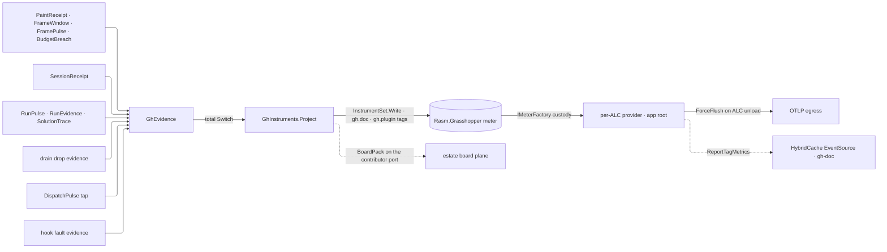

# [RASM_GRASSHOPPER_SHELL_TELEMETRY]

`GhTelemetry` owns the boundary's telemetry admission and receipt projection: one injected `IMeterFactory` mints the `Rasm.Grasshopper` meter, one `GhEvidence` union closes the folder's receipt families, and one total fold turns each receipt into UCUM-named `rasm.grasshopper.*` instrument writes carrying document and plugin attribution. Emitting pages pass receipts and never spell a meter call; providers, exporters, views, and unload custody stay at the app root, so the folder holds zero OpenTelemetry reference.

## [01]-[INDEX]

- [02]-[CUSTODY]: injected factory admission, per-ALC unload custody, and the app-root obligation set
- [03]-[ROSTER]: instrument rows, bucket advice, the board pack over them, and the receipt-field-to-instrument kind table
- [04]-[PROJECTION]: evidence union, projection fold, and the attribution tag law

## [02]-[CUSTODY]

- Owner: `GhTelemetry` — the composition capsule pairing the factory-owned instrument spine with logger admission. `GhInstruments` mints the `Rasm.Grasshopper` meter through `IMeterFactory.Create(MeterOptions)` exactly once, stamping the composing plugin's identity as a meter-scope tag, and hands it to the kernel `InstrumentSet` that owns every handle and the write rail.
- Entry: `GhTelemetry.Of(IMeterFactory factory, HookScope plugin, Option<ILoggerFactory> logs = default, Option<string> version = default, Op? key = null)` → `Fin<GhTelemetry>` — the one admission gate; `Instruments` and `Logs` are the two capability slots consumers reach.
- Law: plugin identity is the typed `Shell/hooks.md` `HookScope` — the one process-global plugin key the `(point, scope)` hook registry and the `gh.plugin` meter tag share by construction, so the two per-plugin surfaces cannot fork their key space; a raw `string plugin` parameter re-deriving the trim/nonblank admission inline was the fork the folder ruling forecloses, and the `RULINGS.md` single-typed row now holds with zero raw-string plugin surfaces.
- Law: the injected factory is the sole per-ALC meter lifetime owner — a composing plugin passes its `PluginTelemetryHost.Meters`, and `AssemblyLoadContext.Unloading` drives the host's `ForceFlush`-then-`Dispose` on both providers, so no instrument outlives its plugin and an unload never drops the tail of an export batch. `GhTelemetry.Dispose` unbinds the composition logger only; disposing the minted meter here competes with provider custody.
- Law: a composition that runs logger-less takes `NullLoggerFactory.Instance` through the `Option` default, never a nullable factory; fault-family `[LoggerMessage]` partials live beside their retaining owners (`Canvas/paint.md` `PaintLog`, `Shell/events.md` `UiEventsLog`, `Eto/runtime.md` `RuntimeLog`, `Platform/native.md` `NativeLog`, `Platform/capture.md` `CaptureLog`) and resolve their `ILogger` through `GhLog.For` at the fault-record site, so a retained fault emits once when it lands and no consumer polls a `LastFault` cell — five partials, and a new log class lands its classification sweep in the same pass or it does not land.
- Law: every boundary log payload parameter carries its `DataClassification` — the `GhSensitivity` rows below are the folder's spellings of the app-root taxonomy values, attached as `[UserContent]`/`[HostPath]`/`[MachineIdentity]`/`[AccountIdentity]` parameter attributes on the five partials, so the fail-closed app-root redactor sees every sensitive value and an unclassified boundary line never crosses the export seam invisible. The branch classification ruling seats the attach at this producer because only the boundary knows a payload embeds user content or a host path.
- Law: two classification rules cover the roster — every `detail` parameter is a `Fault`-derived `Error.Message` off arbitrary consumer callbacks, host throws, or capture faults (window titles, file paths, user-typed text) and classifies `[UserContent]`; `DispatchStall`'s `operation` parameter is a caller-minted `Op` name spelling member identity and classifies `[MachineIdentity]`. Bounded vocabulary keys (`source` as a `UiSource` row key, `lane`, measurements) stay unclassified operational values.
- Law: `GhSensitivity.Values` rides the contributor port's `Classifications` column, so every classification value this boundary attaches is rostered at composition and a value present here and absent at the root refuses at admission instead of erasing at egress.
- Law: `GhLog` is the per-load-context ambient logger cell under first-mount-wins seat custody — `Of` binds a SUPPLIED factory only while the seat is free and holds the seat token, a later capsule keeps its own `Logs` without overwriting the live binding, and `Dispose` restores `NullLoggerFactory.Instance` only through its own token, so disposing one capsule never disables another still-live one; collectible plugin ALCs isolate the static per plugin, so two co-resident plugins never share a binding, and an unbound context emits into the null logger at zero cost. `GhFault`-raising Components pages take `ILogger` by injection alone because the island imports no UI-thread sibling.
- Law: two co-resident plugins each `Of` over their own per-ALC factory, so identical `rasm.grasshopper.*` instrument names stay isolated by provider scope and the `gh.plugin` meter tag attributes each series to its composing plugin.
- Boundary: app roots mint the string-scoped `TelemetryContributorPort` with `Scope` `Rasm.Grasshopper`, an empty `Instruments` seq, `GhInstruments.Rows` on `Published`, `GhSensitivity.Values` on `Classifications`, and `GhInstruments.Board` on the pack column — the two roster columns split by WHO MOUNTS, so a root binds no handle for a per-ALC row and a roster on neither column exports streams the branch naming gate never proves, while pack admission resolves against the port's own declaration so a self-minting contributor proves its board exactly as a mounted one does.
- Boundary: this roster CREATES instruments on the injected per-ALC meter, so `SignalGovernance.Views` reads these streams on its foreign arm and derives each stream's tag keys from the published row's own `Dimensions`.
- Boundary: `GhInstruments` projects the typed `GhEvidence` union ahead of the message envelope, the typed-fold family beside Compute `ComputeInstrumentFan`.
- Boundary: message envelope kind-arm tables are a second truth beside the typed fold and never land here.
- Boundary: app-root obligations — the provider admits the `Rasm.Grasshopper` meter by name; sampler, exemplar filter, views, cardinality caps, and OTLP egress bind at the provider; `HybridCacheOptions.ReportTagMetrics` with the `gh-doc:{documentId:N}` dimension, the raster serializer, and the `MaximumPayloadBytes` sizing ride the `libs/csharp/.api/api-hybrid-cache.md` app-root obligations — this folder emits receipts and cache tags, never provider registrations.
- Packages: BCL inbox (`System.Diagnostics.Metrics` — `IMeterFactory`, `MeterOptions`, `Meter`), Microsoft.Extensions.Logging.Abstractions (`ILoggerFactory`, `NullLoggerFactory`), Microsoft.Extensions.Compliance.Redaction (`DataClassification`, `DataClassificationAttribute` — the classification grammar; the redactor executes at the app root alone), LanguageExt.Core, `Rasm.Domain` (`InstrumentSpec`, `InstrumentSet`, `Buckets`, `LevelCells`, `BoardPack`, `PanelSpec`, `Objective`, `Sli`, `ClassifiedValue`), `Shell/hooks.md` (`HookScope`).
- Growth: a new capability slot on the capsule is one property with its admission default; a new attribution axis is one meter-scope tag at the mint.

## [03]-[ROSTER]

- Owner: `GhInstruments.Rows` — the kernel `InstrumentSpec` declarations this capsule mounts through `InstrumentSet.Of` and publishes on its port; each row names its own `MeasureForm`, so the kernel (kind x form) bind derivation spells every create and this page spells none, and the frame and acknowledgement histograms carry the kernel `Buckets.CanvasFrameSeconds` and `Buckets.AckSeconds` advice rows as the explicit-bucket fallback a backend without base2-exponential histograms reads.
- Owner: `GhInstruments.Board` — the folder's one kernel `BoardPack`, binding a panel per published row beside the three reliability objectives that grade canvas interactivity, marshal latency, and command acknowledgement — solution-object survival stays receipt-only because `SolutionRecord`'s per-object counters are host structural zeros no objective can grade.
- Law: instrument identity de-duplicates by name inside the meter, so name, unit, description, bound policy, and tag vocabulary are declaration facts spelled once ON THE ROW and every mint and every governance read projects from it; units are UCUM (`s`, `{mark}`, `{command}`) and never pre-baked into the name.
- Law: `Head` is the folder's one estate segment — every instrument name and the `OpSlot` tag key concatenate it at compile time, so a segment rename moves one const; `gh.doc` and `gh.plugin` are the folder's compact attribution pair spelled whole by declaration, outside the estate prefix.
- Law: every row is a projection of a typed receipt already on disk — a metric minted beside this roster is a second truth, and a receipt field no row projects stays receipt-only by declaration.
- Law: the kind table is the closed field-to-instrument correspondence; a new projected field is one table row, one instrument declaration, and one arm edit, never a call-site meter write.
- Law: instrument names, tag keys, and the dimension VALUES an objective partitions on are consts the roster, every arm, and every pack row read, so a rename moves one line and a partition indicator can never grade a value no write produces.
- Law: every tag axis carries a BOUNDED value space or it is not an axis — `op` admits only a generated `SelfOp` case identity, so `session.ack` and `session.commands` partition on the six `SessionOp` cases and nothing else. A caller-minted `Op` is per-entry-point identity, not a dimension: stamping `PaintReceipt.Operation` or `DispatchPulse.Operation` mints one series per calling member and the app root's cardinality caps then decide which paint runs a board can see. Those receipts keep their free-form `Op` as evidence, reaching the log line and the journal row where an unbounded key costs nothing, while their streams partition on the bounded axes they already carry — `gh.doc` for paint and `lane` for the marshal.
- Law: one board tile is one `PanelSpec` row and one reliability target one `Objective` row on the same pack; a hand-built dashboard or an alert rule authored beside the pack is the drift the carriage deletes.

Instrument cells and rasm-owned tag cells extend the `rasm.grasshopper.` prefix; a key outside the estate namespace spells whole.

| [INDEX] | [FACT_FIELD]                      | [INSTRUMENT]       | [UNIT]        | [KIND]              | [TAGS]                     |
| :-----: | :-------------------------------- | :----------------- | :------------ | :------------------ | :------------------------- |
|  [01]   | `PaintReceipt.Latency`            | `paint.duration`   | `s`           | `Histogram<double>` | `gh.doc`                   |
|  [02]   | `PaintReceipt.Drawn`/`Culled`     | `paint.marks`      | `{mark}`      | `Counter<long>`     | `gh.doc`, `disposition`    |
|  [03]   | `FrameWindow.Cost`                | `frame.window`     | `s`           | `Histogram<double>` | `gh.doc`                   |
|  [04]   | `FramePulse` seven phase spans    | `frame.phase`      | `s`           | `Histogram<double>` | `gh.doc`, `phase`          |
|  [05]   | `SessionReceipt.Latency`          | `session.ack`      | `s`           | `Histogram<double>` | `gh.doc`, `op`, `deferred` |
|  [06]   | `SessionReceipt` per command      | `session.commands` | `{command}`   | `Counter<long>`     | `gh.doc`, `op`, `deferred` |
|  [07]   | `RunPulse.Invalid`                | `solution.invalid` | `{parameter}` | `Histogram<long>`   | `gh.doc`                   |
|  [08]   | `RunEvidence` per completed run   | `solution.runs`    | `{run}`       | `Counter<long>`     | `gh.doc`, `culmination`    |
|  [09]   | `SolutionTrace.Pulses` per row    | `solution.pulses`  | `{pulse}`     | `Counter<long>`     | `gh.doc`, `signal`         |
|  [10]   | drain drop evidence per shed fact | `drain.dropped`    | `{fact}`      | `Counter<long>`     | `source`                   |
|  [11]   | `DispatchPulse.Elapsed`           | `dispatch.body`    | `s`           | `Histogram<double>` | `lane`                     |
|  [12]   | `DispatchPulse.Breached` per lane | `dispatch.stalls`  | `{stall}`     | `Counter<long>`     | `lane`                     |
|  [13]   | `BudgetBreach` per judged subject | `frame.breach`     | `{breach}`    | `Counter<long>`     | `gh.doc`, `gate`           |
|  [14]   | hook subscriber fault per point   | `hook.faults`      | `{fault}`     | `Counter<long>`     | `point`                    |

- Boundary: feeders are the receipt owners — `Canvas/paint.md` (`PaintReceipt`), `Canvas/motion.md` (`FrameWindow`, `BudgetBreach`), `Canvas/canvas.md` (`FramePulse`), `Shell/session.md` (`SessionReceipt`), `Document/solution.md` (`RunPulse`, `RunEvidence`, `SolutionTrace`), `Eto/runtime.md` (`DispatchPulse` through `EtoDispatch.Watch`), `Shell/hooks.md` (parked `IsolatedFault` evidence through the `GhHooks.Faults` cell's `Change` tap), and the `Shell/events.md` bounded drain's drop accounting; session-cache hit/miss stays off this roster because `ReportTagMetrics` surfaces it per `gh-doc` tag on the `HybridCache` EventSource.
- Growth: a new instrument is one `Rows` declaration and one arm write, the handle deriving; a new bucket policy is one kernel `Buckets` row; a per-phase or per-disposition family is one instrument with a tag axis, never sibling instruments per value; a new board tile is one `PanelSpec` and a new reliability target one `Objective` on the same pack.

## [04]-[PROJECTION]

- Owner: `GhEvidence` `[Union]` — the one fact family closing the folder's receipt corpus; `GhInstruments.Project` — the one total fold from evidence onto the kernel write rail.
- Entry: `Project(GhEvidence fact)` → `Fin<Unit>` — every document-scoped case carries its `DocumentToken` guid, and `GhEvidence.Document` projects `Some(document)` for those cases and `None` for process-scoped evidence. Every document-scoped write carries `gh.doc = {documentId:N}`, the same identity VALUE the session cache spells under its `gh-doc:{documentId:N}` tag — the two key spellings differ by declaration, so the join is on the `{documentId:N}` value, and a query correlating metric series with cache tag metrics renames the key explicitly.
- Law: the fold is the generated total `Switch` — a new receipt family is one union case, and the build breaks every projection site until its arm decides instrument writes or returns `unit` explicitly.
- Law: drop evidence is process-scoped — the `DropCase` write carries its `source` lane and no document tag, because a shed fact's document identity died with the fact.
- Law: document attribution is fact-owned — `PaintCase`, `WindowCase`, `PulseCase`, `SessionCase`, `ProbeCase`, `RunCase`, `TraceCase`, and `BreachCase` carry `DocumentId`; `DropCase`, `DispatchCase`, and `HookFaultCase` project no document. `SessionJournal.Append` derives its partition from the enclosing `JournalFact` projection and takes no independently supplied document argument.
- Law: per-document tag fan-out is bounded by open documents, and the app-root views own cardinality caps; the fold never re-validates a receipt — the typed owner already admitted it, and `IsValid` stays the acceptance oracle at the emitting seam.
- Law: a refused write rides the returned rail outward to the composition that subscribed the fold, which hands it to the capsule's rail-shaped `Observe`, so an unmounted name or a family mismatch parks as `IsolatedFault` evidence rather than vanishing into a void write.
- Boundary: span brackets, hook rails, and log emission are sibling surfaces — the kernel `TelemetrySink` owns `rasm.kernel.*`, `Shell/hooks.md` owns the veto/observe/replay points, and this fold owns only metric projection; `EtoDispatch` lane latency arrives as `DispatchCase` through the `EtoDispatch.Watch` tap and a hook fault as `HookFaultCase` minted from each `IsolatedFault` the `GhHooks.Faults` cell's `Change` tap appends (the composition root projects `fault.Point.ToString()` as the point tag), both subscribed at the composition root so neither emitting owner names an instrument.
- Packages: BCL inbox, LanguageExt.Core, Thinktecture.Runtime.Extensions, `Rasm.Domain` (`Op`), `Canvas/paint.md`/`Canvas/motion.md`/`Canvas/canvas.md`/`Document/solution.md`/`Shell/session.md` receipt owners.
- Growth: a new evidence case is one union case and one arm with its roster row; a new tag axis on an existing write is one `Tag` pair at the arm.

```csharp signature
// --- [RUNTIME_PRELUDE] ----------------------------------------------------------------------
using System.Diagnostics.Metrics;
using Microsoft.Extensions.Compliance.Classification;
using Microsoft.Extensions.Logging;
using Microsoft.Extensions.Logging.Abstractions;
using Rasm.Domain;
using Rasm.Grasshopper.Canvas;
using Rasm.Grasshopper.Document;
using Rasm.Grasshopper.Eto;

namespace Rasm.Grasshopper.Shell;

// --- [TYPES] --------------------------------------------------------------------------------
// One taxonomy spelling and one const per value feed BOTH columns below, so a re-spelling cannot land on
// the framework row and miss the contributed pair — the drift that makes a federated value unrostered.
// The values are the app-root DataClassification taxonomy's own keys; this boundary attaches, the root redacts.
public static class GhSensitivity {
    const string Taxonomy = nameof(DataClassification);
    const string UserContentValue = "user-content";
    const string HostPathValue = "host-path";
    const string MachineIdentityValue = "host-identity";
    const string AccountIdentityValue = "personal";

    public static readonly DataClassification UserContent = new(taxonomyName: Taxonomy, value: UserContentValue);
    public static readonly DataClassification HostPath = new(taxonomyName: Taxonomy, value: HostPathValue);
    public static readonly DataClassification MachineIdentity = new(taxonomyName: Taxonomy, value: MachineIdentityValue);
    public static readonly DataClassification AccountIdentity = new(taxonomyName: Taxonomy, value: AccountIdentityValue);

    public static readonly Seq<ClassifiedValue> Values = Seq(
        new ClassifiedValue(Taxonomy, UserContentValue),
        new ClassifiedValue(Taxonomy, HostPathValue),
        new ClassifiedValue(Taxonomy, MachineIdentityValue),
        new ClassifiedValue(Taxonomy, AccountIdentityValue));
}

public sealed class UserContentAttribute() : DataClassificationAttribute(GhSensitivity.UserContent);
public sealed class HostPathAttribute() : DataClassificationAttribute(GhSensitivity.HostPath);
public sealed class MachineIdentityAttribute() : DataClassificationAttribute(GhSensitivity.MachineIdentity);
public sealed class AccountIdentityAttribute() : DataClassificationAttribute(GhSensitivity.AccountIdentity);

[Union]
public abstract partial record GhEvidence {
    private GhEvidence() { }
    public sealed record PaintCase(Guid DocumentId, PaintReceipt Receipt) : GhEvidence;
    public sealed record WindowCase(Guid DocumentId, FrameWindow Window) : GhEvidence;
    public sealed record PulseCase(Guid DocumentId, FramePulse Pulse) : GhEvidence;
    public sealed record SessionCase(Guid DocumentId, SessionReceipt Receipt) : GhEvidence;
    public sealed record ProbeCase(Guid DocumentId, RunPulse Pulse) : GhEvidence;
    public sealed record RunCase(Guid DocumentId, RunEvidence Evidence) : GhEvidence;
    public sealed record TraceCase(Guid DocumentId, SolutionTrace Trace) : GhEvidence;
    public sealed record DropCase(string Source, long Dropped) : GhEvidence;
    public sealed record DispatchCase(DispatchPulse Pulse) : GhEvidence;
    public sealed record BreachCase(Guid DocumentId, BudgetBreach Breach) : GhEvidence;
    public sealed record HookFaultCase(string Point) : GhEvidence;

    public Option<Guid> Document => this.Switch(
        paintCase: static fact => Some(fact.DocumentId),
        windowCase: static fact => Some(fact.DocumentId),
        pulseCase: static fact => Some(fact.DocumentId),
        sessionCase: static fact => Some(fact.DocumentId),
        probeCase: static fact => Some(fact.DocumentId),
        runCase: static fact => Some(fact.DocumentId),
        traceCase: static fact => Some(fact.DocumentId),
        dropCase: static _ => Option<Guid>.None,
        dispatchCase: static _ => Option<Guid>.None,
        breachCase: static fact => Some(fact.DocumentId),
        hookFaultCase: static _ => Option<Guid>.None);
}

// --- [SERVICES] -----------------------------------------------------------------------------
[BoundaryAdapter]
public sealed class GhInstruments {
    private const string MeterName = "Rasm.Grasshopper";

    // ONE head for the folder's whole vocabulary: every instrument name and every rasm-owned tag key
    // concatenates it at compile time, so the segment is stated once and the branch naming gate proves it
    // against the domain roster through this roster's port column. Fourteen repeated literals could each drift
    // alone; one const cannot.
    private const string Head = "rasm.grasshopper.";

    // Tag keys: series minted here carry their own operation discriminant, so each key spells this folder's
    // segment and borrowing the kernel slot tags a canvas paint with a kernel op no query joins. Keys outside
    // this estate namespace spell whole. `OpSlot` admits a generated `SelfOp` case identity ALONE — a bounded
    // six-value space — never a caller-minted `Op`, whose value space is every entry point in the boundary.
    private const string DocSlot = "gh.doc";
    private const string OpSlot = Head + "op";
    private const string DispositionSlot = "disposition";
    private const string PhaseSlot = "phase";
    private const string DeferredSlot = "deferred";
    private const string CulminationSlot = "culmination";
    private const string SignalSlot = "signal";
    private const string SourceSlot = "source";
    private const string LaneSlot = "lane";
    private const string GateSlot = "gate";
    private const string PointSlot = "point";

    // Dimension VALUES a reliability objective partitions on are spellings, exactly as slot keys are: an
    // objective naming its good half and an arm stamping the tag read one const, so a rename cannot leave a
    // partition indicator reporting a flat rate of zero against a value no write ever produces.
    private const string DrawnValue = "drawn";
    private const string CulledValue = "culled";

    // Instrument names: the declaration roster below, every write site, and every panel and objective row
    // read these same consts, so a rename moves one line and a stream, its board tile, and its reliability
    // target cannot address three different series.
    public const string PaintDuration = Head + "paint.duration";
    public const string PaintMarks = Head + "paint.marks";
    // The stream constants carry a `Stream` tail wherever the bare name would equal a feeder type's simple name:
    // a member identifier equal to a type's simple name captures that name inside its declaring class, so
    // `Windowed(string, FrameWindow)` below would read the const in type position.
    public const string FrameWindowStream = Head + "frame.window";
    public const string FramePhase = Head + "frame.phase";
    public const string SessionAck = Head + "session.ack";
    public const string SessionCommands = Head + "session.commands";
    public const string SolutionInvalid = Head + "solution.invalid";
    public const string SolutionRuns = Head + "solution.runs";
    public const string SolutionPulses = Head + "solution.pulses";
    public const string DrainDropped = Head + "drain.dropped";
    public const string DispatchBody = Head + "dispatch.body";
    public const string DispatchStalls = Head + "dispatch.stalls";
    public const string FrameBreach = Head + "frame.breach";
    public const string HookFaults = Head + "hook.faults";

    // Declaration roster: name, unit, description, bound policy, and tag vocabulary each live ONCE, the
    // kernel bind derivation mints every handle from them, and the port publishes them. These instruments
    // mint on the injected per-ALC meter this capsule owns, so `Published` is their column — seating them in
    // `Instruments` binds a second handle for each name on the root's own meter, and leaving them off both
    // columns exports fourteen streams the branch naming gate never sees and the view predicate never projects.
    public static readonly Seq<InstrumentSpec> Rows = Seq(
        InstrumentSpec.Advised(PaintDuration, "s", "Paint plan execution wall time per receipt.",
            MeasureForm.Real, Buckets.CanvasFrameSeconds, DocSlot),
        InstrumentSpec.Count(PaintMarks, "{mark}", "Paint marks by disposition, drawn against culled.",
            MeasureForm.Whole, DocSlot, DispositionSlot),
        InstrumentSpec.Advised(FrameWindowStream, "s", "Motion draw-window cost per sampled frame.",
            MeasureForm.Real, Buckets.CanvasFrameSeconds, DocSlot),
        InstrumentSpec.Advised(FramePhase, "s", "Canvas frame cost per paint phase.",
            MeasureForm.Real, Buckets.CanvasFrameSeconds, DocSlot, PhaseSlot),
        InstrumentSpec.Advised(SessionAck, "s", "Session command acknowledgement latency.",
            MeasureForm.Real, Buckets.AckSeconds, DocSlot, OpSlot, DeferredSlot),
        InstrumentSpec.Count(SessionCommands, "{command}", "Session commands by operation and posture.",
            MeasureForm.Whole, DocSlot, OpSlot, DeferredSlot),
        InstrumentSpec.Distribution(SolutionInvalid, "{parameter}", "Invalid parameter count per solution probe.",
            MeasureForm.Whole, DocSlot),
        InstrumentSpec.Count(SolutionRuns, "{run}", "Completed solution runs by culmination.",
            MeasureForm.Whole, DocSlot, CulminationSlot),
        InstrumentSpec.Count(SolutionPulses, "{pulse}", "Solution lifecycle pulses by signal ordinal.",
            MeasureForm.Whole, DocSlot, SignalSlot),
        InstrumentSpec.Count(DrainDropped, "{fact}", "Evidence facts shed by the bounded drain per source lane.",
            MeasureForm.Whole, SourceSlot),
        InstrumentSpec.Advised(DispatchBody, "s", "UI-thread marshal body wall time per lane.",
            MeasureForm.Real, Buckets.AckSeconds, LaneSlot),
        InstrumentSpec.Count(DispatchStalls, "{stall}", "Dispatch bodies breaching their lane budget.",
            MeasureForm.Whole, LaneSlot),
        InstrumentSpec.Count(FrameBreach, "{breach}", "Frame-budget violations judged by the budget gate.",
            MeasureForm.Whole, DocSlot, GateSlot),
        InstrumentSpec.Count(HookFaults, "{fault}", "Contained hook-subscriber faults per point.",
            MeasureForm.Whole, PointSlot));

    // Interactivity ceilings the objectives grade against: one 60 Hz period bounds a canvas frame and the
    // marshal body that has to land inside it, and the acknowledgement ceiling is the perceptual bound a
    // command answer holds to. Both are policy VALUES the pack reads, never literals restated per row.
    private static readonly Duration FramePeriod = Duration.FromNanoseconds(16_666_667L);
    private static readonly Duration AckCeiling = Duration.FromMilliseconds(100L);

    // Boards and reliability policy travel WITH the roster they name and prove against this port's OWN
    // declaration: every panel break key and every objective series resolves against `Rows` above, so a
    // renamed row or a break key no arm stamps refuses while the descriptor is still editable — and the pack
    // is provable at all, which admission against a root's mounted set never was for a self-minting
    // contributor. Widgets stay absent so each row's measurement shape derives the canonical one, and windows
    // pass `Duration.Zero` to take the kernel compliance default rather than restating a literal per row.
    public static readonly BoardPack Board = new(
        Wire: "grasshopper.fan", // the provenance key the deploy tuple admits this projection under; pack and key are one value
        Panels: Seq(
            PanelSpec.Of("canvas frame window", FrameWindowStream, DocSlot),
            PanelSpec.Of("frame cost by phase", FramePhase, DocSlot, PhaseSlot),
            PanelSpec.Of("frame budget breaches", FrameBreach, DocSlot, GateSlot),
            PanelSpec.Of("paint duration", PaintDuration, DocSlot),
            PanelSpec.Of("paint marks", PaintMarks, DocSlot, DispositionSlot),
            PanelSpec.Of("session acknowledgement", SessionAck, DocSlot, OpSlot, DeferredSlot),
            PanelSpec.Of("session commands", SessionCommands, DocSlot, OpSlot, DeferredSlot),
            PanelSpec.Of("solution runs", SolutionRuns, DocSlot, CulminationSlot),
            PanelSpec.Of("solution pulses", SolutionPulses, DocSlot, SignalSlot),
            PanelSpec.Of("invalid parameters", SolutionInvalid, DocSlot),
            PanelSpec.Of("marshal body cost", DispatchBody, LaneSlot),
            PanelSpec.Of("marshal stalls", DispatchStalls, LaneSlot),
            PanelSpec.Of("shed evidence", DrainDropped, SourceSlot),
            PanelSpec.Of("contained hook faults", HookFaults, PointSlot)),
        Objectives: Seq(
            Objective.Create("grasshopper.canvas.frame", new Sli.Latency(FrameWindowStream, FramePeriod, 0.95d), 0.99d, Duration.Zero),
            Objective.Create("grasshopper.dispatch.body", new Sli.Latency(DispatchBody, FramePeriod, 0.99d), 0.99d, Duration.Zero),
            Objective.Create("grasshopper.session.ack", new Sli.Latency(SessionAck, AckCeiling, 0.99d), 0.99d, Duration.Zero)));

    // Whole handle custody is the kernel `InstrumentSet`: it derives every create from the row's own
    // (kind x form) pair, de-duplicates by name inside the meter, and returns the typed write rail. Fourteen
    // private handle fields beside three per-family mint helpers re-spell that derivation and hand back a
    // void write, so an unmounted name and a family mismatch both vanish where the rail names them.
    private readonly InstrumentSet set;

    private GhInstruments(InstrumentSet set) => this.set = set;

    // No pulled row declares here, so the cell store mounts empty and stays the kernel's — a per-capsule
    // level cell would be state this boundary owns and never reads.
    internal static GhInstruments Of(IMeterFactory factory, HookScope plugin, Option<string> version) =>
        new(set: InstrumentSet.Of(new LevelCells(), (factory.Create(new MeterOptions(MeterName) {
            Version = version.Match<string?>(Some: static held => held, None: static () => null),
            Tags = [new KeyValuePair<string, object?>("gh.plugin", (string)plugin)],
        }), Rows)));

    // Projection returns the kernel write rail rather than swallowing it: a refused measurement reaches the
    // composition that subscribed this fold, which hands it straight to the capsule's rail-shaped `Observe`
    // so a mount defect parks as an `IsolatedFault` beside every other tap fault. Multi-write arms chain on
    // `Bind`, so the first refusal names the offending row instead of a later write masking it.
    public Fin<Unit> Project(GhEvidence fact) =>
        fact.Switch<GhInstruments, Fin<Unit>>(
            state: this,
            paintCase: static (spine, evidence) => spine.Painted(doc: evidence.DocumentId.ToString("N"), receipt: evidence.Receipt),
            windowCase: static (spine, evidence) => spine.Windowed(doc: evidence.DocumentId.ToString("N"), window: evidence.Window),
            pulseCase: static (spine, evidence) => spine.Pulsed(doc: evidence.DocumentId.ToString("N"), pulse: evidence.Pulse),
            sessionCase: static (spine, evidence) => spine.Settled(doc: evidence.DocumentId.ToString("N"), receipt: evidence.Receipt),
            probeCase: static (spine, evidence) => spine.Probed(doc: evidence.DocumentId.ToString("N"), pulse: evidence.Pulse),
            runCase: static (spine, evidence) => spine.Ran(doc: evidence.DocumentId.ToString("N"), evidence: evidence.Evidence),
            traceCase: static (spine, evidence) => spine.Chronicled(doc: evidence.DocumentId.ToString("N"), trace: evidence.Trace),
            dropCase: static (spine, evidence) => spine.Dropped(source: evidence.Source, dropped: evidence.Dropped),
            dispatchCase: static (spine, evidence) => spine.Marshalled(pulse: evidence.Pulse),
            breachCase: static (spine, evidence) => spine.Breached(doc: evidence.DocumentId.ToString("N"), breach: evidence.Breach),
            hookFaultCase: static (spine, evidence) => spine.Hooked(point: evidence.Point));

    // `PaintReceipt.Operation` is the caller's own `Op`, so it is receipt evidence and a log-line field, never a tag:
    // one series per calling member is unbounded cardinality on the busiest instrument the roster carries.
    private Fin<Unit> Painted(string doc, PaintReceipt receipt) =>
        set.Write(PaintDuration, receipt.Latency.TotalSeconds, InstrumentSet.Tags((DocSlot, doc)))
            .Bind(_ => set.Write(PaintMarks, (long)receipt.Drawn, InstrumentSet.Tags((DocSlot, doc), (DispositionSlot, DrawnValue))))
            .Bind(_ => set.Write(PaintMarks, (long)receipt.Culled, InstrumentSet.Tags((DocSlot, doc), (DispositionSlot, CulledValue))));

    private Fin<Unit> Windowed(string doc, FrameWindow window) =>
        set.Write(FrameWindowStream, window.Cost.TotalSeconds, InstrumentSet.Tags((DocSlot, doc)));

    // Seven phase spans ride ONE instrument under a phase axis, so a new phase is one row in this fold and
    // never a sibling instrument the roster, the board, and the view predicate would each have to learn.
    private Fin<Unit> Pulsed(string doc, FramePulse pulse) =>
        Seq(("grid", pulse.Grid), ("wire", pulse.Wire), ("text", pulse.Text), ("icon", pulse.Icon),
            ("shape", pulse.Shape), ("layout", pulse.Layout), ("full", pulse.FullFrame))
            .TraverseM(row => set.Write(FramePhase, row.Item2.TotalSeconds,
                InstrumentSet.Tags((DocSlot, doc), (PhaseSlot, row.Item1)))).As().Map(static _ => unit);

    // The tag set binds ONCE for both writes through a single-arm switch: an `is var` test beside a conditional is
    // always true, so its else arm is a write path nothing can reach, and the arm form states the same binding with
    // no unreachable leg to read as a real fallback. `SessionReceipt.Operation` is the generated `SelfOp` every
    // `SessionOp` arm returns, so the `op` axis is the six-case command vocabulary and stays bounded by construction.
    private Fin<Unit> Settled(string doc, SessionReceipt receipt) =>
        InstrumentSet.Tags((DocSlot, doc), (OpSlot, receipt.Operation.ToString()), (DeferredSlot, receipt.Deferred)) switch {
            var tags => set.Write(SessionAck, receipt.Latency.TotalSeconds, tags).Bind(_ => set.Write(SessionCommands, 1L, tags)),
        };

    private Fin<Unit> Probed(string doc, RunPulse pulse) =>
        set.Write(SolutionInvalid, (long)pulse.Invalid, InstrumentSet.Tags((DocSlot, doc)));

    // `SolutionRecord` assigns no per-object counters (host structural zeros), so the run write carries the
    // culmination phase alone; per-object expiry accounting re-enters as one arm over the drained
    // `UiSource.GraphExpired` rows the moment a consumer demands it — never off the record's unassigned fields.
    private Fin<Unit> Ran(string doc, RunEvidence evidence) =>
        set.Write(SolutionRuns, 1L, InstrumentSet.Tags((DocSlot, doc), (CulminationSlot, evidence.Culmination.ToString())));

    private Fin<Unit> Chronicled(string doc, SolutionTrace trace) =>
        trace.Pulses.TraverseM(row => set.Write(SolutionPulses, 1L,
            InstrumentSet.Tags((DocSlot, doc), (SignalSlot, row.Signal.Key)))).As().Map(static _ => unit);

    private Fin<Unit> Dropped(string source, long dropped) =>
        set.Write(DrainDropped, dropped, InstrumentSet.Tags((SourceSlot, source)));

    // Breach counts on the SAME tag set the body write carries, so a stalled lane reads as a slice of its own
    // duration series; a passing pulse counts nothing, keeping the stall population the breaches alone. `PulseLane`
    // is the bounded axis here — the pulse's `Op` names whichever member submitted the body and stays on `LastStall`.
    private Fin<Unit> Marshalled(DispatchPulse pulse) =>
        InstrumentSet.Tags((LaneSlot, pulse.Lane.Key)) switch {
            var tags => set.Write(DispatchBody, pulse.Elapsed.TotalSeconds, tags)
                .Bind(_ => pulse.Breached ? set.Write(DispatchStalls, 1L, tags) : Fin.Succ(unit)),
        };

    private Fin<Unit> Breached(string doc, BudgetBreach breach) =>
        set.Write(FrameBreach, 1L, InstrumentSet.Tags((DocSlot, doc), (GateSlot, breach.Row.Key)));

    private Fin<Unit> Hooked(string point) =>
        set.Write(HookFaults, 1L, InstrumentSet.Tags((PointSlot, point)));
}

[BoundaryAdapter]
public static class GhLog {
    private static readonly Atom<(long Seat, ILoggerFactory Factory)> Cell =
        Atom((Seat: 0L, Factory: (ILoggerFactory)NullLoggerFactory.Instance));
    private static long nextSeat;

    public static ILogger For(string category) => Cell.Value.Factory.CreateLogger(categoryName: category);

    // first-mount-wins seat custody: a free seat commits the factory and hands back the seat token; a held seat keeps
    // its live binding untouched and returns None, so a later capsule never overwrites or disables an earlier one.
    internal static Option<long> Bind(ILoggerFactory factory) {
        long seat = Interlocked.Increment(location: ref nextSeat);
        return Cell.Swap(current => current.Seat == 0L ? (Seat: seat, Factory: factory) : current).Seat == seat
            ? Some(seat)
            : Option<long>.None;
    }

    // exact-owner restore: only the token that bound releases the seat back to the null sink; a stale dispose no-ops.
    internal static Unit Unbind(long seat) => ignore(Cell.Swap(current =>
        current.Seat == seat ? (Seat: 0L, Factory: (ILoggerFactory)NullLoggerFactory.Instance) : current));
}

[BoundaryAdapter]
public sealed class GhTelemetry : IDisposable {
    private readonly Option<long> seat;

    private GhTelemetry(GhInstruments instruments, ILoggerFactory logs, Option<long> seat) =>
        (Instruments, Logs, this.seat) = (instruments, logs, seat);

    public GhInstruments Instruments { get; }

    public ILoggerFactory Logs { get; }

    public static Fin<GhTelemetry> Of(
        IMeterFactory factory, HookScope plugin,
        Option<ILoggerFactory> logs = default, Option<string> version = default, Op? key = null) {
        Op op = key.OrDefault();
        // HookScope IS the admission — the typed key arrived trimmed and nonblank through its own factory, and
        // a default-constructed struct refuses here so an unadmitted scope never reaches the meter tag.
        return from owner in op.Need(factory)
               from identity in op.AcceptValue(value: plugin)
               from telemetry in op.Catch(body: () => {
                   // only a SUPPLIED factory contends for the ambient seat — an Option-defaulted null sink never binds,
                   // so a logger-less capsule cannot displace a live binding; the held seat is the disposal token.
                   Option<long> seat = logs.Bind(supplied => GhLog.Bind(factory: supplied));
                   return Fin.Succ(new GhTelemetry(
                       instruments: GhInstruments.Of(factory: owner, plugin: identity, version: version),
                       logs: logs.IfNone(NullLoggerFactory.Instance),
                       seat: seat));
               })
               select telemetry;
    }

    public void Dispose() {
        ignore(seat.Map(GhLog.Unbind));
    }
}
```


```mermaid
---
config:
  layout: elk
  flowchart:
    curve: linear
    padding: 25
---
flowchart LR
    accTitle: Project boundary receipts into attributed instruments
    accDescr: Receipt families from paint, motion, session, solution, dispatch, hooks, and drain owners enter one evidence union; a total fold writes tagged instruments on the meter minted through the injected per-ALC factory, the app root flushes providers on load-context unload, and cache tag metrics ride the HybridCache EventSource beside the fold.
    PaintR["PaintReceipt · FrameWindow · FramePulse · BudgetBreach"] --> Union["GhEvidence"]
    SessionR["SessionReceipt"] --> Union
    SolutionR["RunPulse · RunEvidence · SolutionTrace"] --> Union
    DrainR["drain drop evidence"] --> Union
    DispatchR["DispatchPulse tap"] --> Union
    HookR["hook fault evidence"] --> Union
    Union -->|"total Switch"| Fan["GhInstruments.Project"]
    Fan -->|"InstrumentSet.Write · gh.doc · gh.plugin tags"| MeterNode[("Rasm.Grasshopper meter")]
    Fan -.->|"BoardPack on the contributor port"| Boards["estate board plane"]
    MeterNode -->|"IMeterFactory custody"| Host["per-ALC provider · app root"]
    Host -->|"ForceFlush on ALC unload"| Egress["OTLP egress"]
    Host -.->|"ReportTagMetrics"| CacheES["HybridCache EventSource · gh-doc"]
```

## [05]-[DENSITY_BAR]

| [INDEX] | [CONCERN]           | [OWNER]         | [RAIL]                                   | [CASES] |
| :-----: | :------------------ | :-------------- | :--------------------------------------- | :-----: |
|  [01]   | receipt ingress     | `GhEvidence`    | closed union → one total projection fold |   11    |
|  [02]   | instrument roster   | `GhInstruments` | `Project(GhEvidence) → Fin<Unit>`        |   14    |
|  [03]   | telemetry admission | `GhTelemetry`   | `Of → Fin<GhTelemetry>`; logger inverse  |    1    |
|  [04]   | ambient log seam    | `GhLog`         | `For(category) → ILogger`                |    1    |
|  [05]   | sensitivity rows    | `GhSensitivity` | classification values + port roster      |    4    |

`Op`, `Lease<T>`, `DocumentToken`, the kernel instrument mechanism, and every receipt owner are composed upstream; the app root owns `IMeterFactory` custody, provider binding, views, and OTLP egress — nothing on this page names an exporter.

## [06]-[RESEARCH]

<!-- source-only: research row template:
[TOKEN]-[OPEN|BLOCKED]: <exact question>; <verification route>.
[SPLIT_MEMBER]-[OPEN]: does `shape-core` expose `split_all`; verify against the member rail.
-->

(none)
