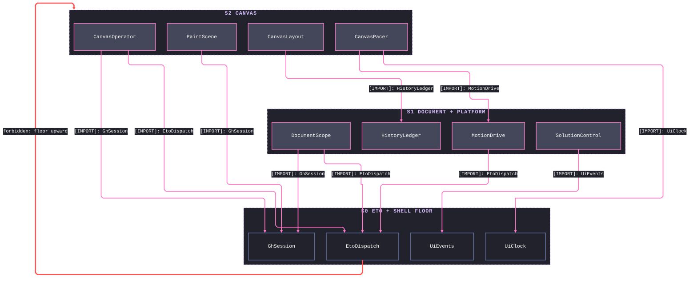
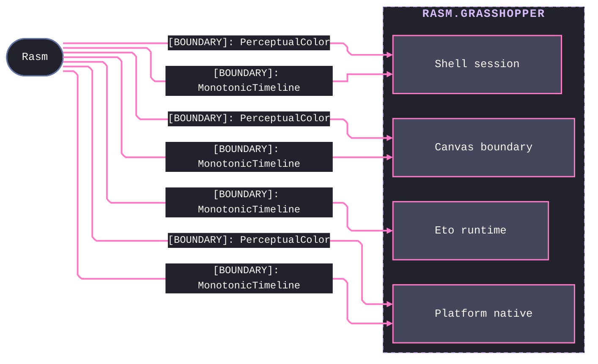
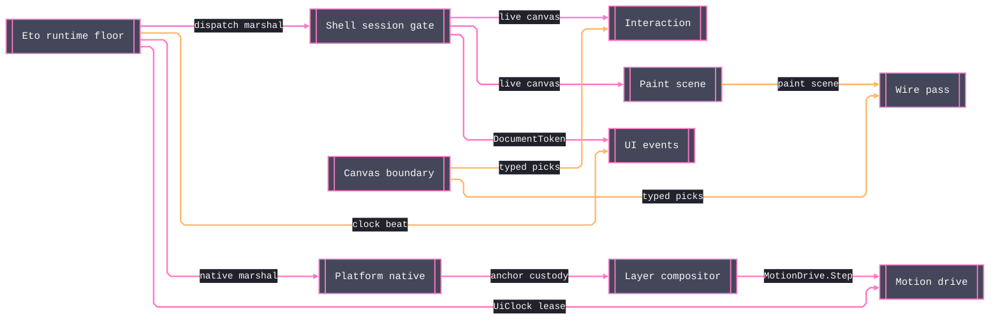

# [RASM_GRASSHOPPER_ARCHITECTURE]

`Rasm.Grasshopper` maps the Grasshopper 2, Eto, and Rhino UI host boundary on the C# app strata: each sub-domain folder maps to exactly one namespace, and one owner closes each host concern over the live GH2 and Eto surfaces. It references the `Rasm` kernel and no sibling — host-agnostic kernel math composes the motion and colour surfaces rather than a second in-folder derivation.

## [01]-[DOMAIN_MAP]

```text codemap
Rasm.Grasshopper/       # refs ../Rasm ONLY; GH2 + Eto host boundary; kernel math composed, never re-derived
├── Canvas/             # Paint, wire, layout, motion, and interaction owners over the live GH2 canvas
│   ├── Canvas.cs       # Canvas command-and-projection boundary over the live host surface
│   ├── Interaction.cs  # Responder dispatch, mount/focus/menu leases, and drag/resize capsules
│   ├── Layout.cs       # Arrangement folded to pivot deltas as one undo mutation; host snap/stretch solvers
│   ├── Motion.cs       # Span/pace tween drive, animated glyphs, and the shared canvas pacer lease
│   ├── Paint.cs        # Event-scoped paint scene, frame/mark plans, stock custody, and pigment egress
│   └── Wires.cs        # Wire route geometry, custom routes, pick, marquee select, and the skin pen pass
├── Components/         # Component authoring, pin catalog, data transfer, attribute chrome, native catalog
│   ├── Attributes.cs   # Chrome event/decision policy, bounded trace, and the resizable chrome host spine
│   ├── Component.cs    # Self-typed component declaration, topology/iteration policy, and the run ledger
│   ├── Data.cs         # Data-access transfer, the tree algebra, cast-or-convert, and the fault family
│   ├── Objects.cs      # Native-object factories, persisted read/assign, timer/cluster maps, GH1 boundary
│   └── Ports.cs        # Port carrier/semantic/axis catalog, side-aware binding, and admission fold
├── Document/           # Graph transaction spine, query/wire operator, undo ledger, solution controller
│   ├── Document.cs     # Graph transaction spine over inert/inactive/active minting tiers, one gate
│   ├── Graph.cs        # Graph query-and-mutate operator, each mutation sealed into the ledger
│   ├── History.cs      # Branching history ledger — actions sealed, stride, re-root, and replay
│   └── Solution.cs     # Solution controller — launch/halt/cancel, deferred expiry, watch/trace
├── Eto/                # Native control construction, two-way binding, the UI-thread floor, window spine
│   ├── Binding.cs      # Two-way binding fusion, value-gate admission, and store-row carriers
│   ├── Controls.cs     # Recursive control realization over the Eto.Forms surface with field capture
│   ├── Runtime.cs      # UI-thread dispatch floor — leased clock, transfer algebra, display/input facts
│   └── Windows.cs      # Command deck, recursive menu fold, and window/dialog/picker construction
├── Platform/           # Eto handler seam, gated macOS AppKit touch, CoreAnimation compositor
│   ├── Composition.cs  # Layer custody, compose transactions, motion drives, and wide-colour compositing
│   ├── Handlers.cs     # Eto handler seam, widget-to-handler substrate, frozen stylers, embedding
│   └── Native.cs       # Gated macOS AppKit — monitor/gesture leases, pressure restore, workspace pacing
└── Shell/              # Session spine, UI event algebra, editor shell, chrome intent, vector icons
    ├── Chrome.cs       # Toolbar, input-panel, tooltip, and floating-button demand onto GH2 chrome hosts
    ├── Editor.cs       # Editor shell — chrome-pane slots, toggles, state receipt, Rhino getter
    ├── Events.cs       # UI fact/event evidence, anchor/source rows, and transactional subscription
    ├── Icons.cs        # Vector-icon owner — host origins, a pose machine, filter chain, and catalog
    └── Session.cs      # Live-scope acquisition, apply/run gates, repaint receipts, and the session cache
```

## [02]-[STRATA]

Four strata order the six sub-domains; `Eto` and `Shell` are one co-recursive UI-thread floor — the `EtoDispatch` marshal and the `GhSession` scope gate each compose the other — and `Components` is the island: pure host-plus-kernel authoring with no interior edge either direction; every cross-stratum consumption edge points down.

- S0 `Eto` + `Shell` — the co-recursive floor: `EtoDispatch`, `UiClock`, `ControlForge`, and `WindowHost` beside `GhSession`, `SessionOp`, `UiEvents`, and `DocumentToken`; the pair's mutual reach is same-stratum fact.
- S1 `Document` + `Platform` — parallel composers over the floor, cross-blind to each other: `DocumentScope`, `GraphScope`, `HistoryLedger`, and `SolutionControl` beside `MacGate`, `MacAnchor`, `MotionDrive`, and `PlatformSeam`.
- S2 `Canvas` — the live host-surface owner nothing composes: `CanvasOperator`, `PaintScene`, `CanvasLayout`, and `CanvasPacer` over session scope, dispatch marshal, undo seal, and the display-link drive.
- Island `Components` — `GardenData`, `Ports`, `ComponentSpec`, and `GhFault` speak GH2 `IDataAccess` and the kernel alone; no UI-thread sibling imports it and it imports none.



## [03]-[SEAMS]

Every host-facing sub-domain admits the kernel's `MonotonicTimeline` timing authority and `PerceptualColor` colour authority as boundary contracts, minting its own receipts and drives home-side rather than re-deriving kernel math. Kernel geometry stays a pure upstream source — every command receipt seals home-side from an injected timeline, so no contract flows back down.



## [04]-[INTERNAL]

UI-thread interior composes around two floors — the `Eto/Runtime` dispatch surface and the `Shell/Session` scope gate — that every canvas, motion, event, and native owner marshals through; per-owner wiring lives on the owning implementation pages. Component-authoring and document-transaction spines carry no UI-thread dependency.



## [05]-[NAMESPACES]

Namespace mirrors folder path — `.editorconfig` `dotnet_style_namespace_match_folder = true:error`: every fence under `Rasm.Grasshopper/<Folder>/` declares `namespace Rasm.Grasshopper.<Folder>;`, giving each sub-domain folder its own root.

Boundary compiles as ONE assembly — the single `Rasm.Grasshopper.csproj` — so members cross the sub-domain namespaces with no build edge. `Eto.Forms`, `Eto.Drawing`, and the `Grasshopper2.*` roots arrive as project-level global usings, so fences name host members bare; kernel namespaces ride explicit `using` rows per fence.

Host-name resolution is one law:
- Inside `Rasm.Grasshopper.*` a partial qualification re-resolves against the boundary's own namespaces, so fences name host members bare.
- A host type no global using reaches spells `global::` in full.
- A simple-name collision between host namespaces resolves through one project-level alias row in the csproj, never a per-fence alias.
- Fully-qualified `Grasshopper2.*` spellings stay valid because no boundary namespace shadows that root.
