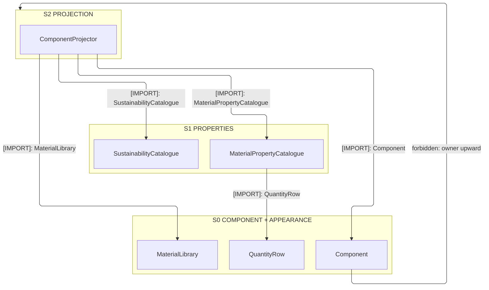
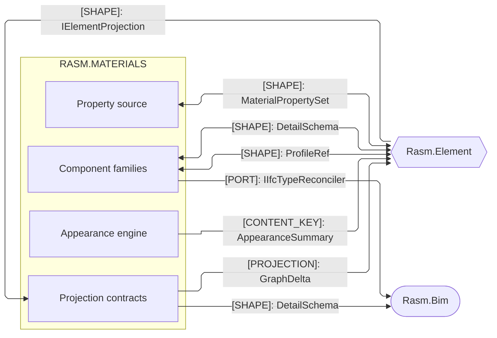
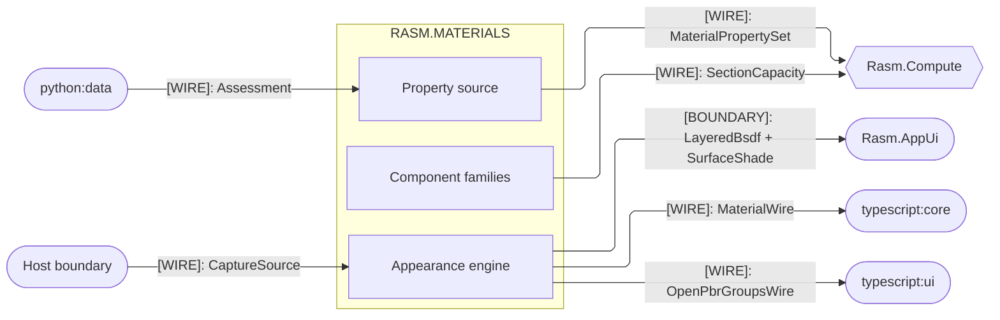

# [MATERIALS_ARCHITECTURE]

Domain map of `Rasm.Materials` — host-neutral AEC-domain projector onto the `Rasm.Element` seam. `Component`, `Appearance`, `Properties`, and `Projection` collapse to one owner per axis; the one `ComponentProjector : IElementProjection` lowers every owner into the shared `ElementGraph`. Its `Project` fold splits the `Substance` and Type-minting `Type` arms, mints the deterministic-rooted Type `Object` from canonical content, and authors the content-keyed `Material`/`Appearance` subgraph the seam `Assemble` fold merges. AEC peers depend up on `{Rasm, Rasm.Element}` and align by seam contract.

## [01]-[DOMAIN_MAP]

```text codemap
Rasm.Materials/            # AEC-DOMAIN materials projector; refs {Rasm, Rasm.Element}; VividOrange in-folder; no host geometry
├── Component/             # One polymorphic Component over the closed component-family axis, class-discriminated
│   ├── Component.cs       # Component owner and the one section solver over the profile algebra
│   ├── Masonry.cs         # Masonry family
│   ├── Steel.cs           # Steel family over the catalogued AISC and EN sections
│   ├── Cmu.cs             # Concrete-masonry-unit family
│   ├── Timber.cs          # Timber family over sawn, glulam, and CLT lamellae
│   ├── Glazing.cs         # Glazing family over insulated-glass pane, spacer, and cavity records
│   ├── Reinforcement.cs   # Reinforcement family over the rebar arrangement and prestressing-strand line
│   ├── Fastener.cs        # Fastener family over the threaded bolt, nut, and washer assembly
│   ├── Connector.cs       # Connector family
│   ├── Joint.cs           # Joint family over the weld, adhesive, and stud connection record
│   ├── Panel.cs           # Panel family over sheet-goods built elements
│   └── Capacity.cs        # One section-capacity resolution and check rail
├── Appearance/            # Measured appearance engine — node graph, BSDF lobe family, and the material wire
│   ├── Bsdf.cs            # Closed BSDF lobe family and the microfacet kernel
│   ├── Graph.cs           # MaterialGraph node-DAG program and the material-library table
│   ├── Surface.cs         # OpenPBR color-science lowering and the layered slab stack
│   ├── Texture.cs         # Texture-sampling fold over the closed texture-source union
│   ├── Photometric.cs     # Light-unit admission fold — the in-folder UnitsNet boundary
│   ├── Weathering.cs      # Aging fold over the closed weathering-effect union
│   ├── Acquisition.cs     # Capture-import fold over the closed capture-source union
│   ├── Finish.cs          # Kubelka-Munk pigment-reflectance finish engine
│   └── Interchange.cs     # MaterialWire and MaterialX .mtlx interchange projection
├── Properties/            # Typed engineering-property source lowered onto the seam property sets
│   ├── Properties.cs      # Intrinsic mechanical, thermal, acoustic, and fire measurements
│   └── Sustainability.cs  # Lifecycle impact, unit-cost basis, and classification rows
└── Projection/            # One IElementProjection onto the Rasm.Element seam
    └── Component.cs       # ComponentProjector minting Type Objects and material subgraphs
```

VividOrange grounds the structural section, capacity, and rebar data in-folder, never a hand-keyed literal; the per-page consumption law lives on the owning pages. Return type names the rail: a `SurfaceShade`/`Unicolour` carrier where the result is total, `Fin<T>` where a banded fault routes, the seam `Fin<GraphDelta>` from the projector. C# is the sole producer of the material wire — `Appearance/Interchange` mints the OpenPBR-vector `MaterialWire` and the MaterialX `.mtlx` document once, and the TypeScript and Python peers decode both.

## [02]-[STRATA]

Three strata order the four sub-domains; `Component` and `Appearance` are true peers sharing only the seam `MaterialId`, so every consumption edge points down.

- S0 `Component` + `Appearance` — peers consuming no sibling: `ComponentFamily`, `ComponentClass`, `QuantityRow`, and the `SectionCapacity` rail beside `MaterialGraph`, `MaterialLibrary`, `BsdfLobe`, and the `MaterialWire` mint; alignment between the pair travels the seam `MaterialId`, never an import.
- S1 `Properties` — `MaterialPropertyCatalogue`, `SustainabilityCatalogue`, and `Published<T>` source rows; engineering dimensional mints pass through the S0 `QuantityRow`, and sustainability lowers basis-relative scalars straight to the seam factories.
- S2 `Projection` — the one `ComponentProjector : IElementProjection` folding `Component`, `Properties`, and `Appearance` owners into `Fin<GraphDelta>`; nothing composes it.



## [03]-[SEAMS]





## [04]-[DOMAIN_LAW]

Canonical-collapse law the sub-domains share — one owner per axis, one entrypoint family per rail, growth by data. Per-page boundary cards carry the concrete seams.

- One component owner: a cross-section is a `ComponentFamily` row over one `Component`, solved by the one dispatch over the closed profile algebra.
- One appearance owner: a material is a `MaterialLibrary` row over one `MaterialGraph`, a lobe a case, a layering modifier a `Slab`.
- One `ComponentProjector.Project` carries the whole material-and-Type subgraph.
- Growth is a row or a closed-union case; a per-family type, a second projector, or a generic material abstraction is the named drift.
- `ComponentFamily` is a closed axis, each family carrying its `ComponentClass` discriminant over the Primary, Panel, and Minor rows.
- An anchor folds as a `FastenerKind` arm; a metal deck, gypsum board, or rigid-board insulation is a `PanelKind` row, never a new family.
- `BsdfLobe` is a closed family; a new lobe admits only when no parameterization reproduces the measured physics, then serves every material.
- Material-composition vocabulary is the seam `MaterialComposition`, referenced and never re-owned; a new case is seam growth.
- Owner mints its own identity: the `ComponentProjector` mints the deterministic-rooted Type `Object` from the exclusion-seeded canonical bytes.
- A Type stamps `Classification`/`PredefinedType` off the stored `IfcBinding` row, so a later geometry attach never re-keys it.
- A model author mints Occurrence `Object`s and `Rasm.Bim` ingests `IfcElementType` into the same Type; the `Bake` inheritance is the seam's.
- Model is host-neutral: no owner holds a host curve or transform; run and layout geometry lands in `Rasm.Generation` at the app root.
- Composition over re-mint at every seam: Materials projects onto `Rasm.Element` and re-mints no seam type, color axis, unit owner, or dimension.
- Color is the admitted perceptual owner consumed directly; units admit UnitsNet once at each owner's declared edge — the photometric boundary and the dimensional component, capacity, and property mints — and ride the seam `MeasureValue`.
- Only the documented author-kernel set — RGB-to-SPD, scene-referred tone-map, BSDF microfacet, noise, the capacity hull ray-cast — is hand-authored.
- An out-of-gamut, non-finite, or degenerate result rails to its banded fault off the `FaultBand` registry, never a propagated NaN or sentinel.
- Standards data is in-fence C# under `SEED_ROW_LAW`: a table is `REFLECTED`, `DELEGATED`, or `AUTHORED`.
- Every seed column carries `VENDOR`, `DEFINED`, or `PUBLISHED` provenance.
- Policy vocabularies stay `[SmartEnum]`, standards enums become frozen row tables, and every seed row flows the one catalogue-to-solver rail.
