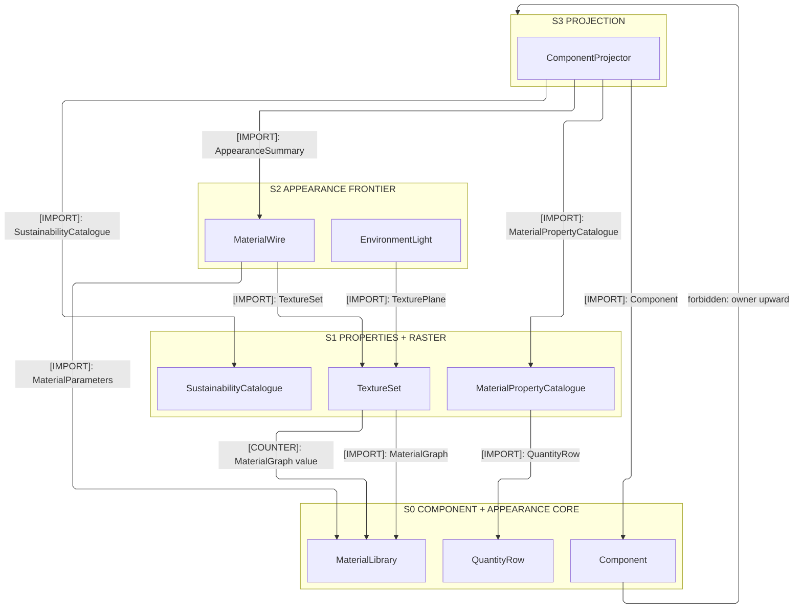
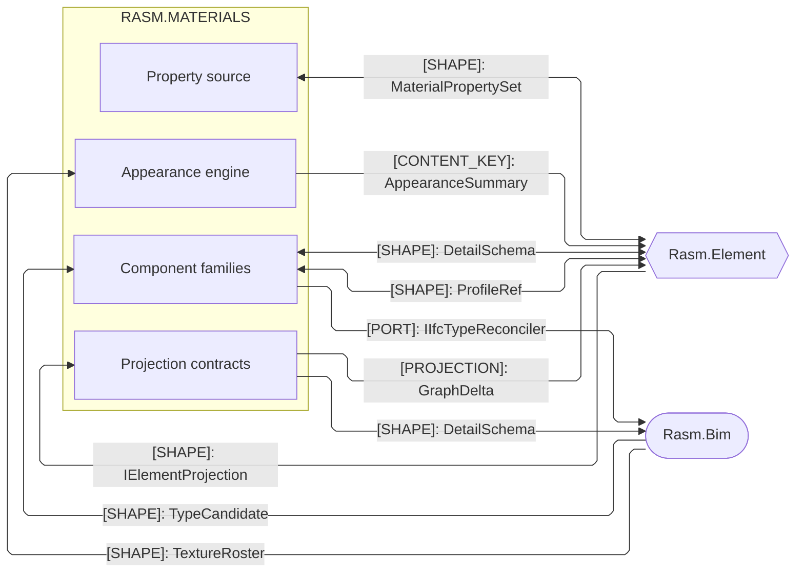
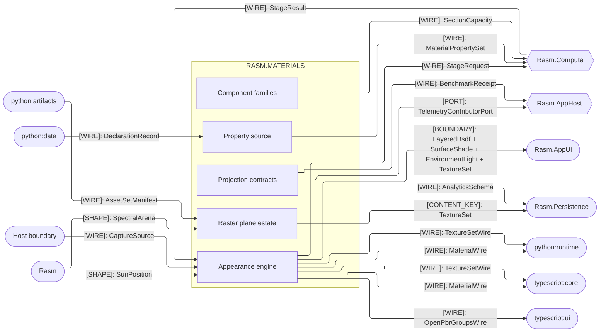

# [MATERIALS_ARCHITECTURE]

`Rasm.Materials` is the host-neutral AEC-domain projector onto the `Rasm.Element` seam. `Component`, `Appearance`, `Properties`, and `Projection` collapse to one owner per axis; the one `ComponentProjector : IElementProjection` lowers every owner into the shared `ElementGraph`. Its `Project` fold splits the `Substance` and Type-minting `Type` arms, mints the deterministic-rooted Type `Object` from canonical content, and authors the content-keyed `Material`/`Appearance` subgraph the seam `Assemble` fold merges. AEC peers depend up on `{Rasm, Rasm.Element}` and align by seam contract.

`Rasm.Materials` also references `Rasm.AppHost` by name under the branch benchmark-peer ruling, and `Projection/benchmarks#GATE_COMPOSITION` is that reference's one compile consumer.

## [01]-[DOMAIN_MAP]

```text codemap
Rasm.Materials/            # AEC-DOMAIN materials projector; refs {Rasm, Rasm.Element, Rasm.AppHost}; VividOrange in-folder; no host geometry
├── Component/             # One polymorphic Component over the closed component-family axis, class-discriminated
│   ├── Component.cs       # Component owner and the one section solver over the profile algebra
│   ├── Masonry.cs         # Masonry family
│   ├── Steel.cs           # Steel family over the catalogued AISC and EN sections
│   ├── Cmu.cs             # Concrete-masonry-unit family
│   ├── Timber.cs          # Timber family over sawn, glulam, and CLT lamellae
│   ├── Glazing.cs         # Glazing family over insulated-glass pane, spacer, and cavity records
│   ├── Reinforcement.cs   # Reinforcement family over the rebar arrangement and prestressing-strand line
│   ├── Fastener.cs        # Fastener family over the threaded bolt, nut, and washer assembly
│   ├── Connector.cs       # Connector family
│   ├── Joint.cs           # Joint family over the weld, adhesive, and stud connection record
│   ├── Panel.cs           # Panel family over sheet-goods built elements
│   └── Capacity.cs        # One section-capacity resolution and check rail
├── Appearance/            # Measured appearance engine — node graph, BSDF lobe family, and the material wire
│   ├── Bsdf.cs            # Closed BSDF lobe family and the microfacet kernel
│   ├── Graph.cs           # MaterialGraph node-DAG program and the material-library table
│   ├── Surface.cs         # OpenPBR color-science lowering and the layered slab stack
│   ├── Texture.cs         # Texture-sampling fold over the closed texture-source union
│   ├── Photometric.cs     # Light-unit admission fold — the in-folder UnitsNet boundary
│   ├── Weathering.cs      # Aging fold over the closed weathering-effect union
│   ├── Acquisition.cs     # Capture-import fold over the closed capture-source union
│   ├── Finish.cs          # Kubelka-Munk pigment-reflectance finish engine
│   ├── Interchange.cs     # MaterialWire and MaterialX .mtlx interchange projection
│   ├── Environment.cs     # Sky synthesis, environment-map admission, IBL prefilter, and the environment-light row
│   └── Neural.cs          # Photo-to-PBR model registry and the inference stage plan
├── Raster/                # Texture-map generation — the plane substrate, the bake engine, and its container estate
│   ├── Plane.cs           # Typed-texel plane arena, the decoded row rails, and the mip chain with its sampler bridge
│   ├── Codec.cs           # Container roster, the band-2460 RasterFault, and the KTX gate over its CLI floor
│   ├── Filter.cs          # Plane-transform algebra, the stage scheduler, and the height-field correspondence
│   ├── Tile.cs            # Set-coherent tiling synthesizer and the deterministic tileability gate
│   ├── Set.cs             # Channel roster, the content-keyed baked set, ingest classification, and the appearance rebind
│   ├── Press.cs           # Bake engine over the batched plane evaluator and its content-identity veto
│   └── Gpu.cs             # Surfaceless bake device and the closed WGSL module table with its golden vectors
├── Properties/            # Typed engineering-property source lowered onto the seam property sets
│   ├── Properties.cs      # Intrinsic mechanical, thermal, acoustic, and fire measurements + the mix-keyed durability table
│   ├── Sustainability.cs  # Lifecycle impact, unit-cost basis, and classification rows
│   └── Assessment.cs      # Dated declaration records and the assessed-over-published resolution
└── Projection/            # One IElementProjection onto the Rasm.Element seam + the observability, benchmark, and analytics projections
    ├── Component.cs       # ComponentProjector minting Type Objects and material subgraphs
    ├── Observability.cs   # MaterialsFact union, MaterialsHooks roster, MaterialsInstruments tap, MaterialsLog band, MaterialsDescriptors pack
    ├── Benchmarks.cs      # BenchKernel workload corpus and the gated BenchmarkReceipt composition
    └── Analytics.cs       # DatasetWire declarations over ColumnToken and the catalogue-to-row projection folds
```

VividOrange grounds the structural section, capacity, and rebar data in-folder, never a hand-keyed literal; the per-page consumption law lives on the owning pages. Return type names the rail: a `SurfaceShade`/`Unicolour` carrier where the result is total, `Fin<T>` where a banded fault routes, the seam `Fin<GraphDelta>` from the projector.

C# is the sole producer of the appearance wire vocabulary — `Appearance/Interchange` mints each document once as an `IAppearanceWire` whose `CorpusBorne` column states whether a `tests/contracts/MANIFEST.md` entry is owed, and the TypeScript and Python peers decode the corpus-borne pair. Two wires cross INBOUND: the python-minted `AssetSetManifest` lands at `Raster/Set` `SetIngest.Peer` as classification input (the `python:artifacts/graphic/texture` counterpart edge the artifacts branch registers at its own end), and the `python:data`-minted `DeclarationRecord` — the `tests/contracts/MANIFEST.md` `[02.26]` domain contract — lands at `Properties/Assessment` `DeclarationWire.Decode` as the product-declaration transport reaching `AssessmentSet.Of` unchanged.

## [02]-[STRATA]

Four strata order the five sub-domains. `Appearance` SPANS two of them: its core is a peer of `Component`, while its frontier composes `Raster` products and therefore sits above the plane estate that reads the core. That split follows the folder's own dependency truth rather than a folder boundary — a flat `Appearance` stratum turns every frontier read of a plane product into an upward edge the strata forbid.

- S0 `Component` — `ComponentFamily`, `ComponentClass`, `QuantityRow`, and the `SectionCapacity` rail, consuming no sibling.
- S0 `Appearance` core — `MaterialGraph`, `MaterialLibrary`, `BsdfLobe`, `OpenPbrSurface`, `TextureUv`, and `MaterialUnits`, consuming no sibling.
- S1 `Properties` — `MaterialPropertyCatalogue`, `SustainabilityCatalogue`, `AssessmentResolution`, and `Published<T>` source rows.
- S1 `Raster` — `TexturePlane`, `TextureChannel`, `TextureSet`, `TexturePress`, and the `PressDevice` bake seam.
- S1 flow — engineering dimensional mints pass through the S0 `QuantityRow`; sustainability lowers basis-relative scalars to the seam factories.
- S1 flow — `Raster` reads the core graph, sampler, and vector, writing back through `SetBind` alone on a `MaterialGraph` VALUE counter-edge.
- S2 `Appearance` frontier — `EnvironmentLight`, `ModelRegistry`, `Acquisition`, and the wire mint over `Raster` planes and sets.
- S2 flow — the frontier reads DOWN into `Raster` and the core alike; `Raster` names no frontier type, so the plane estate stands alone.
- S3 `Projection` — the one `ComponentProjector : IElementProjection` folds `Component`, `Properties`, and `Appearance` into `Fin<GraphDelta>`.
- S3 `Projection` — the `MaterialsFact` signal tap, benchmark corpus, and analytics projection read every lower owner; nothing composes S3.


```mermaid
---
config:
  layout: elk
  flowchart:
    curve: linear
    padding: 25
---
flowchart TB
    accTitle: Rasm.Materials interior strata
    accDescr: Four stacked strata from the one component projector through the appearance frontier and the property and raster plane onto the peer component and appearance-core owners, every consumption edge downward naming one sourced type, and one forbidden upward edge marked.
    subgraph S3["S3 PROJECTION"]
        Projector[ComponentProjector]
    end
    subgraph S2["S2 APPEARANCE FRONTIER"]
        Wire[MaterialWire]
        Environment[EnvironmentLight]
    end
    subgraph S1["S1 PROPERTIES + RASTER"]
        Catalogue[MaterialPropertyCatalogue]
        Sustainability[SustainabilityCatalogue]
        Raster[TextureSet]
    end
    subgraph S0["S0 COMPONENT + APPEARANCE CORE"]
        Component[Component]
        QuantityRow[QuantityRow]
        Library[MaterialLibrary]
    end
    Projector e1@-->|"[IMPORT]: MaterialPropertyCatalogue"| Catalogue
    Projector e2@-->|"[IMPORT]: SustainabilityCatalogue"| Sustainability
    Projector e3@-->|"[IMPORT]: Component"| Component
    Projector e4@-->|"[IMPORT]: AppearanceSummary"| Wire
    Catalogue e5@-->|"[IMPORT]: QuantityRow"| QuantityRow
    Raster e6@-->|"[IMPORT]: MaterialGraph"| Library
    Raster e7@-->|"[COUNTER]: MaterialGraph value"| Library
    Wire e8@-->|"[IMPORT]: TextureSet"| Raster
    Wire e9@-->|"[IMPORT]: MaterialParameters"| Library
    Environment e10@-->|"[IMPORT]: TexturePlane"| Raster
    Component f1@-->|"forbidden: owner upward"| S3
```

## [03]-[SEAMS]


```mermaid
---
config:
  layout: elk
  flowchart:
    curve: linear
    padding: 25
---
flowchart LR
    accTitle: Materials AEC-domain projection seams
    accDescr: Materials sub-domain owners exchanging projections, section handles, property sets, and detail bags with the AEC peers Element and Bim, one edge per contract family labeled by kind.
    subgraph materials[RASM.MATERIALS]
        Projection[Projection contracts]
        Component[Component families]
        Properties[Property source]
        Appearance[Appearance engine]
    end
    Element{{Rasm.Element}}
    Bim([Rasm.Bim])
    Element e1@-->|"[SHAPE]: IElementProjection"| Projection
    Projection e2@-->|"[PROJECTION]: GraphDelta"| Element
    Projection e3@-->|"[SHAPE]: DetailSchema"| Bim
    Component e4@<-->|"[SHAPE]: ProfileRef"| Element
    Component e5@-->|"[PORT]: IIfcTypeReconciler"| Bim
    Bim e9@-->|"[SHAPE]: TypeCandidate"| Component
    Bim e10@-->|"[SHAPE]: TextureRoster"| Appearance
    Properties e6@<-->|"[SHAPE]: MaterialPropertySet"| Element
    Appearance e7@-->|"[CONTENT_KEY]: AppearanceSummary"| Element
    Component e8@<-->|"[SHAPE]: DetailSchema"| Element
```


```mermaid
---
config:
  layout: elk
  flowchart:
    curve: linear
    padding: 25
---
flowchart LR
    accTitle: Materials platform, compute, and cross-runtime seams
    accDescr: Materials sub-domain owners exchanging capacity, property, appearance, capture, telemetry, benchmark, and analytics wires plus artifact content keys with the kernel almanac, compute, the app host spine, the persistence store plane, the render host, the Python artifacts and runtime peers, and the TypeScript core and viewer peers, one edge per contract family labeled by kind.
    subgraph materials[RASM.MATERIALS]
        Component[Component families]
        Properties[Property source]
        Appearance[Appearance engine]
        Raster[Raster plane estate]
        Projection[Projection contracts]
    end
    Compute{{Rasm.Compute}}
    AppHost{{Rasm.AppHost}}
    AppUi([Rasm.AppUi])
    Persistence([Rasm.Persistence])
    PyArtifacts([python:artifacts])
    PyData([python:data])
    PyRuntime([python:runtime])
    Core([typescript:core])
    Ui([typescript:ui])
    Host([Host boundary])
    Rasm([Rasm])
    Rasm e18@-->|"[SHAPE]: SunPosition"| Appearance
    Rasm e19@-->|"[SHAPE]: SpectralArena"| Raster
    Component e1@-->|"[WIRE]: SectionCapacity"| Compute
    Properties e2@-->|"[WIRE]: MaterialPropertySet"| Compute
    Appearance e11@-->|"[WIRE]: StageRequest"| Compute
    Compute e12@-->|"[WIRE]: StageResult"| Appearance
    Appearance e4@-->|"[BOUNDARY]: LayeredBsdf + SurfaceShade + EnvironmentLight + TextureSet"| AppUi
    Appearance e5@-->|"[WIRE]: MaterialWire"| Core
    Appearance e13@-->|"[WIRE]: MaterialWire"| PyRuntime
    Appearance e14@-->|"[WIRE]: TextureSetWire"| Core
    Appearance e15@-->|"[WIRE]: TextureSetWire"| PyRuntime
    Appearance e6@-->|"[WIRE]: OpenPbrGroupsWire"| Ui
    PyArtifacts e16@-->|"[WIRE]: AssetSetManifest"| Raster
    PyData e20@-->|"[WIRE]: DeclarationRecord"| Properties
    Host e7@-->|"[WIRE]: CaptureSource"| Appearance
    Projection e8@-->|"[PORT]: TelemetryContributorPort"| AppHost
    Projection e9@-->|"[WIRE]: BenchmarkReceipt"| AppHost
    Projection e10@-->|"[WIRE]: AnalyticsSchema"| Persistence
    Raster e17@-->|"[CONTENT_KEY]: TextureSet"| Persistence
```

## [04]-[ROUTING]

| [INDEX] | [CHANGE]                            | [OWNER_SURFACE]             | [SHAPE_OF_THE_EDIT]                                               |
| :-----: | :---------------------------------- | :-------------------------- | :---------------------------------------------------------------- |
|  [01]   | new standardized component family   | `Component/component.md`    | one `ComponentFamily` row carrying its `ComponentClass`           |
|  [02]   | new anchor, panel, or board product | `Component/connector.md`    | one `FastenerKind` arm or `PanelKind` row                         |
|  [03]   | new scattering lobe                 | `Appearance/bsdf.md`        | one `BsdfLobe` case, admitted only where no parameterization fits |
|  [04]   | new material or finish              | `Appearance/graph.md`       | one `MaterialLibrary` row over the one `MaterialGraph`            |
|  [05]   | new standards table                 | the owning catalogue page   | one `SEED_ROW_LAW` table with per-column provenance               |
|  [06]   | new fault case                      | the owning owner page       | one arm at its `FaultBand` free frontier                          |
|  [07]   | new seam payload                    | `Rasm.Element` composition  | seam growth the projector composes, never a local remint          |
|  [08]   | new standard sky or daylight model  | `Appearance/environment.md` | one `CieSkyType` row over the group pair, or one `SkyModel` case  |
|  [09]   | new photo-to-PBR model              | `Appearance/neural.md`      | one `ModelCard` row carrying its licence class and contract       |
|  [10]   | new bakeable appearance field       | `Raster/set.md`             | one `TextureChannel` row carrying its twelve columns              |
|  [11]   | new plane container or block format | `Raster/codec.md`           | one `RasterFormat` row naming its engine, storage, and extension  |
|  [12]   | new plane transform or curve        | `Raster/filter.md`          | one `PlaneOp`, `RemapCurve`, or `HeightDerivative` case           |
|  [13]   | new tiling method                   | `Raster/tile.md`            | one `TileStrategy` row carrying its `Solve` delegate              |
|  [14]   | new GPU compute kernel              | `Raster/gpu.md`             | one `WgslKernel` row carrying source, layout, reduce, and golden  |
|  [15]   | new appearance wire document        | `Appearance/interchange.md` | one `IAppearanceWire` record with its `CorpusBorne` verdict       |
|  [16]   | new seamless procedural lattice     | `Appearance/texture.md`     | one `NoiseBasis` row answering `Wrappable` plus its golden row    |
|  [17]   | new plane depth, arity, or storage  | `Raster/plane.md`           | one `IComponent` witness, texel struct, or `PlaneFormat` row      |
|  [18]   | new bake subject or execution lane  | `Raster/press.md`           | one `PressSubject` case or one `PressBackend` row                 |
|  [19]   | new photo-to-PBR capture modality   | `Appearance/acquisition.md` | one `CaptureSource` case and its `CaptureMethod` receipt row      |
|  [20]   | new declaration modality or EPD row | `Properties/assessment.md`  | one `AssessmentRecord` case with its `Admit` and resolution arms  |
|  [21]   | new durability binder or mix        | `Properties/properties.md`  | one `CementType` row plus its published `DurabilityMix` entries   |

## [05]-[BOUNDARIES]

Boundaries state one positive ownership line each at the folder's own grain — one owner per axis, one entrypoint family per rail, growth by data; per-page boundary cards carry the concrete seams.

- Materials owns substance, appearance, and buildable type: one `Component`, one capacity rail, one `MaterialGraph`, one `TextureSet`.
- Appearance CORE stays pointwise — a DAG node has no neighbours to read; neighbourhood work is the plane algebra's.
- Every filter, integration, and tiling kernel homes at `Raster/filter` or `Raster/tile`, never a node case.
- Persisted plane bytes are CPU-minted; the GPU lane is an accelerator whose product carries no set and therefore no content key.
- `ComponentFamily` closes the family axis and `ComponentClass` the structural-class axis, each family row carrying its class discriminant.
- `SEED_ROW_LAW` seats standards data as in-fence C# under per-column provenance, and every seed row flows the one catalogue-to-solver rail.
- `ComponentProjector.Project` stamps `Classification`/`PredefinedType` off its `IfcBinding` row, seed-excluded so a later attach never re-keys.
- Model authors mint Occurrence `Object`s and `Rasm.Bim` ingests `IfcElementType` into the same Type; the `Bake` inheritance is the seam's.
- `IIfcTypeReconciler` closes one loop: Bim's `ExportTypeCandidates` feeds `ComponentCatalogue.AdmitImported` by contract, never reference.
- Model owners stay host-neutral: none holds a host curve or transform, and run and layout geometry lands in `Rasm.Generation` at the app root.
- `Rasm.Element` owns material-composition vocabulary, the perceptual owner color, and UnitsNet admits once per declared edge riding `MeasureValue`.
- Each concern composes its admitted engine, and a kernel the ecosystem leaves unowned lands hand-authored at its owning page.
- Every out-of-gamut, non-finite, or degenerate result rails to its banded fault, never a propagated NaN or sentinel.
- Composition-root decorators tap `MaterialsFact` onto `MaterialsHooks`, so owners emit nothing; `MaterialsDescriptors` rides the kernel SLO algebra.
- `e12` `StageResult` carries the `ParityFresh` observation gate and the `Coverage` mosaic floor whole; dropping either counts unmeasured.
