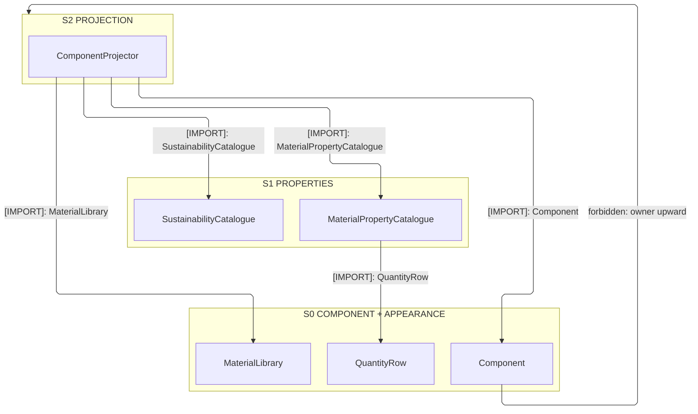
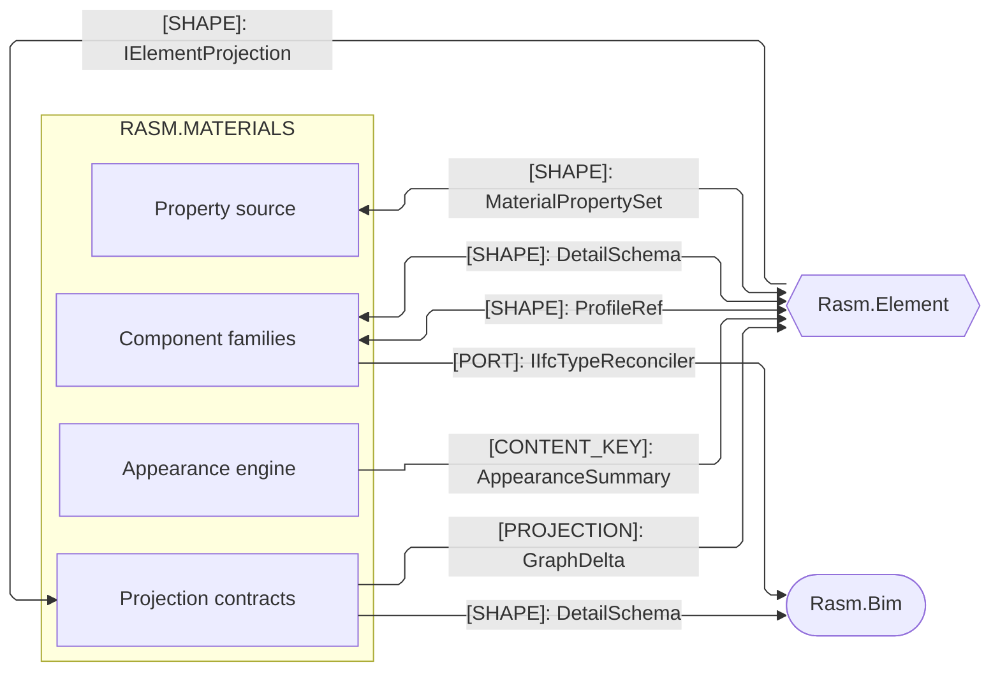
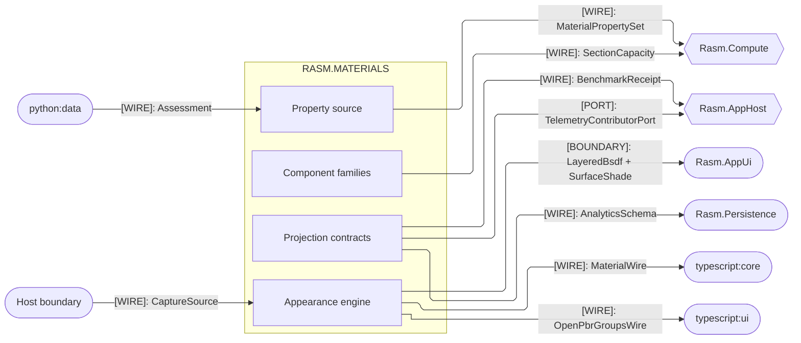

# [MATERIALS_ARCHITECTURE]

`Rasm.Materials` is the host-neutral AEC-domain projector onto the `Rasm.Element` seam. `Component`, `Appearance`, `Properties`, and `Projection` collapse to one owner per axis; the one `ComponentProjector : IElementProjection` lowers every owner into the shared `ElementGraph`. Its `Project` fold splits the `Substance` and Type-minting `Type` arms, mints the deterministic-rooted Type `Object` from canonical content, and authors the content-keyed `Material`/`Appearance` subgraph the seam `Assemble` fold merges. AEC peers depend up on `{Rasm, Rasm.Element}` and align by seam contract.

`Rasm.Materials` also references `Rasm.AppHost` by name under the branch benchmark-peer ruling, and `Projection/benchmarks#GATE_COMPOSITION` is that reference's one compile consumer.

## [01]-[DOMAIN_MAP]

```text codemap
Rasm.Materials/            # AEC-DOMAIN materials projector; refs {Rasm, Rasm.Element, Rasm.AppHost}; VividOrange in-folder; no host geometry
├── Component/             # One polymorphic Component over the closed component-family axis, class-discriminated
│   ├── Component.cs       # Component owner and the one section solver over the profile algebra
│   ├── Masonry.cs         # Masonry family
│   ├── Steel.cs           # Steel family over the catalogued AISC and EN sections
│   ├── Cmu.cs             # Concrete-masonry-unit family
│   ├── Timber.cs          # Timber family over sawn, glulam, and CLT lamellae
│   ├── Glazing.cs         # Glazing family over insulated-glass pane, spacer, and cavity records
│   ├── Reinforcement.cs   # Reinforcement family over the rebar arrangement and prestressing-strand line
│   ├── Fastener.cs        # Fastener family over the threaded bolt, nut, and washer assembly
│   ├── Connector.cs       # Connector family
│   ├── Joint.cs           # Joint family over the weld, adhesive, and stud connection record
│   ├── Panel.cs           # Panel family over sheet-goods built elements
│   └── Capacity.cs        # One section-capacity resolution and check rail
├── Appearance/            # Measured appearance engine — node graph, BSDF lobe family, and the material wire
│   ├── Bsdf.cs            # Closed BSDF lobe family and the microfacet kernel
│   ├── Graph.cs           # MaterialGraph node-DAG program and the material-library table
│   ├── Surface.cs         # OpenPBR color-science lowering and the layered slab stack
│   ├── Texture.cs         # Texture-sampling fold over the closed texture-source union
│   ├── Photometric.cs     # Light-unit admission fold — the in-folder UnitsNet boundary
│   ├── Weathering.cs      # Aging fold over the closed weathering-effect union
│   ├── Acquisition.cs     # Capture-import fold over the closed capture-source union
│   ├── Finish.cs          # Kubelka-Munk pigment-reflectance finish engine
│   └── Interchange.cs     # MaterialWire and MaterialX .mtlx interchange projection
├── Properties/            # Typed engineering-property source lowered onto the seam property sets
│   ├── Properties.cs      # Intrinsic mechanical, thermal, acoustic, and fire measurements
│   └── Sustainability.cs  # Lifecycle impact, unit-cost basis, and classification rows
└── Projection/            # One IElementProjection onto the Rasm.Element seam + the observability, benchmark, and analytics projections
    ├── Component.cs       # ComponentProjector minting Type Objects and material subgraphs
    ├── Observability.cs   # MaterialsFact union, MaterialsHooks roster, MaterialsInstruments tap, MaterialsLog band, MaterialsDescriptors pack
    ├── Benchmarks.cs      # BenchKernel workload corpus and the gated BenchmarkReceipt composition
    └── Analytics.cs       # DatasetWire declarations over ColumnToken and the catalogue-to-row projection folds
```

VividOrange grounds the structural section, capacity, and rebar data in-folder, never a hand-keyed literal; the per-page consumption law lives on the owning pages. Return type names the rail: a `SurfaceShade`/`Unicolour` carrier where the result is total, `Fin<T>` where a banded fault routes, the seam `Fin<GraphDelta>` from the projector. C# is the sole producer of the material wire — `Appearance/Interchange` mints the OpenPBR-vector `MaterialWire` and the MaterialX `.mtlx` document once, and the TypeScript and Python peers decode both.

## [02]-[STRATA]

Three strata order the four sub-domains; `Component` and `Appearance` are true peers sharing only the seam `MaterialId`, so every consumption edge points down.

- S0 `Component` — `ComponentFamily`, `ComponentClass`, `QuantityRow`, and the `SectionCapacity` rail, consuming no sibling.
- S0 `Appearance` — `MaterialGraph`, `MaterialLibrary`, `BsdfLobe`, and the `MaterialWire` mint.
- S1 `Properties` — `MaterialPropertyCatalogue`, `SustainabilityCatalogue`, and `Published<T>` source rows.
- S1 flow — engineering dimensional mints pass through the S0 `QuantityRow`; sustainability lowers basis-relative scalars to the seam factories.
- S2 `Projection` — the one `ComponentProjector : IElementProjection` folds `Component`, `Properties`, and `Appearance` into `Fin<GraphDelta>`.
- S2 `Projection` — the `MaterialsFact` signal tap, benchmark corpus, and analytics projection read every lower owner; nothing composes S2.


```mermaid
---
config:
  layout: elk
  flowchart:
    curve: linear
    padding: 25
---
flowchart TB
    accTitle: Rasm.Materials interior strata
    accDescr: Three stacked strata from the one component projector through the property catalogues onto the peer component and appearance owners, every consumption edge downward naming one sourced type, and one forbidden upward edge marked.
    subgraph S2["S2 PROJECTION"]
        Projector[ComponentProjector]
    end
    subgraph S1["S1 PROPERTIES"]
        Catalogue[MaterialPropertyCatalogue]
        Sustainability[SustainabilityCatalogue]
    end
    subgraph S0["S0 COMPONENT + APPEARANCE"]
        Component[Component]
        QuantityRow[QuantityRow]
        Library[MaterialLibrary]
    end
    Projector e1@-->|"[IMPORT]: MaterialPropertyCatalogue"| Catalogue
    Projector e2@-->|"[IMPORT]: SustainabilityCatalogue"| Sustainability
    Projector e3@-->|"[IMPORT]: Component"| Component
    Projector e4@-->|"[IMPORT]: MaterialLibrary"| Library
    Catalogue e5@-->|"[IMPORT]: QuantityRow"| QuantityRow
    Component f1@-->|"forbidden: owner upward"| S2
```

## [03]-[SEAMS]


```mermaid
---
config:
  layout: elk
  flowchart:
    curve: linear
    padding: 25
---
flowchart LR
    accTitle: Materials AEC-domain projection seams
    accDescr: Materials sub-domain owners exchanging projections, section handles, property sets, and detail bags with the AEC peers Element and Bim, one edge per contract family labeled by kind.
    subgraph materials[RASM.MATERIALS]
        Projection[Projection contracts]
        Component[Component families]
        Properties[Property source]
        Appearance[Appearance engine]
    end
    Element{{Rasm.Element}}
    Bim([Rasm.Bim])
    Element e1@-->|"[SHAPE]: IElementProjection"| Projection
    Projection e2@-->|"[PROJECTION]: GraphDelta"| Element
    Projection e3@-->|"[SHAPE]: DetailSchema"| Bim
    Component e4@<-->|"[SHAPE]: ProfileRef"| Element
    Component e5@-->|"[PORT]: IIfcTypeReconciler"| Bim
    Properties e6@<-->|"[SHAPE]: MaterialPropertySet"| Element
    Appearance e7@-->|"[CONTENT_KEY]: AppearanceSummary"| Element
    Component e8@<-->|"[SHAPE]: DetailSchema"| Element
```


```mermaid
---
config:
  layout: elk
  flowchart:
    curve: linear
    padding: 25
---
flowchart LR
    accTitle: Materials platform, compute, and cross-runtime seams
    accDescr: Materials sub-domain owners exchanging capacity, property, appearance, capture, telemetry, benchmark, and analytics wires with compute, the app host spine, the persistence store plane, the render host, the Python data peer, and the TypeScript core and viewer peers, one edge per contract family labeled by kind.
    subgraph materials[RASM.MATERIALS]
        Component[Component families]
        Properties[Property source]
        Appearance[Appearance engine]
        Projection[Projection contracts]
    end
    Compute{{Rasm.Compute}}
    AppHost{{Rasm.AppHost}}
    AppUi([Rasm.AppUi])
    Persistence([Rasm.Persistence])
    DataPeer([python:data])
    Core([typescript:core])
    Ui([typescript:ui])
    Host([Host boundary])
    Component e1@-->|"[WIRE]: SectionCapacity"| Compute
    Properties e2@-->|"[WIRE]: MaterialPropertySet"| Compute
    DataPeer e3@-->|"[WIRE]: Assessment"| Properties
    Appearance e4@-->|"[BOUNDARY]: LayeredBsdf + SurfaceShade"| AppUi
    Appearance e5@-->|"[WIRE]: MaterialWire"| Core
    Appearance e6@-->|"[WIRE]: OpenPbrGroupsWire"| Ui
    Host e7@-->|"[WIRE]: CaptureSource"| Appearance
    Projection e8@-->|"[PORT]: TelemetryContributorPort"| AppHost
    Projection e9@-->|"[WIRE]: BenchmarkReceipt"| AppHost
    Projection e10@-->|"[WIRE]: AnalyticsSchema"| Persistence
```

## [04]-[ROUTING]

| [INDEX] | [CHANGE]                              | [OWNER_SURFACE]              | [SHAPE_OF_THE_EDIT]                                               |
| :-----: | :------------------------------------ | :--------------------------- | :---------------------------------------------------------------- |
|  [01]   | a new standardized component family   | `Component/component.md`     | one `ComponentFamily` row carrying its `ComponentClass`           |
|  [02]   | a new anchor, panel, or board product | `Component/connector.md`     | one `FastenerKind` arm or `PanelKind` row                         |
|  [03]   | a new scattering lobe                 | `Appearance/bsdf.md`         | one `BsdfLobe` case, admitted only where no parameterization fits |
|  [04]   | a new material or finish              | `Appearance/graph.md`        | one `MaterialLibrary` row over the one `MaterialGraph`            |
|  [05]   | a new standards table                 | the owning catalogue page    | one `SEED_ROW_LAW` table with per-column provenance               |
|  [06]   | a new fault case                      | the owning owner page        | one arm at its `FaultBand` free frontier                          |
|  [07]   | a new seam payload                    | `Rasm.Element` composition   | seam growth the projector composes, never a local remint          |

## [05]-[BOUNDARIES]

Boundaries state one positive ownership line each at the folder's own grain — one owner per axis, one entrypoint family per rail, growth by data; per-page boundary cards carry the concrete seams.

- Materials owns architectural substance, appearance, and buildable component type: one `Component` over the closed profile algebra and one capacity rail, one `MaterialGraph` under a physically based appearance plane.
- `ComponentFamily` is a closed axis over the Primary, Panel, and Minor rows, each family carrying its `ComponentClass` discriminant; a per-family type, a second projector, or a generic material abstraction is the named drift.
- Standards data is in-fence C# under `SEED_ROW_LAW` — a table is `REFLECTED`, `DELEGATED`, or `AUTHORED`, every seed column carries `VENDOR`, `DEFINED`, or `PUBLISHED` provenance, policy vocabularies stay `[SmartEnum]` while standards enums become frozen row tables, and every seed row flows the one catalogue-to-solver rail.
- One `ComponentProjector.Project` carries the whole material-and-Type subgraph onto `Rasm.Element`, minting the deterministic-rooted Type `Object` from exclusion-seeded canonical bytes and stamping `Classification`/`PredefinedType` off the stored `IfcBinding` row, so a later geometry attach never re-keys it.
- Model authors mint Occurrence `Object`s and `Rasm.Bim` ingests `IfcElementType` into the same Type; the `Bake` inheritance is the seam's.
- Model owners stay host-neutral: none holds a host curve or transform, and run and layout geometry lands in `Rasm.Generation` at the app root.
- `Rasm.Element` owns material-composition vocabulary, the admitted perceptual owner owns color, and UnitsNet admits once at each declared edge riding the seam `MeasureValue`; Materials re-mints none of them.
- Only the documented author-kernel set — RGB-to-SPD, scene-referred tone-map, BSDF microfacet, noise, the capacity hull ray-cast — is hand-authored; every other concern composes its admitted engine.
- Every out-of-gamut, non-finite, or degenerate result rails to its banded fault, never a propagated NaN or sentinel.
- Telemetry is a tap: composition-root decorators fire typed `MaterialsFact` cases onto the `MaterialsHooks` rail, so domain owners emit nothing; reliability policy is `MaterialsDescriptors` objectives over the kernel SLO algebra, benchmark truth a gate-stamped `BenchmarkReceipt`, and analytics truth a columnar projection of registered rows and typed facts.
