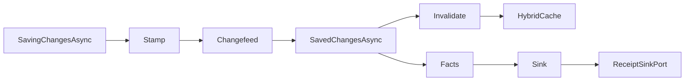

# [PERSISTENCE_QUERY_RAIL]

Every store operation in Rasm.Persistence executes through one typed dispatch: the eight-case `StoreOp<T>` union runs inside a pooled-context bracket, converts provider failure into the `StoreFault` rail exactly once, and self-emits cache invalidation on the paths SaveChanges interceptors never see. The page owns the operation algebra, the projection and keyset-page shapes, the linq2db bulk lane with its delta projection, the four-hook interceptor spine, the standing-query window, the in-process Arrow columnar carrier, and the Arrow Flight SQL plus ADBC zero-copy egress that lifts the carrier across the process boundary; the `StoreProfile` row columns and the AppHost clock, deadline, receipt, cache, and telemetry ports arrive settled and compose as values.

## [01]-[INDEX]

- [01]-[OPERATION_ALGEBRA]: eight-case `StoreOp` dispatch, pooled bracket, and one fault conversion rail.
- [02]-[PROJECTION_SHAPES]: typed projection egress, keyset pages, filter keys, and correlation stamps.
- [03]-[BULK_LANE]: linq2db movement, delta projection, self-emitted invalidation, and receipts.
- [04]-[INTERCEPTOR_SPINE]: four interception hooks, one fact stream, and observability registration.
- [05]-[STANDING_QUERY]: standing queries, tumbling/sliding/session windows, IVM delta, and watermarks.
- [06]-[ARROW_PLANE]: columnar Arrow zero-copy carrier across transport, DuckDB, index, and export.
- [07]-[ARROW_EGRESS]: Arrow Flight SQL server, ADBC consumer, and record-batch projection over the wire.

## [02]-[OPERATION_ALGEBRA]

- Owner: `StoreOp<T>` `[Union]` operation algebra; `StoreFault` `[Union]` fault vocabulary on the doctrine `Expected` shape with the dual-tier `Create` contract; `StoreRail` total dispatch surface.
- Cases: Get | Query | Stream | Aggregate | Upsert | Delete | Bulk | Maintain on `StoreOp<T>`; Text | Concurrency | Transient | Unsupported | ServerNotProvisioned | NewerSchema on `StoreFault`.
- Entry: `public static IO<T> Run<TDb, T>(PooledDbContextFactory<TDb> contexts, StoreOp<T> op, InterceptPolicy policy, ClockPolicy clocks, DeadlineClass deadline)` — `IO<T>` carries the store effect; every failure aborts through `StoreFault`.
- Auto: the bracket leases through `PooledDbContextFactory.CreateDbContextAsync` — one pooled factory per placement, built at composition from the profile row's `Configure` output — and `DisposeAsync` returns the lease, so the context never escapes the rail; every arm runs under `CreateExecutionStrategy`, binding pg `EnableRetryOnFailure` and sqlite busy-retry to the profile row while database retry stays excluded from the AppHost hop law; `Timeout` binds the caller's `DeadlineClass` row.
- Packages: Microsoft.EntityFrameworkCore.Sqlite, Npgsql, Npgsql.EntityFrameworkCore.PostgreSQL, Thinktecture.Runtime.Extensions, LanguageExt.Core, NodaTime.
- Growth: a new operation posture is one case on `StoreOp<T>` and a new failure is one case row in the 7000 fault-code band; op composition is the `StoreOpCompose.Then` extension block on `StoreOp<T>`, not a new owner; zero new surface.
- Boundary: arity discriminates on payload shape — `Seq` carries one-or-many and `GetMany`/`UpsertMany` suffixes are the deleted spelling; repository-per-entity, generic repositories, lazy loading, and per-call-site tracking toggles are rejected forms — read posture is NoTracking from the profile factory options and write arms track explicitly attached graphs only; multi-statement round-trip collapse rides `NpgsqlBatch` and `NpgsqlBatchCommand` inside the `Query` and `Aggregate` arm shapes so a fan-out read executes as one server round-trip rather than N commands, while the EF batch geometry binds through the `MinBatchSize` and `MaxBatchSize` provider-option columns on the profile row — `NpgsqlBatch` is an execution vehicle inside the existing arms, never a ninth case; `Unsupported` materializes when a lane-by-profile capability row denies a shape; `ServerNotProvisioned` and `NewerSchema` construct at the provisioning probe and the open gate, and `From` is the single projection site — the schema-rail `SchemaFault` 5300-band evidence folds to `NewerSchema` 7005 whether it arrives as a top-level `Error` discriminant or wrapped inside `error.Exception`, so a schema rail surfacing its fault as an inner exception never degrades to 7000 `Text`, and the provider-exception arms run only after both schema-fold sites miss; SQLSTATE evidence rides `PostgresException.SqlState` matched against the `PostgresErrorCodes` constants because the `NpgsqlException` base carries no state code.

```csharp signature
[Union]
public abstract partial record StoreFault : Expected, IValidationError<StoreFault> {
    private StoreFault(string detail, int code) : base(detail, code, None) { }

    public static StoreFault Create(string message) => new Text(message);

    public static StoreFault From(Error error) =>
        error switch {
            SchemaFault schema => new NewerSchema(schema.Message),
            { Exception.Case: SchemaFault inner } => new NewerSchema(inner.Message),
            { Exception.Case: DbUpdateConcurrencyException ex } => new Concurrency(ex.Message),
            { Exception.Case: PostgresException { SqlState: PostgresErrorCodes.UndefinedObject } ex } => new ServerNotProvisioned(ex.Message),
            { Exception.Case: DbException { IsTransient: true } ex } => new Transient(ex.Message),
            { Exception.Case: Exception ex } => new Text(ex.Message),
            _ => new Text(error.Message),
        };

    public sealed record Text : StoreFault { public Text(string detail) : base(detail, 7000) { } }

    public sealed record Concurrency : StoreFault, IValidationError<Concurrency> { public Concurrency(string detail) : base(detail, 7001) { } public static new Concurrency Create(string detail) => new(detail); }

    public sealed record Transient : StoreFault, IValidationError<Transient> { public Transient(string detail) : base(detail, 7002) { } public static new Transient Create(string detail) => new(detail); }

    public sealed record Unsupported : StoreFault, IValidationError<Unsupported> { public Unsupported(string detail) : base(detail, 7003) { } public static new Unsupported Create(string detail) => new(detail); }

    public sealed record ServerNotProvisioned : StoreFault, IValidationError<ServerNotProvisioned> { public ServerNotProvisioned(string detail) : base(detail, 7004) { } public static new ServerNotProvisioned Create(string detail) => new(detail); }

    public sealed record NewerSchema : StoreFault, IValidationError<NewerSchema> { public NewerSchema(string detail) : base(detail, 7005) { } public static new NewerSchema Create(string detail) => new(detail); }
}
```

```csharp signature
[Union(ConversionFromValue = ConversionOperatorsGeneration.None)]
public abstract partial record StoreOp<T> where T : notnull {
    private StoreOp() { }

    public sealed record Get(Func<DbContext, CancellationToken, ValueTask<T>> Shape) : StoreOp<T>;
    public sealed record Query(Func<DbContext, CancellationToken, ValueTask<T>> Shape) : StoreOp<T>;
    public sealed record Stream(Func<DbContext, CancellationToken, ValueTask<T>> Shape) : StoreOp<T>;
    public sealed record Aggregate(Func<DbContext, CancellationToken, ValueTask<T>> Shape) : StoreOp<T>;
    public sealed record Upsert(Func<DbContext, CancellationToken, ValueTask<T>> Shape) : StoreOp<T>;
    public sealed record Delete(Func<DbContext, CancellationToken, ValueTask<T>> Shape, Seq<string> Tags) : StoreOp<T>;
    public sealed record Bulk(Func<DbContext, CancellationToken, ValueTask<(T Value, BulkReceipt Receipt)>> Shape, Seq<string> Tags) : StoreOp<T>;
    public sealed record Maintain(Func<DbContext, CancellationToken, ValueTask<T>> Shape, string Kind) : StoreOp<T>;
}

public static class StoreRail {
    public static IO<T> Run<TDb, T>(PooledDbContextFactory<TDb> contexts, StoreOp<T> op, InterceptPolicy policy, ClockPolicy clocks, DeadlineClass deadline) where TDb : DbContext where T : notnull =>
        IO.lift(clocks.Mark).Bind(mark =>
            IO.liftAsync(env => contexts.CreateDbContextAsync(env.Token)).Bracket(
                Use: db => Execute(op, policy, clocks, mark, db).Timeout(deadline.Allotted.ToTimeSpan()),
                Catch: static error => IO.fail<T>(StoreFault.From(error)),
                Fin: static db => IO.liftVAsync<Unit>(async _ => {
                    await db.DisposeAsync();
                    return unit;
                })));

    private static IO<T> Execute<T>(StoreOp<T> op, InterceptPolicy policy, ClockPolicy clocks, long mark, DbContext db) where T : notnull =>
        op.Switch(
            state: (Policy: policy, Clocks: clocks, Mark: mark, Db: db),
            get: static (s, c) => Strategic(s.Db, c.Shape),
            query: static (s, c) => Strategic(s.Db, c.Shape),
            stream: static (s, c) => Strategic(s.Db, c.Shape),
            aggregate: static (s, c) => Strategic(s.Db, c.Shape),
            upsert: static (s, c) => Strategic(s.Db, async (ctx, ct) => (await c.Shape(ctx, ct), await ctx.SaveChangesAsync(ct)).Item1),
            delete: static (s, c) => Strategic(s.Db, c.Shape).Bind(value => IO.liftVAsync<T>(async env => {
                await s.Policy.Invalidate(c.Tags, env.Token);
                return value;
            })),
            bulk: static (s, c) => IO.liftVAsync(env => c.Shape(s.Db, env.Token)).Bind(moved => IO.liftVAsync<T>(async env => {
                _ = s.Policy.Facts(moved.Receipt.Fact);
                await s.Policy.Invalidate(c.Tags, env.Token);
                return moved.Value;
            })),
            maintain: static (s, c) => Strategic(s.Db, c.Shape).Map(value =>
                (s.Policy.Facts(new StoreFact(StoreFact.Maintain, c.Kind, 1, s.Clocks.Elapsed(s.Mark), s.Clocks.Now)), value).Item2));

    private static IO<T> Strategic<T>(DbContext db, Func<DbContext, CancellationToken, ValueTask<T>> shape) =>
        IO.liftAsync(env => db.Database.CreateExecutionStrategy().ExecuteAsync(
            (Db: db, Shape: shape),
            static (state, ct) => state.Shape(state.Db, ct).AsTask(),
            env.Token));
}
```

The `StoreOp<T>` owner carries one self-composing Kleisli combinator — `Then` sequences a producing op with a `T`-keyed continuation through the generated total `Switch`, rewrapping into the same case the source carries so a receipt- or tag-bearing arm keeps its self-emitted invalidation: a `Get` read feeding a `Bulk` merge is one composed op the rail runs in a single bracket, a `Delete` source threads its `Tags` onto the composed `Delete`, a `Maintain` source threads its `Kind`, and a `Bulk` source re-projects its `BulkReceipt` onto the `U` result so the rail's `bulk` arm still fires `Facts(receipt.Fact)` and `Invalidate(tags)`; collapsing a receipt- or tag-bearing case to a bare `Query` is the rejected spelling. The combinator adds zero cases, dispatch stays total so a ninth case breaks composition at compile time, and the continuation runs inside the same execution strategy as the source arm.

```csharp signature
public static class StoreOpCompose {
    extension<T>(StoreOp<T> source) where T : notnull {
        public StoreOp<U> Then<U>(Func<T, DbContext, CancellationToken, ValueTask<U>> next) where U : notnull =>
            source.Switch<Func<T, DbContext, CancellationToken, ValueTask<U>>, StoreOp<U>>(
                state: next,
                get:       static (n, op) => new StoreOp<U>.Query(Sequenced(op.Shape, n)),
                query:     static (n, op) => new StoreOp<U>.Query(Sequenced(op.Shape, n)),
                stream:    static (n, op) => new StoreOp<U>.Stream(Sequenced(op.Shape, n)),
                aggregate: static (n, op) => new StoreOp<U>.Aggregate(Sequenced(op.Shape, n)),
                upsert:    static (n, op) => new StoreOp<U>.Upsert(Sequenced(op.Shape, n)),
                delete:    static (n, op) => new StoreOp<U>.Delete(Sequenced(op.Shape, n), op.Tags),
                maintain:  static (n, op) => new StoreOp<U>.Maintain(Sequenced(op.Shape, n), op.Kind),
                bulk:      static (n, op) => new StoreOp<U>.Bulk(
                    async (db, ct) => { var moved = await op.Shape(db, ct); return (await n(moved.Value, db, ct), moved.Receipt); },
                    op.Tags));

        private static Func<DbContext, CancellationToken, ValueTask<U>> Sequenced<U>(Func<DbContext, CancellationToken, ValueTask<T>> producer, Func<T, DbContext, CancellationToken, ValueTask<U>> next) where U : notnull =>
            async (db, ct) => await next(await producer(db, ct), db, ct);
    }
}
```

## [03]-[PROJECTION_SHAPES]

- Owner: `KeysetPage<TRow>` page record; `ProjectionRail` filter-key vocabulary and query-stamping extensions.
- Cases: soft-delete | retention | sync-tombstone named filter keys.
- Entry: `public static async ValueTask<KeysetPage<TRow>> Materialize(IAsyncEnumerable<TRow> rows, Func<TRow, Guid> key, int take, CancellationToken token)` — pure materialization; the probe row beyond `take` decides cursor continuation, a degenerate `take <= 0` clamps to an empty page through the typed rail, and the continuation cursor reads the key off the last in-page row through `Seq.Last` rather than a raw index, so a zero-take call never throws inside domain logic.
- Auto: the `EF.CompileAsyncQuery` compiled-shape rows cache hot projections as static fields beside their projection records under the `[COMPILED_QUERY]` gate; `Correlated` stamps the `CorrelationId` through `TagWith` on every shape; `Stream` shapes fold a bounded `IAsyncEnumerable` inside the leased bracket, with the batch bound a per-shape policy value.
- Packages: Microsoft.EntityFrameworkCore.Sqlite, Npgsql.EntityFrameworkCore.PostgreSQL, linq2db.EntityFrameworkCore, LanguageExt.Core, BCL inbox.
- Growth: a new egress is one typed projection record beside its consumer plus one compiled-shape row, zero new surface; a non-uuid cursor is one shape row on `KeysetPage<TRow>`; a new bridge terminator is one method on the `ProjectionRail` extension block (`BridgeListAsync`, `BridgeArrayAsync`, `ReentryListAsync`, `FilterPredicate`), and a temporal rollup is one `DurationRollup`-shaped projection over the NodaTime `DbFunctions` aggregates; zero new surface.
- Boundary: typed projection records are the only egress and entity types never cross the package boundary; offset pagination is the rejected page form — keyset cursors ride the UuidV7Key identity order, and a compound `(tenant_id, created_at)` index serves both a keyset cursor and a `created_at`-only filter through the PG18 automatic B-tree skip scan (no SQL, no GUC) so a redundant single-column index leading with the tenant or partition discriminant is the deleted form; named filter predicates attach at the model under these keys and `Unfiltered` disables them per operation case; a caller-supplied `FilterPredicate(Expression<Func<TRow,bool>>)` composes one ad-hoc server-side `Where` onto the source before `Materialize` probes the cursor so a filtered keyset page re-queries the store under the same `take + 1` continuation rather than client-filtering a materialized page — a client-side `.Where` over a fetched page is the deleted form, the predicate stays an `Expression` so the EF translator pushes it into SQL, and it folds with the named model filters and the keyset cursor in one query shape; split-query is the per-shape `AsSplitQuery` policy value; JSON path predicates and `ExecuteUpdateAsync` into JSON paths ride document-lane shapes on the jsonb mapping; `LeftJoin`/`RightJoin` operators replace the `GroupJoin` flatten spelling; a window-function or set-based projection past the EF translator routes through `ToLinqToDB` and terminates on `ToListAsyncLinqToDB`, `ToArrayAsyncLinqToDB`, `FirstAsyncLinqToDB`, `CountAsyncLinqToDB`, or `SumAsyncLinqToDB` so the bridge materializes inside the same leased context rather than a second connection, while a leg re-entering EF translation after the bridge hand-off terminates on `ToListAsyncEF`, `FirstAsyncEF`, or `CountAsyncEF` so the two-door composition closes on the EF side without a second materialization pass; a `Duration` rollup or sync-lag statistic on the `Aggregate` arm projects through the `NpgsqlNodaTimeDbFunctionsExtensions` temporal aggregates `Sum`, `Average`, and `Distance` over `EF.Functions` so the duration math executes server-side rather than materializing rows for a client fold, with `Distance` measuring temporal spread; a client-side `Duration` aggregate over materialized rows is the deleted form; over a TimescaleDB hypertable rollup carrying timescaledb_toolkit, `DurationRollup` projects the time-series-product hyperfunctions `approx_percentile`/`percentile_agg`/`time_weight`/`counter_agg`/`state_agg`/`asof`/gapfill as raw-SQL `Aggregate`-arm shapes on `Store/server#TIMESCALE_PROVISIONING`, while the exact `percentile_cont(0.95) WITHIN GROUP (ORDER BY value)` form is the always-present zero-extra-extension fallback so a profile without the toolkit still answers the rollup.

```csharp signature
public sealed record KeysetPage<TRow>(Seq<TRow> Rows, Option<Guid> After, int Count) where TRow : notnull {
    public static async ValueTask<KeysetPage<TRow>> Materialize(IAsyncEnumerable<TRow> rows, Func<TRow, Guid> key, int take, CancellationToken token) {
        var window = int.Max(take, 0);
        var probe = toSeq(await rows.Take(window + 1).ToListAsync(token));
        var page = probe.Take(window);
        return new KeysetPage<TRow>(
            page,
            probe.Count > window ? page.Last.Map(key) : None,
            page.Count);
    }
}

public static class ProjectionRail {
    public const string SoftDelete = "soft-delete";
    public const string Retention = "retention";
    public const string SyncTombstone = "sync-tombstone";

    extension<TRow>(IQueryable<TRow> source) where TRow : notnull {
        public IQueryable<TRow> Correlated(CorrelationId correlation) => source.TagWith(correlation.ToString());

        public IQueryable<TRow> Unfiltered(params ReadOnlySpan<string> filters) => source.IgnoreQueryFilters([.. filters]);

        public ValueTask<Seq<TRow>> BridgeListAsync(CancellationToken token) =>
            new(source.ToLinqToDB().ToListAsyncLinqToDB(token).Map(toSeq));

        public ValueTask<TRow[]> BridgeArrayAsync(CancellationToken token) =>
            new(source.ToLinqToDB().ToArrayAsyncLinqToDB(token));

        public ValueTask<Seq<TRow>> ReentryListAsync(CancellationToken token) =>
            new(source.ToListAsyncEF(token).Map(toSeq));

        public IQueryable<TRow> FilterPredicate(Expression<Func<TRow, bool>> predicate) => source.Where(predicate);
    }

    extension<TRow>(IQueryable<TRow> source) where TRow : class {
        public ValueTask<Duration> DurationRollup(Expression<Func<TRow, Duration>> selector, CancellationToken token) =>
            new(source.Select(selector).GroupBy(static _ => 1).Select(static g => EF.Functions.Sum(g.Select(static d => d))).FirstAsyncEF(token));
    }
}
```

## [04]-[BULK_LANE]

- Owner: `BulkRoute` route vocabulary; `BulkReceipt` typed movement receipt; `BulkDelta<TRow>` action-sentinel delta record.
- Cases: Copy | Merge | Set on `BulkRoute`.
- Entry: `public static BulkReceipt Of(ClockPolicy clocks, long mark, string entity, long rows, BulkRoute route, string provider)` — pure receipt mint from the clock seam.
- Auto: the `StoreOp<T>.Bulk` arm emits the receipt's fact projection and replays the tag transitions itself — the bulk path bypasses SaveChanges interceptors, so changefeed rows and invalidation are self-emitted inside the same transaction as the movement.
- Receipt: `BulkReceipt` — entity, rows, route, provider, elapsed `Duration`, `Instant` stamp.
- Packages: linq2db.EntityFrameworkCore, Thinktecture.Runtime.Extensions, NodaTime, LanguageExt.Core.
- Growth: a new movement form is one `BulkRoute` case carrying its receipt row; a transaction-opt-out lane is one `Detached` column on the bulk-options value; the OLD/NEW delta-emission path is the ReturningOldNew capability column on the profile row, never a parallel merge surface; a store-side backpressure shed is one `StoreFact.BulkShed` fact on the existing fact stream, never a second signal owner; zero new surface.
- Boundary: bridge activation is one `LinqToDBForEFTools.Initialize()` call at the composition root before the first bulk shape, and the bridge data-context binds `AddMappingSchema`, `AddCustomOptions`, `AddInterceptor`, and `EnableChangeTracker` as columns on the bulk-options value so the linq2db interceptor registers as one altitude on the spine rather than a parallel hook; a lane that must run outside the ambient `DbContext` transaction opens through `CreateLinqToDBConnectionDetached` so the bulk write commits independently of the enclosing save, and a bridge mapping-schema or interceptor swap at composition is followed by one `LinqToDBForEFTools.ClearCaches()` call so a stale cached mapping never survives the rebind; the `Set` route opens its target through `ToLinqToDBTable` or `GetTable` and starts a set-based insert with `Into` so a projection-sourced insert never materializes entities; `BulkCopyAsync` rides `BulkCopyOptions` on the `Copy` route; `MergeWithOutputAsync` consumes `Projection`, whose action string is a SQL-mapped sentinel and never caller input, and on a profile row carrying the ReturningOldNew capability column the merge emits old and new images straight into `BulkDelta<TRow>` so the changefeed reads the RETURNING image without a re-read — the PG18 engine half is the `RETURNING old.*, new.*` form (`BulkDelta.ReturningOldNewSql`) across INSERT/UPDATE/DELETE/MERGE that Npgsql EF v10 maps, so `MergeWithOutputAsync` materializes both images in one round-trip without a re-read, while a profile row without the column (sqlite) captures deltas through the SaveChanges interceptor hook instead; the binary-COPY route stays settled as `BulkCopyType.ProviderSpecific` for pg and `MultipleRows` for the sqlite downgrade over the raw `NpgsqlConnection.BeginBinaryImport`/`NpgsqlBinaryImporter` path; `ToLinqToDB` is the window-function escape inside one query shape; EFCore.BulkExtensions and a query-builder layer are the deleted forms; `Deleted`/`Inserted` sentinels project to `Option` and never travel inward; a bulk movement that exceeds the per-shape capacity bound under store-side pressure emits one `StoreFact.BulkShed` fact carrying the shed row count and the elapsed-at-shed `Duration` on the same `Func<StoreFact,Unit>` interceptor sink the movement already feeds, so a downstream lane reads backpressure off the existing fact stream and throttles its producer — a parallel backpressure channel, a thrown capacity exception, or a second shed signal owner is the deleted form, and the shed is observable as a route-degradation fact rather than a silent drop.

```csharp signature
[SmartEnum]
public sealed partial class BulkRoute {
    public static readonly BulkRoute Copy = new();
    public static readonly BulkRoute Merge = new();
    public static readonly BulkRoute Set = new();
}

public readonly record struct BulkReceipt(string Entity, long Rows, BulkRoute Route, string Provider, Duration Elapsed, Instant At) {
    public static BulkReceipt Of(ClockPolicy clocks, long mark, string entity, long rows, BulkRoute route, string provider) =>
        new(entity, rows, route, provider, clocks.Elapsed(mark), clocks.Now);

    public StoreFact Fact => new(StoreFact.Bulk, Entity, Rows, Elapsed, At);
}

public sealed record BulkDelta<TRow>(string Action, TRow? Deleted, TRow? Inserted) where TRow : class {
    public const string ReturningOldNewSql = "RETURNING old.*, new.*";

    public static Expression<Func<string, TRow, TRow, BulkDelta<TRow>>> Projection { get; } =
        (action, deleted, inserted) => new BulkDelta<TRow>(action, deleted, inserted);

    public Option<TRow> Old => Optional(Deleted);

    public Option<TRow> New => Optional(Inserted);
}
```

## [05]-[INTERCEPTOR_SPINE]

- Owner: `StoreFact` operational fact stream; `InterceptPolicy` delegate-row policy; `StoreInterceptor` single interception capsule; `StoreObservability` registration rows.
- Entry: `public static Func<StoreFact, IO<ReceiptEnvelope>> Sink(ReceiptSinkPort port, JsonSerializerOptions wire, CorrelationId correlation)` — facts materialize as receipt envelopes at the sink edge, with the wire options arriving from the suite Strict merge.
- Auto: slow-query and burst sentinels fold per command with zero call-site code; plan capture re-issues the provider explain form only while `CapturePlans` is set, riding the `store.command.plan` kind; native `Activity` parameter destructuring caps at the `TraceDepth` policy value so deep object graphs never inflate span cardinality; the pg_stat_statements read view enters as one `Aggregate` raw-SQL shape gated on the store-profiles provisioning probe; savepoint evidence is one added delegate column when a profile row earns it.
- Receipt: `StoreFact` rows — kind, subject, count, elapsed `Duration`, `Instant`; bulk and maintain arms share the stream through their fact projections.
- Packages: Microsoft.EntityFrameworkCore.Sqlite, Npgsql.OpenTelemetry, OpenTelemetry, Microsoft.Extensions.Caching.Hybrid, NodaTime, LanguageExt.Core, BCL inbox.
- Growth: a new evidence bucket is one kind constant plus one emission row, a new cross-cutting concern is one delegate-column transformer on `InterceptPolicy` registered as an altitude in the stack, a continuous-aggregate refresh push is one `StoreFact.AggregateRefresh` kind plus one maintenance-lease emission, and a new hook binding is one delegate column on `InterceptPolicy`, zero new surface.
- Boundary: `StoreInterceptor` is the EF interception boundary capsule and its members carry language-owned statement forms; the four hooks compose as one ordered effect-transformer stack where registration order is execution order — the linq2db `AddInterceptor` altitude and the Npgsql `AddNpgsql`/`AddNpgsqlInstrumentation` admission roots register as further altitudes on the same stack, so a soft-delete audit or a trace-depth cap is a new transformer row, never code inside an operation body, and no second interceptor owner appears because AppHost owns the hop law; `Stamp` and `Changefeed` run inside `SavingChangesAsync` so op-log rows commit with entity rows in one transaction, while `Invalidate` and the save fact run after commit in `SavedChangesAsync`; `Reopen` re-applies the PRAGMA ladder on non-pooled opens and arrives bound from the native-sqlite policy table; `Invalidation` binds the tag delegate to the AppHost cache surface; `Traces` and `Meters` are the Npgsql registration rows — `Traces` rides `TracerProviderBuilderExtensions.AddNpgsql(TracerProviderBuilder)` and `Meters` rides `MeterProviderBuilderExtensions.AddNpgsqlInstrumentation(MeterProviderBuilder, Action<NpgsqlMetricsOptions>)`, so meter posture is one configuration column on the registration; `NpgsqlMetricsOptions` carries no settable property knobs at the admitted Npgsql, so the shape delegate is the registration seam and any histogram or cardinality posture rides the OpenTelemetry meter-view configuration rather than a provider-options knob, while `Contribution` carries the minted Persistence identity through `TelemetryContributorPort`; the pg_stat_statements slow-query read view is the durable query-observability surface entering as one `Aggregate` raw-SQL shape over the catalogued contrib view gated on the store-profiles provisioning probe, and the `auto_explain` GUC posture is a read-only `pg_settings` verification fact feeding the same `store.command.slow`/`store.command.plan` stream rather than a runtime `ALTER SYSTEM`; the OLD/NEW RETURNING bulk-delta count rides the existing `BulkReceipt.Fact`; the beta EF and gRPC instrumentation packages stay rejected — native `Activity` emission carries those spans; `InterceptPolicy.Default` is the axis row every spine literal traces to.

```csharp signature
public readonly record struct StoreFact(string Kind, string Subject, long Count, Duration Elapsed, Instant At) {
    public const string CommandSlow = "store.command.slow";
    public const string CommandBurst = "store.command.burst";
    public const string CommandPlan = "store.command.plan";
    public const string Transaction = "store.transaction";
    public const string Save = "store.save";
    public const string Bulk = "store.bulk";
    public const string BulkShed = "store.bulk.shed";
    public const string Maintain = "store.maintain";
    public const string AggregateRefresh = "store.aggregate.refresh";
}

public sealed record InterceptPolicy(
    Duration SlowQuery,
    int Burst,
    Duration BurstSpan,
    bool CapturePlans,
    int TraceDepth,
    Func<DbConnection, CancellationToken, Task> Reopen,
    Func<DbContext, Instant, Unit> Stamp,
    Func<DbContext, Instant, Unit> Changefeed,
    Func<DbContext, Seq<string>> Tags,
    Func<Seq<string>, CancellationToken, ValueTask> Invalidate,
    Func<StoreFact, Unit> Facts) {
    public static readonly InterceptPolicy Default = new(
        SlowQuery: Duration.FromMilliseconds(250),
        Burst: 16,
        BurstSpan: Duration.FromMilliseconds(100),
        CapturePlans: false,
        TraceDepth: 3,
        Reopen: static (_, _) => Task.CompletedTask,
        Stamp: static (_, _) => unit,
        Changefeed: static (_, _) => unit,
        Tags: static _ => Seq<string>(),
        Invalidate: static (_, _) => ValueTask.CompletedTask,
        Facts: static _ => unit);
}
```

```csharp signature
public sealed class StoreInterceptor(InterceptPolicy policy, ClockPolicy clocks) :
    IDbConnectionInterceptor, IDbCommandInterceptor, ISaveChangesInterceptor, IDbTransactionInterceptor {
    private readonly Atom<(Instant At, int Count)> burst = Atom((Instant.MinValue, 0));

    public Task ConnectionOpenedAsync(DbConnection connection, ConnectionEndEventData eventData, CancellationToken cancellationToken = default) =>
        policy.Reopen(connection, cancellationToken);

    public ValueTask<DbDataReader> ReaderExecutedAsync(DbCommand command, CommandExecutedEventData eventData, DbDataReader result, CancellationToken cancellationToken = default) {
        var now = clocks.Now;
        var window = burst.Swap(last => now - last.At > policy.BurstSpan ? (now, 1) : (last.At, last.Count + 1));
        _ = eventData.Duration >= policy.SlowQuery.ToTimeSpan()
            ? policy.Facts(new StoreFact(StoreFact.CommandSlow, command.CommandText, 1, eventData.Duration.ToDuration(), now))
            : unit;
        _ = window.Count == policy.Burst
            ? policy.Facts(new StoreFact(StoreFact.CommandBurst, command.CommandText, window.Count, now - window.At, now))
            : unit;
        return ValueTask.FromResult(result);
    }

    public ValueTask<InterceptionResult<int>> SavingChangesAsync(DbContextEventData eventData, InterceptionResult<int> result, CancellationToken cancellationToken = default) =>
        ValueTask.FromResult((eventData.Context is { } db
            ? (policy.Stamp(db, clocks.Now), policy.Changefeed(db, clocks.Now)).Item2
            : unit, result).Item2);

    public async ValueTask<int> SavedChangesAsync(SaveChangesCompletedEventData eventData, int result, CancellationToken cancellationToken = default) {
        var tags = eventData.Context is { } db ? policy.Tags(db) : Seq<string>();
        await policy.Invalidate(tags, cancellationToken);
        _ = policy.Facts(new StoreFact(StoreFact.Save, eventData.Context?.GetType().Name ?? string.Empty, result, Duration.Zero, clocks.Now));
        return result;
    }

    public Task TransactionCommittedAsync(DbTransaction transaction, TransactionEndEventData eventData, CancellationToken cancellationToken = default) =>
        Task.FromResult(policy.Facts(new StoreFact(StoreFact.Transaction, transaction.IsolationLevel.ToString(), 1, eventData.Duration.ToDuration(), clocks.Now)));
}

public static class StoreObservability {
    public static TracerProviderBuilder Traces(TracerProviderBuilder tracing) => tracing.AddNpgsql();

    public static MeterProviderBuilder Meters(MeterProviderBuilder metrics, Action<NpgsqlMetricsOptions> shape) => metrics.AddNpgsqlInstrumentation(shape);

    public static TelemetryContributorPort Contribution(string version, Seq<InstrumentRow> instruments) =>
        new(TelemetrySource.Persistence, version, instruments);

    public static Func<Seq<string>, CancellationToken, ValueTask> Invalidation(HybridCache cache) =>
        (tags, token) => cache.Invalidate(tags, token);

    public static Func<StoreFact, IO<ReceiptEnvelope>> Sink(ReceiptSinkPort port, JsonSerializerOptions wire, CorrelationId correlation) =>
        fact => port.Send(correlation, TenantContext.Current, TelemetrySource.Persistence.Key, fact.Kind, JsonSerializer.SerializeToElement(fact, wire));
}
```



## [06]-[STANDING_QUERY]

- Owner: `StandingQuery<TRow>` the registered continuous-query record; `WindowKind` the closed window SmartEnum; `WindowSpec`/`WindowBucket` the window vocabulary and bucket-assignment value; `SignedRow<TRow>`/`QueryDelta<TRow>` the signed-multiset incremental-view-maintenance delta carrier; `Watermark` the event-time progress mark; `StandingStepWire` the TS-projection window-bound wire row; `StandingQueries` the static surface owning the standing-query registration, the windowed fold, the signed-delta IVM application, the retraction-plus-restate, and the watermark/late-arrival policy.
- Cases: `Tumbling | Sliding | Session` on `WindowKind`; a tumbling row lands in one floor-aligned bucket, a sliding row in `ceil(Size/Slide)` overlapping `Slide`-aligned buckets, a session row in a raw bucket the gap-merge fold coalesces by the inactivity `Gap`; a standing query is a registered `IQueryable`-shaped predicate plus a window plus a signed IVM fold so a new op-log row produces a delta-out without re-running the whole query.
- Entry: `public static StandingQuery<TRow> Register(string id, Func<IQueryable<TRow>, IQueryable<TRow>> shape, WindowSpec window, Func<QueryDelta<TRow>, QueryDelta<TRow>> fold)` — registers a standing query; `public static (QueryDelta<TRow> Out, Watermark Advanced, Seq<StandingStepWire> Wire) Step(StandingQuery<TRow> query, QueryDelta<TRow> deltaIn, Watermark watermark, Func<StoreFact,Unit> facts, ClockPolicy clocks)` applies an incoming signed delta, restates late rows through retraction-plus-restate, emits the delta-out plus the advanced watermark plus the per-bucket TS wire rows, and fires the `store.standing.step`/`store.standing.late` facts.
- Auto: the standing query rides the op-log changefeed as its delta-in source so a continuous query never polls — the changefeed cursor advances and each new `OpLogEntry` is a `QueryDelta` insert/delete the IVM fold applies, emitting only the result rows that changed; the window vocabulary folds over the event-time `OpLogEntry.Physical` — a tumbling window buckets by fixed interval, a sliding window by interval-plus-slide, a session window by inactivity gap — so a windowed aggregate (count-per-minute, moving-average, session-rollup) maintains incrementally; the watermark is the event-time progress mark so a late-arriving row (a row whose `Physical` precedes the watermark) folds into a retraction-plus-restated delta rather than a dropped row, and the late-arrival allowed-lateness bound is a policy value; the standing query result rides the DynamicData change-set surface (`AppUi/live-data`) and the TimescaleDB continuous aggregate (`Store/server#TIMESCALE_PROVISIONING`) is the server-side persisted analogue.
- Receipt: a step rides `store.standing.step` (`StandingQueries.StepKind`) carrying the signed net and the watermark-to-now lag; a late-arrival retraction rides `store.standing.late` (`StandingQueries.LateKind`) carrying the late-row count and the watermark advance; the TS projection consumer (`AppUi/live-data#TS_PROJECTION`) decodes `StandingStepWire` carrying `(QueryId, WindowStart, WindowEnd, Net, WatermarkEventTime, WatermarkProcessed, Retracted)` — the one cross-package window-bound wire vocabulary, never a parallel TS-side window record.
- Packages: linq2db.EntityFrameworkCore, NodaTime, LanguageExt.Core, Thinktecture.Runtime.Extensions, BCL inbox.
- Growth: a new window kind is one `WindowSpec` case; a new aggregation is one IVM fold; a new late-arrival policy is one column on `WindowSpec`; zero new surface — a polling query loop, a per-query materialized-view trigger, or a second streaming engine is the deleted form because the standing query rides the op-log changefeed as its delta source, the window folds over the HLC event time, and the IVM fold emits delta-out, and the building blocks (DynamicData change-sets, TimescaleDB continuous aggregates, the DuckDB analytical lane) compose under this one watermark/window owner.
- Boundary: the standing query is incremental-view-maintenance over the changefeed so it never polls and never re-runs the full query — a new op-log row is a `QueryDelta` the IVM fold applies, emitting only the changed result rows, so a poll loop or a full-query-on-every-change is the deleted form; the window folds over event time (`OpLogEntry.Physical`), never wall-clock arrival time, so a window aggregate is reproducible and replays identically — a processing-time window is the deleted form; the watermark bounds out-of-order tolerance — a row whose event time precedes the watermark by less than the allowed-lateness emits a retraction-plus-restated delta so the windowed result corrects, and a row later than the bound folds into the next window with a late-arrival fact, so a silently-dropped late row is the deleted form; the standing query is the unified watermark/window owner the existing building blocks compose under — DynamicData change-sets carry the delta-out to the UI, TimescaleDB continuous aggregates are the server-side persisted standing query, and the DuckDB analytical lane materializes a windowed rollup — so a second streaming framework is the deleted form; the IVM delta is signed (insert positive, delete negative) so a sliding-window aggregate maintains by adding the entering rows and subtracting the leaving rows, never re-scanning the window.

```csharp signature
[SmartEnum<int>]
public sealed partial class WindowKind {
    public static readonly WindowKind Tumbling = new(0);
    public static readonly WindowKind Sliding = new(1);
    public static readonly WindowKind Session = new(2);

    static partial void ValidateConstructorArguments(ref int key) =>
        _ = key is < 0 or > 2 ? throw new ArgumentOutOfRangeException(nameof(key)) : key;
}

public readonly record struct WindowSpec(WindowKind Kind, Duration Size, Duration Slide, Duration Gap, Duration AllowedLateness) {
    public static WindowSpec Tumble(Duration size) => new(WindowKind.Tumbling, size, size, Duration.Zero, Duration.FromSeconds(30));
    public static WindowSpec Slide(Duration size, Duration slide) => new(WindowKind.Sliding, size, slide, Duration.Zero, Duration.FromSeconds(30));
    public static WindowSpec Sessionize(Duration gap) => new(WindowKind.Session, Duration.Zero, Duration.Zero, gap, Duration.FromSeconds(30));

    public Seq<WindowBucket> Buckets(Instant at) =>
        Kind.Switch(
            state: (At: at, Spec: this),
            tumbling: static s => Seq1(WindowBucket.Aligned(s.At, s.Spec.Size)),
            sliding: static s => SlideBuckets(s.At, s.Spec.Size, s.Spec.Slide),
            session: static s => Seq1(new WindowBucket(s.At, s.At + Duration.Epsilon)));

    private static Seq<WindowBucket> SlideBuckets(Instant at, Duration size, Duration slide) {
        var slideTicks = slide.BclCompatibleTicks;
        var earliest = at - size;
        var firstStart = earliest.ToUnixTimeTicks() + (slideTicks - earliest.ToUnixTimeTicks() % slideTicks) % slideTicks;
        return Range((firstStart - at.ToUnixTimeTicks()) / -slideTicks + 1)
            .Map(i => WindowBucket.Span(Instant.FromUnixTimeTicks(firstStart + i * slideTicks), size))
            .Filter(b => b.Start <= at && at < b.End)
            .ToSeq();
    }
}

public readonly record struct WindowBucket(Instant Start, Instant End) {
    public static WindowBucket Span(Instant start, Duration size) => new(start, start + size);

    public static WindowBucket Aligned(Instant at, Duration size) =>
        Span(Instant.FromUnixTimeTicks(at.ToUnixTimeTicks() - at.ToUnixTimeTicks() % size.BclCompatibleTicks), size);

    public bool Contains(Instant at) => Start <= at && at < End;

    public Option<WindowBucket> Coalesce(WindowBucket next, Duration gap) =>
        next.Start - End <= gap ? Some(this with { End = Instant.Max(End, next.End) }) : None;
}

public readonly record struct SignedRow<TRow>(TRow Row, int Sign, Instant EventTime) where TRow : notnull {
    public static SignedRow<TRow> Insert(TRow row, Instant at) => new(row, +1, at);
    public static SignedRow<TRow> Delete(TRow row, Instant at) => new(row, -1, at);

    public SignedRow<TRow> Retract() => this with { Sign = -Sign };
}

public readonly record struct QueryDelta<TRow>(Seq<SignedRow<TRow>> Rows, Instant EventTime) where TRow : notnull {
    public static QueryDelta<TRow> FromChangefeed(Seq<TRow> inserted, Seq<TRow> deleted, Instant at) =>
        new(inserted.Map(r => SignedRow<TRow>.Insert(r, at)) + deleted.Map(r => SignedRow<TRow>.Delete(r, at)), at);

    public int Net => Rows.Sum(r => r.Sign);
    public Seq<SignedRow<TRow>> Entering => Rows.Filter(r => r.Sign > 0);
    public Seq<SignedRow<TRow>> Leaving => Rows.Filter(r => r.Sign < 0);

    public QueryDelta<TRow> Retracting(SignedRow<TRow> late) =>
        this with { Rows = Rows.Add(late.Retract()).Add(late) };
}

public readonly record struct Watermark(Instant EventTime, long Processed) {
    public static Watermark Start => new(Instant.MinValue, 0L);

    public bool IsLate(Instant rowTime, Duration allowed) => rowTime < EventTime - allowed;
    public bool BeyondLateness(Instant rowTime, Duration allowed) => rowTime < EventTime - allowed - allowed;

    public Watermark Advance(Instant rowTime, int rows) =>
        new(Instant.Max(EventTime, rowTime), Processed + rows);
}

public readonly record struct StandingStepWire(
    string QueryId,
    Instant WindowStart,
    Instant WindowEnd,
    int Net,
    Instant WatermarkEventTime,
    long WatermarkProcessed,
    bool Retracted);

public sealed record StandingQuery<TRow>(
    string Id,
    Func<IQueryable<TRow>, IQueryable<TRow>> Shape,
    WindowSpec Window,
    Func<QueryDelta<TRow>, QueryDelta<TRow>> Fold) where TRow : notnull;

public static class StandingQueries {
    public const string StepKind = "store.standing.step";
    public const string LateKind = "store.standing.late";

    public static StandingQuery<TRow> Register<TRow>(string id, Func<IQueryable<TRow>, IQueryable<TRow>> shape, WindowSpec window, Func<QueryDelta<TRow>, QueryDelta<TRow>> fold) where TRow : notnull =>
        new(id, shape, window, fold);

    public static (QueryDelta<TRow> Out, Watermark Advanced, Seq<StandingStepWire> Wire) Step<TRow>(
        StandingQuery<TRow> query, QueryDelta<TRow> deltaIn, Watermark watermark, Func<StoreFact, Unit> facts, ClockPolicy clocks) where TRow : notnull {
        var allowed = query.Window.AllowedLateness;
        var late = deltaIn.Entering.Filter(r => watermark.IsLate(r.EventTime, allowed));
        var restated = late.Fold(deltaIn, static (acc, r) => acc.Retracting(r));
        var dropped = late.Filter(r => watermark.BeyondLateness(r.EventTime, allowed));
        var folded = query.Fold(restated);
        var advanced = watermark.Advance(deltaIn.EventTime, deltaIn.Rows.Count);
        _ = facts(new StoreFact(StepKind, query.Id, folded.Net, clocks.Now - advanced.EventTime, clocks.Now));
        _ = late.IsEmpty ? unit : facts(new StoreFact(LateKind, query.Id, late.Count, advanced.EventTime - deltaIn.EventTime, clocks.Now));
        var wire = query.Window.Buckets(deltaIn.EventTime).Map(b =>
            new StandingStepWire(query.Id, b.Start, b.End, folded.Net, advanced.EventTime, advanced.Processed, Retracted: !late.IsEmpty));
        return (folded, advanced, dropped.IsEmpty ? wire : wire.Map(w => w with { Net = w.Net - dropped.Count }));
    }
}
```

## [07]-[ARROW_PLANE]

- Owner: `ArrowChunk` the borrowed columnar `ref struct` carrier over one DuckDB vector quantum; `ArrowSchema`/`ArrowColumn` the column-layout descriptor with the DuckDB-to-Arrow type fold; `ChunkSink` the ref-struct-safe per-quantum callback; `ArrowPlaneClr`/`ArrowPlane.ArrowTypeMap` the type folds; `ArrowPlane` the static surface owning the DuckDB vector-chunk zero-copy stream, the reverse table-function carrier registration, the Arrow-to-index ingest, and the Arrow-to-transport/GPU/export hand-off.
- Cases: a carrier wraps one DuckDB vector chunk as a borrowed columnar `ref struct` so the same memory threads transport → DuckDB → index → GPU → export without a managed-array copy; the reverse direction threads a managed columnar sequence back into the engine as a queryable relation through the low-level `RegisterTableFunction`.
- Entry: `public static IO<long> Stream(DuckDBConnection lane, string sql, Seq<DuckDBParameter> parameters, Func<IDuckDBDataReader,int,(int Rows, ReadOnlyMemory<byte>[] Data, ReadOnlyMemory<byte>[] Valid)> read, ChunkSink onChunk, ClockPolicy clocks)` — opens the reader in `UseStreamingMode`, lifts each vector chunk's column buffers off the reader zero-copy, and hands one `ArrowChunk` per quantum to `onChunk` in-scope, returning the total row count; the `read` delegate returns the chunk's explicit `Rows` count alongside the borrowed buffers so the carrier never infers row count from a column's byte-length (a multi-byte type such as `int64` or `fixed_size_list<float>[N]` stores `rows * elementWidth` bytes, so a byte-length inference over-counts); `public static IO<Unit> RegisterCarrier<TRow>(...)` registers the reverse managed-relation carrier; `public static IO<Unit> ToExport(ArrowChunk carrier, Func<ReadOnlyMemory<byte>, IO<Unit>> sink)` streams the columnar buffer to a sink chunk-wide.
- Auto: the Arrow plane is the columnar in-memory analytics carrier the DuckDB lane already produces — DuckDB's native vector-chunk readers (`Query/lanes#ANALYTICAL_LANE` vector chunk transfer, `IDuckDBDataReader`/`VectorDataReaderBase`/`DuckDBDataReader.UseStreamingMode`) expose columnar buffers at the engine's vector quantum, so the carrier borrows those buffers rather than copying into a managed array, and the same columnar memory threads from the analytical query into the index ingest, the GPU tensor encode (`Compute/tensor-lane`), and the parquet export; the carrier is one chunk wide so peak managed memory stays bounded regardless of result size; the hand-off to the index is column-oriented so a vector-index bulk ingest reads the embedding column directly, and the hand-off to export is the parquet `COPY` the analytical lane owns.
- Receipt: a carrier projection rides `store.arrow.carrier` (`ArrowChunk.Fact`) carrying the chunk offset, the column count, and the chunk row count; an export rides the analytical-lane parquet receipt.
- Packages: DuckDB.NET.Data.Full, System.Buffers, System.Collections.Frozen, LanguageExt.Core, BCL inbox.
- Growth: a new carrier sink is one `ArrowPlane` hand-off method; a new column type is one row on `ArrowTypeMap` and `ArrowPlaneClr.Map`; zero new surface — a managed-array result buffer, a row-oriented carrier, or a per-sink copy is the deleted form because the carrier borrows the DuckDB vector-chunk buffers at the vector quantum and threads them zero-copy across the analytics surfaces; the DuckDB analytics lane stays the columnar engine and this owner models the zero-copy carrier the lane's chunk readers already expose, replacing the DynamicData change-set hand-off for the bulk analytical path.
- Boundary: the Arrow plane borrows DuckDB's columnar vector-chunk buffers zero-copy so the analytical carrier never copies into a managed array — a managed-array result buffer or a row-oriented carrier is the deleted form, and the carrier wraps the engine's native chunk at the vector quantum so peak memory is one chunk wide; the verified zero-copy path is the DuckDB vector-chunk reader (`IDuckDBDataReader.IsValid`/`GetValue`/`GetDataTypeName`, `VectorDataReaderBase`, `DuckDBDataReader.UseStreamingMode`) — the Apache Arrow C-data interface (`QueryArrow`/`arrow_scan`/`ArrowArrayStream`/native `ArrowArray`/`ArrowSchema` structs) is NOT in the `api-duckdb.md` catalogue, so the carrier binds the catalogued vector reader and the Arrow C-data binding is a noted gap for the API pass rather than an authored guess; the carrier is a `ref struct` with a bounded lifetime tied to the DuckDB reader's `using` scope so it never escapes the read scope, enters a closure, or survives `DisposeAsync` — the `ChunkSink` `scoped in` callback is the only consumption seam, the same ref-struct discipline the Sep reader holds; the same columnar memory threads transport → DuckDB → index → GPU → export so a vector-index ingest reads the embedding column directly off the carrier, a GPU tensor encode reads the numeric columns (`Compute/tensor-lane` geometry encoding), and the parquet export streams the carrier through the analytical lane's `COPY` — so a per-sink re-serialization is the deleted form; the reverse managed-relation carrier rides the low-level `RegisterTableFunction(name, Func<TableFunction>, Action<object?, IDuckDBDataWriter[], ulong>)` so a windowed rollup re-enters the engine through one registration carrying its `ColumnInfo` schema and `CardinalityHint(count, IsExact: true)`, never a staging table; the DuckDB lane stays the columnar engine and this owner is the zero-copy carrier model over its existing vector-chunk readers, never a second analytics engine; the bulk analytical hand-off uses this carrier while the row-granular UI hand-off stays the DynamicData change-set, so the two hand-offs are altitude-split by granularity, never duplicated.

```csharp signature
public readonly record struct ArrowColumn(string Name, string ArrowType, string DuckType, bool Nullable);

public readonly record struct ArrowSchema(Seq<ArrowColumn> Columns) {
    public Option<int> Ordinal(string name) => Columns.FindIndex(c => c.Name == name).Apply(i => i < 0 ? None : Some(i));
}

public readonly ref struct ArrowChunk(ArrowSchema schema, int rowCount, long chunkOffset, ReadOnlySpan<ReadOnlyMemory<byte>> buffers, ReadOnlySpan<ReadOnlyMemory<byte>> validity) {
    public ArrowSchema Schema { get; } = schema;
    public int RowCount { get; } = rowCount;
    public long ChunkOffset { get; } = chunkOffset;
    public ReadOnlySpan<ReadOnlyMemory<byte>> Buffers { get; } = buffers;
    public ReadOnlySpan<ReadOnlyMemory<byte>> Validity { get; } = validity;

    public ReadOnlyMemory<byte> Column(int ordinal) => Buffers[ordinal];
    public StoreFact Fact(ClockPolicy clocks, long mark) =>
        new(ArrowPlane.CarrierKind, $"chunk:{ChunkOffset}", RowCount, clocks.Elapsed(mark), clocks.Now);
}

public delegate void ChunkSink(scoped in ArrowChunk chunk);

public static class ArrowPlaneClr {
    private static readonly FrozenDictionary<string, Type> Map = new Dictionary<string, Type> {
        ["BIGINT"] = typeof(long), ["INTEGER"] = typeof(int), ["DOUBLE"] = typeof(double), ["FLOAT"] = typeof(float),
        ["VARCHAR"] = typeof(string), ["BLOB"] = typeof(byte[]), ["BOOLEAN"] = typeof(bool),
        ["TIMESTAMP"] = typeof(DateTime), ["UUID"] = typeof(Guid),
    }.ToFrozenDictionary(StringComparer.OrdinalIgnoreCase);

    public static Type Of(string duckType) => Map.Find(duckType).IfNone(typeof(byte[]));
}

public static class ArrowPlane {
    public const string CarrierKind = "store.arrow.carrier";

    public static readonly FrozenDictionary<string, string> ArrowTypeMap = new Dictionary<string, string> {
        ["BIGINT"] = "int64", ["INTEGER"] = "int32", ["DOUBLE"] = "double", ["FLOAT"] = "float32",
        ["VARCHAR"] = "utf8", ["BLOB"] = "binary", ["BOOLEAN"] = "bool", ["TIMESTAMP"] = "timestamp[us]",
        ["UUID"] = "fixed_size_binary[16]", ["HUGEINT"] = "decimal128",
    }.ToFrozenDictionary(StringComparer.OrdinalIgnoreCase);

    public static ArrowSchema SchemaOf(IDuckDBDataReader reader) =>
        new(Range(reader.FieldCount).Map(i =>
            reader.GetDataTypeName(i).Apply(dt =>
                new ArrowColumn(reader.GetName(i), ArrowTypeMap.Find(dt).IfNone("binary"), dt, Nullable: true))).ToSeq());

    public static IO<long> Stream(
        DuckDBConnection lane, string sql, Seq<DuckDBParameter> parameters,
        Func<IDuckDBDataReader, int, (int Rows, ReadOnlyMemory<byte>[] Data, ReadOnlyMemory<byte>[] Valid)> read,
        ChunkSink onChunk, ClockPolicy clocks) =>
        IO.liftVAsync(async env => {
            var mark = clocks.Mark();
            await using var command = lane.CreateCommand();
            command.CommandText = sql;
            command.UseStreamingMode = true;
            parameters.Iter(p => command.Parameters.Add(p));
            await using var reader = await command.ExecuteReaderAsync(env.Token);
            var schema = SchemaOf(reader);
            var offset = 0L;
            var rows = 0L;
            while (await reader.ReadAsync(env.Token)) {
                var (chunkRows, data, valid) = read(reader, reader.FieldCount);
                var chunk = new ArrowChunk(schema, chunkRows, offset, data, valid);
                onChunk(chunk);
                offset += 1;
                rows += chunk.RowCount;
            }
            return rows;
        });

    public static IO<Unit> RegisterCarrier<TRow>(
        DuckDBConnection lane, string name, ArrowSchema schema, ulong cardinality,
        Func<IEnumerable<TRow>> source, Action<TRow, IDuckDBDataWriter[]> writeRow) where TRow : notnull =>
        IO.lift(() => {
            lane.RegisterTableFunction(
                name,
                () => new TableFunction(
                    schema.Columns.Map(c => new ColumnInfo(c.Name, ArrowPlaneClr.Of(c.DuckType))).ToList(),
                    source(),
                    new CardinalityHint(cardinality, IsExact: true)),
                (item, writers, _) => writeRow((TRow)item!, writers));
            return unit;
        });

    public static IO<Unit> ToExport(ArrowChunk carrier, Func<ReadOnlyMemory<byte>, IO<Unit>> sink) =>
        carrier.RowCount == 0 ? IO.pure(unit) : sink(carrier.Column(0));

    public static IO<Unit> ToIndex(ArrowChunk carrier, string column, Func<ReadOnlyMemory<byte>, IO<Unit>> ingest) =>
        carrier.Schema.Ordinal(column).Match(
            Some: ordinal => ingest(carrier.Column(ordinal)),
            None: () => IO.fail<Unit>(Error.New($"<arrow-column-absent:{column}>")));
}
```

## [08]-[ARROW_EGRESS]

- Owner: `BatchSchema` the `ArrowSchema`-to-`Apache.Arrow.Schema` fold over the `ArrowTypeMap` rows; `BatchProjector` the `ArrowChunk`-to-`RecordBatch` materializer reusing the one carrier layout; `FlightDataset` the `FlightDescriptor`-keyed dataset address with its `FlightInfo` discovery payload; `StoreFlightServer` the `FlightServer` subclass owning `GetFlightInfo`/`GetSchema`/`DoGet`/`DoExchange`; `AdbcEgress` the `AdbcStatement` consumer contract folding `QueryResult.Stream` back to `RecordBatch`; `StoreFlightClient` the `FlightClient`-over-`GrpcChannel` puller; `ArrowEgress` the static surface owning the batch projection, the Flight serve fold, the standing-query push channel, and the ADBC pull.
- Cases: a `DoGet` redeems one `FlightTicket` into a server-streamed `RecordBatch` sequence; a `DoExchange` threads the standing-query incremental batch stream over one full-duplex channel; an ADBC `ExecuteQuery` yields a `QueryResult` whose `IArrowArrayStream` re-reads the same batch schema — the dataset is `FlightDescriptor.CreateCommandDescriptor` over the canonical query bytes so an identical query addresses one dataset.
- Entry: `public static RecordBatch Project(in ArrowChunk chunk)` — folds one borrowed carrier quantum into a `RecordBatch` whose columns mirror the `ArrowSchema` ordinals; `public static IO<long> Serve(StoreFlightServer server, FlightTicket ticket, FlightServerRecordBatchStreamWriter writer, Func<FlightTicket, ChunkSink, IO<long>> source, ClockPolicy clocks)` writes one `RecordBatch` per carrier quantum off the streaming source into the Flight response stream; `public static IO<long> PushStanding(FlightServerRecordBatchStreamWriter writer, StandingQuery<RecordBatch> query, ChannelReader<QueryDelta<RecordBatch>> deltas)` pushes incremental standing-query batches over one channel; `public static IO<long> Pull(AdbcConnection connection, string sql, Func<RecordBatch, IO<Unit>> onBatch)` opens an `AdbcStatement`, executes, and folds the `QueryResult.Stream` `RecordBatch` sequence through the batch sink.
- Auto: the egress reuses the one `ArrowChunk`/`ArrowSchema` carrier layout the in-process plane (`#ARROW_PLANE`) already projects — `BatchProjector` materializes the borrowed DuckDB vector-chunk buffers into an `Apache.Arrow` `RecordBatch` through the typed `*Array.Builder`/`RecordBatch.Builder.Append` surface keyed by the `ArrowTypeMap` row, so the Flight wire and the in-process plane share one schema and a row-to-object materialization never enters; the `StoreFlightServer.DoGet` streams the `RecordBatch` sequence through `FlightServerRecordBatchStreamWriter.WriteAsync` so an analytical consumer pulls columnar batches over gRPC without a re-serialization; the standing-query window (`#STANDING_QUERY`) pushes its incremental delta batches over one `DoExchange` channel so a subscribed client receives the windowed `RecordBatch` deltas live; the ADBC consumer drives `AdbcStatement.ExecuteQuery` and reads `QueryResult.Stream` (`IArrowArrayStream`) so a Python/polars consumer reads the same schema through the native driver; the Flight transport channel and the ADBC driver are host-resolved connection inputs, never fence members.
- Receipt: a served batch rides `store.arrow.flight.serve` (`ArrowEgress.ServeKind`) carrying the dataset descriptor, the batch count, and the total rows; a standing push rides `store.arrow.flight.push`; an ADBC pull rides `store.arrow.adbc.pull` carrying the `QueryResult.RowCount`.
- Packages: Apache.Arrow, Apache.Arrow.Flight, Apache.Arrow.Adbc, DuckDB.NET.Data.Full, LanguageExt.Core, NodaTime, BCL inbox.
- Growth: a new egress verb is one `StoreFlightServer` override or one `AdbcStatement` execution form; a new column type is one row on `#ARROW_PLANE` `ArrowTypeMap` consumed here by `BatchSchema`; a new dataset is one `FlightDescriptor` address; zero new surface — a row-wire egress, a second result shape beside `RecordBatch`, a per-consumer serializer, or a hand-rolled gRPC service is the deleted form because the egress lifts the one carrier schema over the Flight/ADBC transport the packages own.
- Boundary: the egress projects the one `#ARROW_PLANE` carrier schema and never mints a parallel result shape — `BatchProjector.Project` materializes the borrowed vector-chunk buffers into a `RecordBatch` through `RecordBatch.Builder.Append<TArray>(name, nullable, Func<RecordBatch.ArrayBuilder, TArray>)` keyed by the `ArrowTypeMap` row, so the Flight wire schema and the in-process plane schema are one `Schema`, and a row-to-object materialization or a second columnar result type is the deleted form; the `StoreFlightServer` is a concrete `FlightServer` subclass overriding only the verbs the node serves (`GetFlightInfo`, `GetSchema`, `DoGet`, `DoExchange`) — the base handlers throw `NotImplementedException` and the internal protobuf `FlightService` stub is never touched, the gRPC service binding entering at the app root that hosts the listener, never an interior dependency; the server-Flight member surface this fold binds (`FlightServer` base, the `FlightServerRecordBatchStreamWriter`/`ServerCallContext` `DoGet`/`DoExchange` signatures, `FlightLocation`, `FlightTicket`, the `FlightInfo(Schema, FlightDescriptor, FlightEndpoint[], long, long)` ctor, `FlightDescriptor.CreateCommandDescriptor`) is NOT in `.api/api-arrow.md`, whose Flight family catalogues the client root (`FlightClient.*`) only — so these members are an API-pass gap the `[ARROW_FLIGHT_SERVE]` gate binds before the serve fence finalizes, not a catalogue-verified surface, the same noted-gap discipline `#ARROW_PLANE` holds for the Arrow C-data interface; the dataset is addressed by `FlightDescriptor.CreateCommandDescriptor(string)` over the canonical query bytes so two consumers issuing the same query redeem one dataset, and the `FlightInfo` discovery payload carries the `Schema`, the `FlightEndpoint` ticket-plus-location set, `TotalRecords`, and `TotalBytes` so a consumer plans before pulling; the `FlightTicket` opaque `ByteString` is the `DoGet` redemption token minted from the dataset content key, never a raw query string; the standing-query push rides one `DoExchange` full-duplex channel so the incremental window deltas stream over one connection — a per-batch unary call or a polling pull is the deleted form, and the body compression rides `IpcOptions` `CompressionCodecType` (`LZ4_FRAME`, the catalogued enum and value, `.api/api-arrow.md` `[2]`/`[3]`) so the body compresses on the wire without a second framing; the ADBC consumer drives the catalogued `AdbcDriver.Open → AdbcDatabase.Connect → AdbcConnection.CreateStatement → AdbcStatement.ExecuteQuery` spine and reads the `QueryResult` `IArrowArrayStream` through `ReadNextRecordBatchAsync`, lifting every `AdbcException` into the `StoreFault` rail at this one edge — the `QueryResult.Stream`/`QueryResult.RowCount` member shapes, the `AdbcStatusCode` enum, and the `AdbcException(string, AdbcStatusCode)` ctor are NOT in `.api/api-arrow.md` (the ADBC family catalogues `AdbcException` as the typed error and `ExecuteQuery` as returning `QueryResult` with a stream, without the member/ctor signatures), so those are the API-pass gap the `[ARROW_FLIGHT_SERVE]` gate binds, not catalogue-verified members — the `Apache.Arrow.Adbc.C` driver-manager interop and option keys (`AdbcOptions` constants) stay host-resolved connection policy, never a Persistence surface; the carrier lifetime stays bounded to one batch wide so peak managed memory never exceeds one `RecordBatch`, the same ref-struct discipline `#ARROW_PLANE` holds, and the projection consumes the carrier inside the `ChunkSink` scope before the batch crosses the wire; outbound Flight resilience rides AppHost (`OutboundHop`), never a second retry owner, and the database stays excluded from the hop law.

```csharp signature
public static class BatchSchema {
    public static Schema Of(ArrowSchema layout) =>
        layout.Columns.Fold(new Schema.Builder(), static (builder, column) =>
            builder.Field(field => field
                .Name(column.Name)
                .DataType(ArrowType(column.ArrowType))
                .Nullable(column.Nullable))).Build();

    public static IArrowType ArrowType(string arrowType) =>
        arrowType switch {
            "int64" => Int64Type.Default,
            "int32" => Int32Type.Default,
            "double" => DoubleType.Default,
            "float32" => FloatType.Default,
            "utf8" => StringType.Default,
            "binary" => BinaryType.Default,
            "bool" => BooleanType.Default,
            "timestamp[us]" => new TimestampType(TimeUnit.Microsecond, timezone: null),
            _ => BinaryType.Default,
        };
}

public sealed record FlightDataset(FlightDescriptor Descriptor, Schema Schema, FlightTicket Ticket, long TotalRecords, long TotalBytes) {
    public static FlightDataset Of(ArrowSchema layout, UInt128 datasetKey, ReadOnlyMemory<byte> command, long records, long bytes) =>
        new(
            FlightDescriptor.CreateCommandDescriptor(command.ToArray()),
            BatchSchema.Of(layout),
            new FlightTicket(datasetKey.ToString("x32")),
            records,
            bytes);

    public FlightInfo Info(FlightLocation serving) =>
        new(Schema, Descriptor, [new FlightEndpoint(Ticket, [serving])], TotalRecords, TotalBytes);
}

public sealed class StoreFlightServer(
    Func<FlightDescriptor, IO<FlightDataset>> resolve,
    Func<FlightTicket, ChunkSink, IO<long>> source,
    FlightLocation serving,
    ClockPolicy clocks) : FlightServer {
    public override async Task<FlightInfo> GetFlightInfo(FlightDescriptor request, ServerCallContext context) =>
        (await resolve(request).RunAsync(EnvIO.New(token: context.CancellationToken))).Info(serving);

    public override async Task<Schema> GetSchema(FlightDescriptor request, ServerCallContext context) =>
        (await resolve(request).RunAsync(EnvIO.New(token: context.CancellationToken))).Schema;

    public override Task DoGet(FlightTicket ticket, FlightServerRecordBatchStreamWriter responseStream, ServerCallContext context) =>
        ArrowEgress.Serve(this, ticket, responseStream, source, clocks).RunAsync(EnvIO.New(token: context.CancellationToken)).AsTask();
}

public static class ArrowEgress {
    public const string ServeKind = "store.arrow.flight.serve";
    public const string PushKind = "store.arrow.flight.push";
    public const string PullKind = "store.arrow.adbc.pull";

    public static RecordBatch Project(in ArrowChunk chunk) {
        var builder = new RecordBatch.Builder();
        var schema = chunk.Schema;
        for (var ordinal = 0; ordinal < schema.Columns.Count; ordinal++) {
            var column = schema.Columns[ordinal];
            var buffer = chunk.Column(ordinal);
            builder.Append(column.Name, column.Nullable, ColumnArray(column.ArrowType, buffer, chunk.RowCount));
        }
        return builder.Build();
    }

    public static IO<long> Serve(
        StoreFlightServer server, FlightTicket ticket, FlightServerRecordBatchStreamWriter writer,
        Func<FlightTicket, ChunkSink, IO<long>> source, ClockPolicy clocks) =>
        source(ticket, chunk => writer.WriteAsync(Project(chunk)).GetAwaiter().GetResult());

    public static IO<long> PushStanding(
        FlightServerRecordBatchStreamWriter writer, StandingQuery<RecordBatch> query, ChannelReader<QueryDelta<RecordBatch>> deltas) =>
        IO.liftVAsync(async env => {
            var pushed = 0L;
            await foreach (var delta in deltas.ReadAllAsync(env.Token))
                foreach (var signed in delta.Entering) {
                    await writer.WriteAsync(signed.Row);
                    pushed++;
                }
            return pushed;
        });

    public static IO<long> Pull(AdbcConnection connection, string sql, Func<RecordBatch, IO<Unit>> onBatch) =>
        IO.liftVAsync(async env => {
            using var statement = connection.CreateStatement();
            statement.SqlQuery = sql;
            var result = statement.ExecuteQuery();
            var stream = result.Stream ?? throw new AdbcException("<adbc-stream-absent>", AdbcStatusCode.InvalidState);
            var rows = 0L;
            while (await stream.ReadNextRecordBatchAsync(env.Token) is { } batch) {
                await onBatch(batch).RunAsync(env);
                rows += batch.Length;
            }
            return rows;
        });

    private static IArrowArray ColumnArray(string arrowType, ReadOnlyMemory<byte> buffer, int rowCount) =>
        arrowType switch {
            "int64" => new Int64Array(new ArrowBuffer(buffer), ArrowBuffer.Empty, rowCount, nullCount: 0, offset: 0),
            "int32" => new Int32Array(new ArrowBuffer(buffer), ArrowBuffer.Empty, rowCount, nullCount: 0, offset: 0),
            "double" => new DoubleArray(new ArrowBuffer(buffer), ArrowBuffer.Empty, rowCount, nullCount: 0, offset: 0),
            "float32" => new FloatArray(new ArrowBuffer(buffer), ArrowBuffer.Empty, rowCount, nullCount: 0, offset: 0),
            "utf8" => new StringArray(rowCount, ArrowBuffer.Empty, new ArrowBuffer(buffer), ArrowBuffer.Empty),
            _ => new Int64Array(new ArrowBuffer(buffer), ArrowBuffer.Empty, rowCount, nullCount: 0, offset: 0),
        };
}
```

| [INDEX] | [VERB]        | [SURFACE]                                          | [LAW]                                                    |
| :-----: | :------------ | :------------------------------------------------- | :------------------------------------------------------- |
|  [01]   | discovery     | `GetFlightInfo` over `FlightDescriptor` command    | one dataset per canonical query bytes                    |
|  [02]   | server pull   | `DoGet` streams `RecordBatch` per carrier quantum  | zero-copy, one batch wide, no row materialization        |
|  [03]   | standing push | `DoExchange` full-duplex incremental batch channel | one channel for the windowed delta stream                |
|  [04]   | client pull   | ADBC `ExecuteQuery` over `QueryResult.Stream`      | native-driver consumer reads the one carrier schema      |
|  [05]   | fault lift    | `AdbcException` into `StoreFault` at one edge      | `AdbcStatusCode`/`SqlState` fold, never a per-call catch |

## [09]-[RESEARCH]

- [STANDING_QUERY_IVM]: the incremental-view-maintenance delta-fold over the op-log changefeed for a windowed aggregate — whether a sliding-window count maintains by signed delta (add entering rows, subtract leaving rows) without re-scanning the window, and the late-arrival retraction-plus-restate emission against the watermark allowed-lateness on a live changefeed, beside the TimescaleDB continuous-aggregate server-side analogue.
- [ARROW_ZERO_COPY]: the DuckDB.NET vector-chunk-reader buffer the `ArrowChunk` borrows zero-copy — the carrier binds the catalogued `IDuckDBDataReader`/`VectorDataReaderBase`/`DuckDBDataReader.UseStreamingMode` vector path with the lifetime tied to the reader `using` scope and the `ColumnInfo`/`CardinalityHint`/`IDuckDBDataWriter[]` reverse registration; the open native probe is whether the in-process chunk reader hands a raw column buffer span without a managed marshal step, and whether DuckDB.NET exposes the Apache Arrow C-data interface (`QueryArrow`/`arrow_scan`/`ArrowArrayStream`) as a faster bulk path than the per-row vector reader — the C-data members are NOT in `api-duckdb.md` and are a noted API-pass gap.
- [BULK_RETURNING_PROBE]: the live `MergeWithOutputAsync` round-trip emitting the PG18 `RETURNING old.*, new.*` image into `BulkDelta<TRow>` against a live PG18 server behind the ReturningOldNew capability column — the engine spelling and the binary-COPY route (`BulkCopyType.ProviderSpecific` for pg, `MultipleRows` for the sqlite downgrade, raw `NpgsqlConnection.BeginBinaryImport`/`NpgsqlBinaryImporter`) are settled.
- [TRACE_DEPTH]: EF Core 10 native `Activity` emission depth beside `AddNpgsql` spans on a live EF context.
- [COMPILED_QUERY]: the cached `EF.CompileAsyncQuery` plan lifetime against the pooled-context factory on a live context — whether a compiled async query rebinds the leased context's execution strategy per invocation, beyond the confirmed `Func<TContext, IAsyncEnumerable<TResult>>` delegate shape and `TParam1`..`TParam15` arity.
- [TEMPORAL_AGGREGATE]: the `NpgsqlNodaTimeDbFunctionsExtensions` aggregate arity for `Sum`, `Average`, and `Distance` over `Duration` and `Period` sequences on a live pg translate — the grouping shape the EF translator requires for the `DurationRollup` projection and whether `Distance` takes a single-column or two-column temporal span.
- [ARROW_FLIGHT_SERVE]: two-leg gate, internal API-pass plus external live round-trip. Internal (decompile fold, tier-1): `.api/api-arrow.md` catalogues the Flight family as the client root (`FlightClient.*`) and the ADBC family as `AdbcException`/`ExecuteQuery`-returns-`QueryResult` only, so the server-side surface this cluster binds — `FlightServer` base, the `FlightServerRecordBatchStreamWriter`/`ServerCallContext` `DoGet`/`DoExchange` override signatures, `FlightLocation`, `FlightTicket`, the `FlightInfo(Schema, FlightDescriptor, FlightEndpoint[], long, long)` ctor, `FlightDescriptor.CreateCommandDescriptor`, `IpcOptions.CompressionCodecType.LZ4_FRAME` wiring on the server writer, and the ADBC `QueryResult.Stream`/`QueryResult.RowCount`/`AdbcStatusCode`/`AdbcException(string, AdbcStatusCode)` member and ctor shapes — must be decompiled into `.api/api-arrow.md` before the serve fence pins; these are an authored gap, not catalogue-verified members. External (live round-trip): the `StoreFlightServer.DoGet`/`DoExchange` round-trip streaming the `#ARROW_PLANE` carrier as `RecordBatch` over a hosted `GrpcChannel` against a Python/polars ADBC consumer — the `WriteAsync` back-pressure under a slow reader, the `DoExchange` standing-push channel completion semantics, and the `LZ4_FRAME` body-compression negotiation — proven after the member surface is catalogued. The `Apache.Arrow.Adbc.C` driver-manager native binding and the `AdbcOptions` connection-key surface stay host-resolved connection policy.
- [ARROW_COLUMN_BUILD]: the variable-width (`BooleanArray` bit-packed, `BinaryArray` three-buffer) and timestamp/uuid column construction from a borrowed `ArrowBuffer` in `ColumnArray` — the fixed-width `Int*Array`/`Float*Array`/`DoubleArray` value-plus-bitmap ctors and the `StringArray(int, ArrowBuffer, ArrowBuffer, ArrowBuffer)` offsets-plus-data ctor are catalogued; the `BooleanArray` value-buffer ctor, the `BinaryArray` offsets-data-validity triplet ctor, the `Decimal128Array`/`Decimal256Array` fixed-byte-width ctor (the `HUGEINT`→`decimal128` `ArrowTypeMap` row presently has no `ColumnArray`/`BatchSchema.ArrowType` arm and silently falls to the `Int64Array`/`BinaryType` default, mis-typing a 128-bit decimal as int64 on the wire — the catalogued `Decimal128Array`/`Decimal256Array` of `.api/api-arrow.md` `[12]`/`[13]` must back this arm), and the `TimestampArray`/`UuidArray` carrier construction are the API-pass gap the column builder binds before the variable-width arm finalizes.
