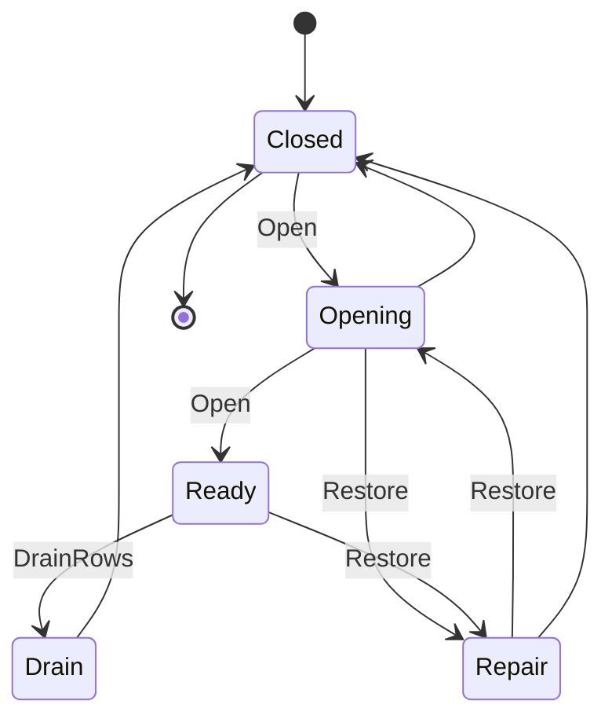

# [PERSISTENCE_STORE_PROFILES]

Rasm.Persistence anchors every durable store on one six-row `StoreProfile` axis: each string-keyed row is the widened record carrying one `[Flags]` `StoreCapability` bitset, the `RetentionPolicy`/`TemporalResolution` policy pair plus the `ConcurrencyToken` boundary key the `Schema/converters#CONVERTER_RAIL` owner resolves, a `PoolPolicy` and `BatchGeometry` provider-geometry pair, the `ReadPosture` tracking default, the ordered `OpenProof` set, and three delegate columns, while `StoreLifecycle` runs the five-row state machine whose open, restore, drain, and health folds mint typed receipts. The page owns exactly the residence law of the durable tier — the engine axis with its capability/policy/geometry columns, the open/restore/drain/health lifecycle, the cross-process lease and locality law, the placement fold over the resolved profile record, and the operator-provisioning manifest — and routes every failure once into the `Query/rail#OPERATION_ALGEBRA` `StoreFault` union, never a bare `Error.New`. No column is a bare `bool` soup: the six capability axes are one `[Flags]` bitset the lane fold reads by mask, the retention default is the `Version/retention#RETENTION_SWEEPS` owner's `RetentionPolicy` row, the concurrency token is the admitted key `Schema/converters` resolves to its own `ConcurrencyToken` smart-enum (one owner, not a duplicate here), and `TemporalResolution` carries the live NodaTime `ZoneLocalMappingResolver` as a delegate column rather than asserting it in prose. The spine is Microsoft.Data.Sqlite, the EF Core providers, Npgsql, DuckDB.NET, Thinktecture vocabulary, LanguageExt rails, and NodaTime instants. Domain currency arrives settled and rides this residence rather than re-spelling here: the federated entity graph (`Query/federation#ENTITY_GRAPH`) keys its `Classification` axis and the BIM classification systems are the `Rasm.Bim/Semantics/classification#CLASSIFICATION_AXIS` bSDD-bound owner; the element-set currency (`Query/federation#ELEMENT_SET_ALGEBRA`) and the `Query/federation#RULE_PLAN` `RuleAggregate`/`QuantityMeasure` own quantity takeoff; the priced 5D estimate is the `Rasm.Bim/Planning/cost#BIM_COST_ESTIMATE` `CostSchedule.Rollup` source the analytical catalog reads by content key, never re-priced in the store tier; the DuckDB analytical lane (`Query/lanes#ANALYTICAL_LANE`) and the ltree hierarchy (`Query/lanes#GEO_LANES`) are the substrate those owners ride.

## [01]-[INDEX]

- [01]-[PROFILE_AXIS]: six widened engine rows — capability bitset, policy pair, provider geometry, delegate columns — and the blob contract record.
- [02]-[STORE_LIFECYCLE]: five states, open and restore folds, drain rows, and health row.
- [03]-[CROSS_PROCESS_LAW]: one lease shape, locality admission, and epoch fencing over the AppHost `FencingToken`.
- [04]-[PLACEMENT_MATRIX]: eight modality arms resolve placement from the resolved profile.
- [05]-[PROVISIONING_ROWS]: operator manifest, verification fold, and maintenance rows.

## [02]-[PROFILE_AXIS]

- Owner: `StoreProfile` — one `[SmartEnum<string>]` engine axis under the `StoreKeyPolicy` ordinal accessor; the row IS the widened record carrying one `[Flags]` `StoreCapability` bitset (the six engine capabilities the lane fold masks), the `RetentionPolicy` retention default and `TemporalResolution` daylight-stance closed smart-enums plus the `ConcurrencyToken` boundary key string, the `PoolPolicy` connection-pool geometry and `BatchGeometry` EF batch-size pair the rail's provider options read, the `ReadPosture` tracking default, the ordered `Seq<OpenProof>` ceremony set, and the connect, configure, and seed delegate columns; `BlobRemote` is the blob contract record fixed now; `StoreRows` carries the delegate targets.
- Cases: sqlite-embedded, sqlite-memory, postgres-server, file-snapshot, duckdb-analytical, blob-remote; the engine sweep stays closed — libSQL, PGlite, LiteDB, RavenDB.Embedded, Realm, hctree, and embedded-pg are rejected rows, EF InMemory is the rejected in-memory provider, and PostgreSQL is never spawned or bundled by a Rasm process.
- Entry: `public partial IO<DbConnection> Connect(StorePlacement placement)` — `IO` carries the provider open effect; rows without a connection surface fail inside the rail.
- Auto: the pg row pins `SetPostgresVersion(18, 0)` so uuidv7 and virtual-generated-column translations activate over the provider's 14.0 default dialect, and its `PoolPolicy` arms `Multiplexing`/`MaxAutoPrepare`/`MaxPoolSize` plus `BatchGeometry.MinBatchSize`/`MaxBatchSize` so the rail's `Configure` output folds the pool and batch geometry the `Query/rail#OPERATION_ALGEBRA` `NpgsqlBatch` fan-out reads off the row; the memory row rides Mode=Memory plus Cache=Shared with a token-gated keeper proof pinning the shared-cache lifetime; the seed delegate enters EF through the UseSeeding and UseAsyncSeeding option hooks at pooled-factory build; `ReadPosture.NoTracking` is the read default the factory options bind so every read arm runs untracked without a per-call-site toggle.
- Packages: Microsoft.EntityFrameworkCore.Sqlite, Microsoft.Data.Sqlite, Npgsql, Npgsql.EntityFrameworkCore.PostgreSQL, Npgsql.EntityFrameworkCore.PostgreSQL.NodaTime, Pgvector.EntityFrameworkCore, Npgsql.EntityFrameworkCore.PostgreSQL.NetTopologySuite, DuckDB.NET.Data.Full, Thinktecture.Runtime.Extensions, LanguageExt.Core, NodaTime, Rasm.AppHost (project)
- Growth: one profile row — key, `StoreCapability` mask, policy pair, geometry pair, three delegate bindings — absorbs a new engine with zero new surface; the sqlite vector gate flips one `StoreCapability.Vector` bit, never a parallel bool; a mapped enum or composite is one `SchemaDdl.Enum` or `SchemaDdl.Composite` row folded by `MapEnums`/`MapComposites` into the pg connect builder; an unmapped-type admission is one `EnableUnmappedTypes` builder column on the pg row and a custom provider classification is one `INpgsqlTypeMapper` mapper column; an attach-only durable lane is one `SqliteOpenMode.ReadOnly` placement value on the embedded row; a new retention default or daylight-transition stance is one `Version/retention#RETENTION_SWEEPS` `RetentionPolicy` or one `TemporalResolution` smart-enum row the generated `Switch` then forces every fold site to handle, and a new concurrency-detection posture is one `Schema/converters#CONVERTER_RAIL` `ConcurrencyToken` row plus its admitted key string here; a richer pool or batch posture is one `PoolPolicy`/`BatchGeometry` value on the row; a cloud object-store provider is one `Store/remote#OBJECT_STORE` row projecting a `BlobRemote` placement with zero Persistence rework.
- Boundary: profile residence is single — placement consumes `ResolvedProfile` and `ProfileRoots.StoreRoot`, and Persistence owns no profile-keyed table and derives no per-user path; `FileSnapshot` implements the `BlobRemote` record over the snapshot catalog protocol and the `blob-remote` row's `BlobRemote` implementation set is the `Store/remote#OBJECT_STORE` provider rows, so the `connect: StoreRows.NoConnection` leg stays correct because object-store residence carries no `DbConnection`; the pg row's `SetPostgresVersion(18, 0)` is the provider feature-gate floor that activates uuidv7/VIRTUAL-generated-column/OLD-NEW-RETURNING translations, distinct from the PG18.4 deploy-image minimum the cluster-config provisioning rows carry; the database is excluded from the AppHost hop law — `EnableRetryOnFailure` on the pg row and busy-retry on the sqlite rows are the only database retry owners, and the sqlite busy budget is the `SqliteConnectionStringBuilder.DefaultTimeout` value this axis sets on the durable row (the provider retries `BUSY`/`LOCKED` until it elapses), never a `busy_timeout` PRAGMA, so the WAL busy-retry knob `Store/engine#PRAGMA_TABLE` routes here resides on the connection string the profile owns; dsn and store-root inputs are host-resolved values handed over by app roots; the data-source `UseNodaTime` and `UseNetTopologySuite` registrations are builder-preserving generic extensions while `UseVector` returns the erased mapper interface, so the vector registration binds by tuple-capture beside the typed builder and never re-types the chain; `EnableUnmappedTypes` opens the pg builder to enum-as-text and range round-trips without a per-type `MapEnum` row, and the `INpgsqlTypeMapper` handle the builder exposes is the one classification seam a custom provider type registers on, never a second mapper surface; a reader replica attaches the same embedded file through `SqliteOpenMode.ReadOnly`, so a read-only consumer never contends for the writer lease; the pg `TemporalResolution` policy column is a closed `[SmartEnum<string>]` carrying its `ZoneLocalMapping`-resolver as a `[UseDelegateFromConstructor]` behavior column — `Strict` maps a local timestamp through `DateTimeZone.AtStrictly` so a skipped or ambiguous local time raises a `SkippedTimeException`/`AmbiguousTimeException` the boundary lifts, `Lenient` and `Local` admit them through `AtLeniently` and `Resolvers.LenientResolver`/`ResolveLocal` over the `ZoneLocalMapping` under one declared rule, and `None` rides the engine rows that persist instants only — so `TemporalResolution.Resolve(local, zone)` is the one resolver call a daylight-transition timestamp routes through, never an ad hoc catch nor a prose-only strategy, and the `MapEnums`/`MapComposites` builder folds register every `SchemaDdl.Enum` and `SchemaDdl.Composite` type so a native pg enum or composite column round-trips without a per-type hand-written reader; the `StoreCapability` bitset is the one capability surface every consumer masks by flag rather than seven parallel bool reads — the `Query/lanes#DATA_LANE` fold routes the lane-bearing bits (`Vector`/`FullText`/`Blob`/`Migrations`), the `Query/rail#BULK_LANE` `MergeWithOutputAsync` OLD/NEW delta reads `ReturningOldNew`, the `Version/recovery#RECOVERY_DRILL` pg-replication arm reads `Replication` (the engine declares it CAN replicate; the WAL archiver owns the bytes), and `StoreLocality` reads `LocalVolume` — so the bit's owner is its consuming tier, never a phantom one-fold-reads-all claim; a connect leg that lacks its required input — an absent dsn on the pg row, an absent store-root on the duckdb row, the `NoConnection` rows with no relational surface — fails inside the rail through the `Query/rail#OPERATION_ALGEBRA` `StoreFault.Unsupported` case rather than a bare `Error.New`, so every page failure is one closed `StoreFault` row the open ceremony folds.

```csharp signature
public sealed class StoreKeyPolicy : IEqualityComparerAccessor<string>, IComparerAccessor<string> {
    public static IEqualityComparer<string> EqualityComparer => StringComparer.Ordinal;

    public static IComparer<string> Comparer => StringComparer.Ordinal;
}

// --- [TYPES] ----------------------------------------------------------------------------

// The six engine capabilities are one bitset, not six parallel bools: the lane fold masks by flag and a
// new capability is a new bit, never a seventh boolean column. `LocalVolume` rides the same bitset so the
// locality guard reads `Capabilities.HasFlag(StoreCapability.LocalVolume)` rather than a sibling bool.
[Flags]
public enum StoreCapability {
    None = 0,
    Migrations = 1 << 0,
    Vector = 1 << 1,
    FullText = 1 << 2,
    Blob = 1 << 3,
    Replication = 1 << 4,
    ReturningOldNew = 1 << 5,
    LocalVolume = 1 << 6,
}

// The retention default and the `BlobRemote.Descriptor.RetentionClass` axis the remote tier round-trips are
// the `Version/retention#RETENTION_SWEEPS`-owned `RetentionPolicy` rows, never a second retention vocabulary.
//
// A daylight-transition local timestamp resolves through the row's `ZoneLocalMappingResolver` carried as a
// behavior column — never a prose-only strategy and never an ad hoc catch. `Strict` rejects a skipped or
// ambiguous local time through `InZoneStrictly` (the boundary lifts the `SkippedTimeException`/
// `AmbiguousTimeException`), `Lenient` shifts forward past a gap and returns the earlier of an ambiguous
// pair through `Resolvers.LenientResolver`, and `None` is the engine rows that persist instants only (the
// lenient resolver is the harmless identity on an unambiguous instant round-trip).
[SmartEnum<string>]
[KeyMemberEqualityComparer<StoreKeyPolicy, string>]
public sealed partial class TemporalResolution {
    public static readonly TemporalResolution None = new("none", static (local, zone) => local.InZone(zone, Resolvers.LenientResolver));
    public static readonly TemporalResolution Strict = new("strict", static (local, zone) => local.InZoneStrictly(zone));
    public static readonly TemporalResolution Lenient = new("lenient", static (local, zone) => local.InZone(zone, Resolvers.LenientResolver));

    [UseDelegateFromConstructor]
    public partial ZonedDateTime Resolve(LocalDateTime local, DateTimeZone zone);
}

// The ordered open-ceremony proof vocabulary the prove delegate folds; the order on each row IS the proof
// sequence, and a new ceremony step is one `OpenProof` row, never a raw string in a `Seq<string>`.
[SmartEnum<string>]
[KeyMemberEqualityComparer<StoreKeyPolicy, string>]
[KeyMemberComparer<StoreKeyPolicy, string>]
public sealed partial class OpenProof {
    public static readonly OpenProof Batteries = new("batteries");
    public static readonly OpenProof Keeper = new("keeper");
    public static readonly OpenProof PragmaLadder = new("pragma-ladder");
    public static readonly OpenProof CompileOptions = new("compile-options");
    public static readonly OpenProof Lease = new("lease");
    public static readonly OpenProof Migrate = new("migrate");
    public static readonly OpenProof Fingerprint = new("fingerprint");
    public static readonly OpenProof QuickCheck = new("quick_check");
    public static readonly OpenProof Extensions = new("extensions");
    public static readonly OpenProof Settings = new("settings");
    public static readonly OpenProof TypeResolution = new("type-resolution");
    public static readonly OpenProof Catalog = new("catalog");
    public static readonly OpenProof Attach = new("attach");
    public static readonly OpenProof Stat = new("stat");
}

// The default change-tracking posture the factory options bind so the rail's read arms run untracked with
// no per-call-site toggle; a write arm attaches its graph explicitly. `Identity` keeps tracking for the
// rare store whose reads feed an in-place update graph.
[SmartEnum<string>]
[KeyMemberEqualityComparer<StoreKeyPolicy, string>]
public sealed partial class ReadPosture {
    public static readonly ReadPosture NoTracking = new("no-tracking");
    public static readonly ReadPosture Identity = new("identity");

    public QueryTrackingBehavior Behavior => this == NoTracking ? QueryTrackingBehavior.NoTracking : QueryTrackingBehavior.TrackAll;
}

// --- [MODELS] ---------------------------------------------------------------------------

// The provider connection-pool geometry the connect builder and the rail's factory options bind:
// `Multiplexing` runs many commands over fewer physical connections (the pg server profile only),
// `MaxAutoPrepare`/`AutoPrepareMinUsages` size the LRU prepared-statement budget, and the pool bounds cap
// physical connections. Off-by-default (`Off`) is the sqlite/file/duckdb posture that carries no pool.
public readonly record struct PoolPolicy(bool Multiplexing, int MaxAutoPrepare, int AutoPrepareMinUsages, int MinPoolSize, int MaxPoolSize) {
    public static readonly PoolPolicy Off = new(Multiplexing: false, MaxAutoPrepare: 0, AutoPrepareMinUsages: 5, MinPoolSize: 0, MaxPoolSize: 0);
    public static readonly PoolPolicy Server = new(Multiplexing: true, MaxAutoPrepare: 256, AutoPrepareMinUsages: 2, MinPoolSize: 2, MaxPoolSize: 64);
}

// The EF batch geometry the `Query/rail#OPERATION_ALGEBRA` `NpgsqlBatch` fan-out reads off the row:
// `MinBatchSize`/`MaxBatchSize` bound the provider's command coalescing. `Single` is the one-statement
// posture for stores without server-side batching (sqlite/duckdb).
public readonly record struct BatchGeometry(int MinBatchSize, int MaxBatchSize) {
    public static readonly BatchGeometry Single = new(MinBatchSize: 1, MaxBatchSize: 1);
    public static readonly BatchGeometry Server = new(MinBatchSize: 4, MaxBatchSize: 1024);
}

[SmartEnum<string>]
[KeyMemberEqualityComparer<StoreKeyPolicy, string>]
[KeyMemberComparer<StoreKeyPolicy, string>]
public sealed partial class StoreProfile {
    public static readonly StoreProfile SqliteEmbedded = new("sqlite-embedded", capabilities: StoreCapability.Migrations | StoreCapability.FullText | StoreCapability.Blob | StoreCapability.LocalVolume, concurrencyToken: "version", retentionDefault: RetentionPolicy.AgeBound, temporal: TemporalResolution.None, pool: PoolPolicy.Off, batch: BatchGeometry.Single, read: ReadPosture.NoTracking, openProofs: [OpenProof.Batteries, OpenProof.PragmaLadder, OpenProof.CompileOptions, OpenProof.Lease, OpenProof.Migrate, OpenProof.Fingerprint, OpenProof.QuickCheck], connect: StoreRows.Sqlite, configure: StoreRows.SqliteOptions, seed: StoreRows.SeedNone);
    public static readonly StoreProfile SqliteMemory = new("sqlite-memory", capabilities: StoreCapability.Migrations | StoreCapability.FullText | StoreCapability.Blob, concurrencyToken: "version", retentionDefault: RetentionPolicy.AgeBound, temporal: TemporalResolution.None, pool: PoolPolicy.Off, batch: BatchGeometry.Single, read: ReadPosture.NoTracking, openProofs: [OpenProof.Batteries, OpenProof.Keeper, OpenProof.PragmaLadder, OpenProof.Migrate, OpenProof.Fingerprint], connect: StoreRows.Sqlite, configure: StoreRows.SqliteOptions, seed: StoreRows.SeedOnCreate);
    public static readonly StoreProfile PostgresServer = new("postgres-server", capabilities: StoreCapability.Migrations | StoreCapability.Vector | StoreCapability.FullText | StoreCapability.Blob | StoreCapability.Replication | StoreCapability.ReturningOldNew, concurrencyToken: "xmin", retentionDefault: RetentionPolicy.AgeBound, temporal: TemporalResolution.Strict, pool: PoolPolicy.Server, batch: BatchGeometry.Server, read: ReadPosture.NoTracking, openProofs: [OpenProof.Extensions, OpenProof.Settings, OpenProof.TypeResolution, OpenProof.Fingerprint], connect: StoreRows.Postgres, configure: StoreRows.PostgresOptions, seed: StoreRows.SeedNone);
    public static readonly StoreProfile FileSnapshot = new("file-snapshot", capabilities: StoreCapability.Blob, concurrencyToken: "none", retentionDefault: RetentionPolicy.CountBound, temporal: TemporalResolution.None, pool: PoolPolicy.Off, batch: BatchGeometry.Single, read: ReadPosture.NoTracking, openProofs: [OpenProof.Catalog], connect: StoreRows.NoConnection, configure: StoreRows.NoOptions, seed: StoreRows.SeedNone);
    public static readonly StoreProfile DuckDbAnalytical = new("duckdb-analytical", capabilities: StoreCapability.LocalVolume, concurrencyToken: "none", retentionDefault: RetentionPolicy.SizeBound, temporal: TemporalResolution.None, pool: PoolPolicy.Off, batch: BatchGeometry.Single, read: ReadPosture.NoTracking, openProofs: [OpenProof.Attach], connect: StoreRows.DuckDb, configure: StoreRows.NoOptions, seed: StoreRows.SeedNone);
    public static readonly StoreProfile BlobRemote = new("blob-remote", capabilities: StoreCapability.Blob, concurrencyToken: "none", retentionDefault: RetentionPolicy.SizeBound, temporal: TemporalResolution.None, pool: PoolPolicy.Off, batch: BatchGeometry.Single, read: ReadPosture.NoTracking, openProofs: [OpenProof.Stat], connect: StoreRows.NoConnection, configure: StoreRows.NoOptions, seed: StoreRows.SeedNone);

    public StoreCapability Capabilities { get; }
    // The concurrency token rides as the boundary key the `Schema/converters#CONVERTER_RAIL` `ConcurrencyToken`
    // `[SmartEnum<string>]` resolves through its generated `Get` at model build — that page owns the token
    // shape (`xmin`/`version`/`none`) and its EF binding, so this row carries the admitted key, not a second type.
    public string ConcurrencyToken { get; }
    public RetentionPolicy RetentionDefault { get; }
    public TemporalResolution Temporal { get; }
    public PoolPolicy Pool { get; }
    public BatchGeometry Batch { get; }
    public ReadPosture Read { get; }
    public Seq<OpenProof> OpenProofs { get; }

    public bool Has(StoreCapability capability) => Capabilities.HasFlag(capability);

    [UseDelegateFromConstructor]
    public partial IO<DbConnection> Connect(StorePlacement placement);

    [UseDelegateFromConstructor]
    public partial DbContextOptionsBuilder Configure(DbContextOptionsBuilder options, StorePlacement placement);

    [UseDelegateFromConstructor]
    public partial Task Seed(DbContext context, bool created, CancellationToken token);
}

// --- [OPERATIONS] -----------------------------------------------------------------------

public static class StoreRows {
    const string StoreFile = "rasm.db";
    const string AnalyticsFile = "analytics.duckdb";
    const string SharedMemory = "rasm-memory";
    const int BusyBudgetSeconds = 30;

    public static IO<DbConnection> Sqlite(StorePlacement placement) =>
        IO.lift(() => (DbConnection)new SqliteConnection(SqliteText(placement)));

    public static IO<DbConnection> Postgres(StorePlacement placement) =>
        placement.Dsn is { IsSome: true, Case: string dsn }
            ? IO.lift(() => Pooled(new NpgsqlDataSourceBuilder(dsn), placement.Durable.Pool).EnableDynamicJson().EnableUnmappedTypes().UseNodaTime().UseNetTopologySuite())
                .Map(static builder => SchemaDdl.MapEnums(SchemaDdl.MapComposites(builder)))
                .Map(static builder => (builder.UseVector(), builder).Item2)
                .Map(static builder => (DbConnection)builder.Build().OpenConnection())
            : IO.fail<DbConnection>(new StoreFault.Unsupported("dsn-absent:postgres-server"));

    public static IO<DbConnection> DuckDb(StorePlacement placement) =>
        placement.StoreRoot is { IsSome: true, Case: string root }
            ? IO.lift(() => (DbConnection)new DuckDBConnection($"Data Source={Path.Join(root, AnalyticsFile)}"))
            : IO.fail<DbConnection>(new StoreFault.Unsupported("store-root-absent:duckdb-analytical"));

    public static IO<DbConnection> NoConnection(StorePlacement placement) =>
        IO.fail<DbConnection>(new StoreFault.Unsupported($"no-connection-surface:{placement.Durable.Key}"));

    public static DbContextOptionsBuilder SqliteOptions(DbContextOptionsBuilder options, StorePlacement placement) =>
        options.UseSqlite(SqliteText(placement)).UseQueryTrackingBehavior(placement.Durable.Read.Behavior);

    public static DbContextOptionsBuilder PostgresOptions(DbContextOptionsBuilder options, StorePlacement placement) =>
        options.UseNpgsql(placement.Dsn.IfNone(string.Empty), npgsql => npgsql
            .SetPostgresVersion(18, 0)
            .UseNodaTime()
            .UseVector()
            .UseNetTopologySuite()
            .MinBatchSize(placement.Durable.Batch.MinBatchSize)
            .MaxBatchSize(placement.Durable.Batch.MaxBatchSize)
            .EnableRetryOnFailure())
            .UseQueryTrackingBehavior(placement.Durable.Read.Behavior);

    public static DbContextOptionsBuilder NoOptions(DbContextOptionsBuilder options, StorePlacement placement) => options;

    public static Task SeedNone(DbContext context, bool created, CancellationToken token) => Task.CompletedTask;

    public static Task SeedOnCreate(DbContext context, bool created, CancellationToken token) =>
        created ? context.SaveChangesAsync(token) : Task.CompletedTask;

    // BOUNDARY ADAPTER — the pool geometry folds onto the data-source connection-string builder once at
    // connect: multiplexing, the auto-prepare LRU budget, and the physical-connection bounds are profile-row
    // values, never call-site knobs. The mutable `NpgsqlConnectionStringBuilder` is the provider-forced seam.
    static NpgsqlDataSourceBuilder Pooled(NpgsqlDataSourceBuilder builder, PoolPolicy pool) {
        var csb = builder.ConnectionStringBuilder;
        (csb.Multiplexing, csb.MaxAutoPrepare, csb.AutoPrepareMinUsages, csb.MinPoolSize, csb.MaxPoolSize) =
            (pool.Multiplexing, pool.MaxAutoPrepare, pool.AutoPrepareMinUsages, pool.MinPoolSize, pool.MaxPoolSize);
        return builder;
    }

    static string SqliteText(StorePlacement placement) =>
        placement.StoreRoot is { IsSome: true, Case: string root }
            ? new SqliteConnectionStringBuilder { DataSource = Path.Join(root, StoreFile), Pooling = true, DefaultTimeout = BusyBudgetSeconds, Mode = placement.ReadOnly ? SqliteOpenMode.ReadOnly : SqliteOpenMode.ReadWriteCreate }.ToString()
            : new SqliteConnectionStringBuilder { DataSource = SharedMemory, Mode = SqliteOpenMode.Memory, Cache = SqliteCacheMode.Shared }.ToString();
}

public sealed record BlobRemote(
    Func<BlobRemote.Descriptor, Stream, IO<BlobRemote.Descriptor>> Put,
    Func<UInt128, IO<Stream>> Get,
    Func<UInt128, IO<Option<BlobRemote.Descriptor>>> Stat,
    Func<UInt128, IO<Unit>> Delete,
    Func<IO<Seq<BlobRemote.Descriptor>>> List) {
    public sealed record Descriptor(
        UInt128 ContentKey,
        long Length,
        DataClassification Classification,
        RetentionPolicy RetentionClass,
        string CodecId,
        string CompressionId,
        Instant Physical,
        ulong Logical);
}
```

## [03]-[STORE_LIFECYCLE]

- Owner: `StoreLifecycle` — five string-keyed rows with the total `Legal` transition law; `StoreOpenReceipt` is the typed open evidence; `StoreCeremony` is the open, restore, drain-registration, and health fold surface over one Atom-backed cell.
- Cases: closed, opening, ready, drain, repair; legal transitions: closed to opening; opening to ready, repair, or closed; ready to drain or repair; drain to closed; repair to opening or closed.
- Entry: `public static IO<StoreOpenReceipt> Open(StoreProfile row, StorePlacement placement, Atom<(StoreLifecycle State, Option<StoreOpenReceipt> Latest)> cell, Func<DbConnection, IO<StoreOpenReceipt>> prove, ClockPolicy clocks)` — `IO` carries the bracketed ceremony; ready is unreachable without a green receipt, and the bracket's `Catch` folds any `Connect`/`prove` provider throw through the `Query/rail#OPERATION_ALGEBRA` `StoreFault.From` projection at this one seam so a failed migration, pragma, fingerprint, or quick_check aborts the open as a closed `StoreFault` row rather than escaping untyped, the connection still disposing on the `Fin` leg.
- Auto: the prove delegate runs the row's open-proof order — token-gated Batteries_V2 init once per process, PRAGMA ladder, writer-lease and first-opener gate, `MigrateAsync` (the migration lock is provider-internal on both providers — lock outcome reads from migration receipts, never from Internal-namespace types), compiled-model fingerprint gate consuming the XxHash3 value as `ulong`, quick_check before ready; `Restore` is the seven typed steps the durability epoch-fence law names — `fenceWriters` quiesces every sharing writer, `materialize` stages a temp copy, `verify` proves the staged payload's `UInt128` content identity (the copy succeeding is never the proof), `check` runs quick_check on the copy itself, `swap` atomically renames while deleting the `-wal`/`-shm` sidecars as the one unit of replacement, `fence` bumps the `StoreLeaseRow.Epoch` so every stale writer handle invalidates, and `Open` reopens with the bumped epoch on the receipt — so a reader detects the fence from the receipt's `Epoch` rather than a silent stale handle.
- Receipt: `StoreOpenReceipt` — profile, provider route, schema fingerprint, migrations applied, pragmas applied, ordered proof facts, integrity result, lock holder, writer-lease `Epoch`, elapsed `Duration`, `Instant`, `CorrelationId`; step facts ride the receipt-sink envelope under the store-open, store-restore, and store-drain kinds; `LockHolderPid` fills from the `StoreLeaseRow` first-opener row because the provider's public migration-lock handle carries no holder identity, and `Epoch` carries the won lease row's fence token so the receipt is the cross-process trust boundary a peer reads to detect a `Restore`-driven `Fence` — the one epoch token that fences the open ritual, the sync cursors, and the artifact headers alike.
- Packages: SQLitePCLRaw.bundle_e_sqlite3, Microsoft.EntityFrameworkCore.Sqlite, Microsoft.Extensions.Diagnostics.HealthChecks, Thinktecture.Runtime.Extensions, LanguageExt.Core, NodaTime, Rasm.AppHost (project)
- Growth: one lifecycle row plus its `Legal` arms, or one proof kind appended to a row's open-proof order; zero new surface.
- Boundary: `StoreCeremony` is the named boundary capsule for the statement carve-out — the CAS transition body carries language-owned statement forms while every other member stays expression-shaped; drain registration is the band-300 row set in checkpoint, optimize, sweep, backup, close order — ranks are the page's frozen order rows inside the AppHost Stores band, and store writes foreclose at the Telemetry band; the health row grades the lifecycle cell plus the latest receipt, with cadence one policy value derived from the health-probe deadline row at composition.

```csharp signature
[SmartEnum<string>]
[KeyMemberEqualityComparer<StoreKeyPolicy, string>]
[KeyMemberComparer<StoreKeyPolicy, string>]
public sealed partial class StoreLifecycle {
    public static readonly StoreLifecycle Closed = new("closed");
    public static readonly StoreLifecycle Opening = new("opening");
    public static readonly StoreLifecycle Ready = new("ready");
    public static readonly StoreLifecycle Drain = new("drain");
    public static readonly StoreLifecycle Repair = new("repair");

    public static bool Legal(StoreLifecycle from, StoreLifecycle to) =>
        from.Switch(
            state: to,
            closed: static target => target == Opening,
            opening: static target => target == Ready || target == Repair || target == Closed,
            ready: static target => target == Drain || target == Repair,
            drain: static target => target == Closed,
            repair: static target => target == Opening || target == Closed);
}

public readonly record struct StoreOpenReceipt(
    StoreProfile Profile,
    string ProviderRoute,
    ulong SchemaFingerprint,
    int MigrationsApplied,
    int PragmasApplied,
    Seq<(OpenProof Kind, string Fact)> Proofs,
    string IntegrityResult,
    Option<int> LockHolderPid,
    FencingToken Epoch,
    Duration Elapsed,
    Instant At,
    CorrelationId Correlation);

// The drain participation order inside the AppHost Stores band: each row carries its band-relative rank
// as a column so the registration is a closed vocabulary, never a string name beside a magic int. Ranks
// are the page's frozen order rows; store writes foreclose at the Telemetry band above.
[SmartEnum<string>]
[KeyMemberEqualityComparer<StoreKeyPolicy, string>]
public sealed partial class DrainStep {
    public static readonly DrainStep Checkpoint = new("store-checkpoint", rank: 310);
    public static readonly DrainStep Optimize = new("store-optimize", rank: 320);
    public static readonly DrainStep Sweep = new("store-sweep", rank: 330);
    public static readonly DrainStep Backup = new("store-backup", rank: 340);
    public static readonly DrainStep Close = new("store-close", rank: 350);

    public int Rank { get; }
}

public static class StoreCeremony {
    // EXEMPTION — the atomic CAS seam: `Atom.SwapMaybe` returns only the post-transition state and discards the
    // admit/reject branch it took, so the legality verdict is captured beside the lock-free swap to recover the
    // rejected leg without a second non-atomic read; the swap stays the one `Legal`-gated transition site.
    public static Fin<StoreLifecycle> Transition(Atom<(StoreLifecycle State, Option<StoreOpenReceipt> Latest)> cell, StoreLifecycle target, Option<StoreOpenReceipt> receipt = default) {
        var admitted = false;
        var settled = cell.SwapMaybe(prior => {
            admitted = StoreLifecycle.Legal(prior.State, target);
            return admitted ? Some((target, receipt.IsSome ? receipt : prior.Latest)) : None;
        });
        return admitted
            ? Fin.Succ(settled.State)
            : Fin.Fail<StoreLifecycle>(new StoreFault.Concurrency($"store-transition-rejected:{settled.State.Key}:{target.Key}"));
    }

    public static IO<StoreOpenReceipt> Open(StoreProfile row, StorePlacement placement, Atom<(StoreLifecycle State, Option<StoreOpenReceipt> Latest)> cell, Func<DbConnection, IO<StoreOpenReceipt>> prove, ClockPolicy clocks) =>
        from mark in IO.lift(clocks.Mark)
        from gate in IO.lift(() => Transition(cell, StoreLifecycle.Opening))
        from proven in row.Connect(placement).Bracket(
            Use: prove,
            Catch: static error => IO.fail<StoreOpenReceipt>(StoreFault.From(error)),
            Fin: static connection => IO.lift(fun(connection.Dispose)))
        let receipt = proven with { Elapsed = clocks.Elapsed(mark), At = clocks.Now }
        from ready in IO.lift(() => Transition(cell, StoreLifecycle.Ready, Some(receipt)))
        select receipt;

    public static IO<StoreOpenReceipt> Restore(StoreProfile row, StorePlacement placement, Atom<(StoreLifecycle State, Option<StoreOpenReceipt> Latest)> cell, Func<IO<Unit>> fenceWriters, Func<IO<string>> materialize, Func<string, IO<UInt128>> verify, Func<string, IO<string>> check, Func<string, IO<Unit>> swap, Func<IO<FencingToken>> fence, Func<DbConnection, IO<StoreOpenReceipt>> prove, ClockPolicy clocks) =>
        from repair in IO.lift(() => Transition(cell, StoreLifecycle.Repair))
        from fenced in fenceWriters()
        from staged in materialize()
        from content in verify(staged)
        from integrity in check(staged)
        from swapped in swap(staged)
        from epoch in fence()
        from reopened in Open(row, placement, cell, prove, clocks)
        select reopened with { Epoch = epoch };

    public static Seq<DrainParticipantPort> DrainRows(Func<DrainStep, CancellationToken, IO<Unit>> flush) =>
        DrainStep.Items.ToSeq().Map(step => new DrainParticipantPort(step.Key, DrainBand.Stores, step.Rank, token => flush(step, token)));

    public static HealthContributorPort Health(Func<(StoreLifecycle State, Option<StoreOpenReceipt> Latest)> read, Duration cadence) =>
        new(
            Package: "Rasm.Persistence",
            Rows: [
                new HealthContributorRow(
                    Name: "store-lifecycle",
                    Probe: _ => ValueTask.FromResult(Graded(read())),
                    FailureStatus: HealthStatus.Degraded,
                    Tags: HealthContributorRow.TagSet(HealthContributorRow.Store),
                    Timeout: DeadlineClass.HealthProbe,
                    Delay: cadence,
                    Period: cadence),
            ]);

    static HealthCheckResult Graded((StoreLifecycle State, Option<StoreOpenReceipt> Latest) cell) =>
        cell.State.Switch(
            state: cell.Latest,
            closed: static _ => HealthCheckResult.Unhealthy("store closed"),
            opening: static _ => HealthCheckResult.Degraded("store opening"),
            ready: static latest => HealthCheckResult.Healthy(latest.Map(static open => open.IntegrityResult).IfNone("ok")),
            drain: static _ => HealthCheckResult.Degraded("store draining"),
            repair: static _ => HealthCheckResult.Unhealthy("store repair"));
}
```



## [04]-[CROSS_PROCESS_LAW]

- Owner: `StoreLeaseRow` — one persisted lease shape with two kind rows; `StoreLocality` — the filesystem-locality admission guard.
- Cases: writer and maintenance lease kinds; the lease table creation is pinned to the first migration so every sharing process reads one coordination surface, and the unique `(store, kind)` constraint makes the `Claim` conflict the first-open arbiter.
- Entry: `public static IO<StorePlacement> Admit(StorePlacement placement)` — `IO` carries the volume probe and aborts a WAL placement on a non-local volume through the `Query/rail#OPERATION_ALGEBRA` `StoreFault.Unsupported` case; the first-open `Claim` conflict aborts through `StoreFault.Concurrency`, the same 7001 case `StoreFault.From` mints from a live `DbUpdateConcurrencyException`.
- Auto: WAL plus busy-retry plus first-opener-migrates govern every shared sqlite file; the first-open race resolves through `Claim` — a candidate writes its `StoreLeaseRow` Writer row inside one `INSERT ... ON CONFLICT(Store, Kind) DO NOTHING` so exactly one process wins the writer row, the loser folds to a reader attach under `SqliteOpenMode.ReadOnly` and reads the winner's applied migrations rather than re-running `MigrateAsync`, and the won row's `Epoch` seeds every writer handle so a later `Fence` invalidates stale handles; maintenance work runs only while the registering process holds the maintenance lease scheduled as the AppHost persistence-maintenance entry; handoff-on-drain releases on the conductor's Stores-band row while crash-reclaim waits the `LeasePolicy.Maintenance` CrashStaleness past the holder's last `Heartbeat` stamp; `Restore` calls `Fence` so the epoch bump invalidates every stale writer handle; cross-process tag invalidation is a consequence — peer processes replay entity-kind tag transitions from the op-log HLC cursor on schedule cadence.
- Packages: LanguageExt.Core, NodaTime, Rasm.AppHost (project), BCL inbox
- Growth: one lease kind row or one remote-home marker row; zero new surface.
- Boundary: `LeasePolicy` is the only lease policy shape — this row is its persisted projection, never a second policy record; the lease-conflict and locality rejections mint the typed `Query/rail#OPERATION_ALGEBRA` `StoreFault` case at this admission boundary (`Concurrency` for the lost `Claim`, `Unsupported` for the non-local volume), so a bare `Error.New` is the deleted form and a downstream rail re-wraps nothing; the `Epoch` column IS the `AppHost/Runtime/time#FENCING_TOKEN` `FencingToken` `[ValueObject<ulong>]` monotone single-writer token, not a bare `ulong` re-counter beside it — `Fence` mints `Epoch.Next()` under the won row and a reopened handle re-checks every fenced write through `Epoch.Admits` (the Kleppmann reject-lower), so this embedded single-file writer epoch and the fleet-wide `Sync/coordination#LEASE_LINK` seat (which carries the same `FencingToken` for a fleet role across nodes) read one monotone identity and stay two distinct altitudes — this row arbitrates one WAL file's writer, that cell a fleet role — never collapsed and never a second fence counter; the raw key renders to `ulong` only at the `ClaimSql` seam and the `Wire/outbound` discovery-manifest `StoreEpoch` `long` field the writer lease row sources, the implicit owner-to-key egress shapes.md sanctions, never an interior `ulong`; `ClaimSql` is the one declared identifier seam for the `store_lease` table and its `(store, kind, holder_pid, stamp, epoch)` columns — the first migration pins those identifiers and `ClaimSql` is the single place the program restates them, so every other lease read derives from `StoreLeaseRow` members and never from a second copy of the literal. Exemption: `ClaimSql` is the SYMBOLIC_REFERENCE carve-out for the atomic first-open arbiter — the `INSERT ... ON CONFLICT(store, kind) DO NOTHING RETURNING` race cannot route through the EF set-based write path because the conflict arbitration must execute as one provider statement before any `DbContext` exists, so the literal is owned by, and only consumed inside, the native-sqlite open-ceremony bracket seam that runs `Claim` on the raw `SqliteCommand`; the `store_lease` table that pins the same identifiers is the first migration's `EnsureCreated` artifact, making this the sole write path and not a second DML owner.

```csharp signature
// `Epoch` is the `AppHost/Runtime/time#FENCING_TOKEN` `FencingToken` `[ValueObject<ulong>]` itself, not a
// bare `ulong` re-counter — `Fence` mints `Epoch.Next()` and `Admits` is the Kleppmann reject-lower the
// reopened writer handle re-checks, so this single-file writer epoch and the fleet-wide
// `Sync/coordination#LEASE_LINK` seat read one monotone identity. The `(ulong)` egress renders only at the
// `ClaimSql` seam and the discovery-manifest `StoreEpoch` field — the raw key never travels interior.
public sealed record StoreLeaseRow(string Store, string Kind, int HolderPid, Instant Stamp, FencingToken Epoch) {
    public const string Writer = "writer";
    public const string Maintenance = "maintenance";

    public const string ClaimSql = "INSERT INTO store_lease (store, kind, holder_pid, stamp, epoch) VALUES ($store, $kind, $pid, $stamp, 0) ON CONFLICT (store, kind) DO NOTHING RETURNING holder_pid";

    public bool Reclaimable(LeasePolicy policy, Instant now) => now - Stamp > policy.CrashStaleness;

    public bool Fences(FencingToken incoming) => Epoch.Admits(incoming);

    public StoreLeaseRow Heartbeat(Instant now) => this with { Stamp = now };

    public StoreLeaseRow Handoff(int successor, Instant now) => this with { HolderPid = successor, Stamp = now };

    public StoreLeaseRow Fence(Instant now) => this with { Stamp = now, Epoch = Epoch.Next() };

    public static Fin<StoreLeaseRow> Claim(StoreLeaseRow candidate, Option<int> winnerPid) =>
        winnerPid is { IsSome: true, Case: int pid } && pid == candidate.HolderPid
            ? Fin.Succ(candidate)
            : Fin.Fail<StoreLeaseRow>(new StoreFault.Concurrency($"writer-lease-held:{candidate.Store}"));
}

public static class StoreLocality {
    static readonly SearchValues<string> RemoteHomeMarkers = SearchValues.Create(["Library/Mobile Documents", "Library/CloudStorage"], StringComparison.Ordinal);

    public static IO<StorePlacement> Admit(StorePlacement placement) =>
        IO.lift(() => placement.Durable.Has(StoreCapability.LocalVolume) && placement.StoreRoot is { IsSome: true, Case: string root }
            ? root.AsSpan().ContainsAny(RemoteHomeMarkers) || new DriveInfo(Path.GetPathRoot(root) ?? root).DriveType == DriveType.Network
                ? Fin.Fail<StorePlacement>(new StoreFault.Unsupported($"non-local-volume:{root}"))
                : Fin.Succ(placement)
            : Fin.Succ(placement));
}
```

## [05]-[PLACEMENT_MATRIX]

- Owner: `StorePlacement` — the eight-modality placement record and its total fold over the resolved profile record.
- Cases: rhino-plugin owns the one shared embedded session every in-process consumer binds; gh2-plugin delegates to it with zero second open and zero second migrator; standalone `Integrating` attaches to the host's `SharedStoreRoot` (the path the running Rhino owns, NOT this process's own `Roots.StoreRoot`) under the writer lease with direct WAL writes while only document mutations cross the hop; companion owns its OWN scoped embedded store at its own per-process `Roots.StoreRoot` — a separate process with its own writer and migrator, distinct from the rhino-plugin shared session and never the host's file (cross-process shared-cache identity is unreachable, so a scoped store is the modality, not a shared in-memory cell); sidecar pairs a memory scratch with remote-only durable; headless and web run PostgresServer with migration bundles applied at deploy; test-host runs sqlite-memory with seeding and fake clocks.
- Entry: `public static StorePlacement Resolve(ResolvedProfile host, Option<string> dsn = default)` — pure projection; the matrix is data consumed by the boot fold with zero per-modality code paths beyond these arms.
- Packages: Thinktecture.Runtime.Extensions, LanguageExt.Core, Rasm.AppHost (project)
- Growth: one arm row on the placement fold per new host modality; zero new surface.
- Boundary: the fold reads `ResolvedProfile.Attachment` and `ProfileRoots.StoreRoot` and never computes a path; the `Integrating` arm reads the attachment's own `SharedStoreRoot` so an integrating standalone process binds the host's store file rather than minting a second per-user store beside it; the dsn is a host-resolved configuration value handed over by app roots; locality admission gates the resolved placement before any open.

```csharp signature
public sealed record StorePlacement(
    StoreProfile Durable,
    Option<StoreProfile> Scratch,
    Option<string> StoreRoot,
    Option<string> Dsn,
    bool DelegatesToHost,
    bool WriterLeased,
    bool MigrateOnOpen,
    bool ReadOnly = false) {
    public static StorePlacement Resolve(ResolvedProfile host, Option<string> dsn = default) =>
        host.Profile.Switch(
            state: (Roots: host.Roots, Attachment: host.Attachment, Dsn: dsn),
            rhinoPlugin: static s => Embedded(s.Roots.StoreRoot),
            gh2Plugin: static s => Embedded(s.Roots.StoreRoot) with { DelegatesToHost = true, MigrateOnOpen = false },
            standaloneDesktop: static s => s.Attachment is { IsSome: true, Case: RuntimeAttachment.Integrating { SharedStoreRoot: var shared } }
                ? Embedded(Some(shared)) with { WriterLeased = true }
                : Embedded(s.Roots.StoreRoot),
            companionProcess: static s => Embedded(s.Roots.StoreRoot),
            sidecar: static s => Server(s.Dsn) with { Scratch = Some(StoreProfile.SqliteMemory) },
            headlessService: static s => Server(s.Dsn),
            webService: static s => Server(s.Dsn),
            testHost: static s => new StorePlacement(StoreProfile.SqliteMemory, None, None, None, DelegatesToHost: false, WriterLeased: false, MigrateOnOpen: true));

    static StorePlacement Embedded(Option<string> root) =>
        new(StoreProfile.SqliteEmbedded, None, root, None, DelegatesToHost: false, WriterLeased: false, MigrateOnOpen: true);

    static StorePlacement Server(Option<string> dsn) =>
        new(StoreProfile.PostgresServer, None, None, dsn, DelegatesToHost: false, WriterLeased: false, MigrateOnOpen: false);
}
```

## [06]-[PROVISIONING_ROWS]

- Owner: `ExtensionRequirement` — the operator-provisioning manifest rows, the pure provisioning-verification fold, and the type-resolution verification fold.
- Cases: eleven operator rows with preload columns — pg_stat_statements, auto_explain, timescaledb, timescaledb_toolkit, pg_partman, pgvectorscale, pg_search, pg_squeeze, hypopg, pgaudit, btree_gist; `btree_gist` is the mandatory no-preload self-provisioned row backing the WITHOUT OVERLAPS temporal primary-key GiST exclusion (SqlState 23P01 → `schema-rail` `TemporalOverlap`), `CREATE EXTENSION`'d in the first migration before any temporal-key table; pg_cron, pgmq, pg_repack, pg_stat_monitor, pg_uuidv7, and pg_duckdb are rejected rows because the schedule port owns cadence, native pgoutput owns the changefeed, pg_squeeze owns in-DB online reorg, pg_stat_statements plus the OTLP rollup own query observability, PG18-native uuidv7 owns key minting, and in-process DuckDB plus TimescaleDB continuous aggregates own analytical reads; self-provisioned DDL extensions are model annotations and stay out of this manifest.
- Entry: `public static Fin<FrozenSet<string>> Verify(Seq<ExtensionRequirement> required, FrozenSet<string> installed, string preloaded)` — `Fin` aborts through the `Query/rail#OPERATION_ALGEBRA` `StoreFault.ServerNotProvisioned` case (the same 7004 code `StoreFault.From` mints from a live `PostgresErrorCodes.UndefinedObject`), so a verify-time gap and a use-time `UndefinedObject` are one fault row; `public static Fin<Unit> VerifyTypes(Seq<SchemaDdl.Enum> enums, Seq<SchemaDdl.Composite> composites, FrozenSet<string> resolved)` aborts the same way when a declared native enum or composite type is absent from the live source's resolved `PostgresType` set.
- Auto: the pg open ceremony reads the pg_extension and pg_settings probes and folds the manifest — the runtime verifies provisioning and never executes it, with runtime `ALTER SYSTEM` the rejected form; a missing preload folds to degradation through the health row; the `type-resolution` open-proof reads the live source's resolved `PostgresEnumType` and `PostgresCompositeType` names and folds `VerifyTypes` so a declared `SchemaDdl.Enum`/`SchemaDdl.Composite` whose `MapEnum`/`MapComposite` registration never resolved on the server aborts the open rather than failing per-row at first use; probe results land in the open receipt's proof rows.
- Packages: Npgsql, LanguageExt.Core, BCL inbox
- Growth: one manifest row per new server extension; deploy-time postgresql.conf fragments, pg_hba fragments, and role grants land as physical assets at the first headless or web app root — one asset row, zero new surface.
- Boundary: pg maintenance rides the single AppHost persistence-maintenance schedule entry under the maintenance lease — ANALYZE and REINDEX dispatch from the scheduled work fold, autovacuum posture is a read-only pg_settings verification, and the family stays symmetric with the sqlite maintain rows; pg_squeeze owns online table reorg as a pure in-DB bgworker registered through `INSERT INTO squeeze.tables` and scheduled via `squeeze.tables.schedule` rather than an external client binary, so a scheduled REINDEX-style reclaim never spawns an out-of-DB process; the preload-gated companions (timescaledb, pg_search, pg_squeeze, pg_partman, pgaudit, pg_stat_statements, auto_explain) verify through the `PreloadProbe` against each row's `PreloadName` — `pg_partman` preloads as its `pg_partman_bgw` worker while installing as `pg_partman`, so the membership test reads the worker token the `Store/provisioning#CLUSTER_CONFIG` contract carries — while the installed-checked companions (timescaledb_toolkit, hypopg, pgvectorscale, btree_gist) verify through the `InstalledProbe` because `pgvectorscale` loads through its index access method at `CREATE EXTENSION` and never `shared_preload_libraries`; `btree_gist` self-provisions through its first-migration `CREATE EXTENSION` and verifies installed before a WITHOUT OVERLAPS table migrates, and a missing preload folds to degradation through the health row; the io GUC and data-checksums provisioning fragments live on `Store/provisioning#CLUSTER_CONFIG` as deploy-time assets — this manifest verifies, never executes, with runtime `ALTER SYSTEM` the rejected form; the resolved-type name set the open ceremony hands `VerifyTypes` comes from the live source's `NpgsqlDataSource` database-info `PostgresType` projection, never from a second type catalogue.

```csharp signature
// The three extension traits are one bitset, not three parallel bools: `Preload` demands a
// `shared_preload_libraries` membership, `SelfProvisioned` skips the installed check (the first migration
// `CREATE EXTENSION`s it), `DevGated` exempts the row outside a debug build. `Verify` reads by mask.
[Flags]
public enum ExtensionTrait {
    None = 0,
    Preload = 1 << 0,
    SelfProvisioned = 1 << 1,
    DevGated = 1 << 2,
}

// `PreloadName` is the `shared_preload_libraries` membership token, distinct from the `CREATE EXTENSION`
// `Name` where the bgworker library name diverges (`pg_partman` installs as the extension but preloads its
// `pg_partman_bgw` worker; the rest match): the `Preload` arm of `Verify` tests `PreloadName` against the
// preloaded set while the installed arm tests `Name`, so a correctly-provisioned cluster carrying
// `pg_partman_bgw` in `shared_preload_libraries` (the `Store/provisioning#CLUSTER_CONFIG` contract) verifies
// rather than faulting on an extension-name miss. The default folds `Name` so a matching token needs no column.
public sealed record ExtensionRequirement(string Name, ExtensionTrait Traits, string? Preloaded = null) {
    public const string InstalledProbe = "SELECT extname FROM pg_extension";
    public const string PreloadProbe = "SELECT setting FROM pg_settings WHERE name = 'shared_preload_libraries'";

    public string PreloadName => Preloaded ?? Name;

    // `pgvectorscale` loads through its `diskann`/`vectorscale` index access method at `CREATE EXTENSION`
    // time, never `shared_preload_libraries` — so it is an installed-checked row, not a preload row, exactly
    // as the `Store/provisioning#CLUSTER_CONFIG` contract holds it absent from the preload set. `auto_explain`
    // and the bgworker companions DO require preload because they hook session start or allocate startup memory.
    public static readonly Seq<ExtensionRequirement> OperatorProvisioned = [
        new("pg_stat_statements", ExtensionTrait.Preload),
        new("auto_explain", ExtensionTrait.Preload),
        new("timescaledb", ExtensionTrait.Preload),
        new("timescaledb_toolkit", ExtensionTrait.None),
        new("pg_partman", ExtensionTrait.Preload, Preloaded: "pg_partman_bgw"),
        new("pgvectorscale", ExtensionTrait.None),
        new("pg_search", ExtensionTrait.Preload),
        new("pg_squeeze", ExtensionTrait.Preload),
        new("hypopg", ExtensionTrait.DevGated),
        new("pgaudit", ExtensionTrait.Preload),
        new("btree_gist", ExtensionTrait.SelfProvisioned),
    ];

    public bool Has(ExtensionTrait trait) => Traits.HasFlag(trait);

    public static Fin<FrozenSet<string>> Verify(Seq<ExtensionRequirement> required, FrozenSet<string> installed, string preloaded) =>
        required.Filter(row => !row.Has(ExtensionTrait.DevGated) && (row.Has(ExtensionTrait.Preload)
            ? !preloaded.Contains(row.PreloadName, StringComparison.Ordinal)
            : !row.Has(ExtensionTrait.SelfProvisioned) && !installed.Contains(row.Name))) is { IsEmpty: false } missing
            ? Fin.Fail<FrozenSet<string>>(new StoreFault.ServerNotProvisioned($"server-not-provisioned:{string.Join(',', missing.Map(static row => row.Name))}"))
            : Fin.Succ(installed);

    public static Fin<Unit> VerifyTypes(Seq<SchemaDdl.Enum> enums, Seq<SchemaDdl.Composite> composites, FrozenSet<string> resolved) =>
        (enums.Map(static row => row.Name) + composites.Map(static row => row.Name))
            .Filter(name => !resolved.Contains(name)) is { IsEmpty: false } unresolved
            ? Fin.Fail<Unit>(new StoreFault.ServerNotProvisioned($"type-not-resolved:{string.Join(',', unresolved)}"))
            : Fin.Succ(unit);
}
```

| [INDEX] | [ROW]              | [WORK]                      | [CADENCE]                               | [LEASE]     |
| :-----: | :----------------- | :-------------------------- | :-------------------------------------- | :---------- |
|  [01]   | pg-analyze         | ANALYZE                     | persistence-maintenance cron occurrence | maintenance |
|  [02]   | pg-reindex         | REINDEX CONCURRENTLY        | persistence-maintenance cron occurrence | maintenance |
|  [03]   | autovacuum-posture | pg_settings autovacuum read | open ceremony                           | none        |

## [07]-[RESEARCH]

- [FIRST_OPEN_RACE]: RESOLVED (proof) — the `Claim` conflict elects the writer deterministically and the loser's reader attach observes the winner's `MigrateAsync` commit boundary atomically. Proved by a two-process console harness over `Microsoft.Data.Sqlite` 10.0.9 / e_sqlite3 3.50.4 racing first-open + lease-INSERT + a 60ms-widened migration commit on one WAL file (2/4/6-process, 110 races, zero failures): exactly one winner per race, all processes agree on the deterministic winner pid, losers read the full committed schema + 64-row seed with no torn/partial read and no post-commit empty-schema window, `quick_check` `ok` everywhere. The `ON CONFLICT DO NOTHING RETURNING` no-op yields a `null` scalar (a value, not a throw) folded to the `writer-lease-held` `StoreFault.Concurrency`; `SQLITE_BUSY` (code 5) is the only diagnosable retry fault and never triggered under the `SqliteConnectionStringBuilder.DefaultTimeout` busy budget the provider's BUSY/LOCKED retry loop owns. WAL per-reader snapshot isolation makes the migration transaction all-or-nothing to any concurrent reader.
- [TYPE_RESOLUTION_ACCESSOR]: the `NpgsqlDataSource` database-info accessor that projects the live source's resolved `PostgresType`, `PostgresEnumType`, and `PostgresCompositeType` names into the `FrozenSet<string>` the `type-resolution` open-proof hands `VerifyTypes` — whether the projection reads from a connection database-info property or a data-source mapper enumeration, resolved before the proof row reads a live source.
- [LEASE_CADENCE]: the writer-lease `Heartbeat` renewal interval for a paired single-writer store — the `Duration` between successive `StoreLeaseRow.Heartbeat` stamps that keeps `Reclaimable` false for the healthy holder while bounding a crashed holder's reclaim latency under `LeasePolicy.Maintenance.CrashStaleness`, resolved against the paired-topology drain cadence before the cadence literal lands on the lease row.
