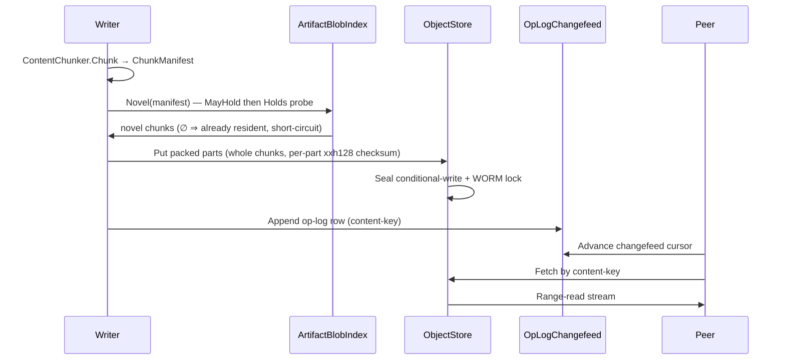

# [PERSISTENCE_REMOTE_STORES]

Rasm.Persistence anchors cloud object-store residence on one `ObjectStore` provider axis behind the settled `BlobRemote` contract. Three string-keyed rows (`s3`, `azure-blob`, `gcs`) each carry the transfer geometry (`PartSize` part floor, `ChunkPolicy` content-defined window), the integrity stance (`ChecksumAlgorithm.XXHASH128` server-verified against the same `XxHash128` digest that IS the content key), the write-once `ConditionalWrite` precondition, the `StorageTier` cold-storage column, and the `ObjectEncryption` SSE policy `Store/encryption#KEY_ENVELOPE` `EnvelopeScope.ObjectSse` binds — and project one `BlobRemote` placement whose Put/Get/Stat/Delete/List ride the provider SDK. `ObjectClient` is the resolved-SDK `[Union]` the app root hands over, and its `Map` IS the per-leg dispatch, so no row delegate re-discriminates the union and no `<object-client-mismatch>` arm exists by construction. `MultipartTransfer` partitions the source over the `Version/snapshots#CONTENT_CHUNKING` `ContentChunker` content-defined chunk boundaries, packs whole chunks into provider-floor-clearing parts, and uploads only the chunks the `Query/cache#ARTIFACT_BLOB_INDEX` `ArtifactIndexRow.Novel` membership probe proves novel — so a re-store of an artifact sharing chunks with a prior peer transfers only the changed bytes and a `ObjectTransferFact` per window narrates split/dedup/part/resume live; `ObjectResidence` round-trips the content-key descriptor with provider-native conditional-write concurrency and the realized retention-lock state; `ArtifactSyncFeed` threads the content-address object key plus the managed durable op-log so a blob written once is fetched by any peer. `RemoteStoreFault` is the closed `[Union]` lifting every SDK boundary exception into the typed rail at exactly one edge. The page spine is `AWSSDK.S3`, `Azure.Storage.Blobs`, `Google.Cloud.Storage.V1`, `CommunityToolkit.HighPerformance`, `System.IO.Hashing`, `Thinktecture.Runtime.Extensions`, `LanguageExt.Core`, and `NodaTime`.

Wire posture: this page is host-local — every owner runs server-side against the provider SDK and crosses no browser or peer wire, so it carries no `TS_PROJECTION` cluster. The artifact-sync feed's only cross-process face is the content-address object key plus the existing `Sync/collaboration#OPLOG_CHANGEFEED` op-log row, whose wire shape is owned at `Sync/collaboration#TS_PROJECTION`; `ObjectTransferFact` reaches any dashboard solely as a `StoreFact`/`ReceiptSinkPort` envelope whose `ReceiptEnvelopeWire`/`TenantContextWire` projection is owned at `AppHost/runtime-ports#TS_PROJECTION`, never re-spelled here.

## [01]-[INDEX]

- [01]-[OBJECT_STORE]: three provider rows projecting `BlobRemote` placements; the `ObjectClient` fold; tier/encryption/checksum policy columns; the closed fault rail.
- [02]-[MULTIPART_TRANSFER]: content-defined-chunk upload fold packing whole `ContentChunker` chunks into provider parts, content-addressed novelty skip against the artifact-blob index, server-verified per-part checksums, and a live transfer-fact stream.
- [03]-[OBJECT_RESIDENCE]: content-key descriptor round-trip; conditional-write concurrency; retention-lock and encryption metadata.
- [04]-[ARTIFACT_SYNC_FEED]: content-address object key plus durable op-log; transfer-fact stream under the receipt-sink envelope.

## [02]-[OBJECT_STORE]

- Owner: `ObjectStore` — one `[SmartEnum<string>]` provider axis under the `StoreKeyPolicy` ordinal accessor; each row is the widened record carrying the `PartSize` provider part floor and the `Chunking` `ChunkPolicy` content-defined-window column (the `Version/snapshots#CONTENT_CHUNKING` axis whose `Artifact` row sizes the rolling-hash cut), the `Integrity` checksum stance, the `ConditionalWrite` write-once flag, the `StorageTier` cold-storage column, and the `ObjectEncryption` SSE policy, and builds the row's `BlobRemote` placement from the resolved `ObjectClient`. `ObjectClient` is the resolved-SDK `[Union]` whose `Map` owns per-leg dispatch; `StorageTier`, `ObjectChecksum`, and `ObjectEncryption` are the closed write-policy vocabularies; `RemoteStoreFault` is the closed boundary fault family.
- Cases: `s3`, `azure-blob`, `gcs`; the provider sweep stays closed — a fourth provider is one row, and PostgreSQL/SQLite/DuckDB never appear because object-store is the durable home behind `BlobRemote`, never a relational engine row.
- Entry: `public BlobRemote Placement(ObjectClient client, ChunkMembership index)` — projects the provider's `BlobRemote` record from the resolved SDK client; `Put` drains the source once, partitions it through `ContentChunker.Chunk(Chunking, body)` into a `ChunkManifest`, and rides the placement so every operation composes the one settled `BlobRemote.Put/Get/Stat/Delete/List` contract, never a per-provider surface. `public IO<ObjectResidence> Put(ObjectClient, ObjectResidence, ChunkManifest, ChunkMembership, ReadOnlyMemory<byte>, Func<ObjectTransferFact, IO<Unit>>)`, `public IO<Stream> Fetch(ObjectClient, UInt128, Option<ByteWindow>)`, and `public IO<Option<ObjectResidence>> Head(ObjectClient, UInt128)` are the three transfer legs the placement composes, each one `ObjectClient.Map` arm — one entrypoint per modality, the input value's shape (the union case) selecting the SDK path. `ChunkMembership` is the `Query/cache#ARTIFACT_BLOB_INDEX` `(MayHold, Holds)` probe pair the placement consumes so the upload skips index-resident chunks, never a Persistence-side index re-implementation.
- Auto: the upload partitions the source into content-defined chunks through `ContentChunker.Chunk` and packs whole chunks into provider parts of at least `PartSize` — an insertion shifting every fixed boundary leaves the content-defined cut stable past the edit, so the `ContentChunker.Novel` probe (cheap 64-bit `ShortTag` `MayHold` ahead of the authoritative 128-bit `Holds`) folds the manifest against the artifact-blob index, and an EMPTY novel projection proves the whole content-keyed object already resident — the upload short-circuits to a `Dedup` fact plus a `Head`-confirm, transferring zero bytes — while a non-empty projection (a changed artifact under a new content key) uploads the packed parts in full; the `s3` row uploads the packed parts over `AmazonS3Client` low-level multipart, the `azure-blob` row over `BlockBlobClient` staged blocks, the `gcs` row over `StorageClient` resumable chunks; each row's `Fetch` issues a single range-read or a resumed range sequence, `Head` reads object metadata into the descriptor, `Delete` removes by content-key object name, `List` enumerates the content-key namespace through the provider's paged enumerator; the `ConditionalWrite` column flips on for write-once content-address semantics so a re-put of an existing content-key seals to a `412`/`RemoteStoreFault.Conflict` that `ObjectStore.Put`'s one `@catch` arm resolves to a benign no-op — it `Head`s the already-durable object and returns its residence as success rather than re-failing, since the content is identical by hash and the seal IS the concurrency primitive. The `Integrity` column threads `ChecksumAlgorithm.XXHASH128` (S3) / `UploadValidationMode` (GCS) / `ContentHash` (Azure) so the provider verifies each part and the sealed object against the same 128-bit digest the content key already is — the store never computes a second integrity value. The `Tier` column projects `S3StorageClass`/`AccessTier`/GCS storage class so a cold artifact lands on infrequent-access storage by row policy, and the `Encryption` column projects the SSE stance `Store/encryption#KEY_ENVELOPE` binds.
- Receipt: `ObjectTransferFact` rides the `StoreFact`/`ReceiptSinkPort` envelope under the `ObjectFactKind` `store.object.*` family — one fact per uploaded part with bytes and elapsed, one fact per content-addressed novel-skip (the index-resident chunk run never re-uploaded), one fact per resumed (in-session committed) part, one fact per abort, one fact per content-key fetch-by-key hit; `ObjectTransferFact.Project()` lands each on the `StoreFact(Kind, Subject, Count, Elapsed, At)` stream the interceptor spine drains.
- Packages: `AWSSDK.S3`, `Azure.Storage.Blobs`, `Google.Cloud.Storage.V1`, `CommunityToolkit.HighPerformance`, `System.IO.Hashing`, `Thinktecture.Runtime.Extensions`, `LanguageExt.Core`, `NodaTime`
- Growth: one `ObjectStore` row — key, part floor, `ChunkPolicy`, integrity, conditional-write, tier, encryption — absorbs a new provider with zero new surface; a new storage class is one `StorageTier` row, a new SSE stance one `ObjectEncryption` case, a new checksum posture one `ObjectChecksum` row, a tighter content-defined window one `ChunkPolicy` row at `#CONTENT_CHUNKING`, a new boundary failure cause one `RemoteStoreFault` case the `Lift` switch routes; every addition the generated `Switch` then forces every dispatch site to handle; zero new surface.
- Boundary: `ObjectStore` rows are the `BlobRemote` implementation set the `Store/profiles#PROFILE_AXIS` `blob-remote` row resolves to. `ObjectClient` is the resolved-SDK union the app root hands over — credential acquisition, endpoint override, and region are host-resolved connection inputs, never Persistence fence members, and the SSE *key-id* and CSEK *key bytes* arrive on the `ObjectEncryption` policy from `Store/encryption#KEY_ENVELOPE`, this owner spelling only the provider member set. Per-leg dispatch is `ObjectClient.Map` — a per-provider upload service class, a row delegate that re-discriminates the union, and a `client is ObjectClient.S3 ? … : fail("<mismatch>")` guard are all the deleted forms because the union case IS the dispatch and a mismatch is unrepresentable. The content-key object name derives from the `BlobRemote.Descriptor.ContentKey` `XxHash128` identity the `Schema/identity#IDENTITY_LADDER` `content-hash` row mints, so the object store never mints a second identity; every SDK exception lifts once into `RemoteStoreFault` at this edge — a per-call catch is the deleted form, and the lift NEVER collapses back to a bare `Error.New(fault.Message)` because the rail carries the typed case end-to-end. `RemoteStoreFault` is the dual-tier fault family every suite fault holds — each case implements `IValidationError<TCase>` with its own `Create`, so `Validation<RemoteStoreFault, T>` accumulates a distinct identity per leg across an independent batch put rather than collapsing every fault to one key — and `Transport.IsTransient` is the sole `Schedule`-retry gate so a throttle/`5xx`/timeout re-drives under `Backoff` while a `Conflict`/`NotFound`/`Locked`/`IntegrityBreach`/`Denied`/`Oversize` is deterministic and never retried; recovery selects a case by `Is`/`IsType<E>` against the typed identity, never a `==` on the message.

```csharp signature
[SmartEnum<string>]
[KeyMemberEqualityComparer<StoreKeyPolicy, string>]
[KeyMemberComparer<StoreKeyPolicy, string>]
public sealed partial class ObjectStore {
    public static readonly ObjectStore S3 = new("s3", partSize: 8L * 1024 * 1024, chunking: ChunkPolicy.Artifact, conditionalWrite: true, integrity: ObjectChecksum.XxHash128, tier: StorageTier.Standard, encryption: ObjectEncryption.ProviderManaged);
    public static readonly ObjectStore AzureBlob = new("azure-blob", partSize: 8L * 1024 * 1024, chunking: ChunkPolicy.Artifact, conditionalWrite: true, integrity: ObjectChecksum.Crc64, tier: StorageTier.Standard, encryption: ObjectEncryption.ProviderManaged);
    public static readonly ObjectStore Gcs = new("gcs", partSize: 8L * 1024 * 1024, chunking: ChunkPolicy.Artifact, conditionalWrite: true, integrity: ObjectChecksum.XxHash128, tier: StorageTier.Standard, encryption: ObjectEncryption.ProviderManaged);

    public long PartSize { get; }
    // The content-defined-window owner (`Version/snapshots#CONTENT_CHUNKING`) — the FastCDC min/avg/max axis the
    // upload cuts on, NOT a fixed byte width. The part packer accumulates whole chunks until it clears `PartSize`,
    // so a part spans complete content-defined chunks and the blob-index dedup skip aligns to chunk boundaries.
    public ChunkPolicy Chunking { get; }
    public bool ConditionalWrite { get; }
    public ObjectChecksum Integrity { get; }
    public StorageTier Tier { get; }
    public ObjectEncryption Encryption { get; }

    // Two content-address dedup gates fold into one `Put`. (1) WHOLE-MANIFEST: `ContentChunker.Novel` projects the
    // chunks the artifact-blob index lacks; an EMPTY projection proves every byte already resident under this content
    // key, so the upload short-circuits — it emits one `Dedup` fact per resident chunk and `Head`-confirms the
    // present residence rather than re-transferring a single byte (the content key IS the object name, so an
    // all-resident artifact already exists). (2) WRITE-ONCE RACE: when novel chunks DO exist the multipart runs, and
    // a conditional-write `412` on any provider means a concurrent writer sealed the identical-by-hash object first,
    // so `@catch` resolves the racing `Conflict` by `Head`-ing the present object and returning its residence rather
    // than re-failing. A `Head` miss after a `Conflict` is the genuine fault that surfaces. The lifted
    // `RemoteStoreFault.Conflict` is what the predicate sees, because every `ObjectClient.Map` arm runs its
    // boundary-exception lift before this `@catch` — the `is` test is on the typed case, never a raw SDK throw.
    public IO<ObjectResidence> Put(ObjectClient client, ObjectResidence residence, ChunkManifest manifest, ChunkMembership index, ReadOnlyMemory<byte> source, Func<ObjectTransferFact, IO<Unit>> sink) =>
        ContentChunker.Novel(manifest, index.MayHold, index.Holds) is { IsEmpty: true } && manifest.Chunks.IsEmpty is false
            ? Resident(client, residence, manifest, sink)
            : (client.Map(
                s3: row => ObjectIo.S3Multipart(row, this, residence, manifest, source, sink),
                azure: row => ObjectIo.AzureBlocks(row, this, residence, manifest, source, sink),
                gcs: row => ObjectIo.GcsResumable(row, this, residence, manifest, source, sink))
            | @catch<IO, ObjectResidence>(
                static error => error is RemoteStoreFault.Conflict,
                _ => Head(client, residence.Descriptor.ContentKey)
                        .Bind(present => present.Match(
                            Some: existing => IO.pure(existing with { Parts = 0, ResumedParts = 0, SkippedChunks = manifest.Chunks.Count }),
                            None: () => IO.fail<ObjectResidence>(new RemoteStoreFault.NotFound(residence.Descriptor.ContentKey)))))).As();

    // The whole-manifest dedup leg: every chunk resident, so the object is already durable — narrate one `Dedup`
    // fact whose `Count` is the deduplicated chunk total and `Bytes` the bytes the index spared the wire, then
    // confirm the present residence by `Head`, never re-uploading. A `Head` miss means the index is stale (the
    // catalog row outlived the object), which surfaces as the genuine `NotFound` rather than a silent success over
    // an absent object.
    IO<ObjectResidence> Resident(ObjectClient client, ObjectResidence residence, ChunkManifest manifest, Func<ObjectTransferFact, IO<Unit>> sink) =>
        from _ in sink(ObjectTransferFact.Of(ObjectFactKind.Dedup, Key, residence.Descriptor.ContentKey, manifest.Length, manifest.Chunks.Count))
        from present in Head(client, residence.Descriptor.ContentKey)
        from confirmed in present.Match(
            Some: existing => IO.pure(existing with { Parts = 0, ResumedParts = 0, SkippedChunks = manifest.Chunks.Count }),
            None: () => IO.fail<ObjectResidence>(new RemoteStoreFault.NotFound(residence.Descriptor.ContentKey)))
        select confirmed;

    public IO<Stream> Fetch(ObjectClient client, UInt128 contentKey, Option<ByteWindow> range) =>
        client.Map(
            s3: row => ObjectIo.S3Fetch(row, contentKey, range),
            azure: row => ObjectIo.AzureFetch(row, contentKey, range),
            gcs: row => ObjectIo.GcsFetch(row, contentKey, range));

    public IO<Option<ObjectResidence>> Head(ObjectClient client, UInt128 contentKey) =>
        client.Map(
            s3: row => ObjectIo.S3Head(row, contentKey),
            azure: row => ObjectIo.AzureHead(row, contentKey),
            gcs: row => ObjectIo.GcsHead(row, contentKey));

    // `Put` drains the source ONCE into one contiguous buffer, cuts it through the row's `ChunkPolicy`, and rides
    // the manifest + the index membership probe so the upload skips index-resident chunks — the chunker is one-shot
    // over an in-memory `byte[]` (`#CONTENT_CHUNKING`), so the drain is the single materialization the multipart
    // legs slice their windows off without a second copy.
    public BlobRemote Placement(ObjectClient client, ChunkMembership index) =>
        new(
            Put: (descriptor, stream) =>
                from source in IO.lift(() => ObjectIo.Drain(stream))
                let manifest = ContentChunker.Chunk(Chunking, source)
                from residence in Put(client, ObjectResidence.From(descriptor, this), manifest, index, source, static _ => IO.pure(unit))
                select residence.Descriptor,
            Get: contentKey => Fetch(client, contentKey, None),
            Stat: contentKey => Head(client, contentKey).Map(static option => option.Map(static residence => residence.Descriptor)),
            Delete: contentKey => client.Map(
                s3: row => ObjectIo.S3Delete(row, contentKey),
                azure: row => ObjectIo.AzureDelete(row, contentKey),
                gcs: row => ObjectIo.GcsDelete(row, contentKey)),
            List: () => client.Map(
                s3: ObjectIo.S3List,
                azure: ObjectIo.AzureList,
                gcs: ObjectIo.GcsList));
}

// The artifact-blob-index membership probe pair the placement consumes — `Query/cache#ARTIFACT_BLOB_INDEX`
// `ArtifactIndexRow.MayHold`/`Holds` over the chunk `ShortTag`/`ContentHash` columns, threaded as delegates so the
// upload tests chunk residency without a Persistence-side index re-implementation. `Put` feeds the pair straight
// into `ContentChunker.Novel`, which owns the cheap-tag-before-authoritative-key pre-filter ordering, so this
// carrier never re-derives the probe. `None` (empty index) admits every chunk novel — the first-store path.
public readonly record struct ChunkMembership(Func<ulong, bool> MayHold, Func<UInt128, bool> Holds) {
    public static readonly ChunkMembership None = new(static _ => false, static _ => false);
}

// A range-read window over the content-keyed object — the partial-fetch resumption span. The transfer-geometry
// units are derived facts, not free literals: the S3 part floor is the 5 MB minimum each packed part clears, the
// GCS resumable chunk is a 262144-byte multiple (`UploadObjectOptions.MinimumChunkSize`), and the upload window
// boundaries are the `Version/snapshots#CONTENT_CHUNKING` content-defined cuts, never a fixed slice.
public readonly record struct ByteWindow(long Start, long End) {
    public long Length => End - Start + 1;
}

// One closed integrity vocabulary — the provider's server-side checksum verb keyed to the same digest the
// content key IS, so a corrupt transfer is rejected by the provider against the canonical `XxHash128` identity
// rather than re-hashed locally. `XxHash128` projects the 16-byte digest as the S3/GCS native xxh128 checksum
// (`ChecksumAlgorithm.XXHASH128` / `UploadValidationMode`); `Crc64` is the Azure block-integrity stance because
// Azure exposes no xxh128 header; `None` opts a row out of server verification.
[SmartEnum<string>]
[KeyMemberEqualityComparer<StoreKeyPolicy, string>]
[KeyMemberComparer<StoreKeyPolicy, string>]
public sealed partial class ObjectChecksum {
    public static readonly ObjectChecksum XxHash128 = new("xxh128");
    public static readonly ObjectChecksum Crc64 = new("crc64");
    public static readonly ObjectChecksum None = new("none");

    // The 16-byte big-endian `XxHash128` content-key digest IS the S3/GCS xxh128 wire checksum (Base64 of the raw
    // canonical digest), so the content key the store already minted doubles as the provider integrity header — one
    // hash. The byte order matches `System.IO.Hashing.XxHash128`'s `WriteBigEndian128`, so the server-side verify
    // accepts it; see `ObjectResidence.Digest`.
    public Option<string> Wire(UInt128 contentKey) =>
        this == XxHash128 ? Some(Convert.ToBase64String(ObjectResidence.Digest(contentKey))) : None;
}

// One closed cold-storage vocabulary projecting each provider's storage-class/access-tier member; a cold
// artifact lands on infrequent-access by row policy. The realized tier round-trips as `ObjectResidence.Tier`.
[SmartEnum<string>]
[KeyMemberEqualityComparer<StoreKeyPolicy, string>]
[KeyMemberComparer<StoreKeyPolicy, string>]
public sealed partial class StorageTier {
    public static readonly StorageTier Standard = new("standard", s3: S3StorageClass.Standard, azure: AccessTier.Hot, gcs: "STANDARD");
    public static readonly StorageTier Infrequent = new("infrequent", s3: S3StorageClass.StandardInfrequentAccess, azure: AccessTier.Cool, gcs: "NEARLINE");
    public static readonly StorageTier Cold = new("cold", s3: S3StorageClass.GlacierInstantRetrieval, azure: AccessTier.Cold, gcs: "COLDLINE");
    public static readonly StorageTier Archive = new("archive", s3: S3StorageClass.DeepArchive, azure: AccessTier.Archive, gcs: "ARCHIVE");

    [UseDelegateFromConstructor]
    public partial S3StorageClass S3 { get; }

    [UseDelegateFromConstructor]
    public partial AccessTier Azure { get; }

    [UseDelegateFromConstructor]
    public partial string Gcs { get; }
}

// The SSE write policy `Store/encryption#KEY_ENVELOPE` `EnvelopeScope.ObjectSse` binds — this owner spells the
// provider member set, the key-id (`ManagedKey`) and CSEK key bytes (`CustomerKey`) arrive from the envelope.
// `ProviderManaged` is the account-default SSE every provider applies with no key reference; `ManagedKey` is
// SSE-KMS (S3 `aws:kms` + key id + `EncryptionContext` AAD, Azure named `EncryptionScope`, GCS `KmsKeyName`);
// `CustomerKey` is SSE-C / CSEK (S3 `ServerSideEncryptionCustomerMethod`, Azure `CustomerProvidedKey`, GCS
// `EncryptionKey`) where the store holds the key bytes and the provider stores none.
[Union]
public abstract partial record ObjectEncryption {
    public sealed record ProviderManaged : ObjectEncryption;
    public sealed record ManagedKey(string KeyId, FrozenDictionary<string, string> Aad) : ObjectEncryption;
    public sealed record CustomerKey(ReadOnlyMemory<byte> Key, string KeyMd5) : ObjectEncryption;
}

[Union]
public abstract partial record ObjectClient {
    public sealed record S3(IAmazonS3 Client, string Bucket) : ObjectClient;
    public sealed record Azure(BlobContainerClient Container) : ObjectClient;
    public sealed record Gcs(StorageClient Client, string Bucket) : ObjectClient;
}

// The closed object-store boundary fault family in the 5400 band — every case carries the per-case
// `IValidationError<TCase>`/`Create` dual-tier contract every suite fault holds (`StoreFault`/`PipelineFault`/
// `SyncFault`/`RetentionFault`) so `Validation<RemoteStoreFault, T>` accumulates a distinct identity per cause
// across an independent batch put rather than collapsing every leg to one key, and recovery selects a case by
// `Is`/`IsType<E>` against the typed identity, never a `==` on the message. `Transport` is the sole transient
// arm — `IsTransient` is the `Schedule`-retry predicate gate, so a `429`/`5xx`/throttle re-drives under `Backoff`
// while `Conflict`/`NotFound`/`Locked`/`IntegrityBreach`/`Denied`/`Oversize` are deterministic and never retried.
[Union]
public abstract partial record RemoteStoreFault : Expected, IValidationError<RemoteStoreFault> {
    private RemoteStoreFault(string detail, int code) : base(detail, code, None) { }
    public static RemoteStoreFault Create(string message) => new Transport("none", 0, message);

    public abstract bool IsTransient { get; }

    public sealed record NotFound(UInt128 ContentKey) : RemoteStoreFault($"object {ContentKey:x32} absent", 5401), IValidationError<NotFound> {
        public override bool IsTransient => false;
        public static new NotFound Create(string detail) => new(UInt128.Zero);
    }

    public sealed record Conflict(UInt128 ContentKey, string Condition) : RemoteStoreFault($"object {ContentKey:x32} conditional-write {Condition}", 5402), IValidationError<Conflict> {
        public override bool IsTransient => false;
        public static new Conflict Create(string detail) => new(UInt128.Zero, detail);
    }

    public sealed record Aborted(UInt128 ContentKey, int Parts, string Reason) : RemoteStoreFault($"object {ContentKey:x32} aborted after {Parts} parts: {Reason}", 5403), IValidationError<Aborted> {
        public override bool IsTransient => false;
        public static new Aborted Create(string detail) => new(UInt128.Zero, 0, detail);
    }

    public sealed record Transport(string Provider, int Status, string Code) : RemoteStoreFault($"{Provider} transport {Status}:{Code}", 5404), IValidationError<Transport> {
        public override bool IsTransient => Status is 0 or 429 or >= 500 || Code is "RequestTimeout" or "SlowDown" or "InternalError" or "ServiceUnavailable";
        public static new Transport Create(string detail) => new("none", 0, detail);
    }

    public sealed record IntegrityBreach(UInt128 ContentKey, string Provider) : RemoteStoreFault($"object {ContentKey:x32} {Provider} checksum mismatch", 5405), IValidationError<IntegrityBreach> {
        public override bool IsTransient => false;
        public static new IntegrityBreach Create(string detail) => new(UInt128.Zero, detail);
    }

    public sealed record Locked(UInt128 ContentKey, string Mode, Instant Until) : RemoteStoreFault($"object {ContentKey:x32} WORM {Mode} until {Until}", 5406), IValidationError<Locked> {
        public override bool IsTransient => false;
        public static new Locked Create(string detail) => new(UInt128.Zero, detail, Instant.MaxValue);
    }

    // The authorization fault — a `403` that is NOT object-lock: a missing/expired credential, an IAM policy denial,
    // a bucket-policy block. Deterministic and distinct from `Transport` so operator recovery re-checks custody
    // (the `Store/encryption#KEY_ENVELOPE` lease, the host-resolved connection input) rather than re-driving under
    // `Backoff`. A KMS-decrypt denial on an SSE-KMS read surfaces here too, naming the key.
    public sealed record Denied(UInt128 ContentKey, string Provider, string Code) : RemoteStoreFault($"object {ContentKey:x32} {Provider} access denied: {Code}", 5407), IValidationError<Denied> {
        public override bool IsTransient => false;
        public static new Denied Create(string detail) => new(UInt128.Zero, "none", detail);
    }

    // The payload-bound fault — the part/object exceeds a provider hard limit (`EntityTooLarge`, a part below the
    // 5 MB floor on a non-final part, an over-10000-part multipart) or a quota is exhausted. Deterministic: a re-drive
    // re-hits the same limit, so it falls through unretried and surfaces the breached bound to the caller.
    public sealed record Oversize(UInt128 ContentKey, string Provider, string Code) : RemoteStoreFault($"object {ContentKey:x32} {Provider} payload rejected: {Code}", 5408), IValidationError<Oversize> {
        public override bool IsTransient => false;
        public static new Oversize Create(string detail) => new(UInt128.Zero, "none", detail);
    }

    public static RemoteStoreFault Lift(string provider, UInt128 contentKey, Exception boundary) =>
        boundary switch {
            AmazonS3Exception s3 when (int)s3.StatusCode == 404 => new NotFound(contentKey),
            AmazonS3Exception s3 when (int)s3.StatusCode == 412 => new Conflict(contentKey, s3.ErrorCode),
            AmazonS3Exception s3 when (int)s3.StatusCode == 400 && s3.ErrorCode is "BadDigest" or "InvalidDigest" or "XAmzContentChecksumMismatch" => new IntegrityBreach(contentKey, provider),
            AmazonS3Exception s3 when s3.ErrorCode is "EntityTooLarge" or "EntityTooSmall" or "InvalidPart" or "MaxMessageLengthExceeded" => new Oversize(contentKey, provider, s3.ErrorCode),
            AmazonS3Exception s3 when (int)s3.StatusCode == 403 && s3.ErrorCode == "AccessDenied" && s3.Message.Contains("ObjectLock", StringComparison.Ordinal) => new Locked(contentKey, "compliance", Instant.MaxValue),
            AmazonS3Exception s3 when (int)s3.StatusCode is 401 or 403 => new Denied(contentKey, provider, s3.ErrorCode),
            AmazonS3Exception s3 => new Transport(provider, (int)s3.StatusCode, s3.ErrorCode),
            RequestFailedException az when az.Status == 404 => new NotFound(contentKey),
            RequestFailedException az when az.Status == 412 => new Conflict(contentKey, az.ErrorCode ?? "ConditionNotMet"),
            RequestFailedException az when az.ErrorCode is "Md5Mismatch" or "Crc64Mismatch" => new IntegrityBreach(contentKey, provider),
            RequestFailedException az when az.ErrorCode is "RequestBodyTooLarge" or "BlockCountExceedsLimit" or "InvalidBlockList" => new Oversize(contentKey, provider, az.ErrorCode),
            RequestFailedException az when az.ErrorCode == "BlobImmutableDueToPolicy" => new Locked(contentKey, "immutable", Instant.MaxValue),
            RequestFailedException az when az.Status is 401 or 403 => new Denied(contentKey, provider, az.ErrorCode ?? "AuthorizationFailure"),
            RequestFailedException az => new Transport(provider, az.Status, az.ErrorCode ?? ""),
            GoogleApiException gcs when (int)gcs.HttpStatusCode == 404 => new NotFound(contentKey),
            GoogleApiException gcs when (int)gcs.HttpStatusCode == 412 => new Conflict(contentKey, gcs.Error?.Message ?? "GenerationMismatch"),
            GoogleApiException gcs when (int)gcs.HttpStatusCode is 401 or 403 => new Denied(contentKey, provider, gcs.Error?.Message ?? "forbidden"),
            GoogleApiException gcs when (int)gcs.HttpStatusCode == 413 => new Oversize(contentKey, provider, gcs.Error?.Message ?? "payloadTooLarge"),
            GoogleApiException gcs => new Transport(provider, (int)gcs.HttpStatusCode, gcs.Error?.Message ?? ""),
            _ => new Transport(provider, 0, boundary.Message),
        };
}
```

## [03]-[MULTIPART_TRANSFER]

- Owner: `MultipartTransfer` — the content-defined-chunk upload fold packing whole `ContentChunker` chunks into provider parts; the upload ceremony is woven directly into each `ObjectClient.Map` arm in `ObjectIo`, one `TransferReceipt` per completed object, one live `ObjectTransferFact` per part/skip.
- Cases: `s3` low-level `InitiateMultipartUpload`/`UploadPart`/`CompleteMultipartUpload` with per-part `ChecksumAlgorithm.XXHASH128`; `azure` staged-block `StageBlock`/`CommitBlockList` carrying the per-block `BlockBlobStageBlockOptions` and the commit-time `BlobImmutabilityPolicy`/`AccessTier`; `gcs` `UploadObject` with `UploadObjectOptions.ChunkSize` resumable plus `KmsKeyName`/`UploadValidationMode`.
- Entry: `public static IO<TransferReceipt> Upload(ObjectStore provider, ObjectClient client, ObjectResidence residence, ChunkManifest manifest, ChunkMembership index, ReadOnlyMemory<byte> source, Func<ObjectTransferFact, IO<Unit>> sink, ClockPolicy clocks)` — `IO` runs `provider.Put`, which first folds the manifest against the index through `ContentChunker.Novel`: zero novel chunks short-circuits to the dedup leg (one `Dedup` fact, a `Head`-confirm, zero bytes moved), otherwise the `ObjectClient.Map` arm carries the `.Bracket`-owned part-by-part multipart ceremony over the `Parts` packing and emits one fact per uploaded part through the threaded `sink`, then reads the realized `ObjectResidence.Parts`/`ResumedParts`/`SkippedChunks` transfer counts into the receipt. The `Fin` leg runs `AbortMultipartUploadAsync` on every exit (a benign `NoSuchUpload` on the success path the release swallows), so an interrupted upload leaves no orphaned parts and lifts the cause through `RemoteStoreFault.Aborted`; transient `Transport` interruptions on the idempotent legs re-drive under the `Backoff` `Schedule` (`.RetryWhile(Backoff, IsRetryable)`), the S3 session tail lifting without session-level retry because a re-`Initiate` would orphan the committed parts the caller's re-`Put` resumes from.
- Auto: `Parts` accumulates the manifest's content-defined chunks into part windows, each closing once it clears the row `PartSize` floor (so a part spans whole `#CONTENT_CHUNKING` chunks, never a sub-chunk slice that would tear a chunk across a part boundary), the smallest legal part count resulting; the content-address dedup is the WHOLE-MANIFEST decision the placement makes before the ceremony, because a provider stores whole objects under one content-key name and cannot assemble an object from another object's parts without a source-object locator the blob index does not expose — an all-resident manifest is already durable under its key (the short-circuit), and a manifest with any novel chunk is a changed artifact under a new content key that uploads in full. The `s3` arm runs `InitiateMultipartUploadAsync` (carrying `ChecksumAlgorithm.XXHASH128`, the row `StorageClass`, the SSE member set, and the `ObjectLockMode`/`ObjectLockRetainUntilDate` the descriptor's `RetentionClass` resolves) then `UploadPartAsync` per part — each carrying its own `ChecksumXXHASH128` so the provider verifies the part against the canonical digest — collecting the returned `PartETag` set and sealing with `CompleteMultipartUploadAsync` under `IfNoneMatch:*`; the `azure` arm stages one part-numbered block id per part through `StageBlockAsync` and seals with `CommitBlockListAsync` carrying `Metadata`/`ImmutabilityPolicy`/`LegalHold`/`AccessTier` and `IfNoneMatch:ETag.All`; the `gcs` arm uploads through `UploadObjectAsync` with `ChunkSize` resumable, `IfGenerationMatch:0`, `KmsKeyName`, and `UploadValidationMode`. A resumed transfer reads the prior committed set (`ListPartsAsync` for S3, `GetBlockListAsync(BlockListTypes.Uncommitted)` for Azure) and skips parts whose `ETag`/block-id is already committed in the SAME interrupted session, emitting a resumed fact per skip — orthogonal to the whole-manifest index dedup, the one resumes a torn upload and the other skips an already-resident object, both rolling onto the receipt.
- Receipt: `TransferReceipt` — provider, content-key, total bytes, part count, resumed-part count, index-deduplicated-chunk count, abort flag, elapsed `Duration`, `Instant`, `CorrelationId`; each uploaded part emits one `ObjectTransferFact` under `ObjectFactKind.Part`, each in-session resumed part `ObjectFactKind.Resumed`, a whole-manifest index-resident skip one `ObjectFactKind.Dedup`, an abort `ObjectFactKind.Abort`.
- Packages: `AWSSDK.S3`, `Azure.Storage.Blobs`, `Google.Cloud.Storage.V1`, `CommunityToolkit.HighPerformance`, `System.IO.Hashing`, `LanguageExt.Core`, `NodaTime`
- Growth: one part-floor policy value per provider row, or one `ChunkPolicy` row at `#CONTENT_CHUNKING` for a tighter content-defined window; the content-defined dedup window IS the `Version/snapshots#CONTENT_CHUNKING` chunk fold the part packer spans whole chunks of, never a second chunker here; zero new surface.
- Boundary: the content-defined chunk boundary, the per-chunk `XxHash128` content key, and the whole-artifact `XxHash128` identity are owned at `Version/snapshots#CONTENT_CHUNKING` and consumed here as the `ChunkManifest` the placement chunked — a re-declared frame width, a second chunker, or a second hash is the deleted form, and the server-side checksum is the SAME `XxHash128` digest projected as the provider header, never a third integrity value. The chunk-residency probe is the `Query/cache#ARTIFACT_BLOB_INDEX` `(MayHold, Holds)` membership the placement threads as `ChunkMembership` — a Persistence-side blob-index re-implementation is the deleted form because the index owns the catalog and this owner only reads its membership. The part floor clears the S3 5 MB minimum so each is a row value never a free literal. A per-provider abort catch is the deleted form because the bracket release folds every interruption through `AbortMultipartUploadAsync` (S3) or leaves uncommitted blocks/resumable sessions to provider GC (Azure/GCS) and lifts the cause into `RemoteStoreFault.Aborted`. The `ConditionalWrite` column gates the seal — S3 `IfNoneMatch:*`, Azure `IfNoneMatch:ETag.All` on commit, GCS `IfGenerationMatch:0` — so a concurrent writer racing the same content-key resolves to `RemoteStoreFault.Conflict`, not a silent overwrite; a `412` is the benign no-op the write-once placement treats as success because the content is already durably present, identical by hash.

```csharp signature
public sealed record TransferReceipt(
    string Provider,
    UInt128 ContentKey,
    long Bytes,
    int Parts,
    int ResumedParts,
    int SkippedChunks,
    bool Aborted,
    Duration Elapsed,
    Instant At,
    CorrelationId Correlation);

// One packed part window: its 1-indexed `Number`, the source byte span the part covers (whole content-defined
// chunks, so the span is chunk-aligned), and the count of chunks it spans. A part is the object-store transfer
// unit — a provider stores whole objects under one content-key name and cannot assemble an object from another
// object's parts without a source-object locator the artifact-blob index does not expose — so the content-address
// dedup is a WHOLE-MANIFEST decision (a manifest with zero novel chunks is already resident under its key; the
// upload short-circuits), and the part packer's job is only the provider-floor-clearing window partition.
public readonly record struct TransferPart(int Number, long Offset, int Length, int Chunks);

public static class MultipartTransfer {
    public static IO<TransferReceipt> Upload(ObjectStore provider, ObjectClient client, ObjectResidence residence, ChunkManifest manifest, ChunkMembership index, ReadOnlyMemory<byte> source, Func<ObjectTransferFact, IO<Unit>> sink, ClockPolicy clocks) =>
        from mark in IO.lift(clocks.Mark)
        from sealed_ in provider.Put(client, residence, manifest, index, source, sink)
        select new TransferReceipt(provider.Key, sealed_.Descriptor.ContentKey, sealed_.Descriptor.Length, sealed_.Parts, sealed_.ResumedParts, sealed_.SkippedChunks, Aborted: false, clocks.Elapsed(mark), clocks.Now, sealed_.Correlation);

    // Part packing: fold the manifest's content-defined chunks left-to-right, growing the open `PartCursor` until it
    // clears `partFloor`, then sealing it onto `Done` and opening the next at the cleared offset — so every part
    // spans whole chunks and the smallest legal part count results. The final partial cursor seals last. One
    // projection all three providers fold — no per-provider partition, no fixed-size arithmetic slice that would
    // tear a chunk across a part boundary and break the dedup alignment.
    public static Seq<TransferPart> Parts(ChunkManifest manifest, long partFloor) =>
        manifest.Chunks
            .Fold(
                (Done: Seq<TransferPart>(), Open: PartCursor.Empty),
                (acc, chunk) => acc.Open.Grow(chunk.Length).Pack(partFloor, acc.Done))
            is var (done, open) && open.Count > 0
                ? done.Add(open.Seal(done.Count + 1))
                : done;
}

// The fold accumulator's open part: the byte span it has grown to and the chunk count. `Grow` folds one chunk in;
// `Pack` either seals the cursor onto `done` and opens the next (cleared the floor) or carries it open — so the
// `Parts` fold stays a pure cursor advance with no mutable part buffer.
file readonly record struct PartCursor(long Start, long Bytes, int Count) {
    public static readonly PartCursor Empty = new(0L, 0L, 0);

    public PartCursor Grow(long bytes) => this with { Bytes = Bytes + bytes, Count = Count + 1 };

    public (Seq<TransferPart> Done, PartCursor Open) Pack(long floor, Seq<TransferPart> done) =>
        Bytes >= floor ? (done.Add(Seal(done.Count + 1)), new PartCursor(Start + Bytes, 0L, 0)) : (done, this);

    public TransferPart Seal(int number) => new(number, Start, (int)Bytes, Count);
}
```

```csharp signature
// Per-leg dispatch is `ObjectClient.Map` in `ObjectStore` — `ObjectIo` carries ONLY the typed-row bodies, so
// no method re-discriminates the union and a client/row mismatch is unrepresentable. Each upload arm threads the
// `sink` so the transfer-fact stream is REAL (one fact per uploaded/skipped part), and the realized
// `Parts`/`ResumedParts`/`SkippedChunks` are what the loop actually performed, never a fabricated count.
public static class ObjectIo {
    // The single materialization the upload performs: the `#CONTENT_CHUNKING` `FastCdc` chunker is one-shot over an
    // in-memory `byte[]`, so the source contents-address and chunk-cut both key off ONE drained buffer the part
    // legs slice their windows off without a second copy. `IBufferWriterExtensions.AsStream` and the returned
    // `WrittenMemory` are `CommunityToolkit.HighPerformance` members. A source above the 4-GiB `uint`-offset chunk
    // window is partitioned upstream before it reaches the placement (`#CONTENT_CHUNKING` boundary).
    public static ReadOnlyMemory<byte> Drain(Stream stream) {
        var buffer = new ArrayBufferWriter<byte>();
        stream.CopyTo(buffer.AsStream());
        return buffer.WrittenMemory;
    }

    // The one transient-retry schedule every transport leg composes — a cloud transfer is the canonical transient
    // surface (`resilience` [DOMAIN_INTERNAL_RETRY]: domain-internal retry is `Schedule` policy on the effect rail,
    // never a hop pipeline beside the call). Each idempotent leg is `.RetryWhile(Backoff, IsRetryable)` so a
    // `Transport` throttle/`5xx` re-drives under decorrelated backoff while a deterministic `Conflict`/`NotFound`/`Locked`/
    // `IntegrityBreach`/`Denied`/`Oversize` falls through unretried — a re-driven multipart resumes from its committed
    // -part set so the retry never re-uploads a sealed part.
    static readonly Schedule Backoff =
        (Schedule.recurs(times: 5)
       | Schedule.exponential(seed: 100 * ms)
       | Schedule.maxDelay(max: 5 * seconds)
       | Schedule.decorrelate(factor: 0.25, seed: 7)
       | Schedule.maxCumulativeDelay(max: 60 * seconds))
       & Schedule.spaced(space: 100 * ms);

    static bool IsRetryable(Error error) => error is RemoteStoreFault { IsTransient: true };

    // The one typed-fault bridge every leg routes through — an SDK boundary throw lifts EXACTLY once into the
    // closed `RemoteStoreFault` rail via `Error.ToException()`, so a `404`/`412`/`BadDigest`/object-lock surfaces
    // as the typed case and the interior never sees a raw `AmazonS3Exception`/`RequestFailedException`/
    // `GoogleApiException`. A per-call catch or a bare `Error.New(...Message)` is the deleted form; the lift runs
    // BEFORE the retry so the schedule predicate reads the typed `IsTransient` rather than a raw exception type.
    // `LiftOnly` is fault-lift WITHOUT retry — the S3 multipart session tail uses it because a session-level retry
    // would re-`Initiate` a fresh `UploadId` and abort the partly-committed parts, defeating resume; the caller's
    // re-`Put` resumes the session from the committed set instead. `Lift` (lift + `Backoff` transient retry) wraps
    // the idempotent single-shot legs — `Fetch`/`Head`/`Delete`/`List` and the GCS/Azure whole-object uploads that
    // resume server-side — where a transient `Transport` re-drive is safe and never re-initiates partial state.
    static IO<T> LiftOnly<T>(this IO<T> io, string provider, UInt128 contentKey) =>
        io.MapFail(error => error is RemoteStoreFault ? error : RemoteStoreFault.Lift(provider, contentKey, error.ToException()));

    static IO<T> Lift<T>(this IO<T> io, string provider, UInt128 contentKey) =>
        io.LiftOnly(provider, contentKey).RetryWhile(Backoff, IsRetryable);

    static IO<T> Guard<T>(string provider, UInt128 contentKey, Func<Task<T>> act) =>
        IO.liftAsync(act).Lift(provider, contentKey);

    // The multipart ceremony is a real `bracketIO` resource scope: `Acq` initiates (or resumes) and yields the
    // `uploadId`, `Use` uploads-and-seals part by part over the `Parts` packing, `Catch` lifts an in-flight throw to
    // the typed `RemoteStoreFault.Aborted` carrying the part count, and `Fin` runs `AbortMultipartUploadAsync` under
    // the non-cancellable release token (the bracket release contract) — so an interrupted upload leaves no orphaned
    // parts billing storage. Only a `Transport` interruption converts to `Aborted`; a deterministic
    // `Conflict`/`Locked`/`IntegrityBreach` from the seal passes through as its own case, never masked as an abort.
    // Abort-in-`Fin` runs on every exit by the bracket contract, and that is correct here: aborting an
    // already-completed multipart upload is a benign `NoSuchUpload` the release ignores (`IgnoreAbortRace`), so the
    // success path's already-sealed object is never destroyed. A re-drive resumes from the in-session committed set
    // (`S3CommittedParts`), so abort-on-failure and resume-on-retry are the two halves of one write-once contract.
    public static IO<ObjectResidence> S3Multipart(ObjectClient.S3 row, ObjectStore store, ObjectResidence residence, ChunkManifest manifest, ReadOnlyMemory<byte> source, Func<ObjectTransferFact, IO<Unit>> sink) {
        var name = ObjectResidence.Name(residence.Descriptor.ContentKey);
        var contentKey = residence.Descriptor.ContentKey;
        var parts = MultipartTransfer.Parts(manifest, store.PartSize);
        return IO.liftAsync(async () => residence.UploadId.IsSome
                ? (string)residence.UploadId
                : (await row.Client.InitiateMultipartUploadAsync(S3InitiateRequest(row, store, residence, name))).UploadId)
            .Bracket(
                Use: uploadId => IO.liftAsync(async () => {
                    var prior = await S3CommittedParts(row, name, Some(uploadId));
                    var tags = new List<PartETag>(prior.Values);
                    var resumed = 0;
                    foreach (var part in parts)
                        if (prior.ContainsKey(part.Number)) {
                            resumed++;
                            await sink(ObjectTransferFact.Of(ObjectFactKind.Resumed, store.Key, contentKey, part.Length, part.Number));
                        } else {
                            using var body = source.Slice((int)part.Offset, part.Length).AsStream();
                            var done = await row.Client.UploadPartAsync(S3PartRequest(row, store, name, uploadId, part, body));
                            tags.Add(new PartETag(part.Number, done.ETag));
                            await sink(ObjectTransferFact.Of(ObjectFactKind.Part, store.Key, contentKey, part.Length, part.Number));
                        }
                    await row.Client.CompleteMultipartUploadAsync(new CompleteMultipartUploadRequest {
                        BucketName = row.Bucket, Key = name, UploadId = uploadId, PartETags = [.. tags.OrderBy(static tag => tag.PartNumber)],
                        IfNoneMatch = store.ConditionalWrite ? "*" : null,
                        ChecksumType = store.Integrity == ObjectChecksum.XxHash128 ? ChecksumType.FULL_OBJECT : null,
                        ChecksumXXHASH128 = store.Integrity.Wire(contentKey).IfNoneUnsafe(static () => null!),
                    });
                    return residence with { Parts = parts.Count, ResumedParts = resumed, ConditionToken = Some(uploadId) };
                }),
                Catch: error => RemoteStoreFault.Lift(store.Key, contentKey, error.ToException()) switch {
                    RemoteStoreFault.Transport transport => IO.fail<ObjectResidence>(new RemoteStoreFault.Aborted(contentKey, parts.Count, transport.Code)),
                    var deterministic => IO.fail<ObjectResidence>(deterministic),
                },
                Fin: uploadId => IO.liftAsync(async () => { await row.Client.AbortMultipartUploadAsync(new AbortMultipartUploadRequest { BucketName = row.Bucket, Key = name, UploadId = uploadId }).IgnoreAbortRace(); return unit; }))
            .LiftOnly(store.Key, contentKey);
    }

    // The `Fin` abort runs on every bracket exit; aborting an already-sealed upload is a benign `NoSuchUpload`/`404`
    // the release swallows so the success path's committed object survives.
    static async Task IgnoreAbortRace(this Task abort) {
        try { await abort; } catch (AmazonS3Exception race) when ((int)race.StatusCode == 404 || race.ErrorCode == "NoSuchUpload") { }
    }

    static InitiateMultipartUploadRequest S3InitiateRequest(ObjectClient.S3 row, ObjectStore store, ObjectResidence residence, string name) {
        var request = new InitiateMultipartUploadRequest {
            BucketName = row.Bucket, Key = name, ContentType = "application/octet-stream",
            ChecksumAlgorithm = store.Integrity == ObjectChecksum.XxHash128 ? ChecksumAlgorithm.XXHASH128 : null,
            ChecksumType = store.Integrity == ObjectChecksum.XxHash128 ? ChecksumType.FULL_OBJECT : null,
            StorageClass = store.Tier.S3,
        };
        foreach (var (k, v) in ObjectResidence.Metadata(residence.Descriptor)) { request.Metadata[k] = v; }
        residence.Lock.Match(Some: lockState => { request.ObjectLockMode = lockState.Locked ? ObjectLockMode.Compliance : ObjectLockMode.Governance; request.ObjectLockRetainUntilDate = lockState.Until.ToDateTimeUtc(); }, None: static () => { });
        return store.Encryption switch {
            ObjectEncryption.ManagedKey kms => Apply(request, r => { r.ServerSideEncryptionMethod = ServerSideEncryptionMethod.AWSKMS; r.ServerSideEncryptionKeyManagementServiceKeyId = kms.KeyId; r.BucketKeyEnabled = true; }),
            ObjectEncryption.CustomerKey csek => Apply(request, r => { r.ServerSideEncryptionCustomerMethod = ServerSideEncryptionCustomerMethod.AES256; r.ServerSideEncryptionCustomerProvidedKey = Convert.ToBase64String(csek.Key.Span); r.ServerSideEncryptionCustomerProvidedKeyMD5 = csek.KeyMd5; }),
            _ => request,
        };
    }

    static UploadPartRequest S3PartRequest(ObjectClient.S3 row, ObjectStore store, string name, string uploadId, TransferPart part, Stream body) =>
        new() {
            BucketName = row.Bucket, Key = name, UploadId = uploadId, PartNumber = part.Number, InputStream = body, PartSize = part.Length,
            ChecksumAlgorithm = store.Integrity == ObjectChecksum.XxHash128 ? ChecksumAlgorithm.XXHASH128 : null,
        };

    public static IO<ObjectResidence> AzureBlocks(ObjectClient.Azure row, ObjectStore store, ObjectResidence residence, ChunkManifest manifest, ReadOnlyMemory<byte> source, Func<ObjectTransferFact, IO<Unit>> sink) =>
        IO.liftAsync(async () => {
            var blob = row.Container.GetBlockBlobClient(ObjectResidence.Name(residence.Descriptor.ContentKey));
            var parts = MultipartTransfer.Parts(manifest, store.PartSize);
            var prior = await AzureStagedBlocks(blob);
            var blockIds = new List<string>(parts.Count);
            var resumed = 0;
            foreach (var part in parts) {
                // Fixed-width base64 block id off the 1-indexed part number (big-endian so ids sort by part order) —
                // Azure requires equal-length ids and matches a re-staged session by id, the analogue of the S3
                // committed-part-number resume.
                Span<byte> idBytes = stackalloc byte[4];
                BinaryPrimitives.WriteInt32BigEndian(idBytes, part.Number);
                var blockId = Convert.ToBase64String(idBytes);
                blockIds.Add(blockId);
                if (prior.Contains(blockId)) {
                    resumed++;
                    await sink(ObjectTransferFact.Of(ObjectFactKind.Resumed, store.Key, residence.Descriptor.ContentKey, part.Length, part.Number));
                } else {
                    using var body = source.Slice((int)part.Offset, part.Length).AsStream();
                    await blob.StageBlockAsync(blockId, body, AzureStageOptions(store));
                    await sink(ObjectTransferFact.Of(ObjectFactKind.Part, store.Key, residence.Descriptor.ContentKey, part.Length, part.Number));
                }
            }
            await blob.CommitBlockListAsync(blockIds, AzureCommitOptions(store, residence));
            return residence with { Parts = parts.Count, ResumedParts = resumed };
        }).Lift(store.Key, residence.Descriptor.ContentKey);

    // Azure exposes no xxh128 header, so the `Crc64` row drives per-block server-side integrity through
    // `BlockBlobStageBlockOptions.TransferValidation` (`StorageChecksumAlgorithm.StorageCrc64`) — the SDK computes
    // and the service verifies the block CRC64 on stage so a corrupt chunk is rejected at the wire, the Azure-arm
    // analogue of the S3/GCS xxh128 server-verify; a `None`-integrity row stages without validation.
    static BlockBlobStageBlockOptions AzureStageOptions(ObjectStore store) =>
        new() { TransferValidation = store.Integrity == ObjectChecksum.None ? null : new UploadTransferValidationOptions { ChecksumAlgorithm = StorageChecksumAlgorithm.StorageCrc64 } };

    static CommitBlockListOptions AzureCommitOptions(ObjectStore store, ObjectResidence residence) {
        var options = new CommitBlockListOptions {
            Metadata = ObjectResidence.Metadata(residence.Descriptor), AccessTier = store.Tier.Azure,
            Conditions = store.ConditionalWrite ? new BlobRequestConditions { IfNoneMatch = ETag.All } : null,
        };
        residence.Lock.IfSome(lockState => { options.ImmutabilityPolicy = new BlobImmutabilityPolicy { ExpiresOn = lockState.Until.ToDateTimeOffset(), PolicyMode = lockState.Locked ? BlobImmutabilityPolicyMode.Locked : BlobImmutabilityPolicyMode.Unlocked }; options.LegalHold = lockState.LegalHold; });
        return options;
    }

    // GCS resumes its chunked session server-side, so the client sees ONE resumable upload — the receipt reports
    // the real part count the manifest packed with `ResumedParts: 0` (GCS owns resume), and ONE `Part` fact carries
    // the whole transfer; a synthetic per-window fact off a progress callback would fabricate parts the client loop
    // never performed, the deleted form. The resumable `ChunkSize` is the row `PartSize` (a 262144 multiple per
    // `UploadObjectOptions.MinimumChunkSize`), so the session chunk and the part packing share one width.
    public static IO<ObjectResidence> GcsResumable(ObjectClient.Gcs row, ObjectStore store, ObjectResidence residence, ChunkManifest manifest, ReadOnlyMemory<byte> source, Func<ObjectTransferFact, IO<Unit>> sink) =>
        from parts in IO.pure(MultipartTransfer.Parts(manifest, store.PartSize))
        from stored in IO.liftAsync(async () => {
            using var body = source.AsStream();
            return await row.Client.UploadObjectAsync(GcsDestination(row.Bucket, store, residence), body, GcsUploadOptions(store));
        }).Lift(store.Key, residence.Descriptor.ContentKey)
        from _ in sink(ObjectTransferFact.Of(ObjectFactKind.Part, store.Key, residence.Descriptor.ContentKey, manifest.Length, 1))
        select ObjectResidence.OfObject(stored, store).Map(r => r with { Parts = parts.Count, ResumedParts = 0 }).IfNone(residence with { Parts = parts.Count });

    static UploadObjectOptions GcsUploadOptions(ObjectStore store) =>
        new() {
            ChunkSize = (int)store.PartSize, IfGenerationMatch = store.ConditionalWrite ? 0L : null,
            UploadValidationMode = store.Integrity == ObjectChecksum.None ? UploadValidationMode.None : UploadValidationMode.ThrowOnly,
            KmsKeyName = store.Encryption is ObjectEncryption.ManagedKey kms ? kms.KeyId : null,
            EncryptionKey = store.Encryption is ObjectEncryption.CustomerKey csek ? EncryptionKey.Create(csek.Key.ToArray()) : null,
        };

    static Google.Apis.Storage.v1.Data.Object GcsDestination(string bucket, ObjectStore store, ObjectResidence residence) =>
        new() { Bucket = bucket, Name = ObjectResidence.Name(residence.Descriptor.ContentKey), ContentType = "application/octet-stream", StorageClass = store.Tier.Gcs, Metadata = ObjectResidence.Metadata(residence.Descriptor) };

    // `PartDetail.PartNumber` is `int?` on the SDK; the committed set is keyed by the realized part number, so the
    // nullable coerces through `GetValueOrDefault` (the service never returns a committed part without a number).
    static async Task<FrozenDictionary<int, PartETag>> S3CommittedParts(ObjectClient.S3 row, string name, Option<string> uploadId) =>
        uploadId is { IsSome: true, Case: string id }
            ? (await row.Client.ListPartsAsync(new ListPartsRequest { BucketName = row.Bucket, Key = name, UploadId = id })).Parts
                .ToFrozenDictionary(static part => part.PartNumber.GetValueOrDefault(), static part => new PartETag(part.PartNumber.GetValueOrDefault(), part.ETag))
            : FrozenDictionary<int, PartETag>.Empty;

    static async Task<FrozenSet<string>> AzureStagedBlocks(BlockBlobClient blob) {
        try {
            var list = await blob.GetBlockListAsync(BlockListTypes.Uncommitted);
            return list.Value.UncommittedBlocks.Select(static block => block.Name).ToFrozenSet(StringComparer.Ordinal);
        } catch (RequestFailedException fault) when (fault.Status == 404) {
            return FrozenSet<string>.Empty;
        }
    }

    // The SSE switch-arm mutate-and-return capsule: the SDK request is a mutable bag, so the `ManagedKey`/`CustomerKey`
    // arms set their provider fields and yield the same request — a `void` mutate cannot sit in a switch arm.
    static InitiateMultipartUploadRequest Apply(InitiateMultipartUploadRequest request, Action<InitiateMultipartUploadRequest> mutate) {
        mutate(request);
        return request;
    }

    public static IO<Stream> S3Fetch(ObjectClient.S3 row, UInt128 contentKey, Option<ByteWindow> range) =>
        Guard(ObjectStore.S3.Key, contentKey, async () => (await row.Client.GetObjectAsync(new GetObjectRequest { BucketName = row.Bucket, Key = ObjectResidence.Name(contentKey), ByteRange = range.Map(static r => new ByteRange(r.Start, r.End)).IfNoneUnsafe(static () => null!) })).ResponseStream);

    public static IO<Option<ObjectResidence>> S3Head(ObjectClient.S3 row, UInt128 contentKey) =>
        Guard<Option<ObjectResidence>>(ObjectStore.S3.Key, contentKey, async () => ObjectResidence.OfHead(await row.Client.GetObjectMetadataAsync(row.Bucket, ObjectResidence.Name(contentKey)), contentKey));

    public static IO<Stream> AzureFetch(ObjectClient.Azure row, UInt128 contentKey, Option<ByteWindow> range) =>
        Guard(ObjectStore.AzureBlob.Key, contentKey, async () => (await row.Container.GetBlobClient(ObjectResidence.Name(contentKey)).DownloadStreamingAsync(new BlobDownloadOptions { Range = range.Map(static r => new HttpRange(r.Start, r.Length)).IfNone(default(HttpRange)) })).Value.Content);

    public static IO<Option<ObjectResidence>> AzureHead(ObjectClient.Azure row, UInt128 contentKey) =>
        Guard<Option<ObjectResidence>>(ObjectStore.AzureBlob.Key, contentKey, async () => ObjectResidence.OfProperties(await row.Container.GetBlobClient(ObjectResidence.Name(contentKey)).GetPropertiesAsync(), contentKey));

    public static IO<Stream> GcsFetch(ObjectClient.Gcs row, UInt128 contentKey, Option<ByteWindow> range) =>
        Guard<Stream>(ObjectStore.Gcs.Key, contentKey, async () => {
            var sink = new MemoryStream();
            await row.Client.DownloadObjectAsync(row.Bucket, ObjectResidence.Name(contentKey), sink, range.Map(static r => new DownloadObjectOptions { Range = new RangeHeaderValue(r.Start, r.End) }).IfNoneUnsafe(static () => null!));
            sink.Position = 0;
            return sink;
        });

    public static IO<Option<ObjectResidence>> GcsHead(ObjectClient.Gcs row, UInt128 contentKey) =>
        Guard<Option<ObjectResidence>>(ObjectStore.Gcs.Key, contentKey, async () => ObjectResidence.OfObject(await row.Client.GetObjectAsync(row.Bucket, ObjectResidence.Name(contentKey)), ObjectStore.Gcs));

    public static IO<Unit> S3Delete(ObjectClient.S3 row, UInt128 contentKey) =>
        Guard(ObjectStore.S3.Key, contentKey, async () => { await row.Client.DeleteObjectAsync(row.Bucket, ObjectResidence.Name(contentKey)); return unit; });

    public static IO<Unit> AzureDelete(ObjectClient.Azure row, UInt128 contentKey) =>
        Guard(ObjectStore.AzureBlob.Key, contentKey, async () => { await row.Container.GetBlobClient(ObjectResidence.Name(contentKey)).DeleteIfExistsAsync(); return unit; });

    public static IO<Unit> GcsDelete(ObjectClient.Gcs row, UInt128 contentKey) =>
        Guard(ObjectStore.Gcs.Key, contentKey, async () => { await row.Client.DeleteObjectAsync(row.Bucket, ObjectResidence.Name(contentKey)); return unit; });

    public static IO<Seq<BlobRemote.Descriptor>> S3List(ObjectClient.S3 row) =>
        Guard(ObjectStore.S3.Key, UInt128.Zero, async () => ObjectResidence.Descriptors(await row.Client.ListObjectsV2Async(new ListObjectsV2Request { BucketName = row.Bucket })));

    public static IO<Seq<BlobRemote.Descriptor>> AzureList(ObjectClient.Azure row) =>
        Guard(ObjectStore.AzureBlob.Key, UInt128.Zero, () => Task.FromResult(ObjectResidence.Descriptors(row.Container)));

    public static IO<Seq<BlobRemote.Descriptor>> GcsList(ObjectClient.Gcs row) =>
        Guard(ObjectStore.Gcs.Key, UInt128.Zero, () => Task.FromResult(ObjectResidence.Descriptors(row.Client, row.Bucket)));
}
```

## [04]-[OBJECT_RESIDENCE]

- Owner: `ObjectResidence` — the content-key descriptor round-trip record over the object store; projects from and back to the settled `BlobRemote.Descriptor`, carrying the `ObjectStore` `PartSize`/`Chunking` transfer columns, the multipart `UploadId` resume handle, the realized `Parts`/`ResumedParts`/`SkippedChunks` transfer counts, the realized `StorageTier`, the `RetentionLock` WORM state the `RetentionClass` resolves, and the conditional-write concurrency token. `RetentionLock` is the closed WORM record the cloud-native object lock realizes.
- Cases: a put writes the content-key object name plus the classification/retention/codec/compression columns as object metadata, applies the WORM lock when `RetentionClass == LegalHold`, and fills `Parts`/`ResumedParts`/`SkippedChunks` from the realized multipart loop and the content-address dedup probe; a head reads the metadata and lock state back through `OfMetadata`; a get range-reads by content-key with resumption.
- Entry: `public static ObjectResidence From(BlobRemote.Descriptor descriptor, ObjectStore row)` — pure projection seeding the transfer/tier/lock columns from the row; `public static string Name(UInt128 contentKey)` derives the content-address object name so the object store never holds a second key; `public static BlobRemote.Descriptor OfMetadata(IReadOnlyDictionary<string,string> metadata, UInt128 contentKey, long length, ulong etag)` is the one head-projection fold every provider response routes through; `public static byte[] Digest(UInt128 contentKey)` is the 16-byte big-endian canonical xxh128 digest the checksum header and the content key share.
- Auto: the content-key object name is the hex of the `Descriptor.ContentKey` `XxHash128` identity so a blob written once is addressed by content, never by a path; the classification column folds through the `Version/retention#CLASSIFICATION_ENFORCEMENT` write guard before the object materializes; a `RetentionClass` of `LegalHold` resolves to a `RetentionLock` the put applies as the provider's object-lock/immutability policy so the artifact is WORM-protected at the provider, and the conditional-write token is the provider's ETag (S3/Azure) or generation (GCS) so an optimistic-concurrency seal rejects a racing overwrite.
- Receipt: a head miss is `RemoteStoreFault.NotFound`; a write-conflict seal is `RemoteStoreFault.Conflict`; a checksum mismatch is `RemoteStoreFault.IntegrityBreach`; a WORM-protected delete/overwrite is `RemoteStoreFault.Locked`; a non-object-lock `403`/credential denial is `RemoteStoreFault.Denied`; an `EntityTooLarge`/part-bound/quota breach is `RemoteStoreFault.Oversize`.
- Packages: `AWSSDK.S3`, `Azure.Storage.Blobs`, `Google.Cloud.Storage.V1`, `CommunityToolkit.HighPerformance`, `System.IO.Hashing`, `LanguageExt.Core`, `NodaTime`
- Boundary: `ObjectResidence` is the `BlobRemote.Descriptor` projection owned at `Store/profiles#PROFILE_AXIS` — the descriptor fields (`ContentKey`, `Length`, `Classification`, `RetentionClass`, `CodecId`, `CompressionId`, `Physical`, `Logical`) round-trip as object metadata through `Metadata`/`OfMetadata`, never a second descriptor record, and the `RetentionClass` is the typed `RetentionPolicy` smart-enum the `Version/retention#RETENTION_SWEEPS` owner owns (round-tripped through `RetentionPolicy.Get`/`.Key`, never a free string). The `PartSize`/`Chunking`/`UploadId`/`Tier`/`Lock` columns are transfer-ceremony and provider-residence state seeded from the `ObjectStore` row, never descriptor identity; `Parts`/`ResumedParts`/`SkippedChunks` are the realized transfer counts the receipt reads so the receipt never reports a part count the upload did not perform — the GCS arm's single resumable session reports its real `Parts` (the part count the manifest packed) with `ResumedParts: 0` because GCS resumes server-side, and a fully index-resident artifact reports `Parts: 0` with `SkippedChunks` the deduplicated chunk total. The classification column is the `DataClassification` value the write guard admits, so an unclassified object never materializes; the conditional-write token is opaque provider concurrency state, never a Persistence identity; range-read resumption reads a `ByteWindow` so a partial fetch resumes from the last received offset without re-reading committed bytes. The per-provider head/list response projections (`GetObjectMetadataResponse`, `BlobProperties`, GCS `Object`, `ListObjectsV2Response`) and their member spellings are the `[OBJECT_ROUNDTRIP]` SPIKE surface decompile-verified at admission, all folding through the one `OfMetadata` projector.

```csharp signature
public sealed record ObjectResidence(
    BlobRemote.Descriptor Descriptor,
    long PartSize,
    ChunkPolicy Chunking,
    Option<string> UploadId,
    Option<string> ConditionToken,
    StorageTier Tier,
    Option<RetentionLock> Lock,
    int Parts,
    int ResumedParts,
    int SkippedChunks,
    CorrelationId Correlation) {
    public static ObjectResidence From(BlobRemote.Descriptor descriptor, ObjectStore row) =>
        new(descriptor, row.PartSize, row.Chunking, None, None, row.Tier,
            descriptor.RetentionClass == RetentionPolicy.LegalHold ? Some(RetentionLock.Compliance) : None,
            Parts: 0, ResumedParts: 0, SkippedChunks: 0, CorrelationId.Create(Guid.CreateVersion7()));

    public static string Name(UInt128 contentKey) => contentKey.ToString("x32");

    public static UInt128 Key(string objectName) => UInt128.Parse(objectName, NumberStyles.HexNumber);

    // The 16-byte BIG-ENDIAN digest the content key IS — `System.IO.Hashing.XxHash128.HashToUInt128` derives the
    // `UInt128` from the canonical `WriteBigEndian128` digest, so the provider's server-side xxh128 (also big-endian
    // wire order) verifies against this exact byte sequence. Little-endian here would Base64-encode the byte-reversed
    // digest and FAIL every provider checksum — the endianness is load-bearing, not cosmetic.
    public static byte[] Digest(UInt128 contentKey) {
        var bytes = new byte[16];
        BinaryPrimitives.WriteUInt128BigEndian(bytes, contentKey);
        return bytes;
    }

    public static FrozenDictionary<string, string> Metadata(BlobRemote.Descriptor descriptor) =>
        new Dictionary<string, string> {
            ["classification"] = descriptor.Classification.Key,
            ["retention"] = descriptor.RetentionClass.Key,
            ["codec"] = descriptor.CodecId,
            ["compression"] = descriptor.CompressionId,
            ["physical"] = descriptor.Physical.ToUnixTimeTicks().ToString(CultureInfo.InvariantCulture),
            ["logical"] = descriptor.Logical.ToString(CultureInfo.InvariantCulture),
        }.ToFrozenDictionary();

    public static BlobRemote.Descriptor OfMetadata(IReadOnlyDictionary<string, string> metadata, UInt128 contentKey, long length, ulong etag) =>
        new(
            contentKey,
            length,
            DataClassification.Get(metadata.TryGetValue("classification", out var c) ? c : DataClassification.Operational.Key),
            RetentionPolicy.Get(metadata.TryGetValue("retention", out var r) ? r : RetentionPolicy.SizeBound.Key),
            metadata.TryGetValue("codec", out var k) ? k : "binary",
            metadata.TryGetValue("compression", out var z) ? z : "none",
            Instant.FromUnixTimeTicks(metadata.TryGetValue("physical", out var p) ? long.Parse(p, CultureInfo.InvariantCulture) : 0L),
            metadata.TryGetValue("logical", out var l) ? ulong.Parse(l, CultureInfo.InvariantCulture) : etag);

    public static Option<ObjectResidence> OfHead(GetObjectMetadataResponse head, UInt128 contentKey) =>
        Some(new ObjectResidence(OfMetadata(head.Metadata.Keys.ToDictionary(key => key, key => head.Metadata[key]), contentKey, head.ContentLength, 0UL), 0L, ChunkPolicy.Artifact, None, Some(head.ETag), StorageTier.Standard, RetentionLock.OfS3(head.ObjectLockMode, head.ObjectLockRetainUntilDate), 0, 0, 0, CorrelationId.Create(Guid.CreateVersion7())));

    public static Option<ObjectResidence> OfProperties(BlobProperties properties, UInt128 contentKey) =>
        Some(new ObjectResidence(OfMetadata(properties.Metadata, contentKey, properties.ContentLength, 0UL), 0L, ChunkPolicy.Artifact, None, None, StorageTier.Standard, RetentionLock.OfAzure(properties.ImmutabilityPolicy, properties.HasLegalHold), 0, 0, 0, CorrelationId.Create(Guid.CreateVersion7())));

    public static Option<ObjectResidence> OfObject(Google.Apis.Storage.v1.Data.Object stored, ObjectStore row) =>
        Some(new ObjectResidence(OfMetadata(stored.Metadata ?? new Dictionary<string, string>(), Key(stored.Name), (long)(stored.Size ?? 0UL), stored.Generation ?? 0UL), 0L, row.Chunking, None, Some(stored.Generation?.ToString(CultureInfo.InvariantCulture) ?? ""), row.Tier, None, 0, 0, 0, CorrelationId.Create(Guid.CreateVersion7())));

    // One head/list descriptor projection per provider response shape — the `[Union]` of response types folds
    // through `OfMetadata`; the three `Descriptors` overloads are the paged-enumerator projections, each one
    // provider's list page, not three parallel concepts.
    public static Seq<BlobRemote.Descriptor> Descriptors(ListObjectsV2Response listing) =>
        toSeq(listing.S3Objects).Map(static entry => new BlobRemote.Descriptor(Key(entry.Key), entry.Size ?? 0L, DataClassification.Operational, RetentionPolicy.SizeBound, "binary", "none", Instant.FromDateTimeUtc(DateTime.SpecifyKind(entry.LastModified ?? default, DateTimeKind.Utc)), 0UL));

    public static Seq<BlobRemote.Descriptor> Descriptors(BlobContainerClient container) =>
        toSeq(container.GetBlobs()).Map(static blob => new BlobRemote.Descriptor(Key(blob.Name), blob.Properties.ContentLength ?? 0L, DataClassification.Operational, RetentionPolicy.SizeBound, "binary", "none", Instant.FromDateTimeOffset(blob.Properties.LastModified ?? default), 0UL));

    public static Seq<BlobRemote.Descriptor> Descriptors(StorageClient client, string bucket) =>
        toSeq(client.ListObjects(bucket)).Map(static stored => new BlobRemote.Descriptor(Key(stored.Name), (long)(stored.Size ?? 0UL), DataClassification.Operational, RetentionPolicy.SizeBound, "binary", "none", Instant.FromDateTimeOffset(stored.TimeCreatedDateTimeOffset ?? default), 0UL));
}

// The cloud-native WORM state the `RetentionPolicy.LegalHold` class realizes — the provider's object-lock /
// immutability policy, projected per provider on write and read back on head. `Compliance` cannot be shortened
// even by the account root; `Governance` admits a privileged override. `Until` is the retain-until instant.
public sealed record RetentionLock(bool Locked, bool LegalHold, Instant Until) {
    public static readonly RetentionLock Compliance = new(Locked: true, LegalHold: true, Until: Instant.MaxValue);

    public static Option<RetentionLock> OfS3(ObjectLockMode? mode, DateTime? until) =>
        mode is null ? None : Some(new RetentionLock(mode == ObjectLockMode.Compliance, LegalHold: false, until is { } u ? Instant.FromDateTimeUtc(DateTime.SpecifyKind(u, DateTimeKind.Utc)) : Instant.MaxValue));

    public static Option<RetentionLock> OfAzure(BlobImmutabilityPolicy? policy, bool legalHold) =>
        policy is null && !legalHold ? None : Some(new RetentionLock(policy?.PolicyMode == BlobImmutabilityPolicyMode.Locked, legalHold, policy?.ExpiresOn is { } e ? Instant.FromDateTimeOffset(e) : Instant.MaxValue));
}
```

## [05]-[ARTIFACT_SYNC_FEED]

- Owner: `ArtifactSyncFeed` — the cloud-hub seam threading the content-address object key plus a managed durable op-log row so a blob written once is fetched by any peer; `ObjectTransferFact` is the transfer-telemetry record and `ObjectFactKind` its closed `store.object.*` kind axis.
- Cases: a put appends one `OpLogEntry`-shaped row keyed by content-key so a peer's changefeed cursor advances past the write; a fetch-by-content-key reads the object the row points to; the transfer fact stream carries the per-part, content-address dedup-skip, and fetch-hit events.
- Entry: `public static IO<Unit> Announce(ObjectResidence residence, Func<UInt128, IO<Unit>> appendOpLog)` — `IO` appends the durable op-log row after the seal so the announce is write-once and the peer fetch is content-keyed; `public static IO<Stream> Fetch(ObjectStore, ObjectClient, UInt128, Func<ObjectTransferFact, IO<Unit>>, ClockPolicy)` reads by content-key and emits the fetch-hit fact.
- Auto: the content-key object key is the whole-artifact `XxHash128` identity so a write-once blob is fetched by content from any peer; the durable op-log row is the existing `Sync/collaboration#OPLOG_CHANGEFEED` transport (store-assigned `Sequence`, HLC-stamped) so the feed rides one changefeed, never a second sync engine; `Announce` brackets the `appendOpLog` under one producer `Activity` so the appended op-log row's `OpLog.Stamp` captures the originating span into the `OpLogEntry.TraceContext` slot, realizing the `ONE_DISTRIBUTED_TRACE` seam on the announce face — a blob announced under an active solve span carries that parent so the cross-runtime fetch joins the originating trace; the transfer fact stream rides the `StoreFact`/`ReceiptSinkPort` under `store.object.*` through `ObjectTransferFact.Project()`.
- Receipt: `ObjectTransferFact` — `ObjectFactKind` (`store.object.transfer.part`/`store.object.transfer.resumed`/`store.object.transfer.dedup`/`store.object.transfer.abort`/`store.object.fetch.hit`), provider, content-key, bytes, part index, elapsed `Duration`, `Instant`, `CorrelationId`; `Project()` lands it on the one `StoreFact` envelope.
- Packages: `System.IO.Hashing`, `Thinktecture.Runtime.Extensions`, `LanguageExt.Core`, `NodaTime`, `Rasm.AppHost` (project)
- Growth: one `ObjectFactKind` row per new transfer event; zero new surface.
- Boundary: the cloud-sync-hub topology is the cloud face of the `Cloud object-store sync hub` concert concept — it rides the settled `BlobRemote` and the settled `Sync/collaboration#OPLOG_CHANGEFEED` op-log, never a second sync engine or a parallel transfer manifest; the HLC stamp stays the causal primitive owned at `Sync/collaboration#OPLOG_CHANGEFEED`; a second durable-queue substrate is the rejected form; the content-defined chunk boundary, the per-chunk content key, and the whole-artifact `XxHash128` identity are owned at `Version/snapshots#CONTENT_CHUNKING` and surfaced here as fact rows, never re-declared; the trace seam is `Announce`-only — the fetch leg is consumer-owned, so the announce span the producer starts is the sole trace-context emission point and Persistence reads `Activity.Current` through `System.Diagnostics.DiagnosticSource`, never minting the propagator (AppHost owns the `CORRELATION_SPINE`).

```csharp signature
[SmartEnum<string>]
[KeyMemberEqualityComparer<StoreKeyPolicy, string>]
[KeyMemberComparer<StoreKeyPolicy, string>]
public sealed partial class ObjectFactKind {
    public static readonly ObjectFactKind Part = new("store.object.transfer.part");
    public static readonly ObjectFactKind Resumed = new("store.object.transfer.resumed");
    public static readonly ObjectFactKind Dedup = new("store.object.transfer.dedup");
    public static readonly ObjectFactKind Abort = new("store.object.transfer.abort");
    public static readonly ObjectFactKind FetchHit = new("store.object.fetch.hit");
}

public sealed record ObjectTransferFact(
    ObjectFactKind Kind,
    string Provider,
    UInt128 ContentKey,
    long Bytes,
    int PartIndex,
    Duration Elapsed,
    Instant At,
    CorrelationId Correlation) {
    public static ObjectTransferFact Of(ObjectFactKind kind, string provider, UInt128 contentKey, long bytes, int partIndex) =>
        new(kind, provider, contentKey, bytes, partIndex, Duration.Zero, default, CorrelationId.Create(Guid.CreateVersion7()));

    // The fact stream is the settled `Query/rail#INTERCEPTOR_SPINE` `StoreFact` envelope — one `store.object.*`
    // row, never a parallel signal owner; the content-key hex is the subject and the part bytes the count.
    public StoreFact Project() => new(Kind.Key, ContentKey.ToString("x32"), Bytes, Elapsed, At);
}

public static class ArtifactSyncFeed {
    private static readonly ActivitySource Source = new("Rasm.Persistence.ObjectStore");

    public static IO<Unit> Announce(ObjectResidence residence, Func<UInt128, IO<Unit>> appendOpLog) =>
        IO.lift(() => Source.StartActivity("artifact-sync.announce", ActivityKind.Producer))
            .Bracket(
                Use: _ => appendOpLog(residence.Descriptor.ContentKey),
                Fin: static span => IO.lift(() => { span?.Dispose(); return unit; }));

    public static IO<Stream> Fetch(ObjectStore provider, ObjectClient client, UInt128 contentKey, Func<ObjectTransferFact, IO<Unit>> sink, ClockPolicy clocks) =>
        from mark in IO.lift(clocks.Mark)
        from stream in provider.Fetch(client, contentKey, None)
        from _ in sink(ObjectTransferFact.Of(ObjectFactKind.FetchHit, provider.Key, contentKey, 0L, 0) with { Elapsed = clocks.Elapsed(mark), At = clocks.Now })
        select stream;
}
```



## [06]-[RESEARCH]

- [OBJECT_ROUNDTRIP]: the live S3/Azure-Blob/GCS multipart-resume round-trip against the provider emulators (MinIO, Azurite, fake-gcs-server) — the content-defined-chunk part packing (`MultipartTransfer.Parts` spanning whole `ContentChunker.Chunk` chunks, never tearing a chunk across a part), the whole-manifest novelty short-circuit (an all-resident `ContentChunker.Novel` projection skipping the upload and `Head`-confirming residence) against the `Query/cache#ARTIFACT_BLOB_INDEX` `(MayHold, Holds)` probe, the in-session resumed-part skip-on-committed-ETag behavior driven by `ListPartsAsync`/`GetBlockListAsync(BlockListTypes.Uncommitted)`, the conditional-write `412` conflict surface per provider (`IfNoneMatch:*`/`ETag.All`/`IfGenerationMatch:0`), the per-part `ChecksumAlgorithm.XXHASH128`/`UploadValidationMode` server-verified-checksum round-trip against the locally-minted digest, and the range-read resumption offset contract, proven before the chunk-dedup, resumed-part, checksum, and conflict fences finalize.
- [OBJECT_MEMBER_SPELLINGS]: the get/head/list/delete + write-policy member surface decompile-verified at admission — `AmazonS3Client.GetObjectAsync`/`GetObjectMetadataAsync`/`ListPartsAsync`/`ListObjectsV2Async`/`DeleteObjectAsync`, `InitiateMultipartUploadRequest.{StorageClass,ServerSideEncryptionMethod,ServerSideEncryptionKeyManagementServiceKeyId,ObjectLockMode,ObjectLockRetainUntilDate,ChecksumAlgorithm,BucketKeyEnabled}`, `UploadPartRequest.{ChecksumAlgorithm,ChecksumXXHASH128}`, `ChecksumAlgorithm.XXHASH128`/`S3StorageClass`/`ServerSideEncryptionMethod.AWSKMS`/`ObjectLockMode.{Compliance,Governance}`; the Azure `BlobContainerClient.GetBlobClient`/`GetBlockBlobClient`, `StageBlockAsync(string, Stream, BlockBlobStageBlockOptions)`/`DownloadStreamingAsync(BlobDownloadOptions)`/`GetPropertiesAsync`/`DeleteIfExistsAsync`/`GetBlockListAsync`, `CommitBlockListOptions.{Metadata,AccessTier,ImmutabilityPolicy,LegalHold,Conditions}`, `BlockBlobStageBlockOptions.TransferValidation` (decompile-confirmed; its `UploadTransferValidationOptions.ChecksumAlgorithm` slot and the `StorageChecksumAlgorithm.StorageCrc64` value reside in the transitive `Azure.Storage.Common` assembly the spike confirms at admission, driving the `Crc64` row's per-block server-verify), `BlobImmutabilityPolicy.{ExpiresOn,PolicyMode}`, `BlobClientOptions.{EncryptionScope,CustomerProvidedKey}`; the GCS `StorageClient.GetObjectAsync`/`DeleteObjectAsync`/`DownloadObjectAsync`/`UploadObjectAsync`, `UploadObjectOptions.{ChunkSize,IfGenerationMatch,KmsKeyName,EncryptionKey,UploadValidationMode,MinimumChunkSize}`, `UploadValidationMode.{None,ThrowOnly,DeleteAndThrow}`, `EncryptionKey.{Create,Base64Key,Base64Hash}`, and the `Object`/`GetObjectMetadataResponse`/`BlobProperties` response shapes the `OfMetadata` projector reads; the `CommunityToolkit.HighPerformance` stream bridges the drain and the part slices ride — `ReadOnlySequenceExtensions.AsStream(this ReadOnlySequence<byte>)`, `ReadOnlyMemoryExtensions.AsStream(this ReadOnlyMemory<byte>)`, and `IBufferWriterExtensions.AsStream(this IBufferWriter<byte>)` over the `ArrayBufferWriter<byte>` — all verified against the admitted assemblies before the head/list/fetch/encryption/tier/lock and content-chunk fences finalize.
- [REMOTE_FAULT_LIFT]: the boundary-exception taxonomy `AmazonS3Exception` (`StatusCode`/`ErrorCode`), `RequestFailedException` (`Status`/`ErrorCode`), and `GoogleApiException` (`HttpStatusCode`/`Error.Message`) the `RemoteStoreFault.Lift` switch reads is decompile-verified at admission — the `404`→`NotFound`/`412`→`Conflict`/`BadDigest`→`IntegrityBreach`/object-lock→`Locked`/`401`-`403`→`Denied`/`EntityTooLarge`-`413`-part-bound→`Oversize`/else→`Transport` member access plus the per-provider `ErrorCode` spellings (`AccessDenied`/`AuthorizationFailure`, `EntityTooLarge`/`RequestBodyTooLarge`/`BlockCountExceedsLimit`/`InvalidPart`) confirm before the fault fence finalizes.
